Co-funded by  
the European Union

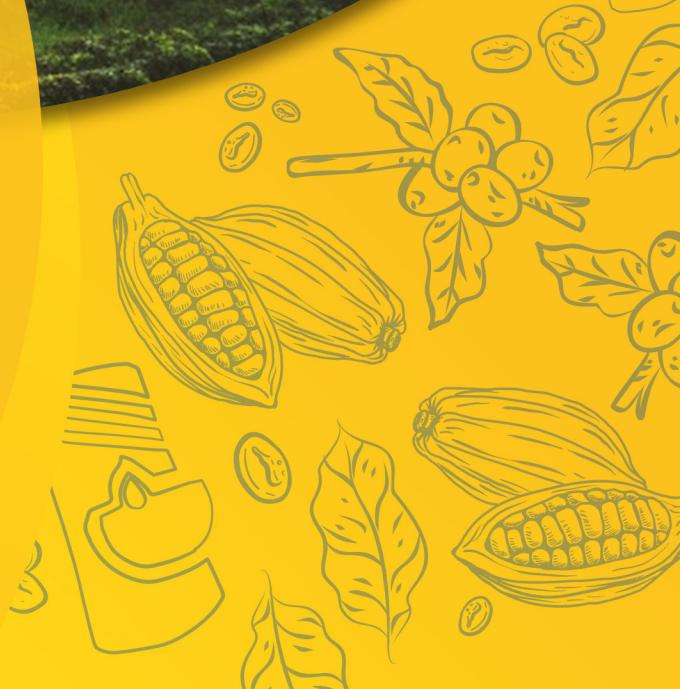

**Published by**PT Koltiva**Authors**Meg PhillipsAndre Dani MawardhiRahmad NandaDanella Austraningsih**Reviewer**Theresa Sila WikaningtyasAnna RotherFranzika RauSander HappaertsEloise O'Caroll**Layout and Design**Tammi SuryaniJakarta, 2025**DISCLAIMER***This publication is jointly funded by the European Union and German Federal Ministry for Economic Cooperation and Development (BMZ) and conducted by Koltiva. The content of this publication is Koltiva's sole responsibility and does not necessarily reflect the views of the EU or BMZ. The information in this study, or on which this research is based, has been obtained from sources that the authors believe are reliable and accurate.*

*This document has been developed based on the analysis of a variety of relevant sources, including but not limited to the legal text on the EUDR, EUDR Guidance, EUDR FAQ, as well as the results of previously conducted focus group discussions (FGDs) and other events organized by the EUDR Engagement project and other stakeholders EU-funded projects (e.g., KAMI, SAFE). It also refers to other knowledge products that are publicly available and relevant. This document reflects the most current information at the time of writing, which does not yet include the European Commission's proposal of 21 October 2025 for targeted simplification measures, which are being negotiated between the European Parliament and the Council of the European Union.*

*The purpose of this document is to provide stakeholders with practical steps to prepare for EU Deforestation Regulation (EUDR) implementation. It is intended to be a one-time resource and does not include provisions for future updates.*

# Table of Content

## Introduction

**03**

| Purpose of the Practical Guide _____ | 03 |
|--------------------------------------|----|
| How to Use _____                     | 03 |

## Understanding EUDR and Its Impact on Farmers

**05**

| What is the EUDR? _____                                        | 07 |
|----------------------------------------------------------------|----|
| EUDR Key Definition _____                                      | 07 |
| Why EUDR Matters for Smallholders Farmers _____                | 07 |
| Benefits of compliance _____                                   | 08 |
| What Buyers Need to Know About Your Farm (EUDR Criteria) _____ | 08 |

## Step-by-Step Guide to EUDR Compliance for Farmers

**09**

| 01. Deforestation-free production _____ | 11 |
|-----------------------------------------|----|
| 02. Traceability _____                  | 13 |
| 03. Legal production _____              | 15 |

## Accessing Technical Support & Financial Assistance

**23**

| Where to Get Support? _____       | 25 |
|-----------------------------------|----|
| Funding & Training Programs _____ | 26 |
| Work with Buyers _____            | 26 |
| Join a Cooperative _____          | 27 |
| Farm Certification Programs _____ | 28 |

## Ongoing Monitoring & Compliance Verification

**29**

| Regular Self-Monitoring Form Template _____ | 31 |
|---------------------------------------------|----|
| How to Use This Self-Monitoring Form _____  | 32 |
| Example of Scoring and Follow-Up _____      | 32 |

## Glossary

**33**

## Annex

**35**

# Introduction

## Purpose of the Practical Guide

This Practical Guide is here to help you understand and get ready for the European Union Regulation on Deforestation-free Products (EUDR).

The EUDR is designed to cut down the global impact of deforestation linked to key commodities, many of which are produced by smallholders like you. Meeting these requirements is essential to ensure deforestation-free production. It can also open new doors for your deforestation-free products and help you boost productivity through more sustainable practices.

By working through this guide, you will learn exactly what the EUDR requires, how to prepare, and where to and support. The aim is simple: to help you succeed in a market that values legality, sustainability, and traceability.

## How to Use the Practical Guide

This guide is your step-by-step companion to meeting the EUDR requirements. You will move through each section in order, building your knowledge as you go, from mapping your farm boundaries to keeping proper records and making sure your products can be traced.

Along the way, you will find practical tips and real-life examples from other farmers. Use them as inspiration to adapt the recommendations to your own farm. The goal is to break preparatory steps for EUDR application into simple, manageable actions that boost your productivity, improve traceability, and keep your farm sustainable.

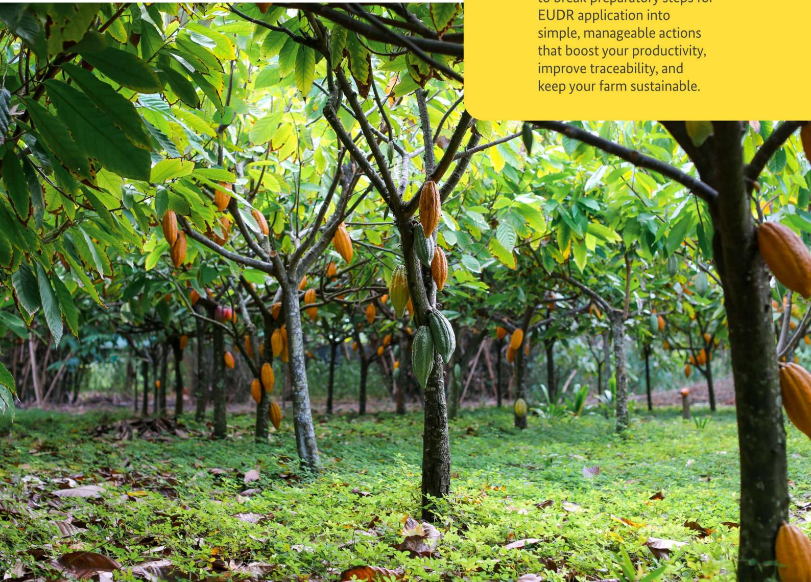

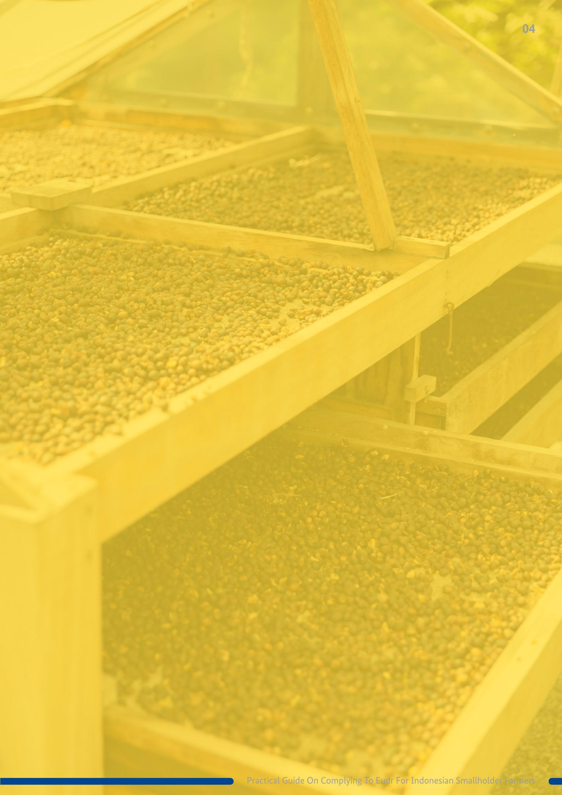

---

## What is the EUDR?

---

### EUDR Key Definition

---

### Why EUDR Matters for Smallholders Farmers

---

### Benefits of compliance

---

### What Buyers Need to Know About Your Farm

---

## What is the EUDR?

The EUDR is an EU regulation aimed at helping to minimize deforestation worldwide. It ensures that products entering the EU, i.e. coffee, cocoa, palm oil, rubber, soy, cattle and timber are produced in a manner that does not harm forests. The goal is to support sustainable farming, protect the environment, and make supply chains more transparent, allowing people to trace the origin of products and their production process.

This regulation officially came into force on 29 June 2023 and is set to become fully applicable from 30 December 2025 (or 30 June 2026 for Small and Medium Enterprises/ SMEs).

## EUDR Key Definition

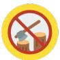

### 01. Deforestation-free

Products must not come from land that was cleared of forests after December 31, 2020.

### 02. Operator

Any person or company who sells products to the EU market or exports them.

### 03. Legality

The product must be produced in line with the laws of the country where it was grown.

### 04. Sustainability

Farming methods must care for the environment and protect natural resources for the future.

### 05. Polygon

Digital boundary of a farm or plot of land, usually represented as a geospatial file.

## Why EUDR Matters for Smallholders Farmers

The EUDR brings new opportunities for smallholder farmers in Indonesia who grow palm oil, rubber, coffee, soy, timber, cattle, and cocoa.

Buyers now look for proof that these products come from legal and deforestation-free farms. You can build stronger trust with buyers, open doors to new markets, increase your reputation, increase your unique selling proposition, enhance the resilience for your community, and benefit from new market options.

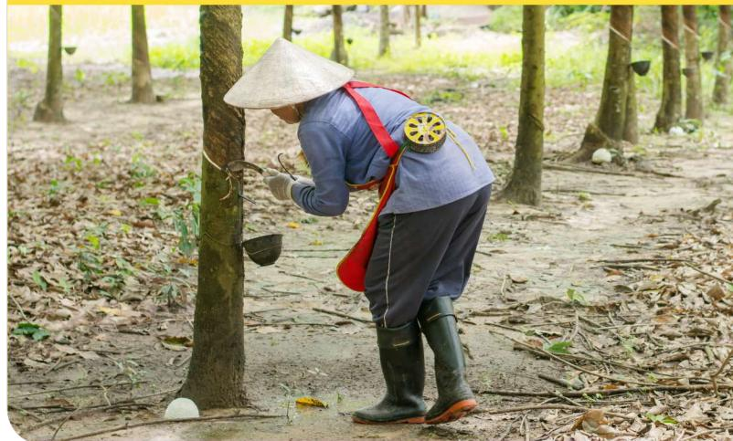

## Benefits of compliance

EUDR compliance brings some opportunities. When you follow the regulations, you can access the EU markets that favor sustainable products and may receive support programs and training to Improve farming practices on their farms. EUDR compliance also offers further benefits, namely fairer prices, substantiated concerns addressed, stronger and independent position in value chain. EUDR is interesting for farmers who are not yet certified. Ultimately, aligning with EUDR can help you build sustainable livelihoods while protecting Indonesia's forests.

If you cannot meet the EUDR rules, you may lose access to the EU markets, which could reduce your income.

## What Buyers Need to Know About Your Farm (EUDR Criteria)

### Legality

You may be asked to show that your land use complies with Indonesian laws. This can include having appropriate land ownership or land use documentation, and ensuring farming practices follow national regulations related to:

EUDR also expects that land used to grow crops deforested (or degraded in the case of wood) after 31 December 2020. You are encouraged to avoid clearing new forest areas and keep supporting evidence such as photos, satellite images, or letters from village leaders, showing that the land was already used before that date.

### Traceability

To meet EUDR-related expectation, your buyers may asked you to provide geolocation data of plots of production, i.e. geolocation point for plots <4 ha or polygon for plots >4ha. This geolocation data may also be collected from STDB (Surat Tanda Daftar Budidaya) mapping process.

This information helps buyers demonstrate that the product comes from land that is deforestation-free and legally managed.

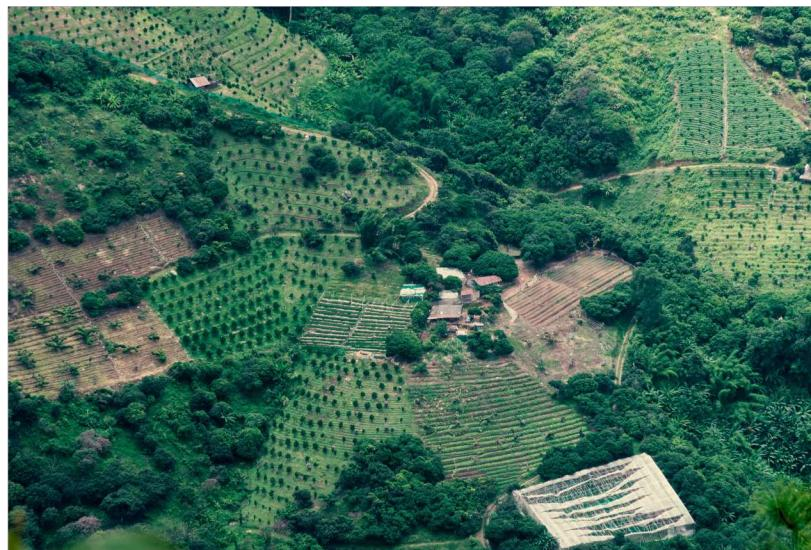

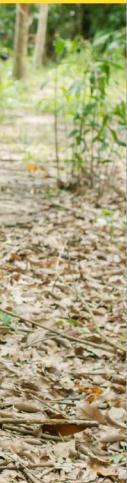

---

Deforestation-free production

---

Traceability

---

Legal production

---

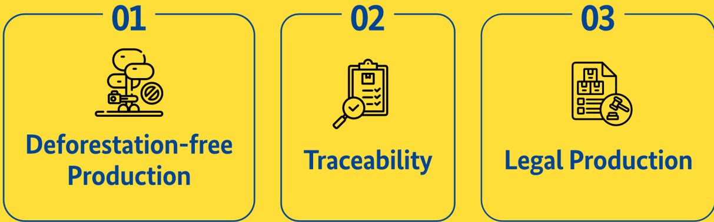

**01. Deforestation-Free Production**

Agricultural plantation’ means land with tree stands in agricultural production systems, such as fruit tree plantations, oil palm plantations.

Agroforestry systems where crops are grown under tree cover; it includes all plantations of relevant commodities other than wood, including agrisilvicultural, silvopastoral and agrosilvopastoral systems.

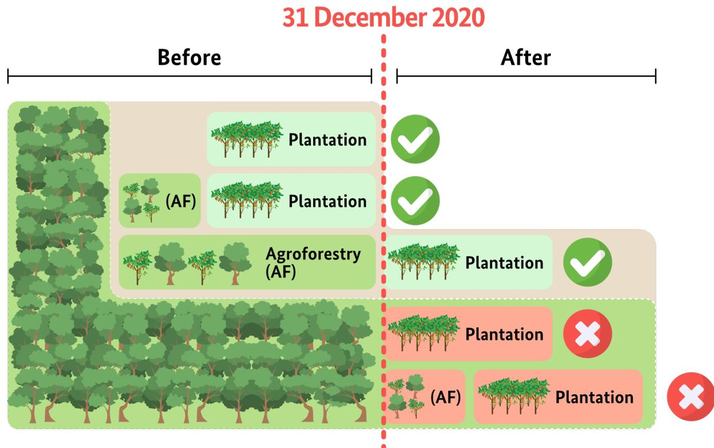

Deforestation means the conversion of forest to agricultural use, whether human-induced or not.

The EUDR requires that no relevant product (such as from rubber, coffee, cocoa, and palm oil) is produced on land that was deforested after 31 December 2020.

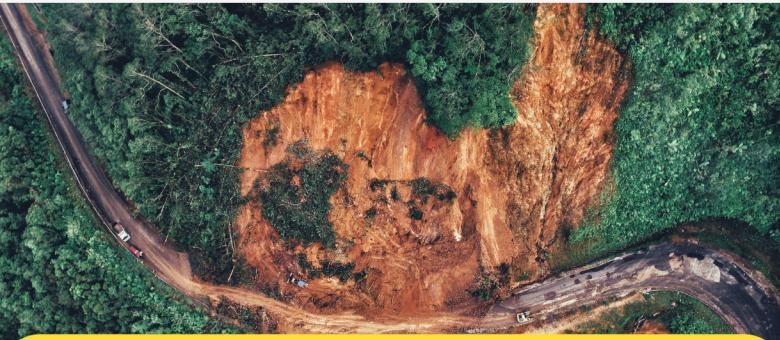

Land clearing for establish or expand the farm

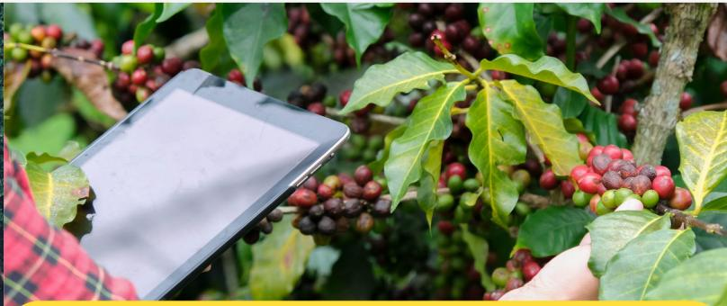

Limited access to sustainable farming methods or land intensification technologies

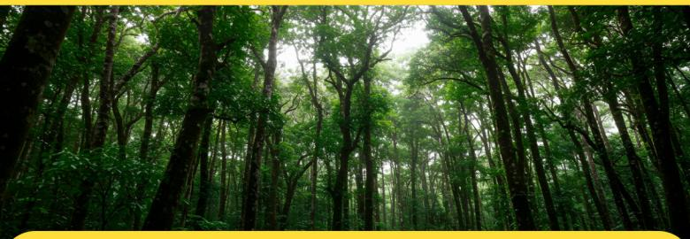

Lack of awareness about protected forest zones or local land-use regulations

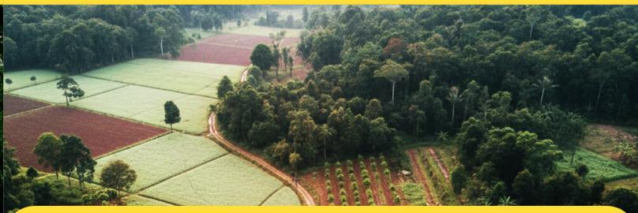

Unclear land boundaries that overlap with forest areas

**What farmer can do to prevent the deforestation?**

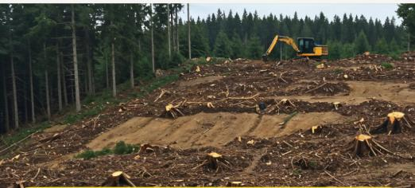

**Avoid Illegal Clearing:** If you need more production, improve yields on existing land rather than expanding into protected or forested areas

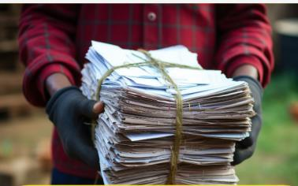

**Keep Evidence:** Save copies of your land documents, maps, and photos of your farm to demonstrate that your land was cleared before 31 December 2020.

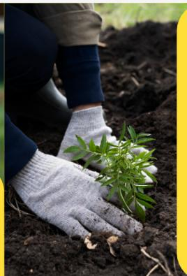

**Check Your Location:** Find out if your farm is located near forest reserves, conservation areas, or biodiversity hotspots. Seek local government or cooperative support if unsure.

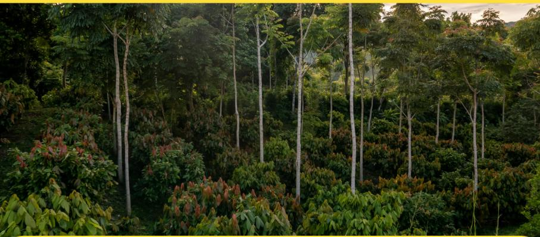

**Agroforestry System:** The application of land use that combines forestry crops (trees) with agricultural crops (food) and/or livestock simultaneously or alternately in one land management unit. The aim is to achieve better ecological, economic and social benefits, and increase land productivity in a sustainable manner.

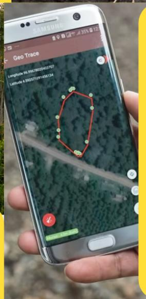

**Map Your Plot:** Use basic mapping (GPS points or village surveys) so boundaries are clear and do not overlap with protected areas.

## 02. Traceability

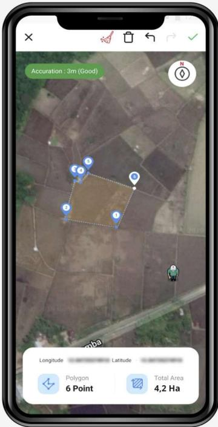

Farm data recording and documentation help farmers record basic information about their farms and activities to support traceability and legal compliance.

### How to Record Farm Location

- 1 Use a GPS App on your smartphone.
- 2 Stand at the center or corner of your plot, open the app, and save the GPS point.
- 3 Write down or screenshot the coordinates and attach them to your farm record.
- 4 For farms >4 ha, walk the edges to create a polygon map using tools like or with the help of an extension worker, field staff, or development partner.

### Keeping Transaction Records

#### Required:

Sales and transaction records (buyer, quantity, price, date), harvest dates and quantity, crop type and planting year.

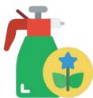

#### Good to have but not mandatory for EUDR:

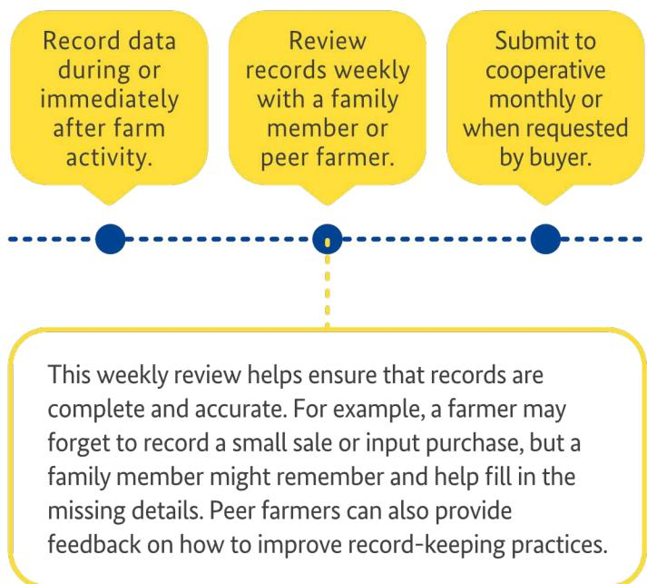

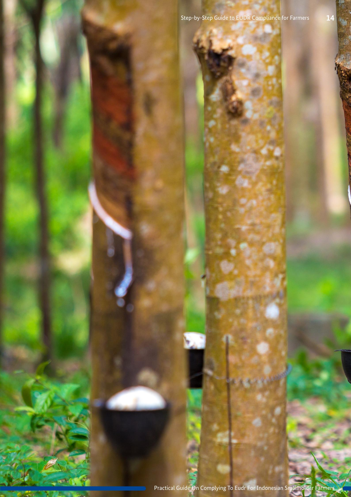

### 03. Legal Production

Land legality is important for compliance with EUDR regulations. Land legality is a legal status that shows that the use and ownership of the land is in accordance with applicable regulations.

Having land legality meaning that you have the right to produce the commodities on the plot of production and also to prevent land grabbing.

There are many types of land legality circulating in Indonesia, here is a brief explanation of the types of land legality types

#### Where is your farm located, and what land documents are required?

| Location                               | Document Type                                                                                                                                                                                      |
|----------------------------------------|----------------------------------------------------------------------------------------------------------------------------------------------------------------------------------------------------|
| Other Usage Area                       | <ul> <li>Sertifikat Hak Milik (SHM)</li> <li>Surat Keterangan Tanah (SKT)</li> <li>Letter C</li> <li>Girik</li> <li>Akta Jual Beli (AJB)</li> </ul>                                                |
| State Forest Areas/ Conversion Forests | <ul> <li>Izin Perhutanan Sosial</li> <li>Izin Pinjam Pakai Kawasan Hutan (IPPKH)</li> <li>Partnership Agreement / Memorandum of Cooperation</li> <li>Tanah Objek Reforma Agraria (TORA)</li> </ul> |
| Production Forest                      | <ul> <li>Perizinan Berusaha Pemanfaatan Hutan (PBPH)</li> <li>Nota Kesapahaman / Nota Kesepakatan Kerjasama</li> </ul>                                                                             |

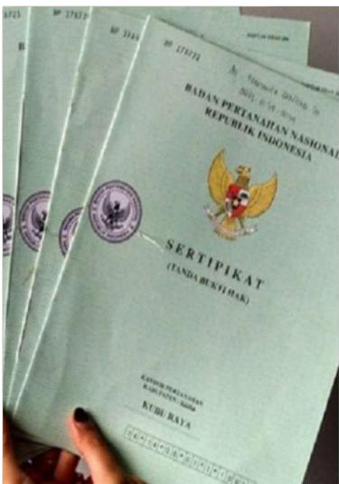

**Sertifikat Hak Milik (SHM)**

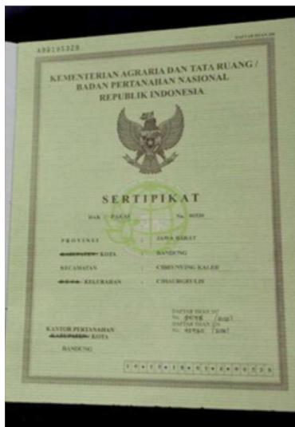

**Hak Pakai (HP)**

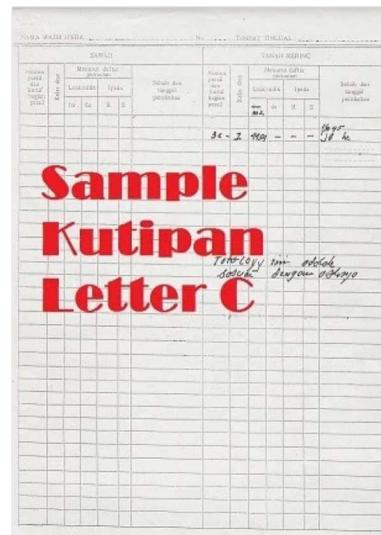

**Letter C**

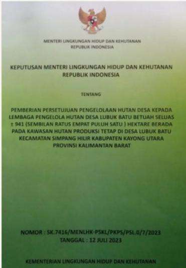

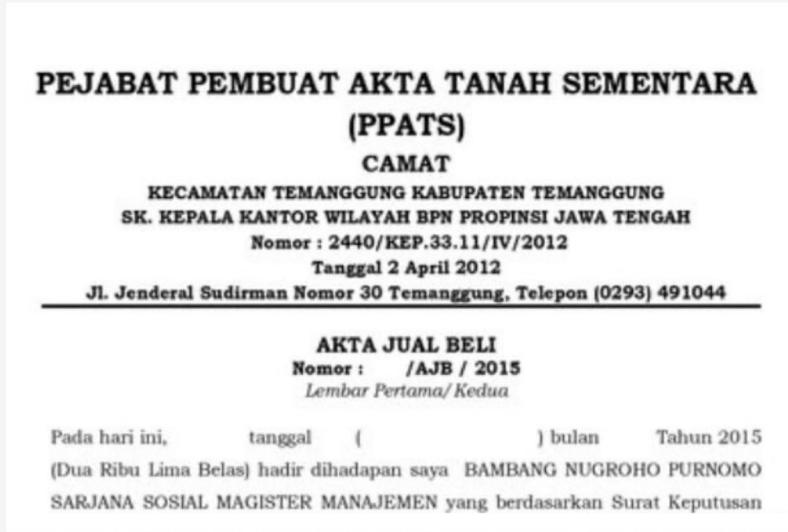

**SK Hutan Sosial**

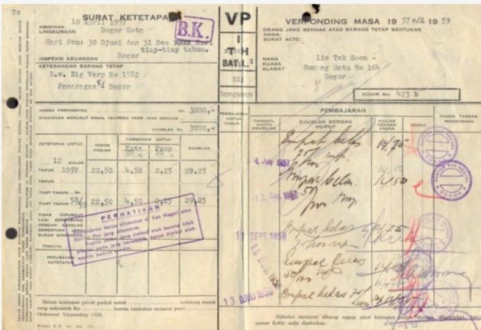

**Akta Jual Beli (AJB)**

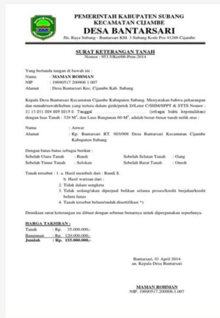

**Girik**

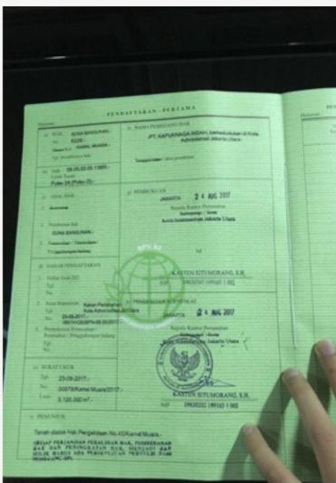

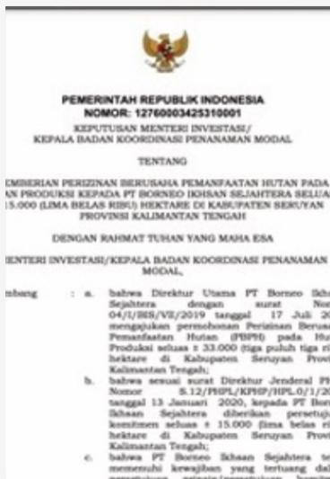

**Surat Keterangan Tanah (SKT)**

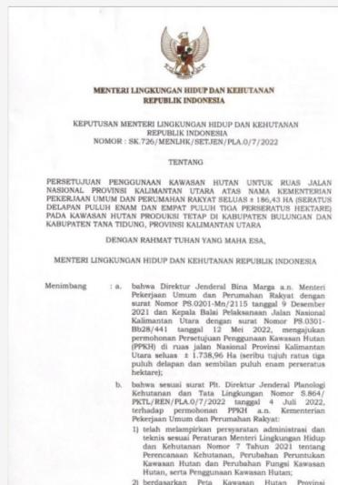

**SK Pemegang Perizinan Berusaha Pemanfaatan Hutan (PBPH)**

**SK Persetujuan Penggunaan Kawasan Hutan (PPKH)**

**Process to Obtain SHM**

The following are the process that need to be taken in making an application for a land certificate (granting individual land rights).

**01 Prepare Documents**

Fill out the application form and signed by the applicant or proxy on stamp duty.

Power of attorney (if authorized).

Photocopy of the identity of the applicant/ holder and recipient of the right (KTP, KK) and power of attorney if authorized.

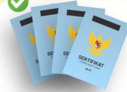

Original evidence of land acquisition/ Right Title.

Original letter of evidence of relinquishment of rights and repayment of land.

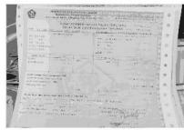

Copy of SPPT PBB for the current year.

Proof of payment of entry fee (at the time of registration of rights).

**02 Visiting the Agraria Office**

Please come to the BPN office according to the area where the land is located.

Buy the registration form at the BPN office, then you will get a blue and yellow folder.

Make an appointment with the officer for land measurement.

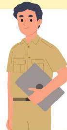

**03 Issuance of Freehold Land Certificates**

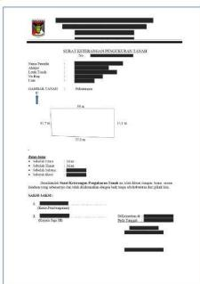

You will get a Land Measurement Letter, after the land measurement.

**SURAT SETORAN**  
BEA PEROLEHAN HAK ATAS TANAH DAN BANGUNAN (SSB)

**SETORAN SETORAN DAN TANAH DAN BANGUNAN (SSB)**  
PAKE BIND DAN BANGUNAN (SOOT PBB)

**KENTOPELI ATASAN PALAK PELATAN:**  
 1. Nama Hidap Pajah  
 2. Setoran  
 3. Atasan Hidap Pajah  
 4. Adalah officer  
 5. Adalah officer  
 6. Kelapatan officer  
 7. Kelapatan officer  
 8. Kelapatan officer  
 9. Kelapatan officer  
 10. Kelapatan officer  
 11. Kelapatan officer  
 12. Kelapatan officer  
 13. Kelapatan officer  
 14. Kelapatan officer  
 15. Kelapatan officer  
 16. Kelapatan officer  
 17. Kelapatan officer  
 18. Kelapatan officer  
 19. Kelapatan officer  
 20. Kelapatan officer  
 21. Kelapatan officer  
 22. Kelapatan officer  
 23. Kelapatan officer  
 24. Kelapatan officer  
 25. Kelapatan officer  
 26. Kelapatan officer  
 27. Kelapatan officer  
 28. Kelapatan officer  
 29. Kelapatan officer  
 30. Kelapatan officer  
 31. Kelapatan officer  
 32. Kelapatan officer  
 33. Kelapatan officer  
 34. Kelapatan officer  
 35. Kelapatan officer  
 36. Kelapatan officer  
 37. Kelapatan officer  
 38. Kelapatan officer  
 39. Kelapatan officer  
 40. Kelapatan officer  
 41. Kelapatan officer  
 42. Kelapatan officer  
 43. Kelapatan officer  
 44. Kelapatan officer  
 45. Kelapatan officer  
 46. Kelapatan officer  
 47. Kelapatan officer  
 48. Kelapatan officer  
 49. Kelapatan officer  
 50. Kelapatan officer  
 51. Kelapatan officer  
 52. Kelapatan officer  
 53. Kelapatan officer  
 54. Kelapatan officer  
 55. Kelapatan officer  
 56. Kelapatan officer  
 57. Kelapatan officer  
 58. Kelapatan officer  
 59. Kelapatan officer  
 60. Kelapatan officer  
 61. Kelapatan officer  
 62. Kelapatan officer  
 63. Kelapatan officer  
 64. Kelapatan officer  
 65. Kelapatan officer  
 66. Kelapatan officer  
 67. Kelapatan officer  
 68. Kelapatan officer  
 69. Kelapatan officer  
 70. Kelapatan officer  
 71. Kelapatan officer  
 72. Kelapatan officer  
 73. Kelapatan officer  
 74. Kelapatan officer  
 75. Kelapatan officer  
 76. Kelapatan officer  
 77. Kelapatan officer  
 78. Kelapatan officer  
 79. Kelapatan officer  
 80. Kelapatan officer  
 81. Kelapatan officer  
 82. Kelapatan officer  
 83. Kelapatan officer  
 84. Kelapatan officer  
 85. Kelapatan officer  
 86. Kelapatan officer  
 87. Kelapatan officer  
 88. Kelapatan officer  
 89. Kelapatan officer  
 90. Kelapatan officer  
 91. Kelapatan officer  
 92. Kelapatan officer  
 93. Kelapatan officer  
 94. Kelapatan officer  
 95. Kelapatan officer  
 96. Kelapatan officer  
 97. Kelapatan officer  
 98. Kelapatan officer  
 99. Kelapatan officer  
 100. Kelapatan officer  
 101. Kelapatan officer  
 102. Kelapatan officer  
 103. Kelapatan officer  
 104. Kelapatan officer  
 105. Kelapatan officer  
 106. Kelapatan officer  
 107. Kelapatan officer  
 108. Kelapatan officer  
 109. Kelapatan officer  
 110. Kelapatan officer  
 111. Kelapatan officer  
 112. Kelapatan officer  
 113. Kelapatan officer  
 114. Kelapatan officer  
 115. Kelapatan officer  
 116. Kelapatan officer  
 117. Kelapatan officer  
 118. Kelapatan officer  
 119. Kelapatan officer  
 120. Kelapatan officer  
 121. Kelapatan officer  
 122. Kelapatan officer  
 123. Kelapatan officer  
 124. Kelapatan officer  
 125. Kelapatan officer  
 126. Kelapatan officer  
 127. Kelapatan officer  
 128. Kelapatan officer  
 129. Kelapatan officer  
 130. Kelapatan officer  
 131. Kelapatan officer  
 132. Kelapatan officer  
 133. Kelapatan officer  
 134. Kelapatan officer  
 135. Kelapatan officer  
 136. Kelapatan officer  
 137. Kelapatan officer  
 138. Kelapatan officer  
 139. Kelapatan officer  
 140. Kelapatan officer  
 141. Kelapatan officer  
 142. Kelapatan officer  
 143. Kelapatan officer  
 144. Kelapatan officer  
 145. Kelapatan officer  
 146. Kelapatan officer  
 147. Kelapatan officer  
 148. Kelapatan officer  
 149. Kelapatan officer  
 150. Kelapatan officer  
 151. Kelapatan officer  
 152. Kelapatan officer  
 153. Kelapatan officer  
 154. Kelapatan officer  
 155. Kelapatan officer  
 156. Kelapatan officer  
 157. Kelapatan officer  
 158. Kelapatan officer  
 159. Kelapatan officer  
 160. Kelapatan officer  
 161. Kelapatan officer  
 162. Kelapatan officer  
 163. Kelapatan officer  
 164. Kelapatan officer  
 165. Kelapatan officer  
 166. Kelapatan officer  
 167. Kelapatan officer  
 168. Kelapatan officer  
 169. Kelapatan officer  
 170. Kelapatan officer  
 171. Kelapatan officer  
 172. Kelapatan officer  
 173. Kelapatan officer  
 174. Kelapatan officer  
 175. Kelapatan officer  
 176. Kelapatan officer  
 177. Kelapatan officer  
 178. Kelapatan officer  
 179. Kelapatan officer  
 180. Kelapatan officer  
 181. Kelapatan officer  
 182. Kelapatan officer  
 183. Kelapatan officer  
 184. Kelapatan officer  
 185. Kelapatan officer  
 186. Kelapatan officer  
 187. Kelapatan officer  
 188. Kelapatan officer  
 189. Kelapatan officer  
 190. Kelapatan officer  
 191. Kelapatan officer  
 192. Kelapatan officer  
 193. Kelapatan officer  
 194. Kelapatan officer  
 195. Kelapatan officer  
 196. Kelapatan officer  
 197. Kelapatan officer  
 198. Kelapatan officer  
 199. Kelapatan officer  
 200. Kelapatan officer  
 201. Kelapatan officer  
 202. Kelapatan officer  
 203. Kelapatan officer  
 204. Kelapatan officer  
 205. Kelapatan officer  
 206. Kelapatan officer  
 207. Kelapatan officer  
 208. Kelapatan officer  
 209. Kelapatan officer  
 210. Kelapatan officer  
 211. Kelapatan officer  
 212. Kelapatan officer  
 213. Kelapatan officer  
 214. Kelapatan officer  
 215. Kelapatan officer  
 216. Kelapatan officer  
 217. Kelapatan officer  
 218. Kelapatan officer  
 219. Kelapatan officer  
 220. Kelapatan officer  
 221. Kelapatan officer  
 222. Kelapatan officer  
 223. Kelapatan officer  
 224. Kelapatan officer  
 225. Kelapatan officer  
 226. Kelapatan officer  
 227. Kelapatan officer  
 228. Kelapatan officer  
 229. Kelapatan officer  
 230. Kelapatan officer  
 231. Kelapatan officer  
 232. Kelapatan officer  
 233. Kelapatan officer  
 234. Kelapatan officer  
 235. Kelapatan officer  
 236. Kelapatan officer  
 237. Kelapatan officer  
 238. Kelapatan officer  
 239. Kelapatan officer  
 240. Kelapatan officer  
 241. Kelapatan officer  
 243. Kelapatan officer  
 244. Kelapatan officer  
 245. Kelapatan officer  
 246. Kelapatan officer  
 247. Kelapatan officer  
 248. Kelapatan officer  
 249. Kelapatan officer  
 250. Kelapatan officer  
 251. Kelapatan officer  
 252. Kelapatan officer  
 253. Kelapatan officer  
 254. Kelapatan officer  
 255. Kelapatan officer  
 256. Kelapatan officer  
 257. Kelapatan officer  
 258. Kelapatan officer  
 259. Kelapatan officer  
 260. Kelapatan officer  
 261. Kelapatan officer  
 262. Kelapatan officer  
 263. Kelapatan officer  
 264. Kelapatan officer  
 265. Kelapatan of

## Process to obtain SK Izin Perhutanan Sosial

Based on the Regulation of the Director General of Social Forestry and Environmental Partnerships Number: P.15/PSKL/SET/PSL.0/11/2016 concerning Online Services for Social Forestry, the process of obtaining a Social Forestry Decree (SK Perhutanan Sosial) is as follows:

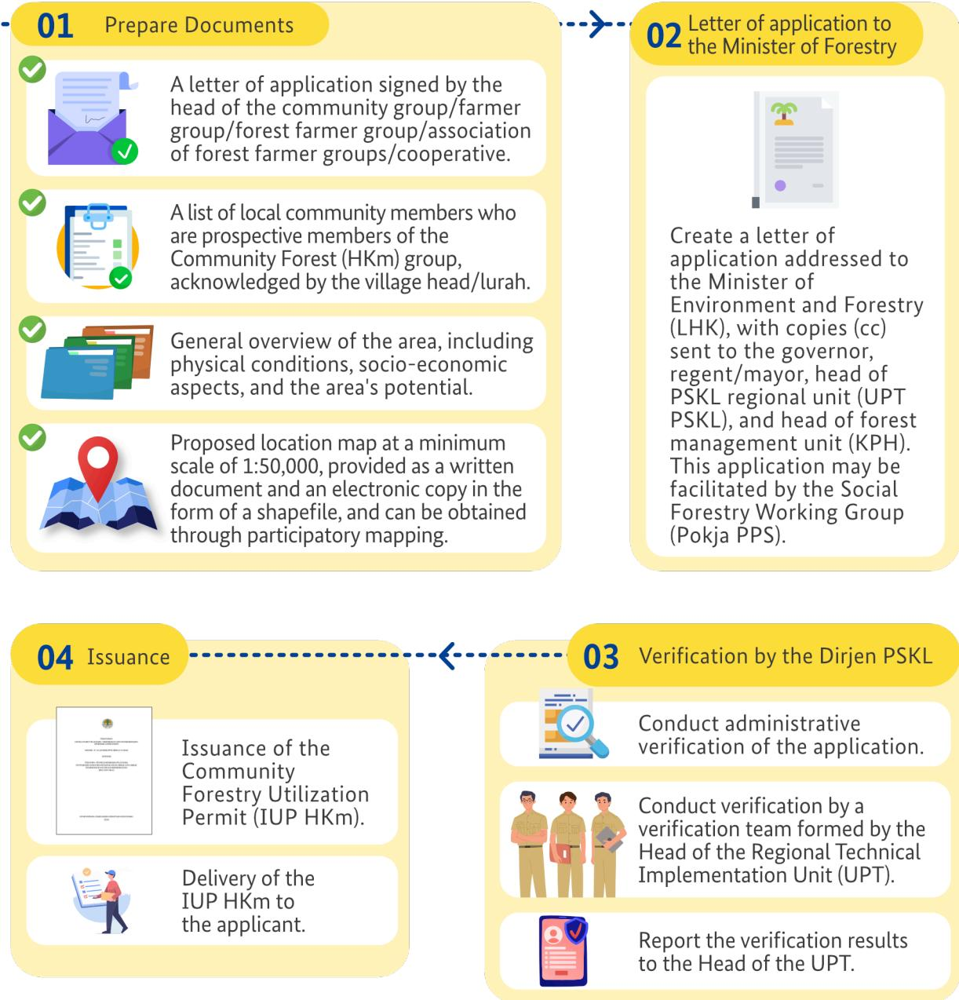

## Farm Registration on e-STDB

STDB (Cultivation Registration Certificate) is a cultivation statement issued to farmers by the Regent and/or Mayor

e-STDB is the electronic system of the Cultivation Registration Certificate (STDB).

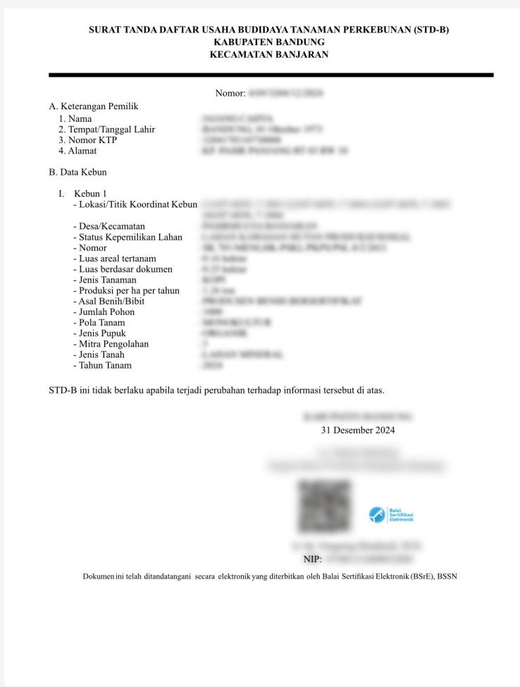

The electronic system integrates a national database of smallholder (independent) farmers across Indonesia.

This system enables the government and stakeholders to easily monitor farmers who are officially registered in plantation cultivation activities.

The issuance of the STDB is not categorized as a legal document. but relevant as part of documentation under EUDR for smallholder ownership of plantations.

Farmers criteria: Farmers who own and/or manage less than 25 (twenty-five) hectares of land.

## Benefit of STDB to Farmers

- Proof of active farmer participation in legitimate cultivation activities
- Improved access to commodity supply chains
- Enhanced credibility and bargaining position within the agricultural value chain
- Qualification standard to receive financial and technical support from both government and private sectors

## 01 SOCIALIZATION

- • The e-STDB dissemination is carried out by the government, companies, and/or development partners to agricultural extension workers, plantation facilitators, village officials, farmer group leaders, farmer group association leaders, and representatives from plantations that have plasma or supported farms.
- • Dissemination can be conducted through workshops, meetings, focus group discussions (FGDs), leaflets, or banners.

## 02 DATA COLLECTION

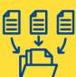

- • The district/city data collection team gathers information on farmers and their farms through direct census or by collecting data from farmer groups/Forest Management Units (KPH) or the Directorate of Social Forestry and Environmental Partnership (BPSKL) prior to the census.
- • The team uploads all collected farmer and farm data into the e-STDB system

## 03 MAPPING

- • The district/city mapping team clearly maps farmers' plantations, identifying land boundaries using GPS or other mapping tools.
- • The mapping team ensures that the plantation plots align with spatial planning regulations and forest boundaries.
- • The team uploads all collected plot maps into the e-STDB system.
- • This geolocation data from STDB mapping is useful for EUDR traceability requirement.

## 04 VERIFICATION

- • The verification team formed by the district/city government checks the farmer, plantation, and map data that has been uploaded to the e-STDB system.
- • Verification is also conducted through overlay analysis between the plantation location map and the forest area/concession (HGU) maps.
- • For commodities located within forest areas, the verification team also checks the documentation of land access rights for farmers in forest zones.
- • If necessary, the verification team may conduct field visits and meet farmers directly to validate the data and maps (on-site method).
- • Verification can also be conducted independently on the e-STDB platform, which has integrated forest area maps and HGU maps (on-desk method).

## 05 ISSUANCE

- • Farmer data and farm maps that have been verified as clean and clear (CnC) are then processed for the issuance of the STDB through electronic signing by the regent/mayor.
- • The issuance may be delegated to the head of the agency responsible for plantation affairs at the district/city level.

## Environmental License

One aspect of environmental protection is evidenced by having environmental documents, such as SPPL, UKL-UPL, AMDAL.

While environmental licenses such as **SPPL are not explicitly required under the EUDR**, they play an important supporting role in demonstrating compliance with national environmental laws.

Having an SPPL helps verify that the you is aware of and committed to managing environmental impacts responsibly. It also strengthens the credibility of the farm's operations in the eyes of buyers conducting due diligence, especially when combined with traceability and land legality documentation

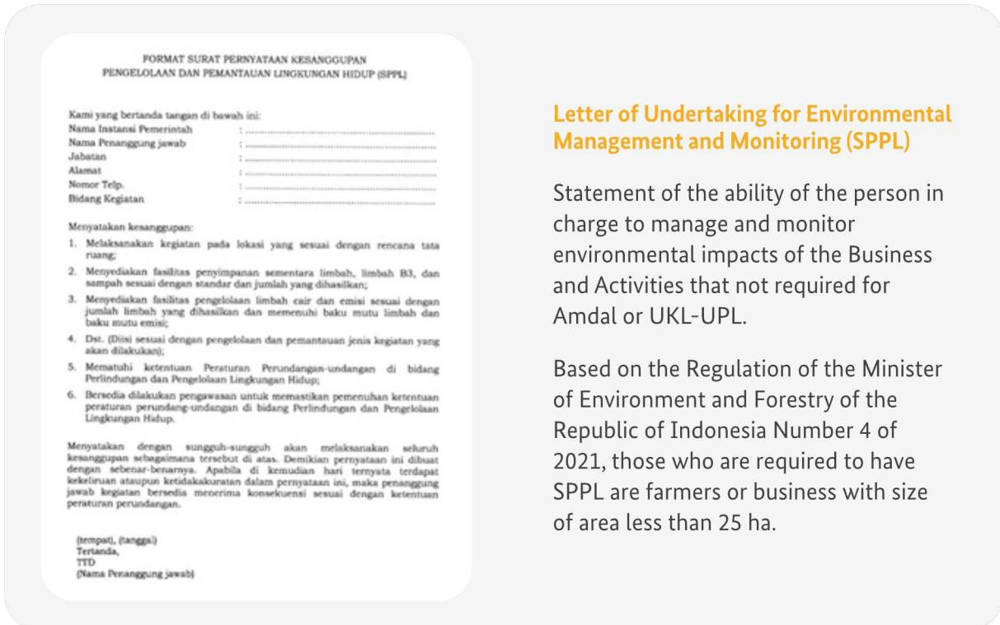

The following are the things that need to be prepared in making SPPL for farmers are as follows:

1. 1 Draft SPPL in accordance with the provisions of Permen LHK 26/2018.
2. 2 Copy of ID card of the owner or person in charge of the business and/or activity.
3. 3 A photo of the Owner or Person in charge of the business and/or activity.
4. 4 Copy of business establishment letter or deed.
5. 5 Copy of Business Identification Number (NIB).

1. 6 Copy of land status / land legality.
2. 7 Letter of agreement from the landowner if using land owned by another party.
3. 8 Copy of local draft SKRK (City Plan Certificate).
4. 9 A statement of validity and correctness of the attached documents with a stamp duty.
5. 10 Detailed site plan drawing (layout or site plan).
6. 11 Other supporting documents according to local government policy.

Application for SPPL can be done offline or online, here is a brief flow of SPPL application.

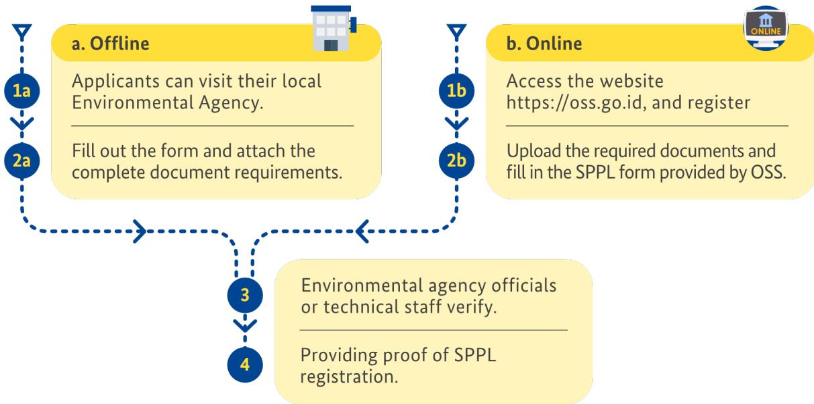

## Fair Farming Practices

Fair farming practices protect workers and meet labor laws to support ethical and legal production

### Prohibit Hazardous Child Labor

Do not allow children under 18 to handle sharp tools, heavy loads, or chemicals.

Children may help with light tasks under supervision.

### Ensure Fair Wages and Work Conditions

Assign only light, non-hazardous tasks to pregnant women (e.g., no heavy lifting or pesticide use).

Ensure workers are treated fairly, without discrimination, and can request adjustments if needed.

### Community Grievance Mechanisms

Create a trusted contact person or grievance box in the village or cooperative.

### Provide Protective Equipment and Training

Provide gloves, boots, masks, or protective clothing for pesticide use.

---

Where to Get Support?

---

Funding & Training Programs

---

Work with Buyers

---

Join a Cooperative

---

Farm Certification Programs

---

To meet EUDR requirements and improve farm practices, smallholders need access to the right support.

## Where to Get Support?

### Cooperatives or farmer groups

Provide collective training, organize data collection and farm mapping, and facilitate group certification or traceability systems.

### Local agriculture offices

Offer technical assistance, legal guidance on land documentation, and access to government support schemes for compliance.

### Private buyers with sustainability programs

Supply funding or in-kind resources for traceability tools, conduct capacity-building, and create market incentives.

### NGO programs

Deliver training, advisory services, and grants or project-based support to build farmers' capacity.

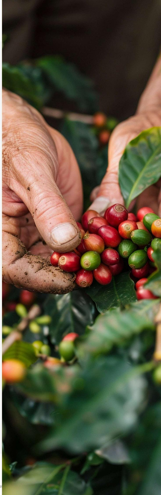

## Funding & Training Programs

- **Kredit Usaha Rakyat (KUR) - Microcredit for Small Businesses program:** Gives low-interest credit for by smallholders to buy agri input to increase yield.
- **Badan Layanan Umum (BLU) - Public Service Agency funds:** Provides funds to smallholders for infrastructure & inputs, and human capacity/training.
- **NGO/CSR programs:** Provide digital traceability tools (farm mapping), training, partial payments and incentives.

## Work with Buyers

### a. Ask buyers what records are needed for EUDR

Some usually required data or documents are:

- Farm location (GPS points for farm <4 ha or polygon coordinates for farm >4 ha)
- Land ownership or legal documents (e.g. SHM, SK Perhutanan Sosial, STDB)
- Crop type and planting year
- Harvest dates and quantity
- Sales and transaction records (buyer, quantity, price, date)

Some data and documents are usually helpful to prepare for buyers:

- Environmental license
- Photos of farm activities or fields
- Certification documents
- Input use (fertilizer, pesticides)

### b. Request training or tools

You can request training or tools from buyers, such as smartphone apps or GPS devices for plot mapping. You should retain control over their own data.

### c. Negotiate support in exchange for higher-quality supply

You can use your improved practices, accurate records, or higher-quality products as a basis to ask buyers for additional support, such as training, tools, or technical advice.

### Join a Cooperative

**a. Ask village leader or extension officer which cooperatives are active.** They can advise which cooperatives are trusted, have experience supporting smallholders, and are involved in relevant supply chains.

---

**b. Fill in registration form.** To join a cooperative, you usually need to complete a registration form and provide basic documents such as your ID (KTP) and land information or farm registration records. Some cooperatives may also ask for proof of participation in government programs like STDB.

---

**c. Attend regular meetings and trainings.** Attending regular meetings and training sessions helps you stay updated for about good farming practices, market requirements, and EUDR compliance, learn from peers, and improve your farm management.

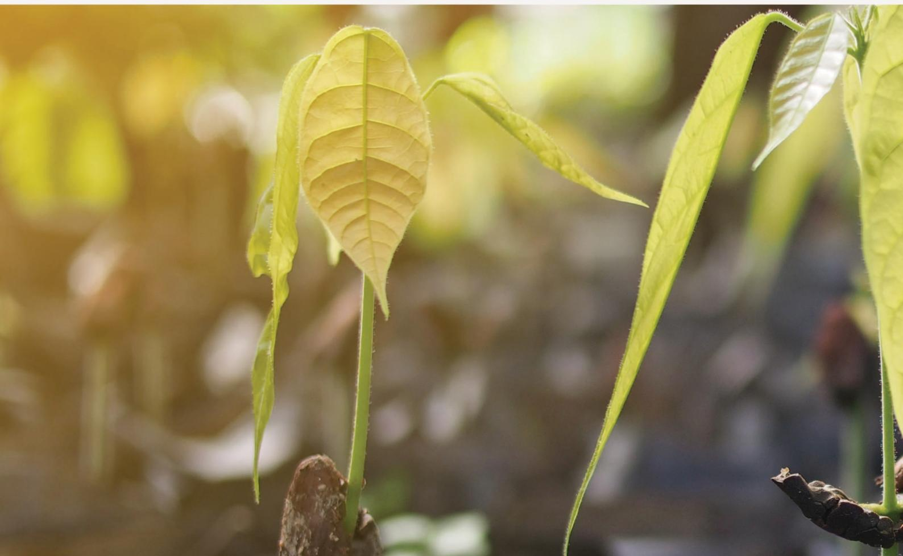

## Farm Certification Programs

While certification programs (e.g. Rainforest Alliance) under the EUDR do not automatically guarantee compliance, they can be valuable tools for smallholders, by:

- Helping farmers collect and organize important information, such as farm geolocation, land legality documents, and production practices, which are required for EUDR compliance.
- Providing templates, training, and verification systems that support traceability and legal verification.

Certification alone does not replace the buyer's due diligence, so farmers must ensure that all data is complete and accurate.

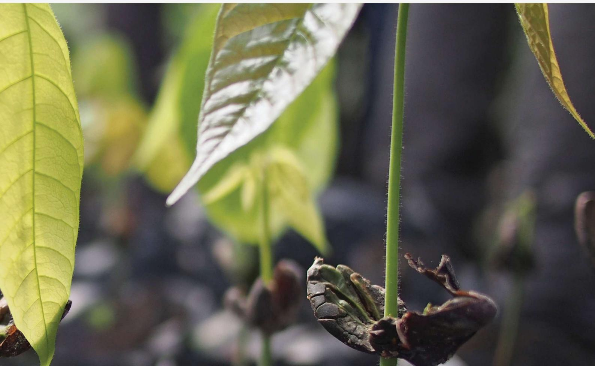

# Ongoing Monitoring & Compliance Verification

---

## Regular Self-Monitoring Form Template

---

## How to Use This Self-Monitoring Form

---

## Example of Scoring and Follow-Up

---

EUDR alignment is a continuous process, it requires regular updates (if there is change on commodities, cultivation area, and legality) and collaboration. Farmers should maintain organized records to stay prepared and reduce the risk of market exclusion. While openness to buyer verification is important, geolocation data does not need to be re-shared if cultivation areas remain unchanged. Be ready to share farm records and maps when requested but only update location data when there are actual changes.

## Regular Self-Monitoring Form Template (recommended on an annual basis)

| Compliance Area      | Indicator                                                            | Yes/No                                                   | Date Checked | Notes / Follow-up Action |
|----------------------|----------------------------------------------------------------------|----------------------------------------------------------|--------------|--------------------------|
| Farm Location        | GPS point recorded (for plots <4 ha)                                 | <input type="checkbox"/> Yes <input type="checkbox"/> No |              |                          |
|                      | Polygon/multiple GPS points recorded (for plots >4 ha)               | <input type="checkbox"/> Yes <input type="checkbox"/> No |              |                          |
| Farm Records         | Last harvest recorded                                                | <input type="checkbox"/> Yes <input type="checkbox"/> No |              |                          |
|                      | Sales transactions recorded                                          | <input type="checkbox"/> Yes <input type="checkbox"/> No |              |                          |
|                      | Inputs (e.g. fertilizer, pesticide) recorded                         | <input type="checkbox"/> Yes <input type="checkbox"/> No |              |                          |
| Labor Practices      | No hazardous child labor employed                                    | <input type="checkbox"/> Yes <input type="checkbox"/> No |              |                          |
|                      | Pregnant women assigned only safe, light tasks                       | <input type="checkbox"/> Yes <input type="checkbox"/> No |              |                          |
|                      | Workers paid fairly and on time                                      | <input type="checkbox"/> Yes <input type="checkbox"/> No |              |                          |
|                      | Work agreement or verbal contract in place                           | <input type="checkbox"/> Yes <input type="checkbox"/> No |              |                          |
|                      | Workers received protective equipment if needed                      | <input type="checkbox"/> Yes <input type="checkbox"/> No |              |                          |
| Land Legality        | Land status verified (e.g., SKT, SK-IPS)                             | <input type="checkbox"/> Yes <input type="checkbox"/> No |              |                          |
|                      | Land boundaries clearly known or documented                          | <input type="checkbox"/> Yes <input type="checkbox"/> No |              |                          |
| Traceability         | Products from farm can be linked to a buyer or batch                 | <input type="checkbox"/> Yes <input type="checkbox"/> No |              |                          |
|                      | Labels or separation practices in place to avoid mixing              | <input type="checkbox"/> Yes <input type="checkbox"/> No |              |                          |
| Grievance Mechanism  | A contact or system exists to report complaints or issues            | <input type="checkbox"/> Yes <input type="checkbox"/> No |              |                          |
| Monitoring & Updates | Records reviewed in the last 1–2 months                              | <input type="checkbox"/> Yes <input type="checkbox"/> No |              |                          |
|                      | Buyer or cooperative provided a visit or review in the last 6 months | <input type="checkbox"/> Yes <input type="checkbox"/> No |              |                          |

# How to Use This Self-Monitoring From

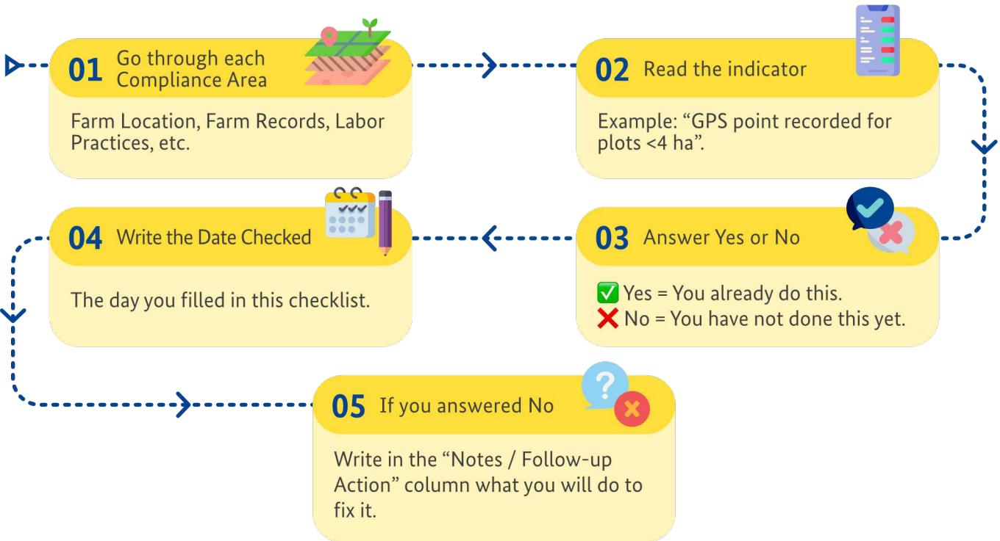

# Example of Scoring and Follow-Up

### Farm Location – GPS point recorded (<4 ha)

 If Yes → Good, no action needed.

 If No → Follow-up: “Ask cooperative or field officer to help.

### Labor Practices – Workers paid fairly and on time

 If Yes → Keep records of payments.

 If No → Follow-up: “Make a payment schedule and keep receipts.”

### Land Legality – Land status verified (e.g., SKT)

 If Yes → Keep copies safe.

 If No → Follow-up: “Coordinate with village office to request SKT letter.”

### Grievance Mechanism – System to report complaints

 If Yes → Share with workers and community.

 If No → Follow-up: “Provide a phone number or complaint box at cooperative.”

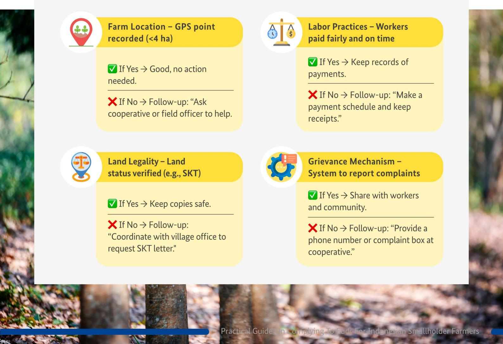

## Glossary

### Aggregator

A group, cooperative, or business that collects products (like rubber, cocoa, or coffee) from many small farmers and then sends them to factories or exporters.

### Batch ID / Batch Code

A special number given to a specific amount of product, so it can always be traced back to the farm it came from.

### Deforestation

The conversion of forest to agricultural or other non-forest land use, whether human-induced or natural.

### Deforestation-Free

A requirement under the EUDR meaning that the commodity was not produced on land deforested after 31 December 2020.

### DDS (Due Diligence Statement)

A formal declaration sent to the EU system (TRACES) that confirms your products are legal, deforestation-free, and follow the rules.

### Due Diligence

A legal requirement to check and collect information about your farm and suppliers, make sure there is no illegal deforestation, and take action if there is risk before selling to the EU.

### EUDR (European Union Deforestation Regulation)

An EU rule (Regulation 2023/1115) that prohibits products linked to deforestation from being sold or exported to Europe.

### Forest

Land larger than 0.5 hectares with trees taller than 5 meters and canopy cover over 10%, or land that can grow such trees, excluding farms or urban areas.

### Forest Degradation

Structural changes to forest cover, taking the form of the conversion of:

1. (a) primary forests or naturally regenerating forests into plantation forests or into other wooded land; or
2. (b) primary forests into planted forests;

### Forest-Related Rules

National laws about using forests, clearing forests, or cutting timber, as required by EUDR.

### Geolocation

The exact GPS coordinates (latitude and longitude) of your farm plots.

### Indigenous Peoples' Rights

The rights of indigenous communities whose land or resources may be affected, including FPIC (Free, Prior, and Informed Consent).

### Legality Documentation

Papers that prove your land ownership or rights, environmental permits (like SPPL), and tax compliance.

**Operator**Any natural or legal person who, in the course of a commercial activity, places relevant products on the EU market or exports them.

**Polygon**A shape made by connecting GPS points that shows the full boundary of a farm plot. Required for farms bigger than 4 hectares.

**Risk Assessment**The process of checking how likely it is that a supplier or product does not follow EUDR rules.

**Risk Mitigation**Actions to reduce risk, like extra inspections, farm visits, or training suppliers.

**Supplier**Anyone who provides products or raw materials to an operator, including cooperatives and aggregators.

**Traceability**The ability to track a product from the farm all the way to the buyer.

## Annex 1 Recommended GPS and Mapping Tools

Your buyers, CSOs, or NGOs may support you with training on how to operate these mapping tools.

## Annex 2. Recommended Sources and References on EUDR for Farmers

### 1. Educational Videos in Bahasa Indonesia

#### A. Introduction of EUDR – Kaoem Telapak Channel

*Basic explanation of the regulation.*

### 2. Documents and Practical Guides

#### A. Guidance Document

*English version of the official EUDR guidance documents.*

#### B. Frequently Asked Questions – Version 4

*Technical explanation and practical interpretation for supply chain actors, including farmers.*

#### C. Official EUDR Translation – Satya Bumi

*Full translated version of the EUDR regulation in Bahasa Indonesia.*

#### D. General Understanding & Implementation Guide – Daemeter

*Technical explanation and practical interpretation for supply chain actors, including farmers.*

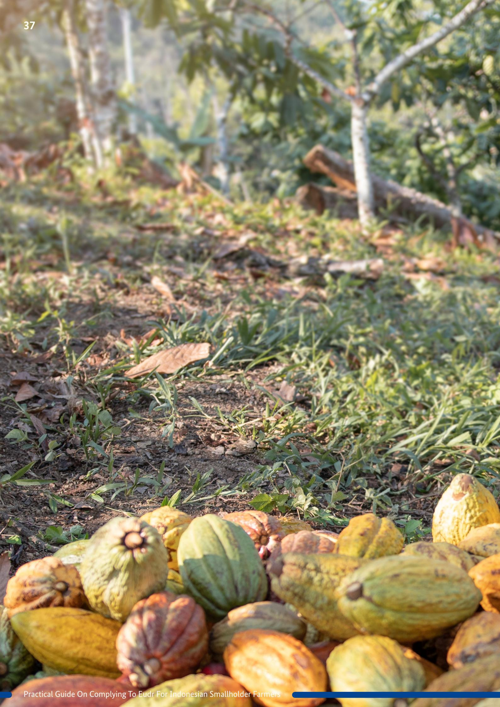

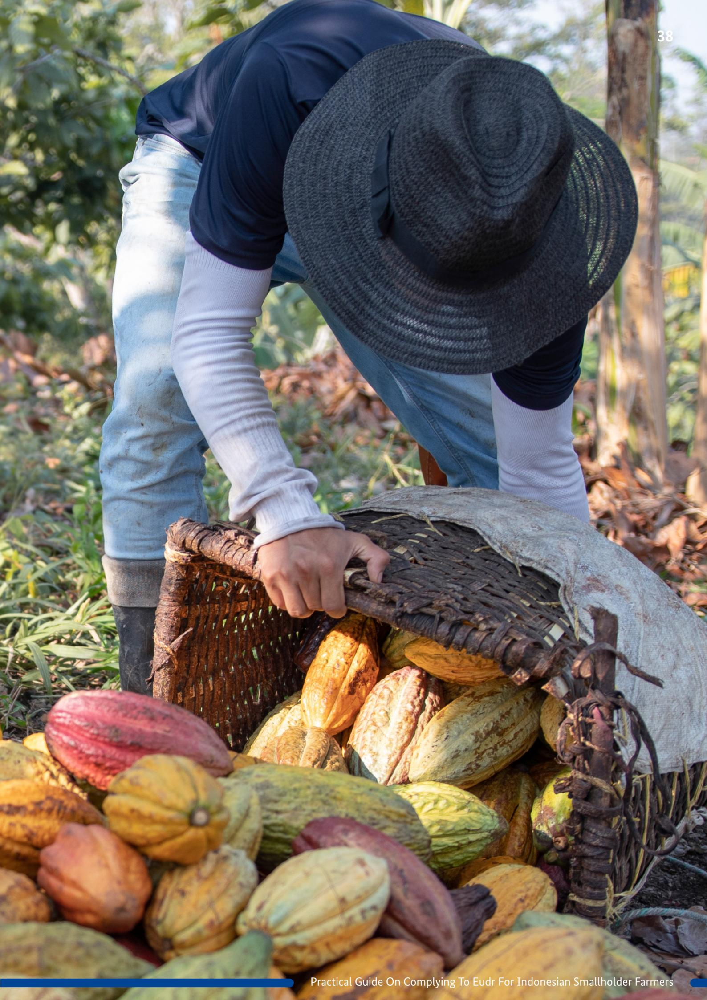

