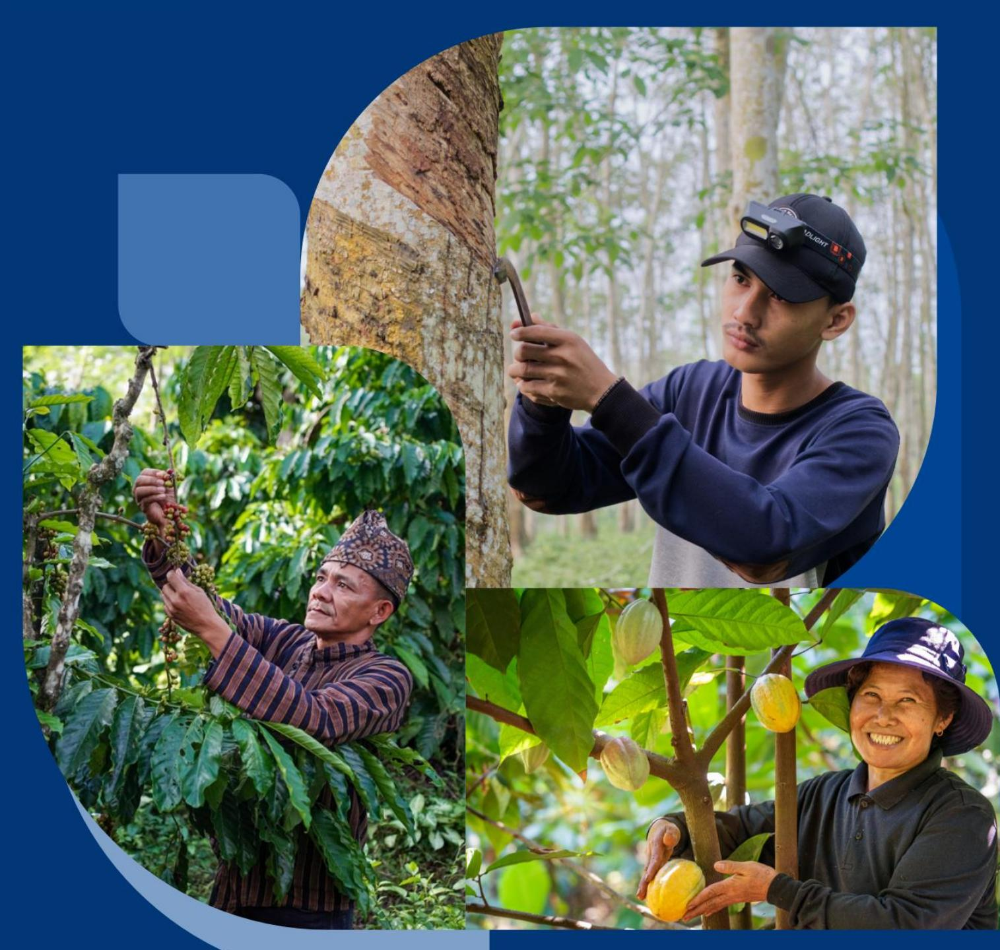
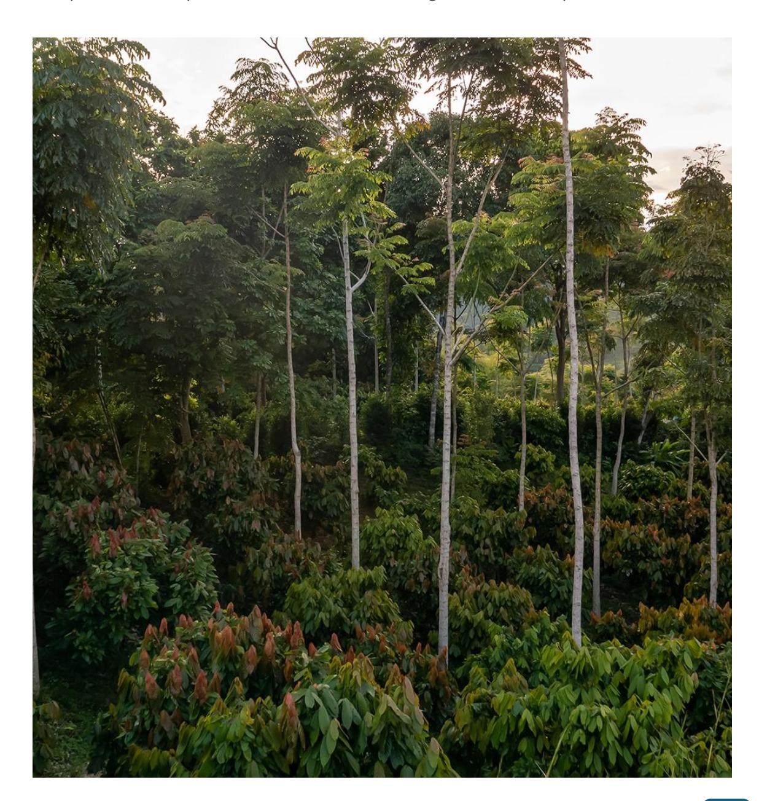
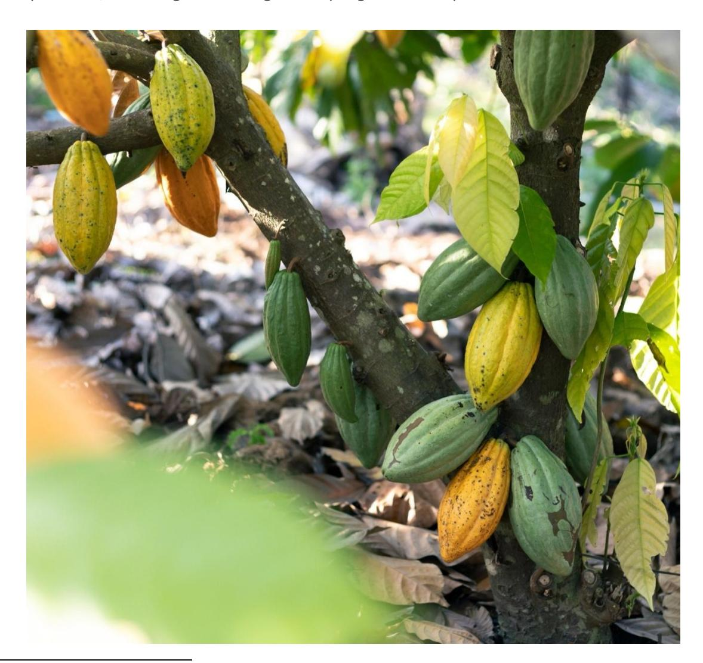
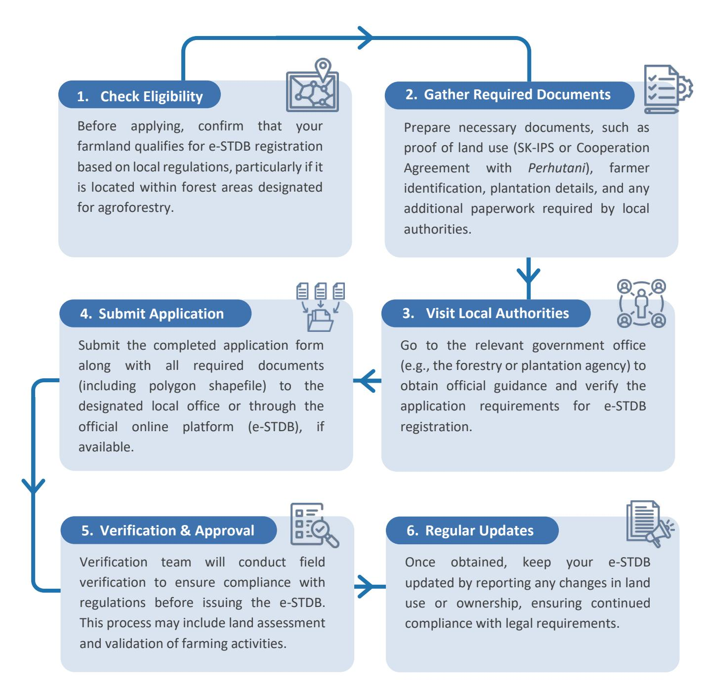
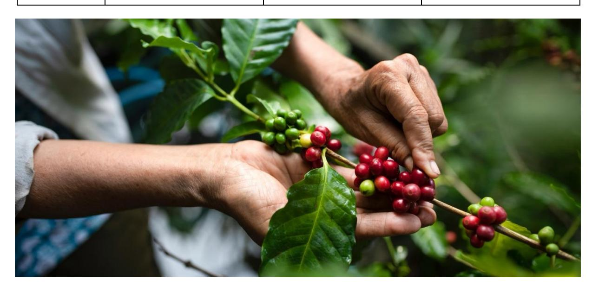
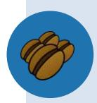
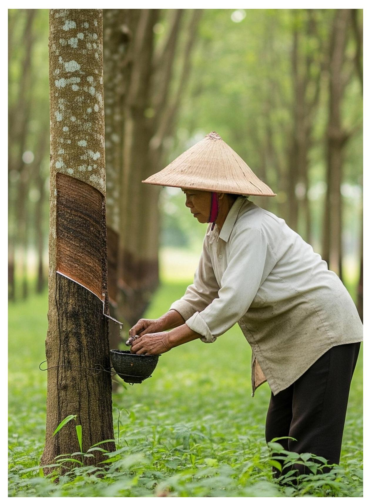
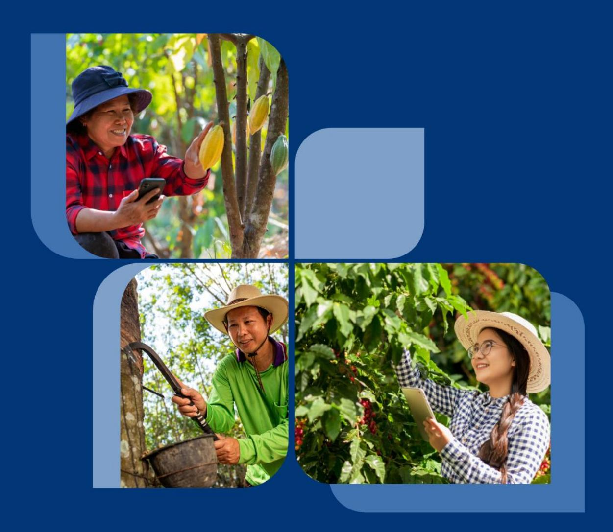

## Recommendations for concrete solutions to EUDR-related challenges focusing on smallholder and private sector in the cocoa, coffee, and natural rubber sectors

## Recommendations for concrete solutions to EUDR-related challenges focusing on smallholder and private sector in the cocoa, coffee, and natural rubber sectors

**November 2025** 

|      | Table of Contents                                                                                                                               |
|------|-------------------------------------------------------------------------------------------------------------------------------------------------|
| 1.   | Introduction ............................................................................................... 3                                  |
| 1.1. | Purpose of the Document ....................................................................................................... 3               |
| 1.2. | Methodology ........................................................................................................................... 4       |
| 2.   | EUDR Implementation Challenges: Overview by Commodity ..................... 5                                                                   |
| 2.1. | Natural Rubber ........................................................................................................................ 6       |
| 2.2. | Coffee ...................................................................................................................................... 6 |
| 2.3. | Cocoa ....................................................................................................................................... 7 |
| 3.   | Recommendations for meeting the EUDR requirements ............................ 8                                                                |
| 3.1  | EUDR Compliance on Smallholder Farmers ............................................................................. 8                          |
| 3.2  | EUDR Compliance for Larger Processors & Exporters ........................................................... 18                                |
| 3.3  | EUDR Compliance for Local Suppliers and Farmer Cooperatives ......................................... 24                                        |
| 4.   | Conclusion ................................................................................................ 29                                  |
| 1.   | Summary of Key Recommendations by Commodity ................................................................. 29                                |
| 2.   | Emphasis on Sector-Specific Solutions and Stakeholder Engagement ..................................... 29                                       |
| 3.   | Highlighting the Roadmap of Recommendations ..................................................................... 29                            |

#### **Published by**

PT Koltiva

#### **Authors**

Meg Phillips Andre Dani Mawardhi Rahmad Nanda Danella Austraningsih

#### **Reviewer**

Theresa Sila Wikaningtyas Anna Rother Franzika Rau Sander Happaerts Eloise O'Caroll

#### **Layout and Design**

Gary Aiman

Jakarta, 2025

## *DISCLAIMER*

*This publication was co-funded by the European Union and BMZ. The content of this publication is the sole responsibility of Koltiva and does not necessarily reflect the views of the EU or the BMZ. The information in this study, or upon which this study is based, has been obtained from sources the authors believe to be reliable and accurate. While reasonable efforts have been made to ensure that the contents of this publication are factually correct, GIZ GmbH does not accept responsibility for the accuracy or completeness of the contents of this publication. The mention of specific companies or products of manufacturers, whether or not these have been patented, does not imply that these have been endorsed or recommended by GIZ GmbH in preference to others of a similar nature that are not mentioned. The views expressed in this information product are those of the author(s) and do not necessarily reflect the views or policies of GIZ GmbH.* 

*This document has been developed based on an analysis of various relevant sources, including but not limited to legal texts on the EUDR, EUDR FAQs, as well as results from previously conducted focus group discussions (FGDs) and other events organized by the EUDR Engagement project and other stakeholders (e.g., KAMI, SAFE). It also references to other publicly available and relevant knowledge products.* 

*The purpose of this document is to provide stakeholders with insights into implementation mechanisms of the EU Deforestation Regulation (EUDR). While this document reflects the most current information at the time of writing, it is intended as a one-off resource and does not include provisions for future updates.* 

# **1. Introduction**

## **1.1. Purpose of the Document**

- Purpose of the document: This document aims to provide practical and actionable recommendations to help stakeholders seize the opportunities offered by the EU Deforestation Regulation (EUDR), ensuring compliance while fostering sustainable and equitable practices in Indonesia's agricultural sector.
- Overview of the EUDR challenges and the need for tailored solutions: The EUDR introduces specific requirements on deforestation-free supply chains, creating complex challenges such as traceability, land legality, and sustainability compliance, which require tailored solutions to address the unique needs of natural rubber, coffee, and cocoa sector stakeholders.
- Importance of sector-specific approaches for natural rubber, coffee, and cocoa: Each commodity sector—natural rubber, coffee, and cocoa—faces distinct challenges in meeting EUDR requirements, e.g. social agroforestry for coffee and cocoa in Indonesia.
- Target stakeholders: This document is designed to support the following key stakeholders, ensuring they understand their role in adapting to EUDR requirements: smallholders, processors, exporters, regulators, and supporting organizations. o **Smallholder Farmers**: Independent producers managing small-scale farms, often with informal or unclear land tenure status. Farmers need to receive support and guidance on legal land use, traceability, and sustainable farming practices. By focusing on these areas, they can enhance their market access and maintain strong relationships within the industry o **Larger Processors & Exporters**: Companies that source raw materials—directly or indirectly—from smallholders, process them, and ultimately export to international markets.
  - **If exporting directly into the EU:** Must implement due diligence systems, ensure deforestation-free and legal production of relevant commodities and support suppliers and smallholders to meet EUDR requirements
  - **If exporting indirectly**: May still be asked by their buyers to provide data and procedures for supporting due diligence o **Smaller Exporters**: Typically operating further upstream, these companies may purchase materials from smallholders (directly or indirectly) and supply them onward. Even though their products ultimately reach the EU through larger exporters, they must collect and pass along traceability data required under EUDR.
- Other interested readers: o **Regulators**: Government institutions responsible for land legality verification, forest protection, and the implementation of agricultural policies. Their role includes facilitating land documentation processes, ensuring enforcement of the relevant legislative framework, and providing technical assistance to stakeholders. o **Supporting Organizations** (NGOs, Cooperatives, Financial Institutions, Service Providers): Entities that provide technical support, training, and financial assistance to smallholders and industry actors. They help bridge gaps in compliance by offering capacity-building programs, funding opportunities, and technology solutions for traceability.

## **1.2. Methodology**

Recommendations and concrete solutions to EUDR-related challenges in the cocoa, coffee, and natural rubber sectors are developed through a comprehensive literature review and context analysis. This process involves synthesizing data from previous reports, including the EUDR Guidance Document and FAQ, report from EUDR Engagement project, findings from various stakeholders dialogue events in Indonesia funded by the European Union , the Legality Study on EUDR in the Indonesian Context by IPB University, as well as insights from KAMI and SAFE project reports. Additionally, publicly available and relevant knowledge products are examined to ensure a well-rounded understanding of sector-specific challenges and opportunities.

Following the data collection and analysis, recommendations are formulated through a structured approach involving stakeholder consultations and expert validation in a workshop. This process ensures that proposed solutions are not only aligned with EUDR requirements but also practical and implementable within Indonesia's agricultural landscape.

# **2. EUDR Implementation Challenges: Overview by Commodity**

Indonesia's exporters face challenges in EUDR implementation across natural rubber, coffee, and cocoa sectors, including limited outreach, low awareness, and resource constraints for providing information on geo-location and land legality (Table 1). Fragmented supply chains and weak traceability systems further complicate adaptation processes, while low e-STDB registration and minimal understanding of the National Dashboard hinder integration with national monitoring efforts. Without financial incentives like a guaranteed premium price or enhanced market access, supply chain actors lack motivation to invest in adaptation measures, and the high costs of technology, data collection, and reporting add further strain. Addressing these gaps requires targeted capacity-building and financial support mechanisms which remain low currently. These shared challenges significantly impact smallholders and private sector actors on providing data to ensure their products are produced in line with EUDR requirements.

Table 1. Challenges for smallholders in EUDR implementation across the three commodities

| Aspect                    | Natural Rubber         | Coffee                  | Cocoa                  |
|---------------------------|------------------------|-------------------------|------------------------|
|                           | Highly lacking         | High to medium lacking  | High to medium lacking |
|                           | Low, lack of resources | Mainly low, due to lack |                        |
|                           | Mostly none            | Mostly none. However,   |                        |
| Traceability              | Long and complex       |                         |                        |
| Registration of e-STD B 1 |                        |                         |                        |
|                           | Low                    | Low                     | Low                    |

1 [Dashboard of e-STDB,](https://stdb.ditjenbun.pertanian.go.id/admin/dashboard) accessed in January 2025

| Aspect           | Natural Rubber      | Coffee | Cocoa |
|------------------|---------------------|--------|-------|
| Capacity         | Absence of capacity |        |       |
| Adaptation costs | Requires additional |        |       |

*Source: EUDR Engagement's FGD Summary Report by Saka Dala, 2024* 

# **2.1. Natural Rubber**

- Fragmented and multi-tiered supply chains increase complexity, while supplier relationships are often dynamic. For example, less than 2% of smallholder rubber is directly supplied to any typical processor, hence ensuring deforestation-free sourcing is a major challenge.
- Aging rubber trees and poor-quality production diminish competitiveness and reduce smallholders' economic viability, limiting their ability to invest in sustainable practices.
- Child labor is prevalent and heightens social risks, requiring stronger due diligence
- Many smallholders lack adequate agricultural knowledge, and little experience with sustainability certifications—while not required under EUDR—may reflect broader capacity gaps that hinder their ability to meet some EUDR requirements, increasing the risk of exclusion from compliant markets.
- Indonesia exports 16.55% of its natural rubber to EU, with the majority directed to non-EU countries, potentially as raw materials for final products that may ultimately enter the EU market, making regulatory oversight more complex for private sector buyers.

# **2.2. Coffee**

- Involvement in Social Forestry programs [2](#page-6-2) before and after the EUDR cut-off date, must ensure they align their production with land legality and traceability requirements. However, many lack clear documentation, risking exclusion from EUDR-compliant supply chains.
- Use of different definitions of deforestation and agroforestry in comparison to EUDR definitions, making compliance assessments difficult.
- Coffee supply chain involves a larger number of stakeholders compared to cocoa, complicates traceability efforts and increases the risk of non-compliant sourcing.
- Co-ownership (*sistem paruh lahan*) creates inconsistencies in farmer data management making it harder to verify land use and origin.9

2 [GoKUPS \(](https://gokups.menlhk.go.id/public/home)Integrated Electronic-Based Social Forestry Information System), accessed in January 2025

- Only 1.87% of coffee production in Indonesia currently is Rainforest Alliance (RA) certified, meaning most farmers lack prior exposure to rigorous compliance processes, increasing challenge of adapting to EUDR requirements. 10 .

### **2.3. Cocoa**

- Some of the smallholder cocoa plantations are in protected areas or restricted areas for agricultural purposes, making land legality verification difficul[t](#page-7-1)3 .
- Cocoa plantations under Social Forestry programs, before and after the EUDR cut-off date, face risks of exclusion from compliant supply chains due to limited documentation and unclear alignment with land legality and traceability requirements.
- Use of different definitions of deforestation and agroforestry in comparison to EUDR definitions create legal uncertainties.
- Indonesia's cocoa plants are old, with an average age of over 20 years, making investment in sustainable practices less viable.
- Only around 71,000 tons of cocoa beans (60,000 tons of processed cocoa products) are Rainforest Alliance (RA) certified, meaning most farmers lack experience with compliance processes, increasing the challenge of adapting to EUDR requirements.

Koltiva primary analysis

# **3. Recommendations for meeting the EUDR requirements**

Set of recommendations to navigate the requirements of the EUDR, which will aid in forming the implementation roadmap for the EUDR readiness journey.

# **3.1 EUDR Compliance on Smallholder Farmers**

Smallholders form the foundation of many supply chains but often lack the resources and formal structures to navigate complex regulatory demands. To share their plot data with exporters, it is essential for them to establish minimum proof of legality, including documentation of land rights, environmental protection, respecting human and labour rights, and compliance with local regulations. These elements are essential for demonstrating that the plot production complies with both national and international regulations and aligns with the EUDR regulation, which the operator will submit to establish the due diligence system.

In addition to the previously mentioned need for legality requirements, it's important to highlight that the primary goal of the EUDR is to reduce the use of products sourced from deforested and degraded forest areas. This regulation aims to prevent future deforestation and degradation. Farmers can take several steps to help achieve this goal, such as refraining from clearing land in forested areas, utilizing abandoned or unused land, using agroforestry and sustainable agriculture to enhance its productivity.

The recommendation categorizes smallholder farmers into three levels—Foundational, Progressing, and Advanced—based on their current level of preparedness and capacity to meet EUDR requirements. This approach ensures that recommendations are actionable and tailored to each group's specific needs.

- Foundational: Smallholders with minimal legal documentation or sustainability practices, requiring support to achieve basic compliance. Indicators: No formal land title, limited awareness of regulations, basic farm practices.
- Progressing: Smallholders who have taken steps toward legality and sustainability but require further improvements to secure long-term compliance. Indicators: Partial land documentation, basic traceability, initial environmental and labor safeguards in place.
- Advanced: Smallholders who have fully formalized land ownership and integrated sustainable practices, positioning themselves as leaders in the sector. Indicators: Full land ownership (SHM or e-STDB), use of digital traceability, agroforestry system adoption without converting forest into an agroforestry system after 2020, adherence to environmental and labor standards.

| Category    | Description                                                                 | Example Characteristics                                                                  | Support Focus                                           |
|-------------|-----------------------------------------------------------------------------|------------------------------------------------------------------------------------------|---------------------------------------------------------|
| Early Stage | Farmers with limited legal documentation or awareness of EUDR requirements. | No land title or informal tenure, low awareness, basic or subsistence farming practices. | Awareness-raising, legal literacy, basic documentation. |

| Category      | Description                | Example |
|---------------|----------------------------|---------|
| Transitioning | Farmers who have started   |         |
| EUDR-Aligned  | Farmers with documentation |         |

### Table 2. Recommendations for Smallholder Farmers

| Legality Aspect                                                                                      | Basic Readiness (Immediate Legal & Operational Focus)                                                                                                                                                                                                                                                                                                                                                                                                                                                                                                                                                                                                                                | Strengthening Readiness (Enhanced Sustainability & Legal Security)                                                                                                                                                                                                                                                                                                                                                                                                                                                                                                           | Sustainability Leaders (Best Practices & Market Access)                                                                                                                                                                                                                                                                                                                                                                                                                                                                                                                      |
|------------------------------------------------------------------------------------------------------|--------------------------------------------------------------------------------------------------------------------------------------------------------------------------------------------------------------------------------------------------------------------------------------------------------------------------------------------------------------------------------------------------------------------------------------------------------------------------------------------------------------------------------------------------------------------------------------------------------------------------------------------------------------------------------------|------------------------------------------------------------------------------------------------------------------------------------------------------------------------------------------------------------------------------------------------------------------------------------------------------------------------------------------------------------------------------------------------------------------------------------------------------------------------------------------------------------------------------------------------------------------------------|------------------------------------------------------------------------------------------------------------------------------------------------------------------------------------------------------------------------------------------------------------------------------------------------------------------------------------------------------------------------------------------------------------------------------------------------------------------------------------------------------------------------------------------------------------------------------|
| <b>Traceability and Record Keeping</b> <i>Ensuring Accurate Plot Records and Product Tracking</i> | 
<b>Map Plot Boundaries</b> Use GPS or simple field surveys to map current farm boundaries, ensuring they do not overlap with protected areas. If plot bondaries have changed since the deforestation cutoff date (e.g., 2020), Ensure that updated geolocation data is accurately collected and verified, using historical community records where needed.
 
<b>Record Farm Size and Location</b> Maintain a written record of farm size, estimated land area, and rough hand-drawn maps if no GPS is available.
 
<b>Implement Product Segregation</b> Ensure harvested products from different plots or varieties are labelled and stored separately.
 | 
<b>Keep Digital or Paper Farm Records</b> While not directly required under EUDR, maintaining records of yields (including harvest dates), input use (fertilizers and crop protection products), and sales transactions can strengthen the credibility of due diligence and help demonstrate consistency between reported production and supply chain traceability, supporting overall risk assessment processes.
 
<b>Implement Product Segregation</b> Ensure harvested products from different plots or varieties are labelled and stored separately.
 | 
<b>Implement Product Segregation:</b> Ensure harvested products from different plots or varieties are labelled and stored separately.
 
<b>Make Use of Certification Systems</b> Leverage existing data and organizational structures from sustainability certification or verification programs that require full traceability of production. Utilizing digital monitoring tools or third-party verification mechanisms embedded in these programs can help confirm long-term deforestation-free compliance.
 
<b>Adopt Digital Traceability Tools</b>
 |

| Legality Basic Readiness Aspect (Immediate Legal & Operational Focus)                                                                                                                                                                                                                                                                                                                                                                                                                                                                                                                                              | Strengthening Sustainability Readiness Leaders (Best (Enhanced Practices & Sustainability & Legal Market Access) Security) Use smartphone apps or spreadsheets with built in tracking features.                                                                                                                                                                                                                                                                                                                                                                                                                                                                                                                                                                                                                                             |
|--------------------------------------------------------------------------------------------------------------------------------------------------------------------------------------------------------------------------------------------------------------------------------------------------------------------------------------------------------------------------------------------------------------------------------------------------------------------------------------------------------------------------------------------------------------------------------------------------------------------|----------------------------------------------------------------------------------------------------------------------------------------------------------------------------------------------------------------------------------------------------------------------------------------------------------------------------------------------------------------------------------------------------------------------------------------------------------------------------------------------------------------------------------------------------------------------------------------------------------------------------------------------------------------------------------------------------------------------------------------------------------------------------------------------------------------------------------------------|
| Farmers ’ Rights:                                                                                                                                                                                                                                                                                                                                                                                                                                                                                                                                                                                                  |                                                                                                                                                                                                                                                                                                                                                                                                                                                                                                                                                                                                                                                                                                                                                                                                                                              |
| Right to Data Use Transparency:                                                                                                                                                                                                                                                                                                                                                                                                                                                                                                                                                                                    | Smallholders can request that any digital or paper                                                                                                                                                                                                                                                                                                                                                                                                                                                                                                                                                                                                                                                                                                                                                                                           |
| EUDR criteria. This is aligned to the EU’s G                                                                                                                                                                                                                                                                                                                                                                                                                                                                                                                                                                       | eneral Data Protection Regulation (GDPT).                                                                                                                                                                                                                                                                                                                                                                                                                                                                                                                                                                                                                                                                                                                                                                                                    |
| Right to Secure Tenure Recognition:                                                                                                                                                                                                                                                                                                                                                                                                                                                                                                                                                                                | By complying with EUDR traceability and legality                                                                                                                                                                                                                                                                                                                                                                                                                                                                                                                                                                                                                                                                                                                                                                                             |
| Right to Technical Assistance: records.                                                                                                                                                                                                                                                                                                                                                                                                                                                                                                                                                                            | Under many certification programs, smallholders can                                                                                                                                                                                                                                                                                                                                                                                                                                                                                                                                                                                                                                                                                                                                                                                          |
| Right to Data Correction: their data. Land Use Obtain or Update Land Docs Rights Secure formal land title where Right to use, possible (such as SHM or manage, and certified land deeds). If occupy unavailable, obtain local proof agricultural of land use (e.g., Surat land. Keterangan Tanah [SKT]) as interim documentation, while acknowledging that full legal verification may still be required under EUDR compliance standards. Keep Records Current Store any expansions, inheritances, or official documents in a safe place. Cooperate with Audits Be ready to show land docs and farm data if buyers | If external audits or certifications uncover errors, Regular Land Status Reviews Long-Term Land Security Update official documents if farmland changes (e.g., Pursue fully formalized expansions). land deeds (SHM) and any advanced Move Toward e-STDB certificates Ensure you have the e-STDB Digital Mapping & by following these steps; 1. Updates Check Eligibility 2. Gather Required Documents 3. Visit Use smartphone apps or Local Authorities 4. Submit geospatial tools to Application 5. Verification & quickly register any Approval 6. Regular Updates changes in size or usage. Collaborate with Local Authorities Land Sharing Agreements If boundaries are unclear, involve local offices for clarity Set formal contracts or and avoid future disputes. cooperative models if you share boundaries or resources with other |
| in high ‐ risk areas require additional verification                                                                                                                                                                                                                                                                                                                                                                                                                                                                                                                                                               | farmers or indigenous communities.                                                                                                                                                                                                                                                                                                                                                                                                                                                                                                                                                                                                                                                                                                                                                                                                           |

| Legality Basic Readiness Aspect (Immediate Legal & Operational Focus) Farmers’ Rights:                                                                                                                                                                                                                                                                                                                                        | Strengthening Sustainability Readiness Leaders (Best (Enhanced Practices & Sustainability & Legal Market Access) Security)                                                                                                                                                                                                                                                                                                                                                                                                                                                                                                                                                                                                                                                                                                  |
|-------------------------------------------------------------------------------------------------------------------------------------------------------------------------------------------------------------------------------------------------------------------------------------------------------------------------------------------------------------------------------------------------------------------------------|-----------------------------------------------------------------------------------------------------------------------------------------------------------------------------------------------------------------------------------------------------------------------------------------------------------------------------------------------------------------------------------------------------------------------------------------------------------------------------------------------------------------------------------------------------------------------------------------------------------------------------------------------------------------------------------------------------------------------------------------------------------------------------------------------------------------------------|
| Right to Secure Tenure:                                                                                                                                                                                                                                                                                                                                                                                                       | Under EUDR Articles 3(c) and Indonesian Agrarian Law (UU                                                                                                                                                                                                                                                                                                                                                                                                                                                                                                                                                                                                                                                                                                                                                                    |
| Right to Land Tenure Security:                                                                                                                                                                                                                                                                                                                                                                                                | Under the EU Deforestation Regulation (EUDR),                                                                                                                                                                                                                                                                                                                                                                                                                                                                                                                                                                                                                                                                                                                                                                               |
| Article 3(c) , operators must ensure that the relevant commodities are produced on                                                                                                                                                                                                                                                                                                                                            |                                                                                                                                                                                                                                                                                                                                                                                                                                                                                                                                                                                                                                                                                                                                                                                                                             |
| land where                                                                                                                                                                                                                                                                                                                                                                                                                    | legal land use rights were respected . This means smallholders can assert                                                                                                                                                                                                                                                                                                                                                                                                                                                                                                                                                                                                                                                                                                                                                   |
| their legal ownership or customary land claims                                                                                                                                                                                                                                                                                                                                                                                | and request recognition from                                                                                                                                                                                                                                                                                                                                                                                                                                                                                                                                                                                                                                                                                                                                                                                                |
| Smallholders can support their claims through programs such as                                                                                                                                                                                                                                                                                                                                                                | Indonesia's Social                                                                                                                                                                                                                                                                                                                                                                                                                                                                                                                                                                                                                                                                                                                                                                                                          |
| Forestry schemes (Perhutanan Sosial)                                                                                                                                                                                                                                                                                                                                                                                          | or the Systematic Land Registration Program                                                                                                                                                                                                                                                                                                                                                                                                                                                                                                                                                                                                                                                                                                                                                                                 |
| (PTSL) . Companies, as part of their due diligence obligations, must verify that the land given proper consent.                                                                                                                                                                                                                                                                                                               |                                                                                                                                                                                                                                                                                                                                                                                                                                                                                                                                                                                                                                                                                                                                                                                                                             |
| Right to Due Process: Environmental Avoid Illegal Clearing Protection Do not expand into protected Safeguarding or forested areas. Increase ecosystems, yield on existing land or biodiversity, degraded areas instead. Manage Inputs Responsibly and water sources. Store and apply fertilizers/chemicals safely; dispose of containers properly. Be aware of Regulation Consult list of relevant environmental regulations. | If a dispute arises, smallholders are entitled to dispute for risk mitigation regarding third-party rights Conservation Measures Integrated Agroforestry Practice soil & water Adopt mixed-crop conservation (terracing, systems or multi-species mulching), while maintaining buffer zones to enhance tree cover to align with biodiversity but never deforestation-free standards. convert forest into an Use minimal agrochemicals; agroforestry system consider partial organic or after 2020. integrated pest management Community & techniques. Government Small-Scale Reforestation Collaboration (Optional Good Practice) Cooperate with local While not a direct programs for wildlife requirement under the EUDR, corridors or watershed planting shade trees or local protection. species particularly in buffer |
|                                                                                                                                                                                                                                                                                                                                                                                                                               | zones near water sources — Ecosystem Restoration can support broader Rehabilitate degraded sustainability objectives, land and document enhance ecosystem resilience, reforestation efforts to and demonstrate strengthen zero environmental stewardship to deforestation buyers and verifiers. compliance. Carbon Markets Explore carbon-credit schemes or NGO partnerships, to generate extra income                                                                                                                                                                                                                                                                                                                                                                                                                     |

| Legality Basic Readiness Aspect (Immediate Legal & Operational Focus) Farmers’ Rights:                                                                                                                                       | Strengthening Sustainability Readiness Leaders (Best (Enhanced Practices & Sustainability & Legal Market Access) Security) while improving biodiversity.                                                                                                                                                                                                                                                                                                                                                                                                     |
|------------------------------------------------------------------------------------------------------------------------------------------------------------------------------------------------------------------------------|--------------------------------------------------------------------------------------------------------------------------------------------------------------------------------------------------------------------------------------------------------------------------------------------------------------------------------------------------------------------------------------------------------------------------------------------------------------------------------------------------------------------------------------------------------------|
| Right to Environmental Knowledge:                                                                                                                                                                                            | Smallholders can ask extension services or local extension services or local authorities.                                                                                                                                                                                                                                                                                                                                                                                                                                                                    |
| Right to Clean Water & Healthy Soil: degradation.)                                                                                                                                                                           | Smallholders may report pollution or soil degradation under national environmental protection laws.                                                                                                                                                                                                                                                                                                                                                                                                                                                          |
| Right to Benefit-Sharing: contexts.) Forest-Related Check Permit Requirements                                                                                                                                                | If large companies conduct projects on or near smallholder Obtain Forestry Clearances Sustainable Wood                                                                                                                                                                                                                                                                                                                                                                                                                                                       |
| Regulation 4 If farmland overlaps with Applicable if forest zones or has partial dealing with or timber species, consult local near forest area forestry offices to ensure you do not need special permits. Farmers’ Rights: | If you occasionally produce Management timber or your land is near For smallholders designated forest, secure any producing timber, adopt required local permissions recognized forestry (e.g., IUPHHK for small-scale standards or community timber harvesting). forest certifications. Respect Buffer Zones Long-Term Compliance Identify or map any Collaborate with designated buffer edges or forestry bodies or catchment areas. cooperatives to reforest edges, enforce sustainable harvest rotation, and gain better market access for legal timber. |
| Right to Legal Recognition:                                                                                                                                                                                                  | If their land includes timber species, smallholders can seek inclusion in sustainable forestry programs.                                                                                                                                                                                                                                                                                                                                                                                                                                                     |
| (Source: Indonesia’s                                                                                                                                                                                                         | Peraturan Menteri Lingkungan Hidup dan Kehutanan No. 9/2021 on Social Forestry Management.)                                                                                                                                                                                                                                                                                                                                                                                                                                                                  |
| Right to Sustainable Land Use                                                                                                                                                                                                | – Farmers should have the right to use their land for                                                                                                                                                                                                                                                                                                                                                                                                                                                                                                        |
| Right to Fair Market Access PEFC Standards.)                                                                                                                                                                                 | – Smallholders producing legal timber should have equal                                                                                                                                                                                                                                                                                                                                                                                                                                                                                                      |
| Right to Government Support & Incentives                                                                                                                                                                                     | – Farmers complying with forest-related                                                                                                                                                                                                                                                                                                                                                                                                                                                                                                                      |

4 While not applicable for cocoa, coffee and rubber, some Indonesian producers may be producing forestry products as well, in which case they need to also consider some forest related regulations

| Legality Aspect                                                                                                 | Basic Readiness Strengthening Sustainability (Immediate Legal & Readiness Leaders (Best Operational Focus) (Enhanced Practices & Sustainability & Legal Market Access) Security)                                                                                                                                                                                                                                                                                                                                                                                                                                                                                                                                                                                                                                                                                                                                 |
|-----------------------------------------------------------------------------------------------------------------|------------------------------------------------------------------------------------------------------------------------------------------------------------------------------------------------------------------------------------------------------------------------------------------------------------------------------------------------------------------------------------------------------------------------------------------------------------------------------------------------------------------------------------------------------------------------------------------------------------------------------------------------------------------------------------------------------------------------------------------------------------------------------------------------------------------------------------------------------------------------------------------------------------------|
| practices.                                                                                                      | (Source: Indonesia’s Peraturan Menteri Lingkungan Hidup dan Kehutanan No.                                                                                                                                                                                                                                                                                                                                                                                                                                                                                                                                                                                                                                                                                                                                                                                                                                        |
| Right to Legal Assistance & Dispute Resolution                                                                  | – If land tenure or forest boundary Principles.)                                                                                                                                                                                                                                                                                                                                                                                                                                                                                                                                                                                                                                                                                                                                                                                                                                                                 |
| Right to Participate in Forestry Decision-Making                                                                | – Smallholders should have a voice in                                                                                                                                                                                                                                                                                                                                                                                                                                                                                                                                                                                                                                                                                                                                                                                                                                                                            |
| conservation                                                                                                    | efforts, and government land-use planning. (Source: Indonesia’s                                                                                                                                                                                                                                                                                                                                                                                                                                                                                                                                                                                                                                                                                                                                                                                                                                                  |
| Peraturan Menteri Lingkungan Hidup dan Kehutanan No. 9/2021                                                     | on Social Forestry Management.)                                                                                                                                                                                                                                                                                                                                                                                                                                                                                                                                                                                                                                                                                                                                                                                                                                                                                  |
| Right to Customary Land Recognition                                                                             | – If their land is part of a customary or indigenous                                                                                                                                                                                                                                                                                                                                                                                                                                                                                                                                                                                                                                                                                                                                                                                                                                                             |
| forestry schemes (                                                                                              | Hutan Adat, Hutan Kemasyarakatan, or Hutan Tanaman Rakyat ). Decision No. 35/PUU-X/2012; Social Forestry Program.)                                                                                                                                                                                                                                                                                                                                                                                                                                                                                                                                                                                                                                                                                                                                                                                               |
| Smallholders engaged in timber production have the right to SVLK                                                | ( Sistem Verifikasi                                                                                                                                                                                                                                                                                                                                                                                                                                                                                                                                                                                                                                                                                                                                                                                                                                                                                              |
| Legalitas Kayu                                                                                                  | ) certification support, which is required for timber exports. The government provides facilitation for:                                                                                                                                                                                                                                                                                                                                                                                                                                                                                                                                                                                                                                                                                                                                                                                                         |
| o                                                                                                               | Group certification schemes for small-scale producers                                                                                                                                                                                                                                                                                                                                                                                                                                                                                                                                                                                                                                                                                                                                                                                                                                                            |
| o                                                                                                               | Training on legal timber harvesting practices                                                                                                                                                                                                                                                                                                                                                                                                                                                                                                                                                                                                                                                                                                                                                                                                                                                                    |
| o                                                                                                               | Financial assistance for SVLK compliance                                                                                                                                                                                                                                                                                                                                                                                                                                                                                                                                                                                                                                                                                                                                                                                                                                                                         |
|                                                                                                                 | (Source: Indonesia’s SVLK system Peraturan Menteri Lingkungan Hidup dan                                                                                                                                                                                                                                                                                                                                                                                                                                                                                                                                                                                                                                                                                                                                                                                                                                          |
|                                                                                                                 | Kehutanan No. 30/2016 .)                                                                                                                                                                                                                                                                                                                                                                                                                                                                                                                                                                                                                                                                                                                                                                                                                                                                                         |
| o                                                                                                               | Dana Reboisasi (Reforestation Fund) from APBN (State Budget).                                                                                                                                                                                                                                                                                                                                                                                                                                                                                                                                                                                                                                                                                                                                                                                                                                                    |
| o                                                                                                               | Carbon trading under Indonesia’s carbon offset scheme (FOLU Net Sink 2030).                                                                                                                                                                                                                                                                                                                                                                                                                                                                                                                                                                                                                                                                                                                                                                                                                                      |
| o Labor Rights Labor Fair treatment, safe working conditions, child labor prohibition. Regulations regulations. | Village Fund (Dana Desa) allocation for agroforestry & conservation projects. Prohibit Hazardous Child Health & Safety Measures Structured Labor Policies Provide or request training on Do not assign minors to pesticide handling and first Establish written rules hazardous tasks (heavy lifting, aid; supply protective or guidelines for wages, chemical spraying). equipment (gloves, masks). hours, and safety procedures. Document Keep Simple Wage Records Respect Minimum Wage (if worker agreements or applicable) Even basic notebooks for daily seasonal contracts. worker hours help Pay daily or seasonal workers Community Worker demonstrate fair payment. at least the monthly Safety equivalent local legal standard Be aware of Labor (pro rata). Offer or co-sponsor medical checks or Consult list of relevant Labor facilitate training (e.g., first aid courses) for regular farmhands. |

| Legality Basic Readiness Aspect (Immediate Legal & Operational Focus) Farmers’ Rights:                                                                                                                                                                                                                                                                                           | Strengthening Sustainability Readiness Leaders (Best (Enhanced Practices & Sustainability & Legal Market Access) Security)                                                                                                                                                                                                                                                                                                                                                                                                                                                                                  |
|----------------------------------------------------------------------------------------------------------------------------------------------------------------------------------------------------------------------------------------------------------------------------------------------------------------------------------------------------------------------------------|-------------------------------------------------------------------------------------------------------------------------------------------------------------------------------------------------------------------------------------------------------------------------------------------------------------------------------------------------------------------------------------------------------------------------------------------------------------------------------------------------------------------------------------------------------------------------------------------------------------|
| Right to Safe Conditions and Fair Wages: compensation.                                                                                                                                                                                                                                                                                                                           | If smallholders or family members are hired                                                                                                                                                                                                                                                                                                                                                                                                                                                                                                                                                                 |
| Right to Refuse Unsafe Demands: standards or child labor laws                                                                                                                                                                                                                                                                                                                    | Smallholders can decline tasks that violate safety                                                                                                                                                                                                                                                                                                                                                                                                                                                                                                                                                          |
| Right to Formal Grievance Mechanisms: discrimination. Human Rights No Discrimination Protections Treat family helpers, No neighbors, and all workers discrimination; equally, regardless of gender freedom of or background. association; Basic Safety Awareness safe remedy for grievances. Explain hazards of chemicals and manual tasks to everyone on site. Farmers’ Rights: | Workers can set up or join a local Access to Remedies Formal Grievance If disputes arise (e.g., wage Mechanisms issues), follow local mediation Set up or join a local or village dispute-resolution complaint/feedback steps. Keep basic written channel for farm notes of what was agreed. laborers or neighbors. Keep records of issues Respect Dignity and steps taken to Foster open communication resolve them. for concerns about workload, Proactive Human Rights payments, or working hours. Measures Collaborate with NGOs or community leaders to host awareness sessions on labor/human rights. |
| Right to Equal Treatment:                                                                                                                                                                                                                                                                                                                                                        | Smallholders can demand non-discriminatory treatment in cooperatives, buyers' programs, and land policies.                                                                                                                                                                                                                                                                                                                                                                                                                                                                                                  |
| Right to Report Violations international grievance mechanisms.                                                                                                                                                                                                                                                                                                                   | : If human rights abuses occur (e.g., forced labor, land                                                                                                                                                                                                                                                                                                                                                                                                                                                                                                                                                    |
| Right to Collective Bargaining and Freedom of Association: negotiate better terms with buyers.                                                                                                                                                                                                                                                                                   | Smallholders can join                                                                                                                                                                                                                                                                                                                                                                                                                                                                                                                                                                                       |
| Right to Protection from Retaliation: local authorities. Third Parties’ Consult the Community Rights If you plan to expand or Local change land use, inform communities, neighbors or local leaders to neighbors, or avoid conflicts. Document any indigenous verbal agreements on groups. boundary sharing.                                                                     | If smallholders report human rights abuses, they Settle Boundaries Cooperative Land-Use Management Keep official or community endorsed records of any Enter formal communal pathways, water resources, or agreements or co shared usage to pre-empt management plans if boundary disputes. farmland overlaps with communal areas. Avoid Shared Resource Conflicts Joint Governance Boards If you share roads or water, schedule usage fairly. Join or form local                                                                                                                                          |

| Legality Basic Readiness Aspect (Immediate Legal & Operational Focus) Farmers’ Rights:                                                                                                                                                                                                                                                                                                           | Strengthening Sustainability Readiness Leaders (Best (Enhanced Practices & Sustainability & Legal Market Access) Security) committees for dispute resolution or resource allocation, ensuring balanced decision making.                                                                                                                                                                                                                                                                                                                                                                                                                                                                                                                                                                                                                                                                                                                                                 |
|--------------------------------------------------------------------------------------------------------------------------------------------------------------------------------------------------------------------------------------------------------------------------------------------------------------------------------------------------------------------------------------------------|--------------------------------------------------------------------------------------------------------------------------------------------------------------------------------------------------------------------------------------------------------------------------------------------------------------------------------------------------------------------------------------------------------------------------------------------------------------------------------------------------------------------------------------------------------------------------------------------------------------------------------------------------------------------------------------------------------------------------------------------------------------------------------------------------------------------------------------------------------------------------------------------------------------------------------------------------------------------------|
| Right to Land Dispute Mediation:                                                                                                                                                                                                                                                                                                                                                                 | If smallholders face land conflicts with larger actors, they can request FPIC compliance and legal mediation.                                                                                                                                                                                                                                                                                                                                                                                                                                                                                                                                                                                                                                                                                                                                                                                                                                                            |
| Right to Representation:                                                                                                                                                                                                                                                                                                                                                                         | Smallholders have the right to engage local advocacy groups or government bodies for land tenure protection.                                                                                                                                                                                                                                                                                                                                                                                                                                                                                                                                                                                                                                                                                                                                                                                                                                                             |
| Right to Inclusion in Decision-Making: The Principle of Identify Customary Lands FPIC If your farm is near or within Free, Prior, and indigenous territory, confirm Informed land status by talking to Consent. community leaders or local authorities. → Note: If you are the customary landholder, you have the right to withhold or negotiate consent for external land use. Farmers’ Rights: | When land policies impact local farming Obtain or Confirm Customary Long-Term Compliance Permissions with FPIC If your land lies within a Maintain written or customary area, secure digital records of any documented or widely consent agreements. recognized community Continue engaging with consent to strengthen your indigenous leadership, legal standing. and revise land use if new claims arise. Participate in Consultations Consensus-Building Join dialogues where indigenous groups or Involve third-party communities are affected by mediators or NGOs new land claims or expansion when needed, projects. especially in cases of → Note: Smallholders also potential conflict with have the right to be consulted large-scale land users. → Note: Under EUDR, and to raise objections if their customary rights are violated smallholders can submit by companies. substantiated concerns if their land rights are violated by companies or suppliers. |
| Right to Report Violations: community's consent.                                                                                                                                                                                                                                                                                                                                                 | Smallholders can use the FPIC mechanism to report                                                                                                                                                                                                                                                                                                                                                                                                                                                                                                                                                                                                                                                                                                                                                                                                                                                                                                                        |
| Right to Free, Prior, and Informed Consent (FPIC):                                                                                                                                                                                                                                                                                                                                               | No company or government can                                                                                                                                                                                                                                                                                                                                                                                                                                                                                                                                                                                                                                                                                                                                                                                                                                                                                                                                             |
| Right to Appeal Land Disputes:                                                                                                                                                                                                                                                                                                                                                                   | If land tenure or resource use conflicts arise (e.g.                                                                                                                                                                                                                                                                                                                                                                                                                                                                                                                                                                                                                                                                                                                                                                                                                                                                                                                     |
| national or community legal channels, e.g. Village Head (                                                                                                                                                                                                                                                                                                                                        | Kepala Desa ), District Land                                                                                                                                                                                                                                                                                                                                                                                                                                                                                                                                                                                                                                                                                                                                                                                                                                                                                                                                             |
| Office ( Kantor Pertanahan                                                                                                                                                                                                                                                                                                                                                                       | ), or Provincial Forestry Office ( Dinas Kehutanan Provinsi ).                                                                                                                                                                                                                                                                                                                                                                                                                                                                                                                                                                                                                                                                                                                                                                                                                                                                                                           |
| Right to Be Heard:                                                                                                                                                                                                                                                                                                                                                                               | Smallholders have the right to participate in decision-making conservation programs, natural resource access, etc.                                                                                                                                                                                                                                                                                                                                                                                                                                                                                                                                                                                                                                                                                                                                                                                                                                                       |

| Legality Basic Readiness Aspect (Immediate Legal & Operational Focus) Tax, Anti Pay Legitimate Fees Corruption, If farmland triggers local taxes Relevant Trade (e.g., PBB), ensure minimal tax                                               | Strengthening Sustainability Readiness Leaders (Best (Enhanced Practices & Sustainability & Legal Market Access) Security) Keep Accurate Transparency & Documentation Accountability Make sure farm-level Use digital tools or local                                                                                                         |
|------------------------------------------------------------------------------------------------------------------------------------------------------------------------------------------------------------------------------------------------|----------------------------------------------------------------------------------------------------------------------------------------------------------------------------------------------------------------------------------------------------------------------------------------------------------------------------------------------|
| & Customs payments are made and                                                                                                                                                                                                                | records — land certificates, cooperative                                                                                                                                                                                                                                                                                                     |
| Obligations to within local legal thresholds. pay taxes, avoid Don’t Offer or Accept Bribes bribery, and maintain If someone requests money honest for land documents, consider documentation. reporting it if safe to do so. Farmers’ Rights: | expansions, any purchases — management to track are up-to-date and can be payments, ensure shown to authorities. receipts are official, and minimize petty corruption. Market Access Benefits By maintaining thorough tax/certification records, smallholders can access higher-value markets, including premium or certified supply chains. |
| Right to Anti-Corruption Protections: attempts without fear of retaliation.                                                                                                                                                                    | Farmers can report bribery, or extortion                                                                                                                                                                                                                                                                                                     |
| Right to Information: from their local authorities                                                                                                                                                                                             | Farmers can request clarification on taxation laws and others                                                                                                                                                                                                                                                                                |

# **Practical Steps to Register e-STDB for Smallholder Farmers**

# **3.2 EUDR Compliance for Larger Processors & Exporters**

#### **Who This Section Applies To:**

This section provides EUDR related recommendations for Indonesian midstream companies, including:

#### **Five-Stage Roadmap for Midstream EUDR Implementation**

The roadmap below is tailored for Indonesian midstream companies (processing factories and local suppliers to exporters), considering their position in the supply chain and practical constraints.

Within each stage, you'll see three maturity levels as the basis of a roadmap: Foundational, Progressing, and Advanced. Companies begin by establishing basic elements at the Foundational level, then build on those successes with more robust systems at the Progressing level and finally adopt a leading approach (Advanced) for adapting for EUDR implementation and beyond.

By moving left to right (Foundational → Progressing → Advanced) within each stage, and top to bottom through all five categories, you create a comprehensive and evolving compliance framework one that starts with internal alignment and culminates in proactive, continuous EUDR excellence.

#### **Rubber, Coffee, and Cocoa Processing Factories**

sourcing from smallholders or intermediaries and responsible for partial transformation steps.

#### **Exporters that** place

products directly on the EU market and are legally classified as Operators under the EUDR.

#### **Larger, established**

**companies** that may not export directly but act as key suppliers to global exporters, providing essential due diligence data and handling large volumes within the domestic supply chain.

### **1. Company Systems & Governance**

Effective governance serves as the foundational support for achieving compliance with the EU Deforestation Regulation (EUDR). This entails the establishment of well-defined policies, appointing dedicated leadership (such as a Compliance Officer), budgeting appropriately, and seamlessly integrating EUDR considerations into current business processes. A robust governance framework empowers teams to understand their responsibilities and facilitates the efficient allocation of resources. Below is a proposed action plan that a large processor and exporting entity might adopt to ensure that their shipped products meet compliance standards.

| Foundational Practices (Getting Started)                                                                                                                                                                  | Progressing Practices (Basic Good Practice)                                                                                                                                                                              | Advanced Practices (Leading Companies)                                                                                                                                                                     |
|--------------------------------------------------------------------------------------------------------------------------------------------------------------------------------------------------------------|-----------------------------------------------------------------------------------------------------------------------------------------------------------------------------------------------------------------------------|---------------------------------------------------------------------------------------------------------------------------------------------------------------------------------------------------------------|
| 
<b>Map Product Codes to HS Codes</b> Maintain a single database matching each of your internal product code (related to forest-risk commodities) to the correct HS code from Annex 1 of the EUDR.
 | 
<b>Obtain Senior Management Approved Action Plan</b> Secure official sign-off on EUDR compliance roadmap, including piloting initiatives.
                                                                        | 
<b>Regular Board Engagement</b> Present quarterly or semi-annual EUDR performance updates at the board or executive team level, to ensure continued buy-in from top management within the company.
 |
| 
<b>Readiness Assessment (Annex 1)</b> Complete a simple internal exercise to identify policy gaps, potential supply chain mapping complexities, and staff capabilities.
                           | 
<b>Adopt a More Robust Sourcing Policy</b> Expand the policy to reference cut-off dates (e.g., 2020), indigenous rights (e.g., FPIC) to ensure your policy addresses both environmental and social requirements.
 | 
<b>Continuous Improvement</b> Regularly audit, benchmark, and revise SOPs based on new EUDR guidance.
                                                                                              |
| 
<b>Basic Policy Statement</b> Draft a no-deforestation/no-conversion sourcing policy in line with EUDR requirements.
                                                                              | 
<b>Formalize Compliance Officer Appointment</b> Designate a management-level officer responsible for the due diligence process, with clear accountability and reporting to senior leadership.
                    | 
<b>Policies &amp; Targets</b> Publicly declare a no-deforestation/conversion-free policy that exceeds EUDR scope (anticipate future commodity expansions).
                                         |
| 
<b>Assign Interim Compliance Lead</b> Identify a temporary point person to coordinate early EUDR tasks while clarifying the eventual Compliance Officer role.
                                     | 
<b>Budget &amp; Staffing Plan</b> Estimate resources (including possible external service providers) needed for due diligence (DDS) implementation.
                                                              |                                                                                                                                                                                                               |
| 
<b>Ide</b>
                                                                                                                                                                                            |                                                                                                                                                                                                                             |                                                                                                                                                                                                               |

### **2. Supplier Engagement & Outreach**

Once governance is in place, companies must extend requirements to suppliers. This involves creating or updating supplier codes of conduct, training suppliers on EUDR obligations, conducting audits, and incentivizing compliance. Effective engagement ensures that your supply chain partners understand and can meet—deforestation-free expectations.

| Foundational Practices (Getting Started) Supplier Identification Full Rollout of Supplier Mapping & Readiness                                                                                                                                                                                                                           | Progressing Practices Advanced Practices (Basic Good Practice) (Leading Companies) Regular Supplier Audits                                                                                                                                                                                                                                                                               |
|-----------------------------------------------------------------------------------------------------------------------------------------------------------------------------------------------------------------------------------------------------------------------------------------------------------------------------------------|------------------------------------------------------------------------------------------------------------------------------------------------------------------------------------------------------------------------------------------------------------------------------------------------------------------------------------------------------------------------------------------|
| Identify which Tier 1 suppliers handle forest-risk commodities. Basic Onboarding & suppliers.                                                                                                                                                                                                                                           | Conduct routine audits with Conduct socialization of independent bodies or multi stakeholder coalitions. EUDR policies across all                                                                                                                                                                                                                                                       |
| of Tier 1 suppliers for a pilot                                                                                                                                                                                                                                                                                                         |                                                                                                                                                                                                                                                                                                                                                                                          |
| Verify that all Tier Communication Communicate basic EUDR requirements (traceability, legality, zero-deforestation) to suppliers Provide simple self-declaration                                                                                                                                                                        | 1 Joint Action Plans Collaborate with top-tier suppliers suppliers can trace on advanced traceability or products to at least the restoration projects. plot (or have a plan in place to collect the data).                                                                                                                                                                              |
| Encourage Tier forms (after self evaluation) to summarise current compliance efforts to buyers. Kick-Off Meetings & Positive Collaboration Encourage Q&A on compliance                                                                                                                                                                  | 1 suppliers Industry Collaboration Participate in or co-develop to cascade EUDR shared verification frameworks requirements to their own or sector-wide programs to suppliers. Provide them tackle deforestation with easy training modules collaboratively. or pass-along materials. Participate in or co-develop                                                                       |
| Policies & Contracts costs and potential incentives for top performers. Agree on a data sharing mechanisms). protocol with your suppliers to                                                                                                                                                                                            | supply chain-wide programs to address deforestation at scale Develop feedback channels for suppliers to share issues or Digital Integration and Data best practices (grievance Interoperability                                                                                                                                                                                          |
| determine when, how, and Provide Incentives what data can be shared. Launch Supplier Readiness & Pilots Identify a manageable number data. test of supply chain mapping (focus on verifying geolocation data and time range). Conduct readiness assessments with key suppliers, helping them create basic action plans to address gaps. | Utilize the National Dashboard to upload geolocation data, risk assessments, and continuous Offer prioritized contracts, updates. Explore pre-competitive better payment terms, or sector-wide collaborations to premiums for suppliers who ensure data compatibility, reduce can provide EUDR relevant duplication, and support collective compliance efforts under the EUDR framework. |

### **3. Traceability and Data Collection**

EUDR compliance hinges on knowing where your products originate. This stage focuses on geolocation data, digital systems for real-time tracking, and rigorous document verification to ensure that commodities haven't originated from deforested land. Reliable traceability is the foundation for all downstream risk management.

In the Indonesian context, traceability systems must also prioritize data privacy and protection, ensuring that smallholder and supplier data is collected, stored, and shared in compliance with national data protection regulations. Furthermore, efforts should be made to ensure interoperability of data across systems, enabling alignment with National Dashboard and facilitating sector-wide precompetitive collaboration.

| Foundational Practices (Getting Started)                                                                                                                                                                                                                                                                                                                                                                                                                                                                                                                                                                                                                                                                                                                                                                                                                                                                    | Progressing Practices (Basic Good Practice)                                                                                                                                                                                                                                                                                                                                                                                                                                                                                                                                                                                                                                                                                                                                                                                                                                                                                       | Advanced Practices (Leading Companies)                                                                                                                                                                                                                                                                                                                                                                                                                        |
|----------------------------------------------------------------------------------------------------------------------------------------------------------------------------------------------------------------------------------------------------------------------------------------------------------------------------------------------------------------------------------------------------------------------------------------------------------------------------------------------------------------------------------------------------------------------------------------------------------------------------------------------------------------------------------------------------------------------------------------------------------------------------------------------------------------------------------------------------------------------------------------------------------------|--------------------------------------------------------------------------------------------------------------------------------------------------------------------------------------------------------------------------------------------------------------------------------------------------------------------------------------------------------------------------------------------------------------------------------------------------------------------------------------------------------------------------------------------------------------------------------------------------------------------------------------------------------------------------------------------------------------------------------------------------------------------------------------------------------------------------------------------------------------------------------------------------------------------------------------|------------------------------------------------------------------------------------------------------------------------------------------------------------------------------------------------------------------------------------------------------------------------------------------------------------------------------------------------------------------------------------------------------------------------------------------------------------------|
| 
<b>Core Traceability Form</b>
 <ul> <li>Use a simple data form to record key details: supplier name, date of delivery, farm/plot location, batch ID, and product quantity.</li> <li>Store in a labelled folder or digital spreadsheet.</li> </ul> 
<b>Basic Batch Labelling</b>
 <ul> <li>Assign a unique batch code (e.g., "Batch #001, Supplier X, Date Y").</li> <li>Keep each batch separate to prevent mixing with non-verified products.</li> </ul> 
<b>Minimum Documentation Retention</b>
 <ul> <li>Maintain traceability records for at least five years (per EUDR requirements).</li> <li>Ensure organization by date or supplier name, even if using paper records.</li> </ul> 
<b>Data Consistency Checks</b>
 <ul> <li>Compare supplier declarations (farm size/expected yield) with actual purchase records.</li> <li>Flag significant discrepancies for review.</li> </ul> | 
<b>Use a Simple Digital Tool</b>
 <ul> <li>Shift from paper logs to a spreadsheet or mobile data-collection app.</li> <li>Ensure it captures geo-coordinates, supplier IDs, and product volumes.</li> </ul> 
<b>Chain-of-Custody Procedures</b>
 <ul> <li>Develop a short-written procedure describing product movement from farm to storage and buyers.</li> <li>Implement mixing prevention measures (e.g., color-coded bags, separate storage zones).</li> </ul> 
<b>Verify Supplier Data More Rigorously</b>
 <ul> <li>Conduct random cross-checks (e.g., supplier visits, public satellite imagery review).</li> <li>Document findings in a short verification report.</li> </ul> 
<b>Maintain a Traceability Log of Each Batch</b>
 <ul> <li>Record batch details: supplier, quantity, date, and destination.</li> <li>Ensures quick product tracing during deforestation risk investigations.</li> </ul> | 
<b>Fully Integrated Traceability System</b>
 <ul> <li>Adopt specialized supply chain software to capture real-time supplier, warehouse, and shipment data.</li> <li>Implement automated anomaly detection (e.g., flagging suspicious volumes).</li> </ul> 
<b>Remote Sensing &amp; Geospatial Mapping</b>
 <ul> <li>Maintain digital records linking transactions to verified supplier land.</li> <li>Provide "read-only" access for key bu</li></ul> |

| Foundational Practices (Getting Started)                                                                                                                                                                                          | Progressing Practices (Basic Good Practice)                                                                                                                                                                         | Advanced Practices (Leading Companies)                                                                                                                                                                                                                                                                                                                                                                                                                                                                                                                                                                                                                                                              |
|--------------------------------------------------------------------------------------------------------------------------------------------------------------------------------------------------------------------------------------|------------------------------------------------------------------------------------------------------------------------------------------------------------------------------------------------------------------------|--------------------------------------------------------------------------------------------------------------------------------------------------------------------------------------------------------------------------------------------------------------------------------------------------------------------------------------------------------------------------------------------------------------------------------------------------------------------------------------------------------------------------------------------------------------------------------------------------------------------------------------------------------------------------------------------------------|
| 
<b>Separate Potentially Non-Compliant Supplies</b>
 <ul> <li>Keep unverified supplier products separate from fully verified batches.</li> <li>Clearly mark to prevent accidental mixing so staff will not mix them.</li> </ul> | 
<b>Centralized Record Portal</b>
 <ul> <li>Use a <b>shared drive or online platform</b> for multiple staff to handle data.</li> <li>Implement <b>user access controls</b> to maintain data integrity.</li> </ul> | 
<b>Implement Data Privacy Protocols</b>
 <ul> <li>Ensure all traceability systems include protocols for informed consent and secure data handling. Align data practices with Indonesia's <b>Personal Data Protection Law (UU PDP No. 27 tahun 2022)</b> and clearly communicate to farmers and suppliers how their data will be used and shared.</li> </ul> 
<b>Ensure System Interoperability</b>
 
Design traceability systems using standardized data formats and APIs to allow integration with national platforms (e.g., <b>National Dashboard</b>) and sector-wide initiatives. This supports efficiency, reduces duplication, and facilitates broader compliance verification.
 |

## **4. Risk Assessment and Mitigation**

Even with good traceability, risks remain. In this phase, companies assess potential issues (e.g., deforestation hotspots) and create Corrective Action Plans (CAPs). This ensures that problems are swiftly identified and corrected.

| Minimum Verification                                                                                                                                                                                                                                                               | Foundational Practices Progressing Practices Advanced Practices (Getting Started) (Basic Good Practice) (Leading Companies) Supplier Segmentation Operate a real-time risk dashboard                                                                                                                                                                                                                                                                                                                                                                                                                                                                                                                                                                                                                                                               |
|------------------------------------------------------------------------------------------------------------------------------------------------------------------------------------------------------------------------------------------------------------------------------------|----------------------------------------------------------------------------------------------------------------------------------------------------------------------------------------------------------------------------------------------------------------------------------------------------------------------------------------------------------------------------------------------------------------------------------------------------------------------------------------------------------------------------------------------------------------------------------------------------------------------------------------------------------------------------------------------------------------------------------------------------------------------------------------------------------------------------------------------------|
| Conduct desk-based checks                                                                                                                                                                                                                                                          | (e.g.,                                                                                                                                                                                                                                                                                                                                                                                                                                                                                                                                                                                                                                                                                                                                                                                                                                             |
| (Article 13) to determine                                                                                                                                                                                                                                                          |                                                                                                                                                                                                                                                                                                                                                                                                                                                                                                                                                                                                                                                                                                                                                                                                                                                    |
| sampling frequency for ‘high                                                                                                                                                                                                                                                       |                                                                                                                                                                                                                                                                                                                                                                                                                                                                                                                                                                                                                                                                                                                                                                                                                                                   |
| Consult with NGOs or suppliers in the areas regarding the risk and availability of land legality documents, indigenous and other community issues. supplier documents, geolocation assigning corrective actions, including: Cause Follow-up Action Deadline Person in Charge (PIC) | that integrate satellite data, third Segment suppliers by risk level (high, medium, low) based on: party audits, supplier performance Region metrics, and plausibility checks to Commodity validate information and detect EUDR Readiness inconsistencies early. Assessment Grievance Mechanism Set up a channel for communities or Structured Support & Gap data) on pilot suppliers. Document smallholders to report land disputes Closure Prioritize high-risk any non-compliance in a simple log, or potential violations. suppliers with dedicated Comprehensive Corrective Action improvement plans; offer Issue Name and Description Plans incentives or capacity Collaborate with suppliers on building. Provide training to reforestation, land titling, or improved practices when moderate suppliers on risk closure: risks are found. |
|                                                                                                                                                                                                                                                                                    | Long ‐ Term Partnerships e.g., data improvement,                                                                                                                                                                                                                                                                                                                                                                                                                                                                                                                                                                                                                                                                                                                                                                                                   |
|                                                                                                                                                                                                                                                                                    | For consistently high ‐ risk areas, record keeping , or                                                                                                                                                                                                                                                                                                                                                                                                                                                                                                                                                                                                                                                                                                                                                                                            |
| Codify Risk Procedure deforestation prevalence, claims, and complexity of supply chains, etc. Refer to publicly available supply chain data. risk’ origins                                                                                                                         | develop co ‐ investment models or alternative sourcing. Align with Article 10.2 criteria: Collaborate With Local strategic initiatives with NGOs/local Governments corruption indices, indigenous gov to raise compliance Where moderate risk is found, systematically (e.g., broad land coordinate with local land legalization programs, advanced offices or NGO reforestation forest monitoring). projects to address land titling indices in absence of specific or partial clearing. In your risk model, incorporate the EC’s country benchmarking                                                                                                                                                                                                                                                                                            |

#### **5. Ongoing Monitoring and Validation**

Compliance is not a one-time fix. Ongoing monitoring ensures your EUDR systems stay effective amid regulatory updates and shifting supplier landscapes. This final category emphasizes continuous checks, third-party validation, regular stakeholder engagement, and continuous improvement loops.

| Foundational Practices (Getting Started)                                                                                                                                                                                   | Progressing Practices (Basic Good Practice)                                                                                                                                                                                                                                                                                                                                                                                                                                                                                                                                                                | Advanced Practices (Leading Companies)                                                                                                                                                                                                                                                                                                                                                                                                                                                                                                                                                                                                        |
|-------------------------------------------------------------------------------------------------------------------------------------------------------------------------------------------------------------------------------|---------------------------------------------------------------------------------------------------------------------------------------------------------------------------------------------------------------------------------------------------------------------------------------------------------------------------------------------------------------------------------------------------------------------------------------------------------------------------------------------------------------------------------------------------------------------------------------------------------------|--------------------------------------------------------------------------------------------------------------------------------------------------------------------------------------------------------------------------------------------------------------------------------------------------------------------------------------------------------------------------------------------------------------------------------------------------------------------------------------------------------------------------------------------------------------------------------------------------------------------------------------------------|
| 
<b>Periodic Internal Checks</b> Schedule basic reviews across relevant departments to detect any non-compliance or data gaps.
 
<b>Annual Review</b> Review due diligence process at least once per year.
 | 
<b>Continuous Monitoring</b> Conduct annual or semi-annual on-site audits or remote sensing checks, adjusting risk profiles as necessary.
 
<b>Third-Party Validation</b> Include external or independent audits in your continuous monitoring plan (not just one-offs).
 
<b>Regulatory Updates &amp; Adjustments</b> Adapt your monitoring approach when new EUDR guidance emerges, or high-risk regions shift.
 
<b>Complaint Investigation</b> Investigate credible external complaints or "substantiated concerns" about deforestation promptly and transparently.
 | 
<b>Real-Time Monitoring</b> Integrate a live dashboard with alerts for anomalies in supplier data, high-risk shipments, or new deforestation signals.
 
<b>Transparent Reporting</b> Publish frequent compliance updates that include EUDR metrics, supplier compliance rates, and major risk findings.
 
<b>Systematic Improvements</b> Routinely refine SOPs, training, or technology solutions based on evolving risk profiles and stakeholder input.
 
<b>Look Beyond EUDR</b> Leverage synergy with other due diligence frameworks so that your EUDR monitoring can feed into broader ESG compliance.
 |

# **3.3 EUDR Compliance for Local Suppliers and Farmer Cooperatives**

#### **Who This Section Applies To:**

This section provides EUDR compliance recommendations for smaller Indonesian companies, including:

• **Local Suppliers to Exporters** that are not directly placing products on the EU market yet required to support EUDR traceability requirements.

• **Cooperatives** collecting raw material directly from member smallholder farmers and potentially linking into EU-bound supply chains.

Local suppliers, smaller exporters, and cooperatives play a critical role in EUDR compliance by ensuring traceability and preventing product mixing. While they are *not* Operators, EU buyers may still require geolocation data and farm-level traceability.

Establishing basic tracking system helps maintain market access and compliance (e.g. linking each batch to a known source, recording at least one GPS point for small farms, and preventing mixing through clear labelling or physical separation).

Robust segregation practices are key, especially when not 100% of farmers are mapped, as they allow businesses to differentiate between "EUDR-ready" batches and non-compliant ones, reducing the risk of their entire supply chain being deemed ineligible for EUDR sourcing.

| Stage                | Foundational Practices (Getting Started)                                                                                                                                                                                                                                                                                                                                                                                                                                                                                                                                                                                                                                                                                     | Progressing Practices (Building Good Practice)                                                                                                                                                                                                                                                                                                                                                                                                                                                                                                                  | Advanced Practices (Leading Companies)                                                                                                                                                                                                                                                                                                                                                                                                                                                                                                                                                                                                                                                                                                                                    |
|----------------------|------------------------------------------------------------------------------------------------------------------------------------------------------------------------------------------------------------------------------------------------------------------------------------------------------------------------------------------------------------------------------------------------------------------------------------------------------------------------------------------------------------------------------------------------------------------------------------------------------------------------------------------------------------------------------------------------------------------------------|-----------------------------------------------------------------------------------------------------------------------------------------------------------------------------------------------------------------------------------------------------------------------------------------------------------------------------------------------------------------------------------------------------------------------------------------------------------------------------------------------------------------------------------------------------------------|---------------------------------------------------------------------------------------------------------------------------------------------------------------------------------------------------------------------------------------------------------------------------------------------------------------------------------------------------------------------------------------------------------------------------------------------------------------------------------------------------------------------------------------------------------------------------------------------------------------------------------------------------------------------------------------------------------------------------------------------------------------------------|
| Governance & Systems | 
<b>Assign a Part-Time EUDR Lead</b> Pick someone (could be the warehouse manager or co-op treasurer) to handle record-keeping, gather geolocation data, and keep minimal documentation.
 
<b>Basic Internal Briefing</b> Have a short meeting with staff about EUDR needs (what data to collect, why it's needed).
 
<b>Simple Data Protection</b> Keep farmer ID info in a locked box or password-protected spreadsheet; never share personal details without consent.
 
<b>Basic Backup Protocol</b> Copy your key EUDR documents (spreadsheets, logs) onto a second USB stick or cloud storage at least monthly. This ensures you don't lose data if your main records are damaged.
 | 
<b>Written Roles &amp; Responsibilities</b> Write down who does what regarding EUDR compliance, e.g., who collects farm GPS coordinates, who enters data in the logs.
 
<b>Organized Filing System</b> Store supplier or farmer data (invoices, purchase logs) in labelled folders, either physically or digitally, ensuring easy retrieval.
 
<b>Internal EUDR Policy</b> A short statement clarifying no-deforestation, no mixing of unknown sources, and respect for privacy. This can be shared internally and with suppliers.
 | 
<b>Formal SOP &amp; Training</b> Develop a Standard Operating Procedure (SOP) (even if only a few pages) detailing each step of data collection and data protection. Train staff or farmer representatives at least once a year.
 
<b>Allocated Resources for EUDR</b> If compliance requires financial investment (hardware, basic software, stationary), consider allocating a small internal budget or discuss with buyers about co-investment in compliance.
 
<b>GDPR Alignment</b> If dealing with personal data on a larger scale, adopt basic GDPR-inspired measures (written consent forms, anonymized IDs for farmers). While the GDPR does not apply to Indonesian nationals, they are a good standard to follow re. data privacy
 |
|                      |                                                                                                                                                                                                                                                                                                                                                                                                                                                                                                                                                                                                                                                                                                                              |                                                                                                                                                                                                                                                                                                                                                                                                                                                                                                                                                                 |                                                                                                                                                                                                                                                                                                                                                                                                                                                                                                                                                                                                                                                                                                                                                                           |

| Stage | Foundational Practices (Getting Started)                                                                                                                                                                                                                                                                                                                             | Progressing Practices (Building Good Practice)                                                                                                                                                                                                                                                                                                                                                                                                                                                                                                                                                                                                                                                                                      | Advanced Practices (Leading Companies)                                                                                                                                                                                                                                                                                                                                     |
|-------|----------------------------------------------------------------------------------------------------------------------------------------------------------------------------------------------------------------------------------------------------------------------------------------------------------------------------------------------------------------------|-------------------------------------------------------------------------------------------------------------------------------------------------------------------------------------------------------------------------------------------------------------------------------------------------------------------------------------------------------------------------------------------------------------------------------------------------------------------------------------------------------------------------------------------------------------------------------------------------------------------------------------------------------------------------------------------------------------------------------------|----------------------------------------------------------------------------------------------------------------------------------------------------------------------------------------------------------------------------------------------------------------------------------------------------------------------------------------------------------------------------|
|       | 
<b>Consent &amp; Explanation</b> When you collect any personal or land data, explain it's for EUDR compliance, so they know their rights.
 
<b>Basic Problem Log</b> Keep a small notebook or digital note to record repeated issues or questions from farmers (e.g., confusion over cut-off dates), so you can address them in future training.
 | 
<b>Outreach Calendar</b> Plan a public calendar of planned "outreach days" in key villages to gather new GPS points, validate farm-level information with farmers, and address local concerns. Where possible, coordinate with relevant government authorities or land administration agencies to align data collection with official verification processes.
 
<b>Written Supplier Guidelines</b> Provide a 1–2-page document in local language summarizing EUDR basics: cut-off dates, no deforestation after 2020, geolocation requirements.
 
<b>Incentives</b> Offer small in-kind perks (like tarps or training on better farming techniques) to encourage consistent data sharing from farmers.
 | 
<b>Collaborative Training</b> Partner with NGOs or local government to deliver in-depth workshops on deforestation-free best practices, legal compliance, or safe pesticide handling.
 
<b>Grievance Mechanism</b> Set up a channel (WhatsApp or a phone line) so suppliers or communities can raise concerns about data collection or land conflicts.
 |

| Stage Foundational  |                         |
|---------------------|-------------------------|
| For small plots (<4 | ha),                    |
|                     | (e.g., “Batch -001/Feb |
| Note it as “high    | risk lot.”              |

| Stage                                      | Foundational Practices (Getting Started)                                                                                                                                                                                                                                                                                                                                                                                                                                                                                                                                                                                                                                                                        | Progressing Practices (Building Good Practice)                                                                                                                                                                                                                                                                                                                                                                                                                 | Advanced Practices (Leading Companies)                                                                                                                                                                                                                                                                                                                                        |
|--------------------------------------------|-----------------------------------------------------------------------------------------------------------------------------------------------------------------------------------------------------------------------------------------------------------------------------------------------------------------------------------------------------------------------------------------------------------------------------------------------------------------------------------------------------------------------------------------------------------------------------------------------------------------------------------------------------------------------------------------------------------------|----------------------------------------------------------------------------------------------------------------------------------------------------------------------------------------------------------------------------------------------------------------------------------------------------------------------------------------------------------------------------------------------------------------------------------------------------------------|-------------------------------------------------------------------------------------------------------------------------------------------------------------------------------------------------------------------------------------------------------------------------------------------------------------------------------------------------------------------------------|
|                                            |                                                                                                                                                                                                                                                                                                                                                                                                                                                                                                                                                                                                                                                                                                                 | short "Corrective Action Plan (CAP) Meeting" with them, keep notes of next steps (e.g., confirm if it's just replanting of existing farmland).                                                                                                                                                                                                                                                                                                                 | expand into protected forest. Document your decision and reason.                                                                                                                                                                                                                                                                                                              |
| <b>Ongoing Monitoring &amp; Validation</b> | 
<b>Update Supplier List</b>            Each season, check which farmers or collectors have left or joined. Record changes in a simple "Supplier Register."
 
<b>Basic Internal Checklists</b>            Use a short, 1-page checklist for staff to confirm they've recorded purchases properly, labelled sacks distinctly, and updated the geolocation list for new farmers. (<i>Potential to include proposed check-list in annex to the guide</i>).
 
<b>Encourage Informal Feedback</b>            Ask farmers or local collectors to notify you if they see new land clearance or boundary shifts. Keep a "notes section" in your main log for these farmer-reported updates.
 | 
<b>Annual or Two-Season Spot Checks</b>            After each main and mid-crop, do a quick compliance review. E.g., pick a few random farmers to verify if the farmland matches their stated coordinates or if any new farmland expansions or boundary shifts occurred
 
<b>Periodic Buyer Feedback</b>            Request your larger buyers to share any findings from their audits or satellite data so you can remedy issues quickly.
 | 
<b>Digital Farmer Profiles</b>            Maintain regularly updated farmer profiles with appropriate safeguards to ensure data protection and informed consent, in compliance with relevant data privacy regulations.
 
<b>Adaptive SOP</b>            Adjust your SOP on a regular basis, or if you adopt new tech (like a more advanced mapping tool).
 |

# **4. Conclusion**

This recommendation document outlines actionable guidance to support stakeholders in the natural rubber, coffee, and cocoa sectors in meeting the EU Deforestation Regulation (EUDR) requirements:

# **1. Summary of Key Recommendations by Commodity**

## **2. Emphasis on Sector-Specific Solutions and Stakeholder Engagement**

The document underscores that a "one-size-fits-all" approach is inadequate. Instead, it calls for sectorspecific strategies adapted to the distinct characteristics of each commodity, supported by:

- Tailored roadmaps for smallholders, larger processors/exporters, and local cooperatives.
- Active collaboration between supply chain actors, NGOs, and government bodies.
- A recognition that supporting farmers' rights, providing technical assistance, and ensuring data transparency are essential to foster inclusive and sustainable compliance.

# **3. Highlighting the Roadmap of Recommendations**

For each stakeholder group, the document provides a multi-stage roadmap—Foundational, Progressing, and Advanced—across the five core implementation categories:

- Company Systems & Governance
- Supplier Engagement & Outreach
- Traceability and Data Collection
- Risk Assessment and Mitigation
- Ongoing Monitoring and Validation

**Natural Rubber:** Due to fragmented supply chains and limited smallholder engagement, recommendations focus on improving traceability, introducing minimum legality checks, and building awareness through tiered approaches tailored to smallholder capacities. Risk mitigation is crucial due to the low direct export rate to the EU and high indirect exposure through complex trade flows.

**Coffee:** Addressing land legality in agroforestry systems, resolving co-ownership documentation challenges, and strengthening traceability in a stakeholder-dense supply chain are core priorities. Leveraging existing certification programs and preparing for alignment with EUDR definitions of deforestation are also key.

**Cocoa:** Given the age of cocoa plantations and the presence of farms in restricted areas, land legality and compliance with conservation policies are essential. Strengthening farmer documentation and connecting with reforestation and restoration initiatives support long-term alignment.

These roadmaps serve as a practical guide for gradual improvement, allowing stakeholders to selfassess their current readiness and take incremental steps towards full compliance with the EUDR. Integration with national platforms, alignment with Indonesia's legal frameworks, and consideration of data privacy and interoperability are emphasized throughout.

# **References**

[1] Badan Pusat Statistik. (2024). Statistik Kakao Indonesia 2023. Volume 8: 2024. Jakarta. Badan Pusat Statistik. ISSN 2714-8440. [2] Badan Pusat Statistik. (2024). Statistik Karet Indonesia 2023. Volume 17: 2024. Jakarta. Badan Pusat Statistik. ISSN 1978-9920. [3] Badan Pusat Statistik. (2024). Statistik Kopi Indonesia 2023. Volume 8: 2024. Jakarta. Badan Pusat Statistik. ISSN 2714-8505. [4] Yayasan Madani Berkelanjutan. (2024). Strengthening Indonesia's Readiness to Navigate the European Union Deforestation-Free Regulation through Improved Governance and Inclusive Partnership. Jakarta: Madani Insight. [5] Coordinating Ministry for Economic Affairs of Indonesia. (2023). Tinjauan Empiris Potensi Dampak Pemberlakuan Regulasi EUDR terhadap Komoditas Strategis Indonesia. *In* Peluncuran Buku Kajian "Tinjauan Empiris Potensi Dampak Pemberlakuan Regulasi EUDR terhadap Komoditas Strategis Indonesia. Yogyakarta 8 Desember 2023. [6] Suwali, Putranto AH, Panunggul VB, Kinding NDP, Noviani F. (2022). *Analisis kontribusi ekspor kopi terhadap PDB sektor perkebunan di Indonesia*. PJEB: Perwira Journal of Economy & Business. 2 (2): 43-49. DOI:10.54199/pjeb.v2i2.143. [7] Saka Dala (2024). Summary from the Commodity-Specific FGDs on EUDR in the Natural Rubber, Coffee, and Cocoa Sectors. Jakarta. 24 pages. [8] SAFE Project Technical Regional Dialogue. (2024). 1st FGD on EUDR Focusing on Smallholders in Indonesia, Malaysia, and from Papua New Guinea (as observer). *In* FGD Series Report. [9] Nestle (2024). Indonesia: Our Sustainable Coffee Journey. *In* FGD on EUDR in Indonesia's Coffee Sector. Jakarta, 6 August 2024. [10] Ministry of Industry of Indonesia. (2023). Antisipasi Industri Agro terhadap European Union Deforestation Regulation. *In* Peluncuran Buku Kajian "Tinjauan Empiris Potensi Dampak Pemberlakuan Regulasi EUDR terhadap Komoditas Strategis Indonesia. Yogyakarta 8 December 2023. [11] General Directorate of Crop Estate, Ministry of Agriculture of Indonesia. (2023). Upaya Indonesia dalam Memenuhi Pasar Global Minyak Sawit, Kakao, Karet dan Kopi. *In* Peluncuran Buku Kajian "Tinjauan Empiris Potensi Dampak Pemberlakuan Regulasi EUDR terhadap Komoditas Strategis Indonesia. Yogyakarta 8 Desember 2023. [12] Sahuri, Syarifa LF, Akbar A, Tistama R, Rahutomo S, Alamzah A. 2024. *Strategies for Facing the European Union Deforestation-Free Regulation (EUDR) on Sustainable Natural Rubber*. Warta Perkaretan. 43 (1): 57 – 66. DOI:10.22302/ppk.wp.v43i1.958.

[13] KAMI. 2025. Inclusion of Indonesian smallholders in European Union supply chains under the EU Deforestation Regulation: Challenges and potential mitigation measures. *[https://efi.int/sites/default/files/files/flegtredd/KAMI/Resources/Smallholder\\_challenges.pdf](https://efi.int/sites/default/files/files/flegtredd/KAMI/Resources/Smallholder_challenges.pdf)* [14] Saka Dala. (2024a). Understanding, Opportunities, Challenges, and Support Needs in the Implementation of EUDR. *In* FGD on EUDR in Indonesia's Rubber Sector. Jakarta, 29 July 2024. [15] Saka Dala. (2024b). Understanding, Opportunities, Challenges, and Support Needs in the Implementation of EUDR. *In* FGD on EUDR in Indonesia's Coffee Sector. Jakarta, 6 August 2024. [16] Saka Dala. (2024c). Understanding, Opportunities, Challenges, and Support Needs in the Implementation of EUDR. *In* FGD on EUDR in Indonesia's Cocoa Sector. Jakarta, 13 August 2024. [17] IPB University. (2024). Legality Study on EUDR in the Indonesia Context. *In* FGD on Private Sector Workshop on EUDR Readiness in Indonesia. Jakarta, 11 February 2025. [18] Saka Dala. (2025). Hasil Utama dan Rekomendasi FGD spesifik Komoditas dan Cross-Commodity Workshop terkait EUDR. Jakarta, 11 February 2025.

## **Annex 1: EUDR Readiness Assessment for Larger Companies**

Purpose: The EUDR Readiness Assessment is a quick self-diagnostic tool to evaluate the maturity of businesses on their EUDR journey.

Instructions:

- 1. Answer each question with YES or NO.
- 2. Assign 1 point for each YES, and 0 points for each NO.
- 3. At the end, tally your total points (maximum 36).
- 4. Compare your score to the interpretation guide to see where you stand

|    | Answer Step 1: Company Systems & Governance                                                                                                      |
|----|--------------------------------------------------------------------------------------------------------------------------------------------------|
| 1. | Have you established a formal cross-functional EUDR team (e.g., legal, Yes [ ] No [ ]                                                            |
| 2. | Does your company have a written policy (or a statement within existing Yes [ ] No [ ]                                                           |
| 3. | Have all relevant products — especially those containing forest-risk Yes [ ] No [ ]                                                              |
|    | commodities — been matched to their HS codes to determine EUDR scope?                                                                            |
| 4. | Is a senior manager (or Compliance Officer) officially accountable for EUDR Yes [ ] No [ ] compliance, with regular reporting to top leadership? |
| 5. | Are there dedicated funds or resources (staff time, external tools, audits) Yes [ ] No [ ]                                                       |
| 6. | Have you conducted internal awareness or training sessions so relevant Yes [ ] No [ ]                                                            |
| 7. | Are EUDR checks and controls embedded or being integrated into existing Yes [ ] No [ ]                                                           |
| 8. | Is your governance approach flexible enough to expand if new Yes [ ] No [ ] Answer Step 2. Supplier Engagement & Outreach                        |
| 9. | Does your Supplier Code of Conduct or contract template explicitly Yes [ ] No [ ] Yes [ ] No [ ]                                                 |

| 10. | Beyond Tier 1, have you identified which Tier 2 or indirect suppliers might |
|-----|-----------------------------------------------------------------------------|
| 11. | Do you categorize suppliers (high, medium, low risk) based on location,     |
| 12. | Do you offer training or guidance (webinars, workshops, manuals) to         |
| 13. | Is there a clear process for suppliers to communicate challenges, propose   |
| 14. | Do you or your partners regularly conduct supplier site visits, audits, or  |
| 15. | Have you set up incentives (priority contracts, better payment terms,       |
| 16. | Do you consistently gather geolocation data at the farm/plot level for all  |
|     | forest-risk commodities, using polygons if >4 ha?                           |
| 17. | Are there procedures to ensure volumes, addresses, and harvest/             |
| 18. | Do you have mechanisms preventing mixing of compliant and non              |
| 19. | Have you implemented software or digital platforms for real-time or near    |
| 20. | Do you have a process to spot-check or flag suspicious data (e.g., abrupt   |
| 21. | Are EUDR-related records (geolocation info, supplier declarations)          |
| 22. | Do you cross-reference supplier data with external sources (e.g.,           |
| 23. | Have you piloted or planned expansions of traceability beyond Tier 1 (e.g., |
|     | requesting data from Tier 2, local traceability programs)?                  |

|     | Answer Step 4: Risk Management & Corrective Actions                                                                                       |
|-----|-------------------------------------------------------------------------------------------------------------------------------------------|
| 24. | Is there a documented Compliance Management System (CMS) describing Yes [ ] No [ ]                                                        |
|     | how you identify, categorize, and manage deforestation risks (Articles 10 & 11)?                                                          |
| 25. | Do you use a scoring/rating model (corruption indices, land conflict, Yes [ ] No [ ]                                                      |
| 26. | When non-compliance is found, is there a formal process (Corrective Yes [ ] No [ ] checks?                                                |
| 27. | 27. When new evidence emerges of possible deforestation, do you have a Yes [ ] No [ ] industry coalitions to investigate and remediate?   |
| 28. | Do you adjust sampling and document checks based on supplier history or Yes [ ] No [ ] region risk level, rather than a uniform approach? |
| 29. | Have you implemented a satellite-based monitoring solution that provides Yes [ ] No [ ] commodities in your supply chain?                 |
| 30. | Do you invite independent or third-party auditors (certification bodies, Yes [ ] No [ ]                                                   |
| 31. | If suppliers repeatedly fail to correct issues, are you prepared to halt Yes [ ] No [ ]                                                   |
|     | sourcing until they meet EUDR standards? Please note it is assumed that                                                                   |

|     | Answer                                                                                                                           |
|-----|----------------------------------------------------------------------------------------------------------------------------------|
| 32. | Do you maintain a structured schedule (e.g., monthly or continuous) of Yes [ ] No [ ] in near real time?                         |
| 33. | Are external or third-party checks (e.g., audits, independent verifications) Yes [ ] No [ ] off event?                           |
| 34. | Do you have a process for incorporating new EUDR guidance, shifting Yes [ ] No [ ] monitoring activities?                        |
| 35. | Is there a system for promptly capturing and investigating external Yes [ ] No [ ] your supply chain?                            |
| 36. | Do you systematically use insights from ongoing monitoring (e.g., supplier Yes [ ] No [ ] refine your CMS on a continuous basis? |

# **Scoring & Interpretation**

# **0–12 Points → Foundational**

Likely minimal or ad hoc EUDR approaches. Focus on establishing basic governance (appointing a compliance lead, forming a DDS), setting up traceability logs, and initiating a formal risk management process.

# **13–24 Points → Progressing**

Moderately developed EUDR framework. Core systems are in place (e.g., supplier engagement, partial traceability, some risk assessment), but there is still room to strengthen audits, adopt more advanced data tools, or expand supplier outreach.

# **25–36 Points → Advanced**

Well-developed EUDR framework with comprehensive risk management, robust traceability, and proactive supplier collaboration. Continue focusing on real-time data analytics, transparent reporting, and continuous refinement to maintain leadership in EUDR compliance.

Please note that the ranges may be refined based on the consultation with the private sector companies.

## **Next Steps:**

- 1. Compare your score across the five stages to determine which category (or categories) scored lowest and focus resources there first.
- 2. Set Concrete Action Plans: For each gap, define a specific task, deadline, and responsible person or team. Start with your most pressing gaps (e.g., high-risk suppliers, missing geolocation data) and ensure each action is realistic but time bound.
- 3. Monitor Progress & Iterate: Revisit this assessment periodically—e.g., every 6–12 months—to gauge improvements. Even once you reach the Progressing stage across all 5 stages, aim to move toward Advanced by integrating real-time analytics, satellite monitoring, and transparent public reporting.

EUDR regulations and market expectations will continue evolving; staying proactive keeps you ahead of compliance risk

