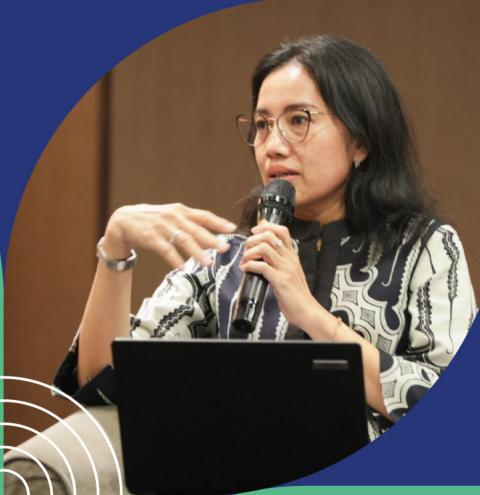
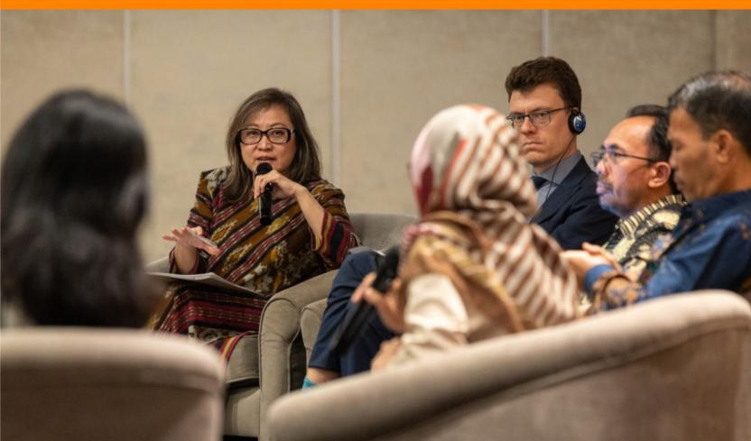
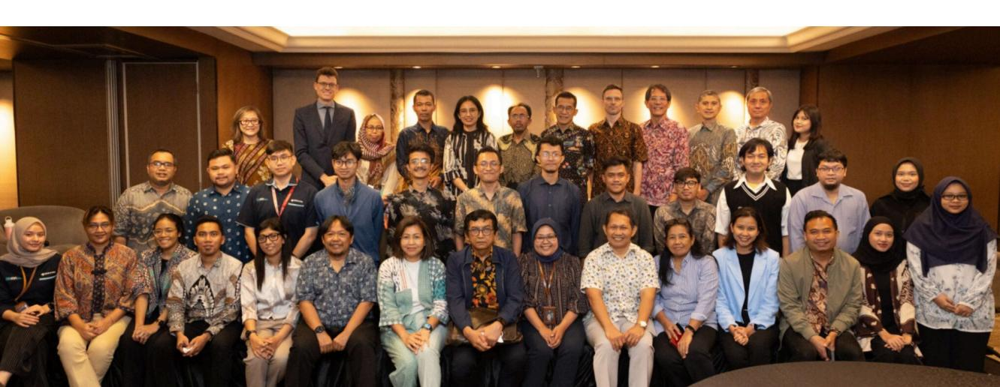
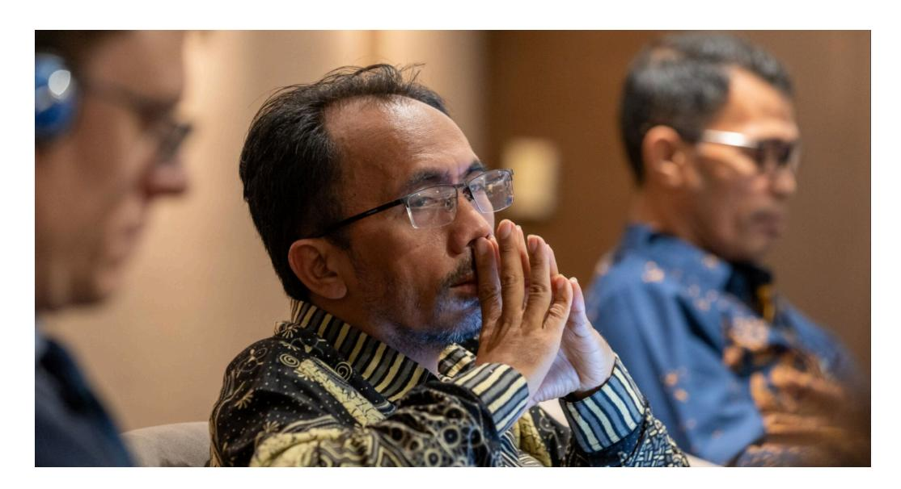
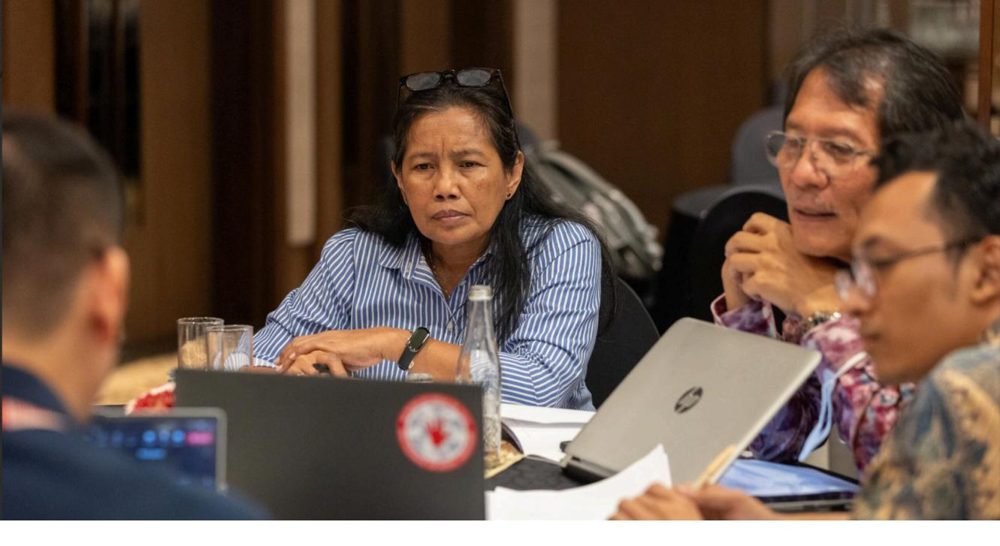

Co-funded by  
the European Union

Final Report

# Cross-Commodity Workshop on EUDR Readiness in Indonesia

This publication was produced with the nancial support of the European Union. Its contents are the sole responsibility of Saka Dala and do not necessarily reΌect the views of the European Union

# Results of the Process and the Workshop

## Introduction

The European Union together with BMZ commissioned the project **"Engagement with Indonesia, Malaysia, Laos, Thailand and Vietnam to raise awareness on and to promote better understanding of the EU approach to reducing EU-driven deforestation and forest degradation (EUDR Engagement)"**. The project EUDR engagement supports stakeholders in participating countries with enhancing the understanding for and alleviate concerns about the EU Regulation on Deforestationfree Products (EUDR) in particular on its core elements (i.e. mandatory due diligence rules, traceability, benchmarking), to create an enabling environment for compliance by operators and the opportunities the EUDR implies.

In line with the Term of Reference (ToR), the primary objective of this workshop was to disseminate the results of the commodity-specic focus group discussions (FGDs) and ndings from related studies to a broader audience. This initiative aimed to contribute to fostering a more positive narrative around the European Union Regulation on Deforestation-free Products (EUDR).

The overarching goal was to promote collaboration, enhance awareness, and clarify the roles and responsibilities of various stakeholders impacted by the EUDR in Indonesia and further spread information already gathered during other FGD events.

## Objectives of the event

- 1. Share national and sub-national government initiatives to prepare stakeholders, especially farmers, to meet EUDR requirements, focusing on bridging gaps over the next 12 months.
- 2. Foster multi-stakeholder collaboration to support farmers and large companies in meeting EUDR requirements, especially regarding legality and traceability.

"The main objective of the *Cross-Commodity Workshop on EUDR Readiness in Indonesia* was to broaden stakeholder participation and gather more comprehensive inputs from the three commodities: natural rubber, coΊee, and cocoa. It also aimed to support EUDR implementation readiness over the next 12 months.

## Time and Venue

The workshop was held as a hybrid event on 10 December 2024, at the Ayana Mid Plaza Hotel, Jakarta. It was conducted in Bahasa Indonesia, with simultaneous English interpretation available. Detailed Agenda available in Annex 1.

## Participants

The workshop brought together a diverse group of participants (Annex 1), including both in-person and online attendees. The participants numbered approximately 50- 60 in-person and 55 online and represented the following groups:

- a) Relevant Directorates in Ministries involved in the cultivation and trade of natural rubber, cocoa, and coΊee
- b) Provincial and district government ocials working on the cultivation and trade of these commodities
- c) Development partners, NGOs, and academia engaged in agriculture, forestry, and EUDR-related issues

# Main Themes and Findings

# Legality Aspects Highlighted

The eight legality aspects outlined under the EUDR align closely with Indonesia's existing legal framework, including foundational laws such as the 1945 Constitution (Undang-Undang Dasar/UUD 1945). These aspects are pivotal for ensuring compliance and readiness among stakeholders.

## Land Use Rights

 The Plantation Law (Law 39/2014) provides detailed regulations for large plantation businesses but lacks comprehensive mechanisms for smallholders. The Right to Cultivate (Hak Guna Usaha/HGU), has been regulated under the Agrarian Law 5/1960, and is carried out through the registration and business to use state-controlled land for specic periods. However, smallholders often lack legal documentation to secure similar rights.

 Farming registration is required in the form of a Cultivation Registration Certicate (STDB). STDB registration, recently updated to e-STDB, necessitates land ownership documentation such as SHM (Land Ownership Certicate), Girik, or recognition of Customary Land. However, low levels of land ownership documentation among smallholders pose a signicant challenge. Without proper land ownership, smallholders face delays in achieving STDB/e-STDB registration, which directly impacts their compliance with EUDR requirements. The Plantation Law also regulates that land use for agricultural purposes align with spatial and land use planning and obliges large plantation companies to support the development of community plantations in surrounding areas. Smallholders often need assistance in mapping land status due to limited knowledge and resources related to geolocation. Many lands are within forest areas or overlap with HGU and other land rights, complicating compliance eΊort. Smallholders perceive STDB ownership as a passive requirement, lacking immediate benets, which discourages active registration. Concerns among smallholders that the legality of land ownership will have potential tax implications further compound this hesitation. Strengthening smallholder land tenure is vital not only for EUDR compliance, but also for improving their access to markets and institutional support. This requires coordinated eΊorts between government agencies and the private sector to simplify processes, provide clear benets, and enhance geospatial support systems.

## Environmental Protection

 The Environmental Protection and Management Law (Law 32/2009) mandates the identication and safeguard of ecosystems and biodiversity, prohibits burning as means to land clearing for cultivation, and emphasizes biodiversity conservation. Government Regulation on the Implementation of Environmental Protection and Management in Indonesia (PP No. 22/2021) also regulates the following: Prohibition of forests and/or land burning. Obligation to prevent environmental damage and/or pollution related to forest and/or land res.

 Requirements for businesses to prevent forest and/or land res within their operational area and availability of adequate facilities and infrastructure to prevent forest and/or land res within the operational area. Regulations on waste management and the responsible use of chemicals are enforced to minimize negative impacts on the environment. The legal framework emphasizes the importance of sustainable practices in plantation management, ensuring that environmental functions are preserved while promoting responsible agricultural activities. These environmental obligations align with EUDR goals and demonstrate Indonesia's commitment to sustainable practices. Stronger enforcement and enhanced stakeholder awareness are needed to ensure compliance.

## Forestry

 Forestry Law 41/1999 and Plantation Law 39/2014, prohibit the conversion of forests into agricultural land and establish land tenure rights, ensuring that plantation activities are conducted within sustainable forest management framework. Sustainable forest management regulates: Forest area management and forest management planning Forest use and use of forest areas Forest rehabilitation and reclamation Forest protection and nature conservation. Government Regulation (PP) No.23/2021 provides detailed guidelines on forestry planning, utilization, and protection. Law 18/2013 outlines the eΊort to eradicate forest destruction, e.g. illegal logging, unlicensed mining, and unlicensed plantation activities. The law addresses the impacts of forest destruction, including damage to social and cultural life, environmental degradation, and the increasing organization and transgression of illegal activities. These measures are critical for ensuring that plantations adhere to deforestationfree requirements. However, better integration of forestry data with agricultural supply chains is needed to meet traceability demands.

## Third Party Rights

 PP No. 23/2021 on Forestry Implementation and PP no. 26/2021 on the implementation of agriculture regulate various aspects, including the implementation of forest and land rehabilitation by prioritizing a participatory approach to empower communities and ensure their inclusion in forest protection and monitoring activities. Companies are obliged to forge mutually benecial partnerships with smallholders, employees, and local communities in a respectful, responsible, supportive, and interdependent manner. Strengthening partnerships with local communities builds trust and fosters more transparent supply chains.

# Labor Rights

 Law 13/2003 on labor and several relevant regulations reΌect the Indonesian government's commitment to comprehensive labor protection that covers occupational health and safety, the right to create labor union, equal treatment, support for workers with disabilities, the prohibition of child labor, special protection based on gender, working hours, wages, and social security. While these measures are robust, awareness campaigns are needed to ensure that smallholders and workers understand and exercise their rights.

## Human Rights and FPIC

 Human rights are embedded in Indonesia's 1945 Constitution (UUD 45) and detailed further in Law No. 39 of 1999, which outlines rights relevant to the plantation sector. Indigenous peoples' rights, including land use, natural resource management, and cultural preservation are formally recognized and protected. The use of customary land rights for activities such as plantations requires adherence to Free, Prior, and Informed Consent (FPIC) principles. Violations, such as cultivating, using, occupying, or controlling customary land without valid permits can result in signicant penalties, including imprisonment and nes. Producers are obligated to engage in meaningful consultations with indigenous communities, ensuring fair compensation and compliance with FPIC protocols. Operationalizing FPIC principles demands clearer guidelines and greater enforcement to protect indigenous rights while ensuring plantation activities are ethically conducted.

## Taxation, Anticorruption, Trade and Customs Regulations

 PP No. 50/2022 regulates Tax Obligations for plantation sector businesses, including income tax (PPh), value-added tax (VAT), and land and building tax (PBB). PBB is closely linked to land ownership documentation and compliance. Indonesia's anti-corruption framework, supported by the Anti-Corruption Commission (KPK) under Law Number 19 of 2019, strengthens public condence in government accountability and ethical governance. Measures include whistleblower protections, task forces to combat illegal levies, and regulations promoting transparency in trade and pricing. Strengthening governance, transparency, and anti-corruption measures not only enhances compliance but also fosters a more equitable and competitive market for Indonesian agricultural exports.

## Traceability

 Palm oil is the most advanced in terms of traceability in the supply chains. Ministerial Regulation 38/2020 concerning the Implementation of Indonesian Sustainable Oil Palm Plantation Certication, traceability is specically regulated in Articles 28-30, in a segregated and mass balance model. However, it's not clear as in oil palm, for rubber, cocoa and coΊee commodities. In general, traceability of food materials for food security is regulated under the Government Regulation No. 86/2019, which emphasized traceability as an important aspect for food sanitation. Law No. 22/2019 requires an integrated information system to track the movement of goods across supply chains. However, this is currently limited to food safety and does fully address deforestation-free criteria. Many smallholders lack the technical and nancial resources to adopt traceability systems. This creates a gap in the overall traceability chain, especially for commodities like coΊee, rubber, and cocoa. The lack of centralized data systems results in ineciencies and inconsistencies, making it harder to ensure comprehensive traceability. Limited engagement of processors, exporters, and downstream industries in supporting traceability at the farmer level. Expanding traceability to meet deforestation-free requirements is not only crucial for EUDR compliance but also enhances Indonesia's reputation as a supplier of sustainable agricultural products. Collaboration between public and private sectors, supported by advanced technologies, will be essential for achieving a seamless and transparent supply chain.

 Indonesia's current traceability framework, while initiated through systems such as e-STDB, presents a gap in addressing comprehensive deforestation-free requirements as mandated by EUDR. It provides a recording of smallholder farming activities and land use, however tracing of commodities movement through the supply chain is limited without integration with downstream actors' records, particularly in terms of volume tracking or product absorption. It is important to note that while tools like e-STDB can support national traceability eΊorts, they are not ocially recognized by the EU as standalone proof of compliance under EUDR. Operators in the EU remain fully responsible for conducting and documenting due diligence in accordance with the regulation, and third-party tools or certications are not considered a substitute for this legal obligation.

## Perspectives on the 12-Month Postponement of EUDR

The postponement of the EUDR application timeline by 12 months provides an extended window for stakeholders to align their readiness with regulatory requirements. The perspectives of key representatives across various sectors are outlined below:

*Representative of the Director of Processing and Marketing of Plantation Products (PPHP), Ministry of Agriculture* 

 The extension oΊers a valuable opportunity for PPHP to continue collecting and mapping plantation data, including the issuance of e-STDB certicates. This database can demonstrate that producers are adhering to good agriculture practices (GAP). Challenges include the verication of farmers' land as "clean and clear" by the Regional Government Teams, which requires additional resources such as human capital, digital equipment, and funding. Smallholders face time constraints, as they are only available for interviews and data collection outside of working hours. Dicult terrain, especially in coΊeegrowing regions adds complexity to data collection eΊorts.

*Representative of the Director Social Forestry Business Development (PUPS), Ministry* of *Forestry*

 EUDR remains a new concept for many Forest Farmers Groups (Kelompok Tani Hutan/KTH), with activities still in the awareness stage.

 While the legality of smallholders in the Social Forestry Program (Perhutanan Sosial/PS) is supported by Ministerial Decrees, there is a signicant need for mentoring program1. The 12-month extension will be utilized to improve Social Forestry governance, both within and outside Java, involving Perhutani and other programs2 .

### *Representative of the Head of Plantation Agency, South Sumatra Province*

 South Sumatera's commodities impacted by EUDR include palm oil, rubber, and coΊee. In 2024, no coΊee exports from South Sumatra were directed to the EU, while rubber accounted for 12% of exports, as stated by Mr Havizman. The postponement will support the achievement of e-STDB issuance, currently 100% funded by the Central Government (Ministry of Agriculture). In 2023, 601 e-STDBs were issued for rubber, and 3,500 are planned for coΊee in 2024. The Regional Government's budget for accelerating e-STDB is not clearly determined yet. The local government expects assistance and involvement of the rubber processing industry in collecting data, mapping and the process of e-STDB registration for rubber smallholders, because processors/exporters critically need this data/document for EUDR compliance. While e-STDB can serve as a national traceability mechanism and a starting point for collecting geolocation data, it is not ocially recognized by the EU as proof of EUDR compliance. Under the regulation, EU-based operators must independently conduct due diligence and cannot rely solely on third-party systems or certication schemes. Standardizing land and farming data collection methods across stakeholders is critical to minimize confusion among smallholders. The benets of e-STDB have not been fully sensed by farmers, due to limited understanding of its purpose and advantages. This underscores the need for targeted outreach eΊorts to improve awareness and education among smallholders. The local government advocates for simplifying the requirements to obtain an e-STDB, aiming to make the process more accessible and less

1 Of the 14,000 **Kelompok Usaha Perhutanan Sosial** (KUPS), only about 68 are classified as Gold or Platinum. These classifications indicate the level of institutional, regional, and business development achieved, with Platinum representing farmer groups that have established stable national and international markets. Conversely, Blue and Silver KUPS reΌect earlier stages of development, focusing on institutional foundations and area management. These distinctions highlight the varying levels of readiness and potential for EUDR compliance across KUPS categories.

2 A number of social forestry smallholders are managed under the Perhutani programs in Java and others under the Directorate of Social Forestry Business Development (Pengembangan Usaha Perhutanan Sosial/PUPS) of the Ministry of Forestry.

burdensome for smallholders, thereby encouraging greater participation.

 The South Sumatra Provincial Government has issued a Regional Regulation for Sustainable CoΊee. Currently and moving forward, outreach eΊorts regarding this Regulation should be carried out in tandem with EUDR dissemination activities to ensure stallholders are well-informed and adequately prepared.

*Center for Regional Systems Analysis, Planning, and Development (CrestPent), IPB University*

 The 12-month extension is an ideal momentum to enhance governance and commodity data collection. The voluntary rules around e-STDB do not currently present any challenge for smallholders to have an e-STDB. Middlemen, processors and exporters should play a greater role in helping smallholders to obtain e-STDBs, as they rely on this data for trade. The private sector should actively assess and help improve government's policies to better align with industry needs.

### *EU Delegation*

 The extra time is benecial for addressing gaps in stakeholders' readiness. It highlights the importance of focusing more on the 11.2% of rubber and 13% each of coΊee and cocoa exported to the EU, as well as indirect exports. The Due Diligence Statement (DDS) requires operators to ensure between supply chain actors (farmers, middlemen, processors, exporters) regarding data, documents and information. Intensive collaboration is necessary to align the supply chain data with the DDS requirements.

## Priority Activities for the Next 12 Months

*Representative of the Head of Plantation Agency, South Sumatra Province*

 Continuing the progress of e-STDB issuance. Conduct outreach on the importance of e-STDB and the Provincial Government Regulation on sustainable coΊee. Collaborate with private sectors, especially rubber processors, to increase the number of registered STDBs. Improve governance in the rubber sector, focusing on farmer institutions such as partnership and Raw Rubber Processing and Marketing Unit (UPPB). Engage private sectors to develop and replicate ecient, transparent UPPB models compared to the long, complex and conventional supply chains.

 Prioritize e-STDB support for the 478 UPPBs established by smallholders with government facilitation.

## *Representative of the Director Social Forestry Business Development (PUPS), Ministry* of *Forestry*

 Conduct outreach on EUDR requirements to smallholder's product takers, including middlemen/collectors, processors, exporters, and Perhutani. Focus support on the gold and platinum categories of Forest Farmers' Groups (KTH) within Social Forestry Programs, to ensure e-STDB registration, in collaboration with the Ministry of Agriculture (PPHP).

*Representative of the Director of Processing and Marketing of Plantation Products (PPHP), Ministry of Agriculture*

 Collaborate with the Social Forestry Program to enhance e-STDB registration for smallholders, including potential regulatory revisions on the e-STDB for Social Forestry smallholders. Aim to register all smallholders' data, regardless of EUDR requirements, to establish a comprehensive database.

### *EU Delegation*

 Address the question of whether smallholders under Social Forestry Programs will meet EUDR requirements.

## Private Sector Facilitation and Support Needs for EUDR Readiness

*Representative of the Director Processing and Marketing of Plantation Products* (PPHP), *Ministry of Agriculture*

✓ The connection between farmers and industry is inseparable due to their interdependent roles. However, eΊective partnership institutions are challenging to establish without transparency and trust between both parties. ✓ A signicant issue lies in the authority of the Ministry of Agriculture to regulate the industry, including the middlemen. Given the strategic importance of middlemen in the supply chain of plantation commodities, data collection and their development are critical. Provincial and district governments should regulate middlemen to ensure that global market demands for traceability and transparency are met. ✓ The private sector can play a pivotal role by assisting farmers in collecting data, mapping their land, and directly inputting this information into the e-STDB registration system. Notably, the coΊee industry lacks substantial industrial sector involvement in farmer data collection.

### *Representative of the Head of Plantation Agency, South Sumatra Province*

✓ While the industry generally possesses sucient resources to prepare for EUDR compliance. The Plantation Agency focuses more on supporting smallholders, who are in greater need of assistance. ✓ Although the process of issuing e-STDB is theoretically free if farmers can independently collect and map their data, the verication process requires Agency's ocers, whose activities (e.g. travel and mapping) necessitate funding support. ✓ Prioritized data collection and mapping eΊorts can target farmers in explantation project areas, such as those under the Rehabilitation and Replanting of Plantation Crops Project (PRPTE), Nucleus Estate for Smallholding (NES), and Smallholder Rubber Development Project (SRDP). These farmers often already have much of the required data and documentation needed to obtain STDB, except for geo-locations. ✓ A fundamental diΊerence between palm oil and rubber, coΊee, and cocoa commodities is that while palm oil enjoys clear funding for e-STDB, the same is not true for other commodities.

# Q&A from Participants

## Sadam of Madani Berkelanjutan

 The Ministry of Agriculture should revise the e-STDB regulation for Social Forestry (SF) smallholders to accept alternative proofs of land legality, such as a Collective Decree from the Minister of Forestry, rather than solely relying on landowner certicates (SHM) or Girik.

————————————————————————————————————

Conduct outreach on e-STDB at local levels to ensure smallholders are aware and engaged.

————————————————————————————————————

Legality and traceability in the cocoa sectors are established but fragmented across diΊerent Ministries. Harmonizing these regulations into a single document would enhance clarity and eciency for commodity traceability.

————————————————————————————————————

Private sector participation is essential in preparing middlemen/collectors for EUDR compliance.

**?**

Q: How should agroforestry under SF programs after cut-oΊ date comply with deforestation-free and legality aspects. A: Asccording to EUDR, agroforestry is classied as agricultural use. This implies that converting forests to agriculture use constitutes as deforestation under EUDR.

|  Tau΋k of Proforest                                                      |
|---------------------------------------------------------------------------|
|  Achievement of e-STDB is critical in the coming months. This requires a |
|  Online Question                                                         |
|  The publication of Country benchmarking will happen before end of June  |

# Closing and Next Collaboration

## *EU Delegation*

 This event has been instrumental in preparing stakeholders for EUDR readiness. A similar setup remains highly relevant for future Private Sector Dialogues, involving both National (across diΊerent Ministries) and Subnational Governments. These groups provide distinct perspectives on the three key commodities. The 12-month postponement period should focus on resolving technical issues such as those discussed during this workshop. Several ongoing EU projects can assist with key aspects required by EUDR such as legality, traceability, and communication with smallholders. Aligning these mechanisms with the future needs is critical. The EU, together with the Government of Indonesia and commodity stakeholders will continue to provide support for EUDR readiness over the next 12 months.

 Strong collaboration among various Ministries and Agencies is essential to compile and unify diΊerent regulations into a cohesive document.

*Center for Regional Systems Analysis, Planning, and Development (CrestPent), IPB University*

 Indonesia must adopt EUDR requirements comprehensively to maintain access to the EU market. Achieving consensus among all related Ministries and Agencies is crucial for successful adoption.

*Representative of the Director of Social Forestry Business Development (PUPS),* Ministry *of Forestry*

 Echoing IPB CrestPent's concerns, adoption of EUDR mandates readiness and preparation for full compliance.

*Representative of the Director of Processing and Marketing of Plantation Products* (PPHP), *Ministry of Agriculture*

 While adoption is necessary, adjustments to existing regulations are crucial. Identifying and agreeing on critical aspects requiring synchronization Ministries and Agencies is key to compliance.

# Working Group Discussion

## Issues to be Discussed

The group discussion was divided into two groups to explore into the technical of unresolved issues and identify concrete priority steps for the next 12 months to bridge the readiness gaps for EUDR compliance. Discussions focused on the policy and legality aspects of EUDR, as well as measures to reduce disparities between national and local levels in the next 12 months for the three commodities rubber, coΊee, and cocoa.

# Results of Working Group Discussion

## Working Group 1.

Participants of Working Group 1 included Government ocials, i.e. from the Ministry of Agriculture, Ministry of Forestry, Ministry of Trade, CBI, TFA, LTKL, Kaoem Telapak, Save The Children, IPB University.

- 1. Indonesia should continue advocating for a unied denition of "forest" to align EU and Indonesian perspectives, reducing confusion among business actors about compliance requirements.
- 2. Outreach of EUDR and related rules should extend beyond the national level to provincial, district, sub-districts and village levels. Organizations such as LTKL, CAMP, and SCOPI could play a role through their networks.
- 3. e-STDB should be utilized to access various incentives from government programs reaching the village level. While such benets exist and are prioritized for e-STDB owners, they remain unrealized at the eld level.
- 4. The National Dashboard must demonstrate its capacity to manage national data and act as a gateway for global markets, including the EU.
- 5. Child labor remains a critical concern in agricultural supply chains. Ensuring compliance with EUDR demands robust monitoring systems to identify and address child labor issues. These systems should be integrated into traceability frameworks, prioritizing training and awareness programs for farmers and intermediaries. EΊective partnerships with local governments, NGOs, and international organizations are essential to develop sustainable solutions that eliminate child labor while supporting smallholder livelihoods.
- 6. Collectors/middlemen are critical to implementing traceability and compliance with EUDR. Incentives and training should be designed to enhance their participation in short-to-medium term programs.

Policy improvements and concrete steps expected from government's representatives expected during this Group Discussion 1, were unfortunately limited due to the current transition to a new government administration following a recent presidential election3 .

The government is actively advancing the preparation of e-STDB and the National Dashboard to enhance traceability and data management. However, these tools are not explicitly required by the EUDR. Instead, EU operators prioritize direct access to data, information, and documents from their downstream supply chains, bypassing third-party systems. This discrepancy underscores the need for alignment between national initiatives and EUDR operator expectations to ensure eΊective compliance.

3 The current transition has created an interim period where formal policy directions remain undefined, which could pose challenge in implementing operational steps for EUDR readiness.

## Working Group 2.

Participants of Working Group 2 included representatives from Koalisi Ekonomi Membumi (KEM), WWF, SNV, GIZ, and A representative of South Sumatra Plantation Agency. While online participants were less active, the group produced actionable recommendations:

- 1. Awareness building activities should focus on EUDR requirements and global trade implications for Indonesia.
- 2. Benchmarking Indonesia's eΊorts against other countries was deemed essential to rene its approach to legality readiness (partly regarding where e-STDB contributes to EUDR and the incentives for smallholders).
- 3. Market driven traceability improvements were emphasized, including institutional strengthening for both smallholders and companies.
- 4. Key priorities include: Enhancing operational and technical capacity for traceability among local ocers, farmers, and intermediary traders at the village level. Expanding human resource capacity at the village level. Strengthening farmer organizations and shortening supply chains through cooperatives and partnerships.
- 5. Identifying and implementing potential pilot projects for readiness measures.

**Table 1. Results of Group Discussion 2**

|     | Location/ Involved                                                                                                                                                                                                                                                                                                                                                                                                                         |
|-----|--------------------------------------------------------------------------------------------------------------------------------------------------------------------------------------------------------------------------------------------------------------------------------------------------------------------------------------------------------------------------------------------------------------------------------------------|
| No. | Priority Activities                                                                                                                                                                                                                                                                                                                                                                                                                        |
|     | Stakeholders Timeline Funding Source/ Tar get                                                                                                                                                                                                                                                                                                                                                                                             |
| 1a  | Building urgency: Province: Dinas January Not yet in State understanding the South Sumatra, Perkebunan, and Regional March EUDR at local levels District: Musi Development Budgets and its commodity Partners, CSOs for EUDR Banyuasin market impacts preparation Province: West Kalimantan Promote (Rubber), shared Districts: responsibility Sintang, funding with Sanggau end-users Province: Central Sulawesi (Cocoa), District: Sigi |
| 1b  | Commitment                                                                                                                                                                                                                                                                                                                                                                                                                                 |
|     | National GAPKINDO, January Multi from high-level ASKINDO, AEKI, stakeholder March policymakers: Private sectors, approach CSOs, Media discussions with Ministries and awareness campaigns through media EUDR Legality Readiness                                                                                                                                                                                                          |
| 2a  | Benchmarking                                                                                                                                                                                                                                                                                                                                                                                                                               |
|     | National Central January Shared EUDR readiness December and Local responsibility Governments, funding with countries such as Thailand, Ivory GAPKINDO, Coast, and Vietnam ASKINDO, AEKI, Private sectors, Development partners, CSOs                                                                                                                                                                                                      |

2b Support for

e-STDB readiness with government

incentives, including funding for technical/

operational barriers like geolocation

mapping

National Central

and Local Governments, GAPKINDO, ASKINDO, AEKI, Private sectors, Development partners, CSOs

January-December 2025

Promote shared responsibility

2c Incentives for companies contributing to farmers traceability

eΊorts

National Central

and Local Governments, GAPKINDO, ASKINDO, AEKI, Private sectors, Development partners, CSOs

January-December 2025

Promote shared responsibility

### **Traceability Aspects**

| 3 | Market-driven traceability through institutional strengthening of companies and stakeholders                                             | Trading companies                                        | Companies, middlemen, collectors, smallholder farmers | January-December 2025 | End-users need reinforcement; the government acts as an enabler. Greater involvement of private sector funding is needed |
|---|------------------------------------------------------------------------------------------------------------------------------------------|----------------------------------------------------------|-------------------------------------------------------|-----------------------|--------------------------------------------------------------------------------------------------------------------------|
| 4 | Capacity building: strengthen farmer organizations and institutions by shortening supply chains and creating cooperatives/ partnerships. | Province: South Sumatra, District: Musi Banyuasin (UPPB) | Ministry of Agriculture, Dinas Perkebunan, UPPBs      | January-March 2025    | Potential funding sources: - Bumdes - UPPBs (478 units regulated by Ministries of Agriculture and Home Affairs)          |
|   |                                                                                                                                          | Districts: Sanggau, Sintang                              | Farmers, Development Partners (LTKL)                  |                       | - Profit Sharing Fund                                                                                                    |
|   |                                                                                                                                          |                                                          |                                                       |                       | - UNDP or other UN Agency projects.                                                                                      |

- 1. This workshop was conducted at an opportune moment to identify existing gaps and prioritize activities to prepare Indonesia for EUDR compliance within the extended timeline.
- 2. Indonesia possesses comprehensive legal frameworks addressing the eight aspects of EUDR legality. For smallholders, the critical legality requirement is land rights, often related to tax obligations (PBB).
- 3. The Ministry of Agriculture prioritizes registering farmers for e-STDB, as it provides essential data (geo-location, land rights, traceability) for EUDR compliance. However, challenges such as limited funding, human resources, and technical support for data collection, land mapping and land verication persist. Collaborative eΊorts involving private sectors, development partners, and CSOs are essential, and EU collaboration remains vital to accelerating e-STDB achievements and farmers preparedness.
- 4. Traceability regulations in Indonesia are fragmented across various ministries and focus primarily on food safety and quality, neglecting deforestation concerns. The forum agreed that there is an urgent need for the Government to synchronize and harmonize traceability rules into a comprehensive regulatory framework to guide business actors in global trade. The oil palm commodity has regulated the traceability, under segregated and mass balance model, but not in the other commodities.
- 5. Urgent outreach eΊorts on EUDR, e-STDB, and the National Dashboard are required at the local level, to ensure farmers and middlemen understand the regulations, their implications and potential benets for business. It is important to reiterate that while various traceability tools are being developed in Indonesia to support compliance, these tools are not in themselves recognized by the EU as compliant under EUDR. Operators must independently verify that all requirements are met.
- 6. EUDR related activities by CSOs and Development Partners, including outreach, capacity buildings on traceability, geolocation mapping applications, and others can accelerate readiness in neighboring provinces and districts.
- 7. Due to the transition of the New Government's Structure, it's not clear yet who will be in charge of the EUDR related issues, especially at the Coordinating Ministry's level, whether the Coordinating Ministry for Economic AΊairs or Coordinating Ministry for Foods. This transition phase inΌuences the uncertainty of the support programs for the readiness of smallholders to EUDR.
- 8. Future private sector workshops and dialogues on EUDR readiness must include active participation from both National and Subnational Governments to engage private sectors in preparing for compliance.

# Annex 1

### Agenda of Cross-Commodity Workshop on EUDR Readiness in Indonesia

Jakarta, 10 December 2024

| Time          | Agenda                                   | Speaker/              |
|---------------|------------------------------------------|-----------------------|
| 08:30 – 09:00 | Arrival of Participants and Registration | Facilitator           |
| 09:45 - 11:45 | Session I: Panel Discussion:             | Current progress, the |

| 11:45 - 13:00    | Facilitator Group Photography and Lunch ——————————————————————————— Session II: Group Discussion: Steps for Filling the Gaps on                                                        |
|------------------|----------------------------------------------------------------------------------------------------------------------------------------------------------------------------------------|
| A.               | Group 1: Policy and Legality Aspects of EUDR related to Smallholders Issues such as, but not limited to: All Participants                                                              |
| 1.               | What legality aspects, amongst 8 required by (divided into EUDR, are already clear in place and what are two groups) not? what actions needed? (land rights, tax, labour rights, etc)  |
| 2.               | What policies are needed at national and sub-national level to accelerate the preparedness of EUDR compliance?                                                                         |
| 3.               | What are the priorities of legality aspects to be ful΋lled for smallholders?                                                                                                           |
| B. 13:00 - 15:00 | Group 2: Steps to ΋ll the gaps at the national and local levels Issues such as, but not limited to:                                                                                    |
| 1.               | What priority measures and activities provide accelerated solutions in ΋lling the EUDR compliance readiness gaps? considering understanding, technical, local capacity, ΋nancial, etc. |
| 2.               | What commitments to muti-stakeholder collaboration at the local level need to be supported by the Government and the EU and other stakeholders?                                        |
| 15:00 - 15:30    | Summary Presentation of each Group Representative of the Group                                                                                                                         |
| 15:30 - 15:45    | Workshop Takeaways Saka Dala and EU Delegation                                                                                                                                         |
| 15:45 - 16-00    | Closing Remarks Facilitator                                                                                                                                                            |

# Annex 2

## List of Participants

## **Ministry/Government Agency**

Ministry of Agriculture

Ministry of Forestry

Ministry of Trade

Ministry of State-Owned Enterprise (BUMN)

South Sumatera Province Plantation Oce

### **Embassy**

EU Delegation

Italian Embassy

## **Development Partner/CSO**

Climate Land Use Alliance

GIZ

IFCC PEFC

Koalisi Ekonomi Membumi

Lingkar Temu Kabupaten Lestari

Madani Berkelanjutan

Pro Forest

Satya Bumi

Save the Children

SIPPO

SNV Indonesia

WWF Indonesia

Yayasan Agri Sustineri

## **Others**

Institute Pertanian Bogor

PT. Surveyor Indonesia

Co-funded by  
the European Union