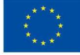

Co-funded by  
the European Union

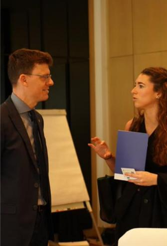

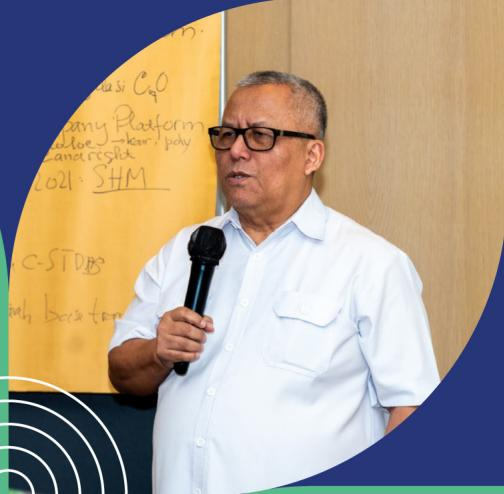

Final Report

# Private Sector Workshop on EUDR Readiness in Indonesia

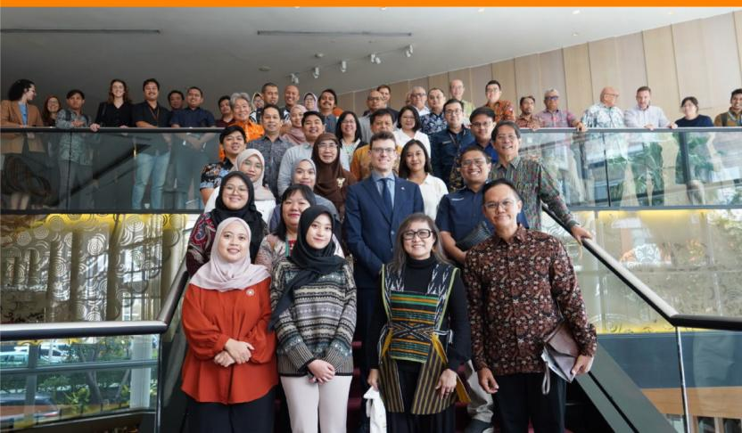

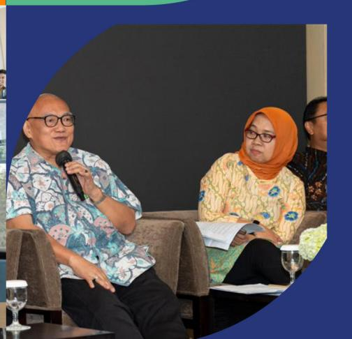

This publication was produced with the nancial support of the European Union. Its contents are the sole responsibility of Saka Dala and do not necessarily reΌect the views of the European Union

The discussions held across the diΊerent private sector commodity groups (natural rubber, coΊee, and cocoa) highlighted signicant progress in identifying the gaps and challenges in meeting the European Union Deforestation Regulation (EUDR) requirements to support EU Operators by December 2025. All commodity stakeholders, including the government agencies, demonstrated a shared commitment to playing their roles in adapting to the EUDR requirements. While concerns remain about the complexity of supporting smallholders and ensuring robust traceability across supply chains, there was also optimism expressed during the panel. This reΌects a growing readiness and willingness among both public and private sector actors to work collaboratively in strengthening traceability systems and ensuring transparency throughout the supply chain.

The multi-stakeholders' collaborations planned for the next coming months serve as a demonstration of commitment to making progress on various initiatives, such as smallholder data collection and geo-location mapping. These initiatives, spearheaded by the private sector, continue to advance EUDR readiness and strengthen optimism among stakeholders to meet the regulation's requirements.

The workshop has also recommended specic actions to address aspects such as legality and data sharing, support for smallholders and intermediaries, collaboration across stakeholders, EUDR implementation plans, the development of digital tools, and funding support for EUDR readiness. The Private Sector Workshop on EUDR Readiness in Indonesia was organized to consolidate insights from private sector stakeholders regarding the implementation of the EUDR. This event followed a series of FGDs, legal assessments, and prior stakeholder consultations. The objective was to rene the understanding of readiness gaps, identify practical challenges, and align strategic next steps between the private sector, government representatives, and European operators.

Building on previous multi-stakeholder engagements, the workshop fostered deeper dialogue between private sector actors, government agencies, and sustainability organizations across commodity sectors. Such discussions are crucial, as they create opportunity for origin countries to bring their perspectives into the conversation in a safe space. By doing so, it helps avoid a top-down approach and allows concerns, misunderstandings, and challenges to be addressed transparently. The discussions not only clarify potential gaps but also showcase the actions that actors are currently taking to prepare for the EUDR. Given the complexity of regulatory requirements and their implications for smallholder farmers and exporters, this dialogue is essential in learning from good examples, identifying gaps, concerns, and viable strategies to ensure smooth preparation to EUDR application by the end of 2025.

# Introduction

The European Union together with BMZ commissioned the project "Engagement with Indonesia, Malaysia, Laos, Thailand and Vietnam to raise awareness on and to promote better understanding of the EU approach to reducing EU-driven deforestation and forest degradation (EUDR Engagement)". The project EUDR engagement supports stakeholders in participating countries with enhancing the understanding for and alleviate concerns about the EU Regulation on Deforestation-free Products (EUDR) in particular on its core elements (i.e. mandatory due diligence rules, traceability, benchmarking), to create an enabling environment for compliance by operators and the opportunities the EUDR implies.

# Objectives of the Workshop

The workshop brought together key stakeholders from across the Indonesian supply chains (coΊee, rubber, cocoa) to discuss the requirements of EUDR and its impact on trade, smallholders, and regulatory aspects in Indonesia. By fostering an open exchange of knowledge and perspectives, the workshop aimed to highlight readiness gaps and chart a pathway toward practical solutions. Discussions covered legal frameworks, traceability systems, nancial barriers, and collaboration to ensure deforestation-free production and market access.

Focusing on three key commodities, **coffee, cocoa, and rubber**, which are major exports to the European market, the workshop aimed:

` To further increase the understanding of EUDR requirements and their implications for the Indonesian private sector. ` To facilitate multi-stakeholder engagement, fostering dialogue between government, exporters, processors, and European buyers, aiming for developing concrete solutions and next steps based on challenges and opportunities already identied earlier ` To assess the current state of readiness in key commodity sectors (coΊee, cocoa, and rubber) and identify compliance challenges. ` To explore potential nancial, technical, and capacity-building solutions for smallholders and industry players. ` To outline next steps for sector-wide collaboration, ensuring traceability, legality, and market competitiveness under EUDR.

# Time and Venue

The workshop was held as a hybrid event on 11 February 2025 at Hotel Pullman, Jakarta. It was conducted in Bahasa Indonesia, with simultaneous English interpretation available. A detailed agenda is available in Annex 1. Additionally, the ndings report, which includes verbatim minutes and key discussion points, is included in Annex 2 for reference.

# Participants

The event was attended by total of 74 (oΎine) and 189 (online) participants, including representatives from:

> Government bodies overseeing trade, agriculture, and sustainability regulations, such as the Ministry of Agriculture, the Ministry of Forestry, the Ministry of Trade, and the Coordinating Ministry for Economic AΊairs.

Exporters and processors from the coΊee, cocoa, and rubber industries.

Industry associations and cooperatives, who play a key role in supporting supply chains and ensuring readiness to meet EUDR requirements.

European buyers and supply chain operators working to align sourcing practices with EUDR.

Financial institutions and NGOs involved in sustainability nancing and capacity-building initiatives.

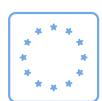

EU Delegation to Indonesia, EU Member State Embassies

The diverse representation ensured a comprehensive discussion on EUDR operationalisation in Indonesia, compliance challenges and opportunities from multiple perspectives. The list of participants and attendance details can be found in Annex 3.

# Setting the Scene and Background Studies

Before the panel discussion, the workshop began with opening remarks from key stakeholders, followed by a presentation of ndings from previous studies related to EUDR preparedness. This included insights from prior FGDs, legal assessments, and results from the legality study analysing the relevant Indonesian legislations, which provided a foundation for the discussions that followed.

Following the ndings presentations, Continental Tires, one of the companies ready for EUDR implementation, shared its experience as an operator navigating the regulation. The presentation highlighted that strong cooperation with suppliers and structured approaches are essential for meeting EUDR requirements. Key challenges highlighted included the need for close coordination with suppliers, verication of GeoJSON data, and legal documentation issues often faced by smallholders. Continental Tires emphasized that without supplier cooperation, compliance would be extremely dicult to achieve.

Continental Tires emphasized that operators are responsible for submitting Due Diligence Statements (DDS) but depend on suppliers for access to critical data. This dependency requires strong cooperation, as operators cannot directly access smallholder supply chains. Continental Tires acknowledged suppliers' eΊorts in meeting EUDR requirements and stressed that compliance should be approached as a structured project due to its complexity.

To manage traceability, Continental Tires utilized a software platform to support GeoJSON data verication and compliance with EUDR requirements. The platform helped streamline data processing and reduce errors, ensuring a smoother transition for suppliers.

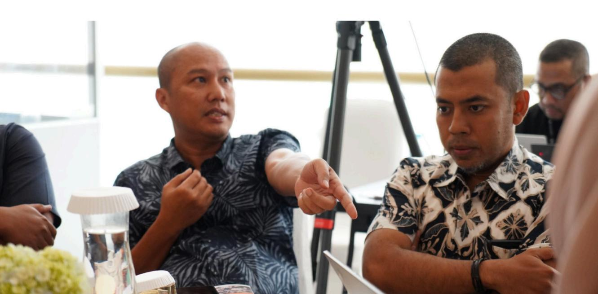

As of February 2025, a large portion of the supply base has been assessed for EUDR readiness, with minor issues expected to be resolved by the end of the year. The company highlighted common errors in GeoJSON data and legal documentation, such as discrepancies in protected forest classications and smallholders' reluctance to provide identication documents. To mitigate these risks, Continental Tires suggested suppliers to work with dedicated service providers and called on the Indonesian government to simplify legal documentation processes.

# Key Findings: Panel Discussions and Group Discussions

# Session 1 Panel Discussion - Key Takeaways

The panel discussion featured key industry stakeholders, including representatives from the Indonesian Ministry of Agriculture, and private sector actors such as Continental Tires (rubber), GAPKINDO (rubber), ASKINDO (cocoa), and SCOPI (coΊee). Moderated by Saka Dala, the discussion highlighted sector-wide challenges, opportunities, and regulatory concerns related to EUDR compliance.

# 1. Government's Perspective (Ministry of Agriculture)

` Acknowledged challenges in aligning national policies with EUDR requirements, particularly in terms of farmer registration and legality documentation. ` Recognized gaps in existing regulations that create uncertainty for smallholders and exporters. ` Expressed concerns about the cost and complexity of compliance, including the costs for data collection, geo-location mapping, and the complexity of segregated products, particularly for smallholder-dominated supply chains, as seen in the coΊee, cocoa, and rubber sectors.

## 2. Continental Tires (Rubber Sector - Private Sector Perspective)

` Stressed the complexity of due diligence and the critical role of suppliers in data collection. ` Highlighted traceability issues, particularly GeoJSON errors and legal documentation gaps. ` Introduced their approach to managing compliance using a software platform that helps verify and structure supply chain data. ` Actively engages with suppliers to facilitate EUDR compliance, including the

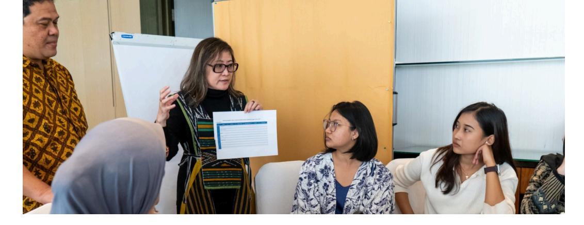

use of digital tools and close coordination to ensure traceability and legal documentation

` Emphasised that some of the challenges are Indonesia-specic, and not encountered in other countries where Continental Tires is active.

#### 3. Industry Associations (GAPKINDO - Rubber, ASKINDO - Cocoa, SCOPI - Coffee)

` GAPKINDO raised concerns about the nancial burden of adapting production patterns to the EUDR for rubber exporters and smallholders. ` ASKINDO emphasized the need for cooperative-based traceability solutions in cocoa supply chains. ` SCOPI highlighted the challenges of disjointed data management, due to long and complex coΊee supply chains and called for sector-wide collaboration.

Calls were repeated to the EU to recognize e-STDB as a legitimate tool for meeting the requirements of the EUDR. However, as claried in the ocial Guidance and FAQs, the EUDR does not allow for the formal recognition or endorsement of third-party tools as a means of compliance.

The process of obtaining e-STDB, ranging from data collection, geo-location mapping, to verication and issuance of e-STDB can be lengthy, and requires the readiness of farmers.

# 4. Market Access & European Buyers' Perspective

` European buyers emphasized long-term supply security concerns if suppliers struggle with aligning production patterns with EUDR requirements. ` The importance of continued engagement with operators was stressed to ensure Indonesian products remain competitive. ` During the session, EU Delegation representative, Sander Happaerts, responded from the audience to provide key insights into the EUDR.

#### Overview

The discussions during the workshop provided valuable insights into the state of EUDR readiness among key stakeholders in Indonesia. While there is a growing awareness of the regulation, signicant gaps remain in terms of compliance infrastructure, data collection, traceability, and nancial support for smallholders. The private sector acknowledged both challenges and opportunities associated with EUDR, particularly in ensuring continued market access while improving sustainability practices.

Key themes emerging from the workshop included:

` Regulatory Uncertainty: Participants raised concerns regarding national regulations. ` Traceability and Data Management: Many stakeholders highlighted diculties in implementing robust traceability systems, particularly for smallholder-dominated supply chains. ` Financial Constraints: The cost of compliance, including data collection for fullling the EUDR requirements, remains a major barrier for many businesses and farmers. ` Capacity-Building Needs: Due to limited understanding of the smallholders and their direct middlemen on EUDR, there is a strong need for technical assistance, particularly in adapting to new requirements and improving sustainable farming practices. ` Collaboration Opportunities: Many stakeholders recognized the importance of public-private partnerships and knowledge-sharing initiatives to ease the transition to deforestation-free production patterns.

#### Session 2 Group Discussion – Steps to Address Gaps in EUDR Readiness by 30 December 2025

The focus of the group discussions was on the most eΊective ways to build a "roadmap" to ensure stakeholders meet the EUDR requirements throughout 2025. The discussions highlighted the roles of both the private sector and the government in addressing issues related to legality, geo-location mapping, data sharing availability, traceability solutions, and more.

Four key topics were explored, each aimed at addressing specic gaps and outlining the necessary steps for readiness and commitment from the private sector, government, and other stakeholders over the next 10 months, as per priority:

## 1. Standard Data, Information, and Documents for DDS:

A focus on clarifying and aligning the standard requirements across sectors, with an emphasis on providing clear documentation and data sharing protocols.

## 2. Legality and Traceability Gaps:

Identifying the existing legality and traceability gaps to date and in the future and steps to full the gap, for the readiness of supply chain actors to answer the EUDR requirements.

#### 3. Addressing concerns around geolocation as privacy data1, legal documentation (e.g., SertiƂkat Hak Milik or Freehold Title), compatibility of traceability systems with government platforms.

# 4. Support for Supply Chain Readiness:

Programs to support smallholders and intermediaries, including geo-location mapping, training, and legal clarity.

## 5. Local Capacity Building:

Multi-stakeholders' collaboration, outreach, training, and digital solutions such as geo-location mapping and e-STDB are essential for enhancing local readiness and capacity to align with EUDR.

### Results

## Natural Rubber Stakeholders

` Clarication Needed: There is still a need for clear guidelines on the reference maps used by the EU to determine the deforestation status of rubber plantations. A list of these reference maps has not yet been provided or widely disseminated to industry players. Suggested revision: As of now, while the EU has provided some frameworks and guidelines for risk-based assessments of deforestation, a denitive, exhaustive list of reference maps has not been provided or widely disseminated to industry players. The EU has emphasized

1 Concern regarding the use of geolocaƟon data as sensiƟve informaƟon was brought up following up previous FGDs and workshops, highlighƟng the need for clear legal frameworks to address data privacy issues.

that no single map (country-based risk level) will be provided but encourages companies to use multiple data sources, including geo-location and historical deforestation data, in their due diligence processes. However, there is still a lack of clear and consistent dissemination of these resources, leading to uncertainty for some stakeholders on how to fully comply with the EUDR

` Legal Land Status: According to the EUDR, rubber products can meet compliance requirements if the land is not deforested and is deemed legal under national legislation. However, many farmers do not possess the necessary legal documents, such as SHM (Freehold Title) or other type of land use right. ` Geo-location Mapping: Certain foreign investment companies have already been working on geo-location mapping for many years, and this data is useful for e-STDB and can help reduce costs. National companies are increasingly adopting blockchain technology to ensure material-based traceability from plantations down to individual farmers. ` Platform Compatibility: Concerns about the compatibility of the National Dashboard with the various platforms used by companies were raised, along with privacy issues related to sharing geo-location data with external parties. ` Priority Actions: In 2025, priority programs will focus on dissemination or outreach, geo-location mapping, land legalization, traceability, and digital applications. These eΊorts will involve various stakeholders in the supply chain, with shared responsibilities for funding and coordinate with the local government.

## Coffee Stakeholders

` Understanding of EUDR: While the coΊee group participants are clear on the EUDR requirements, many local supply chain actors still lack understanding. ` Legal Framework: A faster legal position of the Government on the legality of sharing geo-location data would help private sector actors implement regulations eΊectively. The private sector is concerned that future regulations may prevent them from sharing geo-spatial data with foreign parties. ` Communication and Information Sharing: The group stressed the importance of having ocial channels for communication and regular discussions among stakeholders to clarify e-STDB, National Dashboard, and other critical requirements for EUDR. ` Concrete Actions: The private sector will continue to conduct annual dissemination activities, with government involvement expected to help address questions from farmers. Companies aim to map geo-location data for 54,150 farmers in 2025, with internal funding.

## Cocoa Stakeholders

` Lack of Clarity: Cocoa industry stakeholders expressed operational uncertainties, particularly regarding the sharing of geo-location data for traceability to the foreign parties and how it aΊects compliance with the EUDR. ` Mismatch Between e-STDB and EUDR: The cocoa sector raised concerns about the discrepancies between the requirements of e-STDB and EUDR. Specically, the EUDR requires geo-location mapping using single points for land under 4 hectares, while e-STDB mandates the use of polygon data, which involves higher costs. ` Legal Land Status: The sector also highlighted challenges related to land ownership documentation, especially with the impending requirement of the Freehold Title as the only valid proof of land ownership starting February 2026. Many cocoa farmers lack such documentation as their land is often inherited or owned under customary law. The Government provide limited support to the smallholders to facilitate the land rights due to the limited budget availability, both at national and local levels. ` Uncertainty Around Audit Costs: Cocoa sector representatives questioned whether the costs associated with audits for EUDR compliance will be borne by the industry or the farmers, especially that related to risk assessment. ` Priority Actions: Cocoa stakeholders, such as cocoa exporters, continue with geo-location mapping initiatives. They emphasized the need for government clarication on legal requirements for EUDR compliance, including how e-STDB can be aligned with the requirements set by the EUDR.

#### Key Activities, Responsibilities, and Action Plans for EUDR Readiness in 2025

As part of the ongoing eΊorts to ensure operationalisation with the European Union's Deforestation Regulation (EUDR) by December 2025, a series of key activities have been outlined by diΊerent actors of stakeholders across various commodities (coΊee, cocoa, and natural rubber). These activities have already undertaken or planed, can be essential in addressing the gaps identied in the readiness discussions, particularly in areas such as geo-location mapping, legal land documentation, traceability, and system digitalization.

The activities, planned for 2025, involve a multi-stakeholder approach, with roles and responsibilities distributed among private companies, producers, NGOs, government entities, and buyer clients. The goal is to build a comprehensive roadmap for EUDR readiness, ensuring that each sector and actor is equipped with the necessary tools, knowledge, and resources to meet the regulatory requirements.

These actions are designed to not only ensure preparation of supply chain actors for EUDR implementation but also to support smallholder farmers and enhance transparency and sustainability throughout the supply chain. The commitment of the private sector, supported by clear legal frameworks from the government, is critical in achieving these goals. The following table outlines the specic activities, timelines, target groups, partners, and funding sources for each area of focus, providing a detailed action plan for stakeholders to follow over the next year. More detailed information is provided in Table 2 (Annex 2).

## 1. EUDR Dissemination/Outreach:

Goal: Raise awareness of EUDR among farmers and supply chain actors. Target: Approximately 150–200 farmers in various regions (Jabar, Sulawesi, Bali). Key Players: Terve Chocolate, Freyabadi Indotama, OFI, Koltiva, Halcyon, ABP and more. Funding: Self-funded and buyer contributions.

#### 2. Geo-location Mapping:

Goal: Map farmers' lands for certication and traceability. Target: Over 2,000 farmers in Sulawesi, 150–200 farmers in other regions. Key Players: Koltiva, Sugata, Cargill, JBCocoa, OFI, RLU, ABP, Halcyon, Virco, and more. Funding: Primarily funded by buyers (e.g., Mars, Mondelez, ABP, Halcyon) with potential self-funding.

### 3. Legal Documentation:

Goal: Support farmers in conrming or obtaining legal land ownership documentation. Target: Direct certication farmers, 150–200 farmers in each region. Key Players: Terve Chocolate, Haldin & Talashi, Koltiva, OFI, Sugata, Halcyon, ABP, RLU, etc. Funding: Self-funding and potential buyer support.

### 4. Traceability:

Goal: Implement traceability from farmers to end-users. Target: Certication farmers, especially those in Sulawesi (+2,000). Key Players: Koltiva, OFI, Sugata, Cargill, JBCocoa, and more. Funding: Primarily buyer clients (e.g., Mars, Mondelez, Freya).

## 5. Digital Systems:

Goal: Develop and implement digital systems to manage traceability and certication. Target: Certication program farmers, over 2,000 in Sulawesi, and others. Key Players: Koltiva, OFI, Sugata, Halcyon, ABP, RLU, and more. Funding: Primarily funded by clients, with self-funding from companies.

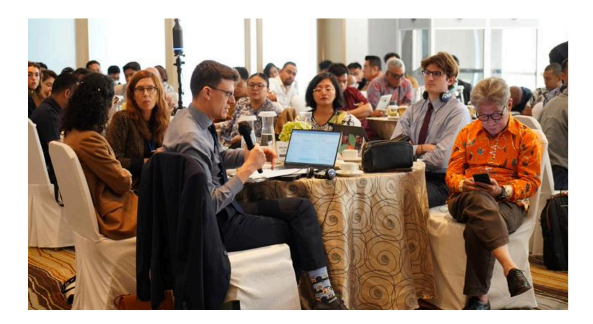

# Conclusion

The discussions held across the diΊerent commodity groups (natural rubber, coΊee, and cocoa) highlighted signicant progress in identifying the gaps and challenges in meeting the EU Deforestation Regulation (EUDR) requirements by December 2025. Key issues, such as geo-location mapping, land legality documentation, traceability, and the integration of digital systems, were consistently emphasized across the sectors. The need for clear legal frameworks and robust, collaborative eΊorts from both the public and private sectors emerged as essential components in achieving EUDR readiness.

Stakeholders, including farmers, producers, private sector companies, industry associations, and government bodies, recognized their roles in driving the adaptation process. With clear, structured actions planned for 2025, there is a shared commitment to supporting smallholders and strengthening the supply chain's traceability and transparency. However, ongoing eΊorts to clarify legal uncertainties, improve datasharing systems, and secure funding will be critical to the success of these initiatives.

The collective actions planned for the coming months, as outlined in the action table, demonstrate a strong foundation for addressing EUDR readiness. These eΊorts will not only ensure compliance but also promote sustainability and legal integrity across Indonesia's agricultural supply chains.

### Recommendations

## Clarify Legal and Data Sharing Frameworks

Based on the discussions, there is still uncertainty about the legal framework in Indonesia for sharing geo-location data and the government's stance on data protection. The government should expedite the clarication of these legal frameworks to provide stakeholders with clear guidelines for sharing geo-location data without violating privacy laws. This is particularly critical for ensuring that private sector actors can comply with EUDR regulations.

#### Provide Targeted Support for Smallholders and Intermediaries

Many smallholders and intermediaries remain unfamiliar with the EUDR requirements, and the complexity of legal land documentation and geo-location mapping poses additional challenges. It is essential for both government and private sector stakeholders to provide training, resources, and nancial support to enable smallholders to meet EUDR requirements. Collaborations between the **government,** industry, and NGOs can help ensure smallholders are included in initiatives designed to support readiness for meeting EUDR requirements and have access to the necessary tools for data collection.

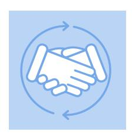

## Strengthen Collaboration Across Stakeholders

The group discussions emphasized the need for continued and improved collaboration between government bodies, the private sector, industry associations, and smallholder farmers. Regular engagement and dialogue are essential to address the evolving

challenges of EUDR adaptation, particularly regarding legal documentation, geolocation mapping, and traceability. Stakeholders must work together to share knowledge, clarify requirements, and develop eΊective solutions to common challenges.

## Develop Phased and Flexible Implementation Plans

Given the varying levels of readiness and the complexity of EUDR requirements, it is recommended that stakeholders develop a phased implementation plan. The plan should prioritize key activities such as geo-location mapping, land documentation, and traceability, but also allow for Όexibility in how these activities are implemented across diΊerent sectors. Private sector companies should be allowed to use their existing platforms to meet EUDR requirements while the National Dashboard and e-STDB systems continue to evolve.

# Support the Expansion of Digital Tools for Compliance

The implementation of digital tools such as e-STDB and the National Dashboard is critical for ensuring that data is tracked and shared accurately. However, there were concerns about the compatibility of these platforms with those used by diΊerent companies. There

should be an eΊort to improve interoperability and ease of use of these platforms to ensure that all stakeholders, including smallholders, can participate eΊectively in the system. Further investments in digital infrastructure are necessary to ensure data consistency and to streamline compliance processes. While these platforms may serve as valuable tools in internal due diligence processes, it is important to recognize that under EUDR, no third-party systems, including national traceability platforms, are ocially accepted as standalone proof of compliance. Operators remain fully responsible for fullling all regulatory requirements.

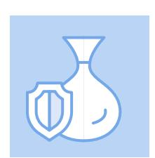

# Secure Financial Resources for EUDR Readiness

The nancial burden on stakeholders, particularly smallholders, was a recurring concern. To address this, both the government and private sector should collaborate to secure funding for EUDR readiness activities. This includes providing nancial incentives to

suppliers for adapting commodity production patterns and collection of relevant data and ensuring that funding is available to support training, legal documentation processes, and the development of geo-location mapping. Additionally, securing funds from buyer clients can support the implementation of key readiness activities, such as traceability and EUDR readiness, especially by smallholders.

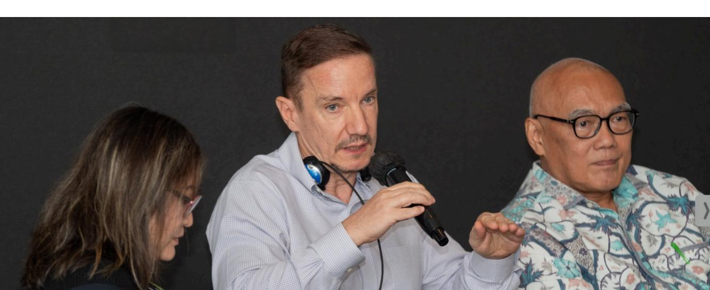

# Annex 1

## Agenda

| Time          | Agenda                                                                                                                                                                                                                                                                                                                                                       | Speaker/Facilitator                                      |
|---------------|--------------------------------------------------------------------------------------------------------------------------------------------------------------------------------------------------------------------------------------------------------------------------------------------------------------------------------------------------------------|----------------------------------------------------------|
| 08:30 – 09:00 | Arrival of Participants and Registration                                                                                                                                                                                                                                                                                                                     | Facilitator                                              |
| 09:00 – 09:20 | Welcoming Session                                                                                                                                                                                                                                                                                                                                            | Saka Dala, EU Delegation                                 |
| 09:20 – 10:20 | Presentation of Findings: <ul style="list-style-type: none;"> <li>↘ Key Results of Commodity-Specific FGDs and Cross-Commodity Workshop for Natural Rubber, Coffee, and Cocoa</li> <li>↘ Legality Study on EUDR in the Indonesian Context by CrestPent, IPB University</li> <li>↘ Sourcing from Indonesia: How do operators in the EU prepare</li> </ul>  | Saka Dala  IPB University  Continental Tires |
| 10:20 – 12:30 | Session I: Panel Discussion  Topic: Current Progress, Gaps, and Steps for EUDR Readiness by Private Sectors  Panellists: <ul style="list-style-type: none;"> <li>↘ Directorate of Plantation Product Down-streaming – Ministry of Agriculture</li> <li>↘ Continental Tires</li> <li>↘ GAPKINDO</li> <li>↘ SCOPI</li> <li>↘ ASKINDO</li> </ul> | Moderator: Saka Dala                                     |
| 12:30 – 13:30 | Group Photography and Lunch                                                                                                                                                                                                                                                                                                                                  | Facilitator                                              |

13:30 – 15:30 Session II: Group Discussion

Topic: Steps to Address Gaps in EUDR Readiness by 30 December 2025

Groups:

Ì Natural Rubber Stakeholders Ì CoΊee Stakeholders Ì Cocoa Stakeholders

Discussion Points:

- 1. What are the standard requirements of Data, Information, and Documents for DDS?
- 2. What are the priorities for legality and traceability by private companies?
- 3. What priority and accelerated measures to support the readiness of supply chain actors?
- 4. What commitments and actions are required to enhance local capacity?

| 15:30 – 16:00 | Summary Presentation by Groups         | Representatives of each Group |
|---------------|----------------------------------------|-------------------------------|
| 16:00 – 16:15 | Workshop Takeaways and Closing Remarks | Saka Dala and EU Delegation   |

# Annex 2

**Table 2. Key Activities, Responsibilities, and Action Plans for EUDR Readiness in 2025**

|    |                                   | Imple                                        |                                                                     |                                     |                         |                       |
|----|-----------------------------------|-----------------------------------------------|---------------------------------------------------------------------|-------------------------------------|-------------------------|-----------------------|
| No | Activity                          |                                               |                                                                     |                                     |                         |                       |
|    |                                   | menting Organiza tion                        | Timeline & Location Coffee                                          | & Number Target Group               | Partners                | Funding Sources       |
| 1  | Outreach                          |                                               |                                                                     |                                     |                         |                       |
|    | of EUDR, Geo-location Mapping,    | SCOPI                                         | After June                                                          | Private sector, member (nationwide) | Multi stakeholders     | Self-funding & Donors |
|    | Legality,                         | LDC                                           | March-April                                                         | 10,000 farmers                      | Self-funding            | Self-funding          |
|    | Traceability, and Digital Systems | SKA                                           | Lampung                                                             | 2,000 farmers                       | Self-funding            | Self-funding          |
|    |                                   | OFI                                           | Arabica &                                                           |                                     |                         |                       |
|    | (in a package of activities)      |                                               | Robusta Growing Area                                                | 23,700 farmers                      | Self-funding            | Self-funding          |
|    |                                   | Rainforest Alliances                          | Central Aceh and Tanggamus                                          | 2,750 farmers                       | Self-funding            | Self-funding          |
|    |                                   | WRI                                           | West                                                                |                                     |                         |                       |
|    |                                   |                                               | Kalimantan, West Java, Lampung, East Kalimantan, Southeast Sulawesi | 3,000 farmers                       | Ministry of Agriculture | Self-funding          |
|    |                                   | Haldin (as a Processor), Talasi (as a Trader) | Bali                                                                | 9,700 farmers                       | Self-funding            | Self-funding          |
|    |                                   | Catur                                         | North                                                               |                                     |                         |                       |
|    |                                   |                                               | Sumatra                                                             | 3,000 farmers                       | Self-funding            | Self-funding          |
|    |                                   | Antara Saudara                                | Lampung                                                             | 3,000 farmers                       | Self-funding            | Self-funding          |

|    |               | Imple                              |                                                                                          |                                                                                          |                                                                          |                                                                                  |
|----|---------------|-------------------------------------|------------------------------------------------------------------------------------------|------------------------------------------------------------------------------------------|--------------------------------------------------------------------------|----------------------------------------------------------------------------------|
| No | Activity      |                                     |                                                                                          |                                                                                          |                                                                          |                                                                                  |
|    |               | menting Organiza tion              | Timeline & Location Cocoa                                                                | & Number Target Group                                                                    | Partners                                                                 | Funding Sources                                                                  |
| 2  | EUDR          |                                     |                                                                                          |                                                                                          |                                                                          |                                                                                  |
|    | Sensitization | Terve Chocolate                     | 2025, West Java, West Sumatra                                                            | Internal & direct farmers, approximately 150 – 200 farmers                               | TBD                                                                      | Self-funding & potential from buyers                                             |
|    |               |                                     | 2025                                                                                     | Internal &                                                                               |                                                                          |                                                                                  |
|    |               | Freyabadi Indotama                  |                                                                                          | supply chain                                                                             | OFI                                                                      | Self-funding                                                                     |
|    |               | OFI                                 | 2025, Sulawesi                                                                           | Certi΋cation program farmers, approximately 65,500 farmers                               | Buyers; Mars, Mondelez, Freya, etc.                                      | Buyers clients; Mars, etc.                                                       |
|    |               | Koltiva                             | 2025, South                                                                              |                                                                                          |                                                                          |                                                                                  |
|    |               |                                     | Sulawesi                                                                                 | Certi΋cation program farmers, approximately 2,000 farmers                                | Sugata                                                                   | Clients                                                                          |
|    |               |                                     | 2025, Bali                                                                               | Internal &                                                                               |                                                                          |                                                                                  |
|    |               | Haldin, Talashi & Cooperatives Alam |                                                                                          | supply chain, 5 farmers                                                                  | Koltiva / OFI                                                            | Self-funding                                                                     |
| 3  | Geo-location  |                                     |                                                                                          |                                                                                          |                                                                          |                                                                                  |
|    |               | Koltiva                             | 2025, South                                                                              |                                                                                          |                                                                          |                                                                                  |
|    | Mapping       |                                     | Sulawesi                                                                                 | Certi΋cation program farmers, approximately 2,000 farmers                                | Sugata, Cargill                                                          | Clients; Sugata, Cargill, JBCocoa, etc.                                          |
|    |               | OFI Terve Chocolate                 | 2025, South Sulawesi, Southeast Sulawesi, Central Sulawesi 2025, West Java, West Sumatra | Certi΋cation program farmers, number TBD Direct farmers, approximately 150 – 200 farmers | Buyers; Mars, Mondelez, Freya, etc. Self-funding & potential from buyers | Buyers clients; Mars, Mondelez, Freya, etc. Self-funding & potential from buyers |
|    |               |                                     | 2025, Bali                                                                               | Direct farmers                                                                           |                                                                          |                                                                                  |
|    |               | Haldin & Talashi                    |                                                                                          | in Bali, 5 farmers                                                                       | Koltiva / OFI                                                            | Self-funding                                                                     |

|    |                     | Imple                 |                                                            |                                                           |                                                 |                                                 |
|----|---------------------|------------------------|------------------------------------------------------------|-----------------------------------------------------------|-------------------------------------------------|-------------------------------------------------|
| No | Activity            |                        |                                                            |                                                           |                                                 |                                                 |
|    |                     | menting Organiza tion | Timeline & Location                                        | & Number Target Group                                     | Partners                                        | Funding Sources                                 |
| 4  | Legal Documentation | Terve Chocolate        | 2025, West Java, West Sumatra                              | Direct farmers, approximately 150 – 200 farmers           | Self-funding & potential support from companies | Self-funding & potential support from companies |
|    |                     |                        | 2025, Bali                                                 | Direct farmers                                            |                                                 |                                                 |
|    |                     | Haldin & Talashi       |                                                            | in Bali, 5 farmers                                        | Koltiva / OFI                                   | Self-funding                                    |
|    |                     | Koltiva                | 2025, South                                                |                                                           |                                                 |                                                 |
|    |                     |                        | Sulawesi                                                   | Certi΋cation program farmers, approximately 2,000 farmers | Sugata, Cargill                                 | Self-funding                                    |
|    |                     | OFI                    | 2025, South Sulawesi, Southeast Sulawesi, Central Sulawesi | Certi΋cation program farmers                              | Buyers; Mars, Mondelez, Freya, etc.             | Self-funding                                    |
| 5  | Traceability        | Koltiva                | 2025, South                                                |                                                           |                                                 |                                                 |
|    |                     |                        | Sulawesi                                                   | Certi΋cation program farmers, approximately 2,000 farmers | Sugata, Cargill                                 | Clients; Sugata, Cargill, JBCocoa, etc.         |
|    |                     | OFI                    | 2025, South Sulawesi, Southeast Sulawesi, Central Sulawesi | Certi΋cation program farmers                              | Buyers; Mars, Mondelez, Freya, etc.             | Buyers clients; Mars, Mondelez, Freya, etc.     |
|    |                     |                        | 2025                                                       | Direct farmers                                            |                                                 |                                                 |
|    |                     | Freyabadi Indotama     |                                                            | of OFI                                                    | OFI                                             | Self-funding & potential from buyers            |
|    |                     |                        | 2025, Bali                                                 | Direct farmers                                            |                                                 |                                                 |
|    |                     | Haldin, Talashi        |                                                            | of Talashi & OFI as suppliers                             | OFI / Koltiva                                   | Self-funding & potential from buyers            |
|    |                     |                        | 2025                                                       | Direct farmers,                                           |                                                 |                                                 |
|    |                     | Terve Chocolate        |                                                            | approximately 150 – 200 farmers                           | OFI / Koltiva                                   | Self-funding & potential from buyers            |

|    |                 | Imple                 |                                                            |                                                           |                                     |                                             |
|----|-----------------|------------------------|------------------------------------------------------------|-----------------------------------------------------------|-------------------------------------|---------------------------------------------|
| No | Activity        |                        |                                                            |                                                           |                                     |                                             |
|    |                 | menting Organiza tion | Timeline & Location                                        | & Number Target Group                                     | Partners                            | Funding Sources                             |
| 6  | Digital Systems | Koltiva                | 2025, South                                                |                                                           |                                     |                                             |
|    |                 |                        | Sulawesi                                                   | Certi΋cation program farmers, approximately 2,000 farmers | Sugata, Cargill                     | Clients; Sugata, Cargill, JBCocoa, etc.     |
|    |                 | OFI                    | 2025, South Sulawesi, Southeast Sulawesi, Central Sulawesi | Certi΋cation program farmers                              | Buyers; Mars, Mondelez, Freya, etc. | Buyers clients; Mars, Mondelez, Freya, etc. |
|    |                 | Terve Chocolate        | 2025, West Java, West Sumatra                              | Direct farmers, approximately 150 – 200 farmers           | Koltiva / OFI                       | Self-funding                                |
|    |                 |                        | 2025, Bali                                                 | Direct farmers                                            |                                     |                                             |
|    |                 | Haldin & Talashi       |                                                            | in Bali, 5 farmers                                        | Koltiva / OFI                       | Self-funding                                |
|    |                 |                        | 2025                                                       | OFI’s direct                                              |                                     |                                             |
|    |                 | Freyabadi Indotama     |                                                            | farmers                                                   | OFI                                 | Self-funding                                |

|   |                                                                          |                                  | Natural Rubber                                                                                                   |                                                                                                         |                                                    |
|---|--------------------------------------------------------------------------|----------------------------------|------------------------------------------------------------------------------------------------------------------|---------------------------------------------------------------------------------------------------------|----------------------------------------------------|
| 7 | Outreach                                                                 |                                  |                                                                                                                  |                                                                                                         |                                                    |
|   |                                                                          | Olam                             | 2/25/2025,                                                                                                       |                                                                                                         |                                                    |
|   | of EUDR, Geo-location mapping,                                           |                                  | Lampung Collectors,                                                                                              | GIZ Smallholders. District Dinas                                                                        | Company’s owned platform                           |
|   |                                                                          | RLU                              | Since 2024                                                                                                       |                                                                                                         |                                                    |
|   | Legality, Traceability, and Digital Systems (in a package of activities) | Kirana Megatara                  | per 2 months Since 2023 West Kalimantan Collectors, Central Kalimantan,                                          | Koltiva smallholders SNV, GIZ, smallholders. Agridense                                                  | Self-funding Donor Germany via GIZ                 |
|   |                                                                          | Aneka Bumi Pratama Gajah Tunggal | South Sumatra and ago, 3,000 Jambi have been provided phone On going, DiΊerent South Processors Kalimantan, yet) | Internal system Since 6 years smallholders with a mobile Koltiva, Processor (Not con΋rmed supply chains | Project tree (internal owned system) Gajah Tunggal |

|    |          | Imple                 |                                                     |                                                                               |                 |                                    |
|----|----------|------------------------|-----------------------------------------------------|-------------------------------------------------------------------------------|-----------------|------------------------------------|
| No | Activity |                        |                                                     |                                                                               |                 |                                    |
|    |          | menting Organiza tion | Timeline & Location                                 | & Number Target Group                                                         | Partners        | Funding Sources                    |
|    |          | Halcyon                | North                                               |                                                                               |                 |                                    |
|    |          |                        | Sumatra, West Kalimantan Jambi, South Sumatra, Java | Unable to con΋rm yet due to various locations, related to the company’s areas | Internal system | Self-funding                       |
|    |          | Olam                   | 2024-2028                                           | 2,000                                                                         |                 |                                    |
|    |          |                        |                                                     | smallholders                                                                  | Internal system | Internal funding                   |
|    |          | Virco                  | on-going,                                           |                                                                               |                 |                                    |
|    |          |                        | South Sumatra, South Kalimantan, Central Kalimantan | Unable to con΋rm yet                                                          | Internal system | Rubber way, collaborate with buyer |

# Annex 3

### List of Participants

| No. | Private Sector                     |
|-----|------------------------------------|
| 1   | PT. Mega Muliaputra Mandiri        |
| 2   | PT Indonesia International Trading |
| 3   | O΋ Indonesia                       |
| 4   | PT Indocafco ECOM                  |
| 5   | PT Kapal Api Group                 |
| 6   | PT Aneka Bumi Pratama              |
| 7   | Continental Tires                  |
| 8   | PT Kirana Megatara                 |
| 9   | Olam Agri                          |
| 10  | Louis Dreyfous Company             |
| 11  | PT. Freyabadi Indotama             |
| 12  | Haldin Paci΋c Semesta              |
| 13  | Scuro lavino                       |
| 14  | PT Indonesia International Trading |
| 15  | Virginia Indonesia Rubber Company  |
| 16  | Group Sopex                        |
| 17  | PT Gajah Tunggal Tbk.              |
| 18  | PT. Sumber Kurnia Alam             |
| 19  | CV Mimpi Masa Kecil Anak Indonesia |
| 20  | ACBi                               |
| 21  | PT. Surveyor Indonesia             |
| 22  | PT Antara Saudara Indonesia        |
| 23  | CATUR CoΊee Company                |

| 24 | PTPN                                     |
|----|------------------------------------------|
| 25 | PT. Perhutani                            |
| 26 | Rikolto                                  |
| 27 | Koperasi Koerintji Barokah Bersama       |
| 28 | Kopan Sikap (Cooperative)                |
| 29 | Bridgestone                              |
| 30 | PT. Kahayan Berseri                      |
| 31 | Black Crow Beans                         |
| 32 | PT. Putra Darma Indonesia                |
| 33 | PTPN I Regional 5                        |
| 34 | PT. Sucden CoΊee Indonesia               |
| 35 | PT. Karet Batin Delapan                  |
| 36 | CV. Arabica Gayo Bengi                   |
| 37 | The Pine                                 |
| 38 | Koperasi Produsen Sejahtera Bersama Kopi |
| 39 | CV Bintang Musara Rasa                   |
| 40 | PT Industri Karet Deli                   |
| 41 | PT UJANG JAYA INTERNATIONAL              |
| 42 | Koltiva                                  |
| 43 | Java Halu CoΊee                          |
| 44 | PT. Volkopi Indonesia                    |
| 45 | FLO Sumatra                              |

### **No. Industry Associations/Councils**

Gapkindo (Association of Indonesian Rubber Companies)

Dekarindo (Rubber Council of Indonesia)

| 4 | Dekopi (CoΊee Council of Indonesia)             |
|---|-------------------------------------------------|
| 5 | Dekaindo (Cacao Council of Indonesia)           |
| 6 | Askindo (Cacao Association of Indonesia)        |
| 7 | SCAI (Specialty CoΊee Association of Indonesia) |
| 8 | Apkarindo (Natural Rubber Farmers Association)  |
| 9 | GAEKI (Gabungan Eksportir Kopi Indonesia)       |

#### **No. Government of Indonesia**

Ministry of Foreign AΊairs

District Government of Sijunjung

## **No. Embassies of EU Member States**

| 1 | German Embassy   |
|---|------------------|
| 2 | Croatian Embassy |
| 3 | Italian Embassy  |
| 4 | French Embassy   |
| 5 | Danish Embassy   |
| 6 | Finnish Embassy  |
| 7 | Spanish Embassy  |

#### **No. Development Partners/Academia**

| 1 | Rainforest Alliance                   |
|---|---------------------------------------|
| 2 | GIZ                                   |
| 3 | CrestPent IPB                         |
| 4 | Puslit Kopi dan Kakao Indonesia/ICCRI |
| 5 | Puslit Karet                          |
| 6 | UNDP                                  |

all the eΊorts suppliers have made to meet EUDR requirements.