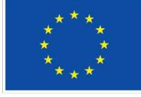

Co-funded by  
the European Union

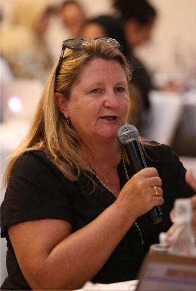

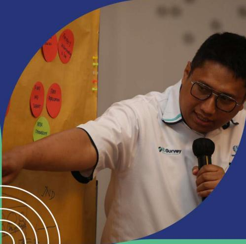

## Summary from the Commodity-Specific FGDs on EUDR in the Natural Rubber, Coffee, and Cocoa Sectors

Le Meridien, Jakarta  
29 July, 6 and 13 August 2024

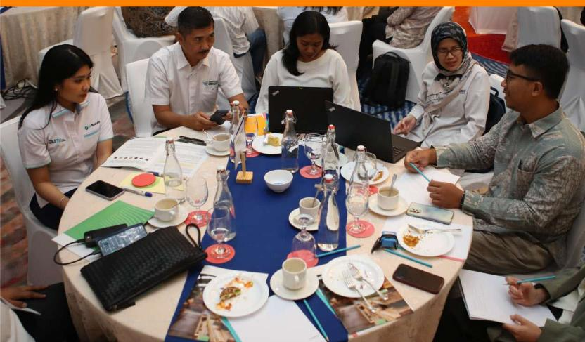

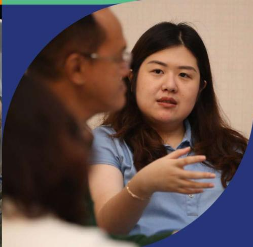

This publication was produced with the nancial support of the European Union. Its contents are the sole responsibility of Saka Dala and do not necessarily reΌect the views of the European Union

## Contents

| I. Introduction                                                                  | 1  |
|----------------------------------------------------------------------------------|----|
| II. Participants                                                                 | 1  |
| III. Main outcomes and findings of the FDGs                                      | 2  |
| III. 1. Updates on support measures to prepare stakeholders in                   |    |
| Indonesia by Indonesian government actors:............................           | 2  |
| III. 2. Findings from the Needs Assessment and                                   |    |
| Focus Group Discussion                                                           | 3  |
| Natural Rubber                                                                   | 4  |
| CoΊee and Cocoa                                                                  | 5  |
| Sectors’ Responses to Various Key Themes of EUDR................................ | 6  |
| Support Needed by Stakeholders                                                   | 9  |
| IV. Recommendation                                                               | 14 |
| Annex                                                                            | 16 |
| Annex 1 - Agenda of Focus Group Discussion .................................     | 16 |

## I. Introduction

The European Union together with BMZ commissioned the project **"Engagement with Indonesia, Malaysia, Laos, Thailand and Vietnam to raise awareness on and to promote better understanding of the EU approach to reducing EU-driven deforestation and forest degradation (EUDR Engagement)".** The project EUDR engagement supports stakeholders in participating countries with enhancing the understanding for and alleviate concerns about the EU Regulation on Deforestation-free Products (EUDR) in particular on its core elements (i.e. mandatory due diligence rules, traceability, benchmarking), to create an enabling environment for compliance by operators and the opportunities the EUDR implies.

To foster dialogue and align eΊorts, a series of Focus Group Discussions (FGDs) was held in Jakarta in July and August, specically addressing the natural rubber, coΊee, and cocoa sectors. These discussions aimed to 1) explore the implications of the European Union Regulation on Deforestation-free Products (EUDR) on each sector, including the challenges and potential opportunities, and 2) outline an action plan to help smallholder farmers prepare for the application of the EUDR and its impacts.

Before the events themselves, a needs assessment was carried out to identify key challenges faced by smallholders and middlemen, the most vulnerable actors in the supply chain, particularly regarding their awareness and understanding of the EUDR's requirements. Findings from the assessments were used to design the FGDs.

## II. Participants

The three FGDs attracted 558 participants in total, on-site and on-line, representing a diverse range of stakeholders, including civil society organizations, farmer associations, the private sector, national and local government representatives, and academics.

RUBBER

**29 57**

**106**

COFFEE

**06 65**

**177**

COCOA

**13 60**

**93**

\*the numbers above excluding participants from GIZ, Facilitators, and other supporting staΊ

The high number of participants reΌects the level of enthusiasm of Indonesia's stakeholders in general in learning about and sharing their perspectives about EUDR and its implementation. The on-site presence of high-level Indonesian Government ocials and private sector representatives in all three events was also a testament of the positive reception by the Indonesian Government of this FGD series. The representation of provincial and district level government ocials, smallholders, and civil society organizations in the online channel was also highly appreciated.

# III.Main outcomes and findings of the FDGs

Overall, these FGDs provided a valuable opportunity to evaluate the status stakeholders' preparedness, listen to stakeholders' concerns, and translate those insights into actionable steps to ensure support for supply chain actors in these three sectors to enhance their readiness for the EUDR

To ensure eΊective discussion, a list of questions was developed and used to guide the FGD.

During the FGDs, the European Union (EU) shared important updates regarding the regulation. One of which was the plan for publishing the EUDR Guidelines in September 2024. Key representatives from the Indonesian government provided updates on support measures to prepare stakeholders for EUDR readiness

### III. 1. Updates on support measures to prepare stakeholders in Indonesia by Indonesian government actors:

## Remarks from the Coordinating Ministry of Economic Affairs

According to a Senior Expert at the Coordinating Ministry for Economic AΊairs (CMEA), rubber and cocoa will soon be included under the Agency for Plantation Funds Management *Badan Pengelola Dana Perkebunan* (BPDP), following the example of the oil palm commodity. This presents an opportunity to enhance the productivity and sustainability of the rubber and cocoa industries in the long run, particularly through replanting programs.

The Government has taken various initiatives to prepare commodities for the EUDR requirements, including the Joint Task Force Indonesia-Malaysia-EU and the development of the National Dashboard for Commodity and additional resources to accelerate the issuance of e-STDBs.

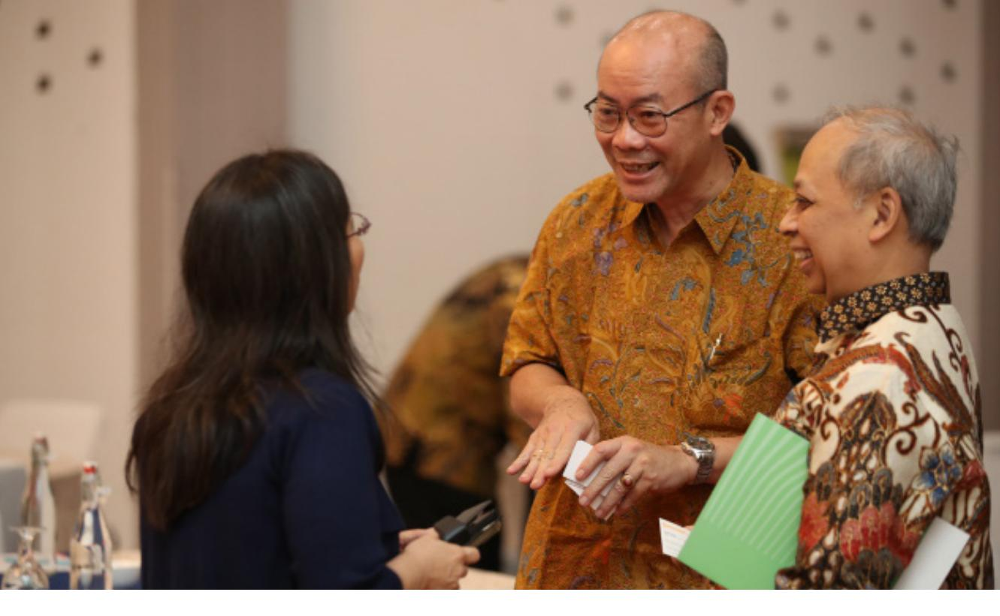

### Inputs from the Ministry of Agriculture regarding the National Dashboard

The Ministry of Agriculture has conrmed that the National Dashboard will be available through an online application (Android), enabling users to track transaction information. Detailed data for each transaction along the supply chain will be encrypted and will require authorization from the data provider. In addition to the National Dashboard, the FGD also provided information on e-STDB and Siperibun, which pertains to corporate data in the plantation sub-sector. However, e-STDB registration for all commodities remains low, with only about 28,000 farmers registered, far from the ambitious target of 8.14 million.1

### III. 2. Findings from the Needs Assessment and Focus Group Discussion

These FGDs on the three commodities have gathered a range of inputs, expectations, aspirations, concerns, and optimism from stakeholders involved in the sectors aΊected by the EUDR. Farmers, as the most vulnerable actors in the supply chain, require signicant technical, nancial, legal, human resources, infrastructure, capacity building, and outreach support.

1 Ditjenbun. 2024. Indonesia's National Dashboard for Sustainable Commodity Trade. Presentation Material Focus Group Discussion on EU Regulation on Deforestation-free Products (EUDR) in Indonesia's Natural Rubber Sector 29 Juli 2024. [02 Bahan Nasional Dashboard, 29 Juli 2024.pdf](file:///C:\Users\USER\Dropbox\GIZ\MATERIAL\RUBBER\02%20Bahan%20Nasional%20Dashboard,%2029%20Juli%202024.pdf)

| Production (Million tons)    |                              |
|------------------------------|------------------------------|
| Production                   | (Million tons)               |
|                              | Production (Million tons)    |
| 1.761 million farmers        |                              |
| 1.839                        | million farmers              |
|                              | 1.555 million farmers        |
| Export (Million tons)        |                              |
| 1.791 )* Gapkindo data       |                              |
| Export                       | (Million tons)               |
| 0.438                        | (in 2022)                    |
|                              | Export (Million tons)        |
|                              | 0.385 (in 2022)              |
| % Export to EU Supply Chains |                              |
| 11.2%   Long, complex        |                              |
| % Export to EU               | Supply Chains                |
| 13%                          | Long, complex                |
|                              | % Export to EU Supply Chains |
|                              | 13%   Long, complex          |
| NATURAL RUBBER COFFEE        | COCOA                        |

Sources of data2,3

## Natural Rubber

### 1. Size of Plantations and Number of Farmers:

- Large plantation areas, over 3.25 million hectares of smallholders' area of a total 3.5 million hectares, involving more than 1.79 million farmers4
- Many of these farmers have limited experience with sustainability certications and programs
- Signicant investment from supply chain actors to ensure compliance and eΊective implementation of EUDR requirements

### 2. Complex Supply Chains:

- More complex than commodities like coΊee and cocoa
- Over 90% of the natural rubber supply chains are traditionally long and unorganized

2 BPS. 2023. Statistic of Estate Crops Vol 1 2022-2024. [https://ditjenbun.pertanian.go.id/](https://ditjenbun.pertanian.go.id/buku-statistik-perkebunan-jilid-i-2022-2024/) [buku-statistik-perkebunan-jilid-i-2022-2024/](https://ditjenbun.pertanian.go.id/buku-statistik-perkebunan-jilid-i-2022-2024/)

3 \*) Gapkindo. 2024. The EUDR Impact on the Rubber Processor Industry. Presentation of EUDR Rubber FGD. Jakarta. [04 GAPKINDO FGD-EUDR.pdf](file:///C:\Users\USER\Dropbox\GIZ\MATERIAL\RUBBER\04%20GAPKINDO%20FGD-EUDR.pdf)

4 BPS. 2023. Op Cit.

- • The remaining supply chains are shorter, more ecient, and potentially better positioned to comply with EUDR standards
- Indonesia exports 11.2% of its natural rubber to EU, and more to non-EU countries but maybe with nal products entering the EU market.

The natural rubber industry requires attention in addressing sustainability challenges, aligning certication processes with EUDR requirements, and securing the necessary investments from supply chain stakeholders to facilitate compliance

## Coffee and Cocoa

- 1. CoΊee and Cocoa share several commonalities:
  - Involvement in Social Forestry programs (264 and 43 Forest Farmers' Groups where coΊee and cocoa are the main products)5 respectively and the existence of sustainability certications
  - Most cocoa farmers have participated in various sustainability programs and certication, the experience helps build solid foundation for fullling the rigorous requirements of the EUDR, particularly as many of cocoa buyers are multinational or global companies that prioritize sustainability in their sourcing practices
  - Certication facilitates farmers' readiness and contribute to the faster implementation of the EUDR
  - CoΊee supply chain faces unique challenges; it involves a larger number of stakeholders compared to cocoa
  - This complexity in coΊee can complicate eΊorts to successfully prepare for the application of the EUDR in time
- 2. Uncertainty about the Implementation:
  - Considering the date of EUDR implementation, many coΊee farmers, collectors, and traders still lack full understanding of EUDR.
  - This uncertainty poses challenges in preparing on time
  - Beyond eΊorts at the national level, the National Government, in coordination with the Subnational Government, is expected to promptly organize outreach activities on the EUDR at the district level, focusing on raising awareness about the EUDR and its implications.

5 KLHK Republik Indonesia. 2024. <https://gokups.menlhk.go.id/public/chart/producing>

### 3. Social Forestry:

- CoΊee & cocoa plantations under the Social Forestry (*Perhutanan Sosial*/PS) program, both before and after the EUDR cut-oΊ date, must ensure they align their production with land legality and traceability requirements.
- CoΊee & cocoa planted before the December 2020 cut-oΊ date is exempt from deforestation rules, while those planted after this date will be subject to deforestation criteria.
- The government is expected to prioritize issuing e-STDB for coΊee & cocoa farmers with plantations established before the cut-oΊ date to help ensure proof of legality.

## Sectors' Responses to Various Key Themes of EUDR

The following table provides an illustration of the sectors' responses to various key themes of EUDR:

|                              | NATURAL              |                |                |
|------------------------------|----------------------|----------------|----------------|
| Farmers and middlemen        | Lo w                 | Lo w           | Lo w           |
| certi΋cation                 | None                 | Medium         | Medium         |
| Local Agencies/Dinas         | Medium to Low        | Medium to Low  | Medium to Low  |
| Processor/Exporter           | Medium to High       | Medium to High | Medium to High |
| Down-stream in dustry actors | High                 | High           | High           |
| THEMES Farmers involved in   | RUBBER UNDERSTANDING | COFFEE         | COCOA          |

| <b>THEMES</b>                                                  | NATURAL RUBBER | COFFEE                 | COCOA                  |
|----------------------------------------------------------------|----------------|------------------------|------------------------|
| <b>CHALLENGES</b>                                              |                |                        |                        |
| Outreach on EUDR to Farmers, middlemen, and local stakeholders | Highly lacking | High to medium lacking | High to medium lacking |

| THEMES                                                                                                                                                                                                  | NATURAL RUBBER                                                      | COFFEE                                                              | COCOA                                                               |
|---------------------------------------------------------------------------------------------------------------------------------------------------------------------------------------------------------|---------------------------------------------------------------------|---------------------------------------------------------------------|---------------------------------------------------------------------|
| 
 OPPORTUNITIES/BENEFITS 
 |                                                                     |                                                                     |                                                                     |
| Smallholders                                                                                                                                                                                            | Possibility of better price and quality for EUDR-compliant products | Possibility of better price and quality for EUDR-compliant products | Possibility of better price and quality for EUDR-compliant products |

|                                                                                                |                                                                                                                                       | NATURAL                                                                                                                                                                                                                                                                                                |                                                                                                                                                                                                                                                                                                                     |
|------------------------------------------------------------------------------------------------|---------------------------------------------------------------------------------------------------------------------------------------|--------------------------------------------------------------------------------------------------------------------------------------------------------------------------------------------------------------------------------------------------------------------------------------------------------|---------------------------------------------------------------------------------------------------------------------------------------------------------------------------------------------------------------------------------------------------------------------------------------------------------------------|
| Implementing geo-location                                                                      | Low, lack of                                                                                                                          |                                                                                                                                                                                                                                                                                                        |                                                                                                                                                                                                                                                                                                                     |
| Legality of land use                                                                           | Mostly none                                                                                                                           | Mostly none,                                                                                                                                                                                                                                                                                           |                                                                                                                                                                                                                                                                                                                     |
| Other legality aspects                                                                         | None                                                                                                                                  | None                                                                                                                                                                                                                                                                                                   | None                                                                                                                                                                                                                                                                                                                |
| Registration of e-STDB                                                                         | Low                                                                                                                                   | Low                                                                                                                                                                                                                                                                                                    | Low                                                                                                                                                                                                                                                                                                                 |
|                                                                                                | Low                                                                                                                                   | Low                                                                                                                                                                                                                                                                                                    | Low                                                                                                                                                                                                                                                                                                                 |
| Premium Price                                                                                  | None to unclear                                                                                                                       | None to unclear                                                                                                                                                                                                                                                                                        | None to unclear                                                                                                                                                                                                                                                                                                     |
| THEMES Traceability (segregated products) and Transparency Understanding of National Dashboard | RUBBER resources Long and complex supply chains and di΍cult to implement EUDR. Farmers have no experience in the Certi΋cation process | COFFEE Mainly Low, due to lack of resources. However, farmers experiencing certi΋cation will implement it faster However, farmers experiencing certi΋cation mostly have land legality Long and complex supply chains. However, farmers’ experiences in the certi΋cation process will signi΋cantly help | COCOA Mainly Low due to a lack of resources. However, farmers experiencing certi΋cation will implement it faster Mostly none, However, farmers experiencing certi΋cation mostly have land legality Long and complex supply chains. However, farmers’ experiences in the certi΋cation process will signi΋cantly help |

|                                                                                                                                                                                                                                  | NATURAL               |                 |                 |
|----------------------------------------------------------------------------------------------------------------------------------------------------------------------------------------------------------------------------------|-----------------------|-----------------|-----------------|
| THEMES                                                                                                                                                                                                                           | RUBBER SUPPORTS NEEDS | COFFEE          | COCOA           |
| Immediate outreach on EUDR                                                                                                                                                                                                       | Highly expected       | Highly expected | Highly expected |
| Capacity buildings on technical, access to ΋nance, understanding of EUDR and its related requirements, farm infrastructure, Communication, and IT support systems from the Governments in collaboration with multi stakeholders | Highly expected       | Highly expected | Highly expected |

| Indigenous people      | Recognition      |
|------------------------|------------------|
| Smaller enterprises    | None, cannot     |
| Producers              | Better commodity |
| Down-stream industries | None directly,   |

|                                                                                                                                                                                                                                                                                                                         | NATURAL         |                 |
|-------------------------------------------------------------------------------------------------------------------------------------------------------------------------------------------------------------------------------------------------------------------------------------------------------------------------|-----------------|-----------------|
| Highly expected                                                                                                                                                                                                                                                                                                         | Highly expected | Highly expected |
| Highly expected                                                                                                                                                                                                                                                                                                         | Highly expected | Highly expected |
| Highly need                                                                                                                                                                                                                                                                                                             | Highly need     | Highly need     |
| THEMES RUBBER Technical, human resources, and ΋nancial assistances for preparedness of farmers and supply chain players to prepare for EUDR General Guideline of EUDR and its speci΋c regulation for each commodity in Indonesia District Action Plans for commodity readiness to EUDR or to Sustainable Supply Chains. | COFFEE          | COCOA           |

## Support Needed by Stakeholders

Apart from the responses of stakeholders from the diΊerent sectors to key themes, the FGD also gathered inputs from participants regarding support needed to help the industry's readiness for the implementation of the EUDR. The following table provides an overview of the support needed from each respective sector and the perceived responsible actors:

### Natural Rubber

| No | Support Needs                    | Key Stakeholders |
|----|----------------------------------|------------------|
| 1  | Incentive schemes for private    |                  |
|    | ( Surat Kepemilikan Tanah /SKT). |                  |

| No                                 | Support Needs Key Stakeholders |
|------------------------------------|--------------------------------|
| and Regional Budget (              | Anggaran                       |
| Pendapatan Belanja Nasional        | /                              |
| APBN and                           | Anggaran Pendapatan            |
| Belanja Daerah                     | /APBD) budget for              |
| 7 Align de΋nition of deforestation |                                |

| No | Support Needs                                                                                            | Key Stakeholders      |
|----|----------------------------------------------------------------------------------------------------------|-----------------------|
| 10 | Ensuring that EU Member States importing rubber from Indonesia helps Indonesia's readiness for the EUDR. | <ul> <li>EU</li></ul> |

### Coffee

| No | Support Needs Key Stakeholders     |
|----|------------------------------------|
| 1  | District government-level          |
| 2  | Comprehensive socialization on     |
| 3  | Acceleration of legal standing for |
| 4  | Acceleration of the implementation |

| 7  | Clarity on the de΋nition of EU deforestation and agroforestry                                                                                                                                                                                                                                                                                   |
|----|-------------------------------------------------------------------------------------------------------------------------------------------------------------------------------------------------------------------------------------------------------------------------------------------------------------------------------------------------|
| 8  | O΍cial Guidance of EUDR must EU be available soon and its related Guidelines for each EU Member States                                                                                                                                                                                                                                          |
|    | Note : An ofÏcial EUDR Guideline was published. This is applicable to all related entities in and outside of the EU and no speciέc guide for each EU Member States will be published. Translation of Guideline of EUDR EU for simple outreach purpose, Government of Indonesia in especially for smallholders and collaboration local middlemen |
| 10 | Grievance mechanism for data National Government security and sharing District Government (Dinas) National Dashboard Team EU                                                                                                                                                                                                                    |
| 11 | Monitoring and evaluation of EUDR National Government implementation District Government (Dinas) CSOs Certi΋cation Agencies                                                                                                                                                                                                                     |

### Cocoa

| No | Support Needs                                                                                                                                                           | Key Stakeholders                                                                                                     |
|----|-------------------------------------------------------------------------------------------------------------------------------------------------------------------------|----------------------------------------------------------------------------------------------------------------------|
| 1  | The socialization and knowledge transfer of EUDR as well as the acceleration of E-STDB registration from the different Ministries to the local government level.        | <ul> <li>The National and Subnational Governments in collaboration with multi-stakeholders at each level.</li> </ul> |
| 2  | Funding and operational support as well as assistance for farmer data collection and E-STDB acceleration related to EUDR (deforestation free/geo-location, land rights) | <ul> <li>The National and Subnational Governments in collaboration with multi-stakeholders at each level.</li> </ul> |

| No | Support Needs                       | Key Stakeholders |
|----|-------------------------------------|------------------|
| 5  | Handbook related to the use of the  |                  |
| 6  | Operational Guideline EUDR and its  |                  |
| 10 | Support for addressing child labour |                  |

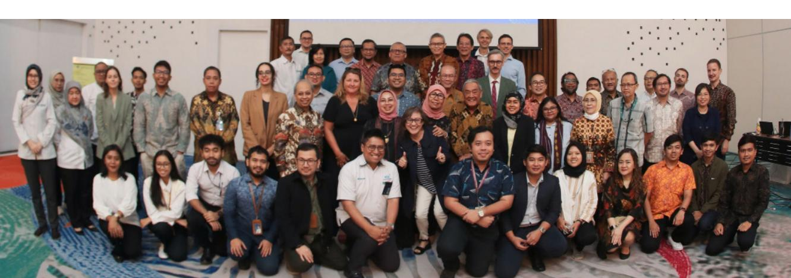

## IV.Recommendation

These comprehensive FGDs could be followed up by actions from the Governments, supply chain actors, and other supporting stakeholders, as well as the EU. The EUDR mandates due diligence, with various parameters to consider in assessing how smallholders and industry players can prepare in time for the December 31,

## Outreach activities at the Local Level

Immediate outreach activities on the EUDR, along with e-STDB and the National Dashboard at the district level, should be organized by the Government and local multistakeholder forums. Participants in these socialization eΊorts should include farmers and their institutions ((Farmer Group Association (*Gabungan Kelompok Tani*/Gapoktan), cooperatives, associations), supply chain actors, relevant agencies such as academic institutions, and various development projects funded by development partners and CSOs. By ensuring local-level engagement, key stakeholders will have a better understanding of EUDR implications and how to ensure their commodities are produced deforestation-free and legally.

## Training and Support for Farmers

Industry actors can provide training programs for farmers on sustainable practices and certication processes, ensuring they are well-prepared to comply with the EUDR. Local stakeholders should be empowered to work closely with farmers and businesses to implement EUDR-aligned practices to produce deforestation-free at the grassroots level.

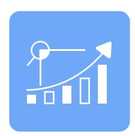

## Infrastructure Development

Investments in infrastructure, particularly in improving supply chain logistics and implementing digital tools, are essential for easing the transition to EUDR compliance. Such investments will facilitate the necessary traceability and accountability measures across the supply chain. Additionally, monitoring mechanisms—such as audits, inspections, and checks—must be established to ensure adherence to EUDR requirements.

## Regional Action Plans and Public-Private Partnerships

Provincial and district governments, through public-private partnerships, should gather stakeholders to jointly develop Regional Action Plans for Sustainable Commodities, including natural rubber, coΊee, and cocoa, like those already established for oil palm. These plans should reΌect the real conditions and challenges faced by the plantation industry, both upstream and downstream, in the context of aligning production practices to EUDR requirements. By aligning regional plans with commodity-specic needs, stakeholders can ensure more targeted and eΊective strategies for meeting EUDR requirements across diΊerent jurisdictions.

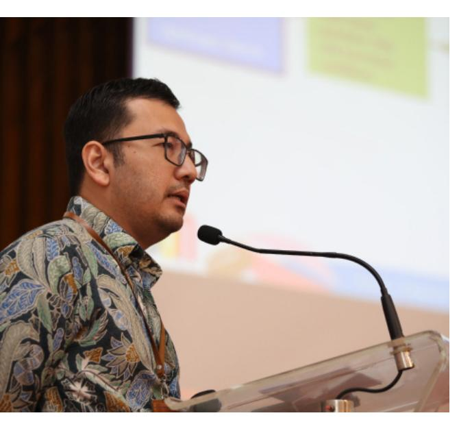

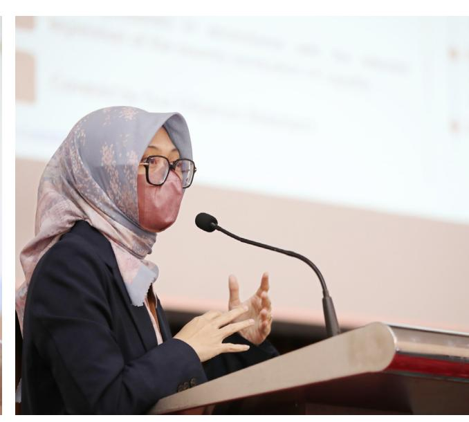

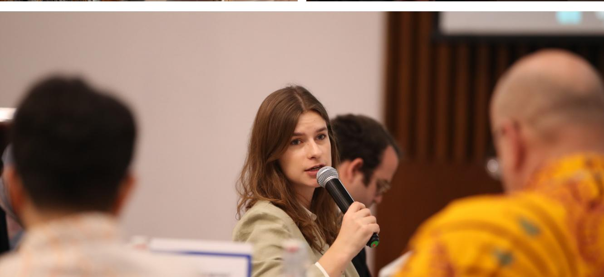

# Annex

## Annex 1 - Agenda of Focus Group Discussion

The three events generally followed the same agenda as below:

**Focus Group Discussion on the EU Regulation on Deforestation-Free Products (EUDR) focusing on the natural rubber/coΊee/cacao sector in Indonesia** 

**Le Meridien Hotel, Sasono Mulyo 2 Ballroom | 29 July, 6, 13 August 2024**

| Time          | Schedule Speaker/Facilitator               |
|---------------|--------------------------------------------|
| 08:30 – 09:00 | Arrival of Participants and Registration   |
| 09:00 – 09:30 | 1. Opening Session                         |
| 09:30 – 10:30 | 2. “Understanding, Opportunities,          |
| 10:30 – 10:45 | 3. Question and Answer (short and only for |
| 10:45 – 11:00 | Group Photograph and CoΊee Break           |

| 11:00 – 12:30 | <b>4. Group Discussion part 1: Understanding and Challenges</b>                                                                                                                                                                                                                                                                                                                                                                                                                                                                                                                                                                                                                                                                                                                                          | Facilitator |
|---------------|----------------------------------------------------------------------------------------------------------------------------------------------------------------------------------------------------------------------------------------------------------------------------------------------------------------------------------------------------------------------------------------------------------------------------------------------------------------------------------------------------------------------------------------------------------------------------------------------------------------------------------------------------------------------------------------------------------------------------------------------------------------------------------------------------------|-------------|
|               | During part 1 of the discussion, participants will discuss specific aspects of the EUDR and its impact on cacao smallholders. The discussion will try to answer a number of questions, including (but not limited to): <ul><li>What is the understanding of each actor of supply chains to EUDR?</li> <li>What are benefits and opportunities for producers (incl. smallholders) and companies from which they can profit under the EUDR, what good practices are already there?</li> <li>What are the challenges for producers (incl. smallholders) and companies to fulfil the EUDR requirements (deforestation-free, legality, traceability) in cacao supply chains specifically?</li> <li>What are relevant actors already doing to prepare for the EUDR? Where is further support needed?</li></ul> | Facilitator |

| 12:30 – 13:30 | Lunch                                                                                                                                                                                                                      |             |
|---------------|----------------------------------------------------------------------------------------------------------------------------------------------------------------------------------------------------------------------------|-------------|
| 13:30 – 14:45 | <b>5. Group Discussion part 2: Opportunities, Coordination and Support Needed</b>                                                                                                                                          | Facilitator |
|               | During part 2 of the discussion, participants will discuss possible solutions and recommendations to support readiness, by answering the following questions (not limited to):                                             |             |
|               | <ul> <li>• What opportunities does the EUDR offer for the respective for the cacao supply chain and its actors, with regards to Indigenous people and local communities, smallholders, and smaller enterprises?</li> </ul> |             |

|               | How coordination, information-sharing platforms can be leveraged to support preparation, such as the National Dashboard? What support would they need and from whom to comply with EUDR requirements (deforestation-free, legality, traceability)? |                   |
|---------------|----------------------------------------------------------------------------------------------------------------------------------------------------------------------------------------------------------------------------------------------------|-------------------|
| 14:45 – 15:45 | 6. Summary Results, Feedback and Discussion of the Next Steps Presentation of results from the group discussion Discussion of main elements and key takeaways in plenary Participant survey (CoΊee available during this time slot)                | Facilitator       |
| 15:45 – 16:00 | 7. Wrap-up and Closing                                                                                                                                                                                                                             |                   |
|               | Closing remarks                                                                                                                                                                                                                                    | CMEA MoA (TBC) EU |

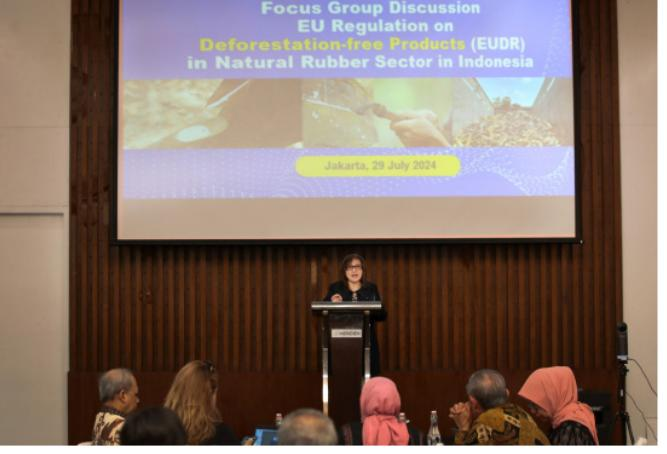

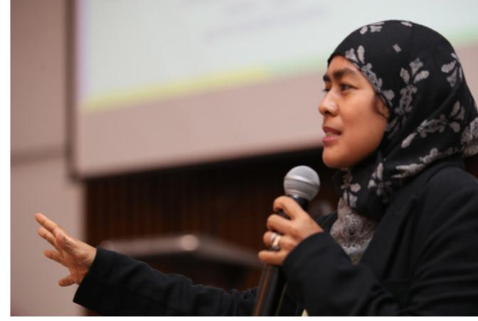

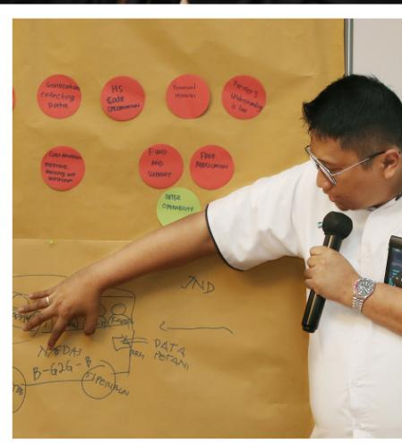

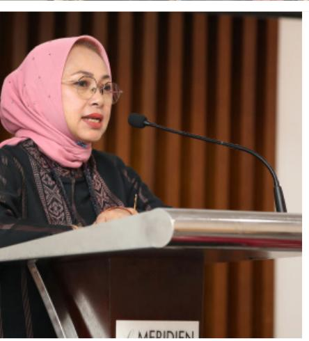

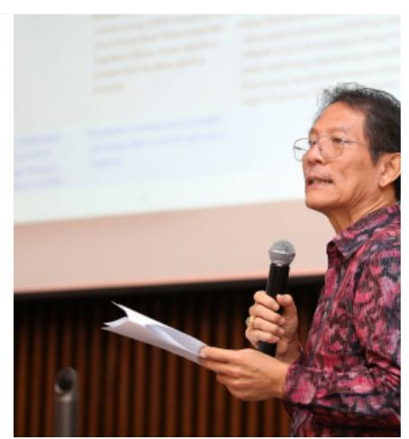

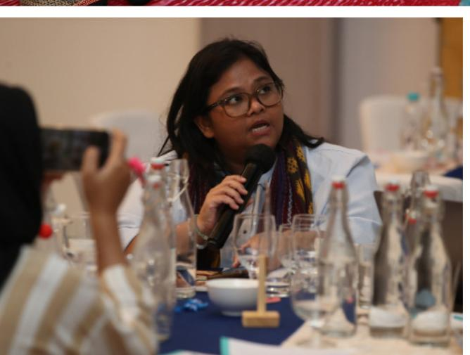

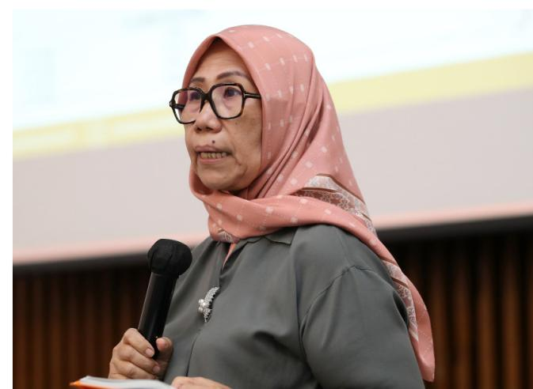

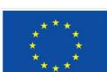

Co-funded by  
the European Union