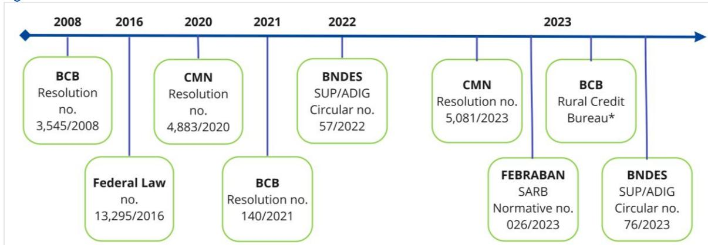
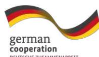

Safeguards for forests

# **Rural credit requirements for financial institutions in Brazil**

## A FACTSHEET BY CLIMATE & COMPANY

**By Sofia Helena Zanella Carra | sofia@climcom.org Elisabeth Hoch | elisabeth@agrimonera.com Louise Simon | louise@climcom.org Paula Pinto Zambrano | paula@climcom.org Mauro Armelin | mauro@amazonia.org.br**

Climate & Company Amigos da Terra – AmazÙnia Brasileira

Sustainable Finance and Investments Group (gFIS/UFRJ) Brazilian Alliance for Sustainable Finance and Investments (BRASFI)

## INTRODUCTION

This factsheet provides an overview of the Brazilian rural lending regulatory framework for preventing illegal deforestation, its evolution and key requirements applicable to financial institutions (FIs) providing rural credit. FIs play a key role in preventing deforestation, as they finance activities that can lead to forest loss. By applying due diligence, improving data transparency, and monitoring, the financial sector contributes to efforts preventing deforestation. Especially in countries with extensive forest resources, the adoption of rural credit requirements set by FIs is crucial to avoiding environmental degradation and deforestation. Brazil has advanced by setting minimum requirements to approve rural credit aiming to prevent illegal deforestation and safeguarding its forests.

In this factsheet, we present the resolutions issued by the Brazilian Central Bank (BCB) and by the National Monetary Council (CMN[\)](#page-1-0)1 and their main requirements, highlighting those currently in force. We also present the normative issued by the Brazilian Federation of Banks (FEBRABAN[\)](#page-1-1)2 , bank selfregulation, and the new procedures adopted by the National Development Bank (BNDES), which are limited to partner banks, to combat illegal deforestation. The primary objective of this factsheet is to facilitate access to information on the Brazilian rural lending regulatory framework and self-regulation that aims to prevent FIs from financing deforestation and the respective requirements currently in force for granting rural credit. It is important to emphasise that the implementation of the resolutions and initiatives presented in this factsheet has not been investigated, nor does this factsheet include recommendations on potential improvements or changes to them.

1[Brazilian Central Bank website: t](https://www.bcb.gov.br/en/financialstability/ruralcredit)he National Monetary Council (CMN) establishes the rural credit policies to be implemented while the Brazilian Central Bank (BCB) manages their implementation. The BCB also issues subsidiary regulation and supervises financial institutions to ensure that the rural credit flows to the intended beneficiaries

2[FEBRABAN website](https://portal.febraban.org.br/pagina/3031/9/en-us/institutional)

## EVOLUTION OF THE REGULATORY FRAMEWORK

The BCB coordinates and supervises rural credit, which is provided by FIs at either regulated or market interest rates.3 The competent authorities in Brazil have developed resolutions and additional measures aimed at preventing illegal deforestation through rural lending instruments applicable to the FIs that work with this type of operation. Figure 1 presents a timeline of the evolution of the regulatory framework, bank self-regulation and new procedures adopted by BNDES in Brazil starting in 2008. It shows an increase in the requirements set, especially in the last three years.

Figure 1: Timeline

the Rural Credit Bureau was created in 2023 and new impediments are expected to be implemented in 202[4](#page-2-1)4 .

- In 2008, the first resolution defining mandatory environmental compliance with related national laws for accessing rural credit in the Brazilian Amazon Rainforest was issued by the BCB [\(BCB Resolution no. 3,454/2008\).](https://www.bcb.gov.br/pre/normativos/res/2008/pdf/res_3545_v1_O.pdf) First requirements were established to prove environmental compliance and the non-existence of embargoes for the economic use of illegally deforested areas in that region.
- In 2016, the Art 78-A of the Brazilian Forest Code [\(Federal Law no. 12,651/2012\)](https://www.planalto.gov.br/ccivil_03/_ato2011-2014/2012/lei/l12651.htm) was amended [\(Federal Law no. 13,295/2016\)](https://www.planalto.gov.br/ccivil_03/_Ato2015-2018/2016/Lei/L13295.htm#art4). The new text defined the mandatory requirement of Rural Environmental Registry (CAR[\)](#page-2-2)5 by FIs to grant rural credit from 31st December 2017. The analysis of data provided in the CAR has not yet been completed and is ongoin[g.](#page-2-3)6
- In 2020, [Resolution no. 4,833/2020,](https://www.in.gov.br/web/dou/-/resolucao-cmn-n-4.883-de-23-de-dezembro-de-2020-296178058) issued by the National Monetary Council (CMN) consolidated the Manual of Rural Credit (Chapters 1, 2 and 3[\)](#page-2-4)7 defined rules for granting rural credit in Brazil. This includes impediments for operations, mainly in the Amazon biome, such

3 [Brazilian Central Bank website](https://www.bcb.gov.br/en/financialstability/ruralcredit)

4 [BCB Report on Social, Environmental, and Climate-related Risks and Opportunities](https://www.bcb.gov.br/publicacoes/relatorio-risco-oportunidade)

5 C&C Report "[Bridging sustainable finance and sustainable land use initiatives to reduce deforestation](https://issuu.com/climateandcompany/docs/overview_of_eu_and_br_legislation_eng)" - The Rural Environmental Registry (CAR) is a mandatory registry for rural properties established by the Brazilian Forest Code (Federal Law no. 12,651/2012). The CAR integrates environmental information from rural properties and possessions and provides a database for control, monitoring, environmental and economic planning, and combating deforestation.

Platfor[m Forest Code Thermometer p](https://termometroflorestal.org.br/#:~:text=O%20Term%C3%B4metro%20do%20C%C3%B3digo%20Florestal%20%C3%A9%20uma%20plataforma%20que%20disponibiliza,de%20Regulariza%C3%A7%C3%A3o%20Ambiental%20(PRA))resents the current stage of implementation of CAR.

7 [BCB - Rural Credit Manual](https://www3.bcb.gov.br/mcr)

as (1) mandatory presentation of CAR, (2) Rural Property Registration Certificate, (3) no current embargoes on the economic use of illegally deforested areas. For all biomes, this resolution defined the mandatory provision of geographical coordinates for all rural credit operations. A financial incentive was defined for producers who comply with the environmental legislation by increasing funding credit limits by 10% for properties with CAR analysis verified by competent bodies per the Forest Code.

- In 2021, the BCB established a new session in the Manual of Rural Credit Chapter 2 (Session 9) consolidating all previous social, environmental and climate impediments through [BCB](https://www.bcb.gov.br/estabilidadefinanceira/exibenormativo?tipo=Resolu%C3%A7%C3%A3o%20BCB&numero=140)  [Resolution no. 140/2021.](https://www.bcb.gov.br/estabilidadefinanceira/exibenormativo?tipo=Resolu%C3%A7%C3%A3o%20BCB&numero=140) According to Chapter 2, rural credit is denied (1) if the borrower has no registration on CAR, (2) if the area is totally or partially inserted in environmentally protected areas, (3) in lands occupied by indigenous people or (4) by descendants of freed slaves (quilombo communities), (5) in rural areas in the Amazon biome that have been embargoed by the federal agency IBAMA (Brazilian Institute for the Environment and Renewable Natural Resources) due to the economic use of illegally deforested areas, (6) if the borrower has made use of workers in conditions analogous to slavery[.](#page-3-0)8
- In 2023, the rules defined by the BCB [Resolution no. 140/2021](https://www.bcb.gov.br/estabilidadefinanceira/exibenormativo?tipo=Resolu%C3%A7%C3%A3o%20BCB&numero=140) on the impediment to granting rural credit in the event of an embargo for illegal deforestation were extended to all Brazilian biomes as defined by the [CMN Resolution 5081/2023.](https://www.bcb.gov.br/estabilidadefinanceira/exibenormativo?tipo=Resolu%C3%A7%C3%A3o%20CMN&numero=5081) It also extended the inclusion of areas embargoed by state environmental agencies in addition to the federal agency (IBAMA). This resolution also states that rural credit cannot be granted if the CAR is suspended or cancelled.
- In 2023, the Brazilian Federation of Banks FEBRABAN released a norm defining guidelines and procedures for signatory FIs to support credit operations with slaughterhouses and meatpackers. This norm shall ensure that activities are free from illegal deforestation [\(SARB](https://cmsarquivos.autorregulacaobancaria.com.br/Arquivos/documentos/PDF/SARB%20026-2023%20NORMATIVO%20PARA%20GEST%C3%83O%20DO%20RISCO%20DE%20DESMATAMENTO%20ILEGAL%20NA%20CADEIA%20DE%20CARNE%20BOVINA.pdf)  [Normative no. 026/2023\)](https://cmsarquivos.autorregulacaobancaria.com.br/Arquivos/documentos/PDF/SARB%20026-2023%20NORMATIVO%20PARA%20GEST%C3%83O%20DO%20RISCO%20DE%20DESMATAMENTO%20ILEGAL%20NA%20CADEIA%20DE%20CARNE%20BOVINA.pdf). Signatory FIs shall establish a Protocol for their Credit Operations with bovine slaughterhouses and meatpacking plants following a list of requirements to demonstrate, by December 2025, the non-acquisition of cattle associated with illegal deforestation from direct and indirect suppliers. This norm is only applicable to signatory FIs that conduct rural credit operations in the Legal Amazon region and the State of Maranh"o. Each FI must establish a Protocol for their Credit Operation, which: o is compatible with its Social, Environmental and Climate Responsibility Policies and Integrated Risk Management; o establishes the procedures to be adopted for managing the risk of illegal deforestation on their Credit Operations; o requests from the slaughterhouses to keep traceability and a monitoring system that covers direct and indirect suppliers by December 2025.

Table 1 presents the existing due diligence requirements set by the regulatory bodies (BCB, CMN) for the approval of rural credit in Brazil, implemented by FIs with the aim of preventing illegal deforestation.

8 [Register of employers who have subjected workers to conditions similar to slavery](https://www.gov.br/trabalho-e-emprego/pt-br/assuntos/inspecao-do-trabalho/areas-de-atuacao/cadastro_de_empregadores.pdf) – Ministry of Labor and Employment. This was firstly defined b[y BCB Resolution No. 3,876/2010](https://www.bcb.gov.br/pre/normativos/res/2010/pdf/res_3876_v1_O.pdf) but integrated to the Rural Credit Manual through th[e BCB Resolution](https://www.bcb.gov.br/estabilidadefinanceira/exibenormativo?tipo=Resolu%C3%A7%C3%A3o%20BCB&numero=140)  [no. 140/2021.](https://www.bcb.gov.br/estabilidadefinanceira/exibenormativo?tipo=Resolu%C3%A7%C3%A3o%20BCB&numero=140)

Table 1. Due diligence requirements currently in force for granting rural credit in Brazil adopted by FIs to prevent ilegal deforestation

|                                                                                                                                                                                                                                           | Requirements l | Data source ll                    |
|-------------------------------------------------------------------------------------------------------------------------------------------------------------------------------------------------------------------------------------------|---------------------------|----------------------------------------------|
| Rural Property Registration Certificate                                                                                                                                                                                                   |                           | Registry office                              |
| Proof of no active embargoes on economic use in areas with illegal deforestation issued by federal or state environmental agency                                                                                                          |                           | IBAMA, State Env. Agencies                   |
| Provision of geographical coordinates                                                                                                                                                                                                     |                           |                                              |
| Environment Rural Registry (CAR) - Cancelled or suspended registrations are no longer accepted                                                                                                                                            |                           | SICAR                                        |
| Establishment inserted totally or partially in the Conservation Unit, unless the economic activity is in accordance with the Management Plan of the Conservation Unit                                                                     |                           | ICMBio, CAR                                  |
| An establishment cannot be situated either entirely or partially within indigenous territories or land occupied and titled by descendants of freed slaves (quilombo communities) unless the proponent belongs to the respective community |                           | FUNAI, INCRA, CAR                            |
| Establishment located on a rural property that is totally or partially part of a Type B (Non-Destined) Public Forest registered in the Brazil's National Register of Public Forests                                                       |                           | Brazil's National Register of Public Forests |

IRequirements defined by BCB; CMN. The requirements have exceptions (see resolutions); IINot exhausted.

FUNAI: National Indigenous People Foundation; INCRA: National Institute for Colonization and Agrarian Reform; ICMBio: Chico Mendes Institute for Biodiversity Conservation; SICAR: Rural Environment Cadastre System; IBAMA: Brazilian Institute of Environment and Renewable Natural Resources.

## TRANSPARENCY, TOOLS AND OUTLOOK

The Brazilian regulatory bodies and the National Development Bank (BNDES) have been investing in new tools to improve transparency and monitoring to reduce the risks of financing deforestation. Some of them are already in place, others are upcoming, as presented below:

- As part of th[e sustainable dimension of the Agenda BC#,](https://www.bcb.gov.br/en/about/bcbhastag_sustainability) from the BCB, one of the initiatives is the transformation of the Rural Credit and Proagro Operations System (Sicor), currently used by FIs, into a Rural Credit Bureau. It integrates the government databases (e.g., Brazilian Forest Service, National Water Agency, Chico Mendes Institute for Biodiversity Conservation) fostering the improvement of FIs' risk management. Based on the principles of open finance,9  [l](#page-4-0)aunched in 2020, beneficiaries of rural credit can share the information registered in the new system with any interested party increasing transparency. By facilitating the identification of rural credit operations with social and environmental benefits, new business opportunities can be established by FIs such as special credit lines, etc. The Rural Credit Bureau was already created and will continue to be improved with the implementation of new impediments planned by the BCB by June 2024.[10](#page-4-1)
- In 2022, the BCB launched th[e System of Consultation and Access Authorization to Rural Credit](https://www.bcb.gov.br/meubc/relatorio-cacr)  [Operations \(CACR\)](https://www.bcb.gov.br/meubc/relatorio-cacr), which allows producers to voluntarily share information about their

9 BCB – [Open Finance](https://www.bcb.gov.br/en/financialstability/open_finance)

10 [BCB Report on Social, Environmental, and Climate-related Risks and Opportunities](https://www.bcb.gov.br/publicacoes/relatorio-risco-oportunidade)

operations with individuals, businesses, or FIs following the Open Finance principles. This system improves transparency and enables producers to demonstrate their sustainability qualifications to the market, including potential lenders that are not FIs.[11](#page-5-0)

- The BCB has been expanding the use of geospatial data to monitor areas that received rural credit. [12](#page-5-1) In a pilot project with the European Space Agency (ESA) and the German Agency for International Cooperation (GIZ), the BCB integrated satellite image-based remote sensing solutions to improve the capacity of its monitoring system. A second phase in collaboration with the National Institute for Space Research (INPE) is under development. Around 2 million agricultural operations covering 51 million hectares are expected to be scanned in the next 2-3 years.[13,](#page-5-2)[14](#page-5-3)
- In 2022, the National Development Bank BNDES issued the [SUP/ADIG Circular No. 57/2022-](https://www.bndes.gov.br/wps/wcm/connect/site/49905886-f740-40c1-a54d-1673f2cda5e2/22Cir57+Mitiga%C3%A7%C3%A3o+Desmatamento+Sem+Autoriza%C3%A7%C3%A3opelo+BNDES.pdf?MOD=AJPERES&CACHEID=ROOTWORKSPACE.Z18_7QGCHA41LORVA0AHO1SIO51085-49905886-f740-40c1-a54d-1673f2cda5e2-ohSO-xc) [BNDES](https://www.bndes.gov.br/wps/wcm/connect/site/49905886-f740-40c1-a54d-1673f2cda5e2/22Cir57+Mitiga%C3%A7%C3%A3o+Desmatamento+Sem+Autoriza%C3%A7%C3%A3opelo+BNDES.pdf?MOD=AJPERES&CACHEID=ROOTWORKSPACE.Z18_7QGCHA41LORVA0AHO1SIO51085-49905886-f740-40c1-a54d-1673f2cda5e2-ohSO-xc) which defines procedures for BNDES's partner banks to employ monitoring tools to detect signs of deforestation and evidence of deforestation on properties linked to rural credit operations. It was established to prevent rural credit approval before receiving notification of illegal deforestation from environmental agencies. Rural credit operations without proof of compliance are prohibited and in case of deforestation notified after the granting of rural credit, the operation must be immediately suspended by BNDES or partner banks. BNDES established a partnership with [MapBiomas,](https://mapbiomas.org/) a platform using high-resolution satellites for real-time monitoring of all Brazilian biomes, generating alerts and reports before and after deforestation. Since February 2023, the information generated by MapBiomas served as the basis for BNDES to deny 58 loan applications that totalled BRL 24.8 million and were destined for rural properties with deforestation in 14 states totalling 948 hectare[s.](#page-5-4)15 O In 2023, BNDES approved two new items that were included in Annex I of the SUP/ADIG Circular No. 57/2022-BNDES through the [CIRCULAR SUP/ADIG N° 76/2023-BNDES,](https://www.bndes.gov.br/wps/wcm/connect/site/31a21fbd-3158-4ec3-8d48-983998101984/23Cir76+Embargos+Ambientais.pdf?MOD=AJPERES&CACHEID=ROOTWORKSPACE.Z18_7QGCHA41LORVA0AHO1SIO51085-31a21fbd-3158-4ec3-8d48-983998101984-oNupSnr) thereby expanding the rules already established and adopted by BNDES and partner banks on rural credit operations. In accordance with this Circular, FIs accredited by BNDES will not approve rural credit for clients with an ongoing embargo issued by IBAMA, even if it is unrelated to the area intended for the loan. If the loan is approved before the embargo is issued, it will be suspended until regularisation. These rules enter into force on 10 March 2024.

#### SUMMARY

This factsheet provides a comprehensive overview of the Brazilian rural lending regulatory framework and other norms and initiatives issued by the banking self-regulation and by the national development bank in the country. It illustrates their evolution over the last years focusing on impediments and common standards set forth to prevent financial institutions in Brazil from approving rural credit linked to deforestation. It can be used, for example, in other countries to stimulate regulatory action to target the financial sector to prevent financing deforestation. This will also be important in the context of consumer-country-driven legislation to prevent deforestation in supply chains.

11 BCB – [Annual Report \(2022\)](https://www.bcb.gov.br/content/publications/Annual_Report_docs/AR_2022.pdf)

12 BCB – [Annual Report \(2022\)](https://www.bcb.gov.br/content/publications/Annual_Report_docs/AR_2022.pdf)

13[TFA - Perspectives \(volume 3\)](https://tfaperspectives.turtl.co/story/tfa-perspectives-volume-3/page/8/4?teaser=yes%22) 

14 [BCB Report on Social, Environmental, and Climate-related Risks and Opportunities](https://www.bcb.gov.br/publicacoes/relatorio-risco-oportunidade)

15 [BNDES website - news](https://agenciadenoticias.bndes.gov.br/detalhe/noticia/BNDES-bloqueia-emprestimos-a-propriedades-rurais-desmatadas-ilegalmente/)

## IMPRESSUM

## ANGABEN GEMƒfl ß 5 TMG

Climate & Company - The Berlin Institute for Climate Training and Research gGmbH

Ahornallee 2

12623 Berlin

Vertreten durch:

Ingmar Juergens

David Rusnok

Kontakt

E-Mail: [hello@climcom.org](mailto:hello@climcom.org)

### VERANTWORTLICH F‹R DEN INHALT NACH ß55 ABS. 2 RSTV

Ingmar Juergens & David Rusnok Ahornallee 2

12623 Berlin

[www.climateandcompany.org](http://www.climateandcompany.org/)

## PUBLICATION DETAILS

### EDITORS:

Catharina Vale, Louisa von Essen

#### ACKNOWLEDGMENT:

Brazilian Central Bank (BCB), Brazilian Federation of Banks (FEBRABAN)

Brazilian Alliance for Sustainable Finance and Investments (BRASFI) - MSc. Luciana Sardeiro Sustainable Finance and Investments Group (gFIS/UFRJ) - Prof. Dr. Luan Santos; MSc. Carolina Grangeia

#### FUNDING:

The activity is a partnership between Climate & Company and the SAFE (Sustainable Agriculture for Forest Ecosystems) project, financed by the European Union (EU) and the German Federal Ministry for Economic Cooperation and Development (BMZ). SAFE is part of the Fund for the Promotion of Innovation in Agriculture (i4Ag) and implemented by Deutsche Gesellschaft f¸r Internationale Zusammenarbeit (GIZ). The aim of the collaboration is to identify and foster solutions to mobilise financial sources, especially for vulnerable groups, and enhance gendertransformative financial frameworks for investments in deforestation-free supply chains. Its contents are the sole responsibility of Climate & Company and do not necessarily reflect the views of the EU or the Federal Ministry for Economic Cooperation and Development (BMZ).

This Factsheet is co-financed by [our project on](https://climateandcompany.org/projects/sustainable-finance-instruments-for-sustainable-land-use/)  [preventing supply-chain-driven deforestation](https://climateandcompany.org/projects/sustainable-finance-instruments-for-sustainable-land-use/) funded by the Gordon and Betty Moore Foundation.

