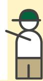
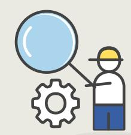

**Operators** wishing to place these products on the EU market **must conduct due diligence to demonstrate that these criteria are met**

**Information** about the legality of the products, along with evidence that they are traceable and deforestation free, **must be compiled by operators**

**EU competent authorities**  will conduct checks to **determine compliance** 

The **EU Deforestation Regulation (EUDR)**  requires that **palm oil, coffee, cocoa, soy, cattle, timber and rubber** (and some derived products) entering the EU **be produced legally and without causing deforestation**

# **Understanding the legality criteria under the EUDR**

| it covers seven areas of law:          |                                                  |
|----------------------------------------|--------------------------------------------------|
| Land use:                              | such as the recognition of customary, private or |
| Environment:                           | such as the requirements on biodiversity         |
| Third-party rights:                    | such as communitiesí right to access             |
| Labour rights:                         | such as obligations on equal treatment and       |
| Free, Prior and Informed Consent:      | such as communitiesí                             |
| Human rights:                          | such as prohibitions on child and forced         |
| Tax, trade, customs & anti-corruption: | such as obligations                              |

**EU**

**EUDR**

# **Unpacking legality requirements under the EU Deforestation Regulation**

To demonstrate compliance, the EUDR requires operators to have a **due diligence system** in place to collect and verify information on their products

**Due diligence is a continuous and dynamic process** aimed at identifying, assessing and mitigating risks associated with procurement activities

Due diligence is not a fixed checklist, but a mechanism that is:

**Dynamic:** Evolves in line with new information or changes in risks ó e.g. changes in the supply

chain **Contextual:** Varies by operator, product type, suppliers, intermediaries, sourcing area, etc. **Systematic:** Must be carried out by the operator for each shipment

> European importers can **take into account information from certification schemes** to conduct risk assessments

However, **no certification provides a ëgreen laneí to the EU market:** operators must be able to explain how certification helps in their due diligence

Legality must be measured based on the existing national legal framework

**To determine the legality of their products, operators must first identify which legal requirements are relevant**

#### This involves:

**Knowing the countryís laws:** Which international treaties, laws, regulations, decrees, etc., are applicable in the producing country in the seven areas listed in the EUDR?

**Focusing on the commodity:** Which requirements are specifically relevant to the commodity? **Focusing on the appropriate scale:** Which requirements apply to the area of production?

**Disclaimer.** This factsheet has been produced by the European Forest Institute with the financial assistance of the European Union. The contents of this factsheet are the sole responsibility of the author and can under no circumstances be regarded as reflecting the position of funding organisations. The information presented in this factsheet comes from the EUDR published in the EU Official Journal on 9 June 2023.

# **How to demonstrate legal compliance?**

### **Can certification help operators demonstrate compliance?**

#### **How does a due diligence system work?**

### **What is due diligence?**

## **How to identify relevant legal requirements?**

**Collect** accessible information, data, and documents demonstrating compliance

#### **If risks are**

**identified,** design, implement and document mitigation measures

> **Identify risks** related to legal compliance and/or the absence of accessible information

**Verify and assess** the quality and reliability of information, data, and documents

!

*If one area of law is not regulated in a country, then there is no legal requirement to be complied with*

