# **WOMEN, THE BACKBONE OF COCOA PRODUCTION IN CAMEROON**

How the EUDR could support this essential, invisible, and exploited workforce

#### **TRANSLATION OF THE ORIGINAL FRENCH REPORT LES FEMMES, PILIER DE LA PRODUCTION DE CACAO AU CAMEROUN WHICH IS AVAILABL[E HERE](https://www.fern.org/fr/publications-insight/les-femmes-pilier-de-la-production-de-cacao-au-cameroun/)**

**AUTHORS:** Samuel Nguiffo, Dr Salomon Essaga Eteme, Dr Yves Valéry Obame, Dr Sébastien Bayndaya Nazilao

**EDITOR:** Sonia Léa Rouabhi

**GRAPHIC DESIGN:** Sylwia Niedaszkowska

**IMAGES:** Giovanny Engamba

**COVER IMAGE:** In Biakoa village, central Cameroon, a widow and mother of five presents her eight-hectare cocoa field.

**ACKNOWLEDGMENTS:** Thank you to Indra van Gisbergen, Hannah Mowat, Richard Wainwright, and Salomon for supporting the production of this report.

**THE FOLLOWING COLLABORATED ON THE STUDY:** Mme Huguette Kamsu, Mme Marie Bernadette Adinga, Mme Carole Yolande Abologo, Mme Kady Morena Ntep, Mme Mountouzache Zainabou, M. Jordan Meli, M. Elvis Essono, M. Ferdinand Léopold Nteme

#### **JANUARY 2026**

This publication was produced with the financial support of the European Union, the German Federal Ministry for Economic Cooperation and Development (BMZ), the Green Livelihoods Alliance, and the Ministry of Foreign Affairs of the Netherlands. The views expressed can in no way be taken to reflect the views of the donors. This material has been funded by UK aid from the UK government; however,

the views expressed do not necessarily reflect the UK government's official policies. The author(s) remain responsible for any errors.

In preparation for EU Deforestation Regulation (EUDR) implementation, the Centre for Environment and Development (CED) Cameroon and Fern sought to analyse the central role of women in Cameroon's cocoa sector, as well as the potential impacts of the EUDR on respect for their rights.

The study provides detailed documentation of the invisibility of women's work and the violence associated with it. It analyses land tenure insecurity, income inequalities, lack of access to information and training, male dynamics within cooperatives and the particular vulnerability of Indigenous women.

Through this large-scale field survey, CED and Fern propose concrete recommendations to ensure that future EUDR implementation guarantees not only the protection of forests, but also the rights of women, particularly those of local communities and Indigenous Peoples.

# **EXECUTIVE SUMMARY**

This document is the result of a field study conducted in ten localities in three regions of Cameroon to look at the place of women—including Indigenous women—in the cocoa sector. It is primarily intended for companies, Cameroonian and European policy makers, and journalists. The initial research took place before confirmation that the European Union Deforestation Regulation (EUDR) would be postponed until December 2026. This will undoubtedly have an impact on the cocoa sector in Cameroon.

**The study documents a central paradox: without women, the Cameroonian cocoa industry would not function on the same scale or with the same efficiency.** Women work the land, maintain the plantations, harvest, shell, process, and organise the workforce. Yet they remain largely invisible in land registries, cooperative governance, commercial contracts, and income distribution.

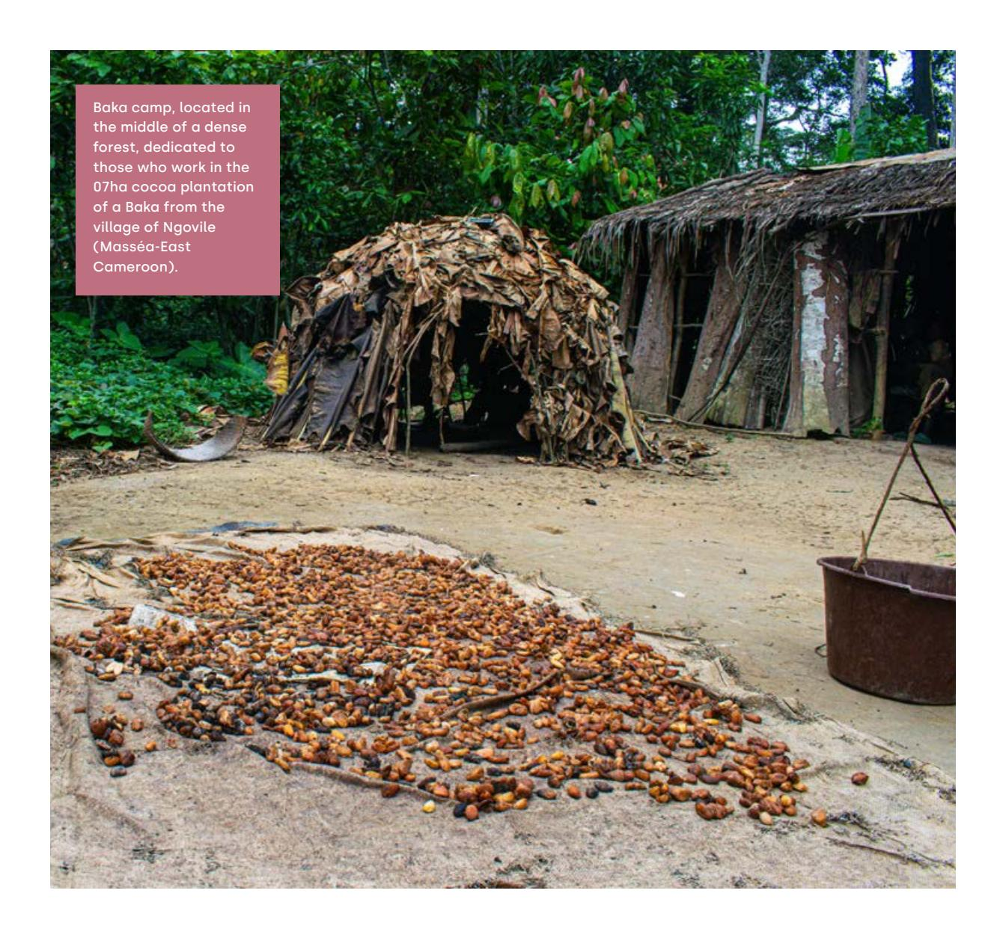

The main findings include that there is:

- ● **A gradual but invisible feminisation of production:** In the areas studied, women aged 25 to 45 constitute the active core of production (including on plantations that do not belong to them), while also taking on all domestic tasks. Women also directly control increasingly large areas of planted land.
- ● **Widespread land insecurity:** Although all rural populations are exposed to land insecurity, women are more vulnerable than others. Only 13% of the 191 women surveyed have a land title, and 38% have no documents proving ownership of the land they farm. In total, 87% of women producers are experiencing land insecurity.
- ● **Significant asymmetry in income management:** Even when women do most of the work, they control only a fraction of the money received from cocoa—often 20% to 30% (used for household expenses). Investment decisions, wealth accumulation, and participation in cooperatives remain largely the preserve of men.
- ● **Increased vulnerability of Indigenous women (particularly the Baka):** Doubly marginalised as women and as Indigenous people, Indigenous women are at the bottom of the social and economic hierarchy. They often work on third-party plantations, with little or no control over their income and significant exposure to violence and discrimination.
- ● **A proven lack of knowledge about the EUDR:** 68% of women interviewed said they had never heard of the EUDR. Among those who had heard of it, many reduced it to a generic message about protecting the forest ("don't cut down trees"), without knowing the specific requirements in terms of geolocation, proof of land legality, and risk management. Above all, they are unaware that achieving compliance is more the responsibility of exporting companies than of small-scale producers. In this context, the EUDR is perceived as a distant policy that is poorly understood and rarely explained in production areas.

If EUDR implementation is accompanied by targeted measures—securing land rights for women, dedicated access to information and training, support for women's agricultural entrepreneurship, participation in cooperatives and governance bodies—it could be a powerful lever for social justice and sector transformation. For European and Cameroonian companies and policy makers, the challenge is clear: How to make gender equality a central pillar of EUDR implementation in Cameroon.

# **1. WHY FOCUS ON WOMEN IN THE COCOA SECTOR?**

The surge in global cocoa prices between 2022 and 2024 brought this commodity back into the international spotlight. Consumer countries and regions, particularly the EU, face a double challenge: How to secure supplies while reducing the environmental and social footprint of their imports. The EUDR fits into this context.

### **COCOA IN CAMEROON: A PILLAR OF THE NATIONAL ECONOMY**

In 2023, Cameroon became the third largest producer in Africa and the **fourth largest exporter of cocoa in the world,** with a market share of **7.6%,** behind Côte d'Ivoire, Ghana, and Ecuador. The sector relies heavily on small-scale **producers** of which there are **an estimated 600,000,** mainly in the Central, South, Southwest, and Littoral regions.

Cocoa is now Cameroon's leading export product after oil. It generates several **hundred thousand direct and indirect jobs** (production, collection, transport, processing) and contributes around **1-2% of national Gross Domestic Product (GDP)** and nearly **8% of agricultural GDP,** according to available

#### **Production and exports: growth driven by international prices**

Since 2010, national cocoa production has ranged from 250,000 to 300,000 tons per year:

- approximately **264,000 tons in 2019**
- ≈ **301,000 tons in 2019/2020 (peak)**
- **292,000 tons in 2020/2021**
- **266,000–270,000 tons in 2023/2024**
- ≈ **309,000 tons marketed in 2024/2025,** the first official exceedance

**Growth in value** is stronger than growth in volume, driven by soaring international prices:

- **in 2023,** Cameroon exports ≈ **180,000 tons of beans** (down from 2022), but the value reaches ≈ **359 billion African Financial Community (CFA) francs, up 12.9%** in one year.
- **In 2024,** the total value of cocoa exports (beans + derivatives) will approach **1 trillion CFA francs,** or **about 31% of the total value of Cameroon's exports,** for a volume of close to **300,000 tons.**

The share of processed products (paste, butter, powder, chocolate) is still limited (around **7–10% of cocoa exports**) but is **growing rapidly:** more than **73,000 tons of derivatives exported in 2023**  for around **153 billion CFA francs,** with major plans to increase grinding capacity.

**Seen from Brussels,** the EUDR is primarily a value chain governance mechanism. Its traceability requirements go down to the plot level and requires certification of zero deforestation from a reference date, demonstration of legal land use, risk analysis conducted by operators, and enhanced border controls.

**Seen from a village in central, southern, or eastern Cameroon,** the reality is quite different. In these areas, cocoa is a cash crop, an economic safety net, and a symbol of social status. It shapes landscapes, power relations, and life trajectories. And in the shadow of this economy, women play an essential but underestimated role.

Understanding their realities is not a "good-to-have", it is a prerequisite for the EUDR to achieve its stated climate and social justice objectives.

This field study offers a socio-anthropological and legal interpretation of these realities. It shows how an environmental regulation designed in the EU interacts, on the ground, with rural societies marked by patriarchy, deep land inequalities, and power relations that disadvantage women and Indigenous Peoples, and how they can contribute to transforming them.

### **COCOA, DEFORESTATION, AND FOREST DEGRADATION IN CAMEROON**

Agriculture is one of the **main drivers of deforestation and degradation,** with cocoa regularly cited as one of the crops responsible, alongside oil palm, rubber, coffee, and

A study conducted in the **Ntui** region **(Grand Mbam)** shows that **deforestation is directly linked to the expansion of cocoa plantations:** approximately **4,600 hectares of forest have been converted to cocoa plantations in a decade,** with **64% of the plots located in areas classified as forest.** 

A report by the non-governmental organisation (NGO) Mighty Earth indicates that **between 2020 and 2025, Cameroon is expected to lose approximately 782,000 hectares of forest, or 4.2% of its forest cover in five years, and that at least half of these recent losses are located in cocoa-producing regions.** This indicates a new wave of land clearing for cocoa.

However, the government has announced its ambition to **double cocoa production by 2030,** even though the scope for expansion outside forest areas is limited. Several analyses highlight the **risk of significant tension between productivity targets and the preservation of the Congo Basin's forests.** 

In response to these challenges and market requirements (notably the EU Roundtable on Sustainable Cocoa "Cocoa Talks"), Cameroon committed to a **"Roadmap for Zero Deforestation Cocoa"** in 2021, involving the state, private sector, and civil society, as well as initiatives to **map cocoa plantations and forest cover in detail.**

# **2. METHODOLOGY**

### **METHODS AND TECHNIQUES**

This research is based on a mixed methodological approach, combining qualitative and quantitative methods. On the qualitative side, observations were carried out within communities and on 14 cocoa plantations, 50% of which are owned by women and members of the Baka Indigenous population. These observations were supplemented by seven mixed group discussions with Baka Indigenous People who own cocoa plantations, as well as seven group discussions with women who own cocoa plantations.

In terms of quantitative data, information was collected through surveys of 405 male cocoa farmers and 191 female cocoa farmers who are both heads of households and/or owners of at least one cocoa plantation, and 63 Indigenous Baka women who own at least one cocoa plantation.

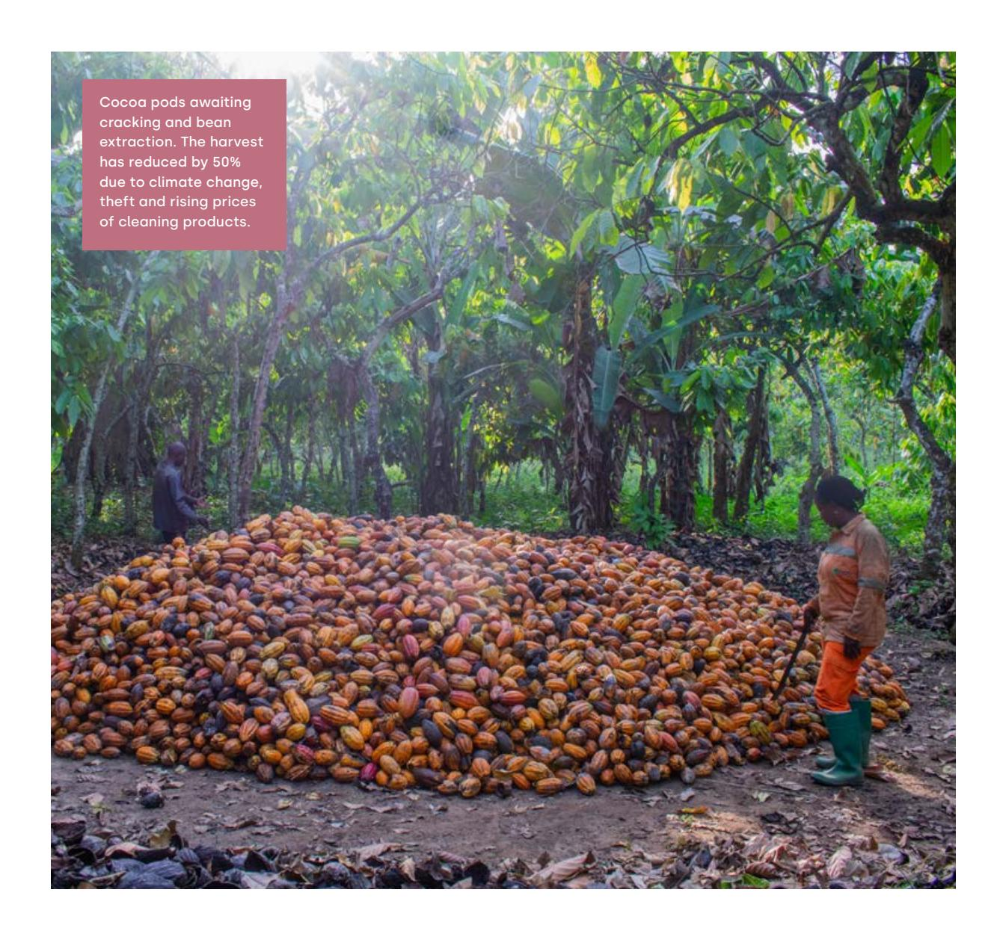

### **SELECTION OF STUDY AREAS**

The study was conducted in 10 locations spread across the central, southern, and eastern regions of Cameroon (see Figure 1). These sites were chosen based on several complementary criteria:

z Diversity of cocoa production areas, including traditional areas with productive plantations, new areas with plantations that have already been established or are in the process of being established, and traditional cocoa production areas with old plantations. z The presence of significant environmental issues such as forest border areas and territories near the Dja Reserve, with all sites studied located in Cameroon's forest zone. z Continuity with previous work on cocoa carried out by CED and its partners.

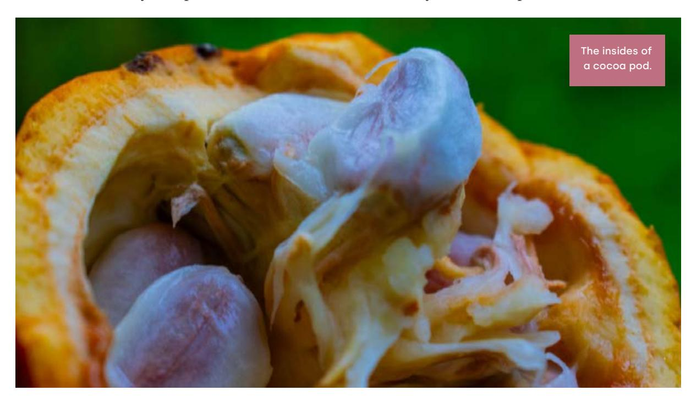

#### **Figure 1: Map of the localities surveyed**

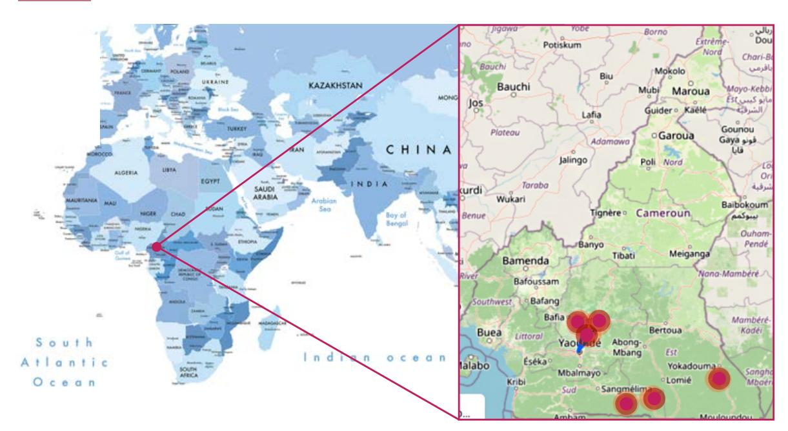

# **3. WOMEN'S ROLE IN CAMEROON'S COCOA SECTOR**

### **AGE CATEGORIES AND ROLES OF WOMEN IN COCOA PRODUCTION**

Although women of all age groups are involved in Cameroon's cocoa sector, two-thirds of those surveyed were between 25 and 45 years old (see Figure 2).

#### **Figure 2: Distribution by age group of women involved in cocoa production in Cameroon**

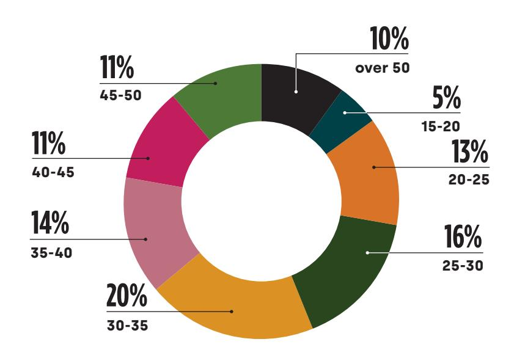

Source: CED 2025.

These women constitute an essential workforce, performing both agricultural tasks and domestic responsibilities, often at the same time.

Of women involved in the cocoa sector, 18% are between 15 and 25 years old. This lower participation is mainly due to their minority age and schooling and because of a focus on other subsistence activities (small trade, crafts, family assistance) and a persistent economic dependence on parents or spouses. When young women in this age group are involved, it is mainly between the ages of 20 and 25, often on family plantations, in the form of unpaid work.

The 25-45 age group accounts for the majority of women producers (61%). This reflects the active involvement of women of working age in the cocoa sector, which appears to be the dominant agricultural activity, ahead of traditional food crops such as plantain, cassava, corn and peanuts. Cocoa is both a main source of income and a lever for economic and social empowerment for this group.

Conversely, women aged 45 and over are less active, mainly due to age-related physical fatigue, distance to the plantations, and the lack of labour to maintain them. Although some women in this age group have inherited plantations or continue to cultivate family fields, they often struggle to

maintain a sustained pace of cultivation or achieve significant yields. In addition, there are sociocultural factors: older women generally favour local food crops (cassava, corn, peanuts), which are more compatible with their physical abilities and domestic needs.

### **WOMEN'S STATUS AND ASSOCIATED VULNERABILITIES**

Women active in the sector have diverse social statuses: Married women, widows, single mothers, migrant women from other regions, and Indigenous Baka women. Their life trajectories differ, but they all face structural obstacles that are remarkably consistent: Unequal access to land, low institutional recognition, high workloads, economic dependence on men, and persistent physical or psychological violence.

Married women most often work on family plantations alongside their husbands. They do most of the maintenance and harvesting work but are not recognised as owners or farm managers. When it comes time to sell, it is usually the man who negotiates with intermediaries, collects the money, and decides how the received income will be used.

Widows and single mothers, when they manage to keep their land, run their cocoa farms alone. For them, cocoa is a source of income, a safety net, and an asset to pass on to their children. They enjoy greater autonomy in managing their income but are more exposed to land conflicts and labour shortages. They often rely on their children for help.

Interviewed migrant women had made a conscious choice to settle in areas where cocoa farming is expanding so that they could develop plantations. They are undertaking entrepreneurial projects, often financed by parallel activities such as small-scale trade, food crops, and tontines (investments which provides an income for as long as that person is alive). However, their status as "newcomers" makes them more vulnerable to land insecurity and market fluctuations.

Finally, Indigenous Baka women face multiple vulnerabilities: as women in patriarchal societies and as Indigenous People in a context of historical marginalisation. They are often confined to lowpaid labour on third-party plantations, with minimal access to productive resources, land rights, and a voice in local decision-making bodies.

### **LAND CONTROLLED BY WOMEN**

Areas controlled by women are generally smaller than those controlled by men (see Figure 3). For 67% of the women interviewed, they range in size from 1 to 5 hectares (compared to 4 to 9 hectares for men). This difference can be explained by several factors:

z Access to land, which is generally more difficult for women (they rarely inherit land as this privilege is reserved for the men in the family, even when the man is younger). z When they buy land, their lack of capital means that they cannot acquire large areas and have additional resources to invest in cocoa cultivation. Plantations are gradually expanded as new income becomes available (from the sale of cocoa or other sources). z Hostility from men in the villages where they arrive as migrant women and the difficulty of accessing labour are constraints on the expansion of women's plantations.

 **Figure 3: Table showing the frequencies and percentages of land owned by the women interviewed**

Women also experience lower yields than men, which can be explained by difficulties in accessing inputs and labour.

| Area                | Number | Frequencies Source: CED 2025. |
|---------------------|--------|-------------------------------|
| Less than 1 ha      | 14     | 7                             |
| Between 1 and 5 ha  | 128    | 68                            |
| Between 6 and 10 ha | 29     | 16                            |
| More than 10 ha     | 16     | 9                             |
| Total               | 187    | 100                           |

# **4. LAND AND RIGHTS: THE BLIND SPOT IN EUDR COMPLIANCE**

In the areas studied, land is at the heart of many issues including those related to access to credit, technical support, certification programs, cooperatives, and ultimately export markets. It is important to also note, however, that access to land remains particularly precarious for most women.

Only 13% of the women surveyed (Figure 4) reported having a land title (meaning their ownership is recognised by the administration). Conversely, 38% say they have no documents relating to the land they farm. The others have forms of customary recognition, verbal agreements, or lessaccepted local certificates. This precarious situation regarding land rights is not unique to women, it also affects men, but to a lesser extent, as their rights are generally better protected by customary law, even if they are not recognised by the state.

#### **Figure 4: Responses to the question about ownership of property documents**

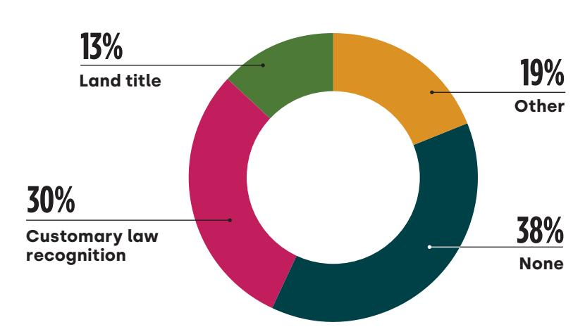

Under these conditions, the EU requirement for "proof of legality" for cocoa-producing plots may, in practice, result in the automatic exclusion of many small producers (including women who control plantations located on land with insecure land rights). However, this outcome is not inevitable – **EUDR implementation could also become an exceptional opportunity to support the land rights of these hundreds of thousands of people and lift them out of their precarious situation, including the least visible, who are also the poorest and most unable to cope with complex administrative procedures.** 

Land legality is not just a matter of legal texts; it is also a question of local power relations, high transaction costs, and customary norms, which are sometimes discriminatory, partly due to the patriarchal environment.

Blind implementation of the EUDR therefore risks reinforcing pre-existing inequalities rather than correcting them.

### **LAND PRESSURES AND SUSTAINABILITY: AN IMPOSSIBLE ALLIANCE?**

Cocoa production in Cameroon faces several simultaneous challenges:

- growing land pressure around cocoa frontiers;
- the coexistence of insecure customary rights and private concessions or large plantation projects; and
- nternational requirements for traceability and zero-deforestation, which require greater clarification of land and forest rights.

For those involved in land reform, cocoa is therefore a **test case.** It can either move up the market chain (sustainable intensification, agroforestry, local land tenure security), which will enable **greater production without further destruction of forests;** or it can continue current trends, which will lead to more f**orest conversion, land conflicts,** and **the risk of small producers being excluded** from export markets for non-compliance with "zero deforestation" standards.

**Transformation of the cocoa sector must focus on improving production techniques, bean quality, working conditions, and incomes, thereby helping to retain small producers.**

## **5. THE EUDR AS SEEN FROM THE VILLAGE: A DISTANT POLICY WITH CONCRETE EFFECTS**

For most women surveyed, the EUDR is a distant policy with unfamiliar content, terms, and deadlines – 68% of respondents say they have never heard of it. Among those who have, many associate it with the idea that trees should no longer be cut down in fields (see Figure 5).

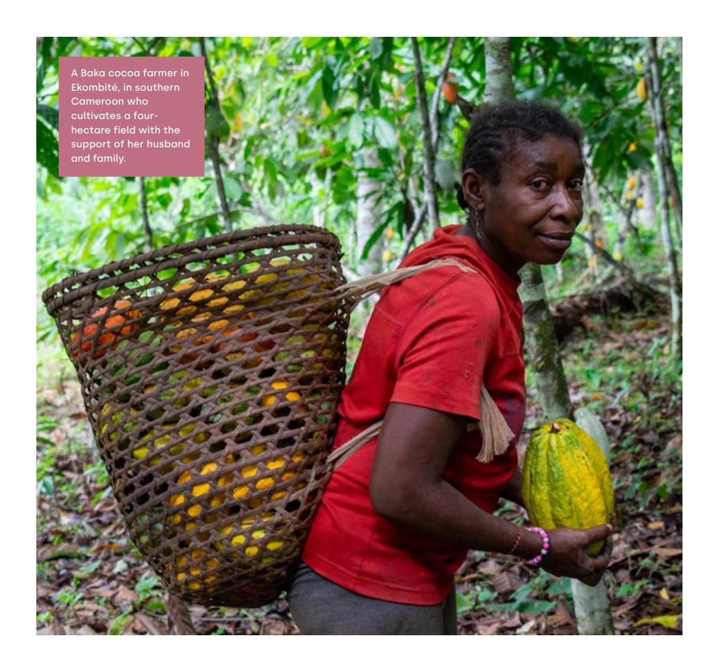

When the EUDR's principles are explained, many women express ambivalence. On the one hand, protecting forests may make sense, including for women producers who are aware of soil degradation and declining productivity in older forests (experienced through lower agricultural production and observed through climate change). On the other hand, prohibiting or restricting access to the forest is sometimes perceived as likely to create ambiguities between forestry companies (since they want to log the forest). It should be noted that some women clearcut the forest completely, while others systematically leave shade trees in their plantations.

# **6. THE COCOA TRADE, MONEY, AND GENDER RELATIONS**

The marketing channels used—middlemen, cooperatives, local elites, export operators—has a big effect on whether value created by women's work is captured or redistributed. In most cases, women are at the bottom of this hierarchy and reap only a small share of the wealth to which they have made a significant contribution. Middlemen provide advances in cash or inputs during the off-season, then buy cocoa at prices they set unilaterally. This system guarantees immediate liquidity, but traps many producers, especially women, in a cycle of chronic debt and therefore permanent precariousness.

Cooperatives offer a potentially fairer alternative, providing better prices, certification-related premiums, and technical support. However, they are still too often controlled by male elites.

In households, cocoa money becomes a marker of social status and a source of power. Investment decisions are most often made by men. In cocoa-producing families, when the crop is sold, it is the men who receive the proceeds and distribute them. They give women a share of the income, intended to cover part of the household expenses. Women are generally not informed of the sale price of the production and have no knowledge of the amount kept by men. This highly asymmetrical relationship, which is found in most households due to the patriarchal nature of society in the areas studied, limits women's ability to invest in their own fields, purchase land, or become full members of cooperatives.

#### **Figure 5: Extent to which interviewees had heard of the EUDR**

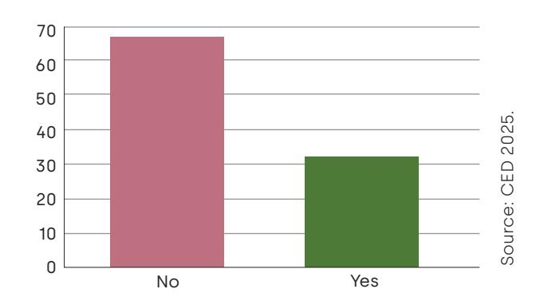

### **GENDER-BASED DISCRIMINATION AND VIOLENCE**

Gender-based discrimination and violence are one of the main social barriers to women's integration in EUDR implementation.

In the study area, these constraints are reinforced by the persistent marginalisation of women in cooperatives and local governance structures. They are underrepresented and have limited access to key information, particularly on market requirements, training programs, credit opportunities, and various forms of technical support. This institutional exclusion reduces their ability to make their voices heard and to be recognised as key players in the cocoa sector, even though without them, Cameroon would probably not occupy its current position among the continent's producing countries.

Low levels of information, economic dependence, weak land tenure security, and limited access to productive resources limit small producers' ability to comply with new international market requirements (and even more so women producers).

That said, the EUDR can also provide an opportunity for the gradual integration of women into more sustainable and inclusive value chains, provided that specific support measures are put in place.

This transition cannot rest solely on the shoulders of small-scale producers. Exporters, who bring beans to the EU market must assume a central share of the responsibility and costs of complying with the EUDR by actively supporting producers, particularly women, through appropriate information, training, and technical support mechanisms.

# **7. INDIGENOUS WOMEN: THE DOUBLE PENALTY**

Indigenous Baka women are a stark illustration of the link between gender inequality and ethnic inequality. Long confined to a hunting and gathering economy, they are now engaged in a process of sedentarisation that makes them dependent on cocoa farming, without effective recognition of their land rights or agricultural skills.

In several of the localities studied, these women do almost all the field work—setting up nurseries, weeding, harvesting, transporting— , while their husbands or Bantu employers reserve the right to sell the crops and control the income. Several testimonies collected report situations of domestic violence linked to the management of cocoa income.

For EU stakeholders, the question should not only be whether exported cocoa is "zero deforestation" and legal, but also whether it is free from social and gender injustice. A value chain that is reputed to comply with the EUDR but continues to rely on exploited and invisible female labour would be difficult to defend in light of the EU's human rights commitments.

The argument of a supposed legal vacuum is sometimes used to justify a lack of interest in promoting legality in the sector. While it is true that Cameroon has not ratified International Labour Organisation (ILO) Convention No. 169 on Indigenous Peoples, it has ratified several binding international instruments, including the United Nations Convention on the Elimination of All Forms of Discrimination. In accordance with the Cameroonian Constitution, these conventions are incorporated into the domestic legal system, with a higher legal status than ordinary law, which establishes clear obligations in terms of protection against discrimination, including against Indigenous women.

### **MARGINALISATION OF THE BAKA AND BAGYELI/BAKOLA IN THE COCOA SECTOR IN SOUTHERN CAMEROON: A FOCUS ON WOMEN**

In southern Cameroon, the Indigenous Baka and Bagyeli/Bakola peoples remain largely marginalised in the cocoa economy, despite this sector's central role in rural development. Their marginalisation begins with access to land - generally lacking land titles or formal recognition of their ancestral territories, they are often confined to the edges of plantations belonging to their Bantu neighbours or relegated to precarious and seasonal work. This land insecurity limits their ability to invest sustainably in cocoa, access credit, or join cooperatives.

Baka and Bagyeli/Bakola women suffer double or even triple marginalisation: as Indigenous Peoples, as women, and often in situations of extreme poverty. They are involved in all stages of production—light clearing, harvesting, shelling, fermentation, drying—but their work is rarely recognised or remunerated at its true value. They have limited access to land ownership, economic information, technical training, and certification or quality premium schemes. When they work as day labourers or domestic helpers on Bantu plantations or commercial farms, they receive lower wages, lack social protection, and sometimes experience gender-based violence or exploitation.

Public and private cocoa support programmes (productivity projects, sustainability schemes and zero deforestation initiatives) rarely include specific mechanisms to include Indigenous women, who also face language barriers and discrimination. Without an intersectional approach that takes gender, Indigenous status, and land insecurity into account, cocoa sector development risks reinforcing inequalities and further obscuring the contributions and rights of Baka and Bagyeli/Bakola women.

## **8. COCOA, LAND TENURE, AND INCLUSION: WHAT THE EUDR CAN TRANSFORM**

The cocoa sector is an excellent vehicle for the historic cooperation between Cameroon and the EU, with both parties sharing a strategic interest in its development. In Cameroon, cocoa farming is a major source of employment, and not only in rural areas. It is also the state's second largest source of export revenue, after oil, and on a par with the forestry sector. It contributes significantly to the state's tax revenue through the taxes it pays. As for the EU, thanks to Cameroon, it has access to high-quality beans for its industry and consumers.

The entry into force of the EUDR, combined with historically high prices for beans, offers both parties the opportunity to fundamentally transform the sector. This transformation must focus on improving production techniques, bean quality, working conditions, and incomes, thereby helping to retain small producers.

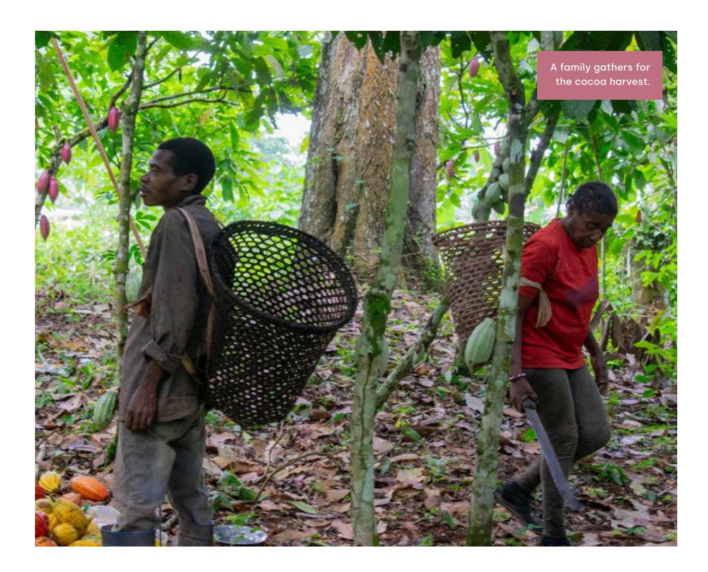

However, such a change requires massive investment in the regeneration of old plantations and the gradual securing of land rights for all producers, including those who are generally marginalised (particularly women). These investments are crucial to enabling Cameroon to preserve its access to the historic EU market and to withstand the return of giants such as Côte d'Ivoire and Ghana, as well as the inevitable emergence of new producers.

For European institutions, the implementation of the EUDR opens space for negotiation with producing countries such as Cameroon. The dialogue, which is already underway, should not be limited to technical issues of geolocation or information systems, but should explicitly include commitments relating to women's land rights, the fight against discrimination, and the participation of vulnerable groups, in order to remain consistent with EU commitments on human rights and environmental protection.

We recommend developing these policy and regulatory levers:

- ● **National EUDR plans:** Explicitly integrate gender equality and consideration of the rights of Indigenous communities into national plans for EUDR implementation, with quantified targets for women's participation in compliance programmes, and regularly published monitoring indicators. This approach could be accompanied by a reflection on improving the legal framework for the recognition and protection of the rights of Indigenous communities.
- ● **Partnerships and funding:** Make EU partnerships and funding conditional on verifiable progress in securing land tenure for rural populations, particularly women, notably through simplified and subsidised procedures for accessing land titles or recognition mechanisms adapted to local contexts. Pending the completion of land reform, the intermediate land tenure security tools put in place by the Ministry of Domains, Cadastre, and Land Affairs could be further mobilised by the cocoa sector.
- ● **Capacity-building programs:** Support capacity-building programs specifically designed for women producers, in local languages, using appropriate teaching methods (such as visual aids, forum theatre, and community radio), covering the EUDR, agroecological practices, and women's rights.
- ● **Research:** Support research and development to better document the challenges and dynamics of cocoa sector transformation.
- ● **Company production incentives:** As key players in EUDR implementation, companies have a decisive role. They should adapt their strategies to contribute to the adoption and implementation of targeted mitigation measures in favour of women producers, including Indigenous women. This could involve the introduction of incentives, such as a fund to support the improvement of cocoa farming practices, capacity building for women, and support for the creation of women's cooperatives.
- ● **Land Rights:** Finally, the Government of Cameroon, which is engaged in land and property reform, has a decisive lever to support this transition, as it can provide solutions to difficulties in securing the customary land rights of rural women and Indigenous communities.

#### **CONCLUSION: IT IS IMPERATIVE TO INCLUDE THOSE WHO ARE ALREADY INVOLVED IN THE SECTOR IN THE TRANSITION**

EUDR implementation is not just a matter of databases, Global Positioning Systems (GPS), and customs controls. It can, and must, bring about a profound socio- economic transformation of the relationships between EU consumers and the productive territories of the South; between companies and small producers; and between international standards and local realities.

Women cocoa producers in Cameroon play a central role in this transformation process. They already bear a significant share of the productive effort, while ensuring the economic survival of their families.

Excluding them, even indirectly, from the new so-called "sustainable" supply chains would weaken the entire sector and undermine the credibility of EU commitments to social and climate justice.

For companies, as well as for Cameroonian and European policymakers, the challenge is therefore clear – how to ensure the EUDR isn't just another technical tool, but a lever for reducing inequalities in producing regions.

The answer will largely depend on the ability of public policies to place women, including Indigenous women, at the heart of support, compliance, and monitoring mechanisms, so that the transition to sustainable cocoa is based on those who already sustain the sector on a daily basis.

**Women cocoa producers in Cameroon play a central role in socio-economic transformation**

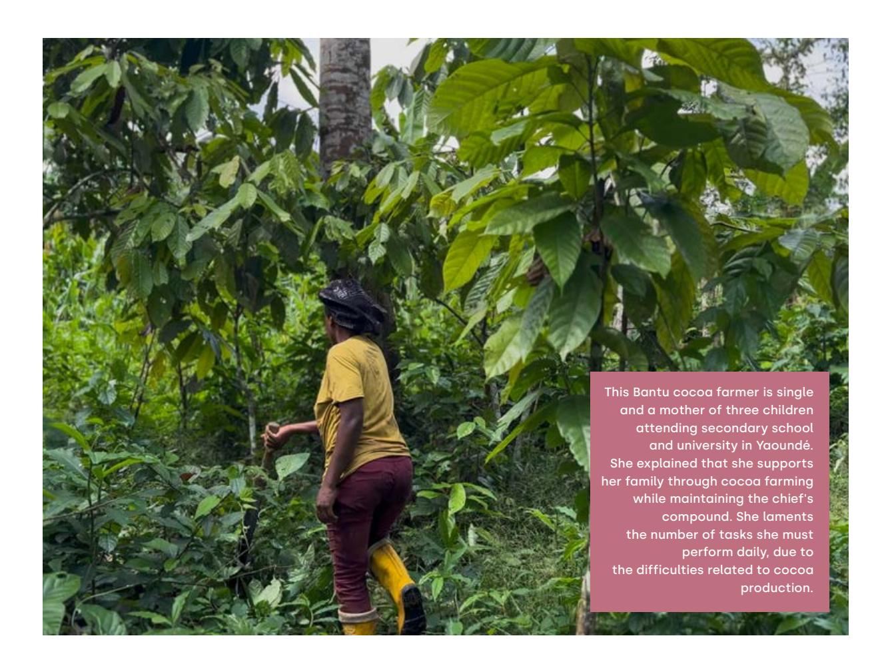

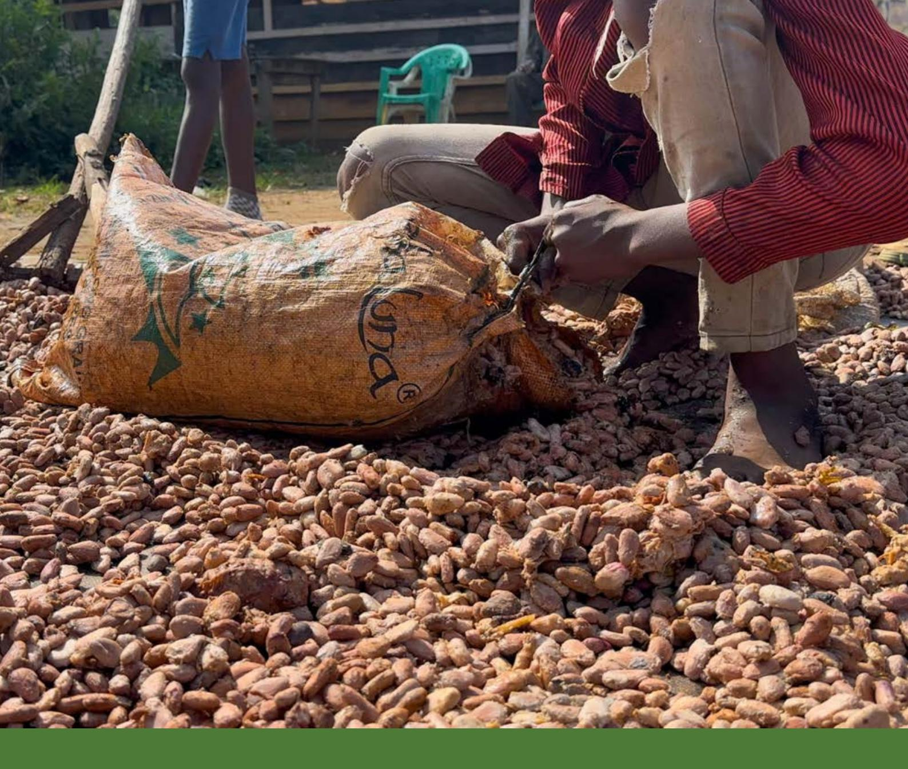

"*The question should not only be whether exported cocoa is 'zero deforestation', but also whether it is free from social and gender injustices. A value chain that is reputed to comply with the EUDR but continues to rely on exploited and invisible female labour (Indigenous or otherwise) would be difficult to defend in light of the European Union's human rights commitments.*"