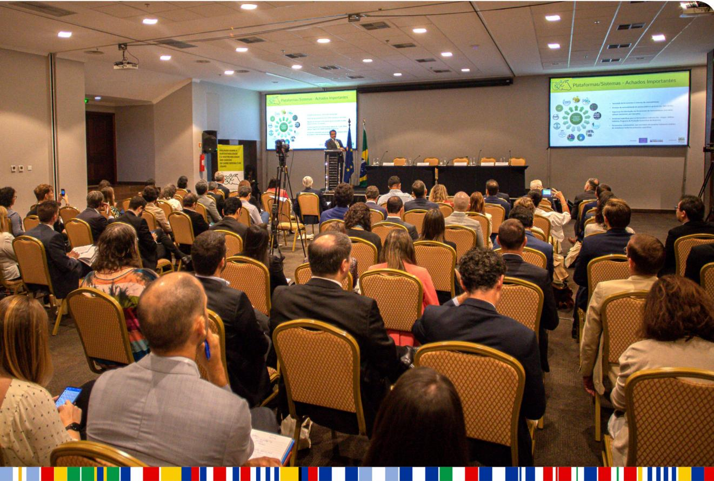

Final conference

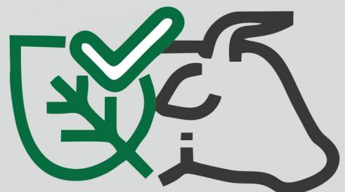

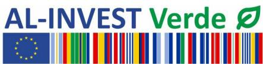

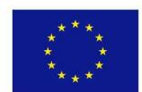

This publication was funded by the European Union. Its contents are the sole responsibility of the authors and do not necessarily reflect the views of the European Union.

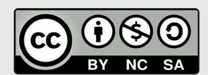

The original publication and any derivative works, which must be distributed with a licence that is the same as the one that applies to the original publication, may not be sold.

## **Dialogues on sustainability and traceability of beef and leather value chains**

Final conference

**Report coordinated by:** Andrea Monaco, senior programme manager, and Lorenzo Nalin, programme manager of AL-INVEST Verde.

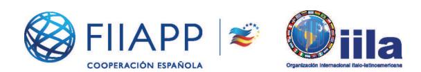

## **Design and layout:** albantacreativos.com

January 2024

## **Introduction**

## **Opening remarks**

## **Panel 1.**

Perspectives from business on due diligence, transparency and traceability for the beef and leather value chain

## **Panel 2.**

Perspectives on the role of the public sector in fostering due diligence process, transparency and traceability systems for reducing the risk of deforestation

**Conclusions**

**4**

**6**

**8**

**11**

**15**

The EU-Brazil Beef and Leather Value Chain Dialogues aimed to bring together key stakeholders from the European Union and Brazil (importers, retailers, meat packers, tanneries, exporters, farmers, researchers, relevant associations and civil society organizations, etc.) to discuss the sustainability of the beef and leather value chains in Brazil. The initiative has been promoted by the European Union through the AL-INVEST Verde programme, in collaboration with the Amazon Environmental Research Institute (IPAM).

The overall objective of this initiative was to contribute to the identification and promotion of collective practices and partnerships among key stakeholders that contribute to the sustainability of the beef and leather value chain, a sector of great importance for climate change and environmental policies. The dialogues involved more than 150 players in the beef and leather industry from both the EU and Brazil and contributed to information flows on crucial issues and best practices, policy initiatives, voluntary agreements, and market-based initiatives aimed at reducing demand for new deforestation linked to the chain, compliance with labour legislation and promotion of decent work.

After a first virtual opening roundtable discussion on the main topics linked to the EU-Brazil value chain in the beef and leather sector, held in December 2021, the initiative moved on through three virtual technical dialogues: the first held on March 9th, on the role of due diligence in regularizing the beef and leather value chain; the second, on April 20th, on the lack of access to technology and how this impacts sustainability in the beef and leather chains; the third dialogue, on May 18th, examined how traceability can be used to understand better the chains, contributing to their management and identifying opportunities to improve them.

Parallel to this, an in-depth study about traceability systems existing in Brazil has been carried out by IPAM to inform the whole initiative: the study identified 13 experiences currently implemented in Brazil for traceability, 12 of which are private and on a voluntary basis and only one public and free. The study also highlights the main challenges for harmonization and more effectiveness in traceability of these chains in Brazil.

Several policies and technical recommendations emerged throughout the three technical dialogues, the study and the surveys conducted among participants during the dialogues. Based on these results, the final event held on the 15th September in Brasilia brought together 150 stakeholders of the chain – 90 in person plus approximately 60 virtual participants – to discuss the results and political considerations that emerged during the three technical dialogues, focusing on the importance and challenges to improve transparency and traceability systems.

The final conference was structured in two panels, which took place after the initial remarks from Brazilian and European authorities. The first panel focused on the leading role of the private sector as a driver of change towards a sustainable chain. The second panel addressed the crucial part played by the public sector in supporting and promoting such change.

The first panel, “Perspectives from business on due diligence, transparency and traceability for the beef and leather value chain”, gathered key actors of the private sector: Caio Penido (President of the Mato Grosso Meat Institute, IMAC), Liege Correia (Sustainability Director of Friboi, JBS), Susy M. Yoshimura (Sustainability Director of GPA/Assaí), and Aline Aguiar (Socio-Environmental Risk and Sustainability Specialist at Rabobank). The discussion aimed to underline the importance of due diligence, transparency and traceability systems in reducing deforestation risks and related adverse impacts. In particular, it discussed some initiatives and practices that actors in this value chain are implementing. It identified specific challenges and debate shares goals among key actors.

The second panel, “Perspectives on the role of the public sector in fostering due diligence process, transparency and traceability systems for reducing the risk of deforestation”, approached the discussion of the sustainability of the beef and leather chains from the perspective of the public sector. Its critical role in moving toward due diligence, transparency and traceability systems for reducing deforestation has also been addressed. Discussants for second panel were: Felipe Nunes (Federal University of Minas Gerais), Raimundo Deusdará Filho (General Intelligence Coordination, Ministry of Agriculture, Livestock and Food Supply), Mauro O’ de Almeida (Secretary of State of Environment and Sustainability of Pará), and Laurent Javaudin (Counselor for Climate Action, Environment, Energy and Health, Delegation of the European Union in Brazil). This panel was moderated by Marina Piatto (Executive Director of IMAFLORA).

The present document reports the information discussed through the event. It is divided into three sections. Section 1 reports the opening remarks, while section 2 and 3 summarize the main findings from the first and second panel respectively. Finally, section 4 presents the main conclusion of the initiative.

The opening of the conference was presided over by the Ambassador of the European Union to Brazil, Ignacio Ybáñez, Head of Unit - Trade Relations with Latin America of DG Trade, European Commission, Paolo Garzotti (virtual participation) and the General Coordinator of Animal Production of the Ministry of Agriculture, Livestock and Food Supply of Brazil, Marcella Teixeira.

Ybáñez considered the current moment decisive for “the transition towards greener economies”. “Brazil and the European Union have a unique opportunity to work together to build instruments that promote more sustainable value chains”, he mentioned. He also referred to the proposal for a regulation on deforestation-free products that aims to “contribute to the fight against climate change and the loss of biodiversity associated with global deforestation” and said that the legislation will apply equally to goods produced both inside and outside the EU. “The EU contributes by consuming a significant share of the products associated with deforestation. It therefore has a responsibility to contribute to the elimination of deforestation,” he expressed.

Paolo Garzotti highlighted that “the traceability of beef and leather could be an important and symbolic element for a sustainable trade relationship” between Brazil and the EU. With regard to future European regulations on deforestation, he was confident that Brazil already has the capacity and resources to put in place the necessary systems for compliance.

Marcella Teixeira referred to the new version of the Brazilian Sectoral Plan for Adaptation and Low Carbon Emission in Agriculture and Livestock (ABC+ Plan), which in its first decade of implementation “exceeded all the goals set”. He pointed out that this plan supports all the programmes promoted by the Brazilian Ministry of Agriculture, Livestock and Food Supply, while stressing “the commitment of

Brazilian producers to the agendas of sustainable production and environmental protection". In this regard, she mentioned "the importance of Brazil in the global context as an agro-environmental power" and called for the strengthening and consolidation of this role.

The opening remarks were followed by the intervention of André Guimarães, executive director IPAM, who introduced the series of technical dialogues on the sustainability and traceability of the beef and leather value chains and presented the main conclusions of IPAM study on the Brazilian traceability systems.

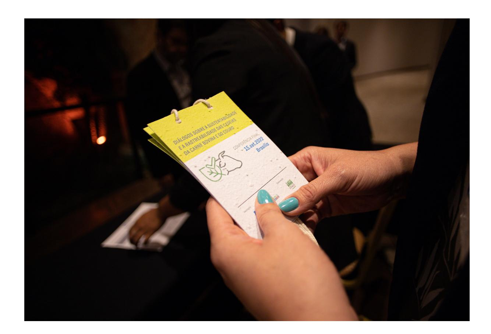

## **Panel 1. Perspectives from business on due diligence, transparency and traceability for the beef and leather value chain**

The panel offered a proficient discussion on the current traceability initiatives developed in the private sector, its role in promoting a transparent value chain, the current challenges in doing so and the collaboration that public and private sectors should further improve.

Key market players, particularly meatpackers and financial institutions, report growing pressure from consumers and legislators to be more transparent and do more to stop deforestation. They argue that a collective effort to make sustainability "sexy and lucrative" is needed, creating tools that can provide tangible benefits for farmers and companies in changing their production patterns and shift towards sustainability. In this sense, one of the significant challenges for private players remains to attract, convince and involve producers in their sustainability practices.

Private sector representatives stressed the importance of a more prominent role of the public sector, particularly in creating a transparent value chain and designing public policies for two main pillars of sustainability. On one hand, providing technical assistance to small farmers and local meatpackers in order to regularize their properties and comply with requirements; on the other, harmonizing the current heterogeneous traceability environment within a national framework that can provide reliable and free-of-charge access to everyone in the chain.

Sustainable policy should aim toward an inclusive and sustainable agenda for producers, especially in implementing the Brazilian Forest Code (Codigo Florestal) and CAR (Cadastro Ambiental Rural) registration. There is broad concern about excluding those who do not comply with rules. The lack of compliance for small producers is often associated with the lack of technical expertise in regularizing their properties, which puts them outside the market.

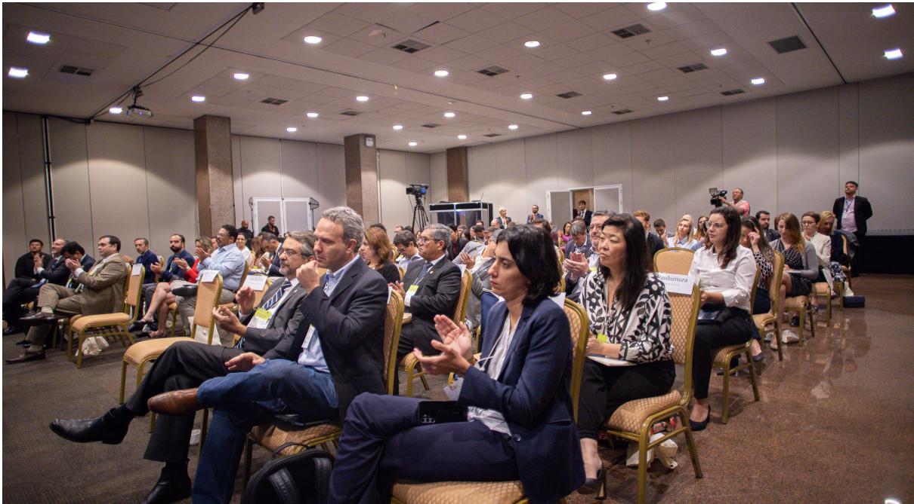

From a technical perspective, the Brazilian Forest Code may be challenging for farmers due to the continental size of the country, which includes six biomes, each of them regulated differently. Concerning the regularization of CAR, two issues were mentioned as a priority to be addressed. On one hand, it is common for farmers that want to regularize CAR to wait over long periods for public officers' assistance. Thus, the process should be less time-consuming; otherwise, it will incentivize farmers not to comply with requirements. On the other hand, if complying with CAR registration leads farmers to be sanctioned, they will not do it because they would prefer not to be regularized and play outside the market instead of participating in it and being punished. This is why there are still illegal meatpackers around the country. A proper financial incentive for CAR regularization is thus required.

Financial institutions also advocate for developing an inclusive agenda as a necessary public policy. The financial industry is committed to a zero-emission portfolio, which obliges them to work with clients towards a more sustainable chain. Unfortunately, this often means the financial system provides credit mainly for funding those who comply with CAR and Forest Code. However, the Brazilian meat and leather sector is in a transition phase and this transition could not simply be supported with a picking-winners-and-losers approach. Credit should be available to those willing to change their system instead of helping exclusively those who already did it. When producers are in a transition phase, they require financing; thus, the bank needs criteria to finance those going to or on a good path of complying with rules. In addition, financial players complain that public database are sometimes ambiguous and lead to the situation that farmers could get credit in one bank while others may refuse.

The inclusive agenda should also apply to small, local meatpackers. Both retailers and multinational meatpackers reported being forced on multiple occasions to block local meatpackers due to deforestation concerns. Yet, blocking and boycotting may not be an efficient strategy in the long run; indeed, it creates a secondary market where boycotted local meatpackers continue with their unsustainable practice and invest time and resources in searching for cattle laundering solutions rather than investing in sustainable practices. The way forward should not exclude those producers from the chain but rather to work closely with them. A success story is when the slaughterhouse is de-blocked and it is back in the market with better environmental practices. To achieve this goal, private meatpackers developed Green Desks that provide technical assistance.

The second pillar to achieve a transparent and sustainable value chain concerns the harmonization of traceability systems into a national framework that levels the playing ground and reduce transaction costs for small farmers. Private companies report the inefficiency of having many systems in place not capable to communicate and give feedback among each other, especially considering that all systems work under the same umbrella, i.e., Forest Code, CAR, GTA, etc. In addition, most analysis and report performed through private traceability systems is not publicly available despite the fact that it would foster a positive externality to the whole chain.

As a result, meatpackers and retailers vigorously suggested scaling up at the national level initiatives such as Beef on Track, an platform that promotes actions to implement the private sector's socio-environmental commitments such as the Terms of Adjustment of Conduct (TACs) of the Public Prosecutor's Office and the Public Livestock Commitment in the states of Amazonas, Acre, Mato Grosso, Pará, and Rondônia. Expand Beef on Track at the national level would allow having only one institution monitoring all players in the chain - producers, meatpackers, and financial institutions - providing tangible benefits by reducing transaction costs. It would also level the playing field by harmonizing the rules for all stakeholders. Finally, being internationally recognized, Beef on Track would benefit the credibility of the Brazilian traceability system among international buyers.

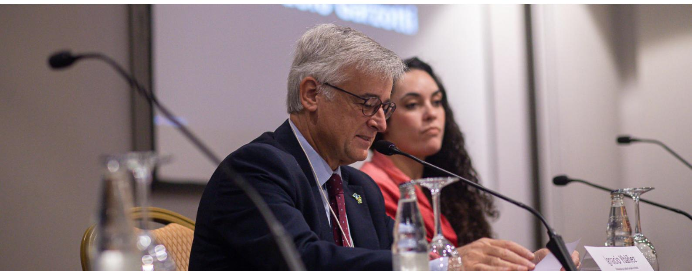

# **Panel 2. Perspectives on the role of the public sector in fostering due diligence process, transparency and traceability systems for reducing the risk of deforestation**

The second panel focused on the role of the public sector and how it would be possible to connect traceability systems, private and state-level initiatives within a federal government policy action.

Two public initiatives were introduced through the panel: i) the Observatorio da Agropecuaria Brasileira, developed by Ministry of Agriculture in collaboration with the private sector and international cooperation from Germany; ii) the Selo Verde platform, developed at the State level in Pará in collaboration with the academia.

The Observatorio da Agropecuaria Brasilera is an example of a central government initiative to harmonize data. It is a platform with statistics and geospatial information, as well as reports, organized in thematic panels. It is based on integration, crossing, and availability of public information. The platform helps firms and government decision-making. The Observatorio has been recently launched and the central government is committed to its expansion in the coming years.

Selo Verde – a technological tool that classifies deforestation according to land property - is an example of a public and free-of-charge, universal traceability system that was developed in response to the private sector's slowness in implementing initiatives for transparency. With no cost for final users, the Selo Verde brings information about risk of direct and indirect deforestation associated with properties registered in the CAR. In its application, the system was able to show that more than 80% of properties in Pará are free of deforestation after 2008 and thus comply with the law.

There exists two crucial takeaways from initiatives such as the Selo Verde. First, there is a false myth that traceability would be an obstacle that slows the performance of the agriculture and livestock sector by generating further costs for

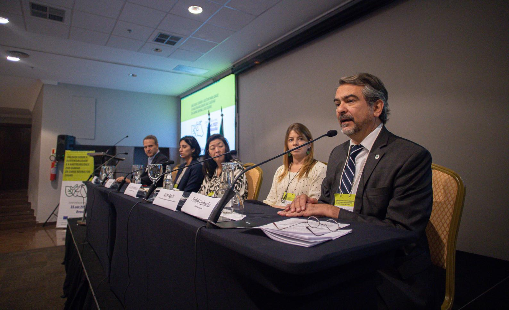

farmers. On the contrary, Selo Verde represented a solution for all those producers who could not show through private systems that they had sustainable production. Ultimately, Selo Verde stimulated farmers to register on the platform (CAR) and regularize their land.

The second takeaway concerns the positive technological leakages promoted through this type of public initiative. The Selo Verde system is a technological instrument that demands more technological tools. Alongside it, initiatives such as CAR 2.0 have arisen. In addition, to address critics from meatpackers complaining that Selo Verde only analyses past data, the platform is currently working with daily data including each new CAR registration on a daily basis. The scenario for Selo Verde is to take an even more leading role in the transparency of the beef and leather chain. It is indeed undergoing a call for private companies that use TACs to collaborate with the State of Pará and integrate their systems with the information of Selo Verde and CAR 2.0.

Traceability systems such as the Selo Verde underline the necessity to improve the current public data available. In this context, two main challenges remain. First, harmonize and standardize data among states. Second, develop reciprocal trust and collaboration with all the players in the chain. This is particularly true for obtaining data and information from private companies. In addition, other supportive policies should accompany traceability initiatives. For instance, state-level strategy for bioeconomy and the payment for environmental services are com-

plementary to traceability in fostering a sustainable chain. A public servant who intervened in the panel also agreed with the private sector on the strategic role of technical assistance to farmers. In the State of Pará, an analysis to validate the CAR identified that 90% of the small producers registered in the CAR have some type of environmental liability (ie, passivo ambiental). Small farmers need help and the role of the government is not only to provide it but also to coordinate the technical assistance from private players, who already know how to regularize environmental liabilities.

The panel also discussed the legal system perspective, according to which it is impossible to end illegal deforestation without having a complete traceability system that can monitor the whole chain. Over the past fifteen years, the legal sector was able to implement the TACs system and find collaboration with actors in the chain, reducing deforestation drastically by 2008; however, it is still incapable of reaching zero deforestation. There are pitfalls of the legal system that were signalled as possible causes for the incapacity to reach zero deforestation. Nowadays, there are farmers who deforest and then start regularizing the land they just deforested. The state needs to discourage this practice and rely more on satellite images. Otherwise, the current system would implicitly incentivize deforestation as long as the criminal is regularized and enters the value chain.

The public sector has also expectations for private sector to do more. Actors in the value chain must do whatever they can to know if a product is illegal. The Brazilian law states that if private companies know about a certain type of crime, they could be considered responsible together with the criminal. This implies that the government could not always take the blame for not enforcing the Forest Code – i.e., there is no economic sector where the only responsible is the state. For instance, deforestation occurs in roughly 35 thousand different points in the Amazon region. No public structure can tackle 35 thousand crimes in such an extended region. Surveillance and collaboration from the private sector are much needed.

Still, panellists indicated that nowadays, technology for traceability is available and the price to implement a traceability system is estimated to range from 1 to 4 BRL per head. Thus, considering that Brazil has an estimated cattle herd of 200 million head, the total cost traceability does not seem to be expensive, especially if compared with the benefits obtained from the implementation of proper public systems. What is needed is political will on the part of public agents, but also of private agents. The responsibility for actions lies with the public authorities, but also with the private sector and all the other links in the chain. The panel also discussed the new European regulation on deforestation-free products. A necessary clarification made from all actors concerned that, when it comes to deforestation, Brazil itself decided that deforestation is illegal. Thus, working on a more transparent and sustainable value chain is a Brazilian goal set by a sovereign state with its legal framework. In other words, it is not the current EU proposal that is pushing for zero deforestation, but the will of all Brazilians.

It was also clarified that the EU anti-deforestation regulation is not a trade regulation; instead, it is an EU market regulation applied to all EU players, which traces products in the domestic European market. In the beef and leather sector's specific case, the regulation proposes linking bovines with the land through traceability. Traceability is not seen as a trade obstacle in Europe but as a tool to make a unique market where consumers can trust what they buy. The European experience shows that the public sector needs to be a leader in this process as it makes it faster, more accessible, and at a lower cost.

The EU has already developed a geographical and digital registry. The digital version with GPS is recent, however. As is the case for Brazil, in Europe, the first, most important step was building the map of farmers, having them registered in the rural land registry. The experience in the EU suggests that once the whole registry is created, procedures become more accessible and products more lucrative. For instance, the registry creation became helpful to see who needed to receive technical assistance and allowed to design policies that pay for environmental services.

Two elements emerged for the traceability's role in the regulation. On the one hand, the legal burden will be on European importers, who will need to build solid due diligence systems. In this sense, traceability will help them to comply with due diligence operations. Conversely, all partner countries are initially considered average risk without bias about their risk level. On the other hand, the regulation does not imply discrimination to trade partners. Indeed, all partner countries will be assigned the same risk level, without any bias or discriminatory practice. Still, their risk level will adjust over time according to the level of deforestation.

Finally, the panel agreed that exists several forms of collaboration between Europe and Brazil on traceability dimensions during the transition period before the regulation becomes effective. One of them is through a cooperation program with a local player. There is time and resources; there is only the need to find valuable interlocutors.

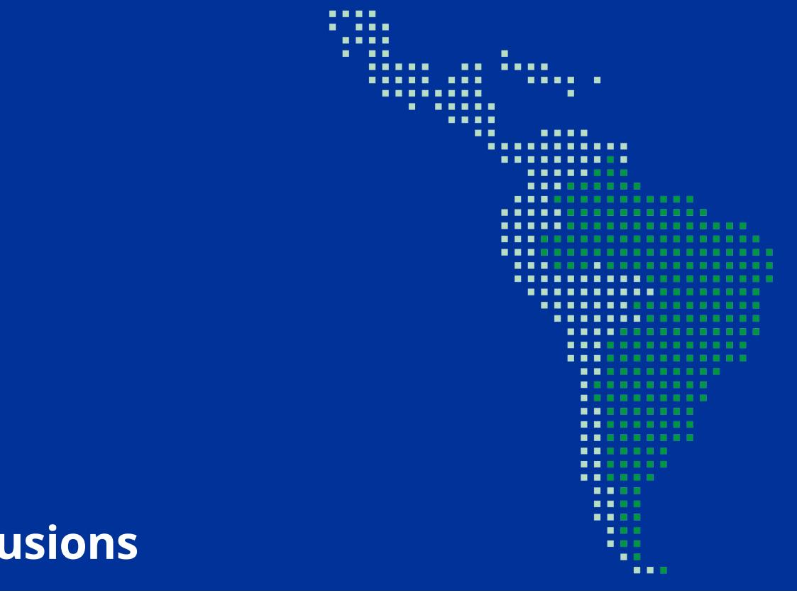

# **Conclusions**

The Brazilian environmental legal framework and the European zero deforestation regulation are complementary policies oriented towards common goals – the fight of deforestation, among other things.

Several initiatives, experiments, and pilot projects are helping the chain move towards a more sustainable and transparent production. The Brazilian traceability environment counts with a rich variety of systems that allow traceability and monitoring, offering solutions to trace socio-environmental transparency throughout the chain. Many of these initiatives were developed in the private sector, reflecting its strong commitment to develop solutions for sustainability.

The public sector has a crucial role to play in the transition to a more sustainable value chain. Public initiatives are needed to harmonize data, develop a common, free-of-charge traceability system, but also to support farmers with technical assistance, especially for those pending issues such as property and environmental regularization.

All in all, the dialogue should continue as the deforestation-free products regulation is not approved yet, something that provides a time window to continue discussing those actions needed to put in place the proper mechanisms and reinforce the Brazilian position of market leader in global production. The dialogues develop a sort of intimacy for producers and companies to discuss what they do, what they need and talk with other spots in the chain. Such cohesion and synergy among key actors should be considered an invaluable asset for the work to come.

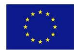

**Component 2 of AL-INVEST Verde is a consortium led by:**

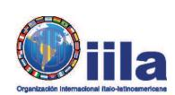

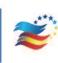

AL-INVEST Verde is a European Union (EU) programme. Its global objective is to promote sustainable growth and job creation by supporting the transition towards a low-carbon, resource-efÏcient, and more circular economy in Latin America. Through Component 2, led by FIIAPP in consortium with IILA, the programme provides assistance for strengthening public policies and multi-stakeholder dialogues on sustainable agricultural and value chains, environmental and labour standards as well as sustainable trade and economic policy and regulatory frameworks.

**www.alinvest-verde.eu**