# Understanding the First Mile

SUMMARY OF THE FIRST MILE SUPPLY CHAIN IN THE COCOA, COFFEE, PALM OIL AND RUBBER SECTORS

November 2025

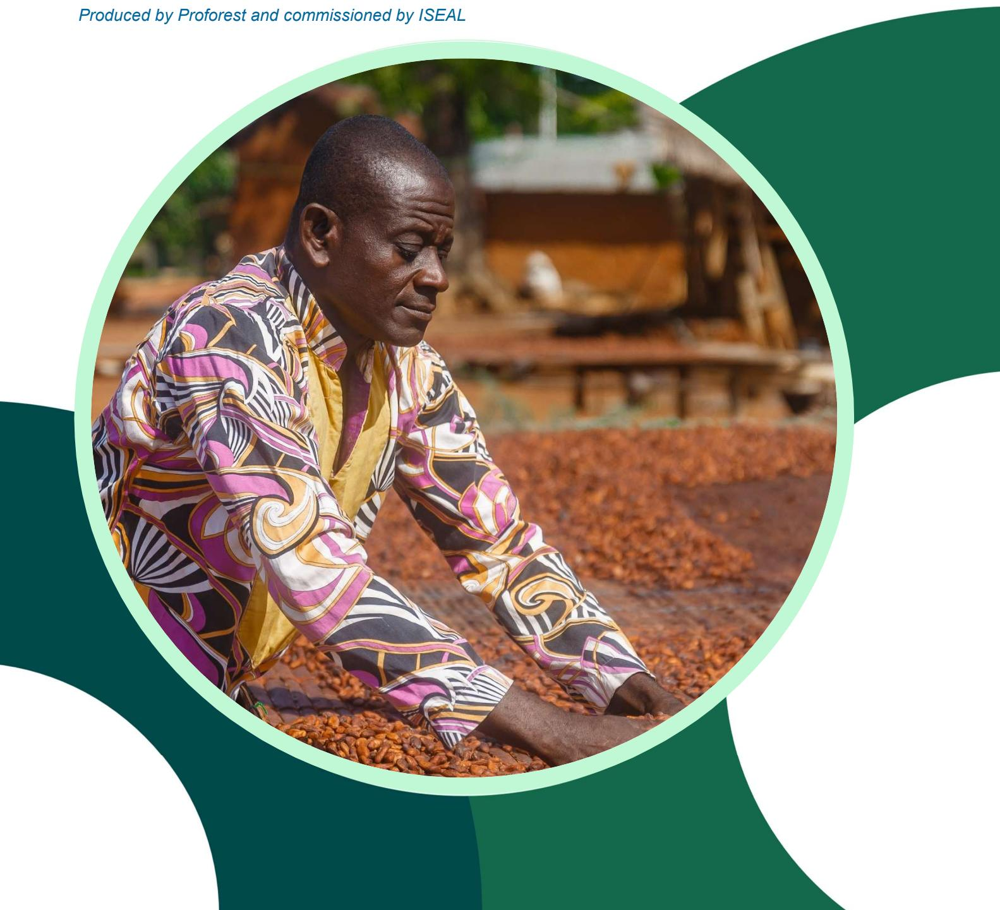

## About Proforest Initiative

Proforest is a mission-driven organisation. We believe that agricultural commodity production can be done in a way that meets global demand and works for the natural environment where commodities are grown, benefits the people who live and work there, and in a way that creates a resilient climate.

We manage grant-funded programmes through our charitable Proforest Initiatives in the UK, Africa and Brazil. The Proforest Group has more than twenty years of practical experience in supporting governments, companies, communities and partners, to establish responsible production and sourcing practices in Asia, Africa, Latin America and the Caribbean, Europe and North America.

We focus on the production base and supply chains of agricultural and forestry commodities including soy, sugar, rubber, palm oil, cocoa, coconut, beef and timber. We use our understanding of production and supply chain activities built through working with companies to inform our work with governments, landscapes and sectoral initiatives.

Conversely, our programmes enable a longer-term engagement that can build a supportive environment where companies can engage with other stakeholders or collaborate with each other to scale impact.

We support this foundation of governance through creating and facilitating multistakeholder platforms; developing tools and guidance; providing policy advice; and delivering training to build capacity and ensure local benefits and local ownership of issues in the places commodities are produced.

Visit our website to see an overview of projects we've worked on and to meet our global team. You can also find training and resources on the Proforest Academy.

> Recommended citation: 'Reboah, C., Hunt, J., Scott, S., Daldeniz, B. (2025) "Understanding the First Mile - Summary of the First Mile Supply Chain in the Cocoa, Coffee, Palm Oil and Rubber Sectors", Report for ISEAL

Proforest Initiative South Suite, Frewin Chambers, Frewin Court, Oxford OX1 3HZ United Kingdom E: info@proforestinitiative.org T: +44 (0) 1865 243439

Proforest Initiative is a registered charity in England and Wales (Charity no. 1137523) and a company registered in England and Wales (Company no. 7293440).

## Contents

| 1.1. | Defining the ‘first mile’ ............................................................................................. 6 |
|------|---------------------------------------------------------------------------------------------------------------------------|
| 1.2. | Study overview ........................................................................................................ 7 |
| 1.3. | Methodology ........................................................................................................... 7 |
| 2.1. | First mile typology for rubber ................................................................................. 10       |
| 2.2. | First mile typology for coffee ................................................................................. 19       |
| 2.3. | First mile typology for cocoa .................................................................................. 28       |
| 2.4. | First mile typology for palm oil ............................................................................... 40       |

## List of abbreviations

| CCC    | Conseil du Café-Cacao (Côte d'Ivoire)          |
|--------|------------------------------------------------|
| CMC    | Cocoa Marketing Company (Ghana)                |
| CMS    | Cocoa Management System (Ghana)                |
| EUDR   | EU Deforestation Regulation                    |
| GCTS   | Ghana Cocoa Traceability System (Ghana)        |
| GIS    | Geographic Information System                  |
| ISH    | Independent Smallholder                        |
| ISPO   | Indonesian Sustainable Palm Oil                |
| LBC    | Licensed Buying Company (Ghana)                |
| MPOB   | Malaysian Palm Oil Board                       |
| MSPO   | Malaysian Sustainable Palm Oil                 |
| NGO    | Non-Governmental Organization                  |
| ONCC   | Office National du Cacao et du Café (Cameroon) |
| RAOT   | Rubber Authority of Thailand                   |
| RSPO   | Roundtable on Sustainable Palm Oil             |
| STDB   | Surat Tanda Daftar Budidaya (Indonesia)        |
| SYDORE | Système de Dossier de Récolte (Côte d'Ivoire)  |

## Executive summary

The first mile, the journey from production farm to the first aggregation or processing point, is a critical yet often overlooked segment of agricultural supply chains. This report aims to shed light on the actors operating in this space and the dynamics that shape it, drawing on examples from cocoa, coffee, rubber and palm oil across diverse regions.

This stage is critical but fragile. Informal transactions, limited documentation and fragmented networks make compliance with new regulations such as the EU Deforestation Regulation (EUDR) and traceability requirements of sustainability systems especially challenging. Despite decades of voluntary certification efforts, traceability often begins only at the first major processing point, leaving the upstream segment opaque and vulnerable to risks such as mixing, substitution and illegal sourcing. Where smallholder-level certification exists, frequently the chain of custody to that first point of processing is interrupted, de facto excluding farmers from supply chains where physical traceability is required and might offer higher incomes/premiums.

Five key challenges stand out for the first mile:

- 1. Complex and dispersed supply chain structures Many transport actors, multiple layers of intermediaries and diverse local practices make mapping difficult.
- 2. Livelihood pressures for farmers and intermediaries Low and volatile prices without sustainability premiums, dependence on credit, and exposure to climate and market shocks.
- 3. Gaps in governance and enforcement Strong systems in Ghana and Malaysia contrast with fragmented oversight in countries like Indonesia and Ecuador. In some countries even tax legality remains challenging to enforce.
- 4. Traceability bottlenecks at intermediary levels Documentation and data collection are weakest where aggregation happens or even entirely absent with smaller individual transport providers.
- 5. The cost-to-impact dilemma Plot-level traceability in highly fragmented systems would require additional effort, risking the exclusion of vulnerable actors, farmers and intermediaries from supply chains requiring physical traceability.

While strong regulatory frameworks show that formalisation can improve traceability, rigid approaches risk leaving smallholders and intermediaries behind. Promising solutions, such as digital tools, government-led traceability systems and cooperative models, are emerging, but scaling them in fragmented supply chains remains a challenge.

Our recommendations focus on inclusion and practicality:

- 1. Build low-barrier tools and group-level traceability to make compliance accessible.
- 2. Invest in digital literacy and infrastructure to bridge gaps in remote areas.
- 3. Strengthen cooperatives and integrate intermediaries rather than bypass them, recognising their essential role.
- 4. Balance formalisation with flexibility, allowing transitional models and tailored compliance pathways.
- 5. Encourage the first points of processing (e.g. mills) to engage with intermediaries and support roll-out of traceability tools.
- 6. Promote shared responsibility within and beyond the supply chain to align incentives, share data and scale traceability pilots.

- 7. Support this in parallel by adopting risk-based and landscape approaches that tackle systemic issues at scale.

These strategies aim to build traceability systems that are both effective and equitable, ensuring compliance while safeguarding livelihoods and enabling traceable sustainable supply chains.

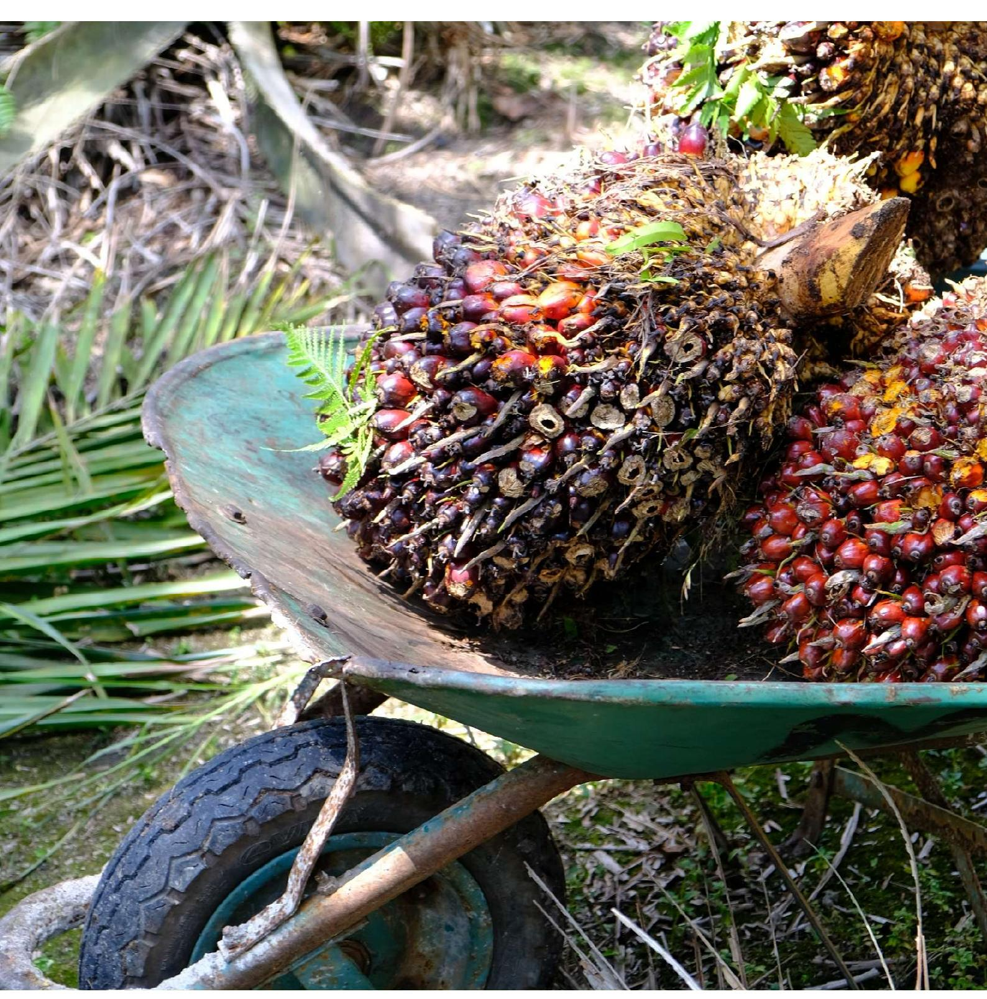

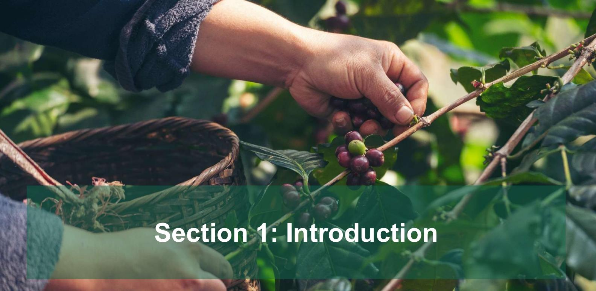

The growing demand for traceable materials to meet corporate due diligence obligations has highlighted the opacity of the so-called 'first mile' of supply chains. Not knowing who has handled materials between farm and first processing point raises the risk of substitution, mixing, and illegal material entering supply chains. In response, companies are shifting towards more integrated supply and larger production contexts where origin can be more easily verified. This is most evident under the EU Deforestation Regulation (EUDR), which requires plot-level traceability and imposes heavy penalties for non-compliance.

Despite over two decades of voluntary certification efforts, a major gap remains in tracing materials back to plot. Traceability often begins only at the first aggregator, such as a mill or trader, and is often included within the unit of certification, rather than at the farm. The challenge is particularly acute in smallholder-dominated sectors, where plots are small and dispersed.

ISEAL member systems have long sought to increase smallholder inclusion, often through group certification and credit trading models that bridge the gap between farms and aggregators. Recent regulations have intensified this focus, prompting innovation from sustainability systems, governments and traceability solution providers, especially in commodities affected by the EUDR.

### 1.1. Defining the 'first mile'

The first mile is the initial stage of a supply chain, where raw materials move from producers to the first large-scale point of processing and/or aggregation. It often involves multiple intermediaries (e.g., middlemen, brokers, markets, auctions) who do some initial aggregation, transportation, storage and processing of the materials.

Its structure is shaped by local cultural, social and economic realities, with intermediaries sometimes also providing credit, inputs or community functions.

The first mile varies depending on the commodity (e.g., perishability, seasonality, bulkiness) and market conditions (e.g., price volatility, competition).

Because it is often informal and complex, especially with small-scale production, traceability and transparency are difficult, sometimes enabling actors to conceal activities or evade regulations.

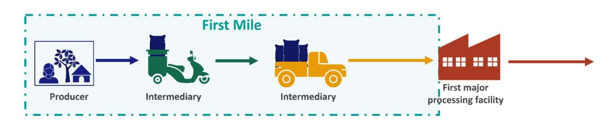

### 1.2. Study overview

This study explores the first mile of agricultural commodity supply chains, a critical yet often overlooked segment where smallholder producers connect to the first point of aggregation or processing. It focuses on the informal and complex networks that shape this stage, particularly in cocoa, coffee, rubber and palm oil sectors. By examining supply chains across diverse geographies, the research aims to uncover structural dynamics, traceability challenges, and opportunities for more inclusive and effective models.

Through mapping, interviews and case studies, the study documents current efforts to improve firstmile traceability and compiles tools and strategies that support smallholder inclusion. The findings are intended to guide ISEAL member systems and other stakeholders in scaling impact through practical, context-sensitive approaches that balance formalisation with flexibility.

The following commodities and countries were chosen based on the prevalence of smallholders, the presence of intermediaries in the first mile, and relevance to EU markets. Additionally, countries were selected to enable meaningful comparisons:

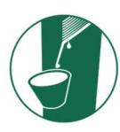

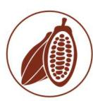

Rubber – Cote d'Ivoire, Indonesia and Thailand

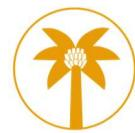

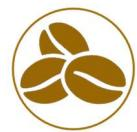

Cocoa – Cote d'Ivoire, Ghana, Ecuador and Colombia

Coffee – Colombia, Ethiopia and Indonesia

Palm oil – Indonesia, Malaysia, Thailand and Honduras

Note: While every effort has been made to present a comprehensive and accurate overview, the visuals in this study are based on publicly available information and stakeholder interviews. As such, they may not capture all nuances or reflect the full complexity and diversity of the supply chains.

### 1.3. Methodology

The research followed a structured four-step approach to explore first-mile traceability systems in selected agricultural commodities. It began with scoping, identifying priority commodities and countries through a desk-based review, resulting in an overview of palm oil, cocoa, rubber and coffee markets. Next, first-mile mapping visualised supply chains using desk-based research and stakeholder interviews, producing detailed maps. The third step, tool cataloguing, involved identifying and validating existing traceability tools. Finally, synthesis and analysis consolidated insights across commodities and tools to highlight key patterns, challenges and opportunities in firstmile traceability.

This section examines the key actors, relationships and structures that define the first mile in each commodity, highlighting both common patterns and unique features across countries. By mapping these dynamics, the study provides a foundation for understanding the challenges and opportunities for traceability and inclusion in each sector.

For each commodity, the following elements are presented:

- 1. Summary of findings focused around:
  - i. what the first mile looks like for this commodity
  - ii. implications on livelihoods (of both intermediaries and smallholders)
  - iii. level(s) of formality in the first mile
  - iv. traceability challenges
  - v. identified traceability solutions
  - vi. key points of commonality and difference between countries.
- 2. An overview of the different first mile actors, describing:
  - i. their roles and positions
  - ii. structure and formality
  - iii. the services they provide.
- 3. Visual representations/mapping of the first mile\*, including:
  - i. generalised mapping at global level, where the first mile does not vary significantly between countries
  - ii. country-specific mapping (for all commodities).
- 4. Catalogue of tools/initiatives linked to the first mile.

### \*Notes on the supply chain visuals

The supply chain mapping visuals are simplified representations of the first mile of each supply chain, illustrating the flow of materials from smallholder growers to the first major processing facilities. They are not intended to reflect all real-world variations, and actual supply chains may differ.

## Section 2: Introduction to the first mile typology for rubber, coffee, cocoa and palm oil

Where sufficient data is available, visuals show both independent and cooperative supply chain routes equally. However, this does not imply equal volumes across these routes; estimates of volumes originating from each grower type are provided where available. Supply chains may also be more integrated than depicted, with intermediaries potentially sourcing from both pathways.

These visuals should be interpreted as illustrative tools to aid understanding of first-mile supply chain flows rather than exact representations of all arrangements.

### Visual key

- • The flow of materials are indicated by the **commodity colour arrows**. The **width** (rather than length) of the arrow loosely corresponds to the dominance of a particular material flow in comparison to other possible flows – e.g. to a different type of intermediary in the supply chain – however it is intended as a representation only and the exact width of the arrows is not indicative of the exact volumes.
- • The **red arrows** demonstrate commercial relationships such as transactional agreements and contractual and traceability-related documentation. A two-way arrows implies a two-way relationship.
- • As part of the contractual relationship visualisation, a rough indication of how formal the relationship is (in terms of contractual agreements) and the level of official documentation (either digital or physical) is provided. An informal relationship implies an absence of contractual agreements and no/limited documentation indicates that traceability of volumes to previous actor is challenging or non-existent.

### First Mile Traceability Diagrams Key

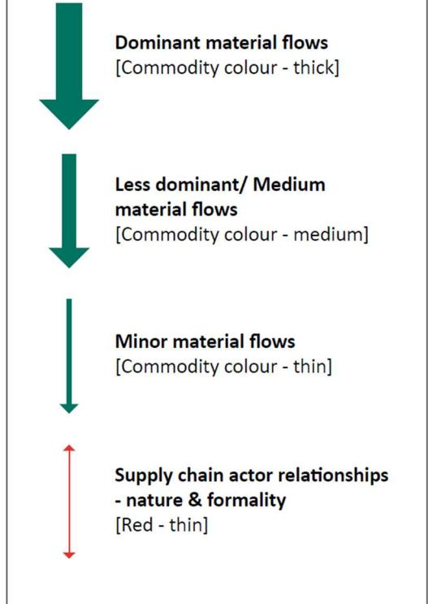

NOTE: If one label is placed in between two red arrows, then each arrow corresponds to a separate supply chain relationship, but where the level of formality (and thus the label) is the same.

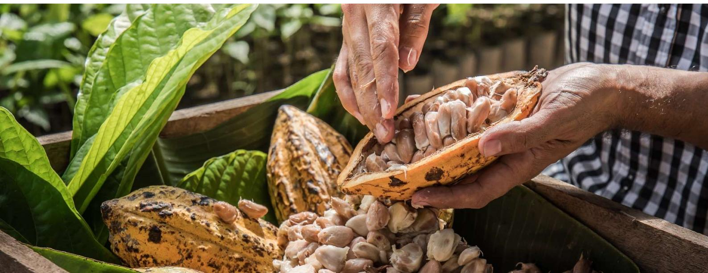

## 2.1. First mile typology for rubber

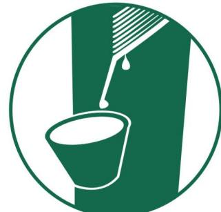

### Summary of findings

### What happens in the first mile of rubber supply chains?

The rubber supply chain is dominated by independent or informally organised smallholders, contributing approximately 85-90% of rubber by volume globally (Jayathilake et al., 2023). This includes 90% of volumes in Indonesia and Thailand (Jakarta Market Lab, 2025; EFI, 2024) and approximately 75% in Cote d'Ivoire, where smallholder production is defined as production by local independent farmers rather than industrial plantations (SIPH, 2025). Formal cooperatives are established but make up only a small fraction of traded volumes – less than 10% in Thailand (PEFC, 2022) and an unknown proportion in Cote d'Ivoire and Indonesia.

The first mile can vary by country and region, but typically farmers will sell unprocessed cup lump rubber to a first intermediary (commonly known as a local/village collector) who in turn will typically sell directly to a processing facility or independent processor (with the transaction sometimes brokered by a sales agent employed by the processor). The processor/agent may also be responsible for organising transport for larger quantities to and from collection points.

The collector may also sell to a trader who in turn sells to the processor. Though uncommon, this is more typical in the most remote regions (e.g. in Indonesia) where a local collector lacks direct access to a processor and/or sufficient transport and storage facilities. As unprocessed natural rubber is non-perishable, it may travel farther distances, pass through one or two additional actors, and be in storage for longer than other natural commodities.

The first mile typically ends at a formal processing facility (which can be a company or an individual). Minimal processing, sorting, grading and aggregation can be carried out by both collectors and traders throughout the first mile.

(ETRMA, 2022; Aid Environment, 2024).

### How does the structure of the first mile supply chain impact livelihoods?

As rubber is harvested daily, and independent smallholders have no or very limited storage facilities and limited transportation capacity, they are dependent on village-level collectors – particularly those in the most remote regions – for regular sales, though prices are typically low and set by the intermediaries. Prices are even lower if farmers also depend on intermediaries for financial loans (WWF, 2020).

Intermediaries themselves are also dependent on downstream buyers and may be subject to low prices and lack of bargaining power. However, traders that have the facilities for storage and the ability to sort and grade, or even process, rubber may be able to command higher prices from processors or international buyers.

Some traceability and smallholder livelihood schemes could have the impact of cutting out some intermediaries altogether, either explicitly in the stated objective of the initiative or by empowering smallholders to sell directly to processors, bypassing (some) intermediaries in the process (e.g. through the Agriac tool).

### How formal or informal is the first mile?

Levels of formality can vary substantially between countries. Côte d'Ivoire has the most formal structure, with many smallholders operating under purchase agreements with manufacturers, leading to more documented and regulated transactions (Proforest internal interview). Thailand sits in the middle, where traditional informal trade between farmers and collectors remains common, but recent government efforts through the Rubber Authority of Thailand (RAOT) have introduced greater oversight and traceability (EFI, 2024). Indonesia has the most informal structure, with local collectors buying rubber directly from farmers through cash-based, undocumented transactions and long-term trust-based but non-contractual relationships (Simatupang et al., 2024).

### Why may traceability be challenging in the first mile?

The sector is generally dominated by large numbers of smallholders and intermediaries (Aid Environment and ETRMA estimate up to 6 million smallholders and 100,000 pre-processing intermediaries are in operation globally), often in very remote locations. A single trader or processor may purchase aggregated volumes from a number of upstream intermediaries. This makes traceability to plot extremely difficult.

There is very little formal documentation and segregation of volumes throughout the first mile. Only at the primary processing facility does formal documentation really begin.

### What solutions exist to improve traceability in the first mile?

The main focus of traceability efforts so far has been on mapping smallholders at the national level, before trialling solutions that allow for traceability such as digital tools and formal auctions. Other solutions have focused on shortening the supply chain and empowering smallholders to cut out intermediaries and sell directly to processors or exporters – usually through digital trading tools or informal cooperative systems.

Examples include:

 Registration and traceability efforts in Thailand o While the first mile in Thailand's rubber sector has historically been quite informal, governing authorities have stepped up traceability efforts to comply with EUDR, beginning with the mapping of rubber production plots (approximately 79% of national cultivation area) and the mapping and registration of all rubber smallholders (so far approximately 95%) (EFI, 2024). o This programme has included the establishment of RAOT-managed weekly auctions and a traceability platform known as Traceable Rubber Trading (TRT). Data for how much rubber is currently sold via these auctions and traded through this platform is unclear. Manufacturer-contracted supply chain model (Cote d'Ivoire) o In the case of a manufacturer-contracted model, rubber is delivered by farmers to (mobile) manufacturer-operated collection centres before being aggregated and transported directly to manufacturer-operated/affiliated processing facilities. In this model, there is traceability to the farmer group and sales agents complete transactions on behalf of processors or manufacturers at the collection centre (Proforest internal interview).

## Where do countries align and where do they differ in the first mile?

### Commonalities

All countries within the study typically have supply chains with similar types of intermediary actors operating with varying degrees of prominence. Local collectors or agents are the first intermediary, who sort and sell cup lump rubber to processors or traders. Primary processing is typically carried out domestically at a single major facility or stage in the supply chain before the processed rubber is exported. Typically, the transactions between farmers and the first intermediary (collectors) are the least formal, with limited regulatory oversight (in practice), while most processing facilities will have formal relationships and traceability mechanisms with supply chains actors they deal with.

### Country specificities

- ○ **Supply chain models in Cote d'Ivoire:** Cote d'Ivoire has a unique rubber supply chain structure due to the general absence of wholly independent smallholders. 'Independent' farmers are typically either: a) contracted to a global rubber company, b) part of a traditional cooperative, or c) large enough to manage their own primary processing facilities and then to sell directly to manufacturers. Intermediaries therefore generally play a less prominent role and are often contracted.
- ○ **More informal structure in Indonesia:** Indonesia's rubber sector is dominated by independent smallholders or informally organised smallholders. There are variations by region in exact structure but generally – in the most rural areas particularly – informal collectors dominate the first stage. They usually purchase unprocessed rubber directly from farmers, and aggregate and sell it to processing facilities, or to small traders who sell it on to processors, often after sorting and grading. Larger traders themselves can often also act as primary processors and may export directly to manufacturers.
- ○ **Increasing government regulation in Thailand:** Thailand's supply chain structure has typically been closer in nature to Indonesia's, with a loosely regulated and fractured first mile with many intermediaries. In recent years, however, the Rubber Authority of Thailand has taken a more direct regulatory role and has attempted to centralise the sale of rubber through RAOT-controlled auctions.

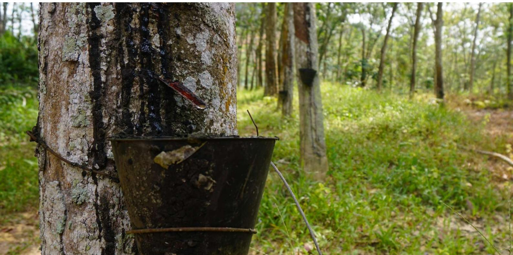

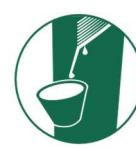

### Overview of rubber first-mile actors

| Type           | Role and position                               | Structure and formality                       | Services                                      |
|----------------|-------------------------------------------------|-----------------------------------------------|-----------------------------------------------|
|               | Maintain small plots; harvest rubber year      |                                               |                                               |
|               | Sell unprocessed rubber to intermediaries or    |                                               |                                               |
|               | Often contracted by manufacturers (e.g., Côte   |                                               |                                               |
|               | First in supply chain; dependent on             |                                               |                                               |
|                |                                                 |  Mostly informal or semi-formal farms        |                                               |
|                |                                                 |  Some join cooperatives or have company      |                                               |
|                |                                                 |  Often lack land titles, formal finance and  |                                               |
|                |                                                 |                                               |  Cultivation and harvesting                  |
|                |                                                 |                                               |  Sell rubber; may collect from neighbours    |
|                |                                                 |                                               |  Organise transport                          |
|               | Aggregate rubber from members                   |                                               |                                               |
|               | Sell to intermediaries, processors or exporters |                                               |                                               |
|               | Rare in rubber sector; excess volumes may       |                                               |                                               |
|                |                                                 |  Generally formal and registered             |                                               |
|                |                                                 |  Enable group-level traceability             |                                               |
|                |                                                 |  Support monitoring and remediation          |                                               |
|                |                                                 |                                               |  Market access and bargaining power          |
|                |                                                 |                                               |  Quality control, credit, inputs             |
|                |                                                 |                                               |  Training and social/environmental           |
|               | Independent or act as agents for larger traders |                                               |                                               |
|               | Buy from farmers; sell to traders/processors    |                                               |                                               |
|               | Bulk aggregation with minimal sorting           |                                               |                                               |
|                |                                                 |  Informal, unregistered                      |                                               |
|                |                                                 |  Trust-based agreements                      |                                               |
|                |                                                 |  Cash transactions; little documentation     |                                               |
|                |                                                 |                                               |  Aggregation and transport                   |
|                |                                                 |                                               |  Provide loans or credit to farmers          |
|                |                                                 |                                               |  May help to procure/recommend other service |
|               | Buy from collectors or farmers                  |                                               |                                               |
|               | Sell to processors; may do basic processing     |                                               |                                               |
|               | Sometimes export rubber                         |                                               |                                               |
|                |                                                 |  Formal and registered                       |                                               |
|                |                                                 |  Physical facilities                         |                                               |
|                |                                                 |  Documented agreements (some informal        |                                               |
|                |                                                 |  May employ or contract collectors or agents |                                               |
|                |                                                 |                                               |  Aggregation, sorting, grading               |
|                |                                                 |                                               |  Occasional processing                       |
| Sales agents  | Negotiate sales for processors or traders       |                                               |                                               |
|               | Do not own commodity                            |                                               |                                               |
|                |                                                 |  Formal and registered                       |                                               |
|                |                                                 |  Operate through physical facilities         |                                               |
|                |                                                 |  Documented agreements                       |                                               |
|                |                                                 |                                               |  Facilitate transactions                     |
|                |                                                 |                                               |  Check quality of goods                      |
|               | Centralised facility for rubber sales           |                                               |                                               |
|               | Company-owned, government-run or                |                                               |                                               |
|                |                                                 |  Formal and registered                       |                                               |
|                |                                                 |  Documented agreements                       |                                               |
|                |                                                 |                                               |  Centralised sales point                     |
|                |                                                 |                                               |  Organise and verify traceability data and   |
| Processors    | Process rubber for manufacturers                |                                               |                                               |
|               | Buy from traders, collectors or farmers         |                                               |                                               |
|                |                                                 |  Formal and registered                       |                                               |
|                |                                                 |  Documented agreements                       |                                               |
|                |                                                 |  Large companies or individuals              |                                               |
|                |                                                 |                                               |  Processing and quality assurance            |

### Rubber first mile visuals

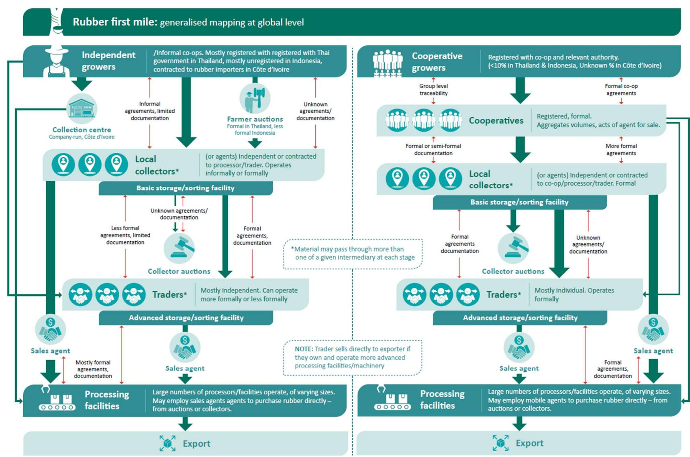

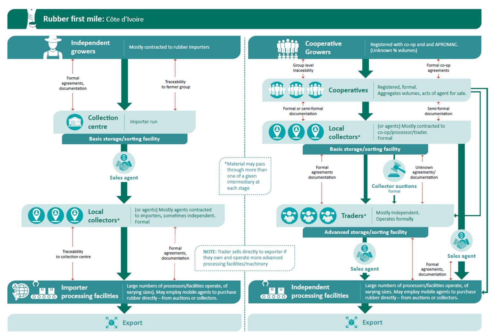

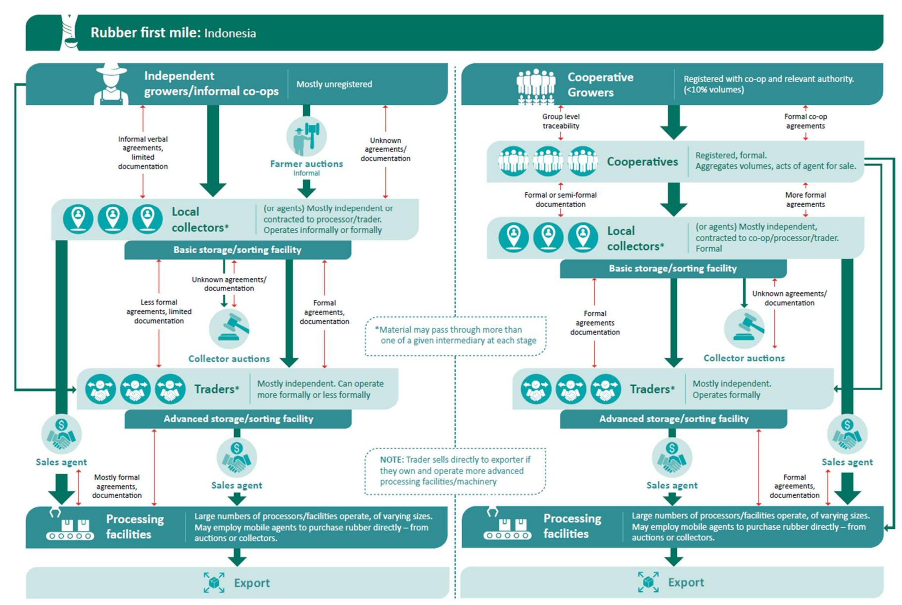

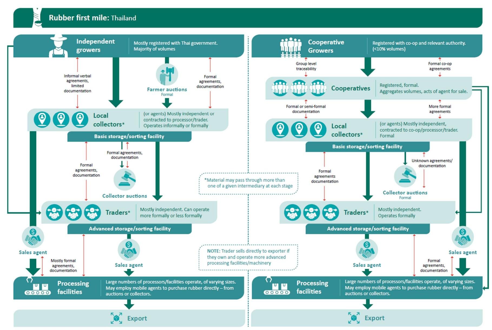

### Rubber initiatives and tools overview

| Initiative/tool Category and country Summary     |                                                                                               |
|--------------------------------------------------|-----------------------------------------------------------------------------------------------|
| Purpose:                                         | The system keeps a record of the raw rubber a farmer supplies for every purchase – and checks |
| Impact on first mile:                            | Provides deforestation- and conversion-free assurances to companies without                   |
| Agriac NGO                                       |                                                                                               |
| Purpose:                                         | Smallholder market access app to pool resources                                               |
| Impact on first mile:                            | Empowers smallholders but cuts out intermediaries                                             |
| PT ABP - Tracy Private                           |                                                                                               |
| Purpose:                                         | Internal traceability tool                                                                    |
| Impact on first mile:                            | Provides supply chain traceability for rubber company                                         |
| Purpose:                                         | Sets sustainability standards for rubber growers and provides premium prices for farmers      |
| Impact on first mile:                            | Empowers and financially benefits smallholders but cuts out intermediaries with               |
| Cocoasource Traceability Protocol Private        |                                                                                               |
| Purpose:                                         | Supports smallholder organisations in establishing a robust system for tracking rubber        |
| Impact on first mile:                            | Provides comprehensive guidelines on producer registration, farm mapping, and the             |
| Koltitrace Private                               |                                                                                               |
| Purpose:                                         | Comprehensive traceability tool for companies to trace supply through multiple actors         |
| Impact on first mile:                            | Allows for compliance with a range of environmental requirements and maintains                |
| TRST01 Private                                   |                                                                                               |
| Purpose:                                         | Comprehensive traceability tool for companies to trace supply through multiple actors         |
| Impact on first mile:                            | Allows for compliance with a range of environmental requirements and maintains                |
| RAOT mapping and digital traceability Government |                                                                                               |
| Purpose:                                         | To map smallholder rubber supply chain and comply with EUDR traceability requirements         |
| Impact on first mile:                            | Ensures international competitiveness of Thai rubber and allows for premium prices by         |

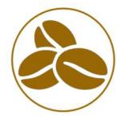

## 2.2. First mile typology for coffee

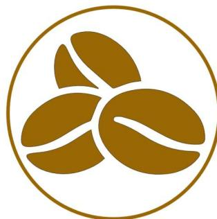

### Summary of findings

### What happens in the first mile of coffee supply chains?

The first mile in the coffee sector can vary between countries and within countries, but typically it is a short stage that passes through one or two intermediaries before arriving at the dry mill. This is the main processing point prior to export and is typically considered to be the end point of the first mile.

In all countries of focus the most common primary intermediary is a (local) collector who purchases either ripe or washed coffee cherries directly from smallholder farmers, and in most cases sells directly to a mill. In some cases, the collector will sell to a trader who in turn sells to the mill. Traders may also employ collectors as agents to purchase on their behalf

The primary processing (wet processing or washing) in the first mile can occur at different stages. Often the farmer carries out the washing – particularly in Colombia – but it can also occur at independent washing stations or be carried out by collectors.

### How does the structure of the first mile supply chain impact livelihoods?

Independent smallholders, particularly those in the most remote regions such as parts of Indonesia, often remain reliant on intermediaries for sales and services such as transportation and advance credit (Agricom, 2020). Prices offered by intermediaries are typically low and set by the intermediary. Prices are lower still if farmers depend on the intermediary for advance credit, which can have 'interest rates' of up to 30% which is embedded in the coffee price (Coffee Intelligence, 2024) (although varying interest rates per country are not specified in the source).

There is often little difference in prices independent farmers receive for their coffee compared to cooperative farmers when both are dependent on intermediaries for direct sales (Interview - Enveritas).

In some supply chains (e.g. in Colombia) farmers carry out their own wet processing and sit closer to the dry mill and therefore the exporter. This may increase opportunities to sell their coffee at a higher price by cutting out a number of intermediaries. However, more research is needed to understand the extent and circumstances in which this takes place. Other research has found that a larger number of intermediaries in the supply chain does not always mean lower prices for farmers; in Indonesia some farmers receive marginally lower prices when selling direct to wholesalers than to independent local collectors (Kompas Daily, 2018).

Intermediaries themselves are also dependent on downstream buyers and subject to low prices and lack of bargaining power, which can limit the ability to pay competitive prices to smallholders (Interview – Enveritas)

Some traceability schemes could have the impact of cutting out some intermediaries altogether, either explicitly or by empowering smallholders to sell directly to processors.

### How formal or informal is the first mile?

Levels of formality can vary quite significantly between countries. Colombia is the most formal supply chain in terms of traceability, documentation, the contractual formality of commercial agreements between supply chain actors and the regulation of the sector. Indonesia has by some

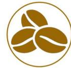

margin the least formal interactions between supply chain actors and an almost non-existent level of granular traceability. In all countries studied, the initial first-mile interactions between smallholders and local collectors is more often characterised by long-term but non-contractual relationships and sales with either no documentation or simple paper-based receipts.

### Why may traceability be challenging in the first mile?

The sector is generally dominated by significant numbers of smallholders and intermediaries, often in very remote locations. A single collector/trader or processor may purchase and aggregate volumes from a number of upstream intermediaries, or purchase pre-aggregated volumes. This makes traceability to plot extremely difficult. There is very little formal documentation and segregation of volumes throughout the first mile and, particularly upstream, a number of unregistered intermediaries operate. Only at the primary processing facility does formal documentation really begin.

Main traceability limitations occur in non-cooperative independent smallholder supply chains. In formal cooperative systems, full traceability from cooperative group to exporter is much more readily available due to lower reliance on intermediaries and the fact that cooperatives undertake most of the processing activities. However, formal cooperative membership is only 30% in Colombia, 10-20% in Ethiopia and less than 10% in Indonesia (Coffee Intelligence, 2023; Interview – Enveritas).

### What solutions exist to improve traceability in the first mile?

Most solutions have focused on digital traceability mechanisms (apps) from mill back to farmer level. These are mostly developed by the private sector with cooperatives, NGOs and producer associations helping to fund access and train farmers in their use.

### Where do countries align, and where do they differ in the first mile?

#### Commonalities

All countries within the study typically have short supply chains with similar types of intermediary actors operating with varying degrees of prominence. Local collectors are the first intermediary, who purchase cherries from farmers to sell directly to processors or larger traders. Primary processing (wet and dry) is completed domestically in separate facilities to produce green beans for export or domestic roasting. Typically, the transactions between farmers and the first intermediary (collectors) are the least formal, with limited regulatory oversight (in practice). Most mills (especially dry mills) will have formal relationships and traceability mechanisms with supply chains actors they deal with.

#### Country specificities

- ○ **Indonesian model:** Lack of traceability is particularly significant in Indonesia, with the first tier of intermediaries dominated by informal local collectors who purchase cherries through cash-based payments and with little-to-no formal documentation (beyond simple paper receipts). In addition, Indonesia tends to have the longest supply chain with collectors often selling to small traders before the cherries reach the dry mills; direct farmer relationships with dry mills are very rare in Indonesia (Interview – Enveritas).
- ○ **Colombian model:** In Colombia, the larger smallholders may do the wet processing themselves and often sell directly to dry mills or via a single collector. Operations by intermediaries tend to be much more regulated, with collectors and traders having more formal relationships with mills and farmers (Interviews – Enveritas; IDH).

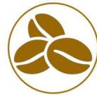

- ○ **Ethiopia's centralised processing model:** Ethiopia has a unique model due to the nature of processing in the country. The majority of wet processing occurs at independent washing stations – over 600 nationally (Petit, 2007) – who purchase ripe cherries directly from farmers or via collectors. The washed cherries are then transported and sold to independent dry mills in regional hubs (e.g. Addis Ababa) for domestic sale or export. They may also be sold to export-owned mills. The role of collectors is therefore mainly at the very beginning of the first mile and traders operate primarily for the domestic markets – purchasing after dry processing (Interviews – Enveritas; IDH).

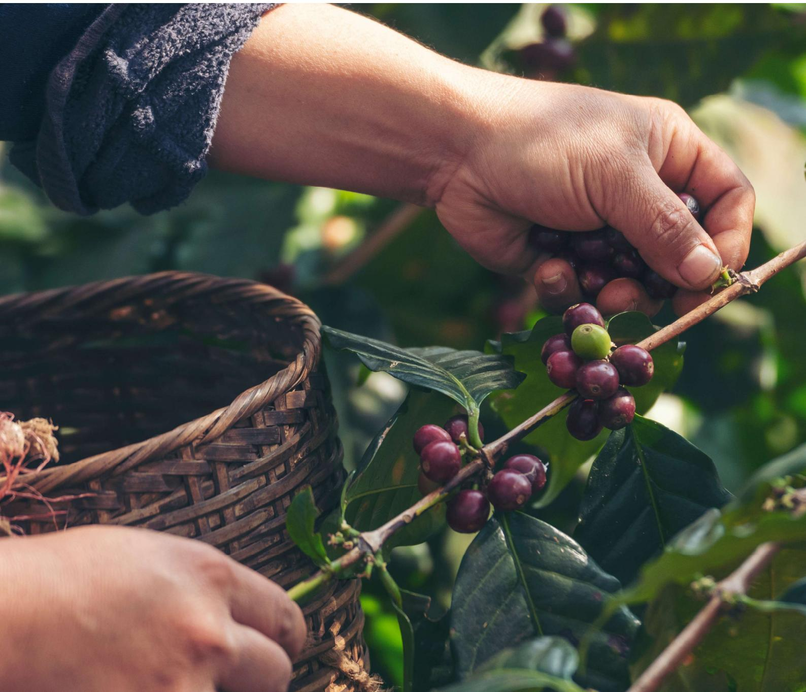

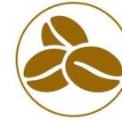

## Overview of coffee first-mile actors

| Type                                                                                                 | Role and position                                                                                                                                                                                                                                                                                                                                  | Structure and formality                                                                                                                                                                                           | Services                                                                                                                                                                                                                                                                         |
|------------------------------------------------------------------------------------------------------|----------------------------------------------------------------------------------------------------------------------------------------------------------------------------------------------------------------------------------------------------------------------------------------------------------------------------------------------------|-------------------------------------------------------------------------------------------------------------------------------------------------------------------------------------------------------------------|----------------------------------------------------------------------------------------------------------------------------------------------------------------------------------------------------------------------------------------------------------------------------------|
| <b>Independent smallholder (ISH) growers</b> (non-cooperative)                                       | <ul> <li>Maintain small plots; harvest coffee throughout the year</li> <li>Sell washed or unwashed cherries to intermediaries or processors</li> <li>First in supply chain; reliant on intermediaries; vulnerable to market and climate shocks; limited bargaining power</li> <li>Most smallholders operate independently or informally</li> </ul> | <ul> <li>Mostly informal or semi-formal farms</li> <li>Some join cooperatives or have company contracts</li> <li>Often lack land titles, access to formal finance and record-keeping</li> </ul>                   | <ul> <li>Cultivation and harvesting</li> <li>Sell coffee; may collect from neighbours</li> <li>Organise transport</li> </ul>                                                                                                                                                     |
| <b>Cooperatives</b>                                                                                  | <ul> <li>Organised groups of smallholder farmers</li> <li>Purchase washed cherries; process into green beans at cooperative dry mill</li> <li>Sell green beans to importers or traders; may sell cherries to collectors</li> <li>Formal membership varies by country (common in Colombia, rare in Indonesia)</li> </ul>                            | <ul> <li>Tend to be formal and legally registered; some informal groups exist</li> <li>Maintain record-keeping systems</li> <li>Enable traceability; support monitoring and remediation</li> </ul>                | <ul> <li>Aggregate coffee; improve market access and bargaining power</li> <li>Quality control, credit, inputs</li> <li>Training and certification schemes</li> <li>Social, environmental and community programmes</li> </ul>                                                    |
| <b>Collectors</b> (also known as Tengkulak in Indonesia; Sebsabies in Ethiopia; Coyote* in Colombia) | <ul> <li>Independent or act as agents for larger traders</li> <li>Buy washed or unwashed cherries from farmers; sell to traders or mills</li> <li>Bulk aggregation with minimal sorting; no processing</li> </ul>                                                                                                                                  | <ul> <li>Informal and often unregistered (sometimes illegal)</li> <li>Trust-based agreements; cash transactions; limited documentation</li> </ul>                                                                 | <ul> <li>Purchase from smallholders; sell to intermediaries</li> <li>May operate wet processing facilities before selling to mills or traders</li> <li>May provide loans or advance credit for farmers</li> <li>May help to procure/recommend other service providers</li> </ul> |
| <b>Traders</b> (also known as Pengepul in Indonesia; Bech Fraanch in Ethiopia)                       | <ul> <li>Buy from collectors or farmers; sell to processors or mills</li> <li>May perform basic processing, sorting and grading</li> <li>Sometimes purchase from processors for export</li> </ul>                                                                                                                                                  | <ul> <li>Mostly formal with contractual agreements downstream</li> <li>May still source informally in remote regions</li> <li>Individuals or small businesses; sometimes employ or contract collectors</li> </ul> | <ul> <li>Purchasing and aggregation</li> <li>Selling to mills or wholesalers</li> <li>Storage of washed cherries or green beans</li> </ul>                                                                                                                                       |
| <b>Processors (dry mills)</b>                                                                        | <ul> <li>Intermediary facility where coffee is processed into green beans</li> <li>Purchase and take custody of coffee</li> </ul>                                                                                                                                                                                                                  | <ul> <li>Formal and registered</li> <li>Can be large companies or individuals</li> <li>Operate with documented agreements (though some informal sourcing persists)</li> </ul>                                     | <ul> <li>Processing only; no additional services</li> </ul>                                                                                                                                                                                                                      |

\*Coyote is a local term for an informally (and sometimes illegally) operating collector. Not all local collectors carry this name and operate in this way.

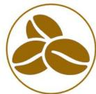

### Coffee first mile visuals

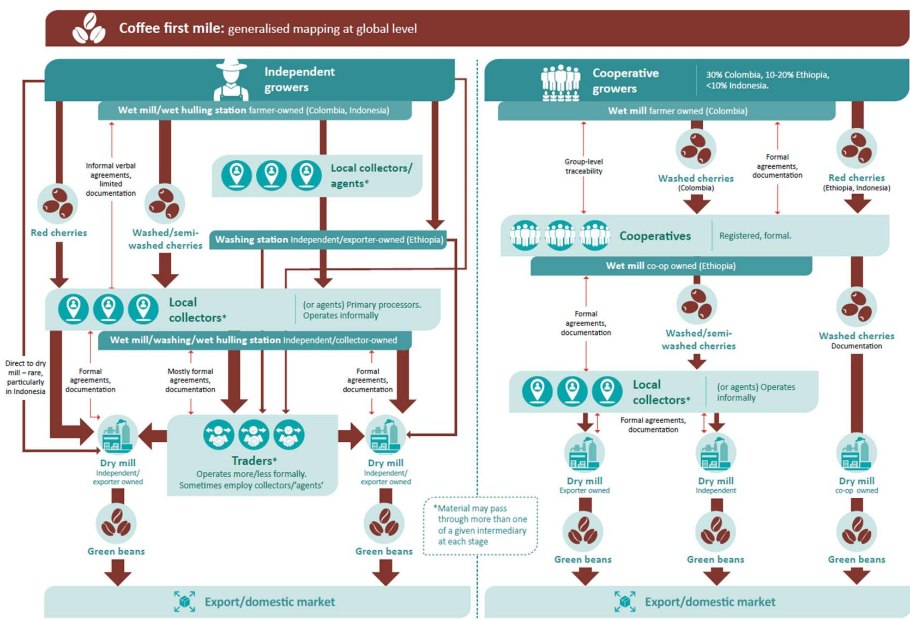

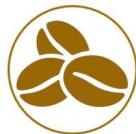

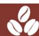

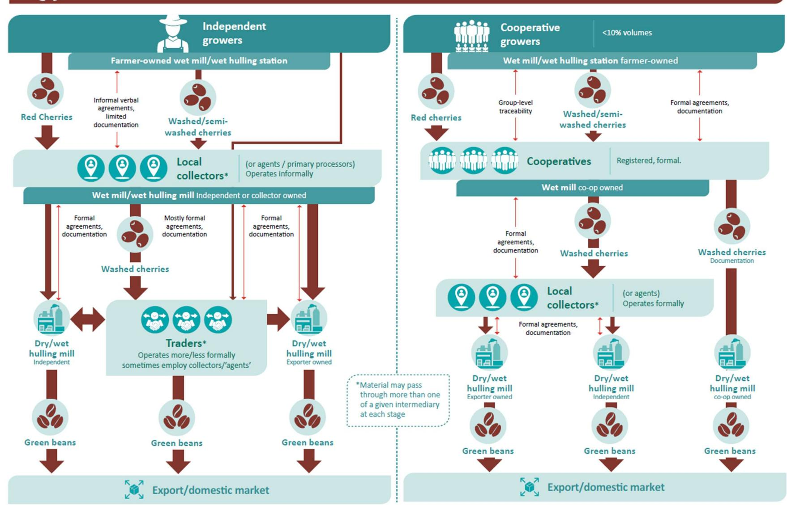

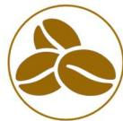

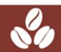

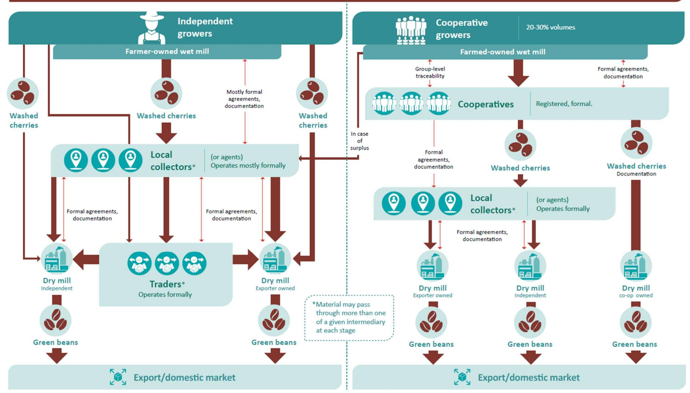

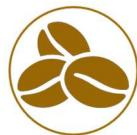

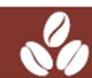

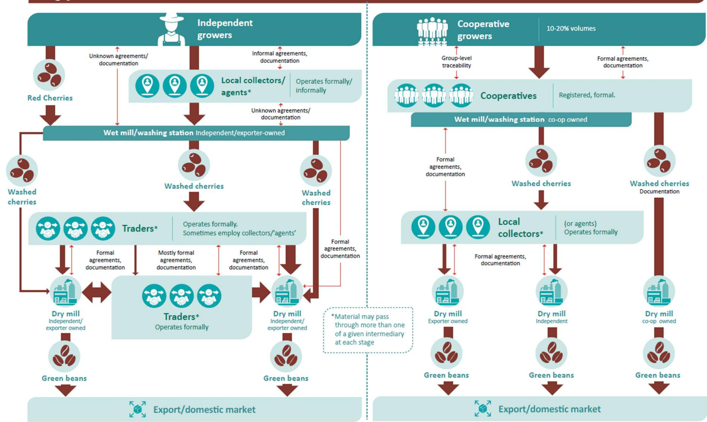

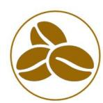

### Coffee initiatives and tools overview

| Initiative/tool Category and                 |                                                                                                   |
|----------------------------------------------|---------------------------------------------------------------------------------------------------|
| country Summary                              |                                                                                                   |
| Purpose:                                     | Aiding the transition to EUDR by updating georeferencing data and preparing legal framework       |
| Impact on first mile:                        | Ensures inclusion of smallholders in the first mile                                               |
| Purpose:                                     | Export tool to allow small growers to export coffee directly to global buyers with lower shipping |
| Impact on first mile:                        | Increases profitability for small growers and provides greater access to international            |
| Fairfood Trace NGO                           |                                                                                                   |
| Purpose                                      | : Blockchain tool for non-deforestation-related scope 3 emissions removal through climate-smart   |
| Impact on first mile:                        | Ensures smallholder inclusion and expands role and value of smallholder farms in the              |
| CCC: National Coffee Traceability Government |                                                                                                   |
| Purpose:                                     | Government-led traceability system ensuring labelling and monitoring of coffee along supply       |
| Impact on first mile:                        | Ensures inclusion of smallholders in supply chains and ensures minimum pricing                    |
| INATrace NGO/open source                     |                                                                                                   |
| Purpose:                                     | Fulfilling EUDR due diligence requirements, as well as logging wider traceability data such as    |
| Impact on first mile:                        | Ensures inclusion of smallholders in supply chains and creates added value                        |
| Koltitrace Private                           |                                                                                                   |
| Purpose:                                     | Comprehensive traceability tool for companies to trace supply through multiple actors             |
| Impact on first mile:                        | Allows for compliance with a range of environmental requirements and maintains                    |
| TRST01 Private                               |                                                                                                   |
| Purpose:                                     | Comprehensive traceability tool for companies to trace supply through multiple actors             |
| Impact on first mile:                        | Allows for compliance with a range of environmental requirements and maintains                    |

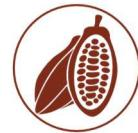

## 2.3. First mile typology for cocoa

### Summary of findings

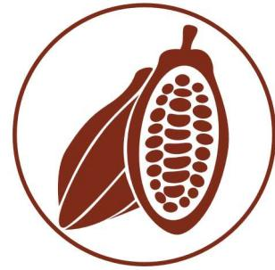

#### What happens in the first mile of cocoa supply chains?

The first mile of the cocoa sector typically begins with the harvesting of cocoa pods on smallholder farms, followed by on-farm fermentation and drying. From there, cocoa beans pass through one or more intermediary actors, such as cooperatives or independent traders, before reaching the first processor, exporter or retailer. The endpoint of the first mile is generally considered to be the first formal buyer or processor who aggregates and prepares cocoa for export or industrial use.

In most countries, the primary intermediary is either a cooperative or an independent trader who purchases dried beans directly from farmers. In some cases, these intermediaries sell directly to exporters or processors, while in others, they operate within structured systems regulated by national cocoa boards or government agencies.

#### How does the structure of the first mile supply chain impact livelihoods?

Independent smallholders, particularly those in remote regions, often remain reliant on intermediaries for market access, transportation, and financial services such as advance payments or credit. Prices offered at the farm gate are typically low and volatile, directly affecting farmers' income stability and limiting their ability to plan beyond the short term. When farmers depend on intermediaries for credit, the lower prices they receive further reduce disposable income, constraining their capacity to invest in good agricultural practices, inputs or long-term sustainable farming improvements.

In some supply chains (e.g., Ghana and Côte d'Ivoire), cooperatives and government-regulated systems offer more stable prices and support services. These help smooth income fluctuations and strengthen farmers' capacity to invest in training, rehabilitation and climate-resilient practices, though challenges around infrastructure, training access and liquidity persist. Certification schemes such as Rainforest Alliance and Fairtrade also aim to reinforce these structures by improving cooperative organisation, traceability and sustainability practices. However, smallholders in cocoa (and other commodities such as coffee and palm oil) often struggle to access certification due to high costs, administrative burdens and limited support.

Intermediaries themselves are also subject to risks, including price volatility, quality control issues and transportation challenges. Jobs in logistics and transport tend to be seasonal and informal, with limited protections, making them vulnerable to income shocks. Such volatility can affect the whole supply chain, as when intermediaries face instability, service quality, continuity of market access and farmer-level price transmission may deteriorate, further affecting smallholder resilience.

In Ecuador specifically, insecurity is a major external risk affecting the cocoa sector. Violence and theft have led to farmers avoiding documentation and discarding receipts out of fear of exposure, weakening transparency and reducing their ability to demonstrate sales histories that could otherwise support access to credit or formal services. In this context, intermediaries play a critical role, not only in facilitating trade but also in ensuring safety. By maintaining trusted relationships with farmers, police and local authorities, and in some cases paying bonuses to operate in high-risk areas, they may help preserve market continuity and reduce disruptions to farmers' income flows. Some exporters use bodyguards and GPS tracking, while intermediaries are increasingly adopting digital tools to record farmer and plot data. As such, their presence can play an essential role,

maintaining continuity in trade and enabling traceability under challenging conditions, ultimately supporting farmers' income stability and enabling incremental progress towards long-term resilience.

### How formal or informal is the first mile?

Levels of formality vary significantly across cocoa-producing countries. Ghana has one of the most formalized systems, with cocoa production and trade strictly regulated by the Ghana Cocoa Board, COCOBOD (Nitidae and EFI, 2021). All cocoa sales must go through licensed buying companies, and traceability systems are being rolled out nationally.

Côte d'Ivoire also has a regulated system under the Conseil du Café-Cacao (CCC), with licensed buyers and cooperatives operating under government oversight (Nitidae and EFI, 2021). However, informal trade still occurs, particularly near borders with countries offering higher prices.

Colombia's supply chain is moderately formal, with domestic buyers dominating the market and farmers often transporting their own cocoa to central buying centres (Abbott et al., 2018; García-Cáceres et al., 2014). Commercial relationships are more structured, though many farmers remain outside formal producer organisations.

Generally speaking, Ecuador has less formal systems, with intermediaries playing a central role and limited government oversight (Vallejo and Arturo, 2017; EUREDD, 2023). Documentation is often minimal, and relationships are informal and cash based.

### Why may traceability be challenging in the first mile?

The cocoa sector is characterised by large numbers of smallholders and intermediaries, often in remote areas. Traceability is particularly difficult in informal systems where land ownership is fragmented and sales are undocumented.

Digital traceability is limited, with paper-based records still common. These are prone to loss and manipulation, and many farmers have low levels of digital literacy. In some cases, farmers may avoid traceability systems altogether, especially if they are cultivating in protected areas.

Traceability is more feasible in formal cooperative systems, where data collection and aggregation are more structured. However, cooperative membership remains low in many countries, and informal sales dominate in free-market contexts.

### What solutions exist to improve traceability in the first mile?

Most traceability solutions focus on digital tools such as mobile apps and satellite imagery to map farms and collect farmer-level data. These are often developed by private sector actors, with support from cooperatives, NGOs and producer associations.

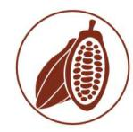

Other approaches include strengthening farmer organisations to improve data collection and compliance, and offering incentives such as premium payments, input subsidies or access to credit for traceable cocoa

In addition to these decentralised efforts, national traceability systems are playing an increasingly important role. The Ghana Cocoa Traceability System (GCTS), led by COCOBOD, is a governmentbacked initiative designed to map every cocoa farm in the country and track beans from origin to export. GCTS aims to ensure compliance with international sustainability and deforestation regulations, while also improving transparency and accountability across the supply chain. As GCTS is rolled out, it is expected to complement private sector tools and help standardise traceability efforts nationwide (Nitidae and EFI, 2021).

### Where do countries align and where do they differ in the first mile?

### Commonalities

All countries studied have supply chains involving smallholder farmers and intermediary actors, with varying degrees of formality. The first mile is typically the least formal part of the supply chain, with limited documentation and oversight. Cooperatives and traceability schemes offer potential improvements, but adoption remains uneven.

### Country specificities

 Ghanaian model: Cocoa production and trade are tightly regulated by COCOBOD. All cocoa is sold through licensed buying companies, and traceability systems (CMS, GCTS) are being implemented. Digitalisation is progressing, though paper records remain in use. (Nitidae and EFI, 2021) Ivorian model: The CCC regulates the entire chain, issuing export codes and controlling volumes. Cooperatives work with licensed buyers, and pisteurs purchase cocoa from farmers. Informal trade exists at borders, but domestic trade is tightly controlled. (Nitidae and EFI, 2021) Colombian model: Domestic buyers dominate, with farmers often transporting cocoa themselves to central buying centres. Intermediaries are less prominent, and relationships are more formalised. Producer organisations are limited but supported by actors like Fedecacao. (Abbott et al., 2018; García-Cáceres et al., 2014) Ecuadorian model: Most cocoa is exported, with intermediaries playing a central role. Traceability is weak, and insecurity is a major issue. Some intermediaries use digital tools, but farmer documentation is minimal. Relationships are informal and often cash-based. (Vallejo and Arturo, 2017; EUREDD, 2023)

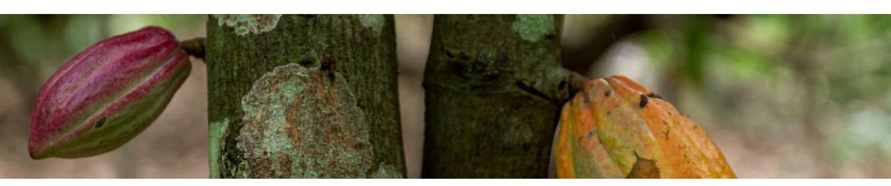

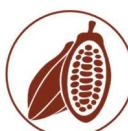

### Overview of cocoa first-mile actors

| Type Role and position                                        | Structure and formality                    | Services                                        |
|---------------------------------------------------------------|--------------------------------------------|-------------------------------------------------|
|  Account for around 90% of global cocoa production           |                                            |                                                 |
|  Maintain small plots; plant, harvest, ferment and dry beans |                                            |                                                 |
|  Sell to intermediaries or processors                        |                                            |                                                 |
|  First in supply chain; reliant on middlemen; vulnerable to  |                                            |                                                 |
|                                                               |  Mostly informal or semi-formal farms     |                                                 |
|                                                               |  Some join cooperatives, have             |                                                 |
|                                                               |  Often lack land titles, access to formal |                                                 |
|                                                               |                                            |  Cultivation and harvesting                    |
|                                                               |                                            |  Post-harvest: fermentation and drying         |
|                                                               |                                            |  Sell cocoa; may collect from neighbours       |
|                                                               |                                            |  Organise transport                            |
|  Purchase cocoa from members; sell to processors or          |                                            |                                                 |
|  Operate dry mills; aggregate beans for trade                |                                            |                                                 |
|  Growers ferment and dry beans before selling to             |                                            |                                                 |
|  Membership may involve fees or meeting objectives           |                                            |                                                 |
|                                                               |  Tend to be formal and legally            |                                                 |
|                                                               |  Enable traceability; support monitoring  |                                                 |
|                                                               |                                            |  Cultivation and post-harvest support          |
|                                                               |                                            |  Aggregate cocoa; improve market access        |
|                                                               |                                            |  Quality control, credit, inputs               |
|                                                               |                                            |  Training and certification schemes            |
|                                                               |                                            |  Social, environmental and community           |
|  Independent or linked to larger intermediaries              |                                            |                                                 |
|  Buy fermented and dried cocoa from farmers; sell to         |                                            |                                                 |
|  Aggregate cocoa and conduct initial quality checks          |                                            |                                                 |
|                                                               |  Can be registered or informal            |                                                 |
|                                                               |  In Côte d’Ivoire, pisteurs must record   |                                                 |
|                                                               |                                            |  Purchase and aggregation                      |
|                                                               |                                            |  Provide financing and transport services      |
|  Source cocoa from producers or intermediaries               |                                            |                                                 |
|  May represent processors or exporters                       |                                            |                                                 |
|  Operate in rural areas; purchase and stock beans for        |                                            |                                                 |
|                                                               |  Can be registered or informal            |                                                 |
|                                                               |  In Côte d’Ivoire, traders must record    |                                                 |
|                                                               |                                            |  Buy from ISH or intermediaries; sell to       |
|  Intermediary storage between producers and downstream       |                                            |                                                 |
|  Often owned by processors or exporters                      |                                            |                                                 |
|                                                               |  Can be formal, informal or               |                                                 |
|                                                               |  May be community or cooperative          |                                                 |
|                                                               |                                            |  Storage and quality inspection                |
|                                                               |                                            |  Inventory buffering for seasonal fluctuations |
|                                                               |                                            |  Extension services for smallholders           |
|  Convert beans into semi-finished products (paste, butter,   |                                            |                                                 |
|  Major players: Barry Callebaut, Cargill, Olam (60% of       |                                            |                                                 |
|  Typically source via intermediaries or cooperatives         |                                            |                                                 |
|                                                               |  Formal and registered; large             |                                                 |
|                                                               |  Actions have significant supply chain    |                                                 |
|                                                               |                                            |  Processing and export services (sorting,      |

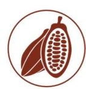

| Country specific first-mile actors GHANA                    |                                     |                                                |
|-------------------------------------------------------------|-------------------------------------|------------------------------------------------|
|  Closest equivalent among general cocoa first-mile actors: |                                     |                                                |
|  Purchase cocoa beans directly from farmers; sell to Cocoa |                                     |                                                |
|  Compete for beans by offering incentives (farm inputs,    |                                     |                                                |
|  Some LBCs run sustainability programmes (e.g., Mondelez   |                                     |                                                |
|                                                             |  Registered under COCOBOD          |                                                |
|                                                             |                                     |  Buy cocoa from farmers; sell to CMC          |
|                                                             |                                     |  Provide farm inputs and technical support    |
|                                                             |                                     |  Operate sustainability initiatives           |
|  Closest equivalent among general cocoa first-mile actors: |                                     |                                                |
|  Transport bagged cocoa beans between buying sheds,        |                                     |                                                |
|  Handle loading and unloading                              |                                     |                                                |
|                                                             |  Registered under COCOBOD          |                                                |
|                                                             |                                     |  Sorting, mixing, re-cleaning                 |
|                                                             |                                     |  Truck loading between LBC and depot          |
|  Closest equivalent among general cocoa first-mile actors: |                                     |                                                |
|  Collection points for cocoa purchased by LBCs             |                                     |                                                |
|  Store beans before transport to takeover centres          |                                     |                                                |
|                                                             |  Registered under COCOBOD          |                                                |
|                                                             |                                     |  Purchase, storage and transport facilitation |
|                                                             |                                     |  Truck unloading, sorting, mixing, cleaning,  |
|  Closest equivalent among general cocoa first-mile actors: |                                     |                                                |
|  Receive, store and prepare cocoa beans purchased by       |                                     |                                                |
|                                                             |  Registered under COCOBOD          |                                                |
|                                                             |                                     |  Storage and preparation for export           |
|                                                             |                                     |  Truck unloading, sorting, mixing, cleaning,  |
|  No direct equivalent                                      |                                     |                                                |
|  Sole entity selling Ghanaian cocoa on the world market    |                                     |                                                |
|  Handles purchasing, storage, transport and export         |                                     |                                                |
|  Regulates industry, controls quality, supports farmers    |                                     |                                                |
|                                                             |  Registered with government        |                                                |
|                                                             |                                     |  Price fixing                                 |
|                                                             |                                     |  Loans to LBCs                                |
|                                                             |                                     |  Sorting, cleaning, re-bagging, export        |
|  Closest equivalent among general cocoa first-mile actors: |                                     |                                                |
|  Minimal presence due to strict licensing system           |                                     |                                                |
|  Occasional smuggling to neighbouring countries (Togo,     |                                     |                                                |
|                                                             |  Licensing requires company        |                                                |
|                                                             |  Farmers rarely sell to unlicensed |                                                |
|                                                             |  Under GCTS and CMS, farms are     |                                                |
|                                                             |                                     |  Smuggling beans out of Ghana (illegal        |

### Cocoa first mile visuals

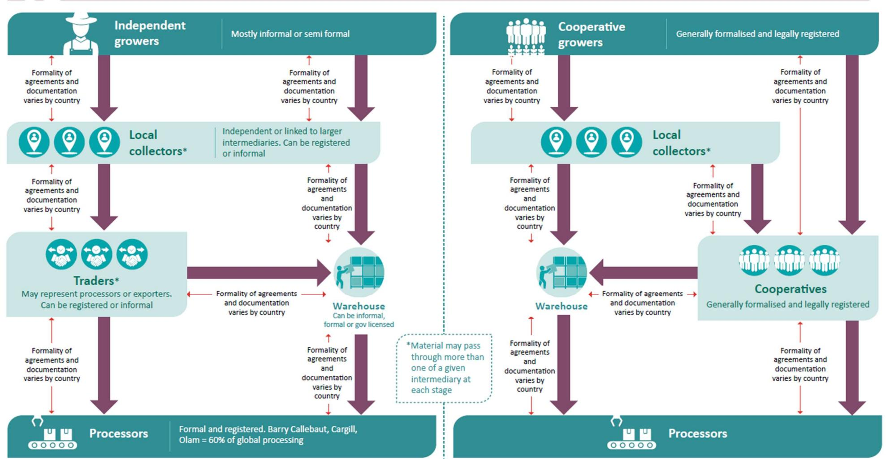

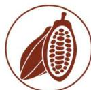

34 Proforest Initiative| +44 (0) 1865 243 439 | info@proforestinitiative.org | www.proforest.net

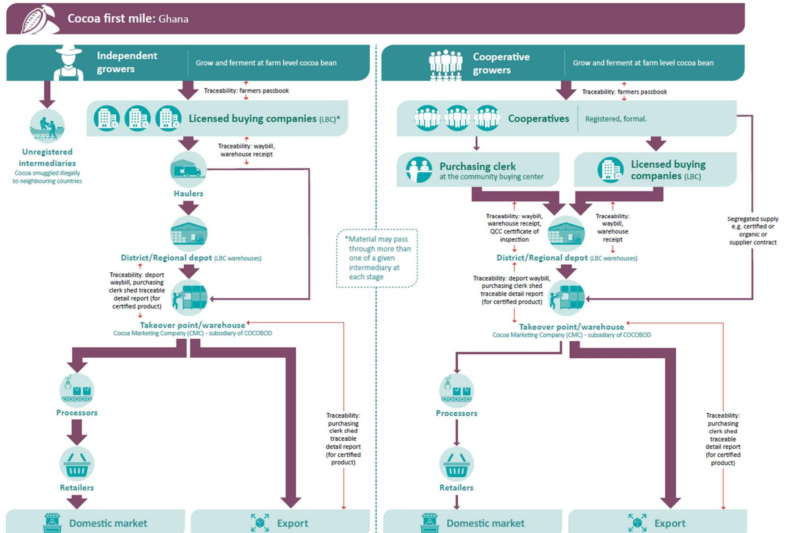

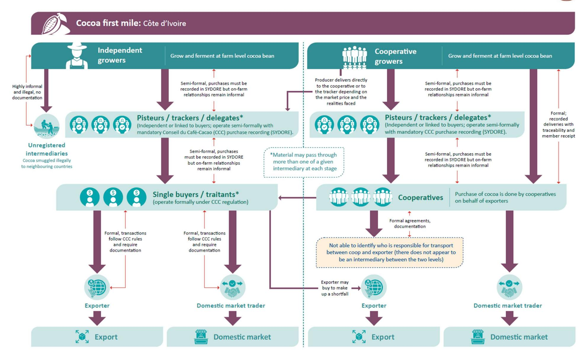

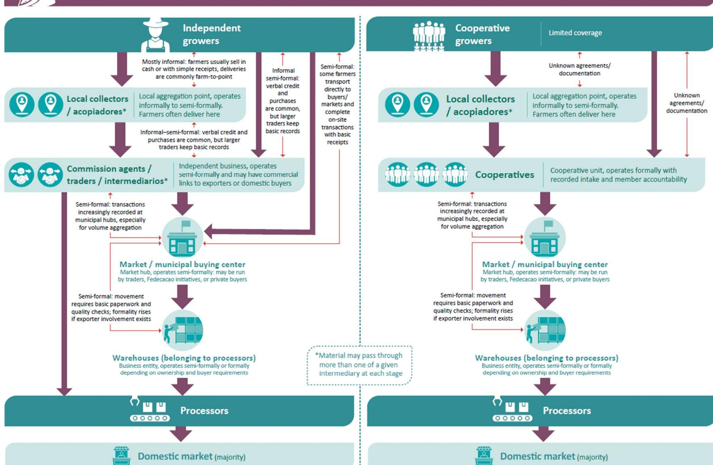

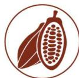

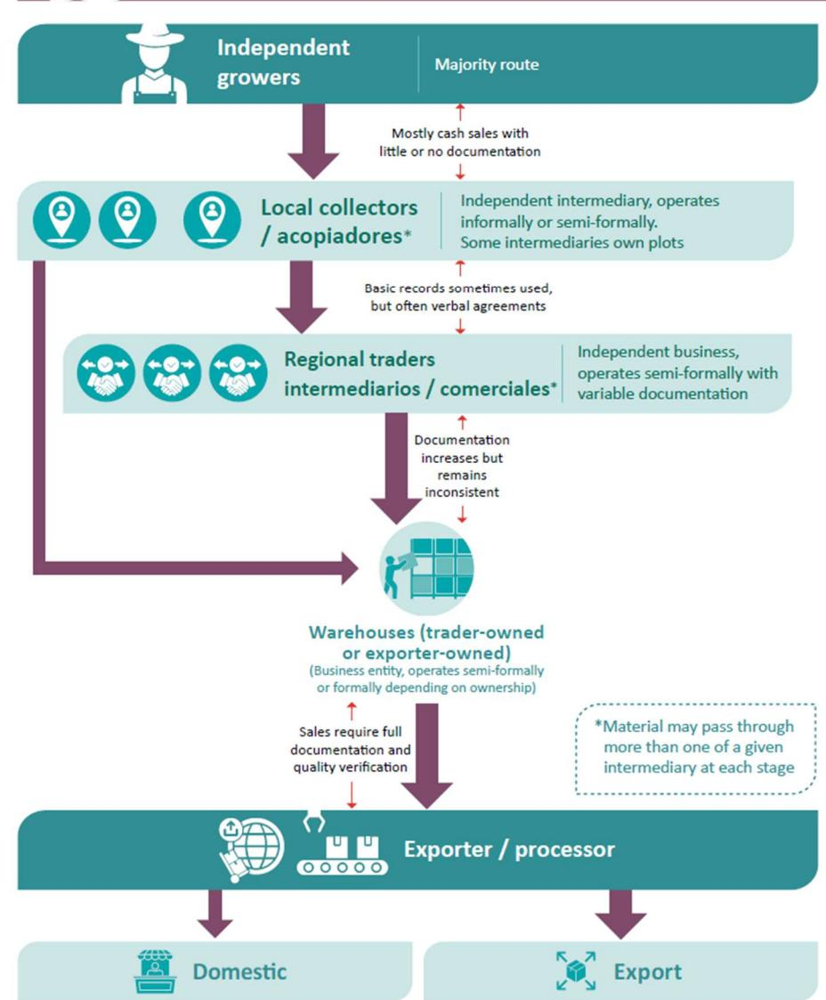

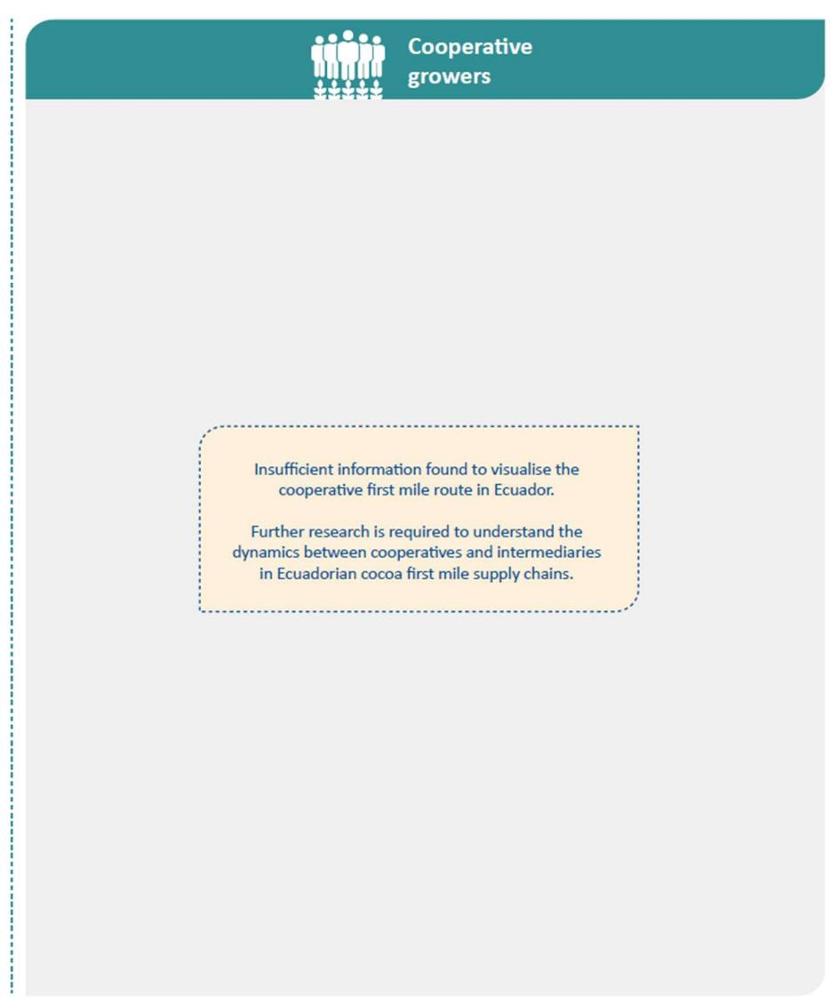

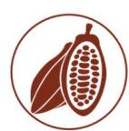

### Cocoa initiatives and tools overview

| Initiative/tool Category and country Summary |                                                                                                              |
|----------------------------------------------|--------------------------------------------------------------------------------------------------------------|
| Purpose:                                     | Tracking cocoa from farm to port, enabling compliance with EUDR                                              |
| Impact on first mile                         | : Paper-based traceability will be phased out with digital traceability. All actors are regulated,           |
| Purpose:                                     | Government-led traceability system ensuring labelling and monitoring of cocoa along supply chains. CCC       |
| Impact on first mile:                        | CCC has deployed the traceability system in more than 700 cooperatives, with a target of 1,000               |
| Purpose:                                     | Feasibility study for a national cocoa traceability system in Cameroon                                       |
| Impact on first mile:                        | National farmer database and plot registration (georeferencing); digital tracking of each batch of           |
| Purpose:                                     | COLCO delivers a data repository with production and post-harvesting process information, business forum,    |
| Impact on first mile:                        | Aims to increase agricultural productivity and incomes of small-scale food producers, including              |
| Purpose:                                     | EU REDD Facility facilitated a national dialogue to develop the concept and a roadmap for a traceability and |
| Impact on first mile:                        | Assessed the practical feasibility of building a traceability and transparency system for the cocoa          |
| Purpose:                                     | Introduced digital tools such as KoltiTrace MIS, FarmGate and FarmXtension to enhance the operations of      |
| Impact on first mile:                        | Tools are designed to help cooperatives map all their producers’ farms and streamline cocoa                 |
| Purpose:                                     | Traces source farms by GPS coordinates that digitally map each farm to monitor deforestation                 |
| Impact on first mile                         | : Close collaboration with farmers to map their land and ensure compliance with regulations such             |
| Purpose:                                     | Captured digital polygons of 4,800 cacao farms in Colombia                                                   |
| Impact on first mile:                        | Aims to increase productivity, improve living incomes of cacao farmers and expand trade of cacao             |

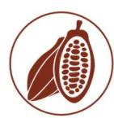

| Purpose:              | Buying organisations the company sources from keep track of every bag of cocoa beans bought and allocate   |
|-----------------------|------------------------------------------------------------------------------------------------------------|
| Impact on first mile: | Strengthens farm-level traceability and accountability                                                     |
| Purpose               | : Fundamental tool to upload information and meet EUDR due diligence requirements                          |
| Impact on first mile: | Enables producers to comply with EUDR                                                                      |
| Purpose               | : Enables Olam’s staff to collect data, record GPS data points for farms and social infrastructure, manage |
| Impact on first mile: | Tracks all first-mile transactions, including financing, input distribution and crop purchases             |

## 2.4. First mile typology for palm oil

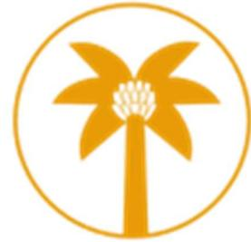

### Summary of findings

#### What happens in the first mile of palm oil supply chains?

The first mile of the palm oil supply chain begins with the harvesting of fresh fruit bunches (FFBs) by independent smallholder growers and ends at the mill, where FFBs are processed into crude palm oil. This segment includes a diverse set of actors who facilitate the movement, aggregation and sale of FFBs. Additionally, the timing and quality of FFB delivery are critical, as delays can significantly reduce oil yield and quality.

Smallholders may sell directly to mills but more commonly rely on several layers of intermediaries such as local collectors, traders and/or collection centres. These intermediaries vary in formality, from informal agents operating without licences to registered dealers under national regulatory bodies like the Malaysian Palm Oil Board (MPOB). Mills, typically formal entities, purchase FFBs from various sources and are central to traceability and certification efforts.

#### How does the structure of the first mile supply chain impact livelihoods?

Independent smallholders, particularly those in remote areas, often remain reliant on intermediaries for sales, transportation and market information. Prices offered by intermediaries are typically low and set unilaterally, and smallholders who depend on intermediaries for transport or credit may receive even lower prices. Quality issues, such as overripe or damaged FFBs, can lead to rejection at mills, further impacting income.

In some palm oil supply chains, cooperatives provide more stable prices and support services. These can help smooth income fluctuations and strengthen smallholders' capacity to invest in training, plantation rehabilitation and sustainable, climate-resilient practices, though challenges around infrastructure, training access and liquidity remain. Certification schemes such as the Roundtable on Sustainable Palm Oil (RSPO) aim to reinforce these systems by improving cooperative organisation, traceability and sustainable production practices. However, smallholders often struggle to access certification due to high costs, administrative requirements and limited technical support. Compounding this, traceability for certified independent smallholders continues to be a major challenge, particularly in the first mile where palm fruit is aggregated or sold informally, making it difficult to link farmers to direct supply chains from the mill onwards. As a result, even when smallholders have the option to benefit financially from premiums via credit sales or support programmes, certified independent producers are often excluded from fully traceable segregated value chains, and the additional advantages that direct sourcing can provide.

Intermediaries themselves are also dependent on downstream buyers and subject to low prices and limited bargaining power. Moves to formalise supply chains, such as digital platforms and group certification, can bypass informal intermediaries if they are not integrated into new systems. Many lack capital to invest in better transport or storage, affecting efficiency and quality. Operating informally also exposes them to regulatory risks, especially under sustainability regulations such as the EUDR.

## How formal or informal is the first mile?

Levels of formality vary significantly between countries. Malaysia has the most formalised supply chain, with strong government oversight through MPOB and mandatory Malaysian Sustainable Palm Oil Standard (MSPO) certification. Indonesia also enforces mandatory Indonesian Sustainable Palm Oil Standard (ISPO) certification, though the levels of implementation and enforcement vary.

Honduras has a mix of formal and informal actors, with large companies and cooperatives operating under legal frameworks, while many smallholders remain unregistered (PF/RSPO workshop, 2025).

Thailand's supply chains are relatively less formal, with limited government oversight and a fragmented governance structure (RSPO, 2025). In the case of palm oil, government engagement has been more limited, reflecting that most Thai palm is destined for markets with less regulatory pressure. In contrast, for rubber, where exports are largely directed to the EU, there has been greater attention to regulating the first mile and smallholder support (see rubber section).

Initial interactions between smallholders and intermediaries are often informal, characterised by long-term but non-contractual relationships and cash-based transactions. Documentation is limited, and traceability is weak until the FFBs reach the mill.

## Why may traceability be challenging in the first mile?

The palm oil sector is dominated by large numbers of smallholders and intermediaries, many of whom operate informally and in remote areas. This makes traceability to plot level extremely difficult. Land ownership is often fragmented, and disputes over tenure are common. There is limited digital infrastructure, low digital literacy, and few incentives for smallholders to engage in traceability systems.

Intermediaries rarely record detailed sourcing data, and multiple layers of trade can obscure the origin of FFBs. Mixing of fruit at collection points is common, breaking the chain of custody. Formal documentation typically begins only once the FFBs reach the mill.

## What solutions exist to improve traceability in the first mile?

Most traceability solutions have focused on digital mechanisms from mill back to farm level. These include:

- • **Mobile apps** for smallholders to register farms, log harvests and record sales.
- • **Satellite imaging and GPS tagging** to map farm boundaries, monitor land use and verify legal land ownership.
- • **Blockchain technologies** to enable real-time, tamper-proof tracking of FFB origin and movement.
- • **Mill-level mapping** of all suppliers, including intermediaries and smallholders.

### MSPO (Malaysian Sustainable Palm Oil Standard)

MSPO is Malaysia's national certification scheme for sustainable palm oil production. It sets requirements for environmental protection, social responsibility and traceability across the supply chain. Certification under MSPO is mandatory for all Malaysian palm oil producers and processors, ensuring compliance with sustainability and legal standards.

### ISPO (Indonesian Sustainable Palm Oil Standard)

ISPO is Indonesia's national certification scheme for sustainable palm oil production. It establishes requirements for environmental management, social responsibility and traceability throughout the supply chain. Certification under ISPO is mandatory for all Indonesian palm oil producers and processors, ensuring compliance with national sustainability regulations and legal standards.

 Group certification schemes to help smallholders meet traceability and sustainability requirements collectively.

These solutions are mostly developed by the private sector, with cooperatives, NGOs and producer associations helping to fund access and train farmers in their use.

### Where do countries align and where do they differ in the first mile?

### Commonalities

All the countries typically have short supply chains with similar types of intermediary actors operating with varying degrees of prominence. Local collectors or traders are the first intermediary, who purchase FFBs from farmers to sell directly to mills. Primary processing is completed domestically at mills to produce crude palm oil for export or domestic use. Transactions between farmers and intermediaries are generally informal and lack regulatory oversight, while mills tend to have more formal relationships and traceability mechanisms.

### Country specificities

 Malaysian model: Strong government regulation through MPOB and mandatory MSPO certification. The Sawit Intelligent Management System (SIMS) platform requires daily reporting from licensed intermediaries. Smallholders can choose buyers freely, which can sometimes make traceability efforts more complex. (PF/RSPO workshops in Malaysia 2025; ISEAL – PF/RSPO project work 2024/2025) Indonesian model: In theory, mandatory ISPO certification should enforce traceability, requiring mills to source only from registered suppliers. However, in practice uptake and enforcement of ISPO remains a challenge. (RSPO Dealers workshop in Indonesia 2025; ISEAL – PF/RSPO project work 2024/2025) Thai model: There is limited government enforcement in upstream traceability compared to Malaysia for example. While the Ministry of Agriculture and Cooperatives and the Department of Agriculture oversee aspects of palm oil production, there is no dedicated legal framework that explicitly governs FFB collection points. (RSPO, 2025) Honduran model: Formalisation is led by private companies and cooperatives. While some actors are registered and regulated, many smallholders and intermediaries operate informally. Data availability is limited, and smallholders face barriers such as low digital literacy and fear of legal consequences.

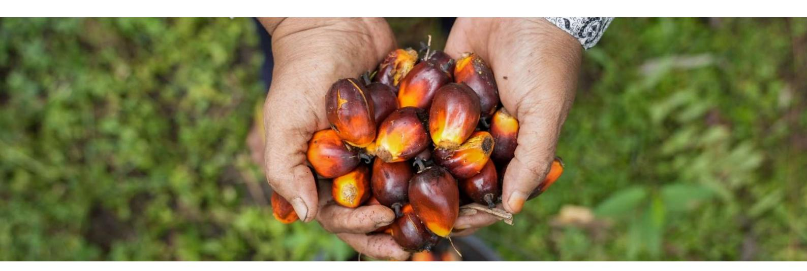

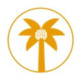

### Overview of palm oil first-mile actors

| Type Role and position                             | Structure and formality                         | Services                                             |
|----------------------------------------------------|-------------------------------------------------|------------------------------------------------------|
|  Produce and sell FFBs                            |                                                 |                                                      |
|  Not tied to any mill                             |                                                 |                                                      |
|  Low bargaining power                             |                                                 |                                                      |
|                                                    |  Often informal or semi-formal                 |                                                      |
|                                                    |  May organise into groups or join              |                                                      |
|                                                    |                                                 |  Limited access to training, credit and inputs      |
|                                                    |                                                 |  Often sell via intermediaries                      |
|  Help members access markets and services         |                                                 |                                                      |
|  May own or partner with mills or collection      |                                                 |                                                      |
|                                                    |  Formally registered under cooperative law     |                                                      |
|                                                    |  Internal governance structures and statutes   |                                                      |
|                                                    |                                                 |  Shared access to training, finance, tools          |
|                                                    |                                                 |  Improved bargaining power                          |
|                                                    |                                                 |  Direct agreements with mills or collection centres |
|                                                    |                                                 |  Certification support                              |
|                                                    |                                                 |  May manage collection, logistics or inputs         |
|  Buy FFBs from smallholders; sell to collection   |                                                 |                                                      |
|  Agen pengumpul (mobile collectors) most          |                                                 |                                                      |
|                                                    |  Legal status and traceability often unclear   |                                                      |
|                                                    |  Mostly lack formal licences; operate on       |                                                      |
|                                                    |                                                 |  Facilitate collection and sale of FFBs             |
|                                                    |                                                 |  Grade FFB quality                                  |
|                                                    |                                                 |  Provide loans to smallholders                      |
|                                                    |                                                 |  Some producer associations act as intermediaries   |
|  Buy FFBs from ISH or cooperatives; sell to mills |                                                 |                                                      |
|  May own land for production                      |                                                 |                                                      |
|                                                    |  Private actors; often informal or semi-formal |                                                      |
|                                                    |  Can hold permits depending on country         |                                                      |
|                                                    |  In Malaysia, dealers registered with MPOB     |                                                      |
|                                                    |                                                 |  Transport and cash payments                        |
|                                                    |                                                 |  Provide loans to smallholders                      |
|                                                    |                                                 |  Issue weight tickets (with certification stamp for |
|                                                    |                                                 |  Larger intermediaries may assist with farm         |
|  Aggregate FFBs from growers; facilitate bulk     |                                                 |                                                      |
|  May be run by cooperatives, companies, or        |                                                 |                                                      |
|                                                    |  Can be formal or informal; compliance often   |                                                      |
|                                                    |  Operate on verbal or written agreements;      |                                                      |
|                                                    |                                                 |  Weighing systems, storage, loading ramps           |
|                                                    |                                                 |  Forklifts and tractors                             |
|                                                    |                                                 |  Support harvesting, logistics, and aggregation for |
|  Process FFBs into crude palm oil                 |                                                 |                                                      |
|  Buy from ISH, cooperatives, and intermediaries   |                                                 |                                                      |
|  Located near plantations due to perishability of |                                                 |                                                      |
|                                                    |  Highly formal entities with processing        |                                                      |
|                                                    |  Privately owned, government-linked, or        |                                                      |
|                                                    |                                                 |  Provide FFB pricing and payment                    |
|                                                    |                                                 |  May offer support programmes to loyal suppliers    |
|                                                    |                                                 |  Facilitate traceability and certification          |

### Palm first mile visuals

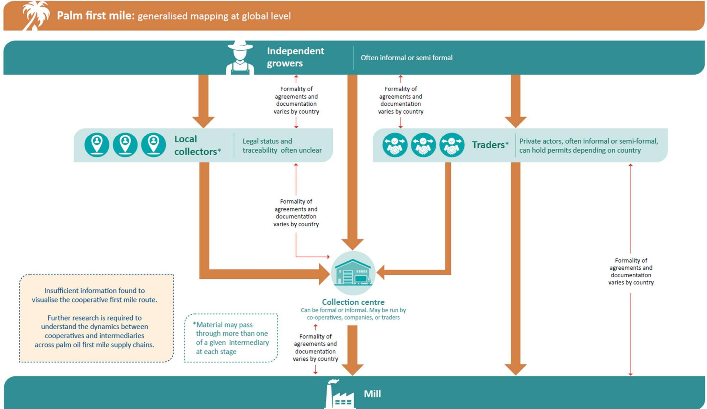

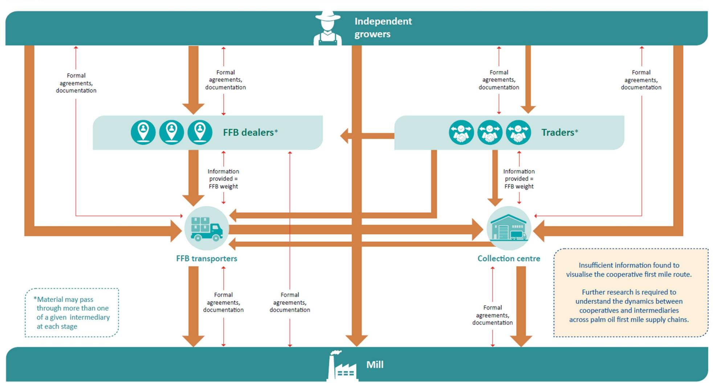

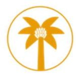

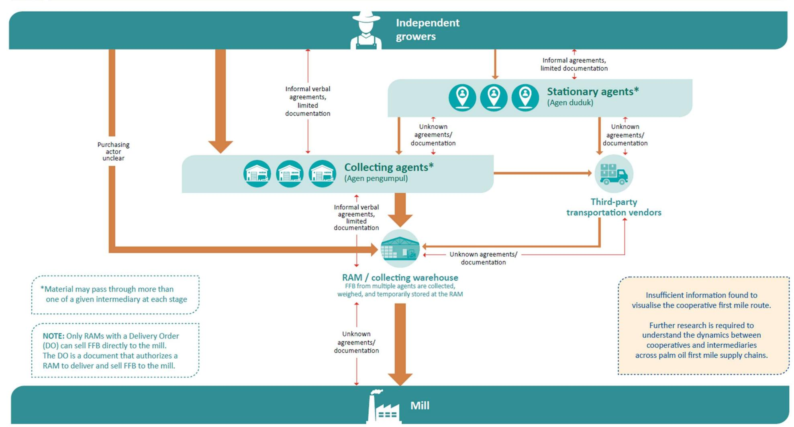

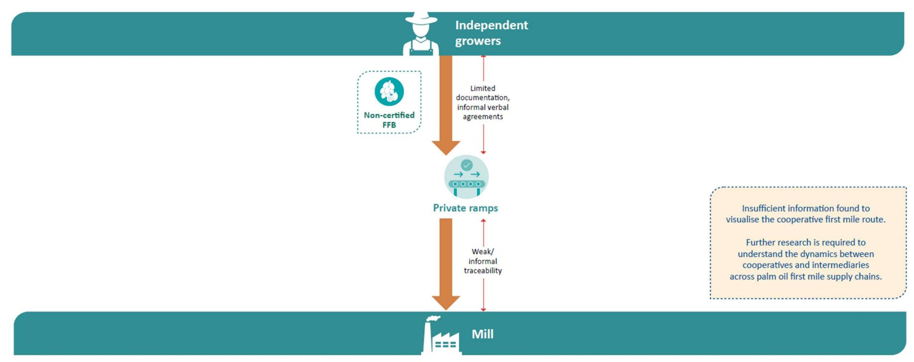

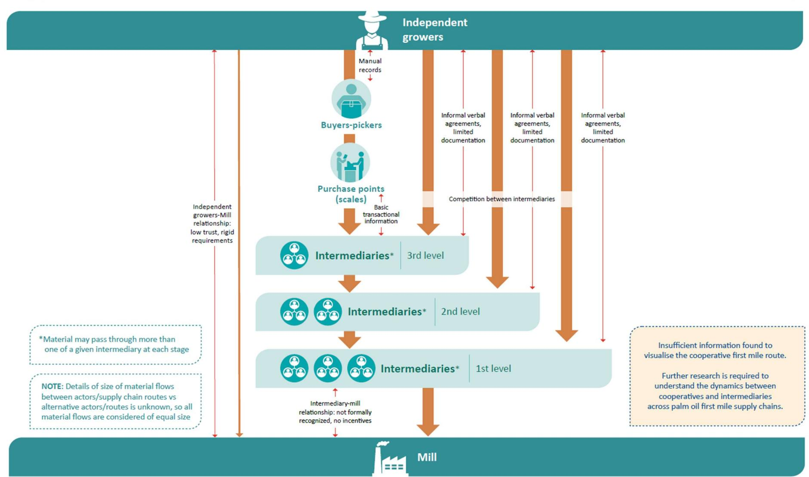

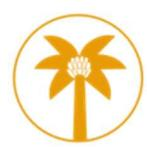

### Palm initiatives and tools overview

| Initiative/tool Category and country Summary |                                                                                                                   |
|----------------------------------------------|-------------------------------------------------------------------------------------------------------------------|
| Purpose                                      | : Enables companies to collect, update, visualise and centralise their data and documents related to              |
| Impact on first mile:                        | Mainly used by mills, slowly expanding to collect data from refineries and traders                                |
| GEO PALM Government                          |                                                                                                                   |
| Purpose                                      | : Identifies land parcels at federal, district and subdistrict level based on land title documents                |
| Impact on first mile                         | : Most of Peninsular Malaysia's (~70% of ISH area) data is available                                              |
| Purpose:                                     | Allows certified entities and logo bearers to use the traceability platform, tracking from end-product to         |
| Impact on first mile:                        | Traceability to plantation                                                                                        |
| Purpose:                                     | Supply chain traceability projects                                                                                |
| Impact on first mile:                        | FFB supply from own estates and scheme smallholders are traceable and mapped                                      |
| Purpose:                                     | Ideally, source of FFBs is traced back to the plantation/farm area owned by the respective smallholders           |
| Impact on first mile:                        | Data is gathered from truck drivers at mills/at the field from each farmer                                        |
| Purpose:                                     | Practical and inclusive tool for supply chain mapping and traceability                                            |
| Impact on first mile:                        | Designed to improve the integration of smallholders into the value chain                                          |
| Purpose                                      | : Application developed to contain data on plantation land and food                                               |
| Impact on first mile                         | : Improves access to plantation data for better planning, traceability and decision-making                        |
| Setara Jambi tool: Jala                      |                                                                                                                   |
| Purpose                                      | : Database application provided for farmers to record land and activities                                         |
| Impact on first mile                         | : Enables farmers to record land and activities, supporting better management and data-driven                     |
| Setara Jambi tool: Jala                      |                                                                                                                   |
| Purpose                                      | : Database application for farmers and plantation land, intended for the issuance of the cultivation registration |
| Impact on first mile                         | : Supports farmer registration and STDB issuance, enhancing legality, market access and                           |
| datasawit.com Private sector                 |                                                                                                                   |
| Purpose:                                     | Database contains information on SPKS (Serikat Petani Kelapa Sawit - an Indonesian oil palm farmer                |
| Impact on first mile                         | : Strengthens data availability and mapping of independent smallholders, improving transparency                   |
| Purpose:                                     | Capacity building project for dealers on no-deforestation, no-peat, no-exploitation (NDPE) topics                 |
| Impact on first mile                         | : Influencing sourcing practices of dealers                                                                       |

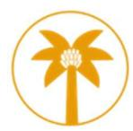

|                                              |                    |                                                                                                                                                                                                                                                                                                                   |
|-----------------------------------------------------------|---------------------------------|--------------------------------------------------------------------------------------------------------------------------------------------------------------------------------------------------------------------------------------------------------------------------------------------------------------------------------|
| 
<u><a href="#">Unilever Pilot</a></u>
 | 
Private sector Indonesia
 | 
<b>Purpose:</b> Using cell phone geolocation data to track the palm oil moving between individual farms and plantations that supply mills in Unilever supply chain
 
<b>Impact on first mile:</b> Enhances traceability and visibility of palm oil origins, enabling better monitoring and supplier accountability
 |

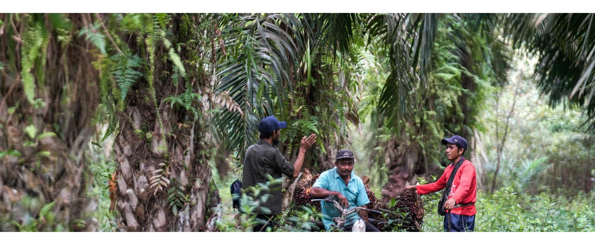

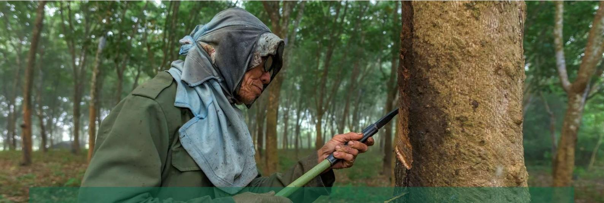

The first mile of commodity supply chains, spanning from the farm to the first point of aggregation or processing, is increasingly recognised as a critical frontier for sustainability, compliance and equity. Yet it remains one of the most opaque and under-regulated segments of global supply chains.

This study, covering cocoa, coffee, rubber and palm oil across multiple geographies, highlights the inherent complexity of the first mile, and reflects some of the challenges and emerging opportunities to unlock the full potential of traceability systems in agricultural commodity supply chains.

Our conclusions have been organised into the following five clusters:

- 1. The structural realities of the first mile The first mile is dominated by smallholders, with limited infrastructure, and the type of commodity strongly shapes supply chain structures and intermediary networks.
- 2. Livelihoods at risk and opportunities Smallholders face price volatility and dependence on credit, but well-designed systems can improve incomes and formalise intermediary roles.
- 3. The role of governance and formalization Government oversight and flexible formalisation play a key role in enabling traceability while ensuring smallholders are included.
- 4. Traceability bottlenecks and breakthroughs Tier-one intermediaries create major traceability bottlenecks, but digital tools, cooperative models and government platforms are helping to overcome them.
- 5. The cost-to-impact dilemma in the first mile Investments in traceability and sustainability must balance cost and impact to ensure smallholders benefit without being excluded.

### 3.1. The structural realities of the first mile

Across all commodities, the first mile is dominated by independent smallholders who operate with limited resources and minimal infrastructure, and often outside formal regulatory frameworks.

## Section 3: Conclusions - Navigating the complexity of first mile traceability

These producers are typically reliant on intermediaries – local collectors, traders, agents – for market access, transport and credit. While these intermediaries play a vital role in enabling trade, their operations are frequently informal, undocumented and poorly integrated into traceability systems.

Ultimately, the nature of the commodity influences the structure of the first mile:

- Palm oil, being highly perishable, necessitates rapid movement from farm to mill, resulting in tightly clustered supply chains with multiple layers of intermediaries.
- Rubber, which is less perishable, allows for longer storage and more dispersed trade routes, but still suffers from traceability gaps due to informal transactions and remote production by farmers who lack the necessary transportation and storage facilities.
- Coffee and cocoa sit somewhere in between, with post-harvest processing (e.g. fermentation, washing, hulling, drying) occurring both on-farm or at cooperative level, or offfarm at independent processing sites, with significant variation in formality and oversight.

### 3.2. Livelihoods at risk and opportunities

The first mile is not just a logistical challenge, it is a livelihood ecosystem. Smallholders often face low and volatile prices, limited bargaining power, and exposure to climate and market shocks. Their dependence on intermediaries, especially for credit, can trap them in cycles of debt and disadvantage.

Intermediaries themselves are vulnerable. Operating without formal recognition, they face regulatory and business risks and may be excluded from emerging traceability systems. Yet they are often deeply embedded in local communities, providing essential services that formal actors cannot easily replicate. In essence, they fill critical gaps by offering informal credit, transport, aggregation, quality control, market access and trusted local relationships. These services underpin smallholder livelihoods but often remain invisible to formal traceability systems.

Traceability initiatives, if poorly designed, risk displacing these first-mile actors either by bypassing them through direct-to-processor models or by imposing compliance requirements they cannot meet. Conversely, inclusive traceability systems can empower smallholders, improve incomes and formalise intermediary roles in ways that enhance both equity and efficiency.

However, the full impact of first-mile interventions on livelihoods remains insufficiently understood. More research is needed to capture how traceability, data collection and formalisation affect farmers and intermediaries in practice, particularly regarding data ownership. Gender dynamics also remain under-examined but critically shape who benefits and who may be left behind.

### 3.3. The role of governance and formalisation

The degree of formality and government oversight is a key determinant of traceability success. Countries like Ghana and Malaysia, with strong regulatory frameworks and centralised systems (e.g., COCOBOD, MPOB), demonstrate higher levels of traceability and fewer unlicensed actors. Similarly, in Thailand's rubber sector RAOT's farmer mapping and mandated auction systems show how state-led initiatives can formalise upstream actors and supply chain routes, enabling traceability. In contrast, countries with fragmented governance (e.g., Indonesia, Ecuador) tend to show more persistent informality and traceability gaps, especially in remote regions.

Government-led systems can accelerate visibility in the firm mile by mandating farm registration, licensing intermediaries and introducing digital traceability platforms. However, formalisation is not a one-size-fits-all solution. Overly rigid systems risk excluding smallholders and informal intermediaries who lack the capacity to comply with supply chain expectations. Successful models

combine local and/or national regulation with enabling measures, such as capacity building, digital literacy and incentives, to ensure inclusion.

Flexible, inclusive approaches, like group certification, cooperative-led traceability and phased compliance models, can bridge the gap between informality and compliance. Governments play a critical role not only as enforcers but as enablers, fostering collaboration among companies, NGOs and producer organisations to align incentives and scale impact.

### 3.4. Traceability bottlenecks and breakthroughs

The most significant traceability bottlenecks occur at the tier-one intermediary level, i.e., the first actor who aggregates produce from smallholders. These actors often operate without contracts, documentation or digital tools, making it difficult to trace volumes back to plot level.

However, promising solutions are emerging:

- • Digital tools (e.g., KoltiTrace, TRST01, Fairfood Trace) enable farm-level mapping, transaction logging and real-time data sharing.
- • Government-led systems (e.g., Ghana's GCTS, Côte d'Ivoire's CCC protocols) are scaling traceability through licensing, farm registration and digital platforms.
- • Private sector innovations (e.g., Olam's Farmer Information System, Casa Luker's GPS mapping) demonstrate how companies can integrate traceability into sourcing models without excluding smallholders.

These tools are most effective when paired with physical infrastructure such as regulated auctions, collection centres and cooperative mills that serve as traceability anchors in the supply chain.

Why full traceability may not always be the most effective approach:

1. 1) **High costs and diminishing returns:** Mapping thousands of smallholders and intermediaries requires significant financial and technical resources, often with limited impact on deforestation or labour risks.
2. 2) **Operational complexity:** Informal structures, low digital literacy and weak infrastructure make reliable data collection challenging and costly to maintain.
3. 3) **Risk of exclusion:** Rigid traceability requirements can marginalise smallholders and informal actors, undermining inclusivity and equity goals.
4. 4) **Supply chain fluidity:** Informal supply chains are dynamic, with intermediaries frequently entering and exiting the system. This fluidity makes it difficult to maintain up-to-date records and raises questions about how traceability systems can adapt to such change without becoming obsolete or exclusionary.

### 3.5. The cost-to-impact dilemma in the first mile

The first mile is a deeply fragmented and informal ecosystem. In smallholder-dominated supply chains, achieving plot-level traceability often demands enormous investment in mapping, monitoring and digital systems. Yet these efforts may not always deliver systemic benefits on the ground, and risk excluding the very actors they aim to support.

For downstream companies, the question is not whether traceability matters – it is increasingly a regulatory requirement – but rather when and for whom traceability creates meaningful value. This means ensuring systems meet downstream compliance and risk-management needs while also supporting, rather than disadvantaging, first-mile producers and intermediaries.

In parallel to investing in traceability solutions, the underlying system issues need to be addressed by:

- 1. Targeting deforestation, labour conditions, legality and livelihoods at a regional scale
- 2. Developing collaborative solutions that pool resources and align incentives among companies, governments and civil society
- 3. Delivering more inclusive and cost-effective outcomes that reduce duplication and strengthen governance.

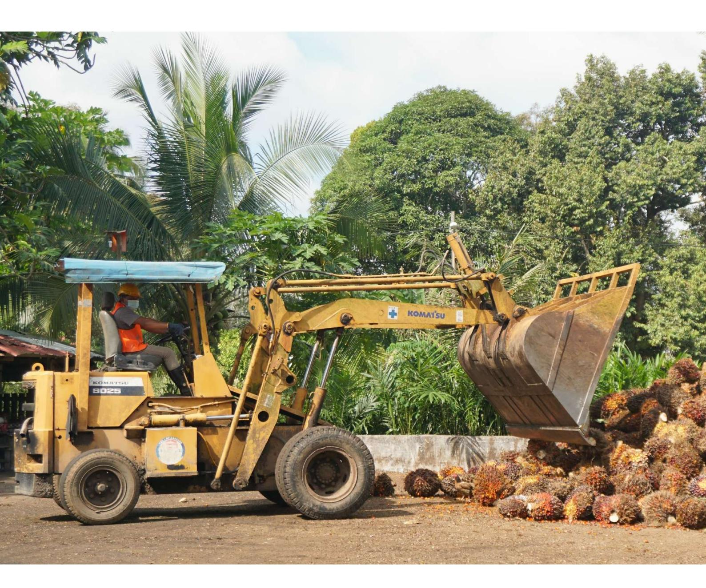

Improving first-mile traceability in a way that is both effective and equitable requires a nuanced approach. Given the diversity and informality of smallholder supply chains, a one-size-fits-all model is unlikely to succeed. Instead, stakeholders should adopt a phased strategy that combines immediate, practical steps with longer-term investments and future-oriented innovations. The following recommendations outline several short- and longer-term strategies for building traceable systems that are resilient, inclusive and adaptable to evolving realities on the ground.

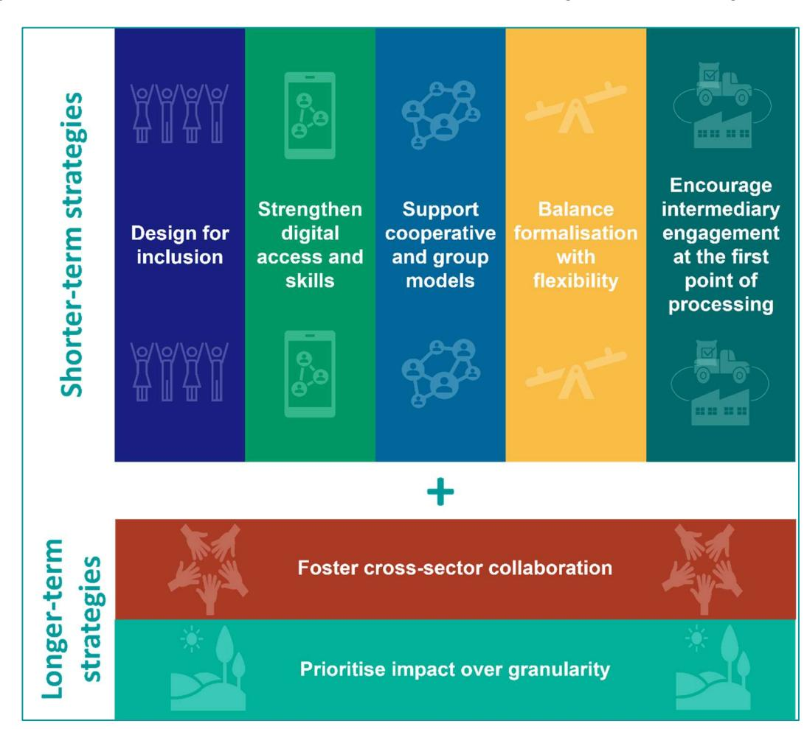

## Section 4: Recommendations – Strategic pathways to inclusive and effective first-mile traceability

### 4.1. Shorter-term strategies: Build from what exists

### 4.1.1. Design for inclusion

Traceability mechanisms must start from the realities of the first mile, where smallholders and intermediaries often operate in informal conditions with limited digital access and literacy. Current approaches frequently assume levels of digital access, literacy and formality that do not exist, risking the exclusion of vulnerable actors.

To make inclusion a cornerstone of traceability, three priorities stand out:

- 1. Creating low-barrier entry points such as mobile-based registration tools, simplified documentation processes and flexible verification models to enable smallholders and intermediaries to participate.
- 2. Enabling group-level traceability through cooperatives or producer associations, which can act as a bridge between informal actors and formal systems, reducing individual compliance burdens.
- 3. Recognition and integration of intermediaries, leveraging their local networks and trust relationships to connect remote farmers to markets rather than excluding them.

Delivering these changes requires coordinated action by several actors:

 Governments could simplify registration processes, legally recognise cooperatives, and create policies that legitimise intermediaries within formal systems. Companies could develop user-friendly digital tools for low-connectivity environments, fund mobile-based solutions, and offer incentives such as premiums or preferential sourcing to encourage the flow of traceability data and encourage group-level compliance. NGOs and producer organisations could provide training and capacity building for smallholders and intermediaries, strengthen cooperative governance, and advocate for inclusion of informal actors in traceability frameworks. Certification schemes could adapt standards and tools to include intermediaries more formally within their systems, ensuring they are not sidelined but supported as compliance enablers.

Collaboration between all these actors is essential to co-design solutions that reflect local realities, share costs for digital rollouts, and align standards so compliance pathways remain practical and inclusive.

### 4.1.2. Strengthen digital access and skills

Digital tools are central to modern traceability, but their effectiveness depends on access and usability. Without access to mobile devices, connectivity and training, digital tools will remain out of reach for many producers and intermediaries.

- 1. Training and capacity building should accompany digital rollouts, with tailored support for different literacy levels and languages.
- 2. Shared access models, such as community digital kiosks or cooperative-managed devices, can help bridge the digital divide.

### 4.1.3. Support cooperative and group models

Cooperatives and producer groups are often the most effective vehicles for traceability in fragmented supply chains. They offer:

 Aggregation of volumes, enabling economies of scale and simplified compliance Internal governance structures that support documentation, training, and monitoring Social and environmental services, such as input provision, credit access and community development.

However, cooperatives vary widely in capacity. Strategic support should include:

- 1. Legal registration and formalisation assistance
- 2. Technical support for traceability systems
- 3. Incentives for sustainability and compliance (e.g., premium payments, access to markets).

Rather than displacing intermediaries, cooperatives can formalise and redefine their role:

 Intermediaries can act as logistics partners or collection agents under cooperative governance. Their local networks and trust relationships can help extend cooperative reach to remote smallholders. Training and incentives can align intermediaries with sustainability goals, turning them into compliance enablers rather than bottlenecks.

### 4.1.4. Balance formalisation with flexibility

Regulatory and voluntary frameworks should set clear expectations but allow for diverse pathways to compliance, including transitional models for informal actors. While formalisation improves traceability, rigid systems can exclude actors who lack the means to comply with supply chain expectations. A balanced approach should:

- 1. Allow transitional models, where informal actors are gradually integrated into formal systems through phased requirements.
- 2. Recognise diverse pathways to compliance with supply chain expectations. This could include for example verbal agreements backed by community verification, or hybrid paperdigital systems.
- 3. Avoid one-size-fits-all frameworks, instead tailoring requirements to commodity, geography and actor type.

This approach is particularly important in countries with fragmented governance or high levels of informality, such as Indonesia or Ecuador.

### 4.1.5. Encourage first points of processing (e.g. mills) to engage with intermediaries and support rollout of traceability tools.

The first point of processing, such as a mill, is where sustainability certification often starts or resumes if smallholder certification is available. It is at this point where the last in the chain of intermediaries reconnects with the certified supply chain. The mills have business relationships with this tier of intermediary, typically via formal contracting and invoicing.

Where mills require further traceability information from these top-level intermediaries, it sends a strong market signal.

Sustainability systems should try, via shared responsibility and cost-sharing mechanisms, to ensure that mills themselves receive recognition for increasing fully traceable supply, so that, in turn, the mills can financially recognise the efforts of intermediaries and smallholders.

### 4.2. Longer-term strategies: Invest in systemic change

### 4.2.1. Foster collaborative approaches

Governments, companies, NGOs and producer organisations must work together to align incentives, share data and positive examples, and scale any successful pilots. No single actor can solve first-mile traceability alone.

Collaboration is essential across:

 Governments, to provide regulatory frameworks, farmer registration and enforcement Private sector, to invest in tools, infrastructure and inclusive sourcing models, and provide incentives to the first mile NGOs and producer organisations, to support training, advocacy and community engagement.

Key actions include, for example:

- 1. Shared traceability platforms that allow interoperability between systems. These can be designed for specific geographies (e.g. rolled our within a given sourcing landscape) and/or at a commodity scale (e.g. interoperability of platforms in use within the palm oil sector).
- 2. Joint pilots and innovation labs to test new models in diverse contexts.
- 3. Data governance frameworks that protect farmer and intermediary privacy while enabling transparency and incentives.

### 4.2.2. In parallel, support broader strategies focusing on impact over granularity

It is critical to recognise that in highly fragmented and/or informal smallholder-dominated supply chains, pursuing plot-level traceability alone can be costly and slow. In parallel, focusing some resources to address underlying issues by using risk-based, landscape or jurisdictional approaches can support sustainable livelihoods, legality and capacity building.

- 1. Adopt risk-based approaches: Focus on identifying and addressing high-risk areas for deforestation, labour issues and other sustainability concerns.
- 2. Invest in landscape and jurisdictional initiatives: These approaches enable collective action to tackle systemic issues, such as land governance, legality, forest protection and rural livelihoods, across entire regions.
- 3. Leverage shared responsibility: Pool resources with other companies, governments and NGOs to reduce duplication, align incentives and scale impact.
- 4. Ensure inclusivity: Design interventions that strengthen local governance and producer organisations, so smallholders and intermediaries remain part of the solution rather than being excluded.

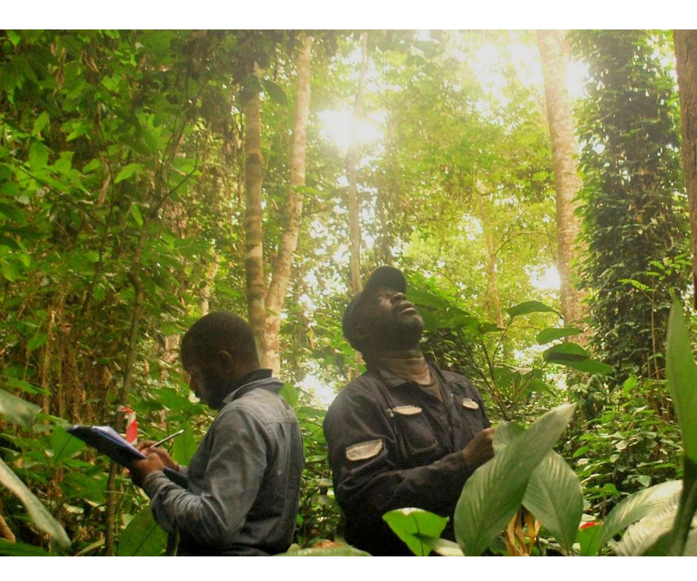

## Annex 1 - References

### Rubber

- • Aid Environment (2024) [Natural Rubber Production and Consumption: Global trade flows and potentially noncompliant Indonesian rubber cases with the EUDR](#)
- • Continental (2020) [BMZ and Continental are making a rubber supply chain digitally traceable for the first time](#)
- • ETRMA (2022) [The Natural Rubber Supply Chain](#)
- • European Forest Institute (2024) [Thailand's natural rubber producers are preparing for new market requirements](#)
- • GIZ (2020) [Sustainable rubber: full traceability – from the tree to the tyre](#)
- • Jayathilake, H.M., de la Porte, C., Chang, J.W.J., Edwards, D.P. and Carrasco, L.R. (2023) [Transnational evidence for socio-economic factors affecting income and plantation expansion into natural habitats in smallholder rubber. Resources, Conservation & Recycling Advances 18: 200161](#)
- • Jakarta Market Land (2025) [Rubber Production and Export Market Analysis in Indonesia](#)
- • PEFC (2022) [Sustainable forest management in natural rubber smallholder communities](#)
- • Penot, E., Chambon, B. and Sainte-Beuve, J. (2023) [An analysis and comparison of the rubber smallholder sector in 5 countries: Cote d'Ivoire, Thailand, Indonesia, Vietnam and Cambodia. CIRAD.](#)
- • Promme, P., Kuwornu, J.K.M., Jourdain, D., Shivakoti, G.P. and Soni, P. (2017) [Factors influencing rubber marketing by smallholder farmers in Thailand. Development in Practice, 27\(6\): 865–879.](#)
- • Purba, G.A., Greijmans, M., Faure, N., and Youngpatana, P. (2024) [Implications of the EUDR on rubber, timber and coffee smallholders: Case studies from Thailand and Indonesia. RECOFTC.](#)
- • Sari, G. (2024) [Overcoming EUDR Challenges: Our Role in Empowering Thailand's Rubber Smallholders. Koltiva.](#)
- • Simatupang, D., Wambrauw, L., Fachrizal, R., Redu, S., Riza, A. and Akbar, A. (2024) [Integrated Marketing Chain Pattern of Smallholder Rubber Commodities in The Southern Region of Papua Province, Indonesia. Tarjih : Agribusiness Development Journal 4: 106-116.](#)
- • SIPH (2025) [Production per origin – SIPH](#)
- • (Vignes, 2019) Complementarity between agro-industry and smallholders in Sub-Saharan Africa (<https://proparco.fr/en/article/complementarity-between-agro-industry-and-smallholders-sub-saharan-africa>)
- • Vignes, B. (2012) [Village plantations central to sustainable agribusiness. Proparco.](#)
- • Widi, H. (2024) [Thailand and RI Rubber Roads Face EUDR. Kompas.](#)
- • WWF (2020) [Exploring Smallholder Solutions in the Rubber Sector](#)

### Coffee

- • Kompas Daily (2018) [Exploring Coffee Nusantara](#)
- • IDH (2020) [New insights into leveraging coffee 'middlemen' for smallholder living incomes](#)
- • Agricom (2020) [The Collectors Should Maximize the Strategic Roles in the Supply Chain](#)
- • Asumsi (2021) [Seeing the Phenomenon of Farmers Selling Coffee to Middlemen](#)
- • Agronet (2024) [Colombian coffee growers will have their own platform to export coffee](#)
- • Ashmelash, D.A. and Artukoglu, M. (2024) [Coffee Production and International Trade in Ethiopia: Challenges and Solutions](#)
- • Alamsyah, A. et al. (2023) [Blockchain traceability model in the coffee industry. Journal of Open Innovation: Technology, Market, and Complexity 9\(1\): 100008.](#)
- • CafePoint (2024) [Colombia launches traceability platform in September](#)

- • Duşmăneanu, B. and Jeschke, M. (2023) [Transparency and Traceability in the Supply Chains of Coffee and Cocoa: Towards Better Living Conditions for Smallholder Farmers.](#)
- • FNC (2024) [FNC will launch a platform that will give access to coordinates of coffee lots, the main requirement to continue exporting to Europe](#)
- • FNC (n.d.) [Environmental Axis](#)
- • IFT (2018) [How Coffee is Processed](#)
- • Mauladi, M.A.R, Mulyo, J.H. and Darwant, D.H. (2022) [Coffee Supply Chain Management: A Case Study in Ciamis, West Java, Indonesia. HABITAT 33\(3\): 201-211.](#)
- • Meems, P. (2019) [Global Coffee Data Standard Documentation.](#) Global Coffee Platform.
- • Naranjo, M.A., Ciravegna, E., Ingram, V., Cocchini, S., Herrera, N. and Weitkamp, T. (2024) [Tracing sustainability – A policy brief with recommendations for compliance with the European Union Deforestation Regulation for Colombia's Coffee and Palm Oil value chains.](#) Wageningen University & Research.
- • Oakley, G. (2022) [Strength in numbers: Understanding Colombia's coffee cooperatives.](#) Coffee Intelligence, 28 February.
- • Oakley, G. (2023) [Breaking down the business of coffee cooperatives.](#) Coffee Intelligence, 2 February.
- • Petit, N. (2007) [Ethiopia's Coffee Sector: A Bitter or Better Future?](#) Journal of Agrarian Change 7(2): 225-263
- • Sherfrey, J. (2015) [Juan Valdez and FNC: The Story of Colombian Coffee.](#) Eater, 16 February.
- • Tolesa, S.F. and Tolesa, B.F. (2024) [An Examination of Ethiopian Data on the Coffee Value Chain from a Systemic Perspective](#) International Journal of Business and Economics Research 13(6): 142-151.
- • XLIII Coffee (n.d.) [The role of indirect coffee trading in the supply chain](#)

## Cocoa

- • Abbott, P. et al. (2018) [An Analysis Of The Supply Chain Of Cacao In Colombia.](#) Purdue University and the International Center for Tropical Agriculture (CIAT).
- • García Cáceres, R.G., Perdomo, A., Ortiz, O., Beltrán, P. and López, K. (2014) [Characterization of the supply and value chains of Colombian cocoa.](#) Dyna 81(187): 30-40.
- • EU REDD (2023) [Supporting an improved governance mechanism for cocoa traceability in Ecuador](#)
- • Nitidae and EFI (2021) [Traceability and transparency of cocoa supply chains in Côte d'Ivoire and Ghana](#)
- • Vallejo, Z. and Arturo, D. (2017) [Do intermediaries sweeten the deal? An inquiry into the activities of intermediaries and their effect on small and medium producers within the Cocoa Value Chain in Ecuador](#)
- • van Huellen, S. and Abubakar, F.M. (2021) [Potential for Upgrading in Financialised Agri-food Chains: The Case of Ghanaian Cocoa.](#) European Journal of Development Research 33: 227–252.

## Palm oil

- • RSPO (2025) RSPO Final Report Upgrading the Fresh Fruit Bunches (FFBs) Collection Point towards Sustainability through RSPO Certification
- • PF/RSPO workshops in Honduras and Malaysia 2025
- • RSPO Dealers workshop in Indonesia 2025
- • ISEAL- PF/RSPO project work 2024/2025

### Annex 2 – Interview list

| Commodity Country focus | Organisation                | Interviewees                   |
|-------------------------|-----------------------------|--------------------------------|
| Global                  | IDH                         | Mette-Marie Hansen (Global     |
| Colombia                | Independent consultant (ex |                                |
| Global                  | Enveritas                   | Mark Furniss (Senior Director, |
| Cote d’Ivoire           | Proforest Cote d’Ivoire     | Daleba R.B. Kpenahi (Project   |
| Ghana                   | Proforest Ghana             |                                |
| Colombia                | Proforest Colombia          | Eduardo Cortés (RSP Analyst)   |
| Colombia                | Proforest Colombia          |                                |
| Global                  | Proforest Europe            |                                |
| Cote d’Ivoire           | Proforest Africa            | Daleba R.B. Kpenahi (Project   |

| Indonesia | Proforest Southeast Asia    | Langlang Tata Buana    |
|-----------|-----------------------------|------------------------|
| *Malaysia | *Workshop with intermediary |                        |
| Indonesia | Proforest Southeast Asia    | Hadiya Rasyid (Project |

\* Engagement conducted as part of a separate, but linked, project led by Proforest and the RSPO under the ISEAL Innovation Fund – Supporting smallholder inclusion in sustainable palm oil supply chains

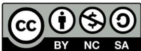

**Attribution NonCommercial Share Alike (CC BY-NC-SA):**

The CC BY-NC-SA license allows others to reuse, adapt, remix, and distribute the work for any non-commercial purpose. Commercial use of the work is not allowed. In addition, if you adapt the work and share it you must give your adaptation the same or a compatible license. Attribution to the work's creator must be provided.

This publication was produced by Proforest and commissioned by ISEAL. The research included in this report was made possible through funding by Walmart/Walmart Foundation and UK International Development from the UK government.

**Walmart  
For Good**

The findings, conclusions, and recommendations presented in this report are those of Proforest Initiative alone, and do not necessarily reflect the opinions of ISEAL, Walmart/Walmart Foundation, or the UK government.

**Proforest Initiative**

South Suite, Frewin Chambers,  
Frewin Court, Oxford OX1 3HZ  
United Kingdom  
E: [info@proforest.net](mailto:info@proforest.net)  
T: +44 (0) 1865 243439

Proforest Initiative is a registered charity in England and Wales (Charity no. 1137523) and a company registered in England and Wales (Company no. 7293440).