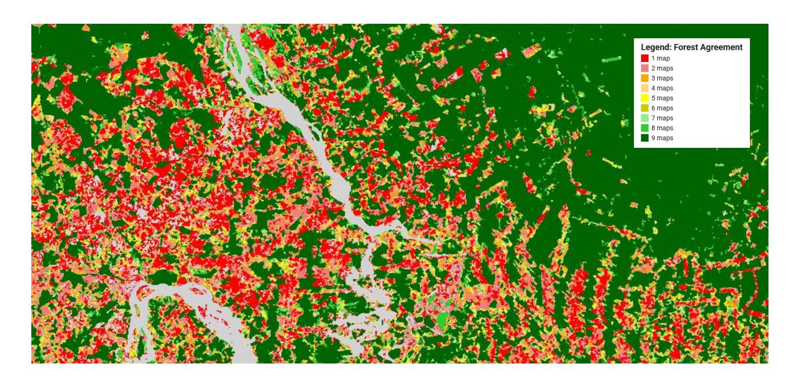
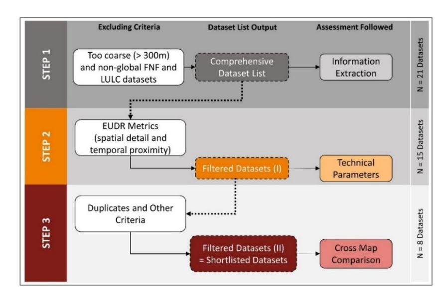
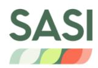
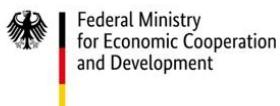
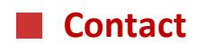

# **GEOS-EUDR – Technical and Policy Brief No.1**

# **Ensuring EUDR Compliance: Evaluating Global Forest Maps for Deforestation Monitoring**

**Freitas Beyer J., Kˆthke M., Lippe M.** 

# **Executive Summary**

The European Union Deforestation Regulation (EUDR) mandates that products derived from the commodities beef, cocoa, coffee, soy, timber, rubber, palm oil and their derivates must be deforestation-free after 31 December 2020. This regulation places new demands on both producers and regulators to prove and verify compliance using spatial data and maps.

This technical and policy brief draws on a **systematic review of 21 global forest tree cover datasets** and their assessment of applicability as EUDR-reference maps (Freitas Beyer et al. 2025)**1** . **Only eight datasets meet key spatial, temporal, and definitional criteria for EUDR compliance checks, and only two datasets matched all three EUDR forest definition criteria: canopy cover (≥10%), tree height (≥5m), and minimum mapping unit (≥0.5 ha).** The findings reveal significant over- and underestimation patterns, inconsistencies in forest definitions, and regional data limitations. The brief provides actionable recommendations for operators and competent authorities when applying map products for deforestation verification, and outlines key insights for decision and policy makers how to support deforestation monitoring.

The assessment of global forest and tree cover datasets reveals that **dataset selection matters immensely** for EUDR compliance. While Earth Observation maps offer powerful tools for monitoring, their limitations (especially regarding resolution, forest definitions, and regional suitability) must be carefully considered. This technical and policy brief underscores the **need for context-aware, multi-source verification approaches**, and **stronger coordination between data providers, map users such as operators, and regulators**.

# **Background of study**

The EUDR is part of the EU's Green Deal and Forest Strategy, and requires that commodities from Cattle, Cocoa, Coffee, Oil palm, Rubber, Timber, Soy and their derivates be "deforestation-free," meaning that no deforestation occurred in the production areas after 31 December 2020.

Verification under the EUDR relies on submitting due diligence statements that must include the geolocation of production plots, including a statement that the imported commodity or derived product is deforestation-free. Earth Observation data, such as global forest and tree cover maps may serve as primary reference tool in such a case, although many of these maps were not designed with legal compliance in mind. Such datasets differ widely in their spatial resolution, definition of forest, and capacity to distinguish between natural forests and plantations.

To address this gap, Freitas Beyer et al. (2025) evaluated 21 publicly available global datasets, examining their fitness for EUDR-related verification, by assessing their alignment with the EUDR's forest definition and reference year, as well as sufficiency of spatial resolution and accuracy (see **Figure 1** for methodological approach).

**1** Freitas Beyer, J., Kˆthke, M., & Lippe, M. (2025). *Assessing the Suitability of Available Global Forest Maps as Reference Tools for EUDR-Compliant Deforestation Monitoring*. Remote Sensing 17, 3012. DOI: 10.3390/rs17173012

**Figure 1. Schematic overview of the assessment process. Step 1 gathers all available global forest/non-forest (FNF) and land use/land cover (LULC) maps, resulting in 21 datasets. Steps 2 and 3 describe the assessments used to evaluate each dataset's suitability for the EUDR, including criteria applied to exclude unsuitable maps. Note: This study evaluated maps produced and published up to November 2024**

# **Key Findings**

**1. Only eight out of 21 global maps meet key spatial, temporal, and definitional criteria for EUDR compliance checks** (see **Figure 2** for references of the 8 maps).

**2. Only two datasets—***JRC GFC v2* 2 **and** *PALSAR-2 FNF*3 **, matched all three EUDR forest definition criteria:**  canopy cover (≥10%), tree height (≥5m), and minimum mapping unit (≥0.5 ha) (see **Figure 2** for more details).

# **3. Accuracy Bias and Misclassification Risks**

- **Overestimation Risk:** Most maps suggest a **tendency to classify non-forest areas as forest**, leading to **false positives (indicated by** a producer's accuracy**/** user accuracy **ratio > 1**4 **).**
- **Underestimation Risk:** Tree height maps potentially **exclude sparse or dry forests** (indicated by **negative mean bias errors)**.

# **4. Regional Variability in Map Estimates**

**C**ompared to FAO Forest Resource Assessment 2020 data**5** :

- **For Europe and North America,** forest areas are largely **overestimated** (up to +86%)
- **For Africa,** some datasets significantly **underestimate forests** (up to -38%).
- **For South America, more consistent** estimates exist, especially in dense forest zones, but a high risk of class confusion exists in tree-based systems, such as agroforestry, plantations and regenerating forests.

**2** Global Forest Cover map for year 2020 (GFC 2020) version 2 (Bourgoin et al. 2023, http://data.europa.eu/89h/e554d6fb-6340- 45d5-9309-332337e5bc26)

Global 25 m Resolution PALSAR-2 Forest/Non-Forest Map (FNF) Ver.2.0.0 (Shimada et al. 2014, DOI: 10.1016/j.rse.2014.04.014)

**4** For methotological details see Freitas-Beyer et al. 2025.

**5** https://www.fao.org/forest-resources-assessment/past-assessments/fra-2020/en/

### **5. Definition and Structural Challenges**

- None of the global maps assessed in this study fully meet the EUDR requirements in terms of definitions and accuracy.
- Forest definitions vary by country and dataset, introducing mismatches in classification thresholds.
- Almost all maps define plantations and agroforestry as forest, which may not align with the EUDR's regulatory scope.
- Datasets lack granularity to detect smallholder plots or mixed-use landscapes, critical for some commodities like cacao, coffee, or rubber.

| Dataset                                      | EUDR Metrics |                 |                   | Non-forest tree-based systems included in forest cover? | Accuracy Analysis          |                                       |
|----------------------------------------------|--------------|-----------------|-------------------|---------------------------------------------------------|----------------------------|---------------------------------------|
|                                              | Spatial      | Temporal        | Forest Definition |                                                         | Tendency                   |                                       |
|                                              |              |                 |                   |                                                         | Missing true deforestation | Increment in non-compliant production |
| JRC GFC v2 (Bourgoin et al. 2023)         | ●            | ●               | ●                 | Yes                                                     |                            | ✓                                     |
| ESRI-10m (Karra et al. 2021)              | ●            | ●               | ○                 | Yes                                                     | --                         | --                                    |
| Dynamic World (Brown et al. 2022)         | ●            | ●               | ○                 | Yes                                                     |                            | ✓                                     |
| GLC-FCS30D (Liu et al. 2020)              | ○            | ●               | ○                 | Yes                                                     |                            | ✓                                     |
| FROM-GLC10 (Gong et al. 2019)             | ●            | ●               | ○                 | Not explicitly reported                                 |                            | ✓                                     |
| Forest Extent-GLAD (Potapov et al. 2022)  | ○            | ●               | ●                 | Yes                                                     |                            | ✓                                     |
| PALSAR-2 FNF v2.0.0 (Shimada et al. 2014) | ●            | ●               | ●                 | Yes                                                     | --                         | --                                    |
| ETH-2020 (Lang et al. 2023)               | ●            | ●               | ●                 | Yes                                                     |                            | ✓                                     |
| ● Strong match                               |              | ● Partial match |                   | ○ Marginal match                                        |                            |                                       |

**Figure 2.** Overview of the eight shortlisted dataset, proving details on EUDR and accuracy metrics, complemented by additional qualitative insights. **Note:** Two datasets, *ESRI-10m* and *PALSAR-2 FNF v2.0.0* did not report all metrics; Strong Match indicates full alignment with optimum values (year = 2020, resolution ≤ 10 m, 3 parameters matched); Partial Match reflects moderate but not optimal alignment (year 2015–2020, resolution 10–30 m, 1–2 parameters matched); Marginal Match denotes very weak alignment (year = 2015, resolution = 30 m, no parameters matched).

**Access and further information on each shortlisted dataset can be found in:** 

<https://doi.org/10.3220/253-2025-90>

# **Recommendations for operators and competent authorities when applying map products for deforestation verification**

### **1. Use of Better-Fitting Map References**

- Using the eight shortlisted datasets rather than the twenty-one datasets reviewed is a more reliable way of ensuring compliance with EUDR terminology. However, **no single dataset fully meets all EUDR requirements on a global scale**, and all the assessed maps contain different levels of uncertainty. While some maps perform better than others, the eight shortlisted maps appear to be less suited for the context of Europe and North America, and some substantially underestimating forest areas in Africa.

### **2. Use Multiple Map Datasets**

- **Using a combination of Earth Observation maps** over a range of mapping themes (e.g., commodityspecific, forest type, crop type), with different spatial resolutions, data sources (e.g., optical and radar), and classification methods, supports cross-validation of deforestation-free claims more effectively.

#### **3. Promote Region-Specific Mapping**

- **It is not advisable to only rely on global map products but to double-check results with available local, national, or region-specific information**. This can minimize false positives and avoid false negatives. This is particularly important in data-poor regions where high-resolution reference maps incorporating locally validated forest definitions can provide a more reliable basis for verification.

# **Recommendations for policy and decision-makers**

# **1. Building Monitoring Capacity**

- **Supporting the EU member states' national competent authorities for EUDR enforcement with training and resources** to assess deforestation risks using Earth Observation tools. Promote sciencedriven, public-private collaborations for developing benchmarking methods and to support open access to high-quality geospatial data in standardized formats and through public repositories.

# **2. Harmonize Forest Definitions**

- **Foster international alignment on forest classification standards**, especially on thresholds for canopy cover, tree height, and minimum mapping unit. This would ease interoperability across datasets and between national and EU-level compliance systems.

# **3. Encourage Use of Time-Series and Alert Systems**

- **Incorporate dynamic monitoring products** (e.g., integrated deforestation alerts available on [https://www.globalforestwatch.org\)](https://www.globalforestwatch.org/) and **commodity-specific maps** to capture intra-annual forest change and plantation dynamics—important for verifying deforestation and forest degradation events.

Dr. Melvin Lippe, [melvin.lippe@thuenen.de](mailto:melvin.lippe@thuenen.de),  
Thünen Institute of Forestry | Hamburg | Germany  
[www.thuenen.de/en/geos-eudr](http://www.thuenen.de/en/geos-eudr)

#### **Suggested citation:**

Freitas Beyer, J., Kˆthke, M., & Lippe, M. (2025). GEOS-EUDR: Technical and Policy Brief No.1. Zenodo. <https://doi.org/10.5281/zenodo.17287552>

Johann Heinrich von Th¸nen-Institut Bundesallee 50 38116 Braunschweig Germany

www.thuenen.de

Text, Figures and Tables: ©2025 the author(s), Th¸nen Institute. This is an open access publication distributed under the terms and conditions of the Creative Commons Attribute on 4.0 International (CC BY 4.0) license [\(https://creativecommons.org/licenses/by/4.0/\)](https://creativecommons.org/licenses/by/4.0/).