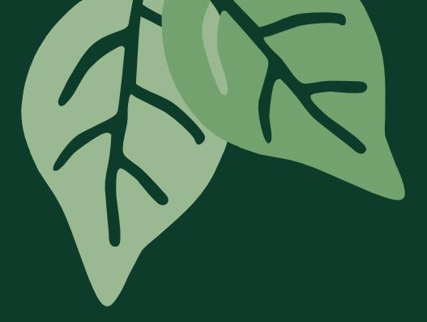

**Gender Equality and Social Inclusion (GESI) Sprint**

# **Practical Guide**

**An 18-month roadmap for embedding gender equality and social inclusion in International Cooperation Teams**

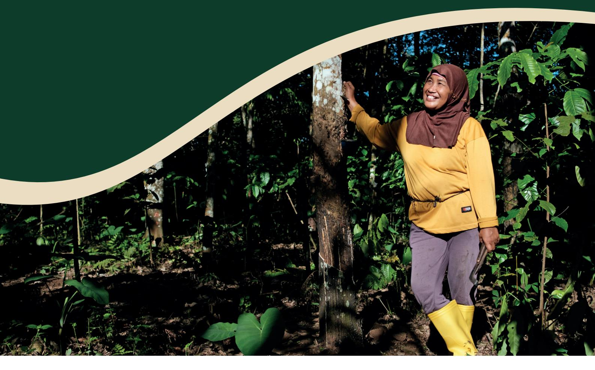

# Table of Contents

| Agency                | An individual 's or group's capacity for free will, freedom of choice, and in      |
|-----------------------|-------------------------------------------------------------------------------------|
| Deforestation-free    | No contribution to deforestation or forest degradation. Under the EUDR,             |
| Digital traceability  | In the context of the EUDR this refers to the technology-enabled ability to         |
|                       | trace a product 's journey from its origin to EU entry point, with geo-verified,    |
| EUDR                  | European Union Deforestation Regulation. A policy framework to address              |
|                       | and mitigate the environmental impacts of deforestation. It affects compa          |
| FPIC                  | Free, Prior, and Informed Consent                                                   |
| GESI                  | Gender Equality and Social Inclusion                                                |
| IEC Materials         | Tools and resources that provide information, education, and communication          |
| ILUA                  | Indigenous Land Use Agreement. An agreement about the use and manage               |
| MEL                   | Monitoring, Evaluation, and Learning                                                |
| Quadrants             | Quadrants of Change: Individual, Relationships, Culture, and Systems                |
| RBET                  | Reach-Benefit-Empower-Transform framework                                           |
| SAFE                  | Sustainable Agriculture for Forest Ecosystems, a project implemented by GIZ         |
| SME                   | Small and medium enterprise                                                         |
| Traceability          | The ability to trace a product 's journey from its origin, such as a farm or forest |
| Transformative change | The shift from one state into another fundamentally different state, in which       |
|                       | 1. Upstream operators – Commercial entities that first bring relevant products      |
|                       | 2. Downstream operators – Commercial entities that export relevant products         |
|                       | 3. Traders – Commercial entities that make relevant products and commodi           |

The Gender Equality and Social Inclusion (GESI) Sprint is a collaborative and 'competitive' initiative for development agencies, private sector companies, NGOs, and government bodies wanting to promote gender equality and social inclusion in their operations. The Sprint is designed as a mechanism for peer learning, amicable competition and practical innovation across project teams or business partnerships in a sector, a country, or between countries in a global programme.

Originally developed by the Sustainable Agriculture for Forest Ecosystems (SAFE) programme to tackle intersectional gender barriers in agricultural value chains, the GESI Sprint model is now available to other projects and businesses seeking to amplify their impact.

Participating teams join a 12- to 18-month process of analysis, design, implementation, and reflection to remove specific obstacles to gender equality

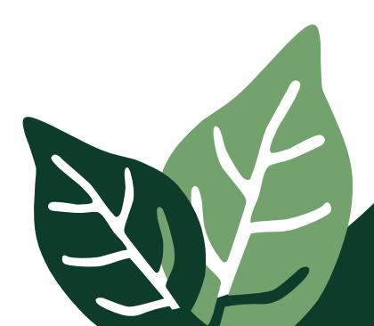

and social inclusion in their contexts. A GESI Sprint can be undertaken in the planning phase of a project or business to build inclusion into the foundation, or – as was the case in the SAFE programme – during the implementation phase of existing initiatives to reset strategies and address emerging barriers. The project or business must establish a coordinating unit to design and manage the GESI Sprint.

This guide provides clear steps, tools, and templates to launch a GESI Sprint, and support teams in advancing inclusion of key marginalised groups (e.g. women, youth, Indigenous peoples, and persons with disabilities) and contributing to transformative change.

# *'If you want to go fast, go alone. If you want to go far, go together.'*

# **Background**

The GESI Sprint was born out of a need to integrate gender equality and social inclusion more deeply into the Sustainable Agriculture for Forest Ecosystems (SAFE) programme, implemented by the Deutsche Gesellschaft für Internationale Zusammenarbeit (GIZ), and co-financed by the German Federal Ministry for Economic Cooperation and Development (BMZ), the European Union, and the Dutch Ministry of Foreign Affairs. The SAFE programme supports partner countries in transitioning to deforestation-free, sustainable, and just agricultural value chains for key commodities like cacao, coffee, soy, palm oil, natural rubber, wood, and livestock. While the programme had prioritised compliance with international regulations, such as the EU Deforestation Regulation (EUDR), sustainability standards and inclusive economic participation, it became clear that structural inequalities were hindering the full engagement of marginalised groups.

Despite their critical roles in agricultural production, ecological knowledge, and biodiversity stewardship, women and Indigenous peoples face persistent barriers. These include limited land tenure, restricted access to finance and digital tools, and exclusion from decision-making processes – challenges often compounded by intersecting factors such as ethnicity, age, disability, or caste. These barriers are further intensified by the EUDR, where strict traceability and legality requirements risk excluding the very groups most in need of support from value chains feeding into the EU market if targeted measures are not taken.

### **From data to reality: GESI barriers found in the SAFE project**

As the SAFE teams dug into their findings, the abstract concept of 'barriers' took on human faces and real-world consequences. They saw patterns emerge across different contexts:

Indigenous farmers who have been working the land for generations. Without land rights documentation, they cannot access credit and insurance, nor advance themselves.

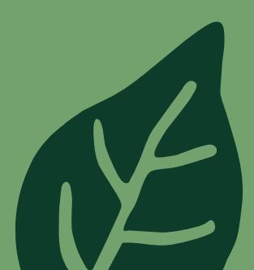

- *Non-participation in traceability systems* for EUDR compliance leaves marginalised groups invisible and their sustainable practices unrewarded. *places and cooperative meetings* prevents Indigenous women and other marginalised groups from representing themselves, remaining voiceless, and having their leadership stifled by culture or fear. are absent from leadership in cooperatives and local governance, leaving decisions about their own futures in the hands of others. **5**

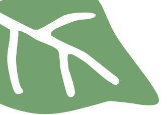

Exclusion carries a real cost by sidelining perspectives, skills, and knowledge that would strengthen the impact and sustainability of agricultural value chains.

A gender equality and social inclusion (GESI) lens is therefore essential to ensure that all people can participate in, contribute to, and benefit from development efforts. Integrated from design to evaluation, rather than treated as an afterthought, this approach lies at the core of the GESI Sprint.

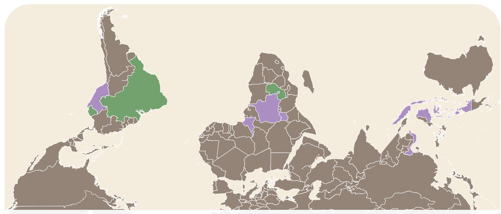

The GESI Sprint – originally designed as a 12-month accelerator to operationalise this vision – ultimately expanded into a two-year initiative. This made it possible for nine country teams in Latin America, Africa, and Southeast Asia to collaboratively develop and implement context-specific, GESI-transformative solutions that not only strengthen inclusion and support EUDR compliance but advance equitable, profitable, and deforestation-free value chains. This experience yielded critical insights into how to operationalise a GESI Sprint and accelerate gender equality and social inclusion across projects and programmes.

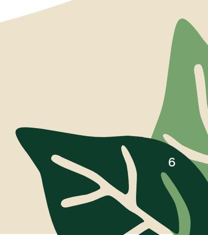

**Figure 1: As of August 2026, SAFE Country Teams (green) have concluded their GESI sprint activities, the rest (violet) is still ongoing.**

*The positions of the southern and northern hemisphere are changed on this map to encourage a change in perspectives and to counteract potential biases in world views.*

# **Part 1: Practical Guide to a GESI Sprint**

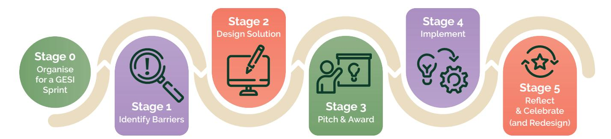

**Figure 2: Stages of a GESI Sprint**

The GESI Sprint uses six stages to help teams identify barriers to inclusion, design real solutions and learn from the process. This ensures the results are innovative and fit the lives of the people they are meant to help. A quick reference roadmap is provided in Resource 1.

**Stage 0: Organise for a GESI Sprint.** A dedicated Sprint Coordination Unit is established that defines the project's timelines, budgets, and guidelines, along with the recruitment of GESI coaches and the identification of focal points.

**Stage 1: Identify Barriers.** Teams begin by conducting a thorough intersectional analysis to pinpoint the specific structural, cultural, and systemic obstacles preventing marginalised groups from fully participating in value chains.

**Stage 2: Design Solution.** Leveraging these insights, teams co-create context-specific, gender-transformative interventions that directly address the identified barriers. Local stakeholders are partners in the design process.

**Stage 3: Pitch & Award.** Proposed solutions are presented to a review panel for rigorous assessment, where the most promising, feasible, and impactful concepts are selected to receive funding and mentorship.

**Stage 4: Implement.** Selected teams execute their solutions, utilising the Sprint's coaching support to navigate challenges, adapt to local dynamics, and drive measurable change. Monitoring and evaluation are key here to ensure impact can be illustrated.

**Stage 5: Reflect & Celebrate (and Redesign).** The process concludes with a critical evaluation of outcomes and lessons learned, celebrating successes while identifying areas for refinement to ensure long-term sustainability and scalability.

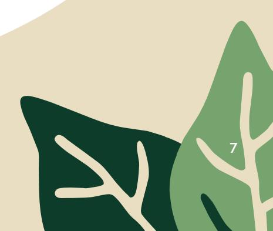

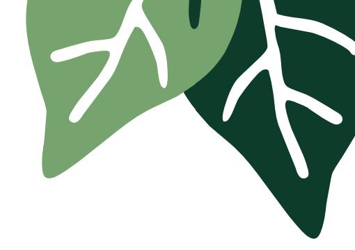

**Table 1: Terms of reference for actors in a GESI Sprint**

| ACTOR                    | PURPOSE                                                               |
|--------------------------|-----------------------------------------------------------------------|
| Sprint Coordination Unit | Provides strategic and administrative guidance, and consistent GESI   |
| Sprint focal point       | The internal champion of the GESI Sprint in the participating team.   |
| Project team             | Leads problem identification, innovation design, and implementation   |
| Implementing partners    | Brings field expertise, community relationships, and implementation   |
| Review panel             | Ensures quality and transparency. The panel may consist of the Sprint |

## **Stage 0: Organising for a GESI Sprint**

*Deliverable: The establishment of a Sprint Coordination Unit and the announcement of a call for team submissions.*

Successful design planning begins before country teams are engaged, requiring high-level leadership commitment and the establishment of a dedicated Sprint Coordination Unit to define timelines, budgets, and guidelines. Key preparatory steps include recruiting GESI coaches, identifying Sprint focal points, and finalising documentation to ensure teams have immediate access to expert support and resources.

The Sprint can be framed as a competitive GESI fund, where teams apply for grants or other incentives through a live pitch or formal submission. This competitive element drives enthusiasm and momentum, while coaching remains a critical support mechanism to ensure applicants stay focused and accountable.

### *GESI Sprint Teams*

The Sprint is a multi-actor initiative working across projects, sectors, and/or countries. This requires focused planning and coordination, and a clear division of responsibilities. Roles, purposes, and tasks for each key actor are outlined in Table 1 and detailed in Resource 1. Careful organisation and coordination are key to effective implementation and accountability.

As soon as the Sprint Coordination Unit is in place, it announces a call for submissions for the GESI Sprint through the communication channels of the participating projects, sector, or global programme. Once staff have identified an issue that blocks gender and social inclusion in their context, they will engage one or more relevant partner organisations to form a Sprint team. The deadline for entries and the date of awards will be stipulated.

Eligibility and entry requirements:

- Each team should comprise project staff and representatives from one or more partner organisations.
- Participants may only join one team.
- Teams will elect a team lead who will act as a GESI focal point with the organisers.

### *Checklist for Success*

To ensure the Sprint delivers real change, teams must secure these five foundational elements:

#### **1. Shared Understanding & Commitment**

 GESI literacy: Every member understands *why* gender and inclusion add value and can analyse interventions through an intersectional lens. Resource allocation: Clearly define dedicated time, effort, and budget. Ensure the Sprint remains a priority amidst other workloads.

#### **2. Strategic Integration & Scope**

 Mainstreaming: Embed the Sprint into the core workplan and budget, not as an optional 'addon' or limited to simple indicators. Realistic goals: Define a focused, achievable objective that can be tested within the Sprint timeframe.

#### **3. Leadership & Collaboration**

 Visible backing: Secure active endorsement from leadership to legitimise the work and protect resources. Stakeholder outreach: Communicate the GESI Sprint initiative early and widely to both internal and external actors, and their anticipated roles in the Sprint. Synergistic teamwork: Foster shared ownership where diverse perspectives are valued and collaboration is the norm.

#### **4. Context & Adaptability**

 Stakeholder engagement: Involve target groups early to ground interventions in local reality. Note: Allow sufÏcient time for challenging

deep-seated social norms.

Iterative learning: Build in regular reflection

points to assess progress and adapt strategies

quickly.

#### **5. Operational EfÏciency & Scaling**

 Clear partnerships: Establish efÏcient cooperation modalities (especially with non-traditional partners) to minimise administrative delays. Maintain open communication to resolve challenges swiftly. Knowledge management: Systematically document lessons and patterns to enable scaling and adaptation across other contexts, from local to global.

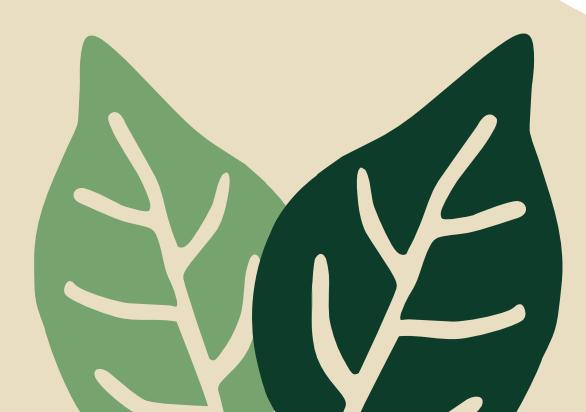

## **Stage 1: Identify the GESI Barrier**

*Deliverable: A clearly defined GESI issue that can be realistically addressed within 12–18 months, based on a focused context analysis and a baseline.*

### *Purpose & Objectives*

The purpose of this phase is to align all participating teams on the vision, approach, and expectations of the Sprint, while building understanding of GESI principles and fostering early collaboration across projects and/or countries. It establishes the foundation for effective engagement, ownership, and coordinated action throughout the Sprint. In this stage, teams will identify GESI barriers that could be addressed in the subsequent design phase. This ensures that the subsequent solution design is rooted in a clear, evidence-based understanding of the (structural) GESI challenges they aim to transform. Once the review panel has approved the issue, teams proceed to Stage 2.

#### *Process*

#### *Kick-Off: Preparing for Take-Off*

A kick-off session will be held to brief the Sprint teams on purpose and process, provide relevant information, and align expectations. If feasible, teams will be supported by coaches with gender expertise. These coaches will help foster ownership and adaptability, guiding teams toward concrete action. In the case of the SAFE project, one GESI coach (from Korumo) was assigned to each country, offering individual coaching sessions and supporting them in the development and implementation of their GESI Sprint activity.

#### *Identify the GESI Barrier*

Each team will identify critical GESI issues from key documents on gender and intersectionality, discuss their ideas for the GESI Sprint, and select the idea with the highest leverage for gender-transformative change in their project or business. This means that the issue or problem must be:

- Clear: No vague notions define the challenge sharply.
- Evidence-backed: Ground it in data from your own assessments, not assumptions.
- Transformative: Potential for shifting power dynamics.
- Root-focused: Contribute to tackling deep-seated causes.
- Actionable: Something you can meaningfully address within the Sprint's 12- to 18-month window.
- Reflection: Moments of reflection are important throughout the process. If coaches are appointed to support your team, they serve as guides to probe a bit deeper. In this stage important questions are:
  - Is this really the bottleneck?
  - If we fix this, what else unlocks?

### **Integrating a GESI lens in the SAFE project from the start**

**Team Peru** found that integrating a GESI lens from the initial diagnosis and design stage was essential – both to identify structural barriers the project could address and to ensure objectives responded to target groups' needs. Such an approach goes beyond fulfilling symbolic quotas, adding structural value and purposeful changes that improve the project's outcomes.

**Uganda** learned that it's important to integrate a GESI lens in the design phase of a project to account for the extra budget that might come with it and set meaningful indicators for inclusion and equity. Integration of GESI will lead to more equitable access to training and inputs, more inclusive decision-making at the household level, and improved sustainability of outcomes. It helped the Uganda team to identify activities that do not add to the burden on women, and to integrate GESI into all their SAFE activities.

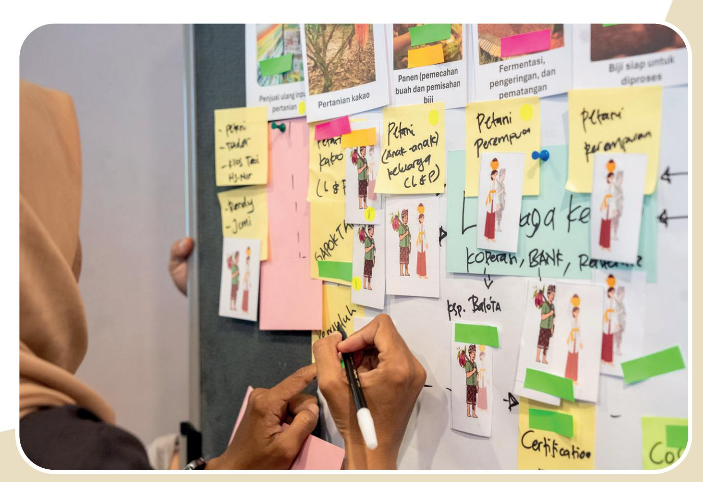

#### *From Barrier to Basis: Deepening Your Analysis*

Once you have identified your high-leverage barrier, you have your solution direction. The next step is to apply methods and tools to dive deeper into understanding the root causes, ensuring you have a solid basis for designing an effective solution. Think of these not as rigid checklists, but as lenses that help you see the problem clearly and map the path forward.

To choose your tool, ask your team: Which tools will give us the clearest picture of the root cause we have identified?

- Is it a process issue? Try Value Chain Mapping.
- Is it a power issue? Try Intersectional Analysis.
- Is it a technical barrier? Try SME Readiness Scan.

The best solution comes from the tool that fits the problem, not the other way around. Below are some analytical tools, followed by real-world examples of how teams have applied them to drive change.

#### **A. Problem Tree**

*What it is:* A visual exercise where you place the core problem in the centre (the trunk), list the causes below (roots), and the effects above (branches).

*How to use it:* Gather your team and stakeholders. Write the barrier on a card. Ask "Why does this happen?" repeatedly to dig down to the roots. Then ask "What happens because of this?" to map the effects.

*Goal:* Ensure you are targeting the *root* (e.g., lack of legal literacy) rather than just a symptom (e.g., women not signing contracts).

#### **B. Value Chain Mapping**

*What it is:* A diagram that traces the journey of a commodity from production to consumption, highlighting every actor, transaction, and value addition point.

*How to use it:* Map out who does what, who gets paid what, and where decisions are made. Overlay gender and social inclusion data: Where are women excluded? Where do Indigenous groups lose value?

*Goal:* Pinpoint exactly where in the chain the exclusion happens (e.g., at the collection point, during processing, or at the export stage).

#### **C. Intersectionality Lens**

*What it is:* A framework to analyse how overlapping identities (gender, ethnicity, age, disability, caste) create unique modes of discrimination or privilege.

*How to use it:* Instead of looking at 'women' as a monolith, break the data down. How does the experience of an elderly Indigenous woman differ from a young non-Indigenous woman?

*Goal:* Ensure your solution doesn't accidentally benefit the most privileged within a marginalised group while leaving the most vulnerable behind.

**Figure 4: Intersectionality wheel**

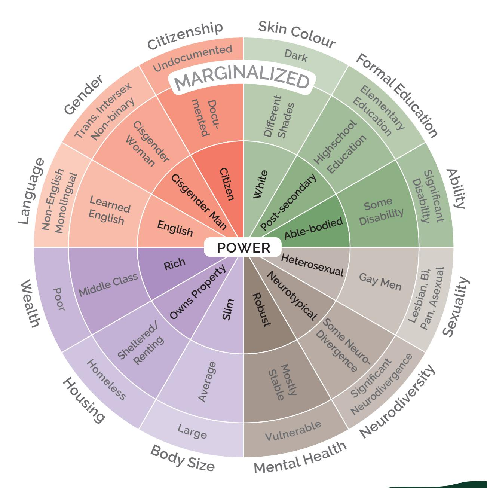

#### **D. SME Readiness Scan**

*What it is:* A diagnostic tool designed to evaluate a small- and medium-sized enterprise's overall capacity to adapt to new market demands, regulatory changes, or sustainability standards, while maintaining inclusive practices.

*How to use it:* Teams conduct a comprehensive audit of the business's technical infrastructure, financial health, and social management systems to identify specific bottlenecks, such as a lack of digital skills or insufÏcient capital for necessary upgrades.

*Goal:* Pinpoint these capacity gaps so they can be addressed, ensuring that local businesses remain competitive and capable of supporting marginalised producers rather than excluding them due to an inability to meet evolving requirements.

**≥ 150 Woman Plantation Owners**

**3**

**Sud-Districts in Lampung Tengah and Peshawaran**

#### **EUDR-Associated Challenges Are Disproportionally Affecting Women**

**Tenural Legality Credit and Resources Physical Demands**

**Traceability Capacity Building Negotiation**

**Applicable to All**

**Worse for Women**

### **Figure 5: The gender gap in Lampung's rubber sector (Indonesia)**

Here is how SAFE teams in different countries have used some of these tools to spark specific, transformative actions:

### **Real-World Applications: From Analysis to Impact**

#### **Problem Statement**

#### **The gender gap in Lampung's rubber sector (Indonesia)**

In Indonesia's Lampung region, the SAFE team uncovered a critical gender divide: despite managing rubber plantations, women face systemic barriers, such as limited awareness of land

tenure rights and restrictive norms that hinder EUDR compliance and economic empowerment. As illustrated in the accompanying visual, the data reveals that while men prioritise capital and training, women need supportive tools and female extension agents. Although women often initiate collection businesses, they lose control when operations grow because land titles and business ownership are predominantly in the hands of men. The gender gap is also evident in loan access (23.9% men vs. 17.7% women) and in the heavier workload carried by women, which undermines their bargaining power in both the household and the market.

#### **Documenting the land tenure gap for Zambian women**

Before the Sprint, the SAFE Zambia team documented a stark reality: despite cultivating soy across four chiefdoms, fewer than 10% of women held formal land titles, leaving them legally invisible and economically vulnerable. The baseline revealed that restrictive social norms and undefined boundaries prevented women from securing tenure, which directly blocks EUDR compliance.

#### **Equipping Amazonian youth and women with geospatial skills for EUDR compliance in Ecuador**

In Ecuador's Amazon region, producer organisations face growing pressure to provide reliable geolocation data and traceability information to meet EUDR requirements. However, limited access to technical skills, digital tools, and specialised support can make compliance challenging, especially for smallholder organisations. At the same time, women and youth are often underrepresented in technical roles linked to mapping, data collection, and sustainability management. To address these gaps, the SAFE Ecuador team supported targeted capacity building on geospatial tools, enabling Amazonian youth and women to map farm plots, collect geodata, and contribute directly to deforestation-free value chains.

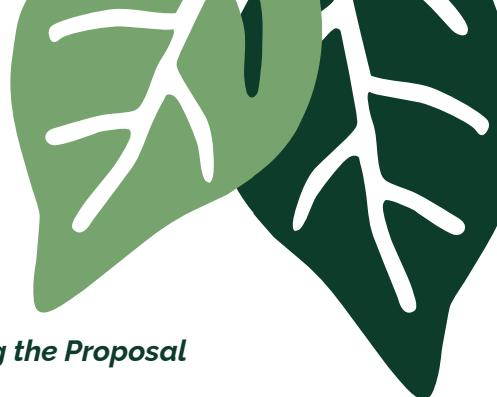

## **Stage 2: Develop a Solution**

*Deliverable: A focused 4-page GESI Sprint proposal.*

### *Purpose & Objectives*

In this phase, teams transition from analysis to action by co-creating a focused, 4-page GESI Sprint proposal (see proposal template Annex 1). Working closely with partners – and optionally engaging coaches and external experts – teams must design a highest-leverage intervention that removes a specific GESI barrier while amplifying the agency of women and Indigenous peoples. The solution should be a high impact action that fits realistically within the Sprint timeline, focusing on achievable short-term outputs that serve as stepping stones toward long-term transformation. Upon approval of the proposal, successful teams advance to Stage 3.

#### **The power of practical solutions**

**Ecuador:** When tools and training are designed around people's daily realities, they become easier to adopt, more relevant, and more likely to generate lasting change. In this case, strengthening geospatial skills among Amazonian youth and women was not only a technical response to EUDR requirements, but a practical way to build local ownership, reduce dependence on external support, and make compliance more inclusive and sustainable.

**Brazil:** When practical solutions are grounded nities, they become more accessible, relevant, and sustainable over time. In this case, capacity-building for women's leadership in cocoa and livestock value chains, peer learning exchanges, and the integration of gender perspectives into local governance spaces were not just conceptual approaches, but concrete responses to locally identified challenges. By building on existing knowledge, strengthening local networks, and creating spaces for dialogue between communities and policy actors, these actions contributed to greater ownership, more inclusive participation, and increased potential for lasting impact.

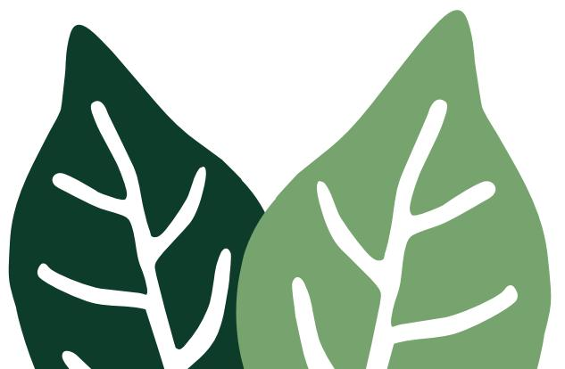

#### *Process: Developing the Proposal*

#### *Quadrants of Change*

The proposal must be built on a solid foundation of GESI analysis, explicitly linking the problem to national and sub-national strategies, and demonstrating how it builds upon existing work to avoid duplicating efforts or creating dependency on the project team lead. The core of the narrative is the implementation strategy, which must strategically span at least two of the four Quadrants of Change: Individual, Relationships, Culture, and Structures & Systems. (Read Annex 1 for more analytical frameworks.)

*"I was aware that GESI was an important part of our work to focus on. The tools and frameworks introduced have enabled me to engage and determine how to work with GESI activities."* 

– M&E Advisor & GESI Sprint focal point (Vietnam)

Figure 6 on the next page illustrates how the DR Congo team planned using the Quadrants of Change:

#### *Instruments and Resources to Be Used*

Teams must specify the instruments to be used (e.g., grants, service contracts, local subsidies, inkind contributions) and define the roles of partners, ensuring they have ownership from the start to guarantee sustainability. The proposal concludes with a MEL framework that outlines expected results, specific indicators, methods for gathering evidence of change, and a proactive plan for risk mitigation (see proposal template Annex 1).

**Figure 6: Example of the quadrants by the SAFE Team DRC** 

**Leadership Strengthening**

**of coffee cooperatives on leadership and self-confidence (active participation in** 

**decision-making)**

**Easing Cultural Barriers**

**• Agricultural land use rights training**

**• Knowledge-sharing and discussion forums on the socio-cultural values of the Bantu and Batwa ethnic groups in relation to the preservation of the PNKB national park**

**Support services for the SAFE project and partners**

**cooperative of women coffee producers** 

**around PNKB national park**

**preservation into the revival of the South** 

#### **Technical and managerial capacity building**

 **- self-management of coffee seedling production nurseries and treatment techniques between nursery women and partner cooperatives committed to preserving the PNKB's national park forest ecosystem of the (seedling sales contract)**

**Culture**

 **Individual**

**Relationships**

**Systems & Structures**

#### *Monitoring, Evaluation and Learning*

*"The GESI Sprint monitoring and evaluation enabled a deeper sense of tracking progress from design through implementation with the set of GESI indicators provided."* 

– M&E Advisor and GESI focal point (Vietnam)

Monitoring, evaluation and learning (MEL) must be embedded in the design of a GESI solution from the very start rather than added as an afterthought. Once the barrier is identified, teams define tangible change achievable within a year and establish a clear baseline using existing studies, assessments, and/or mapping. By selecting key indicators early, progress can be tracked systematically, and impact documented through a mix of quantitative data, qualitative feedback, and visual evidence like photos and testimonials. Such a proactive MEL approach ensures that the solution's success will be visible, measurable, and grounded in real-world evidence of transformation. Questions that can guide this process once the issue is identified are:

- What is the change that you can realise within a year through implementation?
- What key indicators will help to guide you to track progress towards the intended change?
- How will you track and document these changes?

Team Ecuador's recommendation underlines this point:

*"Make impact visible by defining indicators and a baseline from the beginning and then collecting evidence throughout implementation. Use data, feedback, photos, testimonials, and before/after examples to show what changed and why it matters."* 

For more information read Part 2 – Framework Monitoring, Evaluation and Learning (MEL)

#### *Review Criteria*

Reviewers will evaluate proposals based on seven key criteria:

- 1. Problem definition: Clarity of the barrier and rationale for selection.
- 2. Solution framing: Soundness and uniqueness of the proposed intervention.
- 3. GESI logic and strategy: Depth of the strategy across the four quadrants.

#### **Unlocking EUDR compliance by securing women's land tenure in Zambia**

The SAFE Zambia team identified that women in the soy value chain face severe barriers to land tenure security, lacking legal recognition of their rights, which hinders EUDR compliance and economic empowerment. Their analysis, which relied on a previously conducted gender-based analysis, revealed that while women prioritise land access, they are often excluded from ownership due to restrictive social norms and unclear boundaries. To address this, they propose a dual-pronged solution: launching

a social norms campaign in partnership with traditional leaders to shift cultural attitudes and implementing a technical land documentation process using GIS mapping to issue customary land certificates to at least 50 women per chiefdom, thereby securing their tenure and enabling market inclusion. Due to the cultural norms that are entrenched in these societies, the team is also prioritising joint ownership between husband and wife, in cases where individual women's ownership is not possible.

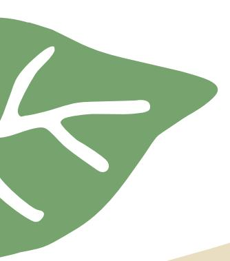

- 4. Feasibility: Realistic execution within the 12 to 18-month window.
- 5. Value proposition: Compelling argument for why this solution matters.
- 6. Impact potential: Evidence of transformative change.
- 7. Team readiness: Expertise, motivation, and preparedness to pitch.

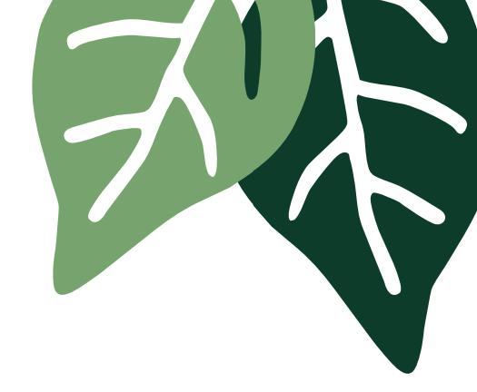

## **Stage 3: Pitching the Solution**

*Deliverable: A concise pitch of the country-specific solution clearly articulating a clear value proposition for transforming identified GESI barriers.*

### *Purpose & Objectives*

In this stage, teams transform their written proposals into a concise, 5-minute pitch that articulates a compelling business case for their GESI initiative. The goal is to bring the Sprint to life, stimulating reflection, deepening learning, and fostering networking by inviting external stakeholders and partners to the event. Successful pitches lead to approval and the transition to Stage 4: Implementation.

#### *Process*

#### *Preparing the Pitch*

A winning pitch must tell a clear, evidence-based story that flows from Problem -> Solution -> Impact. It should also:

- Clearly demonstrate how the solution advances gender equality and social inclusion.
- Centre the priorities and perspectives of marginalised actors (e.g. women, Indigenous peoples) rather than just speaking *about* them.
- Show that the team has the capacity, motivation, and a feasible strategy to execute their plan.

#### *Format & Pitch Delivery*

- Time limit: Strictly 5 minutes.
- Visuals: Slides or other engaging visuals are strongly encouraged to support the narrative.
- Speakers: At least one team member must present, ideally someone who can authentically convey the team's passion and expertise.

#### *Review & Approval*

The review panel will assess pitches based on:

- Soundness & relevance: Is the solution wellframed and contextually appropriate?
- Viability: Is the intervention strategy realistic and clear?
- Team Capacity: Does the team demonstrate expertise and readiness?
- GESI Transformative Potential: Does the solution promise genuine, lasting change?

#### *Learning & Incentives: From Pitch to Lasting Impact*

To maximise the Sprint's impact, the pitch event could incorporate a structured peer-review process, where teams provide constructive feedback to one another, fostering a culture of accountability and shared learning alongside the Sprint Coordination Unit.

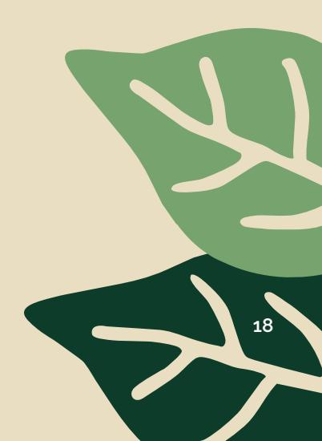

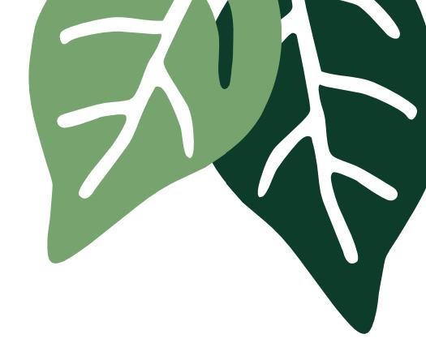

## **Stage 4: Implementing the Solution**

*Deliverable: A comprehensive 6–9-month GESI Sprint Implementation Plan that translates the approved proposal into a structured roadmap of outcomes, outputs, activities, and timelines.*

#### *Purpose & Objectives*

The objective of this phase is to ensure adequate implementation and robust MEL. Teams move from planning to action, executing their intervention within a dedicated 6- to 9-month window. During this period, the GESI Sprint Coordination Unit and, if available, GESI coaches shift to a strategic support role, helping teams navigate operational hurdles, secure expert advice, and maintain momentum while rigorously tracking progress and documenting evidence of change.

#### *Process*

#### *Workplans & Budgeting: The Operational Blueprint*

Success hinges on a co-created operational plan developed in close partnership with local actors. This document must be granular and actionable:

- Structure: Align all activities with defined output indicators that directly feed into the project's targets.
- Clarity: Clearly assign responsibilities and map out budget line-items, specifying exactly who receives funds and for what purpose.
- Navigating procurement: Acknowledge that organisational tender processes can be lengthy. Teams must build this lead-time into their schedules, perhaps by initiating parallel preparatory activities (e.g., community mobilisation, baseline data collection) while waiting for formal contracts to be signed.
- Scheduling: Create a realistic timeline that synchronises coaching sessions, expert support visits, and partner activities to avoid bottlenecks.

#### *Implementing with a GESI Lens*

Execution must adhere to standards of inclusion and ethics:

- Inclusive facilitation: Ensure all meetings and training are accessible and welcoming to marginalised groups.
- Safeguarding: Strictly apply 'Do No Harm' guidelines to protect participants from unintended negative consequences.
- Ethical engagement: Provide fair compensation for community time and expertise, particularly when working with Indigenous and local populations.
- Free, Prior, and Informed Consent (FPIC): When working with Indigenous peoples, FPIC is a mandatory prerequisite for all activities.

#### *Adaptability*

The GESI Sprint demands adaptability to navigate unforeseen crises, as rigid plans often falter when confronted with reality. Whether facing armed conflict in the DRC that forced a pivot to safer host areas, bureaucratic delays in Vietnam that were turned into strategic preparation time, or internal system changes and stafÏng gaps in Brazil, the ability to recalibrate is crucial. Throughout these shifts, continuous documentation of progress and the integration of MEL to capture lessons from the disruption itself are vital. Resilience does not lie in avoiding disruption, but in flexibly adjusting timelines, repurposing resources, and maintaining momentum even when the original path is blocked.

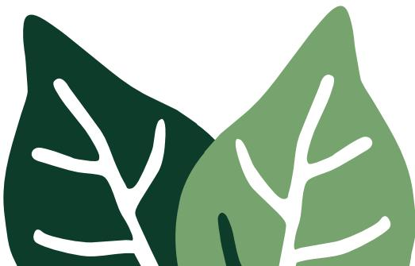

#### *Documentation & Accountability*

Transparency is key to learning and adaptation. Teams must maintain sound records:

- Monthly check-ins: Regular progress reviews with coaches (or, if coaches are not in place, the GESI Sprint Coordination Unit) to address challenges early.
- Activity notes: Detailed logs of what happened, who participated, and what was learned.
- Budget tracking: Real-time monitoring of expenditures against the plan to ensure financial integrity.

#### **SAFE's adaptive journey: Pivoting through crises**

#### **Tips for the implementation phase**

**Democratic Republic of the Congo (DRC)**  The women's groups were structured successfully. Unfortunately, armed conflict in late 2024 led to the displacement of populations to areas less affected by violence. The encouraging surprise was the resilience of the women's association, which persisted in requesting the project's continuation despite the fragile security context. Considering this resilience, the SAFE project has given its approval to a rapid appraisal of the coffee seedling market in the host areas. Thus, two local grant applications have been submitted and are awaiting funding from GIZ. In the same vein, other GIZ projects in the DRC are interested and are already benefiting from SAFE's support in the form of peer learning. Although the war has slowed down the GESI Sprint's implementation in the DRC, it has helped spread the GESI idea.

#### **Vietnam**

The Vietnamese government's approval of the project was delayed by about one year. The team used the period strategically to initiate preliminary GESI studies and further strengthen the GESI Sprint operational plan through the integration of GESI activities into SAFE work packages and the broader implementation plan. This preparatory process helped lay the groundwork for the systematic integration of GESI considerations into project implementation from the outset.

#### **Brazil**

Early in the project, the consultant withdrew from the project, necessitating a new contracting process that delayed progress and disrupted the initial momentum. The transition led to demobilisation, and a gap of approximately 10-12 weeks weakened energy and team cohesion. As the second consultant could only engage online, the original level of connection and momentum was not fully restored.

ginning to ensure ownership, continuity, and integration of the new skills into their internal processes. (Ecuador) GESI Sprint with the bigger, more general activities under the SAFE project, ensuring close communication with other partners working lenges associated with traditional leaders on customary land issues and the overall conrealistic. (Zambia) organisations to convene multi-stakeholder support. Providing local partners with a clear methodology for collective policymaking empowers them to coordinate technical contributions and secure commitments from multiple cooperation agencies effectively. (Peru) GESI into Inclusive Business Partnership models are important to strengthen equitable participation, access to opportunities, and benefit-sharing among different groups within the supply chain, while contributing to more sustainable and responsible business practices. (Vietnam)

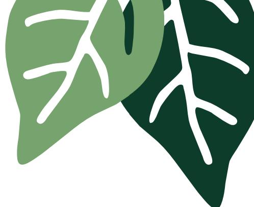

## **Stage 5: Reflect & Celebrate (& Redesign)**

*Deliverable: Sharing of success stories and lessons learned among GESI Sprint teams and even the wider public.*

### *Purpose & Objectives*

The final stage of the GESI Sprint is a moment for consolidation and inspiration, to celebrate successes and ignite a movement for GESI integration across the wider network. This is forged from joint process documentation, consolidated lessons learned, and the critical insights captured in coaches' reflection reports (see Reporting below).

#### *Process*

#### *Closing Meeting*

During the closing meeting, coaches and teams come together to review the journey, asking the hard questions:

- ●What changed and why?
- What fell short?
- What did we learn about the intersection of GESI and our project?

The goal is to capture tangible evidence of shifts in agency, voice, access, social norms, and structures, while honestly documenting challenges and unexpected lessons.

#### *Reporting*

Coaches can play a key role by drafting a reflection report that summarises the intervention strategy, key achievements, and the specific barriers and enablers encountered. They provide evidence of transformative change and offer concrete recommendations for scaling or replicating the model.

### **Reasons to celebrate in SAFE**

**In Ecuador, the team** celebrated the leadership, commitment, and rapid learning of Amazonian youth and women who took on a technical role in supporting their organisations' EUDR readiness. It was especially meaningful to see participants gaining confidence in the use of geospatial tools and recognising that they can generate and manage key information themselves. They also celebrated the fact that compliance can become an opportunity to strengthen local capacities, promote inclusion, and give greater visibility to women and youth in deforestation-free value chains.

**In Peru, the team** celebrated the evolution of their role with APPCACAO, from project-based contributor to strategic technical partner. The team's methodological support for the national gender equality policy proved pivotal, leading them from facilitating a single regional workshop to joining the national drafting and validation team. This trust solidified further in 2026 as they

now lead the methodological design for the policy's implementation roadmap across member cooperatives and co-design the structural modules for the Virtual Integrated Capacity Development Programme. Overall, they celebrated being recognised as a trusted advisor that provides the methodological framework for APPCACAO to lead and successfully mobilise resources from other national and international partners.

**Vietnam:** Although GESI implementation is still at an early stage in Vietnam, this process has already fostered stronger cross-functional alignment between technical and social dimensions of the programme. It has helped create a shared understanding of how GESI can be operationalised within sector-specific workstreams, rather than being treated as a separate thematic add-on. This has also contributed to more deliberate planning for learning, reflection, and evidence generation on how GESI influences implementation processes and outcomes.

# **Part 2: Monitoring, Evaluation, and Learning (MEL)**

# *'Start with the end in mind.'*

**Figure 7: Monitoring, Evaluation & Learning Framework**

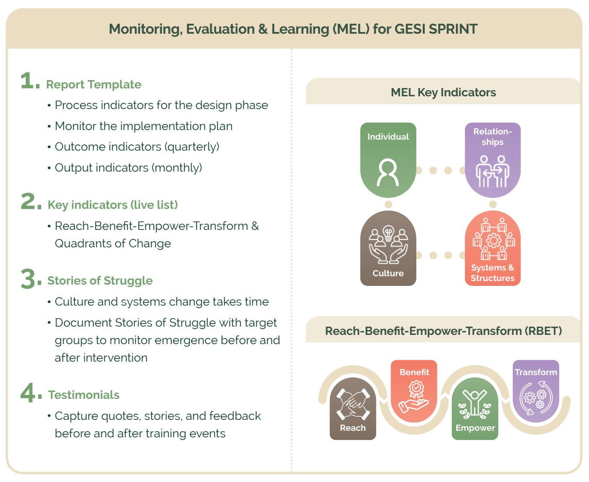

Transformative change takes time to manifest. It unfolds gradually, necessitating that Monitoring, Evaluation, and Learning (MEL) be embedded throughout any GESI initiative, including any GESI Sprint. The MEL framework (Figure 7) is designed with this in mind. Tools and templates are provided to support teams in documenting experiences, observations, and setbacks, and making adaptations where needed. In each stage of the process, teams must search for evidence that change, however small, is happening. Also, since our best learning comes from challenges, rather than mere successes, teams are encouraged to document their struggles, breakthrough moments, and achievements.

*While Stories of Change often showcase successes, Stories of Struggle are equally vital. They acknowledge the challenges faced during implementation and highlight how setbacks became opportunities for growth. These stories serve to:*

- *• Highlight resilience, to keep going amidst emerging setbacks*
- *• Openness, promote transparency and adaptability*

#### *Stories Of Struggle*

#### **Establish baseline.**

Before implementation, teams must establish a baseline using existing studies, assessments, or mapping to quantify the starting point of the identified GESI barrier. From there, the framework guides teams to draw from a comprehensive set of GESI Sprint Indicators (Annex 4) and select a limited number (4 to 6 maximum) of high-impact indicators that *track progress across at least two domains of change and measure empowerment and transformation rather than mere reach.*

#### **Capturing transformative change.**

When it comes to capturing transformative change, it is important to find evidence of tangible shifts in agency, voice, access, and/or decision-making. It can be useful to document milestones such as:

- *Agency and access:* Women receiving formal land ownership documentation or marginalised producers successfully joining project-supported systems.
- *Voice and representation:* Women and minorities elected to cooperative leadership or decision-making bodies within the project scope.

- *Norms and systems:* Observable shifts toward shared decision-making within households or policy changes that support inclusive project goals.
- *Project readiness:* Improved capacity of the supply chain or community structures to meet project standards through inclusive practices.

#### **Learning approach.**

Since implementation is seldom a linear process, a GESI Sprint applies *a learning approach:* regularly monitoring challenges and adjusting activities throughout the implementation process. The reporting cycle, internal project team meetings, and inter-country learning events provide moments to reflect, identify and implement relevant changes.

#### **Risk management.**

Risks are integral to initiatives driving transformative change. To identify and address emerging bottlenecks and risks in a timely fashion, regular reflection sessions need to be included in project team meetings and learning events. This enables the team to use insights and emerging lessons to adapt the project plan, strategies, and approaches to re-align with the anticipated outcomes and impact. To do this, meetings should dedicate time to track project progress and outcomes. Guiding questions can be:

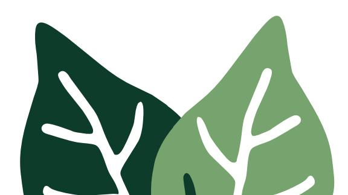

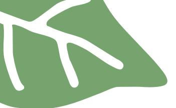

#### **When Plans Meet Traditions and Logistics**

The SAFE Team Zambia faced two major challenges. First, a female chief who initially agreed to issue land titles to women, withdrew her support after facing strong pressure from male leaders and community traditions that view land ownership as a means that may undermine the authority of the traditional male leaders. Secondly, the chosen villages did not match the areas where private companies operated, making it hard to connect farmers to markets. To solve these issues, the team secured contract extensions. This gave them the time needed to adjust their plan, engage more deeply with the community to address traditional barriers and deeply entrenched norms, and align their work with the right market partners.

- 1. What went well?
- 2. What should be done differently?
- 3. What needs to stop or requires immediate action, and by whom?

It is good practice to monitor risks and consider possible mitigation or response measures, especially for foreseeable risks, so that more unexpected complexities can be handled whenever those arise. Review of risks, whether anticipated or not, should be carried out regularly. To make sure these endeavours are valuable, make sure to communicate with relevant stakeholders regularly to identify hurdles, facilitate joint resolution of challenges, review approval for project extension or contract amendments, and ensure fast turnaround times for approval of changes.

# **Part 3: Strategy for Implementation**

The GESI Sprint is an accelerator initiative designed to enable project teams to design and test a gender-transformative, locally led solution that addresses structural inequalities in their development or business context. By leveraging the knowledge and agency of women, Indigenous peoples, and other marginalised groups, the Sprint aims to lift barriers to inclusion, equity, and sustainability. By the end of a Sprint, teams are expected to deliver tested, scalable interventions accompanied by documented lessons, measurable outcomes, and actionable policy or program recommendations to drive systemic change.

The success of the Sprint is highly dependent on the level and quality of peer learning across projects, sectors, or countries. The Sprint should thus be designed with sufÏcient engagement between teams to share insights, challenges, scalable models, approaches, and useful GESI indicators (see MEL).

# **Embedding a Genuine GESI Perspective**

A GESI lens in a development project means systematically examining how different groups experience, participate in, and benefit from interventions rather than assuming everyone is affected equally. This involves analysing who holds decision-making power at household, community, and institutional levels, identifying which groups face compounded barriers – for example disabled women from ethnic minorities – and understanding how existing inequalities shape access to resources, information, and opportunities.

In practice, this lens applies across all project phases:

- During design, teams collect disaggregated baseline data and conduct participatory consultations with marginalised groups while addressing identified barriers upfront.

- Implementation includes targeted outreach, accessible venues and timing, childcare provision, and quotas for women and minorities in leadership roles.
- Monitoring tracks gender, age, and disability-disaggregated data along with participation rates beyond mere attendance.
- Evaluation assesses whether benefits reached intended groups and examines unintended consequences on power dynamics.

Concrete indicators of GESI integration throughout the project lifecycle include:

- Meaningful voice in decisions,
- Equitable distribution of land, credit, technology, and training,
- Measurement of income, health outcomes, and time savings across groups,
- Protection from harassment and violence, and
- Local organisations adopting inclusive practices beyond project duration.

#### Common pitfalls include:

- Treating women as a monolith without considering class, disability, and ethnicity;
- Overburdening women with additional unpaid tasks under the guise of empowerment;
- Overlooking other marginalised groups including men as allies – by focusing too narrowly on women;
- Tokenistic consultation without feedback loops or accountability;
- Assuming that economic empowerment automatically reduces gender-based violence; and
- Measuring outputs like the number of trainings without assessing transformational change.

A genuine GESI lens requires ongoing reflection and willingness to adapt when evidence shows exclusion persists. It must be embedded in how problems are framed, solutions designed, and success measured.

# **Core Implementation Principles**

The implementation of a GESI Sprint is guided by five core principles, namely:

- 1. *Multi-Level Change.* Address at least two of four Quadrants of Change (individual, relationships, culture, and systems). This ensures interventions create sustainable impact across interconnected levels rather than isolated improvements
- 2. *Integrated Monitoring and Learning.* Establish continuous monitoring from the project's inception, tracking 5-6 key indicators using mixed methods (quantitative and qualitative) to collect relevant evidence of outcomes and processes.
- 3. *Contextually Appropriate Tools.* Select and adapt tools based on local context through stakeholder consultation and feasibility assessment, ensuring relevance and usability for implementing partners.

- 4. *Partner Ownership and Sustainability.* Prioritise partner ownership by sharing decision-making authority, resource control, and leadership roles with local actors, reducing dependency on the coordination unit and building long-term capacity.
- 5. *Structured Peer-Learning and Accountability.* Assign peer-learning groups to facilitate regular reflection, accountability, and progress tracking. Groups will meet quarterly to share insights, document lessons learned, and produce joint learning outputs.

# **The Role of Coaching**

Coaching offers a safe space for reflection, action and accountability. If resources allow, it's strongly recommended to appoint external coaches with intersectional gender expertise. This brings an outsider perspective that helps the team to identify unacknowledged beliefs and assumptions, select relevant frameworks and tools, and navigate with clarity. The coach also supports the team in having difÏcult conversations, surfacing power dynamics, and reflecting on failures. Regular coaching conversations generate insights, deepen learning, ensure accountability and keep momentum.

#### **The strategic value of coaching in the SAFE project**

Initially viewed as a low priority due to competing demands and limited understanding of its value, coaching quickly proved a catalyst for the GESI Sprint. Once country teams engaged in the coaching conversations, they appreciated the time and space offered to step back and reflect as a team, and to gain a fresh outsider perspective on issues and challenges experienced. These are some of their reflections looking back:

**In Indonesia,** coaching helped the team to recognise progress despite contractual delays. In addition, the project has teamed up with a strong community-based organisation with vast experience in working with women in the country and in the region. The coaching conversations helped the team "to clarify the purpose of the GESI Sprint on the ground and focus our ideas."

For the teams in **Uganda,** the coaching prompted a vital pivot: rather than risking an additional burden on women through a briquette business, the team

shifted focus to enhancing coffee knowledge and fostering household dialogues, ensuring the intervention remained truly empowering.

**Zambian colleagues** highlighted the coach's role in navigating the complex interface of actors targeted for the Sprint. Working with the coach provided a safe space to address the challenge of farmers who, while organised, were not yet integrated into the specific private sector value chains the project aimed to strengthen. Overall, the coaching was vital for realigning timelines, overcoming resistance from traditional leaders, and ultimately pivoting the strategy to ensure farmer groups were successfully linked to the GESI solution.

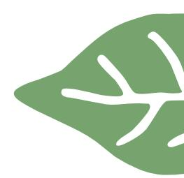

Finally, in the project in **Vietnam,** where GESI integration remains at a preparatory stage, continuous coaching proved essential for building practical understanding, identifying and analysing gender and social inclusion gaps, identifying systemic barriers but also opportunities within project activities, and embedding inclusive methodologies in every stage of project planning, including monitoring and adaptive management.

Teams can self-coach if they already have strong internal GESI champions and/or prior experience. However, self-coaching requires high discipline to avoid groupthink and may slow down the process if the team lacks specific technical expertise. For teams new to GESI and wanting to address intersectional gender barriers in their work, external coaching is recommended to ensure depth and accountability.

## **Peer Learning**

Peer learning transforms isolated efforts into a cohesive global strategy by enabling teams to rapidly adapt proven solutions, refine designs through collective critique, and navigate complex sociocultural barriers together.

**The importance of peer learning for GESI integration and accountability** 

**Accelerates innovation.** Avoid reinventing the wheel, by adapting successful approaches significantly, teams often face similar structural barriers (e.g. gender norms, access to resources). The peer exchanges enabled teams to identify patterns and adapt successful approaches from one context to another, rather than starting from scratch. Bilateral meetings were set up whenever country teams thought useful.

**Refine design.** Using 'multiple sets of eyes' allows for proposals to be strengthened and to integrate GESI more deeply.

**Accountability.** Regular check-ins and peer presentations created a sense of accountability, as teams reported on progress, challenges, and results.

**Aligns strategy.** The teams benefited from exchanging effective strategies and approaches that proved less successful. This helped others, now and in the future, to avoid common pitfalls **Strategic alignment and a common technical language.** Peer interactions help teams harmonise their understanding of GESI concepts – such as EUDR compliance – ensuring that diverse country interventions contribute to a cohesive and standardised regional impact. **Creates a collaborative space for navigating sociocultural resistance.** Sharing strategies on how to address sensitive barriers, such as local misconceptions or the negative connotations often associated with 'gender ideology', enables teams to co-develop more resilient and culturally sensitive narratives based on collective experience.

For peer learning, grouping diverse teams – across topics, sectors, or geographic regions – into shared clusters transforms isolated efforts into engines for comparative learning. Bringing together teams – like land tenure specialists in Zambia and geospatial experts in Ecuador in the SAFE project – creates space for unique local experiences to generate universal insights. This enables lessons from one context to be rapidly adapted elsewhere, accelerating collective progress on gender and inclusion challenges across local to global programmes.

The nine countries participating in the SAFE project were grouped into three clusters. Each cluster comprised countries from a different continent. There was diversity as well as overlap in topics selected by the teams. The different trajectories of teams generated valuable insights for comparative learning which were shared in cluster events held every 4 to 6 months, and inter-country learning events across clusters.

#### **Cluster 1 / Countries and Activity**

- Brazil: Cultivating leadership and shifting gender roles in cocoa and livestock.
- Ecuador: Equipping Amazonian youth and women with geospatial skills for EUDR compliance.
- Zambia: Securing women's land tenure and challenging patriarchal norms.

#### **Cluster 2 / Countries and Activity**

- Democratic Republic of the Congo: Integrating women and indigenous peoples in the recovery of the country's coffee sector.
- Indonesia: Formalising women's rubber farmer groups for market access.
- Vietnam: Using GALS to empower ethnic minority women in the coffee sector. **Cluster 3 / Countries and Activity**
- Cameroon: Strengthening women's participation and leadership within cocoa cooperatives.
- Peru: Institutionalising gender parity and leadership in cocoa cooperatives.
- Uganda: Cultivating joint decision-making and land rights in coffee households.

### **Organising for cross-continental peer learning in the SAFE project**

# **Funding**

Dedicated funding can act as a catalyst for innovation and ownership, even if intrinsic motivation is the ultimate driver. Whether through an external 'top-up' financial incentive, or internal reallocation, a dedicated fund allows teams to pilot bold, context-specific solutions without straining core budgets or compromising existing priorities. This allows for financial flexibility that relieves operational pressure and signals that GESI is a formal, protected priority. This can strengthen team motivation,

enable deeper co-creation with partners and ensure that gender objectives are visibly integrated into the broader project architecture, instead of an optional add-on.

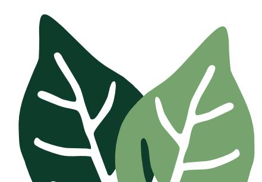

In the original GESI Sprint in the SAFE team there was an incentive of additional funds for implementation. This was paired with coaching support, as well as expert input from the Sprint Coordination Unit and, in some cases, external gender specialists. While the 'top up' funding effectively encouraged action, the additional support stimulated intrinsic motivation to drive sustainable change.

- **Internal budgetary prioritisation and focus:**  Designating a dedicated allocation for GESI allowed the project to operate under a 'sub-project' logic, ensuring focused implementation and resource protection.
- **Enhances explicit mainstreaming and crosscomponent synergies:** Treating GESI as a formal component makes intersectional gender objectives visible across the board, facilitating articulation with other technical areas and prompting a continuous reflection on how to effectively integrate GESI into every activity.
- **Provides space for co-creation:** flexibility to utilise the fund in the GESI Sprint process provides a space to engage the partner organisation as part of the team and jointly develop activities that are relevant and effective.
- **Additional funding stimulated gender-focused activities** within the entire SAFE project.
- **Relieves pressure on already allocated core budgets:** In many cases, the original project budget was already committed to core activities. The additional funding created additional resources to integrate gender and inclusionfocused actions – without compromising existing priorities – that would otherwise not be feasible.
- **Creates space for innovation:** Funding provides an opportunity to pilot new ideas and context-specific solutions without placing strain on the core project budget.
- **Strengthens team motivation and ownership:**  The 'competitive grant' (demand-driven, with support) acted as an important enabler, increasing motivation and encouraging teams to engage more deeply with GESI objectives.

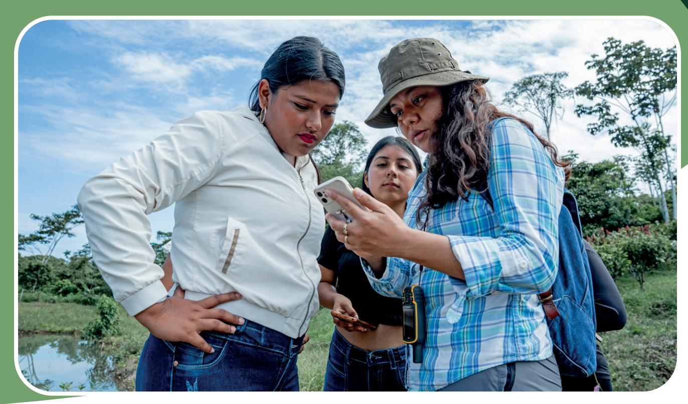

**Figure 8: Strengthening geospatial mapping skills for Amazonian Women and Youth in Ecuador, demonstrating that practical, locally grounded training can quickly build confidence, leadership and participation.**

# **ANNEX 1: Conceptual Frameworks of a GESI Sprint**

*"I was aware that GESI was an important part of our work to focus on. The tools and frameworks introduced have enabled me to engage and determine how to work with GESI activities."* 

*– M&E Advisor & GESI Sprint focal point (Vietnam)*

The GESI Sprint is guided by three complementary frameworks, namely Design Thinking, Quadrants of Change, and Reach-Benefit-Empower-Transform (R-B-E-T). Design Thinking supports teams to explore, test, and refine solutions through iterative learning. The Quadrants of Change ensure a systemic approach by addressing individual, relational, cultural, and structural dimensions. The Reach-Benefit-Empower-Transform framework helps to assess whether a development project is empowering and transformative, as many initiatives aspire to do. Together, these frameworks enable the development of inclusive, effective, and lasting solutions throughout the Sprint.

#### **Framework 1: Design Thinking**

Grounded in Design Thinking, a GESI Sprint is guided by a human-centred, iterative approach that goes beyond theoretical planning to deliver practically relevant, context-specific solutions. As teams move through empathy, definition, ideation, prototyping, and testing the Sprint is transformed from a linear execution plan into a dynamic learning journey, guaranteeing that the resulting solutions are useful, scalable, and deeply rooted in the communities they seek to transform.

**Empathise & Define.** Teams begin by deeply understanding the lived realities of women, Indigenous peoples, and marginalised groups. This involves questioning assumptions about 'what works' and rigorously defining the problem from the per- **Figure 9: Design thinking process**

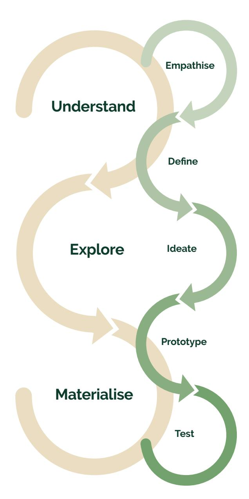

spective of those most affected, ensuring the root causes – not just symptoms – are addressed.

**Ideate & Prototype.** Instead of seeking a perfect solution immediately, teams are encouraged to explore diverse, even radical, ideas. They then develop low-cost, quick prototypes or 'minimum viable interventions' to test their hypotheses in the real world.

**Test & Iterate.** By gathering feedback early and often, teams can learn from failures and refine their approach continuously. This cycle of trial and error ensures that the final intervention is robust, culturally appropriate, and truly responsive to the evolving needs of the community.

#### **Framework 2: Quadrants of Change**

Lasting change requires a systemic approach. The complex challenges at the core of the GESI Sprint cannot be resolved through isolated interventions. Targeting only one dimension, such as individual capacity, often yields short-lived results. Therefore, interventions should operate across at least two quadrants to shape the wider system in which people operate, from relationships and social norms to systems and structures. By working across these

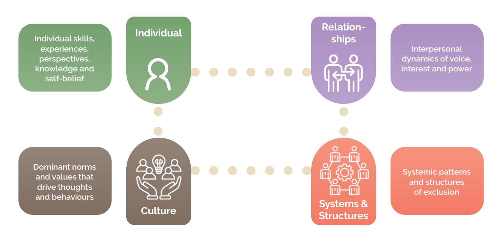

interconnected domains, teams can address root causes, minimise setbacks, and foster change that is durable, inclusive, and scalable. Throughout the GESI Sprint, attention should be given to **at least two domains** of the Quadrants of Change.

The Quadrants of Change (Individual, Relationships, Culture, Systems) support transformative design by addressing mindsets, behaviours, norms, and structures across four interconnected domains:

- The **Individual** domain focuses on people's skills, knowledge, and confidence.
- **Relationships** look at how people interact, collaborate, and support one another.
- **Culture** refers to shared expectations, values, norms, and everyday practices that influence what is accepted or expected and that drive behaviour.
- **Systems** include the policies, processes, and structures that shape how organisations and sectors operate.

Considering these domains together helps teams design solutions that are practical, well-supported, and more likely to last.

#### **Framework 3: Reach-Benefit-Empower-Transform**

Empowerment of women and other marginalised groups is the goal of many development projects, but these intentions do not always achieve the desired results. The Reach-Benefit-Empower-Transform framework can be used to assess whether a development intervention is indeed empowering and transformative.

**Figure 11: Reach-Benefit-Empower-Transform framework**

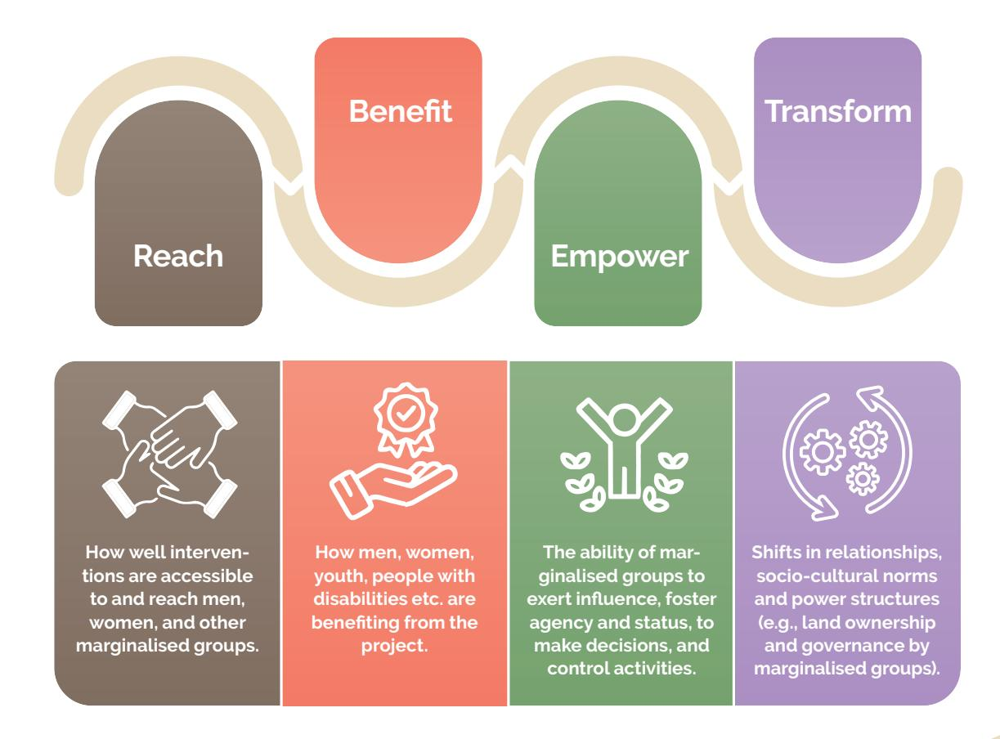

In a GESI Sprint, teams are asked to stretch themselves and move beyond *reaching* and *benefiting* target groups, towards realising *empowerment* and *transforming* the issue identified and wider context or business ecosystem.

# **ANNEX 2: Proposal template**

Develop a proposal (max. 4 pages) responding to

- the questions below.
- 1. GESI analysis of the issue, supported by context-specific national and subnational strategies)
  - What is the problem you are solving?
  - Whose problem is it?
  - Why is this the problem that needs to be solved?
  - Where does this problem exist within the development context or business ecosystem?
  - Does it build on existing work or existing partnerships? If so, briefly describe the work and what the partners are doing.
- 2. What is the solution? (What is the low-hanging fruit, unique selling point or highest-leverage action?)
  - What is your implementation strategy? (Work across at least two of the four Quadrants of Change: Individual, Relationships, Culture, and Systems to achieve transformative change)
  - Who will benefit? Why?
  - How will it enhance project or business success?
- 3. How do you implement your solution or intervention strategy? Which instruments, e.g., grants, contracts, local subsidies, will be used?
  - Who will be your potential partners in implementing your intervention strategy?
  - What are the team's track record and capabilities?
- 4. How will you know that your solution has an impact?
  - Expected results/outcomes, key indicators and methods: State your expected results or outcomes, and the key indicators and methods you will use to measure transformation.
- 5. What are the risks, and how will you mitigate them?
  - Risks and mitigation measures: State the main risks to achieving impact, and the mitigation measures you will use to address them.

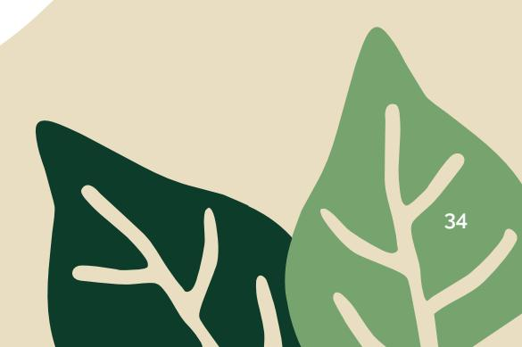

# **ANNEX 3: Pitch template**

Guidelines for developing a pitch slide deck (max. 8 slides):

- Be concise: Each slide should convey only the key points.
- Prioritise visuals over text: Use images, icons, and minimal text to make the deck engaging.
- Rehearse: Time yourself to ensure you stay within 5 minutes.
- Tailor to the audience: Focus on aspects of your pitch that will resonate with the pitch judges and the other teams.

#### 1. Cover slide

- <project, site, or country> pitch
- Presenters' names
- Compelling Title

#### 2. Problem statement

- Clearly define the problem you are solving.
- Make the audience feel the pain of the problem and understand its significance.

#### 3. Solution

- Explain your solution and how it addresses the problem.
- Highlight what makes your solution unique or better than existing alternatives.

#### 4. Team

- Present the participating organisations and their commitment to the initiative.
- Highlight key team members and their relevant experience.
- Demonstrate that the team can execute the vision.

#### 5. Intervention strategy

- Make the case that your plan is viable
- Show who will benefit
- Illustrate wider positive impact

#### 6. Financial projections

- How will you use the award/funding
- Show that you have realistic projections and a clear ask
- Convince the audience that your intervention plan is financially viable.

#### 7. Closing

- Recap your key message, value proposition, and the ask.
- Leave the audience with a strong impression and a clear path forward.

#### 8. CONTACT US

- Names, organisations, contact details

# **ANNEX 4: Template for Stories of Struggle and Change**

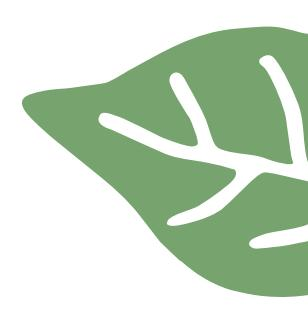

# *'Capture the journey, not just the win.'*

Use this template regularly to pause, reflect on the GESI Sprint journey, and prepare for inter-country learning events. We learn most from setbacks and failures, so it is vital to document struggles, administrative hurdles, and early team dynamics alongside successes. Focus not only on the results but on the process and the journey together, capturing small signs of change that accumulate into significant impact. For every shift observed, clarify whether it occurred at the individual or group level, and include reflections on how your own thinking as a team has evolved throughout the process. Use the following guiding questions:

#### **1. The Situation**

- Before: What was the reality for women/marginalised groups before this activity?
- Barriers: What specific challenges did they face in the value chain?
- Opportunities: What 'low-hanging fruit' existed to tap into?
- Action: What did the GESI Sprint propose and what actions were actually taken?

#### **2. Levels of Change**

- What happened: Describe tangible changes in people's lives (planned/unplanned, positive/ negative).
- The gap: What anticipated changes didn't occur?
- Scale: Are the changes at the individual or group level?
- Mindset: How has your own thinking, as a team/ individual, shifted?

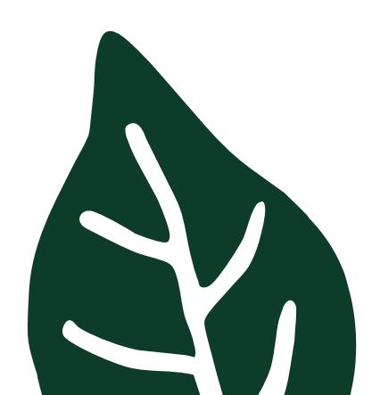

#### **3. Analysis & Insights**

- Signs of change: What small indicators demonstrate that change is occurring?
- Surprises: What was expected vs. what was unexpected?
- Significance: Why does this matter? What are the long-term implications?
- Sustainability: How likely is this change to last?

#### **4. Drivers & Recommendations**

- Root cause: What made this happen? (GESI Sprint vs. other factors).
- Reflection: What went well? What could be done differently?
- Lesson: What is the key takeaway for other GESI projects?

#### **5. Voices & Visuals**

- Testimonials: Direct quotes that add emotional context.
- Media: Photos of activities or videos showing the change.
- Evidence: Links to embedded media.

# **ANNEX 5: GESI indicators**

Key indicators using the Reach-Benefit-Empower-Transform framework and SAFE-project gender indicators (in the orange fields).

\* To be reported as a number for short-term results, or as a percentage against the baseline for long-term results

| DOMAIN                                                                                                   | INDICATORS                                                                                                          |
|----------------------------------------------------------------------------------------------------------|---------------------------------------------------------------------------------------------------------------------|
| <b>REACH</b>                                                                                             |                                                                                                                     |
| Identifying how well interventions are accessible to women and other marginalised groups, as well as men |                                                                                                                     |
| <b>Implementation of EUDR-readiness</b>                                                              | Women and other marginalised persons included in traceability systems and other tools for meeting EUDR requirements |
|                                                                                                          | Women and minority participants demonstrating an improvement in their knowledge of sustainable production practices |
|                                                                                                          | Women and minority participants confirming an improvement in their knowledge of land use rights                     |
|                                                                                                          | Women and men actively participating in GESI Sprint consultation meetings and training events                       |
|                                                                                                          | Women and other marginalised groups participating in value chain activities                                         |
|                                                                                                          | Women and men trained on land rights issues and redress mechanisms                                                  |
| Women and other marginalised farmers receiving extension services                                        |                                                                                                                     |
| Women and minority groups accessing inputs                                                               |                                                                                                                     |

### **BENEFIT**

|                                                                                                                                       |                                                                                                                                                              |
|----------------------------------------------------------------------------------------------------------------------------------------------------|--------------------------------------------------------------------------------------------------------------------------------------------------------------|
|  Tracking how women, young people with disabilities, and other marginalised people, as well as men, are benefiting from interventions |                                                                                                                                                              |
| <b>Access to and benefit from resources</b>                                                                                                        | Increase in the number of women and minorities participating in agricultural markets and value chains from the baseline over intervention period             |
|                                                                                                                                                    | Increase in female and other marginalised farmers accessing higher-paying markets or value-addition opportunities from the baseline over intervention period |
|                                                                                                                                                    | Increase in women's and minorities' income or earnings from the baseline over intervention period*                                                           |
|                                                                                                                                                    | Increase in women's and minorities' access to secure land tenure rights, or improvement in women's perception of their land tenure security                  |
|                                                                                                                                                    | Women and other marginalised groups reporting increased access to or use of improved technology                                                              |
|                                                                                                                                                    | Women's and minorities' increased knowledge of and expertise in the value chain                                                                              |
|                                                                                                                                                    | Improvement in women's and minorities' productivity (e.g., yield per hectare)                                                                                |

| DOMAIN                                                                                                                                     | INDICATORS                                                                                                                              |
|--------------------------------------------------------------------------------------------------------------------------------------------|-----------------------------------------------------------------------------------------------------------------------------------------|
| <b>EMPOWER</b>                                                                                                                             |                                                                                                                                         |
| Tracking the ability of women to exert influence, gain agency and status, make decisions, and control value chain activities               |                                                                                                                                         |
| <b>Women's representation</b>                                                                                                              | Women and minorities as decision-makers positively impacting the value chain                                                            |
|                                                                                                                                            | Women and minorities as trainers, focal points, experts, etc., positively impacting outcomes                                            |
|                                                                                                                                            | Women and minorities speaking out in meetings and decision-making processes                                                             |
| <b>Women's empowerment</b>                                                                                                                 | Women and minorities making decisions about the use of income from agriculture                                                          |
|                                                                                                                                            | Women and minorities effectively negotiating prices or contracts                                                                        |
|                                                                                                                                            | Women and minority leaders driving performance of producer organisations                                                                |
|                                                                                                                                            | Women and minorities being effectively and viably productive through land use                                                           |
| <b>TRANSFORM</b>                                                                                                                           |                                                                                                                                         |
| Tracking structural changes in disempowering cultural attitudes, power structures and norms (e.g., over women's land rights and ownership) |                                                                                                                                         |
| <b>Socio-cultural and structural change</b>                                                                                                | Policies and practices in institutions (e.g., cooperatives, agribusinesses) implemented to promote gender equality and social inclusion |
|                                                                                                                                            | Female champions mobilising male allies and jointly advancing gender equality and social inclusion in their context                     |
|                                                                                                                                            | Examples of traditional intersectional gender norms or barriers successfully challenged                                                 |
|                                                                                                                                            | Agreements or strategies proposed by women and other marginalised groups endorsed by local authorities or community leaders             |
|                                                                                                                                            | Share of female and minority owners or rights holders of agricultural land by type of tenure against the baseline                       |
| <b>Gender-responsive project management</b>                                                                                                | Availability of a budgeted intersectional gender strategy in partner organisations                                                      |
|                                                                                                                                            | Percentage of women and minorities in project management team(s)                                                                        |
|                                                                                                                                            | Percentage of women and minorities depicted in leadership or empowering roles in project publications                                   |
|                                                                                                                                            | Evidence of intersectionality in the gender strategy                                                                                    |
|                                                                                                                                            | Budgeted integration of M&E mechanisms that capture qualitative d                                                                       |

# **References**

Deutsche Gesellschaft für Internationale Zusam-

menarbeit (GIZ) GmbH, Sustainable Agriculture for Forest Ecosystems (SAFE) Program, 2022 EUDR Regulation, 2023 Fair Trade Foundation. Invisible Women: The Unrewarded Labour Behind Chocolate. 2020 FAO: The State of Food Security and Nutrition in the World 2022. Repurposing food and agricultural policies to make healthy diets more affordable. Rome, FAO. 2022 FAO Gender and Land Rights Database. Regional average is weighted with total holders of each country. https://www.fao.org/3/i4862e/i4862e.pdf FAO. The Status of Women in Agrifood Systems. Rome, 2023 Feminist Development Policy for Just and Stronger Societies World Wide, 2023 IFPRI, Reach, Benefit, Empower, Transform (RBET) framework, 2016 Maureen Zulu, Gender and Intersectionality Analyses of Timber and Soy Value Chains in Mumbwa and Itezhi-Tezhi Districts, Zambia, for the Sustainable Agriculture for Forest Ecosystems (SAFE) Approaches in Rural Development, 2022 SAFE Gender Equity and Social Inclusion (GESI) Plan, Roadmap in progress, 2024 Sustainable Agriculture for Forest Ecosystems (SAFE), SAFE Annual Progress Report, 2023 Sustainable Agriculture for Forest Ecosystems (SAFE) – Brazil Baseline Study, 2024 Sustainable Agriculture for Forest Ecosystems (SAFE), Ecuador Baseline Report, 2024 Sustainable Agriculture for Forest Ecosystems (SAFE); Gender Strategy for the Project, 2024 Draft Sustainable Agriculture for Forest Ecosystems (SAFE), Indonesia, SASCHI+ Gender and Social Gap Assessment and Advisory Report, 2022 Sustainable Agriculture for Forest Ecosystems (SAFE), Final Baseline Report, Zambia Final Baseline Study Report, 2024 Team EU, Co-Creating Scalable Data-Driven Solutions which leverage EUDR as an Opportunity for Smallholders in the Coffee Sector, 2024

Project, 2024

Nozomi Kawarazuka, Intersectional and Feminist

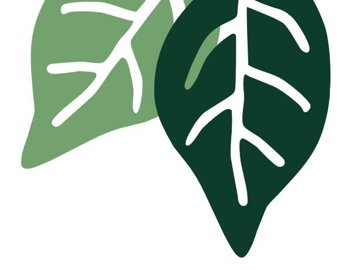

This quick-reference roadmap is designed to help teams move from planning to measurable GESI and EUDR impact in a structured but practical way. It provides a clear 5-stage process, from organising and identifying barriers to implementing solutions and

reflecting on results, while keeping teams focused on transformation, accountability, and learning. Use this checklist as a simple guide to stay aligned, avoid common pitfalls, and ensure your project is ready to deliver meaningful and scalable change.

| STAGES       | TIMELINE CORE MISSION KEY DELIVERABLE               |
|--------------|-----------------------------------------------------|
| 0. Organise  | Pre-launch Establish a Sprint Coordination Unit and |
| 1. Identify  | Months                                              |
| 2. Design    | Months                                              |
|              | Build solution across ≥ 2 Quadrants of Change       |
| 3. Pitch     | Months                                              |
| 4. Implement | Months                                              |
| 5. Reflect   | Months                                              |

# **Quick Reference GESI-Sprint Roadmap**

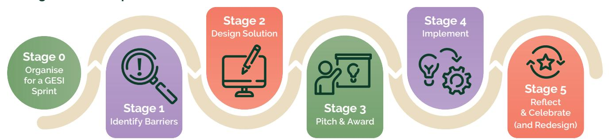

# **1. The 5-Stage Roadmap**

*Keep this timeline handy. Move fast, adapt often.* 

#### **Stages of a GESI Sprint**

# **3. Who Does What?**

*Check detailed terms of reference in Annex 2.* 

**Focal point:** Timeline, connections, approvals ("The Conductor"). **Project team:** Field work, data, bi-weekly reports ("The Builders"). **Coach:** Help refine problem, prevent burnout ("The Guide"). **Review panel:** Quality, funding release ("The Gatekeepers").

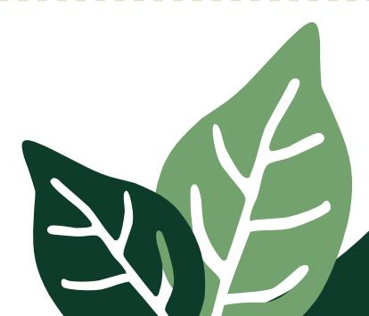

## **5. The Proposal**

*Keep it concise. Be specific. Focus on transformation, not just activity. Max. 4 pages. See Annex 3.* 

**Explain** the problem by showing who it affects, why it matters, and how you will build on existing work. **Describe** your solution by detailing your plan, your partners, and the specific tools you will use to make changes. **The solution** covers at least 2 of the four Quadrants of Change (Individual, Relationships, Culture, and Systems & Structures). **Show** your results by defining clear goals, measuring success, managing risks, and proving your team can deliver.

# **4. The Pitch**

### *See template in Annex 4.*

**Build** a tight, 5-minute pitch using visuals to present your problem, solution, team, strategy, and budget. **Demonstrating** that your plan will work by showing exactly how it will help people and ensure EUDR compliance. **Explain** clearly how you will spend the €30,000 to reach your goals.

### **2. Pre-Launch "Go/No-Go" Checklist**

*Do not start Stage 1 until all of the following boxes are checked. Skipping these steps can stall your project.*

**Literacy:** Does every team member understand *why* the project matters? **Resources:** Is time/budget explicitly allocated (not just "added on")? **Integration:** Is the project within the main workplan and not a "side project"? **Leadership:** Has a senior leader publicly endorsed the project? **Scope:** Is the goal realistic for 6–8 months? **Partners:** Are local partners contracted and ready? **Safety:** Is a safeguarding checklist in place?

### **6. Measure what matters: RBET indicators**

*Select only 3–5 indicators. Prove that you moved the needle towards transformation.* 

**REACH:** Number of women/youth trained or included in systems.

**BENEFIT:** Percentage increase in income, land access, or market entry.

**EMPOWER:** Impact of women in decisionmaking roles or negotiating prices.

**TRANSFORM:** Impact of policy changes advanced by female champions and male allies.

## **7. Story of struggle and change template**

*Fill this out monthly. Focus on the journey, not just the win. More detail in Annex 6.*

**Situation:** What was the problem before? **Action:** What did we do? (Be honest about struggles/failures!) **Shift:** What changed? (Look for small signs: e.g., women speaking up in meetings.) **Lesson:** What would we do differently next time?

# **8. Decision matrix: Learning from the field**

*Stuck? Check the lessons learned from previous GIZ SAFE project experiences.* 

| IF YOU FACE...         | DO THIS...                                        | LEARNED FROM... |
|------------------------|---------------------------------------------------|-----------------|
| Bureaucratic delays    | Build in contingency time and budget for travel   |                 |
| Conflict / Instability | Pivot immediately to “safe zones”;                |                 |
| Training ≠ Income      | Link skills directly to market access and income. | Ecuador         |

#### **In cooperation with:**

KORUMO facilitation team:

Mo Salomon, PhD, Team Lead & Coach

Karen Engel, PhD, Coach

Wambui Njuguna, Coach

Sinegugu Ngcongo, Virtual Navigator

www.korumo.org

**Published by:**

Deutsche Gesellschaft für Internationale Zusammenarbeit (GIZ) GmbH

#### **Registered ofÏces:**

Bonn and Eschborn, Germany

#### **Address:**

Friedrich-Ebert-Allee 32 + 36

53113 Bonn, Germany

T +49 61 96 79-0

F +49 61 96 79-11 15

E info@giz.de

**Programme:** Sustainable Agriculture for Forest Ecosystems (SAFE)

#### **Responsible:**

Dr. Jorge Espinoza

jorge.espinoza@giz.de

**Contact:** Laura Rondholz, Anna-Sally Westermann, SAFE

**Design/Layout:** Laut und Deutlich

**Credits:** GIZ

#### **On behalf of:**

European Union (EU), the German Federal Ministry

for Economic Cooperation and Development (BMZ),

and the Dutch Ministry of Foreign Affairs (BZ)

**Year:** 2026

*This publication was produced with the financial support of the European Union (EU), the German Federal Ministry for Economic Cooperation and Development (BMZ), and the Dutch Ministry of Foreign Affairs (BZ). Its contents are the sole responsibility of GIZ and do not necessarily reflect the views of the EU, the BMZ, and the BZ.*

Learn more about the Team Europe Initiative:

www.zerodeforestationhub.eu/

Learn more about SAFE:

www.zerodeforestationhub.eu/projects/safe