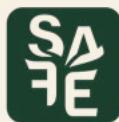
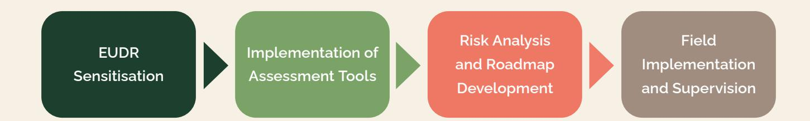
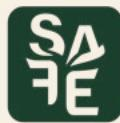

# **Due Diligence Processes SAFE Ecuador**

**Step 2 – Implementation of Assessment Tools**

## **Table of Contents**

#### **Step 2 – Implementation of Assessment Tools:**

| Step 2 – Implementation of Assessment Tools:                          |   |
|-----------------------------------------------------------------------|---|
| Use of diagnostic tools to assess readiness and compliance            | 3 |
| Tool (1) Diagnostic to strengthen the capabilities of the association | 4 |
| Tool (2) for analysis of capacities to comply with the EUDR           | 7 |
| Tool (3) for risk identification and risk management according to the |   |
| EUDR regulation for deforestation-free products                       | 9 |

In Ecuador, the team adopted a structured **four-step approach** to implement the Due Diligence schemes.

Below you will find a detailed explanation of **Step 2 – Implementation of assessment tools**, with a particular focus on the indicators to be analysed.

#### **Step 2 – Implementation of Assessment Tools:**

#### Use of diagnostic tools to assess EUDR readiness and organisational capacity for compliance

During the workshops with producer organisations, a toolbox developed by the implementing organisation Terra 360 was used. This toolbox contained three tools: Tool 1 was used to strengthen the capacities of the association; Tool 2 was used to assess their ability to comply with the EUDR; and Tool 3 was used to identify risks and mitigation measures for EUDR compliance.

**project directly.**

## **Process Design and Structure – the 4-Step Approach used in Ecuador**

#### **Tool (1) Diagnostic to strengthen the capabilities of the association**

**This tool was designed and used to assess and strengthen the organisational capacity of associations. It evaluates various aspects of an association's structure and operations to identify areas for improvement:**

#### **1. Strategic capabilities**

This section evaluates the association's strategic capabilities and planning processes by analysing 12 key indicators. The focus lies on understanding how well the association aligns its activities with its long-term goals. This helps to ensure that the organisation remains sustainable and able to adapt to changes.

#### **Indicators may include:**

ü Level of specialisation and competencies in key positions ü Level of staff motivation ü Number of women in the organisation being part of the board ü Participation rate in trainings ü Level of employee satisfaction ü Number of occupational accidents ü Number of full-time employees.

#### **Additional aspects that may be analysed:**

ü Existence of an internal communication system ü Availability of a training and education plan ü Provision of occupational insurance for employees ü Implementation of a staff performance evaluation system ü Payment of competitive salaries.

#### **2. Associativity**

This dimension uses 15 indicators to assess the level of cohesion and collaboration among members. The aim is to evaluate how effectively members work together and how strongly they feel a sense of belonging within the association. Strong associativity fosters unity, enhances decision-making, and builds resilience.

#### **Indicators may include:**

ü Existence of up-to-date legal documents (statutes and regulations) ü Level of awareness and understanding of the organisation's internal rules and procedures ü Presence of a person responsible for the functioning and management of the association ü The board of directors being up to date and officially registered with the relevant oversight body ü Level of participation in meetings and assemblies ü Members are up to date with their contributions and dues to the organisation ü Number of young members in the organisation ü Implementation of conflict resolution mechanisms ü Agreements and strategic alliances with key stakeholders ü Level of member loyalty to the organisation ü Range of services and benefits offered to members ü Increase or decrease in membership ü Accountability to partners.

#### **3. Technical assistance**

This aspect focuses on the quality and availability of the support provided to members, which is assessed based on 11 indicators. The aim is to ensure that members have access to the necessary tools and knowledge to improve productivity and comply with market standards.

#### **Indicators may include:**

ü Coverage of services and productive technical assistance for the organisation's members ü Awareness-raising activities on gender, interculturality, and inclusion ü Existence and composition of the organisation's technical team ü Frequency of visits to producers ü Availability of transport for technicians ü Updated farm information and registration system ü Availability of a technological package for crop management (e.g. manuals) ü Productivity levels on associated farms ü Level of farm mechanisation and use of technology ü Number of partners equipped with a complete set of farm management tools ü Application of innovations to improve production levels and quality.

#### **4. Processes**

This section uses 11 indicators to evaluate the efficiency and effectiveness of the organisation's processes. Well-structured processes optimise operations such as product storage, transport, and logistics, while minimising risks related to mismanagement and infrastructure security. Effective process management enhances operational capacity and ensures compliance with regulatory and environmental standards.

#### **Indicators may include:**

ü Existence of optimal infrastructure and equipment for the post-harvest processes ü Optimal product storage capacity ü A transport and logistics system for product mobilisation ü An internal control system ü Up-to-date record keeping ü Security system for infrastructure ü Security in product transport ü Waste and residue management at the collection centre ü Operating and functioning permits for the collection centre ü Basic services in operation.

#### **5. Commercialisation, clients and markets**

This dimension uses 12 indicators to assess the association's market-related activities. The aim is to evaluate how effectively the association manages its sales processes and its relationships with markets and customers. Strong commercialisation strategies can lead to increased revenue and a stronger market presence.

#### **Indicators may include:**

ü Number of customers ü Number of contracts with clients ü CRM customer database ü Number of quality complaints ü Level of customer satisfaction ü Rate of repeat purchases by customers ü Customer response time ü Complaint resolution time ü Customer retention rate ü Quality-based price differentiation ü Access to special markets ü Certifications for special markets are in place.

#### **6. Finance, administration and accounting**

This section uses 12 indicators to examine an organisation's financial health, administrative efficiency, and accounting practices. Effective management in these areas fosters transparency and trust among stakeholders, supporting long-term sustainability.

#### **Indicators may include:**

ü The existence of an updated business plan ü The conduction of (annual) financial audits ü Management of a monthly budget control ü The existence of active credit lines ü The generation of monthly financial reports ü Break-even point is known ü Existence of sufficient working capital ü A cost structure analysis is in place ü Frequent inventory control ü An up-to-date manual of administrative and accounting processes ü An accounting system is in place ü Receivable and payable accounts control.

By systematically evaluating these areas, the tool helps associations to identify their strengths and areas for improvement. Addressing gaps in these six dimensions enables associations to enhance their overall functionality and competitiveness.

#### **for analysis of capacities to comply with the EUDR Tool (2)**

**This is a comprehensive tool designed to assess the readiness of organisations to comply with the European Union Deforestation-free Regulation (EUDR). It evaluates various aspects of an organisation's operations to identify strengths and areas for improvement in meeting EUDR requirements:**

#### **1. Organisation management**

The organisation's internal management practices and governance structures are assessed based on 11 indicators. The focus lies on ensuring effective decision-making processes, strong leadership, and organisational goals are aligned with EUDR compliance. This improves operational efficiency, transparency, and accountability.

#### **Indicators may include:**

ü Verifiable records confirming that products are deforestation-free ü Valid permits for forest harvesting and management ü Internal policies to ensure compliance with land use, environmental protection, and local regulations.

#### **Additional indicators could involve policies guaranteeing:**

ü Third-party, labour, and human rights ü Adherence to free, prior, and informed consent for indigenous peoples ü Ensuring legal compliance with taxation and business practices.

The organisation should also appoint someone at the management level to be responsible for EUDR compliance.

#### **2. Availability of information on value chain**

The organisation's capacity to manage and utilise data relevant to deforestation-free compliance is assessed using six indicators. The focus lies on evaluating the robustness of data systems for tracking and reporting supply chain information. Effective data management ensures transparency and supports the organisation's ability to meet EUDR traceability requirements.

#### **Indicators may include:**

ü The extent to which Due Diligence information is collected, organised, and retained over a five-year period ü Maintenance of a quantity register for all relevant products ü Recording of the country of production, including detailed locality data.

#### **Additionally, the organisation should have:**

ü Geolocation data for each farm ü Contact information for legal and business partners ü Clients receiving the products.

#### **3. Risk assessment**

The organisation's ability to identify, evaluate, and respond to risks is analysed using nine indicators. The aim is to assess the management of risks related to deforestation and non-compliance. This helps to prevent disruption and ensures proactive mitigation.

#### **Indicators may include:**

ü Assessment of country-specific risk levels under EUDR ü Identification of forests and indigenous peoples in production areas ü Conducting free, prior, and informed consultations ü Monitoring of deforestation or forest degradation on partner farms ü Implementation of anti-corruption measures ü Prevention of product mixing with non-compliant sources ü Use of third-party certifications or verification systems ü Documentation of risk assessments with annual reviews.

#### **4. Mitigation measures**

The implementation of mitigation strategies to reduce or eliminate risks is analysed based on four indicators.

#### **Indicators may include:**

ü Documented and proportional risk mitigation procedures and control mechanisms ü Annual reviews of mitigation measures ü Clear documentation of decision-making processes

Additionally, organisations should demonstrate how risk mitigation decisions were made, ensuring these measures effectively reduce non-compliance risks to zero or negligible levels.

By systematically evaluating these four dimensions, the tool enables organisations to identify their strengths and areas for improvement on their EUDR compliance journey. Addressing gaps in these areas enhances organisational effectiveness, ensures environmental sustainability, and establishes the organisation as a competitive and responsible participant in deforestation-free supply chains.

**This is a comprehensive tool designed to assess Principle 1: Responsible management and business practices**  This section evaluates the organisation's compliance with responsible management and business practices using 16 indicators. It covers land rights, legal requirements for production and taxation, anti-corruption measures, and regulatory compliance in trade and Due Diligence, thereby ensuring ethical and sustainable operations. **Indicators may include:** ü Evidence that land tenure rights are secured and registered in accordance with legal requirements, or officially recognised by authorities as sufficiently clear to permit legally compliant land use, management, and product sales ü Land management rights are in place and registered in accordance with legal requirements ü Measures are in place to safeguard production land against unlawful encroachment by third parties ü Compliance with legal requirements for land-use planning and management ü Compliance with legal requirements for harvesting and production ü Fulfilment of legal obligations regarding the payment of royalties, land and surface taxes, and related fees ü Compliance with legal requirements for the payment of value-added and/or other sales taxes ü Fulfilment of statutory obligations for corporate taxes, including profit taxes ü Fulfilment of statutory requirements for trade and/or export taxes and duties ü Adherence to legal provisions related to corruption, including bribery, fraud, and conflicts of interest ü Avoidance of falsification of data and documents ü Compliance with legal requirements governing the trade and transport of goods ü Compliance with legal obligations relating to product classification ü Compliance with legal requirements for export and/or import activities ü Compliance with legal obligations concerning offshore trade and transfer pricing ü Observation of legal duties related to due diligence or due care.

**the following principles:**

### **Tool (3) for risk identification and risk management according to the EUDR regulation for deforestation-free products**

#### **Principle 2: Respect human welfare and human rights**

This section assesses the organisation's commitment to respecting human welfare and human rights using 13 indicators. It evaluates compliance with legal requirements related to human rights, labour practices, non-discrimination, workplace safety, and gender equality. Additionally, it ensures that the rights of Indigenous Peoples and customary communities are identified and respected, thereby promoting ethical and equitable operations.

#### **Indicators may include:**

ü Respect for human rights in accordance with national and international law ü Harvesting or trading of products that do not contribute to the violation of international human rights or to armed conflict ü Compliance with legal requirements relating to child labour and the employment of young workers ü Fulfilment of legal obligations regarding modern slavery, including forced and prison labour ü Respect for the legal right to freedom of association, the right to organise, and collective bargaining ü Compliance with legal standards governing working hours, overtime, rest periods, and time off ü Adherence to legal requirements for the recruitment and employment of workers ü Compliance with legal requirements related to non-discrimination ü Fulfilment of legal obligations regarding wages and related payments, including social insurance ü Compliance with legal requirements for occupational health and safety ü Adherence to regulations on employer-provided accommodation for workers

ü Compliance with legal provisions on gender equality in the workplace ü Identification of Indigenous Peoples potentially affected by the organisation's activities ü Identification and respect for legally recognised customary and community rights.

#### **Principle 3: Protection of nature and the environment**

This section evaluates the organisation's commitment to protecting nature and the environment using 13 indicators. It ensures compliance with legal requirements relating to forest management, chemical use, waste disposal, and the protection of water and soil. The organisation must also prevent deforestation and forest degradation after December 2020 and safeguard CITES species. It also requires an internal policy to address environmental risks as well as a designated person at the management level to ensure regulatory compliance.

#### **Indicators may include:**

ü No conversion of forests for agricultural use after 31 December 2020 ü No degradation or conversion of primary forests to plantations, other types of planted forest, or wooded land after 31 December 2020 ü No degradation or conversion of naturally regenerating forests to plantations, planted forests, or wooded land after 31 December 2020 ü Compliance with legal requirements for forest management and harvesting activities ü Compliance with legal requirements for harvesting, collecting, capturing, and trading CITES-listed species ü Compliance with legal requirements for the use and storage of chemicals ü Compliance with legal obligations related to waste management

ü Compliance with legal requirements concerning the use and protection of surface and groundwater ü Compliance with legal requirements related to soil management ü Existence of an internal policy to combat deforestation, forest degradation, and illegality in the supply chain ü Designation of a responsible person at management level to ensure compliance with EU regulations.

#### **Principle 4: Climate impacts are reduced and mitigated**

This section assesses the organisation's efforts to reduce and mitigate climate impacts using five key indicators. It evaluates compliance with legal frameworks for implementing best practices to minimise greenhouse gas emissions, tailored to the operation's scale and risk. A robust traceability system must ensure the segregation of compliant products from harvest to export. The organisation should also maintain a detailed database of the geolocation of all production plots, including vegetation cover data, and operate an internal control system linked to certification or third-party verification.

#### **Indicators include the following aspects:**

ü Compliance with the legal framework regarding the implementation of best practices to minimise key greenhouse gas emissions ü Implementation of risk-based and proportionate measures that are appropriate to the scale and nature of the operation ü Implementation of a traceability system to ensure custody and prevent the mixing or contamination of compliant products from harvest to export ü A database that includes the country of origin of the products ü Detailed and regularly updated geographical information records of all producers' land parcels where relevant raw materials and derived products are produced ü Recorded date or time interval of production ü The geographical location of all plots of land used for the production of relevant raw materials and derived products is available in transferable formats, including data on vegetation cover and areas of natural forest retained within farm boundaries ü An internal operational control system is linked to certification schemes or third-party verification mechanisms.

This publication was produced with the financial support from the European Union, the German Federal Ministry for Economic Cooperation and Development (BMZ) and the Ministry of Foreign Affairs of the Netherlands. SAFE is part of the Fund for the Promotion of Innovation in Agriculture (i4Ag) and implemented by Deutsche Gesellschaft für Internationale Zusammenarbeit (GIZ). GIZ is solely responsible for its contents, which do not necessarily reflect the views of the European Union, the BMZ or the Ministry of Foreign Affairs of the Netherlands.

### **Disclaimer**