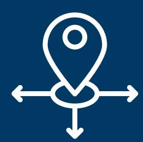
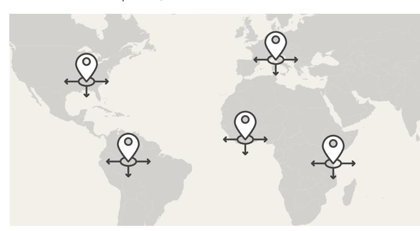
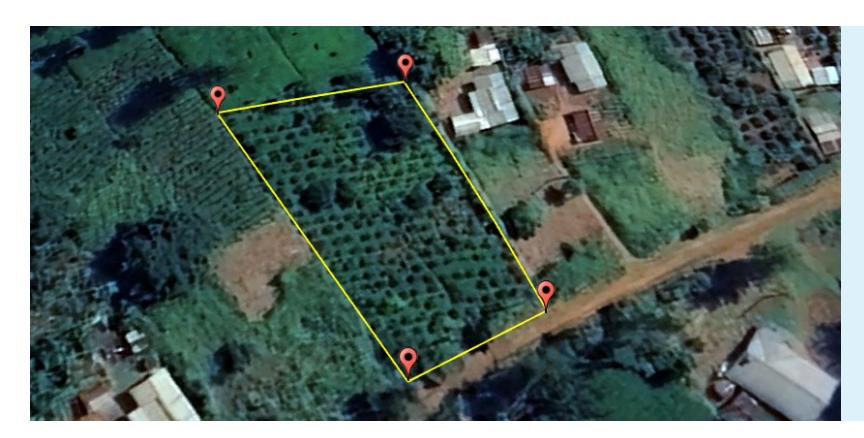

# **EU Deforestation Regulation**

The EU Deforestation Regulation (EUDR) requires that **palm oil, coffee, cocoa, soy, cattle, timber and rubber** (and some derived products) entering the EU must be produced **legally and without causing deforestation**. Operators placing these products on the EU market must submit a due diligence statement demonstrating that these criteria are met. The EUDR enters into application on 31 Dec 2025 (mid-2026 for EU micro, small and medium enterprises).

# **Traceability & geolocation**

To demonstrate that a commodity sold in the EU is deforestation-free and legal, it must be traceable to the plot of land where it was produced. Therefore, operators must include the **geolocation** 

**coordinates** (with six decimal points) for every plot the commodity came from in their due diligence statements. Products from plots without geolocation information cannot be placed on the EU market.

**Less than 4 hectares** Single point

Polygon

The GPS coordinates (latitude and longitude) of a single point in the plot is enough to identify its location on a map.

A polygon (comprising multiple GPS points) is required to delineate the boundaries of the plot.

**More than 4 hectares**

# **Point vs. polygon**

Geolocation coordinates show the physical location of a plot of land. They are needed to check if deforestation happened on that plot after the EUDR cut-off date (31 December 2020) and if production was legal.

The EUDR has different geolocation requirements for plots of different sizes:

# **Plot of land**

A ëplot of landí is a single, contiguous piece of land where an agricultural commodity is grown. It can be any shape, as long as it has an unbroken border/boundary. Unconnected pieces of land are considered separate ëplotsí, even if they have the same owner. A farm can therefore be composed of different plots of land.

# **Unpacking the geolocation requirements under the EU Deforestation Regulation**

**EU**

## **EU Information System requirements**

To complete their due diligence statements needed to place a relevant product on the EU market, operators must provide the geolocation data of all plots in the official EU online system, either by manual entry or by uploading it in a GeoJSON file. The system will then give the operator a unique due diligence reference number for tracking and verifying compliance, which must be shared along the supply chain.

Geolocation data collected for the plots of land where the commodities were produced or harvested

| Common errors                                                                                                         |                                                                                                                       |                                                                                                                 |
|-----------------------------------------------------------------------------------------------------------------------|-----------------------------------------------------------------------------------------------------------------------|-----------------------------------------------------------------------------------------------------------------|
| Overlap                                                                                                               | Unexpected gap                                                                                                        | Wrong coordinate system / format                                                                                |
|  |  |  |

The buyer obtains geolocation data from the plots of all its suppliers and stores it in a database. Each

subsequent

buyer/trader/processor obtains the data from their suppliers, thus transferring it along the

supply chain.

1.The geolocation data is sent to the operator importing into the EU, or

The operator submits the due

diligence statement, containing all geolocation data, to the EUDR Information System and receives a due diligence reference number.

The due diligence reference number allows the shipment to be imported into the EU and placed on the market.

EU Competent Authorities are able to check shipments and operators to ensure all EUDR

requirements are met.

2. Geolocation continues to be transferred if the commodity is further processed into derivative products.

## **From plot to export**

Geolocation data must be preserved and transferred along the supply chain by suppliers, traders and manufacturers during every transaction ñ including across borders when raw materials are sourced from third countries.

#### **Data protection and privacy**

#### **Common errors & verification**

Some common errors can occur when collecting geolocation coordinates. A verification process can help ensure that the geolocation information received is accurate and error free.

Only geolocation data is transferred along the supply chain into the EU system. Personal information (e.g. names, addresses, ID numbers) will not be transferred. The EU Competent Authorities will have access to the anonymous geolocation data. Operators and traders are not obliged to make it visible to downstream operators.

**Disclaimer.** This factsheet has been produced by the European Forest Institute with the financial assistance of the European Union. The contents of this factsheet are the sole responsibility of the author and can under no circumstances be regarded as reflecting the position of the European Union.

**EUDR EU**

**GeoJSON File**