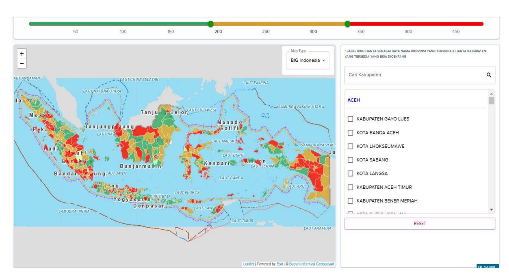
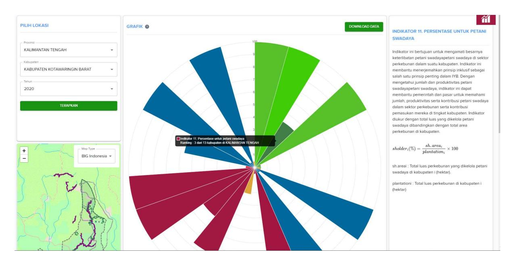
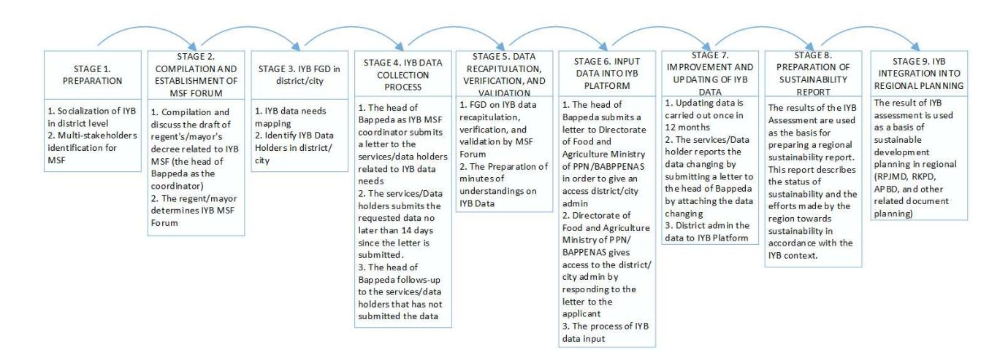

# **Guidelines for the collection of Sustainable Jurisdictions Indicators data at the district level**

Working paper

## **Chapter 1: Introduction**

#### **1.1 Background**

Sustainable Jurisdiction Indicators (SJI) is an initiative led by the Agricultural and Food Directorate of the Ministry of National Development Planning/Bappenas, supported by the European Union and other partners. The objective of the initiative is to achieve the development agenda which is listed in the National Mid-term Development Plan (RPJMN) 2020–2024, in the context of Priority Program Implementation (PP) of the improvement of added value, employment, real sector investment, and industrialisation – Priority Activity (KP) on the increase of Agriculture-based Processed Industry, marine, and upstreamdownstream integrated Non-Agricultural industry. The sustainable jurisdictions narrative has also been integrated in the RPJMN 2024-2029 and the National Long-Term Development Plan (RPJPN) 2024-2045. In line with the government agenda, SJI is expected to provide guidelines for planning and the performance of an area in implementing sustainable principles in the production process of plantation commodities.

SJI is designed to provide several benefits, as an instrument that helps regions to measure, and gradually achieve, sustainability and inclusiveness in agricultural development. The central government is also able to use the indicators and the SJI monitoring system to develop incentives and disincentives for regional governments to achieve sustainable and inclusive development. Those needs can be fulfilled because SJI is prepared in line with regulations and policies which support certification scheme on sustainable agricultural commodities, such as Indonesian Sustainable Palm Oil (ISPO). Moreover, SJI aims to help each region assess and monitor if they are in line with plantation policies in each city/district in Indonesia, such as the Regional Action Plan of Sustainable Palm Oil (RAD-KSB).

Direct benefits for regions of using the SJI instrument include: (1) Contributing to the performance achievement of regional development, especially to achieve the UN Sustainable Development Goals; (2) Contributing to the effectiveness and the efficiency of financial and human resources allocation in sustainable development implementation; (3) Increasing the regional GDP contribution in green development sectors; (4) Developing and providing the regional portfolio related to green investment; and (5) Encouraging non-fiscal incentive schemes related to regional sustainable development.

## **1.2 Sustainable Jurisdictions Indicators (SJI)**

The Sustainable Jurisdictions Indicators (SJI) were developed based on a jurisdictional approach at the district level. This approach is in accordance with the agricultural responsibility delegation to the district government as regulated in Law No.23 of 2014 concerning regional government. A jurisdictional approach is one of the landscape approaches which uses administrative boundaries (i.e. jurisdiction) to define action scope, activity, and stakeholders' involvement.

There are two types of SJI indicators: the main indicators (based on national data) and additional optional indicators (based on regional data). The usage of regional data to

measure the optional indicators can accommodate initiatives that have been carried out by the regional government, but where the data does not exist at the national level.

Through a multi-stakeholder approach, 24 indicators have been developed to measure the sustainable and inclusive production of commodities at the district level – 18 main indicators and 6 optional indicators. The SJI fall under three sustainability dimensions: environmental, socio-economic, and governance. Each sustainability dimension has principles, criteria and indicators to guide regional governments in fulfilling the SJI targets.

#### **1.3 Sustainable Jurisdictions Indicators platform**

A data platform has been developed to facilitate the analysis and the dissemination of the data regarding the indicators, in order to provide information for policy makers and market players. The dashboard is the main feature of SJI platform. It consists of two main features: district assessments and district profiles. The following is further explanation of each dashboard feature.

**District assessment** – This feature is used to assess a how each district/city fares against each SJI indicator.

**Figure 1: Indonesia map with districts' SJI data**

**District profile** – This feature is used to view the results, profile or the achievement of individual districts/cities. Different from the district assessment, this feature is able to look one district/city its progress towards achieving all the SJI indicators.

**Figure 2: District SJI indicator display chart**

This platform is important to support market players in conducting due diligence, and also in decision making related to resources and investment based on sustainability performance at the district level. Bappenas is currently developing this platform further to support the process of development planning, to assist with funding allocation to help the districts to improve their performance, and attracting green investment.

The platform also can show the trends and the progress from over time, highlighting districts that have made significant progress towards sustainability, as well as identifying areas that need further support. Further development will include the addition of a palm oil supply chain tracking module to help fulfil new due diligence requirements in order to access global markets.

Furthermore, the Ministry of Internal Affairs is preparing the integration of SJI into the Regional Government Information System (SIPD) to monitor the implementation of Sustainable Palm Oil Regional Action Plans (RAD-KSB).

#### **1.4 Using the guidelines**

These guidelines provide explanations and descriptions of the 24 SJI indicators as a resources for local governments, which are responsible for collecting the relevant SJI data at the district level. Chapter 2 contains descriptions of each indicator. Chapter 3 outlines the type of data and data holder for each indicator. Chapter 4 outlines the procedures for collecting and improving SJI data. This document therefore provides guidance for district/city governments in:

- 1. Supporting data collection for SJI indicator fulfillment.
- 2. Determining the SJI data collection steps.
- 3. Outlining the roles/task division of various sectors or related services for SJI indicator fulfilment.

## **Chapter 2: Description of the Sustainable Jurisdictions Indicators**

#### **2.1 Environmental indicators**

| PRINCIPLE Indicators                                                                                                                                         |                                                                       |
|--------------------------------------------------------------------------------------------------------------------------------------------------------------|-----------------------------------------------------------------------|
| and natural resources management in districts is carried out sustainably, taking into account aspects of environmental carrying capacity in order to support |                                                                       |
| Sustainable Development Goals. Main Indicator                                                                                                                |                                                                       |
| Indicator 1:                                                                                                                                                 | Permanent Forest Protection. This indicator measures the              |
| Indicator 2                                                                                                                                                  | : Conservation as an important areas for ecological services. This    |
| Indicator 3                                                                                                                                                  | : Fire Prevention. This indicator calculates the increase or the      |
| Indicator 4                                                                                                                                                  | : Protection for peatlands. The indicator measures the percentage of  |
| Indicator 5                                                                                                                                                  | : Environmental Quality Control. The indicator measures the condition |
| Indicator 6                                                                                                                                                  | : Climate Change Mitigation and Adaptation. This indicator assesses   |

## **2.2 Socio-economic indicators**

| PRINCIPLE Indicators |                                                                      |
|----------------------|----------------------------------------------------------------------|
| Indicator 7          | : The proportion of land control by the independent smallholders.    |
| Indicator 8          | : Registration of Independent Smallholders. The indicator calculates |
| Indicator 9          | : Numbers of farmer members who joined in independent                |
| Indicator 10         | : Assistance for independent farmer. The government has various      |
| Indicator 11         | : Food Security. This indicator uses Food Security Index (IKP)       |
| Indicator 12         | : The contribution of PDRB in Plantation Sector. The indicator       |
| Indicator A          | : Recognition of Customary Law Communities. The indicator            |
| Indicator B          | : Independent Smallholders Productivity. The indicator is measured   |
| Indicator C:         | Farmer Partnership. This indicator measures the commitment of        |

## **2.3 Governance indicators**

| PRINCIPLE Indicators                       |                                                                        |
|--------------------------------------------|------------------------------------------------------------------------|
| Indicator 1                                | : Permanent Forest Protection. This indicator measures the             |
| Indicator 14                               | : The proportion of district budget allocated for sustainability. This |
| Indicator 15                               | : Public Information Access. Public information access can be          |
| Indicator 16                               | : Complaint Mechanism. This indicator assesses the region              |
| Indicator 17                               | : Sustainable Plantation Certification. The indicator measures the     |
| been certificated as sustainable, compared | to the total palm oil plantation area                                  |
| Indicator D:                               | Multi-stakeholder participation in district planning. This indicator   |
| Indicator E                                | : The existence of Multi-stakeholder Institutions (KMP). This          |
| Indicator F                                | : Free, Prior and Informed Consent (PADIATAPA/FPIC) integrated         |
| Indicator G                                | : Land and Agricultural Conflict Resolution. This indicator assesses   |
| Indicator H                                | : The Implementation of PUP (Plantation Business Assessment)           |

## **Chapter 3: Sustainable Jurisdictions Indicators data and data holders in the districts**

The table below lists the required data for each indicator (both main and optional indicators), as well as the source of the data ('data holder') and the required format. The data and information outlined in in the table is needed to analyse the sustainability of a region at the district level.

**Table 1: Sustainable Jurisdictions Indicators data and data holders in the districts**

| No. | Indicator       | Name of Data                     | Data Holder | Ministry/Institution | File           |
|-----|-----------------|----------------------------------|-------------|----------------------|----------------|
| 1   | Protection for  |                                  |             |                      |                |
|     |                 |                                  |             | District Government  | zip (file .shp |
|     |                 |                                  |             | District Government  | zip (file .shp |
| 2   | Protection for  |                                  |             |                      |                |
|     |                 |                                  |             | District Government  | zip (file .shp |
| 3   | Fire Prevention | Area of fire in the district     |             |                      |                |
|     |                 | (https://sipongi.men lhk.go.id/) |             |                      |                |
|     |                 |                                  |             | District Government  | csv, xls, atau |

| No. | Indicator Name of Data | Data Holder Ministry/Institution | File           |
|-----|------------------------|----------------------------------|----------------|
| 4   | Protection for         |                                  |                |
|     | Planning (RTRW) in the |                                  |                |
|     |                        | District Government              | zip (file .shp |
| 5   | Environmental          |                                  |                |
|     |                        | District Government              | csv, xls, atau |
| 6   | Climate Change         |                                  |                |
| 7   | Proportion of          |                                  |                |
|     |                        | District Government              | csv, xls, atau |
|     |                        | District Government              | csv, xls, atau |
| 8   | Independent            |                                  |                |
|     |                        | District Government              | csv, xls, atau |
|     |                        | District Government              | csv, xls, atau |
| 9   | Number of              |                                  |                |
|     |                        | District Government              | csv, xls, atau |
|     |                        | District Government              | csv, xls, atau |
| 10  | Independent            |                                  |                |
|     |                        | District Government              | csv, xls, atau |
|     |                        | District Government              | csv, xls, atau |
| 11  | Independent            |                                  |                |
|     |                        | District Government              | csv, xls, atau |
|     |                        | District Government              | csv, xls, atau |

| No. | Indicator        | Name of Data                  | Data Holder Ministry/Institution | File           |
|-----|------------------|-------------------------------|----------------------------------|----------------|
| 12  | Food Security    | Food Security Index           |                                  |                |
|     |                  |                               | District Government              | csv, xls, atau |
| 13  | Contribution of  |                               |                                  |                |
| 14  | Sustainable      |                               |                                  |                |
|     |                  |                               | District Government              | csv, xls, atau |
|     |                  |                               | District Government              | csv, xls, atau |
| 15  | District Budget  |                               |                                  |                |
|     |                  | https://djpk.kem enkeu.go.id/ |                                  |                |
|     |                  | ?p=5 412                      |                                  |                |
|     |                  |                               | District Government              | csv, xls, atau |
|     |                  |                               | District Government              | csv, xls, atau |
| 16  | Public           |                               |                                  |                |
|     |                  | The existance of regional     |                                  |                |
|     |                  |                               | District Government              | csv, xls, atau |
| 17  | Complaint        |                               |                                  |                |
|     |                  |                               | District Government              | csv, xls, atau |
| 18  | Sustainable      |                               |                                  |                |
|     |                  |                               | District Government              | csv, xls, atau |
|     |                  |                               | District Government              | csv, xls, atau |
| A   | Recognition of   |                               |                                  |                |
| B   | Multi           |                               |                                  |                |
|     |                  |                               | District Government              | csv, xls, atau |
| C   | The existence of |                               |                                  |                |
|     |                  | district /                    | District Law                     |                |
|     |                  |                               | District Government              | pdf.           |

| No. | Indicator      | Name of Data              | Data Holder         | Ministry/Institution | File           |
|-----|----------------|---------------------------|---------------------|----------------------|----------------|
| D   | Prior and Free |                           |                     |                      |                |
|     |                |                           | District Law Bureau | District Government  | csv, xls, atau |
| E   | Conflict       |                           |                     |                      |                |
|     |                |                           | District Law Bureau | District Government  | csv, xls, atau |
| F   | The            |                           |                     |                      |                |
|     |                | Business Assessment (PUP) |                     |                      |                |
|     |                |                           |                     | District Government  | csv, xls, atau |

## **Chapter 4: Procedures for collecting and improving Sustainable Jurisdictions Indicators data**

The process of collecting and improving SJI data should follow a process which starts with a preparation phase and continues through data collection, verification, input, improvement, reporting and ultimately integration with wider regional planning efforts. This process is the result of a study of SJI data collection implementation in pilot districts. The details of the process for collecting data in district/cities government are as follows:

**Stage 1. Preparation.** This first step calls for conducting socialisation with relevant agencies and entities at the district level to explain and raise awareness about SJI. The target of the socialisation activities should be the services/agencies in the district/city government who are themselves, or are related to, the SJI data holders, as well as any other relevant parties. The socialisation should cover (1) An explanation of SJI, including the objectives and the calculation mechanism; (2) SJI scope of work and the procedures for implementation; and (3) How to input SJI data to the digital platform

**Stage 2. Preparation and the establishment of MSF SJI Forum.** After the socialisation, the next step is to identify the actors to be included as part of the SJI Multi-stakeholder Forum (MSF). First, drafting of a regent's/mayor's decree to establish the SJI MSF is coordinated by the district/city Bappeda. Under the decree, the head of Bappeda should be appointed as the coordinator of SJI data collection. The SJI MSF is responsible for overseeing each service/agency at the district/city level which conducts SJI data collection, as well as submitting the data to the SJI MSF coordinator. The district/city coordinator is also responsible to evaluate the data collection process, including the availability or unavailability of data, and level of data completeness. The district/city coordinator is also responsible for reporting the progress of the SJI data fulfillment activity to the Regional Secretary and/or regent/mayor.

**Stage 3. Focus Group Discussion (FGD) concerning SJI in the district/city.** This stage is important for identifying data needs through a focused dialogue on the SJI indicators. The data requirements identified during the FGD should be outlined in a SJI data matrix, then the local services/agencies which are the data holders should be identified for each. The resulting matrix should be submitted to the head of Bappeda (as the coordinator of SJI MSF).

**Stage 4. Data collection.** The head of Bappeda collects the required data from each of the services/agencies identified as the data holders, by submitting a formal letter of request to the services/agencies. They should be given 14 days to fulfill the request and provide the data by submitting it to the district/city Bappeda along with a report or other proof of data submission.

The head of Bappeda can appoint additional Bappeda staff in the district to assist with the data collection process. If the services/agencies (data holders) do not provide the required data by the deadline, the coordinator should visit each service/agency to follow up.

**Stage 5. Data summarisation, verification and validation.** The coordinator, together with the relevant district services/agencies, carry out a data summarisation process. This can be done through a series of FGDs carried out periodically until all the data is summarised, verified and validated. Through this process, a list should be created outlining the data requirements for each SJI indicator, then inserting information on the data collected where appropriate/relevant, as well as noting where data is not available. The following format can be used:

**Table 2: Suggested format for Sustainable Jurisdictions Indicators data recapitulation**

| No. | Indicator    | Name of |               |                       |                |
|-----|--------------|---------|---------------|-----------------------|----------------|
|     |              |         | File Format   | Data availability     | Data           |
|     |              |         |               | Available Unavailable | Recapitulation |
| 1.  | Indicator 1. |         |               |                       |                |
|     |              |         | .shp dan file |                       |                |
| 2.  | Indicator 2. |         |               |                       |                |
|     |              |         | .shp dan file |                       |                |

After the data summary table is completed, the next step is to conduct data verification and validation, through the following three stages:

**Figure 4: The process of data summarisation, verification and validation**

The three stages of data verification and validation are to identify:

- 1. **Revelance.** The existing data or document is compared to the data requested for the SJI indicator fulfillment. If the data/document is considered relevant, continue to the next step (verification).
- 2. **Completeness.** The existing data or document fully meets the expectation for the SJI fulfillment (i.e. provides all the informaiton needed). If it only provides partial information it can still be included as supporting data, with a note that it does not meet all the information needs.
- 3. **Validation.** Confirming that the data provided comes from legitimate sources, the data holder has the rights to publish it, and it does not violate the law. If these criteria are not met, that data cannot be used.

The table below can be used to facilitate the data verification and validation process:

**Table 3: Suggested format for Sustainable Jurisdictions Indicators data verification and validation**

| No. | Indicator    | Data |                     |                     |            |
|-----|--------------|------|---------------------|---------------------|------------|
|     |              |      | Relevance           | Completeness        | Validation |
|     |              |      | Relevant Irrelevant | Complete Incomplete | Valid Not  |
| 1.  | Indicator 1. |      |                     |                     |            |
| 2.  | Indicator 2. |      |                     |                     |            |

**Stage 6. Input data into the SJI platform[1](#page-13-0) .** After the data has been collected, verified and validated, it can be input into the SJI platform. To gain access to the platform:

- The head of Bappeda must register in the platform as the district administrator.
- The head of Bappeda must send a letter to the Directorate of Food and Agriculture (Dit PP) the Ministry of PPN/Bappenas requesting to be named the district administrator for the platform.
- Bappenas approves the request, sending the head of Bappeda a letter including the account name and password needed to log into the platform.

Once access to the platform is granted, the head of Bappeda should delegate Bappeda staff as administrators to handle the SJI data input process. The data input procedures are outlined in a separate set of guidelines regarding use of the SJI platform.

**Stage 7. Data improvement and updating SJI data.** After the initial data is input into the platform, updates to the data should be carried out periodically, focusing on data which can change regularly. Updating data in the platform should be carried out at least once a year. The services/agencies which are data holders must report to the district/city coordinator when there is a change or update to their SJI data. Regarding data improvement, the district government should periodically re-collect data that was already provided but not adequately summarised, verified or validated.

**Stage 8. Sustainability reporting.** One of the benefits of SJI is as a practical reference for preparing a sustainability report for the district/city jurisdiction level. Through a sustainability report the district/city government, as well as stakeholders in a region, can communicate the targets of the local planning sustainability and their performance in achieving the targets based on the three pillars of SJI (environmental, socio-economic and governance). The sustainability report also can help district government in determining their future

1 <https://efi.kami.ptsi.co.id/>

development priorities, and the roles and the involvement of other stakeholders (community, private, and development partner) in the regional development process.

The SJI platform can provide district/city governments with the following data and information for sustainability reports:

- **Environmental:** the latest condition and the district/city performance in permanent forest protection, important area protection for ecological services, forest fire prevention, peatland protection, climate change mitigation, sustainable production forest management, environmental quality control.
- **Socio-Economic:** The latest condition and the district/city performance in the proportion of land ownership by independent planters, the number of registered independent planters, the number of planters who joined in independent farmer associations/farmer groups, assistance available for independent farmers, the productivity of the independent farmers, food security, poverty level, the recognition of Customary Law Community.
- **Governance:** the latest condition and the district/city government performance in sustainability land planning, the budget proportion allocated for sustainability, sustainable certified plantations, public information access, participation of stakeholders in the development planning, complaint mechanism, if Free, Prior and Informed Consent (Padiatapa/FPIC) is integrated in the plantation permit application process, land and agriculture conflict resolution, and the implementation of Plantation Business Assessments (PUP).

A sustainability report template can be downloaded from the SJI platform.

**Stage 9. SJI integration into regional planning processes.** The SJI platform provides as assessment of a district's sustainability based on the latest data included. This assessment will identify indicators where the district is performing well, as well as indicators that need improvement through an enhanced sustainable agenda and programme in the region. District governments should integrate their assessment results into various district plans (e.g. RPJMD, RKPD, APBD, other related plans). This integration will improve the assessment capabilities of the SJI platform, and help drive sustainability efforts in the district.

## **Chapter 5: Closing**

To encourage district governments towards sustainable development, the Sustainable Jurisdictions Indicators can be an assessment tool to better understand the extent to which sustainable development is being carried out the district level. More broadly, the Sustainable Jurisdiction Indicators are an important tool for achieving development goals, especially sustainability in the agricultural and plantation sectors at the district level, in line with the national development priorities in the RPJMN 2025 - 2029.

These guidelines are intended to assist regions in collecting and improving their data, making it easier to progress towards fulfilling each of the Sustainable Jurisdictions Indicators.

**Cover photo:** Collecting data to support the Sustainable Jurisdictions Indicators in Indonesia. **EFI**.

**Disclaimer:** This publication was prepared with financial support from the European Union. The views expressed in this report do not necessarily reflect the European Union's opinions.