# Navigating Human Rights Compliance in Brazil's Agricultural Sector

A discussion on the gaps and opportunities to strengthen public platforms and meeting global demands

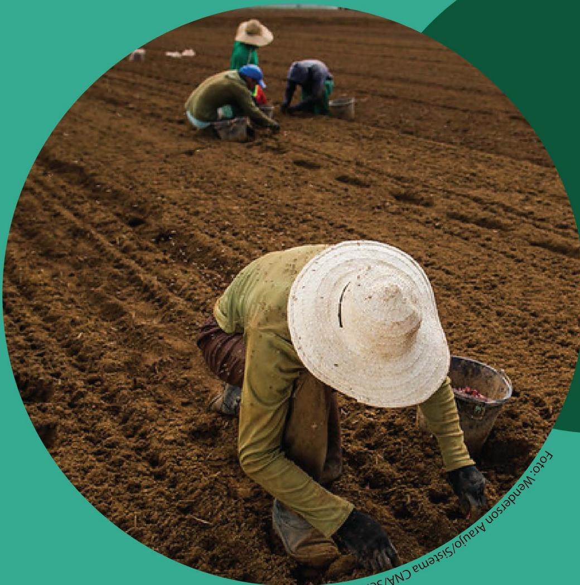

Porto Mariana Aranjo/Sistema CNA/Separa

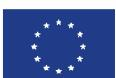

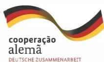

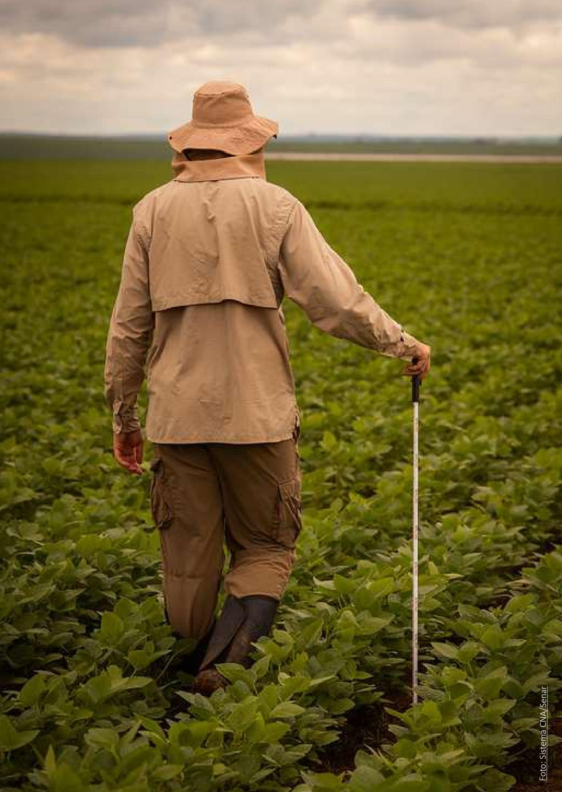

# *Navigating Human Rights Compliance in Brazil's Agricultural Sector*

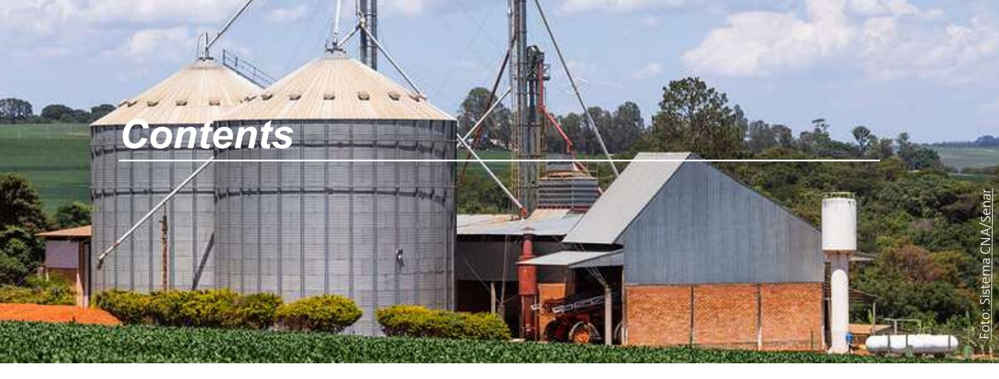

| 1. Executive Summary                                                         | 5  |
|------------------------------------------------------------------------------|----|
| 2. Introduction                                                              | 7  |
| 2.1 Global sustainability trends                                             | 7  |
| 2.2 Plaƞorm AgroBrasil+Sustentável Context                                   | 7  |
| 2.3 Objec�ves of this study and Target audience                              | 8  |
| 3. Methodology                                                               | 9  |
| 4. Discussion and Results                                                    | 12 |
| 4.1 Reflec�ons on the Plaƞorm AB+S                                           | 12 |
| 4.2 Reflec�ons on key Interna�onal Regula�ons                                | 14 |
| 4.3 Reflec�ons on the Schemes analysed                                       | 16 |
| 4.4 A deep dive into the Human Rights topics and Recommenda�ons              | 18 |
| 4.4.1 Labour Rights (includes Forced and Child Labour, and Labour condiƟons) | 18 |
| 4.4.2 IP&LC Rights                                                           | 21 |
| 4.4.3 Land Ownership                                                         | 23 |
| 4.4.4 Grievance Mechanism                                                    | 24 |
| 4.4.5 Gender                                                                 | 25 |
| 4.5 General Challenges and Recommenda�ons                                    | 26 |
| 5. Conclusion                                                                | 28 |
| 6. References                                                                | 29 |
| 7. Annex                                                                     | 31 |
| 7.1 Annex 1 – List of Acronyms                                               | 31 |
| 7.2 Annex 2 – Detailed analysis and Results classifica�on                    | 32 |

# Executive Summary

The AgroBrasil+ Sustentável (AB+S) Platform is seen as a promising solution for increasing transparency and credibility in the monitoring of agricultural supply chains. This contribution is very clear for zero deforestation commitments and demands where monitoring and geospatial databases are public and consolidated. This policy brief explores the platform's potential contributions to compliance and human rights monitoring in agricultural supply chains and provides recommendations for strengthening the social dimension of the platform. It will also explore the broader role of Brazil's agricultural sector in advancing the human rights agenda, aligning with international requirements and reinforcing existing mechanisms.

of Indigenous Peoples and Local Communities and gender equality), as well as monitoring mechanisms (grievance mechanisms).

Key challenges include, but are not limited to, the difficulty of monitoring child labour and broader working conditions, given the absence of comprehensive public databases and the wide variation in rigor across certification schemes; and ensuring respect for the rights of Indigenous Peoples and traditional communities, which requires far more than spatial checks and depends on effective implementation of Free, Prior and Informed Consent (FPIC) as well as improved data for territories still in early stages of recognition; amongst other things.

This study was prepared by Proforest with support from GIZ (SAFE program) and serves as a resource for policymakers, technical teams managing AgroBrasil+Sustentável Platform (AB+S Platform), private sector actors, civil society organizations, and academia committed to driving accountability and continuous improvement.

Findings reveal that while the AB+S Platform is a strategic tool for socio-environmental compliance, its coverage of certain human rights topics remains limited due to gaps in public databases and fragmented information systems. The study also recognises the Platform's intended operational scope which focuses on aggregating official public databases and verified best agricultural practices protocols. The Platform was not designed to address all socio-environmental issues, which is why this policy brief also discusses the role of sectoral actors in advancing the human rights agenda. To address the identified gaps, this document presents a set of recommendations, with a selection highlighted and summarised below:

The analysis combined comparative assessments of the AB+S platform against international regulations, certification standards and sustainability schemes with consultations via interviews and webinars with key stakeholders. The study analysed human rights criteria related to labour (slave labour, child labour, decent working conditions), land and vulnerable groups (rights

| Recommendations to strengthen the social component of the Platform AB+S                                                                            | Recommendations for the government, private sector and civil society                                                                               |                                                                                                                                                                    |
|----------------------------------------------------------------------------------------------------------------------------------------------------|----------------------------------------------------------------------------------------------------------------------------------------------------|--------------------------------------------------------------------------------------------------------------------------------------------------------------------|
| Scale the Ministry of Labour's "dirty list" approach to build equivalent accessible databases; improve interoperability with systems like RadarSIT | Strengthen FPIC processes, through community tailored protocols, clearer government regulations, and improved corporate understanding of the issue | Strengthen Human Rights Due Diligence (HRDD), supported by practical guidance and the National Policy on Business and Human Rights                                 |
| Include information of properties overlapping with territories at earlier stages of recognition                                                    | Encourage producers to adopt the Platform AB+S                                                                                                     | Advance traceability efforts, especially in high risk sectors, to strengthen accountability for human rights violations                                            |
| Work with relevant public institutions to integrate state land registries databases into the Platform                                              | Expand accessible grievance mechanisms and promote transparent reporting of grievance outcome                                                      | Improve companies' ability to identify and act on human rights risks using existing datasets                                                                       |
| Integrate information from existing public grievance channels and enhance accessibility to these mechanisms                                        | Establish gender disaggregated data systems, guidelines, and tools, and training                                                                   | Promote multi stakeholder dialogue to improve data accessibility, harmonize verification criteria, and align national practices with global human rights standards |

Together, these recommenda�ons provide a pathway to strengthen the human rights dimension of sustainability eīorts in the Brazilian agricultural sector so that public and private actors can more eīec�vely map, prevent, and mi�gate human rights risks across supply chains. Implemen�ng these ac�ons will require coordinated engagement between government, companies, sectoral plaƞorms, and civil society. Doing so will help Brazil's agricultural sector to progress toward a more transparent and responsible produc�on and supply chain.

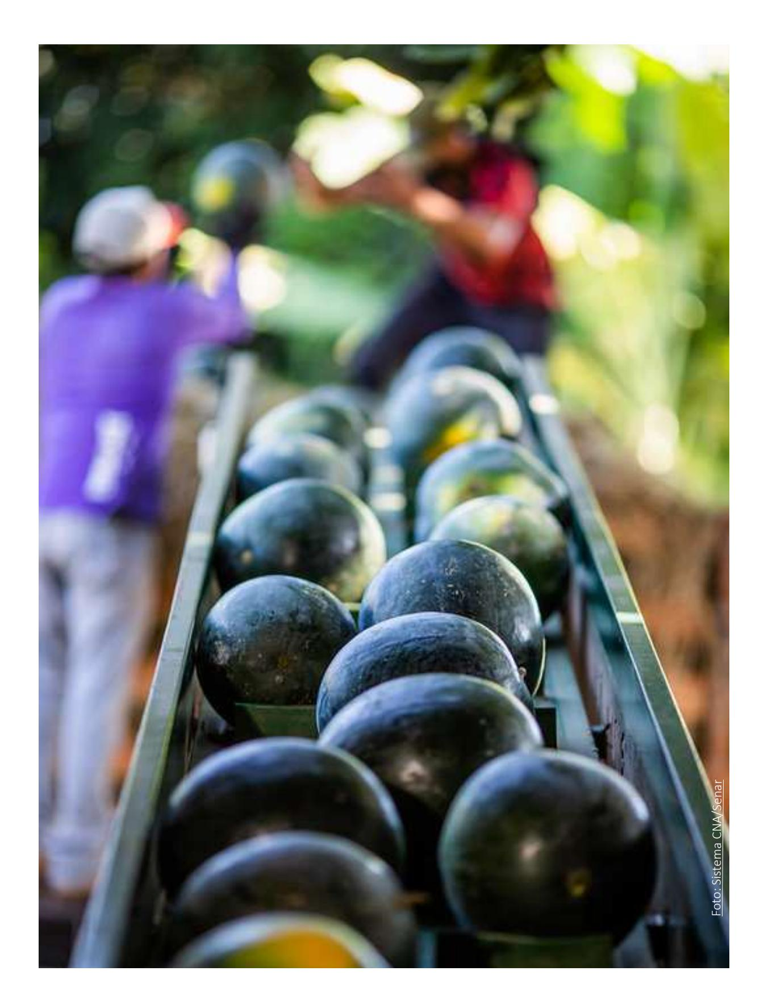

## 2. Introduction

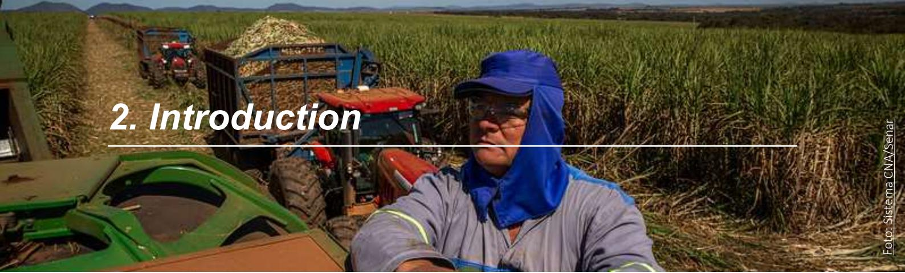

### 2.1 Global sustainability trends

Significant human rights challenges persist in Brazil's agricultural sector. In 2023, over 2,200 land conflicts affected nearly one million people1, often involving evictions and intimidation. Indigenous Peoples, Quilombolas, and other traditional communities face ongoing threats to land and cultural rights, sometimes escalating to violence2. Forced and child labour also remain a concern, frequently linked to hazardous agricultural tasks and poor working conditions3. These are systemic risks linked to gaps in effective due diligence.

These challenges heighten the need for stronger governance and responsible production models. Brazil's rise as a global agribusiness leader has driven significant economic growth, creating an opportunity to embed best practices and advance sustainable development. At the same time, global supply chains are demanding higher standards of sustainability, traceability, and respect for human rights. Buyers, investors, and consumers are prioritizing products that demonstrate compliance with social and environmental principles. This trend is reinforced by international frameworks and legislation imposing stricter requirements on companies and producers. As these legal frameworks come into force, such practices will no longer be voluntary. Rather, they will become legal obligations for exporting goods. In the European Union, for example, three major regulations are shaping global supply chains:

- • EU Deforestation Regulation (EUDR): requires companies to ensure that commodities such as soy, beef, and coffee are not linked to deforestation or forest degradation, demanding robust traceability and due diligence systems.
- • Corporate Sustainability Reporting Directive (CSRD): mandates large and listed companies to publish regular reports on social and environmental risks and opportunities.
- • Corporate Sustainability Due Diligence Directive (CSDDD) / Omnibus Package: establishes obligations for companies to identify, prevent, and mitigate adverse impacts on human rights and the environment across operations and value chains.

As these global requirements intensify, Brazil needs tools that support compliance and responsible production. The Platform AgroBrasil + Sustentável (AB+S)4 responds well to these needs, emerging as a strategic tool that consolidates previously fragmented official databases into a unified system that qualifies rural properties on socio-environmental criteria, promotes transparency in legal compliance and good agriculture practices; and facilitates market access and economic incentives for producers (such as rural credit benefits).

4 Created by the former Secretariat for Innovation, Sustainable Development, Irrigation, and Cooperativism of the Ministry of Agriculture and Livestock (SDI/MAPA), current Rural Development Secretary SDR/MAPA. Governance and Regulatory Framework:

Portaria MAPA nº 745/2024: Established the AB+S Program and its objectives.

Portaria SDI/MAPA nº 721/2025: Defines operational procedures and socio-environmental qualification requirements, ensuring compliance with the LGPD (Brazilian Data Protection Law).

Portaria SDI/MAPA nº 722/2025: Authorizes Serpro to share the AB+S data with financial institutions regulated by the Central Bank.

Portaria Interministerial MAPA/MF nº 22/2025: Recognizes certification bodies and programs such as PI Brasil and BPA, aligning the AB+S with rural credit incentives under CMN Resolution nº 5.152/2024.

1 Comissão Pastoral da Terra (CPT). Conflitos no Campo Brasil 2022. Edição Especial nº 259

2 Conselho Indigenista Missionário (Cimi). Relatório - Violência Contra os Povos Indígenas - Dados de 2024.

3 Reporter Brasil. Meia Infância. O trabalho infanto-juvenil no Brasil hoje. São Paulo, 2024.

## 2.2. Platform AgroBrasil+ Sustentável Context

The AB+S Platform was launched in December 2024 and became operational in early 2025. Its primary purpose is to bring a socio-environmental status to rural properties through a single, integrated repository. The platform enables interoperability with multiple databases, starting with 10 and now expanded to 19, to provide a comprehensive socio-environmental qualification of rural establishments.

Beyond integrating information of verified good agriculture practices certifications, the platform provides services that helps producers check the socioenvironmental status of their property; access compliance reports to demonstrate they meet international market requirements, particularly those of the European Union, while also with efforts on the way for alignment with U.S. and Chinese markets; and, connection to programs such as Good Agricultural Practices and Plano Safra, offering benefits such as a 0.5% discount on financing operations for certified participants.

The Platform also seeks to strengthen the possibility to demonstrate compliance with social and environmental legislation, though few public databases, legal complexity and ongoing traceability challenges hinders this. Furthermore, incentives for adoption are modest, especially among smallholders facing digital and cost barriers.

In terms of coverage, currently, the AB+S Platform evaluates five key criteria:

1. 1. **Property ownership:** confirms legal registration and traceability of rural properties in official systems, using data from the SNCR (Sistema Nacional de Cadastro Rural) and SIGEF (Sistema de Gestão Fundiária).
2. 2. **Property overlaps with protected areas,** including Indigenous Lands, Quilombola Territories, and Conservation Units, based on spatial data from official environmental registries.
3. 3. **Labour rights and tax compliance:** Verifies adherence to labour laws, mostly focused on Forced Labour through the Slave Labour Dirty List and Receita Federal (CPF/CNPJ registries).

1. 4. **Environmental compliance:** assesses conformity with environmental regulations, such as the Forest Code, using data from the CAR (Cadastro Ambiental Rural) and environmental embargo lists from IBAMA.
2. 5. **Monitoring of land use and land cover:** Tracks land use changes through geospatial data and satellite imagery integrated with official monitoring systems (PRODES/INPE).

## 2.3. Objectives of this study and Target audience

This study builds on Proforest's ongoing work on traceability, monitoring, and transparency in beef and soy supply chains5 and aims to identify insights and opportunities to strengthen the human rights dimension of the AB+S platform, while recognizing its intended purpose and limitations to its scope. It will propose actionable measures to enhance the platform's integration of robust human rights criteria and databases and explore the broader role of Brazil's agricultural sector in advancing the human rights agenda.

By mapping good practices and identifying gaps, this report seeks to foster sector-wide dialogue and improvements, such as strengthening human rights criteria in the Platform and in sustainability schemes and enhancing companies' HRDD systems. It serves as a resource for policymakers, technical teams managing the AB+S platform, private sector actors, civil society organizations, and academic institutions committed to driving transparency, accountability, and continuous improvement across Brazil's agricultural sector.

5 In 2025, Proforest released two studies in partnership with Coalizão Brasil Clima, Florestas e Agricultura and supported by GIZ (through the AgriChains and Sustainable Agriculture for Forest Ecosystems programmes) as well as the European Commission's AL Invest Verde programme: Brazilian Exporters and the EUDR: Dry Runs in Beef and Soy supply chains, which examined the practical challenges of EUDR implementation in Brazil, and "Mapping of requirements for the AgroBrasil + Sustainable platform", which analysed existing initiatives that could inform and strengthen the platform's development. Both studies were widely discussed with private-sector actors and civil society through webinars and workshops. The dry-runs analysis also informed exchanges with European Union representatives (including NCAs and the EU Delegation in Brazil), while the AB+S platform assessment supported further technical dialogue with SDR/MAPA.

| <i>Regulation</i>                                           | <i>Certification Schemes (recognized by the Ministry of Agriculture)</i>                        | <i>Other Certification schemes, Instruments and Standards</i>                                                                                                                                           |
|-------------------------------------------------------------|-------------------------------------------------------------------------------------------------|---------------------------------------------------------------------------------------------------------------------------------------------------------------------------------------------------------|
| 1. European Union Deforestation Regulation (EUDR)           | 4. Certifica Minas Café  5. Programa Café Sustentável                                     | 10. Round Table on Responsible Soy (RTRS) 11. Proterra 12. Bonsucro  13. Rainforest Alliance Sustainable Agriculture standard  14. Guia de Indicadores da Pecuária Sustentável (GIPS) |
| 2. Corporate Sustainability Reporting Directive (CSRD)      | 6. Programa Algodão Brasileiro Responsável (ABRAPA)  7. Programa 3S                       | 8. Produzindo Certo (several commodities including soy and beef)  9. Cooxupé Sustainability Protocol                                                                                              |
| 3. Corporate Sustainability Due Diligence Directive (CSDDD) | 16. Beef on Track (BoT) 17. Cerrado Protocol  18. Leather Working Group (LWG) Standard |                                                                                                                                                                                                         |

# *3. Methodology*

The methodology applied in this study aimed to ensure an evidence-based assessment of the AgroBrasil+ Sustentável (AB+S) Plaƞorm's approach to Human Rights, with the objec�ve of iden�fying key concerns, challenges, and opportuni�es, as well as mapping exis�ng and poten�al good prac�ces and tools that support the demonstra�on of legal compliance with Brazilian legisla�on.

### *Process Overview*

### *A. Desk-based review and benchmarking*

The process began with the selec�on of Human Rights criteria, based on key benchmarking plaƞorms (e.g. FEFAC and SAI FSA), interna�onal regula�ons and on na�onal/interna�onal ini�a�ves, schemes and protocols.

In terms of interna�onal regula�ons, EUDR, CSRD and CSDDD were chosen for the analysis, due to the Human Rights set of criteria they request and binding obliga�ons on European companies (that may be sourcing from Brazil), which strongly influence global supply chains, and directly aīect Brazilian agricultural exports. In terms of na�onal and interna�onal ini�a�ves, 15 ini�a�ves were Foto: Sistema CNA/Senar

selected and analysed based on MAPA's list of accepted ini�a�ves that promote Good Agricultural Prac�ces in the primary stage of the agricultural produc�on chain6 , and on relevance and adherence on Brazil's agricultural sector.

The selec�on of Human Rights criteria was based on a desk-based review and benchmarking exercise, which analysed the key human rights criteria against the selected ini�a�ves and regula�ons.

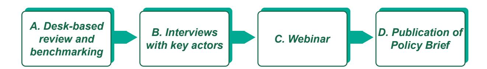

6 [Programas Reconhecidos — Ministério da Agricultura e](https://www.gov.br/agricultura/pt-br/assuntos/sustentabilidade/boas-praticas-agricolas/programas-reconhecidos) [Pecuária](https://www.gov.br/agricultura/pt-br/assuntos/sustentabilidade/boas-praticas-agricolas/programas-reconhecidos)

| Individual Interviews                                           | Open Consultation                                                |
|-----------------------------------------------------------------|------------------------------------------------------------------|
| Associação Brasileira das Indústrias de Óleos Vegetais (ABIOVE) |                                                                  |
| Coalizão Brasil Clima, Florestas e Agricultura                  |                                                                  |
| Ministério da Agricultura e Pecuária (MAPA)                     |                                                                  |
| Associação Brasileira das Indústrias Exportadoras de Carnes     |                                                                  |
|                                                                 | Confederação Nacional dos Trabalhadores Assalariados e           |
|                                                                 | Ins�tuto de Manejo e Cer�ficação Florestal e Agrícola (Imaflora) |
|                                                                 | Ins�tuto Sociedade População e Natureza (ISPN)                   |
|                                                                 | World Wide Fund for Nature (WWF)                                 |

### *Human Rights topics analysed:*

► Forced and child labour (Art.5º, XIII Federal Cons�tu�on; Art. 60 Statute of Children and Adolescents) ► Decent working condi�ons (art. 7º Federal Cons�tu�on; Regulatory Standards such as NR31) ► Indigenous Peoples and Local Communi�es (IP&LC) rights (Art. 215, §1º; Art. 231, Art. 232, Federal Cons�tu�on) ► Land tenure (Art. 5º, XXII Federal Cons�tu�on) ► Gender equality (Art. 5º, I Federal Cons�tu�on)

# *B. Interview with key stakeholders*

Following this analy�cal phase, the study incorporated stakeholder insights through interviews designed to validate the benchmarking results and gather addi�onal inputs. A total of six individual interviews and one group consulta�on with four organisa�ons were conducted with key stakeholders, providing a deeper understanding of prac�cal challenges, opportuni�es, and exis�ng good prac�ces, as well as percep�ons regarding the adequacy and implementa�on of the Plaƞorm's requirements. This approach ensured that recommenda�ons were grounded in both technical standards and opera�onal reali�es.

### *Monitoring mechanism analysed:*

► Grievance mechanisms (Judicial mechanisms – Art. 5º, XXXIV and XXXV Federal Cons�tu�on; Extrajudicial Mechanisms – Art. 3º, §3º Civil Procedure Code)

Beyond having provision in the Brazilian legal system, all of the above-men�oned rights are also present in Interna�onal Human Rights trea�es to which Brazil is a signatory country, and, have therefore, equivalent force to cons�tu�onal law.

### *Key to the analysis of the criteria assessed:*

The Human Rights benchmark followed a framework where each scheme/protocol, or interna�onal regula�on could be classified as:

| 
✓ Fully addressed
    | 
The scheme/protocol or regulation includes a criterion explicitly referring to the Human Rights aspect under analysis and provides a structured indication of mechanisms for demonstrating compliance
    |
|-----------------------------|-----------------------------------------------------------------------------------------------------------------------------------------------------------------------------------------------------------------|
| 
 Partially addressed
 | 
The scheme/protocol or regulation includes a criterion that can be interpreted as related to the Human Rights aspect under analysis and/or lacks clear guidance on how compliance should be demonstrated
 |
| 
✖ Not addressed
      | 
The scheme/protocol or regulation does not include any requirement or indication related to the Human Rights aspect under analysis
                                                                       |

During this round of consulta�ons and interviews, par�cipants suggested addi�onal ins�tu�ons that should be involved in a new round of engagement, which can be incorporated into a next phase. Their recommenda�ons emphasized expanding par�cipa�on to a wider range of stakeholders, including workers' unions, representa�ves of Indigenous Peoples and Local Communi�es (IP&LCs), research ins�tu�ons and industry associa�ons from other agricultural sectors, among others.

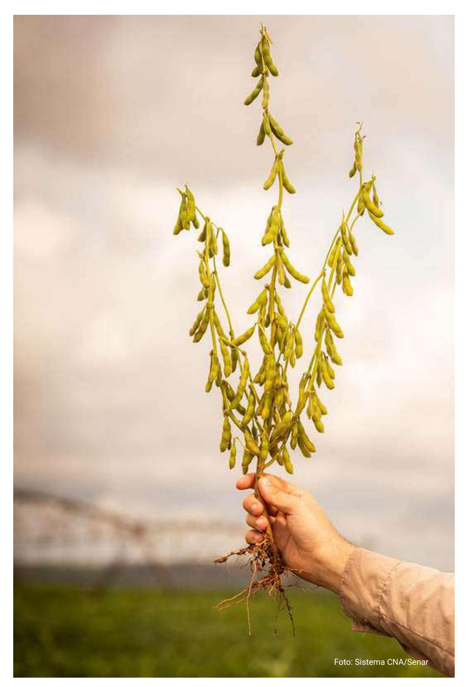

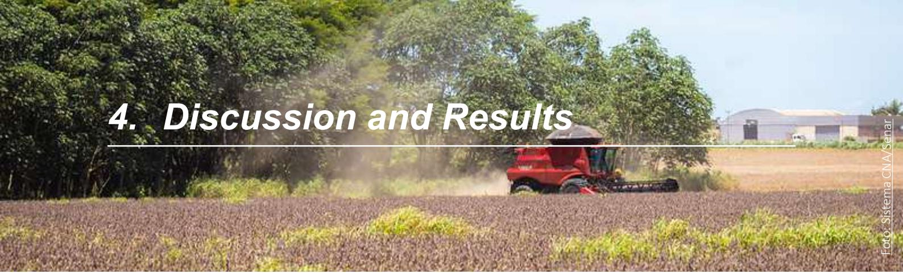

# 4. Discussion and Results

## 4.1 Reflections on the Platform AB+S

Referring to the specific Human Rights topics assessed in this study, the Platform AB+S does not include mechanisms to support the demonstration of compliance with aspects related to child labour, labour conditions, grievance mechanisms, and gender. The platform’s exclusive reliance on official government data for socioenvironmental compliance, together with the limited availability of official databases to monitor these criteria, creates obstacles to integrate existing databases and further demonstrate compliance.

Despite the gaps identified, the platform has proven to

be a robust mechanism for demonstrating compliance with aspects related to land rights, through its integration with SNCR/SIGEF databases, as well for identifying non-compliance with slave labour issues, through the monitoring of the Slave Labour “Dirty List.”

This analysis aims to identify existing requirements and gaps; however, it does not imply that the Platform is responsible for addressing all of them. Recommendations on what actions should be taken and who should lead them are provided as Recommendations in the following sections.

Below is a high-level overview of the Platform’s current coverage of human rights criteria.

|                 | Forced Labour | Child Labour | Labor Conditions | IP&LC rights | Land Ownership | Grievance mechanism | Gender |
|-----------------|---------------|--------------|------------------|--------------|----------------|---------------------|--------|
| Plataforma AB+S | ✓             | ✗            | ✗                | ○            | ✓              | ✗                   | ✗      |

The detailed analysis for each Human Rights criteria can be found on Annex 2.

Although there are gaps, the platform allows producers to register the labels, certifications, or protocols to which they are linked to. Depending on the initiative selected, it is possible to consider a broader set of Human Rights criteria than those currently covered by the platform. AB+S referred in the table above. So, there’s potential within the platform for the demonstration of a broader set of criteria through initiatives, even without direct criteria or mechanism.

The study identified limitations regarding the criteria covered by the platform, with a few summarised below:

- • Labour Rights: the platform relies exclusively on the Slave Labour “Dirty List” and official registries, which only capture confirmed cases of non compliance and provide no mechanism to demonstrate proactive compliance.
- • IP&LC rights: while AB+S verifies overlaps with

homologated territories, it does not monitor violations of territorial rights or impacts on IP&LCs in earlier stages of land recognition, areas that remain highly vulnerable to land grabbing and displacement.

- • Land Rights/Ownership: there is limited integration with state-level land registration systems (e.g., INTERMAT) and accessible public databases to capture information on land conflicts.

Despite these limitations, the Platform enables producers to register the labels, certifications, or protocols with which they are associated, some of which incorporate a broader range of Human Rights criteria than those currently included in the AB+S platform. Therefore, when combined with the Good Agricultural Practices programme, the platform has the potential to demonstrate a wider set of criteria, even in the absence of direct criteria or mechanisms of its own.

|                             | <i>Legal framework for the Platform</i>                                                                                                                                                                         | <i>Responsibility</i>                                                                                                                                                                                                | <i>Existing Requirements</i>                                                                                                                                                            |
|-----------------------------|-----------------------------------------------------------------------------------------------------------------------------------------------------------------------------------------------------------------|----------------------------------------------------------------------------------------------------------------------------------------------------------------------------------------------------------------------|-----------------------------------------------------------------------------------------------------------------------------------------------------------------------------------------|
| <b>Labour Rights</b>        | Art. 1 Interministerial Ordinance MTPS/ MMIRDH nº 4, 11th May 2016                                                                                                                                              | Labour Inspection Secretariat of the Ministry of Labour and Employment                                                                                                                                               | Forced Labour: checks for compliance through official registries (e.g., slave labour "dirty" list and fiscal databases)                                                                 |
| <b>IP&amp;LC Rights</b>     | Art. 1º Decree nº 1.775, 8th Jan 1996 Art. 3º Decree nº 4.887, 20th Nov 2003                                                                                                                                 | National Foundation for Indigenous Peoples (FUNAI) National Institute of Colonisation and Agrarian Reform (INCRA)                                                                                                 | Monitors overlap with protected areas including homologated Indigenous Lands and Quilombola Territories, by cross-referencing CAR polygons with official databases from FUNAI and INCRA |
| <b>Land Ownership</b>       | Art. 2º Decree nº 11.177, 18th Aug 2022 Art. 90 ME Ordinance nº 284, 27th Jul 2020 Art. 2º Decree nº 12.198, 24th Sep 2024 Art. 66 ME Ordinance nº 2.541, 28th Dec 2022 Law nº 5.868, 12th Dec 1972 | Brazilian Institute of Geography and Statistics (IBGE) Brazilian Federal Revenue Service (RFB) Ministry of Management and Innovation in Public Services and National Data Protection Authority (ANPD) INCRA | Requires rural establishments to be registered in SNCR (Sistema Nacional de Cadastro Rural) and CAR (Cadastro Ambiental Rural)                                                          |
| <b>Grievance mechanisms</b> | None                                                                                                                                                                                                            | None                                                                                                                                                                                                                 | None                                                                                                                                                                                    |
| <b>Gender Equality</b>      | None                                                                                                                                                                                                            | None                                                                                                                                                                                                                 | None                                                                                                                                                                                    |

### Table 1. Overview of the Plaƞorm's current legal framework and coverage of human rights criteria

Source: list of legal framework and updated databases for the Plaƞorm AB+S obtained directly with the Ministry of Agriculture, Livestock and Supply – MAPA (to be publicly released in a decree soon, but current databases can be found here).

## 4.2 Reflections on key International Regulations

This section provides an overview of the key international regulations that set mandatory human rights requirements in Europe: EUDR, CSRD, and CSDDD. While EUDR focuses on legality and deforestation-free production, CSRD and CSDDD expand obligations to proactive human rights due diligence and reporting, requiring more comprehensive monitoring of full supply chain than expected at the AB+S platform to Brazilian rural producers.

The platform currently supports verification of EUDR's deforestation criteria, and ongoing efforts aim to expand

its ability to address compliance requirements linked to other regulations, markets, and geographies. For AB+S to effectively support companies in demonstrating compliance with these and other frameworks, it must enable monitoring across the full set of human rights topics covered in this study. The analysis identifies where the Platform already provides relevant information and where additional data and functionalities would be required to strengthen alignment with international due diligence expectations.

Below is a high-level summary of the coverage of human rights criteria within the benchmarking exercise of EU regulations.

|       | Forced Labour | Child Labour | Labor Conditions | IP&LC rights | Land Ownership | Grievance mechanism | Gender |
|-------|---------------|--------------|------------------|--------------|----------------|---------------------|--------|
| EUDR  | ✓             | ✓            | ✓                | ✓            | ✓              | ✗                   | ✗      |
| CSRD  | ✓             | ✓            | ✓                | ✓            | ✗              | ✓                   | ✓      |
| CSDDD | ✓             | ✓            | ✓                | ✓            | ✗              | ✓                   |        |

The detailed analysis for the classification of each Human Rights criteria can be found on Annex 2

*\*Gender-related criteria within the CSDDD remain the only Partially Addressed criteria among the regulations assessed, due to their context-dependent nature. As stated in Recital (33), "Depending on the circumstances, companies may need to consider additional standards... gender, age, race, ethnicity, class, caste... as part of a gender- and culturally responsive approach to due diligence, companies should pay special attention to any particular adverse impacts on individuals who may be at heightened risk due to marginalisation, vulnerability or other circumstances, individually or as members of certain groupings or communities"*

### EU Deforestation Regulation (EUDR)

The EUDR, currently set to start implementation on 30th of December 20267, requires operators to ensure that commodities placed on or exported from the EU market are produced in compliance with the relevant legislation of the country of production (Art. 3). Operators must collect and retain verifiable evidence demonstrating compliance (Art. 9).

Under Article 2, relevant legislation includes laws on land use rights, environmental protection, forest-related rules, third-party rights, labour rights, human rights under international law, FPIC, and tax/trade regulations8.

Overall, EUDR focuses on legal compliance with national legislation but does not explicitly address slave labour, child labour or broader labour conditions. The differing classifications on coverage of these three topics relate to whether national databases or mechanisms exist to help demonstrate compliance. At present, slave labour is the only area with a direct, government-maintained mechanism for verification: the Slave Labour "Dirty List". Additionally, EUDR does not require companies to implement grievance mechanisms or gender-specific measures.

A Proforest study "Exporters from Brazil and EUDR: beef and soy dry runs"9 found that companies in Brazil typically demonstrate legal compliance using common databases such as CAR, Conservation Units, Indigenous Lands, Quilombola Territories, embargo lists, and the Dirty List of

7 Deforestation Regulation implementation - Green Forum - European Commission

8 Regulation (EU) 2023 of the European Parliament and of the Council of 31 May 2023 on the making available on the Union market and the export from the Union of certain commodities and products associated with deforestation and forest degradation

and repealing Regulation (EU) No 995/2010

9 Exporters from Brazil and EUDR: beef and soy dry runs - Proforest

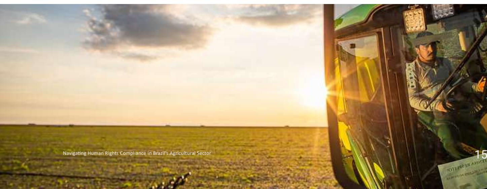

Slave Labour. The AB+S plaƞorm, however, oīers a more robust mechanism for verifying land ownership, which can strengthen compliance and provide more reliable evidence for EUDR requirements. On FPIC, gaps remain regarding interpreta�on and prac�cal evidence, highligh�ng an area for further clarifica�on and opera�onal guidance.

### *Corporate Sustainability Reporting Directive (CSRD)*

It requires large and listed European companies to disclose social and environmental risks, impacts, and mi�ga�on measures in their opera�ons and value chains. Repor�ng must follow the European Sustainability Repor�ng Standards (ESRS), which include detailed indicators on human rights, labour condi�ons, diversity, and grievance mechanisms.

CSRD goes beyond legal compliance, demanding quan�ta�ve and qualita�ve data on issues such as Forced and child labour; Working condi�ons (health and safety, wages, working hours); Freedom of associa�on and collec�ve bargaining; Gender equality and diversity; and Mechanisms for stakeholder engagement and grievance handling.

Among the regula�ons analysed, CSRD is the one with the most explicit and detailed mandatory gender-related repor�ng requirements. It mandates that companies disclose their gender-related policies, iden�fy associated risks and impacts, and implement ac�ons to mi�gate them. In addi�on, companies must report quan�ta�ve indicators such as gender distribu�on at top management levels, the gender pay gap, and other relevant metrics.

By requiring companies to map risks and collect data beyond their direct opera�ons, companies may need to verify suppliers' prac�ces on human rights, such as providing adequate protec�ve equipment, oīering safe housing for temporary workers, preven�ng child labour, or implemen�ng accessible grievance mechanisms for rural workers and communi�es.

### *Corporate Sustainability Due Diligence Directive (CSDDD)*

It establishes obliga�ons for European companies to iden�fy, prevent, and mi�gate adverse human rights and environmental impacts across their opera�ons and value chains, requiring:

- Risk-based due diligence processes
- Integra�on of human rights and environmental considera�ons into corporate policies
- Monitoring and remedia�on mechanisms
- Engagement with aīected stakeholders, including IP&LCs

CSDDD emphasizes proac�ve risk management, not just compliance with na�onal laws. It includes FPIC, protec�on of vulnerable groups, and grievance mechanisms as core elements.

CSDDD does not include explicit gender-related requirements. However, it states that companies may need to consider addi�onal standards depending on context. This includes adop�ng a gender- and culturally responsive approach to due diligence and paying special a�en�on to individuals or groups at heightened risk due to factors such as gender, age, race, ethnicity, class, caste, educa�on, migra�on status, disability, and socioeconomic status (Art. 33)

# *4.3 ReÀections on the Schemes analysed*

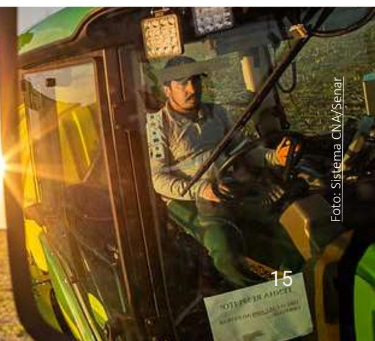

and verifica�on mechanisms. Tools such as the Slave Labour "Dirty List" and the mapping of Indigenous and Quilombola territories by FUNAI and INCRA contribute significantly to compliance with these criteria.

While there are no dedicated official databases for child labour, broader labour condi�ons, and gender, these issues are addressed within some of the ini�a�ves assessed through in loco audits. However, the lack of aligned and standardised verifica�on mechanisms limits the ability to demonstrate compliance eīec�vely.

The context for Land rights/ownership diīers from that of other criteria men�oned, as structured databases and verifica�on mechanisms are already in place for this assessment, including within the AB+S plaƞorm. However, this criterion shows low leverage among the ini�a�ves analysed, as most do not require a dedicated land rights/ ownership evalua�on and instead rely primarily on the Rural Environmental Registry (CAR) to address this aspect.

Similar to land rights and ownership criteria, public and official grievance channels exist for workers and communi�es to submit complaints. However, most ini�a�ves assessed do not require the eīec�ve handling of these grievances mechanisms as a mandatory criterion, nor do they usually extend their internal grievance mechanisms to stakeholders beyond their own employees.

This sec�on evaluates how the schemes and ini�a�ves analysed incorporate human rights requirements and the extent to which these requirements align with the topics assessed in this study. The purpose is not to iden�fy best prac�ces for AB+S to adopt based on these schemes, but rather to clarify:

- which human rights criteria the ini�a�ves include;
- which of these criteria are also covered (fully or par�ally) by the AB+S Plaƞorm; and

*Graph 1. Coverage of the AB+S plaƞorm on human rights topics in a total of 15 iniƟaƟves analysed (full list to be found in SecƟon 3. Methodology).*

- which criteria are not covered by the ini�a�ves.

By doing so, the analysis enables a comparison between the scope of private sector schemes and the AB+S Plaƞorm, highligh�ng convergences, divergences, and gaps that aīects a company's ability to monitor human rights risks across supply chains.

Graph 1 illustrates the level of adherence to human rights criteria in the agricultural sector, showing a direct correla�on between adherence and the existence of official databases

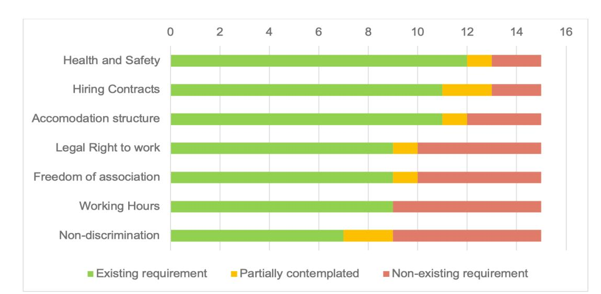

| Forced Labour          | Child Labour Labor |                   |           |        |
|------------------------|--------------------|-------------------|-----------|--------|
|                        | Conditions         | IP&LC rights Land |           |        |
|                        |                    |                   | mechanism | Gender |
|                        | ✔ ✖✔               | ✔                 | ◐         |        |
| Agriculture standard ✔ | ✔                  |                   |           |        |
| ✔                      | ✔                  |                   |           |        |
| ✔                      | ✔                  |                   |           |        |
| ✔                      | ✔                  |                   |           |        |
| ✔                      | ✔                  |                   |           |        |
| ✔                      | ✔                  |                   |           |        |
| ✔                      | ✔                  |                   |           |        |
| ✔                      | ✔                  |                   |           |        |
| ✔                      | ✔                  |                   |           |        |
| ✔                      | ✔                  |                   |           |        |
| ✔                      | ✔                  |                   |           |        |
|                        | ✔                  | ✔                 |           |        |
|                        |                    |                   | ✔         | ✔      |
|                        | ✖ ✖                |                   |           |        |
|                        | ✖ ✖                |                   |           |        |
|                        | ✖ ✖                |                   |           |        |
|                        |                    |                   | ✖         | ✖      |
|                        |                    |                   | ✖         | ✖      |
|                        |                    |                   | ✖         | ✖      |
|                        |                    |                   | ✖         | ✖      |
|                        |                    |                   | ✖         | ✖      |
|                        |                    |                   | ◐         | ◐      |
|                        |                    | ◐                 |           | ◐      |

Table 2. Summary of coverage of key human rights criteria by each scheme analysed

The detailed analysis of each Human Rights criteria can be found on Annex 2.

Labour-related criteria (forced and child labour and working conditions) are generally more prevalent across the assessed schemes. These criteria largely emphasize the use of Brazil's Dirty List for slave labour, adherence to Brazil's comprehensive labour legislation, and on-site verification of child labour and working conditions.

Significant gaps persist in the coverage of IP&LC rights and land rights and ownership requirements, but the AB+S platform offers robust mechanisms and databases to demonstrate land rights, as it integrates comprehensive federal databases such as CAR, SNCR and SIGEF. Most schemes rely on CAR data, an important but self-declared registry that still lacks progress in validation by many state agencies. By grounding assessments in official systems, AB+S platform sets a stringent standard for demonstrating land ownership.

The adoption of other human rights aspects (gender equality and grievance mechanisms) is very limited, with only a few schemes including specific requirements on these topics.

Coverage of human rights criteria also varies significantly by sector. Protocols for beef tend to have fewer requirements on comprehensive labour standards compared to those for soy, coffee or cotton, which often include more detailed criteria on working conditions and social protections. Additionally, soy and beef protocols show stronger attention to IP&LC rights, probably responding to the potential higher risk of land conflicts and territorial impacts in these supply chains.

This diverse coverage highlights sector-specific priorities and gaps, emphasising the need for standards that address all key human rights dimensions consistently and that better integrate underrepresented criteria, such as gender equality and grievance mechanisms. This would enhance the robustness of private sector performance and transparency, by closing critical gaps, and strengthen alignment with global human rights expectations, supporting compliance with international due diligence requirements.

In the next section, we will go through a deep dive into the coverage of initiatives analysed in specific human rights topics.

## **4.4 A deep dive into the Human Rights topics and Recommendations**

This section provides a deeper analysis of how the human rights topics selected for this study are currently covered by the AB+S platform and the sustainability schemes assessed, and consolidates the key challenges identified across these sources by examining each topic in detail (labour rights, IP&LC rights, land rights/ownership, grievance mechanisms,

and gender) this section seeks to clarify where gaps persist and which measures could support a more comprehensive and robust human rights approach across Brazil's agricultural sector.

The recommendations presented seek to:

- ▶ **Strengthen the AB+S Platform** by integrating more robust human rights criteria and databases, thereby enhancing its capacity to meet both national and international human rights standards.
- ▶ **Foster sector-wide dialogue**, discussing the roles of key actors across the agricultural supply chain, encouraging coordinated action and shared responsibility in advancing the human rights agenda in Brazil's agricultural sector.

Recommendations are directed to the following actors:

- ▶ **AB+S Platform:** Actions focus on the platform's ability to incorporate new requirements, databases, and verification mechanisms.
- ▶ **Public institutions:** Considering that the Platform aggregates data rather than create databases, actions highlight the role of public institutions in improving information accessibility and enabling its integration into the Platform.
- ▶ **Private sector (companies and industry associations):** Actions aim to strengthen the approach to human rights within the agricultural sector.
- ▶ **Civil society:** Actions emphasize the role of civil society in providing guidance and capacity building to drive the human rights agenda across the sector.

### **4.4.1 Labour Rights (includes Forced and Child Labour, and Labour conditions)**

Key legal and normative references governing workers' rights in Brazil include Constitution (Arts. 5 and 7), Statute of the Child and Adolescent – ECA (Law 8.069/1990), Ministry of Labour Normative Instructions (e.g., MTP No. 2/2021, Art. 23), and Regulatory Standards such as NR-31 on Safety and Health in Agricultural Work. Internationally, Brazil has ratified ILO Conventions 29 and 105 (forced/compulsory labour), 138 and 182 (minimum age/worst forms of child labour) and adheres to the UN Guiding Principles on Business and Human Rights (UNGPs). These standards form the baseline for scheme criteria and due diligence expectations across supply chains.

All assessed schemes explicitly prohibit forced and slave

labour and most also ban child labour, with the exception of some cattle-sector initiatives (Green Seal of Pará, Beef on Track, Cerrado Protocol), which rely solely on available public databases. Non-compliance with either criterion generally leads to exclusion from certification. For forced labour, most schemes rely exclusively on the Ministry of Labour’s “Dirty List,” with few complementing this with qualitative audits or legal compliance checks.

Table 3. Verification Methods and Evidence indicated in the initiatives assessed

| Aspect                       | Forced Labour                                                                                                                           | Child Labour                                                                                                                                                          |
|------------------------------|-----------------------------------------------------------------------------------------------------------------------------------------|-----------------------------------------------------------------------------------------------------------------------------------------------------------------------|
| <b>Database Cross-Checks</b> | CPF/CNPJ verification against Ministry of Labour’s “Dirty List” of slave labour cases                                                   | No databases available                                                                                                                                                |
| <b>On-Site Audits</b>        | Interviews, visual inspections, review of working conditions during field visits                                                        | Interviews with managers/workers, visual inspections, verification of school attendance for children living on-site                                                   |
| <b>Document Analysis</b>     | Examination of legal records, enforcement notices, and any prosecutions related to labour violations                                    | Review of employment records to confirm age of workers, apprenticeship contracts, compliance with hazardous/night work restrictions for adolescents (16–18 years old) |
| <b>Evidence</b>              | Valid labour licenses, absence of forced labour indicators, and documentation linking property owners or tenants to official registries | Written policies prohibiting child labour, school enrolment records, transportation provision for schooling                                                           |

For broader labour topics, as shown in Graph 2, the schemes analysed place the greatest emphasis on Health & Safety, contractual agreements, and accommodation standards, while giving comparatively less attention to legal right to work, freedom of association, and working hours. Non-discrimination emerges as the least addressed criterion.

Most schemes require compliance with national labour legislation (such as the CLT and Regulatory Standards - NRs) and, to some extent, international standards like ILO Conventions (29, 105, 100, 111, 87, 98, 190). Core obligations typically include legal registration of workers, formal employment contracts, provision of safe and adequate housing and facilities, and implementation of health and safety measures—covering risk assessments, training, and medical checks.

Requirements on working hours, rest periods, and overtime limits, as well as freedom of association and collective bargaining, are less explicitly stated in scheme criteria. However, these aspects are often indirectly addressed through the requirement to comply with Brazilian law. For example, NR-31 (Safety and Health in Agricultural Work) sets detailed obligations for rural

employers, including limits on working hours, provision of rest breaks, safe accommodation, sanitary facilities, and measures to prevent occupational hazards. By referencing NR-31, schemes effectively incorporate these protections even when not spelled out in their own standards.

Verification of child labour and broader labour rights is constrained by the absence of centralized public databases and by confidentiality restriction on sensitive information. As a result, schemes need to rely primarily on on-site audits and documentary evidence evaluation, which often increases time and resource demands. In higher risk sectors, some schemes also require third party checks of subcontractors. Child labour verification may include preventive measures such as confirming school attendance and safe conditions for adolescents. Broader labour requirements show proactive elements driven by national legislation, particularly health and safety requirements like risk mapping under occupational health programs (PPRA, PCMSO).

Finally, commitments to freedom of association and equal treatment and non-discrimination are included but often lack robust implementation, which depends heavily on audit depth and worker interviews.

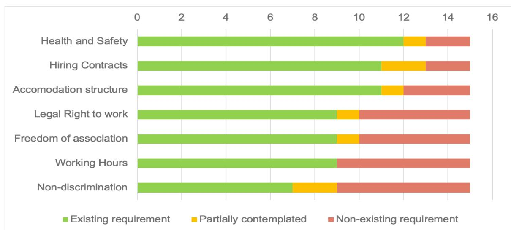

- o RadarSIT10 oīers some level of transparency on child labour and labour infrac�ons, but access to relevant data requires formal requests to the Ministry of Labour, adding bureaucracy. Plans exist to expand and improve RadarSIT for greater transparency, which could make it a valuable resource for the Plaƞorm. o Eīorts to create a public "child labour dirty list" face significant opera�onal and poli�cal barriers. Although the Ministry of Labour records employers fined for child labour, a�empts to formalise and publish this data have stalled due to sensi�vity and poli�cal constraints, leaving the Plaƞorm reliant on incomplete public sources.
- Complexity of measuring compliance: Brazil has advanced labour legisla�on, but assessing compliance to this legisla�on is difficult. Issues like informal work, valua�on of infrac�ons, and defining what cons�tutes a "severe" versus "minor" viola�on add layers of nuance. 10 [Radar SIT | Trabalho Infantil](https://qlik-publico.paineis.gov.br/extensions/radar-trabalho-infantil/radar-trabalho-infantil.html)
- Document Analysis: Employment contracts, payroll records, FGTS compliance cer�ficates, collec�ve bargaining agreements, medical cer�ficates, Health and Safety risk maps.
- On-Site Audits: Interviews with property managers and workers, visual inspec�ons of accommoda�on, cafeterias, and sanitary facili�es.
- Third-Party Assessments for subcontracted opera�ons.
- Evidence: Labour licenses, �me and a�endance records, housing condi�ons reports, occupa�onal health programs (PPRA, PCMSO), and photographic documenta�on. Summarised below are some of the key challenges to strengthening and opera�onalising labour rights requirements in the Plaƞorm:
- Limita�on of the "Dirty List": While the "Dirty List" is a reliable source for confirmed forced labour viola�ons, it covers only cases with final decisions and no pending appeals, limi�ng transparency around ongoing judicial proceedings.
- Limited public data and transparency hurdles: Beyond forced labour, monitoring child labour and general working condi�ons is complex due to the lack of comprehensive, accessible databases.

*Graph 2. Coverage of broader labour topics in schemes analysed* 

In terms of verifica�on methods used, schemes tend to use a combina�on of the following:

| Recommendations                                                                                                                                                                                                                                                                                                                             | Target actor                         |
|---------------------------------------------------------------------------------------------------------------------------------------------------------------------------------------------------------------------------------------------------------------------------------------------------------------------------------------------|--------------------------------------|
| Explore and engage with civil society organizations and public institutions on approaches to identify and address the risk of child labor in the agribusiness sector, respecting sensitivity and confidentiality.                                                                                                                           | <b>Government and Civil Society</b>  |
| Organize, standardize, and promote transparency of existing public databases (e.g. RadarSIT) in formats that can be integrated into the AB+S platform and used by sustainability schemes for verification, as well as companies and sectoral institutions to manage labour violations in their supply chain and strengthen risk assessments | <b>Government (MTE)</b>              |
| Require the Certificate of No Outstanding Labour Debts 11 , issued by the Ministry of Labour, as proof of no pending debts across a broader set of labour-related infractions                                                                                                                                                    | <b>AB+S Platform, Private Sector</b> |

11 Emitir Certidão de Débitos Trabalhista

## 4.4.2 IP&LC Rights

10 out of the 15 schemes analysed explicitly mention IP&LC rights in their requirements. Generally, these schemes monitor overlaps between CAR polygons and Indigenous or Quilombola territories, but this monitoring is mostly limited to areas in advanced stages of recognition, which includes Indigenous lands classified as Declared, Homologated, or Regularized (per FUNAI's demarcation stages) and Quilombola territories classified as Titled (per INCRA's stages). Territories in early stages of recognition remain more vulnerable to human rights violations and conflicts, despite the existence of public databases (FUNAI and INCRA) that allow such overlaps to be assessed for risk of conflicts.

IP&LC categories in Brazil extend beyond Indigenous and Quilombola communities and include a wide range of traditional groups such as extractive communities, riverine populations, quebradeiras de coco babaçu, and traditional pasture-sharing communities (de fundos e fechos de pasto). However, there is no consolidated national database for these groups beyond Quilombola territories and agrarian reform settlements. Although 28 segments of traditional peoples and communities are officially recognised, available data largely focuses on Indigenous Peoples and Quilombolas (IBGE, 2022). As a result, these other communities are rarely considered in the initiatives analysed and are not fully integrated into the AB+S platform, limiting the ability to identify, monitor, and address potential rights violations.

An additional challenge relates to individuals or groups with legitimate territorial rights—such as families in agrarian

reform settlements or communities in Extractive Reserves (RESEX) and other collectiveuse areas—who often cannot use AB+S to qualify or demonstrate the status of their territories. Although these groups are legally recognised as protected rightsholders, the Platform currently does not offer a mechanism for uploading or validating collective land use documentation, which prevents their inclusion in the system. This further underscores that strengthening the Platform requires not only integrating additional data sets but also enabling participation by all categories of rightsholders.

Respecting IP&LC rights requires more than checking overlaps with officially recognised territories. It also involves respecting FPIC, as established in the UN Declaration of the Rights of Indigenous Peoples and detailed in guidance from the UN Office of the High Commissioner for Human Rights.

FPIC requires consent before actions such as:

- • Implementing projects that affect rights to land, territory, and natural resources
- • Relocating Indigenous peoples from their lands or territories
- • Providing restitution or other appropriate reparations when lands have been confiscated, occupied, or damaged without FPIC

Brazil has formally committed to FPIC through international agreements such as ILO Convention 16912 and the UN Declaration on the Rights of Indigenous Peoples (2007),

|                                                                                       | Recommendations Target actor earlier stages of recogni�on. Tools and Data sources: AB+S Platform FUNAI’s Indigenous land database (public) INCRA’s Quilombola land database (public) Strengthen monitoring of overlaps, applying diīeren�ated measures:                                                                                                                                                                                                   |
|---------------------------------------------------------------------------------------|-----------------------------------------------------------------------------------------------------------------------------------------------------------------------------------------------------------------------------------------------------------------------------------------------------------------------------------------------------------------------------------------------------------------------------------------------------------|
| i. Block volumes from areas overlapping with homologated/recognized territories       | (as currently prac�ced)                                                                                                                                                                                                                                                                                                                                                                                                                                   |
| ii. Check for overlaps with territories in the recogni�on process for risk assessment | and priori�za�on and establish corresponding ac�on plans to prevent and address poten�al rights viola�ons aīec�ng the iden�fied territories and communi�es. Tools and Data sources (in addi�on to FUNAI and INCRA’s): Private Sector, Civil Society                                                                                                                                                                                                       |
| Tô no Mapa,                                                                           | by IPAM, ISPN AND Rede Cerrado                                                                                                                                                                                                                                                                                                                                                                                                                            |
| Observatório Socioambiental,                                                          | by Fern and ISPN, and other civil society organisa�ons                                                                                                                                                                                                                                                                                                                                                                                                    |
| Report                                                                                | “Conflicts in the countryside ” by Pastoral Land Commission (CPT)                                                                                                                                                                                                                                                                                                                                                                                         |
| Report                                                                                | “Violence Against Indigenous Peoples In Brazil ” by Indigenous Missionary Council (CIMI) Organize, standardize and improve exis�ng data on tradi�onal communi�es (e.g., extrac�ve, riverine, Quebradeiras de coco babaçu, pasture-sharing communi�es) in formats that can be integrated into the AB+S plaƞorm and Government (INCRA, MDA and IBAMA) used by sustainability schemes for verifica�on, as well as companies and strengthen risk assessments. |

within Brazil's legal framework and aligning with interna�onal standards.

In terms of the schemes analysed, only 7 out of 15 schemes analysed explicitly reference FPIC in their requirements, including Programa Café Sustentável, Proterra and Rainforest Alliance Sustainable Agriculture Standard.

Addi�onally, a few schemes across sectors (GIPS, RTRS, ABRAPA, Programa Café Sustentável) include explicit requirements for addressing land conflicts. They require evidence that threats to local communi�es' culture, way of life, or land rights are monitored, and that any disputes are resolved through transparent, legal, and peaceful processes, par�cularly those involving Indigenous or other tradi�onal communi�es.

as well as na�onal instruments like the 1988 Cons�tu�on (Ar�cle 231), the Statute of Indigenous Peoples (Law No. 6001/1973), and the Environmental Licensing Law (Law No. 6938/1981). Despite this regulatory founda�on, its implementa�on remains a challenge. Key barriers include the absence of specific na�onal regula�ons with clear parameters and implementa�on guidelines to opera�onalise FPIC; a historical focus on large-scale infrastructure projects; the need for coordina�on among mul�ple stakeholders; and the inherently �me-intensive nature of meaningful consulta�on processes.

A key development for a proper implementa�on of FPIC is the draŌ resolu�on by the Conselho Nacional de Jus�ça (CNJ)13, which sets parameters for prior consulta�on with Indigenous, Quilombola, and tradi�onal communi�es in judicial and administra�ve processes, represen�ng an important step toward ins�tu�onalizing FPIC prac�ces

### 13 [https://www.cnj.jus.br/](https://www.cnj.jus.br/wp-content/uploads/2025/09/sei-2288631-minuta-de-resolucao-parametros-consulta-povos-indigenas-quilombolas-e-tradicionais.pdf)

| Recommendations                                                                                                                                                                                                                                                                                                                                                                                                                                                                                                                                                                     | Target actor                         |
|-------------------------------------------------------------------------------------------------------------------------------------------------------------------------------------------------------------------------------------------------------------------------------------------------------------------------------------------------------------------------------------------------------------------------------------------------------------------------------------------------------------------------------------------------------------------------------------|--------------------------------------|
| Include mechanisms to enable legally recognized collective-use rightsholders (families in agrarian reform settlements, RESEX, and other collective use territories) to upload or validate appropriate documentation of land use rights.                                                                                                                                                                                                                                                                                                                                             | <b>AB+S Platform</b>                 |
| Support the development and dissemination of FPIC protocols tailored to different high-risk territories and communities and promote a shared understanding of how FPIC should be applied in practice. This includes clarifying acceptable forms of evidence and documentation that producers and Brazilian upstream companies can use to demonstrate compliance with FPIC requirements.                                                                                                                                                                                             | <b>Private Sector, Civil Society</b> |
| Advance with the development of clear governmental regulations and guidelines for FPIC, aligned with Brazil's commitments under ILO Convention 169 and the UN Declaration on the Rights of Indigenous Peoples. Build on initiatives such as the CNJ draft resolution to institutionalize FPIC in judicial and administrative processes.                                                                                                                                                                                                                                             | <b>Government, Civil Society</b>     |
| 
For producers who are already legally required to undergo environmental licensing, companies should request evidence of this process as part of their own due diligence process. As complex environmental licenses processes typically require community consultations prior to project implementation, this can support reporting on FPIC rights.
 
Similarly, the AB+S platform could include in the qualification requirements the information that the property has the applicable environmental licenses required, beyond the checking of environmental embargoes.
 | <b>Private Sector, AB+S Platform</b> |

Some schemes go further by requiring active engagement with communities located within or near farms that may be affected by operations. This includes identifying community concerns, informing them about complaint procedures, and ensuring mechanisms for dialogue and resolution.

### 4.4.3. Land Rights/ Ownership

Many schemes analysed rely on the CAR (Cadastro Ambiental Rural) as evidence of land ownership (marked as 'partially covered' in analysis in chapter 4.3.1 – table 2), with few schemes explicitly requiring evidence of legal title to land. CAR is an important mandatory tool for integrating environmental information on rural properties and is widely used today for supplier monitoring in Brazil. However, its purpose is environmental compliance, not attesting land rights. The Brazilian Law no. 12.651/2012, Art. 29, §2 clearly states: “*The registration shall not be considered a*

*title for the recognition of property or possession rights, nor does it eliminate the need to comply with the provisions of Art. 2 of Law No. 10.267, of August 28, 2001.*” Although the validation of CAR is progressing at different speeds at state level monitoring the CAR database remains essential for companies’ risk management processes and supplier monitoring criteria.

Moreover, the AB+S platform relies on CAR and additional sources, such as SNCR and SIGEF, to check land ownership requirements. These databases provide a stronger basis for verifying land ownership because the responsibility for certifying land use rights lies with INCRA, through the CCIR (Certificado de Cadastro de Imóvel Rural) and georeferencing in SIGEF (Sistema de Gestão Fundiária). While CAR’s geolocation largely serves operational purposes, ideally at least the CCIR should be collected from producers to support demonstrating land rights, especially considering that SIGEF’s database is still incomplete14.

14 Exporters from Brazil and EUDR: beef and soy dry runs - Proforest

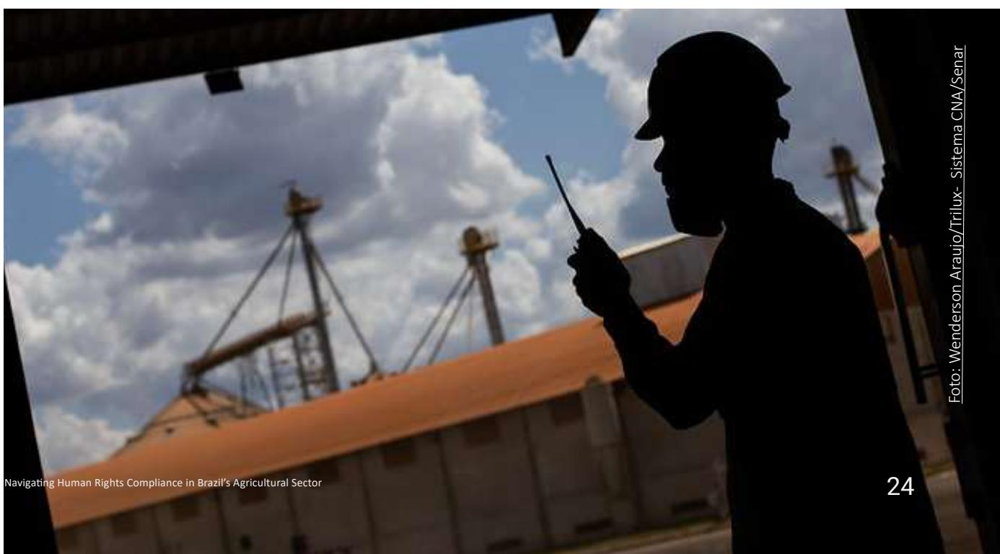

Regarding the AB+S plaƞorm, it does not include mechanisms to capture complaints from workers or external stakeholders, nor is it integrated with exis�ng public grievance systems to capture exis�ng complaints against producers that have adhered to the Plaƞorm. This gap also relates to low dissemina�on and limited trust in grievance channels, restricted coverage for diīerent stakeholder groups (par�cularly IP&LCs and outsourced workers), lack of procedures to verify or audit submi�ed complaints, and confiden�ality risks associated with whistleblower protec�on and data privacy.

# *4.4.4. Grievance Mechanism*

Most schemes include requirements on having grievance mechanisms, primarily focused on providing channels for employees to submit complaints, oīering limited accessibility to external stakeholders, such as local communi�es and outsourced workers. Some schemes go beyond requiring the existence of channels, manda�ng that complaints are addressed and resolved, and stakeholders are informed about the availability of these channels.

| Recommendations                                                                                                                                                                                            | Target actor                            |
|------------------------------------------------------------------------------------------------------------------------------------------------------------------------------------------------------------|-----------------------------------------|
| Encourage rural producers to adopt the AB+S platform as a tool to strengthen land ownership monitoring, as it already provides a solid verification mechanism and includes plans for further improvements. | <b>Private Sector</b>                   |
| Promote integration of state land registration systems into the AB+S platform to improve data completeness and reduce fragmentation.                                                                       | <b>AB+S Platform</b>                    |
| Promote coordination between federal and state land agencies to standardize data formats and improve interoperability, reducing inconsistencies and conflicts.                                             | <b>Government (INCRA, MDA, and MGI)</b> |

Finally, the lack of integrated land rights data across federal and state agencies, incomplete and incoherent land �tle registries, and lack of CAR analysis and valida�on creates significant challenges for data consolida�on, increasing the risk of inconsistencies and poten�al conflicts. States such as Pará, Mato Grosso, and Tocan�ns maintain separate land management systems (ITERPA, INTERMAT and ITERTINS, respec�vely) that operate independently from na�onal plaƞorms. Their diīering data structure and processes make harmonisa�on difficult, limi�ng the ability to produce a consolidated and coherent picture of land governance in Brazil.

inclusion (Programa Café Sustentável), demonstra�on of equal treatment and condi�ons (Proterra), promo�on of women's empowerment and par�cipa�on in skilled or leadership roles (Bonsucro), and board-level commitment to gender equality (Rainforest Alliance Sustainable).

While these requirements aim to ensure no dis�nc�on between workers, they typically lack specific ac�ons to promote women's par�cipa�on or address gender-specific challenges in the workplace.

Similarly, the AB+S plaƞorm does not include any criteria or mechanisms to capture gender-specific informa�on. Brazil lacks na�onal historical databases or structured systems that could be integrated to demonstrate compliance with gender-related requirements, par�cularly in the agricultural sector.

# *4.4.5. Gender*

Brazilian legisla�on on gender equality is quite robust, anchored in the Federal Cons�tu�on of 1988 (Art. 5) and reinforced by recent laws, such as the Equal Pay Law (Law 14.611/2023) for equitable remunera�on, the Maria da Penha Law (Law 11,340/2006) with its updates to tackle gender violence, and laws that promote female empowerment and protec�on against harassment and discrimina�on.

S�ll, gender is an underrepresented criterion in the schemes assessed, appearing mostly within broader requirements on equal treatment or non-discrimina�on. Only 4 schemes analysed (Programa Café Sustentável, Proterra, Bonsucro and Rainforest Alliance Sustainable) include gender as a standalone criterion. These schemes incorporate a genderlens by requiring analysis on gender equity and social

| Recommendations Target actor interna�onal standards, and include status and results of exis�ng processes. Relevant public mechanisms:                                                                                                                                                                                                                                                                         |
|---------------------------------------------------------------------------------------------------------------------------------------------------------------------------------------------------------------------------------------------------------------------------------------------------------------------------------------------------------------------------------------------------------------|
| ► Agricultural Concilia�on Chamber (INCRA) and Na�onal Agrarian Ombudsman (MDA) for land-related disputes. AB+S Platform in collaboration with                                                                                                                                                                                                                                                                |
| ► Sistema Ipê – Trabalho Escravo (MTE): A secure digital channel for repor�ng forced public institutions (MTE, INCRA, MDA, labour cases MPT)                                                                                                                                                                                                                                                                  |
| ► Disque 100 (Na�onal Human Rights Ombudsman): The main federal hotline for repor�ng human rights viola�ons, including labour exploita�on and human trafficking. Free, 24/7, and anonymous.                                                                                                                                                                                                                   |
| ► Ministério Público do Trabalho (MPT): Online portal and mobile app (MPT Pardal) for submiƫng detailed complaints and a�aching evidence. func�onality, accessibility and culturally appropriate communica�on.                                                                                                                                                                                                |
| ► A good example is “Nossa Voz” , a grievance mechanism for agricultural workers in Brazil, oīering a free, confiden�al channel (via WhatsApp) to report labour rights Private Sector, Civil Society viola�ons and fostering dialogue among companies, workers, and ins�tu�ons to promote decent work and compliance with interna�onal standards.                                                             |
| ► Some ini�a�ves already approved in the Best Agricultural Prac�ces programme require grievance channels (such as ABRAPA, Cargill Triple S, and Produzindo Certo) and they can be leveraged. However, their eīec�veness may vary. (e.g., number of complaints received, resolved, and pending) and status and Private Sector, Civil Society results of exis�ng processes to improve accountability and trust. |

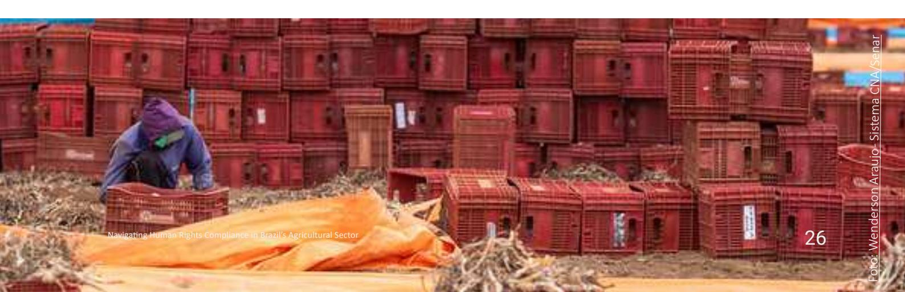

Although this has been a recurring priority in the Ministry of Labour's agenda, with a dedicated coordina�on in place, policy development and implementa�on remain at an early stage. For now, companies and producers aiming to meet interna�onal standards must establish their own processes to collect and report gender-disaggregated data.

| Recommendations                                                                                                                                                                                                            | Target actor                                              |
|----------------------------------------------------------------------------------------------------------------------------------------------------------------------------------------------------------------------------|-----------------------------------------------------------|
| Enhance policy development on gender and promote accessible databases and tools that enable gender-disaggregated analysis and monitoring (e.g. Salary transparency report panel 1 ).                            | <i>Government (e.g., MTE, MMULHERES)</i>                  |
| Create clear, harmonized guidelines for monitoring, collecting gender-disaggregated data, and demonstrating compliance with gender-related requirements in sustainability programmes.                                      | <i>Private Sector, Civil Society</i>                      |
| Promote risk assessments/studies and develop frameworks to identify gender-related risks in the agricultural sector, including barriers to participation, discrimination, and access to resources.                         | <i>Public institutions, Private Sector, Civil Society</i> |
| Integrate gender criteria into sustainability schemes, moving beyond generic equality and non-discrimination clauses by incorporating explicit gender requirements into sustainability standards and verification systems. | <i>Private Sector, Civil Society</i>                      |
| Provide training and resources for companies and producers on gender-sensitive practices, data collection, and reporting aligned with international human rights standards.                                                | <i>Private Sector, Civil Society</i>                      |

iden�fied fall outside its mandate.

To fully meet na�onal legal requirements and interna�onal expecta�ons, and to strengthen the management of human rights risks in agricultural supply chains, diīerent actors will need to advance in collabora�ve and complementary ac�ons. These include mechanisms for proac�ve risk iden�fica�on, accessible grievance channels, gender-responsive data, and other elements. The recommenda�ons presented here aim to contribute to addressing these gaps and to support progress on the human rights agenda in the private sector.

# *4.5. General Challenges and Recommendations*

In addi�on to the topic-specific gaps and opportuni�es iden�fied in this study, there are broader systemic challenges that hinder proac�ve human rights management across the agricultural sector. This sec�on outlines these crosscuƫng gaps and oīers recommenda�ons for how they may be addressed. While the AB+S plaƞorm helps increase transparency by consolida�ng exis�ng public databases and promo�ng Good Agricultural Prac�ces that go beyond legal requirements, several of the gaps

1[Relatório de Igualdade Salarial](https://relatoriodetransparenciasalarial.trabalho.gov.br/)

| Gaps                                                                                                                                                                                                                                                                                                                                                                                                                                                                                                                                                                | Recommendations                                                                                                                                                                                                                                                                                                                                                                                                                                                                                                                                                                                                                                                                                                                                                                                                                                                                                                                                                                                                                                                                                                                                                                                                      |
|---------------------------------------------------------------------------------------------------------------------------------------------------------------------------------------------------------------------------------------------------------------------------------------------------------------------------------------------------------------------------------------------------------------------------------------------------------------------------------------------------------------------------------------------------------------------|----------------------------------------------------------------------------------------------------------------------------------------------------------------------------------------------------------------------------------------------------------------------------------------------------------------------------------------------------------------------------------------------------------------------------------------------------------------------------------------------------------------------------------------------------------------------------------------------------------------------------------------------------------------------------------------------------------------------------------------------------------------------------------------------------------------------------------------------------------------------------------------------------------------------------------------------------------------------------------------------------------------------------------------------------------------------------------------------------------------------------------------------------------------------------------------------------------------------|
| 
Most companies rely on existing certification and verification programmes but lack structured HRDD systems capable of assessing risks beyond the specific geographical areas covered by these schemes, making it difficult to identify, monitor, and address human rights violations effectively and across all their supply chains (including non-certified suppliers).
 
While certification schemes provide valuable on the ground checks that go far beyond what public databases can capture, they are not designed to replace comprehensive HRDD.
 | <ul> <li>• The <b>Private Sector</b> should implement Human Rights Due Diligence (HRDD) frameworks aligned with international standards to enhance visibility and mitigate risks across operations and supply chains, particularly for volumes not covered by any certification or initiative</li> <li>• <b>Civil society and sectoral entities</b> should develop and harmonize practical HRDD guidance, creating user-friendly tools for agricultural companies, while continuing to build capacity and foster dialogue on the importance of HRDD implementation</li> <li>• <b>Government</b> should institutionalize HRDD requirements for companies in Brazil, leveraging the development of the National Policy on Business and Human Rights</li> </ul>                                                                                                                                                                                                                                                                                                                                                                                                                                                         |
| 
For several human rights topics there are no comprehensive, accessible databases. which limits the private sector's ability to define clear verification criteria and practical measures for compliance.
 
Available data can support risk assessment and prioritisation, but it cannot replace on-the-ground verification, particularly for salient human rights issues.
                                                                                                                                                                               | 
<b>Government, Private sector and Civil Society</b> should collaborate to create structured, accessible and integrated databases for gender, IP&amp;LCs and other human rights topics, enabling integration into sustainability schemes and platforms like the AB+S and strengthening monitoring of IP&amp;LC rights across production landscapes
                                                                                                                                                                                                                                                                                                                                                                                                                                                                                                                                                                                                                                                                                                                                                                                                                                                             |
| 
The lack of traceability makes it difficult to link socioenvironmental violations to specific producers. Although widely promoted, Brazil still has no legal framework for socioenvironmental traceability for all commodities. Initiatives such as those led by the <u>Brazilian Coalition</u> aim to improve systems in sectors like beef and soy, but until these frameworks advance, responsible sourcing efforts will continue to face accountability gaps.
                                                                                             | 
The <b>Government</b> should prioritise traceability improvements in high-risk sectors (such as beef and soy) to enable linkage between violations and specific suppliers, supporting risk-based decision-making and enhancing accountability
                                                                                                                                                                                                                                                                                                                                                                                                                                                                                                                                                                                                                                                                                                                                                                                                                                                                                                                                                                 |
| 
Brazilian legislation is strict but relies heavily on proving non-compliance. National systems lack the scale and resources to ensure compliance, creating a gap between legal requirements and practical enforcement
                                                                                                                                                                                                                                                                                                                                        | 
The <b>Private Sector</b> could strengthen their capacity and commitment to proactively conduct risk assessments and act on these results, by leveraging the wide range of existing databases and information sources, which can help map risks across critical areas such as land conflicts, violations of labour and land rights, and other issues
 
The <b>Government</b> should leverage existing databases to develop comprehensive risk maps and implement targeted actions to monitor higher risk areas and work on capacity building of producers and key actors in priority areas and Human Rights topics. This approach (already on the government's radar through data collected via the Platform) will enable more efficient resource allocation and strengthen enforcement where it is most needed
 
<b>All:</b> Leverage mechanisms that go beyond compliance monitoring, foster multi-stakeholder dialogue between government, private sector, and civil society to harmonize verification criteria, improve data accessibility, develop capacity building to producers and key stakeholders on Human Rights, and align national practices with international human rights standards
 |

## 5. Conclusion

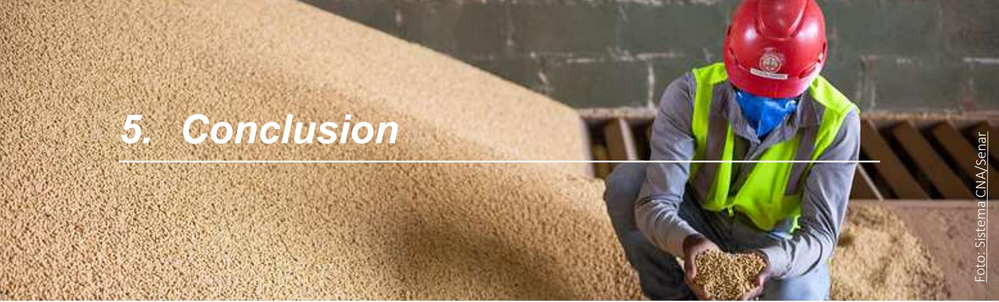

Advancing the human rights agenda in Brazil's agricultural sector, particularly on matters of land conflicts, child and slave labour, IP&LC rights, and gender issues, is not only a moral imperative but also a strategic necessity to maintain global market access and credibility. The Platform AgroBrasil+ Sustentável (AB+S) represents a significant step toward transparency and socio-environmental compliance, yet its current scope, reliance on fragmented public data, and restricted transparency (limited to participating producers), highlight the need for complementary actions across the private sector. Strengthening human rights compliance cannot rest solely on the Platform; it requires coordinated efforts from government, private sector, and civil society to close systemic gaps and align practices with international standards.

The challenges identified, such as limited data for monitoring labour rights, insufficient risk management and actions to uphold the rights of Indigenous Peoples, Traditional and Local communities, the absence of a gender perspective across the sector, and the lack of integration and transparency in grievance frameworks, highlight the complexity of embedding human rights into agricultural value chains. Closing these gaps requires a coordinated, multi-stakeholder approach that prioritizes improved data accessibility, implementation of robust Human Rights Due Diligence (HRDD) systems by companies, strengthened and accessible grievance mechanisms, and targeted support for producer adoption of AB+S, alongside other measures to fully integrate human rights considerations into agricultural supply chains.

Such measures are essential to move beyond mere legal compliance towards proactive risk management that drives meaningful changes in behaviours and practices across the agricultural sector. By leveraging the AB+S platform as a foundation and advance in discussions to implement the recommendations outlined in this brief, stakeholders can drive systemic changes that protects vulnerable groups, strengthens accountability, and positions Brazil as a global leader in sustainable and responsible production.

Foto: Sistema CNA/Senar

Agência Gov (MAPA/Serpro). Governo lança a Plataforma Agro Brasil + Sustentável (funcionalidades e integrações). 19 Dec 2024. Available at: h�ps:// agenciagov.ebc.com.br/noticias/202412/governofederal-lanca-a-plataforma-agro-brasil-sustentavel

Ministério do Trabalho e Emprego (MTE). Cadastro de Empregadores que submeteram trabalhadores a condições análogas à escravidão ("Lista Suja") atualização e base norma�va. 7 Oct 2024. Available at: h�ps://www.gov.br/trabalho-e-emprego/pt-br/ noticias-e-conteudo/2024/Outubro/mte-atualizacadastro-de-empregadores-que-submeteramtrabalhadores-a-condicoes-analogas-a-escravidao

Portaria Interministerial MTE/MDHC/MIR nº 18, de 13 de setembro de 2024. Regras do Cadastro ("Lista Suja"). DOU. Available at: h�ps://www.legisweb.com. br/legislacao/?id=464582

Gov.br — Serviço. Radar SIT: Painel de Informações e Estaơs�cas da Inspeção do Trabalho (inclui Trabalho Infan�l). Úl�ma atualização 15 Dec 2025. Available at: h�ps://www.gov.br/pt-br/servicos/acessar-radar-sit

Secretaria de Inspeção do Trabalho (SIT). Comunicado oficial sobre o Radar SIT (página da SIT). Available at: h�ps://sit.trabalho.gov.br/radar/

Ministério do Trabalho e Emprego. Norma Regulamentadora nº 31 (NR31) — Segurança e Saúde no Trabalho na Agricultura. Página oficial. Atualizada 24 Oct 2025. Available at: Norma Regulamentadora No. 31 (NR-31) — Ministério do Trabalho e Emprego

# *6.3. International human rights and labour standards*

ILO. Forced Labour Conven�on, 1930 (No. 29). Official text. Available at: h�ps://www.ilo.org/media/21026/ download

ILO / OHCHR. Aboli�on of Forced Labour Conven�on, 1957 (No. 105). Official text. Available at: h�ps://www. ohchr.org/en/instruments-mechanisms/instruments/

### *6.1. International regulations and guidance*

European Commission. Regula�on (EU) 2023/1115 on deforesta�onfree products (EUDR). Official Journal text (EURLex). 31 May 2023. Available at: https://environment.ec.europa.eu/topics/forests/ deforestation/regulation-deforestation-freeproducts\_en

European Commission. Commission No�ce — Guidance document for Regula�on (EU) 2023/1115 on deforesta�onfree products. 13 Nov 2024. Available at: COMMISSION NOTICE – GUIDANCE DOCUMENT for Regula�on (EU) 2023/1115 on deforesta�on-free products

European Commission (DG FISMA). Corporate Sustainability Repor�ng (CSRD) — overview and �meline. Updated 9 Dec 2025. Available at: Corporate sustainability repor�ng - Finance - European Commission

European Union. Direc�ve (EU) 2024/1760 on Corporate Sustainability Due Diligence (CSDDD). Official Journal text (EURLex). 5 Jul 2024 (consolidated 17 Apr 2025). Available at: Direc�ve - EU - 2024/1760 - EN - EUR-Lex

### *6.2. Brazil — AB+S Platform and national legal/ institutional sources*

Ministério da Agricultura e Pecuária (MAPA). Programa Agro Brasil + Sustentável (AB+S). Official portal. Available at: h�ps://www.gov.br/agricultura/pt-br/ assuntos/sustentabilidade/programa-agro-brasilsustentavel

Portaria MAPA nº 745, de 20 de dezembro de 2024. Ins�tui o Programa e a Plataforma Agro Brasil + Sustentável. Diário Oficial da União. 23 Dec 2024. Available at: h�ps://www.legisweb.com.br/ legislacao/?id=470937

aboli�on-forced-labour-conven�on-1957-no-105

ILO / OHCHR. Minimum Age Conven�on, 1973 (No. 138). Official text. Available at: h�ps://www.ohchr.org/ en/instruments-mechanisms/instruments/minimumage-conven�on-1973-no-138

United Na�ons / OHCHR. United Na�ons Declara�on on the Rights of Indigenous Peoples (UNDRIP). Official page. Available at: h�ps://www.ohchr.org/en/ indigenous-peoples/un-declara�on-rights-indigenouspeoples

INTERNATIONAL LABOUR ORGANIZATION. Indigenous and Tribal Peoples Conven�on (No. 169). Geneva: ILO, 1989. Ra�fied by Brazil via Decreto nº 5.051, de 19 de abril de 2004. Consolidated under Decreto nº 10.088, de 5 de novembro de 2019. Available at: h�ps://www. ilo.org/dyn/normlex/en/f?p=NORMLEXPUB:12100:0:: NO::P12100\_ILO\_CODE:C169

# *6.4. FPIC and justice system developments (Brazil)*

Conselho Nacional de Jus�ça (CNJ). Minuta de Resolução — parâmetros de consulta prévia a povos indígenas, quilombolas e comunidades tradicionais (FPIC) em processos judiciais e administra�vos. 2025 draŌ. Available at: h�ps://www.cnj.jus.br/wp-content/ uploads/2025/09/sei-2288631-minuta-de-resolucaoparametros-consulta-povos-indigenas-quilombolas-etradicionais.pdf

### *6.5. Sector reports and civil society sources used in the brief*

Coalizão Brasil Clima, Florestas e Agricultura. Mapeamento de Requisitos para a Plataforma Agro Brasil + Sustentável (AB+S) — relatório de referência. 2025. Available at: h�ps://coalizaobr.com.br/ wp-content/uploads/2025/05/Mapeamento-de-Requisitos-para-a-Plataforma-Agro-Brasil-Sustentavel-AB-S.pdf

Reporter Brasil. Meia Infância: o trabalho infantojuvenil no Brasil hoje. 2024/2025 edi�on. Available at: h�ps://reporterbrasil.org.br/wp-content/ uploads/2025/02/20240511\_Meia-Infancia\_WEB.pdf

Comissão Pastoral da Terra (CPT). Conflitos no Campo — Relatório 2024/2025. Available at: h�ps:// cptnacional.org.br/wp-content/uploads/2025/03/ pastoral-da-terra-ed-259.pdf

CIMI — Conselho Indigenista Missionário. Relatório — Violência contra os Povos Indígenas no Brasil (dados de 2024). Available at: h�ps://cimi.org.br/wpcontent/uploads/2025/07/relatorio-violencia-povosindigenas-2024-cimi.pdf

### *6.6. Tools and grievance channels cited as good practices/examples*

Sistema Ipê (MTE). Canal oficial para denúncias de trabalho escravo. Landing page: h�ps://ipe.sit. trabalho.gov.br

BRASIL. Ministério Público do Trabalho. Canal de denúncias — MPT. Available at: h�ps://www.mpt. mp.br/servicos/denuncias

"Nossa Voz". Grievance mechanism for agricultural workers in Brazil (civil society ini�a�ve). Available at: h�ps://nossavoz.org.br/

Tô no Mapa (IPAM/ISPN/Rede Cerrado). Plataforma colabora�va de mapeamento de comunidades tradicionais. Available at: h�ps://tonomapa.org.br

Observatório Socioambiental (Fern/ISPN e parceiros). Módulo "Conflitos Sociais". h�ps://staging.social.vps1. geoda�n.com/conflitos-sociais

# 7. Annex

## 7.1. Annex 1 – List of Acronyms

| <b>ABIEC</b>  | Brazilian Association of Meat Exporting Industries |
|---------------|----------------------------------------------------|
| <b>ABIOVE</b> | Brazilian Association of Vegetable Oil Industries  |
| <b>ABRAPA</b> | Brazilian Association of Cotton Producers          |
| <b>ANDP</b>   | National Data Protection Authority                 |
| <b>BOT</b>    | Beef on Track                                      |
| <b>BPA</b>    | Good Agricultural Practices                        |
| <b>CAR</b>    | Rural Environmental Registry                       |
| <b>CIMI</b>   | Indigenous Missionary Council                      |
| <b>CLT</b>    | Consolidation of Labor Laws                        |
| <b>CMN</b>    | National Monetary Council                          |
| <b>CNJ</b>    | National Council of Justice                        |

| <b>CNPJ</b>   | National Registry of Legal Entities              |
|---------------|--------------------------------------------------|
| <b>CONTAR</b> | National Confederation of Rural Waged Workers    |
| <b>CPF</b>    | Individual Taxpayer Registry                     |
| <b>CPT</b>    | Pastoral Land Commission                         |
| <b>CSDDD</b>  | Corporate Sustainability Due Diligence Directive |
| <b>ECA</b>    | Child and Adolescent Statute                     |
| <b>ESRS</b>   | European Sustainability Reporting Standards      |
| <b>EUDR</b>   | European Union Deforestation Regulation          |
| <b>FGTS</b>   | Severance Indemnity Fund for Employees           |
| <b>FUNAI</b>  | National Foundation for Indigenous Peoples       |
| <b>GIPS</b>   | Sustainable Livestock Indicators Guide           |

| <b>GIZ</b>       | German Agency for International Cooperation                        |
|------------------|--------------------------------------------------------------------|
| <b>HRDD</b>      | Human Rights Due Diligence                                         |
| <b>IBAMA</b>     | Brazilian Institute of Environment and Renewable Natural Resources |
| <b>IBGE</b>      | Brazilian Institute of Geography and Statistics                    |
| <b>ILO</b>       | International Labour Standards                                     |
| <b>INCRA</b>     | National Institute for Colonization and Agrarian Reform            |
| <b>INTERMAT</b>  | Mato Grosso Land Institute                                         |
| <b>IP&amp;LC</b> | Indigenous Peoples and Local Communities                           |
| <b>ISPN</b>      | Society, Population, and Nature Institute                          |
| <b>LWG</b>       | Leather Working Group                                              |
| <b>MAPA</b>      | Ministry of Agriculture and Livestock                              |
| <b>MDA</b>       | Ministry of Agrarian Development and Family Farming                |
| <b>MMIRDH</b>    | Ministry of Women, Racial Equality, and Human Rights               |
| <b>MMULHERES</b> | Ministry of Women                                                  |
| <b>MPT</b>       | Labor Prosecutor's Office                                          |

| <b>MTE</b>        | Ministry of Labor and Employment                                                                   |
|-------------------|----------------------------------------------------------------------------------------------------|
| <b>MTPS</b>       | Ministry of Labor and Social Security                                                              |
| <b>NCA</b>        | National Competent Authorities                                                                     |
| <b>FPIC</b>       | Free, Prior, and Informed Consent                                                                  |
| <b>NR / NR-31</b> | Regulatory Standards (Normas Regulamentadoras), incl. NR-31 (Safety & Health in Agricultural Work) |
| <b>PCMSO</b>      | Medical Occupational Health Control Program                                                        |
| <b>PPRA</b>       | Environmental Risk Prevention Program                                                              |
| <b>RFB</b>        | Federal Revenue Service of Brazil                                                                  |
| <b>RTRS</b>       | Round Table on Responsible Soy Association                                                         |
| <b>SAFE</b>       | Sustainable Agriculture for Forest Ecosystems                                                      |
| <b>SDR</b>        | Rural Development Secretariat                                                                      |
| <b>SIGEF</b>      | Land Management System                                                                             |
| <b>SNCR</b>       | National Rural Registry System                                                                     |
| <b>UNDRIP</b>     | United Nations Declaration on the Rights of Indigenous Peoples                                     |
| <b>UNGPs</b>      | United Nations Guiding Principles on Business and Human Rights                                     |

# *7.2. Annex 2 – Detailed analysis and Results classi¿cation*

|                               | Fully Addressed                                                                                                                                                                                                                                                  | Partially Addressed                                                                                                                                                                                         | Not Address                       |
|-------------------------------|------------------------------------------------------------------------------------------------------------------------------------------------------------------------------------------------------------------------------------------------------------------|-------------------------------------------------------------------------------------------------------------------------------------------------------------------------------------------------------------|-----------------------------------|
| <b>Forced Labour</b>          | Criteria explicitly require evidence of compliance using defined mechanisms (e.g., MTE Slave Labour "Dirty List") and/or riskbased assessment and actions                                                                                                        | Criteria mention forced labour compliance but do not specify mechanisms or evidence needed, and/or mention the need of complying with national legislation(s) on forced labour                              | No forced-labour requirements     |
| <b>Child Labour</b>           | Criteria prohibit child labour and require evidence such as contract/age verification, interviews, or onsite checks, and/or riskbased assessment and actions                                                                                                     | Criteria mention child labour but lack verification methods or clear guidance, and/or mention the need of complying with national legislation(s) on child labour                                            | No child-labour requirements      |
| <b>Labour Conditions</b>      | Criteria cover a broad range of labour standards aligned with Brazilian law (e.g., legal right to work, contracts, nondiscrimination, working hours, accommodation, health and safety, freedom of association). Full fulfilment of all subtopics is not required | General reference to labour law without specifying standards or verification methods, and/or mention the need of complying with national legislation(s) on labour conditions                                | No labour-conditions requirements |
| <b>IP&amp;LC Rights</b>       | Criteria explicitly require protection of IP&LC rights, including checks on overlaps with Indigenous/ Quilombola territories, FPIC, and/or land or culture related risk management processes, and/or riskbased assessment and actions                            | Criteria mention IP&LC rights but lack mechanisms or evidence requirements, and/or mention the need of complying with national legislation(s) on IP&LC rights                                               | No IP&LC related requirements     |
| <b>Land Rights/ Ownership</b> | Criteria require evidence of legal land rights (e.g., SNCR/CCIR, SIGEF) and/or measures to manage land related risks and prevent conflicts                                                                                                                       | Criteria request documents like CAR (useful for due diligence but not proof of ownership) or mention land rights without specifying verification method, and/or mention the need of complying with national |                                   |

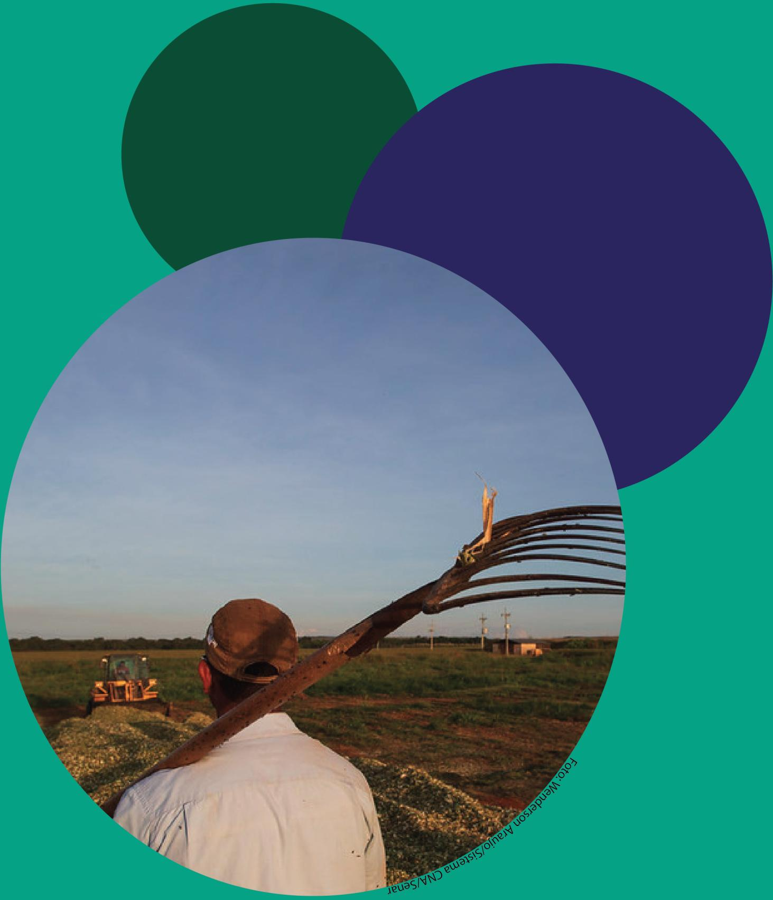