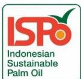

# Joint gap assessment of the EUDR information needs and information availability from the Indonesian Sustainable Palm Oil (ISPO) certification

Indonesian Sustainable Palm Oil (ISPO) and the European Forest Institute (EFI)

# Contents

| <b>SUMMARY .....</b>                                                                                                                                        | <b>2</b>  |
|-------------------------------------------------------------------------------------------------------------------------------------------------------------|-----------|
| <b>1. INTRODUCTION .....</b>                                                                                                                                | <b>5</b>  |
| 1.1 THE EU DEFORESTATION REGULATION.....                                                                                                                    | 5         |
| 1.2 THE INDONESIAN SUSTAINABLE PALM OIL (ISPO) CERTIFICATION .....                                                                                          | 5         |
| <b>2. OBJECTIVES AND SCOPE .....</b>                                                                                                                        | <b>6</b>  |
| <b>3. EUDR INFORMATION NEEDS AND INFORMATION AVAILABLE FROM ISPO CERTIFICATION .....</b>                                                                    | <b>7</b>  |
| 3.1 EUDR ARTICLE 9 – INFORMATION REQUIREMENTS .....                                                                                                         | 7         |
| 3.1.1 ARTICLE 9 (1)(A)(B)(C)(E)– PRODUCT AND BUYER/SELLER INFORMATION .....                                                                                 | 8         |
| 3.1.2 ARTICLE 9 (1)(D) – GEOLOCATION .....                                                                                                                  | 9         |
| 3.1.3 ARTICLE 9(1)(G) – DEFORESTATION-FREE .....                                                                                                            | 10        |
| 3.1.4 ARTICLE 9 (1)(H) – LEGALITY .....                                                                                                                     | 11        |
| 3.2 TRACEABILITY INFORMATION .....                                                                                                                          | 14        |
| 3.3 EUDR ARTICLE 10 – RISK ASSESSMENT.....                                                                                                                  | 16        |
| 3.3.1 ARTICLE 10(C)(D) AND (E) – INFORMATION REGARDING INDIGENOUS PEOPLES.....                                                                              | 18        |
| 3.3.2 ARTICLE 10(G) – THE SOURCE, RELIABILITY, VALIDITY, AND LINKS TO OTHER AVAILABLE DOCUMENTATION OF THE INFORMATION REFERRED TO IN ARTICLE 9(1) ..... | 18        |
| 3.3.3 ARTICLE 10(I) - COMPLEXITY OF THE SUPPLY CHAIN .....                                                                                                  | 18        |
| 3.3.4 ARTICLE 10(J) – RISK OF CIRCUMVENTION OR MIXING PRODUCTS OF UNKNOWN ORIGIN OR FROM AREAS WHERE DEFORESTATION HAS OCCURRED .....                    | 19        |
| 3.3.5 ARTICLE 10(M) – ANY INFORMATION THAT WOULD POINT TO A RISK THAT THE RELEVANT PRODUCTS ARE NON-COMPLIANT .....                                      | 19        |
| 3.3.6 ARTICLE 10(N) – COMPLEMENTARY INFORMATION PROVIDED BY CERTIFICATION SCHEMES.....                                                                      | 20        |
| <b>4. POTENTIAL ISPO ADAPTATIONS .....</b>                                                                                                                  | <b>21</b> |
| 4.1 ARTICLE 9 (1)(D) – GEOLOCATION .....                                                                                                                    | 21        |
| 4.2 ARTICLE 9 (1)(G) – DEFORESTATION-FREE .....                                                                                                             | 21        |
| 4.3 ARTICLE 9 (1)(H) – LEGALITY .....                                                                                                                       | 21        |
| 4.4 TRACEABILITY .....                                                                                                                                      | 22        |
| 4.5 ARTICLE 10 – RISK ASSESSMENT .....                                                                                                                      | 22        |
| 4.6 OTHER AREAS.....                                                                                                                                        | 22        |
| <b>APPENDIX 1: EUDR DUE DILIGENCE STATEMENT .....</b>                                                                                                       | <b>23</b> |

## **Summary**

Information collected and verified as part of the Indonesian Sustainable Palm Oil (ISPO) certification shows a level of commonality with information that European Union (EU) operators are required to collect under the European Union Deforestation Regulation (EUDR). Several criteria under EUDR Article 9 show alignment with information collected as part of ISPO certification including description of product, quantity, supplier information and legal status of the area of production. Information on claims and consultation with 'traditional law communities', supply chain complexity, and risk of mixing of palm oil required under EUDR Article 10 are additional areas in which information from ISPO certification could be of use. Information gaps exist in relation to the following key EUDR information requirements:

#### **1. Geolocation information**

- Geolocation information in line with EUDR requirements is available for plantations >25 hectares from Plantation Business Permits (IUP), and for plantations <25 hectares from Cultivation Registration Certificates (STD-B). However, STD-B roll-out has been held back by slow tenure legality clarification processes and a lack of human and financial resources.
- ISPO does not have an operational IT system that could be linked to the data platforms for Plantation Business Permits (IUP – SIPERIBU[N](#page-2-1)1 data platform) and Cultivation Registration Certificates (STD-B – e-STD-B data platform) to allow the transfer of geolocation information to EU operators.

#### **2. Deforestation-free information**

- ISPO does not follow the EUDR/FAO forest and deforestation definitions.
- The ISPO regulations do not define a deforestation cut-off date.
- New planting requirements prohibiting development of new plantations on natural forest and peat-moss do not apply to plantations less than 25 hectares.
- Deforestation according to the EUDR/FAO definition is allowed for oil palm plantations outside of officially designated forest areas (*Kawasan hutan*).

#### **3. Legality information**

- Information regarding the legal status of the area of production in terms of human rights protected under international law is not available.
- Information on labour rights, Free, Prior and Informed Consent (FPIC) and in relation to tax, anti-corruption, trade and customs regulations is not available for smallholders.

#### **4. Traceability**

- Assessment of supply chain certification only begins after 16 November 2025.
- Without an operational IT system, ISPO does not have dedicated capability to link to the e-STD-B and SIPERIBUN data platforms and other platforms where geolocation information in line with EUDR requirements is stored, and from which information could be transferred to EU operators.

1 Sistem Informasi Perizinan Perkebunan/Plantation Licensing Information System

- The ISPO Mass Balance supply chain model allows for mixing of ISPO-certified products with products that are not verified regarding legality, geolocation or deforestation-free production.
- Transfer of geolocation information for plots of land managed by independent smallholders is hampered due to intermediaries not being certified and/or being required to collect and submit geolocation information.

#### **5. Risk assessment (Article 10)**

- Information gathered as part of ISPO certification, such as documentation of land claims, SOPs, FPIC process, audit reports, etc., is not available to supply chain actors or EU operators carrying out due diligence.
- Information connecting palm oil to the area of production is not available for smallholders, as intermediaries (FFB dealers/traders) are not required to collect and pass on this information under the ISPO regulations.
- The availability of information on the complexity of the supply chain and risk of mixing with deforestation-related products is seriously limited by the lack of an operational ISPO traceability system and the limited sector coverage of ISPO certification.
- Reports by independent observers and dispute resolution reports or summaries of these reports are not available. The ISPO complaints mechanism/process is not clear and outcomes are not made public.
- There are no clear requirements for Certification Bodies' (CBs) audit reports or public summaries of audit reports to be made public.

Key adaptations to the ISPO certification to align with the EUDR requirements include:

#### **1. Geolocation information**

- Incorporate geolocation reporting in line with EUDR requirements.
- Specify geolocation information format for EU operators.

#### **2. Deforestation-free information**

- Align forest definitions with EUDR/FAO and set a deforestation cut-off date before 31 December 2020.
- Extend the prohibition of new plantations in natural forests and peat-moss land to smallholders.
- Enforce rules to prevent new planting in forest areas regardless of land classification.
- Expand audit requirements to monitor deforestation-free production.

#### **3. Legality information**

- Include a list of laws applicable in Indonesia concerning the legal status of the area of production in terms of human rights protected under international laws
- Adapt ISPO principles for smallholders regarding legality of area of production in line with EUDR requirements.

#### **4. Traceability**

- Speed up the establishment of an ISPO IT system as per Regulation 38/2020 and include functionality to transfer geolocation and relevant information to EU operators.
- Require intermediaries to be certified to allow the transfer of geolocation information collection from smallholders.
- Strengthen the Mass Balance supply chain model to include EUDR-relevant information for non-ISPO certified components.

#### **5. Risk assessment (Article 10)**

- Make ISPO certification information, including land claims and audit reports, available to EU operators.
- Certify intermediaries to facilitate information collection on palm oil production and supply chain complexity.
- Make independent observer reports and dispute resolution summaries available to EU operators.
- Clarify the ISPO complaints mechanism and make outcomes accessible.
- Make audit reports/public summaries by CBs available.

#### **6. Other areas**

- Accelerate STD-B (*Surat Tanda Daftar Budidaya*/Cultivation Registration Certificate) issuance for smallholders to provide geolocation and land legality documentation.
- Accelerate ISPO certification to achieve 100% sector coverage.
- Develop an ISPO registry for certified entities linked to the IT system.

## **1. Introduction**

## **1.1 The EU Deforestation Regulation**

The European Union Deforestation Regulation (EUDR) aims at minimising the risk that products from supply chains associated with deforestation or forest degradation are placed on the EU market or exported from it and increasing EU demand for and trade in legal and 'deforestation-free' commodities and products.

The EUDR sets mandatory due diligence rules for operators placing relevant products on the EU market or exporting them from the EU. Operators and traders will have to confirm through a due diligence statement that the relevant products are deforestation free (produced on land that has not been subject to deforestation after 31 December 2020 as per the EUDR/FAO forest definition) and legal, i.e. produced in accordance with the relevant legislation of the country of production[2](#page-5-2) . Operators and traders placing relevant products on the EU market will need to comply with the EUDR rules as of 30 December 2024. Operators and traders that are small- and medium-enterprises (SMEs) will have six additional months.

Palm oil is one of the seven commodities covered by the EUDR. In Indonesia, palm oil makes a significant contribution to the economy and to rural livelihoods due to the large number of smallholder farmers included in the production base. The EU is a significant market for Indonesian palm oil, ranking third as an export destination after India and China.

The EUDR acknowledges a role for "certification or other third-party verification systems" as a source of information for the risk assessment stage of the due diligence process (Article 10 (2)(n)), provided that the information meets the requirements set out in Article 9. There is no obligation for operators and traders to use any traceability system or scheme in meeting their obligation to collect and submit required information, notably geolocation information.

## **1.2 The Indonesian Sustainable Palm Oil (ISPO) certification**

The Indonesian Sustainable Palm Oil (ISPO) certification was introduced in 2011 as a national palm oil sustainability standard which aims to establish minimum sustainability criteria for the palm oil sector, in line with relevant national legal and regulatory requirements. A revision of the ISPO standards began in 2016 and, in 2020, two new regulations were introduced: (i) Presidential Regulation No. 44 of 2020 on Indonesian Sustainable Palm Oil (ISPO) Certification and (ii) Minister of Agriculture Regulation Number 38 of 2020 on the technical implementation of ISPO certification.

The goals of ISPO are to align Indonesian palm oil production with international developments and legal requirements, to make production more sustainable, to promote acceptability and competitiveness of Indonesian palm oil in international markets, and to help the reduction of greenhouse gas emissions. ISPO certification covers the upstream sector and is primarily focused on oil palm plantations. The certification follows seven principles for companies and five principles for smallholders, with the Principles and Criteria (P&C) for

2 'Relevant legislation of the country of production' means the laws applicable in the country of production concerning the legal status of the area of production in terms of: (a) land use rights; (b) environmental protection; (c) forest-related rules, including forest management and biodiversity conservation, where directly related to wood harvesting; (d) third parties' rights; (e) labour rights; (f) human rights protected under international law; (g) the principle of free, prior and informed consent (FPIC), including as set out in the UN Declaration on the Rights of Indigenous Peoples; (h) tax, anti-corruption, trade and customs regulations.

smallholders being less complex than those for companies. Under the ISPO standards, smallholders are defined as individuals owning less than 25 hectares of land and to be certified, independent smallholder must belong to a smallholder group.

The authority to issue ISPO certificates is with independent ISPO Certification Bodies (CBs) accredited by the National Accreditation Committee. ISPO is governed by the ISPO Steering Council, a multi-Ministry Council chaired by the Coordinating Minister of Economic Affairs, which decides on the membership of the multi-stakeholder ISPO Committee. The ISPO Committee sets ISPO Principles, Criteria, Indicators and Verifiers, coordinates the certification process, and monitors CBs. Since October 2020, the ISPO Committee has been chaired by the Minister of Agriculture.

Since 2011, ISPO certification has been mandatory for all oil palm plantations in Indonesia, and it will be mandatory for all oil palm growers and smallholders by November 2025. Its mandatory nature means there is potential for significant smallholder inclusion. A number of challenges have held back ISPO roll-out, however, and over the past 13 years, less than 1% of independent smallholders have been certified (more information can be found in the EFI KAMI brief on "[ISPO certification for smallholders: process and challenges](https://efi.int/sites/default/files/files/flegtredd/Terpercaya/Briefings/Overview_ISPO_Certification_smallholders_EN.pdf)"). From the total area of 6.2 million hectares of smallholder oil palm plantations in 2022, 81 ISPO certificates have been issued for smallholder farmers with an area 58,289 hectares. Greater progress has been made regarding company plantations, with 893 certificates issues covering an area of 5.24 million hectares (69% of the total plantation area of private companies) and 76 certificates covering an area of 378,587 hectares (69% of state-owned enterprise plantations) were issued in 2023[3](#page-6-1) .

While the operator is responsible for due diligence under the EUDR, information collected and verified as part of ISPO certification shows a level of commonality with information that EU operators are required to collect. Several criteria under EUDR Article 9 show alignment including description of product, quantity, supplier and buyer information, and legal status of the area of production. Information on supply chain complexity and risk of mixing of palm oil required under EUDR Article 10 are additional areas that could be informed by information from ISPO certification.

Although ISPO does not include a supply chain traceability system from production to processing of palm oil and palm oil-based products, the ISPO regulations do stipulate supply chain requirements for mills regarding systems to determine certified and uncertified sources.

## **2. Objectives and scope**

The objectives of this joint assessment are to:

- 1. Identify areas where EUDR and ISPO information requirements and availability are aligned, and where discrepancies or gaps exist.
- 2. Formulate proposals for adaptation of the ISPO certification to align with EUDR information requirements.

The scope of this assessment includes the following elements of the EUDR and ISPO certification:

Ministry of Agriculture, Directorate of Plantations, ISPO Information: [https://ditjenbun.pertanian.go.id/informasi](https://ditjenbun.pertanian.go.id/informasi-ispo/)[ispo/](https://ditjenbun.pertanian.go.id/informasi-ispo/)

- 1. EUDR
  - a. Article 2 (definitions)
  - b. Article 3 (Prohibition)
  - c. Article 9 (Due Diligence information requirements)
  - d. Article 10 (Risk assessment)
  - e. Implementation of the EU Deforestation Regulation Frequently Asked Questions (FAQ) document regarding clarification in relation to the above.
- 2. ISPO certification
  - a. Regulation of the President of Indonesia No. 44 of 2020 regarding Indonesian Sustainable Palm Oil Plantation Certification System.
  - b. Regulation of the Ministry of Agriculture of Indonesia No. 38 of 2020 on Indonesian Sustainable Palm Oil Plantation Certification.

The assessment was conducted in the second half of 2023/first half of 2024 through desk analysis and consultation between EFI, ISPO Secretariat and other relevant stakeholders.

## **3. EUDR information needs and information available from ISPO certification**

## **3.1 EUDR Article 9 – Information requirements**

Article 9 (1) of the EUDR states that the **operator shall collect, organise and keep for five years** from the date of the placing on the market or of the export of the relevant products the following information, accompanied by evidence, relating to each relevant product:

- a. a **description**, including the trade name and type of the relevant products.
- b. the **quantity** of the relevant products; for relevant products entering or leaving the market, the quantity is to be expressed in kilograms of net mass.
- c. the **country of production** and, where relevant, parts thereof.
- d. the **geolocation** of all plots of land where the relevant commodities that the relevant product contains, or has been made using, were produced, as well as the date or time range of production.
- e. the **name, postal address and email address** of any business or person from whom they have been supplied with the relevant products.
- f. the **name, postal address and email address** of any business, operator or trader to whom the relevant products have been supplied.
- g. adequately conclusive and verifiable information that the relevant products are **deforestation free**.
- h. adequately conclusive and verifiable information that the relevant commodities have been **produced in accordance with the relevant legislation of the country of production**, including any arrangement conferring the right to use the respective area for the purposes of the production of the relevant commodity.

Article 9 (2) states that "the operator shall make available to the competent authorities upon request the information, documents and data collected under this Article".

Annex II of the EUDR outlines information to be contained in the due diligence statement (See Appendix 1), which includes a subset of Article 9 information on the operator's details, the product description, the "country of production and the geolocation of all plots of land where the relevant commodities were produced", and confirmation that the products are legal and deforestation free. The EUDR FAQ document notes that "no personal information is required from the farmers unless they are direct suppliers of the operators or operators themselves. The geolocation of the land they cultivate is sufficient".

Article 33 notes that "by 30 December 2024, the Commission shall establish and subsequently shall maintain an information system which shall contain the due diligence statements".

The following subsections indicate alignment between EUDR information requirements under Article 9 elements in relation to information collected as part of ISPO certification.

## **3.1.1 Article 9 (1)(a)(b)(c)(e)– Product and buyer/seller information**

These elements cover information on the products bought and sold, and the merchants with whom the operator interacts directly. As harvested oil palm Fresh Fruit Bunches (FFBs) are processed domestically, information relevant in relation to these elements would be derived primarily from certified oil palm processing entities.

| EUDR requirement      | ISPO Criteria 6.6.2 Verifiers |
|-----------------------|-------------------------------|
| Article 9(1)(a)       | – a                           |
| description           | , including the               |
| Article 9(1)(b) - the | quantity                      |
| Article 9(1)(c) - the | country                       |

### **Box 1. ISPO gaps: Article 9 (1)(a)(b)(c)(e) - Product and buyer/seller information**

- 1) Information on the quantity of the relevant products in kilograms could be clarified.
- 2) Records of purchase and sale transaction documents do not specify email address of the seller.
- 3) Country of production and parts thereof is not specified.

## **3.1.2 Article 9 (1)(d) – Geolocation**

Article 9 (1)(d) refers to 'the geolocation of all plots of land where the relevant commodities that the relevant product contains, or has been made using, were produced, as well as the date or time range of production.'

As per the above, EU operators need to collect geolocation information (polygons for plots > 4ha) for all plots of land used for the production of relevant commodities. In most cases, this information will need to be transferred up the supply chain from the producer. Regarding ISPO, Ministry Agriculture Regulation 38/2020 Article 24 notes that the ISPO certificate at least contains the following information:

- a. name and address of Business Actor.
- **b. location, site coordinate points, plantation area.**
- c. productivity and total production of the certified unit.
- d. ISPO certificate registration number.
- e. name and address of the ISPO Certification Body (CB).
- f. issuance date and expiration date of the ISPO certificate.
- g. National Accreditation Committee (KAN) logo and ISPO CB accreditation number;
- h. supply chain model.
- i. ISPO logo.

Ministry of Agriculture Regulation No. 98/2013 stipulates that all plantations are required to have Plantation Business Permits. For plantations >25 ha, proof of legality of plantation business includes one of the following Plantation Business Permits (Izin Usaha Perkebunan): IUP-B, IUP-P or IUP. These require a **digital map of the location** (printed map and electronic file) at 1:100,000 or 1:50,000 scale accompanied by complete coordinates.

For plantations < 25 ha, proof of legality of plantation business is the cultivation registration certificate (**STD-B**), which requires a **digital map of the location** at a minimum of 1:50,000 accompanied by **at least 4 sets of coordinates for each plot of lan[d](#page-9-1)4** .

**Definition - EUDR Article 2 (28)**

**"Geolocation"** means the geographical location of a plot of land described by means of latitude and longitude coordinates corresponding to at least one latitude and one longitude point and using at least six decimal digits; for plots of land of more than four hectares used for the production of the relevant commodities other than cattle, this shall be provided using polygons with sufficient latitude and longitude points to describe the perimeter of each plot of land

4 Ministry of Agriculture Regulation No. 37/Kpts/PI.400/2024 on Guidelines for the issuance of the plantation business is the cultivation registration certificate (STDB).

## **3.1.3 Article 9(1)(g) – Deforestation-free**

EUDR Article 9 (1)(g) requires 'adequately conclusive and verifiable information that the relevant products are deforestation-free'.

Forest is not defined in the ISPO Regulation but the Indonesian legal framework, which is the basis for ISPO requirements, includes the following forest definitions:

- a. National Forestry Law No. 41/1999 defines forest as *"unified ecosystem in a landscape dominated by tree communities, found in the natural world"*.
- b. Decree of the Minister of Forestry No. 14/2004 defines forest as an area of *"land spanning more than 0.25 hectares, with trees higher than 5 meters at maturity and a canopy cover of more than 30%, or trees able to reach these thresholds in situ"*.
- c. Decree of the Minister of Forestry No. 14/2004 was incorporated into a UNFCCC "working definition" of forest enshrined in Indonesia's National Forest Reference Emissions Level (FREL) as follows: *"a land area of more than 6.25 hectares with trees higher than 5 meters at maturity and a canopy cover of more than 30 percent"*.

## **Box 2. ISPO gaps: Article 9 (1)(d) – Geolocation Information**

- 1) Geolocation information in line with EUDR requirements is available for plantations >25ha from Plantation Business Permits (IUP), and for plantations <25ha from Cultivation Registration Certificates (STD-B). However, STD-B roll-out has been held back by slow tenure legality clarification processes and a lack of human and financial resources.
- 2) ISPO does not have an operational IT system that could be linked to the data platforms for Plantation Business Permits (IUP – SIPERIBUN† data platform) and Cultivation Registration Certificates (STD-B – e-STD-B data platform) to allow transfer of geolocation information to EU operators. † - Sistem Informasi Perizinan Perkebunan/Plantation Licensing Information System

## **Definition – EUDR Article 2(3)**:

**"Deforestation"** means the conversion of forest to agricultural use, whether humaninduced or not.

## **Definition – EUDR Article 2(4)**:

**"Forest"** means land spanning more than 0,5 hectares with trees higher than 5 metres and a canopy cover of more than 10 %, or trees able to reach those thresholds in situ, excluding land that is predominantly under agricultural or urban land use.

#### **Definition - EUDR Article 2 (13)**:

"**Deforestation free"** means that the relevant products contain, have been fed with or have been made using, relevant commodities that were produced on land that has not been subject to deforestation after 31 December 2020.

Further to these physical definitions, a hundred and twenty million hectares of land in Indonesia, or 64 percent of the nation's entire land area, is designated as the Forest Area (*Kawasan hutan*). The Forest Area is managed in accordance with three functions. Production Forests cover a total area of 68.8 million hectares. Conservation Forests cover a total area of 22.1 million hectares (with an additional 5.3 million hectares of marine conservation areas). Protection Forests have watershed functions and cover the remaining 29.6 million hectares.

Under ISPO Certification, Criterion 3.7 plantation business actors are required to identify, manage and **maintain Protected Areas and areas of High Conservation Value**. Additionally, Criterion 3.9 requires plantation business actors to protect Natural and Peatland forests. Indicator 1 states that the '**development of a new plantation does not open natural forests and peat-moss land**, in accordance with the applicable statutory regulation'.

The ISPO regulation does not specify a cut-off date for this requirement. However, according to the ISPO Secretariat the issuance date of the 2018 oil palm moratorium (Presidential Instruction No.8/2018 issued on 19 September 2018) provides a de facto cut-off verified by third-party auditors.

## **3.1.4 Article 9 (1)(h) – Legality**

Article 9 (1)(h) of the EUDR refers to 'adequately conclusive and verifiable information that the relevant commodities have been **produced in accordance with the relevant legislation of the country of production**, including any arrangement conferring the right to use the respective area for the purposes.

## **Box 3. ISPO gaps:** *Article 9 (1)(g) –* **Deforestation-free information**

- 1) ISPO does not follow EUDR/FAO forest and deforestation definitions.
- 2) The ISPO regulations do not define a deforestation cut-off date.
- 3) New planting requirements prohibiting development of new plantations on natural forest and peat-moss land are only applicable to plantations greater than 25 hectares.
- 4) Deforestation according to the EUDR/FAO definition is allowed for the establishment of oil palm plantations in areas outside of officially designated forest areas (*Kawasan hutan*).

In relation to each of the EUDR relevant areas of legislation outlined above, the ISPO Criteria and Indicators (Annex 1 of Minister of Agriculture regulation 38/2020) specify the following sources of information for plantation businesses and smallholders:

|                          | Plantation Businesses                | Smallholders |
|--------------------------|--------------------------------------|--------------|
| a) land use rights       | - Location permit in accordance with |              |
| c) forest-related rules, |                                      |              |

#### **Definition - Article 2 (40)**:

The EUDR defines '**relevant legislation of the country of production'** as the laws applicable in the country of production concerning the legal status of the area of production' in terms of:

- a) land use rights;
- b) environmental protection;
- c) forest-related rules, including forest management and biodiversity conservation, where directly related to wood harvesting;
- d) third parties' rights;
- e) labour rights;
- f) human rights protected under international law;
- g) the principle of free, prior and informed consent (FPIC), including as set out in the UN Declaration on the Rights of Indigenous Peoples;

h) tax, anti-corruption, trade and customs regulations.

| d) third parties’ rights; | - Land Disputes must be settled and    |
|---------------------------|----------------------------------------|
| e) labour rights;         | Many sources of information related to |
| f)                        | human rights protected                 |
|                           | Not covered Not covered                |

## **3.2 Traceability information**

Traceability to the plot of land is necessary in facilitating assessment of legal and deforestation free production in the geolocation in which commodities were produced. According to the EUDR FAQ, *"for products traded in bulk, such as soy or palm oil, the operator needs to ensure that all plots of land involved in a shipment are identified and that the commodities are not mixed at any step of the process with commodities of unknown origin or from areas deforested or degraded after the cut-off date of 31 December 2020"*.

Information on traceability is found under ISPO Principle 6 – Application of transparency as follows:

**Criterion 6.1** – Known FFB sources, includes the following indicators and verifiers:

- Has a system to identify ISPO certified and uncertified fresh fruit bunch (FFB) suppliers. o There is an SOP that explains the procedures for receiving from all sources of suppliers including purchasing FFB from third parties (including purchases from legal sources, criteria and determination of supplier risk categories).
- Palm oil mills have information on their FFB suppliers. o There is a record of the list of names of FFB suppliers and the up-to-date FFB sources. o There is a record of receipt of FFB in the palm oil mill.

**Criterion 6.6** – Has a Traceability Supply Chain System, includes the following indicators and verifiers:

- Establish and implement supply chain model and system.
- Has complete information on purchase and sale transaction documents which at least includes the following information: o seller's name and address. o buyer's name and address. o destination of delivery. o product identification among others CPO, PKO, shells, and other byproducts, including the suitability of supply chain model applied. o the number of products delivered. o number of products received or shipped. o date of loading and delivery.

### **Box 4. ISPO gaps: Article 9 (1)(h) – Legality**

- 1) Information regarding legal requirements specified in Article 2 (40)(f) relevant Indonesian legislation concerning the legal status of the area of production in terms of human rights protected under international law is not available.
- 2) Information on labour rights, FPIC and in relation to tax, anti-corruption, trade and customs regulations is not available for smallholders.

- o shipping/transportation documentation. o ISPO certificate number. o validity period of the ISPO certificate. o unique identifier number.
- Application of segregation model (100% of fresh fruit bunches (FFB) ISPO certified as per Regulation 38/2020). o There are facilities that support the physical separation of certified and non-ISPO certified products at every stage of production, storage, processing and transportation. o There is a record of facility flushing at the time of supply chain model changes and record of separation of non-ISPO certified products. o There is a SOP for handling contaminated products. o There are documents that prove physical separation at storage, processing and transportation facilities.
- Application of mass balance model (at least 30% of fresh fruit bunches (FFB) must be ISPO certified as per Regulation 38/2020). o There is available data on ISPO certified products sold and purchased, including the following:
  - list of suppliers.
  - material entry notes.
  - production records.
  - storing record.
  - delivery notes.
  - list of buyers. o Other verifiers cover relevant supply chain data and rules associated with application of a mass balance model.
- Registration of total production and sales quantities of the ISPO certified products. o A copy of the transaction reporting for ISPO certified products is available to Certification Bodies that issue ISPO certificates before delivery. o When an ISPO IT system is available, transaction registration and reporting must be carried out in the IT system before delivery.

## **3.3 EUDR Article 10 – Risk assessment**

Article 10 (1) of the EUDR requires operators to verify and analyse the information collected under Article 9 and any other relevant information to establish whether there is a risk that the relevant products intended to be placed on the market or exported are non-compliant. Operators shall not place the relevant products on the market or export them, except where the risk assessment reveals no or only a negligible risk that the relevant products are noncompliant.

Article 10 (2) requires that the risk assessment take into account a set of 14 criteria covering, inter alia, forests, indigenous people, traceability, and substantiated concerns (Table 1). Five of the criteria apply at the level of the country of production or parts thereof, which is generally outside the scope of product-based certification schemes. However, ISPO certification could provide information relevant to criteria where information regarding the area of production and supply chain is relevant.

#### **Box 5. ISPO gaps: Traceability information**

- 1) Assessment of supply chain certification is from 16 November 2025, when ISPO is required to be fully in force.
- 2) Without an operational IT system, ISPO does not have dedicated capability to link to the e-STD-B and SIPERIBUN† data platforms and other platforms where geolocation information in line with EUDR requirements is stored, and from which information could be transferred to EU operators.
- 3) The ISPO Mass Balance supply chain model allows for mixing of ISPO certified products with products that are not verified regarding geolocation, or legal or deforestation-free production according to either ISPO-relevant or EUDR/FAO forest definitions.
- 4) Transfer of geolocation information for plots of land managed by independent smallholders is hampered due to intermediaries not being certified and/or being required to collect and submit geolocation information. † - Sistem Informasi Perizinan Perkebunan/Plantation Licensing Information System

**Definition - EUDR Article 2 (25)** 

"**Non-compliant products**" means relevant products that do not comply with Article 3.

#### **Table 1. EUDR Risk Assessment criteria and information available from ISPO Certification.**

| <i>Article 10 (2) risk assessment criteria</i>                                                                                                                                                                                                                                                                                                    | <i>Information available from ISPO certification</i>                                            |
|---------------------------------------------------------------------------------------------------------------------------------------------------------------------------------------------------------------------------------------------------------------------------------------------------------------------------------------------------|-------------------------------------------------------------------------------------------------|
| a) the assignment of risk to the relevant country of production or parts thereof in accordance with Article 29;                                                                                                                                                                                                                                   | Not Applicable                                                                                  |
| b) the presence of forests in the country of production or parts thereof;                                                                                                                                                                                                                                                                         | Not Applicable                                                                                  |
| c) the presence of indigenous peoples in the country of production or parts thereof;                                                                                                                                                                                                                                                              | Not Available                                                                                   |
| d) the consultation and cooperation in good faith with indigenous peoples in the country of production or parts thereof;                                                                                                                                                                                                                          | Potentially available for area of production                                                    |
| e) the existence of duly reasoned claims by indigenous peoples based on objective and verifiable information regarding the use or ownership of the area used for the purpose of producing the relevant commodity;                                                                                                                                 | Potentially available for area of production                                                    |
| f) prevalence of deforestation or forest degradation in the country of production or parts thereof;                                                                                                                                                                                                                                               | Not Available                                                                                   |
| g) the source, reliability, validity, and links to other available documentation of the information referred to in Article 9(1);                                                                                                                                                                                                                  | Information potentially available in third-party audit reports*                                 |
| h) concerns in relation to the country of production and origin or parts thereof, such as level of corruption, prevalence of document and data falsification, lack of law enforcement, violations of international human rights, armed conflict or presence of sanctions imposed by the UN Security Council or the Council of the European Union; | Not Available                                                                                   |
| i) the complexity of the relevant supply chain and the stage of processing of the relevant products, in particular difficulties in connecting relevant products to the plot of land where the relevant commodities were produced;                                                                                                                 | Information on connecting to the plot of land available for ISPO segregated supply chain model. |
|                                                                                                                                                                                                                                                                                                                                                   |                                                                                                 |

## **3.3.1 Article 10(c)(d) and (e) – Information regarding Indigenous Peoples**

The term 'Indigenous Peoples' is not referred to in the ISPO regulations. However, the term 'traditional law community' can be considered relevant. ISPO Principle 1 on Compliance with Plantation Business Legality includes Criterion 1.1 on Legality of Land and sub-criterion 1.1.2 on Land Acquisition. Under criterion 1.1.2, Indicator 3 states that plantation land that originates from **community land of traditional law community** is obligated to be acquired based on deliberation and approval with full information without coercion from the traditional law community of community law holder regarding the handover of land and the reward in accordance with legislation.

To demonstrate compliance, plantation businesses are assessed based on the following verifiers:

- a. Availability of agreement through Free Prior Inform Consent (FPIC).
- b. The agreement and follow-up is supervised by the Government
- c. Document showing that plantation land does not originate from communal land as long as the existence is recognised by the applicable legislation.

These criteria, indicators and verifiers do not apply to smallholders.

## **3.3.2 Article 10(g) – The source, reliability, validity, and links to other available documentation of the information referred to in Article 9(1)**

Third-party audit reports from ISPO Certification Bodies verify ISPO certification according to the regulations, including information relevant in relation to Article 9(1) as outlined in section 3.1. However, the ISPO regulations do not describe minimum information to be covered in the audit report and there is also no requirement for the report or a summary to be made public.

## **3.3.3 Article 10(i) - Complexity of the supply chain**

Article 10 (2)(i) specifies a requirement for risk assessment in relation to the complexity of the relevant supply chain and the stage of processing of the relevant products, in particular difficulties in connecting relevant products to the plot of land where the relevant commodities were produced.

Complexity in palm oil supply chains is frequently present between the plantation and mill, especially in relation to FFB sourced from independent smallholders. There are more than 2.6 million oil palm smallholders cultivating approximately 6.2 million hectares of land in Indonesia. Precise figures are not available, but somewhere around a half of these are independent smallholders not linked to specific companies/mills.

Independent smallholders depend on intermediaries (dealers/traders) to buy and transport their FFB to the mill, but as dealers are not registered or certified and as they are not required to pass relevant information on the area of FFB production to the mill, tracing palm oil back to the plot of land on which FFB were cultivated is not possible. Additionally, the smallholders and mills that dealers transact with can change frequently, further complicating the situation.

Mills sourcing solely from their own plantations or from plantations owned by the same group or parent company have less complex supply chains, while independent mills often have the

most complex supply chains due to the diversity of sources from which they derive FFB, including independent smallholders.

Segregated ISPO-certified palm oil is likely to be derived from lower complexity supply chains, and further information could potentially be available in audit reports. However, without an operational traceability system and with limited sector coverage, information available from ISPO certification on supply chain complexity is limited.

## **3.3.4 Article 10(j) – Risk of circumvention or mixing products of unknown origin or from areas where deforestation has occurred**

Article 10(j) refers to "the risk of circumvention of this Regulation or of mixing with relevant products of unknown origin or produced in areas where deforestation or forest degradation has occurred or is occurring."

The ISPO Segregated supply chain model is aimed at providing 100% certified palm oil, while mixing of ISPO certified palm oil products with other products is allowed under the Mass Balance supply chain model. However, unless EUDR-relevant information is available to operators for both certified and uncertified portions, the risk of mixing with unknown or deforestation-related products would be difficult to assess and likely non-negligible. For segregated ISPO certified palm oil, the extent of adaptation to existing criteria and systems for relevant information to be made available would be less, but without an operational traceability system and with limited sector coverage, information available from ISPO certification on risk of mixing is limited.

## **3.3.5 Article 10(m) – Any information that would point to a risk that the relevant products are non-compliant**

Notwithstanding EUDR - ISPO information gaps outlined in this assessment, the following elements of the ISPO regulations are relevant in relation to EUDR compliance risk in relation to Article 10(m).

### **Presidential Regulation 44/2020**

- Article 24(c) states that any reports of abuse or deviation in the management and administration of ISPO Certification can be submitted to the government, the ISPO Committee, the National Accreditation Committee (KAN), and/or the ISPO Certification Bodies (CBs).
- According to Article 22(c), the ISPO Committee includes independent observers who are representatives of non-governmental organizations. These observers can be either Indonesian corporate entities or Indonesian citizens who are dedicated plantation observers concerned with social, economic, and environmental issues.

#### **Ministry of Agriculture Regulation 38/2020**

- Article 33 describes the Dispute Resolution Team. Article 34 states that 'if within the process or determination of ISPO Certification there is dissatisfaction, the applicant can submit:
  - a. complaints to the ISPO Certification Body (CB); and
  - b. appeal to the ISPO Committee
- The complaints may be filed by (Article 35):
  - a. independent monitoring;

- b. business Actor; or
- c. affected communities
- Article 36 describes the dispute resolution process and article 37 describes the dispute appeal process.
- A special audit is a field audit which is conduct outside the regular audit schedule and the mechanism is determined by the ISPO CB. The special audit can be carried out to verify complaints/appeals based on requests by independent Observers, Business actor, or affected communities.

## **3.3.6 Article 10(n) – Complementary information provided by certification schemes**

Article 10 (2n) refers to "complementary information on compliance with this Regulation, which may include information supplied by certification or other third-party verified schemes, including voluntary schemes recognised by the Commission under Article 30(5) of Directive (EU) 2018/2001 of the European Parliament and of the Council (21), provided that the information meets the requirements set out in Article 9 of this Regulation."

Notwithstanding EUDR - ISPO information gaps outlined in this assessment, third-party audit reports developed by Certification Bodies (CBs) as a part of ISPO certification potentially provide information linked to Article 9(1) elements which could by relevant in relation to Article 10(n).

Article 12 of Regulation 44/2020 notes that CBs shall submit a report to ISPO Committee on:

- a. ISPO certificate that has been issued; and
- b. business actors that make revision and/or complete the requirements to fulfil the ISPO principles and criteria.

Furthermore, Article 59 of regulation 38/2020 requires CBs to submit a periodic report (once every three months) to the Minister of Agriculture.

## **Box 6. ISPO Gaps: Article 10 – Risk Assessment**

Within the scope of ISPO certification, the following gaps are most significant:

- 1) Information gathered as part of ISPO certification such as documentation of land claims, SOPs, FPIC process, audit reports, etc., is not available to supply chain actors or EU operators carrying out due diligence.
- 2) Information connecting palm oil to the area of production is not available for smallholders because intermediaries (FFB dealers/traders) are not required to collect and pass on this information under the ISPO regulations.
- 3) The availability of information on the complexity of the supply chain and risk of mixing with deforestation -related products is seriously limited by the lack of an operational ISPO traceability system and the limited sector coverage of ISPO certification.
- 4) Reports by independent observers and dispute resolution reports or summaries of these reports are not available. Similarly, the ISPO complains mechanism/process is not clear and outcomes are not made public.
- 5) There are no clear requirements for CBs' audit reports or public summaries of audit reports to be made public.

## **4. Potential ISPO adaptations**

The following sub-sections outline key adaptations that could be made to ISPO certification to facilitate improved provision of information in relation to EUDR requirements. Otherwise, specific adjustments related to gaps identified in Boxes 1-6 above can also be considered.

## **4.1 Article 9 (1)(d) – Geolocation**

- 1. Include geolocation information reporting in line with EUDR requirements as a requirement in relevant ISPO regulation/s.
  - a. For plantations >25 hectares, this information could be extracted from Plantation Business Permits -IUP-B, IUP-P or IUP, which requires a map of the location (printed map and electronic file) at 1:100,000 or 1:50,000 scale accompanied by complete coordinates.
  - b. For plantations <25 hectares, this information could be extracted from cultivation registration certificates (*Surat Tanda Daftar Budidaya*, or STD-B), which require a boundary map to be submitted electronically in the e-STDB platform as part of the registration process.
- 2. Once an ISPO IT system has been developed, create links with SIPERIBU[N](#page-21-3)5 and e-STD-B data platforms to allow transfer of geolocation information collected as part of business licensing and cultivation registration.
- 3. Specify geolocation information format allowing transfer to EU operators.

## **4.2 Article 9 (1)(g) – Deforestation-free**

- 1. Include a forest definition that aligns with the EUDR/FAO definition in relevant ISPO regulation/s and a deforestation cut-off prior to 31 December 2020.
- 2. Extend prohibition of the 'establishment of new plantations in natural forests and peat-moss land' to smallholders.
- 3. Impose 'new planting' rules to ensure no new planting in areas defined as forest, regardless of land classification.
- 4. Expand audit requirements by Certification Bodies to include monitoring and verification of deforestation-free production.

## **4.3 Article 9 (1)(h) – Legality**

- 1. Modify ISPO regulation/s to include a list of laws applicable in Indonesia concerning the legal status of the area of production in terms of human rights protected under international law, to better align with information needs regarding Article 2 (40f).
- 2. As appropriate and so as not to burden smallholders with unnecessary certification requirements, adapt and apply ISPO principles and criteria for smallholders regarding legality of area of production to include coverage of labour rights; human rights protected under international law; the principle of FPIC; and tax, anti-corruption, trade and customs regulations.

5 Sistem Informasi Perizinan Perkebunan/Plantation Licensing Information System

## **4.4 Traceability**

- 1. Accelerate establishment of an ISPO IT system as described in Regulation 38/2020.
- 2. Include functionality to record and transfer geolocation and other EUDR-relevant information to EU operators in an ISPO IT system.
- 3. Include a requirement in ISPO regulation/s for intermediaries (dealers/traders) to be certified, to facilitate collection and transfer of geolocation information for plots of land managed by independent smallholders.
- 4. Strengthen the ISPO Mass Balance supply chain model by requiring the collection of EUDR-relevant information for the non-ISPO certified component.

## **4.5 Article 10 – Risk assessment**

- 1. Make information gathered as part of ISPO certification such as documentation of land claims, SOPs, FPIC process, audit reports, etc., available to EU operators.
- 2. In line with point 3 in section 4.4 above, include a requirement for intermediaries (dealers/traders) to be certified to facilitate collection of information connecting palm oil to the area of production, and to increase availability of information on the complexity of the supply chain.
- 3. Make reports by independent observers and dispute resolution reports (or summaries of these reports) available to EU operators.
- 4. Make the ISPO complaints mechanism/process clearer and make outcomes available to EU operators.
- 5. Make Certification Bodies' audit reports and/or public summaries available to EU operators.

## **4.6 Other areas**

- 1. Accelerate STD-B (*Surat Tanda Daftar Budidaya*/Cultivation Registration Certificate) issuance to provide smallholders with geolocation information and relevant land legality documentation.
- 2. Accelerate ISPO certification for companies and smallholder to reach 100% sector coverage to align with mandatory ISPO certification requirement.
- 3. Develop an ISPO registry for certified entities linked to the proposed ISPO IT system.

# Appendix 1: EUDR due diligence statement

9.6.2023

EN

Official Journal of the European Union

L 150/247

## ANNEX II

### Due diligence statement

Information to be contained in the due diligence statement in accordance with Article 4(2):

1. 1. Operator's name, address and, in the event of relevant commodities and relevant products entering or leaving the market, the Economic Operators Registration and Identification (EORI) number in accordance with Article 9 of Regulation (EU) No 952/2013.
2. 2. Harmonised System code, free-text description, including the trade name as well as, where applicable, the full scientific name, and quantity of the relevant product that the operator intends to place on the market or export. For relevant products entering or leaving the market, the quantity is to be expressed in kilograms of net mass and, where applicable, in the supplementary unit set out in Annex I to Regulation (EEC) No 2658/87 against the indicated Harmonised System code or, in all other cases, expressed in net mass specifying a percentage estimate or deviation or, where applicable, volume or number of items. A supplementary unit is applicable where it is defined consistently for all possible subheadings under the Harmonised System code referred to in the due diligence statement.
3. 3. Country of production and the geolocation of all plots of land where the relevant commodities were produced. For relevant products that contain or have been made using cattle, and for such relevant products that have been fed with relevant products, the geolocation shall refer to all the establishments where the cattle were kept. Where the relevant product contains or has been made using commodities produced in different plots of land, the geolocation of all plots of land shall be included in accordance with Article 9(1), point (d).
4. 4. For operators referring to an existing due diligence statement pursuant to Article 4(8) and (9), the reference number of such due diligence statement.
5. 5. The text: 'By submitting this due diligence statement the operator confirms that due diligence in accordance with Regulation (EU) 2023/1115 was carried out and that no or only a negligible risk was found that the relevant products do not comply with Article 3, point (a) or (b), of that Regulation.'.
6. 6. Signature in the following format:

'Signed for and on behalf of:

Date:

Name and function: Signature:'.

**Disclaimer.** This publication has been produced with the financial support of the European Union. The views expressed herein can in no way be taken to reflect the official opinion of the European Union.

© KAMI, 2024

