# Inclusive Traceability Systems for EUDR Readiness for Independent Smallholders in Indonesia and Malaysia

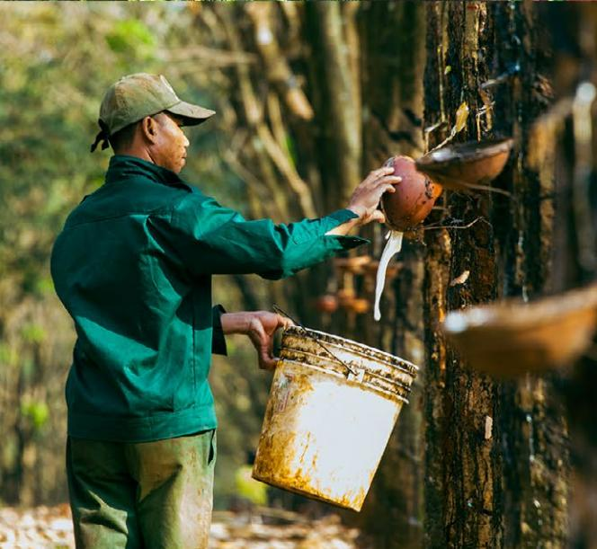

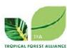

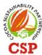

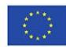

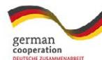

## Table of Contents

| 1. Executive Summary .....                                                                                                       | 4  |
|----------------------------------------------------------------------------------------------------------------------------------|----|
| 2. Introduction: the EUDR, National Traceability Systems and Smallholders Inclusion .....                                        | 5  |
| 2.1 The EU Market Compliance, National Traceability Architectures & Value Chain actors and the Smallholder Context .....         | 5  |
| 2.2 The Pathway of Decentralized Aggregation in Indonesia .....                                                                  | 7  |
| 2.3 The Malaysian Model: Centralized State Architecture .....                                                                    | 10 |
| 3. Key Findings: Barriers and Breakthroughs for Smallholder Inclusion .....                                                      | 14 |
| 3.1 Barrier and Breakthrough .....                                                                                               | 14 |
| 3.1.1 Systemic Gaps in Cacao and Rubber and Breakthrough in Technology as a Public Good .....                                    | 14 |
| 3.1.2 Financial Viability Gap & Breakthrough: Aligning Business Models and Margins .....                                         | 16 |
| 3.1.3 Scalability and Aggregation Gap, Breakthrough: Systemic Solutions/ Innovations at Scale for Independent Smallholders ..... | 17 |
| 3.2 Operationalizing the Breakthroughs and their integration into the national traceability infrastructures and pipelines .....  | 18 |
| 3.2.1 Indonesia Perspective: Closing the Connectivity .....                                                                      | 18 |
| 3.2.2 Malaysia Perspective: Optimizing the Dealer Node .....                                                                     | 19 |
| 4. The Strategic Recommendation .....                                                                                            | 21 |
| 4.1 Government (Indonesia and Malaysia): Enabling an Interoperable Ecosystem .....                                               | 21 |
| 4.1.1 Operationalize EUDR-Aligned Risk Classification .....                                                                      | 21 |
| 4.1.2 Strengthening National Interoperability Gateways .....                                                                     | 12 |
| 4.1.3 Dynamic Farmer Registries & Satellite Monitoring .....                                                                     | 21 |
| 4.1.4 Formalize Verified Aggregation .....                                                                                       | 22 |
| 4.2 Private Sector : Moving from Documentation to Operations .....                                                               | 22 |
| 4.2.1 The Three-Layer Compliance Pipeline .....                                                                                  | 22 |
| 4.2.2 Securing the First Mile .....                                                                                              | 22 |
| 4.2.3 Interoperability Over Proprietary Silos .....                                                                              | 22 |
| 4.2.4 Incentives and Cooperative Partnerships .....                                                                              | 22 |
| 4.3 Smallholders & Cooperatives: Facilitated Inclusion .....                                                                     | 22 |
| 4.3.1 Accelerated Registration (e-STDB) .....                                                                                    | 22 |
| 4.3.2 Facilitated Group Mapping & Polygon Capture .....                                                                          | 22 |
| 4.3.3 Integrity in Transaction Documentation .....                                                                               | 22 |
| 4.3.4 Internal Control Systems (ICS) & Governance .....                                                                          | 23 |
| 4.3.5 Linking Compliance to Tangible Benefits .....                                                                              | 23 |
| 4.4 Cross-Stakeholder Priority Actions .....                                                                                     | 23 |
| 4.4.1 Interoperability via State Leadership .....                                                                                | 23 |
| 4.4.2 Verified Aggregation as the Scalable Pathway .....                                                                         | 23 |
| 4.4.3 Integrated Finance & Capacity Building .....                                                                               | 23 |

### Glossary of Terms

| :           | Application Programming Interfaces                                                                                 |
|-------------|--------------------------------------------------------------------------------------------------------------------|
| :           | Area Penggunaan Lain                                                                                               |
| :           | an EU-funded project in Indonesia: Michelin and Porsche AG support farmers in sustainable natural rubber           |
| :           | Chain of Custody                                                                                                   |
| :           | Due Diligence Statement (required under EUDR)                                                                      |
| :           | Preparedness of operators/suppliers to submit a compliant Due Diligence Statement under EUDR                       |
| :           | Digital Public Goods. Open-source digital solutions that adhere to privacy and applicable standards and            |
| :           | Electronic Malaysian Sustainable Palm Oil – A digital system supporting certiÀcation and traceability under the    |
| :           | Electronic Surat Tanda Daftar Budidaya – Electronic Registration CertiÀcate for Plantation Cultivation (Indonesia) |
| :           | European Union Deforestation Regulation (Regulation (EU) 2023/1115 on deforestation-free products)                 |
| :           | What is in that Plot? – A geospatial assessment tool developed by FAO to assess deforestation risk at plot level   |
| :           | Unique Farmer IdentiÀcation Numbers used for traceability and compliance                                           |
| :           | Federal Land Development Authority (Malaysia)                                                                      |
| :           | Fresh Fruit Bunches (oil palm)                                                                                     |
| :           | Good Agricultural Practices                                                                                        |
| :           | Malaysia geospatial platform supporting palm oil traceability and smallholder mapping                              |
| :           | Internal Control System (used in group certiÀcation schemes such as RSPO or MSPO)                                  |
| :           | Hak Guna Bangunan                                                                                                  |
| :           | Hak Guna Usaha                                                                                                     |
| :           | Inisiatif Dagang Hijau                                                                                             |
| :           | Joint Research Centre (European Commission)                                                                        |
| :           | APIs that use JavaScript Object Notation (JSON) as the data exchange format                                        |
| :           | Koperasi Kakao Kerta Semaya Samaniya, based in Jembrana District, Bali                                             |
| :           | Key Performance Indicators (e.g., mapped plots, veriÀed suppliers, traceable volumes)                              |
| :           | Lembaga Getah Malaysia – Malaysian Rubber Board (MRB)                                                              |
| :           | Malaysian Palm Oil Board                                                                                           |
| :           | Malaysian Palm Oil CertiÀcation Council                                                                            |
| :           | Malaysian Sustainable Natural Rubber (certiÀcation scheme and regulatory framework)                                |
| :           | Traceability system under the MSNR certiÀcation framework                                                          |
| :           | Malaysian Sustainable Palm Oil standard updated version                                                            |
| :           | The digital traceability and transaction platform supporting MSPO-certiÀed supply chains, known as e-MSPO          |
| :           | Malaysian Space Agency – in Malaysia, is used to cross reference high-resolution imagery to verify compliance      |
|             | with December 2020 cut-oɛ date                                                                                     |
| :           | National Forest Inventory                                                                                          |
| :           | Nomor Induk Kependudukan – Indonesian National Identity Number                                                     |
| :           | Olam Food Ingredients                                                                                              |
| :           | Indonesian government initiative (Kebijakan Satu Peta) to harmonize geospatial data into a single reference map    |
| :           | An open-source, map-Àrst data collection platform co-developed by FAO and Google                                   |
| :           | Pas Kebenaran Getah – Rubber Transaction Permit (Malaysia)                                                         |
| :           | Rubber Smallholder Permit                                                                                          |
| :           | MPOB International Palm Oil Congress and Exhibition                                                                |
| :           | Public-Private Investment Compact                                                                                  |
| :           | Geospatial traceability and mapping platform developed by Malaysian Rubber Board                                   |
| :           | Digital trading platform for Malaysian rubber transactions under MRB/LGM                                           |
| :           | Roundtable on Sustainable Palm Oil                                                                                 |
| :           | Regional Technical Dialogue                                                                                        |
| :           | Sourcing Development Oɜcers                                                                                        |
| :           | SertiÀkat Hak Milik – Freehold Land Ownership CertiÀcate (Indonesia)                                               |
| :           | Sistem Perizinan Berusaha Perkebunan – Indonesia’s Online Plantation Licensing System                              |
| :           | Sistem Informasi ISPO – Information system supporting Indonesian Sustainable Palm Oil certiÀcation                 |
| :           | Sawit Intelligent Management System                                                                                |
| :           | Sistem Monitoring Hutan Nasional - Indonesia’s National Forest Monitoring System                                   |
| :           | Sistem Kebolehjejakan Nasional – National Traceability System (Malaysia)                                           |
| :           | Surat Keterangan Tanah – Land ownership/land statement letter issued by the village head (Indonesia)               |
| :           | Small and Medium-sized Enterprises                                                                                 |
| :           | Sustainable Palm Oil Cluster Model                                                                                 |
| :           | Surat Tanda Daftar Budidaya – Registration CertiÀcate for Plantation Cultivation (Indonesia)                       |
| :           | Extension oɜcer under MPOB’s TUNAS (Tunjuk Ajar dan Nasihat Sawit) program providing advisory services to oil      |
| :           | VeriÀed Sourcing Area                                                                                              |
| TUNAS Oɜcer |                                                                                                                    |

**Convened by a consortium consisting of the Cocoa Sustainability Partnership (CSP), Partnership for Sustainable Agriculture (PISAgro), Solidaridad Indonesia and Malaysia, and the Tropical Forest Alliance (TFA), this publication presents the outcomes of Regional Technical Dialogue #4 on** *strengthening practical traceability solutions for compliance and market competitiveness***.** 

The report was speciÀcally designed to address traceability gaps, explore the role of Digital Public Goods, and outline the recommendation for breakthroughs required to maintain smallholder inclusion. Ultimately, this publication serves as a practical blueprint for governments and the private sector to bridge the divide between farm-gate realities with smallholders, and EU market requirements.

This analysis reveals a sharp divide in regional readiness. Malaysia possesses a robust institutional structure, though challenges remain in fully operationalizing the National Traceability System (SKN) for independent smallholders. In contrast, Indonesia's decentralized landscape makes closing the middle gap more diɜcult. Success there depends on innovations like digital commodity identities (palm, rubber, and cacao) to ensure traceability is not lost as products move from farmers to intermediaries.

The Àndings presented here that technology alone provides lack of suɜcient solution. It is argued that the industry must pivot from isolated plotmapping toward a model of VeriÀed Aggregation. By focusing on three critical breakthroughs, the current implementation challenges can be resolved: (1) the utilization of Digital Public Goods (DPGs) such as Whisp and Open Foris Ground to ensure cross-border system interoperability; (2) speciÀcally for the independent smallholders and the need to provide individual-farm level data through the VeriÀed Sourcing Areas (VSA) or Jurisdictional Umbrellas; and (3) the formalization of informal collectors into VeriÀed Aggregators to ensure the preservation of farmer IDs (e-STDB or PAT-G (Rubber Transaction Permit) enables or supports traceability at the point of transaction.

The report concludes with a recommendation designed to facilitate this transition. Recognizing that national dashboards in Indonesia is currently in a state of development, it is recommended that this platforms evolve from static data repositories into dynamic validation engines capable of supporting real-time updates. For the private sector, the necessity of moving beyond proprietary, siloed applications is emphasized. Instead, investment is required in interoperable systems that allow smallholders to be integrated into the global market as investable clusters rather than high-risk outliers.

# Executive Summary

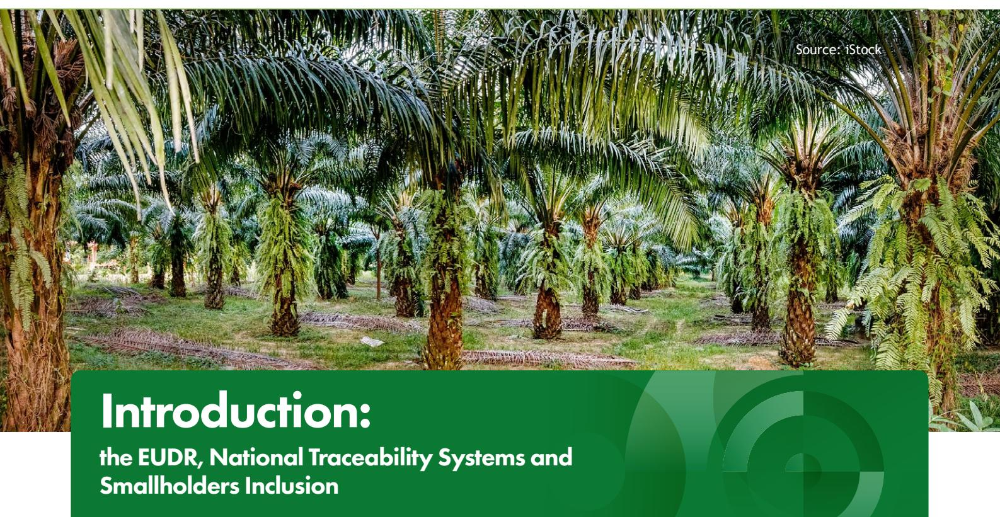

## The EU Market Compliance, National Traceability Architectures & Value Chain actors and the Smallholder Context

The EU Deforestation Regulation (EUDR), adopted in 2023 with application beginning in December 2026 for large operators and June 2027 for mid-scale companies, establishes a new global benchmark for commodity trading. It marks a paradigm shift from voluntary standards to mandatory company due diligence beyond certiÀcation. Exported goods can no longer simply be claimed as sustainable; instead, traders and operators placing commodities on the EU market are now required to ensure their goods are supported by veriÀable geospatial evidence and proof that their entire supply chain is deforestation-free and legally produced.

However, for operators to fulÀl this mandate, they must navigate a production landscape dominated by independent smallholders rather than large estates. The global supply of forest-risk commodities is highly fragmented, making it diɜcult to isolate speciÀc smallholders without incurring signiÀcant volume losses or excluding producers whose geolocations are tied to Àrst-hand commodity supplies. In the Palm oil sector smallholders manage approximately 40%1 of the total planted area globally. In Malaysia, while organized schemes like FELDA are prominent, independent smallholders contribute a signiÀcant portion (approximately 16%) of national palm oil production. Due to high operating costs and limited logistical access, these farmers typically rely on intermediaries who collect the fruits, rather than selling directly to mills. In contrast, smallholders are the primary drivers of palm oil: they account for 85– 90%2 of production for both Indonesia and Malaysia, cacao smallholders account for nearly 90–95%3 of the global supply.

International Rubber Study Group (IRSG), Statistical Summary (2024); Indonesian Rubber Council (Gapkindo); Malaysian Rubber Board (LGM); and International Cocoa Organization (ICCO), Quarterly Bulletin of Cocoa Statistics, 2024.

Lestari, D., & Oktavilia, S. (2020). Analysis of Palm oil price in Southeast Asia. AFEBI Economic and Finance Review, 5(02), 63. https://doi. org/10.47312/aefr.v5i02.494

Fatkurrohim, Purwono, & Kovshov. (2025). The impact of Indonesia's cocoa downstream policy on the derivative product competitiveness, export specialization, and farmers beneÀt. HABITAT, 36(2), 154–165.

While regulations hold operators legally liable, the informal and fragmented nature of raw material sourcing creates a signiÀcant compliance challenge. Unlike digitized corporate plantations, independent smallholders operate on small, dispersed plots, reaching the market through a multi-tiered network of middlemen. This complex aggregation often obscures origin data before the product ever reaches the processing facility. To bridge this gap and meet EUDR requirements, operators must implement a rigorous three-phase compliance process across regulated commodities. This publication focuses speciÀcally on the three primary exports from Indonesia and Malaysia: palm oil, rubber, and cocoa.

Given the gap between regulatory theory and the reality of current sourcing—which relies on informal and oral agreements and cash transactions—the transition to Phase 1 creates a data blind spot. Without a digital record at the point of collection, liability remains with the Operator, yet the evidence stays trapped in the informal tier of the supply chain.

**Phase 1: Identity & Origin (Data Gathering):**  Geolocation (polygons for plots >4ha), deforestationfree veriÀcation (post-Dec 2020), legality (national law adherence), and chain-of-custody maintenance.

**Phase 2: Integrity & Management (Risk Validation):** Identifying supply chain gaps and performing on-theground mitigation for high-risk areas.

**Phase 3: Liability (Compliance Declaration):** Submitting the Due Diligence Statement (DDS) to declare accuracy and assume legal liability.

**Figure 1** – Distinct Phases of Commodity Digital Products

**Source:** *Synthesized by the author (2026), based on the requirements of Article 9 (Information), Article 10 (Risk Assessment), and Article 12 (Due Diligence Statement) of Regulation (EU) 2023/1115.*

**Phase 1: Identity & Origin Phase 2: Integrity Phase 3: Liability**

**1. Geolocation 3. Legality2. Deforestation-Free 4. Traceability 5. Risk Management 7. Due Diligance Statement DDS 6. Migration**

The success of compliance to the EUDR relies on transfer of data from farm to trader and operator, yet this Áow is currently obstructed by a signiÀcant readiness gap among upstream actors. Ideally, smallholders equipped with veriÀable geolocation and legal registration—such as the STDB (smallholder cultivation registration) in Indonesia or the MPOB (Malaysian Palm Oil Board) License (for palm) and PAT-G Card (Rubber Transaction Authority Permit) in Malaysia—provide this digital identity during the transaction. In Indonesia, accelerating e-STDB enrolment and geolocation mapping for independent growers is essential to enable farmers to maintain market access for palm oil, cacao and rubber. In Malaysia, while MPOB licensing is robust, gaps persist in the rubber sector and in the independent palm oil sector, where critical traceability data often stalls at the dealer level due to a lack of incentives for intermediaries to participate.

Both nations have launched initiatives to bridge these gaps, evolving from national sustainability certiÀcations toward centralized data architectures. In Malaysia, this is moving toward a uniÀed digital ecosystem aimed at vertical integration, though the full operationalization of systems like the SKN and smallholder inclusion remain ongoing. Similarly, Indonesia is navigating its digital transition through the SIPERIBUN dashboard within the framework of Plantation Law 39/2014, which provides guidelines on data conÀdentiality for plantation actors (*Pelaku Usaha Perkebunan*)

While private sector traceability systems have reached high levels of technological sophistication, they have also highlighted a vital need for structural interoperability. Before state-level systems were fully realized, the deployment of proprietary platforms by multinational companies provided early momentum for transparency. Moving forward, the priority is to bridge these disconnected 'digital silos' to ensure that suppliers—particularly dealers and mills—can operate within a more streamlined and uniÀed reporting environment.

Establishing a systemic foundation of interoperable tools and uniÀed identiÀers transforms data collection from a repetitive requirement into a strategic asset. This alignment not only optimizes operational eɜciency but also safeguards the integrity of the Due Diligence Statement (DDS). By harmonizing disparate data formats, operators can more conÀdently provide the high-Àdelity evidence required for compliance, eɛectively mitigating legal risks such as data mismatch or volume double-counting while strengthening the overall resilience of the value chain.5

Suppliers, particularly dealers and mills, are currently operated in disconnected silos required to report across multiple, conÁicting companies with their own system and technology – that later feed to the traders' platforms. This lack of data alignment impacts operational eɜciency and administrative streamlining, demonstrating that without a systemic foundation of interoperable tools and uniÀed identiÀers, traceability remains a resource-intensive process. Establishing this technical coherence is essential to transform data collection into a value-adding mechanism that enhances the resilience and transparency of the regional value chain. For an operator to submit a DDS, they must currently reconcile disparate data formats from multiple private dashboards, increasing the risk of legal liability due to data mismatch or doublecounting of volumes.

## The Pathway of Decentralized Aggregation in Indonesia

To navigate its vast archipelagic geography, Indonesia has moved away from a monolithic database toward a decentralized model of interoperability anchored by the proposed National Dashboard. This system is currently being developed is designed to aggregate and reconcile data from existing legal entities rather than replace them.

For the palm oil sector, the dashboard triangulates data from established government platforms—SIPERIBUN (corporate licensing), e-STDB (smallholder cultivation licensing), and SI-ISPO (sustainability certiÀcation) alongside private sector inputs6 . However, the rubber

Republic of Indonesia. (2014). *Undang-Undang Republik Indonesia Nomor 39 Tahun 2014 tentang Perkebunan* [Law of the Republic of Indonesia Number 39 of 2014 concerning Plantations]. State Secretariat.

FGD PS

and cocoa sectors face more precarious challenges. Traders in these commodities can collect geolocation data yet they still face the lack of land proof of legality. Consequently, companies are unable to generate legality data internally and rely almost on the government-issued e-STDB as their primary compliance anchor. Unlike the palm oil sector, which is bolstered by large corporate estates and vertical integration, the rubber and cacao sectors are overwhelmingly dominated by independent smallholders, shifting the legality veriÀcation directly onto state systems.

This reliance exposes a severe structural weakness. First, Àeld implementation is critically low—estimated at just 5%—leaving the vast majority of the supply base invisible to formal systems. Second, and more damaging to long-term traceability, is the lack of dynamic updates. Currently, the e-STDB functions as a static snapshot rather than a living registry, with no active mechanism to record changes in land tenure, crop proÀles, or deforestation events after the initial certiÀcate is issued.

This data stagnation creates a legality blind spot, making it operationally challenging for traders to verify goods against a database that may be eɛectively obsolete. Without a dynamic registry, the link between the physical commodity and its legal origin is broken. To bridge this gap, the National Dashboard must evolve from a repository into a dynamic validation engine. By integrating real-time satellite monitoring and periodic digital check-ins, the system can refresh the legality status of a plot without requiring a full e-STDB reregistration.

The proposed National Dashboard attempts to act as the validation gate6 for this fragmented governance, where jurisdiction over plantation legality, forest cover, and spatial planning is split across the Ministry of Agriculture (SIPERIBUN), the Ministry of Environment and Forestry (forest layers), ATR/BPN (land titles), and local district licensing bodies. By consolidating these disparate datasets into a single export-facing interface, the dashboard aims to eliminate duplication and provide the consistent outputs operators need to prepare EUDR Due Diligence Statements.

To ensure data integrity as goods move from farmers to collectors, the framework establishes a gatekeeper validation protocol. Departing from Malaysia's model of direct digital recording, Indonesia strategy is to require processing mills – which utilize a variety of proprietary Enterprise Resource Planning (ERP) systems and thirdparty traceability platforms (such as Koltiva or so forth )— as the primary veriÀcation point,whereas factories act as mandatory checkpoints, required to report the e-STDB IDs of incoming supplies. This mechanism forces the network of informal collectors to preserve the original farmer's identity. By reconciling incoming volumes against the registered e-STDB quotas at the factory gate, the system aims to Àlter unveriÀed goods out of the export stream.

Geospatially, One Map Policy as mandated by Presidential Regulation No 23 of 2021, to resolve the fractured supply chain. While the technical integration of thematic maps has faced delays, it remains the state-level tool for reconciling overlapping land-tenure claims—most notably the ongoing disparities between Ministry of Agriculture (MoA) plantation permits and Ministry of Environment and Forestry (MoEF) forest zone designations. The objective of this map is to perform as a validator where data—whether from a palm estate or a cocoa garden—is validated against the One Map corridor and presented as a uniÀed compliance package.

Transactions across dynamic supply chains pose a major data registration challenge in complying with future EUDR. A structured approach is essential to address the diversity of smallholders—from SMEs to large farmers (in some cases, e.g. in RSPO deÀnition may be called as 'out growers')—and their unequal readiness levels. As explained before, these gaps are further widened by fragmented traceability systems, limited e-STDB registration, and digital infrastructure deÀcits. Consequently, generating Due Diligence Statements (DDS) for Àrst-mile farmers remains highly complex for EU traders. The following matrix illustrates how these smallholder typologies align with EU operator mandates.

6 Coordinating Minister for Economic Aɛairs Decree Number 178 of 2024 (Keputusan Menteri Koordinator Bidang Perekonomian Nomor 178 Tahun 2024) concerning the Steering Committee for the Indonesia National Dashboard for Sustainable Commodity Data and Information

| VeriÀes land tenure              |        |
|----------------------------------|--------|
| Tracking the Áow of              |        |
| Function ReasonIndonesian System | Status |

**Table 2:** Gap Analysis of EUDR requirement for operators/traders versus Indonesian system

**Source:** *Synthesized by the author (2024-2025). Technical data points adapted from EU Regulation 2023/1115, Kepmenko Perekonomian No. 178/2024, and Directorate General of Plantations data (2024)*

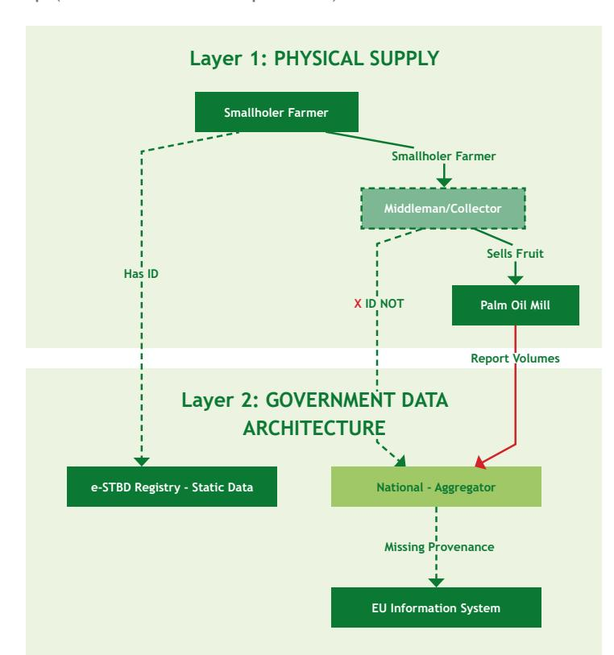

**Figure 2** – The Indonesia Gap (The middle section problem)

**Source:** Synthesized by the author (2026); based on technical gap analysis from Regional Technical Dialogues (RTD) #1-4 (2024-2025).

## The Malaysian Model: Centralized State Architecture

In contrast to Indonesia, Malaysia's architecture is designed as a centralized national framework intended to facilitate closer coordination between public and private data. Under the proposed Sistem Kebolehjejakan Nasional (SKN)—slated for phased implementation following discussions at PIPOC 2025 the registry, geospatial, and transaction layers are intended for integration under a uniÀed approach. This creates a strategic digital backbone for compliance, moving beyond fragmented data silos toward a more cohesive national traceability framework as the system continues to mature.

Under the guidance of the Malaysian Palm Oil Board (MPOB), the sector operates on an alignment of three core pillars: the MSPO 2.0 regulatory standard (managed by the MPOCC), the SIMS transaction system, and the GeoSawit platform. While these platforms are managed by diɛerent agencies,

achieving interoperability is intended to support more consistent mass-balance checks, where reported trade volumes can be reconciled against the production capacity of veriÀed legal boundaries. This mechanism is designed to enhance veriÀcation of both legality and deforestation-free status, with the objective of providing exporters a reliable foundation for meeting global compliance requirements.

Parallel to this, the Malaysian Rubber Board (LGM) enhances a similar centralized architecture to address the fragmentation inherent to rubber smallholders. The system is anchored by the PAT-G Card (Rubber Transaction Authority Permit), intended as a key ID mechanism for all rubber farmers. This ID feeds into RRIMniaga, a proprietary digital platform used by licensed dealers to record transactions at the Àrst point of sale. When a smallholder sells cup lump or latex, the transaction is digitally recorded in real-time within RRIMniaga, linking the seller's ID directly to the traded volume. These transaction records are then cross-referenced against GeoRubber, the LGM's spatial inventory, to validate the origin.

Reference the PIPOC 2025 Keynote/Ministerial Address regarding the "Digital Backbone for EUDR Readiness.

Ministry of Plantation and Commodities (KPK). (2026). National Traceability System (SKN) Framework for EUDR Compliance: Integrating SIMS, GeoSawit, and e-MSPO. Kuala Lumpur: Government of Malaysia.

Within this proposed architecture, the state retains custody of the master data, while private-sector dealers and traders act as the operational interface. Currently, Àrst-mile data is eɛectively locked within dealer networks, where transactional layers like SIMS and RRIMniaga capture daily trade. By interlocking these private transactions with the state's geospatial layers (GeoSawit and RRIM GeoRubber), Malaysia establishes an unbroken chain of custody. This synergy allows EU operators to trace products back to state-veriÀed origins, utilizing dealer-captured data to provide a robust defence against EUDR deforestation claims.

**Table 2:** Malaysia Palm Oil and Rubber Traceability Architecture

| Layer     | Palm Oil Architecture | Rubber Architecture         |
|-----------|-----------------------|-----------------------------|
| Traceable | Export CertiÀcate     |                             |
|           |                       | Traceable Export CertiÀcate |

| EUDR Malaysian System Requirement Component 1. Geolocation GeoSawit (MPOB) | Function & Status smallholders and estates.                                                            |
|----------------------------------------------------------------------------|--------------------------------------------------------------------------------------------------------|
| Status:                                                                    | Scaling                                                                                                |
| While                                                                      | it serves as the national reference, eɛorts continue to cover gaps for independent smallholders (ISH). |
| Function: 2. Legality MSPO (Mandatory CertiÀcation)                        | VeriÀes legal compliance (land title, labour laws) via mandatory audits managed by MSPO.               |
| Status:                                                                    | High Readiness                                                                                         |
| for smallholders 3. Traceability SIMS (Sawit Intelligent                   | currently in the certiÀcation transition phase                                                         |
| Status: (CoC) Management System);                                          | Operational                                                                                            |
| Links e-MSPO                                                               | the volume sold to the speciÀc GeoSawit ID, ensuring chain of custody.                                 |
| Function: GeoSawit / MSPO 4. Deforestation Trace Free                     | Integrated spatial veriÀcation between plot polygons and National                                      |
| verify                                                                     | the Dec 2020 cut-oɛ date.                                                                              |
| Status:                                                                    | High Readiness                                                                                         |

**Table 3:** Gap Analysis of EUDR requirement Indonesia and Malaysian System

**Source:** *Synthesized by the author (2026). Data grounded in Ministry of Plantation and Commodities (KPK) updates (Feb 2026) and the SKN Roadmap for EUDR enforcement.*

9 Sari, I. L., Weston, C. J., Newnham, G. J., & Volkova, L. (2022). Using Bayesian multitemporal classiÀcation to monitor tropical forest cover changes in Kalimantan, Indonesia. International Journal of Digital Earth, 15(1), 2061–2077. https://doi.org/10.1080/17538947.2022.2146219 10 Mohd HanaÀah, K., Abd Mutalib, A. H., Miard, P., Goh, C. S., Mohd Sah, S. A., & Ruppert, N. (2021). Impact of Malaysian palm oil on sustainable development goals: co-beneÀts and trade-oɛs across mitigation strategies. Sustainability Science, 17(4), 1639–1661. https://doi. org/10.1007/s11625-021-01052-4

The convenient interoperability across SIMS – Geosawit – e-MSPO – and DDS systems will enable traders to submit their Due Diligence Statement (DDS) and operators to check and verify. Unlike Indonesia, the Malaysian system links the physical product to the digital ID at the point of transaction (the Mill Weighbridge) using the SIMS platform.

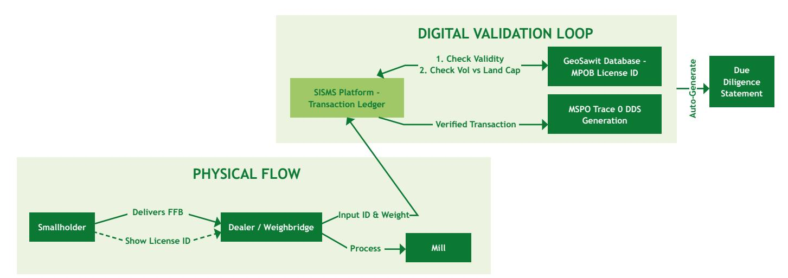

**Figure 3** – The Integrated Malaysian Pipeline

**Source:** *Synthesized and processed by the author (2026). Logic derived from the technical integration of MPOB's SIMS (transactional), GeoSawit (geospatial), and the MSPO Trace (regulatory) frameworks as established under the National Traceability System (SKN) Roadmap (KPK, 2026)*

**Source:** *Synthesized and graded by the author (2026). Based on cross-sectoral analysis of MPOB, LGM, and MCB (Malaysia) data versus Kemenko Perekonomian and Ministry of Agriculture (Indonesia) technical roadmaps.*

**Table 4:** Gap Analysis of EUDR requirement versus Malaysian system

| ID Indonesian Palm Oil   |                             |
|--------------------------|-----------------------------|
|                          | ID Cacao &                  |
|                          | MY Cacao & Rubber (e.g.,    |
| MY                       | Malaysian Palm Oil          |
| prerequisites). 11       |                             |
| SI ISPO veriÀes ISPO     |                             |
| legality veriÀed through |                             |
| GeoSawit                 | is a uniÀed                 |
| is                       | far more eɜcient. It        |
| all                      | certiÀed plots are          |
| certiÀed                 | supply base.                |
|                          | level. It’s veriÀed only by |
|                          | private certiÀers (e.g.,    |
|                          | from plantation to Ànal     |

11 There are diɛerent land ownership tiltes, SHM, HGU, HGB and diɛerent land functions, such as APL - other purposes areas, and so forth.

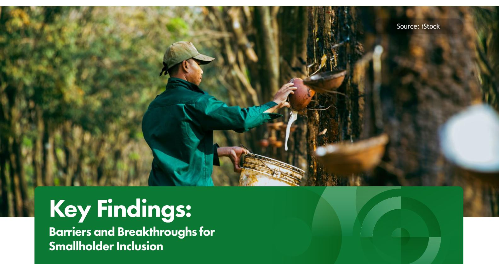

The transition toward a fully traceable supply chain is currently obstructed by a triad of deep-seated challenges: fragmented technical silos, a persistent digital divide, and the lack of viable Ànancing models for low-margin commodities. These gaps manifest as disconnected, company-led data systems that create reporting fatigue for producers,12 while complex intermediary chains often decouple the physical product from its geospatial origin.

While the palm oil sector beneÀts from established corporate infrastructure, the rubber and cacao sectors face a structural investment gap. To bridge this, the transition must shift from isolated pilots toward systemic ecosystems. This involves transforming traceability from a private administrative system into a public utility by leveraging Digital Public Goods (DPGs), aligning compliance costs with commodityspeciÀc business models, and adopting landscape-level aggregation for scalability purpose.

The proposed transformation was synthesised to the context and methodology that was synthesized from the Regional Technical Dialogue (RTD #4)13 supplemented by insights from prior sessions and current industry publications. This framework represents a proposed strategic model towards inclusive EUDR readiness and is not yet a fully implemented national system across all commodities.

## Barrier and Breakthrough

#### **Systemic Gaps in Cacao and Rubber and Breakthrough in Technology as a Public Good**

The operational complexity of smallholder inclusion is best illustrated by the commodity-speciÀc constraints shared by major industry players during the technical sessions of RTD #4 on traceability.

- Kirana Megatara (Rubber)14: As the largest crumb rubber producer in Indonesia, the company faces the logistical challenge of mapping hundreds of thousands of independent smallholders who contribute approximately 90% of its raw material. To achieve its target of 100% traceability by 2030, Kirana has deployed Rubber Notes15, a proprietary

12 FGD Report

13 Synthesized from the Regional Technical Dialogue (RTD #4), "*Strengthening Practical Traceability Solutions for Compliance and Market Competitiveness,*" held on September 25, 2025. This dialogue convened multi-stakeholder experts from Indonesia and Malaysia, with technical insights provided by the European Commission Joint Research Centre (JRC) and the FAO to deÀne operational breakthroughs for smallholder inclusion under the EUDR.

14 Synthesized from case studies presented during Regional Technical Dialogue #4, 2025

15 Sustainability Report 2023: Bridging the First Mile in Natural Rubber Traceability

application used by Sourcing Development Oɜcers (SDOs) to track Áow from farmgate to factory. In preparation for EUDR, the company has transitioned from sub-district tracking to sitespeciÀc polygon mapping via the RubberWay riskmapping tool. Despite these tools, the Àrst mile remains structurally complex; because rubber is traded through multi-tiered intermediary chains, data continuity often stalls at the dealer level. To bridge this, Kirana Megatara collaborates on the CASCADE16 project (alongside Michelin and Porsche), utilizing the SUTTI and RubberWay apps to provide agronomy training and Ànancial literacy. These initiatives aim to trade knowledge for data, yet scaling such high-touch models remains a signiÀcant administrative and Ànancial hurdle.

- Olam Food Ingredients / OFI (Cocoa): Mapping the Indonesian cocoa supply chain is a massive undertaking due to fragmented plots, informal land tenure, and the dominance of independent smallholders. As a pioneer in digitalization since 2017, OFI has implemented the OFI Direct system17 to record farmer identities, village locations, tree counts, and production estimates. Moving beyond single GPS points, OFI has transitioned to 100% polygon mapping18 to meet global buyer demands and prepare for EUDR compliance across both certiÀed and conventional products. However, Àeld eɛectiveness relies heavily on data synchronization from partner traders. Systemic challenges arise from digital infrastructure gaps, where limited internet connectivity in remote areas of Sumatra and Sulawesi often obstructs real-time syncing. These challenges are further aggravated by the region's archipelagic geography, where inconsistent cellular coverage often renders real-time data tools ineɛective.

Furthermore, farmer economic behaviour remains a hurdle; many prefer selling to mobile traders for immediate cash without the requirements of quality standards or registration. Without a push factor such as clear regulatory mandates or direct price incentives, the urgency for farmers to participate remains low19 .

To overcome connectivity barriers, Regional Technical Dialogue (RTD) #4 highlighted Digital Public Goods (DPGs) as oɝine solutions. A key operational example is Open Foris Ground20, which empowers smallholders to map farm boundaries in remote areas without a cellular signal, synchronizing polygons once connectivity is restored to ensure a seamless digital chain of custody.

The data is then processed by the FAO's WHISP (What Is in that Plot)20 engine, which functions as an automated validation layer by combining global, regional, and national datasets to assess deforestation risks. To ensure high-Àdelity monitoring, the system integrates the IMPACT Toolbox for intersecting geolocation data with forest maps and utilizes the JRC Global Forest Cover Map 202022 as a consistent global reference layer for risk assessment. By layering these datasets over existing state-owned assets—such as Indonesia's SIMONTANA and the One Map Policy the system creates a National Validation Gate. This architecture is designed to expedite the issuance of e-STDB registrations at scale by Áagging regional risks across millions of plots simultaneously through a highresolution forest baseline.23

In Malaysia, the strategy focuses on operationalizing the newly integrated National Traceability System (SKN). This platform—designed to bridge SIMS, GeoSawit, and e-MSPO—is currently being implemented to provide exporters with a consolidated path to veriÀed compliance. For the rubber sector, the linkage between the PAT-G card and the RRIMniaga 2.0 app facilitates a process where trade volumes are recorded against veriÀed polygons at the point of primary sale. This initiative serves to digitize smallholder transactions24 within the national supply chain framework as the system scales toward full interoperability.

This architecture resolves data privacy friction by utilizing the national validation system to convert sensitive GIS data into a binary compliance token via API. This provides veriÀable proof for EUDR Due Diligence (DDS) without violating the data provisions of Law 39/2014, ensuring data is used by competent authorities for compliance checks without being made public.

16 Michelin, Accessed February 10, 2026, https://natural-rubber.michelin.com/projet-cascade-caoutchouc-naturel-durable-michelin

17 OÀ (olam food ingredients). (2024). Cocoa Compass: Performance Report 2023/24 - Navigating the Future of Sustainable Cocoa. London: oÀ

18 Cocoa Compass: Impact Report 2023/24 - Navigating the Future of Sustainable Cocoa. Available at: oÀ.com/sustainability. Note: oÀ achieved 100% traceability to farm/community in 2020; transition to full polygon mapping reached 79% by mid-2024.

19 Synthesized from interview and case studies presented during Regional Technical Dialogue #4, 2025

20 Open Foris Ground: Food and Agriculture Organization of the United Nations (FAO). (2024). *Open Foris: Innovative tools for environmental monitoring*

21 WHISP (What Is in that Plot): World Resources Institute (WRI) & FAO. (2025). *WHISP: An automated validation engine for EUDR geospatial compliance.*

22 JRC Global Forest Cover Map & IMPACT Toolbox: European Commission Joint Research Centre (JRC). (2025). *Geospatial tools for EUDR Risk Assessment.*

23 Sovereign Traceability: Tropical Forest Alliance (TFA). (2026). *Regional Technical Dialogue #4 Summary Report: Inclusive Traceability for Independent Smallholders*. 24Shamsudin, M., & Rahman, A. (2025). "Digitalizing the Smallholder: Integrating Mobile Applications with National Licensing Systems in the Malaysian Rubber Industry." Journal of Tropical Agriculture and Sustainability, 12(1), 45-58.

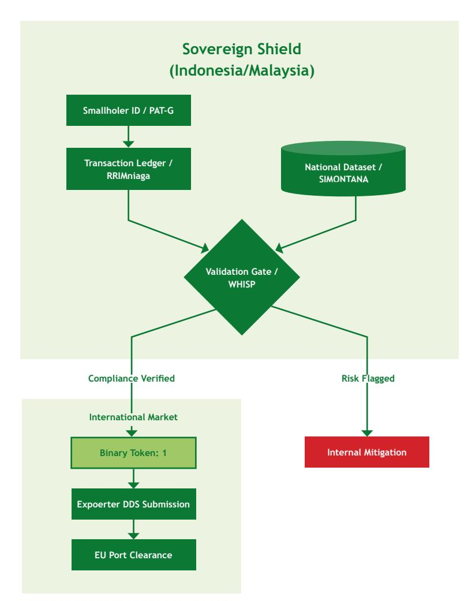

**Figure 2** – The National Validation Gate – Automating EUDR compliance through sovereign integration and binary tokenization.

#### **Financial Viability Gap & Breakthrough: Aligning Business Models and Margins**

Even when technology functions perfectly, traceability incurs costs—typically estimated at \$15–\$2025 per smallholder for initial mapping and veriÀcation according to discussions held during FGD. If the cost of data collection outweighs the crop's proÀt margin, the system becomes unsustainable; it risks collapsing the moment project-based initiatives conclude. In the absence of oɛ-takers willing to front-load compliance costs, the market naturally pivots toward larger estates that can absorb these overheads that would be challenges for independent producers for market inclusion.

**Source:** Synthesised by the author based on the RTD #4 discussion

The breakthrough lies in aligning business models with the economic realities of speciÀc commodities:

- Premium Model (Cocoa): In the cocoa sector, such as the partnership between the Kerta Semaya Samaya (KSS) Cooperative and Valrhona in Bali26 , compliance is subsidized by quality. The premium price for high-quality fermented beans funds the Internal Control System (ICS), eɛectively embedding compliance costs into the Ànal product value.
- Knowledge-for-Data Model (Rubber)27: In the rubber sector, companies like Kirana Megatara trade knowledge for data. By leveraging agronomy teams to map farm boundaries while providing technical training on Good Agricultural Practices

25 Taken from the FGD discussion of smallholders and companies during the inception phase

26 Sector-SpeciÀc Examples: Pages 14 and 15 highlight the KSS Bali cooperative and the mapping struggles in Musi Banyuasin.

27 Regional Technical Dialogue #4 Page 11-12: Realities of company-driven mapping in rubber supply chains.

(GAP), farmers exchange geolocation data for yield-boosting support. This allows the company to manage complex deforestation analysis centrally while addressing resource-intensive mapping challenges.

- Supply Shed Model (Palm Oil):28 For the palm oil sector, the Musim Mas approach treats traceability as a necessary procurement investment to secure a steady Áow of compliant Fresh Fruit Bunches (FFB). By absorbing mapping and STDB (Surat Tanda Daftar Budidaya) facilitation costs for smallholders within a speciÀc mill radius, the company de-risks its entire supply base. This shifts the incentive from a simple price premium to long-term market security, ensuring the supply remains "marketready" for the EU.

#### **Scalability and Aggregation Gap & Breakthrough: Systemic Solutions/ Innovations at Scale for Independent Smallholders**

To move beyond isolated pilots, the commodity sector requires structural innovations that lower the per-farm mapping costs and shift the companies' veriÀcation process for farmer's data collection toward aggregated entities, i.e. cooperatives or intermediaries, in both Indonesia and Malaysia. This scalability gap is further widened by land tenurial complexities, which remain the most critical barriers to progress. Without accelerated government action on land titling and the establishment of clear legal pathways, evolving regulatory frameworks risk widening the integration gap for smallholders, rather than fostering participation.

#### **A. VeriÀed Sourcing Areas & Jurisdictional-Led Model**

The breakthrough for smallholder inclusion involves a strategic shift toward regional aggregation via the VeriÀed Sourcing Areas (VSA) model.29 Rather than a singular, static system, this represents a series of targeted interoperability layers currently being operationalized to bridge the gap between landscape-level monitoring and individual plot requirements.

Under this framework, District Governments (Dinas Perkebunan) lead the mapping and veriÀcation of smallholders within their administrative boundaries—supported by national budgets such as BPDPKS—to fulÀll mandatory e-STDB registration. While the One Map Policy serves as the Government's Master Spatial Database for resolving land-tenurial legality and forest boundaries, the proposed National Dashboard acts as the interoperability gate for external markets.

However, the use of jurisdictional evidence does not absolve private actors of their legal mandates. Operators placing products on the EU market remain ultimately responsible for assessing and mitigating risks under the EUDR. They must verify the jurisdiction's mapping methodology and ensure that the forest deÀnitions used (e.g., via SIMONTANA) align strictly with EUDR standards.

This middle-ground architecture oɛers a potential pathway for private traceability platforms to cross-reference coordinates against DistrictveriÀed polygons via API, upholding national data sovereignty by issuing binary compliance tokens (Green/Red) instead of raw sensitive data. This approach—currently being piloted and tested within the PPI Compact in Aceh Tamiang—seeks to de-risk the 'Àrst mile' by aggregating smallholders into digitally tracked, investable clusters. By providing a framework for validated evidence, such a system could support an operator's obligation to fulÀll the requirements of a Due Diligence Statement (DDS), oɛering a scalable model for high-Àdelity compliance data.

28 Regional Technical Dialogue #4: Private Sector "Supply Shed" Realities: Pages 11–13 outline how company-led mapping secures market access and integrates with national systems.

29 https://sourceup.org

### **B. SPOC Model**

The organizational aggregation through the SPOC Model in Malaysia provides a foundation for compliance, though it must be framed correctly within the EUDR context30. While the EU does not view state or voluntary certiÀcations as a green lane for compliance, these systems serve as an national data backbone.

The role of the MPOB and LGM is not to replace the operator's due diligence, but to act as a veriÀed data provider. For palm oil, the MPOB manages data collection at scale through 162 SPOCs to centralize the mapping and veriÀcation of 260,000 independent smallholders. At the point of sale, the e-MSPO, SIMS, and RRIMniaga systems provide the geospatial evidence and legal documentation for a Due Diligence Statement (DDS). This interoperable infrastructure ensures individual plot data is accessible and veriÀable, streamlining global market compliance.

In Indonesia, this architecture utilizes a validation bridge to solve transparency and data privacy. Instead of mandating the disclosure of raw, sensitive ownership data protected by Plantation Law 39/2014, the national system issues a Binary Compliance Token via API. This token conÀrms that a speciÀc batch of commodity is tethered to a veriÀed, deforestation-free polygon within the state's master database.

By integrating tools like WHISP, operators can independently verify these national tokens against global forest layers31. This hybrid approach respects national sovereignty while providing the highgranularity, veriÀable evidence that the EU market demands. Ultimately, these national clusters and registries are the only scalable way to ensure that the of smallholders is not de-risked out of the global supply chain, but rather integrated through a transparent, digitally-veriÀed architecture.

## Operationalizing the Breakthroughs and their integration into the national traceability infrastructures and pipelines

The private sector and various initiatives identiÀed above, have begun to play a critical role in Àlling operational and data gaps required by the EU Deforestation Regulation (EUDR). Large buyers, reÀners, traders and consumer-goods companies either themselves or via multi-stakeholder initiatives - are now deploying their own traceability platforms, satellite monitoring solutions, independent veriÀcation models and supplier-engagement programmes. Operationalising these private systems in alignment with Indonesian and Malaysian regulatory frameworks can accelerate national readiness, speciÀcally to facilitate independent smallholder integration, and reduce the burden on government institutions.

While previous sections highlighted necessary economic incentives, this analysis concludes that their eɜcacy relies on successful integration into technical pipelines. Synthesizing the Roundtable Discussions (RTD), the following strategic functional design is proposed to resolve architectural infrastructures within the Indonesian and Malaysian systems, speciÀcally addressing traceability context.

### **Indonesia Perspective: Closing the Connectivity**

In the Indonesian context, the critical challenge in the supply chain is the disconnection between Layer 1 (The Middleman/Aggregator) and Layer 2 (The National Infrastructure). Currently, while the physical product moves seamlessly from farm to mill, the digital identity—such as the e-STDB ID—is frequently lost at the Àrst point of aggregation. By utilizing interoperable, open-source standards, this approach aims to ensure that traceability data remains tethered to the physical product as it moves through various

30 Operational breakthrough in jurisdictional-scale veriÀcation; demonstrated via technical slides during Regional Technical Dialogue #4 (2025) 31 EUDR Geospatial Baseline: Bourgoin, C., et al. (2025). Global forest maps for the year 2020 to support the EU regulation on deforestation-free supply chains. Publications Oɜce of the European Union.

levels of aggregation, regardless of the ultimate architecture of the national data system. According to the sessions facilitated in the RTD #4, some models had been piloted and operationalised and explored its potentiality further.

#### **A. Shifting from Anonymous Collection to VeriÀed Aggregation**

The breakthrough in the Àrst mile involves transitioning from informal, anonymous collection toward a model of VeriÀed Aggregation. Rather than allowing middlemen to strip data from the supply chain, this model operationalizes the collector as a Data Conduit.

In functional pilot areas like Aceh Tamiang, this transition is managed through a Segregated Supply Chain involving cooperatives and certiÀed mills, such as PT Mora Niaga Jaya. To ensure a concrete link between the product and the plot—addressing the EUDR's core requirement—the following operational layers are used:

Point-of-Sale Data Capture: Instead of anonymous cash transactions, the VeriÀed Aggregator uses the Jejak Sawit app to record the Farmer's Name, NIK (National ID), Polygon coordinates, and e-STDB registration number at the moment of collection.

Physical Safeguards: To prevent leakage or the laundering of unveriÀed fruit, FFB is weighed at speciÀc pick-up points (RAMPs) and cross-checked again at the mill gate to ensure the physical volume matches the registered production quota of the veriÀed polygons.

Digital Integrity: The system utilizes Live Truck Tracking to monitor the journey from the farm to the mill, providing a secure Digital ID for the batch.

### **B. Scaling via the Jurisdictional Umbrella and DPGs**

Complementing the aggregator approach is the VeriÀed SourcingArea (VSA) model,which functions as a collective risk mitigation approach designed to address impacts of commodity production that are beyond the full control of individual companies. In the context of the EUDR, this Jurisdictional Approach (JA) is deÀned by politicaladministrative boundaries, such as districts, and is used to coordinate policies, enforcement, and investments at scale. Rather than verifying every transaction in isolation, this model convenes stakeholders—including governments, companies, and civil society—to collaboratively pursue shared goals through a joint roadmap to minimize social and environmental conÁicts.

Operational evidence of this model is seen in the PPI Compact in Aceh Tamiang, a multi-stakeholder partnership (MSP) that has already accelerated the certiÀcation of 2,200 smallholders. Within this framework, the system leverages the Jejak Sawit app to bridge the middleware gap. The app captures live data—including Farmer Name, NIK, Polygon coordinates, and e-STDB numbers—to link the physical Áow of goods to veriÀed plots.

While the JA serves as risk mitigation tool (Article 11), it does not absolve private actors of their legal mandates. Operators placing products on the EU market remain ultimately responsible for the entire three-step due diligence process, including the requirement for precise plot-level geolocation for every batch.

### **Malaysia Perspective: Optimizing the Dealer Node**

In the Malaysian context (Figure 3), the pipeline is already technically connected via the MPOB License ID. The operational challenge is not a broken link, but rather a bottleneck at the Dealer Node, where thousands of smallholders converge to sell their harvest.

The SPOC model requires every independent smallholder to have its own GeoSawit data (managed by MPOB) alongside their MPOB License compliance may create signiÀcant friction at the dealer level. While the Sustainable Palm Oil Cluster (SPOC) is not designed as a dealer-level or digital system, its group certiÀcation structure can reduce operational complexity for downstream actors by centralising smallholder administration and compliance coordination through a SPOC Group Manager. The Group Manager oversees the Internal Control System (ICS) and may utilise digital tools to facilitate data management and reporting, without altering the fundamentally physical and institutional nature of the SPOC.

Where digital reporting systems such as SIMS are used, the SPOC Group Manager may assist smallholders by coordinating information required for submission and ensuring records are complete and consistent at the group level. This administrative support helps reduce the likelihood of delivery disruptions at the mill due to documentation issues. Responsibility for system access, licence status, and Ànal acceptance remains with the relevant MPOB and mill processes, while the SPOC's role is limited to organisational coordination under the Internal Control System (ICS). In this case, SIMS entry is managed by dealer/collection centre/ ramps (for smallholder data), and can be coordinated with the SPOC group manager.

Malaysian rubber has their own system - MSNR Trace32 where for the Malaysian rubber sector, Malaysia is integrating into the government architecture. This integration leverages the existing PAT-G transaction card—already held by over 500,000 rubber smallholders—as the primary Digital ID within Figure 2. By upgrading card readers at the dealer level to connect with the MSNR Trace system, the operational Áow becomes automated: rubber cannot be sold to a factory unless the PAT-G card is swiped. This action automatically links the trade volume to the farmer's polygon in the national database, creating a seamless digital audit trail parallel to the physical goods.

**Table 5:** Operationalizing Traceability: From bottlenecks to breakthrough

| Market | Bottleneck                  | Operational                   |
|--------|-----------------------------|-------------------------------|
|        | Digital IDs are lost at the | Àrst                          |
| The    | VeriÀcation Ceiling         |                               |
|        |                             | The veriÀed aggregator        |
|        |                             | satellite Àltering for shade |
|        |                             | ( PAT-G Card + MSNR Trace     |
|        |                             | Readers )                     |

**Source:** *Synthesized by the author (2026). Technical solutions adapted from presentation slides and case studies (Kirana Megatara, MPOB, IDH) shared during Regional Technical Dialogue #4 (2025)*

32 Malaysian Rubber Board (LGM). (2025, June 24). Launch of MSNR Trace: Digital Platform for Sustainable Natural Rubber Supply Chain Traceability. Kuala Lumpur: LGM.n.

# The Strategic Recommendation

This chapter provides a synthesis of the Roundtable Discussion (RTD) and an analytical framework for operationalizing compliance through existing national infrastructure. By bridging technical pipelines with strategic policy, the following recommendations for government, private sector actors, and smallholders/ cooperatives are designed to accelerate EUDR readiness. The objective is to strengthen smallholder inclusion and eliminate system redundancies, transforming traceability from a resource-intensive requirement into a streamlined, high-integrity digital asset.

## Government (Indonesia and Malaysia): Enabling an Interoperable Ecosystem

The priority is to transition from fragmented projects to interoperable national data architectures. State institutions—such as the Coordinating Ministry for Economic Aɛairs and the Ministry of Agriculture—are responsible for maintaining the standardized reference datasets and protocols that allow private operators to fulÀll their individual Due Diligence obligations.

### **Operationalizing EUDR-Aligned Risk Mitigation**

Governments should formalize a national risk protocol based on deforestation risk (post-2020), legality, and monitoring capacity. While plot-level geolocation remains mandatory for every batch under EUDR, this jurisdictional classiÀcation functions as a robust risk-mitigation tool under Article 11. It provides the standardized and independently auditable framework needed to justify negligible risk Àndings during the due diligence process, ensuring that regional aggregation supports—rather than replaces—the individual operator's declaration.

### **Strengthening Data Interoperability & Access**

Rather than a centralized reporting interface, governments should focus on implementing API-based environments to facilitate data veriÀcation.This system bridges the gap between private sector due diligence and national sovereignty by allowing Operators to verify supply chain data against government-veriÀed legality and forest cover records. This functions as a critical risk-mitigation layer, providing the necessary evidence for negligible risk Àndings while ensuring that the Ànal due diligence responsibility remains with the private operator.

### **Dynamic Farmer Registries & Satellite Monitoring**

The shift from static snapshots to living registries (e.g., e-STDB) must be integrated with real-time satellite detection. This ensures that the "spatial truth" used for veriÀcation is updated periodically,

reducing the re-registration burden on smallholders while strengthening the integrity of the audit trail over time.

### **Formalize VeriÀed Aggregation**

Governments should recognize and operationalize Àrstmile actors—collectors, dealers, and cooperatives as formal veriÀcation points. By institutionalizing minimum data capture rules at the Àrst point of sale (e.g., using functional tools like the Jejak Sawit app), governments can prevent identity loss during aggregation. This ensures smallholder volumes remain digitally linked to their pre-veriÀed polygons, providing the machine-readable evidence (NIK, STDB, and coordinates) required for a valid Due Diligence Statement (DDS).

## Private Sector: Moving from Documentation to Operations

Private sector actors carry the direct legal burden for compliance. Due diligence must be treated as a live operational system that ensures every batch is linked to a veriÀed origin.

### **The Three-Layer Compliance Pipeline**

Companies should structure their EUDR readiness across three integrated layers:

- • Identity & Origin: Linking speciÀc farm-level geolocations to physical volumes.
- Integrity & Risk: Implementing automated screening and mitigation for Áagged plots.
- Auditability: Maintaining a "paperless" audit trail of traceable decisions and timestamped logs.

### **Securing the** *First Mile*

Mapping efforts must prioritize the first-mile aggregation stage (collectors, dealers, and cooperatives), where data fragmentation is highest. Minimum records must be standardized at the point of first sale to ensure the farmer's identity is preserved as goods move toward the mill.

### **Interoperability Over Proprietary Silos**

To reduce reporting fatigue and costs, companies should adopt shared data standards. Where credible government-validated outputs or jurisdictional risk assessments are available, private systems should utilize them as a veriÀcation layerto reduce duplicative mapping and screening.

### **Incentives and Cooperative Partnerships**

Compliance is only sustainable if it is Ànancially viable for smallholders.

- Incentive Structures: Companies should bundle compliance with productivity packages, stable oɛtake agreements, or targeted premiums.
- Structured Onboarding: Engage cooperatives through Internal Control Systems (ICS) and remediation support to ensure smallholders are not excluded due to administrative gaps.

## Smallholders & Cooperatives: Facilitated Inclusion

Smallholders are essential to inclusive compliance, but they require systematic education and technical assistance. Support agencies and partnering institutions must lead the transition to ensure compliance does not become a disproportionate cost burden for the "Àrst mile."

### **Accelerated Registration (e-STDB)**

Enrolment in e-STDB is the baseline for identity and legality. Cooperatives and support agencies should coordinate mass registration drives to formalize smallholder recognition and unlock eligibility for wider compliance programs.

### **Facilitated Group Mapping & Polygon Capture**

To achieve scale and reduce costs, mapping should be organized via cooperative or group-based models. Rather than mapping independently, smallholders should be supported by technical assistance units (cooperatives, NGOs, or consultants) who provide mapping as a service to ensure data technicality meets EUDR standards while allowing farmers to maintain data ownership.

### **Integrity in Transaction Documentation**

Cooperatives must implement standardized logs (plot reference, volume, date, buyer ID). This preserves the link between the origin and the physical volume during aggregation, preventing identity loss before the goods reach the mill.

### **Internal Control Systems (ICS) & Governance**

Cooperatives should transition into compliance hubs by strengthening their ICS. This includes managing member registries, internal monitoring, and grievance handling—functions that build the "audit-readiness" required by downstream buyers.

### **Linking Compliance to Tangible BeneÀts**

Compliance adoption is driven by survival and growth. Support agencies must link progress to:

- Secured Off-take: Guaranteed market access for compliant volumes.
- Service Bundling: Access to technical inputs, productivity training, and innovative financing.

To scale compliance, stakeholders must align on three enabling conditions that bridge the gap between smallholder reality and international requirements.

## Cross Stakeholder Priority of Actions

### **Interoperability via State Leadership**

To eliminate data silos, national and private systems must communicate through shared standards.

- Responsibility: State institutions are the primary leads. They must deÀne the API protocols and technical language that allow private tools to verify data against national registries.
- Goal: Use government-validated outputs to support private Due Diligence, reducing duplicative mapping and costs.

### **VeriÀed Aggregation as the Scalable Pathway**

Formalizing collectors and cooperatives as "veriÀcation points" is the only way to prevent data loss in Indonesia's fragmented supply chain.

- The Mechanism: This ensures farmer identity and geolocation remain digitally tethered to physical volumes during the aggregation process, satisfying the EUDR's 1-to-1 traceability requirement without halting trade.

### **Integrated Finance & Capacity Building**

Compliance must be facilitated by support agencies and funded through shared-responsibility models.

- Facilitated Mapping: Technical partners (NGOs, consultants) should manage geodata on behalf of farmers to ensure accuracy and scale.
- • Risk Mitigation Tool: These collective eɛorts are presented not as a declaration in excess, but as a risk-mitigation tool. While operators remain legally responsible for their imports, sourcing from VeriÀed Aggregation zones provides the evidence needed to present negligible risk.

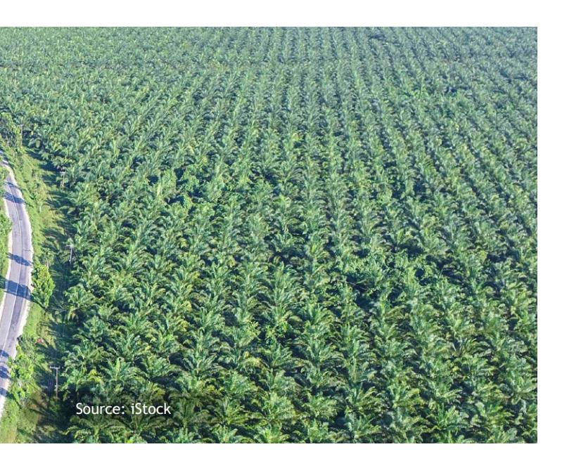