# TRACEABILITY INITIATIVES IN THE BEEF AND LEATHER VALUE CHAINS IN BRAZIL

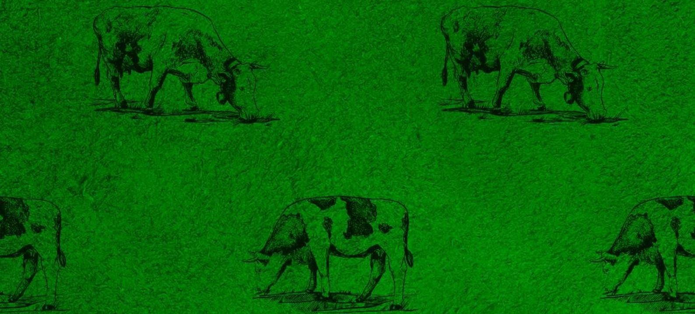

**FIIAPP**  
COOPERACIÓN ESPAÑOLA

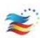

**iila**  
Organización Internacional de Informaciones de Industria

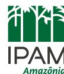

# **TRACEABILITY INITIATIVES IN THE BEEF AND LEATHER VALUE CHAINS IN BRAZIL**

**GRACIELA FROEHLICH MARCELO STABILE MARIA LUCIMAR DE SOUZA** Report conducted by:

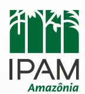

With the coordination of:

## **Photo credits:**

Adobe Stock – Cover

IPAM - P. 11

Unsplash - P. 13

Adobe Stock – P. 22, 40, 46

September, 2022

This publication was funded by the European Union. Its contents are the sole responsibility of the authors and do not necessarily reflect the views of the European Union.

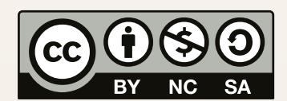

The original publication and any derivative works, which must be distributed with a licence that is the same as the one that applies to the original publication, may not be sold.

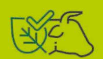

# **SUMMARY**

|                                                                                                                                                        | LIST OF ACRONYMS................................................................................................................................ EXECUTIVE SUMMARY.......................................................................................................................... INTRODUCTION | 5 7 11 |
|--------------------------------------------------------------------------------------------------------------------------------------------------------|-----------------------------------------------------------------------------------------------------------------------------------------------------------------------------------------------------------------------------------------------------------------------------------------------------------|--------|
| 1. OVERVIEW OF THE BEEF AND LEATHER VALUE CHAINS                                                                                                       |                                                                                                                                                                                                                                                                                                           | 13     |
| 1.1                                                                                                                                                    | Cattle ranching in the Amazon                                                                                                                                                                                                                                                                             | 15     |
| 1.2                                                                                                                                                    | Cattle, deforestation, and traceability.....................................................................................                                                                                                                                                                              | 16     |
| 1.3                                                                                                                                                    | Livestock sector commitments to reduce deforestation: TAC and CPP...........................                                                                                                                                                                                                              | 17     |
| 2. TRACEABILITY INITIATIVES IN BRAZIL...................................................................................                               |                                                                                                                                                                                                                                                                                                           | 21     |
| 2.1                                                                                                                                                    | The use of CAR and GTA in traceability and monitoring arrangements                                                                                                                                                                                                                                        | 33     |
| 2.2                                                                                                                                                    | The Agricultural Management Platform – PGA....................................................................                                                                                                                                                                                            | 36     |
| 2.3                                                                                                                                                    | The Brazilian System of Identification of Cattle and Buffaloes (SISBOV)                                                                                                                                                                                                                                   | 36     |
| 3. IMPROVEMENTS AND CHALLENGES FOR TRACEABILITY IN THE BEEF                                                                                            |                                                                                                                                                                                                                                                                                                           |        |
| AND LEATHER VALUE CHAINS...................................................................................................                            |                                                                                                                                                                                                                                                                                                           | 39     |
| 3.1                                                                                                                                                    | Improvements                                                                                                                                                                                                                                                                                              | 39     |
| 3.2                                                                                                                                                    | Challenges..................................................................................................................................                                                                                                                                                              | 40     |
| 3.3                                                                                                                                                    | Benefits of adopting traceability systems                                                                                                                                                                                                                                                                 | 43     |
| 4. FINAL CONSIDERATIONS............................................................................................................                    |                                                                                                                                                                                                                                                                                                           | 45     |
| 5. BIBLIOGRAPHY                                                                                                                                        |                                                                                                                                                                                                                                                                                                           | 48     |
| GLOSSARY.............................................................................................................................................. |                                                                                                                                                                                                                                                                                                           | 52     |
| ANNEX I                                                                                                                                                |                                                                                                                                                                                                                                                                                                           | 54     |

# **LIST OF ACRONYMS**

ABIEC - Associação Brasileira das Indústrias Exportadoras de Carne ABPO - Associação dos Produtores de Pecuária Orgânica do Pantanal AdT - Amigos da Terra - Amazônia Brasileira API - Application Programming Interface [Interface de Programação de Aplicativos] APP - Área de Preservação Permanente BND/SISBOV - Base Nacional de Dados/SISBOV BNDES - Banco Nacional de Desenvolvimento Econômico CAR - Cadastro Ambiental Rural CEPEA - Centro de Estudos Avançados em Economia Aplicada CICB - Centro das Indústrias de Curtumes do Brasil CPF - Cadastro de Pessoas Físicas CNA - Confederação de Agricultura e Pecuária do Brasil CNPJ - Cadastro Nacional da Pessoa Jurídica CONAMA - Conselho Nacional do Meio Ambiente CPP - Compromisso Público da Pecuária DIPOA - Departamento de Inspeção de Produtos de Origem Animal FPND - Florestas Públicas Não Destinadas FUNAI - Fundação Nacional do Índio GTA - Guia de Trânsito Animal GTPS - Grupo de Trabalho da Pecuária Sustentável GTFI - Grupo de Trabalho dos Fornecedores Indiretos GTRB/MT - Grupo de Trabalho sobre a Rastreabilidade de Bovinos em Mato Grosso Ibama - Instituto Brasileiro do Meio Ambiente e dos Recursos Naturais Renováveis IBGE - Instituto Brasileiro de Geografia e Estatística ICMBio - Instituto Chico Mendes de Conservação da Biodiversidade ICMS - Imposto sobre Circulação de Mercadorias e Serviços ICV - Instituto Centro de Vida Imac - Instituto Mato-Grossense da Carne IMAFLORA - Instituto de Manejo e Certificação Florestal e Agrícola

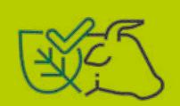

IMAZON - Instituto do Homem e Meio Ambiente da Amazônia 4 INCRA - Instituto Nacional de Colonização e Reforma Agrária IPAM - Instituto de Pesquisa Ambiental da Amazônia LAR - Licença Ambiental Rural LGPD - Lei Geral de Proteção de Dados Pessoais MAPA - Ministério da Agricultura, Pecuária e Abastecimento MapBiomas - Projeto de Mapeamento Anual do Uso e Cobertura da Terra no Brasil MMA - Ministério do Meio Ambiente MPF - Ministério Público Federal NWF - National Wildlife Federation [Federação Nacional da Vida Selvagem] PGA - Plataforma de Gestão Agropecuária PPM - Produção da Pecuária Municipal PROAPE/MS - Programa de Avanços da Pecuária de Mato Grosso do Sul PRODES/INPE- Programa de Monitoramento do Desmatamento da Floresta Amazônica Brasileira por Satélite/Instituto Nacional de Pesquisas Espaciais SEIIC - Serviço Eletrônico de Informação da Indústria da Carne SEMAGRO/MS - Secretaria de Estado de Meio Ambiente, Desenvolvimento Econômico, Produção e Agricultura Familiar SIE - Sistema de Inspeção Estadual SICAR - Sistema Nacional de Cadastro Ambiental Rural SIF - Sistema de Inspeção Federal SIM - Sistema de Inspeção Municipal SISBOV - Sistema Brasileiro de Identificação de Bovinos e Búfalos SISNAMA - Sistema Nacional do Meio Ambiente TAC - Termo de Ajustamento de Conduta WBCSD - World Business Council for Sustainable Development [Conselho Empresarial Global para o Desenvolvimento Sustentável] WWF - World Wide Fund for Nature

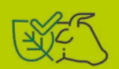

# **EXECUTIVE SUMMARY**

This document presents an overview of the cattle traceability arrangements in Brazil from calf to slaughterhouse. It is part of Dialogues between the European Union and Brazil on the Beef and Leather Value Chains, which has brought together importers, retailers, slaughterhouses, tanneries, exporters, livestock farmers, researchers, associations, and civil society organisations to reflect on sustainability, identify best practices and potential partnerships that can contribute to the improvement of these production chains. This was an initiative promoted by the European Union through the AL-INVEST Verde Programme in collaboration with the *Instituto de Pesquisa Ambiental da Amazônia* (IPAM).

Interviews were carried out for this study with agents of the beef and leather value chains in addition to reviews of the literature and documents. The technical dialogues coordinated by the Amazon Environmental Research Institute (IPAM)1 also served as a basis and source for the research. Data on the beef and leather production complexes were summarised, combined with a description and examination of beef cattle raising in Brazil and its role in increasing deforestation rates in the country.

The mapping surveyed 13 different traceability solutions in Brazil, which include tools - technologies that carry out socio-environmental analyses - and programs, which include support for environmental regularisation, bonuses, and technical assistance besides the traceability tools themselves. Traceability initiatives that incorporate socio-environmental monitoring analyses were favoured in this research although we addressed arrangements that independently develop these elements. traceability in the definition adopted refers to the follow-up of products along their processing route while monitoring analyses the social and environmental conditions on premises.

With the exception of the Brazilian System of Identification of Bovines and Buffaloes (*Sistema Brasileiro de Identificação de Bovinos e Búfalos* or SISBOV) whose purpose is herd health control, all other solutions include measures for socio-environmental monitoring of rural properties. The arrangements have multiple origins, including private and third sector initiatives, partnerships between governments, non- -governmental organisations and universities as well as public power projects.

The largest number of initiatives are concentrated in the Northern region of the country and in the Legal Amazon, which is largely due to the pressure exerted by the Terms of Adjustment of Conduct (TAC) enforced by the Federal Public Ministry (MPF) since 2009 and by the Livestock Public Commitment (CPP) promoted by Greenpeace in the same year. In terms of cost, most of the mapped tools are free of charge, which can be a positive factor in the respective target audiences adhering to the tools.

In terms of scope, the most part of the traceability architectures mapped potentially covers indirect suppliers - one of the major bottlenecks for any traceability measure and socio-environmental monitoring of livestock in the country. There are also initiatives exclusively aimed at the industry and direct suppliers.

The Animal Transit Guide (*Guia de Trânsito Animal* or GTA) and the Rural Environmental Registry (*Cadastro Ambiental Rural* or CAR) are the main documents used in the traceability tools mapped. The first, official and compulsory for animal transportation in Brazil, provides information on the health of cattle while the second provides information on the environmental characteristics of rural properties. Studies have shown that the cross-referencing of GTA and CAR data produces an "environmental photograph" of the properties through which cattle pass by linking cattle data to farms. Their combined use has great potential in bringing traceability to scale in Brazil.

Preserving the confidentiality of producers' personal data and business information is a concern that cuts across all actors and there is considerable investment in information security by enterprises. Eight traceability architecture maps use blockchain, a technology with great potential to provide security in transit and information storage. The existence of customisable tools, which allow users to perform compliance analyses according to specific protocols, brings flexibility to the systems, enabling the aggregation of variables according to the requirements of different clients and markets.

With this background in mind, we summarise the following challenges and recommendations:

## Challenges

- 1. Land and environmental regularisation of rural properties. The lack of land governance inhibits private investment and the absence of environmental governance prevents proper legal accountability of those who break the law.
- 2. Engagement of the production sector, involvement of producers in both discussions on traceability and in the effective use of herd control technologies. The participation of cattle ranchers in forums on transparency is still limited, which also impacts the use of traceability tools on farms.
- 3. Problems accessing public information, especially the CAR and GTA. Databases lack transparency, standardisation, and integration for these documents to efficiently integrate traceability map architectures.
- 4. Resistance to the use of the Animal Transit Guide (GTA), the basic document of most of the initiatives mapped that has great potential to bring traceability to scale. On the one hand,

those who contest its use argue that it contains personal information protected by law and, on the other hand, that using it in traceability architecture maps would divert its purpose from health control.

- 5. Insignificant use of traceability tools by small and medium-sized slaughterhouses. Units inspected by the local and state government sanitary inspection systems have yet to be fully integrated in the debates on transparency and have not used traceability tools in their activities.
- 6. Reduced involvement of indirect suppliers in debates on traceability and environmental regularisation policies besides insufficient use of the rural properties of transparency tools. These producers are key to the traceability of the entire production chain and, consequently, to the effectiveness of measures to control deforestation.
- 7. Fragile integration of information between slaughterhouses and tanneries. The use of different traceability systems by these agents, or even the non-use of such tools by slaughterhouses, can negatively impact the quality of traceability and socio-environmental monitoring data, consequently undermining transparency in these value chains.
- 8. Reduced integration between the traceability of the tannery's raw material (hide) coming from the slaughterhouses - and the internal traceability of its product (leather) resulting from the tannery's industrialisation. The connection between these two stages of traceability is necessary for socio-environmental compliance analyses to be quick and efficient.
- 9. Lack of technical assistance for small rural producers, whose access to financial resources, information and training is very limited in much of Brazil. Technical support to these cattle farmers is vital to increase transparency in the beef and leather value chains as it is in these fringe producers that most of the indirect suppliers of cattle are found.
- 10. Low quality of internet connectivity in rural areas, which negatively affects the use of the

traceability tools available in the country.

## Recommendations

1. Support the development of credit lines for environmental regularisation and consolidate

- the validation of the Rural Environmental Registry (CAR).
- 2. Encourage participation of rural producers in forums and discussions on traceability, promoting the benefits in terms of zootechnical and market gains brought about by management systems.
- 3. Facilitate access and promote transparency in public databases involving federal and state governments in discussions and implementation of traceability architecture maps.

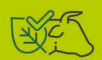

4. Promoting a public and free traceability system is fundamental to guaranteeing adoption

- of sustainable practices throughout the chain.
- 5. Invest in information security mechanisms and protection of rural producers' personal and commercial data. The connection of the GTA to the CAR and the hiding of sensitive data from the Guides to traceability architecture maps are strategies to be considered.
- 6. Incorporate local and regional refrigerated cold stores in the discussion tables, understanding their particularities, stimulating the use of traceability tools in small and medium industries.
- 7. Expand technical assistance services and conditions for improving livestock management and land use practices.
- 8. Encourage agreements and arrangements between slaughterhouses and tanneries for the use of compatible supplier control systems, with training for the correct operation of the tools.
- 9. Develop specific programmes to link the traceability of the raw material (leather) to the product (hide).
- 10. Encourage programs and partnerships that promote improvements in management, land use, and the use of traceability tools on rural properties, especially small and medium-sized ones, which represent a large part of the indirect supply of cattle; and
- 11. Invest in improving the quality of internet connection in the field, facilitating the use of existing tools.

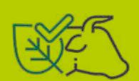

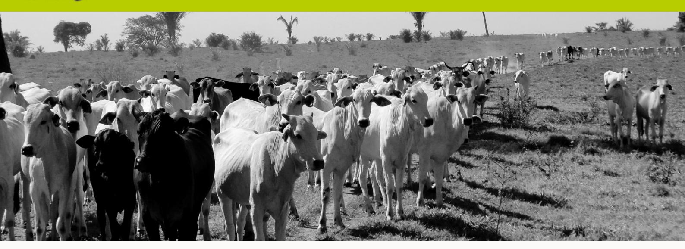

# **INTRODUCTION**

This study is part of the EU-Brazil Beef and Leather Value Chain Dialogues. These dialogues have brought together importers, retailers, meatpackers, tanneries, exporters, cattle ranchers, researchers, associations, and civil society organisations to discuss and organise information on the sustainability of the beef and leather value chains in Brazil especially regarding deforestation, identifying best practices, and future initiatives. This was an initiative promoted by the European Union through the AL-INVEST Verde. Programme in collaboration with the *Instituto de Pesquisa Ambiental da Amazônia* (IPAM).

The recent establishment by the European Commission of a new proposal for environmental and human rights regulations for large global value chains such as soy, beef, palm oil, timber, cocoa, coffee, and some derivative products2 has stimulated debate among European and South American actors. The European Commission's proposal sets out guidelines for

2 The proposal can be found here: [https://ec.europa.eu/commission/presscorner/detail/en/ip\\_22\\_1145](https://ec.europa.eu/commission/presscorner/detail/en/ip_22_1145)  
Accessed 08 August 2022.

3 The idea of climate emergency refers to the study, signed by more than 11,000 scientists from 153 countries, entitled “World scientists’ warning of a climate emergency” (Ripple et al, 2020). The growth in human and ruminant populations, per capita meat production, per capita world output, global loss of vegetation cover, the large number of passengers carried by the airline network and carbon dioxide (CO2) emissions are all signs considered to be deeply problematic for the state of climate emergency declared by scientists (idem).

mandatory prior compliance analysis (due diligence) for importers placing certain products on the EU market that have been linked to deforestation and forest degradation. International conventions on human rights and the environment must be observed by companies and national states are responsible for supervising the application of these regulations. The aim of the European proposal is to ensure that only deforestation-free products that comply with the legislation of the country of origin enter the EU market.

 From this point of view, this document characterises traceability initiatives oriented to the promotion of sustainable practices in the Brazilian bovine hide meat value chains. We assume that these are key sectors for climate and environmental policies, and the mobilisation of all actors involved in these chains is of crucial importance to curb deforestation and address the climate emergency3. Traceability is therefore understood to be the starting point for

improving work on rural properties, improving production practices throughout the chain, and eliminating deforestation.

In order to map traceability arrangements and understand their possibilities and limits, the methodology of this work was composed of: 1) bibliographical survey of livestock farming focussing on the traceability and transparency in Brazil; 2) mapping of traceability initiatives; 3) structured interviews with specialists on the themes of traceability, transparency of information, and existing tools; 4) inventory of socio-environmental and economic indicators of the meat and leather chains; and 5) systemisation of the interviews, secondary data, and writing of the final document.

Over a period of three weeks, 17 interviews were carried out with representatives of educational and research institutions, the productive sector, industry, retail and sectoral forums of the meat and leather chains4. The interviews reflected on the differences and approximations between traceability and socio-environmental monitoring, examined the main pressures for its implementation, and analysed the traceability tools employed and under development in Brazil, assessing their potential and challenges.

In the first part of this study, we present an overview of the production chains of beef and leather in Brazil, characterising livestock production, socioeconomic indicators of the activity, effects on deforestation, and the main commitments signed in the country in order to mitigate the role of livestock in making the environmental crisis worse.

Next, the traceability arrangements mapped in Brazil are listed and their main characteristics described. Some of the controversies brought about by the use of documents such as the *Guias de Trânsito Animal* (GTA) - compulsory for cattle transportation - and the *Cadastro Ambiental Rural* (CAR) - environmental registry of rural properties - in traceability initiatives are also raised.

The third chapter summarises the progress achieved and the challenges for the full establishment of transparency mechanisms, stating potential benefits for cattle ranchers, retailers, industry, and the State brought by the tools as well as their socio-environmental effects. Lastly, the final considerations summarise the panorama presented and list recommendations to meet the challenge of transparency and sustainability in the Brazilian meat and leather chains.

As agreed with the people participating in the research, their names will be kept anonymous.

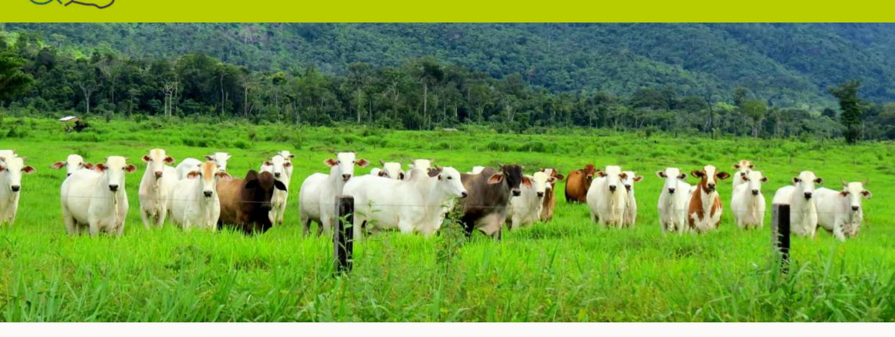

# **OVERVIEW OF THE BEEF AND LEATHER VALUE CHAINS**

Brazil's beef and leather value chains are characterised by their great heterogeneity and complexity. Spread across all regions and biomes of the country, most of these chains are the techniques employed in cattle management, the size of properties, the size of herds, and the cultural traditions of cattle ranching from the north to the south of Brazil. Since the 16th century (Furtado: 2007 [1959], Prado Jr: 2010 [1941]), when the first cattle arrived on the territory, these animals have been part of complex chains with a series of actors and mediators along the great distance from the farms to the consumers.

Brazil has the largest commercial cattle herd in the world which had reached 218.2 million heads in 2020. According to data from the IBGE's *Pesquisa da Produção da Pecuária Municipal* (PPM) 2020 survey, Mato Grosso is the state with the largest herd (32.7 million heads), followed by Goiás (23.6 million) and Pará (22.3 million). Mato Grosso state is home to the municipality with the largest cattle herd in the country: São Félix do Xingu, which totalled 2.4 million head in 2020, the largest herd in its historical series. According to the 2017 Agricultural Census, there are 2,554,415 cattle ranches in the country (IBGE, 2017).

Cattle ranching is a very important sector in Brazilian agribusiness, and the meat sector including poultry, pork, and beef - is the second most exported group of products in Brazilian agribusiness, with only soybeans being more important (Soendergaard et al., 2021). According to the Brazilian Association of Meat Exporting Industries (ABIEC), beef exports generated revenue of US\$9.2 billion in 2021 with the trading of 1,846,263 tons (ABIEC, 2022). In 2020, the country exported beef to 157 countries, and 41.5 million cattle were slaughtered (ABIEC, 2021). In turn, leather was exported to 76 countries, totalling \$US 1.41 billion and 172.3 million m² of hides (CICB, 2021). China is the primary buyer of Brazilian beef and in 2020 took 60% of the beef exported by the country (Gilio et al., 2021). The largest portion of leather exported by Brazil also went to China, that is, 29.5% (CICB, 2021).

Although Brazil is the world's largest exporter of beef in volume, it is not the largest exporter in product value. According to Marcos Sawaya Jank, a specialist in agribusiness studies, this is because most of the meat exported is industrial meat, second-quality meat, to be processed and transformed into other products in the destination countries. The author points out that althou-

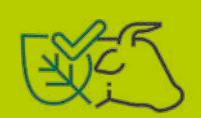

gh countries like China and Hong Kong consume Brazilian meat intensively, their consumers do not recognize its country of origin.

The exponential growth of the Brazilian meat industry during the last two decades has had the solid support of the federal government, notably through its "National Champions" policy which aimed at consolidating Brazilian companies from different sectors, as central players on the international scene. For example, in this spirit the National Bank for Economic Development (BNDES) invested R\$8.1 billion in JBS between 2007 and 2013, even controlling 21% of its shares (Leda, 2017).

In turn, the leather industry is considered an "extension of the meat industry" (Flores et al., 2021: 8). Tanneries transform the skin, a by- -product of this industry, into leather and other artifacts. The former is the raw material for shoes, handbags, clothes, and other fashion accessories as well as for car upholstery and furniture among many others. Its scraps and trimmings also have a great many different uses and for example are incorporated into the food, pharmaceutical, and pet products industries (idem)5.

Unlike meat - for which the domestic market6 consumes the largest share of production, 74.49% in 2021 (ABIEC, 2022) - 80% of the bovine leather produced in Brazil is exported, with China being the largest importer, followed by Italy (Flores et al., 2021). However, as with the meat chain, pressure is growing for suppliers to

5 According to the same publication, for depending exclusively on the hides supplied by slaughterhouses, the latter has very high bargaining power in relation to tanneries. Complex commercial ties are created between these agents that, for example, lead to advance charges for hides sold to tanneries and little or no concern with hiding quality on the part of slaughterhouses (Flores et al., 2021). In this context, possible demands in terms of the origin of cattle (and consequently of hides) on the part of tanneries concerning slaughterhouses become more delicate.

6 In 2018 alone, Brazil exported more than 20% of its beef production. That year, the percentage exported reached 20.1%, its historical record (ABIEC, 2019). This rate increased in 2020 when the country exported 26.7% of its production (ABIEC, 2021).

be subject to control measures and for knowledge of the product's origin to ensure health and safety and socio-environmental compliance.

Brazilian cattle rearing is mainly extensive and is carried out in native or cultivated pastures which are estimated to cover an area of approximately 165.2 million hectares (ABIEC, 2021). Confinement, carried out to accelerate the final fattening phase, corresponds to a small fraction of cattle rearing in Brazil, which confined 6.5 million head in 2021. Another essential characteristic of Brazilian livestock farming is the specialisation of work on farms: there are properties dedicated to distinct phases of animal husbandry such as breeding, rearing, and fattening, and there are also those that perform all of these stages, known as the complete cycle.

Calves are born on the breeding farms, and after being weaned and reaching about 150 kg, they move on to be reared between 7 and 8 months of age. The animals are fattened in the rearing phase until they reach about 350 kg, which takes between 12 and 24 months depending on the rearing system to which the cattle will be subjected: type of pasture, use or not of feed supplements, pasture management, etc. Finally, the cattle enter the fattening phase, also called finishing. This stage can occur in pastures and feedlots and continues until the animals reach about 500 kg, which can mean the slaughtering of a young steer of 30 months or having to wait more than 48 months. The slaughter age has been gradually falling. In 2020, only 10.9% of the cattle were slaughtered at

more than 36 months of age whereas in 1997 this rate was 53.8% (ABIEC, 2021).

This differentiation and specialisation of the farms' work has direct implications on the transparency of cattle production and so on traceability and socio-environmental monitoring projects and mapping. The greater the number of links, the more difficult it is to track the trajectory of cattle and, consequently, to socio-environmentally monitor the properties through which the cattle have passed. According to Proforest's study (2021) on transparency in the beef chain, visibility is considered to be high in farms that perform the complete cycle and decreases to the extent that breeding and rearing are carried out on different properties. Usually, only the farm that sells its cattle to the slaughterhouse is monitored, and this, as we will see, is one of the main challenges to effective socio-environmental traceability in Brazil. According to a study conducted by Agrosuisse Consultoria for the Brazil, Climate and Forests Coalition (2020), traceability has made significant advances in the entire cycle and on rearing and fattening properties, but is not yet noticeable on breeding properties.

## **1.1 Cattle ranching in the Amazon**

If the use of cattle in the colonisation of Brazilian territory is historic, dating back to the 16th century, it was only during the first years of the Military Dictatorship at the end of the 1960s that the Brazilian government began to incisively encourage the occupation of the Amazon with cattle ranching (Garcia et al., 2021). The opening of roads at the beginning of the following decade - the Transamazon in 1972 and the Belém-Brasília in 1974 - were decisive in the increase of cattle rearing activities in the region (idem).

7 Legal Amazon is a delimitation created by the Brazilian government to promote the region's socio-economic development. It encompasses all of the states in the North region and parts of the Midwest and Northeast regions: Acre, Amapá, Amazonas, Mato Grosso, Pará, Rondônia, Roraima, Tocantins, and Maranhão.

8 Tinoco (2021) mentions an even lower rate of one animal to every three hectares of land.

The low return on economic activities linked to cocoa and black pepper - the two main products of the Transamazon region when migrants settled there from other regions - and the problems in transporting agricultural products favoured cattle ranching in the region. However, this did not happen homogeneously. While lean cattle can be moved from one farm to another without high costs because this type of cattle can go on foot, the displacement of herds to slaughterhouses is more costly because trucks are used, and this fact explains, in part, the specialisation of farms in breeding, rearing, or fattening cattle: the closer the regions are to slaughterhouses, the more focused on finishing the animals the region is (Piketty et al., 2005).

The economic security offered by ranching is the main factor for this activity being developed in the Amazon. The producer can keep cattle in pastures without having to invest significantly: "ranching constitutes a good form of savings and has good liquidity on the colonisation fronts." (Piketty et al., 2005: 231).

At the time of writing, the Amazon is where the most significant growth rates of the Brazilian herd are found. Between 2009 and 2019, while this volume was 46% for the country, this rate was 120% in the Legal7 Amazon (Soendergaard et al., 2021), consolidating it as the main agricultural frontier in the country. As in most of the country, pasture productivity rates, stocking rates, and the number of animals per hectare in the Legal Amazon are low. In a technical study on the productivity index of beef cattle ranching in the Amazon, CEPEA in conjunction with Imaflora estimated the average stocking rate in the region to be 0.73 AU/ha8, well below the rate of 2.5 AU/ha presented as the potential for pasture cattle ranching in the Amazon region (Carvalho et al., 2020).

#### **1.2 Cattle, deforestation, and traceability**

Considering the emission of gases from burning forests that contribute to global warming, deforestation is the most polluting activity in Brazil (Barreto et al., 2017). According to data from IPAM (Salomão et al., 2021), in 2020 cattle ranching was the primary form of land use in 75% of deforested areas of undesignated public forests (FPND). The study also shows that pastures not only persisted in these areas ten years after their conversion but also expanded in scale, demonstrating economic investment for permanence and conversion of new areas for cattle ranching. According to the WWF, 80% of all deforested areas in Brazil are immediately occupied by pastures. Consequently, cattle ranching is still the main driver of deforestation in the country (WWF, 2021) even though it is not necessarily the economic activity at the end of conversion. Occupation by cattle also valorises the land by making it a significant real estate development. The lack of governance and the amnesty for such forms of occupation mean illegal occupation is advantageous.

The case of the municipality of Manicoré in the state of Amazonas is a good example. Located near the borders of Rondônia and Mato Grosso, Manicoré is one of the five municipalities with the highest rates of deforestation in the state, and its herd grew almost 800% in 15 years, from 12,800 animals in 2004 to 115,000 animals in 2018 (Wenzel, 2021). According to the author, an area corresponding to 82,000 soccer fields was deforested in the same period. Due to the herd's growth, two slaughterhouses were set up in the region in 2021.

The growth of the herd in the Legal Amazon region is closely followed by the expansion of meat packing plants, and since 2009 these companies have been the focus of private com-

mitments for the reduction of deforestation: the Terms of Adjustment of Conduct (TAC) and the Public Commitment for Cattle Ranching, which we will analyse later in the document. There are currently 150 active meat-packing plants in the region accredited via the state and federal sanitary inspection services (SIE and SIF), according to MONITAC9 data, and 68 of them have agreements to reduce deforestation. Aware of the risks of buying animals from deforestation areas and other socio-environmental crimes, these agreements created control mechanisms and established criteria to be met by the signatory companies, stipulating fines in case of noncompliance.

However, not only the slaughterhouses located in the country's Northern region are exposed to the purchase of inputs crossed by illegalities. The recent publication "Oxen march to the forests" released in 2021 by Repórter Brasil shows that even slaughterhouses located in Southeast Brazil can be supplied with meat and animals from illegal areas in the Amazon and Pantanal. The Southeast has the most significant number of plants authorised to export to Europe and the United States, markets considered strategic for the sector – showcases - which guarantee exports to other countries. For example, the individual traceability of animals is not necessary for the production of canned meat and beef jerky, whose raw materials are brought from slaughterhouses in various regions of the country. Due to this, these products are more likely to originate from properties with legal irregularities.

In this context, tracing the origin of cattle and monitoring properties through which the animals pass during their lives has been presented as a central strategy in knowing the social and environmental reality of cattle and so to curb deforestation, within the margins provided for by the Brazilian Forest Code, whether legal or

illegal. According to Koning (2020), no company in a study conducted by the Amsterdam Declarations Partnership can guarantee that its supply chain is free from deforestation without traceability and transparency. Furthermore, in being more than an individualised look at their supply chains, transparency measures refer to the need for collective actions to reduce deforestation and mitigate climate change, which involve diverse actors and various institutions.

Since 2009 Brazil has established a law to characterise the traceability concept employed by cattle and buffalo production chains. In the terms addressed by the law, traceability refers to the fields of animal health, public health, and food safety, and there is no mention of environmental sustainability in this legal document. Article 2 of Law 12.097/2009 defines, traceability as "the ability to ensure the recording and monitoring of information relating to the stages that make up the production chain of beef and buffalo meat, allowing an animal or group of animals to be followed during all stages of its life as well as to follow a product through all stages of production, transportation, processing, and distribution of the production chain of beef and buffalo meat.

More incisive pressure in defence of transparency and traceability measures in the meat production chain was consolidated in Brazil in 2009 when investigations by the Federal Public Ministry of Pará led to the first Conduct Adjustment Agreement (TAC) between meatpacking plants and the MPF in favour of measures to control suppliers according to social and environmental criteria. In addition, in 2009 nationally and internationally Greenpeace launched the publication "*A Farra do Boi na Amazônia*"

10 An externality of the 2009 commitments and a possible effect of the TACs and the CPP is the growth of geomonitoring and traceability companies dedicated to cattle ranching and/or products specifically developed for the sector.

(Cattle rearing in the Amazon) and then signed the Cattle rearing Public Commitment (CPP)10 with four large slaughterhouses (JBS, Marfrig, Minerva, and Bertin11).

#### **1.3 Livestock sector commitments to reduce deforestation: TAC and CPP**

According to the WWF and the Brazil, Climate, Forests and Agriculture Coalition (Agrosuisse & Coalizão Brasil, 2020; WWF, 2021), the Conduct Adjustment Agreements (TACs) signed between the Federal Public Ministry and meatpackers in the Legal Amazon region since 2009 represent key advances in the discussion on traceability and monitoring in Brazil. These agreements have created control mechanisms and established criteria to be met by signatory companies, making traceability a fundamental mechanism for guaranteeing products free of socio-environmental irregularities.

The first state to implement a TAC focused on the meat industry was Pará on the initiative of the state's Federal Public Ministry. Subsequently, Mato Grosso, Acre, Rondônia, and Amazonas also implemented agreements. Among the objectives of TACs are the eradication of illegal deforestation in direct and indirect suppliers. The companies can only buy animals from producers with Rural Environmental Registration (CAR) and Rural Environmental Production License (LAR) and cannot appear on lists of slave labour12 or embargoed areas. The TACs have forced slaughterhouses to establish traceability and monitoring measures for their supply chain. In turn, the Cattle Breeding Public Commitment (CPP) is a zero-deforestation agreement signed between Greenpeace and the leading meat processing companies

operating in the Amazon (JBS, Marfrig, and Minerva13). Greenpeace left the agreement in 2017 after corruption scandals involving large companies in the sector, including the *Carne Fria* (Cold Meat)14 operation.

This investigation, carried out by the Brazilian Institute of the Environment and Renewable Natural Resources, i.e. Ibama (*Instituto Brasileiro do Meio Ambiente e dos Recursos Naturais Renováveis)*, aimed at curbing illegal deforestation in the Amazon, leveraged by the extensive cattle ranching practiced in the region. The operation fined 14 meat packing plants in Pará, Bahia, and the Tocantins that bought 58 thousand heads of cattle raised in 26 farms in areas embargoed by Ibama for illegal deforestation. Furthermore, the operation revealed that the companies failed to comply with the Terms of Conduct Adjustment (TAC) they had agreed.

The agreement, led by Greenpeace, established Minimum Criteria for Industrial Scale Cattle and Beef Product Operations in the Amazon Biome: 1. zero deforestation in the supply chain; 2. no trespass on Indigenous Lands and Protected Areas; 3. no slave labour; 4. no squatting and violence in the countryside; 5. implementation of a monitorable, verifiable, and reportable production traceability system; and 6. implementation of commitments in the production chain (informing suppliers of the

*Pessoas Físicas*) or CNPJ (*Cadastro Nacional de Pessoas Jurídicas*). The names of the employers are also disclosed, and the list referring to April 2022 can be checked on this link: [https://www.gov.br/trabalho-e-previdencia/pt-br/composicao/](https://www.gov.br/trabalho-e-previdencia/pt-br/composicao/orgaos-especificos/secretaria-de-trabalho/inspecao/areas-de-atuacao/cadastro_de_empregadores.pdf) [orgaos-especificos/secretaria-de-trabalho/inspecao/areas-de-atuacao/cadastro\\_de\\_empregadores.pdf](https://www.gov.br/trabalho-e-previdencia/pt-br/composicao/orgaos-especificos/secretaria-de-trabalho/inspecao/areas-de-atuacao/cadastro_de_empregadores.pdf) [criterios-m-nimos-para-opera-2.pdf A](https://www.greenpeace.org/static/planet4-brasil-stateless/2018/07/criterios-m-nimos-para-opera-2.pdf)ccessed on May 27, 2022.

requirements and the sanctions resulting from non-compliance)15.

Despite Greenpeace's withdrawal, the agreement remains valid for the signatory meatpackers and has its zero-deforestation policy as a major differentiator, i.e., that is prohibited even within the margin allowed by the Forest Code (20%). Traceability actions in both the TACs and the Cattle Breeding Commitment are aimed at direct suppliers although the texts of both mention indirect suppliers (Armelin et al, 2020). According to data from MoniTAC, an independent platform that monitors the implementation of the Terms, the commitments at the time of writing involve 68 meatpacking plants in the Amazon region.

The coverage over the indirect suppliers constitutes the main weakness of these agreements and is one of the challenges in the traceability and comprehensive monitoring of the beef production chain. If the structure of breeding, rearing and fattening poses challenges inherent to this production system, the persistence of practices such as the purchase of animals from various rural properties brings unique problems. For example, this can be done, by bullfighters who buy cattle from various farms acquiring cattle of various origins, which are mixed on the farms of destination. These multiple indirect suppliers should be mapped so

that the direct supplier can certify to the slaughterhouse that the animals come from areas complying with the socio-environmental regulations. Unregistered trade, auctions, and sales further complicate the already intricate issue of indirect suppliers.

Barreto & Gibbs (2015) also listed three other weaknesses in complying with the agreements to reduce deforestation in the Amazon. The first of them is called "laundering" and consists of transferring cattle from a farm in an illegal socio-environmental situation to another property that operates legally. The latter, in not having associated infractions, can sell its animals to the slaughterhouse that, in not monitoring the indirect suppliers (the "dirty" farms that sell the animals to "clean" farm), ends up receiving animals from areas with socio-environmental problems.

A second obstacle is related to slaughterhouses that do not adhere to either of the two protocols. They channel animals from properties with embargoes and sales restrictions to the plants that signed the TAC and CPP, and there are gaps in the monitoring of these enterprises. This process is known as "leakage" (Barreto & Gibbs, 2015).

Finally, the authors claim that the delay in conducting the audits that should have analysed the appropriateness and compliance with the requirements established by the agreements made it impossible to check non-compliance and anti-deforestation measures quickly. Although the first audit was scheduled for 2010, it only took place in 2013 and only verified three establishments. On the other hand, the study by Barreto and Gibbs (2015) shows a positive effect of the agreements has been that the number of properties with CAR registration in the state of Pará has increased considerably. In 2010, one year after the signing of the TAC, approximately 60% of purchases by meatpackers came from farms with CAR and in 2013 this percentage was 98%, improving the "monitoring of land use and deforestation at the property level" (Barreto & Gibbs, 2015: 14). The authors also assert that the agreement in Pará had a direct influence on the more accentuated reduction of deforestation in the state between 2010 and 2012 compared to those states in the region that did not have TACs or which had longer implementation deadlines (idem).

Besides these, other private agreements for the reduction of deforestation in the beef production chain have emerged especially after 2009. In 2010, the *Consumers Goods Forum* was created, an organisation that brings together large companies, retailers, manufacturers, and other stakeholders in 70 countries to address challenges in environmental and social sustainability, health, and food safety. In 2022, the organisation published its first document focused on beef and in 2012 it invested resources in the foundation of the *Tropical Forest Alliance*, a multistakeholder platform established to support companies in the implementation of sustainable measures in the production chains of palm oil, soy, beef, and cellulose.

*The 2014 New York Declaration on Forests,*  approved during that year's Climate Summit, focuses on reducing global deforestation. This is an important voluntary agreement which over 200 organisations, countries, states, and companies have signed. The reduction of deforestation and the restoration of forests established by the agreement aims to limit global warming to less than 2°C by 2030. It should be noted that Brazil has not endorsed the agreement although the states of Acre, Amazonas, and Amapá have signed the document.

Although promising, according to Koning (2020) both the *New York Declaration on Forests* and the *Consumer Goods* Forum mobilised a very small number of companies linked to the meat and leather sectors com-

pared to other chains such as soy and palm oil. Based on data from *Forest Trends* - a Washington based organisation specialising in creating economic tools for the preservation of ecosystems - the author states that only 12% of large companies operating globally at risk of exposure to deforestation have some type of commitment to sustainability.

Two other recent initiatives with potential impact on the discussions on sustainability and traceability in the beef and leather chains should be highlighted. These are the 2015 *Amsterdam Declaration on Deforestation*, whose main aim is to support the public and private sectors in eliminating deforestation in the palm oil, soybean, and cocoa production chains, and the 2018 *Soft Commodities Forum*, a global platform that brings together leading companies in the food and agribusiness sectors, organised by the World Business Council for Sustainable Development (WBCSD). The initial focus of action is the Brazilian Cerrado.

In Brazil in 2019, the initiative *Boi na Linha* from the Institute for Forest and Agricultural Management and Certification (Imaflora) in partnership with the 4th Chamber of Environment and Cultural Heritage of the Federal Public

Ministry promoted a new momentum for the agreements to reduce deforestation signed in 2009. This joint effort16 seeks to strengthen social and environmental commitments in the Amazon beef chain by improving monitoring, auditing, and traceability processes and tools. Understanding that there was a need to standardise processes and concepts, in addition to providing several studies on the beef and leather chains in Brazil, the platform produced the Harmonised Protocol for Monitoring Cattle Suppliers in the Amazon (2020), approved by the MPF, which standardises rules for suppliers and cattle purchases. In 2021, it also launched the Protocol for Auditing Cattle Ranching Commitments in the Amazon to be observed in the verification of the Pará TAC (2009), the Legal Amazon TAC (2010), the Cattle Ranching Public Commitment, the MPF-MT Letter (03/2017), and the MPF-PA Letter (05/2018) (Imaflora, MPF: 2021).

The strengthening of commitments and agreements in the meat and leather sectors have made a difference in mobilising articulation fronts and programs in favour of transparency initiatives in these chains. The following chapter looks at the characteristics of these initiatives in Brazil.

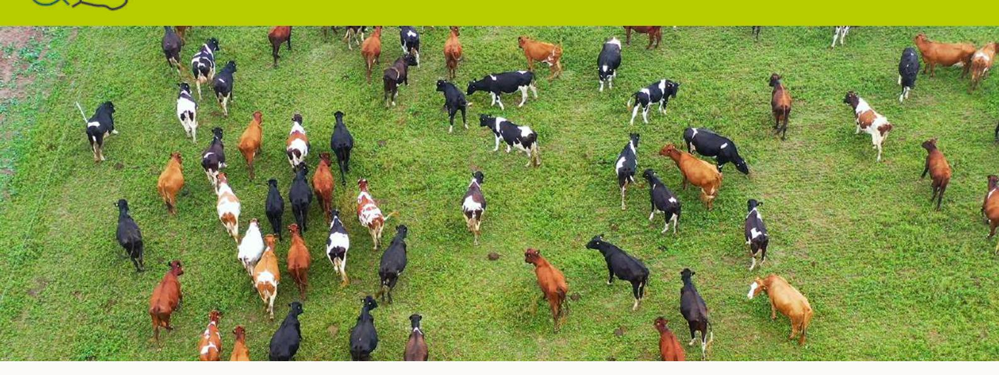

# **TRACEABILITY INITIATIVES IN BRAZIL**

In this chapter, we present an overview of the traceability and socio-environmental monitoring arrangements in Brazil's beef and leather chains based on documental research, structured interviews, and also analysis of the web pages of traceability programs and tools. In the list, the initiatives that combine traceability and monitoring were favoured, with the exception of SISBOV that despite having sanitary control purposes, was kept in the list due to its historical importance and potential contribution in social and environmental sustainability solutions.

Although traceability and monitoring may be very close and even interdependent concepts, the preservation of an exclusive meaning for both was important in the framework presented here and is central in its adoption by the meat and leather production chains. Attentive to this need, the GTPS Traceability Working Group has built shared base concepts from the dialogue with several actors, which could support and guide the actions towards traceability and monitoring. Consequently, it defined *traceability* as the "process of identification of inputs and raw materials of beef cattle products in all locations along the beef and leather value chain from the farm of origin, through receipt, production, transformation, and distribution" (GTPS, 2021: 10). In turn, monitoring deals with the "verification of socio-environmental compliance and sustainable practices in the production systems of the meat and leather value chain. Usually performed by a system, it covers all of the places travelled in the beef and leather chain, generating information and metrics for the production chain on socio-environmental criteria and good production practices." (GTPS, 2021: 10).

Starting from this understanding, traceability does not necessarily imply social-environmental monitoring. The origin of products and supplies can be determined without verifying social and environmental criteria17. Monitoring is a necessary and complementary stage in the analysis, and an instance that connects objects/products to their territorial/social and environmental characteristics18. For the purposes of this work, given its capacity to act

17 This is what happens, for example, in Uruguay, where all herds are tracked individually, but socio-

18 Despite the potential represented by the use of the Galileo satellite navigation system developed by the European Union, the traceability arrangements contained in this mapping operate from coordinates provided, above all, by the Rural Environmental Register (CAR) of rural properties. These coordinates are analysed against

effectively to curb deforestation and socio-environmental irregularities, the integration of traceability and monitoring is essential.

Furthermore, in addition to socio-environmental benefits, the implementation of traceability and transparency mechanisms in the beef and leather value chains enables consumers to make more informed and conscious choices by knowing the origin of the products they purchase. It also allows the industry to have greater control over its supply chain (it is also possible for cattle ranchers in the breeding and fattening phases to implement traceability solutions), and facilitates the isolation of suppliers with social and environmental liabilities. Lastly, it allows the State to direct actions and public policies where needed for land and environmental regularization (Inakake, 2021).

The table below has prioritised tools and programmes that combine traceability and monitoring. Before analysing it in detail, it is vital to highlight the role of broader initiatives that have been active in fostering discussions on traceability and monitoring in the chain: the Indirect Suppliers Working Group (GTFI), MoniTAC, the Traceability Working Group of GTPS, and more recently, the Working Group on Traceability of Cattle in Mato Grosso (GTRB/MT).

 The GTFI was established in 2015. Led by the National Wildlife Federation (NWF) of the United States and the organisation Friends of the Earth - Brazilian Amazon (AdT), it brings together representatives from industry, civil society, and universities and stimulates discussions directly related to traceability for indirect suppliers, among other things participating in the development of the Visipec tool. Its working focus is the control of deforestation by indirect suppliers and its aims are to "identify, develop and support the implementation of traceability solutions for indirect suppliers and communicate challenges, opportunities, and progress towards traceability for indirect suppliers"19.

Focusing on indirect suppliers, the forum defined four central points to be observed in the monitoring of these suppliers based on a study that associated the data from the CAR and the GTAs in the states of Pará and Mato Grosso:

establish a reference date for monitoring the year in which the Good Practices would be agreed upon, not allowing deforestation after this date20;

Minimum size of the properties: if the industry only considered level 1 indirect suppliers over 100 ha, the scope of monitoring; could more than double;

Flexibility: tolerance of one indirect with problems for each direct since the total volume of non-compliant suppliers admitted would be minimal;

Good Practices revised periodically: incorporation of new mechanisms that enable the readjustment and reinsertion of producers blocked in the chain. In July 2022, the Working Group launched the GTFI25 Tools Map, which brings together data and information from five tools aimed at monitoring indirect suppliers employed or being tested in Brazil: Conecta (Safe Trace), Pecuária Transparente (JBS), Selo Verde (SEMAS/PA), SMGeo Indireto (Niceplanet), and Visipec (NWF).

In 2019, in order to monitor the commitment of agreements for the reduction of deforestation signed in the country, the Eco Association and the Institute of Man and Environment of

---

images from public databases for monitoring embargoed areas, environmental preservation areas.

the Amazon (Imazon), launched the Conduct Adjustment Terms Monitor - MONITAC. This is an online platform that allows the user to filter the number and location of slaughterhouses in the Legal Amazon and check the status of their adherence to TACs. It is possible to filter the search by slaughter capacity, location, location and type of inspection (SIE/SIF). By clicking on one of the slaughterhouses indicated on the map, you can see whether or not the plant has undergone an audit process, if it participates in sector commitments, its slaughter capacity, company name, and SIE/SIF code. MONITAC also publishes a ranking on its main page that identifies the ten slaughterhouses with the greatest number of irregularities in absolute and percentage terms.

For its part, the GTPS Traceability Working Group was created in 2021 for the purpose of building a "common understanding on the way forward for traceability and monitoring of the Brazilian livestock chain"21. In 2021 the Group published the results of a comprehensive study on traceability and monitoring in the meat and leather production chains in the country, establishing definitions, bottlenecks, challenges and opportunities for the

21 Description available on the WG website: <https://gtps.org.br/rastreabilidade/> Accessed on 26 May 2022.

implementation of these initiatives in Brazil.

In January 2022, the Working Group on Cattle Traceability in Mato Grosso (GTRB/MT) was created, coordinated by the Mato Grosso Meat Institute (Imac). It aims to promote debates on social and environmental transparency in the movement of cattle in the state of Mato Grosso and develop a social and environmental traceability system for the beef production chain. In addition, it will conduct a study to assess the risks to and impacts on the Mato Grosso meat chain considering the implementation of such a system.

These forums and intersectoral and multistakeholder entities have been working to promote discussions on traceability in the beef and leather chains in Brazil. Although central, they were not included in the spreadsheet below because they are not, in themselves, traceability tools or programs even though they promote the dissemination of transparency practices. The information presented was obtained from interviews and data available online, and those that were not located are marked by the acronym "*inl*" (informação não localizada, information not localised)

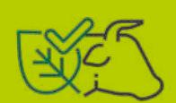

Table 1. Traceability initiatives in Brazil

| YEAR       | SISBOV 2022                   | SMGEO                              |
|------------|-------------------------------|------------------------------------|
| Developers | MAPA/ Federal Government      | Niceplanet                         |
| Scope      | Sanitary control              | Customisable according to protocol |
| Coverage   | National                      | National                           |
| Reach      | Direct and indirect           | Direct and indirect                |
| Impact     | 1400 properties               | 12 thousand research analyses      |
| Technology | Proprietary software          | Blockchain                         |
| Databases  | PGA - Agricultural Management |                                    |
| Animal Id. | Individual                    |                                    |
| Cost       | Approximately 0.53% of the    |                                    |

Table 1. Traceability initiatives in Brazil

| MAPPING /                                 | SMGeo                                                                                                                                                                                                                                                                                                                                    |                                                                                                                                                                                                                                                                                                                                                         |
|-------------------------------------------|------------------------------------------------------------------------------------------------------------------------------------------------------------------------------------------------------------------------------------------------------------------------------------------------------------------------------------------|---------------------------------------------------------------------------------------------------------------------------------------------------------------------------------------------------------------------------------------------------------------------------------------------------------------------------------------------------------|
| YEAR                                      | Indiretos 2014                                                                                                                                                                                                                                                                                                                           | EcoTrack 2015                                                                                                                                                                                                                                                                                                                                           |
| Developers Aims                           | Niceplanet Register, analyse, and carry out socio-environmental monitoring of indirect suppliers in the cattle production chain.                                                                                                                                                                                                         | Terras Monitor the chain of direct and indirect suppliers to ensure zero deforestation.                                                                                                                                                                                                                                                                 |
| Scope                                     | Socio-environmental legality (TACs and sector commitments)                                                                                                                                                                                                                                                                               | Zero deforestation in the agribusiness, forestry, and mining value chains.                                                                                                                                                                                                                                                                              |
| Coverage Potential                        | National                                                                                                                                                                                                                                                                                                                                 | National                                                                                                                                                                                                                                                                                                                                                |
| Reach                                     | Indirect                                                                                                                                                                                                                                                                                                                                 | Direct and indirect 2 companies (it has run on more                                                                                                                                                                                                                                                                                                     |
| Impact                                    | In progress                                                                                                                                                                                                                                                                                                                              | than 500 farms). The main users are production groups                                                                                                                                                                                                                                                                                                   |
| Technology Databases Documents Animal Id. | Blockchain PRODES, IBAMA, INCRA, FUNAI, ICMBio, State Environmental Secretariats etc. (cf. established protocol) CAR, LAR, certificates, traceability and sale of animals acquired through SISBOV, invoices, GTA, and health records. Batches (with guidance to producers for individual identification, aiming at improving management) | API; data encryption; cloud system Passive bases: SICAR; state organ of agricultural defence; Data input by the producers: registration of production areas; animals; purchase/sale/retirement (animal movement) CAR; GTAs; NFs (optional) Individual or in batches (the system individualises the batches by creating a unique record for the animals) |
| Cost                                      | US\$ 3 to US\$ 5/head                                                                                                                                                                                                                                                                                                                    | On request                                                                                                                                                                                                                                                                                                                                              |

Table 1. Traceability initiatives in Brazil

| MAPPING /                |                                                                                                                                                                                                                                                                                     |                                                                                                                                                                                                                                                           |
|--------------------------|-------------------------------------------------------------------------------------------------------------------------------------------------------------------------------------------------------------------------------------------------------------------------------------|-----------------------------------------------------------------------------------------------------------------------------------------------------------------------------------------------------------------------------------------------------------|
| YEAR                     | Visipec 2018                                                                                                                                                                                                                                                                        | Agri Trace Animal 2018                                                                                                                                                                                                                                    |
| Developers Aims          | NWF To be a complementary tool to existing monitoring systems to fill the critical gap of indirect suppliers, providing meatpackers with greater visibility into their supply chains, helping them reduce risks of exposure to deforestation and other socio-environmental problems | CNA Adding value to the production of cattle farmers through the certification and traceability of their products, promoting transparency to the links in the production chain from the farm to the consumer's table. Breed of animals, production system |
| Scope Coverage Potential | Visualisation of socio-environmental criteria Pará (fully established), Mato Grosso (operating using historical data) and Tocantins (initial phase)                                                                                                                                 | (pasture or feedlot), environmental sustainability, animal welfare National                                                                                                                                                                               |
| Reach                    | indirect                                                                                                                                                                                                                                                                            | Direct and indirect                                                                                                                                                                                                                                       |
| Impact                   | 7 meatpacking companies in different phases of implementation                                                                                                                                                                                                                       | 12 thousand registered producers; 70 slaughterhouses                                                                                                                                                                                                      |
| Technology Databases     | API PRODES Amazon and Cerrado, Ibama - Embargos, FUNAI - Indigenous Lands, Slave Labour List - Ministry of Economy, and Conservation Units - MMA                                                                                                                                    | Traceability Protocols Management System (SGP) Variable according to protocol Single Data Base (BDU) of the Agricultural Management Platform                                                                                                              |
| Documents                | CAR; GTA                                                                                                                                                                                                                                                                            | (PGA); Documents specific to the 14 protocols managed by the system                                                                                                                                                                                       |
| Animal Id.               | Batches                                                                                                                                                                                                                                                                             | Batches and individual                                                                                                                                                                                                                                    |
| Cost                     | Free for everyone. Target audience:                                                                                                                                                                                                                                                 |                                                                                                                                                                                                                                                           |
|                          | meatpackers                                                                                                                                                                                                                                                                         | Variable according to protocol                                                                                                                                                                                                                            |

Table 1. Traceability initiatives in Brazil

| YEAR       | TraceBeef 2018                        | Programa de Produção                    |
|------------|---------------------------------------|-----------------------------------------|
| Developers | Ecotrace                              | The Sustainable Trade Initiative (IDH), |
| Coverage   | National                              | Mato Grosso                             |
| Reach      | Industry                              | Direct and indirect                     |
| Impact     | i.n.l.                                | 557 calf producers                      |
| Technology | IoT (Internet of Things) - Artificial |                                         |
| Databases  | i.n.l.                                |                                         |
| Documents  | GTAs; NFs                             | GTA; CAR; Sanitary documents            |
| Animal Id. | Individual                            | Individual                              |
| Cost       | i.n.l.                                | i.n.l.                                  |

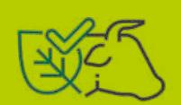

Table 1. Traceability initiatives in Brazil

| MAPPING / YEAR        | Serviço Eletrônico de Informação da Indústria da Carne (SEIIC) 2018                                                                                                                                                                                                                                                                                                                               | Carne Sustentável e Orgânica do Pantanal – MS 2018                                                                                                                                                                                                                             |
|-----------------------|---------------------------------------------------------------------------------------------------------------------------------------------------------------------------------------------------------------------------------------------------------------------------------------------------------------------------------------------------------------------------------------------------|--------------------------------------------------------------------------------------------------------------------------------------------------------------------------------------------------------------------------------------------------------------------------------|
| Developers Aims Scope | Imac/MT Promote sustainability in beef production in Mato Grosso through a compliance system in the production chain, connecting cattle ranchers and slaughterhouses and ensuring safety in the origination of the product. Focus on state and municipal inspection slaughterhouses. Harmonised protocol for monitoring suppliers of cattle in the Amazon for compliance with TACs (MPF/Imaflora) | SEMAGRO/MS To foster competitiveness and encourage low environmental impact cattle ranching in the Pantanal, stimulating production based on the traditional model. Promotion of Pantanal cattle ranching, with a low level of intervention in the region’s natural resources. |
| Coverage Potential    | Mato Grosso                                                                                                                                                                                                                                                                                                                                                                                       | Mato Grosso do Sul                                                                                                                                                                                                                                                             |
| Reach                 | Industry and direct suppliers                                                                                                                                                                                                                                                                                                                                                                     | Direct                                                                                                                                                                                                                                                                         |
| Impact                | Homologation phase of the pilot                                                                                                                                                                                                                                                                                                                                                                   |                                                                                                                                                                                                                                                                                |
|                       | project in a cold storage plant                                                                                                                                                                                                                                                                                                                                                                   | 7 slaughterhouses; 63 rural properties Managed by the National Confederation                                                                                                                                                                                                   |
| Technology            | Blockchain                                                                                                                                                                                                                                                                                                                                                                                        | of Agriculture / Management System of Traceability Protocols (SGP) Labour, social and environmental                                                                                                                                                                            |
| Databases             | PRODES; FUNAI; Ibama; Lista Trabalho Escravo; ICMBio                                                                                                                                                                                                                                                                                                                                              | compliance documents presented by rural properties and slaughterhouses                                                                                                                                                                                                         |
| Documents             | GTA; CAR                                                                                                                                                                                                                                                                                                                                                                                          | CAR; GTAs; SISBOV; NFs; Certifying Statements                                                                                                                                                                                                                                  |
| Animal Id.            | Batches                                                                                                                                                                                                                                                                                                                                                                                           | Individual (integrated in SISBOV)                                                                                                                                                                                                                                              |
| Cost                  | Free                                                                                                                                                                                                                                                                                                                                                                                              | Cost of the certifier                                                                                                                                                                                                                                                          |

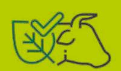

Table 1. Traceability initiatives in Brazil

| MAPPING /             | Plataforma Pecuária                                                                                                                                                                                                                                                                                                     |                                                                                                                                                                                                                                                       |
|-----------------------|-------------------------------------------------------------------------------------------------------------------------------------------------------------------------------------------------------------------------------------------------------------------------------------------------------------------------|-------------------------------------------------------------------------------------------------------------------------------------------------------------------------------------------------------------------------------------------------------|
| YEAR                  | Transparente 2020                                                                                                                                                                                                                                                                                                       | Selo Verde 2021                                                                                                                                                                                                                                       |
| Developers Aims Scope | JBS To provide transparency and add value to livestock production, facilitating the application of the best socio environmental practices. Illegal deforestation of native forests; Invasion of indigenous lands; Invasion of environmental conservation areas; Areas embargoed by Ibama; Labour analogous to slavery. | SEMAS/PA Combat illegal deforestation, slave labour, occupation of traditional territories, and promote land tenure regularisation. Beef TAC, illegal deforestation, slave labour, occupation of traditional territories, land tenure regularisation. |
| Coverage Potential    | National                                                                                                                                                                                                                                                                                                                | Pará                                                                                                                                                                                                                                                  |
| Reach                 | Direct and Indirect                                                                                                                                                                                                                                                                                                     | Direct and Indirect                                                                                                                                                                                                                                   |
| Impact                | 1 million heads (until the end of 2021)                                                                                                                                                                                                                                                                                 | All properties with CAR registration                                                                                                                                                                                                                  |
| Technology            | Blockchain                                                                                                                                                                                                                                                                                                              | EGO Dynamics (own software)                                                                                                                                                                                                                           |
| Databases             | PRODES, MapBiomas, Ibama, FUNAI,                                                                                                                                                                                                                                                                                        |                                                                                                                                                                                                                                                       |
|                       | Slave Labour List                                                                                                                                                                                                                                                                                                       | PRODES; FUNAI; Slave Labour List                                                                                                                                                                                                                      |
| Documents             | GTAs; Informações dos fornecedores                                                                                                                                                                                                                                                                                      |                                                                                                                                                                                                                                                       |
|                       | da empresa                                                                                                                                                                                                                                                                                                              | CAR; GTA                                                                                                                                                                                                                                              |
| Animal Id.            | Batches                                                                                                                                                                                                                                                                                                                 | Batches                                                                                                                                                                                                                                               |
| Cost                  | Free                                                                                                                                                                                                                                                                                                                    | Free                                                                                                                                                                                                                                                  |

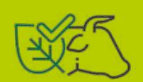

Table 1. Traceability initiatives in Brazil

| MAPPING /            |                                                                                                     |
|----------------------|-----------------------------------------------------------------------------------------------------|
| YEAR                 | Conecta 2021                                                                                        |
| Developers           | Safe Trace em parceria com a Amigos da Terra – Amazônia Brasileira e a The Nature Conservancy – TNC |
| Aims Scope           | It seeks to increase transparency among the cattle-raising links. the Brazilian Forest Code.        |
| Coverage Potential   | Pará                                                                                                |
| Reach                | Direct and Indirect                                                                                 |
| Impact               | Test phase in two slaughterhouses                                                                   |
| Technology Databases | Blockchain; RFId Selo Verde                                                                         |
| Documents            | CAR; Sanitary documents                                                                             |
| Animal Id.           | Individual and by batches                                                                           |
| Cost                 | Free                                                                                                |

The survey mapped 13 different traceability arrangements. Among them are private initiatives, partnerships between governments, non-governmental organisations, universities, and public power projects. The first traceability initiative in Brazil dates back to 2002 when the Brazilian System of Identification of Cattle and Buffaloes (SISBOV) was launched. The aim of this tool is to control the health of the Brazilian herd destined for export and does not include socio-environmental monitoring, a necessary step for measures to control deforestation. As the table shows, traceability solutions combined with socio-environmental monitoring have been established since 2010, and are therefore subsequent to the agreements assumed in the Conduct Adjustment Terms and the Livestock Farming Public Commitment22.

The year 2018 marked a new momentum in the development of traceability and monitoring tools with the launch of six initiatives: Visipec (NWF/University of Wisconsin/GTFI); Agritrace Animal (CNA)23; TraceBeef (EcoTrace); Sustainable Calf Production Program (The Sustainable Trade Initiative (IDH), Carrefour Foundation and Carrefour Group); Sustainable and Organic Meat of the Pantanal (SEMAGRO/ MS) and the Electronic Meat Industry Information Service (SEIIC). It should be noted that Agritrace Animal is a system that brings together 14 different traceability protocols, most of them focused on bovine breed characteristics. Among these protocols, we highlight the management of the following initiatives focused on sustainability in the beef chain: Sustainable Calf Production, Carbon Neutral Meat, and AB-

22 Companies such as Agrotools, Geoflorestas, and Niceplanet (especially using the SMGeo Diretos platform) have developed systems to monitor compliance with TAC and CPP criteria. Although not listed in the table above, these are initiatives that work with slaughterhouses to verify compliance and are important in the context of sustainability in livestock farming.

23 The CNA does not perform traceability per se, it is the manager of traceability protocols. Traceability is undertaken by entities such as breeders' associations and private companies whose propose is trace by using a specific attribute of the animals and/or the production system.

PO's Sustainable Meat Protocol.

JBS launched the Livestock Transparent platform in 2020, its own traceability and monitoring tool for its chain in the industry. The goal is to include all of its suppliers in the platform by 2025 and from 2026 to make membership mandatory for those producers who wish to sell their cattle to the company. Other slaughterhouses such as Minerva, Marfrig, and Frigol use tools such as Visipec, SMGeo Diretos, Conecta, and the Meat Industry Information Electronic Service (SEIIC) - most of them still being tested in a few slaughterhouses.

The state governments of Mato Grosso do Sul and Pará present different proposals and traceability arrangements. The Mato Grosso do Sul initiative was developed within the scope of the Mato Grosso do Sul Livestock Advancement Program (PROAPE) - which seeks to strengthen agribusiness in the state - in partnership with the Pantanal Organic Cattle Producers Association (ABPO), which is the owner and developer of the protocol29. In turn, the CNA is the managing entity. Its main objective is to strengthen cattle ranching in the Pantanal, giving a differential bonus to producers who adopt the principles laid down in the protocol. Cattle certified in the Organic Pantanal receive a percentage equivalent to 67% of the Tax on the Circulation of Goods and Services (Imposto sobre Circulação de Mercadorias e Serviços, ICMS) to be generated by the meat after it is processed, and cattle certified in the Sustainable Pantanal receive 50% of the ICMS generated.

The Selo Verde, an initiative of the state of Pará implemented in 2021, aims to subsidise the fight against illegal deforestation, monitoring and evaluating public policies for sustainable agricultural and livestock development. It is a free and universal transparency tool available online developed by the Federal University of Minas Gerais (UFMG))30. Using a CAR code, any citizen can carry out an environmental diagnosis of a rural property and its participation in the chain. Companies can also use the platform to evaluate properties and based on the information contained in the tool, decide whether or not to invest in a particular business or to grant credit in the case of banks, for example. Cold-stores can also use it in their purchasing appraisals or in the development of award mechanisms and the public authority at any level can identify regions with greater socio-environmental problems. Finally, the rural landowners themselves can access a systematised diagnosis of their rural property.

In terms of scope, most of the mapped mechanisms potentially cover indirect suppliers - one of the major bottlenecks for any traceability and socio-environmental monitoring measure in the country. Only the SMGeo Direct, as the name suggests, is exclusively focused on this group of suppliers, and only one initiative - TraceBeef – directs all of its actions to the industry. On the other hand, the Meat Industry Electronic Information Service (SEIIC) reaches both direct suppliers and industry. The development of solutions aimed specifically at Indirects such as Visipec and the Sustainable Calf Production Program launched in 2018 and the SMGeo Indirects of 2014 show the growing attention that this productive segment requires for the effectiveness of traceability and monitoring actions.

[http://car.semas.pa.gov.br/#/](http://car.semas.pa.gov.br/%23/)

In terms of impact24, the number of farms, slaughterhouses and retailers that operate with control measures of their suppliers taking into account sustainability criteria is still very small compared to the magnitude of the beef production chain in the country, whose cattle herd, as mentioned in the previous chapter, is around 200 million animals. Some of the tools are being updated, such as the SMGeo Indiretos, and there are also those in the testing phase in slaughterhouses such as Visipec and Conecta. Four tools (Conecta, SEIIC, Visipec, and Carne Sustentável e Orgânica do Pantanal) are in different phases of testing/use in 17 slaughterhouses for supplier control. In terms of rural properties, among those that have quantified their users (Carne do Pantanal, Ecotrack, and Sustainable Calf Production Program), there are 662 farms. It is worth noting that the Selo Verde can analyse any property in Pará registered in the CAR25, the main consultation document.

The largest number of initiatives are concentrated in the North of the country and in the Legal Amazon, which is largely due to the pressure exerted by the TACs and the CPP. However, there is a robust volume of rural properties dedicated to cattle ranching in the Cerrado and Pampa biomes, and discussions about control mechanisms in these regions are still at an early stage. Cattle ranching in the Cerrado alone is present on 73% of rural properties (Imaflora, 2021).

Regarding cost, a significant part (5/13) of the tools mapped are free, which can be a positive factor in the adhesion of the respective target audiences to the tools. Costs are higher in initiatives that require certification such as SISBOV and the Pantanal Sustainable and Organic Beef.

None of the initiatives mapped refer exclusively to the leather production chain. However, there are tanneries that use traceability and socio- -environmental monitoring systems, which may be the same as those employed by their suppliers' slaughterhouses33. Consequently, tanneries can double-check the information transmitted by their hide suppliers.

Two traceability systems operate in the leather chain: an external one for the raw material, and an internal one for the product. The slaughterhouses that produce the hides have the socio-environmental monitoring information of the origin properties of these hides, and through agreements and commitments, transmit it to their customers. As soon as these hides enter the tannery, the internal product, leather traceability begins. They are marked with an alphanumeric code, which is used up to the final client, and indicates the processing plant of origin, the tannery, and the week and day of production of that leather. Certain companies and clients require the year to be indicated.

Generally speaking, leather is traced by batches rather than leather by leather because of the problem of receiving individualised information from the farms. Furthermore, the tanneries' relationship is usually with slaughterhouses and does not involve rural producers34. Tanneries differentially access the raw material for their industry. The Imaflora study (Flores et al, 2021), identified three groups of tanneries based on how the hides are purchased: 1) Slaughterhouses that access the farms directly and process them in their own units or in outsourced ones; 2) Tanneries that acquire raw material from slaughterhouses and do not deal directly with the farms and 3) Tanneries that work with already tanned hides. The last two do not have direct access to rural properties and the identification of the origin of the animals is based on documents such as Commitment Terms, which ensure that tanneries employ traceability systems (Flores et al, 2021). Therefore, if slaughterhouses do not have such systems in place, tanneries are unable to perform external traceability of their raw material.

Finally, it is worth mentioning another recent traceability tool that operates by means of facial recognition. Unlike methods that require earrings or branding to be applied - a problem for the leather industry, which then has its hides damaged - startup Databoi's technology operates from images of the animals' snouts, considered to be the cattle's fingerprints. The system operates through a mobile phone application and offers herd control mechanisms and birth certificates for Purebred (P.O.) animals. The farm is registered by the farmer and, from the images of the snouts captured on mobile phone cameras, the app stores the information in Blockchain.

Most of the traceability arrangements mapped use two basic documents to conduct compliance analyses: the Animal Transit Guide (GTA) and the Rural Environmental Registry (CAR). However, use of both, in combination or in isolation, is not unanimous among the players linked to the beef and leather chains.

#### 2.1 The use of CAR and GTA in traceability and monitoring arrangements

The Animal Transit Guide (GTA) is the official document for the transport of animals in Brazil and is also used for has sanitary control. Besides the data for sellers and buyers, it states the origin and destination of the animals, the purpose of the movement, the means of transport used, the vaccines and animal exams, among other information26. The GTAs are issued by

state animal health control agencies and can be electronic (e- GTA) or printed.

The industry has access to the GTAs emitted by their direct suppliers of cattle since it is part of the transaction. However, it does not access the GTAs of lean cattle suppliers, i.e., those farms that may have acquired lean cattle from other rural properties.

Both the Beef TAC and the *Livestock Public Commitment* require the availability of Animal Transit Documents for compliance verification. Garcia et al (2021), found that the cross-referencing of GTA and CAR data allows an "environmental photograph" of the properties through which the cattle pass since it links cattle data to rural properties.

Although it is considered to be one of the main tools for effective traceability in the beef value chain, the use of GTAs faces resistance from part of the production sector. It is argued that the data contained in these documents are confidential and sharing them could lead to the exposure of their private information, such as CPF27, herd volume and, therefore, their investments, violating the General Law of Protection of Personal Data (LGPD - 13.709/2018).

Furthermore, because the GTA reports the movement of cattle herds, its use has direct implications for how well deforestation contamination can be inferred. Since it does not determine the origin of individual animals, nor whether part of the batches come from other farms, precisely locating areas with socio-environmental irregularities becomes challenging.

The Rural Environmental Registry (CAR), established by the 2012 Forest Code (Law

27 The Cadastro de Pessoas Físicas (CPF) is managed by the Brazilian Federal Revenue Service and identifies all taxpayers, Brazilians and foreigners, from a single register. Data regarding companies are catalogued in the Cadastro Nacional de Pessoas Jurídicas (CNPJ) and, unlike information related to the CPF, are not covered by the Personal Data Protection Act.

12.651/2012) but only applied from 2014, aims to integrate information on environmental aspects of rural properties and possessions and is mandatory for all rural properties. It provides information on the Permanent Preservation Areas - APP, Legal Reserve, forests and remaining areas of native vegetation, Restricted Use Areas and consolidated areas, constituting a fundamental database for combating deforestation as well as for environmental and economic monitoring and planning. The CAR is a self-declaratory document and requires validation by the competent bodies.

Although the CAR is an important tool for traceability mapping, it is worth noting that its use has major bottlenecks and that it has been used to legitimise public land ownership in land grabbing processes (Salomão et al, 2021). However, this is an instrument for environmental regularisation purposes, not for land tenure. The aforementioned IPAM survey shows that the CAR often anticipates deforestation. Furthermore, the data collected by the study showed that 28% of public lands have CAR, which is illegal according to the Law of Public Forests (Salomão et al, 2021).

Regarding the GTAs, an important advantage for their use in traceability and monitoring solutions is the gain in scale that this document makes possible. Because it is known by producers and the industry, its integration into these systems would make it simpler and more practical for properties to operate. On the other hand, one of the writers presenting this research thinks that the GTA would be a good instrument for audits but is questionable as a traceability instrument: it would bring information from the past, but would be unable to verify the current status of transactions. Furthermo-

re, the GTA would only report to the last farm, leaving the many other farms through which the cattle may have passed uncovered. A possible solution to this gap would be to keep a record of all the properties through which the cattle have passed in the Guide. The inclusion of the CAR number on the GTAs, another alternative suggested, would solve the concerns about the exposure of personal data and would allow the data to be associated with rural properties rather than individuals.

Therefore, the use of GTAs in traceability arrangements can be translated in terms of two main problems: 1. A possible deviation from their sanitary control purpose; 2. The exposure of rural producers' personal and commercial data.

Regarding the first problem, it is argued on the one hand that linking the CAR to the GTA would have a negative effect on the main aim of the Guides, which is to ensure the health and safety of the cattle herd. Many cattle ranchers could stop issuing the GTA (still an evolving practice) to protect themselves from possible environmental violations on their property. So its use in traceability mapping would harm both the health and the environmental spheres. The issuing of GTAs to fulfil its purpose of sanitary protection of the Brazilian herd should, as suggested in one of the interviews, be entirely free of charge and totally unrelated to any other document, whether invoices or the CAR.

On the other hand, the integration of CAR with GTA is viewed positively. As it is a geolocalised environmental control document, with maps and location of the properties, it would enable quick action in case of outbreak of diseases in the herd, also making the system safer in the sanitary sphere.

The confidentiality of rural producers' data is another significant problem. The sharing of the personal and commercial information of rural producers, especially relating to the CPF and the quantity and characteristics of animals transacted, could put cattle ranchers at a commercial disadvantage with potential competitors. Those who defend the use of GTAs claim that it is possible to hide certain information, consequently protecting sensitive data.

This is what can be seen in the system operated by the Green Seal. This tool, which uses the CAR code to query compliance, does not present personal data about the owner, the stock of his or her cattle, the slaughterhouses with which he or she trades, or the financial agents linked to that property or its economic size. Consequently, the personal and commercial information of the producers is preserved.

### **Picture 1. Possible strategies regarding the use of the Guias de Trânsito Animal (GTA)**

- Including the CAR number in the GTAs could resolve concerns about exposure of personal data and so the data will continue to be associated with properties rather than individuals.
- This inclusion would also speed up disease containment actions because the geolocation of the CAR would help.
- Specific fields could be hidden from the GTA in order to preserve the confidentiality of sensitive information, which is the case in the Selo Verde, for example.
- Link GTAs to preserve the history of animal movements.
- Use of blockchain technology for data protection, as is done in most of the mapping tools.

It is worth noting that the GTAs are the responsibility of state sanitary inspection agencies. Therefore, their format varies according to the particular state. However, they have been brought together in a federal system, the *Agricultural and Livestock Management Platform,* whose potential for transparency in the beef and leather chains is good.

### **2.2 The Agricultural Management Platform – PGA**

The PGA is a public platform that combines data from the beef production chain. The result of a cooperation agreement between the Confederation of Agriculture and Livestock of Brazil (CNA) and the Ministry of Agriculture, Livestock, and Supply (MAPA), it was developed from 2009 and was launched in 2012. The database is stored at MAPA and all information about the movement of animals recorded by the responsible bodies in the states is integrated into this single database. The operation of the platform is based on three main areas: animal transit management, traceability, and inspection.

In contrast to the Ibama system and the lists of embargoed areas, which allow any citizen to access the fines that the agency applies and even view a map with the property's location in the case of embargoed areas, access to PGA is more restricted. The external user can only consult the authenticity of GTAs, but the barcode of this document is required for this, and therefore the producer's permission to access it. According to Hofmeister et al (2021), in 2015 the MPF requested the opening of the PGA database and the Ministry of Agriculture had offered to do so between 2018 and 2019. However, it backed out of the decision and the platform remains restricted. According to the same publication, this decision addresses the concerns of producers about the confidentiality of their personal and proprietary information.

According to Proforest's analysis in its briefing on socio-environmental monitoring of cattle ranching in Brazil (2017), the PGA could be used as a mechanism to operationalise electronic GTAs since it stores data from these transactions. Another contribution of PGA to improving traceability and monitoring of the chain would be to use it to adopt protocols adapted to each situation based on a risk analysis. This would allow efforts to be concentrated in more urgent regions by implementing individual remote monitoring in areas where there is more risk.

Another tool with significant potential for expanding and refining transparency in the beef and leather value chains is provided by the Brazilian System of Identification of Cattle and Buffalo (SISBOV). Even though it had - and still has - no socio-environmental monitoring purpose, it is a landmark initiative in controlling the Brazilian herd, fundamental in the access to markets and indispensable for the European one. It is employed in initiatives such as Sustainable and Organic Meat of the Pantanal, which demands individual traceability from producers using SISBOV.

#### **2.3 The Brazilian System of Identification of Cattle and Buffaloes (SISBOV)**

The Brazilian System of Identification of Cattle and Buffaloes (SISBOV) was created by Normative Instruction No. 1, January 9, 2002 issued by the Ministry of Agriculture, Livestock, and Supply (MAPA) in response to health crises in Europe, especially that caused by Bovine Spongiform Encephalopathy28, popularly known as "Mad Cow Disease." As an important

28 A protein called a prion in contaminated foods such as bone meal and animal feed causes Bovine Spongiform Encephalopathy. It is a degenerative disease that affects the Central Nervous System and can be transmitted to humans. Because of this, cattle are not allowed to be fed animal-based feeds.

consumer market of the Brazilian product, the European continent started to demand individual traceability of the animals.

SISBOV is the official Brazilian traceability system and is not used for social-environmental monitoring, only for sanitary control. It is voluntary and is required for fresh meat, is not necessary for the export of processed meat such as canned meat and beef jerky. The animals in this system are individually identified through ear tags containing a bar code to distinguish the cattle. The system has undergone several transformations over the years and currently Normative Instruction No. 51/2018 regulates the program, providing for an administrative transition from the Ministry of Agriculture (MAPA) to a private initiative which will manage the private protocols.

According to the study by Pithan, and Silva & Sato (2008), there were no certifiers at the time of SISBOV implementation able to perform individual traceability when this modality was chosen as a strategy. These authors state that several certifiers emerged from producers' associations, which would put the credibility and exemption of the verification in doubt.

There has been a lack of dialogue with cattle ranchers since the implementation of SISBOV in 2002. According to a study by Proforest (2017), individual traceability was not well received by producers, who consider it to be complex, bureaucratic, and expensive. Furthermore, soon after its implementation, slaughterhouses decided not to overpay certified producers29 but to dispense with non-certified meat (Pithan and Silva & Sato, 2008). This distrustful picture would explain, in part, the poor adherence to the system, which persists until today, in spite of the remuneration received (approximately R\$ 2.00 per @). The number of accredited farms is tiny compared to the number of cattle farms in the country: only about 1400 enterprises are registered in SISBOV. The main factor behind this quantity is the bonus of R\$ 2.00 per @30, which in practice is the same as the amounts invested for certification. The amount received per *arroba* (a unit of measurement equivalent of 15 kg) has been the same for more than 15 years.

Besides the poor adherence of rural properties, another weakness of the system concerns the fact that the application of traceability earrings is only required ninety days before slaughter or shipment abroad, which makes it impossible to monitor all of the farms through which these animals have passed. To analyse the socio-environmental legality of the properties where the animals originate, it would be necessary to register the animals immediately after they are born (Agrosuisse, 2020).

In a study by Campos & Dallabrida (2021) on the relationship between meat sold by overseas retailers and deforestation in Brazil, SISBOV could be used to monitor Indirects because a farm registered on the system must register the property from which it acquires its animals (and has a 30-day deadline to do so). Thus, another link in the chain would be incorporated into the monitoring.

Despite the weaknesses of SISBOV, its use on farms has managerial and zootechnical advantages as shown in the study by Cócaro & Jesus (2007). The authors argue that the main zootechnical impacts are the control and monitoring of indexes, especially reproduction and weight gain. As for the managerial aspects, the system

| 29 | Currently, the producers receive from R\$ 2.00 to R\$ 3.00 more in the price of the arroba (one acre is equivalent to 15kg). |
|----|------------------------------------------------------------------------------------------------------------------------------|
| 30 | One arroba [@] is equivalent to 15kg.                                                                                        |

would allow to "state the stock of animals, plan slaughtering, and speed up decision making" (Cócaro & Jesus, 2007: 370), enabling the emergence of new controls, the recording of each animal's data, the documentation of purchase and movement of cattle, and the use and output of nutritional and sanitary inputs. The study concludes that despite the costs, the managerial gain increases the productive efficiency of the companies, financially compensating the investment made by the producers.

Although considered to be a very distant horizon, individual identification, not necessarily using SISBOV, appeared as the ideal traceability sys-

31 An ideal is always tainted by the continental dimensions of the country, the volume of the herd, and the diversity of Brazilian cattle breeding.

tem in several interviews31. The leading cause of resistance to this traceability model results from ignorance of the benefits that this type of management produces in the farms' routine and few informative strategies for approaching the cattle producers about these benefits, who only see it as an additional cost and work.

As can be seen, traceability initiatives in Brazil vary as do the livestock farming practices in the country. In view of the panorama presented, in the following chapter we present the advances and challenges for transparency in the beef and leather production chains and for scalability of traceability mapping in the country.

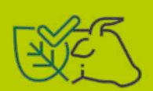

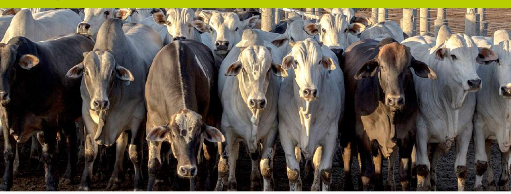

# **IMPROVEMENTS AND CHALLENGES FOR TRACEABILITY IN THE BEEF AND LEATHER VALUE CHAINS**

Based on the data explained in the previous chapters, a compilation of the main advances achieved and challenges that remain for traceability and socio-environmental monitoring systems to be effectively and extensively implemented in the Brazilian meat and leather production chains is presented below. Finally, potential benefits beyond the socio-environmental effects are listed, which are the fundamental aims of transparency and traceability measures.

## **3.1 Improvements**

- Variety of arrangements to be adopted by direct suppliers, indirect suppliers, and industry
- Increased supply of traceability tools32
- Development of traceability mapping that is freely accessible publicly (e.g., *Selo Verde*)
- Investment in information security in the traceability tools available (for example, eight of them use blockchain)
- Availability of specific strategies for indirect suppliers (Visipec, SMGeo Indirect, Sustainable Calf Production Program)

32 Compared to the mapping carried out by the GTPS Traceability WG (2021), which listed eight initiatives, the survey presented in this report details 14 tools. Unlike that study, here we include SISBOV (which has no socio-environmental control purposes), two tools from the SMGeo family (Direct and Prospec), the SEIIC, and the Program for Sustainable Production of Calves and Sustainable and Organic Meat in the Pantanal - MS, which was listed in the GTPS survey as a program and not as a tool.

- Customisable tools that allow users to perform compliance analysis according to specific protocols
- Development of approaches for small and medium-sized slaughterhouses to be inspected by the state and municipal systems (SEIIC/Imac)
- Creation of technical support services for rural producers who wish to legalise areas with environmental liabilities (Ex.: Escritórios Verdes/JBS, SIRFLOR/Niceplanet/Acripará and Programa de Reinserção e Monitoramento/Imac).

## **3.2 Challenges**

#### **• There are major challenges: land and environmental legalisation**

The land and environmental legalisation of rural properties in Brazil is still a major bottleneck for transparency in the meat and leather production chains. The inability to link a farm to the landowner persists as a reality in the country, which also coexists with large areas awaiting allocation by the government. This situation also aggravates the fragile environmental legalisation, which received significant impetus from the Rural Environmental Registry (CAR). The slowness of the competent bodies in validating this self-declaratory document undermines the reliability of the data and, consequently, any system that intends to use it as a source of environmental information about rural properties.

### **• Engagement of the productive sector**

The challenge of engaging the production sector materialises in two primary and complementary ways: first, in a lack of involvement of the producers in the traceability discussions, and second, in the effective use of these technologies to control their cattle and their suppliers. A certain degree of conservatism added to the lack of visualisation of direct financial returns was pointed out as a possible reason for the lack of engagement of the production sector with the tools. Therefore, a feasible strategy shows the cattle ranchers the financial gains brought by better herd management and the properties the traceability tools have.

Such demystification was considered to be essential for the effective engagement of rural producers in the dialogues about traceability. There was a need to explain even terms and expressions commonly used in this context such as "indirect," which may not be a nomenclature known to cattle farmers. It was also necessary to demonstrate the importance of such measures against the immediate reaction of cattle ranchers, who would only be interested in knowing "who will pay for the additional work?"

In this context, a strategy to access the cattle ranchers consists of mobilising them through the producers' association since it is a forum for discussion between peers and involves a significant set of individuals. However, opinions are divided on the subject. While certain interlocutors consider that they would have a fundamental role to play because they would improve dialogue between actors of the same sector, others understand that these associa-

tions have taken a defensive posture concerning proposals and novelties. Furthermore, the cattle farmers would be the last to enter the discussions about traceability and monitoring when in practice they are the agents to put the protocols into operation.

#### **• Problems in accessing public information**

Among the main challenges listed in establishing traceability systems is the transparency of public databases, especially concerning GTAs and CAR. The number of the Guide is required to access them, that is, from a previous negotiation with its holder. GTAs' storage is centralised in the Agricultural Management Platform and access to it is restricted. As for the CAR, the reports in the System are issued per municipality, and, for traceability to be effective, individual information is needed to achieve its reference in GTA. The study by Barreto et al. (2015) reports that the 2016 ordinance of the Ministry of Environment (MMA) that regulated the CAR restricted the consultation of information from this document that connects people to properties (CPF, CNPJ, names, etc.), making slaughterhouses and other interested parties unable to access this data to verify requirements of TACs. It is worth remembering, for example, that the Dirty List of Slave Labour is published based on CPF and CNPJ. The gap in structuring public databases is an issue pointed out in several studies on the subject (Barreto & Gibbs, 2015; Agrosuisse, 2020; Proforest, 2021, GTPS, 2021).

#### **• Conflicting visions regarding the use of GTA, an instrument used in the vast majority of the arrangements mapped out and with great potential to bring traceability to scale in the country**

Although the GTA is widely used in the traceability arrangements mapped, the lack of standardisation of the document and the necessary negotiation with state sanitary inspection agencies for its release results in slow implementation of broader tools. For instance, private agreements established between slaughterhouses and their suppliers or tanneries, and slaughterhouses achieve quicker and more efficient operationalisation of this documentation since it is an obligatory part of commercial transactions.

- **• Engagement of small and medium-sized slaughterhouses (fiscal challenges have been reported in these industries, and many of them would not collect basic documents such as invoices 33).**

MoniTAC data shows that several slaughterhouses in the Legal Amazon supervised by state agencies have not adhered to socio-environmental commitments. These slaughterhouses, along with those supervised by the municipal systems, end up receiving animals from farms with liabilities and creating a parallel market that bypasses discussions and health and social

33 Slaughtering without any type of inspection is also a persistent reality. The study by Miranda & De Zen (2015) revealed that unregulated slaughter in the states of Mato Grosso, Pará, and Rondônia was between 3.83% and 5.72% of the total number of heads slaughtered in the country in 2015, adopting the demand side approach. The supply-side approach, in turn, resulted in an estimate of the unmonitored slaughter of around 14.1% for Brazil as a whole.

and environmental inspections (Friends of the Earth, 2013). As argued in the study by the GTPS Traceability Group, "small slaughterhouses do not exercise the same requirements as larger companies, becoming a market with less control of the chain and generating alternatives for production outflow that larger companies do not" (GTPS, 2021: 19).

#### **• Reaching indirect suppliers that, despite the advances in terms of availability of tools, lack participation in the debates and environmental legalisation policies**

Despite the imperative of monitoring indirect suppliers in the Terms of Adjustment of Conduct signed since 2009 and in the Public Commitment for Livestock, the involvement of calf producers and breeders is still a major bottleneck for traceability tools.

#### **• Technical assistance for small producers**

To reach indirect suppliers and disseminate traceability and socio-environmental monitoring practices, besides implementing environmental legalisation measures, many producers, especially the small ones, need both support and technical support, often in person since most rural areas have poor or no Internet access. Large producers have used private consultancies whose cost is unaffordable for many small cattle ranchers. In the Amazon, technical assistance is even more expensive due to the distances to be covered and the quality of the roads.

#### **• Integration of information between slaughterhouses and tanneries**

The existence of various formats of enterprises in the leather sector gives rise to peculiarities for traceability in its value chain. In tanneries associated to slaughterhouses, the sharing of a single system facilitates the internal transit of information. The same does not happen with tannery companies. They are independent from slaughterhouses, the largest portion of this industry. Establishing mechanisms for data integration therefore becomes fundamental.

#### **• Linking traceability of the tannery's raw material (hides) and internal traceability of its product (leather).**

As seen above, the tanneries purchase the hides from the slaughterhouses and using their monitoring system, double check the monitoring information. This then forms the starting point of the second stage of traceability, internal to the tannery, which characterises the leather, the product of its industry. This internal traceability is even older and more familiar to the industry. The challenge here is to provide greater agility, transparency, security, and credibility in combining raw material traceability - respecting all socio-environmental criteria - with product traceability.

### **• Connectivity in rural areas**

The scarcity of quality Internet directly impacts on the operationalisation of traceability tools on farms and, consequently, the scale that these tools can achieve. With this in mind, tools

such as Conecta and Ecotrack have mechanisms to insert information offline. As a result, farmers can enter data in the field and upload the information when a connection is available.

#### **• Encouraging the use of tools on farms and slaughterhouses and expanding public initiatives at both state and federal level**

According to the interviews, the pressure for transparency measures and socio-environmental compliance should focus more directly on producers since pressures on meatpackers, retailers, and tanneries are already being exerted and have achieved substantial results on direct suppliers. In this context, each link in the chain should commit to "clean" purchases from its suppliers, generating a cascade effect of elimination of properties with socio-environmental illegalities.

Finally, it is worth mentioning that there is a fundamental challenge to transparency in the livestock chain and, consequently, in establishing traceability strategies, which is inherent to the main characteristic of this activity. The analysis contained in the article Lessons from the soy and beef moratoria in Brazil (Massena et al., 2017) on the structures of the soy and beef chains and their effectiveness in controlling deforestation is revealing in this context. The study notes that in contrast to the soybean complex, the beef chain needs to monitor both the herd and the properties as only this double enforcement movement would be able to guarantee the purchase of properties free from socio-environmental illegalities. The fixity of soybean crops contrasts with the mobility of herds, which adds a challenging layer to monitoring this chain (Massoca et al., 2017).

### **3 .3Benefits of adopting traceability systems**

- Besides the socio-environmental gains of traceability measures in the beef and leather value chains, which form the core of the supplier control and transparency measures, other effects among the various actors of the chain include:
- For the State, traceability allows better visualisation of risks and priority areas for investment, supporting public policies in the sector.
- The improvement in rural property and herd management is the main benefit of implementing traceability arrangements. It would provide producers with information about their properties, allowing grepossible.
  - Adherence would also offer protection against future market demands. As one of the interviewees revealed, "the slaughterhouse may not pay more for the tracked meat, but they can easily pay less for the product."
  - Transparency and traceability measures for the industry are increasingly seen as a pre-competitive agenda. They are equally important in diagnosing suppliers and the overall deforestation situation in certain regions. Once challenges have been diagnosed in these spheres, it would be possible to mitigate them.

ater control over their expenses, guiding investments (better cattle suppliers, for example), and making forecasts of returns

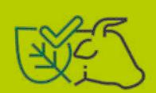

- For retailers, more control over the purchasing process, especially in a context where there is no margin for error given the rapid dissemination of information from social networks. They also allow a transversal discussion inside the company about the purchasing process: most retailers do not have a specific sector to deal with compliance/ sustainability, and these issues often fall on the legal sector (which reacts to demands, that is, when an issue arises).
  - The leather sector has a joint responsibility for the search for socio-environmental transparency solutions. Demonstrating the sustainability of this industry to consumers allows it to reach differentiated markets

**Table 2 - Summary of the potential and benefits of adopting traceability systems**

| Public Authority    | Strengthens the application of the sector’s public policies |
|---------------------|-------------------------------------------------------------|
| Producers           | Enables improved management of rural property               |
| Industry and Retail | Promotes greater control in the purchasing process          |
| Financial Sector    | Provides reputational security                              |

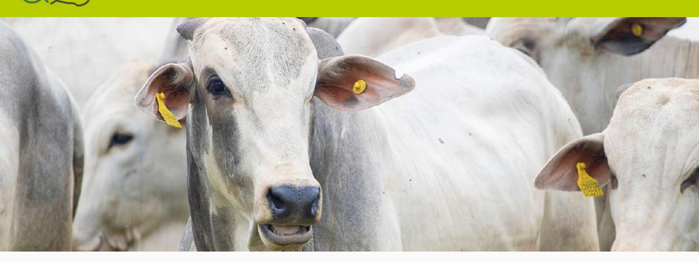

# **FINAL CONSIDERATIONS**

The analysis contained in this document summarises the existing tools and programmes for traceability and socio-environmental monitoring in Brazil. Based on historical data and socioeconomic indicators, interviews with actors in the meat and leather production chains, bibliographic and documentary surveys, the authors sought to build a panorama that would reflect the main characteristics and address the main responses to the challenges to transparency in the beef and leather production complexes.

Though not exclusive, transparency systems are fundamental instruments in curbing deforestation, which has increased in recent years in Brazil. In addition to the decline in enforcement perceived from 2019 onwards, changes in the system of environmental administrative accountability at the federal level have had disastrous consequences, notably in the Amazon and Cerrado biomes. For the first time in history, in 2020 the number of environmental embargoes was higher than the number of embargoes and 13 of fines were paid in the same year (Rajão et al, 2021). By way of comparison, that number was 688 in 2014.

In parallel to the Brazilian State's resumption of command and control operations - crucial to ensuring the inspection and punishment of socio-environmental illegalities - the effective use of traceability and monitoring tools is a fundamental strategy in increasing sustainability in the beef and leather production complex. Using them makes it possible to identify regions with environmental liabilities and direct public investments, defining priority areas for environmental and land regulation. There are also other benefits for retailers and rural producers in the industry in the guarantee and conquest of new markets, improvement of production and purchase processes, and improved knowledge of their supply chain.

However, there are central grassroots challenges. The land and environmental legalisation of rural properties remains a fundamental bottleneck to the effectiveness of transparency mechanisms. Linking a farm to the owner of the land is difficult to do in certain regions and Brazil has large areas awaiting allocation by the public authorities. The illegal occupation of these lands has advanced significantly in recent years, especially in the Amazon. According to Moutinho et al (2022: 169), besides the absence of political will and planning for the allocation of public lands in the region, "está em curso um verdadeiro conluio entre grileiros, financiadores externos, e conivência de representantes do poder público local" [a real collusion is going on between land grabbing invaders, external

financiers, and connivance of representatives of local public authorities]. Added to the fraudulent use of the CAR and changes in land legislation, this situation also aggravates the fragile environmental legalisation. Supporting the development of credit lines aimed at environmental legalisation and consolidating the validation of the Rural Environmental Registry (CAR) is, therefore, imperative.

The survey of traceability initiatives showed advances in terms of number - with 13 traceability systems mapped - and diversity in the tools employed or under development in the country. There are initiatives from the private and third sectors, state government projects, and partnerships between public authorities, non-governmental organisations, and universities.

No traceability initiatives specific to the leather value chain were verified. To a large extent the sector's challenges are the same as those of the beef chain since it is an industry that stems from it. However, the articulation of information between slaughterhouses and tanneries and the connection between the traceability of their raw material (skin) and the internal traceability of their product (leather) are important details. Fostering agreements and arrangements between slaughterhouses and tanneries towards the use of compatible supplier control systems, with training for the correct operationalisation of the tools and developing specific programmes to connect the traceability of the raw material leather to the leather product are important considerations.

The existence of vast rural areas without any internet coverage poses problems for the operationalisation of the existing traceability tools. Although some of them work offline, connectivity would facilitate the insertion of data in real time and remote monitoring by specialised technicians. Therefore, it is recommended that investment is made in improving the quality of internet connection in the field, facilitating the use of the tools.

Although a considerable number of solutions are concentrated in the Amazon region, most of the initiatives operate nationally and there is interest in and concrete projects for expansion to other biomes, especially the Cerrado. Given the growing advance of deforestation in this biome, incorporating it into discussions and policies in favour of traceability and monitoring measures is essential.

As we have seen, the need to monitor both herds and farms poses particular challenges to traceability in the beef and leather production chains: cattle need to be connected to farms. In a model that operates through different stages where there are producers specialising in rearing calves (yearlings), others in rearing yearlings (young bulls), and yet others in fattening the animals, this connection becomes particularly challenging. Involving and benefiting producers through monitoring and traceability, while challenging, is one way to facilitate the full-scale adoption of these initiatives.

The articulation between the GTAs and the CAR has proven to be the main strategy used to address this challenge since the first document refers to cattle and their movement while the second environmentally characterises their properties of origin. The archiving of personal and commercial data, in compliance with current legislation, has proven to be viable in both private and in public agreements, and there are free access tools such as the Green Seal. Furthermore, these documents are widely known in rural properties and, in the case of GTAs, are compulsory for doing business with slaughterhouses. Therefore, they present substantial potential to scale up traceability and socio-environmental monitoring in the country. As a result, investing in information security mechanisms, protection of personal and business data, and linking the GTA to the CAR are fundamental strategies in expanding and

strengthening these traceability documents. It is important to highlight the role of data governance in order to ensure the flow of information to those who need it (health, environmental, and fiscal), without exposing producers. A public platform could play this role, but it would require coordination and commitment from the state and federal governments in the construction of such a tool. Promoting a free public traceability system is fundamental to guaranteeing the adoption of sustainable practices throughout the chain.

Scale, the integration of a more significant number of farms in private agreements and the use of traceability tools on farms, is still one of the main challenges when it comes to transparency in the meat and leather production sectors. Effective engagement of producers is perceived to be one of the major gaps in the success of the proposed measures. Therefore, it is recommended that of rural producers are encouraged to participation in forums and discussions on traceability, promoting the other benefits in terms of zootechnical and market gains brought about by management systems.

The integration of indirect suppliers remains a major challenge although considerable effort is being made to develop specific mechanisms for this group of producers. Encouraging the participation of small producers in debate forums on traceability, providing them with technical assistance to improve management practices and soil use is an important strategy in addition to encouraging programs and partnerships that promote improvements in management, soil use and use of traceability tools in rural properties.

There have been substantial advances in the use of traceability tools among the large slaughterhouses, but in terms of scale, it is essential that the entire complex takes part in discussions on the subject and employs supplier control systems in its industrial plants. It is essential to incorporate local and regional slaughterhouses in the discussion tables, understanding their particularities and demands, and to stimulate the use of traceability tools in small and medium-sized slaughterhouses.

Despite the opportunity represented by new guidelines in terms of sustainable transition, a general perception persists among several players that stricter compliance and due diligence criteria may exclude companies and production units from the market, which would then reposition their products in the market instead of applying appropriate practices. The effective participation of different sectors in the debates and the creation of legalisation and appropriate mechanisms for the production units are important alternatives in reducing uncertainty about the advent of new regulations. The phasing of implementation of these new rules can also contribute to the adoption process.

Finally, and essentially, the effectiveness of the tools mapped out depends on the availability of quality data, much of which is already produced by the Brazilian State. However, there is a lack of transparency in the exposure of this data and several initiatives come up against lengthy negotiations with state governments, among other things responsible for the release of GTAs. Therefore, the federal and state public authorities - without disregarding the performance of the municipalities - have a fundamental role in scaling up and increasing the effectiveness of traceability in Brazil. It is therefore recommended that access is facilitated and transparency in public databases promoted, involving federal and state governments in discussions and implementation of traceability systems. The effective engagement of the various actors linked to the meat and leather chains remains essential in achieving positive results for the transparency and sustainable transition of these value chains in Brazil.

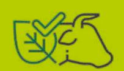

# **BIBLIOGRAPHY**

ABIEC. 2022. *Perfil da Pecuária no Brasil* – Beef Report 2022. Available at http://abiec.com.br/ publicacoes/beef-report-2022/ Accessed on 21 June 2022.

ABIEC. 2021. *Perfil da Pecuária no Brasil* – Beef Report 2021. Available at: http://abiec.com.br/ publicacoes/beef-report-2021/ Accessed on 21 June 2022.

ALMEIDA, J. V.; FRANCISCHINI, R.; SILVA, F. F. da; BETT, V. 2019. Rastreabilidade na bovinocultura brasileira: condições e benefícios. *Pubvet*: medicina veterinária e zootecnia, v. 13, p. 1–14.

AMIGOS DA TERRA - Amazônia Brasileira. 2013. *Radiografia da carne no Brasil*. São Paulo: Amigos da Terra – Amazônia Brasileira. Available at: http://www.amazonia.org.br/wpcontent/uploads/2013/04/cartilha\_radiografia.pdf Accessed on 4 July 2022

ARMELIN, M. J. C.; BURNIER, P. C.; GROSSI, N. T. B. R. 2020. *TAC da carne no Pará e compromisso público da pecuária*: a importância da rastreabilidade da carne na redução dos desmatamentos na Amazônia. São Paulo: Amigos da Terra.

BARRETO, P.; GIBBS, H.; 2015. *Como melhorar a eficácia dos acordos contra o desmatamento associado à pecuária na Amazônia*? Belém: Imazon; Madison: University of Wisconsin.

BARRETO, P.; PEREIRA, R.; BRANDÃO JR., A.; BAIMA, S. 2017. *Os frigoríficos vão ajudar a zerar o desmatamento na Amazônia?* Belém/ Cuiabá: Imazon/ Instituto Centro da Vida.

BRASIL. 2009. Law nº 12.097, 24 November 2009. *Dispõe sobre o conceito e a aplicação de rastreabilidade na cadeia produtiva das carnes de bovinos e de búfalos*. Available at: http:// www.planalto.gov.br/ccivil\_03/\_ato2007- 2010/2009/lei/l12097.htm Accessed on 21 June 2022.

CARVALHO, T. B de.; MONTEIRO, C.; BIS-CALCHIN, R. M.; DOMINGOS, I.; INAKAKE de SOUZA, L. 2020*. Índice de produtividade da pecuária de corte na Amazônia*. Piracicaba: IMAFLORA.

CICB. Centro das Indústrias de Curtumes do Brasil. 2021. *Exportações brasileiras de couros e peles*. Available at: https://cicb.org.br/storage/files/repositories/phpVUQ9tM-total-exp- -dez21-vr.pdf Accessed on 10 July 2022

ETFRN News: *Zero deforestation*: A commitment to change 58, P. 151-159.

FLORES, Álvaro; JUNGES, Maria Guida; INAKAKE, Lisandro. 2021. Rastreabilidade e certificação na cadeia de valor do couro. Available at: https://www.beefontrack.org/public/ media/arquivos/1629130247-2021-imaflorainfo\_brief\_4.pdf Accessed on 21 June 2022.

FURTADO, C. *A Formação Econômica do Brasil*. São Paulo: Companhia das Letras, [1959] 2007.

GARCIA-DRIGO, Isabel; PIATTO, Marina; INAKAKE DE SOUZA, Lisandro. 2021. Do compromisso à ação: a 52 trilha da carne bovina responsável na Amazônia brasileira. Boi na Linha, Imaflora.

GREENPEACE. 2009. A farra do boi na Amazônia. Available at: http://greenpeace.org.br/ gado/farradoboinaamazonia.pdf Accessed on 10 August 2022

GTPS. 2021. *Rastreabilidade*: prioridades para as cadeias da carne e do couro no Brasil. Relatório de resultados do Grupo de Trabalho de Rastreabilidade. Available at: https://gtps.org. br/downloads/rastreabilidade/Rastreabilidade\_Relatorio2021.pdf Accessed on 29 April 2022

HOFMEISTER, N.; WENZEL, F.; PAPINI, P.; LIMA, J. 2021. Satélites, mapas e o trajeto do boi: saída para reduzir desmatamento já opera no Brasil. IN: FERREIRA, Rafael (org). *Sob a Pata do Boi*. Rio de Janeiro: Associação O Eco.

IMAFLORA. 2021. *O monitoramento da cadeia de fornecedores de gado no Cerrado – uma necessária agenda em expansão*. Available at: https://www.beefontrack.org/ public/media/arquivos/1638908318- briefnote\_2\_protocolo\_voluntario\_monitoramento\_cerrado\_portugues\_a4\_alt6.pdf Accessed on 21 June 2022.

INAKAKE, Lisandro. 2021. *Iniciativas da rastreabilidade bovina*. Comunicação Oral no Diálogo sobre sustentabilidade e rastreabilidade da cadeia produtiva de carne bovina e de couro. Available at: https://ipam.org.br/bibliotecas/ apresentacao-lisandro-inakake-dialogo-sobre- -a-sustentabilidade-e-a-rastreabilidade-da-cadeia-da-carne-bovina-e-do-couro/ Accessed on 16 May 2022.

JANK, Marcos S. Tendências globais no mercado da carne. Comunicação oral no Diálogo sobre sustentabilidade e rastreabilidade da cadeia produtiva da carne bovina e do couro. Available at: https://ipam.org.br/bibliotecas/ apresentacao-marcos-jank-dialogo-sobre-a- -sustentabilidade-e-a-rastreabilidade-da-cadeia-da-carne-bovina-e-do-couro/ Accessed on 30 September 2022 2022.

KONING, Peter C de. 2020. *Deforestation related to Beef & Leather Supply Chains in Latin America and export to Europe***.** Mekon Ecology. Available at: https://mekonecology.net/wpcontent/uploads/2020/12/Mekon-Ecology- -2020-Beef-Leather-Supply-Chain-Latin-America- Europe-vFINAL.pdf Accessed on 15 May 2022

*MASSOCA, P. A.; DELAROCHE, M.; LUI, G. 2017. Lessons from the soy and beef moratoria in Brazil. IN: Zero deforestation: A commitment to change (pp.151-159).* 

MIRANDA, Silvia & De ZEN, Sérgio. 2015. *Estudo sobre abate não fiscalizado no setor da pecuária de corte na região amazônica*. São Paulo: Amigos da Terra; Piracicaba: Fundação de Estudos Agrários Luiz de Queiroz. 53

MMA. Ministério do Meio Ambiente (Ministry of Environment). 2014. Normative Instruction no. 3/2014. Institui a Política de Integra ção e Segurança da Informação do Sistema de Cadastro Ambiental Rural e dá outras providências (Establishing the Policy for Integration and In-

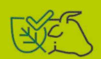

formation Security of the Rural Environmental Registry System and other provisions). Article 4(I) and (II) Official Journal of 19/12/2014. Available at: http://www.ibama.gov.br/sophia/ cnia/legislacao/MMA/IN0003-181214.pdf

MOUTINHO, Paulo; LUI, Gabriel; LAURETO, Lívia; PANTOJA, Eugênio. 2022. O fim do desmatamento ilegal na Amazônia: ferramentas e estratégias no combate à grilagem em terras públicas. IN: SEIXAS, Cristina. *Combate aos crimes ambientais*: orientações para atuação do Ministério Públicona Amazônia legal. Available at: https://ipam.org.br/wp-content/ uploads/2022/07/Combate-aos-Crimes-Ambientais-Orienta%C3%A7%C3%B5es-para-Atua%C3%A7%C3%A3o-do-Minist%C3%A9rio- -P%C3%BAblico-na-Amaz%C3%B4nia-Legal-1. pdf#page=167 Accessed 30 September 2022.

PICCHI, Vasco. 2021. *Tecnologia amplia a transparência na cadeia da pecuária.* Interview for the Blog of the Programme Boi na Linha. Available at: https://www.boinalinha.org/post/ tecnologia-amplia- transparencia-na-cadeia- -da-pecuaria Accessed on 15 May 2022.

PIKETTY, J-M.; VEIGA, J. B da.; TOURRAND.; J. F.; ALVES, A. M. N.; POCCARD-CHAPUIS, R.; THALES, M. 2005. Determinantes da expansão pecuária na Amazônia Oriental: consequências para as políticas públicas. *Cadernos de Ciência & Tecnologia*, Brasília, v.22, n°1, p. 221-234.

PITHAN e SILVA, R. de O. 2008. A Fragilidade do Modelo de Rastreabilidade da Carne Bovina Brasileira*. Análises e Indicadores do Agronegócio*. Instituto de Economia Agrícola. Available at: http://www.iea.sp.gov.br/ftpiea/AIA/AIA-46-2008.pdf Accessed on 22 June 2022.

PRADO JR. C. P. *A Formação do Brasil Contemporâneo*. São Paulo: Companhia das Letras, 2010.

PROFOREST. 2016. *Cadeia de Suprimento da* 

*Carne Bovina:* Sistematização e Análise de Ferramentas de Monitoramento e Controle socioambientais. Available at: https://gtfi.org. br/publicacoes/cadeia-de-suprimento-da-carne-bovina-sistematizacao-e- analise-de-ferramentas-de-monitoramento-econtrole-socioambientais/ Accessed on 16 May 2022.

PROFOREST. 2017. *Monitoramento Socioambiental da Pecuária no Brasil*. Briefing sobre Produção e Compra Responsável do Proforest 09. Available at: https://www.proforest.net/ fileadmin/uploads/proforest/Documents/ Publications/bn09\_final\_ port\_web.pdf. Last accessed on 19 June 2022.

RAJÃO, R.; SCHMITT, J.; NUNES, F.; SOARES- -FILHO, B. 2021. *Dicotomia da impunidade do desmatamento ilegal*. Policy Brief. Available at: http://www.lagesa.org/wp-content/uploads/ documents/Rajao\_Schmitt-et-al\_Julgamentos-IBAMA\_Dicotomia.pdf Accessed on 54 07 August 2022.

 RIPPLE, William J.; WOLF, Christopher; NEW-SOME, Thomas; BARNARD, Phoebe; MOO-MAW, William R. World Scientists' Warning of a Climate Emergency. *BioScience*, Volume 70, Issue 1, January 2020, p. 8–12.

SALOMÃO, C.S.C., Stabile, M.C.C., Souza, L., Alencar, A., Castro, I., Guyot, C.,e Moutinho, P. 2021 *Amazônia em Chamas* - desmatamento, fogo e pecuária em terras públicas: nota técnica nº 8. Brasília, DF: Instituto de Pesquisa Ambiental da Amazônia. Available at: https:// ipam.org.br/wpcontent/uploads/2022/05/ Amazo%CC%82nia-em-Chamas-8- pecua%C-C%81ria-pt.pdf Accessed on 16 May 2022.

SOENDERGAARD, Niels; DIAS de SÁ, Camila; JANK, Marcos Sawaya; GILIO, Leandro. 2021. *Decoupling Soy and Beef from Illegal Amazon Deforestation*: Brazilian Private Sector Initiatives. Rio de Janeiro: CEBRI; São Paulo: INSPER.

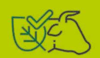

SOUZA, Maria Lucimar; ALENCAR, Ane; PINTO, Erika; CASTRO, Isabel; SALOMÃO, Caroline; PINHO, Patricia; SILVESTRINI, Rafaella; CAR-VALHO, Edivan. Assentamentos Rurais da Amazônia - Diretrizes para a Sustentabilidade. Amazônia 2030. May, 2022. Available at: https://amazonia2030.org.br/wp-content/uploads/2022/05/AMZ2030-38.pdf. Accessed on 30 August 2022.

WENZEL, Fernanda. 2021. Depois da madeira vem o gado: o desmatamento em Santo Antônio do Matupi. IN: FERREIRA, Rafael (org.) *Sob a Pata do boi*: como a Amazônia vira pasto. Rio de Janeiro: Associação O Eco.

WWF. 2021*. Uma visão sobre a rastreabilidade da cadeia da carne bovina no Brasil.* Available at: https://www.wwf.org.br/?77968/Uma-visao-sobre-arastreabilidade-da-cadeia-da-carne- bovina-no-brasil Accessed on 03 May 2022

# **GLOSSARY**

### **Guia de Trânsito Animal - GTA [Animal Transit Guide]**

The GTA is the official document for animal transportation in Brazil and is used for sanitary control purposes. In addition to the data on buyers and sellers, it provides information on the origin and destination of the animals, the purpose of the movement, the means of transport used as well as vaccines and animal exams among other information. GTAs are issued by state animal health control agencies and may be electronic (e-GTA) or printed.

### **Cadastro Ambiental Rural - CAR [Rural Environmental Registry]**

The Rural Environmental Registry was created by the Forest Code (Law 12.651/2012) and gathers georeferenced information regarding environmental aspects of rural properties and possessions. It is a self-declaratory document, mandatory for all rural properties, and requires validation by the competent authorities. It provides information on the Permanent Preservation Areas (APP), Legal Reserve, forests and native vegetation remnants, Restricted Use Areas, and consolidated areas, and constitutes a fundamental database for combating deforestation as well as for environmental and economic monitoring and planning.

#### **Sistema Brasileiro de Identificação de Bovinos e Búfalos - SISBOV [Brazilian System for Identification of Bovine and Buffaloes]**

SISBOV is the official Brazilian traceability system and has health control purposes. It was set up by the Ministry of Agriculture, Livestock and Supply (MAPA) through Normative Instruction No. 1 of 9 January 2002 as a response to the health crises in Europe, especially that generated by Bovine Spongiform Encephalopathy, popularly known as "Mad Cow Disease". It is voluntary, and only required for the external market. In this system, animals are individually identified by ear tags containing a bar code to distinguish bovine animals.

#### **Indirect suppliers**

Indirect suppliers are those livestock farmers who trade their animals with other farms, either through auctions, remates, or other types of formal or informal exchanges. They are differentiated from direct suppliers, which are those that sell their cattle to slaughterhouses. This distinction is related to the specialisation of work in beef cattle, with farms for breeding (or birth), rearing (post- -weaning), and for fattening (termination).

#### **Termo de Ajustamento de Conduta - TAC [Terms of Adjustment of the Conduct]**

TACs are agreements signed between the Federal Public Prosecutor's Office (MPF) and the violator of a collective right. It aims to put an end to the illegal situation, repair the collective damage, and avoid the judicialisation of these processes. The first TAC related to the meat industry in Brazil was signed by the MPF of Pará and slaughterhouses in the region accused of buying animals from properties with social and environmental illegalities.

#### **Blockchain**

This is a data storage technology that emerged in the financial market with cryptocurrencies and has been widely used in sectors such as energy, retail, media, and entertainment. In this system, information is filed chronologically in a chain and each record remains in the database. It is a decentralised database - the control of transactions is not with an organisation or individual, but in a network - immutable (once entered, the information remains in the database and can only be corrected by a new record), and consensual - transactions are signed based on an agreement established between the users of the database.

## ANNEX I

## ANEXO I

REPÚBLICA FEDERATIVA DO BRASIL  
MINISTÉRIO DA AGRICULTURA, PECUÍRIA E ABASTECIMENTO  
SECRETARIA DE DEFESA AGROPECUÍRIA  
DEPARTAMENTO DE SAÚDE ANIMAL

## GUIA DE TRÂNSITO ANIMAL (GTA)

**A presente GTA arriva invalidato nei cassi di (1) emeda, (2) interpoca, (3) interpoca di tributo, entre a procedimenta e dottrino, com descembrargio dai servizio**

0000000000000000000000000000000000000000000000000000000

AL-INVEST Verde is a European Union (EU) programme. Its global objective is to promote sustainable growth and jobs creation by supporting the transition towards a low-carbon, resource-efficient and a more circular economy in Latin America. Through its Component 2, led by FIIAPP in consortium with IILA, the programme provides assistance for strengthening public policies and multi-stakeholder dialogues on sustainable agricultural and value chains, environmental and labour standards as well as sustainable trade and economic policy and regulatory frameworks.

[www.alinvest-verde.eu](http://www.alinvest-verde.eu)

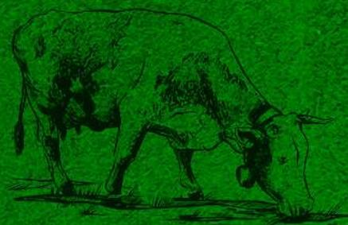

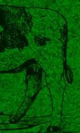

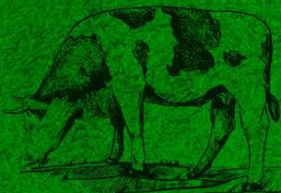

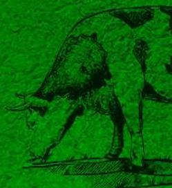

**FIIAPP**  
COOPERACIÓN ESPAÑOLA

**iila**  
Organización Internacional de la Información Española

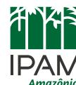