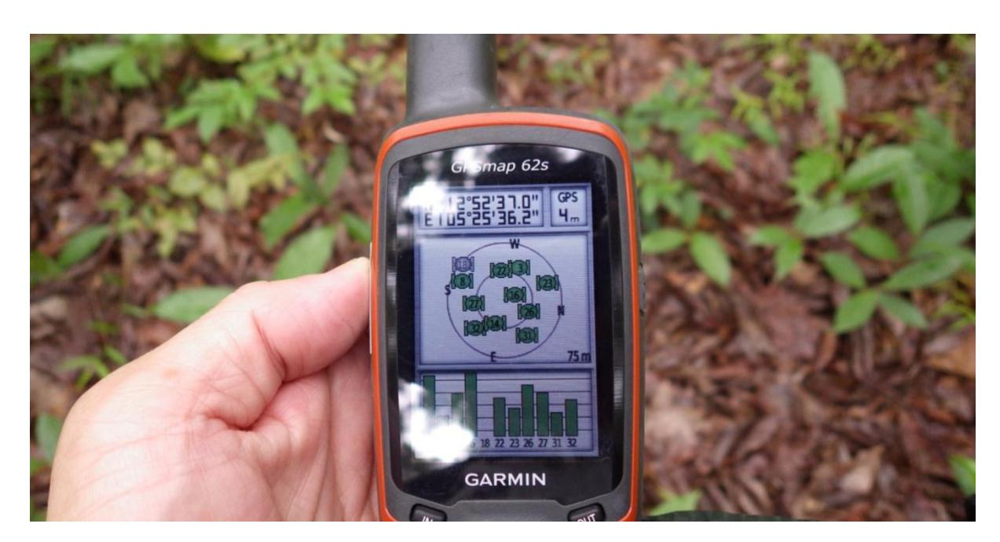
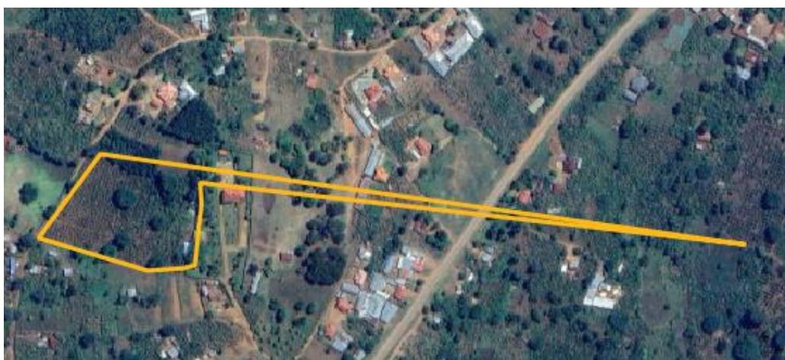
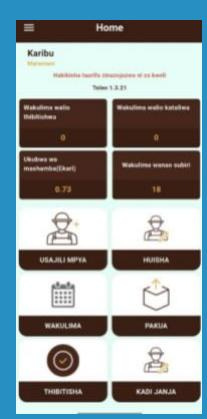
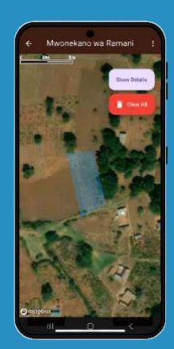

## Deforestation-free value chains

# **Geolocation and the EU Deforestation Regulation**

**December 2025** 

This report provides a concise overview of the geolocation requirements under the EU Deforestation Regulation (EUDR), which aims to ensure that high-risk commodities entering or leaving the EU are deforestation-free and legally produced. It explains the importance of accurate geolocation data for due diligence, outlines key technical concepts and data collection tools, and highlights common challenges and solutions for implementation. The report also discusses how robust geolocation systems not only support regulatory compliance but can drive market access, digital transformation, and sustainability across agricultural supply chains.

# Insight

## **1. Introduction: EUDR geolocation requirement**

The EU Deforestation Regulation (EUDR), adopted in 2023, is a landmark piece of legislation designed to tackle the EU's role in global deforestation and forest degradation. Applying to a set of high-risk commodities—cattle, cocoa, coffee, palm oil, rubber, soy, and timber—and their derived products, these goods can only be placed on or exported from the EU market if they are demonstrably deforestation-free and legally produced in accordance with the country of origin's laws.

Starting from December 2025 (June 2026 for SMEs), this regulation requires operators to establish and implement due diligence, which involves three main steps:

- **Information collection:** including the precise geolocation of production plots, details on suppliers, and proof of legal compliance and deforestation-free status.
- **Risk assessment:** analysing the likelihood that commodities are linked to deforestation or illegality.
- **Risk mitigation:** taking corrective measures when risks are identified, up to and including refraining from placing goods on the market.

Geolocation information is at the core of the EUDR since it requires operators to provide the coordinates of the plot of land where the commodity was produced. It also plays an important role in the risk assessment since operators must evaluate whether there is a risk that the relevant products intended to be placed on the EU market or exported from it are non-compliant.

Geolocation data can be used in spatial analyses of production areas, allowing operators to:

#### • **Assess deforestation and forest degradation risk at origin**

Operators can compare the geolocated data on plots with spatial information like satellite images and forest maps at the cut-off date to establish the land cover or land use in 2020. This helps to determine if there was deforestation, or forest degradation in the case of timber, after the December 31, 2020, cut-off date. They may also perform investigations when deforestation alerts occur within or around production areas.

#### • **Assess legal compliance risk**

Geolocation data can be used to assess whether a product was produced in accordance with some national laws. For instance, plot data can be analysed with the boundaries of protected areas to determine if a farm is inside of a protected area, thereby identifying potential violations of local land-use laws.

#### • **Consider supply chain complexity and risk of mixing**

The regulation requires assessing the risk of **circumvention**, e.g. products of unknown origin or from areas where deforestation occurred after the cut-off date and the possibility of mixing compliant and non-compliant products. A complex supply chain with many sourcing plots, such as is common in the cocoa and coffee sectors, is inherently higher risk. Comprehensive geolocation data coverage helps reduce risk by allowing for the confirmation of origin, while any data gaps (unknown plots) would signal an unacceptably high risk of mixing and a breach of the EUDR requirements.

#### *Products without geolocation information cannot be placed on the EU market. Collecting accurate and complete geolocation information is therefore essential for all EUDR commodities destined for sale in the EU.*

#### **Geolocation information from plot to export**

In practice, the geolocation data is often collected farther upstream from the operator and shared through various steps and actors in the supply chain. For instance, at the start of the supply chain, the first buyer—often a local aggregator, cooperative, or processor – would collect **accurate geolocation data** from all relevant production plots used by its suppliers. As the product moves along the supply chain through subsequent buyers, traders, and processors, information about its origin should remain linked (i.e. one can trace the plot of production where all products within a shipment come from), including in cases where the commodity is transformed or used in processed or composite products. Once the products reach the first operator placing a product on the EU market, typically an importer, they are responsible for submitting the geolocation data for all products within a shipment to the EU Information System, a centralized platform hosting Due Diligence Statements (DDS) and associated data. The system generates a unique DDS reference number, which accompanies the shipment into the EU. EU Customs and Competent Authorities use this reference to access the full DDS and verify that the shipment complies with the EUDR requirements. When products are later made available on the EU market, such as when processed and sold to a retailer, the DDS can be referenced without resubmitting geolocation information.

**Figure 1. Flow of geolocation information through the supply chain.** (1) Geolocation of the plot of production is collected and (2) compiled, and (3) linked to product batches as products move through the supply chain. (4) Geolocation information is configured into GeoJSON format before (5) being submitted into the EU Information System.

## **2. Main concepts: Understanding geolocation fundamentals**

#### **What is geolocation?**

Geolocation is the "geographical location of a plot of land described by means of latitude and longitude coordinates corresponding to at least one latitude and one longitude point and using at least six decimal digits; for plots of land of more than four hectares used for the production of the relevant commodities other than cattle, this shall be provided using polygons with sufficient latitude and longitude points to describe the perimeter of each plot of land" (EUDR Article 2, 28).

In simpler terms, geolocation refers to the precise geographic location of a place.

#### **Key technical concepts**

#### **Coordinates**

Coordinates are numerical values that define a specific location, typically expressed using latitude to indicate the north-south position and longitude for the east-west position. For example, 15.780125° S, 47.929265° W corresponds to a point in Brazil. For submissions under the EUDR, coordinates must be provided in decimal degrees format (as used in the example).

#### **Polygons**

Polygons are geometric shapes used to delineate the boundaries of a plot of land. It is done by connecting multiple coordinate points, forming a polygon that can represent irregularly shaped plots, farms, or other land areas.

#### **Points**

For production plots smaller than 4 hectares, in the case of the EUDR, a single coordinate point in the plot is sufficient to identify their location.

#### **Format to submit geolocation information: GeoJSON**

Coordinates for the plots of production can be provided in bulk in GeoJSON format to the EUDR Information System. GeoJSON is a standardised format for storing geographic data and related information in an easy to read and use way. This format combines geometry, such as coordinates that define locations and shapes, with properties, like metadata, that describe the attributes of the area. Designed to be both human-readable and machineprocessable, GeoJSON ensures consistency and precision in the storing and sharing of spatial data, making it useful for EUDR due diligence statements.

More information about the GeoJSON format:

<https://datatracker.ietf.org/doc/html/rfc7946>

## **3. Geolocation data collection tools**

Geolocation data can be collected indirectly, such as by asking farmers to draw their plot on a map, or directly in the field. The most common and direct way is to visit the plot and walk around the perimeter to collect the vertices' (corners) coordinates using a device connected to a Global Navigation Satellite System (GNSS). The accuracy of the coordinates collected depends on the device used for it. High-accuracy geolocation data can be collected using GNSS antennas, which provide centimetric accuracy, or handheld GPS devices with an accuracy of between 1 and 5 meters. Smartphones can also track location with GNSS (GPS and other satellites) with typical accuracy ranging from 3-5 meters, though this can degrade to 10-15 meters in areas with poor satellite visibility, such as dense forest canopy or steep terrain.

Several applications have been developed to capture geolocation data, addressing common challenges like lack of mobile network coverage or sufficient technology, training, and access. They typically offer offline data collection capabilities, automatic data validation, and seamless integration with cloud-based management systems for storage, analysis, and compliance reporting. In Annex I, we present some of the most used open source and freely available apps, designed to be used by non-technical users with minimal training; this list includes Ground, TerraTrac, INATrace, KoboCollect and GeoRoots.

#### **Unique anonymous GeoID for polygons**

AgStack GeoID is a unique, alphanumeric identifier assigned to a specific piece of land, typically an agricultural field or plot. It is generated by the AgStack Asset Registry, an open-source project from AgStack, part of the Linux Foundation.

Historically, different stakeholders—such as farmer cooperatives, supply chain companies, and regulatory bodies—have used their own internal and often conflicting methods to identify plots, resulting in conflicting references and hindering data sharing. GeoID solves this by creating a single, standardized and anonymous identifier for each plot's geospatial boundaries (polygon). This ensures all systems and applications can refer to same plot unambiguously.

When a user submits a plot's boundaries, the registry generates a unique GeoID; if the same boundaries are submitted by another user, the registry recognizes this and provides the identical GeoID, ensuring consistency. This capability is foundational for high-integrity supply chain traceability and for meeting EUDR requirements on precise proof of a commodity's origin.

Mobile apps can capture plot boundaries and automatically generate GeoIDs, allowing the identifier to seamlessly travel down the commodity supply chain. Additionally, plot boundaries can also be uploaded to the Whisp API to generate GeoIDs. Currently, the FAO is integrating this technology into its open-source applications, such as Ground and WHISP, further supporting standardized geolocation.

## **4.Validation and common errors in geolocation data collection**

To ensure the accuracy and reliability of geolocation data, a validation process should be incorporated into data collection. As best practice, this process might include the following checks:

- Coordinates recorded in the correct WGS84 format (EPSG:4326).
- Coordinates recorded with at least six decimal places to guarantee adequate spatial resolution.
- Coordinates correspond to the actual physical location where the commodity was produced, by layering a base map, satellite image, or field-collected geo-tagged photos.
- Polygon geometries are correctly formed and free from topological errors (e.g. selfintersections, gaps or overlaps).

Despite such checks, errors may still occur, and it is important to recognize and mitigate common sources of error that can undermine data integrity, including human, technical and institutional errors.

#### **Quality errors**

Errors stem from miscommunication, misunderstanding, and manual mistakes during data collection and entry. These are especially prevalent when relying on paper forms or spreadsheets instead of automated tools.

- **Miscommunication between suppliers and operators can lead to incorrect coordinates being recorded.** In addition, the lack of understanding of geolocation data requirements among suppliers can result in incomplete or erroneous submissions. Language barriers and cultural differences compound these challenges. For instance, a local buyer or field agent unfamiliar with the EUDR and who received information about it in a different language, might georeference a parcel with coordinates in a local grid or degrees/minutes format, and an operator later interprets them as WGS84 decimal degrees without conversion, leading to significant location errors.
- **Recording wrong or proxy locations.** In some cases, the human error is providing a convenient but incorrect location, such as using a village centre, road checkpoint, or a cooperative's address as the commodity origin instead of the actual farm plot.

- **Omission and data gaps.** Failing to collect or include coordinates for every relevant plot is another common error. This often occurs in complex supply chains with many small suppliers (coffee, cocoa, rubber) where a plot may simply be missed.

| Error                        | Risk                         | Mitigation measures                  |
|------------------------------|------------------------------|--------------------------------------|
| Miscommunication             | Incomplete or erroneous data | Train field staff, farmers and other |
| Omission of geolocation data | Missing traceability link.   |                                      |

#### **Technical errors**

Technical errors arise from the tools and technologies used to collect, store, and convert geolocation data. Even with well-prepared staff, faulty devices or data handling can introduce errors. These issues affect both smallholders and local intermediaries like cooperatives or local traders (who may use basic GPS phones in remote areas) and industrial actors (who manage large geospatial datasets). Technical errors include:

- **GPS inaccuracies and outlier coordinates**: Especially in dense forests with poor GPS signal, GPS devices can record points with low accuracy. This results in coordinates that are either offset from the actual location or exhibit sporadic "jump" points. When mapping a farm boundary, a momentary loss of satellite signal can cause an incorrect point far off the plot to be logged, resulting in a distorted polygon.

*Polygon with an outlier point.* 

- **Incorrect device settings or formats**. Devices configured with a different coordinate system than intended, such as in a local coordinate system or different datum rather than WGS84, can produce geolocation data misaligned by kilometres. Likewise,

coordinates might be recorded in degrees-minutes-seconds but later interpreted as decimal degrees without conversion, causing major errors.

*Note: For the EUDR, the EU Information System currently supports geolocation data in WGS84 format (EPSG:4326).* 

- **Data transfer and entry errors (digital).** Even when using electronic systems, technical hiccups in the transferring or conversion of data files can introduce errors. For instance, exporting geolocation data from one format to another might truncate decimal precision or swap the latitude/longitude order if template is misaligned. Bulk upload of coordinates could fail if character encodings or delimiters are wrong (e.g. a comma in a coordinate field being misread as a separator).

| Error                                      | Risk                                | Mitigation measures                                                         |
|--------------------------------------------|-------------------------------------|-----------------------------------------------------------------------------|
| Low GPS accuracy and outlier coordinates   | Inaccurate farm location mapping    | Use high-accuracy GPS/GNSS Filter and clean data for outliers               |
| Incorrect device settings or data formats  | Faulty or unusable geolocation data | Standardize to WGS84 and check format conversions in all devices or apps    |
| Data loss during file conversion or upload | Corrupted traceability records      | Spot-check after data transfers Create auto check routines in the database. |

#### **Institutional errors**

Institutional errors refer to failures in a company's data management, like a lack of procedures, policies, or systems that lead to geolocation data problems. These are not single data point mistakes, but systemic issues – often organisational or process-driven – that allow human or technical errors to persist.

#### Common institutional shortcomings include:

- **Lack of standardised collection procedures.** When an organisation has no clear standard operating procedure (SOP) for geolocation data collection, different teams or suppliers might follow different methods. For example, one entity might record centre-point coordinates while another team records full polygons, or they may use different GPS applications with varying formats. The absence of a SOP can lead to widely varying data quality and formats.
- **Insufficient training and capacity building.** On an institutional level, failing to train staff and inform suppliers is a serious gap. Many farmers, local buyers, and middlemen initially have no exposure to GPS or mapping tools, and if left unsupported, they might provide poor data.
- **Inadequate validation and quality control**. An institutional failure occurs when there is no robust protocol to verify and validate geolocation data before using or submitting it. When field data are used without any cross-check, errors will slip through. Note: guidance provided by the European Commission on the EUDR guidance emphasised that operators must ensure the truthfulness and precision of

geolocation information, which underscores the need for internal and/or external validation and quality control.

- **Poor record-keeping and documentation.** Even if data are collected correctly, problems may arise if data are not properly managed or maintained. This includes missing metadata (e.g. source or data collection date), failing to update records when changes occur, or simply losing data over time (i.e, data is saved in a local computer instead of in a central database).

| Error                                           | Risk                                                                                  | Mitigation measures                                                                |
|-------------------------------------------------|---------------------------------------------------------------------------------------|------------------------------------------------------------------------------------|
| Lack of standard procedures for data collection | Systemic data inconsistencies                                                         | Implement SOPs and standard templates                                              |
| Insufficient training and support for suppliers | Poor or no geolocation data collected Exclusion of smallholders from market access | Build capacity with training and tools, including videos and easy-read infographic |
| Inadequate validation and quality control       | Unverified or outdated geolocation info                                               | Use automated QA systems and cross-checks                                          |
| Poor record-keeping or documentation            | Inability to prove compliance during audits and controls                              | Centralise and audit geolocation databases                                         |

#### **Aggregated table: Errors in geolocation data collection (EUDR context)**

| Error type           | Specific error   | Risk          | Mitigation measures |
|----------------------|------------------|---------------|---------------------|
| Quality errors       | Miscommunication | Incomplete or |                     |
| Technical errors     | Low GPS          |               |                     |
| Institutional errors | Lack of standard |               |                     |

| Error type | Specific error                              | Risk                                                 | Mitigation measures                                                             |
|------------|---------------------------------------------|------------------------------------------------------|---------------------------------------------------------------------------------|
|            | Insufficient training/support for suppliers | Poor/no geolocation data; exclusion from market      | Build capacity with training/tools, including videos and easy-read infographics |
|            | Inadequate validation and quality control   | Unverified/outdated geolocation info                 | Use automated QA systems and cross-checks                                       |
|            | Poor record-keeping/documentation           | Inability to prove compliance during audits/controls | Centralise and audit geolocation databases                                      |

## **5.Data management**

The EUDR obliges operators to keep geolocation data, along with all supporting documents and due diligence records, for at least five years. This implies maintaining a reliable internal database or record-keeping system where the coordinates and related plot details (e.g. farm ID, supplier name, maps) are archived and easily retrievable if requested by competent authorities.

Because geolocation data may be generated in various formats (e.g. shapefiles, KML, GeoPackage, or CSV), multi-format compatibility should be considered to allow for seamless integration and conversion. The EU Information System accepts geolocation data in GeoJSON format; therefore, operators should ensure that their systems can convert and export data to this format. In this case, some tools, such as [GeoRoots,](https://georoots.eu/) can help to export correctly to the GeoJSON format required by the EU.

The secure storage and handling of geolocation data should also be ensured. Data protection measures, such as access controls (e.g. only authorised personnel can view detailed coordinates), encryption, and secure transmission channels, can prevent breaches. Since farm geolocation might indirectly identify a farmer, data handlers should also be mindful of data protection laws. Note: the EUDR only requires plot coordinates, not personal details of producers unless they are direct suppliers or operators themselves, which helps limit the handling of personal data[1](#page-12-0) .

1 Frequently Asked Questions, Implementation of the EU Deforestation Regulation, Version 4 – April 2025. European Commission.

## **6.Implementation challenges and possible solutions**

While the previous sections presented the technical concepts and practical considerations for collecting geolocation data for the EUDR, implementing these processes at scale across complex agricultural supply chains presents systemic challenges beyond individual data collection considerations requiring coordinated solutions among multiple stakeholders. The following section outlines key implementation challenges and practical solutions to address them.

#### **Institutional fragmentation and duplication in geolocation mapping**

Public authorities, private companies, NGOs, and supply chain intermediaries often operate independently, leading to duplicated efforts where the same production plots are mapped multiple times by different actors and others not at all. This is particularly problematic in supply chains with high levels of indirect sourcing as those producers without geolocation information associated with their produce risk being excluded from the market in favour of those with geolocation information. This fragmentation leads to inconsistent datasets, inefficient resource utilisation, and gaps in traceability coverage, increasing compliance costs and complicating verification processes.

#### **Solution: Collaborative mapping initiatives**

Coordinated multi-stakeholder efforts to map smallholders' plots and build local capacities can streamline geolocation data collection. These initiatives can combine on-the-ground training with technology deployment, encouraging local institutions like cooperatives or extension services to promote and empower farmers to geolocate their own plots using GPS devices or smartphones. Collaborative approaches can enable smallholders and other supply chain actors to generate geolocation data needed for the EUDR and offer an opportunity for government institutions to efficiently collect, analyse, and leverage agricultural geolocation data for monitoring, planning, and policy-making purposes.

#### **Uganda public-private partnership**

Since 2024, Uganda has launched a bold public-private initiative called the National Action Plan for compliance with the EUDR and Corporate Sustainability Due Diligence Directive (CS3D), bringing in the Ministry of Agriculture in a joint effort with various partners and stakeholders, including International Trade Centre (ITC), Agricultural Business Initiative Development (aBi), Uganda Coffee Federation, and CafÈ Africa, as well as exporters, traders, farmers, and Government ministries and agencies.

The initiative appointed a private sector company to support traceability through geolocation mapping of coffee farms. Field agents, using an offline-capable mobile app, first engage farmers—explaining EUDR, securing consent, and then capturing biodata and GPS-based farm boundary maps. The system ensures each plot is traceable to its precise origin.

Over 150 automated validation checks enforce data integrity (avoiding overlaps, enforcing geofences, and eliminating duplication) before records are integrated into the National Traceability System. To date, nearly 1 million farmers across 126 districts have been mapped, creating over 3,500 jobs (≥ 40% women)

However, to finalise this work, both public and private institutions are looking for options to solve the funding gaps; only ~UGX 13.9 billion of the estimated UGX 35.6 billion needed has been secured. Additionally, logistical, geographic, and infrastructure constraints hinder mapping efforts in remote areas. However, the roadmap made by the government is mobilising different stakeholders to contribute to finalizing the collection of geolocation data and developing other solutions in support of EUDR implementation.

#### **Awareness and training gaps**

Many producers, especially smallholders, and other local supply chain intermediaries are unaware of the EUDR and its requirements. Some farmers may have little to no knowledge of what due diligence or geolocation entails. They often lack guidance on what role they can play in facilitating due diligence or what might be asked of them by local aggregators (e.g. how to obtain and report coordinates, what records to keep). Further, other supply chain actors, like traders and processors, may also lack training or processes to to manage high volumes of data or to maintain chain of custody information.

#### **Solution: Targeted knowledge and training programs**

Establishing regional "knowledge hubs" that serve as central sources of EUDR compliance guidance, along with local training programs delivered in local languages through cooperatives, farmer groups, and extension services, can help bridge awareness and skills gaps. Training could focus on practical skills for collecting and reporting geolocation data through the supply chain and using accessible mapping tools. This approach ensures that all actors, regardless of size or resources, can meet geolocation requirements while improving the overall quality and consistency of data in the supply chain.

#### **Complex supply chains with many members**

Operators may need to gather and manage data from hundreds or thousands of suppliers (some of whom are sourcing from many producers), requiring significant coordination. Collecting geolocation data from suppliers is not a one-time task but an ongoing process of data collection, verification, and communication. Without strong engagement strategies with suppliers (such as regular communication, incentives, or even on-the-ground support teams), there is a risk of incomplete or poor-quality data coming from suppliers, undermining the whole compliance effort. In addition, operators may need to adapt their approach given differences in data format, quality, and coverage across supply areas and suppliers.

#### **Solution: Building on partnerships and existing data**

Companies can engage in pre-competitive processes to harmonise data flows and create geolocation standards and standardised reporting templates, building off of existing certification approaches. In places where public data is available, this could include establishing geolocation data platforms that allow operators to consolidate and harmonise information from multiple jurisdictions into single datasets to use for EUDR due diligence. Governments, industry groups, and other actors can lead efforts to align and coordinate systems, map datums, and establish metadata standards. Existing multi-stakeholder supply chain dialogues can serve as a space to align formats, update protocols, and establish verification methods to support sector-wide efforts to improve sustainability and competitiveness.

Moreover, operators can leverage existing voluntary sustainability certification systems they participate in (e.g., RSPO, Rainforest Alliance, 4C), since many certified suppliers already follow traceability protocols and collect geolocation data.

#### **Malaysia GeoPalm Portal**

The GeoPalm Portal is a Malaysian government database containing polygon and geolocation data for all licensed oil palm producers in the country. The initiative began in 2019 when the government committed to publicly releasing official maps of oil palm planted areas to improve transparency and allow access by NGOs, industry, and other stakeholders. Such spatial data is essential for meeting the EUDR requirement to demonstrate that palm oil is sourced from deforestation-free areas.

While progress in mapping—particularly of smallholder farms—has been gradual, the EUDR has accelerated efforts to complete nationwide coverage. At the same time, data sharing remains sensitive, given Malaysia's data protection laws and national security considerations.

GeoPalm's geolocation data is not yet fully integrated with other key systems such as e-MSPO (the Malaysian Sustainable Palm Oil certification system) and the Sawit Intelligent Management System (SIMS) developed by the Malaysian Palm Oil Board (MPOB). SIMS is a centralized digital platform that records and manages transactional data across the palm oil supply chain, enabling traceability from plantation to export. Efforts are underway by the Ministry of Plantation and Commodities and relevant agencies to link GeoPalm, SIMS, and e-MSPO, creating a unified digital ecosystem that supports full supply-chain traceability and compliance with global market requirements, including the EUDR.

#### **Managing informal supply chain actors**

Many commodities pass through layers of middlemen and informal transactions that go unrecorded. For example, smallholder palm oil farmers often sell through local agents, making it difficult for buyers downstream to trace back to the original production plot.

This challenge is compounded by top-down compliance tools designed by governments or large companies that may overlook on-the-ground realities for farmers and informal networks, creating systems that are impractical or exclusionary.

#### **Solution: Inclusive geolocation models**

Inclusive traceability models can be developed that can capture farm-level origin data even when commodities pass through multiple informal intermediaries before reaching formal markets. Governments, companies, and development partners can pilot intermediary registration schemes that formally recognise and train local agents, aggregators, and middlemen to collect and transmit geolocation data from the farmers they source from. Cooperatives can play a central role by aggregating member data, managing mapping equipment, coordinating field surveys, ensuring updates are transmitted in the correct format, and providing training. This can reduce technical and financial burdens on farmers while improving data consistency, bringing previously unrecorded producers into formal documentation systems and safeguarding smallholder market access through existing local institutions.

#### **The Colombian Coffee Growers Federation**

The Colombian Coffee Growers Federation (FNC) supports EUDR compliance with a sectorwide, geo-referenced registry— the Coffee Growers Information System (Sistema de InformaciÛn Cafetera - SICA) that stores plot-level coffee farm data and producer socioeconomic attributes. SICA is managed by FNC and has long-standing national coverage built through field collection by its technical and extension services. According to public reports, the SICA has around ~1.8 million coffee plots with the details of producer households, reflecting decades of geo-referencing across Colombia's coffee area.

To provide operators with the EUDR-required geolocation, FNC activated an exporter-facing module in its portal. Authorised users (exporters registered with FNC) can query supply-chain growers and retrieve coordinates or farm polygons where available; the system also returns a field indicating whether the coffee area was established before or after the regulation's cutoff date.

The portal's scope is explicitly limited to data delivery. The information provided does not include deforestation-risk analysis, which remains part of the operator's downstream due diligence workflow (risk assessment and mitigation). This information is freely shared by FNC, with restricted access to entities with a valid exporter registration, accessing only the geolocation of their sourcing plots.

Moreover, the FNC emphasised that access to farmer geodata for compliance purposes is contingent on explicit habeas data consent. By 2025, more than 310,000 coffee growers have been consulted for geolocation purposes, and more than 1,500 reports delivered to exporters to support their due diligence processes.

#### **Dynamic nature of geolocation data**

Geolocation data is not static but evolves through time due to land use changes (e.g. divisions, ownership transfer, shifting crops, etc), and suppliers may source from different sourcing areas. This means that collecting geolocation is not a one-time exercise, but keeping this data organised, updated, and linked to incoming shipment batches is a challenge for companies.

#### **Solution: Integrated data management systems**

Comprehensive data management frameworks should allow for regular updates and interoperability to transmit new or updated information seamlessly. Governments and industry associations can lead efforts to align and coordinate these frameworks by, for example, establishing data-collection standards that incorporate mechanisms for updates. Cooperatives and producer organisations can act as key intermediaries, ensuring that plot boundaries, ownership changes, and land-use updates are regularly captured and transmitted upstream in the correct format.

#### **Tanzania Coffee Registry**

The Tanzania Coffee Board (TCB) is developing a Central Coffee Registry — a unified digital platform with data on farmers, farms, and production practices. The Registry captures key details such as farm geolocation, deforestation-free production, and other elements required to comply with international standards like the EU Deforestation Regulation (EUDR). The information is stored in a Central Coffee Registry that will be linked to the auction system and accessible to the private sector. Through this system, TCB aims to: Enhance transparency and traceability of coffee from farm to export.

Strengthen data-driven planning and monitoring in the coffee sector. Empower farmers with digital registration and access to verified information through a Farmer Card. Ensure national data ownership and sovereignty by building a homegrown, secure system managed within Tanzania.

To achieve this, TCB developed the Coffee Profiling App, a tool for mapping coffee farms (via polygon geolocation) and linking them to farmers and Agricultural Marketing Cooperative Society (AMCOS). With EU financial support, TCB customized and piloted the TFRA app, testing data collection methods and validating data accuracy and reliability. Using local enumerators in collaboration with local government and AMCOS ensures high-quality, trusted data collection.

Once the field data is completed, TCB will maintain the system, update geometries and metadata with the collaboration of AMCOS, ensuring the integrity of quality in the system.

## **7. From compliance to opportunity: Leveraging geolocation for sustainable supply chains**

While EUDR geolocation requirements present implementation challenges, they also create significant opportunities for transformation across agricultural supply chains. Robust geolocation systems can drive enhanced market access, accelerate digitalization, strengthen governance, and promote systemic agricultural development and sustainability. By leveraging geolocation data, stakeholders can gain a better view on sourcing practices, make supply chains more efficient, and build trust with buyers and consumers.

#### **Market access and premium value opportunities**

#### **Enhanced market position for compliant producers**

EUDR compliance creates a clear market advantage for producers who can demonstrate deforestation-free production through verified geolocation data. So, early adopters of geolocation systems position themselves as preferred suppliers for the EU market and potentially commanding premium prices. Further, companies that successfully implement comprehensive geolocation systems gain competitive advantages in markets beyond the EU, such as the organic market which also requires product origin information. As sustainability demands expand globally, robust traceability systems become valuable assets that can be leveraged across different regulatory frameworks and customer demands.

#### **Smallholder integration into formal markets**

Geolocation plays a role in recognizing and formalizing smallholders within agricultural supply chains. This integration facilitates access to training and technical support, farm inputs, and financial services, which in turn helps to improve farm conditions and yield, farmer livelihoods, and market access including to premium markets (e.g organic, certified markets). At a higher level, formalization can also contribute to supply chain sustainability and resilience by making sourcing more predictable and facilitating investment in those areas.

#### **Digital transformation and technological advancement**

#### **Catalyst for agricultural digitalisation**

The EUDR can become an opportunity to progress data standards in agriculture, accelerating the adoption of GPS technology, mobile applications, and digital record-keeping systems among farmers, cooperatives and other local actors, who might otherwise lack incentives to digitalise their operations. On top of supporting improved supply chain management, the implementation of these programs generates significant employment and skills

development opportunities. For example, Uganda's geolocation initiative has created over 3,500 temporary rural jobs, with at least 40% held by women, providing vital digital and mapping skills to local communities.

#### **Government capacity enhancement**

Geolocation mapping initiatives can provide governments with detailed information about agricultural production areas, supporting improved policy-making, land-use planning, and agricultural sector monitoring. Such information can support crop yield optimisation to inform development planning, extension services such as input distribution programs, and early monitoring systems, etc.

#### **Long-term sectoral transformation opportunities**

#### **Agricultural data standardisation and sector monitoring**

EUDR implementation is driving sector-wide data harmonisation such as standardised data formats, collection methods, and sharing protocols that benefit the entire sector and create opportunities for increased transparency. This creates better relationships between farmers, governments and industries and enables more effective monitoring of sustainability commitments. It also underpins data-driven decision-making, allowing actors to identify trends, allocate resources strategically, design targeted sustainability programs.

#### **Regional development integration**

Comprehensive geolocation mapping supports regional development planning. By knowing where production occurs, actors can make informed decisions about infrastructure and other investments that can enhance supply chain efficiency (e.g. reduce post-harvest loss, improve produce evaluation). Geolocation data can also support targeted sustainability and conservation programs by linking production data with environmental and socio-economic information in production landscapes. Insights from the data about the sector, such as farm productivity, can then be linked to strategies for achieving broader development goals.

Ultimately, while the EUDR introduces technical and organisational demands and there are considerable challenges to precisely geolocation production areas and link them to traceable commodities, geolocation data can be a powerful driver for sustainable agricultural supply chains.

## **Annex - Open source, freely available geolocation tools**

| Ground Ease of access (what kind of tool                                                                                              | An email address is needed to register (go to                                             |
|---------------------------------------------------------------------------------------------------------------------------------------|-------------------------------------------------------------------------------------------|
| needed, registration, etc.) Possibility of adding information other than geolocation data (land ownership, production quantity, etc.) | https://openforis.org/solutions/ground/) and an Android mobile phone to download the app. |
| Languages available                                                                                                                   | English, French, Spanish and Portuguese.                                                  |
| Offline accessibility                                                                                                                 | Yes, robust offline support (data automatically synchronised) and offline map imagery.    |
| Availability and cost Developers/hosts Data ownership and accessibility Other info                                                    | Open source, free. Engine.                                                                |
| Link                                                                                                                                  | https://groundplatform.org/                                                               |

| INATrace Ease of access (what kind of tool needed, registration, etc.) Possibility of adding information other than geolocation data (land ownership, production quantity, etc.) | Yes, it can be customised and tailored to specific needs.                                                                                        |
|----------------------------------------------------------------------------------------------------------------------------------------------------------------------------------|--------------------------------------------------------------------------------------------------------------------------------------------------|
| Languages available                                                                                                                                                              | The default language is English, but the app supports multiple languages.                                                                        |
| Offline accessibility                                                                                                                                                            | The app allows data collection offline, including farmer profiles and GPS data,                                                                  |
| Availability and cost Developers/hosts Data ownership and accessibility                                                                                                          | Open source (with integration of FAO’s WHISP and Ground Tools), free. Chains Initiative (SASI). The users retain full data ownership.            |
| Other info                                                                                                                                                                       | Designed to establish transparent agricultural supply chains and improve the economic situation of smallholder farmers. https://inatrace.org/en/ |
| Link                                                                                                                                                                             | INATrace Pro : https://inatrace.pro/en                                                                                                           |
|                                                                                                                                                                                  | Mobile App : https://apps.apple.com/us/app/inatrace-pro/id6502619474                                                                             |
|                                                                                                                                                                                  | GitHub: https://github.com/INATrace                                                                                                              |
|                                                                                                                                                                                  | Comprehensive guides and tutorials: https://inatrace-docs.vercel.app/                                                                            |

| KoboCollect Ease of access (what kind of tool needed, registration, etc.) Possibility of adding information other than geolocation data (land ownership, production quantity, etc.) | Android mobile app. It requires a free KoboToolbox account. Yes, designed for complex primary data collection. |
|-------------------------------------------------------------------------------------------------------------------------------------------------------------------------------------|----------------------------------------------------------------------------------------------------------------|
| Languages available                                                                                                                                                                 | It is possible to translate questions into hundreds of different languages.                                    |
| Offline accessibility                                                                                                                                                               | Yes                                                                                                            |
| Availability and cost Developers/hosts Data ownership and accessibility                                                                                                             | Based on the ODK Collect open-source application, free. secure private solution.                               |
| Other info                                                                                                                                                                          | Solution widely used by cooperatives.                                                                          |
| Link                                                                                                                                                                                | Goole Play Store, KoboToolbox : https://www.kobotoolbox.org/                                                   |
|                                                                                                                                                                                     | GitHub: https://github.com/kobotoolbox                                                                         |

| Terra Trac Ease of access (what kind of tool needed, registration, etc.) Possibility of adding information other than geolocation data (land ownership, production quantity, etc.) | name and phone number. No, there is no option to add extra information.                                                                      |
|------------------------------------------------------------------------------------------------------------------------------------------------------------------------------------|----------------------------------------------------------------------------------------------------------------------------------------------|
| Languages available                                                                                                                                                                | By default, the app is set to English, but users can select from other available                                                             |
| Offline accessibility                                                                                                                                                              | Yes, offline functionality.                                                                                                                  |
| Availability and cost Developers/hosts Data ownership and accessibility Other info                                                                                                 | Open source (built on the FAO WHISP project), free. data. email or messaging apps. Under the commodities list, only coffee and cocoa appear. |
| Link                                                                                                                                                                               | Mobile App : Google Play App store                                                                                                           |
|                                                                                                                                                                                    | GitHub: https://github.com/TechnoServe/TerraTrac-Mobile                                                                                      |

| QField                                                                             |                                                                                                                                                                                                                                                                                                                                                                                                                                                           |
|------------------------------------------------------------------------------------|-----------------------------------------------------------------------------------------------------------------------------------------------------------------------------------------------------------------------------------------------------------------------------------------------------------------------------------------------------------------------------------------------------------------------------------------------------------|
|                                                                                    | 
QField is a mobile application available for Android, iOS, Windows, and macOS.
 
To use it, you first prepare a QGIS project on a computer (using the free QGIS desktop software) and then transfer it to the mobile device via cable, cloud, or QFieldCloud (an optional synchronization service). Registration is not required to use QField offline, but creating an account is needed if using QFieldCloud for syncing projects and data.
 |
| 
<b>Possibility of adding information other than geolocation data (land)</b>
 | 
Yes. QField allows adding and editing custom attributes and forms (defined in QGIS) linked to geographic features such as plots, boundaries, or points. These can include land tenure, crop type, production volume, photos, or notes.
                                                                                                                                                                                                             |

| QField ownership, production quantity, etc.)                                                                  | requirements.                                                                                                                                                                                    |
|---------------------------------------------------------------------------------------------------------------|--------------------------------------------------------------------------------------------------------------------------------------------------------------------------------------------------|
| Languages available                                                                                           | Available in multiple languages.                                                                                                                                                                 |
| Offline accessibility Availability and cost Developers/hosts Data ownership and accessibility Other info Link | Yes, QField is designed for full offline use. volume and number of users. QGIS community. suitable for EUDR geolocation mapping. https://qfield.org https://docs.qfield.org https://qfield.cloud |
|                                                                                                               | GitHub: https://github.com/opengisch/QField                                                                                                                                                      |

| GeoRoots control. offline Available tools are: |                                               |                                                          |
|------------------------------------------------|-----------------------------------------------|----------------------------------------------------------|
|                                                | GeoRoots Prepper spreadsheet data.            | — Generate EUDR-compliant GeoJSON from pasted            |
| GeoRoots KML                                   | —                                             | Convert KML files to GeoJSON for EUDR workflows.         |
| validation.                                    | GeoRoots Mapper                               | — Visualize and inspect EUDR DDS GeoJSON for quick       |
| GeoRoots Fixer List of tools                   | — fields to EUDR format.                      | Read, edit, validate, and repair GeoJSON; map/rename     |
| GeoRoots Merger                                |                                               | — Combine multiple GeoJSON files into a single file.     |
| GeoRoots Splitter or count.                    | —                                             | Filter, sort, and split GeoJSON by location, property,   |
|                                                | GeoRoots Deduplicator GeoJSON features.       | — Detect and remove duplicate or overlapping             |
| Languages available                            |                                               | English, French, Spanish, Mandarin, Swahili, and others. |
| Offline accessibility                          | All tools can be downloaded and used locally. |                                                          |
| Availability and cost Developers/hosts         | Tools are open source and free of charge.     |                                                          |
| Link https://georoots.eu/                      |                                               |                                                          |

**Disclaimer.** This insight has been produced with the financial assistance of the European Union. The views expressed herein can in no way be taken to reflect the official opinion of the European Union.