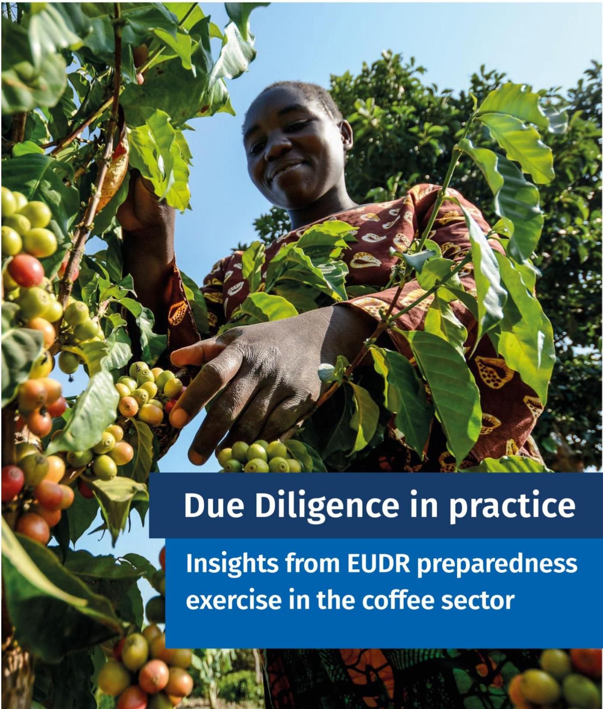
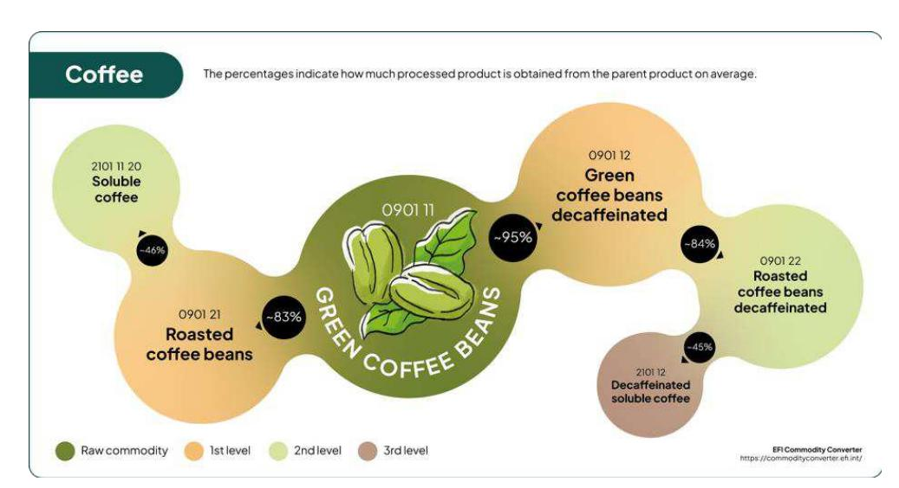
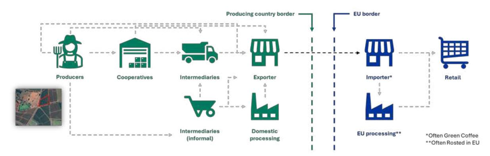
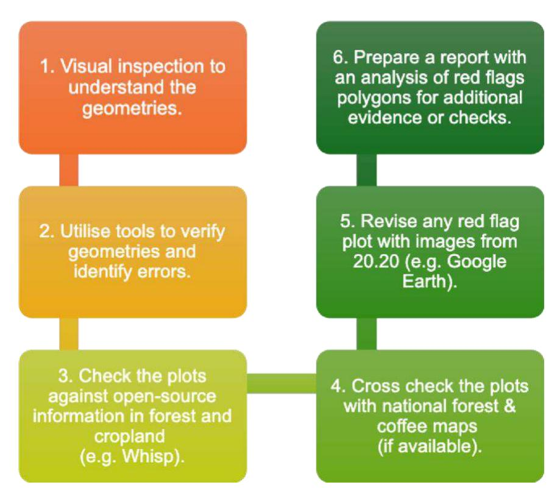
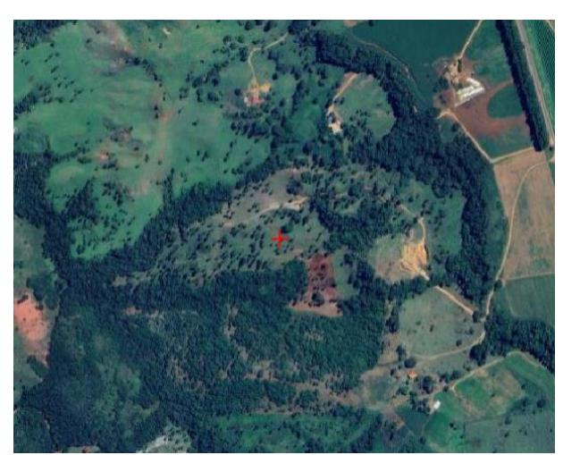
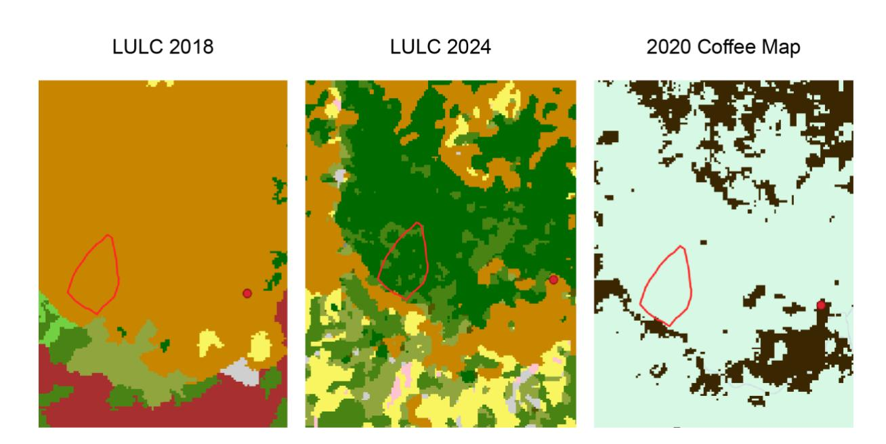
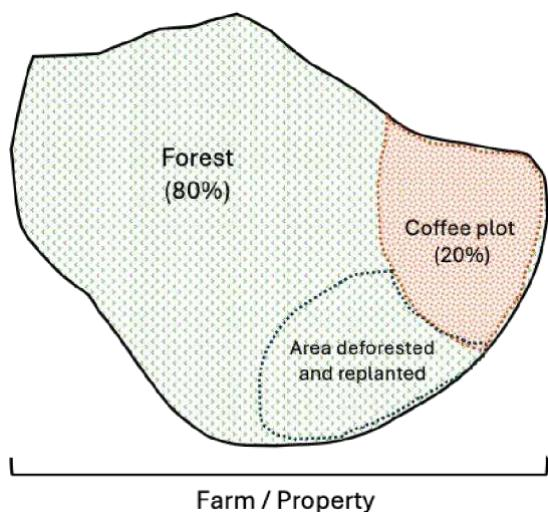

# Due Diligence in practice

## Insights from EUDR preparedness exercise in the coffee sector

#### **Disclaimer**

This report was produced by the European Forest Institute (EFI) with the financial support of the European Union. This report documents a process conducted in September 2025 as part of a learning exercise in the coffee sector for operators and Competent Authorities. It took place before the entry into application of the EUDR, at a time when all stakeholders were still in the preparation phase. The insights presented here are intended to foster mutual understanding, readiness, and alignment among the different actors involved. They should not be interpreted as definitive positions or as representing what may be deemed compliant by the participating Competent Authorities. The views expressed do not necessarily reflect those of the European Forest Institute (EFI), which acted as a facilitator in this process, nor those of the European Union. Rather, many of the recommendations and observations captured in this report point to what could be considered — at this stage, and within the specific coffee contexts examined — examples of good or emerging best practices for the early implementation of the EUDR.

# **Insights from EUDR preparedness exercise in the coffee sector**

### **1.Overview**

The EU Competent Authorities of Belgium and France and a Belgian operator in the coffee sector conducted an EU Deforestation Regulation (EUDR) preparedness exercise, facilitated by the European Forest Institute (EFI) through its Technical Facility on Deforestation-Free Value Chains. The voluntary exercise simulated checks on the operator's due diligence system (DD-System) and four coffee shipments, using real-world data and information to replicate actual checks as closely as possible. The exercise aimed to help identify challenges, viable solutions and best practices to ensure smooth implementation of the EUDR, and provide recommendations that could benefit all interested stakeholders.

In addition to assessing the operator's DD-System in practice, the exercise also served to assess the ease of using the EU Information System for transferring geolocation data and resolving any issues relating to data compilation, formatting and completeness.

### **2. EUDR overview**

#### **What is the EUDR?**

The **EU Deforestation Regulation (EUDR)** requires that coffee, palm oil, cocoa, soy, cattle, timber and rubber (and some related derived products) entering the EU be produced legally and without causing deforestation. Operators wishing to place these products on the EU market will have to conduct due diligence to demonstrate that these criteria are met once the regulation fully enters into application.

### **3. Outline of a coffee supply chain**

About 90% of coffee globally is produced by smallholder farmers with plots of land less than 4 hectares (ha). Farmers may deliver their harvest to cooperatives, which organise collection, storage and initial processing. They could also sell through intermediaries, both formal and informal, or directly to traders. Coffee is directed to domestic processing facilities, where it is hulled, cleaned and prepared for export. Coffee is often sold as green beans.

Once coffee reaches the EU border, it undergoes further EU processing, such as roasting, blending and packaging, before being distributed through retail channels. At the end of the supply chain, roasted coffee is sold to consumers through shops, supermarkets or cafÈs as roasted coffee beans, ground coffee or further processed into soluble coffee. It is important to note that soluble coffee products are currently excluded from the product scope of the EUDR. This exclusion could have several unintended consequences for the coffee sector and the overall effectiveness of the EUDR. By exempting soluble coffee products, the Regulation risks creating a competitive imbalance between EU-based manufacturers—who must comply with due diligence requirements—and those based outside the EU, who can continue exporting soluble coffee to the EU market without demonstrating deforestation-free sourcing. In practice, coffee beans that do not meet EUDR requirements might be diverted to soluble coffee production in non-EU countries, thereby entering the EU market indirectly. Such leakage would undermine the Regulation's environmental objectives and erode confidence in its integrity.

**Figure 1: The transformation of green coffee beans into processed coffee products, with average rates of conversion. Numbers shown above each product are the HS codes.** 

The multitude of farmers is a challenge for geolocation data collection, and the complexity of the supply chain illustrates the challenges of ensuring full traceability.

**Figure 2: The main stages and actors in the coffee supply chain, from production in the country of origin to consumption in the EU.** 

### **4. Steps in the preparedness exercise**

Identification of the operator was facilitated by the European Coffee Federation (ECF), which helped find candidates meeting the following criteria: i) placing coffee on the EU market, in particular from at least some of the origins identified by the Competent Authorities, ii) having an operational DD-System, and iii) willing to share its data with the participating Competent Authorities. An operator with diverse and complex supply chains was prioritised to test checks of more intricate systems.

The exercise was conducted for several months through the following steps, simulating a 'live' EUDR check:

- The operator and EFI identified a set of shipments for the simulated checks, taking into account country origins of interest to the Competent Authorities and a diversity of sourcing patterns: direct and indirect sourcing, cases with and without third-party certification, coffee in agroforestry landscapes, use of national information systems, among others. The set of shipments and the origins – in this case, Uganda, Vietnam, Brazil and Honduras – were validated by the Competent Authorities.
- The operator submitted the due diligence statements using the replicate of the EU Information System (Acceptance) to test the ease of use.

- The Competent Authorities reviewed the submissions and sent questions and requests for additional documentation and data to the operator (see Annex 1 for the standard request used).
- The additional information was provided by the operator and assessed by the Competent Authorities.
- Second round of requests for missing / additional documents and data.
- Both sides came together for an in-person meeting, facilitated by EFI, to discuss the remaining questions (see Annex 2 for examples of questions asked), review the operator's DD-System in greater detail, and gather lessons learned throughout the exercise.

The exercise culminated in this report to share some of the challenges encountered and lessons learned. The recommendations provided are general recommendations based on both best practices and lessons learned from this exercise.

### **5. General insights**

#### 1. **Demonstrating a robust due diligence system is important to Competent Authorities, including demonstrating that this system has been applied to every shipment.**

A functioning due diligence system (DD-System) is the foundation for EUDR compliance, and it is evident that many operators have developed good due diligence systems, protocols and procedures. Continuous improvement mechanisms are essential to ensure the DD System remains effective over time. By providing sufficient relevant information, operators can demonstrate the robustness of their DD-System so that Competent Authorities can have confidence that a strong methodology was used by the operator to determine that a shipment had a low or negligible risk of causing deforestation. Additionally, operators are expected to dedicate enough human resources to implementing their DD-System – a system that exists only on paper will not be sufficient for Competent Authorities if the operator cannot demonstrate that it is concretely put into practice. In the DD-System responsibilities must be attributed to specific people.

But having a strong DD-System, while important, is not the only area the Competent Authorities will check. It is also important for operators to demonstrate that due diligence has been applied to the products in the shipment selected for inspection.

As the Competent Authorities noted during the exercise: *"Our EUDR checks involve two main steps: first, verifying that a functioning due diligence system is in place; and second, assessing whether the product itself is compliant with the EUDR. In the case of the operator, this refers to the practices and evidence used to conclude that there are no, or only negligible, risks of deforestation and illegality related to the shipment."*

|                                                                                                                                                                      |                                                                                                                                                                                 |
|-----------------------------------------------------------------------------------------------------------------------------------------------------------------------------------|----------------------------------------------------------------------------------------------------------------------------------------------------------------------------------------------|
|                                                                                                                                                                                   |                                                                                                                                                                                              |
|  <b>An EUDR compliant product is...</b>                                                                                                                              |  <b>EUDR compliance for an operator is...</b>                                                                                                                                   |
|                                                                                                                                                                                   |                                                                                                                                                                                              |
| 
(a) deforestation-free;
 
(b) produced in accordance with the relevant legislation of the country of production; and
 
(c) covered by a due diligence statement.
 | 
Demonstrating conclusive evidence that there were no or only negligible risks of non-compliance, or that these were made negligible through mitigation actions (Obligation of means).
 |

Therefore, in addition to providing information on their DD-System, operators will also demonstrate that production of the commodity was compliant with EUDR criteria. In order to do this, the operator must know – and provide clear information on – the origin of the product (i.e. geolocation), as well as other relevant criteria described in EUDR Article 10 on risk assessment, such as the presence of forests, presence of indigenous peoples, risk of mixing with non-compliant products, and more. Operators can use, but should not rely exclusively on, external platforms or tools for this information; they are also expected to develop and apply internal Standard Operating Procedures (SOPs) tailored to their supply chains.

#### **Scope of EUDR checks**

EUDR compliance verification operates on two levels during an inspection: (i) assessment of the DD-System itself, to ensure it is complete and functional; and (ii) verification of product-level evidence of compliance, focusing on the traceability and risk assessment related to specific shipments.

Failure to provide product-level evidence would put into question the fact that the DD-System is consistently applied.

*"Operators cannot hide behind a general DD-System; they are expected to provide evidence directly relevant to the specific shipments selected for inspection."* (more details in Annex 2)

#### 2. **Operators are expected to adopt a balanced approach to risk assessment, giving equal weight to deforestation and legality checks.**

The EUDR Risk Risk Assessment has two equally weighted components: (i) Deforestation Risk Assessment and (ii) Legality Risk Assessment. However, the exercise revealed that operators tend to devote attention to deforestation-related risks, often at the expense of legality checks which are generally more complex for them to interpret and implement in practice. The Competent Authorities were clear that they will focus their checks on both dimensions of risk. This could lead to a potential mismatch between the information provided by operators and what is expected or requested by Competent Authorities.

Both the deforestation and legality dimensions of risk require systematic evaluation to ensure compliance. Competent Authorities expect to receive not only the risk assessment itself, but also the information on which the assessment is based, e.g. data / information demonstrating how the operator came to a conclusion that there is a negligible risk of indigenous peoples located in the sourcing areas of a shipment. Such information needs to be origin-specific; broad assessments are not considered sufficient because they might not apply to the production area in question.

Legality compliance may be checked by consulting databases, overlaying the geolocation of plots with maps, collecting documents, etc. Regarding the collection of documents, the exercise revealed that some farmer- or plot-specific documentation related to legality risks – such as permits – is not being collected by all operators, often because operators are not in a position to request or obtain such documents from farmers. The operator noted that only a portion of actors in its supply chain carry out specific data collection on workers' rights, child labour and human rights, further noting that "*the legality part is easier to handle when you have responsibly sourced coffee*", as many of the same EUDR legality criteria have to be met for a producer to receive certification.

#### 3. **For EUDR check-information must be relevant, verifiable, and accessible to support EUDR compliance.**

**It is important to balance information completeness with conciseness and clarity.** Operators face a paradox when it comes to selecting what evidence to provide during a check. Since, under the EUDR, the burden of proof lies with operators, it is tempting to share every single dataset or document that could contain any information potentially relevant to a Competent Authority's request. But this could lead to 'information overload' where the volume of information is greater than what the Competent Authority can inspect in a timely manner, or poses challenges for finding the few relevant paragraphs in a lengthy document. Finding a balance between relevance and conciseness is mutually beneficial to both sides.

During the exercise, the documentation on the due diligence system shared by the operator totalled hundreds of pages. The Competent Authorities highlighted the challenges of reviewing so much information. In some cases, the Authorities also found it unclear why certain documents were included or what specific information they were expected to extract from them. Such lack of clarity could have practical implications, as Competent Authorities may struggle to identify the conclusive evidence needed to verify EUDR compliance efficiently.

To reduce this challenge, Competent Authorities suggested that operators include the following when submitting documentation:

- An **index** of what datasets or documents are being shared and what relevant information each one contains.
- **Summaries** of any lengthy documents (e.g. explanations of DD-Systems).

Additionally, a note on each document specifying the section or pages where the relevant information can be found could further reduce the burden on Competent Authorities and accelerate the check. The operator noted that time is needed to respond to these requests and that this should be factored into the lead time of checks.

#### *Realistic timelines needed for providing requested documents.*

Competent Authorities noted during the exercise that they would normally expect to receive pieces of evidence the same day they are requested during audits, as applied in the EU Timber Regulation (EUTR) checks where operators should have the information that they claim to have checked in its DD-System. On its side, the operator noted that some lead time would be necessary to gather the data and documents from its supply chain: "*We have this documentation at origin, but not directly at hand at destination.*" It is therefore clear that communication and expectation management between operators and Competent Authorities are needed to ensure risk-based verification remains credible and practical, noting that such processes may become more efficient over time.

*"Simply collecting data and documents is not enough; operators are also expected to demonstrate that they have checked this information to be adequately conclusive and verifiable, and used it in their risk assessment."*

This point was raised repeatedly during the exercise by the Competent Authorities: while operators are expected to collect and provide information as evidence of EUDR compliance, they also have to check that the information is valid, correct and accurate – and provide evidence of their procedures for verification, risk assessment and, where needed, risk mitigation. The Competent Authorities noted that simply providing land titles of farmers connected to a shipment, for example, is not sufficient evidence of compliance without demonstrating that those land titles have been checked. Operators are expected to have verified relevant information in advance of inspections.

#### **Gathering evidence for EUDR compliance: documents versus data**

When it comes to showing evidence of due diligence, conversations often revolve around searching for documents. However, the challenges for the operators to collect, and for the Competent Authorities to analyse, large amounts of documentation, are one of the salient messages of this report. It is worth reminding that relevant information in the context of EUDR may be provided not only through the form of documentation, but also of data, which can help address these challenges. The use of one medium or the other should be assessed in light of what the operator wishes to demonstrate. Certain cases are more suited to one format than another.

EUDR Article 9: "Operators shall collect **information**, **documents** and **data** which demonstrate that the relevant products comply with Article 3."

**Table 1: Legality Risk Assessment: types of information that might be useful. Documents vs Data** 

| Type of evidence | Characteristics         | Considerations for due diligence |
|------------------|-------------------------|----------------------------------|
| Documents        | Information recorded on |                                  |
|                  | format –                | e.g. through photos,             |
|                  | manual data input       | – but                            |
| Data             |                         | Information stored in digital    |

# **Lesson 1 – Quick spatial and geometry checks can reveal issues with geolocation data quality and consistency**

Plots larger than 4 ha must be submitted as polygons outlining the plot boundaries (smaller plots may use a single point) . The rush to gather polygon data at scale often leads to geometric errors and inaccuracies.

During the exercise, simple visual inspections and geometry checks revealed common errors, such as:

#### • **Overlaps**

Areas where two farm polygons improperly cover the same ground. Small boundary overlaps are not an important issue of concern in smallholder contexts; however larger overlaps put into question the robustness of the data collection method.

#### **Spikes**

Irregular polygon boundaries that create misleadingly large perimeters or areas. Spikes are easily detectable and can be corrected when these are isolated events (generally due to an error in recording or reporting one coordinate).

#### • **Visual boundaries and infrastructure**

Polygons don't follow the clear plot border in the image.

#### • **Duplicates**

The same polygon shapes appearing in several locations (or overlapping on the same area).

A structured five-point process can help strengthen reliability. This is not exhaustive, as other checks may be helpful depending on the context (e.g. check for boundary gaps between adjacent polygons).

- 1) Check for illogical locations (e.g. plots in water, in another country, outside production areas)
- 2) Check for self-intersections
- 3) Check for spikes
- 4) Check for visible duplicates
- 5) Check for overlaps

Free resources are available for non-experts to run this kind of analysis, for example [Mapshaper](https://mapshaper.org/) and [Georoots Editor](https://georoots.eu/editor/) for geometry and topology checks. Various platforms may be used for visual inspection (e.g. [Google Earth\)](https://earth.google.com/web/). More advanced analysis may be conducted by a GIS expert or specialised service providers.

This should be paired with robust data collection methods and clear tolerance thresholds (the operator used a 5-m-accuracy threshold for plot data collection in the coffee sector with smallholders), acknowledging that minor isolated issues such as small overlaps between polygons in hilly areas are to be expected. These were not a major issue for the Competent Authorities.

Having a clean and coherent plot dataset is one thing; another is the ability to evidence that specific shipments are actually linked to these origins and that no "problematic plots" may have been conveniently removed from the dataset.

# **Lesson 2 – Cross-referencing different maps gives confidence to deforestation risk assessments**

Combining multiple sources of information to check for deforestation in certain locations provides stronger assurance than relying on a single dataset. The operator had cross-checked the Joint Research Centre (JRC) forest map with other globally available datasets (e.g. Global Forest Watch) and with national datasets in some contexts (e.g. PRODES in Brazil).

In places where forest maps come with limitations (significant error margins, forest definitions not fully aligned with the EUDR definition), cross-checking with commodity maps – in this case, coffee planted areas – can provide an additional layer of evidence.

**Table 2: Example of how convergence of evidence can support decision-making** 

| Convergence of evidence                 | Coffee maps    |                |     |
|-----------------------------------------|----------------|----------------|-----|
| Confidence levels                       | No coffee      |                |     |
| No forest map used                      | No evidence    | No convergence |     |
| Global or national source (only 1 used) | No convergence |                |     |
|                                         |                | +              | ++  |
| Global and national sources used        | +              | ++             | +++ |

Checking for different sources of information has become easier with the expansion of available tools. The FAO [Whisp](https://openforis.org/solutions/whisp/) tool, for example, provides a free portal to check a given set of plots against a wide range of publicly available global, regional and national datasets on forest cover, deforestation and crop planted areas. This includes the JRC's 2020 global forest map.

*"The JRC forest map offers valuable insights but it does not constitute definite proof." (Competent Authorities)*

On the use of official national datasets on forests and crop maps (many of them are not readily available in global portals[1](#page-14-0) ), the Competent Authorities noted that their utility in that context would increase if they allowed the uploading of polygon datasets, in order to run tailored analyses for specific supply chain areas. While improving the accessibility and usability of these national datasets is important, when using such systems operators remain responsible to demonstrate how they determined their reliability.

A structured six-point process can help review plot datasets. Operators may use a different process than the one illustrated below; what mattered most for the Competent Authorities is that the operator is able to demonstrate the use of a structured and robust process, and that this process has been applied to the specific shipments selected for inspection. Use of a structured process in verification efforts also increases transparency, demonstrates logic and reduces subjectivity.

**Figure 3: A structured six point process to help review plot datasets**

1 All parties involved in this exercise also noted their interest in having more information about existing national datasets on forests and croplands.

# **Lesson 3 – Non-spatial evidence could be key to verifying deforestation-free status in complex landscapes**

Demonstrating deforestation-free status (coffee did not replace forest after 31 December 2020) can be challenging for coffee planted in agroforestry systems. Dense tree cover makes the analysis of coffee plots more challenging, especially in the absence of reliable coffee plantation or commodity maps to validate the presence of coffee or agricultural land use. Here, non-spatial evidence — farm records, tenure documents, management plans, certificate or audit report from a certification scheme — offers a faster means of demonstrating adequately conclusive and verifiable information that the plot of land was under 'agriculture use' before 31 December 2020.

A combined spatial and non-spatial approach strengthens credibility and enables more accurate compliance with deforestation-free requirements. Describing such a methodology can give confidence in due diligence systems. If such documents are not available, for example due to lack of farm records or informal ownership, field surveys in high-risk areas (e.g. photographs linked to geolocation date showing the age of the coffee trees) could be used as evidence.

**Definition**: Under the EUDR, '**agricultural plantation**' means 'land with tree stands in agricultural production systems, such as fruit tree plantations, oil palm plantations, olive orchards and **agroforestry systems where crops are grown under tree cover**'. This definition includes all plantations of relevant commodities other than wood. **Agricultural plantations are excluded from the definition of 'forest''**.

Commission Notice C/2024/6789 – Guidance Document

### **Case study: agroforest coffee in Honduras**

Agroforestry coffee makes up 90% of Honduras's coffee production. A 2020 national coffee map and national land-use maps for the years 2018 and 2024 are publicly available to download from the Instituto de ConservaciÛn Forestal [geoportal;](https://geoportal.icf.gob.hn/geoportal/main) however, these datasets have their limitations – the 2018 and 2024 land-use maps were

> developed using different methodologies and are not comparable. For example, during the exercise, 10 out of the 15 coffee plots in Honduras did not appear in the national coffee map, so the operator was asked to provide non-spatial evidence to demonstrate that they are indeed coffee plots and on land predominantly under agricultural use and any disturbance detected in these plots could be disregarded as deforestation according to the EUDR.

**Figure 5: A polygon crossed with the Honduras 2018 map shows an area of coffee plantation, while the 2024 shows the area is a forest land, and the coffee map shows there is no coffee inside the polygon. These three maps of Honduras followed different methodological approaches.** 

**Figure 4: The challenge of demonstrating agroforestry coffee with remote sensing (Honduras)**

# **Lesson 4 – Spatial data has the potential to inform legality risk assessments**

While operators have invested substantial effort in gathering and analysing geospatial information to assess the risk of deforestation in their supply chains, this information also has value for assessing a variety of risks related to legality.

These include verifying whether:

- Plots encroach on protected areas or areas demarcated by law as non-agricultural uses.
- Plots overlap with indigenous or community land rights.
- Plots fall within buffer zones along riverbanks.
- Slope restrictions to prevent cultivation on steep terrain are respected.

During the exercise, the operator used **Protected Area (PA) spatial layers** to assess the proximity of coffee plots to designated Protected Areas, helping to identify potential risks of sourcing from environmentally sensitive zones. Similarly, the Competent Authorities conducted spatial checks to determine the proximity of plots to rivers, which can indicate possible encroachment into riparian buffer zones or other environmentally regulated areas.

Recognising such proximity-based risks allows operators to apply targeted **mitigation measures** under the EUDR—such as segregating supplies, increasing the frequency of field verification, strengthening control points within the supply chain, or requesting additional evidence from suppliers. In this way, spatial analysis becomes a practical tool to demonstrate that risks have been identified, assessed, and effectively mitigated in line with Articles 10 and 11 of the EUDR.

#### **Encroachment on protected areas**

The World Database on Protected Areas (WDPA) is the most comprehensive global repository of information on terrestrial and marine protected areas, managed jointly by the UN Environment Programme's World Conservation Monitoring Centre (UNEP-WCMC) and the International Union for Conservation of Nature (IUCN). It brings together officially reported data from governments, regional bodies and other authoritative sources to provide detailed information on the location, extent and designation of protected sites.

However, the data available in the database is not always accurate, depending on the country, due to issues of data reporting harmonisation across countries and delays in reporting the latest changes in the demarcation of protected areas (e.g. creation of a new reserve). Therefore, checking for overlaps with the WDPA dataset may just be a first step towards further verification in risky areas.

*"For some countries such as Colombia, this [WDPA] is amended to national databases, as the WDPA may not fully reflect the legal status of land use or up-to-date boundaries." Operator's EUDR manual*

#### **Overlap with indigenous or community land rights**

There is no single global database for indigenous land boundaries that is as comprehensive and authoritative as the WDPA for protected areas. However, several initiatives compile and share spatial information on indigenous and community lands. The most widely cited is [LandMark](https://www.landmarkmap.org/map)*: The Global Platform of Indigenous and Community Lands*, which provides maps and data on the extent of lands held or claimed by Indigenous Peoples and local communities, drawing from official records, academic studies and civil society contributions. Coverage is uneven and depends on available national data and recognition.

Brazil stands out for the availability of geospatial information on indigenous and community lands. For the Brazilian sourcing, it was seen as good practice to check for overlap of the plots with the available national databases on indigenous lands and traditional communities (FUNAI Database and INCRA Database). But many non-indigenous traditional communities facing land-grabbing pressures in Brazil are not included in these databases; checking additional sources of information is therefore recommended (e.g. the [TÙ no Mapa i](https://tonomapa.org.br/en/principal-english/)nitiative).

#### **Buffer zones along riverbanks**

Most countries have legislation prohibiting land cultivation within a certain buffer distance from riverbanks. This kind of legal provision on land use directly relates to the scope of the EUDR.

This is the case in Vietnam, for instance, where a coffee plot was found within the **15- to 30-metre minimum** distance[2](#page-19-0) from riverbanks, potentially jeopardising the legality of the product in the shipment from Vietnam analysed in this exercise.

2 30 metres in Vietnam near ecologically sensitive areas or when use of contaminants near aquatic ecosystems.

# **Lesson 5 – Risks cannot be meaningfully assessed based on broad global or national statistics alone**

While operators have invested substantial effort in gathering and analysing geospatial information to assess the risk of deforestation in their supply chains, this information also has value for assessing a variety of risks related to legality.

For legality checks, national-level data and statistics are not enough. The Competent Authorities in the exercise recommended that operators look at information for the specific sourcing regions and connect it to the shipments in their DDS to help identify real risks in the supply chain. EUDR Article 9(1) specifies that the product-related information must be assessed, along with additional contextual information specified in Article 10 (2).

### **Case study – Uganda**

The operator prepared a risk assessment for each country of production. Article 10(2)(c) of the EUDR concerns the presence of Indigenous Peoples in the country of production or in parts of it. To assess this, the operator used data from LandMark which shows the percentage of Indigenous Peoples' territories relative to the national territory. The assessment indicated that 41% of Uganda's territory is recognised as Indigenous Peoples' land. This was further validated with origin experts to understand the overlap with coffee production.

The Competent Authorities expect clarification on how much of the company's sourcing region might overlap with this 41%, if any. They looked for evidence of measures taken to address Article 2.40 (g) on the application of Free, Prior and Informed Consent (FPIC) – the following Article 10 information relevant to Indigenous Peoples:

- 1) Consultation and cooperation in good faith with Indigenous Peoples 2(c)
- 2) Existence of duly reasoned claims by Indigenous Peoples 2(e)
- 3) Recognition of third-party rights 2(d)
- 4) Respect for human rights 2(f)

Where they exist, national databases on land rights, human rights, environmental issues and others can provide valuable information worth cross-checking for a specific set of sourcing locations. However, Competent Authorities wanted to see how risk

assessments were linked to data on specific sourcing regions and shipments within the DD-System. According to the Competent Authority: "Further analysis is needed to demonstrate how well the datasets correspond to the operator's sourcing regions or supply base." Operators remain interested in further guidance on how this could be done.

**Table 3: Example of global datasets that were considered for risk assessment** 

|                         | Score                         | Source                               |
|-------------------------|-------------------------------|--------------------------------------|
| Corruption              | Low, Medium, or High Risk     | Corruption Perception Index          |
| Law enforcement         | Low, Medium, or High Risk     | World Governance Indicators          |
| Human rights            | Low, Medium, or High Risk     | Global and national sources used     |
| Deforestation           | Low, Medium, or High Risk     | FAO – Global Forest Resources Report |
| Primary forests         | Low, Medium, or High Presence | FAO – Global Forest Resources Report |
| Indigenous peoples      | Low, Medium, or High Presence | LandMark                             |
| Sanctions               | Yes or No                     | European Commission                  |
| Armed conflict          | Yes or No                     | RULAC                                |
| Supply chain complexity | Low, Medium, or High Risk     | Internal data                        |
| Risk of circumvention   | Low, Medium, or High Risk     | Internal data                        |

# **Lesson 6 – National information systems and certification schemes provide useful information, but are not a substitute for due diligence**

National/public information systems and/or registries, for instance on land rights, can support **but not replace** the operator's due diligence responsibilities, especially where there are issues of corruption or weak governance. They should be treated as one layer of evidence – useful for identifying potential risks – but verified and cross-checked with independent information in risky areas. When using certification schemes as part of EUDR due diligence – whether for risk assessment or risk mitigation – operators are expected to clearly explain which specific requirements of the EUDR are addressed by the relevant principles, criteria or indicators of the chosen scheme.

Some best practices identified during the exercise include:

- A systematic assessment of the different national systems and certification schemes used by the company against criteria set out in Articles 9, 10 and 11.
- Benchmarking of tools used before using them as input to information requirements and risk assessments.
- Verifying data obtained from national databases/registries with sample documentation and ground checks.

### **Case study: Brazil**

The legality risk assessment reports provided by the operator proved to be most informative in Brazil, compared to the other country origins included in this exercise. In great part, this was due to the availability of the national databases listed below, readily available to cross-check information for specific sourcing locations.

This is an example of how increased national information and transparency can offer a competitive advantage for a producing country like Brazil. Operators can more easily compile relevant evidence for their legality risk assessment, while they may struggle to provide a minimum of adequate information for other origins.

While such national information systems, where they exist, prove to be helpful for information collection, operators are still expected to explain how they assessed the reliability of the information obtained through these systems, and how they used it in their risk assessment and mitigation actions.

"*Operators should clearly demonstrate how national information systems (e.g., CAR, PRODES) are used, show how they assessed their reliability, and provide concrete examples—not simply stating that the tools were used, and no risks were found.*"

**Table 4: EUDR Article 9 information needs and relevant national databases/registries in Brazil** 

| Article 9 Information                | Relevant national databases/registries                        |
|--------------------------------------|---------------------------------------------------------------|
| Geolocation information              | Collected by CAR (Environmental Rural Cadastre)               |
| Land-use rights                      | Prodes Brasil, Map Biomas & CAR                               |
| FPIC                                 | Overlay data from Lands (FUNAI Database) and Quilombo         |
| Third Party Rights                   | No overlap of CAR with Protected Areas (SNUC) and             |
| Environmental & Forest-related rules | No overlap of CAR with Protected Areas (SNUC) and             |
| Human Rights                         | Absence in the Ministry of Labor and Employment’s Register of |
|                                      | Employers – “Lista Suja do Trabalho Escravo” (Dirty List of   |

# **Lesson 7 – The use of a risk-based approaches to legality due diligence should be documented and explained**

Collecting precise proof and evidence of compliance for every individual coffee smallholder producer is particularly challenging, as the sector is dominated by smallholder producers rather than large-scale estates. In most places, there are no documented or centralised records of land-use rights or of other relevant legal issues (e.g. labour rights) related to smallholder coffee farmers. Many legal requirements are actually prohibitions (e.g. prohibition to discriminate) that cannot be proven with a document. In informal supply chains involving numerous smallholder producers, documents may not even exist due to customary tenure.

In the face of such challenges, which are seen across the different sectors covered by the EUDR albeit most prominently in the coffee and cocoa sectors, the operator explained the use of a risk-based approach to carrying out legality due diligence, to focus their efforts in the areas where legality issues required the most attention.

During the exercise, the Competent Authorities were therefore exposed to the use of a risk-based approach in data-poor environments, especially with large numbers of smallholders.

While the use of a risk-based approach to legality due diligence is core to the spirit of the EUDR, the Competent Authorities noted that just explaining the risk-based approach during inspection is not enough; actual evidence is expected on how the approach was used by the operator, including examples of actual information collected and analysed. This may include, for instance how the operator assessed that a specific cooperative had strong internal management systems which could reduce the need to collect additional information on every individual farmer member; how the operator made use of local NGO reports to conclude on legality issues that would be hard to assess otherwise; how data on complaints received and addressed was used, etc.

"*You don't need an audit on all your farmers, but you are expected to have audits in all risky regions.*"

The Competent Authorities also highlighted the value of audits and sampling methods, but noted that these are relevant for the risk mitigation part of the due diligence process. The recommendation to the operator was rather to explain what proxy

information may have been used in the absence of actual documentation (e.g. data and documentation from the cooperative in the absence of documentation for each farmer in a given sourcing location), rather than the use of sampling methods for information collection.

# **Lesson 8 – For secondary Due Diligence Statements (DDS), a simplified approach is welcomed**

The Belgian and French Competent Authorities chose to work together on this dry run in order to test the movement of coffee between Belgium and France. Under the EUDR, an operator which first places coffee on the Belgian market must submit a primary Due Diligence Statement (DDS). Any downstream operator purchasing that coffee and then placing it on the French market is required to submit a secondary DDS, which references the primary DDS.

During the exercise, it was observed that for every primary DDS generated, an estimated three to four times more secondary DDSs would be produced. It also became clear that many downstream operators are highly risk-averse regarding EUDR compliance, often seeking to re-verify all due diligence information provided along the supply chain. As a result, downstream operators are requesting large volumes of due diligence data from their suppliers, frequently in different formats to align with their own internal systems and procedures. This practice creates a significant administrative burden for the primary DDS holder—that is, the EU operator first placing the products on the EU market.

The simplification under Art. 4(9) states that operators further down a supply chain only have to ascertain that due diligence was properly carried out upstream, and do not necessarily have to systematically check every single due diligence statement submitted upstream. In line with the guidance from the European Commission contained in the [Frequently Asked Questions](https://circabc.europa.eu/ui/group/34861680-e799-4d7c-bbad-da83c45da458/library/e126f816-844b-41a9-89ef-cb2a33b6aa56/details) 3.4, downstream operators do not have to collect information required by Art. 9 EUDR as the DDS includes a declaration that due diligence was exercised, implying that the information required by Art. 9 has already been collected by the upstream operator.

Key obligations for downstream non-SME operators and traders:

- Ascertain that due diligence was exercised upstream in the supply chain (Art. -4(9)-EUDR).
- Submit a due diligence statement (DDS) and refer to previous DDS by including the relevant reference numbers received from direct suppliers.

Downstream operators must have their own DD-System describing the information they collect, how they assess the risks associated with their suppliers and which mitigation

measures they eventually take. Additional work can be done for supply chains where they consider the risks to be higher.

As a best practice, the Competent Authorities recommended potential further steps – for example, downstream operators gathering information to understand the DD-System of their suppliers (upstream operators) and carrying out annual risk assessment and spot checks to ascertain that due diligence was exercised.

Considering the potential risk related to the relevant products and the country of origin, downstream operators may collect and analyse information beyond what is contained in the EU Information System. They may, for instance, consult publicly available reports based on Art. 12(3) EUDR from non-SME upstream suppliers; consult the results of an audit conducted based on Art. 11(2)(b) EUDR; or request, on a voluntary basis, further information from their suppliers.

The operator expressed strong interest in the development of a standardised system, at the European level, ideally led by the European Commission, for transferring due diligence information down the supply chain. Such a harmonised system would ensure that all downstream operators receive the same format and type of information requests, avoiding a situation where each upstream operator has to provide data in different formats. Standardisation at the EU level would improve efficiency, reduce duplication of effort, and provide greater clarity and consistency amongst EU operators.

For example, in France, some non-SME downstream operators and traders are working on enhancing the Electronic Data Interchange (EDI) to include EUDR features. DDS reference and verification numbers could be integrated in the commonly used "product description" shared among downstream operators and traders. This would greatly facilitate interaction between clients.

# **Lesson 9 – Mitigation measures are a critical component of a robust Due Diligence System**

Mitigation measures are a key element of an operator's DD-System under the EUDR. They allow operators to address identified risks in their supply chains and demonstrate proactive management of deforestation and legality issues, beyond simply identifying risks. Mitigation measures are action-oriented, transforming risk identification into tangible steps to reduce or eliminate the risk. A single well-designed mitigation measure can cover multiple shipments or suppliers when it is documented and verifiable. Combining mitigation measures – such as audits, document checks and certification follow-ups – strengthens the credibility and robustness of the operator's DD-System. Any mitigation action must be supported by evidence. For example, when an operator carries out a field visit, there should be a clear record of the visit showing exactly what was checked.

The exercise revealed that mitigation measures like self-assessment reports and suppliers' codes of conduct tend to be weak on their own to effectively address identified risks. In particular, mitigation measures are expected to address risks of mixing and gaps in traceability to the plot. For example, one Competent Authority raised a follow-up question: "*How does the operator verify that plots detected with deforestation are not only removed from their data systems but also excluded from their actual sourcing and supply chain?*" This indicates that Competent Authorities are concerned not only with data accuracy but also with the effectiveness and integrity of the operator's risk mitigation measures in practice.

Some practical recommendations from the Competent Authorities, some of which were already observed in the operator's DD-System:

- Preventing risk of mixing: having suppliers on the ground trained to ensure proper segregation of compliant and non-compliant products.
- High-risk suppliers: audits or requests for additional documentation or evidence to verify compliance. Audits may be conducted by independent third parties or by the operator itself but there should be sufficient evidence of how this was handled (what was checked, when, etc.).
- Anonymous grievance mechanism: creating a safe space for complaints to be heard and recorded, with evidence of how legitimate complaints have been addressed.

- Certification as part of mitigation: while no certification grants a 'green lane', it can play a supporting role in demonstrating due diligence. Operators are expected to provide clear evidence showing that: o The certification scheme adequately covers the relevant legal requirements; o The scheme is robust — for example, through frequent audits, independent and qualified auditors, and effective oversight mechanisms; and o There is a mechanism to verify that certified products are not mixed with non-certified ones throughout the supply chain.

### **Case study: risk mitigation measure after illegal forest clearance**

When reviewing the 'mitigation/remediation' process of the operator's EUDR manual, a scenario was discussed around remediation measures applied when a farmer was found to have cleared natural forest illegally. The approach discussed involved two steps: i) the coffee plot of this farmer was immediately removed from the supply chain, even if the deforestation happened in another part of its property; and ii) if the farmer could demonstrate replanting, the coffee plot could later be reintegrated into the supply chain.

The distinction between the coffee plot and the larger property was not initially made clear and this approach raised concerns among the Competent Authorities because, under the EUDR, any deforestation or forest degradation that occurred after the cut-off date of 31 December 2020 is deemed non-compliant, unless it falls under a specific exemption foreseen in the EUDR (see Box 1).

#### **Box 1: Recognised EUDR exemptions for forest conversion (11.2 in the guidance document):**

- Conversion for renewable energy deployment
- Restoration of biodiversity
- Forest fire prevention
- Management of invasive alien species
- Activities supporting ecosystem conservation or compliance with animal welfare laws

This scenario did not fall under one of these exemptions. It was clarified that the scenario looked at a farmer clearing forest outside of the coffee plot, yet within its own property and adjacent to the coffee plot. According to the EUDR FAQ 1.15,if on a property A, there are two plots: plot A (soy) and plot C (where deforestation occurred), the geolocation requirement is only on plot A, and even if deforestation occurred on plot C, the product from plot A is still compliant. However, in this case, deforestation placed the farmer in a situation of illegality with respect to the Brazilian forest code[3](#page-30-0) .

The operator considered that forest restoration in the deforested area would solve the legality issue and enable the reintegration of the coffee plot in its sourcing after replanting, in order to promote environmental recovery and positive behavioural change among producers. Thus, the operator viewed this measure as supporting the farmer achieve compliance with national legislation, which in turn supports compliance with the EUDR.

**Figure 6: A coffee plot that is deforestation free but replanting of forest outside the coffee plot was necessary for legal compliance.**

3 In the Brazilian Amazon, farmers are required by law to maintain at least 80% of their property covered by forest (20% in other Brazilian regions).

# **Lesson 10 – Volume checks can provide some general insights on the traceability logic**

During the exercise, the Competent Authorities noted overall low productivity levels when comparing declared plot areas with the corresponding coffee volumes supplied, except in Brazil where yields were much higher. Several plausible reasons explain this discrepancy. At the production level, yield variability is common due to differences in tree age, management practices, soil quality and climatic conditions. Such discrepancies can also stem from various technical and operational factors:

- Partial sourcing or multi-client sales smallholders often sell their production to several buyers, both domestic and export-oriented. When a subset of their production is attributed to the operator's supply chain, the corresponding yield per hectare in the EUDR dataset will be lower than the plot's actual total productivity. This is a traceability attribution issue, not necessarily a risk indicator.
- Over-declaration of plots operators may include plots in excess of those effectively contributing to the shipment, either to ensure coverage of all potential suppliers or due to uncertainty at the sourcing stage. This practice dilutes calculated yields and creates inconsistencies between total area and declared volumes.
- Data quality and conversion factors errors in geolocation, area delineation or volume conversion (e.g. between cherries, parchment and green beans) can also distort yield estimates.

The exercise revealed that for coffee, low productivity per plot should not be interpreted as a compliance concern in isolation. Instead, it should trigger a targeted verification process, considering:

o The type of production system (traditional, organic, shaded or intensive); o Allocation methods when volumes are shared amongst buyers; o Documented conversion factors between coffee forms; and o The aggregation structure of the supply chain.

Operators should be prepared to explain and document any cases of low or high apparent productivity per plot within their DD-System. For instance, by describing the producers around declaration in excess and/or sourcing partial volumes. Such discrepancies are not automatically indicative of non-compliance but must be credibly justified. Providing this contextual information within the DD-System – supported by supplier declarations, production records, or yield benchmarks – helps Competent Authorities understand the traceability logic and proportionality of the declared data.

For Competent Authorities, this means that volume-area consistency checks in coffee must be context-specific and incorporate agronomic and trade realities rather than rely on standard yield assumptions.

### **Conclusion**

This exercise was designed to test the joint preparedness of operators and EU Competent Authorities to meet and assess the EUDR criteria, simulating checks on coffee shipments from four different origins to the EU. As demonstrated by the lessons outlined in this report, some difficulties were encountered, including information availability and relevance, spatial data quality, and finding appropriate risk mitigation measures. Other operators and Competent Authorities can learn from these challenges to strengthen their DD-Systems and inspection processes.

But perhaps the strongest message which came out of the exercise was that none of these challenges were considered too significant, and all can be addressed through a process of continuous improvement. Participating in such preparedness exercises further demonstrates the resolve of operators and Competent Authorities to refine their processes and identify practical models of robust due diligence in support of deforestation-free value chains

### **Annex 1**

### **Initial request for information from the Competent Authority to the Operator selected for an inspection: standard email (example)**

#### **Disclaimer**

*This is an example; requests can vary depending on sectors, Competent Authorities' processes and contexts of the inspections (e.g., following up on a substantiated concern or not).* 

#### Dear,

We are sending you this e-mail in connection with the preparedness exercise we are conducting with [Name of Operator] under Regulation (EU) 2023/1115 Of the European Parliament and of the Council of 31 May 2023 on the making available on the Union market and the export from the Union of certain commodities and products associated with deforestation and forest degradation and repealing Regulation (EU) No 995/2010 (EUDR).

The EUDR aims to minimise deforestation and forest degradation globally and obliges operators to exercise due diligence to demonstrate that the relevant products (as listed in Annex I of the EUDR) they place on the market:

- re deforestation-free;
- have been produced in accordance with the relevant legislation of the country of production; and
- are covered by a due diligence statement

I would therefore ask you to make the following documentation available:

o The documented due diligence system as it is used within your company to meet the requirements of the EUDR legislation (the framework of procedures and measures, as established in Art. 12.1 of the EUDR)

o The application of this system to the consignment from [Country Name – standard risk country] with DDS number [DDS Number]. For this consignment, all documents demonstrating your compliance with the Information Requirements (art. 9) should be added, as well as the risk assessment made for this consignment (art. 10). If a non-negligible risk was identified for one of the risk criteria, please also include the risk mitigation measures taken (art. 11).

o The application of this system to the consignment from [Country Name – low-risk country] with DDS number [DDS Number]. For this consignment, all documents demonstrating your compliance with the Information Requirements (art. 9) should be added, as well as the risk assessment of circumvention of this Regulation or of mixing with products of unknown origin or origin in high-risk or standard-risk countries or parts thereof made for this consignment (art. 13.1). In the case that a non-negligible risk was identified here, a risk assessment in accordance with art. 10 and the risk mitigation measures should be included (art. 11) too.

Could we ask you to provide us with this information by [Date] at the latest?

We will then analyse these documents and discuss our comments with you at our meeting on [Date].

Best regards,

### **Annex 2**

#### **Examples of aspects covered during an inspection**

An operator has been selected by a competent authority for a check on its Due Diligence System (DD-System), in relation to some due diligence statements (DDS) recently submitted in the EU IT system.

This is a long list of possible aspects covered during a check, not specific to certain countries/origins. Only a subset of these may be actually relevant, depending on the context.

**These examples of questions do not constitute a check list of actions for operators.**

| Element of DD-System | Possible Questions                                                 |
|----------------------|--------------------------------------------------------------------|
| 1.                   | Can you provide your most recent DD-System summary report?         |
| 2.                   | What tools or systems do you use to manage due diligence data      |
| 3.                   | Can you provide a copy of your internal due diligence procedure    |
| 4.                   | How is due diligence integrated into your procurement and supplier |
| 5.                   | Who is responsible within your company for EUDR compliance and     |
| 6.                   | What training has been provided to staff regarding the EUDR and    |
| 7.                   | For review of the DD-SYSTEM at least once a year:                  |
|                      | a. Has somebody already been identified to do the review?          |
|                      | b. How do you ensure the independence and competence of the        |
|                      | c. Have you updated any DD-SYSTEM elements in the past year in     |
|                      | d. Do you monitor changes in legislation, sourcing conditions, or  |

| Element of DD-System | Possible Questions                                                                                     |
|----------------------|--------------------------------------------------------------------------------------------------------|
| 2. Risk Assessment ‒ |                                                                                                        |
| 1.                   | In accordance with your EUDR risk assessment procedures, what                                          |
|                      | is the identified risk (i.e. negligible risk or not negligible risk ) for                              |
| 2.                   | Do you maintain risk assessment documentation for each batch or                                        |
| 3.                   | From all the criteria listed in Article 10 (2) ‘risk assessment’ are                                   |
| 4.                   | What is the assigned risk level of the country/ies of production or                                    |
|                      | parts thereof, in accordance with Article 29 , for relevant                                            |
| Note                 | : If the relevant products were produced in countries or regions not classified as low-risk, operators |
| 1.                   | What definition of 'forest' is used in your due diligence                                              |
| 2.                   | Do any of the sourcing regions within the supply chains in this                                        |
| 3.                   | Have you conducted or relied on geospatial analysis to assess                                          |
| 4.                   | Have you conducted field verification or third-party audits of high                                   |
| 5.                   | Can you provide supporting documentation verifying that the                                            |
| 6.                   | Can you provide the most recent supplier verification report                                           |
|                      | demonstrating suppliers’ compliance with deforestation -free                                           |
| 7.                   | Can you provide your internal (risk analysis based) programming for                                    |
| Note                 | : When definition of forest used by the operator or country is different from that of the EUDR         |

| Element of DD-System                           | Possible Questions                                                                                  |
|------------------------------------------------|-----------------------------------------------------------------------------------------------------|
| 1.                                             | How do you ensure that the commodity within these assessed                                          |
| 2.                                             | Are documents showing compliance with the applicable legislation                                    |
| 3.                                             | Please provide supporting documents used to verify legality                                         |
|                                                | Where applicable * (Country-specific questions are most relevant):                                  |
|                                                | The following additional documents can also be useful * :                                           |
|                                                | a. Documents showing company policies and codes of conduct                                          |
|                                                | b. Voluntary self-declaration of producers of relevant                                              |
|                                                | c. Social responsibility agreements between private actors and                                      |
|                                                | d. Specific reports on tenure and rights claims and conflicts.                                      |
| 4.                                             | How are the authenticity and validity of each document checked?                                     |
|                                                | * Source : Guidance document 6. Legality – 6b on Due diligence                                      |
| Note                                           | : ART. 2 (40). ‘Relevant legislation of the country of production’ means the laws applicable in the |
| (b) environmental protection; (c) forest-relat | ed rules; (d) third parties’ rights; (e) labour rights; (f) human                                   |

| Element of DD-System | Possible Questions                                                     |
|----------------------|------------------------------------------------------------------------|
|                      | to the declared plots ‒ ART. 10 (2i), the following questions could be |
| 1.                   | Can you show the system or method used to store and transfer           |
| 2.                   | Can you show the system or method used to store and transfer           |
| 3.                   | Can you provide documents and/or data that show the chain of           |
| 4.                   | What mechanisms do you use to update supply chain mapping              |
| 1.                   | Are segregation practices in place throughout the supply chain         |
| 2.                   | Are materials from different origins clearly identified and            |
| 3.                   | Have independent third-party audits verified segregation and           |
| 4.                   | What are the points in the supply chain with high risk of mixing and   |
| 5.                   | Have suppliers signed any ‘Supplier Consent Form’ as per your due      |
| 6.                   | What steps have you taken to obtain full traceability from indirect    |

| Element of DD-System | Possible Questions                                               |
|----------------------|------------------------------------------------------------------|
| 1.                   | Have you established formal processes for engaging with local    |
| 2.                   | Do you have a mechanism to record grievances from stakeholders   |
| 3.                   | Have you implemented a system that integrates automated          |
| 4.                   | Are there indications of a company in the supply chain being     |
|                      | a. Is the company known to be associated with illegal practices, |
|                      | b. Have any substantiated concerns been submitted regarding      |
|                      | c. Have any companies within the supply chain breached           |
| 5.                   | Do you rely on certification schemes as part of your EUDR        |

| Element of DD-System | Possible Questions                                                                            |
|----------------------|-----------------------------------------------------------------------------------------------|
| 1.                   | Can you show a completed risk assessment for the origin                                       |
| 2.                   | Do you maintain documentation showing forest cover in the                                     |
| 3.                   | Do you hold documentation identifying whether any of the                                      |
| 4.                   | Have you conducted or relied on a deforestation risk assessment                               |
| 5.                   | Have you assessed governance-related risks in the countries or                                |
|                      | regions where your product is sourced — specifically with regard to                           |
| Note                 | : This information may be compiled directly by the Operator or sourced from credible existing |

| Element of DD-System | Possible Questions                                              |
|----------------------|-----------------------------------------------------------------|
| 6.                   | What mitigation measures have you implemented where non        |
| 7.                   | Can you provide evidence of engagement with suppliers to reduce |
| 8.                   | Have any suppliers been suspended or removed from your supply   |

## **References:**

**Cover photo: A farmer at work in a coffee field.** © EFI.