Intermediaries in the West-African cocoa sector: a buyer and producer perspective

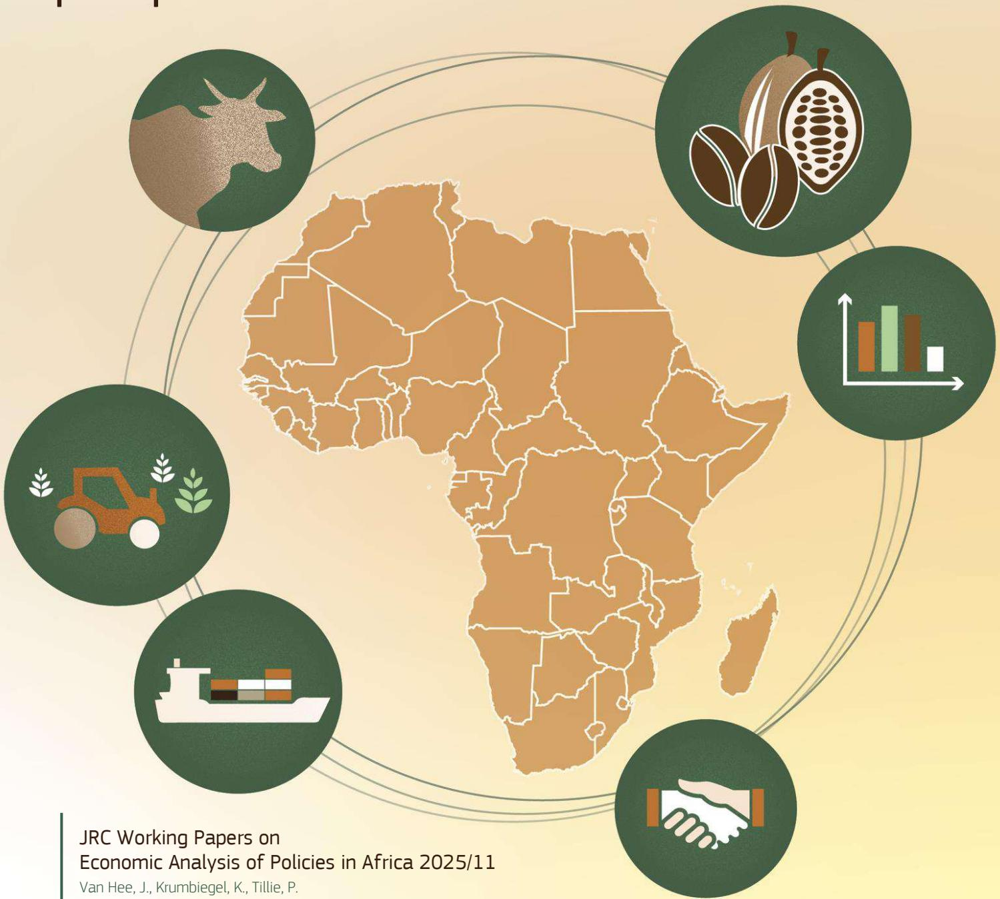

This document is a publication by the Joint Research Centre (JRC), the European Commission's science and knowledge service and the African Union. It aims to provide evidence-based scientific support to the European policymaking process. The contents of this publication do not necessarily reflect the position or opinion of the European Commission. Neither the European Commission nor any person acting on behalf of the Commission is responsible for the use that might be made of this publication. For information on the methodology and quality underlying the data used in this publication for which the source is neither Eurostat nor other Commission services, users should contact the referenced source. The designations employed and the presentation of material on the maps do not imply the expression of any opinion whatsoever on the part of the European Union concerning the legal status of any country, territory, city or area or of its authorities, or concerning the delimitation of its frontiers or boundaries.

#### **Contact information**

Name: European Commission, Joint Research Centre, Directorate D – Sustainable Resources Address: Edificio Expo, c/ Inca Garcilaso 3, 41092 Seville, Spain Email: jrc-d4-secretariat@ec.europa.eu Tel.: +34 954488318

#### **The Joint Research Centre: EU Science Hub**

[https://joint-research-centre.ec.europa.eu](https://joint-research-centre.ec.europa.eu/) 

<https://datam.jrc.ec.europa.eu/datam/area/PANAP>

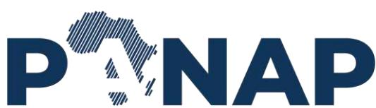

JRC142321

Brussels: European Commission, 2025

© European Union, 2025

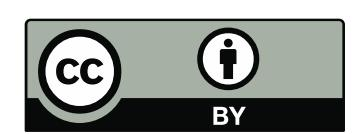

The reuse policy of the European Commission documents is implemented by the Commission Decision 2011/833/EU of 12 December 2011 on the reuse of Commission documents (OJ L 330, 14.12.2011, p. 39). Unless otherwise noted, the reuse of this document is authorised under the Creative Commons Attribution 4.0 International (CC BY 4.0) licence [\(https://creativecommons.org/licenses/by/4.0/\)](https://creativecommons.org/licenses/by/4.0/). This means that reuse is allowed provided appropriate credit is given and any changes are indicated.

How to cite this report: van Hee, J., Krumbiegel, K. and Tillie, P., *Intermediaries in the West-African cocoa sector: a buyer and producer perspective,* European Commission, Brussels, 2025, JRC142321.

# **Contents**

| I.    | Introduction .......................................................................................................................................................................................... 4     |
|-------|---------------------------------------------------------------------------------------------------------------------------------------------------------------------------------------------------------------|
| II.   | The cocoa value chain ................................................................................................................................................................... 5                   |
| A.    | Actors in the cocoa value chain in Côte d’Ivoire ......................................................................................................... 6                                                  |
| B.    | The Ghanaian cocoa value chain ........................................................................................................................................ 7                                     |
| III.  | Data & Methods ................................................................................................................................................................................ 9             |
| A.    | Sampling and data collection ............................................................................................................................................... 9                                |
| B.    | Classification of primary buyers ......................................................................................................................................... 9                                  |
| IV.   | Results & discussion .................................................................................................................................................................... 10                  |
| A.    | Profile of intermediaries ....................................................................................................................................................... 10                          |
|       | 1. Scale of operations .............................................................................................................................................................. 10                      |
|       | 2. Cooperatives ............................................................................................................................................................................ 11               |
| B.    | Understanding the Producer-Buyer Relationship .................................................................................................... 13                                                         |
|       | 1. What Drives Producers’ Choice of Primary Buyers ............................................................................................ 13                                                            |
|       | 2. Weighing scales ..................................................................................................................................................................... 15                   |
|       | 3. Prices received by producers .......................................................................................................................................... 16                                 |
|       | 4. Cocoa quality & price.......................................................................................................................................................... 20                         |
|       | 5. Input provisions by traders .............................................................................................................................................. 22                              |
| V.    | Conclusions ....................................................................................................................................................................................... 24        |
| VI.   | References ......................................................................................................................................................................................... 25       |
| VII.  | List of abbreviations .................................................................................................................................................................... 29                 |
| VIII. | List of figures .................................................................................................................................................................................. 30         |
| IX.   | List of tables .................................................................................................................................................................................... 31        |
| X.    | Annex .................................................................................................................................................................................................... 32 |

## **Abstract**

This study investigates the underexplored role of intermediaries within the cocoa value chains of CÙte d'Ivoire and Ghana, utilizing a novel dataset comprising data from 1,071 cocoa producers and 293 buyers. While previous research has primarily focused on small-scale farmers, this study shifts attention to the dynamics involving primary buyers—pisteurs, cooperatives, cooperative delegates, and purchasing clerks—and their interactions with producers. Our findings reveal that the producercooperative relationship can be considered the strongest among various buyer types, characterized by long-term contracts and high trust levels, particularly during weighing and pricing of cocoa. In contrast, pisteurs and purchasing clerks maintain more flexible yet less stable relationships, with competition driven by service provision rather than price due to government-set farmgate prices. Despite 83% of producers striving to improve cocoa quality, there is a lack of monetary incentives at the farm level. Approx. 97% of buyers report that quality does not influence pricing. As the EU Due Diligence Regulation and EU Deforestation Regulation are put in place, buyers will play a more important role in formalizing the cocoa value chain and enhancing its transparency. Their role could significantly influence the implementation of traceability and legal compliance, aligning local practices with global standards and fostering more economically sustainable and equitable trade in the cocoa industry.

## **Authors**

| Van Hee, Jens         | Leibniz Centre for Agricultural Landscape Research (ZALF), M¸ncheberg, |
|-----------------------|------------------------------------------------------------------------|
| Krumbiegel, Katharina | European Commission, Joint Research Centre (JRC), Seville, Spain       |
| Tillie, Pascal        | European Commission, Joint Research Centre (JRC), Seville, Spain       |

#### **I. Introduction**

The world's cocoa production is concentrated in West Africa, predominantly in Ghana and Côte d'Ivoire, which together produce up to 61% of all cocoa beans (FAOSTAT, 2021). Both countries are economically reliant on the export of cocoa beans, with cocoa contributing 15% to the GDP of CÙte d'Ivoire and over 10% to Ghana's GDP in 2021 (Cocoa & Forests Initiative, 2022; COCOBOD, 2021). Despite employing millions of smallholder farmers and benefiting many more, the cocoa sector has faced significant criticism for failing to address pervasive socio-economic and environmental challenges. These include high poverty levels among producers (Ingram et al., 2017; Waarts et al., 2019), exploitive child labour practices (Sadhu et al., 2020; LeBaron and Gore, 2019), and environmental harm caused by unsustainable practices and deforestation (Wessel & Quist-Wessel, 2015). Expansionist approaches have been the norm where forests are cleared to establish new plantations to exploit the forest's natural soil fertility (Ruf, 2018; Ruf & Schroth, 2004).

In CÙte d'Ivoire, agricultural land use change has accounted for 62% of the historical deforestation, of which 38% has been attributed to the creation of new cocoa plantations (BNETD, 2016). Today, only 2.7 million ha of pristine forest in Côte d'Ivoire remain, down from the 15.8 million ha in 1960 – one of the highest deforestation rates in West Africa in recent decades (Cocoa & Forests Initiative, 2022; Dieng & Karsenty, 2023; Ongolo et al., 2018). In Ghana, a similar trend has taken place, where 13% of deforestation is linked to cocoa farming (Kalischek et al., 2023). Despite a pledge made in 2017 under The Cocoa & Forest Initiative to achieve a deforestation-free supply chain, cocoa continues to put pressure on both countries' remaining forests. The on-going deforestation in Côte d'Ivoire especially on the western frontier is also illustrated in Figure 1, adapted

from TRASE.

As the world's largest importer of raw cocoa with over 60% of global imports, the European Union (EU) has recently addressed the issue of cocoa-driven deforestation by issuing the EU Deforestation Regulation (EUDR). Under this regulation, the traceability and legality of cocoa – as one of the seven tropical commodities covered by the EUDR – will be a prerequisite for maintaining market access in Europe. Consequently, companies importing cocoa into the EU must provide verifiable information about the origin of the beans and ensure they are not sourced from recently deforested land (European Commission, 2023). To achieve this, a robust traceability system is needed, capable of tracking the cocoa beans from their origin at the producer level to the exporter, ensuring transparency throughout all stages of the value chain. Currently, the level of traceability of cocoa beans is considered rather low in both countries. For example, Renier et al. (2022) estimate that approximately 55% of cocoa is untraced in Côte d'Ivoire. This has large implications on the country's preparedness for the EUDR.

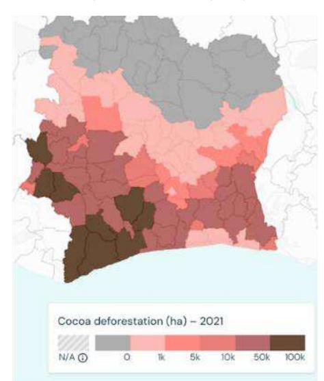

Achieving full traceability, however, is challenging, particularly in complex value chains involving numerous stakeholders. Similar to other tropical commodities, the cocoa value chain is characterized by an hour-glass shaped structure, where a large number of smallholder producers supply their cocoa to a handful of multinational trading companies. They in turn supply a vast number of confectionaries and consumers (Gilbert, 2024). Along this value chain, beans

*Source: Authors' own elaboration, adapted from TRASE ©.*

*Figure 1. Cocoa-driven deforestation in CÙte d'Ivoire, represented by the total area of cocoa in 2021 that overlaps with the loss in undisturbed forest over a 15-year period.*

from various producers are mixed and blended, passing through a series of formal and informal trading channels. Local intermediaries, traders and primary buyers play an important yet often overlooked role in linking producers to the market. They are responsible for collecting, storing, sorting and re-packaging cocoa beans from numerous smallholder farms before selling them (Gaia Cacao, 2021). During this process, they can fulfil various roles, from enforcing sustainability standards (Grabs et al., 2024; Grabs & Carodenuto, 2021) and ensuring quality control to providing producers with credits for purchasing farm inputs (Vigneri & Santos, 2007) and implementing post-harvest activities (SaÔdou et al., 2021). These intermediaries represent a diverse group, with different levels of organisation and operational methods (Grabs et al., 2024). At the same time, they are often criticized for exploiting power imbalances in the value chain. The lack of information and market transparency provides them with leverage over smallholder farmers, who remain dependent on these primary buyers. Shedding light on the characteristics of these intermediaries, their operations and their relationships with farmers is essential to determine opportunities for sectoral support within an important value chain.

To this end, this study aims to identify and categorize different buyers, local intermediaries and traders in the cocoa value chains of Ghana and Côte d'Ivoire, employing a dataset of producers and buyers from the 2018-2019 growing season. The report is organized in the following way. First, we characterize intermediaries according to their scale of operation - grouping them into three different buyer categories for Côte d'Ivoire (cooperatives, pisteurs and delegates of the cooperative) and one for Ghana (purchasing clerks). Second, we explore the producer-buyer relationship in terms of selection criteria as well as trust and stability of the relationship. We also assess key factors such as the details of the weighing process, the price determination and cocoa quality requirements. Data from both traders and producers allows us to explore the relationship from two perspectives.

## **II. The cocoa value chain**

While the cocoa value chain is structured differently in Côte d'Ivoire and Ghana, the government's involvement in regulatory roles is significant in both countries. In Côte d'Ivoire, the regulatory body is the Conseil CafÈ Cacao (CCC), while in Ghana it is COCOBOD. Their active involvement in the supply chain has historical roots and is linked to the substantial contribution of cocoa to the GDP (Bastide & Perret, 2007). In Côte d'Ivoire, the CCC sets seasonal farmgate prices, and is involved in negotiating forward contracts with international buyers (Staritz et al., 2023). However, it does not directly participate in the physical purchasing or exporting process. During the main season of 2018-2019 season, the CCC set the farmgate price of cocoa at 750 CFA per kilogram (ICCO, 2018) – approx. 1.30 USD per kilogram in Nov. 2018.

In Ghana, COCOBOD plays a direct role as the final buyer of cocoa before export. Through its subsidiary, the Cocoa Marketing Company (CMC), it purchases the entire cocoa production and subsequently sells it to exporting firms (COCOBOD, 2019). As in Côte d'Ivoire, the farmgate price is determined in advance and was set at 7.6 GHS per kilogram for the 2018-2019 main season – approx. 1.55 USD per kilogram in Nov. 2018. To ensure price stability for cocoa producers, both countries have set up a stabilisation fund, from which farmers are compensated when prices are low and which is replenished when world market prices are high (Laven et al., 2016; Malan, 2013).

In addition, COCOBOD ensures quality control through its Quality Control Division (QCD), which checks, grades, bags and uniquely seals the cocoa beans, before they are passed on to collection depots (Vigneri & Santos, 2007; COCOBOD, 2019). In general, this seems to be an effective strategy, as beans originating from Ghana can generally receive a quality premium payment on the international market (Gaia Cacao, 2021).

# **A. Actors in the cocoa value chain in Côte d'Ivoire**

*Figure 2. Cocoa value chain in CÙte d'Ivoire.* 

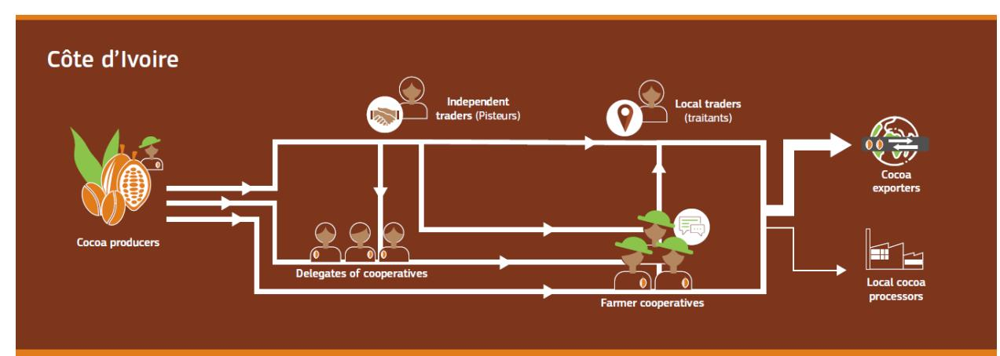

Due to the different governance structures in Ghana and Côte d'Ivoire, various types of intermediaries operate within the cocoa value chain. In Côte d'Ivoire, cooperatives are officially licensed by the government, although unlicensed cooperatives exist as well. In line with the Uniform Act on the right of cooperative societies (AUSCOOP) as stipulated by the Organisation for the harmonisation of business laws in Africa (OHADA), the government differentiates between two types of cooperatives. The COOP CA is a cooperative with a Board of Directors meanwhile the COOP simplifiÈ does not consist of any internal bodies. Official information varies greatly when it comes to the number of cocoa cooperatives in the country. According to a recent report by the International Cocoa Organisation (2023), nearly 4000 cooperatives operate in Côte d'Ivoire, handling approximately 15-20% of cocoa production. Bymolt et al. (2018) cite only around 1500 registered cooperatives and note that many function poorly (Oomes, et al., 2016). Estimates of the share of farmers belonging to a cooperative vary as well, ranging from 21% (Bymolt et al., 2018), to 30-40 % (Kouassi, 2023) to about half of the producers, according to the CCC (ICCO, 2021; Gaia Cacao, 2021). In Côte d'Ivoire, cooperatives are also known to operate so-called "cooperative sections", which buy cocoa on behalf of cooperatives and exist in most villages and informal "campements" (Nitidae and EFI, 2021). These sections are run by so-called delegates who receive official accreditation by the CCC (ICCO, 2023).

In general, cooperatives are acknowledged to play a key role in the rural space in consolidating producers, collecting beans and in the implementation of recent sustainability developments. For example, Fairtrade certification is granted predominantly through cooperatives to ensure compliance with its standards (Sellare, 2022). Nonetheless, many shortcomings have been identified when it comes to cocoa cooperatives in Côte d'Ivoire – also due to their historical development. In the 2000s, the expansion of certification schemes, supported by the cocoa industry, aimed to align cocoa production with socio-economic and environmental sustainability objectives. These schemes primarily collaborate with cooperatives, channelling premiums for certified cocoa through them. As a result, the number of cooperatives has significantly increased, many of which were established by pisteurs and traitants rather than by farmer groups themselves (Ruf et al., 2018). This dynamic raises important

*Source: Authors' own elaboration.*

questions about the extent to which existing cooperative rules and regulations are effectively followed, particularly regarding the principles of ownership and self-determination among producers.

Due to this history, cooperatives in Côte d'Ivoire are often criticised for their lack of managerial capabilities, marketing knowledge, funds and adequate infrastructure. To be able to buy cocoa from its members, cooperatives need access to capital and loans. This means that side-selling is common practice amongst cocoa farmers. Cooperative members do not necessarily sell their cocoa to the cooperatives who can often only start purchasing cocoa after the start of the trading season due to insufficient funds (Nitidae and EFI, 2021). Cooperative sections also sell their cocoa onwards to other traders and wholesalers if payment of their cooperative is delayed or the offered certification premium is low. To be able to fulfil their own cocoa contracts, cooperatives in turn are required to buy additional cocoa from other trader and intermediaries such as pisteurs (Nitidae and EFI, 2021).

'Pisteurs' are independent traders who buy for themselves or on behalf of other traders (Zu Ermgassen et al., 2022). The majority of producers in Côte d'Ivoire sell their cocoa to pisteurs (approx. 60%), which either collect cocoa at the farm, in the village or receive cocoa at their warehouse/ depot (Bensch et al., 2022). Their reputation is less favourable as they operate with limited regulation and are said to engage in more fraudulent practices. Finally, local traders or 'traitants' buy cocoa beans from producers or pisteurs and sell them either to other traitants or directly to exporters.

## **B. The Ghanaian cocoa value chain**

*Figure 3. Cocoa value chain in Ghana.* 

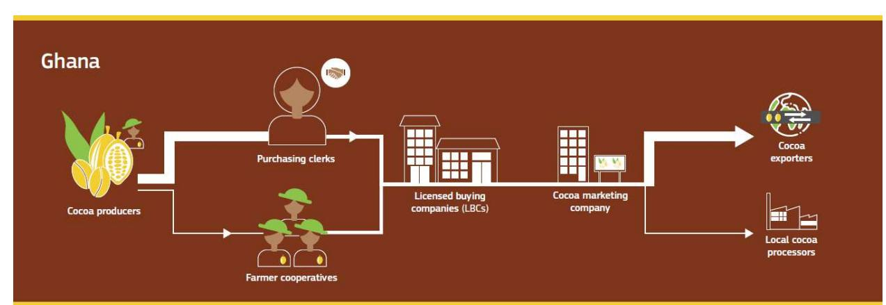

In Ghana on the other hand, fewer intermediaries operate between producers and exporters. Cooperatives play a less significant role, especially in the buying of beans, and only 11-15% of the producers are estimated to be affiliated with a cooperative or farmer's association (Bymolt et al., 2018). Instead, the system is more centralized through 'Licensed Buying Companies' (LBC's), private companies that are responsible for the collection of cocoa beans nationwide. The LBC system emerged following the market liberalization in the 1990s in Ghana, which ended the Ghanaian government's control over cocoa trade via the state-owned Produce Buying Company (PBC) (COCOBOD, 2019). Today, the PBC is one of approximately 40 LBC's, alongside those established by multinational companies such as AgroEcom (*AgroEcom Ghana Limited*) or Olam (*Olam Ghana Limited*) (Ollendorf et al., 2023; Nitidae and EFI, 2021).

LBC's are supplied by so-called purchasing clerks, who collect cocoa beans from cocoa producing communities (Baah et al., 2012; Ollendorf et al., 2023). Purchasing clerks are either employed through

*Source: Authors' own elaboration.*

a written contract or more informal arrangement (Vigneri & Santos, 2007). If not employed, they typically earn a share of the value of the cocoa beans they collect or a fixed commission rate. Similar to pisteurs, purchasing clerks are viewed negatively, with reports suggesting unethical practices such as scale manipulation, under-invoicing, cheating on bonus payments and pressures on farmers to mortgage their farms (Baah et al., 2012).

Despite the prevalence of the LBC system, the Ghanaian government has made efforts to promote the creation of producer-led cooperatives with state support. In the 1930s, the formation of cooperatives was encouraged to ensure the production of high-quality cocoa for the export market. Further, the objective was for cooperatives to utilize their improved bargaining power to receive better prices. Again, in the 1970s, for example, the Department of Agriculture actively encouraged the formation of cooperatives as a means of ensuring cocoa quality (Fold and Neilson, 2016). The Cooperative Law has been in place since 1968, organizing the cooperative system into a three-tier structure from the community to the national level. At the level of community or sub-community level, they are called primary cooperative societies, which form unions at the district or regional level. The so-called Department of Cooperatives (DoC) has the sole mandate to register cooperatives in the country. It is estimated that there are currently between 70 to 110 cocoa cooperative unions operating in Ghana with more than 3000 cooperatives at community level (COCOBOD, 2025). Yet, many are considered inactive. A notable exception is Kuapa Kooko, a cooperative with around 45,000 members and one of the major LBCs with a market share of approximately 5% (Nitidae and EFI, 2021). Nonetheless, many farmers belong to informal producer groups, which are often set up by LBCs to provide support, training or inputs to producers (Donkor et al., 2023).

While the main role of intermediaries and primary buyers is to buy, collect and re-sell cocoa along the value chain, they have often taken up additional roles. Particularly in a context of imperfect credit, sales and input markets and limited farmer support, local traders often provide services otherwise unavailable. They supply producers with farm inputs, such as fertilizer and insecticides (Bymolt et al., 2018) and they relay information on sustainability requirements (Grabs et al., 2024) and Good Agricultural Practices (Krumbiegel & Tillie, 2024). Often, they are the first to advise farmers on quality standards, conducting quality checks to ensure compliance with government regulations and export requirements, such as humidity levels and proper post-harvest handling (SaÔdou et al., 2021). They also play a critical role in providing loans to producers. Given that cocoa is a seasonal crop, and most producers face cash shortages in the months leading up to the harvest, traders offer loans or extend credit based on the producer's future harvest (Sellare et al., 2023).

However, by serving as entry point to the global market, traders hold significant power over producers (Grabs & Carodenuto, 2021). Although primary buyers in Ghana and Côte d'Ivoire are obliged to pay a fixed farmgate price (Gaia Cacao, 2021), there have been many indications that this price is not consistently paid to the farmer. Common issues include the use of fraudulent weighing scales that underreport the weight of beans or the incorrect documentation of the volume of beans. As many producers are illiterate, they have limited ability to contest or control these transactions. However, it has been suggested that traders incur real costs associated with the services they provide, such as transportation costs, and therefore seek compensation through other means – including unethical ones. Additionally, traders themselves may be exploited by their employers, which forces them to pass on these costs to producers (Baah et al., 2012).

## **III. Data & Methods**

#### **A. Sampling and data collection**

We use survey data collected in 2019/ 2020 from 1,747 cocoa-producing households in Côte d'Ivoire and Ghana, by the Centre Ivoirien de Recherche …conomique et Sociale (CIRES). The dataset is nationally representative of cocoa producers in both countries. A two-stage random sampling approach was employed to select the sample. First, villages were randomly chosen based on census information within cocoa-growing regions and comprehensive lists of cocoa producers were compiled in the selected villages. Approximately 15 producers were then randomly selected for interviews in each village. The survey collected detailed information on various aspects of the cocoafarming household, including cocoa productivity, the quantity and types of secondary crops, off-farm activities,

household characteristics, and sales relationships with buyers. As part of the survey, producers were asked to identify their buyers, who were subsequently interviewed at the village level. Around two to three buyers per village were interviewed in 108 villages in Côte d'Ivoire and in 48 villages in Ghana. Figure 4 provides an overview of the interviews that took place with buyers and traders across the two countries. Further, a detailed list of interviews implemented with primary buyers per district in Ghana and Côte d'Ivoire can be found in Table 15 in the Annex. Unfortunately, not all the traders identified by producers were available or able to be interviewed. As a result, the final dataset includes 1,071 producer households linked to 293 buyers. Specifically, the dataset comprises 327 producers and 120 buyers in Ghana, and 744 producers and 173 buyers in CÙte d'Ivoire, as detailed in Table 1.

#### **B. Classification of primary buyers**

We classify primary buyers into three categories in Côte d'Ivoire: (1) cooperatives, (2) delegates of cooperatives, (3) pisteurs and one category in Ghana: (4) purchasing clerks. A small "other" category captures intermediaries whose functions are either unknown or represent a minor share within the value chain. Due to the very small sample size in the "other" category, we do not report findings from this group and instead focus on the four primary categories identified in our sample.

*Figure 4. Interview locations with primary buyers, based on GPS records.*

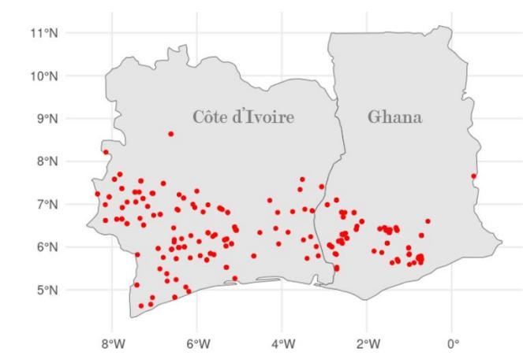

*Source: Authors' own elaboration, based on EU-JRC 2019b.*

**Table 1.** Different categories of primary buyers in Côte d'Ivoire and Ghana.

|              | CÙte Cooperative | d’Ivoire Cooperative Delegate | Pisteur | Others | Ghana Purchasing Clerk | Total Others |
|--------------|------------------|-------------------------------|---------|--------|------------------------|--------------|
| No of buyers | 47               | 52                            | 67      | 7      | 116                    | 4            |
| Share (%)    | 27.17            | 30.06                         | 38.73   | 4.05   | 96.67                  | 3.33         |
|              | 165              | 182                           | 392     | 5      | 318                    | 9            |
| Share (%)    | 22.18            | 24.46                         | 52.69   | 0.67   | 97.25                  | 2.75         |

As Table 1 shows, there are altogether 47 cooperatives within our dataset, both registered cooperatives (n = 42) and unregistered cooperatives (n = 5). Delegates of cooperatives are categorized separately as a distinct group (n = 52) since they operate so-called "cooperative sections". While they buy cocoa on behalf of the cooperative, they often work autonomously to a certain extent. Different types of pisteurs are aggregated under the category "pisteur" (n = 67), without distinguishing between 'independent' and 'dependent' pisteurs. Pisteurs who either buy for themselves ('independent') or on behalf of other traders ('dependent') can have a multitude of arrangements with other stakeholders within the value chain. As anticipated, purchasing clerks (n = 116) who buy cocoa for Licensed Buying Companies (LBCs) are the dominant type of primary buyer in Ghana. Table 16 in the Annex shows a more detailed overview of the types of interviewed buyers and traders.

## **IV. Results & discussion**

## **A. Profile of intermediaries**

To have a better understanding of the different types of intermediaries, we assessed their scale of operations, including the number of producers they bought cocoa from, the volume bought across the different low and high seasons in 2018-2019 as well as some organizational characteristics.

## **1. Scale of operations**

Table 2 illustrates the scale of operations along the four categories of primary buyers. Cooperatives purchased cocoa from a substantial number of producers, averaging 391 per cooperative, resulting in an overall large trading volume of around 1200 tons of beans during the 2018-2019 season. About half of the cooperatives interviewed reported purchasing cocoa directly from producers while the other half relied on intermediaries. Cooperatives typically operate multiple depots where cocoa is stored before being transported to larger warehouses.

Cooperative delegates procured cocoa from an average of 73 producers for their cooperative sections during the main season, which spanned from October 2018 to March 2019. Most delegates sourced cocoa directly from producers (n = 43), with a smaller number purchasing through other intermediaries (n = 9). Compared to pisteurs, delegates were able to source from a larger number of producers, although the average volume purchased per producer was smaller. The majority of pisteurs, primarily

*Source: Authors' own elaboration, based on EU-JRC 2019b.*

independent buyers, bought cocoa directly from producers and resold it either to cooperatives or to other traders. While pisteurs sourced from a smaller number of producers compared to cooperative delegates, they covered a larger geographical area, averaging over four communities.

To assess the stability of work opportunities in cocoa trading, we inquired about the duration of respondents' current roles, including their onward selling arrangements. On average, pisteurs have been active in their current position for approximately 4.5 years, the shortest duration among all buyer types. This may be attributed to the more flexible arrangements and less stable relationships they maintain with stakeholders along the value chain.

In Ghana, purchasing clerks tend to maintain more long-term relationships with the LBCs they supply. On average, they report having worked with their respective LBC for approximately seven years. Around 60% of the interviewed purchasing clerks indicated that they operate under a buying license issued by COCOBOD. This licence is not always required however, especially for those purchasing clerks directly employed by a LBC. The total volume of cocoa sourced by purchasing clerks was, by far, the lowest among the buyer categories in our sample, averaging only 22 tons in total during the 2018-2019 season, or 0.68 tons per producer. This suggests that purchasing clerks operate in a more targeted manner, focusing on fewer communities but sourcing from a relatively higher proportion of producers. Generally, LBCs may engage a larger number of purchasing clerks to source cocoa on their behalf.

**Table 2.** Scale of operations, as reported by primary buyers**.** 

|                                             | Côte d'Ivoire     | Cooperative Delegate | Pisteur       | Ghana            |
|---------------------------------------------|-------------------|----------------------|---------------|------------------|
|                                             | Cooperative       | NA                   | Pisteur       | Purchasing Clerk |
| No of producers from which cocoa is sourced | 391.11 (320.99)   | 72.94 (59.06)        | 45.93 (33.12) | 49.5 (41.35)     |
| No of communities                           | 5.45 (2.76)       | 3.52 (2.62)          | 4.15 (2.89)   | 1.62 (1.24)      |
| Av. producers per community                 | 94.09 (115.67)    | 32.05 (31.78)        | 17.24 (17.63) | 37.67 (34.72)    |
| No of collection depots                     | 3.81 (2.74)       | NA                   | 1.24 (0.78)   | 1.59 (1.56)      |
| Volume bought in main season (tons)         | 917.44 (770.55)   | 61.30 (65.37)        | 66.08 (77.23) | 18.93 (14.02)    |
| Volume bought in low season (tons)          | 259.33 (228.80)   | 23.77 (25.48)        | 13.35 (15.89) | 4.85 (4.14)      |
| Total volume 2018-2019 (tons)               | 1215.35 (1055.07) | 86.11 (87.34)        | 76.33 (83.58) | 22.34 (14.88)    |
| Av. volume per producer (tons)              | 11.43 (42.67)     | 1.63 (2.56)          | 2.17 (3.14)   | 0.68 (0.56)      |
| Years active (in current position)          | 9.17              | 5.73 (4.77)          | 4.61 (3.72)   | 7.11 (7.03)      |
| n                                           | 47                | 52                   | 67            | 116              |

## **2. Cooperatives**

Our sample comprises 47 cooperatives, with average operational history of nine years and approximately 528 registered members. As presented in Table 2, cooperatives sourced cocoa from less producers than were officially registered with the cooperative. Indeed, not all cooperatives require their members to sell at least part of their cocoa to the cooperative. Therefore, some producers may prefer selling to alternative buyers if available. Given the historical context of cooperative formation in CÙte d'Ivoire, we wanted to elicit some background information on their establishment and therefore

*Source: Authors' own elaboration, based on EU-JRC 2019b. Standard deviations in parenthesis.*

included questions on the origins, functioning and management of the cooperative into the questionnaire. Notably, 77% of buyers interviewed report that their cooperative was founded by a former cocoa producer, while only around 11% indicated that traders or merchants were the initial founders. Some sources suggest that cooperatives have functioned more as vehicles or legal entities for traders to qualify for certification premiums, rather than serving their intended purpose of consolidating and representing cocoa producers (Kouassi, 2023; Ruf et al., 2019; Ruf et al., 2018). However, in our sample, this appears to be the case in only a minority of instances.

In terms of their organisational structure, the majority of cooperatives appeared to have an effective structure in place to ensure proper representation of producers. Most cooperatives had a board of directors responsible for coordinating sales throughout the year. Among those holding positions within the cooperative (such as the President, Director, Treasurer, etc.), 88% were reported to have been former cocoa producers before assuming their roles, and 71% were elected to their positions. Given the availability of a linked producer dataset, we also assess producers' knowledge regarding the establishment of their cooperative. Notably, more than half of the producers were unaware of whether their cooperative was founded by, or at the time of interview was managed by a former private buyer. Only around 10% indicated that this was the case, while 38% said it was not. In general, this corroborates the statements made by the cooperative representatives themselves.

The vast majority of cooperatives reported to have a board of directors in place with an average of 7 board members. Among most common functions mentioned were the Chairman of the Board of Directors1 (43), the Treasurer (43), Secretary General (41), Adjunct Chairman of the Board of Directors (35), Adjunct Secretary (28), Adjunct Treasurer (20), Director (16). Support staff were less common such as administration (14), accountant (4), adjunct administrator (4), and others, like advisor or driver.

**Table 3.** Descriptive statistics of cooperatives, as reported by primary buyers.

| Years active in 2019 (years)                                     | 9.17 (5.39)    |
|------------------------------------------------------------------|----------------|
| Age of members (years)                                           | 42.52 (8.73)   |
| No of registered members                                         | 528.4 (792.36) |
| Cooperative created by former cocoa producer (%)                 | 76.60          |
| Cooperative created by former intermediary (pisteur, trader) (%) | 10.64          |
| Board of directors (%)                                           | 89             |
| Average number of board members                                  | 7.07 (2.67)    |
| Membership fee charged (%)                                       | 70.21          |
| n                                                                | 47             |

To finance their management structure, many cooperatives charge a membership fee. In exchange, members are issued a membership code or passbook, which formalizes their relationship with the cooperative. This code or passbook entitles members to various services such as trainings, subsidized farm inputs as well as certification premiums – if available. It also records cocoa sales, facilitating traceability and ensuring transparency. However, only about half the cooperative members in our sample reported being formally registered with the cooperative and having a passbook or code. In addition, only about 32% of members paid a membership fee between 15,000 and 30,000 CFA. Regarding participation in cooperative governance, 42% of members indicated that they had attended a General Assembly Meeting in the past 12 months. Of those who attended, approximately 51% actively participated in decision-making by casting a vote. On average, members have been with their cooperative for more than four years, highlighting their relatively long-term involvement.

*Source: Authors' own elaboration, based on EU-JRC 2019b. Standard deviations in parenthesis.*

1 In Côte d'Ivoire, this refers to the Président du Conseil d'Administration (PCA).

**Table 4.** Descriptive statistics of cooperative membership, as reported by producers.

| Formally registered with the cooperative (%)      | 52.94       |
|---------------------------------------------------|-------------|
| Pays a membership fee (%)                         | 31.62       |
| Attended a General Assembly Meeting last year (%) | 41.91       |
| Voted during the assembly attendance (%)          | 50.88       |
| Specific role within the cooperative (%)          | 10.64       |
| Active cooperative membership (years)             | 4.13 (3.13) |
| n                                                 | 136         |

## **B. Understanding the Producer-Buyer Relationship**

# **1. What Drives Producers' Choice of Primary Buyers**

To better understand producers' expectations of their buyers, we asked them to identify the main reasons for selling to a specific trader (Figure 5). The most frequently cited reason, ranked as most important by 30% of producers, was the absence of payment delays. Given that cocoa farming is seasonal, with revenue typically generated only twice or, in some cases, once a year, producers often face cash shortages at the end of the season, which places significant pressure on their livelihoods. As a result, buyers who offer immediate payment upon sale are highly valued. This aligns with findings from Vigneri & Santos (2007) and Baah et al. (2012), who also report that the availability of cash is a key factor in cocoa producers' decisions about whom to sell to in Ghana.

Trust and confidence in the buyer were identified as the second most important factor (24%). This trust is often linked to honesty during the transaction, including weighing of beans, recording of volumes and fair pricing. The importance of trust was further emphasized by the stability of the relationship between producers and their buyers. As shown in Table 5, 77% of producers reported having a longterm relationship with their buyer, while 14% were in relatively stable, but newer relationships (less than two years). Only a small proportion of producers preferred to sell to pisteurs in CÙte d'Ivoire or purchasing clerks in Ghana for occasional, one-off transactions.

The third most important factor (20%) was the buyer's willingness to purchase all of the producer's cocoa, rather than just part of it. The latter may refer to buyers who only accept beans that meet certain quality standards, or to those who are constrained by cash availability and can only purchase as much as they can afford at the time. Alternatively, it could also reflect buyers who are focused on fulfilling their own purchasing quotas.

*Source: Authors' own elaboration, based on EU-JRC 2019a. Standard deviations in parenthesis.*

Farmgate prices are fixed in Ghana and Côte d'Ivoire, ensuring uniform pricing for all producers. As a result, traders are unable to offer price differences. However, additional pricing incentives may be provided through certification schemes, with bonus payments either paid at the time of sale or occasionally

throughout the year. About 10% of producers ranked the price as the main driver for selecting their buyer. Other factors influencing producers' decisions to sell to a particular trader included transport support, the ability to receive inputs on credit, and the lack of alternative buyers. In comparison, Vigneri & Santos (2007) highlight the importance of inputs for cocoa farmers and their dependence on buyers for access to these inputs. Their study may be somewhat outdated however and the input market has potentially evolved, leading to greater accessibility and affordability of inputs for producers.

In addition to examining producers' trading preferences, we aim to understand the actual stability and formalization of the relationships between producers and traders. Table 5 highlights how easily producers can switch buyers. Producers linked to cooperatives, whether selling directly to them or through a delegate, perceived it as the most difficult to change their buyer. This may be due to the higher proportion of stable relationships typically associated with cooperative membership, which is designed to foster long-term, stable ties. In contrast, in Ghana, producers found it relatively easy to change the purchasing clerk they sell to, with the vast majority (81%) indicating that switching buyers was not difficult.

The ease with which producers can change buyers is influenced by various factors, including the availability of alternative buyers, and the number of intermediaries visiting the village. The presence and number of alternative buyers provide producers with the opportunity to switch buyers, thereby granting them bargaining power. Overall, only 35% of producers indicated having no alternative buyer in their area. Notably, producers selling their cocoa to pisteurs in CÙte d'Ivoire faced a greater challenge, with 45% reporting a lack of alternative buyers. This is plausible since pisteurs are often considered more mobile operating in potentially remote areas, where other traders are less present (Bymolt et al., 2018). In contrast, in Ghana, the majority of farmers (75%) had multiple buyers to choose from, with an average of 4.51 buyers per village.

Another factor influencing the ease with which producers can change buyers is the type of contractual arrangement they have in place. Our data shows that contracts are relatively uncommon in the cocoa sector, with 75% of producers not having had any formal agreement with their primary buyer. Among those who did have agreements, oral contracts (17%) were more prevalent than written ones (7%). A closer look at the different buyer groups reveals that only producers working with cooperatives (24%) or cooperative delegates (16%) typically had written contracts. In this context, the membership code or

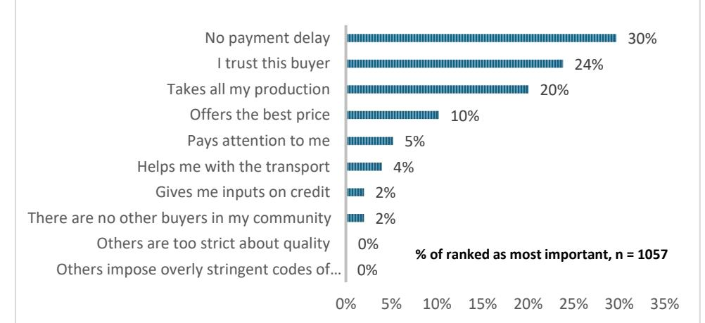

# **REASONS TO SELL TO A TRADER**

*Figure 5. Motivation for trader choice, as reported by producers – ranked in order of importance.*

*Source: Authors' own elaboration, based on EU-JRC 2019a.*

passbook, previously mentioned, can be considered a form of contract, as it formalizes the relationship between cooperatives and their members. In contrast, purchasing clerks (21%) and pisteurs (17%) more often relied on oral contracts.

**Table 5.** The producer-trader relationship, as reported by producers (%).

|                                                        | Côte d’Ivoire Cooperative | Cooperative Delegate | Pisteur | Ghana Purchasing Clerk | Total |
|--------------------------------------------------------|---------------------------|----------------------|---------|------------------------|-------|
| Stable relation (>2 years) Stable, but recent relation | 79.39                     | 85.71                | 70.13   | 77.81                  | 77.11 |
| (<2 years)                                             | 16.36                     | 10.44                | 18.55   | 11.99                  | 14.38 |
| Occasional buyer                                       | 4.24                      | 1.65                 | 9.43    | 9.95                   | 7.47  |
| Easy to change buyers                                  | 39.39                     | 40.66                | 46.94   | 80.50                  | 54,78 |
| Neutral                                                | 38.18                     | 31.32                | 35.71   | 9.75                   | 27,53 |
| Difficult to change buyers Type of contract            | 22.42                     | 28.02                | 17.35   | 9.75                   | 17,69 |
| Written contract                                       | 23.64                     | 15.93                | 0.00    | 1.79                   | 7.10  |
| Oral contract                                          | 12.73                     | 17.03                | 21.07   | 16.58                  | 17.41 |
| No particular contract                                 | 63.64                     | 66.48                | 78.62   | 81.63                  | 75.31 |
| No                                                     | 38.18                     | 31.87                | 44.64   | 24.53                  | 35.38 |
| Yes                                                    | 61.82                     | 68.13                | 55.36   | 75.47                  | 64.62 |
| n                                                      | 165                       | 182                  | 392     | 318                    | 1,057 |

# **2. Weighing scales**

According to some reports, traders frequently cheat during the weighing process of cocoa by tampering with the scales or during the recording of the bean weight (Baah et al., 2012; Bakang et al., 2021; Vigneri & Santos, 2007). Measuring the level of fraud through a survey is challenging however, as directly targeted questions are unlikely to lead to truthful results. Indirectly, however, some information could be obtained by inquiring about the types of scales used, their ownership status, and by asking the producers about the level of trust towards their buyer during the weighing process.

In our sample, Ghana and Côte d'Ivoire had different dominant weighing systems (Table 6). In Ghana, the weighing of the beans was most often done using a 'Roman' type of scale, which uses counterweights (83%), while in Côte d'Ivoire, most of the scales read electronically (74%). Scales that use a needle and spring were very rarely observed. Both scales are relatively easy to cheat with, either by modifying the counterweight or by tampering with the calibration in case of an electronic scale. It can therefore be assumed that the person, who owns the scale and weight, also holds authority over the weighing process. According to the producer data, this was most likely to be the buyer (94%), rather than the producers themselves (3%) or the village (3%). In addition, it is possible for fraud to occur during the recording of the bean weight, as most producers are illiterate, or during the payment of the bonuses in the context of certification schemes (Baah et al., 2012).

*Source: Authors' own elaboration, based on EU-JRC 2019a.* 

**Table 6.** Type of scale used, as reported by primary buyers (%)**.** 

|                        | Côte d’Ivoire | Ghana | Total |
|------------------------|---------------|-------|-------|
| Roman (counterweights) | 20.23         | 83.33 | 46.08 |
| Electronic             | 73.99         | 15.83 | 50.17 |
| Needle                 | 0.58          | 0.00  | 0.34  |
| NA                     | 5.20          | 0.83  | 3.41  |
| n                      | 173           | 120   | 293   |

Producers generally exhibit a high level of confidence in the weighing process employed by their buyers. On average, only 11% of the surveyed producers expressed their mistrust. This share was

considerably higher for pisteurs in CÙte d'Ivoire, where 21% of the producers expressed mistrust towards the weighing process. This discrepancy may be attributable to less stable producer-buyer relationships, where producers are more likely In contrast, cooperative members appeared to have a more favourable perception, with only approximately 2% of the producers noting to have mistrust in the weighing process.

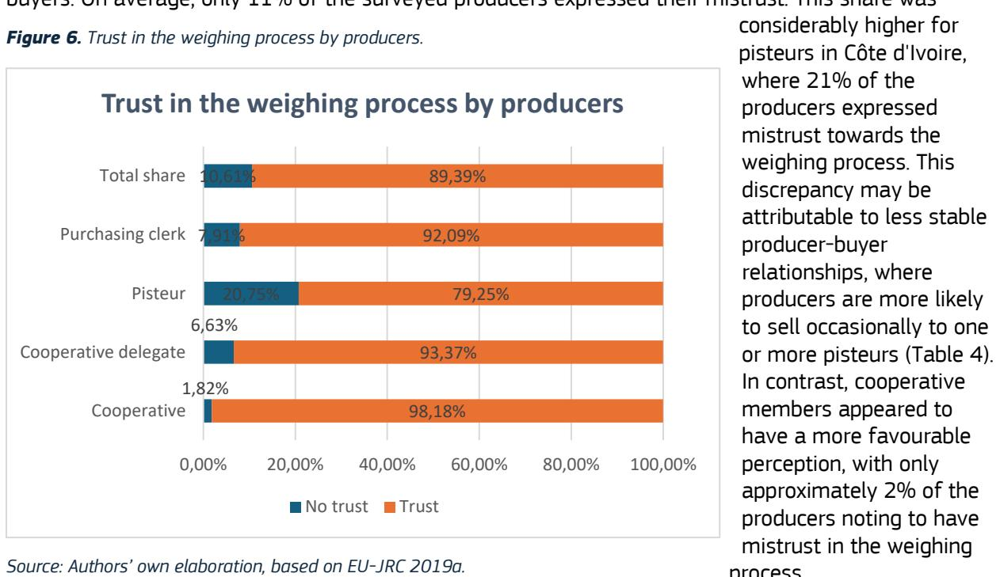

In conclusion, while direct evidence of fraud in the cocoa weighing process is difficult to obtain, the varying systems of weighing in Ghana and CÙte d'Ivoire, coupled with the dominant role of buyers in controlling the scales, suggest that the potential for manipulation remains significant.

## **3. Prices received by producers**

As previously noted, the farmgate price is set by the government in both CÙte d'Ivoire and Ghana at the beginning of each season and is applied nationwide. In theory, this ensures that all producers receive the same price for their cocoa. For the 2018-2019 season, the farmgate price was set at 750 CFA per kilogram in CÙte d'Ivoire and 7.6 GHS per kilogram in Ghana (ICCO, 2018; COCOBOD, 2019). In interviews with traders, this official price was commonly referenced as the price paid to producers. However, during producer interviews, the reported prices were generally lower than the official rates. In CÙte d'Ivoire, the average reported price was 737 CFA per kilogram, and in Ghana, it was 7.53 GHS per kilogram (Table 7). This suggests that, despite the existence of a set farmgate price, it is not consistently paid to all farmers, and on average, producers receive slightly lower prices than the official rates.

*Source: Authors' own elaboration, based on EU-JRC 2019b.* 

**Table 7.** Average farmgate price per kg of beans received during the main season 2018-2019, as reported by producers.

Comparing reported prices across the different buyer categories, we see that producers selling to cooperatives and cooperative delegates were more likely to receive the correct farmgate price per kilogram of beans (Figure 7). Approximately 91% of producers selling to cooperatives and 85% selling to cooperative delegates reported to receive the official farmgate price. This suggests that cooperatives are more committed to adhering to government regulations and maintaining transparent

pricing structures. At the same time, cooperatives often operate at a larger scale and are potentially more closely monitored than

independent traders.

In contrast, nearly a quarter of producers selling to pisteurs reported receiving prices below the official rate. This discrepancy is even more pronounced among purchasing clerks in Ghana. Nearly 50% of producers there reported receiving prices below the official

farmgate price, while only 40% reported the official price. Interestingly, about 11% of producers stated receiving prices higher than the official rate. These inconsistencies between reported and official prices are surprising, particularly given the fixed nature of farmgate prices in the market. This raises questions about the dynamics between buyers and producers and the level of enforcement of official pricing policies.

To investigate this further, the price reported by the trader and the producer is compared case-by-case. This shows that in every buyer category, there is a discrepancy between the price reported by the buyer and the producer (Figure 8). For cooperatives and cooperative delegates this share is 9% and 15% respectively. This relatively low percentage might be explained by the fact that cooperatives ensure fairer purchasing practices and involve farmers directly. On the other hand, up to 21% of pisteurs pay less than indicated by their producers, as do around 29% of the purchasing clerks in Ghana. As for the latter, reports indicate that fraud at the level of the purchasing clerks is institutionalized (Baah et al.,

|   | Côte d'Ivoire           | Cooperative Delegate | Pisteur    | Ghana      | Country average | Official price |     |
|---|-------------------------|----------------------|------------|------------|-----------------|----------------|-----|
|   |                         |                      |            |            |                 |                |     |
|   | Côte d'Ivoire (CFA/ kg) | 745 (15.5)           | 742 (32.6) | 732 (45.2) |                 | 737 (37.9)     | 750 |
|   | Ghana (GHS/ kg)         |                      |            |            | 7.53 (0.30)     | 7.53 (0.30)    | 7.6 |
| n | 165                     | 182                  | 392        | 318        | 1,057           |                |     |

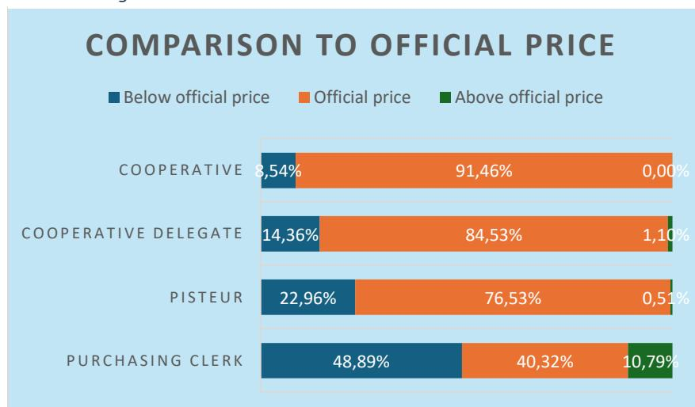

*Source: Authors' own elaboration, based on EU-JRC 2019a, COCOBOD 2019, ICCO 2018. Standard deviations in parenthesis.*

*Figure 7. Comparison between official and reported farmgate price per kg/ beans received during main season 2018/ 2019.*

*Source: Authors' own elaboration, based on EU-JRC 2019a, COCOBOD 2019, ICCO 2018.* 

2012). Yet, in Ghana, the high amount producers (27%) that reported a higher price than their buyer leads us to believe that there may be confusion or misinformation about the official farmgate price. One possible explanation is that in some cases, a quality or certification premium was included in the reported price, whilst it was specifically asked without this premium. In general, prices align better in Côte d'Ivoire than they do in Ghana.

> Regardless, when asked directly about the fairness of the prices paid by the middlemen, producers seemed to be trustful in the majority of the cases (Table 15 in the Annex). More than 94% perceived the price paid to be fair, while only 6% indicated that they received an unfair price for their cocoa beans. This share of mistrust seems to be higher for those having sold to purchasing clerks (11%) and lower for cooperative

members or delegates, where respectively only 2% of the respondents perceived the price to be unfair. Besides receiving the correct farmgate price, receiving the payment on time is an important criterion in the producer-buyer relationship, as was indicated in Figure 5. The timing of payment varied across the different groups of traders (Table 8). Purchasing clerks predominantly paid immediately, with over 91% of their producers indicating to having been paid directly and 7% within a week. As primary buyers are to pay an official farmgate price, the competition between different LBC's or buyers has turned into a volume-based competition, rather than a price-based competition (Vigneri & Santos, 2007). Thereby, the goal is to lower the operational costs and collect the beans from different areas most efficiently. To attract more producers, buyers provide input subsidies, install more local collection sheds or offer prompt cash payments.

Amongst the different groups, producers selling to cooperatives had to wait the longest for their payments. Only about half of the producers that sold to a cooperative received their payment on the day itself (47%). The majority of producers were paid within the week or after. This indicates that cooperatives and delegates of the cooperative find it harder to have cash readily available during the harvest season, most likely due to the larger number of producers that they serve and their insufficient funds for upfront payments (Nitidae and EFI, 2021)

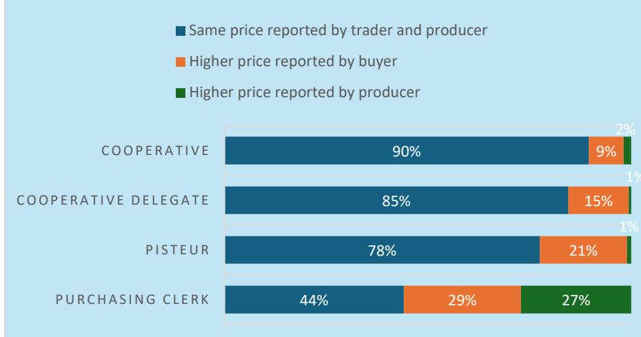

# **COMPARISON BETWEEN PRICE REPORTING**

*Figure 8. Comparison of reported farmgate prices between producers and buyers during the main season.*

*Source: Authors' own elaboration, based on EU-JRC 2019a, EU-JRC 2019b.*

**Table 8.** Time of payment, as reported by producers (%).

|                             | Côte d’Ivoire Cooperative | Cooperative Delegate | Pisteur | Ghana Purchasing Clerk | Total |
|-----------------------------|---------------------------|----------------------|---------|------------------------|-------|
| Directly                    | 46.67                     | 58.79                | 71.43   | 91.51                  | 71.43 |
| Within a week Longer than a | 46.67                     | 35.71                | 26.79   | 6.92                   | 25.45 |
| week                        | 6.67                      | 5.49                 | 1.79    | 1.57                   | 3.12  |
| n                           | 165                       | 182                  | 392     | 318                    | 1,057 |

Lastly, we examined the role of bonus payments, which are provided through producer participation in certification schemes, sustainability initiatives, or corporate social responsibility programs. In our sample, 19% of producers received a bonus payment (Table 9). For Ghanaian producers, the average bonus amounted to 1.66 GHS per kilogram, while for Ivorian producers, the average bonus was 50.9 CFA per kilogram. These bonus amounts were compared on a case-by-case basis with the official farmgate prices. In Ghana, producers received an average bonus payment equivalent to 14.3% of the farmgate price, while in CÙte d'Ivoire, producers received only 4.31% of the farmgate price. These substantial differences can potentially be explained by more robust and better-funded initiatives in Ghana compared to CÙte d'Ivoire. Bonuses are often paid by certification schemes and initiatives to primary buyers, who are responsible for their distribution. This may lead either to less transparent payment mechanisms for producers or to a more egalitarian approach, where bonuses are distributed more broadly and not necessarily tied to direct producer participation in specific schemes.

**Table 9.** Bonus or premium payments received, as reported by producers.

|                                                      |            | Côte d’Ivoire Cooperative | Cooperative Delegate | Pisteur | Ghana Purchasing Clerk | Total |
|------------------------------------------------------|------------|---------------------------|----------------------|---------|------------------------|-------|
| Bonus or premium                                     | No         | 60.61                     | 68.13                | 70.75   | 95.66                  | 77.96 |
|                                                      | Yes        | 35.15                     | 30.22                | 23.58   | 3.32                   | 19.02 |
|                                                      | Don’t know | 4.24                      | 1.65                 | 5.66    | 1.02                   | 3.03  |
| n Average amount of                                  |            | 165                       | 182                  | 39      | 318                    | 1,057 |
| bonus received (CFA/ GHS per kg) Certification bonus |            | 50.9 (115)                |                      |         | 1.66 (2.57)            |       |
|                                                      |            | 4.31                      |                      |         | 14.3                   |       |
| n                                                    |            |                           | 126                  |         | 75                     | 201   |

*Source: Authors' own elaboration, based on EU-JRC 2019a.* 

*Source: Authors' own elaboration, based on EU-JRC 2019a. Standard deviations in parenthesis. Bonus payments reported in CFA/ kg for CÙte d'Ivoire and GHS/ kg for Ghana.*

#### **4. Cocoa quality & price**

Cocoa quality is often viewed as an opportunity for producers to increase their income, as it is largely determined by the adoption of good agricultural and processing practices. Specifically, practices related to harvesting, fermentation and drying influence the flavour profile and shell content of cocoa beans (Laven et al., 2016). However, the relationship between quality and price is not linear across all levels of the value chain, with some actors potentially benefitting more than others. We therefore examined the extent to which primary buyers assess and grade cocoa quality, and whether higher quality is associated with a higher price or bonus payment.

We observe that the majority of buyers checked cocoa quality prior to purchase (88%). More than half of the producers (57%) were required to meet specific quality criteria by their buyer (Table 10), especially those selling to cooperatives (67%) and purchasing clerks (70%). In Ghana, purchasing clerks operate under a government regulated quality system, enforced by the Quality Control Division, which subjects them to stringent inspections. In comparison, fewer pisteurs in Côte d'Ivoire (43%) imposed any quality standards on producers. On average, approximately half of the buyers required producers to ferment (54%) and to dry (56%) their cocoa according to recommended practices. When differentiating across buyer types, cooperatives were most likely to provide guidance to their producers, with 70% and 65% advising on the fermentation and drying process respectively. In contrast, pisteurs were least likely to recommend or demand the application of specific practices regarding fermentation (45%) and drying (50%). It should be noted that producer and buyer perceptions on the implementation on rigorous quality standards are somewhat diverging. The vast majority of pisteurs, cooperatives and purchasing clerks reported to impose specific conditions for fermentation (85%) and drying (77%). Such differences can possibly be explained by the responses to questions posed in an interview setting, where buyers may want to underline the rigorousness with which they fulfil their operations.

**Table 10.** Quality criteria imposed by buyers, as reported by producers (%).

|     | Côte d’Ivoire Cooperative | Cooperative Delegate | Pisteur | Ghana Purchasing Clerk | Total |
|-----|---------------------------|----------------------|---------|------------------------|-------|
| No  | 33.54                     | 44.69                | 57.44   | 29.65                  | 43.14 |
| Yes | 66.46                     | 55.31                | 42.56   | 70.35                  | 56.86 |
| No  | 29.88                     | 39.11                | 55.13   | 46.69                  | 45.90 |
| Yes | 70.12                     | 60.89                | 44.87   | 53.31                  | 54.10 |
| No  | 34.76                     | 43.02                | 50.00   | 43.22                  | 44.38 |
| Yes | 65.24                     | 56.98                | 50.00   | 56.78                  | 55.62 |
| n   | 164                       | 179                  | 390     | 317                    | 1,050 |

Producers and buyers seem to have focused on somewhat different indicators to evaluate cocoa quality (Table 11). For producers the most important quality criterion was moisture content (52%), bean colour (47%), and bean size (38%). Similarly, buyers prioritized moisture content (71%), followed by the quality of fermentation (48%) and the presence of waste or rubble in the cocoa beans (44%). Both groups also considered additional factors such as the rate of defects (e.g., flat, insect-damaged beans) and the presence of mould. Efforts to improve quality may be of limited success if both producers and buyers are not aligned on what constitutes "high-quality cocoa."

*Source: Authors' own elaboration, based on EU-JRC 2019a.* 

**Table 11.** Top five cited quality criteria for describing good cocoa beans, as reported by producers and primary buyers (%).

|                                             | Producers | Criteria                       | Buyers           |
|---------------------------------------------|-----------|--------------------------------|------------------|
| Moisture content                            | 52.70     | Moisture content               | 71.22            |
| Good colour of beans                        | 47.87     | Quality of the fermentation    | 48.29            |
| Size of the beans                           | 38.69     | Presence of waste or rubbles   | 43.90            |
| Rate of defect beans (flat, insect-damaged) | 35.19     | Rate of mouldy or rotten beans | 38.54            |
| Rate of mouldy or rotten beans              | 32.92     | Good colour of beans           | 38.54            |
| n                                           | 1,057     |                                | 205 1 |

We further examined whether quality influences the price paid for the beans. From the buyers' perspective (Table 12), quality rarely seemed to result to higher prices. In Ghana, with a fixed farmgate price, no price differentiation takes place for different quality cocoa at the farmer level (Laven et al., 2016). As Laven et al. (2016) point out, buyers there do not compete on price or quality for producers' sales; instead, they compete through volume. This dynamic may work in both directions regarding quality, with buyers potentially purchasing more high-quality cocoa at the same price while reducing their payments for poor-quality beans either by purchasing smaller quantities or by weighing them as lower volume.

**Table 12.** Relationship between cocoa quality and prices, as reported by primary buyers (%).

|                                       |     | Côte d’Ivoire | Ghana | Total Share |
|---------------------------------------|-----|---------------|-------|-------------|
| Same price for every cocoa quality    | No  | 1.73          | 1.67  | 2.70        |
|                                       | Yes | 98.27         | 98.33 | 97.30       |
| n                                     |     | 170           | 120   | 290         |
| Higher price for higher cocoa quality | No  | 87.21         | 90.76 | 92.50       |
|                                       | Yes | 12.79         | 9.24  | 7.50        |
| n                                     |     | 86            | 119   | 205 2       |

The producers' perception of the relationship between cocoa quality and price differed slightly from that of the buyers. Approximately 19% to 23% of producers in CÙte d'Ivoire reported that higher prices were paid for higher-quality beans (Table 13). Whether this was based on actual experience or was a subjective belief, is difficult to entangle. In contrast, in Ghana, only about 13% of farmers associated higher prices with higher cocoa quality.

*Source: Authors' own elaboration, based on EU-JRC 2019a, EU-JRC 2019b.* 

*Source: Authors' own elaboration, based on EU-JRC 2019b.* 

2 n is smaller as this question was only asked to independent traders, excluding predominantly the cooperative delegates from the sample.

**Table 13.** Relationship between cocoa quality and prices, as reported by producers (%).

| Does the buyer                               | Côte d’Ivoire Cooperative | Cooperative Delegate | Pisteur | Ghana Purchasing Clerk | Total |
|----------------------------------------------|---------------------------|----------------------|---------|------------------------|-------|
| No increases the price if the quality of the | 81.21                     | 77.47                | 80.61   | 86.79                  | 82.02 |
| Yes beans is higher?                         | 18.79                     | 22.53                | 19.39   | 13.21                  | 17.98 |
| n                                            | 165                       | 182                  | 392     | 318                    | 1,057 |

Nonetheless, the vast majority (83%) of cocoa producers seek to improve the quality of their cocoa, primarily with the expectation of receiving a higher price or bonus, or to gain access to a broader range of buyers (Figure 9). This contrasts with buyers' reports that they do not pay higher prices for high-quality beans, yet producers remain motivated to invest in quality improvements. Conversely, 17% of producers who do not see the benefits of improving their cocoa quality cite reasons such as the lack of financial return and the considerable labour and effort required.

## **5. Input provisions by traders**

Buyers and traders often provide producers with inputs such as fertilizers or insecticides (Donkor et al., 2023; Bymolt et al., 2018; Vigneri & Santos, 2007). In our sample (Table 14), 17% of producers confirmed to receive agricultural inputs, with considerable variation across buyer types. Pisteurs in CÙte d'Ivoire and purchasing clerks in Ghana provided inputs to only about 10% of their producers. In comparison, 21% of producers selling to cooperative delegates and 43% of those selling to

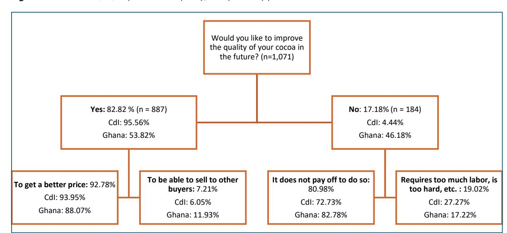

*Source: Authors' own elaboration, based on EU-JRC 2019a.* 

*Figure 9. Reasons to (not) improve cocoa quality, as reported by producers.*

*Source: Authors' own elaboration, based on EU-JRC 2019a.* 

cooperatives received such inputs. These differences may stem from the stronger and more stable producer-buyer relationships observed between cooperatives and their members. This relationship may incentivize cooperatives to offer inputs as a means to improve cocoa quality. Additionally, cooperatives may have the advantage of pooling resources through membership fees, enabling them to bulk purchase inputs at lower costs.

Among the 186 producers who received inputs, approximately 60% received them free of charge, while 40% were given on credit, to be repaid during the harvest season. The most commonly distributed inputs were insecticides and fertilisers.

**Table 14.** Input provision by primary buyer, as reported by producers (%).

|                       | Côte d’Ivoire Cooperative | Cooperative Delegate | Pisteur | Ghana Purchasing Clerk | Total |
|-----------------------|---------------------------|----------------------|---------|------------------------|-------|
| No Inputs provided by | 56.97                     | 79.12                | 88.99   | 90.31                  | 82.78 |
| Yes buyer             | 43.03                     | 20.88                | 11.01   | 9.69                   | 17.22 |
| n                     | 165                       | 182                  | 392     | 318                    | 1,057 |

*Source: Authors' own elaboration, based on EU-JRC 2019a.* 

## **V. Conclusions**

The cocoa value chains in Côte d'Ivoire and Ghana encompass various stakeholders, with existing literature predominantly focusing on small-scale farmers and their challenges related to accessing information, knowledge, and markets. However, the role of primary buyers and traders has been largely overlooked despite their significant influence on power dynamics within these value chains. This oversight is particularly pronounced in the context of evolving regulatory landscapes that emphasize traceability and transparency, such as the EU's Due Diligence Regulations aimed at establishing deforestation-free and ethically sustainable supply chains.

By utilizing a novel dataset combining data from 1,071 cocoa producers and 293 primary buyers in Côte d'Ivoire and Ghana, we provide a detailed characterization of these actors' operations. We categorize primary buyers into four distinct types: pisteurs, delegates of cooperatives, and cooperatives in Côte d'Ivoire, and purchasing clerks in Ghana. Our primary objective is to shed light on the quality of the producer-buyer relationship concerning weighing and pricing mechanisms, quality control, and service provisions.

Our findings indicate that the producer-cooperative relationship is the most robust among the different types of producer-buyer interactions. These relationships are generally long-standing and often formalized through contractual arrangements, facilitating a high level of trust, particularly during cocoa weighing. Long-term, stable purchasing arrangements mitigate producer risk and can support financial stability across seasons (Cocoa Barometer, 2022). However, these arrangements may limit flexibility, as switching buyers becomes more challenging.

In contrast, pisteurs in Côte d'Ivoire and purchasing clerks in Ghana maintain more tenuous relationships with their producers. With farmgate prices regulated by the government in both countries, buyers compete not on price but through additional services they offer. Timely payments are crucial for producers who depend on consistent cash flow for bill payments and loan servicing. Producers report receiving prices below the official farmgate rate, likely due to loans, upfront payments, or input provision on credit, which must be repaid upon cocoa sale.

Despite the significance of cocoa quality on the international market, there is little monetary incentive for quality improvement at the farm level. Although 83% of interviewed producers strive to improve cocoa quality, and 18% believe it could enhance pricing, 97% of buyers state cocoa quality does not affect price. This disconnect underscores the need for market differentiation and quality premiums to enhance producer income and market access. Market differentiation and quality premiums could bolster producer income and open alternative market opportunities for cocoa traders.

As new due diligence and deforestation-free value chain regulations come into effect, primary buyers are well-positioned to play a transformative role. These regulations present opportunities to formalize producer-buyer relationships and enhance accountability and transparency, ensuring compliance with these regulations, thereby promoting traceable and legally produced cocoa. Understanding and involving these intermediaries is vital for achieving sustainable impact in the cocoa sector.

# **VI. References**

Baah, F., Anchirinah, V., Badger, E., Badu, A., and Badu-Yeboah, A. (2012) Examining the Cocoa Farmer-Purchasing Clerk Relationship in Ghana. *Global Journal of Science Frontier Research Agriculture and Veterinary Sciences*, 12(11). Bakang, J.-E., Alexander, A. F., Seth, E., Enoch, K. T.-A., Isaac, N. S., Emmanuel, A. D., Mark, A., Evelyn, K. B., and Mariama, I. (2021) Competitive strategies for purchasing of cocoa by licensed buying companies in Ghana: The determinants and performance implications. *Journal of Development and Agricultural Economics*, 13(4), 295–303.<https://doi.org/10.5897/jdae2021.1303> Bastide, P. M., Perret, C., and Bossard, L. (2007) Cocoa. Atlas on Regional Integration in West Africa: economy series. Bensch, G., Kaestner, K., Schmid, L., Vance, C. and Wilhelm, A. (2022) Price formation on the futures market and the physical market for cocoa. Jacobs University Bremen & RWI – Leibniz Institute for Economic Research BNETD (2016) Analyse qualitative des facteurs de dÈforestation et de dÈgradation des forÍts en CÙte d'Ivoire. Programme ONU-REDD. Retrieved on 09/01/2025 via [https://www.nitidae.org/files/b24e760c/161216081210\\_161214\\_analyse\\_facteurs\\_def\\_deg\\_ci\\_rappor](https://www.nitidae.org/files/b24e760c/161216081210_161214_analyse_facteurs_def_deg_ci_rapport_final.pdf) [t\\_final.pdf](https://www.nitidae.org/files/b24e760c/161216081210_161214_analyse_facteurs_def_deg_ci_rapport_final.pdf)  Bymolt, R., Laven, A., and Tyszler, M. (2018) Demystifying the Cocoa Sector in Ghana and Côte d'Ivoire. The Royal Tropical Institute (KIT): Amsterdam, The Netherlands. Gaia Cacao (2021) Global Cocoa Market Study. Retrieved on 09/01/2025 via <https://thechocolatelife.com/content/files/2022/01/Global-Cocoa-Market-Study-Report.pdf> Cocoa & Forests Initiative (2022) Côte d'Ivoire - Cocoa & Forests Initiative Annual Report 2022. Retrieved on 09/01/2025 via [https://www.idhsustainabletrade.com/uploaded/2017/03/Rapport-2022-](https://www.idhsustainabletrade.com/uploaded/2017/03/Rapport-2022-Initiative-Cacao-et-Forets-Cote-dIvoire_English.pdf) [Initiative-Cacao-et-Forets-Cote-dIvoire\\_English.pdf](https://www.idhsustainabletrade.com/uploaded/2017/03/Rapport-2022-Initiative-Cacao-et-Forets-Cote-dIvoire_English.pdf)  COCOBOD (2019) Annual reports and consolidated financial statements, 2018-2019. Retrieved on 11/10/2024 via<https://cocobod.gh/resources/annual-report> COCOBOD (2021) Increasing cocoa production in Ghana - The importance of the 4PS. Retrieved on 10/10/2024 via [https://cocobod.gh/news/increasing-cocoa-production-in-ghana-the-importance-of-the-](https://cocobod.gh/news/increasing-cocoa-production-in-ghana-the-importance-of-the-4ps#:~:text=For%20instance%2C%20in%202021%20alone,10%25%20of%20the%20country)[4ps#:~:text=For%20instance%2C%20in%202021%20alone,10%25%20of%20the%20country's%20G](https://cocobod.gh/news/increasing-cocoa-production-in-ghana-the-importance-of-the-4ps#:~:text=For%20instance%2C%20in%202021%20alone,10%25%20of%20the%20country) [DP](https://cocobod.gh/news/increasing-cocoa-production-in-ghana-the-importance-of-the-4ps#:~:text=For%20instance%2C%20in%202021%20alone,10%25%20of%20the%20country)  Dieng, N. S., and Karsenty, A. (2023) Power through trees. State territorialisation by means of privatization and 'agrobizforestry' in Côte d'Ivoire. *World Development Sustainability*, 3, 100074. <https://doi.org/10.1016/j.wds.2023.100074> Donkor, E., Amegbe, E.D., Ratinger, T. and Hejkrlik, J. (2023) The effect of producer groups on the productivity and technical efficiency of smallholder cocoa farmers in Ghana. *PLoS ONE*, 18(12),

e0294716.<https://doi.org/10.1371/journal.pone.0294716>

European Commission (2023) Deforestation Regulation implementation. Retrieved on 10/10/2024 from [https://green-business.ec.europa.eu/deforestation-regulation-implementation\\_en](https://green-business.ec.europa.eu/deforestation-regulation-implementation_en) 

European Commission, Joint Research Centre (EC-JRC) (2019a) Cocoa Producer Survey in Côte d'Ivoire and Ghana.

European Commission, Joint Research Centre (EC-JRC) (2019b) Cocoa Buyer Survey in Côte d'Ivoire and Ghana.

Fold, N and Neilson, J. (2016) Sustaining Supplies in Smallholder-Dominated Value Chains. Corporate Governance of the Global Cocoa Sector. In Squicciarini, M. and Swinnen, J. (2016) The Economics of Chocolate, Oxford University Press, Incorporated.

Gilbert, C. L. (2024) The EU Deforestation Regulation. *EuroChoices*, 23(3), 64-69. <https://doi.org/10.1111/1746-692X.12436>

Grabs, J., Carodenuto, S., Jespersen, K., Adams, M. A., Camacho, M. A., Celi, G., Chandra, A., Dufour, J., zu Ermgassen, E. K. H. J., Garrett, R. D., Lyons-White, J., McLeish, M., Niehues, I., Silverman, S., and Stone, E. (2024) The role of midstream actors in advancing the sustainability of agri-food supply chains. *Nature Sustainability*.<https://doi.org/10.1038/s41893-024-01296-9>

Grabs, J., and Carodenuto, S. L. (2021) Traders as sustainability governance actors in global food supply chains: A research agenda. *Business Strategy and the Environment*, 30(2), 1314–1332. <https://doi.org/10.1002/bse.2686>

ICCO (2021) Quarterly Bulletin of Cocoa Statistics: Vol. XLVII (Issue 3)

ICCO (2018) Cocoa Market Review. September 2018. Retrieved on 15/10/2024 from [https://www.icco.org/wp-content/uploads/2019/07/ICCO-Monthly-Cocoa-Market-Review-September-](https://www.icco.org/wp-content/uploads/2019/07/ICCO-Monthly-Cocoa-Market-Review-September-2018.pdf)[2018.pdf](https://www.icco.org/wp-content/uploads/2019/07/ICCO-Monthly-Cocoa-Market-Review-September-2018.pdf) 

Ingram, V., van Rijn, F., Waarts, Y., Dekkers, M., de Vos, B., Koster, T., Tanoh, R., and Galo, A. (2017) Towards sustainable cocoa in CÙte d'Ivoire. The impacts and contribution of UTZ certification combined with services provided by companies. Wageningen, Wageningen Economic Research, Report 2018-041. 140 pp.

Kalischek, N., Lang, N., Renier, C., Daudt, R. C., Addoah, T., Thompson, W., Blaser-Hart, W. J., Garrett, R., Schindler, K., and Wegner, J. D. (2023) Cocoa plantations are associated with deforestation in CÙte d'Ivoire and Ghana. *Nature Food*, 4(5), 384–393.<https://doi.org/10.1038/s43016-023-00751-8>

Kouassi, A.P. (2023) Value Chain and Sectoral Regulatory Analysis Country Reports. Côte d'Ivoire Country Report. Prepared for ICCO Feasibility Study on Africa Cocoa Exchange (AfCX) Appendix 1.

Krumbiegel, K., and Tillie, P. (2024) Sustainable practices in cocoa production. The role of certification schemes and farmer cooperatives. *Ecological Economics*, 222, 108211. <https://doi.org/10.1016/j.ecolecon.2024.108211>

Laven, A., Buunk, E., and Ammerlaan, T. (2016) Appendix A Determination of Cocoa Prices in Cameroon, Nigeria, Ghana, Côte d'Ivoire and Indonesia. Appendix to Report Market Concentration and Price Formation in the Global Cocoa Value Chain. (SEO-report; No. 2016-79A). SEO Amsterdam Economics.

LeBaron, G. and Gore, E.(2019) Gender and Forced Labour: Understanding the Links in Global Cocoa Supply Chains. *The Journal of Development Studies*, 56(6), 1095-1117.

- <https://doi.org/10.1080/00220388.2019.1657570> Malan, B.B. (2013) Volatility and stabilization of the price of coffee and cocoa in CÙte d'Ivoire. *Agric. Econ. – Czech*, 59(7), 333-340. doi: 10.17221/145/2012-AGRICECON Nitidae and EFI (2021) Traceability and transparency of cocoa supply chains in Côte d'Ivoire and Ghana. Retrieved on 05/02/2025 from [https://www.nitidae.org/files/90b65fa3/document\\_technique\\_agriculture\\_redd\\_marche\\_ghana\\_cotedivo](https://www.nitidae.org/files/90b65fa3/document_technique_agriculture_redd_marche_ghana_cotedivoire_cacao_tracao.pdf) [ire\\_cacao\\_tracao.pdf](https://www.nitidae.org/files/90b65fa3/document_technique_agriculture_redd_marche_ghana_cotedivoire_cacao_tracao.pdf)  Ollendorf, F., Sieber, S., and Lˆhr, K. (2023) Societal dynamics of sustainability certification in Ghanaian cocoa producing communities: Assessing social cohesion effects and their implications for collective action. *Agroecology and Sustainable Food Systems*, *47*(2), 212–238. <https://doi.org/10.1080/21683565.2022.2138671> Oomes, N., Tieben, B., Laven, A., Ammerlaan, T., Appelman, R., Biesenbeek, C. and Buunk, E. (2016) *Market Concentration and Price Formation in the Global Cocoa Value Chain*. SEO-report no. 2016-79. Ongolo, S., KouamÈ Kouassi, S., ChÈrif, S., and Giessen, L. (2018) The tragedy of forestland sustainability in postcolonial Africa: Land development, cocoa, and politics in Côte d'Ivoire*. Sustainability,* 10(12), 4611.<https://doi.org/10.3390/su10124611> Ruf, F. (2018) Politico-military and climate crises in CÙte d'Ivoire. From cocoa to cashew nuts, from forest rent to animal manure | Crises politico-militaires et climatiques en CÙte d'Ivoire. Du cacao ‡ l'anacarde, de la rente forêt à la fumure animale. *Tropicultura*, 36(2), 281-298. Ruf, F. and Schroth, G. (2004) Agroforestry and Biodiversity Conservation in Tropical Landscapes, 107–
- 134. In Schroth, G., da Fonseca, G.A.B., Harvey, C.A., Gascon, C., Vasconcelos, H.L. and Izac, A.M.N. (2004) Chocolate forests and monocultures: A historical review of cocoa growing and its conflicting role in tropical deforestation and forest conservation, CABI. Ruf, F., Uribe Leitz, E., Gboko, K. C., and Carimentrand, A. (2019) Des certifications inutiles? Les relations asymÈtriques entre coopératives, labels et cacaoculteurs en Côte d'Ivoire. *Revue Internationale Des …tudes Du DÈveloppement*, 240(4), 31.<https://doi.org/10.3917/ried.240.0031> Ruf, F., Uribe Leitz, E., Gboko, K. C., Galo, A., and Allagba, K. (2018) L'innovation « coopÈratives cacao ª en CÙte d'Ivoire. Entre mythes et dynamiques. SFER, INRA, CIRAD. Nantes : SFER, pp. 1-15. JournÈes de recherches en sciences sociales (JRSS). Sadu, S., Kysia, K., Onyango, L., Zinnes, C., Lord, S, Monnard, A. and Rojas Arellano, I. (2020) NORC Final Report: Assessing Progress in Reducing Child Labor in Cocoa Production in Cocoa Growing Areas of CÙte d'Ivoire and Ghana. University of Chicago. Retrieved on 05/02/2025 [https://www.norc.org/content/dam/norc-org/documents/standard-projects](https://www.norc.org/content/dam/norc-org/documents/standard-projects-pdf/NORC%202020%20Cocoa%20Report_English.pdf)[pdf/NORC%202020%20Cocoa%20Report\\_English.pdf](https://www.norc.org/content/dam/norc-org/documents/standard-projects-pdf/NORC%202020%20Cocoa%20Report_English.pdf)  SaÔdou, C., Tchemtchoua, E., Mahama, A., Mohammadou, B. A., Abolo, D., Ali, A., and Njintang, N. N. (2021) Post-harvest System and Quality of Cocoa Beans in the Southern Region of Cameroon.

*European Journal of Nutrition & Food Safety*, 1–17.<https://doi.org/10.9734/ejnfs/2021/v13i1230466>

Sellare, J. (2022) New insights on the use of the Fairtrade social premium and its implications for child education. *Journal of Rural Studies*, 94, 418–428.<https://doi.org/10.1016/j.jrurstud.2022.07.015> Sellare, J., J‰ckering, L., Kahsay, G., and Meemken, E. (2023) Five stylized facts about producer organizations and rural development. *Journal of the Agricultural and Applied Economics Association*, 2(3), 428–445.<https://doi.org/10.1002/jaa2.70> Staritz, C., Trˆster, B., Grumiller, J., and Maile, F. (2023) Price-Setting Power in Global Value Chains: The Cases of Price Stabilisation in the Cocoa Sectors in Côte d'Ivoire and Ghana. *European Journal of Development Research*, 35(4), 840–868.<https://doi.org/10.1057/s41287-022-00543-z> Vigneri, M., and Santos, P. (2007) Ghana and the cocoa marketing dilemma: What has liberalisation without price competition achieved? ODI Project Briefing, No 03. Waarts, Y., Jans, V., Ingram, V., Slingerland, M., Rijn, F. Van, Beekman, G., Dengerink, J., Vliet, J. Van, Arets, E., Sassen, M., Guijt, J., and Vugt, S. Van. (2019) A living income for smallholder commodity farmers and protected forests and biodiversity: How can the private and public sectors contribute? *Wageningen Economic Research,* 1–26. Wessel, M., and Quist-Wessel, P. M. F. (2015) Cocoa production in West Africa, a review and analysis of recent developments. *NJAS - Wageningen Journal of Life Sciences*, 74–75, 1–7. <https://doi.org/10.1016/j.njas.2015.09.001> Zu Ermgassen, E. K. H. J., Lima, M. G. B., Bellfield, H., Dontenville, A., Gardner, T., Godar, J., Heilmayr, R., Indenbaum, R., Dos Reis, T. N. P., Ribeiro, V., Abu, I.-O., Szantoi, Z., and Meyfroidt, P. (2022) Addressing indirect sourcing in zero deforestation commodity supply chains. *Science Advances*, 8(17). <https://doi.org/10.1126/sciadv.abn3132>

# **VII. List of abbreviations**

| Abbreviations | Definitions                                                |
|---------------|------------------------------------------------------------|
| AUSCOOP       | Acte uniforme relatif au droit des sociÈtÈs coopÈratives / |
| CCC           | Conseil CafÈ Cacao                                         |
| COCOBOD       | Ghana Cocoa Board                                          |
| CFA           | Franc de la CommunautÈ financiËre africaine/ West-African  |
| CIRES         | Centre Ivoirien de Recherche …conomique et Sociale         |
| CMC           | Cocoa Marketing Company                                    |
| COOP-CA       | SociÈtÈ CoopÈrative Agricole                               |
| DoC           | Department of Cooperatives                                 |
| EU            | European Union                                             |
| EUDR          | EU Deforestation Regulation                                |
| GDP           | Gross Domestic Product                                     |
| GHS           | Ghanaian Cedi                                              |
| ICCO          | International Cocoa Organisation                           |
| LBC           | Licensed Buying Companies’                                 |
| PCA           | Président du Conseil d’Administration                      |
| PBC           | Produce Buying Company                                     |
| OHADA         | Organisation for the harmonisation of business laws in     |
| QCD           | Quality Control Division of COCOBOD                        |
| USD           | United States Dollar                                       |

# **VIII. List of figures**

| Figure 1. | Cocoa- driven deforestation in Côte d’Ivoire, represented by the total area of cocoa in 2021                                                                               |
|-----------|----------------------------------------------------------------------------------------------------------------------------------------------------------------------------|
| Figure 2. | Cocoa value chain in CÙte d'Ivoire. ............................................................................................................................... 6      |
| Figure 3. | Cocoa value chain in Ghana.............................................................................................................................................. 7 |
| Figure 4. | Interview locations with primary buyers, based on GPS records. ................................................................ 9                                          |
| Figure 5. | Motivation for trader choice, as reported by producers – ranked in order of importance. ........ 14                                                                        |
| Figure 6. | Trust in the weighing process by producers. ........................................................................................................ 16                    |
| Figure 7. | Comparison between official and reported farmgate price per kg/ beans received during main                                                                                 |
| Figure 8. | Comparison of reported farmgate prices between producers and buyers during the main                                                                                        |
| Figure 9. | Reasons to (not) improve cocoa quality, as reported by producers. ....................................................... 22                                               |

# **IX. List of tables**

| Table 1.  | Different categories of primary buyers in Côte d’Ivoire and Ghana. ........................................................ 10                            |
|-----------|-----------------------------------------------------------------------------------------------------------------------------------------------------------|
| Table 2.  | Scale of operations, as reported by primary buyers ........................................................................................ 11            |
| Table 3.  | Descriptive statistics of cooperatives, as reported by primary buyers. .................................................. 12                              |
| Table 4.  | Descriptive statistics of cooperative membership, as reported by producers. ................................... 13                                        |
| Table 5.  | The producer-trader relationship, as reported by producers (%). .............................................................. 15                         |
| Table 6.  | Type of scale used, as reported by primary buyers (%) ................................................................................. 16                |
| Table 7.  | Average farmgate price per kg of beans received during the main season 2018-2019, as                                                                      |
| Table 8.  | Time of payment, as reported by producers (%). ................................................................................................ 19        |
| Table 9.  | Bonus or premium payments received, as reported by producers. ........................................................... 19                              |
| Table 10. | Quality criteria imposed by buyers, as reported by producers (%). ....................................................... 20                              |
| Table 11. | Top five cited quality criteria for describing good cocoa beans, as reported by producers and                                                             |
| Table 12. | Relationship between cocoa quality and prices, as reported by primary buyers (%). ................. 21                                                    |
| Table 13. | Relationship between cocoa quality and prices, as reported by producers (%). ............................. 22                                             |
| Table 14. | Input provision by primary buyer, as reported by producers (%). ........................................................... 23                            |
| Table 15  | Sample size of primary buyers per district. .......................................................................................................... 32 |
| Table 16  | Sample size for the different categories of buyers and traders in Côte d’Ivoire and Ghana. . 32                                                           |
| Table 17  | Perception on farmgate price received by producers (%)............................................................................. 33                    |

## X. Annex

**Table 15** Sample size of primary buyers per district.

|              |               | Sample size |                      | Sample size |
|--------------|---------------|-------------|----------------------|-------------|
| <b>Total</b> | <b>Ghana</b>  | <b>120</b>  | <b>Côte d'Ivoire</b> | <b>173</b>  |
|              | Ashanti       | 34          | Bas-Sassandra        | 31          |
|              | Brong Ahafo   | 11          | Comoe                | 7           |
|              | Central       | 10          | Denguele             | 1           |
|              | Eastern       | 28          | Goh-Djiboua          | 35          |
|              | Volta         | 1           | Lacs                 | 21          |
|              | Western North | 35          | Lagunes              | 7           |
|              | Western South | 1           | Montagnes            | 47          |
|              |               |             | Sassandra-Marahoue   | 19          |
|              |               |             | Savanes              | 0           |
|              |               |             | ValleeduBandama      | 0           |
|              |               |             | Woroba               | 2           |
|              |               |             | Zanzan               | 3           |

Source: Authors' own elaboration, based on EU-JRC 2019b.

**Table 16** Sample size for the different categories of buyers and traders in Côte d'Ivoire and Ghana.

| Côte d'Ivoire (n = 173)     |       |                                      |    | Ghana (n = 120)              |       |                             |     |
|-----------------------------|-------|--------------------------------------|----|------------------------------|-------|-----------------------------|-----|
| Category                    | Total |                                      |    | Category                     | Total |                             |     |
| <b>Cooperative</b>          | 47    | Coopérative agrée                    | 42 | <b>Other</b>                 | 4     | Registered cooperative      | 4   |
|                             |       | Coopérative non-agrée                | 5  |                              |       | Unregistered cooperative    | 0   |
| <b>Cooperative Delegate</b> | 52    | Délégué de cooperative               | 52 | <b>Purchasing clerk</b>      | 116   | Delegate of the cooperative | 0   |
| <b>Pisteur</b>              | 67    | Pisteur travaillant pour un acheteur | 15 |                              |       | Purchasing clerk of a LBC   | 101 |
|                             |       | Pisteur indépendant                  | 33 | Independent middlemen        | 2     |                             |     |
|                             |       | Acheteur privé ou traitant           | 9  | LBC                          | 12    |                             |     |
|                             |       | Coxeur de pisteur                    | 10 | Middlemen for buying company | 0     |                             |     |
| <b>Other</b>                | 7     | Autre                                | 4  | District manager of LBC      | 1     |                             |     |
|                             |       | NA                                   | 3  |                              |       |                             |     |

Source: Authors' own elaboration, based on EU-JRC 2019b.

**Table 17** Perception on farmgate price received by producers (%).

|                   | Cooperative members | Delegates of the cooperative | Pisteurs | Purchasing clerks | Total share (n=1,071) |
|-------------------|---------------------|------------------------------|----------|-------------------|-----------------------|
| An unfair price   | 2.42                | 1.65                         | 5.36     | 11.01             | 6.72                  |
| The fair price    | 93.94               | 96.15                        | 89.80    | 88.05             | 90.29                 |
| A very good price | 3.64                | 2.20                         | 4.85     | 0.94              | 2.99                  |

#### Getting in touch with the EU

#### In person

All over the European Union there are hundreds of Europe Direct centres. You can find the address of the centre nearest you online ([european-union.europa.eu/contact-eu/meet-us\\_en](https://european-union.europa.eu/contact-eu/meet-us_en)).

#### On the phone or in writing

Europe Direct is a service that answers your questions about the European Union. You can contact this service:

- by freephone: 00 800 6 7 8 9 10 11 (certain operators may charge for these calls),
- at the following standard number: +32 22999696,
- via the following form: [european-union.europa.eu/contact-eu/write-us\\_en](https://european-union.europa.eu/contact-eu/write-us_en).

## Finding information about the EU

#### Online

Information about the European Union in all the official languages of the EU is available on the Europa website ([european-union.europa.eu](https://european-union.europa.eu/)).

#### EU publications

You can view or order EU publications at [op.europa.eu/en/publications](https://op.europa.eu/en/publications). Multiple copies of free publications can be obtained by contacting Europe Direct or your local documentation centre ([european-union.europa.eu/contact](https://european-union.europa.eu/contact-eu/meet-us_en)[eu/meet-us\\_en](https://european-union.europa.eu/contact-eu/meet-us_en)).

#### EU law and related documents

For access to legal information from the EU, including all EU law since 1951 in all the official language versions, go to EUR-Lex ([eur-lex.europa.eu](https://eur-lex.europa.eu/)).

#### EU open data

The portal [data.europa.eu](https://data.europa.eu/) provides access to open datasets from the EU institutions, bodies and agencies. These can be downloaded and reused for free, for both commercial and non-commercial purposes. The portal also provides access to a wealth of datasets from European countries.

