# Jurisdictional Dialogue #2 Malaysia

## Awareness Training for Oil Palm Smallholders on EUDR Requirements

Prime City Hotel, Kluang, Johor  
17 December 2025

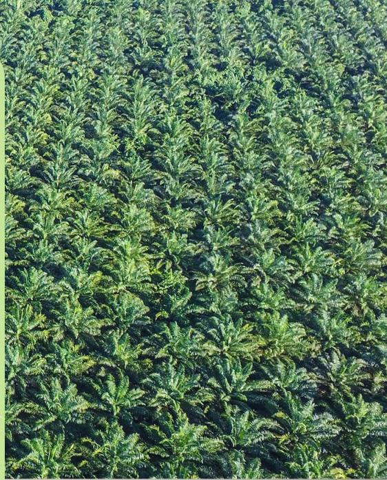

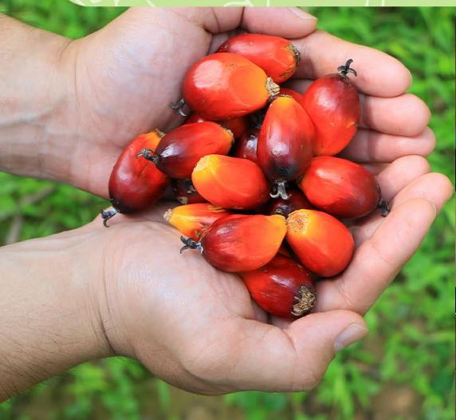

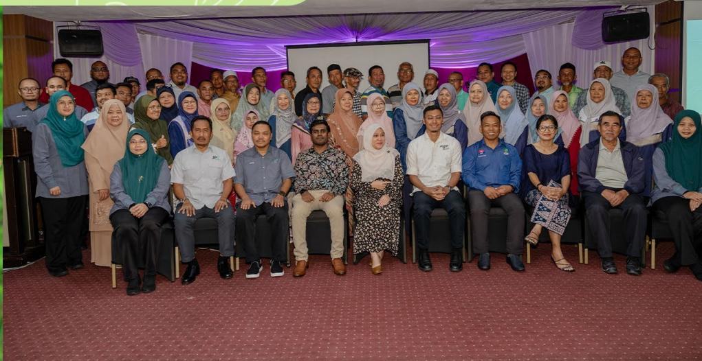

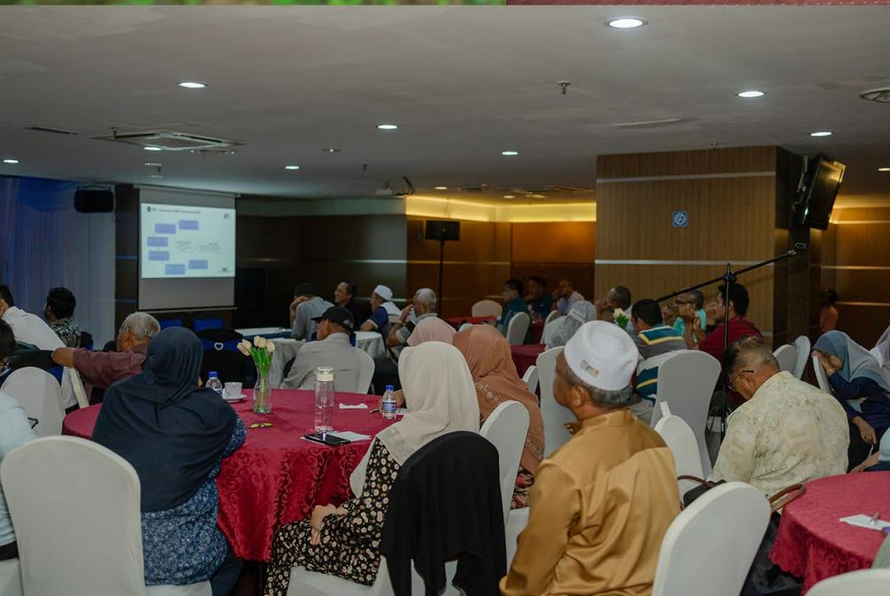

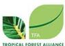

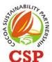

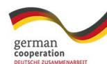

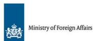

## Table of Contents

| Background                                                        | 3  |
|-------------------------------------------------------------------|----|
| Objectives                                                        | 3  |
| Opening Session                                                   | 4  |
| Welcoming Remarks                                                 | 4  |
| Session 1: Understanding EUDR Requirements for Smallholder        | 5  |
| Session 2: Legality Compliance                                    | 8  |
| MPOB Licensing Counter                                            | 10 |
| Session 3: Overview of MSPO Part 2-1 for Smallholders             | 11 |
| Session 4: Importance of Smallholder Inclusivity                  | 13 |
| Session 5: Smallholder Inclusivity in EUDR-Compliant Supply Chain | 14 |
| Conclusion                                                        | 15 |

# Background

**The European Union Deforestation Regulation (EUDR) represents a major initiative by the EU to combat global deforestation and promote sustainability in international trade. The regulation requires companies to ensure that imports of seven key commodities including palm oil, rubber, cocoa, coɛee, cattle, wood and soy are not linked to deforestation or forest degradation, thereby establishing deforestation-free supply chains.**

As one of the world's leading palm oil producers, operators active in the Malaysia's palm oil supply chain recognise the importance of fulÀlling due diligence requirements (DDS) before selling palm oil-derived products in the European market. DDS requires companies to provide certain data (which they may ask from smallholder farmers) to prove that their products are not derived from deforestation. The country remains Àrmly committed to maintaining market access and safeguarding its global reputation

Increase understanding among oil palm smallholders on the EU Deforestation Regulation (EUDR) and its relevance to the palm oil sector. Enhance knowledge and compliance with Malaysian legal frameworks, particularly through MPOB licensing. Enhance awareness of sustainability standards and certiÀcation requirements under MSPO Part 2-1 for smallholders. Share knowledge of initiatives that support smallholders within the supply chain from the perspective of the private sector. Document best practices and lessons learners to accelerate the application and renewal of MPOB licenses at the district level.

by strengthening traceability systems, promoting deforestation-free practices and supporting smallholder inclusion. Smallholders play a vital role in Malaysia's palm oil supply chain, contributing substantially to national production. However, they continue to face challenges related to legal compliance, traceability and certiÀcation, which Malaysia is actively addressing through targeted capacity-building and support initiatives.

In response, this awareness training in Kluang, Johor aims to enhance the capacity of oil palm smallholders to meet EUDR expectations, focusing on legality compliance and sustainability certiÀcation for due diligence readiness. By the end of the session, participants are expected to gain a clearer understanding of how smallholders can contribute to providing information for operators to fulÀll the obligations EU companies have, improve awareness of legality, strengthen readiness for EUDRaligned traceability systems and establish stronger collaboration between smallholders, government and private sector partners. A total of 43 smallholders from Kluang, Pontian, and Batu Pahat have attended this event.

# Objectives

The opening session commenced with a speech by Mrs. Siti Mariyam binti Ijab, Programme Manager of Solidaridad. She highlighted Solidaridad's role as the implementing partner for the Sustainable Agriculture for Forest Ecosystems (SAFE) programme in Malaysia, an initiative of the European Union aimed at supporting commodity-producing countries in transitioning towards deforestation-free supply chains in line with the European Union Deforestation Regulation (EUDR). She emphasised that the programme seeks to raise awareness among smallholders on providing relevant information to operators to ensure their continued inclusion in global supply chains.

She further shared that under the SAFE programme, a series of Technical Dialogue sessions had been conducted in hybrid format in Putrajaya and Jakarta, involving industry stakeholders from key commodities such as oil palm, rubber, and cocoa. At the state level, a dedicated dialogue session for Fresh Fruit Bunch (FFB) traders, also known as ramp/dealers, was organised in Perak in August.

Mrs. Siti Mariyam noted that the programme on that day focused speciÀcally on oil palm smallholders, bringing together relevant agencies to share technical information on regulatory compliance and licensing requirements related to the buying and selling of oil palm fruit in Malaysia. She also underscored the importance of smallholder inclusivity within the supply chain, given that smallholders contribute more than 40% of the nation's total palm oil production.

*Figure 1: Siti Mariyam, Programme Manager of Solidaridad Malaysia*

*Figure 2: Janne Siregar, Jurisdiction and Commodity Lead for Southeast Asia of Tropical Forest Alliance (TFA)*

The opening session concluded with her invitation for participants to actively engage throughout the programme and to raise any questions or concerns with the agencies present. Participants were also informed of the availability of an MPOB licensing counter to facilitate new licence registrations as well as the renewal of expired or inactive licences.

The welcoming remarks were delivered by Janne Siregar, Jurisdiction and Commodity Lead for Southeast Asia at the Tropical Forest Alliance (TFA). In her remarks, she explained that the Jurisdictional Dialogue brings together key stakeholders from the palm oil sectors of Indonesia and Malaysia, in collaboration with Solidaridad, TFA, PISAgro, and CSP. The dialogue focuses on commodities covered under the European Union Deforestation Regulation (EUDR), including palm oil, cocoa, and rubber.

She highlighted that the dialogue addresses critical issues such as legality, traceability, and data provision, particularly within the context of regulatory infrastructure and supply chain readiness in producer countries. The platform is designed to provide insights into how national and sub-national policymakers can support smallholders, dealers, and millers in understanding EUDR requirements.

Janne Siregar further noted that the dialogue serves as a channel to capture local perspectives from smallholders in Kluang, with the goal of strengthening practical, on-the-ground implementation. As an example, she highlighted today's counter booth facilitated by MPOB, which provides smallholders with direct support on license renewal and applications, as well as assistance with other licensing-related issues. She expressed hope that the Jurisdictional Dialogue would facilitate exchange of knowledge about what is EUDR and therefore enable smallholders in producer countries to supply required information by the dealers (traders) once the EUDR is activated.

The session emphasized the importance for smallholders to understand how the European Union Deforestation Regulation (EUDR) works, particularly regarding the information they provide to buyers. The main objective of EUDR is to prevent deforestation by ensuring that commodities entering the EU market are legally produced, sustainable, and deforestationfree. The cutoɛ date under EUDR is 31 December 2020. Products placed or exported to the EU for seven commodities, namely palm oil, cocoa, rubber, cattle, soy, coɛee, and wood, must demonstrate that they were not sourced from farms where deforestation or forest degradation occurred after this date. Farms cultivated before 31 December 2020 are considered compliant only if no deforestation or land conversion occurred after the cutoɛ date.

Under EUDR, an oil palm plantation is not classiÀed as a forest because a forest must comprise multiple species, while oil palm is a mono-crop, therefore the land is categorized as for "agricultural use", which

*Figure 3: Ravisangkar Ramachandran, Senior Project Manager, Peterson Solutions*

means the use of land for the purpose of agriculture, including for agricultural plantations and set-aside for agricultural areas, and livestock rearing, with the trees being deliberately planted and managed to produce marketable crops rather than occurring naturally. A forest under EUDR is deÀned as an area of at least 0,5 hectares with a minimum canopy cover of 10% and trees higher than 5 meters. Smallholders were reminded of two key requirements. First, no land conversion from forest is allowed after 31 December 2020, and second, farms must comply with national legal requirements.

Geolocation should be expressed using latitude and longitude coordinates with one point (for plots of land of a size below four hectares). For land exceeding four hectares, EUDR requires polygon coordinates outlining the land boundary, with at least six decimal digits. Recent EUDR updates have updated deÀnitions for small and micro producers in low-risk countries, allowing farm addresses to be submitted instead of full coordinates in certain cases, reducing administrative burden. It is important to mention that this requirement is only relevant if those small and micro producers are placing the products on the EU market.

The products must also comply with national laws, including a formal acknowledgment for Native Customary Rights land in Sarawak. Environmental laws, including the Malaysian Sustainable Palm Oil regulations and the Environmental Quality Act 1974, must be followed to prevent deforestation, forest degradation, pollution, and to regulate pesticide use while promoting biodiversity conservation. Labour rights must comply with international human rights law, ensuring that farm workers are protected, fairly paid, and that child labour is prohibited.

The risk of deforestation and illegality in Malaysian commodities is considered low. However, companies need to conduct due diligence, collecting geolocation data and further information to assess the risk of noncompliance. EUDR compliance does not automatically guarantee premium prices, as pricing depends on supply and demand. The European Union remains committed to supporting producer countries in achieving compliance, providing technical assistance, and guidanceto farmers.

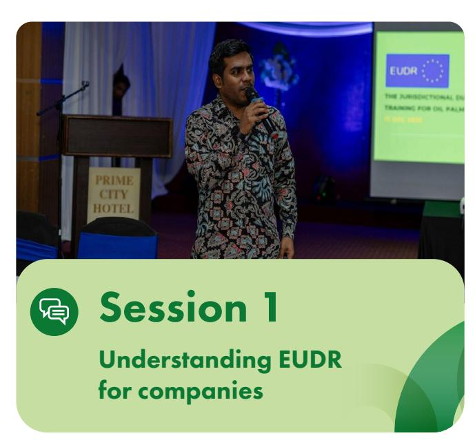

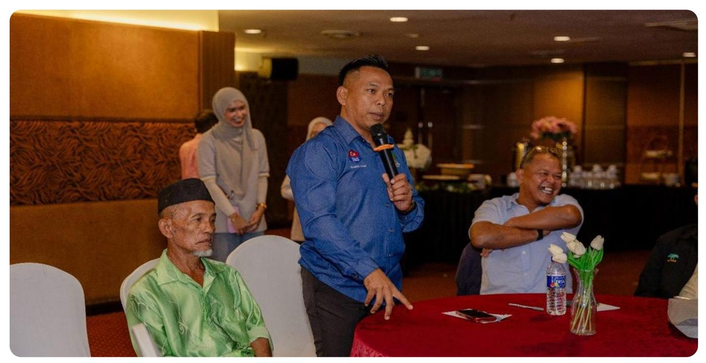

1. Why are oil palm plantations not considered forests?

2. If the land is over 4 hectares, can the polygon be determined from a boundary stone?

### Answer

### Answer

Oil palm plantations are not considered forests because, according to the FAO's dewnition, a forest must contain a diverse mix of species and is not only under agricultural use.. Oil palm plantations are monocultures, meaning they consist of only one type of tree, which signiwcantly reduces biodiversity. Unlike natural forests, they lack the variety of plants and animals that make forests ecologically rich and resilient.

Yes, it can. Boundary stones act as physical markers for farm limits, property lines, and internal block divisions, ensuring plot demarcation and legal compliance that is recognised by the Department of Land and Survey or a certiwed surveyor.

*Figure 4: Khairul Aman Mohd Syah, Chairman of NASH Johor, is asking a question to Ravisangkar*

6. Why is Malaysia obliged to comply with EUDR despite the EU not being the main importer?

6. How much oil palm is Malaysia supplying to Europe?

3. Regarding the EU's palm oil ban, how will EUDR impact Malaysia's palm oil export to the region?

4. Will EUDR-compliant products receive a premium price?

### Answer

### Answer

### Answer

### Answer

Many Fast-Moving Consumer Goods (FMCG) that contain palm oil are exported to Europe. Therefore, FMCG companies must prove their ingredients are sustainably sourced, which necessitates EUDR compliance for the palm oil used.

The EU does not import as much palm oil from Malaysia compared to China and India.

\*According to [The Edge Malaysia](https://theedgemalaysia.com/node/786789), EU is the third largest palm oil importer for Malaysia, 944,567 tonnes shipped from January to November 2025, accounting for about 6.8% of total Malaysian palm oil exports.

Smallholder Comment: Smallholders are generally willing to comply, but many encounter challenges related to land title and inheritance issues. They suggested that government agencies, such as the Department of Land and Survey, should provide support in resolving these matters to enable full compliance.

The EU still buys palm oil, but EUDR aims to discourage deforestation activities. Most Malaysian commodities are essentially compliant, and MPOB and MRB are enhancing data collection for traceability.

Unlike RSPO, EUDR never explicitly stated that a higher price would be granted. The price depends on the supply and demand for EUDR compliance.

The session highlighted the role of the Malaysian Palm Oil Board (MPOB), which was formed from the merger of Palm Oil Research Institute of Malaysia (PORIM) and Palm Oil Registration and Licensing Authority (PORLA).. MPOB functions as the agency responsible for administering, controlling, and supervising all activities related to palm oil, ensuring the integrity of the industry and protecting stakeholders, including smallholders. MPOB operates under the MPOB Act 1998, which sets out regulations covering licensing, quality, compounds, and levy.

All activities involving oil palm products, from production and sale to export and manufacturing, must be licensed. The only exception is the storage of palm oil products in packages not exceeding 25 kilograms. Licensing applications are managed through the e-LesenPK system, but smallholders can also visit regional MPOB oɜces for assistance. Licenses are free and valid for Àve years, although a late renewal incurs a fee of RM50.

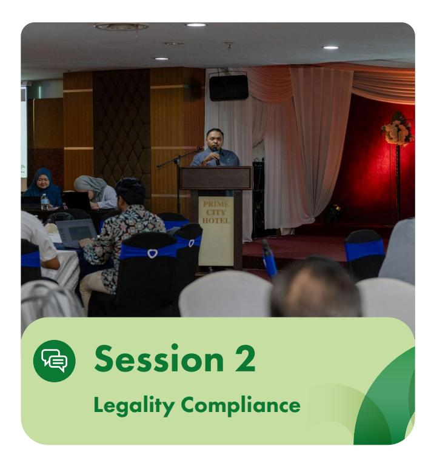

*Figure 5: Nurul Anuar Azman, Head of Oɝce, Licensing & Enforcement Division, MPOB Kluang*

Smallholders who wish to register must meet speciÀc requirements. These include selling fresh fruit bunches (FFBs) from land they own or lease that is less than 100 acres, holding valid identiÀcation such as an ID card or company registration, and cultivating oil palm for at least two years. Required documents include land titles, lease or rental agreements, written approval for shared land, and identity documents with home addresses for each owner.

The MPOB license carries several important beneÀts. It is a legal requirement for smallholders, protects the rights of smallholders and farm workers, and ensures that business transactions are legal and pricing is fair. It also provides traceability for FFBs, allowing smallholders to participate in government incentive programs and enhancing their credibility. Furthermore, the license supports the sustainable palm oil industry by aligning with national and international requirements, including the Malaysian Sustainable Palm Oil (MSPO) certiÀcation and the European Union Deforestation Regulation (EUDR).

The MPOB license also serves as a legal document demonstrating that smallholders comply with national requirements. It ensures the traceability of FFB origins, which is a key requirement for EUDR compliance, and helps smallholders remain eligible to participate in both local and global supply chains.

In the Q&A session, MPOB provided clariÀcations on smallholders' concerns regarding rights to legal documentation, integrity of smallholders and dealers, and shared land ownership. Smallholders are required to retain the original copy of their MPOB license, while dealers keep a copy for record purposes. MPOB's Licensing and Enforcement Division conducts regular Àeld and dealer inspections to ensure that only licensed smallholders supply fresh fruit bunches (FFBs).

Jointly owned land may be registered under separate names, although formal land division according to ownership shares is recommended prior to registration. In addition, the MPOB license serves as legal proof of compliance with national regulations and supports traceability requirements under the EUDR. For license renewal involving inherited land, an aɜdavit1 and supporting documents such as a death certiÀcate may be required, subject to veriÀcation by MPOB oɜcers.

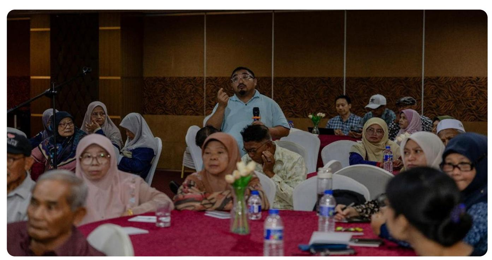

1 Aɜdavit is a declaration within the renewal form conÀrming that all information provided is true.

## MPOB Licensing Counter

As part of the Dialogue, the MPOB Licensing and Enforcement Division of Kluang established a dedicated counter to facilitate registration and renewal of MPOB licenses for smallholder participants, as well as to provide advisory services for smallholders seeking clariÀcation, guidance, or advice on licensing, land status, and compliance matters. This initiative directly supports the Dialogue's objectives by improving understanding of Malaysian legal requirements, ensuring compliance with licensing regulations, and highlighting the link between national compliance and EU Deforestation Regulation (EUDR) requirements for sustainable supply chains.

Smallholders wishing to register or renew their licenses were required to provide:

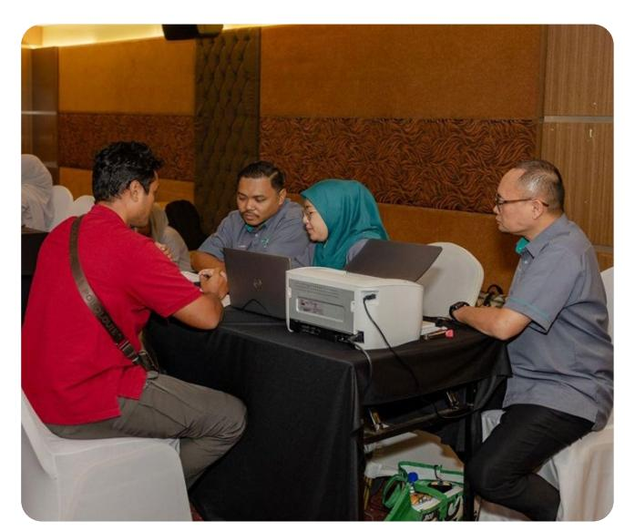

- 1. Valid legal identiÀcation either an ID card for individuals or oɜcial company/cooperative/ partnership documents.
- 2. Proof of land or premises ownership, including land titles, lease agreements, or written approvals for shared land.

The licensing counter provided practical, handson guidance, allowing participants to clarify requirements, submit applications, and resolve issues related to license or land status. Smallholders who submitted applications during the session were assisted throughout the process to ensure successful approval by MPOB.

This activity also enhanced awareness of sustainability standards and certiÀcation requirements, such as MSPO Part 2-1, by demonstrating how proper licensing under MPOB contributes to traceability, credibility, and eligibility for both national and international supply chains. Furthermore, the session allowed participants to observe best practices and lessons learned for accelerating license applications and renewals at the district level, providing a model for other smallholders to follow.

Overall, the licensing counter not only ensured regulatory compliance but also strengthened smallholder readiness to participate in sustainable palm oil initiatives, bridging national legal frameworks with international market requirements under the EUDR.

*Figure 8: Smallholder at MPOB Licensing counter*

The session highlighted the Malaysian Sustainable Palm Oil (MSPO) certiÀcation, which is governed by MSPO, a government-linked body under the Ministry of Plantations and Commodities (MPC). The MSPO

*Figure 10: MSPO CertiÀcation Process Flow: (1) preparation, (2) application, (3) preliminary audit, (4) peer review, (5) award of certiÀcation, (6) audit, (7) re-certiÀcation*

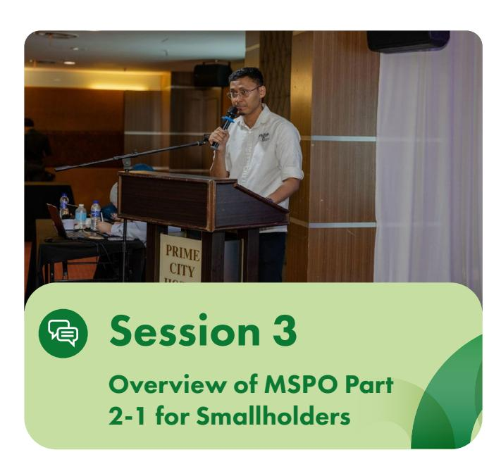

*Figure 9: Ahmad Soɝan Ali, Executive, Industry Development Unit, MSPO*

certiÀcation was Àrst introduced in 2015 through the MSPO 1.0 guidelines for voluntary certiÀcation. In 2017, the Malaysian government made MSPO certiÀcation mandatory and established a dedicated governing body to oversee its implementation. The MSPO 2.0 framework was launched in 2022 to cover the entire palm oil supply chain. CertiÀcation is currently mandatory for mills, plantations, palm kernel oil mills, crushers, and oleochemical operators, with collection centres set to comply starting next year. Over 90% of smallholders are already MSPO certiÀed. While MSPO has eight scopes, smallholders need only focus on the General Principles for Smallholders, which are designed to be lighter and more accessible.

The certiÀcation process involves several steps, including preparation, application, preliminary audit, peer review, and the award of certiÀcation. Once awarded, the certiÀcation is valid for Àve years, with regular audits conducted throughout the period to ensure continued compliance. MPOB TUNAS oɜcers are available to assist smallholders in preparing for the audits and meeting certiÀcation requirements.

> **Penilaian Silang (Peer Review) Semakan Laporan Audit.** Penilaian oleh *Peer Reviewer*.

Smallholders are expected to adhere to the Àve core principles of MSPO. These include management commitment and individual responsibility, transparency, compliance with legal and other requirements, responsibility for social, health, safety, and employment conditions, and the sustainable management of the environment, natural resources, biodiversity, and ecosystem services. Compliance with these principles ensures that smallholders contribute to a sustainable palm oil industry and enhances their access to both local and international markets.

### **Five Principles of MSPO:**

Management and commitment responsibility

Transparency

Compliance with laws and other requirement

Responsible to social, health, safety, and employment

Environment, resources, biodiversity and ecosystems services

1. What is the relation between EUDR and MPOB registration, from MSPO's perspective?

2. Can MSPO come to the smallholder's village for a briewng session?

### Answer

### Answer

MSPO certiwcation supports EUDR compliance by providing veriwable documentation on legality and sustainability. It aids in the risk assessment required under EUDR, helping smallholders demonstrate that their palm oil is deforestation-free and in line with national standards.

Yes, they can send a formal invitation to MSPO.

Smallholder Comment: Smallholders recommended that the government promote innovation to develop and diversify palm oil products.

## Q&A Session

1. How to contact NASH in Johor?

### Answer

Khairul Aman provided contact information for several districts including Pontian, Labis, Batu Pahat, and Kluang.

Smallholder Comment: Some smallholders reported facing land title issues following the passing of the original owners (their parents). While they are skilled in farm management, they often lack proper documentation of both land ownership and farm performance.

The session highlighted the role of the National Association of Smallholders (NASH), which has approximately 250,000 registered members. NASH Johor actively organizes Àeld programmes in collaboration with NGOs to enhance smallholders' knowledge and capacity in good agricultural practices (GAP), including plantation management, fertilization, and accurate data collection. These initiatives are designed to support smallholders in meeting national

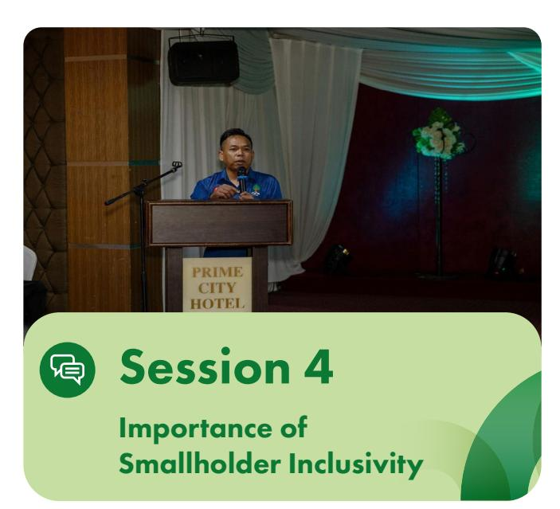

*Figure 11: Khairul Aman Mohd Syah, Chairman, NASH Johor*

and international sustainability requirements, such as MSPO, RSPO, and the European Union Deforestation Regulation (EUDR). By equipping smallholders with practical skills and technical guidance, these programmes help ensure compliance and traceability, which are critical for accessing global markets.

Looking ahead to 2026, NASH plans to focus on speciÀc districts in Johor, working closely with partners and Solidaridad to address recurring challenges faced by smallholders. The association also engages in advocacy, communicating with the Agriculture Executive Council of Johor2 to raise concerns related to land title status and inheritance. NASH emphasizes that union membership is recommended for smallholders facing land title challenges, as unionized smallholders typically receive faster assistance from the state government.

Through training and technical support on certiÀcation and EUDR compliance, NASH plays an important role in promoting smallholder inclusivity in the palm oil supply chain. These eɛorts ensure that smallholders are empowered to meet both national legal requirements and international sustainability standards, helping them remain active participants in global markets while supporting a transparent and sustainable palm oil industry.

Aɜdavit is a declaration within the renewal form conÀrming that all information provided is true.

The session featured an overview of the Johor Plantation Group (JPG), a subsidiary of Johor Corporation (JCORP), which manages 23 plantations and Àve mills, all certiÀed under MSPO and RSPO. Nearly 30% of JPG's fresh fruit bunch (FFB) supply is sourced from dealers, who work with approximately 2,148 independent smallholders, all registered with MPOB.

EUDR compliance is a key priority for JPG, as smallholders contribute 40% of Malaysia's palm oil supply. Ensuring compliance enhances access to EU markets and reduces reputational risks for buyers. JPG has identiÀed several challenges aɛecting smallholders, including documentation and traceability gaps, limited organizational capacity, productivity issues, and restricted access to funding.

To address these challenges, JPG established the Smallholder Inclusion Program (SIP) in 2012. The program aims to empower smallholders to produce sustainable, high-quality, and fully traceable FFB, while improving livelihoods through better productivity, pricing, and market access.

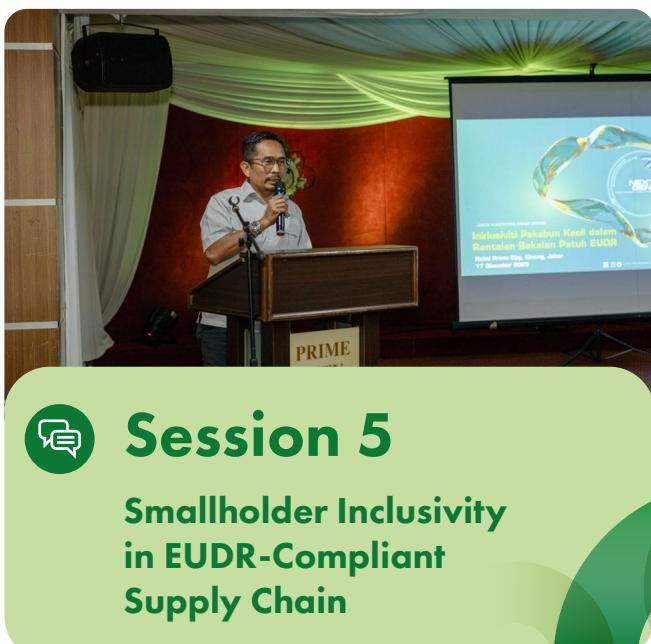

*Figure 12: Mohd Zahir Mohamed Said, Deputy Manager, Sustainability Department, Johor Plantation Group*

SIP has set clear aspirations for the coming years. These include maintaining 100% FFB external supplier traceability from 2025 onward, achieving full improvement of smallholder livelihoods through RSPO certiÀcation by 2035, and ensuring a 100% deforestationfree supply chain through EUDR compliance. RSPOcertiÀed smallholders are also eligible for incentives.

The program is implemented through Àve main initiatives.

### Supply Chain Traceability Program

Includes farm data collection (location/license/ certiÀcation), dealer/ramp visits, and EUDR preparation.

### RSPO/MSPO Certification Initiative

Encourages Group CertiÀcation and provides technical assistance and training.

Includes FFB Contract Signing Ceremony and brieÀngs on NDPE Policy and EU market implications.

### EUDR Compliance and NDPE Monitoring

Provides Geolocation Packages, technical support for polygon mapping, and satellite images to monitor deforestation.

### Smallholder Training and Capacity Building

Oɛers training on GAP, Best Management Practices (BMP), EUDR, and farm SOP.

# Conclusion

**The Jurisdictional Dialogue in Johor concluded with a clear emphasis on preparing Malaysian oil palm smallholders to be able to provide information and documents to clients that need to meet the requirements of the European Union Deforestation Regulation (EUDR). Recognizing that smallholders contribute 40% of national palm oil production, the event highlighted that production in line with EUDR requirements, centered on the post-31 December 2020 cutoɛ, adherence to national laws, and provision of farm geolocation, is essential for maintaining market access. The role of local governance is critical. The mandatory MPOB license serves as the primary legal document for traceability and national compliance, while MSPO certiÀcation provides a supporting framework for EUDR risk assessment. Although the EU is not Malaysia's largest importer, the high demand from Europeanexporting Fast-Moving Consumer Goods companies makes EUDR compliance globally signiÀcant.**

**To address challenges such as documentation and traceability, a strong collaborative ecosystem has been established. Initiatives like Johor Plantation Group's Smallholder Inclusion Program provide smallholders with technical assistance, training, polygon mapping support (from JPG tool), and guidance on RSPO and MSPO certiÀcation as well as overall EUDR readiness. Organizations such as the National Association of Smallholders (NASH) actively advocate for smallholders, particularly on recurring issues like land title status and inheritance, which remain among the main barriers to full compliance.**

**The overarching message is that with sustained support, knowledge-sharing, and government intervention on land issues, the industry can achieve a fair, deforestationfree, and sustainable supply chain that ultimately beneÀts smallholders through improved incomes and access to both local and international markets.**

## Q&A Session

1. How many collection centres/ramps are under JPG's supply chain?

### Answer

JPG's supply chain includes 19 ramps receiving FFB from independent smallholders and 3 ramps for scheme smallholders. The list of ramps can be obtained from JPG ofwcers at the event.