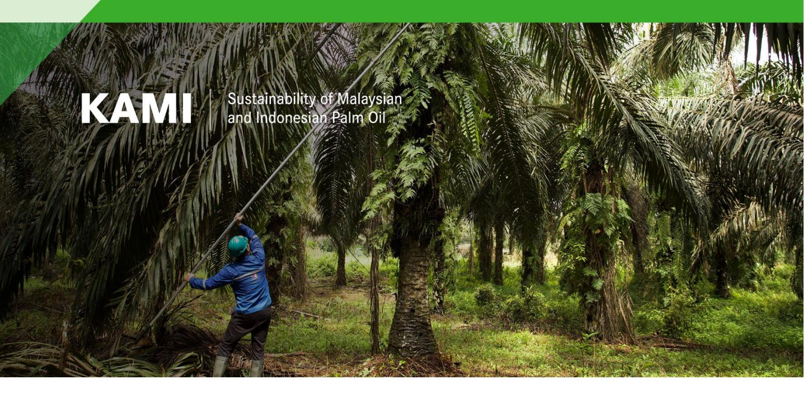

# **Indigenous Oil Palm Smallholders in Indonesia's State Forest and the EU Deforestation Regulation**

## **Key points**

- The European Union Deforestation Regulation (EUDR) requires all palm oil placed on the EU market to be deforestation-free and produced in accordance with relevant legislation of the country of production while the preamble notes that action under the Regulation should take into account the UN Declaration on the Rights of Indigenous Peoples.
- In Indonesia, indigenous communities located in areas designated as state forest (*Kawasan hutan*) face challenges in meeting EUDR requirements because they have limited means to demonstrate legal land use rights. Issues also exist in relation to collecting and transferring geolocation and traceability information and demonstrating deforestation-free production.
- While many smallholders in Indonesia face the same problems, customary communities are particular disadvantaged because they often traditionally reside within the state forest zone where plantations are generally considered illegal under statutory law. Additionally, unlike many other smallholders, members of customary communities have not usually been allocated land rights through government programmes, e.g. transmigration.
- Under the Indonesian Job Creation Law,[1](#page-0-0) there are two instruments to address the legality of oil palm plantations in the state forest: the Social Forestry Programme (*Perhutanan Sosial*) and the Agrarian Reform Programme (TORA). However, currently these provide only partial and temporary solutions to issues regarding indigenous smallholders' oil palm plantations in the state forest zone.
- Through the Social Forestry Programme customary communities can be given management and use rights of natural forest but oil palm planting is not allowed. Existing oil palm plantations may be managed for one rotation of 25 years in

1 Law of the Republic of Indonesia No. 11 of 2020 on Job Creation

production forest and 15 years in protection or conservation forest. However, participants are required to provide evidence of at least five years residence, join specific forestry schemes, and cultivate less than five hectares per person.

- The Agrarian Reform (TORA) provides for the release of degraded forest areas from the state forest zone, which then can be used for cultivation by customary communities. The scheme requires a proof of communal residence for five years. Individual land titles require a proof of residence and land management for at least 20 years. There is maximum land allocation of five hectares per person.
- In Katingan District, Central Kalimantan province, and elsewhere in Indonesia progress with both Social Forestry and TORA programmes is hampered by the difficulties communities face in meeting the requirements. To ensure that customary communities in Indonesia can participate in legal and deforestation-free supply chains, the following actions can be considered: o Reconcile national and sub-national level regulations to ensure consistency and allow acceleration of registration and recognition of customary land (District and province governments). o Accelerate the identification, demarcation, and allocation of customary land (District and province governments). o Accelerate the identification and demarcation of oil palm in customary land areas within the state forest (Ministry of Forestry, Ministry of Agriculture and sub-national government institutions). o Provide technical and financial support for the demarcation of customary forest lands and identification of oil palm areas (EU and other development partners[2](#page-1-0) ). o Revise regulation P9/2021 to allow permit recognition of oil palm inside customary forest areas as part of the social forestry programme, without need for specific/additional schemes (Ministry of Forestry). o Allow customary land holders cultivating oil palm under social forestry within state forests areas to receive cultivation registration certificates (STD-B) and Indonesian Sustainable Palm Oil (ISPO) certification given that social forestry permits are valid for 35 years and may be extended (Ministries of Forestry, Agriculture, Agrarian Affairs, Home Affairs).

### **Introduction**

### **Customary land rights, state forest and oil palm in Indonesia**

Indonesia has the third largest expanse of tropical forest in the world (FAO 2020). In 2023, Indonesia's State Forest area (*Kawasan Hutan*) covered 118 million hectares, of which 88 million hectares were forested (Ministry of Forestry 2024). Indonesia's second largest land use category is the area for other use (APL, *Area Pengunaan Lain*), which is intended for agricultural use. It covers 69.7 million hectares, of which 8 million hectares are forested (Ministry of Forestry 2024).

2 EUDR Article 30.3 notes "Partnerships and cooperation shall […] strengthen the rights of forest- dependent communities, including smallholders, local communities, and indigenous peoples, whose rights are set out in the UN Declaration on the Rights of Indigenous Peoples".

The forest areas in Indonesia are home to many indigenous communities, commonly known as *Masyarakat Hukum Adat* (MHA). The International Work Group for Indigenous Affairs (IWGIA) estimates that between 50-70 million indigenous people in Indonesia (between 18% and 26% of the country's population) are located within the country's forest areas[3](#page-2-0) . According to the Indonesian Ancestral Domain Registration Agency for Customary Lands (BRWA), as of November 2024 there are 17.4 million registered hectares of customary lands in Indonesia, of which 3.5 million have been verified and 1.8 million certified[4](#page-2-1) .

*Masyarakat Hukum Adat* (MHA) is the term used to refer to indigenous communities in Indonesia. The Indonesian constitution states that: "The State recognizes and respects *Masyarakat Hukum Adat* along with their traditional customary rights as long as these remain in existence and are in accordance with the societal development and the principles of the unitary State of the Indonesian Republic and shall be regulated by law" (Fahmi et al 2023). Thus, indigenous communities are formally recognised in Indonesia if their social structures continue to exist, and their existence does not obstruct the unitary nature of the state and its economic development.

For much of recent history, indigenous land rights in Indonesia have been superseded by economic development priorities and political unity prerogatives, especially during the New Order era of 1967-1998 (Arizona 2022). The situation changed after 1998, when the democratisation and decentralisation period induced reforms in forestry regulations and created greater space for customary landowners and their rights. This policy reform process culminated in the 2013 Constitutional Court decision No. 35 which proclaimed that customary community land inside the state forest is no longer considered state forest and thus should be excluded from the state forest zone (Arizona 2022; EFI 2018).

In response to the 2013 Constitutional Court decision, government ministries introduced implementing guidelines. The key among them is the Ministry of Home Affairs Regulation No 52 of 2014 concerning "Recognition and Protection of Indigenous Peoples". Subsequently, the Ministry of Environment and Forestry (MoEF) approached the issue by considering the Social Forestry Programme as a means to provide management and land use rights for customary community land area is located inside the state forest (Rakatama 2020). Customary communities located outside of the state forest, were considered eligible to acquire land rights under the Agrarian Reform Programme (TORA) led by the Ministry of Agriculture (Salim 2021).

Smallholder oil palm plantations located in forest areas in Indonesia are often managed by indigenous communities. Unlike transmigrant farmers, who typically cultivate less than two hectares of legally titled land allocated through government-sponsored programmes, customary smallholders often manage larger, dispersed plantations which lack formal land titles (Bakhtiar et al 2019). As a result, oil palm plantations under customary management lack documentation necessary to demonstrate compliance with legal and deforestation-free production requirements such as exist under the European Union Deforestation Regulation (EUDR).

3[https://www.iwgia.org/en/indonesia.html#:~:text=Indonesia%20is%20the%20home%20of,to%2070%20million%2](https://www.iwgia.org/en/indonesia.html#:%7E:text=Indonesia%20is%20the%20home%20of,to%2070%20million%20Indigenous%20Peoples) [0Indigenous%20Peoples](https://www.iwgia.org/en/indonesia.html#:%7E:text=Indonesia%20is%20the%20home%20of,to%2070%20million%20Indigenous%20Peoples)

4 <https://brwa.or.id/sig/>

#### **EU Deforestation Regulation and indigenous peoples' rights**

The EU Deforestation Regulation requires all palm oil products placed on the EU market to be deforestation free and produced according to relevant legislation of the country of production (EC 2023). EUDR Article 2 (Definitions) defines 'relevant legislation of the country of production' as the 'laws applicable in the country of production concerning the legal status of the area of production in terms of' eight areas including:

- Third parties' rights (including rights to use and tenure affected by producing the relevant commodities and products, and traditional land use rights of indigenous peoples and local communities[5](#page-3-0) )
- The principle of free, prior and informed consent (FPIC), including as set out in the UN Declaration on the Rights of Indigenous Peoples

Article 8 of EUDR requires EU operators to exercise due diligence prior to placing relevant products on the EU market. This includes risk assessment (Article 10), which should take into account the following criteria relevant to indigenous peoples:

- presence of indigenous peoples in the country of production or parts thereof
- consultation and cooperation in good faith with indigenous peoples in the country of production, or parts thereof
- existence of duly reasoned claims by indigenous peoples based on objective and verifiable information regarding the use or ownership of the area used for the purpose of producing the relevant commodity

While these and other references to indigenous peoples in the EUDR primarily refer to protection of the rights of indigenous people in the context of the legal status of the area of production, the preamble additionally notes that "action under this Regulation should take into account the importance of existing global agreements, commitments and frameworks contributing to the reduction of deforestation and forest degradation such as […] the UN Declaration on the Rights of Indigenous Peoples." In relation, Article 26.2 of the latter notes that "Indigenous peoples have the right to own, use, develop and control the lands, territories and resources that they possess by reason of traditional ownership or other traditional occupation or use, as well as those which they have otherwise acquired." (UN 2007).

This brief highlights EUDR compliance issues regarding palm oil products from indigenous peoples' plantations in the state forest zone in Indonesia and explores possible solutions. The following section reviews the current situation with oil palm plantations inside the state forest zone in Indonesia while section 3 presents information on options to address legal land use rights issues drawing on experience from Central Kalimantan. Section 4 summarises key challenges in relation to the EUDR that face customary groups producing palm oil. The final section provides some points for consideration on legal recognition of oil palm in customary forests in Indonesia's state forest and compliance with both national regulations and EUDR requirements.

5 Additional explanation in brackets from EUDR Guidance Document (EC 2024) section 6 on legality.

## **Oil palm plantations in state forest areas in Indonesia**

A key legality issue in state forest areas in Indonesia is the presence of oil palm plantations managed by companies and local communities including customary groups. According to the Ministry of Environment and Forestry (MOEF[6](#page-4-0) ), a total of 3.37 million hectares (20%) of the 16.8 million hectares of oil palm plantations in Indonesia fall within forest zone (Purwanto et al 2020). Of the 3.37 million hectares, around 1.3 million (38.2%) belong to smallholders including customary groups (Bakhtiar et al 2019). Oil palm plantations both company and community managed are considered illegal under Indonesian laws.

A main reason for the existence of large areas of oil palm in state forest areas is lack of coordination between the central and local governments (Bakhtiar et al 2019). Two provinces stand out in terms of oil palm in State Forest: Riau Province (1.23 million ha) and Central Kalimantan Province (0.98 million ha) making up 65% of the total area of oil palm in the state forest. Limited monitoring by authorities, lack of law enforcement and lack of transparency have been listed as reason for continuation of the issue (Jong 2021). The root of much of the problem, however, lies relates to the decentralisation era in the early 2000s when large areas of land were issued by local authorities for concessions or were cultivated by indigenous communities and migrants (Setiawan 2016). Decentralisation of land management was reversed in 2004[7](#page-4-1) , but the allocated concessions continued to operate and in the case of customary groups, indigenous peoples' rights and livelihoods also need to be considered.

The Job Creation Law of 2020 includes provisions to address the legality issue whereby corporate actors should secure forest release permits from the Ministry of Forestry and settle relevant penalties. For smallholders and customary communities, options under social forestry and agrarian reform programmes are noted.

# **Possible solutions for indigenous smallholders' oil palm in state forest**

The main instruments relevant in resolving illegal oil palm in the state forest are rooted in the Job Creation Law (UUCK) of 2020. Based on this regulation, subsidiary Government Laws (PP) No. 23[8](#page-4-2) and 24[9](#page-4-3) of 2021 were formulated together with sectoral regulations to provide tailored solutions for oil palm plantations operating in state forest areas.

The key government initiatives relevant in addressing legality of oil palm in customary areas are the Social Forestry and Agrarian Reform Programmes (Kehati 2020). The government of Indonesia has allocated at least 12.7 million hectares of forest land for Social Forestry and

In November 2024, MoEF was split into two Ministries: The Ministry of Environment and the Ministry of Forestry. 7 Law No. 32/2004 on "Subnational Government" and Law No. 33/2004 on "Fiscal Balance between Central and

Local Governments".

8 Forestry Administration.

9 Procedures for Imposing Administrative Sanctions and Procedures for Non-Tax State Revenue Derived from Administrative Fines in the Forestry Sector.

around 9 million hectares for Agrarian Reform to address landlessness and clarify the legal status of community land[10](#page-5-0) .

If the customary land is located inside the state forest zone, the means to operationalise a claim is through the Social Forestry programme based on MoEF Regulation No. 9 of 2021 on the Implementation of Social Forestry (UGM 2022). If the customary land claim is in area for other use (APL), the allocation of the land title is guided by the ATR/BPN Regulation No. 18 of 2019 concerning the "Procedures for the Administration of Customary Land of Indigenous Law Communities" (Warman and Fatimah 2023). In 2023, this regulation was augmented with the Presidential Regulation Number 62 of 2023 on the "Acceleration of the Implementation of Agrarian Reform."

### **Options under the Social Forestry Programme**

To address legality issues regarding oil palm managed by communities inside the state forest, MoEF developed the '*Jangka Benah*' approach. This approach originates from the Government Regulation No. 23/2021 and is rooted in MoEF 2021 regulations including No. 7 (changes in forest planning and zonation), No. 8 (forest management planning), and No. 9 (implementation of social forestry). Based on this framework, oil palm located inside state forest may be legalised for 25 years (one full plantation cycle) if located in production forest zone, or for 15 years if located in protection or conservation forest.

MoEF Regulation No 9/2021 lays out a number of requirements that must be met as part of the legal recognition process (UGM 2022). The first is that legal recognition of oil palm cannot be done under the general framework of social forestry permits for customary communities, which are valid for 35 years once issued. Instead, customary communities must apply for the social forestry permit for oil palm area (*persetujuan perhutanan sosial pada areal kebun*, or PPSPAK), which has a more limited duration depending on the location of the plantation. Secondly, to apply for PPSPAK, customary communities must follow one of three prescribed schemes: village forest (*hutan desa*), community forest (HkM), or forestry partnership (*Kemitraan Kehutanan*). They must also meet requirements related to the five year proof of residence and five hectare per person limit and must perform forest rehabilitation activities - planting natural forest trees - as prescribed in MoEF Regulation No 9/2021. At the end of the legalised period of oil palm cultivation, the designated areas are to revert to natural forest.

The social forestry framework offers a partial and temporary solution for oil palm managed by customary communities in the state forest zone. Even if the regulatory requirements are followed and implemented in full, however, neither social forestry permits for customary land nor for customary oil palm plantation are currently eligible as a basis for cultivation registration (STD-B) or Indonesian Sustainable Palm Oil (ISPO) certification. For this reason, oil palm from customary areas would still remain outside legal oil palm supply chain in Indonesia.

10 <https://www.forestdigest.com/detail/2502/beda-tora-perhutanan-sosial>

#### **Options under the Agrarian Reform Programme**

Presidential Regulation No. 86/2018 is the basis for the implementation of the Agrarian Reform programme (*Tanah Objek Reforma Agraria*, or TORA). In 2023, it was enhanced through Presidential Regulation No. 62 on the "Acceleration of the Implementation of Agrarian Reform". The agrarian reform policy aims to redistribute nine million hectares of land to farmers in Indonesia, around half of which are unproductive forest areas made available by the Ministry of Forestry (Resosudarmo et al. 2019). Land redistribution from the release of state forest areas and/or changes to forest area boundaries set by the Ministry of Forestry is one of the sources of land for TORA (UGM 2022). In 2017, the Ministry of Forestry issued an indicative Map of Forest Land Allocation for TORA, which identified 4.8 million hectares of the State Forest Estate that could be reallocated for TORA[11](#page-6-0). Presidential Regulation No. 62 of 2023 additionally specified that corporate concession holders that secure forest release from the Ministry of Forestry must allocate 20% of that area for TORA.

TORA presents opportunities and challenges to prospective customary group participants and others. To qualify for ownership of land released from the state forest zone under TORA, evidence of at least five years residence for a group registration, or twenty years for individual land titles is required. In addition, there is a maximum area limit of five hectares per person. These requirements present a serious challenge and are among key factors behind the slow progress of TORA (Warman and Fatimah 2023; Cahyana 2024). In many cases, the only available document is a *Surat Keterangan Tanah* (SKT), a land certificate issued by the village head that until recently has had little formal recognition (EFI 2024). The land size limit presents problems for indigenous communities because their territories are often large and agricultural traditions such as shifting cultivation are frequently practiced.

Challenges facing customary communities with oil palm plantations in both the state forest area and other use land area (APL) are well illustrated by the experience in Katingan District and more widely in Central Kalimantan[12](#page-6-1). To recognise customary communities and their land rights, Central Kalimantan provincial government and constituent district governments have developed supporting regulations. In Central Kalimantan this is the Governor Regulation No. 13 of 2009 concerning "Customary Land and Customary Rights in Central Kalimantan Province". In Katingan District, the provincial directive was translated into two subsidiary regulations:

- 1. *Katingan District Regulation Number 34 of 2018* on the "Procedures for Proposal and Establishment of Customary Forests in Indigenous Community Areas of Katingan Regency".
- 2. *Katingan District Regulation Number 4 of 2022* on the "Recognition and Protection of Indigenous Peoples."

While well intentioned, both province- and district-level regulations are currently either misaligned with national regulations or take steps considered as regulatory overreach (see footnote 10). For instance, the provincial regulation not only provides guidelines for the

11 <https://kukuh.menlhk.go.id/tora>

12 The description of the issues affecting indigenous communities in Katingan District and Central Kalimantan province is based on the information provided by Javlec staff who have extensive experience working in the area: <https://javlec.org/>

recognition of customary communities but also provides for the allocation of customary land titles SKTA (*Surat Keterangan Tanah Adat*). In addition, for oil palm growing with customary areas with the state forest area, Katingan District's Food Security and Agriculture Agency issues Plantation Certificates (*Surat Keterangan Kebun*/SKK). Such titles are not recognised by the central government.

The two Katingan regulations are currently not being implemented because of inconsistencies with Ministry of Home Affairs regulations and the Ministry of Agrarian Affairs and Spatial Planning regulation No 14 of 2024 on the "Implementation of Land Administration and Registration of Ulayat and Traditional Law Communities". Efforts are now being made to revise district and province regulations to align.

Seeking solutions for oil palm located in forest areas, Katingan District followed available regulatory options. Based on Government Regulation No. 23/2021 on Forest Management and Presidential Regulation No. 62/2023 on "Acceleration of the Implementation of Agrarian Reform", Katingan sought to obtain a transfer of unproductive forest from the state forest zone to APL for allocation under TORA. The district succeeded in gaining release of 69,454 hectares within which customary land could be recognised under TORA. However, the recurrent problem of proving the minimum period of residence and staying within the land area limit has slowed progress.

# **Challenges facing oil palm in customary forest to meet EUDR requirements**

The EUDR, adopted to curb the import of commodities linked to deforestation, presents both challenges and opportunities for palm oil products from indigenous groups' plantations inside state forest areas. The regulation takes into account indigenous peoples' rights and although regulatory steps have been taken in Indonesia to recognise customary groups' land rights many issues remain. Customary groups will therefore face multiple barriers in accessing supply chains under the EUDR. These include problems not only with legal recognition of land rights but also with meeting traceability and deforestation-free requirements:

#### **Legal production**

Smallholder oil palm plantations in state forests, including those belonging to customary groups, remain legally unrecognised under Indonesian law. Social Forestry and TORA Programmes offer potential solutions, but these are partial and temporary in nature. Because smallholder cultivation registration certificates (STD-B) and ISPO certificates are legally required in Indonesia but cannot be obtained in state forest areas covered by Social Forestry permits, or Social Forestry Plantation Permits, oil palm grown in these areas is noncompliant with the EUDR (EFI 2024).

### **Traceability**

The EUDR imposes strict requirements for geolocation for verification of palm oil area of production to ensure that commodities are not sourced from land deforested after the 31 December 2020 cut-off date. In addition to indigenous oil palm smallholders in state forest areas having unclear legality status, the plantations are largely not demarcated or included in traceability systems. These issues create significant challenges in achieving the level of traceability necessary for EUDR compliance.

### **Deforestation-free production**

Oil palm plantations managed by indigenous smallholders in state forest areas may be part of a traditional shifting cultivation system and plantations in fallow areas that meet the EUDR/FAO definition of a forest would be classified as deforestation under the regulation.

# **Conclusions and points for consideration**

While recognition of customary land rights is progressing in Indonesia, relevant processes do not yet include permanent legal recognition of oil palm managed by indigenous smallholders in state forest area. Addressing associated challenges and providing indigenous smallholders with information necessary to demonstrate legal production will require solutions that respect traditional practices while aligning with national forestry regulations.

The following points could be considered in providing long-term solutions for customary communities located in state forest to participate in EU palm oil supply chains under the EUDR:

- 1. Accelerate identification, demarcation and allocation of customary areas. Recognising customary land is the first step towards more specific measures relating to oil palm plantations (central government and sub-national agencies)
- 2. Accelerate the formulation and promulgation of district/province legislation that is consistent with central government guidelines to avoid delays in the identification and recognition of customary areas (sub-national government agencies).
- 3. Accelerate the identification of existing oil palm inside customary areas in the state forest to prepare for possible legal solutions (Ministry of Forestry, Ministry of Agriculture and sub-national government agencies).
- 4. Provide technical and financial support for development of coherent sub-national regulatory frameworks, customary land recognition, and demarcation of indigenous peoples' oil palm plantations inside forest areas (donors and development partners including the EU in the context of EUDR Article 33).
- 5. Revise regulation P9/2021 to allow for the recognition of existing oil palm plantations managed by customary groups in forest areas as part of the social forestry programme, without the need to follow for specific/additional schemes (Ministry of Forestry)
- 6. Allow customary land holders cultivating oil palm under social forestry within state forests areas to receive cultivation registration certificates (STD-B) and Indonesian Sustainable Palm Oil (ISPO) certification given that social forestry permits are valid for 35 years and may be extended (Ministries of Forestry, Agriculture, Agrarian Affairs, Home Affairs).

# **References**

Arizona, Yance. 2022. Rethinking Adat Strategies: The Politics of State Recognition of Customary Land Rights in Indonesia. PhD Thesis, Arizona State University.

Bakhtiar, Irfan et al. 2019. Hutan Kita Bersawit. [https://sposindonesia.org/wp](https://sposindonesia.org/wp-content/uploads/2019/11/Buku-Hutan-Kita-Bersawit.pdf)[content/uploads/2019/11/Buku-Hutan-Kita-Bersawit.pdf](https://sposindonesia.org/wp-content/uploads/2019/11/Buku-Hutan-Kita-Bersawit.pdf) 

Cahyana. 2024. "Ada Apa di Balik Belum Berhasilnya Reforma Agraria di Indonesia?".

UNES Law Review, [https://www.review-](https://www.review-unes.com/index.php/law/article/download/1679/1382/)

[unes.com/index.php/law/article/download/1679/1382/](https://www.review-unes.com/index.php/law/article/download/1679/1382/) 

EC. 2023. Regulation 2023/1115 on Deforestation free Products. [https://eur](https://eur-lex.europa.eu/legal-content/EN/TXT/?uri=CELEX%3A32023R1115)[lex.europa.eu/legal-content/EN/TXT/?uri=CELEX%3A32023R1115](https://eur-lex.europa.eu/legal-content/EN/TXT/?uri=CELEX%3A32023R1115) 

EC. 2024. EUDR Commission Notice. Guidance Document for the Regulation (EU) 2023/1115 on deforestation-free products. [https://eur-lex.europa.eu/legal](https://eur-lex.europa.eu/legal-content/EN/TXT/PDF/?uri=OJ:C_202406789)[content/EN/TXT/PDF/?uri=OJ:C\\_202406789](https://eur-lex.europa.eu/legal-content/EN/TXT/PDF/?uri=OJ:C_202406789) 

EFI 2018. Implementing SVLK in customary forests. [https://euredd.efi.int/wp](https://euredd.efi.int/wp-content/uploads/2022/07/Working-paper-Implementing-SVLK-in-customary-forests.pdf)[content/uploads/2022/07/Working-paper-Implementing-SVLK-in-customary-forests.pdf](https://euredd.efi.int/wp-content/uploads/2022/07/Working-paper-Implementing-SVLK-in-customary-forests.pdf) 

EFI. 2024. Inclusion of Indonesian smallholders in European Union supply chains under the EU Deforestation Regulation: Challenges and potential mitigation measures.

[https://efi.int/sites/default/files/files/flegtredd/KAMI/Resources/Smallholder\\_challenges.pdf](https://efi.int/sites/default/files/files/flegtredd/KAMI/Resources/Smallholder_challenges.pdf) 

Fahmi, Chairul, et al. 2023. "Defining Indigenous in Indonesia and Its Applicability to the International Legal Framework on Indigenous People's Rights." JILS (Journal of Indonesian Legal Studies), [https://doi.org/10.15294/jils.v8i2.68419.](https://doi.org/10.15294/jils.v8i2.68419)

FAO. 2020. Global Forest Resources Assessment 2020. Rome, <https://openknowledge.fao.org/items/d6f0df61-cb5d-4030-8814-0e466176d9a1>

Jong, H. N. 2021. "One in five hectares of oil palm in Indonesia is illegal, report shows." [https://news.mongabay.com/2021/11/one-in-five-hectares-of-oil-palm-in-indonesia-is-illegal](https://news.mongabay.com/2021/11/one-in-five-hectares-of-oil-palm-in-indonesia-is-illegal-report-shows/)[report-shows/](https://news.mongabay.com/2021/11/one-in-five-hectares-of-oil-palm-in-indonesia-is-illegal-report-shows/) 

Kehati. 2020. Indonesia Sustainable Palm Oil and the Legality of People's Palm Oil. <https://kehati.or.id/en/indonesia-sustainable-palm-oil-and-the-legality-of-peoples-palm-oil/>

Ministry of Forestry. 2024. State of the Forest Indonesia 2024. Manggala Wanabakti, Jakarta. [https://ppid.menlhk.go.id/berita/infografis/7807/the-state-of-indonesias-forests-soifo-](https://ppid.menlhk.go.id/berita/infografis/7807/the-state-of-indonesias-forests-soifo-2024)[2024](https://ppid.menlhk.go.id/berita/infografis/7807/the-state-of-indonesias-forests-soifo-2024) 

Purwanto et al. 2020. Agroforestry as Policy Option for Forest-Zone Oil Palm Production in Indonesia. Land,<https://doi.org/10.3390/land9120531>

Rakatama, Ari, and Ram Pandit. 2020. "Reviewing Social Forestry Schemes in Indonesia: Opportunities and Challenges." Forest Policy and Economics <https://doi.org/10.1016/j.forpol.2019.102052>

Resosudarmo, Ida Aju Pradnja, et al. 2019. "Indonesia's Land Reform: Implications for Local Livelihoods and Climate Change." Forest Policy and Economics <https://doi.org/10.1016/j.forpol.2019.04.307>

Salim, M. Nazir, et al. 2021. "Menyoal Praktik Kebijakan Reforma Agraria Di Kawasan Hutan." Bhumi : Jurnal Agraria Dan Pertanahan <https://doi.org/10.31292/bhumi.v7i2.476>

Setiawan, Eko N., et al. 2016. "Opposing Interests in the Legalization of Non-Procedural Forest Conversion to Oil Palm in Central Kalimantan, Indonesia." Land Use Policy, <https://doi.org/10.1016/j.landusepol.2016.08.003>

UGM Tim Strategi Jangka Benah. 2022. "Integrasi Perhutanan Sosial SJB Dengan STDB & ISPO Untuk Percepatan Pemulihan Hutan dan Peningkatan Kesejahteraan Petani." <https://jangkabenah.org/policy-brief-integrasi-perhutanan-sosial-dengan-stdb-dan-ispo/>

United Nations (UN) 2007. United Nations Declaration on the Rights of Indigenous Peoples. [https://www.un.org/development/desa/indigenouspeoples/wp](https://www.un.org/development/desa/indigenouspeoples/wp-content/uploads/sites/19/2018/11/UNDRIP_E_web.pdf)[content/uploads/sites/19/2018/11/UNDRIP\\_E\\_web.pdf](https://www.un.org/development/desa/indigenouspeoples/wp-content/uploads/sites/19/2018/11/UNDRIP_E_web.pdf) 

Warman, Kurnia and Fatimah, Titin. 2023. "Agrarian Reform in Forests Around Vernacular Settlements: Asset Reform and Access Reform in Rural West Sumatra, Indonesia". ISVS ejournal, [https://isvshome.com/pdf/ISVS\\_10-6/ISVSej\\_10.6.9.pdf](https://isvshome.com/pdf/ISVS_10-6/ISVSej_10.6.9.pdf) 

Cover photo: A member of the Tri Daya palm oil cooperative works on a plantation in Parenggean, Central Kalimantan, Indonesia. **EFI**.

**Disclaimer.** This brief has been produced with the financial assistance of the European Union. The views expressed herein can in no way be taken to reflect the official opinion of the European Union.