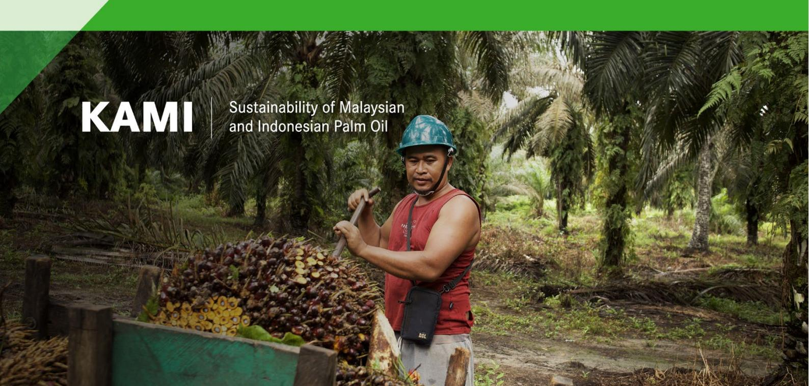
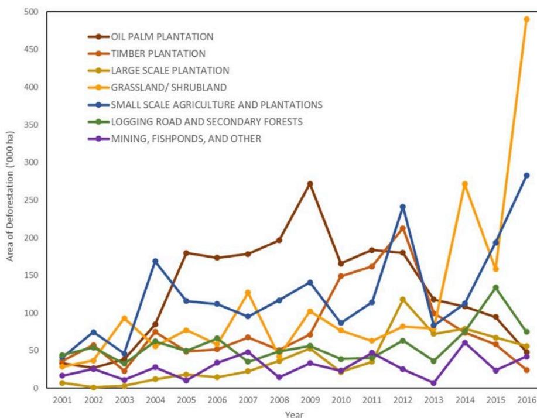
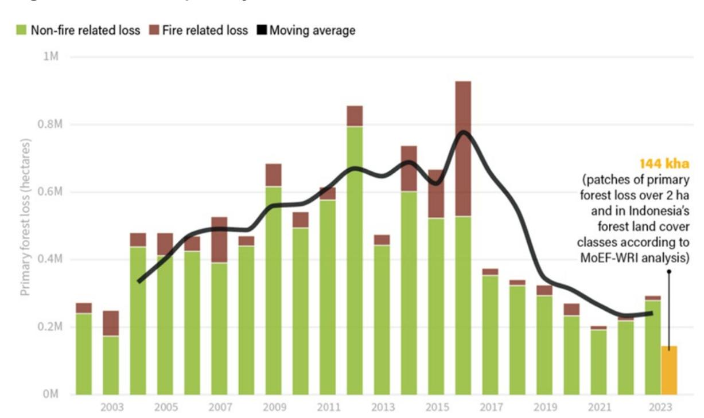
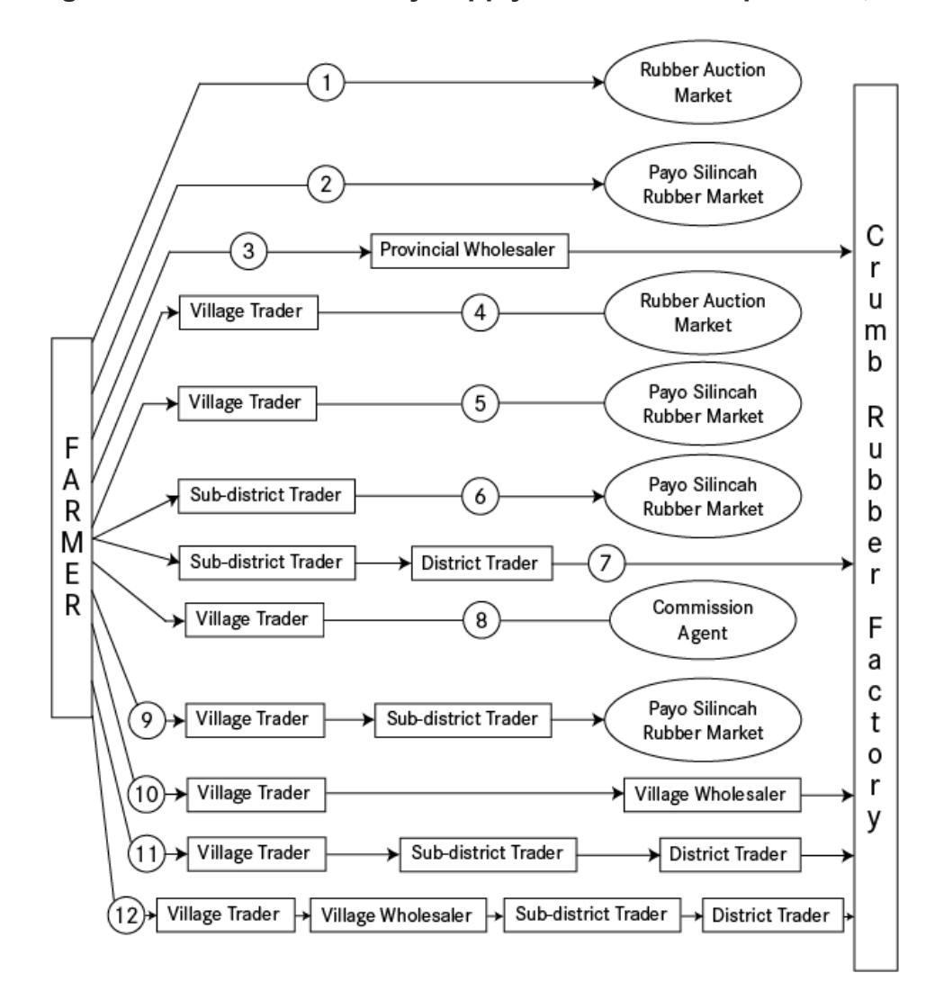
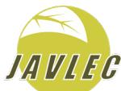

## Inclusion of Indonesian smallholders in European Union supply chains under the EU Deforestation Regulation: Challenges and potential mitigation measures

### Key points

- • The European Union Deforestation Regulation (EUDR) requires relevant commodities including cattle, cocoa, coffee, palm oil, rubber, soya and wood that are placed on or exported from the EU market to be deforestation-free and produced in accordance with relevant legislation of the country of production.
- • Once the EUDR comes into application1, EU operators and traders will be required to submit statements confirming that due diligence according to EUDR Articles 9 (Information Requirements) and 10 (Risk assessment) has been carried out and that products placed on the EU market are produced in accordance with the EUDR's legal and deforestation-free requirements.
- • More than 10 million smallholders are involved in production of the five nationally important EUDR-relevant commodities cultivated in Indonesia (palm oil, rubber, cocoa, coffee, wood), and production of three (rubber, cocoa, coffee) is dominated by smallholders.
- • Only a limited proportion of these smallholders are currently involved in supply chains to the EU. Nevertheless, smallholder product flows fluctuate, and supply chain linkages are dynamic, and most Indonesian smallholders are initially unlikely to be able to access EU supply chains for legal and deforestation-free commodities for several interrelated reasons:

---

1 In 2024 the EUDR was amended to give a 12-month extension of the date of entry into application to December 30, 2025, for larger companies and to June 30, 2026, for micro, small and medium enterprises.

- ○ **Unavailability of geolocation information.** Smallholders frequently lack digitised information on the geolocation of their plots of land. This information is essential for traceability and is generally collected as part of land registration efforts.
- ○ **Lack of access to traceability systems and challenges in segregating smallholder produced commodities.** Traceability systems linking products to smallholders' areas of production are either unavailable, or do not include smallholders due to lack of geolocation information and supply chain complexities associated with the widespread involvement of unregistered intermediaries in buying and selling smallholders' products to processors. Segregation of products in smallholder intensive supply chains is also logistically challenging and costly.
- ○ **Lack of information on the legal status of smallholders' areas of production.** Smallholders are poorly documented and frequently lack verifiable information on the legal status of the land they cultivate – such as land certificates or cultivation registration certificates (STD-B) – and associated digitised information on the geolocation of their plots of land. Absence of documentation does not, however, mean that smallholder plantings are necessarily illegal.
- ○ **Land tenure legality issues.** Many oil palm smallholders' areas of production are located within the nationally designated forest zone (Kawasan hutan) or other areas where cultivation is forbidden by the government, or where concessions have been allocated to companies.
- ○ **Difficulties in demonstrating deforestation- and forest degradation-free production.** Risks associated with the lack of accurate maps and discerning smallholder areas of cultivation from forest areas, particularly where agroforestry is concerned, are likely to dissuade EU operators from sourcing commodities from smallholders.
- • Although EU operators will face challenges in demonstrating that supply chains involving smallholders meet EUDR requirements, the situation is most acute for rubber, coffee and cocoa, which are all produced largely or almost exclusively by smallholders, but have received less attention regarding legality, traceability, and/or certification than palm oil or wood.
- • While the proposed postponement of the start date of the EUDR to 30 December 2025 provides additional time to advance readiness, widespread smallholder inclusion in EU supply chains will take time and significant effort.
- • To maintain and/or expand smallholder participation in EU supply chains, several measures could be considered:
  - ○ Accelerating efforts to clarify land tenure legality issues faced by smallholders.
  - ○ Implementing national and subnational efforts to accelerate smallholder inclusion through issuance of cultivation registration certificates (STD-B) and maintenance of the online e-STDB data system.
  - ○ Providing financial and technical support to facilitate formation of smallholder groups and implement sustainability certifications to help provide verified information relevant for EUDR due diligence and/or complementary information on EUDR compliance.

- ○ Developing and deploying/upgrading monitoring and traceability systems, e.g. National Dashboard for Sustainable Commodity Data and Information, *Sistem Verifikasi Legalitas Kayu* (SVLK/timber legality verification system), and other independent systems.
- ○ Clarifying the legality of sharing smallholder geolocation data with EU operators, the European Commission and EU Member States' Competent Authorities as required under EUDR Articles 9 and 33, and the Due Diligence Statement described in Annex II.
- • While much needs to be done to ensure that Indonesian smallholders can maintain and/or expand export of EUDR-relevant commodities to the EU, the EUDR provides a stimulus to expand and reinforce legal and deforestation-free supply chains, while strengthening forest and land use governance and improving smallholders' livelihoods.

## Introduction

The European Union Deforestation Regulation (EUDR) is a demand-side measure aimed at reducing the EU's contribution to global forest loss2. Between 2000 and 2019, more than 90% of global deforestation was attributable to agricultural expansion and commodity production (Sylvester et al. 2024; Pendrill 2022). As global forest loss is largely driven by agricultural expansion, the EUDR seeks to control the import of initially seven agricultural commodities and their derived products: cattle, cocoa, coffee, oil palm, rubber, soya, and wood (European Union 2023; Gilbert 2024; Fisher et al. 2024).

Deforestation driven by these seven commodities between 2001–2015 accounted for 58% (71.6 million hectares) of all agriculture-linked deforestation, with the largest share accounted for by cattle (63%), followed by oil palm (15%), soya (11%), cocoa (3%), rubber (3%), coffee (3%), and wood (3%) (Goldman et al. 2020).3 The EU imports EUR 85 billion worth of these commodities annually and expects the EUDR to minimise its contribution to deforestation and forest degradation worldwide (European Commission 2023).

The EUDR applies to EU operators and traders that intend to place any of the seven relevant commodities on the EU market, as well as to those who intend to export them from the EU. Commodities and products listed in EUDR Annex I may be placed on the EU market if they meet the following requirements, as detailed in EUDR Article 3:

- • they are deforestation free;
- • they have been produced in accordance with the relevant legislation of the country of production; and
- • they are covered by a due diligence statement.

2 [https://environment.ec.europa.eu/topics/forests/deforestation/regulation-deforestation-free-products\\_en](https://environment.ec.europa.eu/topics/forests/deforestation/regulation-deforestation-free-products_en)

3 Of eight commodities examined by Pendrill et al (2020), seven represent the largest share of EU-driven deforestation: oil palm (34.0%), soya (32.8%), wood (8.6%), cocoa (7.5%), coffee (7.0%), cattle (5.0%) and rubber (3.4%).

Before relevant commodities and products are placed on the EU market, EU operators and traders must obtain information on their legal and deforestation-free production, including geolocation information for all plots of land on which they were produced, and other traceability information specified in EUDR Article 9.

Deforestation-free production is assessed according to the EUDR's deforestation cut-off date, which applies in relation to the FAO-based forest4 and forest degradation5 definitions detailed in EUDR Article 2. No commodity or product may be placed on the EU market if produced on plots of land where deforestation or forest degradation has taken place after 31 December 2020.

The EUDR legality requirement is explained in Articles 2 and 3, as well as in section 6 of the EUDR Guidance document (European Commission 2024). EUDR Article 2 (40) specifies the eight areas in which laws applicable in the country of production concerning the legal status of the area of production must be adhered to in producing relevant commodities and products:

- a) Land use rights;
- b) Environmental protection;
- c) Forest related rules, including forest management and biodiversity conservation, where directly related to wood harvesting;
- d) Third parties' rights;
- e) Labour rights;
- f) Human rights protected under international law;
- g) the principle of free, prior and informed consent (FPIC), including as set out in the UN Declaration on the Rights of Indigenous Peoples;
- h) Tax, anti-corruption, trade and customs regulations.

Specifically for wood, legality requirements can be met through a FLEGT license by countries – including Indonesia – that have signed an EU Voluntary Partnership Agreement and developed Forest Law Enforcement, Governance and Trade (FLEGT) licensing (EUDR Article 10, paragraph 3).

After collecting relevant compliance information, operators are legally obliged to conduct risk assessment as outlined in Article 10, and if the risk is deemed negligible, submit a Due Diligence statement to the European Commission Information System referred to in Article 33. If the risk is non-negligible, operators are to adopt risk mitigation procedures as outlined in Article 11.

Since its formulation in 2022, the EUDR has generated concerns over the cost, feasibility, and effectiveness of implementing its key requirements (Parluhutan 2024; Verhaeghe et al. 2024; Muradian et al. 2025). These concerns have frequently focused on the challenges that smallholder producers face and the consequences of EU operators being unable to meet

---

4 'forest' means land spanning more than 0,5 hectares with trees higher than 5 metres and a canopy cover of more than 10%, or trees able to reach those thresholds in situ, excluding land that is predominantly under agricultural or urban land use.

5 'forest degradation' means structural changes to forest cover, taking the form of the conversion of: (a) primary forests or naturally regenerating forests into plantation forests or into other wooded land; or (b) primary forests into planted forests.

EUDR requirements where smallholders are involved in supply chains (Melati et al. 2024; Zhunusova et al. 2022). As smallholders make up a significant, and for some EUDR-relevant commodities predominant, proportion of production in producer countries, challenges in meeting EUDR requirements raise questions about marginalisation and livelihood security (Cesar de Oliveira et al. 2024). This brief explores these challenges by looking at the five key Indonesian commodities within the scope of the EUDR: palm oil, rubber, cocoa, coffee, and wood.

Key features of the five commodity sectors, including the extent of smallholder involvement, are shown in Table 1. Indonesia is among the top six global producers for all the five commodities, and significant proportions of each are exported to the EU. For all commodities except wood and palm oil, production is dominated by smallholders. Palm oil production nonetheless involves the largest number of smallholders and, in total, 10.1 million smallholders are involved in production of the five commodities. With the inclusion of dependent family members, who often participate in production of commodities, and the addition of traders and small processors who depend on supply from smallholders, this number translates into many tens of millions. The main areas of smallholder production of each commodity are as follows (Putri Permatasari et al. 2024 and per footnotes):

- • Oil palm: North Sumatra, Riau, Jambi, South Sumatra, West, East, and Central Kalimantan (Supriatna et al. 2024)
- • Rubber: South Sumatra, North Sumatra, Riau, Jambi, West and South Kalimantan
- • Cocoa: Central, South, Southeast and West Sulawesi, West Sumatra, Lampung, Aceh, North Sumatra, and East Java
- • Coffee: South Sumatra, Lampung, Bengkulu, East and Central Java, Aceh, North Sumatra, South Sulawesi, and West Sumatra
- • Wood: Central Java, East Java, West Java, North Sumatra, South Sumatra, South Sulawesi6,7

**Table 1. Production of EUDR-relevant commodities in Indonesia and the role of smallholders**

| Commodity | Global rank as producer (2022) 1 | % of production exported to EU (2022) 2 | Area cultivated (2022, million ha) 2 | % of production area managed by smallholders 2 | Number of smallholders (millions) 3 |
|-----------|---------------------------------------------|----------------------------------------------------|-------------------------------------------------|-----------------------------------------------------------|------------------------------------------------|
| Palm oil  | 1                                           | 10                                                 | 16.8                                            | 40.5                                                      | 2.52                                           |
| Rubber    | 2                                           | 12                                                 | 3.6                                             | 91.7                                                      | 2.14                                           |
| Cocoa     | 3                                           | 14                                                 | 1.4                                             | 99.6                                                      | 1.62                                           |
| Coffee    | 3                                           | 26                                                 | 1.3                                             | 98.5                                                      | 1.86                                           |
| Wood      | 6                                           | 74                                                 | 30.1 5                               | 10 6                                           | 2.0 7                               |

Source: 1 - FAOSTAT database; 2 - crude palm oil and coffee by volume, rubber and cocoa by weight, BPS (2023); 3 - Ministry of Agriculture (2024); 4 - by volume, JIC Secretariat (2022); 5 - DG PHL (2022); 6 - MoEF (2024); 7 - KLHK (2021), Dinas Kehutanan Jatim (2018).

6 <https://phl.menlhk.go.id/infografis> UMKM SVLK/Distribution of Micro, Small and Medium Enterprises (MSMEs) facilitated by Timber Legality Assurance System (VLK) certification. This infographic shows the prevalence of SME timber processors in East, Central, and West Java, and South Sulawesi. These in turn are supplied by smallholders using self-declaration of SVLK compliance.

7 FSC certified wood producing smallholder groups are in Yogyakarta special region (3), Central Java (4), East Java (4), West Java (2), Jambi (1), and South Sumatra (1): <https://search.fsc.org/en/>

The figures in Table 1 emphasise the importance of assessing the level of EUDR readiness of smallholders in each sector and understanding the likely impacts of EUDR implementation on the organisation of supply chains, and smallholder inclusion. They similarly underline the potential need for solutions to be applied, including through capacity building and investments implemented by EU operators as per EUDR Article 11.

## Smallholder challenges in accessing supply chains under the EUDR

In the context of the scale of EU imports of Indonesian commodities within the scope of the EUDR and the extent of smallholder involvement in their production, this section assesses potential challenges for smallholders in maintaining and/or expanding access to EU supply chains following application of the EUDR. The subsections focus on challenges associated with key EUDR requirements regarding geolocation, deforestation-free and legal production, and linking products to the plot of land on which they were produced, i.e. traceability.

### Geolocation

EUDR Article 9 requires EU operators and traders to collect geolocation information for all plots of land on which relevant products placed on the EU market were produced. For plots of land smaller than four hectares, a single geolocation coordinate is sufficient, while for areas larger than four hectares polygons must be collected. In Indonesia's context, smallholder producers of different commodities mostly have areas of production below the four-hectare threshold (Bakhtary et al. 2021 for oil palm; Bellini Motovska et al. 2024 for other commodities):

- • **Oil palm:** 2 - 5 ha
- • **Rubber:** 1.5 - 2 ha
- • **Cocoa:** 0.5 - 2 ha but up to 3 ha in recent areas of expansion, e.g. Papua
- • **Coffee:** 1 - 2 ha
- • **Wood:** 0.5 - 2 ha

Geolocation information, along with other information, is submitted to the European Commission Information System before products are imported to the EU as part of the mandatory due diligence statement outlined in EUDR Annex II.

As most smallholders in the agriculture and forestry sectors in Indonesia lack formal land titles, associated geolocation information for the land they cultivate is generally not available. The Cultivation Registration Certificate (STD-B), which was developed to collect key information on smallholder production, includes information on geolocation of areas of production and provides a legal basis8 for smallholder cultivation of oil palm, rubber, coffee

---

8 Regulation of the Minister of Agriculture No. 98/Permentan/OT.140/9/2013 Concerning Guidelines for Plantation Business Licensing.

and cocoa (EFI, 2024). It is thereby a key instrument facilitating smallholder inclusion in EU supply chains, as further detailed in the legality section below.

However, of 8.1 million smallholders cultivating the four commodities covered by STD-B, only 47 658 (0.6%) mostly oil palm smallholders have received STD-B and are included in the e-STD-B database (Table 2). Paper STD-B certificates have also been issued by districts, but geolocation information is often not included or is a format that is not aligned with EUDR requirements. Where aligned information is included, it would still need to be transferred into electronic format to meet with EUDR requirements. Several hundred thousand more smallholder farms have reportedly been mapped by civil society organisations and companies, but government verification is needed before STD-B issuance.

**Table 2. Smallholder cultivation registration (STD-B) progress for EUDR relevant commodities.**

| Commodity    | Total smallholders |                   | STD-B issued  |                | STD-B in process |               |
|--------------|--------------------|-------------------|---------------|----------------|------------------|---------------|
|              | No.                | Area (ha)         | No.           | Area (ha)      | No.              | Area (ha)     |
| Oil palm     | 2 691 064          | 6 213 407         | 49 221        | 416 777        | 56 942           | 63 769        |
| Rubber       | 1 760 611          | 3 248 824         | 881           | 1 176          | 559              | 694           |
| Cocoa        | 1 571 342          | 1 415 750         | 7 053         | 3 525          | 5 274            | 1 791         |
| Coffee       | 1 857 307          | 1 246 381         | 10 985        | 5 360          | 9 896            | 3 120         |
| <b>TOTAL</b> | <b>7 880 324</b>   | <b>12 124 362</b> | <b>68 140</b> | <b>426 838</b> | <b>72 671</b>    | <b>69 373</b> |

Source: Ministry of Agriculture, December 2024 (information directly received).

Challenges impeding STD-B issuance include insufficient awareness, tenure legality issues, and human and financial resource constraints. In addition, local governments have often not been active and consistent in issuing STD-Bs (Jelsma et al. 2017), and although the guidelines for issuing STD-B have recently been simplified much still needs to be done (EFI 2024; EFI 2024a).

Regarding wood products, the Ministry of Forestry (*Kementerian Kehutanan*)9 is implementing the “Roadmap to SVLK+”, which aims to ensure that wood products are legal, sustainable, and traceable. The Roadmap calls for integration of Ministry data platforms to enable the flow of geolocation information from harvest locations to processing industries and export markets. Smallholder producers of wood from planted trees are included in SVLK supply chains through self-declaration of compliance, which include farm coordinates10. At each juncture in the supply chain, geolocation information is aggregated and passed on. For export to the EU, geolocation information including for smallholders will be added to FLEGT licences (KLHK 2024). Time and resources will be required before the SVLK+ Roadmap is implemented and associated online IT systems are fully operational. For the foreseeable future, a significant part of SVLK traceability will be implemented using manual systems and procedures, which are prone to errors, especially where large volumes of documents are involved.

9 Until late 2024, this was previously the Ministry of Environment and Forestry (*Kementerian Lingkungan Hidup dan Kehutanan/KLHK*). At that time, it was split into two separate Ministries: the Ministry of Forestry (*Kementerian Kehutanan*) and Ministry of Environment (*Kementerian Lingkungan Hidup*).

10 Ministry of Environment and Forestry (*Kementerian Lingkungan Hidup dan Kehutanan/KLHK*) SVLK Regulation (SK 9895/2022).

In parallel with the above government-led efforts, smallholder producers of all major EUDR-relevant commodities have been mapped as part of voluntary certification schemes and/or company-led sustainability efforts. In particular, companies have been taking steps to identify smallholders in their supply chains and collect geolocation information. To this end, independent information systems and traceability solutions have emerged with support from companies, certification schemes, and organisations including Preferred by Nature, Forest Stewardship Council (FSC), Programme for the Endorsement of Forest Certification (PEFC), Koltiva, Roundtable on Sustainable Palm Oil (RSPO), Rainforest Alliance, Fairtrade, 4C, Enveritas and others (Duffield and Christian 2024).

Regarding individual commodities, the extent to which smallholders in Indonesia are covered by voluntary certification schemes varies as follows:

- • **Oil palm:** As of November 2024, there were 28,707 RSPO certified independent smallholders covering 66,231 ha.11
- • **Rubber:** Most rubber plantations in Indonesia are managed by smallholders but rates of FSC and/or PEFC certification appear to be very low.
- • **Cocoa:** Almost all cocoa plantations in Indonesia are managed by smallholders, and approximately 14% are engaged under company sustainability partnerships12.
- • **Coffee:** Almost all coffee plantations in Indonesia are managed by smallholders, and around 11% of coffee purchases are certified (USDA 2024; GCP 2023, 2024).
- • **Wood:** As of November 2024, there were 29,188 FSC certified smallholders covering 32,893 ha.13 Only small areas were certified by Indonesian Forest Certification Cooperation (ISCC)/PEFC.14

Aside from the above, the extent to which non-government-led efforts can maintain and expand smallholder inclusion in EU supply chains is reliant on resolution of issues concerning legal land use rights as detailed elsewhere in this brief. Adjustment of certification schemes and associated traceability systems to meet EUDR requirements is also necessary and in most cases is already taking place.

In addition to the challenges with smallholder geolocation collection outlined above, EUDR requirements for geolocation information to be shared with EU operators, uploaded to the European Commission Information System, and made public in an open but anonymised format15 may conflict with Indonesian data protection laws, which could create a further barrier to inclusion of smallholders and others in EU supply chains16.

## Deforestation and forest degradation

The main objective of the EUDR is to minimise the EU's contribution to deforestation and forest degradation and contribute to a reduction in global deforestation. EUDR Articles 2, 3,

---

11 RSPO Member Database: <https://rspo.org/search-members/independent-smallholders/>

12 Personal communication with staff of Indonesian Coffee and Cocoa Research Institute (ICCRI).

13 <https://search.fsc.org/en/>

14 Personal communication with PEFC-IFCC technical staff.

15 EUDR Article 33 paragraph 5.

16 Personal communication.

4, and 9 state that relevant commodities and products shall not be placed on the EU market unless deforestation free, i.e. produced on land that was not subject to deforestation after 31 December 2020. Wood products also need to be produced without inducing forest degradation after the cut-off date.

EUDR-relevant agricultural products placed on the EU market before 2025, including those produced by smallholders, are unlikely to be associated with deforestation after the cut-off date17. However, examination of historical deforestation trends in Indonesia and the role of smallholder producers of EUDR-relevant commodities in driving these trends can provide an indication of future deforestation risk.

Over past decades, Indonesia has been in the forefront of discussions about global deforestation (Austin 2019). Historically, oil palm and timber plantations have been the leading drivers of deforestation and forest degradation, although small-scale agriculture and plantations have also played a significant and increasing role (Figure 1). Deforestation driven by oil palm and timber plantation expansion peaked between 2009 and 2012, but by 2016 the impact of both had reduced significantly.

**Figure 1. Commodities driving deforestation in Indonesia**

Source: Austin et al. 2019. Note: the sharp increase in grassland/shrubland after 2015 resulted from extensive El Niño-related fires that year.

17 Any palm oil, coffee, rubber, or cocoa products associated with post-2020 deforestation are unlikely to be placed on the EU market until 2025 at the earliest, due to the time lag between deforestation, planting of the relevant commodity and maturity of the harvestable component. This means that most or all currently harvested areas of these commodities are deforestation free. The same does not apply in relation to wood product harvest as a driver of deforestation or forest degradation given that existing forest could have been cleared or degraded into 'other wooded land' immediately after the cut-off date. EUDR Article 2 (12) defines 'other wooded land' as land not classified as 'forest' spanning more than 0.5 hectares, with trees higher than 5 metres and a canopy cover of 5 to 10 %, or trees able to reach those thresholds in situ, or with a combined cover of shrubs, bushes and trees above 10 %, excluding land that is predominantly under agricultural or urban land use.

Since 2016 the rate of primary forest loss in Indonesia has been in decline although an uptick has been reported in recent years (Figure 2). Tree cover loss[18](#page-9-0) has followed a similar trend and the 2022 post-Covid uptick has been linked primarily to oil palm and industrial pulpwood plantations (Jong 2024). Although Indonesia remains a global deforestation hotspot[19](#page-9-1) the overall rate of forest loss remains lower than in previous years (SEI 2023; Trase 2023).

**Figure 2. Indonesia primary forest loss, 2002-2023**

Source:<https://www.globalforestwatch.org/dashboards/country/IDN/>

As the deforestation rate has fallen, a transition from large- to small-scale drivers beginning around 2010 has been seen (Figure 1). The area of oil palm cultivated by smallholders expanded from less than 1.6 to 5.8 million hectares between 2001 and 2018 (Bakhtary et al. 2021). Between 2017 and 2019, almost half of palm oil-driven deforestation was in areas likely managed by smallholders and mid-scale farmers (World Economic Forum 2021).

The shift to deforestation from small-scale agriculture and plantations may be related to constraints placed on the establishment of large-scale plantations under the palm oil moratorium (Drost et al. 2021). Advances in detecting dispersed smallholder commodity plantings could be another factor. For instance, a recent study suggests that rubber-related deforestation may be much greater than previously estimated, resulting in the loss of around 66,000 hectares per year in Indonesia between 2001 and 2016 (Wang et al. 2023).

Redistribution of land under the national agrarian reform program (TORA) is also likely to have contributed to the trend towards smaller scale drivers of deforestation, specifically regarding smallholder plots located outside the nationally designated forest zone. This is

18 <https://www.globalforestwatch.org/dashboards/country/IDN/> 19 <https://research.wri.org/gfr/latest-analysis-deforestation-trends>

because around 1 million hectares of land to be distributed to smallholders via TORA were in areas previously classified as convertible or unproductive forest (Rustiadi and Veriasa 2022). This process also occurs separately from TORA whereby degraded forest land is released to smallholders who then develop oil palm plantations (Profundo 2021).

Regarding future deforestation in Indonesia, the main concern is in relation to oil palm expansion in Kalimantan, Sumatra and Papua (Putri Permatasari et al. 2024). Although the role of smallholders is difficult to predict, land titling is minimal in these regions and smallholders may therefore be likely to expand rather than intensify cultivation (Kubitza et al. 2018).

With respect to other commodities, wood production by smallholders in Indonesia is primarily from planted trees and is centred in Central and East Java where natural forest cover is limited. As such, smallholder wood production is not generally linked to deforestation or forest degradation (KLHK 2021; Dinas Kehutanan Jatim 2018). Expansion of coffee and cocoa cultivation is of potential concern given that agroforestry is conditionally allowed in forest areas, while under the EUDR such areas are defined as agricultural plantations and excluded from the definition of 'forest'. However, areas of coffee and cocoa cultivation are largely located in less-forested regions of Indonesia and production is not projected to expand (USDA, 2024; BPS 2023). Regarding rubber, plantation expansion has stagnated in recent years due to the greater profitability and lower labour intensity of oil palm cultivation although there has been some expansion in South Sumatra, East Kalimantan and Central Java (Kementerian Pertanian 2022; Putri Permatasari et al. 2024).

Regarding collection of information on deforestation-free production, certification schemes frequently include deforestation cut-off dates and could be of use to EU operators in providing information on EUDR compliance. However, most certifications do not follow the FAO-based forest definition used in the EUDR, so adjustment or additional information would be needed. With respect to the national Indonesian Sustainable Palm Oil (ISPO) certification, the underlying regulations do not define a deforestation cut-off date or follow the EUDR/FAO definitions, and there are no deforestation-related requirements for smallholders (EFI 2024b). ISPO certification therefore doesn't currently provide any verification that smallholder produced palm oil is deforestation free. However, STD-B certificates, which are required for ISPO certification, do include information on year of establishment of oil palm and other agricultural commodity plantations and thereby provide a potential source of information.

In relation to wood products, SVLK IT systems are being developed to provide geolocation information and full traceability, as outlined above. Although smallholder wood production is not generally linked to deforestation, the systems should allow products associated with deforestation or forest degradation to be segregated from EU supply chains.

With respect to remotely collected information on deforestation-free production, the EUFO 2020 map produced by the European Commission Joint Research Center (JRC) provides a means to assess EUDR-related deforestation risk despite having "no legal value"20. The map uses the FAO-based EUDR forest definition and, to achieve consistency, draws exclusively

---

20 <https://forest-observatory.ec.europa.eu/forest>

on global rather than country- or region-specific data sets. Additionally, the mapping methodology minimises exclusion of areas that could be mis-classified as non-forest. These factors can limit the map's accuracy where individual countries and/or parts thereof are concerned. To better understand the situation regarding Indonesia, KLHK and JRC have initiated efforts to assess differences with information in Indonesia's SIMONTANA forest monitoring platform21. These efforts should help to identify smallholder cultivation areas classified as forest in the JRC map and, where they can be shown to be non-forest in 2020 according to the FAO/EUDR definition, appropriate steps can be considered.

By improving the accuracy and applicability of on-the-ground and remotely collected information available to EU operators, significant support could be provided for smallholders that might otherwise be excluded from EU supply chains due to perceived deforestation risk. While EU operators can acquire 2020 forest cover data, deforestation alerts, and other deforestation related information from a range of public and commercial sources22, maps produced by the EC will inevitably carry significant weight.

To reduce risk of future smallholder-driven deforestation for oil palm and other commodities, redoubled efforts will be required to legalise land tenure rights, support smallholders' livelihoods, and otherwise reinforce land and forest governance. To prevent deforestation-related products from entering EU supply chains will require high-accuracy maps, strengthened certifications and/or other verification mechanisms, implementation of supply chain segregation measures, and extensive development of robust traceability systems.

## Legality

EUDR Articles 2 and 3 and section 6 of the EUDR Guidance document explain that relevant commodities and products placed on the EU market must be produced in accordance with the relevant legislation of the country of production concerning the legal status of the area of production. Eight areas of relevant legislation are listed in EUDR Article 2 (40), as noted above. The EUDR Guidance document emphasises that relevant laws are those which specifically impact the legal status of the area of production and/or are linked to halting deforestation and forest degradation (European Commission 2024).

Smallholders23 in all commodity sectors in Indonesia face significant challenges regarding the first EUDR-listed area of relevant legislation – land-use rights – due to the need for information, including documents and data showing compliance. The Cultivation Registration Certificate (STD-B) is a basic legal requirement for smallholders producing agricultural commodities24 and serves as evidence of the legality of smallholders' plantations of oil palm and other EUDR relevant commodities including rubber, coffee and cocoa (EFI, 2024).

---

21 <https://www.menlhk.go.id/public-service/simontana/>

22 TFA and PbN (2024).

23 Smallholders in Indonesia are defined as land management units smaller than 20 ha as stipulated in Government Regulation No. 56/1960 regarding the threshold Determination of Agricultural Land and Ministry of Agriculture Regulation No. 18/2016. Cultivation Registration Certificates (STD-B) are, however, applied for smallholders with a land area of less than 25 hectares.

24 Regulation of the Minister of Agriculture No. 98/Permentan/OT.140/9/2013 Concerning Guidelines for Plantation Business Licensing.

To obtain STD-B, proof of ownership status or the right/claim on the land is needed. The 2024 Guidelines for Issuing Plantation Business Registration Certificate for Cultivation (STD-B)25 list several forms of proof of land management status that can provide a basis for smallholder mapping, including Land Ownership Certificate (SHM), Statement of Land Ownership (SKT), Statement of Land Compensation (SKGR), Management Rights, customary land, and other rights such as Individual Cultivation Rights (HGU). Prior to issuance of the 2024 guidelines, STD-B issuance required SHM, which many smallholders do not have. As a result of this and other challenges, only a small proportion of mostly oil palm smallholders have received STD-B, as noted above. Provided that sufficient human and financial resources are now made available, the new guidelines should help raise the current low rates of registration (Table 2; EFI 2024a).

From November 2025, oil palm smallholders26 will also need to be certified under the Indonesia Sustainable Palm Oil (ISPO) standard. ISPO certification potentially provides a source of verified information relevant in relation to EUDR Article 9 criteria including description and quantity of product, and the legal status of the area of production (EFI 2024b). For smallholders to receive ISPO certification, however, legal proof of land ownership and STD-B are prerequisites, and the challenges associated with STD-B issuance therefore also hinder ISPO certification. High costs and onerous institutional and documentary requirements are further obstacles to smallholder ISPO certification (EFI 2024c). Because of these challenges, and although around 5.8 million hectares of oil palm plantations are ISPO certified across Indonesia, less than 1% of independent oil palm smallholders27 are currently certified (EFI 2024c). To accelerate STD-B and ISPO implementation for smallholders, increased technical and financial support is critical (EFI 2024d).

Regarding smallholder wood production, Statement of Land Ownership (SKT), Statement of Land Ownership for Taxation under Dutch Occupation (Letter-C), and Unofficial Statement of Land Ownership (Girik) are sufficient proof of land ownership for certification under the Ministry of Environment and Forestry (*Kementerian Lingkungan Hidup dan Kehutanan*/KLHK) SVLK regulation (SK 9895/2022). However, as with other commodities, smallholders growing trees for wood do not always have documentation demonstrating land-use rights. Even for smallholders with sufficient documentation, legal information is currently recorded and processed manually as SVLK+ IT systems remain under development. This creates challenges with transferring information and potential inclusion of errors.

With respect to coffee and cocoa, which are almost exclusively cultivated by smallholders, rates of issuance of STD-B are very low, as shown in Table 2. Information on legal and deforestation-free production, geolocation, and traceability is, however, often available from certification schemes or through company sustainability efforts. In relation, around 11% of Indonesian coffee purchases were certified as sustainable in 2022/2023 (USDA, 2024; GCP 2023, 2024). For cocoa, smallholders covering approximately 14% of the production area

---

25 Decree of the Director General of Plantations Number 37/Kpts/PI.400/03/2024.

26 For the purposes of STD-B issuance and ISPO certification, smallholders are considered as producers with farm sizes of less than 25 hectares.

27 Smallholders not linked to a cooperative or a government or private organisation, company or mill.

are engaged in company sustainability partnerships, as noted above. Regarding rubber, which also has very low rates of STD-B issuance, certification of smallholder producers is not widespread. The Sustainable Natural Rubber Platform of Indonesia (SNARPI) was launched in 202228 and associated guidelines contain criteria related to human and labour rights, indigenous peoples' rights, FPIC, deforestation and traceability. Information on implementation of the guidelines, however, is not available.

Smallholder access to STD-B registration, ISPO certification, and to SVLK supply chains is hindered by the fundamental challenge of providing basic legal proof of land ownership. This also presents a major stumbling block regarding inclusion of Indonesian smallholders in EU supply chains under the EUDR. There are several reasons why few smallholders possess legal proof of land ownership.

Firstly, agricultural commodity plantations managed by smallholders are often located in areas where cultivation of non-forest species is forbidden by the government. This is particularly so with oil palm, whereby approximately 3.47 million out of 16.8 million hectares of oil palm plantations in Indonesia are considered illegal due to their location within the permanent forest zone (KEHATI 2019; Arifin 2023). Just over half of this area (1.8 million hectares) is estimated to be smallholder oil palm (Javlec et al. 2020). Similar problems, although less prevalent, are found with other EUDR-relevant commodities. For example, in South Sumatra, it is estimated that 28 273 hectares of illegal coffee plantations are located inside the Bukit Barisan Selatan National Park (KLHK 2018).

Not all smallholder commodity plantations in the permanent forest zone are, however, illegal. Those considered illegal are mostly parcels developed by migrant famers, while customary landowners are technically permitted to manage commodity plantings (e.g. rubber, oil palm, cocoa, coffee, Acacia) interspersed among natural forest trees. Under the KLHK Regulation No 9/2021, customary landowners may manage these areas and harvest and trade the commodities, but cannot further expand the plantings. While this exception opens the potential for associated commodities to be placed on the EU market, challenges with identification of the commodity flows and preservation of product identity are significant.

Aside from issues concerning the forest zone, smallholder areas of production may also be considered illegal due to overlap with concession permits. This is particularly the case for smallholder oil palm and rubber plantations, of which around 1 million hectares of each are considered illegal because of their location within the boundaries of commercial land-use permits (Putri Permatasari et al. 2024).

Even where smallholders' land can be registered without complications, many smallholders avoid obtaining land titles for fear of tax liability. Similarly, STD-B registration and ISPO, SVLK and other certifications may involve upfront costs and recurring payments while offering limited incentives for smallholders (Hutabarat et al. 2018; Saadun et al. 2018). In all, lack of legal proof of land ownership, limited government support for formalisation of smallholder commodity production, and limited incentives for smallholders to engage in

---

28 <https://ekon.go.id/publikasi/detail/4089/snarpi-optimizing-sustainable-development-of-national-natural-rubber>

formalised production combine to present a considerable challenge regarding their widespread inclusion in EU supply chains.

Lastly, even if smallholders do have sufficient legal documentation of land use rights, Indonesian data protection legislation may prevent smallholders' from sharing it with EU operators (Antara News 2024). The EUDR Guidance document states that under Article 9.1 (h) of the EUDR, "information, including documents and data showing compliance with applicable legislation in the country of production, must be collected". In the case of Indonesian smallholders this would involve STD-B documents, which demonstrate land ownership and geolocation. However, these documents contain private information including names and contact data and sharing may not therefore be permissible under Indonesian law29. Unless a solution can be found, this could create further difficulties for smallholders in accessing EU supply chains.

Regarding areas of EUDR-relevant legislation beyond land-use rights, ISPO certification requires oil palm smallholders to have an Environmental Management and Monitoring Letter (SPPL) and record of its implementation (EFI 2024b). With respect to third parties' rights, land disputes must be settled, and a map/sketch of the disputed area must be available, along with a report on the resolution process. Smallholders do not have to conform to ISPO principle 4 on responsibility for labour, or indicators on free, prior and informed consent (FPIC) and do not have ISPO-related responsibilities regarding human rights protected under international law. Smallholders are also not subject to ISPO criteria related to tax, anti-corruption, trade and customs regulations, but are bound by general tax regulations and must report their income to the Directorate General of Taxes. The low rates of ISPO certification of oil palm smallholders and the similar situation regarding coffee, rubber, and cocoa certification suggest that verified information regarding all EUDR-relevant areas of legislation is likely to be scarce.

## Traceability

To connect EUDR-relevant products to areas of production, convey required product and geolocation information to EU operators, and ensure no mixing with non-EUDR compliant products, a traceability system is generally necessary. Traceability systems may also be used to convey information on legal and deforestation-free production and are of great importance in supply chains in which smallholders are involved due to their inherent length, complexity and dynamic nature.

Traceability builds on geolocation information and entails tracking products produced on relevant plots of land as they pass from one supply chain actor to another before being placed on the EU market. During this journey, products from potentially vast numbers of producers are likely to be mixed with and/or processed into other products. Given that only a proportion of Indonesia's commodities within the scope of the EUDR are exported to the EU, segregation within supply chains is likely to be necessary to ensure that products placed on the EU market are EUDR compliant. The onerousness of establishing and maintaining traceability systems that preserve product identity and ensure negligible deforestation or

---

29 Personal communication.

legality risk means that smallholders may at least initially be excluded from EU supply chains. Segregation of products in smallholder intensive supply chains that are verifiably legal and deforestation-free from other products is likely to be particularly challenging and costly.

Currently, most EUDR-relevant products produced by Indonesian smallholders – except wood – are not traceable due to:

- • Unavailability of geolocation information and information on the legal status of smallholder's areas of production;
- • Supply chain complexities associated with the involvement of unregistered intermediaries in buying and selling smallholders' products (EFI 2024b);
- • Lack of smallholder access to suitable traceability systems.

Wood products in Indonesia are an exception, as an integrated online traceability system under KLHK's SVLK standard is currently being enhanced to allow for full traceability and meet EUDR requirements (KLHK 2024). Finalisation of the traceability system will take time, however, due to the challenge of compiling and processing data, a proportion of which relies on manual procedures.

While progress in clarifying smallholder land- use rights is crucial to advance the availability of geolocation information, the operationalisation of full traceability also faces challenges regarding the complexity of the supply chains in which smallholders participate. Figure 3 shows an example of a smallholder supply chain for rubber in which there are multiple pathways through which smallholder information including geolocation would potentially need to pass. Intermediaries (collectors, traders, cooperatives, agents, brokers, wholesalers, etc.) are involved at different stages and, at each stage, information must be compiled and passed along with the relevant products.

In addition to the complexities depicted in Figure 3, smallholder product flows fluctuate, and supply chain linkages are dynamic and influenced by personal relationships and by prices offered by intermediaries, mills or processors (Kopp and Sexton 2019). As such, supply chains are continuously reshaped and reconfigured, making traceability particularly challenging. Intermediaries are also generally not registered or certified, and therefore not required to pass on relevant information about the smallholders supplying them (EFI 2024b). Additionally, intermediaries may be reluctant to share such information for fear of losing suppliers to competitors. Such complexities and challenges apply to supply chains for all EUDR-relevant agricultural commodities in which smallholders are involved in Indonesia.

**Figure 3. Rubber commodity supply chain in Jambi province, Indonesia**

Source: Adapted from Zulkifli et al. 2006.

To address the above challenges, operators in Indonesia, especially exporting companies, are hiring service providers offering tailor made plot-to-export traceability solutions. For instance, Koltiva – an agritech business specialising in commodity traceability – had no presence in Indonesia three years ago but now has more than 400 employees working across the country[30](#page-16-0). Other companies and organisations such as Preferred by Nature, RSPO, FSC, 4C, Rainforest Alliance, etc. are offering solutions to help meet EUDR requirements[31](#page-16-1) and traceability systems are also being implemented as part of individual companies' sustainability efforts, as outlined above.

The national Indonesian Sustainable Palm Oil (ISPO) standard, despite including traceability-related criteria and mentioning an ISPO IT system[32,](#page-16-2) has no dedicated traceability system or capability to link to the e-STD-B data platform to access smallholder

30 <https://www.koltiva.com/> 31 <https://www.atibt.org/en/news/13518/eudr-fsc-and-pefc-certifications-present-their-alignment-solutions> 32 Minister of Agriculture Regulation 38/2020 on the technical implementation of ISPO certification,

[https://peraturan.bpk.go.id/Details/201269/permentan-no-38-tahun-2020.](https://peraturan.bpk.go.id/Details/201269/permentan-no-38-tahun-2020)

geolocation information. Establishment of relevant functionality is therefore a priority and to further reinforce ISPO as a basis for palm oil traceability, intermediaries would also need to be certified and required to pass on relevant information (EFI 2024b). Processes to revise the ISPO standard are currently underway, and several other adjustments could be considered to support product traceability and provision of EUDR-relevant information (EFI 2024b; EFI 2024e). Regulations under the Ministry of Industry (*Kementerian Perindustrian/Kemenperin*) and the Ministry of Energy and Mineral Resources (*Kementerian Energi dan Sumber Daya Mineral*) are also being prepared to support palm oil traceability beyond the mill level. These could similarly incorporate provisions regarding ISPO certification and collection, maintenance and reporting of relevant information (EFI 2024e).

To support the collection and transfer of EUDR-relevant information and facilitate traceability of palm oil and other strategic commodities, EFI, in partnership with PT Surveyor Indonesia and Javlec, has developed the I-Trace smartphone and web-based apps (EFI 2024f). I-Trace aim to provide a public service supporting smallholders and companies to access legal and deforestation-free commodity supply chains by collecting relevant data from supply chain actors, including intermediaries, and facilitating transactional traceability. The apps link to the National Dashboard for Sustainable Commodity Data and Information, which aims to ensure that Indonesian products being exported to global markets are in alignment with importing country controls. By linking with the Ministry of Agriculture's (*Kementerian Pertanian/Kementan*) e-STD-B and SIPERIBUN data platform and conveying information from other relevant sources, the National Dashboard can offer the potential to ensure that commodities exported from Indonesia align with global market requirements while realising economies of scale and reducing duplication. For this potential to be realised it would be necessary for the information to be used in a transparent way and in line with the EUDR requirements. I-Trace, in combination with the National Dashboard, provides a foundation for greater inclusion of smallholders in legal and deforestation-free commodity supply chains, and could also form the basis of an ISPO traceability system (EFI 2024e).

## Points for consideration

To address the challenges that smallholder in Indonesia face in meeting EUDR requirements regarding geolocation information and information on deforestation-free and legal production, the following points should be considered by government, the private sector, civil society organisations and EU operators.

### Advancing geolocation information collection and traceability

- • Accelerate geolocation information collection for smallholder plots of land.
- • Accelerate the development of the National Dashboard for Sustainable Commodity Data and Information.
- • Revise and adjust the ISPO standard to explicitly require geolocation information for smallholders' oil palm plots and to require certification of intermediaries.
- • Maximise the use of I-Trace to support smallholder geolocation data collection and commodity traceability.

- Clarify the legal situation in Indonesia regarding sharing of smallholder information with EU operators, the EC Information System and the public, including through the National Dashboard.
- Accelerate implementation of the SVLK+ Roadmap and integrated online system for geolocation information transfer and full traceability.

### **Advancing information on deforestation-free production**

- Collate objective information to improve the accuracy of relevant maps, including in relation to smallholder plots of land.
- Develop national forest monitoring capabilities based on FAO-derived EUDR definitions.
- Investigate ways to incentivise private landowners to limit the conversion of remaining forest to produce commodities.
- Include deforestation cut-off dates in the ISPO standard and SVLK certification.

### **Advancing information on legal production**

- Accelerate the resolution of land tenure legality issues, including in 3.47 million hectares of oil palm plantations within the permanent forest zone.
- Accelerate mapping of customary land, recognition of customary groups, and issuance of customary land rights.
- Accelerate implementation of STD-B by providing increased technical and financial support.
- Accelerate ISPO certification of smallholders.

# **Conclusions**

The challenges that smallholders in Indonesia face in accessing EU supply chains under the EUDR are multiple and intertwined. Currently, most smallholders in Indonesia do not meet EUDR information requirements regarding legality and geolocation/traceability, and their products will not therefore be eligible to be placed on the EU market. A significant proportion of smallholders in Indonesia will thus initially be excluded from EU supply chains despite their commodities being deforestation free.

The primary reason for these difficulties is that Indonesian smallholders are poorly documented and are generally unable to prove the legality of their land. An associated lack of geolocation information in turn means that traceability of commodities produced by smallholder is likewise constrained.

To address the challenges, a concerted effort is needed by the government, private sector, civil society, donors, and EU operators. Multiple steps are needed in terms of policy and regulatory reform, accelerated implementation in the field, incentives for smallholders, and development of monitoring and traceability systems. Associated work is underway and the proposed extension of the date of entry into application of the EUDR would provide additional time, but the scale of the task still calls for maximum effort and comprehensive support.

While much needs to be done to ensure that smallholders in Indonesia can remain involved in EU supply chains, the challenges will need to be addressed if the EUDR is to contribute to a reduction in global deforestation. Without including smallholders, their commodities will be redirected to other less discerning and lower-paying markets, and smallholders' livelihoods could be impacted. Conversely, EU markets can contribute to smallholders' livelihoods and the EUDR has the potential to prompt improvements in forest and land use governance and stabilisation of the rural land base in Indonesia. To achieve this goal, and to achieve the aims of the EUDR, strengthened partnerships between the EU, Indonesia and national and international stakeholders should be viewed as a necessity.

# **References**

Antara News. 2024. Indonesia, Malaysia continue efforts to address EU deforestation rule. [https://en.antaranews.com/news/336365/indonesia-malaysia-continue-efforts-to-address-eu](https://en.antaranews.com/news/336365/indonesia-malaysia-continue-efforts-to-address-eu-deforestation-rule)[deforestation-rule](https://en.antaranews.com/news/336365/indonesia-malaysia-continue-efforts-to-address-eu-deforestation-rule)  Arifin M, H. M. 2023. Kajian Peningkatan Produksi Sawit Indonesia Berbasis Tipologi Intensifikasi dan Ekstensifikasi Kebun Sawit Baru. Jakarta: Yayasan WWF Indonesia. Austin, Kemen G., et al. 2019. What Causes Deforestation in Indonesia? Environmental Research Letters, vol. 14, no. 2,<https://iopscience.iop.org/article/10.1088/1748-9326/aaf6db> Bakhtary, H; Haupt, F; Luttrell, Cecilia; Landholm, D; and Jelsma, I. 2021. Promoting sustainable oil palm production by independent smallholders in Indonesia: Perspectives from non-state actors. [https://climatefocus.com/publications/promoting-sustainable-oil-palm](https://climatefocus.com/publications/promoting-sustainable-oil-palm-production-independent-smallholders-indonesia/)[production-independent-smallholders-indonesia/](https://climatefocus.com/publications/promoting-sustainable-oil-palm-production-independent-smallholders-indonesia/)  Badan Pusat Statistik (BPS). 2023. Indonesia [Cocoa], [Coffee], [Palm oil], [Rubber] Statistics 2022. Bellini Motovska, N., Janssen, V., Waarts, Y., and de Vries, C. C. 2024. Towards a living income for cocoa producers in Indonesia: An insight into the situation of Indonesian cocoa farming households and potential strategies for improved intervention design. Wageningen Economic Research.<https://doi.org/10.18174/648051> Cesar de Oliveira, S. E. M., et al. 2024. The European Union and United Kingdom's Deforestation-Free Supply Chains Regulations: Implications for Brazil. Ecological Economics, vol. 217, [https://doi.org/10.1016/j.ecolecon.2023.108053.](https://doi.org/10.1016/j.ecolecon.2023.108053) Direktorat Jenderal Pengelolaan Hutan Lestari (DG PHL). 2022. Statistik Direktorat Jenderal PHL 2022. KLHK. Jakarta. [https://phl.menlhk.go.id/media/statistik/statistik\\_file\\_1726677781.pdf](https://phl.menlhk.go.id/media/statistik/statistik_file_1726677781.pdf)  Dinas Kehutanan Jatim. 2018. Kehutanan Dalam Angka Provinsi Jawa Timur 2013-2018. [https://dishut.jatimprov.go.id/portal/public/uploads/data\\_statistika/539961496.pdf](https://dishut.jatimprov.go.id/portal/public/uploads/data_statistika/539961496.pdf)  Drost, S., Kuepper, B., and Piotrowski, M. 2021. Indonesian Moratoria: Loopholes, Lack of Sanctions Fail to Stop Deforestation. Chain Reaction Research. [https://chainreactionresearch.com/wp-content/uploads/2021/06/Indonesia-Moratoria-](https://chainreactionresearch.com/wp-content/uploads/2021/06/Indonesia-Moratoria-Loopholes-Lack-of-Enforcement-Fail-to-Stop-Palm-Oil-Linked-Deforestation-2.pdf)[Loopholes-Lack-of-Enforcement-Fail-to-Stop-Palm-Oil-Linked-Deforestation-2.pdf](https://chainreactionresearch.com/wp-content/uploads/2021/06/Indonesia-Moratoria-Loopholes-Lack-of-Enforcement-Fail-to-Stop-Palm-Oil-Linked-Deforestation-2.pdf)  Duffield, L. and Christina, J. 2024. Transformative Traceability. FERN. [https://www.fern.org/fileadmin/uploads/fern/Documents/2024/Transformative\\_traceability\\_Ho](https://www.fern.org/fileadmin/uploads/fern/Documents/2024/Transformative_traceability_How_robust_traceability_systems_can_help_implement_the_EUDR_and_fight_the_drivers_of_deforestation.pdf) [w\\_robust\\_traceability\\_systems\\_can\\_help\\_implement\\_the\\_EUDR\\_and\\_fight\\_the\\_drivers\\_of\\_](https://www.fern.org/fileadmin/uploads/fern/Documents/2024/Transformative_traceability_How_robust_traceability_systems_can_help_implement_the_EUDR_and_fight_the_drivers_of_deforestation.pdf) [deforestation.pdf](https://www.fern.org/fileadmin/uploads/fern/Documents/2024/Transformative_traceability_How_robust_traceability_systems_can_help_implement_the_EUDR_and_fight_the_drivers_of_deforestation.pdf)  EFI. 2024. Smallholder registration (STD-B) – challenges and strategies for acceleration.

Kuala Lumpur, Malaysia: European Forest Institute.

[https://efi.int/sites/default/files/files/flegtredd/Terpercaya/Other%20resources/Brief\\_STDB\\_A](https://efi.int/sites/default/files/files/flegtredd/Terpercaya/Other%20resources/Brief_STDB_Acceleration_EN_20231128.pdf)

[cceleration\\_EN\\_20231128.pdf](https://efi.int/sites/default/files/files/flegtredd/Terpercaya/Other%20resources/Brief_STDB_Acceleration_EN_20231128.pdf)  EFI. 2024a. Comparison between the 2018 and 2024 guidelines for Issuing the Plantation Cultivation Registration Certificate (STD-B). [https://efi.int/sites/default/files/files/flegtredd/Terpercaya/Other%20resources/Comparison\\_S](https://efi.int/sites/default/files/files/flegtredd/Terpercaya/Other%20resources/Comparison_STD-B_Guidelines_EN.pdf) [TD-B\\_Guidelines\\_EN.pdf](https://efi.int/sites/default/files/files/flegtredd/Terpercaya/Other%20resources/Comparison_STD-B_Guidelines_EN.pdf)  EFI. 2024b. Joint gap assessment of the EUDR information needs and information availability from the Indonesian Sustainable Palm Oil (ISPO) certification. [https://efi.int/sites/default/files/files/flegtredd/Terpercaya/Other%20resources/ISPO\\_Joint\\_Ga](https://efi.int/sites/default/files/files/flegtredd/Terpercaya/Other%20resources/ISPO_Joint_Gap_Assessment.pdf) [p\\_Assessment.pdf](https://efi.int/sites/default/files/files/flegtredd/Terpercaya/Other%20resources/ISPO_Joint_Gap_Assessment.pdf)  EFI. 2024c. ISPO certification for smallholders: process and challenges. [https://efi.int/sites/default/files/files/flegtredd/Terpercaya/Briefings/Overview\\_ISPO\\_Certificati](https://efi.int/sites/default/files/files/flegtredd/Terpercaya/Briefings/Overview_ISPO_Certification_smallholders_EN.pdf) [on\\_smallholders\\_EN.pdf](https://efi.int/sites/default/files/files/flegtredd/Terpercaya/Briefings/Overview_ISPO_Certification_smallholders_EN.pdf)  EFI. 2024d. Strengthening sustainable oil palm plantation governance through the Revenue-Sharing Fund for Oil Palm Plantations (DBH Sawit). [https://efi.int/sites/default/files/files/flegtredd/Terpercaya/Briefings/Brief\\_DBH\\_Sawit\\_revenue](https://efi.int/sites/default/files/files/flegtredd/Terpercaya/Briefings/Brief_DBH_Sawit_revenue_sharing_fund.pdf) [\\_sharing\\_fund.pdf](https://efi.int/sites/default/files/files/flegtredd/Terpercaya/Briefings/Brief_DBH_Sawit_revenue_sharing_fund.pdf)  EFI. 2024e. Strengthening the collection of palm oil supply chain traceability information in Indonesia. [https://efi.int/sites/default/files/files/flegtredd/Terpercaya/Briefings/Traceability\\_Regulations.p](https://efi.int/sites/default/files/files/flegtredd/Terpercaya/Briefings/Traceability_Regulations.pdf) [df](https://efi.int/sites/default/files/files/flegtredd/Terpercaya/Briefings/Traceability_Regulations.pdf)  EFI. 2024f. User Guide: I-Trace Application for Palm Oil Planters, Collectors and Farmers Groups. Unpublished. European Commission. 2023. Presentation Regulation on deforestation- and forest degradation free supply chains prepared by DG Environment. [https://alinvest-verde.eu/wp](https://alinvest-verde.eu/wp-content/uploads/2023/05/Presentation_Deforestation_Reduced.pdf)[content/uploads/2023/05/Presentation\\_Deforestation\\_Reduced.pdf](https://alinvest-verde.eu/wp-content/uploads/2023/05/Presentation_Deforestation_Reduced.pdf)  European Commission. 2024. Annex to the Communication to the Commission Approval of the content of a draft Commission Notice on the Guidance Document for Regulation (EU) 2023/1115 on Deforestation-Free Products. [https://green](https://green-business.ec.europa.eu/document/download/162138c8-7c22-4bb5-98ce-fd31c81d6936_en?filename=C_2024_7027_1_EN_Guidance%20on%20EU%20Deforestation%20Regulation%20.pdf)[business.ec.europa.eu/document/download/162138c8-7c22-4bb5-98ce](https://green-business.ec.europa.eu/document/download/162138c8-7c22-4bb5-98ce-fd31c81d6936_en?filename=C_2024_7027_1_EN_Guidance%20on%20EU%20Deforestation%20Regulation%20.pdf)[fd31c81d6936\\_en?filename=C\\_2024\\_7027\\_1\\_EN\\_Guidance%20on%20EU%20Deforestatio](https://green-business.ec.europa.eu/document/download/162138c8-7c22-4bb5-98ce-fd31c81d6936_en?filename=C_2024_7027_1_EN_Guidance%20on%20EU%20Deforestation%20Regulation%20.pdf) [n%20Regulation%20.pdf](https://green-business.ec.europa.eu/document/download/162138c8-7c22-4bb5-98ce-fd31c81d6936_en?filename=C_2024_7027_1_EN_Guidance%20on%20EU%20Deforestation%20Regulation%20.pdf)  European Union. 2023. Regulation (EI) 2023/1115 of the European Parliament and of the Council of 31 May 2023 on the making available on the Union market and the export from the Union of certain commodities and products associated with deforestation and forest degradation and repealing Regulation (EU) No 995/2010. [https://eur-lex.europa.eu/legal](https://eur-lex.europa.eu/legal-content/EN/TXT/?uri=CELEX%3A32023R1115)[content/EN/TXT/?uri=CELEX%3A32023R1115](https://eur-lex.europa.eu/legal-content/EN/TXT/?uri=CELEX%3A32023R1115)  Fisher, M. R., et al. 2024. Commodities and Global Climate Governance: Early Evidence From the EU Deforestation-Free Regulation (EUDR). Asia-Pacific Issues, no. 165, pp. 1–11.

Global Coffee Platform (GCP). 2023. Sustainable Coffee Purchases Report 2022. [https://www.globalcoffeeplatform.org/wp](https://www.globalcoffeeplatform.org/wp-content/uploads/2023/09/GCP_Snapshot_22_final.pdf)[content/uploads/2023/09/GCP\\_Snapshot\\_22\\_final.pdf](https://www.globalcoffeeplatform.org/wp-content/uploads/2023/09/GCP_Snapshot_22_final.pdf) 

Global Coffee Platform (GCP). 2024. Sustainable Coffee Purchases Report 2023. [https://www.globalcoffeeplatform.org/wp-](https://www.globalcoffeeplatform.org/wp-content/uploads/2024/11/GCP_SustainableCoffeePurchasesReport_2023_EN.pdf)

[content/uploads/2024/11/GCP\\_SustainableCoffeePurchasesReport\\_2023\\_EN.pdf](https://www.globalcoffeeplatform.org/wp-content/uploads/2024/11/GCP_SustainableCoffeePurchasesReport_2023_EN.pdf) 

Gilbert, C.L. 2024. The EU Deforestation Regulation. EuroChoices. https://doiorg.eres.library.manoa.hawaii.edu/10.1111/1746-692X.12436

Goldman, E., Weisse, M.J., Harris, N. and Schneider, M. 2020. Estimating the Role of Seven Commodities in Agriculture-Linked Deforestation: Oil Palm, Soy, Cattle, Wood Fiber, Cocoa, Coffee, and Rubber. Technical Note. Washington, DC: World Resources Institute. [https://www.wri.org/research/estimating-role-seven-commodities-agriculture-linked](https://www.wri.org/research/estimating-role-seven-commodities-agriculture-linked-deforestation-oil-palm-soy-cattle)[deforestation-oil-palm-soy-cattle](https://www.wri.org/research/estimating-role-seven-commodities-agriculture-linked-deforestation-oil-palm-soy-cattle) 

Hutabarat, S., et al. 2018. Costs and Benefits of Certification of Independent Oil Palm Smallholders in Indonesia. The International Food and Agribusiness Management Review, vol. 21, no. 6, pp. 681–700,<https://doi.org/10.22434/IFAMR2016.0162>

Javlec. 2020. Considering Opportunities for Smallholders Palm Oil Plantation in Forest Areas: Arrangement in Law Number 11 of 2020 Concerning Job Creation. [https://sposindonesia.org/wp-content/uploads/2020/11/EN-Policy-Paper-Peluang-Penataan-](https://sposindonesia.org/wp-content/uploads/2020/11/EN-Policy-Paper-Peluang-Penataan-Sawit-Rakyat-di-Kawasan-Hutan_compressed.pdf)[Sawit-Rakyat-di-Kawasan-Hutan\\_compressed.pdf](https://sposindonesia.org/wp-content/uploads/2020/11/EN-Policy-Paper-Peluang-Penataan-Sawit-Rakyat-di-Kawasan-Hutan_compressed.pdf) 

Jelsma, I., Schoneveld, G.C., Zoomers, A., and van Westen, A.C.M. 2017. Unpacking Indonesia's independent oil palm smallholders: An actor-disaggregated approach to identifying environmental and social performance challenges. Land Use Policy. Volume 69, pp. 281-297.<https://www.sciencedirect.com/science/article/pii/S0264837717304751>

JIC Secretariat. 2022. Annual Report of the Implementation of the Indonesia-EU Voluntary Partnership Agreement on Forest Law Enforcement, Governance and Trade. Ministry of Environment and Forestry (Kementerian Lingkungan Hidup dan Kehutanan/KLHK). Jakarta.

Jong, H.N. 2024. Palm oil deforestation makes comeback in Indonesia after decade-long slump. Mongabay. [https://news.mongabay.com/2024/02/palm-oil-deforestation-makes](https://news.mongabay.com/2024/02/palm-oil-deforestation-makes-comeback-in-indonesia-after-decade-long-slump/)[comeback-in-indonesia-after-decade-long-slump/](https://news.mongabay.com/2024/02/palm-oil-deforestation-makes-comeback-in-indonesia-after-decade-long-slump/) 

KEHATI. 2019. Palm Inside: Resolving the oil palm invasion inside forest zone. <https://sposindonesia.org/wp-content/uploads/2019/12/Palm-Inside-Preview-Rev-2.pdf>

Kementerian Pertanian (Ministry of Agriculture). 2022. Outlook Komoditas Perkebunan Karet. Pusat Data dan Sistem Informasi Pertanian Sekretariat Jenderal - Kementerian Pertanian.

[https://satudata.pertanian.go.id/assets/docs/publikasi/Outlook\\_Karet\\_2022\\_ttd.pdf](https://satudata.pertanian.go.id/assets/docs/publikasi/Outlook_Karet_2022_ttd.pdf) 

Kementerian Lingkungan Hidup dan Kehutanan/KLHK (Ministry of Environment and Forestry). 2018. Konservasi Hutan : 28.273 Hektar Taman Nasional Dijadikan Kebun Kopi. [http://perpustakaan.menlhk.go.id/pustaka/home/index.php?page=detail\\_news&newsid=384](http://perpustakaan.menlhk.go.id/pustaka/home/index.php?page=detail_news&newsid=384) 

Kementerian Lingkungan Hidup dan Kehutanan/KLHK (Ministry of Environment and Forestry). 2021. Statistik Kehutanan Direktorat Jenderal PHL. Manggala Wanabakti. Jakarta.

Kementerian Lingkungan Hidup dan Kehutanan/KLHK (Ministry of Environment and Forestry). 2024. Surat Edaran No 2/2024 Tentang Ketetusuran Sumbar Bahan baku Produk Kehutanan.

Kopp, T., and Sexton, R. J. 2019. Farmers, Traders, and Processors: Estimating the Welfare Loss from Double Marginalization for the Indonesian Rubber Sector. IDEAS Working Paper Series from RePEc.<https://doi.org/10.22004/ag.econ.292318>

Kubitza, C., Krisha V.V., Urban, K., Alamsyah Z., and Qaim M. 2018. Land Property Rights, Agricultural Intensification, and Deforestation in Indonesia. Ecological Economics 147:312- 321.

Melati, K., Jintarith, P., and Lee, H. 2024. Finding a place for smallholder farmers in the EU deforestation regulation. Stockholm Environment Institute brief, September 2024. <https://doi.org/10.51414/sei2024.035>

Ministry of Agriculture (Kementerian Pertanian). 2024. Plantation statistical data for 4 commodities (as of October 2024). Presentation from Ministry of Agriculture Directorate General of Plantations.

Ministry of Environment and Forestry (MoEF) (Kementerian Lingkungan Hidup dan Kehutanan/KLHK). 2024. SI-RPBBI industry input-outputs data. <http://rpbbi.menlhk.go.id/MonefUmum/MonitoringPemenuhanBB.aspx>

Muradian, R., et al. 2025. Will the EU Deforestation-Free Products Regulation (EUDR) Reduce Tropical Forest Loss? Insights from Three Producer Countries. Ecological Economics, vol. 227, article 108389-, [https://doi.org/10.1016/j.ecolecon.2024.108389.](https://doi.org/10.1016/j.ecolecon.2024.108389)

Parluhutan, M.C. 2024. The EU Environmental Policy's "Branching Beyond Borders": Exploring the Externalization of the EU Deforestation Regulation in Indonesia. NTNU.

Pendrill F., Persson U. M., Kastner, T. 2020. Deforestation risk embodied in production and consumption of agricultural and forestry commodities 2005-2017 (Version 1.0). Zenodo. <https://zenodo.org/records/4250532>

Pendrill, F., et al. 2022. Disentangling the numbers behind agriculture-driven tropical deforestation. Science 377, abm9267.<https://doi.org/10.1126/science.abm9267>

Profundo. 2021. Third Periodic Evaluation of the Indonesia-EU VPA/FLEGT. [https://silk.menlhk.go.id/app/Upload/informasisvlk/20240128/33007cdb3302bbad8cb8ff1561](https://silk.menlhk.go.id/app/Upload/informasisvlk/20240128/33007cdb3302bbad8cb8ff1561303e05.pdf) [303e05.pdf](https://silk.menlhk.go.id/app/Upload/informasisvlk/20240128/33007cdb3302bbad8cb8ff1561303e05.pdf) 

Putri Permatasari, A.; Fauziyah, D.; Naufal, F.A.; Afian, S.; Choirun Nisa, S.; Fetra, T. 2024. Strengthening Indonesia's Readiness to Navigate the European Union Deforestation-Free Regulation through Improved Governance and Inclusive Partnership. Yayasan Madani Berkelanjutan. [https://madaniberkelanjutan.id/wp-content/uploads/2024/03/Madani-Update-](https://madaniberkelanjutan.id/wp-content/uploads/2024/03/Madani-Update-EUDDR-ENG_Final.pdf)[EUDDR-ENG\\_Final.pdf](https://madaniberkelanjutan.id/wp-content/uploads/2024/03/Madani-Update-EUDDR-ENG_Final.pdf) 

Rustiadi, E. and Oni Veriasa, T. 2022. Towards Inclusive Indonesian Forestry: An Overview of a Spatial Planning and Agrarian Perspective. Jurnal Manajemen Hutan Tropika, 28(1), 60- 71, April 2022.<https://www.cabidigitallibrary.org/doi/pdf/10.5555/20220283049>

Saadun, N. et al. 2018. Socio-Ecological Perspectives of Engaging Smallholders in Environmental-Friendly Palm Oil Certification Schemes. Land Use Policy, vol. 72, pp. 333– 40, [https://doi.org/10.1016/j.landusepol.2017.12.057.](https://doi.org/10.1016/j.landusepol.2017.12.057)

Stockholm Environment Institute (SEI). 2023. Indonesian palm oil exports and deforestation. <https://www.sei.org/features/indonesian-palm-oil-exports-and-deforestation/#start-of-content>

Supriatna, J.; Djumarno, D.; Saluy, A.B.; and Kurniawan, D. 2024. Sustainability Analysis of Smallholder Oil Palm Plantations in Several Provinces in Indonesia. Sustainability 2024, 16, 4383.<https://doi.org/10.3390/su16114383>

Sylvester, J.M.; Gutierrez Zapata, D.M.; Perez Marulanda, L.; Vanegas Cubillos, M.; Bruun, T.B.; Mertz, O.; and Castro-Nunez, A. 2024. Analysis of food system drivers of deforestation highlights foreign direct investments and urbanization as threats to tropical forests. Scientific Reports 14: 15179. ISSN: 2045-2322.<https://www.nature.com/articles/s41598-024-65397-3>

Trase. 2023. Deforestation surge ends a decade of progress for Indonesia's pulp sector. [https://trase.earth/insights/deforestation-surge-ends-a-decade-of-progress-for-indonesia-s](https://trase.earth/insights/deforestation-surge-ends-a-decade-of-progress-for-indonesia-s-pulp-sector)[pulp-sector](https://trase.earth/insights/deforestation-surge-ends-a-decade-of-progress-for-indonesia-s-pulp-sector) 

Tropical Forest Alliance (TFA) and Preferred by Nature (PbN) 2024. Assessing Traceability, Monitoring and Sustainability Initiatives in Key Soft Commodities: Mapping, Categorization, and Recommendations focusing on EUDR Compliance, May 2024.

[https://www.tropicalforestalliance.org/assets/Uploads/Assessing-Traceability-Monitoring-and-](https://www.tropicalforestalliance.org/assets/Uploads/Assessing-Traceability-Monitoring-and-Sustainability-Initiatives-in-Key-Soft-Commodities_Final-Report.pdf)[Sustainability-Initiatives-in-Key-Soft-Commodities\\_Final-Report.pdf](https://www.tropicalforestalliance.org/assets/Uploads/Assessing-Traceability-Monitoring-and-Sustainability-Initiatives-in-Key-Soft-Commodities_Final-Report.pdf) 

US Department of Agriculture (USDA). 2024. Coffee Annual.

[https://apps.fas.usda.gov/newgainapi/api/Report/DownloadReportByFileName?fileName=Co](https://apps.fas.usda.gov/newgainapi/api/Report/DownloadReportByFileName?fileName=Coffee%20Annual_Jakarta_Indonesia_ID2024-0016.pdf) [ffee%20Annual\\_Jakarta\\_Indonesia\\_ID2024-0016.pdf](https://apps.fas.usda.gov/newgainapi/api/Report/DownloadReportByFileName?fileName=Coffee%20Annual_Jakarta_Indonesia_ID2024-0016.pdf) 

Verhaeghe, E. and Ramcilovic-Suominen, S. 2024. Transformation or More of the Same? The EU's Deforestation-Free Products Regulation through a Radical Transformation Lens. Environmental Science and Policy, vol. 158, pp. 103807-, [https://doi.org/10.1016/j.envsci.2024.103807.](https://doi.org/10.1016/j.envsci.2024.103807)

Wang, Y. et al. 2023. High-Resolution Maps Show That Rubber Causes Substantial Deforestation. Nature (London), vol. 623, no. 7986, pp. 340–46, [https://doi.org/10.1038/s41586-023-06642-z.](https://doi.org/10.1038/s41586-023-06642-z)

World Economic Forum (WEF). 2021. Forests, Food Systems and Livelihoods: Trends, Forecasts and Solutions to Reframe Approaches to Protecting Forests. [https://www3.weforum.org/docs/WEF\\_Forests\\_Food\\_Systems\\_and\\_Livelihoods\\_2021.pdf](https://www3.weforum.org/docs/WEF_Forests_Food_Systems_and_Livelihoods_2021.pdf) 

Zhunusova, E. et al. 2022. Potential Impacts of the Proposed EU Regulation on Deforestation-Free Supply Chains on Smallholders, Indigenous Peoples, and Local Communities in Producer Countries Outside the EU. Forest Policy and Economics, vol. 143, pp. 102817-, [https://doi.org/10.1016/j.forpol.2022.102817.](https://doi.org/10.1016/j.forpol.2022.102817)

Zulkifli, A., Napitupulu, D. and Elwamendri. 2006. Analisis Pemasaran Bokar: Suatu Kajian Terhadap Upaya Peningkatan Kesejahteraan Petani Karet Melalui Pembenahan Tataniaga Bokar Di Provinsi Jambi. Kerjasama Kantor Bank Indonesia Jambi – Fakultas Pertanian Universitas Jambi, 2006. Jambi.

Cover photo: A member of the Tri Daya palm oil cooperative collects Fresh Fruit Bunches (FFB) in Parenggean, Central Kalimantan, Indonesia. **EFI**.

**Disclaimer.** This brief has been produced with the financial assistance of the European Union. The views expressed herein can in no way be taken to reflect the official opinion of the European Union.

