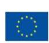
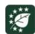

# **Preparedness check of Kenya for the EU Deforestation Regulation**

The EU Deforestation Regulation (EUDR) came into force on 29 June 2023. The Regulation prohibits operators and traders from placing on the EU market, or exporting from the EU, certain commodities (cattle, cocoa, coffee, oil palm, rubber, soya and wood) and derived products, unless they are "deforestation-free", have been produced in accordance with the relevant legislation of the country of production, and are covered by a due diligence statement including traceability information. Under the current legal arrangements, the EUDR's main obligations will apply to all large companies from 30 December 2025, and to micro, small and medium-sized enterprises from 30 June 2026.

Coffee plays a pivotal role in the Kenyan economy, both historically and currently. Kenya's coffee is highly regarded on the international market and is a key export commodity, contributing considerably to the country's foreign exchange earning[s](#page-0-0)1 . Kenya's Bottom-Up Economic Transformation Agenda (BETA) 2022-2026 considers coffee as one of the priority crops for export growth, a key approach to food security due to its importance for farmers' livelihoods, a foreign exchange earner, income to farmers, and an infrastructure maintenance accelerator.

The EU is a key market for Kenyan coffee. Exports to Europe have accounted for 57% of the total exports in the last five years, followed by North America (20%) and Asia (17%).[2](#page-0-1) The majority of Kenyan coffee is exported, but the country is experiencing growth in domestic consumption from 1% of total production in 2010/2011 to 4.2% in 2022/2023.[3](#page-0-2)

# Coffee insight

1 According to the Coffee Directorate's statistics, export earnings from coffee were USD 252.12 million in 2022/2023. In the year 2021/2022, they were USD 298.56 million. Coffee contributes 0.3% to Kenya's Gross Domestic Product.

2 Agriculture and Food Authority. Coffee Directorate. 2024. Kenya Coffee Year Book 2022/2023.

3 Ibid

Kenya is the third largest Arabica producer in Africa (less than 1% of production is Robusta) but overall coffee production is gradually declining due to climate change (droughts and floods) and diseases affecting coffee plants such as the coffee berry disease. Smallholders drive coffee production (70%), followed by coffee estates (30%). Smallholders are distributed across 605 active cooperatives[.](#page-1-0)4

The Agriculture and Food Authority (AFA), established under the Agriculture and Food Authority Act 2013, is the lead agency responsible for developing and regulating agricultural value chains in Kenya. Established as a Directorate under AFA, the Coffee Directorate was mandated to develop, promote, and regulate the coffee value chain. Given the importance of the EU as a market for Kenyan coffee, Kenya established an interministerial steering committee to develop and implement a roadmap towards EUDR compliance. A resolution from the second steering committee meeting on 17 September 2024 called for the development of action plans for compliance through sub-committees on data, legality, and strategic communication. The Coffee Directorate plays a leading role in collaborating with other government agencies, county governments, and non-governmental stakeholders to prepare the Kenyan coffee value chain for the EUDR.

**This document aims to provide an overview of existing policies, tools, and data in Kenya that could support coffee operators' EUDR due diligence efforts**, as well as identify outstanding challenges faced by those in the Kenyan coffee value chain related to information requirements under the EUDR. While the responsibility for compliance lies solely with coffee operators, national supply chain policies and tools can play an essential role in facilitating due diligence. This paper provides an overview of the 'state of play' – to be regularly updated – of the coffee value chain regarding traceability, deforestation, legality, and smallholder inclusion.

# **1. Traceability requirements**

The EUDR requires that operators collect the following information, accompanied by evidence: geolocation coordinates of all plots of land where commodities and products were produced (Art. 9 (1.d)) – for plots >4 hectares, GPS polygons are required (Art. 2(28)); the date or time range of production (Art. 9 (1.d)); and last supplier information (Art. 9 (1.e)).

## **1.1 State of play**

Coffee is a well-regulated commodity in Kenya. The Crops (Coffee) (General) Regulations, 2019 is a key regulation for the traceability of coffee. It regulates the coffee industry and provides for the protection of growers' rights along the value chain, the transparent and timely clearing and settlement of coffee sales proceeds, the collection and maintenance of data, and the improvement of coffee standards, production, and support. Another key regulation is the Capital Markets Authority Regulations 2020 which establishes and regulates the coffee exchange, provides for the

4 Ibid

licensing of coffee brokers, and the establishment and operationalisation of the direct settlement system for the payment of coffee sales proceeds.

To effectively implement these regulations and automate operations, Kenya developed digital infrastructure and systems such as the Integrated Management Information System (AFA IMIS). The AFA IMIS enables the issuing of regulatory documents, captures information, and links to a payment gateway. These features make it important for the traceability of coffee in the context of the EUDR, providing that it can be further developed and connected to other databases.

#### **Geolocation**

The Directorate of Resource Surveys & Remote Sensing (DRSRS) is leading a geo-mapping project together with the Kenya Forest Service, the Kenya Space Agency, and AFA. The project aims to geolocate all coffee plots in Kenya and integrate farmers' data with remote sensing data. After field validation in all 33 coffee-growing regions, the multi-agency team intends to generate GIS coffee maps and a database of coffee plots. High-resolution satellite images, handheld GPS devices, smartphones, and cameras are used to collect the data. As of 25 October 2024, the project has digitised 20.4% of the total coffee area in Keny[a](#page-2-0)5 , prioritising areas where coffee is grown more intensively. The data collected comprises coffee farm polygons and centroids. The team wishes to complete the geolocation effort by the end of 2025. The field verification will be an ongoing effort and has not yet started at scale.

The Government is not the only entity collecting geolocation data. The private sector, mainly exporters with a presence in Kenya, has been collecting data to minimise trade disruptions. Cooperatives, unions, service providers, and civil society organisations have also collected geolocation data. It is therefore unclear how much data is currently available in Kenya, as it is not collected in a single location.

#### **Traceability system**

Kenya has a well-established traceability system built around unique codes given to dry mills. The licensing of all dry mills is a legal requirement. At the dry mill, all coffee consignments are assigned a unique number referred to as "out-turn number". The out-turn number serves as the unique number for traceability of the coffee from dry milling to export.

Dry mills can trace the coffee to the wet mill where it was first processed (primary processing) thanks to the unique grower codes assigned to the wet mills and the digitisation of records at the dry mill. Wet mills are washing stations owned by cooperatives and/or estates. Considering that all farmers with less than 5 acres of coffee must be registered as members of cooperatives and are assigned membership numbers, theoretically, it should be possible to link the coffee to the farmers who supplied it. In practice, it is more complex because the data is fragmented and there is no national registry of farmers. Moreover, coffee is bulked at the wet mill therefore traceability to each farmer is very difficult. In a season, wet mills may bulk coffee from a few hundred to more than one thousand farmers depending on the size of the cooperatives.

5 22,322 ha were digitised. The total area under coffee in 2022 was 109,384.45 ha.

Therefore, for coffee produced by cooperatives, full traceability is currently only possible at the level of the wet mills. However, for coffee produced by estates, it is easier to trace it to the farm because the coffee is not bulked, and the supply chain is more straightforward.

#### **1.2 Remaining challenges and recommendations**

While Kenya has a well-established traceability system and a well-regulated coffee sector, there are three key challenges in the context of the EUDR:

- The traceability system is functional from wet mill to export but does not link the coffee to the plots where it was produced.
- There is no nationwide registry of growers[6](#page-3-0) and farmers. The data is fragmented across more than 605 cooperatives nationwide and there is no data reconciliation to link it to the traceability system through IMIS.
- The multi-agency team led by the DRSRS and the county governments don't have the capacity and the resources to collect and ground truth the geolocation data of all coffee plots nationwide. Several non-governmental players have already collected geolocation data but it is unclear how accurate and consistent the data is. There is a role for the DRSRS and the Coffee Directorate to gather all existing data, harmonise it, and refocus the efforts of the multi-agency team towards coffee plots that have never been geolocated.

The above challenges could be addressed by the following actions:

- Data about farmers is available across different sources such as the Nairobi Coffee Exchange, members' registries of cooperatives, the Kenya Integrated Agricultural Management Information System (KIAMIS[\)](#page-3-1)7 , etc. The data should be consolidated and harmonised to build a national database of coffee farmers that includes geolocation data of coffee plots and is connected to the traceability system through IMIS.
- Given that coffee is bulked by the cooperatives, a database of growers would be useful. This database should be connected to the farmers' database and IMIS. In the context of the EUDR, the bulking challenge could be addressed by providing geolocation data and declaring the legal compliance of all farmers who contributed coffee to a given wet mill. Relevant information that supply chain actors would collect for this "declaration in excess" approach could be tested with competent authorities. Tracing coffee bags to the individual plots would be technically challenging and resource intensive. It would require an overhaul of the first step of the coffee value chain and a change in management practices by wet mills and cooperatives. Declaring all plots supplying the wet mill for a given harvesting period as legal and deforestation-free would be more practical, providing that geolocation data and the farmers' legal compliance are regularly verified.

6 Growers are not individual farmers. In Kenya, the cooperatives and the estates are registered as growers.

7 KIAMIS is a digital farmers' registration system built to improve agricultural management in Kenya. More than 6.5 million farming households are currently registered. The data is useful, but should be filtered to identify coffee farmers and double-checked using coffee cooperatives' registries. One issue with the data in the context of the EUDR is that KIAMIS has information about homesteads and not the coffee plots. KIAMIS could be used as a starting point to build a national registry of coffee farmers with geolocation data about their coffee plots.

- A national coffee dashboard could be built to facilitate due diligence by buyers and checks by EU competent authorities. The data in the dashboard should be made public as much as possible.
- The Coffee Directorate, the DRSRS, the State Department for Cooperatives, and county governments should work closely together. Controlling the coffee value chain would give a leading role to AFA and would be useful beyond the EUDR. It would not only improve the provision of extension to farmers but also enable the Coffee Directorate to better market Kenyan coffee by highlighting its specific origin.

# **2. Deforestation-free criteria**

The EUDR requires that operators collect adequately conclusive and verifiable information that relevant products are deforestation free (Art. 2(13) and 9 (1.g)). Coffee produced on lands converted from forests after 31 December 2020 will not be considered deforestation free and will not comply with EU requirements. 'Forests' are defined according to the United Nations Food and Agriculture Organization (FAO) definition (Art. 2(4))3.

### **2.1 State of play**

The Kenya Forest Service reported an increase in forest cover from 6.9% to 8.83% in the period 2010-2020. The increase in forest cover is mainly due to national landscape and ecosystem restoration efforts. Launched by the president, Kenya's 15-billion-trees initiative plans to plant 15 billion trees by 2032 to reduce greenhouse emissions, reverse deforestation, and restore deforested landscapes. The government has also committed to establishing five million acres (20,000 km2) of agroforestry woodlots in drylands. Furthermore, the government put in place a National Tree Planting Campaign aimed at scaling up the forest cover to over 30% by 2030. The strategy provides for the production and planting of two billion tree seedlings while enhancing the protection and conservation of the existing forests.

The Kenya Forest Service, in collaboration with the DRSRS and the Kenya Space Agency, is monitoring the country's forest area. Kenya produced a Land Cover Land Use Map 2021 and Kenya Forest Cover 2021[8](#page-4-0) . Derived from the two maps, the forest cover status in coffee areas was produced. Maps of gazetted forest boundaries, protected areas, and community and private forests are available upon official request to the Chief Conservators of Forests. Forest monitoring systems and deforestation alerts exist through remote sensing and field engagement. While EFI has not evaluated the quality and consistency of the maps and data, these were produced using medium- (Landsat, Sentinel) and high-resolution (Worldview) images.

8 The link for visualisation of these country maps is:

<https://kenyaforest.maps.arcgis.com/apps/dashboards/10250cc5285b4b35812770c789bc75ff>

Kenya submitted a Forest Reference Level (FRL) to the UNFCCC in 202[0](#page-5-0)9 and received a report on the technical assessment of the proposed forest reference level[10](#page-5-1). The report noted that "the information used by Kenya in constructing its FRL for reducing emissions from deforestation, reducing emissions from forest degradation, sustainable management of forests and enhancement of forest carbon stocks is transparent and complete" [11](#page-5-2). However, it highlighted that the definition of forests used in constructing the FRL differs from the FAO definition. In its submission to the UNFCC, Kenya noted that the forest definition will be harmonised with the FAO definition in subsequent national communications and used to inform monitoring and forest sector performance and reporting. According to the KFS, Kenya is currently updating its FRL following the recommendation in the technical report.

In the FRL, Kenya reported that a national forest definition has been agreed through a broad stakeholder consensus as a minimum 15% canopy cover; minimum land area of 0.5 ha, and potential to reach a minimum height of 2 meters at maturity in situ. Perennial tree crops like coffee and tea are not considered as forests under this definition, irrespective of whether they meet the definition. Kenya's forest definition differs from the FAO/EUDR definition concerning tree height (2 vs 5 meters) and canopy cover (15 vs 10%).

In the context of deforestation risk associated with coffee, the difference in the forest definition is not significant because coffee is not a driver of deforestation in Kenya.[12](#page-5-3) Most coffee plots were established before the EUDR cut-off date of 31 December 2020, and new coffee plots are often replacing other crops on agricultural land. In the context of due diligence for operators placing coffee on the European market, the difference in the forest definition calls for the combined use of national forest maps and other maps such as the JRC Global Forest Cover Map for 2020, which is global and aligned with the FAO/EUDR definition. The combined use of global and national maps overcomes their respective limitations and helps to identify sourcing areas that need further checks.[13](#page-5-4)

## **2.2 Remaining challenges and recommendations**

Forest data and maps exist but operators and competent authorities will face challenges in accessing and evaluating the information. The maps as they are currently presented in the public domain don't allow for crosschecking with other sources of information, revising metadata, and evaluating the meaning of classes. It would be important to make maps and data publicly available as much as possible to facilitate due diligence by operators buying Kenyan coffee. External technical support is

9 It is available at<https://redd.unfccc.int/submissions.html?country=ken>

10 It is available at [https://unfccc.int/sites/default/files/resource/tar2020\\_KEN.pdf](https://unfccc.int/sites/default/files/resource/tar2020_KEN.pdf) 

11 Ibid, para 37.

12 According to the KFS, drivers of deforestation are infrastructure development, forest fires, illegal logging and charcoal production.

13 For an example of the use of national and global maps, please see: European Commission, Joint Research Centre, Verhegghen, A., Orlowski, K., Dontenville, A., Reboud, V., Riano, C., Njeugeut, A., Kouame Koffi, G., Tillie, P., Rembold, F. and Achard, F. 2024. *Use of national versus global land use maps to assess deforestation risk in the context of the EU Regulation on Deforestation-free products: case study from CÙte d`Ivoire*. Publications Office of the European Union.

recommended to ensure that the data is useful in the context of the EUDR. Collaboration between the KFS, the Kenya Space Agency, the DRSRS, and the JRC is also recommended.

Kenya's engagement in the FRL process is positive and will help operators to better assess the risk (or the absence of) of deforestation in Kenya. In the context of the EUDR, an updated FRL that follows the FAO/EUDR definition would be very useful.

Finally, awareness-raising campaigns about Kenya's rules and policies on forest conservation and management are recommended. In addition to estates, the management of cooperatives and their lead farmers should be targeted by the campaigns because they play an important role in inspecting farmers in the field. Aspects of forest conservation and management could be combined with training on good agricultural practices. Multi-agency teams including KFS, the Coffee Directorate, and the State Department for Cooperatives could coordinate the content nationally and implement the campaigns at the county level, perhaps while ground-truthing the geolocation data of coffee plots.

## **3. Legality criteria**

The EUDR requires that operators collect adequately conclusive and verifiable information that the relevant commodities were produced in accordance with the "relevant legislation of the country of production" (Art. 9 (1.h) and Art 2(40)). Consequently, operators who place coffee or coffee products on the EU market must ensure that they have been produced in accordance with the relevant Kenyan legislation applicable to the area of production.

The legal sub-committee of the Inter-Ministerial Committee on Implementation of the EUDR developed a matrix of laws governing the coffee value chain in Kenya. Based on Art. 2 (40) of the EUDR, the matrix describes pieces of legislation related to land use rights; environmental protection; forest-related rules; labour rights; human rights; the principle of free, prior, and informed consent; and tax, anti-corruption, trade, and customs regulations. The matrix is currently not publicly available.

The work of the legal sub-committee to map the key pieces of legislation is a good step towards providing clarity to operators on the legal requirements associated with coffee production in Kenya. The matrix should be further developed to make it more comprehensive and include sections on verification of compliance and compliance issues, to support the private sector in their due diligence efforts. Ideally, the legal sub-committee should organise a broader multistakeholder process to comprehensively and effectively identify all the relevant legal requirements and compliance issues.

A multistakeholder mapping process would have the advantage of involving different perspectives, helping to identify gaps and inconsistencies in current laws and their enforcement, increasing the legitimacy and credibility of the process, building trust among stakeholders, and increasing transparency in the supply chain. Once completed, the matrix of laws governing the coffee value chain in Kenya should be made public so that it can be used in the context of the EUDR.

#### **Land rights**

According to the Constitution, there are three types of land in Kenya: public land, private land, and community land. Except for the coffee grown by the Coffee Research Institute (a public organisation), all coffee in Kenya is produced on private land. The Land Act (2012, revised in 2016) and the Land Registration Act (2012, revised in 2020) are two key pieces of legislation[14](#page-7-0) for the administration and management of private land.

The fact that almost all coffee is grown on private land lowers the risk of illegal land use in Kenya. However, proving land ownership can be challenging because the land on which the coffee is grown is often inherited by family members without changing the owner's name on the title deed. It is common for children to inherit subdivided plots from their parents and continue to grow coffee on the land without changing the registration documents. In such a situation, the role of cooperatives is critical to ensure that the land is not disputed, and coffee is legally grown. Before accepting a new member, the cooperative would check that the farmer is growing coffee, that the farmer is from the area, that membership fees are paid, and that there is evidence of land ownership such as title deeds, lease agreements, or inheritance proof. Yearly field evaluations ensure continuous adherence to the principles of the cooperative. Given that all farmers with less than five acres of coffee must be registered as members of cooperatives and the critical role that cooperatives play in ensuring that Kenyan coffee is produced legally, having a cooperative membership number could be seen as a proxy indicator of legality.

#### **Child labour**

Kenya's Employment Act forbids the employment of children under the age of 13 in any work, while those aged 13-16 are only allowed to work in non-hazardous settings. Similarly, the Children Act protects children from economic exploitation and dangerous work environments. Additionally, Kenya has ratified key international conventions, including ILO Convention 138 (Minimum Age) and Convention 182 (Worst Forms of Child Labour).

According to the ILO, challenges persist in the fight against child labour in Kenya due to socioeconomic factors, harmful cultural practices, limited capacity for enforcement of laws, and provision of services to survivors and victims.[15](#page-7-1) In consultations for writing this coffee preparedness check, the authorities, the private sector, and other non-governmental stakeholders consistently denied the existence of child labour in coffee production but confirmed that it is a widespread practice among families to bring children to the coffee plantations and encourage them to help with simple tasks.

In this context, and noting the ILO's recommendation that "addressing these challenges requires sustained commitment from all sectors of society, including government entities, civil society organisations, businesses, and communities" [16](#page-7-2), it would be important for the Government to continue to raise awareness about child labour and existing laws. Awareness-raising campaigns

14 The relevant legislation is available on the website of the National Land Commission at

<https://landcommission.go.ke/land-laws/>

15 [https://www.ilo.org/resource/article/kenya-marks-its-commitment-ending-child-](https://www.ilo.org/resource/article/kenya-marks-its-commitment-ending-child-labour#:~:text=The%20country%20has%20enacted%20the,Worst%20Forms%20of%20Child%20Labour)

[labour#:~:text=The%20country%20has%20enacted%20the,Worst%20Forms%20of%20Child%20Labour\)](https://www.ilo.org/resource/article/kenya-marks-its-commitment-ending-child-labour#:~:text=The%20country%20has%20enacted%20the,Worst%20Forms%20of%20Child%20Labour). 16 Ibid

could be organised and implemented by the Ministry of Labour and Social Protection, the ILO[17](#page-8-0), the Kenya National Commission on Human Rights, NGOs, and the Cooperative Alliance of Kenya. The campaigns should target local authorities, cooperatives, and estates.

# **4. Smallholders**

The Crops (Coffee) (General) Regulations, 2019 defines a smallholder as a "grower cultivating coffee in a small parcel of land or in small parcels of land who does not possess his own pulping station". In contrast, an estate is an "area of land or group of parcels of land under coffee not being less than five acres in size in aggregate or land under coffee which has an average annual production of not less than twenty thousand kilograms of cherry over a period of three years".

Smallholder farmers account for 70% of coffee production in Kenya. The Coffee Directorate estimates that there are 1.2 million coffee farmers in Kenya, but no national data exists on how many are active. Coffee smallholders are grouped into cooperatives.[18](#page-8-1) In 2022/2023, 605 active cooperatives operated 1,122 primary wet mills.[19](#page-8-2)

There is no legal obligation for smallholder farmers to join a cooperative. However, in practice, they must be members of cooperatives to market their coffee.[20](#page-8-3) Once registered as members, smallholders receive unique membership numbers. The acceptance as a member is not automatic and follows a vetting process described in the by-laws of each cooperative based on The Cooperative Societies Act[21](#page-8-4). Cooperatives inspect their members annually and maintain records of active farmers to pay them for the coffee delivered to the cooperatives' wet mills. This makes cooperatives important actors in the legality and traceability of Kenyan coffee and the primary institutions for training farmers and increasing coffee production in the country.

### **4.1 Remaining challenges and recommendations**

While cooperatives are well established in Kenya and play a critical role in the coffee value chain, several challenges have an impact on their effectiveness, and ultimately on coffee production in Kenya:

- Some cooperatives have challenges managing their finances and records effectively, which results in a lower value delivered to their members. Poor governance is an existential threat to cooperatives because it disincentivises farmers to be part of the cooperative system.[22](#page-8-5)

17 For example, through the ACCEL Africa Project.

18 Based on the Crops Act, 2013 (para 14) coffee smallholder growers register with the cooperative to which they deliver coffee.

19 Agriculture and Food Authority. Coffee Directorate. 2024. Kenya Coffee Year Book 2022/2023.

20 According to The Crops (Coffee) (General) Regulations, 2019, coffee growers for the purpose of licensing include cooperative societies, unions, associations, and estates. A license is needed to market the coffee.

21 The Cooperative Societies Act governs the constitution, registration and regulation of cooperatives.

22 The number of coffee cooperatives and overall membership have been declining in Kenya. See:

<https://perfectdailygrind.com/2022/08/the-cooperative-model-in-kenyas-coffee-sector/>

- The smaller cooperatives are unclear about the EUDR and fear that they won't be able to sell coffee anymore. They are vulnerable to service providers who approach them to provide solutions.
- Training of farmers in remote areas is difficult. Cooperatives don't have enough budget for training and local governments don't have enough resources for regular extension provision.
- Bottlenecks in dry milling are disrupting the operations of some cooperatives.
- Farmers are sometimes paid late and cooperatives face challenges accessing finance at subsidised rates.

Some of the above challenges are systemic and require close coordination between AFA and the State Department for Cooperatives. The challenges could be addressed through the following actions:

- AFA, through the Coffee Directorate, could conduct an awareness-raising campaign about the EUDR targeting county governments and cooperatives. There is a need to explain the EUDR and the types of information required by operators to demystify the Regulation and facilitate geodata collection.
- Cooperative unions and associations could support the digitisation of cooperative registries and payment records. Moreover, it would be important for county governments to evaluate the effectiveness of checks that cooperatives conduct on new and existing members. These checks are important for the legality and sustainability of coffee production.
- The State Department for Cooperatives could work with unions, associations, and NGOs to improve financial management and administration in smaller cooperatives. The frequency of extension support in coffee-growing areas should increase through the coordinated effort between the Coffee Directorate, the Coffee Research Institute, and county governments. Development partners could support extension efforts targeting areas and cooperatives not adequately supported by the private sector. The Government should maintain a role in ensuring extension quality, oversight, consistency, and methods.[23](#page-9-0)
- The cooperation between the Coffee Directorate and the State Department for Cooperatives should be strengthened at the national level and in the counties. It would be important to clarify overlaps in mandate and responsibilities.

# **5.Conclusion**

This preparedness check made an overview of the state of play of the coffee value chain regarding traceability, deforestation, legality, and smallholder inclusion. For each of these areas, it described challenges and provided ideas and recommendations for addressing them. EFI's mission to Kenya from 22-31 October 2024 was an invaluable source of information for writing this report.

While challenges and recommendations were written in the context of the EUDR, it would be important for Kenyan stakeholders to take a broader view and tackle them to improve the coffee

23 Myanga and Jayne (2008). *Private Agricultural Extension System in Kenya: Practice and Policy Lessons.* Journal of Agricultural Education and Extension.

value chain overall. For the Coffee Directorate, the EUDR is an opportunity to perform a leading role and add value to Kenyan coffee by positioning it as traceable, legal, and sustainable quality coffee in international markets.

Improving the value chain is very important for Kenyan coffee because farmers are aging, and many young people don't want to grow coffee anymore. Moving forward, renewing generational interest in coffee production should be the ultimate goal of all governmental and non-governmental stakeholders engaged in the Kenyan coffee value chain.

**Disclaimer.** This publication has been produced with the financial assistance of the European Union. The views expressed herein can in no way be taken to reflect the official opinion of the European Union.

© European Forest Institute, 2025

