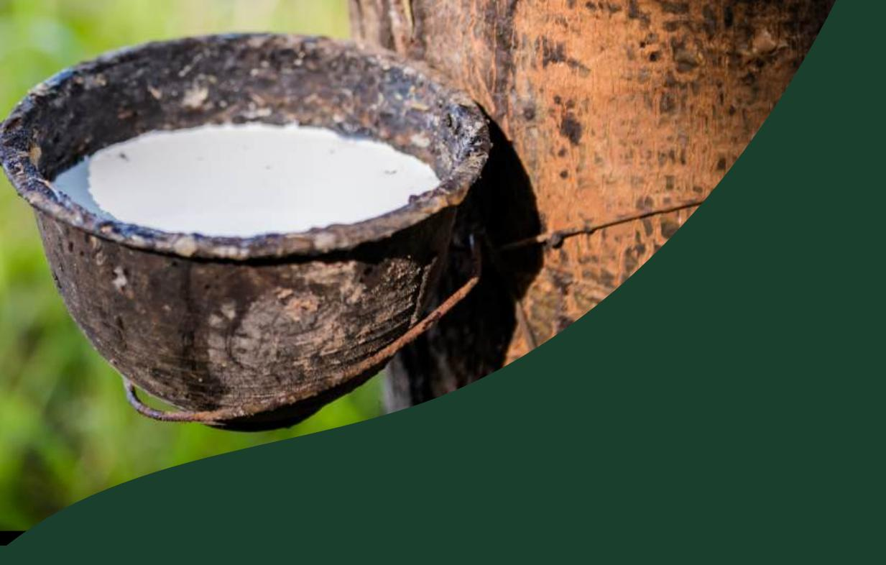
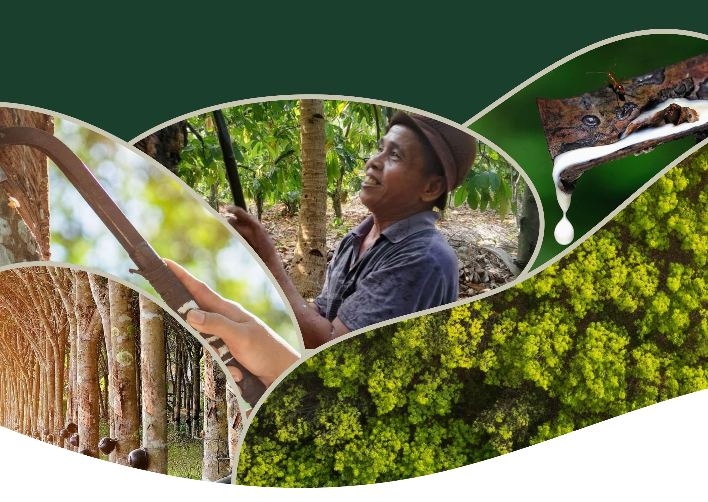
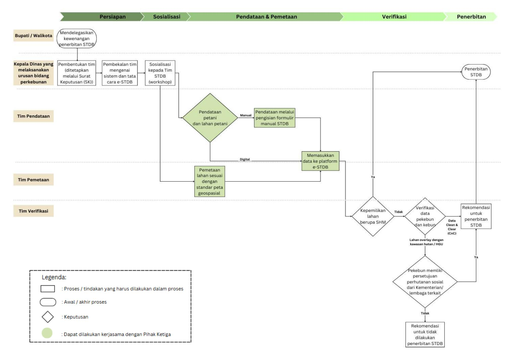

# **Prosedur Teknis dan Kolaborasi Para Pihak Dalam Percepatan Registrasi STDB**

**Disclaimer: This publication was produced with the financial support of the European Union, the German Federal Ministry for Economic Cooperation and Development (BMZ) and the Ministry of Foreign Affairs of the Netherlands. Its contents are the sole responsibility of Nectary Sustainability Solutions and do not necessarily reflect the views of the European Union, the German Federal Ministry for Economic Cooperation and Development (BMZ) and the Ministry of Foreign Affairs of the Netherlands**

# **Prosedur Teknis dan Kolaborasi Para Pihak Dalam Percepatan Registrasi Surat Tanda Daftar Usaha Perkebunan Untuk Budidaya (STDB)**

# **I. Tujuan**

Dokumen ini disusun sebagai pedoman pelaksanaan kerja sama antara pemerintah dan pihak-pihak terkait dalam rangka mendukung percepatan registrasi STDB. Fokus utama pedoman ini adalah untuk memberikan gambaran umum terkait mekanisme pembagian data petani yang dikumpulkan oleh pihak lain untuk keperluan proses registrasi STDB.

# **II. Prosedur**

# **2.1. Acuan Prosedur**

Uraian prosedur ini mengacu pada Surat Keputusan (SK) Direktur Jenderal Perkebunan Nomor: 37/Kpts/PI.400/03/2024 tentang Pedoman Penerbitan Surat Tanda Daftar Usaha Perkebunan untuk Budidaya (STDB) dan SK Direktur Jenderal Perkebunan Nomor: 123/Kpts/PI.400/12/2024 tentang Perubahan atas Keputusan Direktur Jenderal Perkebunan No. 37/Kpts/Pl.4OO /O3/2024 tentang Pedoman Penerbitan Surat Tanda Daftar Usaha Perkebunan Untuk Budidaya (STDB).

# **2.2. Pendelegasian Wewenang**

Bupati/walikota mendelegasikan kewenangan penerbitan STDB kepada Kepala Dinas yang melaksanakan urusan bidang perkebunan untuk membentuk Tim di tingkat Kabupaten/Kota.

# **2.3. Pembentukan Tim Pendataan, Pemetaan, dan Verifikasi**

Kepala Dinas yang melaksanakan urusan bidang perkebunan menetapkan Tim Pendataan, Pemetaan, dan Verifikasi melalui SK Kepala Dinas.

Tim ini bertugas untuk melakukan pendataan dan atau menerima, serta menindaklanjuti hasil pendataan yang dilakukan oleh pihak lain, serta melakukan verifikasi lapangan sebelum proses registrasi STDB dilakukan melalui sistem yang ditentukan.

Jika pelaksanaan pendataan dan pemetaan STDB melibatkan Pihak Ketiga, maka harus ada perjanjian antara Pihak Dinas dan Pihak Ketiga dalam bentuk tertulis, serta Surat Kesepakatan Kerahasiaan yang ditandatangani kedua belah pihak. Surat Kesepakatan Kerahasiaan tersebut dapat dilihat pada Lampiran 2.

### **2.3.1. Struktur Tim Pendataan**

Tim Pendataan dapat melibatkan unsur-unsur berikut:

- a. Perwakilan dari dinas yang melaksanakan urusan bidang perkebunan Kabupaten/Kota bertindak sebagai koordinator;
- b. Perwakilan dari Kecamatan;
- c. Bintara Pembina Desa (Babinsa);
- d. Perangkat Desa;
- e. Penyuluh Pertanian;
- f. Pendamping Perkebunan;
- g. Pengurus Koperasi Gabungan Kelompok Tani (Gapoktan)/Kelompok Tani

**Pendataan juga dapat dilaksanakan oleh pihak lain, seperti koperasi, perusahaan, LSM/NGO, atau lembaga mitra yang relevan.** Pendataan oleh pihak lain harus mengacu kepada dengan Lampiran 1 SK Direktur Jenderal Perkebunan Nomor: 37/Kpts/PI.400/03/2024 tentang Pedoman Penerbitan Surat Tanda Daftar Usaha Perkebunan untuk Budidaya (STDB). **Pembagian data petani mengacu pada Lampiran 1 dokumen ini.**

## **2.3.2. Struktur Tim Pemetaan:**

Tim Pemetaan dapat melibatkan unsur-unsur berikut:

- a. Perwakilan dari dinas yang melaksanakan urusan bidang perkebunan Kabupaten/Kota bertindak sebagai koordinator
- b. Instansi yang melakukan urusan bidang pemetaan, pertanahan, kehutanan
- c. Perwakilan dari Kecamatan;
- d. Bintara Pembina Desa (Babinsa)
- e. Perangkat desa
- f. Penyuluh Pertanian
- g. Pendamping Perkebunan.

**Pemetaan juga dapat dilaksanakan oleh pihak lain, seperti koperasi, perusahaan, LSM/NGO, atau lembaga mitra yang relevan.**

# **2.3.3. Struktur Tim Verifikasi:**

Tim Verifikasi dapat melibatkan unsur-unsur berikut:

- a. Perwakilan dari Dinas yang melaksanakan urusan bidang perkebunan Kabupaten /Kota bertindak sebagai koordinator
- b. Instansi yang melaksanakan urusan bidang pemetaan/pertanahan/ kehutanan /penataan ruang
- c. Perwakilan dari Kecamatan;

- d. Perangkat desa
- e. Bintara Pembina Desa (Babinsa)
- f. Penyuluh Pertanian
- g. Pendamping Perkebunan

### **2.3.4. Pembekalan Tim**

Tim yang telah dibentuk oleh Dinas akan memperoleh pembekalan yang meliputi teknik pendataan, pemetaan, verifikasi, penerbitan STDB, penggunaan alat bantu, pemahaman terhadap ketentuan perundang-undangan, serta pemahaman terkait sistem e-STDB.

Kegiatan pembekalan dimaksud dapat diselenggarakan oleh instansi teknis terkait atau oleh pihak ketiga yang menjalin kerja sama dengan dinas yang menyelenggarakan urusan di bidang perkebunan.

# **2.3.5. Sosialisasi**

Sosialisasi dilaksanakan oleh Direktorat Jenderal Perkebunan dan/atau Dinas yang menyelenggarakan urusan di bidang perkebunan pada tingkat Provinsi dan Kabupaten/Kota, dalam bentuk workshop yang ditujukan kepada Tim STDB. Kegiatan ini bertujuan untuk memberikan pemahaman mengenai tujuan, manfaat, pedoman pelaksanaan, mekanisme dan alur pelaksanaan penerbitan STDB.

# **2.4. Sosialisasi STDB ke Pekebun**

Sebelum pelaksanaan kegiatan pendataan terhadap para pekebun, disarankan agar terlebih dahulu diselenggarakan kegiatan sosialisasi mengenai STDB. Kegiatan sosialisasi ini dapat difasilitasi oleh pihak ketiga dengan dukungan dari Aparatur Desa serta Pemerintah Daerah melalui dinas terkait. Sosialisasi tersebut bertujuan untuk memberikan pemahaman yang komprehensif kepada para pekebun mengenai definisi, tujuan, manfaat, urgensi, serta keuntungan kepemilikan STDB.

Selain sebagai sarana penyampaian informasi, kegiatan ini juga berfungsi sebagai forum dialog interaktif antara pekebun, pihak ketiga, dan Pemerintah Daerah. Melalui kegiatan ini, diharapkan para pekebun memperoleh pemahaman yang lebih mendalam serta keyakinan dalam mengambil keputusan untuk mendaftarkan diri dan kebunnya ke dalam sistem STDB.

Partisipasi aktif Aparatur Desa dan Dinas terkait diharapkan dapat meningkatkan kepercayaan serta memberikan rasa aman kepada pekebun dalam proses pendaftaran, sekaligus mencerminkan dukungan penuh Pemerintah terhadap pelaksanaan program ini

### **2.5. Pendataan**

Pendataan terhadap pekebun dan lahan pekebun, baik yang dilaksanakan oleh Tim Pendataan **atau Pihak lain** dengan menggunakan pendekatan sensus, yang mencakup identitas pekebun, informasi mengenai lahan, serta data kelembagaan pekebun,

Kegiatan pendataan tersebut dapat dilakukan melalui dua metode:

- a. Digital: penginputan data secara langsung ke dalam platform e-STDB
- b. Manual: pengisian formulir STDB secara fisik, yang selanjutnya diinput ke dalam platform e-STDB oleh petugas atau Tim STDB pada Dinas yang menyelenggarakan urusan di bidang perkebunan di tingkat Kabupaten/Kota.

Untuk detail prinsip dan ketentuan pembagian data antara Tim Pendataan (jika dilakukan oleh Pihak Ketiga) dan Pihak Dinas, dapat dilihat lebih lanjut di Lampiran 1.

# **2.6. Pemetaan Lahan**

Pemetaan lahan, baik yang dilaksanakan oleh Tim Pemetaan atau pihak lain, mengacu pada standar peta geospasial dasar minimal skala 1 : 50.000 dalam bentuk area atau poligon.

Selanjutnya, Tim Pemetaan akan mengunggah data poligon lahan ke dalam platform e-STDB.

Dalam hal pelaksanaan pemetaan melibatkan pihak ketiga, maka proses penyerahan data hasil pemetaan kepada Tim Verifikasi wajib dilakukan secara resmi dan terdokumentasi.

# **2.7. Proses Verifikasi dan Penerbitan STDB**

Bupati/Wali Kota melakukan pendelegasian kewenangan penerbitan STDB kepada Kepala Dinas yang melaksanakan urusan pemerintahan di bidang perkebunan.

Ketentuan proses verifikasi dan penerbitan STDB dilakukan sebagai berikut:

- **Apabila lahan dimiliki dengan status Sertifikat Hak Milik (SHM):** Kepala Dinas yang melaksanakan urusan bidang perkebunan dapat langsung menerbitkan STDB untuk lahan tersebut.

- **Apabila lahan tidak memiliki status SHM:** Tim Verifikasi akan melakukan verifikasi terhadap data pekebun dan lahan/kebun yang telah terintegrasi dalam platform e-STDB.
- **Apabila lahan berada di dalam kawasan hutan atau dalam Hak Guna Usaha (HGU) badan usaha, namun pekebun memiliki legalitas pengelolaan areal (misalnya melalui persetujuan perhutanan sosial) dari Kementerian/Lembaga terkait sesuai ketentuan peraturan perundang-undangan yang berlaku:** Maka, status pengusahaan lahan tersebut dinyatakan sah bagi nama-nama pekebun yang tercantum dalam lampiran persetujuan, serta dapat dikategorikan sebagai status Hak Pengelolaan. Tim Verifikasi akan mengeluarkan rekomendasi penerbitan STDB sebagaimana diatur dalam Keputusan Direktur Jenderal Perkebunan Nomor: 123/Kpts/PI.400/12/2024 tentang Perubahan atas Keputusan Direktur Jenderal Perkebunan Nomor: 37/Kpts/Pl.400/03/2024 tentang Pedoman Penerbitan Surat Tanda Daftar Usaha Perkebunan untuk Budidaya (STDB).
- **Apabila lahan berada di kawasan hutan atau kawasan HGU badan usaha, dan pekebun tidak memiliki legalitas pengelolaan areal dari kementerian/lembaga terkait:** Maka, Tim Verifikasi akan memberikan rekomendasi untuk tidak dilakukan penerbitan STDB.
- **Apabila data hasil verifikasi dinyatakan** *Clean and Clear***:** Tim Verifikasi akan mengeluarkan rekomendasi untuk penerbitan STDB.

Setelah menerima rekomendasi Tim Verifikasi dan data dinyatakan *Clean and Clear*, Kepala Dinas yang melaksanakan urusan bidang perkebunan akan menerbitkan STDB sesuai ketentuan yang berlaku.

# **III.Flow Chart**

# **IV. Definisi**

- 1. STDB : Surat Tanda Daftar Usaha Perkebunan untuk Budidaya
- 2. SK : Surat Keputusan
- 3. Babinsa : Bintara Pembina Desa
- 4. Gapoktan : Gabungan Kelompok Tani
- 5. SHM : Sertifikat Hak Milik
- 6. HGU : Hak Guna Usaha
- 7. Clean & Clear (CnC): Apabila lahan perkebunan tidak berada di kawasan hutan atau jika berada di kawasan hutan, telah mendapatkan izin yang relevan dari Kementerian Kehutanan
- 8. SIMLUHTAN : Sistem Informasi Manajemen Penyuluhan Pertanian

# **V. Referensi**

- 1. Surat Keputusan (SK) Direktur Jenderal Perkebunan Nomor: 123/Kpts/PI.400/12/2024 tentang Perubahan atas Keputusan Direktur Jenderal Perkebunan No. 37/Kpts/Pl.4OO /O3/2024 tentang Pedoman Penerbitan Surat Tanda Daftar Usaha Perkebunan Untuk Budidaya (STDB)
- 2. Surat Keputusan (SK) Direktur Jenderal Perkebunan Nomor: 37/Kpts/PI.400/03/2024 tentang Pedoman Penerbitan Surat Tanda Daftar Usaha Perkebunan untuk Budidaya (STDB)
- 3. Undang-undang (UU) Nomor 27 Tahun 2022 tentang Perlindungan Data Pribadi

# **Lampiran 1.**

# **Prinsip dan Ketentuan Pembagian Data**

### I. Latar Belakang

- Dalam rangka percepatan penerbitan Surat Tanda Daftar Usaha Perkebunan Untuk Budidaya (STDB), diperlukan kolaborasi yang baik antara berbagai pihak, termasuk pemilik data, pihak ketiga, pemerintah daerah, dan Kementerian Pertanian. Mengingat data yang dikumpulkan bersifat sensitif dan dilindungi oleh hukum, maka prosedur pengumpulan, pembagian, dan penggunaan data harus diatur secara formal dan akuntabel.
- II. Tujuan Menyediakan pedoman operasional untuk pembagian data petani dan data kebun secara aman, legal, dan efisien dalam rangka pendaftaran dan penerbitan STDB.
- III. Prinsip dan Ketentuan Pembagian Data Pembagian data merupakan proses yang sangat krusial karena menyangkut data yang sensitif dan wajib dijaga kerahasiaannya serta diperlukan persetujuan dari pemilik data. Maka dari itu, perlu adanya beberapa prinsip fundamental yang harus diikuti oleh pihak terkait. Prinsip-prinsip tersebut adalah sebagai berikut:
  - 1. Ada kesepakatan tertulis antara Pihak Dinas yang melaksanakan urusan bidang perkebunan di Kabupaten/Kota dengan Pihak Ketiga sebagai dasar kerjasama, seperti yang tercantum dalam Annex 1
  - 2. Petani harus memberikan persetujuan bahwa data yang pernah diambil oleh Pihak Ketiga juga akan dipergunakan untuk pengajuan STDB.
  - 3. Proses pengambilan data yang dilaksanakan tetap sesuai dengan aturan yang tertulis dalam Surat Keputusan (SK) Direktur Jenderal Perkebunan Nomor: 37/Kpts/PI.400/03/2024 tentang Pedoman Penerbitan Surat Tanda Daftar Usaha Perkebunan untuk Budidaya (STDB).
  - 4. Proses pengambilan data oleh Pihak Ketiga dapat dilakukan secara:
    - a. Manual, melalui pengisian formulir pendataan yang dibagikan oleh petugas; atau
    - b. Digital, melalui pengisian secara langsung di platform e-STDB, untuk ini perlu adanya kesepakatan antara Dinas yang melaksanakan urusan bidang perkebunan di Kabupaten/Kota dan Pihak Ketiga, dimana Dinas merekomendasikan pemberian akses untuk masuk ke dalam aplikasi

e-STDB kepada Pihak Ketiga. Persetujuan pemberian akses ke platform e-STDB merupakan kewenangan Kementerian Pertanian.

- 5. Apabila proses pengambilan data dilakukan secara digital, maka Pihak Ketiga wajib mengikuti prosedur privasi dan keamanan data yang dimiliki oleh Pihak Dinas, untuk menjaga kerahasiaan data yang sedang diproses, sesuai dengan ketentuan yang tertulis di dalam Undang-undang (UU) Nomor 27 Tahun 2022 tentang Perlindungan Data Pribadi.
- IV. Pihak yang Terlibat dalam Pembagian Data dan Tanggung Jawab Proses pembagian data ini menyangkut lima pihak, yaitu: (1) Petani selaku pemilik data, (2) Kepala Desa, (3) Pihak Dinas yang melaksanakan urusan bidang Perkebunan di Kabupaten/Kota (Pemerintah) selaku penerbit STDB, (4) Pihak ketiga yang mengumpulkan data dari petani, dan (5) Kementerian Pertanian yang berwenang memberikan akses untuk menginput data melalui platform e-STDB. Semua Pihak wajib melaksanakan tanggung jawabnya sebagai berikut:
  - 1. Petani: memberikan data yang benar kepada Tim Pendataan dari Pihak Ketiga
  - 2. Kepala Desa: memberikan surat keterangan bahwa data yang dikumpulkan dari Para Petani sudah sesuai dan mendapatkan persetujuan dari Petani untuk registrasi STDB, serta memberikan dukungan kepada Pihak Ketiga untuk menjalankan pendataan termasuk memberikan bantuan dan masukan terkait masalah legalitas yang mungkin muncul dalam proses pendataan pekebun
  - 3. Pihak Ketiga: melakukan pendataan dan pemetaan sesuai dengan prinsip pendataan yang termuat dalam Surat Keputusan (SK) Direktur Jenderal Perkebunan Nomor: 37/Kpts/PI.400/03/2024 tentang Pedoman Penerbitan Surat Tanda Daftar Usaha Perkebunan untuk Budidaya (STDB), serta mengkomunikasikan kepada Pihak Desa dan Dinas terkait keadaan di lapangan, beserta dengan isu-isu yang ada
  - 4. Dinas: melakukan verifikasi dan menerbitkan STDB sesuai dengan pedoman Surat Keputusan (SK) Direktur Jenderal Perkebunan Nomor: 37/Kpts/PI.400/03/2024 tentang Pedoman Penerbitan Surat Tanda Daftar Usaha Perkebunan untuk Budidaya (STDB) dan Surat Keputusan (SK) Direktur Jenderal Perkebunan Nomor: 123/Kpts/PI.400/12/2024 tentang Perubahan atas Keputusan Direktur Jenderal Perkebunan No. 37/Kpts/Pl.4OO /O3/2024 tentang Pedoman Penerbitan Surat Tanda Daftar Usaha Perkebunan Untuk Budidaya (STDB)
  - 5. Kementerian Pertanian: memberikan akses untuk menginput data melalui platform e-STDB jika diminta oleh Pihak Ketiga

Ada beberapa kegiatan di lapangan yang dapat dilakukan secara kolaboratif dan berbagi sumber daya. Contohnya dalam melakukan sosialisasi kepada petani,

pendataan serta pemetaan, hal ini dapat dilakukan secara bersama-sama baik oleh Pihak Ketiga dan Pemerintah dalam hal ini Perangkat Desa serta Dinas yang membawahi Perkebunan Tingkat Kabupaten. Dalam hal ini kesepakatan lebih detil terkait pembagian tugas dan kewajiban masing-masing pihak diperlukan agar ada kejelasan terkait bagaimana tim gabungan ini dipimpin, dikelola, serta dimonitor dalam melakukan aktivitasnya di lapangan.

# V. Data yang dibagikan

Data yang akan dibagikan berupa data petani dan data kebun sesuai dengan informasi yang dibutuhkan dalam formulir pendataan, dengan detail sebagai berikut:

# 1. Identitas Pekebun:

- a. Nama
- b. Nomor KTP
- c. Tempat tanggal lahir
- d. Jenis kelamin
- e. Pendidikan
- f. Provinsi
- g. Kecamatan
- h. Kabupaten/Kota
- i. Desa/Kelurahan
- j. Alamat
- 2. Keterangan Kebun:
  - a. Kebun ke-...
  - b. Status lahan
  - c. Nomor/ dokumen lahan yang diusahakan**\***
  - d. Luas lahan berdasarkan dokumen
  - e. Pola tanam
  - f. Komoditas
  - g. Luas area tertanam
  - h. Tahun tanam
  - i. Jumlah tegakan pohon
  - j. Produksi per tahun
  - k. Produktivitas
  - l. Asal benih
  - m. Jenis lahan
  - n. Jenis pupuk
  - o. Mitra penjualan
- 3. Keterangan kelembagaan tani
  - a. Nama kelembagaan tani

- b. Komoditas kelembagaan tani
- c. Nomor kelompok dalam SIMLUHTAN
- d. Alamat kelembagaan tani
- 4. Lokasi kebun Berupa titik koordinat (minimal 4), membentuk polygon atau peta dalam bentuk .shp file. **\*** Pendataan pekebun dilakukan pada pekebun yang memiliki status pengusahaan lahan antara lain sebagai berikut:
  - Sertifikat Hak Milik (SHM);
  - Girik/ Surat Kepemilikan Tanah (SKT)/ Surat Keterangan Ganti Rugi (SKGR) /Hak Pengelolaan;
  - Tanah ulayat/adat; atau
  - Pengusahaan legalitas lahan lainnya, salah satu contohnya Hak Guna Usaha (HGU) Perorangan.

Pendataan pekebun dilakukan terhadap individu pekebun atau kelompok yang memiliki status pengusahaan lahan, dengan kriteria kepemilikan atau penguasaan sebagai berikut:

- 1. Sertifikat Hak Milik (SHM);
- 2. Girik, Surat Keterangan Tanah (SKT), Surat Keterangan Ganti Rugi (SKGR), atau Hak Pengelolaan;
- 3. Tanah ulayat atau tanah adat;

# VI. Tata Cara Pembagian Data

Proses pembagian data ini dapat dilakukan melalui tiga cara, yaitu:

- 1. Manual: Data diberikan oleh Pihak Ketiga kepada Dinas secara manual, dalam bentuk formulir yang sudah terisi dan data minimal 4 koordinat yang membentuk poligon
- 2. Digital: Data dapat diberikan oleh Pihak Ketiga kepada Dinas secara digital, dalam bentuk Excel File dan .shp file
- 3. Langsung diinput ke Platform e-STDB: Data dapat langsung diinput ke dalam platform e-STDB oleh Pihak Ketiga.

# VII. Waktu Pembagian Data

Pembagian data ini akan dilakukan setelah dilakukannya proses pendataan petani dan kebun, serta pemetaan kebun oleh Pihak Ketiga, dimana data tersebut akan diserahkan kepada Tim Verifikasi dari Pihak Dinas untuk diproses lebih lanjut.

### VIII. Verifikasi Data Petani

Ketentuan proses verifikasi data akan mengacu pada Prosedur butir 2.6, dan akan dilakukan oleh Tim Verifikasi yang telah ditetapkan oleh Dinas yang melaksanakan urusan bidang perkebunan. Pihak Ketiga membantu menjawab pertanyaan-pertanyaan yang muncul pada saat dilakukan verifikasi.

# IX. Penerbitan STDB

Penerbitan STDB oleh Kepala Dinas yang melaksanakan urusan bidang perkebunan akan mengacu pada Prosedur butir 2.6.

# **Lampiran 2: Surat Non-Disclosure Agreement (Kesepakatan Kerahasiaan)**

# **Surat Kesepakatan Kerahasiaan Antara Para Pihak Untuk Percepatan Registrasi STDB**

Pada hari ini, [Tanggal Penandatanganan], yang bertanda tangan di bawah ini:

## PIHAK PERTAMA:

Nama : Jabatan : Alamat :

Selanjutnya akan disebut sebagai "PIHAK PERTAMA".

# PIHAK KEDUA:

Nama : Jabatan : Alamat :

Selanjutnya akan disebut sebagai "PIHAK KEDUA".

Kedua belah pihak sepakat untuk melakukan kolaborasi dalam bentuk pembagian data untuk mendorong percepatan registrasi STDB, dengan ketentuan sebagai berikut:

# KETENTUAN-KETENTUAN KESEPAKATAN DAN KERAHASIAAN:

# 1. Tujuan Kesepakatan

Kesepakatan ini dibuat sebagai dasar kolaborasi antara kedua belah Pihak khususnya dalam proses pembagian data, guna mendorong percepatan registrasi STDB Budidaya) di Kabupaten / Kota \_\_\_\_\_\_.

Dengan percepatan registrasi STDB akan memberikan manfaat bagi Petani antara lain: membuktikan legalitas atas aktivitas budidaya tanaman perkebunan dan pengakuan sebagai pelaku usaha di bidang perkebunan; mendapatkan akses ke berbagai program bantuan pemerintah yang mensyaratkan kepemilikan STDB, dan meningkatkan daya saing produk dan memperluas akses pasar.

### 2. Periode Kesepakatan

Kesepakatan ini berlaku mulai tanggal \_\_\_\_\_\_\_\_\_\_\_\_\_\_\_\_\_\_ sampai dengan tanggal \_\_\_\_\_\_\_\_\_\_\_\_\_\_\_\_\_\_

Perpanjangan atas kesepakatan ini dimungkinkan berdasarkan kesepakatan tertulis dari kedua belah pihak sebelum masa berlakunya berakhir.

### 3. Kerahasiaan Data

Para Pihak wajib menjaga privasi dan keamanan data yang dibagikan, serta memastikan bahwa pengelolaan data (penyimpanan, distribusi dan pemrosesan data) dilakukan sesuai dengan ketentuan peraturan perundang-undangan yang berlaku, khususnya Undang-Undang Nomor 27 tahun 2022 tentang Perlindungan Data Pribadi. Akses terhadap data dibatasi hanya untuk pihak-pihak yang berkepentingan dan memiliki wewenang, serta tidak diperkenankan menyebarluaskan data untuk tujuan selain dari yang tercantum dalam kesepakatan ini, tanpa persetujuan tertulis dari para pihak.

# 4. Deskripsi Data yang Dibagikan

Data yang dibagikan mencakup informasi petani dan lahan berdasarkan isian dalam formulir pendataan STDB. Data tersebut meliputi:

- a. Identitas pekebun (nama, NIK, alamat, dan informasi relevan lainnya)
- b. Keterangan kebun (jenis komoditas, luas lahan, status lahan, dan sebagainya)
- c. Keterangan kelembagaan tani (keanggotaan Kelompok Tani, Gapoktan atau Koperasi)
- d. Lokasi kebun (termasuk titik koordinat minimal 4 dan membentuk poligon.

Pembagian dan pengelolaan data ini wajib mengikuti peraturan perundang-undangan yang berlaku, khususnya Undang-Undang Nomor 27 tahun 2022 tentang Perlindungan Data Pribadi dan ketentuan lain terkait hak akses informasi Dan mengikuti peraturan yang berlaku tentang perlindungan data pribadi dan hak akses.

# 5. Metode Pembagian Data

Metode pembagian data ini dapat dilakukan melalui tiga cara, yaitu:

- a. Secara manual. Data diberikan oleh Pihak Ketiga kepada Kepala Dinas yang melaksanakan urusan bidang perkebunan dalam bentuk formulir yang sudah terisi, dilengkapi dengan data minimal 4 koordinat yang membentuk poligon

- b. Secara digital. Data diberikan oleh Pihak Ketiga kepada Kepala Dinas yang melaksanakan urusan bidang perkebunan dalam bentuk file Excel dan file .shp (shapefile).
- c. Melalui platform e-STDB. Data dapat langsung diinput ke dalam platform e-STDB oleh Pihak Ketiga. Untuk metode ini, perlu adanya kesepakatan tertulis antara Kepala Dinas yang melaksanakan urusan bidang perkebunan dan Pihak Ketiga. Akses untuk memasukkan data ke platform e-STDB berada di bawah kewenangan Kementerian Pertanian.
- 6. Pelanggaran dan sanksi Apabila terdapat dugaan pelanggaran terhadap ketentuan kerahasiaan data, maka (tiga) hari kerja sejak dugaan pelanggaran diketahui, Para Pihak wajib melakukan klarifikasi bersama dalam jangka waktu paling lambat 5 (lima) hari kerja. Jika terbukti terjadi pelanggaran, maka pihak yang melakukan pelanggaran wajib mengambil tindakan korektif dan pemulihan dalam waktu yang disepakati, termasuk menghentikan distribusi data dan menghapus data yang telah disebarluaskan secara tidak sah. Pihak yang terbukti melakukan pelanggaran terhadap ketentuan kerahasiaan data dapat dikenai sanksi administratif, penghentian kerja sama atau tindakan hukum sesuai ketentuan perundang-undangan yang berlaku.

Dengan ini, kedua belah pihak sepakat untuk melaksanakan kerjasama sesuai dengan ketentuan-ketentuan yang tercantum dalam surat kesepakatan ini.

\_\_\_\_\_\_ , \_\_\_\_\_\_ 2025

Pihak Pertama Pihak Kedua

Nama Nama Jabatan Jabatan