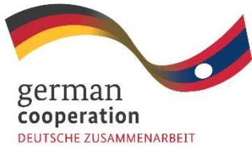
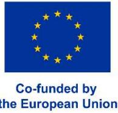
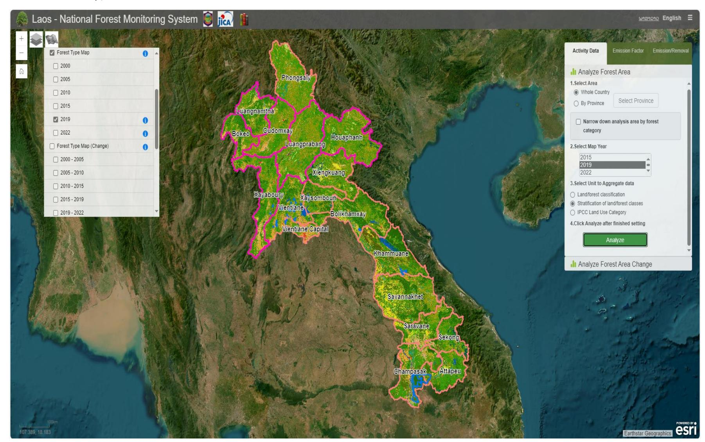
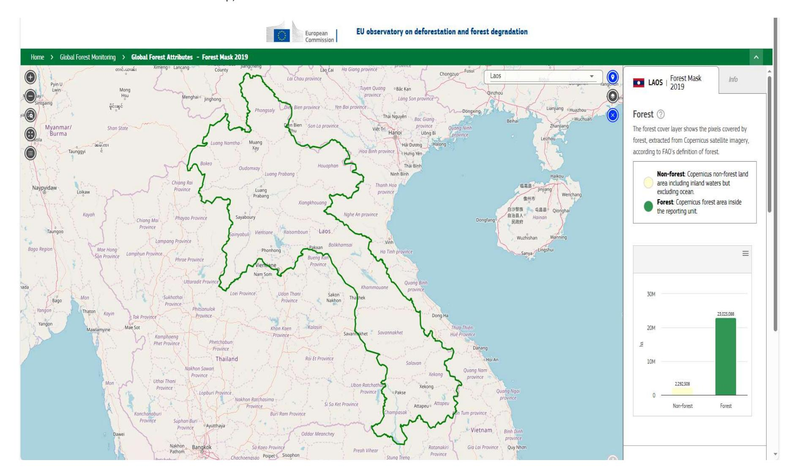
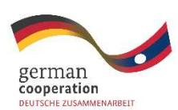
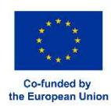
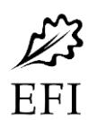
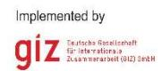

Implemented by  
**giz** Deutsche Gesellschaft  
für Internationale  
Zusammenarbeit (GiZ) GmbH

# EUDR Legality Study in Lao PDR

# **EUDR Legality Study in Lao PDR**

Disclaimer: This publicaƟon was co-funded by the European Union (EU) and German Federal Ministry of Economic CooperaƟon and Development (BMZ). The content of this publicaƟon is the sole responsibility of the authors and does not necessarily reŇect the views of the EU or the BMZ. The informaƟon in this study, or upon which this study is based, has been obtained from sources the authors believe to be reliable and accurate.

InterpretaƟon of the [European Union DeforestaƟon RegulaƟon,](https://eur-lex.europa.eu/legal-content/EN/TXT/?uri=CELEX%3A32023R1115&qid=1687867231461) [Guidance Document](https://eur-lex.europa.eu/legal-content/EN/TXT/?uri=CELEX%3A52024XC06789) and [Frequently Asked](https://environment.ec.europa.eu/publications/frequently-asked-questions-deforestation-regulation_en)  [QuesƟons](https://environment.ec.europa.eu/publications/frequently-asked-questions-deforestation-regulation_en) in this technical document was those of the authors, which should not be considered as legally binding. It remains the responsibility of the EU Competent AuthoriƟes to enforce the RegulaƟon, and for European courts to authoritaƟvely interpret it. In this context, Įndings presented in this document regarding the idenƟĮcaƟon and interpretaƟon of the Lao naƟonal legislaƟons can only be indicaƟve, not legally binding, and does not consƟtute legal advice.

## Table of Contents

| Acronyms.....                                                                                                    | i  |
|------------------------------------------------------------------------------------------------------------------|----|
| Executive Summary.....                                                                                           | i  |
| 1. Introduction .....                                                                                            | 5  |
| 1.1. Context of the EU Deforestation Regulation .....                                                            | 5  |
| 1.2. EUDR Engagement Project in Lao PDR.....                                                                     | 5  |
| 2. Objectives.....                                                                                               | 6  |
| 3. Methodology .....                                                                                             | 7  |
| 4. Approach and Structure .....                                                                                  | 7  |
| 5. Overview of the EUDR and its Key Requirements .....                                                           | 9  |
| 6. Requirements for Legal Production.....                                                                        | 12 |
| 6.1. Relevant Lao Legislations for EUDR Legal Production .....                                                   | 12 |
| 6.2. Land Use Rights in Lao PDR.....                                                                             | 16 |
| 6.3. Classification and Management of Agriculture and Forest Land.....                                           | 18 |
| 6.4. Demonstrating Compliance with EUDR Legal Requirements.....                                                  | 19 |
| 6.5. Current Situation in Lao PDR with Regards to Land Use Rights .....                                          | 22 |
| 6.6. Enabling Compliance with Legal Production in Lao Context .....                                              | 23 |
| 7. Definitions and Mapping: EUDR and National Context .....                                                      | 25 |
| 7.1. Comparison of EUDR vs Lao National Definitions .....                                                        | 25 |
| 7.2. Reflections on Definitional Differences.....                                                                | 27 |
| 7.3. EU Observatory on Deforestation and Forest Degradation .....                                                | 28 |
| 7.4. Lao National Forest Monitoring System.....                                                                  | 29 |
| 7.5. Comparing Maps: EU and Lao PDR.....                                                                         | 33 |
| 8. EUDR due diligence: Information Requirements and Gaps .....                                                   | 37 |
| 8.1. Three-Step Due Diligence for the EUDR.....                                                                  | 37 |
| 8.2. Lao Export Declaration: Information Requirements.....                                                       | 39 |
| 8.3. Comparison between EUDR Information Requirements and Information from Lao Customs Declaration Document..... | 42 |
| 8.4. Information Available from Certification Schemes.....                                                       | 44 |
| 9. Conclusion and Recommendations on EUDR Readiness.....                                                         | 48 |
| 9.1. Conclusion.....                                                                                             | 48 |
| 9.2. Recommendations.....                                                                                        | 49 |
| Annex 1. List of Interviewees.....                                                                               | 53 |
| Annex 2. List of Applicable Legal References in Lao PDR .....                                                    | 55 |

| Annex 3. Overview of Lao TLAS                                          | 61 |
|------------------------------------------------------------------------|----|
| Annex 4. Sample of Lao Customs DeclaraƟon Form                         | 64 |
| Annex 5. List of Data Available in Lao PDR                             | 66 |
| Annex 6. Key Points from NaƟonal MulƟ-Stakeholder ConsultaƟon Workshop | 70 |

# **Acronyms**

| BMZ      | German Federal Ministry of Economic CooperaƟon and Development                |
|----------|-------------------------------------------------------------------------------|
| CA       | Competent Authority                                                           |
| CITES    | ConvenƟon on InternaƟonal Trade in Endangered Species of Wild Fauna and Flora |
| CN Codes | Combined Nomenclature Codes                                                   |
| DAFO     | District Agriculture and Forestry Oĸce                                        |
| DONRE    | Department of Natural Resources and Environment                               |
| EFI      | European Forest InsƟtute                                                      |
| EIA      | Environmental Impact Assessment                                               |
| EUDR     | European Union DeforestaƟon RegulaƟon                                         |
| EUFO     | European Union Forest Observatory                                             |
| FAO      | Forest and Agriculture OrganisaƟon of the United NaƟons                       |
| FLEGT    | Forest Law Enforcement, Governance and Trade                                  |
| FPIC     | Free, Prior and Informed Consent                                              |
| FSC      | Forest Stewardship Council                                                    |
| GIZ      | Deutsche GesellschaŌ für InternaƟonale Zusammenarbeit GmbH                    |
| GOL      | Government of Lao PDR                                                         |
| HS Codes | Harmonised System Codes                                                       |
| JRC      | Joint Research Center                                                         |
| MAF      | Ministry of Agriculture and Forestry                                          |
| MONRE    | Ministry of Natural Resources and Environment                                 |
| MRV      | Monitoring, ReporƟng and VeriĮcaƟon                                           |
| NFMS     | NaƟonal Forest Monitoring System                                              |
| NSDC     | NegoƟaƟon Support and Development CommiƩee                                    |
| NSEDP    | NaƟonal Socio-Economic Development Plan                                       |
| PDA      | Project Development Agreement                                                 |
| PONRE    | Provincial Oĸce of Natural Resources and Environment                          |
| REDD+    | Reducing Emissions from DeforestaƟon and forest DegradaƟon                    |
| SMEs     | Small and Medium-sized Enterprises                                            |
| TLAS     | Timber Legality Assurance System                                              |
| UNDRIP   | United NaƟons DeclaraƟon on the Rights of Indigenous People                   |
| VPA      | Voluntary Partnership Agreement                                               |

## Executive Summary

On 29 June 2023, the [Regulation \(EU\) 2023/1115 on deforestation-free products \(EUDR\)](#) entered into force to halt deforestation and forest degradation caused by the expansion of agricultural land linked to the production of **seven commodities** such as cattle, cocoa, coffee, palm oil, rubber, soy, and wood, and some of their **derivatives** including leather, chocolate, tyres or furniture. While the EUDR follows the business-to-business approach, the Government of Lao PDR (GOL) recognises that it has a vested interest in ensuring that operators who import into the EU are able to purchase relevant commodities from Lao producers, with full confidence that they have been produced without causing deforestation and in compliance with relevant legislation concerning the legal status of the area of production.

The EUDR makes clear that it is the **responsibility of the EU operators to conduct due diligence** to ensure that the products placed on the European market or being exported from there have not been produced in a way that has caused deforestation or forest degradation, and are in compliance with the relevant legislation in the country of production concerning the legal status of the area of production. The **GOL is not under any obligation to alter its legal framework or system of governance and cannot establish a system or scheme that certifies compliance with the EUDR**, as the responsibility to exercise due diligence remains with the EU operator and/or trader. However, the GOL may consider supporting EU operators and/or traders by enhancing the enabling framework for EUDR implementation, such as providing orientation on what is considered necessary information to be collected in the Lao PDR context concerning legal production in accordance with national legislation, clarify which technical terms need to be aligned and where discrepancies might be in national legislation, ensuring that necessary information and data is produced, accessible, and compatible with the EUDR requirements.

In 2023, the EU together with the German Federal Ministry of Economic Cooperation and Development (BMZ) commissioned the project “Engagement with Indonesia, Malaysia, Lao PDR, Thailand and Viet Nam to raise awareness on and to promote better understanding of the EU approach to reducing EU-driven deforestation and forest degradation (EUDR Engagement)”. Implemented by the Deutsche Gesellschaft für Internationale Zusammenarbeit GmbH (GIZ), this Engagement project supports in the five countries engagement in multi-stakeholder dialogue formats about the EUDR in particular on its core elements, on the EU’s measures to create an enabling environment for compliance by operators and the opportunities the EUDR implies and support supply chain actors to increase their technical capabilities regarding deforestation-free and legal supply chains.

In Lao PDR, complementing the series of awareness raising activities on the EUDR with government and non-government stakeholders at national and provincial level, the Engagement project also supports government partners with providing expertise and knowledge related to EUDR implementation in the context of Lao PDR. The European Forest Institute (EFI) is contracted by the EUDR Engagement project to conduct an assessment on legality, where key findings would be combined with other studies commissioned by the EUDR Engagement project into a joint policy brief to facilitate dissemination.

Methodologically, this assessment started with a **desk review** of applicable provisions in the EUDR, Guidance Document and Frequently Asked Questions concerning these thematic areas: legality requirements, selected key definitions and due diligence requirements. This was followed by desk review of existing laws, regulations, policies, and reports concerning the supply chains of the four selected commodities: namely cattle, coffee, rubber and timber. At the end of the desk review, a

summary framework was produced, evaluating the extent to which the information and data sources needed to conduct due diligence are sufficient, publicly accessible, or can be made available by the Lao private sector, or whether the GOL needs to take further action to enhance the enabling framework for EU operators to fulfil their due diligence obligations under the EUDR. To complement findings from the desk review, semi-structured interviews were conducted with a total of **43 experts** representing government, private sector, development partners and academic researchers. Preliminary findings were consulted with stakeholders virtually on 25 November 2024. Revised findings were then consulted on 21 February 2025 at the EU-Lao PDR multi-stakeholder workshop on the EUDR in Vientiane.

Findings in this report are organised into five substantive sections, starting with an overview of the EUDR and the **legal obligations** it establishes under **Article 3**. That is, operators wanting to place relevant commodities on the EU market, or export from it, must demonstrate through a **due diligence statement**, with adequately conclusive and verifiable information, that the commodities have been produced (i) in accordance with applicable laws in the country of production concerning the **legal status of the area of production**, and (ii) on **land not subject to deforestation/ degradation after 31 December 2020** verified through geolocation data of the plot of production.

Given the assignment's focus to provide orientation on what **requirements for legal production exist in the Lao PDR and are of relevance under the EUDR**, the second section forms the main part of the assessment containing six sub-sections starting with an identification of a list of relevant legislations in Lao PDR pertaining to the eight thematic areas under Article 2(40) of the EUDR and provides an overview and general observations of the applicable provisions from these Lao legal documents on these eight areas. Following the Guidance Document on EUDR, the second sub-section focuses on the **management of land in Lao PDR**, focusing specifically on **land use rights**. It reviews the applicable laws to identify various means of demonstrating that one has the legal rights to use the land in Lao PDR. These include for example **land use certificates**, **land titles (individual and customary)**, **concession agreements**, and **lease agreements**. The third sub-section focuses on classification and management of forest and agriculture land. It emphasises an important issue regarding the mismatch between Forest Law and Land Law concerning **the rights to use state forest lands for agriculture purposes**. Building on these analyses, the next section suggests a list of questions that EU operators could utilise as part of their exercise of due diligence on legal production, which focus on **the legal status of the producers** and thus the **types of legal proof they should possess**. It should be stated that this interpretation of the Lao legal framework should not be considered legally binding or a legal advice as it is the duty of the EU competent authority and the European Courts to authoritatively interpret the EUDR.

Overall, while the legal framework in Lao PDR is sufficiently clear regarding the documentary proofs of legal compliance which could support the EU operators and/or traders in their due diligence exercise to meet the EUDR requirements, the challenge lies in the availability of these documentary proofs. For example, based on the World Bank's estimate and interviews with key experts **less than 10 percent of agriculture land has been registered, titled or issued with a land use certificate**. In addition, another key challenge concerns the lack of clarity between the Land Law and Forest Law when the **areas of production are located in forestland, particularly on State forestland**. While the Land Law allows the issuance of temporary land use certificates on state forestland, the Forest Law does not mention the possibility to certify these lands. Land Law also does not specify the nature of rights attached to land use certificates or their duration of validity. Finally, while demonstrating legal evidence for their rights to use the land for commercial farms (concession or lease agreement) is not an issue, it is recommended

that the EU operator should request from commercial plantation owners **a copy of applicable environmental impact assessment (EIA)** because (i) concessions are legally obligated to conduct EIA according to the Decree on EIA and (ii) previous studies have found that a majority of active agriculture concessions could not provide a copy of their EIAs.

The third section of this report has three objectives. First, it provides a systematic comparison between **definitions** used in the EUDR versus those that are used in the Lao national context as stipulated in legal references for terminologies such as **forest, deforestation, agricultural uses, deforestation-free, and forest degradation-free**. This section shows that by using FAO definition, the EUDR definition of ‘forest’ could be considered by some as setting too low a threshold for defining a forest (10% canopy cover), in comparison with the 20% threshold defined in the Lao Forest Law. This could mean that for Lao PDR, the clearance of land with more than 10% but less than 20% canopy cover, might not be considered as deforestation noting that the area might not have been defined legally as a forest in Lao PDR. This has implications for operators to demonstrate compliance with the EUDR, given that deforestation-free production is required (meaning that there is no conversion of forest into agricultural uses) regardless of the legal category of forest in the country of production. By using these different thresholds, the **Global Forest Cover Map** produced by the EU shows that the **forest cover in Lao PDR in 2019 was slightly over 90%**, while the Lao National Forest Monitoring System only shows the forest cover in Lao PDR **at approximately 60% for that assessment year**. The implication here is that when geolocation provided by Lao producers are plug into the EU Global Forest Cover Map (to assess deforestation/degradation-free), it is likely to show that the products come from a forest area, raising the concern for potential non-compliance. However, it should be noted that the EUFO map is non-legally binding, non-exclusive and non-mandatory.

The fourth section starts with an overview of the information requirements as part of the due diligence exercise that an EU operator and/or trader is obliged to conduct to comply with the EUDR requirements on legal and deforestation-free production. This is then followed by a description on the administrative processes required for the export of cattle, coffee, rubber and timber from Lao PDR as specified in the applicable legal framework, particularly on the information that is required by the Lao Customs. This section found that majority of the information required by the EU operator could be gathered from the **Lao Customs Declaration Document** with the exceptions of: **(i) geolocation, (ii) deforestation-free, and (iii) legal production**. To complete the information gaps, the report reviewed information that could be provided from national system (Lao TLAS for timber, currently being developed) and the third-party certification schemes used by Lao operators for export to the EU (FSC for timber and Fairtrade and EU Organic for coffee). Interviewers mentioned that export of Lao cattle and rubber is not subject to any national system or third-party certification schemes. While information gathered as part of these third-party certification schemes are useful, **having any of these voluntary certifications would not exempt the operator from having to conduct a due diligence on legal and deforestation-free production**.

Therefore, based on the assessment conducted, the final section summarises the report’s key findings focusing particularly on the challenges for the purpose of then suggesting four structured set of recommendations which the GOL should utilise to develop an operational action plan to facilitate an enabling environment for EU operator sourcing applicable products from Lao PDR. These include:

➤ **Enabling legal compliance**

- ➤ Accelerate registration of agricultural land through inter-ministerial coordination where the Ministry of Natural Resources and Environment and Ministry of Agriculture and Forestry are taking the lead roles, in line with PMO20/ 2024.
- ➤ Clarify legal rights of production areas in forestland and the nature of rights attached to the land use certificates for these areas, following the National Action Plan for the Registration of Land Use Rights in Forestland in Lao PDR.
- ➤ Digitise the agricultural land registration and land titling process to enable capturing of geolocation information on the production areas.

➤ **Alignment of standards and data compatibility**

- ➤ Continue engaging in dialogue with different Lao stakeholders and the EU, to raise awareness on and understanding of definition differences and their implications on Lao commodity sectors.
- ➤ Discuss the possibility to produce a 2020 land use/ forest cover map for Lao PDR context using FAO definition of “forest” with coordinated financial and technical support from development partners and through technical exchanges the EU Joint Research Center.

➤ **Traceability and conveyance of information (Study 2 for further information)**

- ➤ Engage actors along the supply chains to further develop and enhance traceability systems for the applicable commodities, prioritising supports to those smallholders and SMEs that are currently exporting to the EU (e.g. starting with coffee).
- ➤ Coordinate technical and financial supports including capacity building required for development and enhancement of traceability system for selected commodities, starting with those that are being exported to the EU.
- ➤ Ensure that required information such as geolocation, date of production and legality information is conveyed through the supply chains.
- ➤ Upgrade the scope of Lao TLAS to capture information required for legality and traceability and its functionality to convey this information through the supply chain.

➤ **Ensuring availability of information**

- ➤ Ensure that information required by EU operator is accessible and available building on suggestions from a comprehensive technical assessment conducted for Annex 7 of Lao-EU VPA on Public Disclosure of Information.

## 1. Introduction

### 1.1. Context of the EU Deforestation Regulation

Agricultural expansion is a primary cause of deforestation and thus a crucial driver of greenhouse gas emissions, biodiversity loss, and the degradation of ecosystem services vital to the livelihoods of forest-dependent people. Based on their synthesis of existing research and datasets to quantify the extent to which tropical deforestation from 2011 to 2015 was associated with agriculture, Pendrill et al. (2022)1 estimated that at least 90% of deforested land occurred in landscapes where agriculture drove forest loss. On 29 June 2023, the [Regulation \(EU\) 2023/1115 on deforestation-free products](#) (EUDR) entered into force. The main driver of this demand side measure is to halt deforestation and forest degradation caused by the expansion of agricultural land linked to the production of **seven commodities** such as cattle, cocoa, coffee, palm oil, rubber, soy, and wood, and some of their **derived products** including leather, chocolate, tyres or furniture2.

The EUDR has two objectives:

- ➤ Minimise the European Union's **contribution to global deforestation and forest degradation and thereby contributing to a reduction in global deforestation.**
- ➤ **Reduce the EU's contribution to carbon emissions** and global biodiversity loss

The purpose of the EUDR is to address the global problem of deforestation, forest degradation, climate change and biodiversity loss3. Under the EUDR, any operator or trader who places those seven commodities on the EU market, or exports from it, must be able to prove that the products do not originate from land that was deforested or where forest degradation has taken place after 31 December 2020. The EUDR is expected to enter into application from **30 December 2025**, and from **30 June 2026 for SME** operators and traders4.

The EUDR applies to operators who wish to place relevant commodities on the EU market or export them from there, not to the Government of Lao PDR (GOL). Operators are defined as those companies that place relevant products on the EU market for the first time or export them from there. In the case of international supply chains, usually the importer fulfils the role of an operator. However, the GOL has a vested interest in ensuring that operators placing products onto the EU are able to purchase relevant commodities from Lao producers, with full confidence that they have been produced without causing deforestation and in compliance with relevant national legislation concerning the legal status of the area of production. This means ensuring that all necessary information needed to verify deforestation-free production and conduct due diligence would be made available to the EU operators and traders.

### 1.2. EUDR Engagement Project in Lao PDR

In 2023, the EU together with the German Federal Ministry of Economic Cooperation and Development (BMZ) commissioned the project "Engagement with Indonesia, Malaysia, Lao PDR, Thailand and Viet

---

1 Pendrill, F. et al. [Disentangling the numbers behind agriculture-driven tropical deforestation](#). *Science* 377 (2022).

2 Refer to the preamble [Regulation \(EU\) 2023/1115 on deforestation-free products](#)

3 [Regulation on Deforestation-free products - European Commission \(europa.eu\)](#)

4 [EU deforestation law: Council and Parliament agree on its targeted amendment - Consilium](#)

Nam to raise awareness on and to promote better understanding of the EU approach to reducing EU-driven deforestation and forest degradation (EUDR Engagement)”. This Engagement project supports the EU delegations in the five countries to engage in multi-stakeholder dialogue formats about the EUDR in particular on its core elements (i.e. legal production, mandatory due diligence rules, traceability, benchmarking), on the EU’s measures to create an enabling environment for compliance by operators and the opportunities the EUDR implies and support supply chain actors to increase their technical capabilities regarding deforestation-free and legal supply chains.

The EUDR Engagement project is implemented by the Deutsche Gesellschaft für Internationale Zusammenarbeit GmbH (GIZ) and is integrated into the BMZ funded global program “Sustainability and Value Added in Agricultural Supply Chains”, which is part of the special initiative “Transformation of Agricultural and Food Systems”. On behalf of BMZ, the program promotes the sustainability of selected agricultural supply chains in partner countries.

In Lao PDR, complementing the series of awareness raising activities on the EUDR with government and non-government stakeholders at national and provincial level, the Engagement project also supports government partners with providing expertise and knowledge related to EUDR implementation in the context of Lao PDR. The European Forest Institute (EFI) is contracted by the EUDR Engagement project to conduct an assessment on legality, where key findings would be combined with other studies commissioned by the EUDR Engagement project into a policy brief to facilitate dissemination with policymakers and Lao public.

## **2. Objectives**

The goal of this assessment is to provide an overview and assessment on what can be considered as relevant national legislation under the EUDR in Lao PDR, propose recommendations on how to achieve EUDR readiness for the Lao national context and provide orientation for private sector stakeholders and Lao policy makers by building on findings aggregated from the following tasks:

- ➤ **Task 1.** Outline EUDR requirements on legal production and its implications for relevant Lao commodities.
- ➤ **Task 2.** Assess EUDR definition on deforestation-free and forest degradation-free production and its implications for relevant Lao commodities.
- ➤ **Task 3.** Compare information required for EU operators to exercise due diligence with information that is currently available in Lao PDR.
- ➤ **Task 4.** Recommend how to increase EUDR readiness based on the Lao national context.

Specifically, this technical paper assesses which is the current national legislative framework for legal commodity production as defined in the EUDR for the Lao PDR context, highlighting the extent to which legal and geographic information needed to establish legal and deforestation-free production for the purpose of conducting due diligence is accessible to the EU operators, and whether there are crucial information gaps that the GOL may consider addressing to support private sector actors in fulfilling their obligations regarding the EUDR legality requirements. Neither the GOL, Lao operators nor third party certification auditors can independently certify compliance with the legal and deforestation-free production requirements under the context of the EUDR. However, recommendations from this assessment could be used indicatively by the GOL, in particular the Ministry of Agriculture and Forestry

(MAF) and relevant ministries to draft action plans to effectively respond to the EUDR, provide orientation for EU operators and enhancing the enabling framework for deforestation-free and legal commodity production in Lao PDR.

For the purpose of this assessment, the general framework was assessed, with a specific focus on relevant Lao commodities including **cattle, coffee, rubber and timber**. Though the quantity of export of these EUDR commodities from Lao PDR to the EU is relatively small, these products are often exported to countries such as China, Viet Nam and Thailand for processing and potential exporting to the EU.

### **3. Methodology**

This assessment started with a desk review of applicable provisions in the EUDR legal text, Guidance Document and Frequently Asked Questions concerning these thematic areas: legality requirements, selected key definitions and due diligence requirements. This was followed by desk review of existing laws, regulations, policies, and reports concerning the supply chains of the four selected commodities: namely cattle, coffee, rubber and timber. At the end of the desk review, a summary framework was produced, evaluating the extent to which the information and data sources needed to conduct due diligence are sufficient, publicly accessible, or can be made available by the Lao private sector, or whether the GOL needs to take further action to enhance the enabling framework for the application of the EUDR.

To complement findings from the desk review, semi-structured interviews were conducted with a total of **43 experts** representing government departments (21), private sector actors (14), development partners (6) and academic researchers (2). Refer to Annex 1 on the list of interviewees. The interviews were conducted primarily during the mission in Vientiane by the study team from 14 to 25 October 2024. Based on request from interviewees, some of the interviews were conducted in Lao with the assistance of the national consultant. These interviews provided an opportunity to collect important, technically relevant information from government officials and industry actors in the four supply chains and in general, the relationships between the various stakeholders, and the challenges the EUDR presents. The interviews also served as an opportunity to enhance stakeholders' awareness on the EUDR, particularly on thematic topics stated earlier. Interviewees were informed about the study objectives and thus invited to participate in this joint assessment in various EUDR outreach events organised by the EUDR Engagement team that took place from July to November 2024. Preliminary findings based on this first draft were presented at a **debriefing workshop** organised virtually on **25 November 2024** with participation from government ministries, EU Delegation to Lao PDR, and EUDR Engagement team. Participants were given sufficient time to provide their comments. A revised version of the report was later consulted at a national multi-stakeholder workshop that was organised on **21 February 2025** in Vientiane. A final report was produced considering comments gathered from the workshop. Refer to Annex 6 on key points gathered from the national multistakeholder workshop.

### **4. Approach and Structure**

There are five substantive sections in this report. The first section (**Section 5**) provides an overview of the EUDR and the legal obligations it establishes, which includes the key requirements for legality and

deforestation-free and what operators need to do to fulfil their due diligence obligations. This section highlights some of the EUDR provisions that are applicable for this technical assessment, particularly those on legal production, deforestation-free and due diligence requirements.

Given the assignment's focus on assessing relevant national legislative framework for the EUDR requirement for legal production in the Lao context, this section (**Section 6, Task 1**) forms the main part of the assessment containing six sub-sections starting with an identification of a list of relevant legislations in Lao PDR pertaining to the eight thematic areas under Article 2(40) of the EUDR and provides an overview and general observations of the applicable provisions from these Lao legal documents on these eight areas. Following the Guidance Document on EUDR, the second sub-section focuses on the management **of land in Lao PDR**, focusing specifically on **land use rights**. The third sub-section focuses on classification and management of forest and agriculture land. Building on these analyses, the next section suggests a list of questions that EU operators could utilise as part of their exercise of due diligence on legal production. After this, the next sub-section presents the current situation on land use rights in Lao PDR and the challenges that Lao producers encounter in demonstrating proof of legal production to their buyers. The final sub-section thus closes Section 6 by offering recommendations on ways forward to address these challenges, and where applicable, lessons regarding the legal framework were drawn from the Lao TLAS process.

The third section (**Section 7, Task 2**) has three main objectives. First, it provides a systematic comparison between definitions used in the EUDR versus those that are used in the Lao national context as stipulated in legal references. These include terminologies such as forest, deforestation, agricultural uses, deforestation-free, and forest degradation-free, presented in a comparison table. The table is followed by a reflection on the implications of these differences, particularly on the definitions of forest, deforestation and degradation. The second objective of this section is to assess the synergies and discrepancies between the Global Forest Cover Map developed by the EU Forest Observatory (EUFO) and the national forest cover map developed as part of the Lao National Forest Monitoring System (NFMS). To do so, this section provides an overview of the two mapping processes, its key parameters, and most importantly the differences in terms of its results and its implications for demonstrating deforestation-free production. The final objective of this section provides recommendations for Lao policy makers on how to address these inconsistencies between the EUDR definitions and information available in the national context and through global platforms on forest data such as the EUFO.

The fourth section (**Section 8, Task 3**) starts with an overview of the information requirements as part of the due diligence exercise that an EU operator or trader is obliged to conduct to comply with the EUDR requirements on legal and deforestation-free production. This is then followed by a description on the administrative processes required for the export of cattle, coffee, rubber and timber from Lao PDR as specified in the applicable legal framework, particularly on the information that is required by the Lao Customs prior to the issuance of an Export Declaration for these commodities. This section then assesses the extent to which information provided as part of the Lao Customs Declaration Document could support the information collection process by an EU operator in the exercise of due diligence. The assessment indicated that there are information requirements from the EUDR that are not readily available in the Customs Document. As such, this section then analyses the extent to which existing mechanisms such as national system (Lao TLAS) or third-party certification schemes could fill these information gaps to facilitate the trade between the EU and Lao PDR under the EUDR context.

The final section (**Section 9, Task 4**) has two main objectives. First, it summarises the report's key findings focusing particularly on the identified challenges for the purpose of then suggesting four structured set of recommendations which the GOL should utilise to develop an operational action plan to facilitate an enabling environment for EU operator sourcing applicable products from Lao PDR.

## **5. Overview of the EUDR and its Key Requirements**

The main goal of the EUDR5 is to minimise deforestation and forest degradation world-wide by obliging EU operators and traders to fulfil due diligence requirements regarding seven commodities and their derived products, when placing them on the EU market6, or exporting them from the EU. At its core, the EUDR established **the requirements for legal and deforestation-free production** of selected commodities. As stipulated in Article 3 of the EUDR, operators wanting to place relevant commodities on the EU market, or export from it, must demonstrate through a **due diligence statement**, with adequately conclusive and verifiable information, that these **legal and deforestation-free production** requirements have been fulfilled.

Under **Article 9(1)** of the EUDR, "Operators7 shall collect information, documents and data which demonstrate that the relevant products comply with Article 3", which requires that relevant commodities shall not be placed on the EU market, or export from it, unless they are (a) "deforestation-free", and (b) "have been produced in accordance with the relevant legislation of the country of production concerning the legal status of the area of production"8. Operators are companies that place a relevant product on the EU market or export it from there Art. 2 (15). In the case of relevant products from outside the EU, this is usually the company that imports the relevant product.

- ➤ "**Deforestation-free**" means that the relevant commodity has been produced without causing **deforestation**, which is defined in Article 2(3) of the EUDR as, "the conversion of forest to agricultural use, whether human-induced or not". To demonstrate deforestation-free production, the operator must show **where (geolocation)** and **when (date of production)** the commodity was produced, and that the area of land used to produce the commodity was not deforested after 31 December 2020, based on the EUDR definition of 'forest'9. For timber and timber products, operators must also show that no forest degradation occurred after the cut-off date of 31 December 2020.
  - ○ "**Forest degradation**", defined in Article 2 (7) means structural changes to forest cover, taking the form of the conversion of: (a) primary forests or naturally regenerating forests

---

5 For a full explanation of the background to the EUDR, refer to the preamble of the regulation.

6 The EUDR also applies to relevant commodities produced within the EU market, but for the purposes of this assessment only imports into the EU are relevant.

7 'Operator' means any natural or legal person who, in the course of a commercial activity, places relevant products on the market or exports them (EUDR Article 2, 15). Specific obligations of an operator are laid out in Article 4 of the EUDR.

8 Under Article 3, a due diligence statement is also required (Article 3(c)), but the requirements for this will be covered in the following section.

9 The definition of 'forest' under Article 2(4) is taken from FAO: "'forest' means land spanning more than 0,5 hectares with trees higher than 5 metres and a canopy cover of more than 10 %, or trees able to reach those thresholds in situ, excluding land that is predominantly under agricultural or urban land use".

into plantation forests or into other wooded land; or (b) primary forests into planted forests.

- ➤ **“Relevant legislation of the country of production”**, defined in Article 2(40) means the “laws applicable in the country of production concerning the **legal status of the area of production**” in terms of:
  - ○ land use rights;
  - ○ environmental protection;
  - ○ forest-related rules, including forest management and biodiversity conservation, where directly related to wood harvesting;
  - ○ third parties’ rights;
  - ○ labour rights;
  - ○ human rights protected under international law10;
  - ○ the principle of free, prior and informed consent (FPIC), including as set out in the UN Declaration on the Rights of Indigenous Peoples; and
  - ○ tax, anti-corruption, trade and customs regulations.

Consequently, operators will need to collect all information required under Article 9 of the EUDR from all ‘upstream’ actors in the supply chain – producers, processors and/or traders. Producers whose products might end up on the EU market in the end do not have any obligations under the EUDR, however an interest in collaborating with their buyers to collect specific information on deforestation-free and legal production. However, for smallholders providing information asked for by buyers may be difficult to meet without assistance.

Similarly, operators must be able to demonstrate to the EU Competent Authorities (CAs) that they have exercised due diligence by conducting a risk assessment and, where necessary, mitigated identified risks. As made clear under **Article 10 of the EUDR**, this requires accessing information related to a variety of issues11. If an operator cannot access the necessary information, they will not be able to

- ➤ the assignment of risk to the relevant country of production or parts thereof in accordance with Article 29;
- ➤ the presence of forests in the country of production or parts thereof;
- ➤ the presence of indigenous peoples in the country of production or parts thereof;
- ➤ the consultation and cooperation in good faith with indigenous peoples in the country of production or parts thereof;
- ➤ the existence of duly reasoned claims by indigenous peoples based on objective and verifiable information regarding the use or ownership of the area used for the purpose of producing the relevant commodity;
- ➤ prevalence of deforestation or forest degradation in the country of production or parts thereof;
- ➤ the source, reliability, validity, and links to other available documentation of the information referred to in Article 9(1);

---

10 Human rights protected under international law and FPIC should only be considered to be part of the ‘relevant legislation’ if the country of production has formally integrated an instrument into its legal framework or has independently established such standards.

11 Article 10. Point 2 of the EUDR stated the risk assessment shall take into account, in particular, the following criteria:

assess the risks of non-compliance and will be unable to determine if there are risks of non-compliance with Article 3 that need to be mitigated. In such cases, operators will not be able to substantively exercise due diligence. It is therefore in the interests of producer country governments, and upstream actors in their jurisdictions, to make sure that all necessary information can be collected and accessible.

Practically, to comply with the EUDR, **EU operator and/ or trader must carry out the following tasks**12:

1. i. Collect adequately conclusive and verifiable information, that the commodities have been produced on land not subject to deforestation and forest degradation after 31 December 2020 and in accordance with relevant legislation of the country of production, including the information on **where (geolocation)** and **when (date of production)** the relevant commodities that are being placed on the EU market or exported were produced (**Article 9**).
2. ii. Using the information collected under i. and ii., **assess the risk** that the relevant commodities were not produced in compliance with core EUDR requirements (**Article 3**), mainly based on the risk criteria described in **Article 10** of the regulation.
3. iii. In case a non-negligible risk of non-compliance was identified, **mitigate any identified risks** to a negligible level, explaining and documenting how risks were determined and effectively mitigated as stipulated in **Article 11**.
4. iv. Submit a due diligence statement13 to the **EU Information System (Article 33)**, which will be assessed by a Competent Authority in the relevant EU Member State.

---

- ➤ concerns in relation to the country of production and origin or parts thereof, such as level of corruption, prevalence of document and data falsification, lack of law enforcement, violations of international human rights, armed conflict or presence of sanctions imposed by the UN Security Council or the Council of the European Union;
- ➤ the complexity of the relevant supply chain and the stage of processing of the relevant products, in particular difficulties in connecting relevant products to the plot of land where the relevant commodities were produced;
- ➤ the risk of circumvention of this Regulation or of mixing with relevant products of unknown origin or produced in areas where deforestation or forest degradation has occurred or is occurring;
- ➤ conclusions of the meetings of the Commission expert groups supporting the implementation of this Regulation, as published in the Commission's expert group register;
- ➤ substantiated concerns submitted under Article 31, and information on the history of non-compliance of operators or traders along the relevant supply chain with this Regulation;
- ➤ any information that would point to a risk that the relevant products are non-compliant;
- ➤ complementary information on compliance with this Regulation, which may include information supplied by certification or other third-party verified schemes, including voluntary schemes recognised by the Commission under Article 30(5) of Directive(EU) 2018/2001 of the European Parliament and of the Council ( 21 ), provided that the information meets the requirements set out in Article 9 of this Regulation.

12 A full list of the required information can be found in Article 9 of the EUDR.

13 Refer to Annex 2 of the EUDR for further information on Due Diligence Statement

# **6. Requirements for Legal ProducƟon**

### **6.1. Relevant Lao LegislaƟons for EUDR Legal ProducƟon**

As menƟoned in secƟon 5, one of the key EUDR requirements is that relevant commodiƟes and some of its derived products listed in Annex I of the RegulaƟon shall not be placed on the EU market or exported unless they have been produced in accordance with the **relevant legislaƟon of the country of producƟon**[14](#page-16-2). ArƟcle 2(40) of the EUDR further elaborated that relevant legislaƟon of the country of producƟon means the "laws applicable in the country of producƟon concerning the **legal status of the area of producƟon**" in terms of:

- Land use rights;
- Environmental protecƟon;
- Forest-related rules, including forest management and biodiversity conservaƟon, where directly related to wood harvesƟng;
- Third parƟes' rights;
- Labour rights;
- Human rights protected under internaƟonal law[15](#page-16-3);
- Principle of free, prior and informed consent (FPIC), including as set out in the UN DeclaraƟon on the Rights of Indigenous Peoples; and
- Tax, anƟ-corrupƟon, trade and customs regulaƟons.

According to th[e Guidance Document on EUDR r](https://green-business.ec.europa.eu/publications/guidance-eu-deforestation-regulation_en)eleased by the European Commission in October 2024, "the basis for determining whether a relevant commodity or derivative product has been produced in accordance with the relevant legislation of the country of production is the legislation of the country in which the commodity, or in the case of a product, the commodity contained in a relevant product was grown, harvested, obtained from or raised on relevant plots of land or, as regards cattle, in establishments. The EUDR takes a flexible approach by listing several areas of law without specifying particular laws, as these differ from country to country and may be subject to amendments. However, **only the applicable laws concerning the legal status of the area of production constitute relevant legislation pursuant to Article 2(40) of the EUDR"**.

This means that the relevance of laws for the **legality requirement** in Article 3(b) of the EUDR "**is not determined by the fact that they may apply generally during the production process of commodities or apply to the supply chains of relevant products and relevant commodities**, but by the fact that these **laws specifically impact or influence the legal status of the area in which the commodities were produced**. Additionally, Article 2(40) of the EUDR must be read in the light of the objectives of the EUDR as laid down in Article 1(1)(a) and (b), meaning that legislation is also relevant if its contents can be linked to halting deforestation and forest degradation in the context of the Union's commitment to address climate change and biodiversity loss".

14 Under ArƟcle 3, a due diligence statement is also required (ArƟcle 3(c)), but the requirements for this will be covered in the following secƟon.

15 Human rights protected under internaƟonal law and FPIC should only be considered to be part of the 'relevant legislaƟon' if the country of producƟon has formally integrated an instrument into its legal framework or has independently established such standards.

To facilitate EU operators and/ or traders' awareness of Lao legal framework, Annex II of this assessment report provides a list of applicable laws in Lao PDR pertaining to the eight themaƟc themes under ArƟcle 2(40). The Annex also lists some of relevant Lao naƟonal strategies and policies as well as internaƟonal convenƟons and treaƟes that Lao PDR is a signatory. This Annex is not exhausƟve and should be regarded as indicaƟve of the exisƟng Lao legal documents that might be relevant in demonstraƟng legal compliance with the EUDR. That said, the following Table 1 provides an overview and general observaƟons of the applicable provisions from key legal documents in Annex II. Where possible, this Table idenƟĮes the **veriĮable evidence of legal compliance** as sƟpulated in these Lao legislaƟons.

**Table 1. ObservaƟons of Applicable Lao Legal References**

| EUDR requirements Key reference: Law on Land 2019                                      | Observations of the Lao Legal References                                             |
|----------------------------------------------------------------------------------------|--------------------------------------------------------------------------------------|
| “Land -use                                                                             |                                                                                      |
| Land of the Lao PDR is owned by rights” (Art. 2(40)(a))                                | the national community, with the State                                               |
| citizens. Foreigners can only hold                                                     | leases or concessions on land.                                                       |
| Land use certificate is a document that certifies land use rights                      | , issued by the                                                                      |
| Lao legal entities and organisations can rights with limited term.                     | acquire land use rights through :                                                    |
| Land title as a unique document providing                                              | evidence for a land use right . It is                                                |
| according to the conditions prescribed in the laws. There are                          | two types of land                                                                    |
| titles : State land title and land title of individual, legal entity and organisation. |                                                                                      |
| customary land use rights                                                              | by Lao citizens of the land that they occupy and use                                 |
| more than twenty years before this Law                                                 | becomes effective and without a                                                      |
| document certifying the acquisition of the land but                                    | subject to certification from                                                        |
| parcels regarding the continuous land occupation and use without any disputes          |                                                                                      |
| or with disputes which have been already settled.                                      | While land registration has                                                          |
| yet to be conducted for issuance of                                                    | individual land titles , the State recognises                                        |
| and protects the customary land use right                                              | of the person and proceeds with land title registration in accordance with the laws. |

| “Environmental protection”                                                                  | Decree on Environmental Impact Assessment (2022)                                  |                                     |
|---------------------------------------------------------------------------------------------|-----------------------------------------------------------------------------------|-------------------------------------|
| Based on the Law on Environmental Protection (Article 3), (Art. 2(40)(b))                   |                                                                                   | environmental                       |
| protection                                                                                  | means application of methods and measures for environmental plants and ecosystem. |                                     |
| subjected to                                                                                | preliminary or comprehensive EIA medium enterprises (MONRE, 2022).                | based on their potential impacts    |
| “Forest -related rules, including forest                                                    | Key reference: Law on Forest 2019                                                 |                                     |
| specified the management                                                                    | requirements for the wood harvesting                                              | in production forest areas          |
| ( annual harvesting plan and                                                                | , Article 23) and forestland conversion areas (                                   | timber                              |
| harvesting inventory biodiversity conservation, where directly related to wood harvesting”  | , Article 24), logging in natural forests ( production forest areas (Article 28). | annual logging plan ,               |
| For harvesting planted trees of all species (Art. 2(40)(c))                                 |                                                                                   | in registered plantation forests or |
| conduct a survey or apply for a permit. However,                                            |                                                                                   | before felling, the owner shall     |
| present the plantation forest registration document “Third parties’ rights” (Art. 2(40)(d)) | reported to the village administration authority.                                 | or planted tree certificate         |
| their participation                                                                         | . Article 56 to 59 in the Decree stated the requirements for                      |                                     |

|                                                                                       | 
Vocation (2018) and the Law on Grievance Redress (2022). It should be noted that these laws are mainly <b>for investment projects</b> and activities such as infrastructure, mining operations and <b>large-scale agricultural activities that require EIA</b>.
                                                                                                                                                                                                                                                                                                                                                                                                                                                                                                                                                                                                                                                                                                                                                                                                                                                                                                                                                                                              |
|---------------------------------------------------------------------------------------|---------------------------------------------------------------------------------------------------------------------------------------------------------------------------------------------------------------------------------------------------------------------------------------------------------------------------------------------------------------------------------------------------------------------------------------------------------------------------------------------------------------------------------------------------------------------------------------------------------------------------------------------------------------------------------------------------------------------------------------------------------------------------------------------------------------------------------------------------------------------------------------------------------------------------------------------------------------------------------------------------------------------------------------------------------------------------------------------------------------------------------------------------------------------------------------------------------------------------------------------------------------------|
| 
“Labour rights” (Art. 2(40)(e))
                                            | 
<b>Key reference: Labour Law (2014)</b>          Labour Law defines the principles, regulations and measures on administration, monitoring, labor skills development, recruitment, and labor protection in order to enhance the quality and productivity of work in society, so as to ensure the transformation to modernisation and industrialisation aimed at <b>safeguarding the rights of employees and employers</b>, as well as the legitimate interests and the continual improvement of their livelihoods, while contributing to the promotion of investment, national socio-economic development, and regional and international links. The Law also establishes regulations concerning key issues such as <b>unionisation, social insurance, occupational health and safety, resolution of labor disputes, salary, employment contract, work hours, leave days</b>. These are then further elaborated in implementing decrees and regulations. The Law institutes the creation of the internal and external <b>Labour Inspection Agencies</b>, the inspection procedures, rights and responsibilities of the inspection officials to ensure compliance with Law and its regulations.
                                                           |
| 
“Human rights16 protected under international law” (Art. 2(40)(f))`
 | 
<b>Key reference: Constitution of Lao PDR (2015), Presidential Ordinance on the Conclusion, Accession, and Implementation of International Treaties (2009)</b>  <b>Human rights and fundamental rights of citizens</b> in accordance with the laws of Lao PDR are acknowledged, respected, protected and ensured in <b>Article 34 of the Lao Constitution (2015)</b>. The National Assembly is the representative body of the rights and interests of the multi-ethnic people; it is the highest power organisation of the State. The Local People’s Assemblies are entrusted with the same terms as the National Assembly at the provincial, district and village level (Chapter V and VIII in the Constitution). Furthermore, the Presidential Ordinance on the Conclusion, Accession, and Implementation of International Treaties (2009) establishes that international treaties which are directly applicable are those which have their provisions consistent with and provided for in the Constitution and domestic laws of Lao PDR and those that do not require the amendment of existing laws and regulations or not require the enactment of new laws and regulations. Refer to Annex II for the list of Lao national laws that resonate with
 |

16 Examples of international human rights treaties:

- • [International Covenant on Civil and Political Rights](#) (ICCPR)
- • [International Covenant on Economic, Social and Cultural Rights](#) (ICESCR)
- • [International Convention on the Elimination of All Forms of Racial Discrimination](#) (ICERD)
- • [Convention on the Elimination of All Forms of Discrimination against Women](#) (CEDAW)
- • [Convention against Torture and Other Cruel, Inhuman or Degrading Treatment or Punishment](#) (CAT)
- • [Convention on the Rights of the Child](#) (CRC)
- • [Convention on the Rights of Persons with Disabilities](#) (CRPD).
- • [United Nations Declaration on the Rights of Indigenous Persons](#) (UNDRIP)

| group and children. “The principle of free, prior and informed                                                                                                    | Key reference: None in specific                                 |
|-------------------------------------------------------------------------------------------------------------------------------------------------------------------|-----------------------------------------------------------------|
| formally enshrined in Lao law, although there are provisions in identified legal consent (FPIC), including as set                                                 |                                                                 |
| groups to participate and be informed on activities that would impact out in the UN EIA Decree). Declaration on the Rights of Indigenous Peoples” (Art. 2(40)(g)) | them (e.g.                                                      |
| “Tax, anti  corruption, trade and customs regulations” (Art. 2(40)(f))                                                                                           | Anti-Corruption (2005), Law on Enterprise (2013)                |
| publicly accessible). Lao operators’                                                                                                                              | compliance with relevant taxation and section 8 of this report. |

### **6.2. Land Use Rights in Lao PDR**

Given its focus on legal status of areas of producƟon as deĮned in ArƟcle 2(40) of the EUDR, this secƟon starts with an overview on the management of land in Lao PDR, focusing on land use rights. As an agrarian society with two third of its populaƟon living in rural areas[17](#page-20-1) , Lao PDR over the course of several years has adopted land tenure security improvement as a strategy for ensuring a transparent and accountable system of governance in rural areas that also protects the country's natural capital and helps to provide greater socio-economic opportuniƟes for ciƟzens.

In 2017, the Lao People's RevoluƟonary Party's Central CommiƩee passed the *ResoluƟon on the Enhancement of Land Management and Development in New Period*. It aims to **accelerate land Ɵtling**, modernise land administraƟon services and strengthen individual, collecƟve and **customary land tenure**. The ResoluƟon stated many challenges with the current land administraƟon system, including: (i) unlawful transfer and sale of land use rights; (ii) increases in land related disputes; (iii) unsuccessful

17 World Bank. 2022. [An Assessment of Customary Tenure Systems in the Lao PDR.](https://documents1.worldbank.org/curated/en/099510209262240112/pdf/IDU08252bdef0542e040e908b6f0334e794e4f5e.pdf) Washington, D.C.

use of land for social and economic development; (iv) implementation of land expropriation via non-transparent means, which negatively affects land tenure security and creates tension between the Government and citizens; and (v) reduced citizen trust in government due to the mismanagement of land administration. The **Resolution's principles** to achieve its goals include expanding recognised land rights to collective and customary lands, enhancing access to justice in relation to expropriation, strengthening regulations on land concessions, improving land dispute resolution mechanisms to promote fairness and transparency, and strengthening land institutions.

The GOL has promulgated a new Land Law and Forest Law to support the implementation of the Party's Resolution. The **Land Law** approved in 2019 stated in Article 3 that **all land of the Lao PDR is owned by** the national community, with **the State** representing the community's ownership, which has the rights to hold and manage land in a centralised and uniform manner across the country through land allocation plans, land use planning and land development. The State recognises the right to **use the surface of land only**, while all underground and surface natural resources belong to the national community. The State will **re-acquire land use rights** back from the users of the land in case of necessity and for national interests by paying compensation for the damage caused by the re-acquisition. The State will **revoke the land use rights** without paying any compensation to the users in case of infringement of laws or contracts. As such, the State can grant long-term or limited term land use rights for the following scenarios:

#### **Box 1. Land Use Rights in Lao PDR**

- ➤ **Long-term land use rights (land use certificates, which can be converted to land titles)**
  - ○ Lao citizens, legal persons, collectives and organisations of Lao citizens.
  - ○ The Party and State organisations, the Lao Front for National Development, the Lao Federation of Veterans, mass organisations and local administrative authorities including individuals, legal entities and collectives that use State land; and the land seized by court decisions to become State assets or managed by the State.
- ➤ **Limited term land use rights (leases or concession agreements)**
  - ○ Aliens, stateless persons, foreign individuals and foreign nationals of Lao ancestry and their organisations established with the authorisation of the State.

The State recognises the land use rights of individuals, legal entities, collectives and organisations of citizens, and stipulates that these rights are managed "by **registering land books, certifying land use, issuing land titles** and registering transfer and changes of **land use rights**". Based on Article 100 of the Land Law, **land titles** can be issued to land parcels previously not certified and free of encumbrances owned by Lao citizens, legal entities or organisations with **certificates of acquisition of the land use right**, which refer to the certificate of land granted by the State; agreements of transfer, donation, sale or certificate of inheritance; land survey certificate; certificate of land development; or certificate of land guarantee. If the landowner does not have certificates of the acquisition of the land, it can be still titled under Land Law **Article 130 (Acquisition of Customary Land Use Right)** providing that the village administration and neighbours certify that the land parcel has been occupied by the owners for more than 20 years without disputes.

**Land use certificates** can be issued to those individuals, legal entities, organisations and collectives with land use rights in state lands. They can be permanent or temporary, and some of them, such as those granted to individuals with Lao citizenship, **can be converted to land titles. Land use certificates** granted to individuals and legal entities can be sold, transferred, inherited and leased, while use as collateral is allowed only in certain cases. **Land use certificates issued to collectives** should be under land use recognised in the Land Law Article 81, and they **cannot be transferred**, sold, exchanged or leased, granted as concessions or used as collateral. Lands that are not transferred to the previously described entities are considered public lands, which can be granted to Party organizations, state agencies and local administrative authorities through titling. **Land titles and land use certificates are issued by the District Offices of Natural Resources and Environment (DONRE) in paper format, which is the only legally binding version of these documents.**

### **6.3. Classification and Management of Agriculture and Forest Land**

Article 21 of Land Law classified land in Lao PDR into **eight categories: Agriculture, Forest, Water Area, Industrial, Communication, Cultural, Construction and National Defence and Security.** The Land Law allows conversion of land category from one to another if it is considered to be necessary to use the land for another purpose to maximise the benefits and to improve people's livelihood in line with the National Socio-Economic Development Plan (NSEDP) and with minimum negative impacts on society and the natural environment (Article 23).

Article 32 stated that **agricultural land** is land which is determined to be used for cultivation, animal husbandry, fishery, irrigation and agricultural experimentation and research. The State recognises the right of Lao citizens to long-term use of agricultural land by issuing **land titles** at the Office of Natural Resources and Environment where the land is located as prescribed in Article 101 of the Law.

According to the Resolution of the National Assembly meeting on the National Land Allocation Master Plan by 2030, land has been designated as **state forest land** amounting to **70 percent of the total land area** of Lao PDR (equivalent to 16.5 million hectares). Although the percentage of forest land and targeted forest cover are the same, the actual areas are different. **Forest land** refers to the area of land parcels, with or without forest cover, which have been defined by the State as forest land, including water catchment areas within forest land as prescribed in the **Forest Law**.

On the other hand, the term **forest cover** defines forest that can be measured in reality "which consists of biodiversity, water sources and land with various tree species **growing naturally or planted** in an area more than **0.5 hectares** with a crown cover of more than **20 percent**" (Article 2 the Forest Law). According to the 9th NSEDP from 2020-2025, the target indicator is to "increase forest land to 70 percent and increase forest cover to no less than 70 percent of the total land area by 2025". The NSEDP reports that the outcome of the previous period (2015 – 2019), forest cover was increased to 62 percent.

Forest land can be used for a public purpose and by families and businesses while ensuring there are **no adverse impacts on the forest, soil quality, environment and society**. The State recognises the use of land by people who have been living and making their living in forest land before the area is classified as forest land. The MAF is tasked with coordinating with the MONRE, other relevant ministries and local administrative authorities to conduct surveys, data collection and re-allocation of the forest land and

then **issue land use certificates to individuals or families** in accordance with the laws; and to encourage them to contribute to the protection of forests as defined in the Forest Law and other relevant laws.

The Forest Law and Land Law are partly in conflict with the **land rights of those residing in state forest lands**. State forest lands “are all land plots with or without forest cover, which are determined by the State as forest lands”, according to the Forest Law. These cover **62 percent of Lao PDR’s land mass**, and about **34 percent of villages** and **24 percent of the population**; many who belong to ethnic groups are estimated to be **located within state forest lands**. There is a lack of legal clarity related to land rights of those residing in state forest lands. According to the Land Law, land within state forest lands can be granted to individuals with **temporary land use certificates**, if they have occupied it before it was classified as state forest land, while the **Forest Law** stipulates that state forest lands must be managed centrally by the State, and **does not mention the possibility to certify these lands**. While the Land Law articles on customary land, forest lands and land use certificates are amended or new additions to the law; implementing regulations and decrees under the Land Law are still under preparation.

Overall, secure land tenure for vulnerable persons, particularly those residing on state forest lands, remains an issue in Lao PDR. The legal protection of land use rights of communal land holders and those who reside in state forest lands is limited, which primarily affects minorities, ethnic minorities and the poor. In addition, the Land Law is not precise in describing the distinction of tenure eligibility within the three forest land categories (production, protection and conservation) based on their respective land use. It further does not specify the nature of rights attached to land use certificates or their duration of validity. Land plots which are classified as forest land in the local land allocation plan and are used by individuals, families or collectives in accordance with the laws and regulations may be issued a land use certificate to recognise their land use right, according to Articles 44 and 81 of the Land Law, while the land ownership remains to be state land. Also, Article 44 of the Land Law was often interpreted in such a way that **only land use certificates can be issued in the areas of the three forest land categories for any type of land use**.

The 9th NSEDP prioritised clarification of the **right to use land in forests and forest land** with the target of issuing additional 1.6 million land titles by 2025. This demands clarification as to what extent the issuance of **land use certificates** and **land titles** in forest land is included in achieving this target, as nearly **one third of all villages and towns of Lao PDR are inside the forest land**. The GOL acknowledges the importance of recognising the land use rights of the people who live and make a living in forest land before the declaration of such areas as forest land, for better administration, management, protection, development, use, and prevention of forest encroachment and destruction.

#### **6.4. Demonstrating Compliance with EUDR Legal Requirements**

Taking into consideration information presented in section 6.2 and 6.3 regarding the land use rights in Lao PDR, to operationalise the requirements described in section 6.1, demonstrating legal compliance with the EUDR would therefore depend on two intertwined factors upon which the collection of information would need to focus: (i) the legal status of the producers and (ii) the associated land use rights based on (i) and the categories of land they utilise to produce the EUDR commodities.

First, based on the Land Law, producers could be grouped into three categories where their legal rights to use the land could be demonstrated through one of these legal documents: **land use certificates, land titles, concession or lease agreements.**

- ➤ Lao citizens, legal persons, collectives and organisations of Lao citizens
- ➤ The Party and State organisations, the Lao Front for National Development, the Lao Federation of Veterans, mass organisations and local administrative authorities including individuals, legal entities and collectives that use State land; and the land seized by court decisions to become State assets or managed by the State.
- ➤ Aliens, stateless persons, foreign individuals and foreign nationals of Lao ancestry and their organisations established with the authorisation of the State.

Second, the areas of production that these producers utilise also determine the form of legal evidence that they would be able to receive from the State. For example, the Land Law is clear that **a land use certificate**, which can then be converted into **a land title**, could be issued for the use of **agriculture land** by Lao citizens, legal persons, collectives and organisations of Lao citizens as well as for the Party and State organisations, the Lao Front for National Development, the Lao Federation of Veterans, mass organisations and local administrative authorities including individuals, legal entities and collectives that use State land; and the land seized by court decisions to become State assets or managed by the State. However, there is a lack of clarity between the Land Law and Forest Law when the areas of production is located in **forest land**, particularly on State forest land. While the Land Law allows the issuance of **temporary land use certificates** on state forest land, the **Forest Law** does not mention the possibility to certify these lands. Land Law also does not specify the nature of rights attached to land use certificates or their duration of validity.

Regarding aliens, stateless persons, foreigners, foreign nationals of Lao ancestry and their organisations established in the Lao PDR with the authorisation of the State, the Land Law is clear that they shall have the rights to use their land in accordance with its purpose (e.g. agriculture, forest) through **concession or lease agreements**. Article 117 stated that **aliens, stateless persons, foreigners, foreign nationals of Lao ancestry** who legally reside in the Lao PDR and their organisations that have been established with the authorisation of the State **can lease land from Lao citizens including legal entities or organisations of Lao citizens for a period not exceeding 30 years with the option of renewal** as agreed by the contracting parties and subject to approval of the provincial administrative authorities based on the proposal of the Provincial Department of Natural Resources and Environment (PONRE). The Land Law however does not specify any obligations regarding the **leasing of land from Lao citizens** including legal entities or organisations of Lao citizens.

On the other hand, **the lease or concession of State land** (including the three categories of forest land) shall go through an auction process and take place within land areas allocated by the State. Land Law requires (Article 119), the lessee or concessionaire shall **conduct an environmental impact assessment** including the elaboration of social and natural environment management and monitoring plans as prescribed in the laws and regulations. Once the Government or provincial administrative authorities grant the lease or concession of State land (**not exceeding the period of 50 years**) to individuals, legal entities or domestic and foreign organisations, the DONRE of the specific province where the land is located will issue the **State land title to the lessee or concessionaire** within five working days in accordance with the lease or concession terms.

The following are obligations for the Lessee or Concessionaire stated in Article 122 of the Land Law:

- ➤ to use the land in accordance with its purposes;
- ➤ to completely and in a timely manner pay the rent or concession fees, royalties, taxes, duties, service fees and other obligations in accordance with the relevant laws;
- ➤ to pay compensation to those affected by their operations;
- ➤ to strictly fulfil environmental obligations in accordance with the laws and regulations;
- ➤ to not violate the rights and interests of other persons;
- ➤ to comply with legal servitude in accordance with the laws;
- ➤ to fulfil other obligations as prescribed in the laws and the agreement terms and conditions.

Based on the aforementioned sections, to ensure that the products from Lao PDR have been produced in accordance with the legal requirements pertaining to the legal status of the areas of production, the EU operators should ask the following questions as part of their due diligence process:

- ➤ What is the legal status of the producers? Answer should be:
  - ○ Lao citizens, legal persons, collectives and organisations of Lao citizens;
  - ○ The Party and State organisations, the Lao Front for National Development, the Lao Federation of Veterans, mass organisations and local administrative authorities including individuals, legal entities and collectives that use State land;
  - ○ Aliens, stateless persons, foreign individuals and foreign nationals of Lao ancestry and their organisations established with the authorisation of the State.
- ➤ What category of land was used to produce the products? Answer should be:
  - ○ Agriculture land (production of cattle and coffee)
  - ○ Forest land (commercial tree and rubber plantation in production forest area)
- ➤ For agriculture land, can the producer provide a copy of the land use certificate, land title, concession agreement or lease agreement to demonstrate legal compliance?
- ➤ For forest land, can the producer provide a copy of the land use certificate, land title, concession agreement or lease agreement to demonstrate legal compliance?

**Box 2. Demonstrating Legal Production in Lao PDR**

| Producer legal status                                                                                                                                                                                                                                                                                                                                                                                                                                                                                                                                                                                                                                    | Proof                                                                                                                                                                                                         |
|----------------------------------------------------------------------------------------------------------------------------------------------------------------------------------------------------------------------------------------------------------------------------------------------------------------------------------------------------------------------------------------------------------------------------------------------------------------------------------------------------------------------------------------------------------------------------------------------------------------------------------------------------------|---------------------------------------------------------------------------------------------------------------------------------------------------------------------------------------------------------------|
| <ul style="list-style-type: none;"> <li>➤ Lao citizens, legal persons, collectives and organisations of Lao citizens</li> <li>➤ The Party and State organisations, the Lao Front for National Development, the Lao Federation of Veterans, mass organisations and local administrative authorities including individuals, legal entities and collectives that use State land; and the land seized by court decisions to become State assets or managed by the State.</li> <li>➤ Aliens, stateless persons, foreign individuals and foreign nationals of Lao ancestry and their organisations established with the authorisation of the State.</li> </ul> | <input type="checkbox"/> Land use certificates <input type="checkbox"/> Land titles (individual, customary) <input type="checkbox"/> Concession agreements <input type="checkbox"/> Lease agreements |

## 6.5. Current Situation in Lao PDR with Regards to Land Use Rights

While the legal framework in Lao PDR to a certain extent is sufficiently clear regarding the documentary proofs of legal compliance with the EUDR requirements, the challenge lies in the availability of these documentary proofs. To begin, the World Bank (2021) estimated that out of the 3-3.5 million public and private land parcels in Lao PDR, about 1.5 million parcels, primarily in urban and peri-urban areas, have been registered and titled. However, specific on agriculture land, government stakeholders18 stated that less than 10 percent of agriculture land has been registered, titled or issued with a land use certificate. As stated in earlier section, about **34 percent of villages** or **24 percent of the total Lao population**; many who belong to ethnic groups are estimated to be **located within the three categories of state forest lands**. Local villagers' legal rights to use land for agriculture within the state's three categories of forest land is a complex, enduring issue which has not been resolved conclusively. It should be noted that the GOL (MONRE and MAF) recently launched an *Action Plan for the Recognition of Land Use Rights in Forest Land in Lao PDR*. For the time being, interviewees confirmed that almost all local villagers engaged in the production of EUDR commodities such as coffee lack documentary proof to demonstrate their legal rights to use the land either on agriculture or forest land.

The situation is different for producers who own **commercial farms** either on their privately titled land or on State land that they lease or concession from the government or Lao citizens. As reported by Lao DECIDE III (2020)19, a total of **1,758 land concessions/ leases were identified from 2014-2017** in the **agriculture (449), tree plantation (328), mining (622 for exploitation; 237 for prospecting and exploration)** and hydropower (122) sector; for which a total area of **11,754,417 ha** was granted, **or 50% of Lao total land area**. Foreign investment accounts for **61%** of the total area granted for concessions (**China** at 30% of the total land area granted, followed by **Viet Nam and Thailand** at 14% and 6%, respectively). Gold, **rubber and eucalyptus** are the top three out of 133 products across the sectors documented in the inventory. Furthermore, a **total of 240 concessions (covering 137,332 ha)** from the inventory were developed in areas classified as **state forest lands**. Of these, **about 11,000 ha of land** was developed **within national conservation forest areas**, designated for the protection of the natural environment and biodiversity. **Secondary and primary forest are the most common land use types allocated**, which implies significant amounts of deforestation and forest degradation are caused by these leases or concessions. Finally, it's reported that **less than 50%** of all investigated concessions had **Project Development Agreements (PDAs) or Concession Agreements** available. Only **2% of all investigated concessions had EIAs** available. **Foreign investments have higher compliance rates**, measured by the presence of mandatory legal documents for a land concession. This is possibly due to adequate oversight of legal requirements at the **place of origin of investment**. Domestic land leases or concessions more often lack mandatory key legal documents.

---

18 Interview with MONRE

19 Cornelia Hett, Vong Nanhthavong, Savanh Hanephom, Anongsone Phommachanh, Boungnong Sidavong, Ketkeo Phouangphet, Juliet Lu, Annie Shattuck, Micah Ingalls, Rasso Bernhard, Souphaphone Phathitmixay, Chanthavone Phomphakdy, Andreas Heinimann, Michael Epprecht (2020). *Land Leases and Concessions in the Lao PDR: A characterization of investments in land and their impacts*. Bern: Centre for Development and Environment (CDE), University of Bern, Switzerland, with Bern Open Publishing, 150 pp.

There are **three main observations** based on these findings from the previous section. First, it would be challenging for a significant number of producers, particularly smallholders, engaged in the production of EUDR commodities in Lao PDR to have available the legal documents specified in the Land Law to demonstrate their compliance regarding the proof of their legal rights to use the areas of production. The implication here is that by not having such legal documents, smallholders are at risk of not being able to contribute to assuring the EU buyers that there is non-negligible risk associated with legal production of the commodities coming from their land. Second, while it is possible for domestic and foreign lessees or concessionaires producing applicable EUDR commodities in Lao PDR to provide evidence of their legal rights to use the areas of productions, findings from Lao DECIDE III cautioned that EU operators should request for a **copy of the concession or lease agreement** as well as applicable **EIA** either preliminary or comprehensive. These documents would enable EU operator to conduct the following checks as part of their due diligence: location and date of the concession or lease, and the land category that the lease or concession is located on. It should also be noted that the FPIC process could also be checked for timber companies interviewed for this study who hold concession agreements as this requirement has been a core requirement from their internally reputable investors, despite the lack of legal obligations in Lao PDR.

The third observation is more complex as this concerns the fact that the Lao legal framework allows for the utilisation of forest land for agriculture purposes as well as for rubber and tree plantation. As found by Lao DECIDE III, concessions or leases for agriculture and tree plantation have been legally allowed in state forest land, some even in areas with primary and secondary forest. Smallholders have also been allowed to utilise forest land, for example in the controlled use zone, buffer zone, village forest areas, for agricultural and tree plantation purposes and are eligible to receive land use certificates which can be converted to land titles. The recently launched Action Plan to recognise individual and collective/customary land use rights in the three categories of forest land, while seen by many as a positive step toward resolving this long-standing issue of agriculture in forest land, the concern for EUDR would be that while the land use certificates issued for production areas inside these forest land comply with the Article 3.b, it is highly possible that it will not comply with Article 3.a of the EUDR (deforestation-free). The EUDR text made it clear that relevant products **must meet all criteria under Article 3 separately and individually**; otherwise, operators and non-SME traders shall refrain from placing or making them available on the market or exporting them.

## **6.6. Enabling Compliance with Legal Production in Lao Context**

Based on the key observations elaborated in the previous section, the following are recommendations that the GOL might want to consider addressing to support private sector actors in fulfilling their obligations regarding the EUDR legality requirements. As mentioned earlier, as an agrarian society where a majority of the population is still engaged in agricultural activities at the micro and small level (i.e. family owned farms), these recommendations would therefore benefit them.

The first challenge is the current lack of any documentary proof of the producers' legal rights to use their production areas as stipulated in the Land Law (refer to Box 2). As identified in previous sections, less than 10% of the agricultural land has been registered or titled. Therefore, a starting point for the GOL would be to **accelerate the agricultural land registration process**, in line with the PMO 20/2024,

particularly starting with those producers that are exporting to the EU20, using the resources from national budget allocation and from existing programmes such as the [World Bank's Enhancing Systematic Land Registration Project](#). It should also be mentioned that the EUDR provides avenues for support to third countries such as Lao PDR as stipulated in Article 30 of the Regulation. Accelerating the land registration process requires a concerted effort by the GOL on several levels. Based on the experience in other producer countries, a high-level government instruction is needed to organise and provide mandate to line ministries to develop a coordinated masterplan. This requires an appointment of a lead agency (MONRE), supporting organisations (MAF), a clear division of tasks, and assignment of appropriate budget. This tasks also requires forward-looking approach in planning.

The second challenge to address is to **clarify the legal status of production areas located within the three categories of forestland** and the nature of rights attached to the land use certificates for these areas, noting that a significant quantity of commodities is produced by smallholders residing on state forestland. Addressing challenges related to land use within the three categories of forestland has been one of the key development priorities of the GOL which has been appropriately supported by key programmes such as those of the World Bank, GIZ, KfW and others. The preparation for the EUDR should therefore provide the GOL with an additional motivation to accelerate the implementation of key activities identified in the **Action Plan for the Recognition of Land Use Rights in Forestland in Lao PDR**. Nonetheless, this is a complex and sensitive task that would require a multi-ministry approach.

Similar to the acceleration of agriculture land registration and titling, following the Action Plan it is recommended to establish an inter-ministerial working committee to clarify the legality issue of the production areas inside the state forest land. This committee needs to have a strong mandate and a clear division of tasks to map the commodities inside the state forest land, delineate them, and vet the ownership. Based on the findings, options can be formulated on how to address the legality of these crops. Good practices from other countries could provide inputs in this context. Clarification of the legal framework through multistakeholder, participatory and deliberative process has been at the heart of the efforts to develop the Lao Timber Legality Assurance System (Lao TLAS, which is ongoing). As such, there are relevant lessons from the Lao TLAS development, particularly on the deliberative process to establish Legality Definitions and overall multistakeholder engagement, to be considered (refer to Annex 3 on the overview, status and lessons from the Lao TLAS development).

Third and finally, land registration and titling process in Lao PDR has been primarily done manually, particularly outside the urban/ city areas. The constraint resulting from this is the inability to capture the geolocation information pertaining to the area being registered or titled. There have been programmes that support development and testing of information systems on land registration (refer to Annex 5). Therefore, in line with the first recommendation, as a forward-looking strategy, it is recommended that the GOL consider moving towards **digitising the registration and titling of agricultural land** building on these ongoing initiatives. Application of on-line systems would enable the GOL to minimise the handling of paper documents and reduce associated workload and potential for errors. Maximum effort should be placed into this process, especially in rural areas where a majority of producers are smallholders. Having this information in a digital format would facilitate their transfer through the supply chains and thus helping to improve the information transparency in Lao PDR.

---

20 Suggestion from Department of Agriculture during interviews.

## 7. Definitions and Mapping: EUDR and National Context

This section has three main objectives. First, it provides a systematic comparison between definitions used in the EUDR versus those that are used in the Lao national context as stipulated in legal references. These include terminologies such as forest, deforestation, agricultural use, deforestation-free, and forest degradation-free. The table is followed by a reflection on the implications of these differences, particularly on the definitions of forest, deforestation and forest degradation. The second objective of this section is to assess the synergies and inconsistencies between the Global Forest Cover Map developed by the EU Forest Observatory (EUFO) and the national forest cover map developed as part of the Lao National Forest Monitoring System (NFMS). It is important for the GOL to be aware of the EUFO because this might be one of the key information sources that EU operators would rely on to conduct their due diligence on deforestation- and forest degradation-free production. To do this comparison, this section provides an overview of the two mapping processes, its key parameters, and most importantly the differences in terms of its results and its implications for demonstrating deforestation- and forest degradation-free compliance. The final objective of this section therefore provides recommendations for Lao policy makers on how to address these inconsistencies between the EUDR requirements and information available in the national context and through the global platform such as the EUFO.

### 7.1. Comparison of EUDR vs Lao National Definitions

The following table, Table 2, compares some of the fundamental definitions used in the EUDR versus those that could be found in applicable legal references in Lao PDR.

**Table 2. Comparison of EUDR vs Lao Definitions of Key Terms**

| Terms         | EUDR Definitions                                                                                                                                                                                                                                                                     | Lao Definitions                                                                                                                                                                                                                                                                                                                                                                                                                                                                                                                                                                                 |
|---------------|--------------------------------------------------------------------------------------------------------------------------------------------------------------------------------------------------------------------------------------------------------------------------------------|-------------------------------------------------------------------------------------------------------------------------------------------------------------------------------------------------------------------------------------------------------------------------------------------------------------------------------------------------------------------------------------------------------------------------------------------------------------------------------------------------------------------------------------------------------------------------------------------------|
| <b>Forest</b> | <b>Forest</b> refers to land spanning more than 0,5 hectares with trees higher than 5 meters and a canopy cover of <b>more than 10%</b> , or trees able to reach those thresholds in situ, excluding land that is predominantly under agricultural or urban land use (Article 2(4)). | <b>Forests</b> are invaluable national resources with a unique ecology, comprising biodiversity, water sources and land with various tree species growing naturally or planted in an area of at least 0.5 hectares and a crown cover of <b>at least 20%</b> .  <b>Forestland</b> is all land with or without forest cover, which is designated by the State as forestland (Forest Law, Article 3)  The Forestry Strategy 2035 aims to conserve 16.5 million hectares of forestland (or 70% of the country's land area) and increase forest cover to 70% of the country's land area. |

| <b>Deforestation</b>                  | <b>Deforestation</b> means conversion of forest to agricultural use, whether human-induced or not, Article 2(3).                                                                                                                                                                                                                                                                                                                                                                                 | 
Forest Law 2019 (Article 3, 19) defines <b>destruction of forest and forestland</b>21 to include all means of cutting, clearing, or burning of trees, killing trees by any means, and degrading forestland by the use of chemicals or other methods which damage forests and forestland.
 
The Forest Law also defines <b>conversion of forestland</b> as the change of forestland to another land-use category for a different purpose (Article 3).
 
There are <b>9 categories of land</b> in the Land Law (2019). Conversion of forestland into other categories such as agriculture land, and vice versa, is possible under the Law (Section 3).
 |
|---------------------------------------|--------------------------------------------------------------------------------------------------------------------------------------------------------------------------------------------------------------------------------------------------------------------------------------------------------------------------------------------------------------------------------------------------------------------------------------------------------------------------------------------------|----------------------------------------------------------------------------------------------------------------------------------------------------------------------------------------------------------------------------------------------------------------------------------------------------------------------------------------------------------------------------------------------------------------------------------------------------------------------------------------------------------------------------------------------------------------------------------------------------------------------------------------------------------------------------------|
| <b>Agricultural use</b> 22 | Agricultural use is the use of land for the purpose of agriculture, including for agriculture plantations and set aside agricultural areas, and for rearing livestock Article 2(5).                                                                                                                                                                                                                                                                                                              | <b>Agricultural land</b> is land which is determined to be used for cultivation, animal husbandry, fishery, irrigation and agricultural research and experimentation. (Article 32, Land Law).                                                                                                                                                                                                                                                                                                                                                                                                                                                                                    |
| <b>Deforestation-free</b>             | <b>Deforestation-free</b> means that the relevant commodity has been produced without causing deforestation as defined in Article 2(3). To demonstrate deforestation-free production, the operator must ultimately show <b>where (geolocation)</b> and <b>when (date of production)</b> the commodity was produced, and that the area of land used to produce the commodity was <b>not deforested after 31 December 2020</b> , using the definition of ‘forest’ in Article 2(4) as the baseline. | <b>No equivalent definition in Lao PDR.</b>                                                                                                                                                                                                                                                                                                                                                                                                                                                                                                                                                                                                                                      |
| <b>Forest degradation</b>             | <b>Forest degradation</b> (only applies to wood) refers to structural changes to                                                                                                                                                                                                                                                                                                                                                                                                                 | While the Forest Law does not define forest degradation, it defines <b>degraded</b>                                                                                                                                                                                                                                                                                                                                                                                                                                                                                                                                                                                              |

21 GIZ Laos suggested that destruction of forest and forestland means deforestation in Lao language.

22 The EU is developing the Guidance Document on agricultural use, along with other topics such as legality, certification, composite product and due diligence.

|  | 
forest cover, taking the form of the conversion of: (a) primary forests or naturally regenerating forests into plantation forests or into other wooded land; or (b) primary forests into planted forests, Article 2(7).
 
While EUDR adopted FAO definition of forest and forest types, FAO does not have a definition of forest degradation.
 | 
<b>forestland</b> (Article 3) as a forestland area that has been heavily and continuously disturbed for many years and will take a number of decades to regenerate naturally. Degraded forestlands have a tree crown (canopy) <b>cover of no more than 10%</b>, and a standing tree volume of no more than 20m3/ha, measuring only those trees of over 10 cm in diameter.
 |
|--|-----------------------------------------------------------------------------------------------------------------------------------------------------------------------------------------------------------------------------------------------------------------------------------------------------------------------------------------------------------|---------------------------------------------------------------------------------------------------------------------------------------------------------------------------------------------------------------------------------------------------------------------------------------------------------------------------------------------------------------------------------------------|
|--|-----------------------------------------------------------------------------------------------------------------------------------------------------------------------------------------------------------------------------------------------------------------------------------------------------------------------------------------------------------|---------------------------------------------------------------------------------------------------------------------------------------------------------------------------------------------------------------------------------------------------------------------------------------------------------------------------------------------------------------------------------------------|

## 7.2. Reflections on Definitional Differences

As shown in Table 2, while adopting the FAO definition, the EUDR definition of **‘forest’** could be considered by some as setting too low a threshold for defining a forest (10% canopy cover), in comparison with the 20% threshold defined in the Lao Forest Law. This could mean that for Lao PDR, the clearance of land with more than 10% but less than 20% canopy cover, might not be considered as deforestation noting that the area might not have been defined legally as a forest in Lao PDR to begin with. This has implications for compliance with the EUDR, given that deforestation-free production is required (meaning that there is no conversion of forest into agricultural use) regardless of the legal category of forest in the country of production. If Lao PDR aspires to be able to provide data on forest coverage that can be used by the EU operators, it would be necessary that the data is aligned with the EUDR definitions, particularly in the case of forest, this means a land with 10% canopy cover, excluding ‘agricultural plantations’23. Based on feedback from geospatial experts consulted during the interview, this is not readily available and resources would need to be mobilised to create this base map.

Secondly, the EUDR definition of **forest degradation**, as outlined in Table 2, is based on the structural changes of these forest types: primary forest, naturally regenerating forest, other wooded land, plantation forest, and planted forest24. While the definitions of these forest types in the Regulation are generally based on the FAO definitions25, the **forest degradation definition is specific to the EUDR since the FAO does not define this term, nor does the Lao legal framework** as stated in Table 2. The EUDR definition of forest degradation also differs from other definitions, including the one used in Lao PDR, which tend to focus on a reduction in forest quality or health rather than a structural change from one forest type to another. Therefore, there are two scenarios that are relevant from the perspective of monitoring and demonstrating deforestation-free compliance based on this context.

23 Article 2 (6) of the EUDR defines ‘agricultural plantation’ to mean land with tree stands in agricultural production systems, such as fruit tree plantations, oil palm plantations, olive orchards and agroforestry systems where crops are grown under tree cover; it includes all plantations of relevant commodities other than wood; agricultural plantations are excluded from the definition of ‘forest’;

24 Refer to EUDR Article 2 for definitions of these forest types.

25 For more information, refer to [FRA 2020](#) | [Global Forest Resources Assessments](#) | [Food and Agriculture Organization of the United Nations](#)

First, conversion of either primary or naturally regenerating forest to a type that results in forest degradation or deforestation takes place between 2020 and the time that a due diligence assessment was conducted. Wood harvesting, fires either natural or human-induced, tree planting and other activities can result in that change of forest type. Harvested wood sourced from the resulting forest or land type cannot be placed on the EU market or export. This includes conversion to agroforestry (such as silvopasture) where wood is harvested, which would be considered deforestation. Second, and more complicated, is where no conversion of the different forest types has yet occurred. While harvesting and related activities could result in conversion to one of the forest types that would be considered by the EUDR definition as forest degradation, or conversion may be delayed following harvesting. In this scenario, the challenge is that forest degradation is not always observable at the time of harvest and due diligence assessments conducted by the operator and may take years to detect. There is no expectation to predict the future, which means that delayed forest degradation after harvesting will not be captured by the operator during the due diligence process.

### 7.3. EU Observatory on Deforestation and Forest Degradation

From the outset the EU and the Joint Research Center (producer of the **EU Global Map of Forest Cover 2020**) indicated that the Global Forest Cover Map would be “**one of many**” sources of reference for the operator to utilise to check for deforestation-free and validate due diligence statements by the EU competent authorities. As a result, the use of the **EU Global Map of Forest Cover 202026** is:

- • **Non-mandatory:** There is no obligation for stakeholders, notably operators and competent authorities concerned with the implementation of the EUDR, to use this map.
- • **Not legally binding:** The map is only one of many tools that support the implementation of the regulation, notably risk assessment step in the exercise of due diligence.
- • **Non-exclusive:** this map is free-of-charge and may be used to complement other cartographic products that are available.

In 2019 the European Commission put forward a communication to protect and restore the world’s forests. This communication resulted in the two interconnected outcomes. First, the process was initiated toward the formulation of the EUDR. Second, to support the EUDR implementation, the European Council and Parliament welcomed the proposal for an EU Observatory. Consequently, in December 2023, the “**EU Observatory on Deforestation and Forest Degradation**” (EUFO), officially came into existence. The main tasks envisioned for the EUFO is to provide access to global forest maps and spatial forest and forestry-related information, as well as to facilitate access to scientific information on commodity supply chains entering or exiting the EU market by linking deforestation, forest degradation and changes in the world’s forest cover. As the preparations for EUDR gained momentum, the overarching priority for the EUFO became the preparation and sharing of the **EU Global Map of Forest Cover 2020**. This is meant to support the implementation of EUDR by illustrating the extent of the world’s forest cover by the end of 2020 to provide the empirical and scientific basis and thus the means of verification for the deforestation and forest degradation cut-off date of 31 December 202027.

---

26 For more information, refer to [Forest Observations](#)

27 For more information, refer to [EU Forest Observatory](#)

The main objective of the EUFO in the context of EUDR is to produce, make publicly available, and continuously improve/ update the Global Map of Forest Cover 2020. The map seeks to be a harmonised, globally consistent representation for the presence or absence of forest by **the cut-off date of 2020**, at 10-meter spatial resolution. The approach for identifying forest areas combines existing global wall-to-wall datasets of forest, agriculture crops, water bodies, mining and other land uses. This EUFO map is based on large scale data sets. It is not intended to incorporate regional, national, or local layers. In terms of methods, the EUFO has relied on the FAO definition of forest, which is also employed by EUDR (Article 2, point 4), that is **10% canopy cover**. In terms of materials, the EUFO has compiled and combined **18 major global data sets**, with the resolution ranging from 10 to 100 meters. These datasets represent global publicly available sources of information on forest cover, crops, agriculture, water, and other land use classes. Most datasets are derived from remote sensing with a spatial resolution varying from 10 to 30 meters. The EUFO first generated the forest cover and then refined it further by overlaying it with data on swamps, mangroves, crops, agriculture, water, mining and others to exclude those areas28. The main means of validation of the EUFO map has been to engage experts from European institutions to review sections of the global map following specific procedures29.

#### 7.4. Lao National Forest Monitoring System

Technical work on forest monitoring and mapping in Lao PDR is linked to the work on Reducing Emissions from Deforestation and Forest Degradation (REDD+), which started in 200830. Since then, the GoL has been implementing a national REDD+ readiness program and developing a National REDD+

For instance, when the EUFO map was compared with a selection of existing commodity maps, it produced some surprising results:

- • 37% to 96% of rubber plantation is predominantly displayed as forest,
- • 67% of coffee growing areas in Brazil and 57% in Viet Nam is displayed as forest,
- • 49% of cocoa in Côte d'Ivoire and 61% in Ghana is displayed as forest,
- • 11% of oil palm plantations in Indonesia are displayed as forest.

As a result of these inconsistencies, the EUFO has made an official disclaimer about the data validity issues and their implications as follow:

- • EUFO map contains insufficient data on agricultural tree plantations at global scale,
- • EUFO map has insufficient information on shifting cultivation and forest regrowth,
- • EUFO map has insufficient information on agriculture crops and agroforestry systems,
- • EUFO map has insufficient information on forest/tree re-growth,

EUFO map contains possible errors due to different resolution of spatial datasets fed into the system (range between 10 and 30 meters) and limited ground-truthing.

---

28 For more information, refer to [Forest Observations](#)

29 The reviewers were assigned select geographic regions (continents) to review the map attributes at high resolutions zoom-in. The focus of this validation was initially on assessing the quality of forest mapping, which was done having the experts compare the correspondence between EUFO datasets and International Institute for Applied Systems Analysis (IIASA) reference dataset created for the 2015 Global Forest Management map. The IIASA map was selected because of the global coverage, forest definition close to the EUFO map, and uniformity of the land class being compared (forests). The randomly stratified sample set ( $n=49,942$ ) confirmed a high level of correspondence between forests under EUFO 2020 and undisturbed natural forest in IIASA 2015. However, subsequent comparisons to other land use classes, and especially in relation to regional and national maps, revealed significant discrepancies.

30 For more information, refer to [Lao National REDD+ Strategy](#)

Strategy, a Forest Reference Emission Level (FREL), a **National Forest Monitoring System (NFMS)**, and a Safeguards Information System (SIS). The government has also established REDD+ institutional arrangements at the central level and in priority provinces. The NFMS provides the framework to enable Lao PDR to fulfil its subnational, national and international commitments regarding **forest monitoring** and climate change mitigation.

In that regard, the NFMS is the means to monitor the change in forest resources and facilitate accountable reporting and decision-making with increased transparency and long-term reliability. The Lao NFMS Roadmap was approved by the Department of Forestry (DoF) in February 2021. The [Lao NFMS webportal](#) and [database](#) has been made operational and is hosted by the new server under Forest Inventory and Planning Division (FIPD). The raw datasets and calculation spreadsheets are also available upon request. Figure 1 shows the landing page of the Lao NFMS.

The Lao NFMS uses a combination of remote sensing and ground-based forest carbon inventory approaches to consistently estimate REDD+ results. Given its link to the REDD+ process, the priority for the NFMS has focused on its Monitoring, Reporting and Verification (MRV) function (mainly 'Measurement'), namely the information related to (1) Activity Data, (2) Emission Factors, and (3) CO2 Emissions. It is expected that for the full operability of the NFMS will be possible by 2030.

### **Figure 1. Webportal for Lao NaƟonal Forest Monitoring System**

This map uses data from the Lao NFMS dataset for the assessment year 2019, compliant with the Lao forest deĮniƟon of 20% crown cover. Based on this map, the forest cover esƟmate for Lao PDR in 2019 is about 60%.

AcƟvity data include deforestaƟon (forest to non-forest), degradaƟon (biomass diīerence and selecƟve logging), forest restoraƟon, reforestaƟon, and no change. InformaƟon on this is generated spaƟally using satellite-based analysis of land/ forest cover. The emissions and removals factors are based on biomass data for each type of land/ forest cover change from ground-based sampling (2nd NaƟonal Inventory) combined with country-speciĮc allometric equaƟons and independent measures. IPPC default and data from neighbouring countries are used for speciĮc cases. Proxy data (tree stumps observed and measured) is used to esƟmate emissions from selecƟve logging. The methodology also includes an esƟmaƟon of uncertainty used a propagaƟon of error approach throughout the enƟre FREL elaboraƟon process.

The system is based on ArcGIS, and the Remote sensing GIS team maintains the data. Raw data (shapeĮles etc.) is not made publicly available. Only the raster map data is publicly available. Excel data is also made available online. An FAO-led open-source system called OpenForis has been used at an earlier Ɵme but has been a while ago replaced by a commercial system based on the ESRI ArcGIS plaƞorm. Original inventory raw data is not being made publicly available. Only processed data (e,.g. Excel format, raster maps, etc.) are available online. Forest type maps are available for 2000, 2005, 2010, 2015, 2019 and 2022. The Lao NFMS also enabled calculaƟon of forest type changes for these intervals. The following table, Table 3, illustrate the changes in land and forest classiĮcaƟon between 2019 and 2022 using the Lao NFMS.

**Table 3. CalculaƟon on changes in land/ forest classiĮcaƟon for 2019-2022** 

| Unit : ha Land/forest classification Level 1 Level 2  |     | Strata | 2019      | 2022      | Differences |
|-------------------------------------------------------|-----|--------|-----------|-----------|-------------|
| Evergreen Forest                                      | EG  | 1      | 2,594,961 | 2,563,808 | -31,153     |
| Mixed Deciduous Forest                                | MD  |        |           |           |             |
|                                                       |     |        | 9,036,767 | 8,896,793 | -139,974    |
| Coniferous Forest Current Forest Mixed Coniferous and | CF  |        | 124,009   | 123,048   | -961        |
| Broadleaved Forest                                    | MCB |        | 106,848   | 106,229   | -619        |
| Dry Dipterocarp Forest                                | DD  | 3      | 1,171,873 | 1,156,563 | -15,309     |
| Forest Plantation                                     | P   |        |           |           |             |
|                                                       |     |        | 213,585   | 295,598   | 82,013      |
| Bamboo Potential Forest                               | B   |        | 84,561    | 79,132    | -5,429      |
| Regenerating Vegetation                               | RV  |        | 6,087,141 | 6,166,361 | 79,220      |
| Savannah                                              | SA  |        |           |           |             |
| Other                                                 |     |        | 69,918    | 68,936    | -983        |
| Scrub Vegetated Areas                                 | SR  |        | 26,391    | 26,355    | -37         |
| Grassland                                             | G   |        | 250,603   | 249,481   | -1,122      |

| Upland Crop                     | UC    | 132,892    | 137,919    | 5,027  |
|---------------------------------|-------|------------|------------|--------|
| Agriculture Plantation Cropland | AP    | 83,072     | 74,417     | -8,655 |
| Rice Paddy/Other Agriculture    | RP/OA | 2,378,434  | 2,402,282  | 23,848 |
| Settlement Urban Areas          | U     | 100,994    | 104,003    | 3,009  |
| Barren Land and Rock Other Land | BR    | 185,954    | 185,790    | -164   |
| Other Land Above               | O     | 22,319     | 25,655     | 3,337  |
| Wetland (Swamp) ground Water    | SW    | 6,072      | 6,127      | 54     |
| River (Water) Source            | W     | 377,863    | 385,760    | 7,898  |
| Sum                             |       | 23,054,258 | 23,054,258 | 0      |

## **7.5. Comparing Maps: EU and Lao PDR**

This secƟon compares the resulƟng maps that are produced by the EUFO and the Lao NFMS using diīerent threshold to deĮne a forest. Because there is no forest cover map for 2020 in the Lao NFMS, this secƟon compares the 2019 map that is produced using the 10% canopy cover (EUFO) vs the 20% canopy cover (Lao NFMS). As expected, the result indicated a consequenƟal discrepancy between the two maps. The **EUFO map** (refer to Figure 2) indicated that there is **about 90%** of the total land area in Lao PDR that would be considered forest, while the forest cover map produced by the **Lao NFMS** (refer to Figure 1) presented the Įnding of **approximately 60%**. This indicates that there is concern for deforestaƟon shall the EU operator uses the EUFO Global Map to verify the geolocaƟon references of the plot of producƟon supplied by the Lao producers.

Even though the EUFO Global Forest Cover Map is non-mandatory, non-exclusive, and non-legally binding, it sƟll carries important implicaƟons for commodity producing countries, in this case Lao PDR. This is because this global map will likely be the Įrst and most commonly used reference by EU importers and Competent AuthoriƟes during due diligence checks, subsequent to which other sources of informaƟon may be uƟlised. Consequently, there are several key issues that Lao PDR authoriƟes should reŇect on when considering acƟons to enhance the enabling framework in Lao for EU operator. The following table, Table 4, captures these key issues, contexts and suggested acƟons by Lao PDR to **clarify open issues** in collaboraƟon with the JRC.

**Table 4. Suggested AcƟons for Lao PDR** 

| Issue s   | Contexts                                  | AcƟons by Lao PDR  |    |
|-----------|-------------------------------------------|--------------------|----|
| DeĮniƟons | EUFO map states that it uses FAO deĮniƟon |                    |    |
|           |                                           | government engages | in |

|                                          | 
higher estimate of forest cover in Lao PDR and resultant higher probability of deforestation.
 
EUFO map uses other forest attributes from EUDR regulation. Thus, forests are meant to be natural tree formations, without agriculture, crop plantations, intercropping, or monoculture tree planting. However, Lao national definition of forest includes monoculture tree planting as forest.
                                                                       | 
the data set for Lao PDR area using the Lao national forest definition.
 
This is a significant difference that needs bilateral discussions between the EU and Lao PDR to align understanding and use of key technical terms. The main implication is likely to be that harvesting of planted trees may be considered by EUFO map as deforestation. It is therefore important that Lao PDR clarifies the status and geographic locations of these areas: naturally regenerating forest, forest plantation, planted forest, forest land and agriculture land.
 |
|------------------------------------------|-----------------------------------------------------------------------------------------------------------------------------------------------------------------------------------------------------------------------------------------------------------------------------------------------------------------------------------------------------------------------------------------------------------------------------------------------------------------------------------|--------------------------------------------------------------------------------------------------------------------------------------------------------------------------------------------------------------------------------------------------------------------------------------------------------------------------------------------------------------------------------------------------------------------------------------------------------------------------------------------------------------------------------------------------------------------------|
| <b>Forest Cover</b>                      | 
The main implication of EUFO 2020 map for Lao PDR will be a significantly higher estimate of the national forest cover. As explained earlier, this is because EUFO 2020 uses global datasets and its use of national level data is limited, none for Lao PDR. This results in the EUFO forest cover estimate for Lao PDR in 2019 of around 90%, which is much higher than the estimate in the Lao NFMS.
                                                                    | 
It is important that Lao PDR government conducts consultations with JRC to share national data on agriculture, crops, and other land uses to reduce the discrepancies to the extent possible. This will help minimise erroneous estimates by EUFO map once the due diligence process begins and minimise the amount of clarification/verification that Lao authorities will likely be asked to provide.
                                                                                                                                                           |
| <b>National Forest Monitoring System</b> | 
It is imperative that Lao PDR continues to invest resources into the maintenance and functionality of the Lao NFMS to ensure its reliability, rigor and accessibility. This national system will likely play an important role in the due diligence process as additional layers of verification in addition to the EUFO global map.
 
In this context, the definition differences (10% canopy cover vs 20%) are not as important as the availability and function of
 | 
It is important that Lao PDR government supports the continued improvement and maintenance of the Lao NFMS to ensure its rigor and accessibility.
 
Engagement with the JRC following the example from other countries provides a good example on how to approach this topic for Lao PDR in its effort to
                                                                                                                                                                                                                                                    |

|  | 
the national monitoring system. For example, in Indonesia's forest monitoring system SIMONTANA applies canopy cover of 30%. The Indonesian ministry has recently engaged in communication with JRC and FAO, which resulted in the development of a work plan with FAO to strengthen SIMONTANA for monitoring deforestation-free, despite the different definitions. Definition issues can and will be addressed, but it needs to be noted that FAO actually allows member countries to report forest cover using national forest definitions that range from 10% to 30% canopy cover. In meetings with Indonesia and FAO, JRC acknowledged that national forest monitoring platforms will play an important role in verifying deforestation under EUDR.
 
Another example to address this challenge would be the development a <a href="#">joint forest cover maps</a> for the year 2020, by the government of Côte d'Ivoire in collaboration with the JRC and EFI.
 | 
address this challenge building on the work of the NFMS team.
 |
|--|---------------------------------------------------------------------------------------------------------------------------------------------------------------------------------------------------------------------------------------------------------------------------------------------------------------------------------------------------------------------------------------------------------------------------------------------------------------------------------------------------------------------------------------------------------------------------------------------------------------------------------------------------------------------------------------------------------------------------------------------------------------------------------------------------------------------------------------------------------------------------------------------------------------------------------------------------------------------------------|----------------------------------------------------------------------|
|--|---------------------------------------------------------------------------------------------------------------------------------------------------------------------------------------------------------------------------------------------------------------------------------------------------------------------------------------------------------------------------------------------------------------------------------------------------------------------------------------------------------------------------------------------------------------------------------------------------------------------------------------------------------------------------------------------------------------------------------------------------------------------------------------------------------------------------------------------------------------------------------------------------------------------------------------------------------------------------------|----------------------------------------------------------------------|

### Figure 2. Forest cover in Lao PDR as of 2019

This map uses data from the Copernicus Global Land Cover dataset for the assessment year 2019, compliant with the FAO forest deĮniƟon of 10% crown cover. Based on this map, the forest cover esƟmate for Lao PDR in 2019 is about 90%.

Source: EU Forest Observatory online portal [EU Forest Observatory \(europa.eu\)](https://forest-observatory.ec.europa.eu/forest)

## 8. EUDR due diligence: Information Requirements and Gaps

This section starts with an overview of the information requirements as part of the due diligence exercise that an EU operator and/or trader is legally obliged to conduct to comply with the EUDR requirements on legal and deforestation-free production. This is then followed by a description on the administrative processes required for the export of cattle, coffee, rubber and timber from Lao PDR as specified in the applicable legal framework, particularly on the information that is required by the Lao Customs Department and the mechanisms utilised to gather and convey this information prior to the issuance of the Lao Customs Declaration Document for Export of these commodities. This section then examines the extent to which information provided as part of the Lao Customs Declaration Document could support the information requirements to enable an EU operator and/or trader to exercise due diligence. The assessment indicated that there are information requirements from the EUDR that are not readily available in the Lao Customs Declaration Document. As such, the final part of this section then analyses the extent to which existing mechanisms such as national systems (Lao TLAS) or third-party voluntary certifications (FSC, EU Organic, or Fairtrade)31 could be utilised to fill these information gaps to facilitate the trade between the EU and Lao PDR under the EUDR context as well as suggested ways forward to address the information gaps. While these systems and schemes continue to evolve and could be used as part of the information gathering purposes, **having any of these certifications would not exempt the operator from having to conduct due diligence to comply with the EUDR** requirement for legal and deforestation-free production.

### 8.1. Three-Step Due Diligence for the EUDR

As required in Article 4 (and 5 for traders) of the EUDR, to demonstrate deforestation-free and legal production, operators must set up and maintain a Due Diligence System, which in general consists of three steps (Article 8). In the first **step**, they shall collect the information referred to in Article 9 including adequately conclusive and verifiable information of deforestation-free and legal production. A key requirement, in this step, is to obtain the geographic coordinates of the plots of land where the relevant commodity was produced. If the operator (or traders which are not SMEs) cannot collect the required information to ensure there are not any non-negligible risks of non-compliance, it must refrain from placing the relevant products on the Union market or exporting from it. Failing to do so would result in a violation of the Regulation, which could lead to potential sanctions.

Specifically, Article 9 (1) of the EUDR states that the **operator** shall **collect, organise and keep for five years** from the date of the placing on the market or of the export of the relevant products information outlined in Box 3, accompanied by evidence, relating to each relevant product.

In the second **step**, **operators assess the risk of non-compliance** of relevant products to be placed on the EU market or exported from there as well as non-compliant products entering the supply chain (following the criteria described in Article 10 of the EUDR). Operators need to demonstrate how the

---

3131 These three schemes were selected for assessment because producers in Lao PDR have been using them for the export of timber and coffee to the EU. It is of their interest to understand what is provided by these schemes. This is not a promotion of these schemes and as have been made clear in the report that having these certification schemes does not release the operators and traders in the EU from the obligation to conduct due diligence.

information gathered was checked against the risk assessment criteria and how they determined the risk. If the operator determines that there is "no or only a negligible risk that the relevant products are non-compliant" (Article 10(1)), the operator can file the due diligence statement and place the relevant commodities on the EU market. If a risk of non-compliance is identified, the operator must take **risk mitigation measures as a third step**.

Operators shall take adequate and proportionate risk mitigation measures in case they find a nonnegligible risk of non-compliance under step two in order to make sure that the risk becomes negligible. As stipulated in Article 11 of the EUDR, risk mitigation procedures and measures could include: (i) requiring additional information, data or documents; (ii) carrying out independent surveys or audits; and (iii) taking other measures pertaining to information requirements set out in Article 9. It should also be mentioned that Article 11 stated the need to include in these procedures and measure support in particular to smallholders through capacity building and investment to support their compliance with the regulation. These measures need to be documented.

Based on these three steps of due diligence, operators must submit a **Due Diligence Statement:** As a guidance, **Annex II** of the EUDR outlines information to be contained in the due diligence statement, which includes a subset of Article 9 information on the operator's details, the product description, the "country of production and the geolocation of all plots of land where the relevant commodities were produced", and confirmation that the products are legal and deforestation free. The EUDR FAQ document notes that "no personal information is required from the farmers unless they are direct suppliers of the operators or operators themselves. The geolocation of the land they cultivate is sufficient".

The EUDR further states that operators sourcing relevant commodiƟes enƟrely from areas classiĮed as [low risk](https://green-business.ec.europa.eu/deforestation-regulation-implementation/benchmarking-partnerships_en) will be subject to simpliĮed due diligence obligaƟons. According to ArƟcle 13, they will need to collect the informaƟon as menƟoned above (ArƟcle 9). However, they will not be required to assess and miƟgate risks (ArƟcles 10 and 11), aŌer having assessed the complexity of the relevant supply chain and the risk of circumvenƟon of this RegulaƟon and Unless the operator obtains or is made aware of any relevant informaƟon, including substanƟated concerns, that would point to a risk that the relevant products do not comply with this RegulaƟon.

**Box 3. Information Collection for EUDR Due Diligence (Article 9.1)**

- - a **description**, including the trade name and type of the relevant products.
- - the **quantity** of the relevant products; for relevant products entering or leaving the market, the quantity is to be expressed in kilograms of net mass.
- - the **country of production** and, where relevant, parts thereof.
- - the **geolocation** of all plots of land where the relevant commodities that the relevant product contains, or has been made using, were produced, as well as the date or time range of production.
- - the **name, postal address and email address** of any business or person from whom they have been supplied with the relevant products.
- - the **name, postal address and email address** of any business, operator or trader to whom the relevant products have been supplied.
- - adequately conclusive and verifiable information that the relevant products are **deforestation free**.
- - adequately conclusive and verifiable information that the relevant commodities have been **produced in accordance with the relevant legislation of the country of production**, including any arrangement conferring the right to use the respective area for the purposes of the production of the relevant commodity.

**8.2. Lao Export Declaration: Information Requirements**This section explains the requirements for the exportation of relevant products from Lao PDR according to applicable legal references such as the Lao Customs Law in Lao PDR. While Lao PDR classified the export of cattle under livestock, the export of coffee under agriculture and the export of timber and rubber under timber, the overall requirements, and thus information required for the issuance of an Export Declaration is largely similar for these commodities. The following table, Table 5, summarises the steps and explanations with regards to the information required to export applicable EUDR commodities from Lao PDR as well links to the applicable legal frameworks. Feedback gathered from interviews with government and non-government stakeholders are also added for applicable steps.

**Table 5. Steps and information required for export of EUDR commodities from Lao PDR**

| Steps                 | Explanations                                                                                                                                                                                                                                                                                                                                                                                 |
|-----------------------|----------------------------------------------------------------------------------------------------------------------------------------------------------------------------------------------------------------------------------------------------------------------------------------------------------------------------------------------------------------------------------------------|
| Business Registration | If you are an exporter wishing to export commercial goods from Lao PDR, the first step is to register the company with the <i>Ministry of Industry and Commerce, Department of Enterprise Registration.</i>                                                                                                                                                                                  |
| Prohibited Goods      | Prohibited goods cannot be <b>exported from</b> Lao PDR include weapons, narcotics, psychotropic substances and hazardous chemical substances. The goods prohibited for imports are listed in <b>the Decision to prohibit import and export products, No. 0848/MOIC, date 13 September 2021.</b>  <b>EUDR commodities and its derivatives are not in the list of Prohibited Goods.</b> |

| Export Licence          | For certain types of products, it is necessary to obtain an export license from |
|-------------------------|---------------------------------------------------------------------------------|
|                         | either automaƟc or non-automaƟc. The rules about licensing are governed         |
| by                      | Decision on Goods subject to licensing prior to import or export no.            |
|                         | 0333/MOIC, dated 22 March 2022 . If a product is not subject to licensing or to |
|                         | When exporƟng goods, one might be required to obtain a CerƟĮcate of             |
| Origin                  | by the authoriƟes in the imporƟng country. For countries that have a            |
| from the                | CerƟĮcate of Origin Division , Department of Foreign Trade , Ministry           |
| issued by the           | Lao NaƟonal Chamber of Commerce.                                                |
| products. A             | permit from the Department of Agriculture or Department of                      |
| Livestock and Fisheries | , Ministry of Agriculture and Forestry might be required                        |
|                         | For certain types of products, it may be necessary to obtain a permit that      |
|                         | unless they are covered by an exempƟon or a suspension, following the Law of    |

|                   | 
<b>An export declaration</b> is made by submitting a duly completed and signed <b>ASEAN Customs Declaration Document</b>32 together with the following minimum supporting documents:
 <ul> <li>• A commercial invoice or contract of sale document from the supplier of the goods</li> <li>• Transport documents such as Bill of Lading or Air Way Bill</li> <li>• Packing List (if available)</li> <li>• Certificate of Origin, if applicable</li> <li>• Any licenses or permits obtained from other ministries depending on the type of goods</li> </ul> 
A declaration must be submitted <b>within 15 days</b> from the date of lodgement with Customs of the transport documents (e.g. manifest) notifying Customs of the departure of the cargo. Currently, all international customs are equipped with an automatic customs management system or a new type of customs management system, <b>Asycuda</b>. Certain penalties may apply if one does not submit a declaration in time (<b>The Law of Customs (Amendment), No. 81/NA, dated 29 June 2020</b>).
 |
|-------------------|-----------------------------------------------------------------------------------------------------------------------------------------------------------------------------------------------------------------------------------------------------------------------------------------------------------------------------------------------------------------------------------------------------------------------------------------------------------------------------------------------------------------------------------------------------------------------------------------------------------------------------------------------------------------------------------------------------------------------------------------------------------------------------------------------------------------------------------------------------------------------------------------------------------------------------------------------------------------------------------------------------------------------------------------------------------------------------------------|
| Customs Broker    | 
Exporter can engage a Customs Broker to carry out the export formalities.
 
<b>A majority of exporters interviewed mentioned the use of a Customs Broker to export cattle, coffee and rubber. This was mentioned as the cause for the added price for Lao commodities, in particular coffee destined to EU, thus reducing its competitiveness in comparison to commodities from other countries.</b>
                                                                                                                                                                                                                                                                                                                                                                                                                                                                                                                                                                                                                                                                        |
| Payment of Duties | 
Once the Export Declaration has been submitted and accepted by Customs, one will be required to pay the duties at a bank nearby or by cash to the Customs Cashier. Present the receipt to Customs in order to receive the Custom clearance.
                                                                                                                                                                                                                                                                                                                                                                                                                                                                                                                                                                                                                                                                                                                                                                                                                                      |
| Temporary Exports | 
Goods that are <b>temporarily exported</b> from Lao PDR for the purpose of product exhibition, experiment, research and so on. The goods will be brought back to the country at a later time by notifying the customs office in the usual way. For certain controlled goods, prior approval is required. Goods exported under the temporary export regime are <b>exempt from paying taxes and other obligations</b>. The customs declaration must be submitted when the goods are brought back to Lao PDR. For items to export temporarily, see the <b>Decision on the adoption of the list of controlled goods for temporary import, export and transit, No. 1101/Ag, dated 11 July 2023</b>.
                                                                                                                                                                                                                                                                                                                                                                                   |

32 ASEAN Customs Declaration Document (ACDD) is a printed form for the customs detailed document which is uniformly used by ASEAN nations. It is a customs declaration document for importation, exportation, international transit and other applicable declaration regimes. The declarant should fill information in each box of the ACDD. [Instruction on the implementation of the ASEAN harmonized custom declaration form No. 1696/CD](#)

| Duty ExempƟon | To promote the export of certain types of products, including most agricultural |
|---------------|---------------------------------------------------------------------------------|
|               | products , products derived from natural resources or manufactured products,    |
|               | these products are exempt from the payment of Customs duƟes . However,          |
|               | export duty is payable on certain types of products. DuƟes apply to a speciĮc   |

**Source**: [Lao Trade Portal](https://laotradeportal.gov.la/en-gb)

### **8.3. Comparison between EUDR InformaƟon Requirements and InformaƟon from Lao Customs DeclaraƟon Document**

This secƟon compares the informaƟon requirements under the EUDR and the informaƟon that is made available through the export process in Lao PDR, parƟcularly informaƟon in the Lao Customs DeclaraƟon Document (refer to Annex 4 for a copy of the Lao Customs DeclaraƟon Document). This comparison idenƟĮes informaƟon gaps and potenƟal sources of informaƟon that could be used to gather informaƟon during the due diligence process, such as naƟonal custom systems or third-party cerƟĮcaƟon schemes applicable for relevant EUDR commodiƟes in Lao PDR. The EUDR clearly stated that to demonstrate compliance, the **EU operators and traders must exercise due diligence regardless of if they are uƟlising informaƟon from a naƟonal system or a third-party cerƟĮcaƟon scheme**.

It should be noted also that it is likely that EU operators might not be asking for these informaƟon requirements directly from Lao producers given that majority of the EUDR commodiƟes from Lao PDR are exported indirectly to the EU via a third or fourth parƟes (e.g. China, Thailand or Viet Nam), with an excepƟon of coīee. Nonetheless, this exercise is useful in idenƟfying areas where further acƟons could be undertaken to advance readiness of informaƟon that might be asked by operators acƟve in other countries and re-exporƟng to the EU. The following table, Table 6, presents outcomes from the comparison of the EUDR informaƟon requirements and the informaƟon that is captured in the Lao Customs DeclaraƟon Document.

## **Table 6. InformaƟon requirements: EUDR vs. Lao Customs DeclaraƟon Document**

|              | EUDR requirements (Article 9) | Lao Customs Declaration Document       |
|--------------|-------------------------------|----------------------------------------|
| 9(1)(a). A   | descripƟon                    | , including the trade name and type    |
| 9(1)(b). The | quanƟty                       | of the relevant products; for relevant |
| 9(1)(c). The | country of producƟon          | and, where relevant,                   |
|              |                               | Yes, Box 16 Country of Origin 33       |

33 While Country of Origin and Country of ProducƟon is not always the same noƟng the mixing of raw materials from diīerent countries of origin, in the case of Lao PDR, the country of origin and country of producƟon for the export of caƩle, coīee, rubber and Ɵmber would be the same as these commodiƟes are oŌen exported with minimal processing.

| 9(1)(d). The <b>geolocation</b> of all plots of land where the relevant commodities that the relevant product contains, or has been made using, were produced, as well as the date or time range of production.                                                                                                                      | <b>Not available</b>                      |
|--------------------------------------------------------------------------------------------------------------------------------------------------------------------------------------------------------------------------------------------------------------------------------------------------------------------------------------|-------------------------------------------|
| 9(1)(e). The <b>name, postal address and email address</b> of any business or person from whom they have been supplied with the relevant products.                                                                                                                                                                                   | Yes, Box 2 providing details of Consignor |
| 9(1)(f). The <b>name, postal address and email address</b> of any business, operator or trader to whom the relevant products have been supplied.                                                                                                                                                                                     | Yes, Box 8 providing details of Consignee |
| 9(1)(g). Adequately conclusive and verifiable information that the relevant products are <b>deforestation free</b> .                                                                                                                                                                                                                 | <b>Not available</b>                      |
| 9(1)(h). Adequately conclusive and verifiable information that the relevant commodities have been <b>produced in accordance with the relevant legislation of the country of production</b> , including any arrangement conferring the right to use the respective area for the purposes of the production of the relevant commodity. | <b>Not Available</b>                      |

Based on information presented in Table 6, the following are information required for the EUDR compliance that are not readily captured by the Lao Customs Declaration Document.

### 1. Article 9(1)(d). Geolocation

According to Article 2(28) of the EUDR, **geolocation** means the geographical location of a plot of land described by means of latitude and longitude coordinates corresponding to at least one latitude and one longitude point and using at least six decimal digits; for plots of land of more than four hectares used for the production of the relevant commodities other than cattle, this shall be provided using polygons with sufficient latitude and longitude points to describe the perimeter of each plot of land. In other words, the EU operators need to collect geolocation information (polygons for plots >4ha) for all plots of land used for the production of cattle, coffee, rubber and timber in Lao PDR. In most cases, this information will need to be transferred up the supply chain from the producer. Based on interviews with stakeholders, these are the gaps regarding geolocation:

- ➤ Polygon information in line with EUDR requirement is not available for plots of land.
- ➤ The coordinate and boundary information is not in electronic format and cannot therefore be conveniently transferred along the supply chain.

### 2. Article 9(1)(g) – Deforestation-free

As mentioned in earlier section, Article 2 (13) of the EUDR defines **deforestation-free** to mean that the relevant products contain, have been fed with or have been made using, relevant commodities that were produced on land that has not been subject to **deforestation after 31 December 2020**. To demonstrate deforestation-free production, the operator must show **where (geolocation) and when (date of production)** the commodity was produced, and that the area of land used to produce the commodity was not deforested after 31 December 2020, using the FAO’s definition of ‘forest’. For timber and timber products, operators must also show that **no forest degradation** occurred. This means that there are no structural changes to forest cover, taking the form of the conversion of: (a) primary forests or naturally regenerating forests into plantation forests or into other wooded land; or

(b) primary forests into planted forests after 31 December 2020. As this information is linked to geolocation, the challenges are those mentioned in the prior section on geolocation. Furthermore, a key feature of this discussion is the inconsistency between the definition of forest that is used by EUDR compared with the Lao definition of forest. Refer to Section 7 for further discussions.

### **3. Article 9(1)(h). Legality**

Refer to Section 6 for in-depth discussions on legal production of EUDR commodities in accordance with the Lao legal frameworks. In this section, the finding is that the Lao Customs Declaration Document does not capture information that would demonstrate adequately conclusive and verifiable information that the relevant commodities have been produced in compliance with the Lao legal framework concerning the **legal status of the area of production**.

### **8.4. Information Available from Certification Schemes**

Certification or third-party verified schemes are often used to meet specific customer requirements for relevant commodities and products. The EUDR acknowledges that certification and third-party verified schemes **may provide useful information when collecting information and assessing risks during the due diligence process according to the EUDR**. This is subject to the condition that this information meets the relevant requirements set out in Article 9, as stipulated in Article 10(2n). Article 10 (2n) of the EUDR refers to “complementary information on compliance with this Regulation, which may include information supplied by **certification or other third-party verified schemes**, including voluntary schemes recognised by the Commission under Article 30(5) of Directive (EU) 2018/2001 of the European Parliament and of the Council (21), provided that the information meets the requirements set out in Article 9 of this Regulation”.

It is crucial to note that the **EUDR does not oblige**: (1) operators to make use of such schemes, (2) producers to sign up to them, nor (3) producer countries to develop such schemes. Making use of third-party verification schemes is not a legal requirement, but a voluntary decision of the operator. Furthermore, while the information captured in these schemes could be used in the risk assessment procedure under Article 10, **having certification scheme(s) does not mean that the operator no longer has the responsibility to conduct due diligence**. This means that the use of such schemes does not imply a “green lane”, since the **operator is still required to exercise due diligence and is held liable if it fails to comply with the due diligence requirements of the EUDR34**.

Building on this provision in Article 10 (2n) of the EUDR, the following section explores the different voluntary certification schemes that have been utilised, or being developed, for the export of EUDR commodities from Lao PDR. The GOL recognises the use of voluntary certification schemes as a means to meet customer demands and provides no objection or policy direction on this matter. As such, these initiatives are spearheaded by the private sector in response to demands from the markets, consumers, shareholders and the broader community concerns. The main objective here is to assess the extent to which information on legal production could be gathered from these schemes and thus conveyed through the supply chain to EU operator to facilitate exercise of due diligence.

---

34 For more information, refer to [Guidance Document on EUDR](#)

Amongst the four EUDR commodities that are applicable for Lao PDR, as of November 2024, cattle and rubber products are not certified by any of the national system nor by third-party certification schemes as there has been no demand from the buyers. On the other hand, the following are third-party certification schemes that have been utilised by Lao producers, as stated in the interviews, to export timber products (Forest Stewardship Council) and coffee (Fairtrade and Organic) destined for the European and other regulated markets such as the United States and China. Note that the following assessments of these third-party certification standards are based on information available as of November 2024. These schemes evolve to accommodate policy and market changes.

### **Forest Stewardship Council for Timber Products**

Lao timber companies that have been exporting to the European countries stated that they hold Forest Management and Chain of Custody certificates from the Forest Stewardship Council (FSC). The **FSC Forest Management** certification35 confirms that the forest is being managed in a way that preserves biological diversity and benefits the lives of local people and workers, while ensuring it sustains economic viability. There are ten principles that any forest operation must adhere to before it can receive FSC forest management certification. These principles cover a broad range of issues, from maintaining high conservation values to community relations and workers’ rights, as well as monitoring the environmental and social impacts of the forest management.

The **FSC Chain of Custody** certification36 provides an assurance that products which are sold with an FSC claim originate from well-managed forests, controlled sources, or reclaimed materials. This certification covers a variety of situations and entities, ensuring that many organisations can demonstrate their commitment to FSC’s requirements. This means that not only single organisations can be certified, but so can groups of independent organisations and organisations with multiple sites. There is also an option for certification of individual projects rather than organisations. The material used in the FSC chain of custody can come from a variety of sources. While the overwhelming majority comes from FSC-certified forests, the FSC chain of custody requirements also allow the introduction of reclaimed material that would otherwise go to waste, and material that has been assessed as a low risk of coming from unacceptable sources.

The following table, Table 7, demonstrates the extent to which there is alignment between the information provided by FSC certification and those required by the EUDR but are not currently captured in the Lao Customs Declaration Document.

**Table 7. Additional information provided by FSC**

| <b>EUDR Requirements</b>            | <b>FSC Certification</b>                                                                                                                                                                             | <b>Solutions to Close the Gaps</b>                                                                         |
|-------------------------------------|------------------------------------------------------------------------------------------------------------------------------------------------------------------------------------------------------|------------------------------------------------------------------------------------------------------------|
| <b>Article 9(1)(d). Geolocation</b> | <b>Partially aligned:</b> Many FSC-certified forests are already providing geo-spatial data on FSC-certified forest areas. However, more is needed to ensure that the EUDR specific requirements for | While noting that FSC has been making adjustments to its certification, suggested solutions would include: |

35 For more information, refer to [Forest Management Certification | FSC Connect](#)

36 For more information, refer to [Chain of Custody Certification | FSC Connect](#)

|                                             | geolocation information (how geocoordinates are captured and formatting) could be conveyed along the supply chains.                                                                                                                                                                                                                                          | <ol> <li>1. Include geolocation reporting in line with EUDR as a requirement as follows:                     <ol type="a"> <li>Plots &lt;4ha – at least one latitude and one longitude point and using at least six decimal digits;</li> <li>Plots &gt;4ha – polygons with sufficient latitude and longitude points to describe the perimeter of each plot of land.</li> </ol> </li> </ol> |
|---------------------------------------------|--------------------------------------------------------------------------------------------------------------------------------------------------------------------------------------------------------------------------------------------------------------------------------------------------------------------------------------------------------------|--------------------------------------------------------------------------------------------------------------------------------------------------------------------------------------------------------------------------------------------------------------------------------------------------------------------------------------------------------------------------------------------|
| <b>Article 9(1)(g) – Deforestation-free</b> | <b>Partially aligned:</b> The definitions used by FSC are aligned with the EUDR definitions, particularly on the cut-off date of 31 December 2020. However, FSC does permit conversion if it produces long-term conservation and social benefits, does not exceed five per cent of the certified forest area and does not threaten High Conservation Values. | Align the criteria permitting conversion used in the FSC with those in the EUDR and make use of the High Conservation Values mechanism to provide information regarding the status of newly planted forest areas.                                                                                                                                                                          |
| <b>Article 9(1)(h). Legality</b>            | <b>Aligned:</b> FSC’s standards require certificate holders to meet all applicable legal obligations in country. FSC already embeds social requirements on protecting workers’ rights, local communities, as well as Indigenous Peoples’ rights (e.g., via the Free, Prior and Informed Consent otherwise known as FPIC).                                    | <b>Not Applicable</b> In addition, refer to <b>Section 6.7</b> on the development of the Lao TLAS given that this national system has been developed to assure that Lao timber products come from <b>legal sources</b> .                                                                                                                                                                |

### Fairtrade and Organic Certifications for Coffee

During the interviews, stakeholders from the coffee sector in Lao PDR noted that some coffee exported to the EU and other regulated markets such as the United States is Fairtrade and/or EU Organic certified. However, smallholder producers, who dominate the coffee sector in Lao PDR, are not certified by either scheme mainly because the coffee beans are destined for countries where these certifications are not required. It was also mentioned in the interviews that precise data on the percentage of coffee producers in Lao PDR that are certified as Fairtrade and/or Organic is lacking. Nonetheless, the **Fairtrade Standard for Coffee**37 covers the requirements, which are specific to coffee producers and traders. Fairtrade coffee producers must comply with both the Fairtrade Standard for Small Producer Organisations and the Fairtrade Standard for Coffee. In order for a company to market

37 For more information, refer to [Fairtrade standards](#)

coffee as 'organic' on the European market, it must comply with [EU legislation \(2018/848\) on organic production and labelling](#), which in itself is a legal requirement. This regulation describes the implementing rules of the EU legislation for imports of organic products from third countries.

The following table, Table 8, demonstrates the extent to which there is alignment between the information provided by Fairtrade and/or EU Organic certifications and those required by the EUDR but are not currently captured in the Lao Customs Declaration Document.

**Table 7. Additional information provided by Fairtrade and EU Organic Certifications**

| EUDR Requirements                           | Fairtrade and/or EU Organic Certifications                                                                                                                                                                                                                                                                                                                                                             | Solutions to Close the Gaps                                                                                                                                                                                                                                                                                                                                                               |
|---------------------------------------------|--------------------------------------------------------------------------------------------------------------------------------------------------------------------------------------------------------------------------------------------------------------------------------------------------------------------------------------------------------------------------------------------------------|-------------------------------------------------------------------------------------------------------------------------------------------------------------------------------------------------------------------------------------------------------------------------------------------------------------------------------------------------------------------------------------------|
| <b>Article 9(1)(d). Geolocation</b>         | <b>Largely aligned:</b> Both Fairtrade and Organic require precise indication of plot size, location, name of farmer/owner and production volumes per season. However, more is needed to ensure that the EUDR specific requirements for geolocation information (how geocoordinates are captured and formatting) could be provided and conveyed along the supply chains.                               | Similar to FSC, suggested solutions would include: 1. Include geolocation reporting in line with EUDR as a requirement as follows: a. <b>Plots &lt;4ha:</b> at least one latitude and one longitude point and using at least six decimal digits; b. <b>Plots &gt;4ha:</b> polygons with sufficient latitude and longitude points to describe the perimeter of each plot of land. |
| <b>Article 9(1)(g) – Deforestation-free</b> | <b>Partially aligned:</b> Fairtrade's standard includes requirements that cover all land used for production including a check if it falls within a protected area or not with the cut-off date of 2019. Organic standard is unclear although the intention is to not participate in deforestation or start new production in protected forest areas, but no clear cut-off date stipulated.            | Both certification schemes shall ensure that their standards provide coverage for all forest land categories, beyond the current focus on protected areas.                                                                                                                                                                                                                                |
| <b>Article 9(1)(h). Legality</b>            | <b>Partially aligned:</b> Fairtrade's standard requires producers to provide proof / evidence that the user of the land has formal right to use/or has recognised land ownership, and that the production coming from their plot is what they sell. However, Organic's standard does not require proof of land ownership and in that sense does not fully cover the requirements for legal production. | Producers who only have Organic certification should complement their certification with Fairtrade or consider how they can provide information to demonstrate their compliance with the legal requirement.                                                                                                                                                                               |

## 9. Conclusion and Recommendations on EUDR Readiness

### 9.1. Conclusion

Conclusive scientific studies confirmed that from 2011 to 2015, at least 90% of deforestation in the tropical countries was associated with the agricultural expansion. The EUDR which came into force on 29 June 2023 is an important part of the [European Green Deal](#) and a broader EU strategy to protect the world's forests. Fundamentally, the EUDR aims to stop deforestation and forest degradation caused by the expansion of agricultural land linked to the production of **seven commodities** such as cattle, cocoa, coffee, palm oil, rubber, soy, and wood, and some of their **derived products** including leather, chocolate, tyres or furniture. As stated in Article 3, the EUDR established **the requirements for legal and deforestation-free production** of these commodities. That is, operators wanting to place relevant commodities on the EU market, or export from it, must exercise due diligence to ensure that commodities have been produced (i) in accordance with applicable laws in the country of production concerning the **legal status of the area of production**, and (ii) on **land not subject to deforestation/ degradation after 31 December 2020** verified through geolocation data of the plot of production.

The EUDR makes clear that it is the **responsibility of the EU operator and/or trader to conduct due diligence** to ensure that the products placed on the European market or being exported from there have not been produced in a way that has caused deforestation or forest degradation, and are in compliance with the relevant legislation in the country of production concerning the legal status of the area of production. The **GOL is not under any obligation to change its legal framework or system of governance and cannot establish a system or scheme that certifies EUDR compliance**, as the responsibility to exercise due diligence always remains with the EU operator. However, the GOL may consider supporting operators by enhancing the enabling legal framework for EUDR implementation, such as providing orientation on what is considered necessary information to be collected in the Lao PDR context concerning legal production in accordance with national legislation, clarify which technical terms need to be aligned and where discrepancies might be in national legislation, ensuring that necessary information and data is produced, accessible, and compatible with the EUDR. This assessment was thus conducted based on this context.

Concerning the **requirements for legal production**, this report found that the legal framework in Lao PDR is sufficiently clear on the existence and provisions in the Lao laws that are of relevance to the eight thematic areas defined in Article 2(40) of the EUDR (refer to Table 1 and Annex 2). Specifically, the Land Law is clear on the land classification and management as well as the allocation and recognition of different types of land use rights based on the legal status of the producers (refer to Box 2). Nonetheless, the challenge lies in the availability of these documentary proofs, noting that **less than 10 percent of agriculture land has been registered, titled or issued with a land use certificate**. Another key challenge concerns the lack of clarity between the Land Law and Forest Law when the **areas of production are located in forestland, particularly on State forestland**. While the Land Law allows the issuance of temporary land use certificates on state forestland, the Forest Law does not mention the possibility to certify these lands. Land Law also does not specify the nature of rights attached to land use certificates or their duration of validity. Finally, while demonstrating legal evidence for their rights to use the land for commercial farms (concession or lease agreement) is

not an issue, based on review of other reports, this report found that it would be in the best interest of the EU operator to request from plantation owners **a copy of applicable environmental impact assessment (EIA)** because (i) concessions are legally obligated to conduct EIA as required by the Decree on EIA and (ii) previous studies have found that a significant majority of active agriculture concessions could not provide a copy of their EIAs.

With regards to **definitions of key terms**, this report finds that the EUDR definitions of key terms, although adopted from the FAO, such as **forest, deforestation, agricultural uses, deforestation-free, and forest degradation-free** are not in line with those defined in the applicable Lao legal references. There are consequences due to these differences. For example, the **Global Forest Cover Map** produced by using the EUDR definition of forest shows that the **forest cover in Lao PDR in 2019 was slightly over 90%**, while the Lao National Forest Monitoring System only shows the forest cover in Lao PDR **at about 60% for that assessment year**. The implication here is that when geolocation provided by Lao producers are plug into the EU Global Forest Cover Map (to assess deforestation/ degradation-free), it is likely to show that the products come from forest area, raising the concern for potential non-compliance. However, it should be noted that the **EUFO map is non-legally binding, non-exclusive and non-mandatory**.

Regarding **information required for the exercise of due diligence**, this report found that a majority of the information required by the EU operator could be gathered from the **Lao Customs Declaration Document** with the exceptions of: **(i) geolocation, (ii) deforestation-free, and (iii) legal production**. To complete the information gaps, the report reviewed information that could be provided from national system (Lao TLAS for timber, currently being developed) and the third-party certification schemes used by Lao operators for export to the EU (FSC for timber and Fairtrade and EU Organic for coffee). Reviews of these system and schemes indicated that these are still gaps with regards to the three areas of information that are missing. While these systems and schemes continue to evolve and could be used as part of the information gathering purposes, this report clearly stated that based on the EUDR **having any of these certifications would not exempt the operator from having to conduct a due diligence** to demonstrate compliance with legal and deforestation-free production as defined in the EUDR.

## **9.2. Recommendations**

The EUDR makes clear that it is the responsibility of the EU operator and/or trader to conduct due diligence to ensure that the relevant products placed on the EU market or exported from there have not been produced in a way that has caused deforestation or forest degradation, and are in compliance with the relevant legislation in the country of production concerning the legal status of the area of production. The GOL is not under any legal obligation to alter its legal framework or system of governance and cannot establish a system or scheme that certifies compliance with the EUDR, as the responsibility for conducting due diligence always remains with the EU operator. However, to facilitate the trade of selected commodities, the GOL should consider supporting operators by ensuing that the necessary information and data is produced, accessible, and compatible with the requirements stipulated in the EUDR. Based upon the assessment conducted

in the previous sections, there are **four priority areas** that the GOL could consider. Also, refer to the concluding section of Section 6 for specific recommendations on legal production, Section 7 on definitions and mapping challenges, and Section 8 on information requirements for due diligence.

### **Enabling legal compliance**

The first challenge is the current lack of any documentary proof of the producers' legal rights to use their production areas as stipulated in the Land Law (refer to Box 2). As identified in previous sections, less than 10% of the agricultural land has been registered or titled. Therefore, a starting point for the GOL would be to **accelerate the agricultural land registration process**, in line with PMO 20/ 2024, particularly starting with those producers that are exporting to the EU38, using the resources from national budget allocation and from existing programmes such as the [World Bank's Enhancing Systematic Land Registration Project](#). It should be noted that the EUDR provides avenues for support to third countries such as Lao PDR as stipulated in Article 30. Accelerating the land registration process requires a concerted effort by the GOL on several levels. Based on the experience in other producer countries, a high-level government instruction, in this case PMO 20/ 2024, is needed to organise and provide mandate to line ministries to develop a coordinated masterplan for implementation. This requires an appointment of a lead agency (MONRE), supporting organisations (MAF), a clear division of tasks, and assignment of appropriate budget. This tasks also requires forward-looking approach in planning.

The second challenge to address is to **clarify the legal status of production areas located within the three categories of forestland** and the nature of rights attached to the land use certificates for these areas, noting that a significant quantity of commodities is produced by smallholders residing on state forestland. Addressing challenges related to land use within the three categories of forestland has been one of the key development priorities of the GOL which has been appropriately supported by key programmes such as those of the World Bank, GIZ, KfW and others. The preparation for the EUDR should therefore provide the GOL with an additional motivation to accelerate the implementation of key activities identified in the **Action Plan for the Recognition of Land Use Rights in Forestland in Lao PDR**. Nonetheless, this is a complex and sensitive task that would require a multi-ministry approach.

Similar to the acceleration of agriculture land registration and titling, following the Action Plan it is recommended to establish an inter-ministerial working committee to clarify the legality issue of the production areas inside the state forest land. This committee needs to have a strong mandate and a clear division of tasks to map the commodities inside the state forest land, delineate them, and vet the ownership. Based on the findings, options can be formulated on how to address the legality of these crops. Good practices from other countries could provide inputs in this context. Clarification of the legal framework through multistakeholder, participatory and deliberative process has been at the heart of the efforts to develop the Lao Timber Legality Assurance System (Lao TLAS, which is ongoing). As such, there are relevant lessons from the Lao TLAS development, particularly on the deliberative process to establish Legality Definitions and overall multistakeholder engagement, to be considered (refer to Annex 3 on the status and lessons from the Lao TLAS development).

---

38 Suggestion from Department of Agriculture during interviews.

Third and finally, land registration and titling process in Lao PDR has been primarily done manually, particularly outside the urban/ city areas. The constraint resulting from this is the inability to capture the geolocation information pertaining to the area being registered or titled. There have been programmes that support development and testing of information systems on land registration (refer to Annex 5). Therefore, in line with the first recommendation, as a forward-looking strategy, it is recommended that the GOL consider moving towards **digitising the registration and titling of agricultural land** building on these ongoing initiatives. Application of on-line systems would enable the GOL to minimise the handling of paper documents and reduce associated workload and potential for errors. Maximum effort should be placed into this process, especially in rural areas where a majority of producers are smallholders. Having this information in a digital format would facilitate their transfer through the supply chains and thus helping to improve the information transparency in Lao PDR.

### **Alignment of standards and data compatibility**

As indicated above, Competent Authorities of EU Member States will conduct their compliance checks on the information entered into the EU Information System based on requirements specified in the EUDR, most notably the definition of forest, deforestation and forest degradation. Based on the identified differences on these key terms, it is recommended that the GOL particularly through MAF should consider engaging with the JRC to exchange data and to discuss these definitional differences and their implications for Lao commodities. Ideally, GOL/ MAF might consult with the JRC on the possibility of producing a joint 2020 forest cover map noting that this 2020 forest cover map is not currently available in Lao PDR. Current funding from EUDR readiness programmes as well as applicable programmes in Lao PDR could consider supporting such initiative.

### **Traceability and conveyance of information**

EU operators must be able to provide the geolocation for the plot of land on which the applicable commodities were produced together with information demonstrating legal compliance with the relevant legislation in the country of production, in the area of production. This means that if an EU operator and/or trader decides to source the commodities directly from a Lao producer, geolocation (where and when) and information on legal compliance will need to be transferred, aggregated and maintained at different points along the supply chain. The GOL needs to make decisions on how to manage the traceability information per commodity and how to make it available to importers, if required. It is important to consider the development of electronic online systems for each commodity (or integrated) as soon as possible to avoid the bottlenecks with paper-based documentation. The commodity-based approach will require piloting and testing to ensure that information flows through the supply chain as expected. This requires careful planning and strong technical and financial support by donors.

A more ambitious approach would be to consider developing of an integrated national information center/dashboard for commodity traceability information, which would be a go-to-place for importers, Competent Authorities, and others. It is important that the GOL takes early steps to develop electronic/online means to manage traceability information because it is almost certain that requests for geo-location information on commodity shipments will come and will have to be

addressed. Expanding the scope and functionalities of the Lao National Single Window could be an alternative option if developing a new national information center for commodity traceability might be challenging in terms of legal and resource concerns. Finally, because Lao PDR does not export large volumes to the EU directly, the queries will likely come from buyers in China, Thailand and Viet Nam who re-process and re-export this material to the EU. As such having some sort of a national information system would be useful.

For timber products, the GOL is currently in the process of developing and piloting its Lao TLAS, which aims to ensure traceability of timber sources, both domestic and imported. However, the system does not require that the information needed by the EU operator and/or operator to comply with the EUDR – geolocation, date of production, and legality information – is conveyed between actors in the supply chain. There is still an urgent need to speed up this work and expand the scope of the Lao TLAS. The GOL might consider options on how to build on its current Lao TLAS and meet new market requirements utilising current projects from GIZ and KfW. If the GOL would like to ensure that the system facilitates trade in the EUDR context to the greatest extent possible, it should consider establishing traceability standards which ensure that operators have access to information for EUDR compliance.

### **Ensuring availability of information**

Directly linked to the above points, the GOL will need to ensure that information needed by the EU operator and/or trader to demonstrate compliance with the EUDR is made available. This is crucial for geospatial information, such as forest lands, but also for information relating to verification of legal compliance by the authorities and information needed by operator and/or trader to assess risks according to the defined categories in the EUDR. Regarding the risk assessment, it will be important for the GOL to provide the raw data and description of systems that track and compile information on the number and whereabouts of violations, deforestation, and degradation, as well as information relating to ethnic minorities. The GOL should consider building on technical work conducted to develop Annex 7 on Public Disclosure of Information as part of the EU-Lao PDR FLEGT VPA negotiations. This Annex provided an overview assessment of the legal framework with regards to disclosure of information concerning natural resources, forestry and other land uses in Lao PDR as well as the current availability and accessibility of such information. In addition, refer to Annex 5 on datasets that are currently available in Lao PDR that could be upgraded to provide EUDR specific information.

## **Annex 1. List of Interviewees**

### **Government (21 Interviewees)**

#### **Ministry of Agriculture and Forestry**

- ➤ Dr. Phommy Inthichack, Deputy Director General, Dept of Planning and Cooperation
- ➤ Mr. Bounsy Nanthaphone, Deputy Director, International Cooperation Division, Dept of Planning and Cooperation
- ➤ Dr. Thatheva Saphangthong, Deputy Director General, Dept of Agricultural Land Management and Development
- ➤ Dr. Saysongkham Sayavong, Director of Planning and Cooperation Division, Dept of Agricultural Land Management and Development
- ➤ Dr. Oupakone Alounsavath, Deputy Director General, Dept of Forest
- ➤ Mr. Khamfeua Sirivongs, Deputy Director General, Dept of Forest Inspection
- ➤ Mr. Soulaphone Inthavong, Director of Wood Processing and NTFP management Division, Dept of Forest
- ➤ Mr. Outhai Vongsa, Director of Planning Division, Dept of Forest
- ➤ Mr. Souphavanh Keovilay, Deputy Director General, Dept of Livestock and Fisheries
- ➤ Mr. Somhak Vongvixay, Deputy Director General, Dept of Agriculture
- ➤ Dr. Thavisith Bounyasouk, Director of Planning Division, Dept of Agriculture

#### **Ministry of Natural Resources and Environment, Department of Land**

- ➤ Mr. Kitlaxay Kokmila, Deputy Director General
- ➤ Mr. Bounthavy Vilavong, Head of Information Management Division
- ➤ Mr. Keaunkeo Chanthala, Head of Land Survey Division
- ➤ Mr. Vongdeuane Luangmany, Deputy Director, Land Registration and Valuation Division

#### **Ministry of Industry and Commerce**

- ➤ Mr. Vithoune Sitthimolada, Director General, Dept of Trade Promotion
- ➤ Mr. Vangchai Vang, Deputy Director General, Dept of Foreign Trade
- ➤ Mr. Sonemala Nouanthasing, Director of Import and Export Division
- ➤ Mr. Danouphon Vongkhily, Deputy Director Administration Division

#### **Ministry of Finance, Customs Department**

- ➤ Mr. Sompasong Amphaengphai, Director of Legislation Division
- ➤ Mr. Khamvikeo Saysompheng, Head of Sector, Investigation Division

#### **Private Sector (14 Interviewees)**

- ➤ Mr. Sinouk Sisombath, President of Sinouk Coffee
- ➤ Ms. Pinja Puustjärvi, Co-founder of Slow Coffee
- ➤ Mr. Sacsith Saysanith, Vice President, Miracle Coffee
- ➤ Mr. Saenchang Khammountha, President, Lao Coffee Association
- ➤ Mr. Yothin Vetsaphong, President of Wood Processing Network
- ➤ Ms. Souphayvanh Thiengchanhsay, Deputy CEO, Burapha
- ➤ Mr. Nico Strydom, General Manager, Mekong Timber Plantation

- ➤ Mr. Kham, Head of Ban Keun Cattle Farmer Group
- ➤ Mrs. Champa Khamphansengmany, Owner of Chokxay Cattle Farm and Rubber Plantation
- ➤ Mrs. Khamsaway Phoutthavong, XP Lao-China Trading Co. Itd. Cattle Farm
- ➤ Dr. Bounthong Bouahom, President, Lao Rubber Association
- ➤ Dr. Oudomphong Keosisano, President, Khammoune Rubber Association
- ➤ Mr. Phetphouxay Khamsoukvongsa, Phonsan Rubber Processor and Export
- ➤ Mr. Phonkeo, Owner of MKP of rubber plantation

**Development Partners and Others (8 Interviewees)**

- ➤ Ms. Phengkhouane Manivong, Agriculture Project Officer, AFD
- ➤ Ms. Akiko Inoguchi, Forestry Officer, FAO
- ➤ Mr. Dietmar Braeutigam, Chief Technical Advisor, KfW FLEGT FC
- ➤ Dr. Phouthone Sophathilath, Deputy CTA, KfW FLEGT FC
- ➤ Mr. Jeremy Ferrand, Geospatial Specialist, F-REDD
- ➤ Mr. Eiji Egashira, Geospatial Specialist, F-REDD
- ➤ Dr. Hilary Smith, Researcher, ACIAR
- ➤ Dr. Miles Kenney-Lazar, Professor, University of Melbourne

# **Annex 2. List of Applicable Legal References in Lao PDR**

### **NaƟonal Policies and Strategies**

- ConsƟtuƟon of the Lao PDR (2015)
- Nineth NaƟonal Socio-Economic Development Plan (2021-2025)
- NaƟonal Green Growth Strategy unƟl 2030
- NaƟonal Forest Strategy to the Year 2035
- Agriculture Development Strategy to the year 2025 and vision to the year 2030
- Land Use Master Plan 2030
- NaƟonally Determined ContribuƟon (NDC) 2021
- Wood Processing Sector Export Roadmap 2021-2025
- Coīee Export Roadmap 2021-2025
- Green and Sustainable Agriculture Framework for Lao PDR to 2030
- NaƟonal Growth and Poverty EradicaƟon Strategy (2004)
- ResoluƟon on the Enhancement of Land Management and Development in the New Era, No. 026 (The Lao People's RevoluƟonary Party's Central CommiƩee, dated 03/08/2017)

### **InternaƟonal convenƟons**

- United NaƟons Framework ConvenƟon on Climate Change (Accession 4 Jan 1995) ConvenƟon on Biological Diversity (Accession 20 Sept 1996)
- Kyoto Protocol to the UN Framework ConvenƟon on Climate Change (Accession 6 Feb 2003)
- ConvenƟon on the InternaƟonal Trade in Endangered Species of Wild Fauna and Flora (Accession 1 Mar 2004)
- United NaƟons ConvenƟon against CorrupƟon (RaƟĮed 25 Sept 2005)
- UN DeclaraƟon on the Rights of Indigenous Peoples (Voted in favor)

### **1. Land Use rights**

➢ Law on Land, No. 70 (NA, 2019) ➢ Law on Forestry, No. 64 (NA, 2019) ➢ Law on Agriculture, No. 198 (NA,1998) ➢ Law on Investment Promotion, No. 14 (NA, 2016); New draft promulgation soon. ➢ Law on Minerals, No. 219 (NA, 2017) ➢ Law on Settlement and Vocation, No.45 (NA, 2018) ➢ Law on State Assets, No. 18 (NA.2022) ➢ Law on Land Tax, No. 35 (NA, 2023) ➢ Law on Water Resource, (NA, 2019) ➢ Law on Road, No.03 (NA, 2016), art 21-22 ➢ Property Law (1990), article 26 "Husband and wife have equal rights over conjugal property notwithstanding who actually acquired the asset". ➢ Inheritance Law (2008), article 12 (part of the matrimonial property of the deceased father or mother is shared equally among the children, applying both son and daughter). ➢ Decree on Promotion of Tree Planting for Commercialisation, No. 247 (GOL, 2019) ➢ Decree on State Land Lease and Concession, No. 135 (PM, 2009), amendment ongoing.

- ➤ Resolution on Consideration of Approving Recognition of Land Use Right in Forestland, No. 57 (National Assembly's Standing Committee, 2024)
- ➤ Decree on Protected Areas, No. 219 (GOL, 2023)
- ➤ Decree on Protection Forest, No. 01 (GOL, 2024)
- ➤ Decree on Production Forest, No. 02 (GOL, 2024)
- ➤ Instruction on Village Forest Management Planning, No. 4143 (MAF, 2023)
- ➤ Instruction on Land Registration, No. 0500 (MONRE, 2022)
- ➤ Instruction on Investment Approval and Land Management Mechanism for Leasing or Concession to Cultivate Crops no. 0457 (MPI, 2019)
- ➤ Order on Strengthening Strictness on Managing, Protecting, Developing and Utilizing Forest and Forestland; Preventing and Controlling Forest Fires and Encroachment into Forest and Forestland, No. 11 (PM, 2023)
- ➤ Instruction on the Implementation of Order No.09/PM, dated 02 July 2018, on the Enhancement of Governance in the Use of Concession Lands for Industrial Tree Plantation and the Plantation of Other Crops Nationwide, No. 1758 (MAF, 2018)

## **2. Environmental protection**

- ➤ Law on Environmental Protection, No. 29 (NA, 2012), amendment ongoing
- ➤ Law on Investment Promotion, No. 14 (NA, 2016), amendment ongoing
- ➤ Law on Livestock Production and Veterinary Matters, No. 03 (NA, 2008)
- ➤ Decree on Environmental Impact Assessment, No. 389 (GOL, 2022)
- ➤ Decree on Protected Areas, No. 219 (GOL, 2023)
- ➤ Decree on Protection Forest, No. 01 (GOL, 2024)
- ➤ Decree on Production Forest, No. 02 (GOL, 2024)
- ➤ Penal Code, No 26 (NA, 2017)
- ➤ Order 05 on Increased Strictness for Wildlife Businesses in Response to the CITES Article XIII Compliance (PM, 2018)
- ➤ Oder 34 on Promotion of Expansion and Management of Decorated Flora in Lao PDR (PMO, 2011)
- ➤ Decree on CITES Implementation (2022)
- ➤ Decree on Pesticides Management, No. 258 (GOL, 2017)
- ➤ Decision on Fertilizer Management in Lao PDR, No.2169 (MAF, 2013)
- ➤ Decree on Slaughter of Animals, Destruction of Animal Remains and Compensation, No.174 (MAF, 2022)
- ➤ Decision on Good Agriculture Practice for Environmental Management Standard, No. 0538 (MAF 2011)
- ➤ Decision on Good Agriculture Standards on Safety of Products, No.3004 (MAF, 2022)
- ➤ Decision on Categories of Investment Project and Activities required Initial Environmental Examination (IEE) and Environmental Impact Assessment (EIA), No. 0358 (MONRE, 2023)
- ➤ Decision on Environmental Management in Family Businesses, Small and Medium Enterprises, No. 1174 (MONRE, 2022)
- ➤ Decision on Strategic Environmental Assessment, No. 0458 (MONRE, 2017)
- ➤ Decision on Endorsement of Strategic Environmental Assessment Guidelines (MONRE, 2018)

➢ InstrucƟon on GranƟng Investment PromoƟon IncenƟves on ProĮt Tax, State Land Lease or Concession of Stateland, No. 0760 (MPI, 2021) ➢ InstrucƟon on Investment Approval and Land Management Mechanism for leasing or Concession to CulƟvate Crops, No. 0457 (MPI, 2019)

### **3. Forest-related rules, including forest management and biodiversity conservaƟon, where directly related to wood harvesƟng**

➢ Law on Criminal Procedure, No.37 (NA, 2017) ➢ Law on Customs, No.81 (NA, 2020) ➢ Law on Forestry, No. 64 (NA, 2019) ➢ Law on Wild Animals, No.42 (NA, 2023) ➢ Decree on Environmental Impact Assessment, No. 389 (GOL, 2022) ➢ Decree on Protection Forest, No. 01 (GOL, 2024) ➢ Decree on Production Forest, No. 02 (GOL, 2024) ➢ Decree on ConservaƟon Forest, No. 219 (GOL, 2024) ➢ Decree on PromoƟon of Tree PlanƟng for CommercializaƟon, No. 247 (GOL, 2019) ➢ Decree on Protected Areas, No. 219 (GOL, 2023) ➢ Order 15 on Enhancing Strictness on the Management and InspecƟon of Timber ExploitaƟon, Timber Movement and Timber Business (PM, 2016) ➢ Order on Strengthening Strictness of Timber HarvesƟng Management and InspecƟon, Timber Transport and Business ➢ Order 05 on Strengthening Strictness on Management and InspecƟon of Controlled Wild Animals and Wild Plants (PM, 2018) ➢ Order 11 on Strengthening Strictness on Managing, ProtecƟng, Developing and UƟlizing Forest and Forestland; PrevenƟng and Controlling Forest Fires and Encroachment into Forest and Forest land (PM, 2023) ➢ Penal Code, No 26 (NA, 2017) ➢ Agreement on Establishment and Management of Timber Harvest Units and Enterprises, No. 0182 (MAF, 2009) ➢ Decision on Management and Regulatory Inspection of the Timber Input and Output, No. 1045 (MAF, 2023 ➢ Decision on Management of Wood Processing Industries, No. 1044 (MAF2023) ➢ Decision on Management, Development and Processing Rubber, No.4288 (MAF, 2023) ➢ Decision on Measurement of Round Wood, Stump, Wood root, Firewood and Grading of Round wood, No.0902 (MAF, 2021) ➢ Decision on Timber List I, II and III, No.0448 (MAF, 2021) ➢ Decision on Timber Processing Manufacture Standards, No. 0719 (MOIC, 2009) ➢ Guideline on Comparison between Wood Volume and Weight, No. 1533 (DOF, 2024) ➢ Guideline on the Exportation of Natural Timber Products to Overseas, No. 0332 (MOIC, 2022) ➢ Guideline on Timber Harvesting in Production Forest, No. 2157 (DOF, 2006) ➢ Instruction on Certification and Harvesting Natural Timbers and Planted Fruit Trees Grown in Land Owned by Individuals, Entity and Organisation, No.3684 (MAF, 2022)

➢ Instruction on Implementation of PMO 09 on Strengthening Management of Land Use for Concession of Industrial Tree Plantation and other Crops across the Nation, No.1758 (MAF, 2018) ➢ Instruction on Management of Timber Transport from Production Forest, Forestland Conversion Areas and Infrastructure Area to Log yard I, II and III, No.0131 (MAF, 2021) ➢ Instruction on the Export of Planting Timber, No.0981 (MOIC, 2021) ➢ Instruction on the National Registry of the Plantation Forests and Certified Planted Trees, No. 2492 (MAF, 2020) ➢ Instruction on Village Forest Management Planning, No. 4143 (MAF, 2023) ➢ Instructions on the Export of Natural Timber, No. 0332 (MOIC, 2022) ➢ Notification on Management of Import and Monitoring, Registration of all Types of Harvesting Machines, No.4181 (MAF, 2024) ➢ RegulaƟon on Establishment and Sustainable Management of ProducƟon Forest, No. 0204 (MAF, 2002) ➢ Regulation on Logging and Post Logging Cleaning in the Reservoir Area of a Hydropower Dam, No. 0112 (MAF, 2008)

### **4. Third parƟes' rights**

➢ Law on Resettlement and Vocation, No. 45 (NA, 2018) ➢ Law on monitoring and inspection of National Assembly and Provincial People Assembly, No. 47 (NA, 2023) ➢ Law on Lao Front for National Development, No.49, (NA, 2018) ➢ Law on Grievance Redress, No.17 (NA, 2022) ➢ Decree on Environmental Impact Assessment, No. 21 (GOL, 2019) ➢ Decree on State Land Lease and Concession, No. 135 (PM, 2009)

### **5. Labour rights (rights and beneĮts of employees, social security, OHS)**

➢ Law on Labour, No. 43 (NA, 2014) ➢ Law on Social Insurance, No.54 (NA, 2018) ➢ Law on Disabled People, No.57 (NA, 2018) ➢ Law on Gender Equality, No.77 (NA, 2019) ➢ Decree on OccupaƟonal Health and Safety, No.22 (GOL, 2019) ➢ Decree on Labour Disputes, No.76 (GOL, 2018) ➢ Decision on OrganizaƟon and FuncƟons of Labour Inspectors, No. 4277 (MoLSW 2016) ➢ NoƟce on Minimum Wage for all Workers in Lao PDR, No. 1502 (PMO, 2023) ➢ InstrucƟon on Provincial Forestry Sector for ImplemenƟng the Enforcement of Labour Law and Paying AƩenƟon to Guide Company, No. 1035 (DOF 2010)

### **6. Human rights protected under internaƟonal law**

➢ ConsƟtuƟon of the Lao PDR (2015) ➢ PresidenƟal Ordinance on the Conclusion, Accession, and ImplementaƟon of InternaƟonal TreaƟes (2009) ➢ Labour Law, No.43 (NA, 2013) ➢ Law on Development and ProtecƟon of Women (2004)

- ➤ Law on Ethnic Group Affairs, No 207 (GOL, 2020)
- ➤ Law on Protection of Child Rights and Benefits, No.43 (NA, 2023)
- ➤ Decision on Regulation to Consider Claim, Petition, Proposal and Request for Justice, No.227 (LFND, 2020)
- ➤ Decree on Compensation and Resettlement of People Affected by Development Project (2016)
- ➤ Decree on Management and Protection of Religious Movement in Lao PDR, No.315 (GOL, 2016)
- ➤ Grievance Redress Law, No.17 (NA, 2022)

**7. The principle of free, prior and informed consent (FPIC), including as set out in the UN Declaration on the Rights of Indigenous Peoples**

- ➤ National Guideline on Public Involvement (LFND, 2012)
- ➤ Resolution of the Party Central Organization concerning Ethnic Monitoring Affairs in the New Era (1992)
- ➤ Law on Development and Protection of Women (2004)
- ➤ Law on Ethnic Group Affairs, No 207 (GOL, 2020)
- ➤ Law on Lao Front for National Development, No.49, (NA, 2018)
- ➤ Law on Grievance Redress, No.17 (NA, 2022)
- ➤ Ethnic Group Consultation Guideline, LFND (2013)
- ➤ Ministerial Instruction on Public Involvement in the Process of Environmental and Social Impact Assessment of Investment Project (2013)

**8. Tax, anti-corruption, trade and customs regulations**

- ➤ Law on Anti-corruption, No.03 (NA, 2005)
- ➤ Law on Criminal Procedure, No. 37 (NA, 2017)
- ➤ Law on Customs, No. 57 (NA, 2020)
- ➤ Law on Enterprise, No. 46 (NA, 2013)
- ➤ Law on Forestry, No. 64 (NA, 2019)
- ➤ Law on Land, No. 70 (NA, 2019)
- ➤ Law on Livestock Production and Veterinary, No. 08 (NA, 2016)
- ➤ Law on Plant Protection and Quarantine, No. 1 3 (NA, 2016)
- ➤ Law on Processing Industries, No. 48 (NA, 2013)
- ➤ Law on Taxation, No.04 (NA, 2005)
- ➤ Law on the Resolution of Economic Disputes, No. 06 (NA, 2020)
- ➤ Ordinance on List of Products and Its Export Fee, No.001 (President, 2023)
- ➤ Ordinance on Royalty Rate of Natural Resource, No.002 (President, 2023)
- ➤ Decree on CITES Implementation (2022)
- ➤ Decree on Crop Seeds, No. 238 (GOL, 2020)
- ➤ Decree on Management of International Trade on Endangered Aquatic Animals, Wildlife and Wild Plants, No.299 (GOL, 2024)
- ➤ Decree on Mediation Office for Private Sector on Economic Disputes, No. 293 (GOL, 2022)
- ➤ Decree on Slaughter of Animals and Inspection of Cleaned Meat, No. 516 (GOL, 2020)

➢ Decision on Prohibition List of Goods for Export, Import, Transit, Sale or Circulation in Lao PDR, No. 0848 (MOIC, 2021) ➢ Decision on List of Goods to Apply for Import and Export permit, No. 0333 (MOIC, 2022) ➢ Decision on Adoption of the list of Controlled Goods for Temporary Import, Export and Transit, No. 1101/Ag (MOIC, 2023) ➢ Decision on Antimicrobials for Animals and Aquatic Animals, No. 0545 (MAF, 2021) ➢ Decision on Crop Processing Factory, No.3736 (MAF, 2022) ➢ Decision on List of Timbers, Ratan and Bamboo Products for Export, No.4912 (MAF, 2023) ➢ Decision on Management of Primary Animal Products Processing Plants, No. 4285 (MAF, 2023) ➢ Decision on Management of Wood Processing Factory, No. 1044 (MAF, 2023) ➢ Decision on Procedures for Timber Import, No. 0451 (MOIC, 2012), Amendment ongoing ➢ Decision on Timber Products, No.4645 (MAF, 2024) ➢ Instruction on Approving List of Prohibited Wildlife or List I, Controlled List or List II and General Type or List III, No.1874 (MAF, 2024) ➢ Instruction on Certification Procedure of Wooden Products for Export, No. 2143 (MOIC, 2016) ➢ Instruction on Enforcement of Results of economic dispute resolution, No. 499 (MOJ, 2023 ➢ Instruction on Exportation of Plantation Timbers, No. 0981/ MOIC, 2021 ➢ Instruction on Implementation Measure for Export Crops, Crop Products and Controlled Equipment that is not Compliant with EU's Import Conditions, No. 4269 (MAF, 2022) ➢ Instruction on Implementation of Sanitation and Phytosanitary Works under Border Trade Agreement between Government of Laos People's Democratic Republic and Government of Socialist Republic of Vietnam, No. 0162 (MAF, 2017) ➢ Instruction on Management of Timbers to Produce White Charcoal and Movement of White Charcoal, No.5952 (MAF, 2022) ➢ Instruction on Registration of Production Facilities for Export Crops and Crop Products, No. 1753 (MAF, 2020) ➢ Instruction on the Management of Import for Re-export, No. 00274/CD (MoF, 2015) ➢ Order 05 on Increased Strictness for Wildlife Businesses in Response to the CITES Article XIII Compliance (PM, 2018) ➢ Order 15 on Enhancing Strictness on the Management and InspecƟon of Timber ExploitaƟon, Timber Movement and Timber Business (PM, 2016) ➢ Order on Banning Alien Aquatic Raising or Release that is Invasive to Native Aquatic Animal and Water Resource Ecosystem, No.4456 (MAF, 2023) ➢ Order on Development of Harvesting Plan, Management of Sale-buy, Movement and Export of NTFPs, No.4266 (MAF, 2022) ➢ Order on Strengthening on Inspection of Fertilizer Trademark, Herbicide and Seeds of Crops, No.1893 (MAF, 2020) ➢ Order on Strengthening Responsibility on Management of Import, Export, Transit Animal and Animal Products at International Border Check Point, Local and Custom Border Check Point, No. 4717 (MAF, 2023) ➢ Regulation on Sale and Purchase of Timber, No. 1726 (MOIC, 2012)

### Annex 3. Overview of Lao TLAS

#### Status of Lao TLAS

In 2015, the GOL communicated to the EU their interests to engage in negotiating a Voluntary Partnership Agreement (VPA) on Forest Law Enforcement Governance and Trade (FLEGT) with the objectives to (i) improve law enforcement, capacity and overall governance regime in the forest sector; (ii) make progress towards improving local livelihoods through sustainable forest management; and (iii) maintain timber trade access to regional and EU markets39. A timber legality assurance system (TLAS) forms the core of a VPA. The TLAS describes how, in practice, a timber producing country's legality assurance system will differentiate legal from illegal timber and timber products, and how the country will issue FLEGT licences to legal products for the EU market.

Lao PDR through the FLEGT VPA negotiations with the EU, which started in 2017, has been in the process of developing and pilot testing elements of its TLAS in selected provinces. The latest version of the Lao TLAS that was shared with the EU for comments was version 6.0, dated 28 March 2023. The EU provided substantial technical comments on this version on 14 July 2023. As of December 2024, technical work advance the development of the Lao TLAS and its Information Management System is ongoing with support from the GIZ ProFEB and KfW FLEGT Financial Cooperation project.

#### Key elements of the Lao TLAS

Similar to other VPA countries, the Lao TLAS has five elements. The following captures their status and remaining challenges:

##### ➤ **Timber Legality Definitions**, *set aside*40 in September 2020

The Definitions cover six sources of timber (1. Production forest; 2. Conversion areas; 3. Plantations; 4. Village use forest and land of individuals, legal entities or organisations; 5. Confiscated timber; and 6. Imported timber) and two Definitions concerning 7. Labour obligations in forestry, wood processing and trade operations; 8. Wood processing and trade.

##### ➤ **Supply chain controls**

This section explains how timber sources can be tracked from the forest where trees are felled and from imported sources to the point of export through collection and validation of information at critical control points. The main issue to resolve is clarity on the responsibilities and capabilities of government authorities at national, provincial and district level to control critical points in the supply chain and their capabilities to collect and consolidate data at these points.

##### ➤ **Verification of legality**

This section explains how government or its authorised entities check that timber products comply with the requirements in the legality definitions. The two main issues to resolve are (i) verifiability

39 For further information, refer to this <https://ec.europa.eu/environment/forests/pdf/Laos.pdf>

40 **Set aside** means that the documents are in principle agreed between the EU and Lao PDR providing that revisions will be done based on agreements between the two parties and prior to the signing of the FLEGT VPA considering also the regulatory changes on both sides. It should be noted that there are points that both parties agreed to address regarding the TLDs, for example the issues related to confiscated timber, availability of labour inspection reports, concessions agreements and others.

of indicators in the legality definitions; and (ii) clarity on the responsibilities of verification, inspection and enforcement bodies, their impartiality, resource availabilities and capabilities.

### ➤ **FLEGT licensing**

This section describes how Lao PDR will issue FLEGT licences to products that comply with the legality definitions. The main issues to resolve are (i) system development and connectivity across ministries and administrative levels; (ii) system's capabilities to store and process data for the purposes of verifying compliance and issuing license; and (iii) financial and human resources to operate and maintain the systems operationality.

### ➤ **Independent audit**

This section describes how third-party independent auditors will regularly check that the Lao TLAS and its components are functioning as outlined in the VPA. The role of independent audit (or independent evaluation as used in Lao TLAS) is still not fully understood in Lao PDR by the government and civil society groups. The government insists that its institutional structure already covered inspection/ audit functions which can be used for Lao TLAS. Civil society confuses independent auditing of TLAS with monitoring by civil society.

### **Lessons from stakeholder engagement process**

The GOL issued various implementing regulations including Decision No. 1868/MAF in 2016, Agreement No 3711/MAF in 2019 and others to establish the multi-stakeholder consultative platforms41 to ensure that the FLEGT VPA negotiations between the EU and Lao PDR is a consultative, participatory process that actively engages government and nongovernment stakeholders in Lao PDR. In this context, development of the Lao TLAS has been done through a multi-stakeholder and deliberative process involving participation from government, civil society groups and private sector associations in the different engagement platforms. Notably, out of all the VPA countries, Lao PDR is the only country that allowed private sector and civil society to participate in the formal VPA negotiation sessions with the EU. The VPA process, particularly the work to develop the Lao TLAS, represents a fundamental transformation in how the Lao forestry sector is governed, where non-state actors are given unprecedented access to influence policies and regulations that affect the forestry sector by opening up spaces for these actors to participate in national consultative meetings and in the bilateral negotiations between Lao PDR and the EU.

That said, the lesson here is that the Lao TLAS development process indicated that there has been successful precedence where multi-stakeholder groups could be brought together to deliberate on the recommendations proposed in Section 6, particularly those related to clarification of land use rights. For example, the stakeholder engagement platforms such as the Negotiation Support and Development Committee (NSDC) and multistakeholder technical working groups established to guide development of the different elements of the Lao TLAS demonstrated the willingness of the GOL to bring together stakeholder and the willingness of non-state actors to participate. Thus, to

---

4141 EFI and GIZ, 2022. [Stakeholders in the EU-Lao PDR FLEGT VPA Negotiations: The roles of non-state actors](#)

advance on the recommendations in Section 6, similar types of stakeholder engagement platform could be establish to serve as a gathering place (i) to deliberate on what legal production of the EUDR commodities entail, (ii) to update on the challenges and progress in registering and issuing of land use rights and titles for agriculture land; and (iii) to clarify the legality of the agricultural land in the three forest categories. Most importantly, these platforms would provide avenues for the GOL, EU and partners to enhance cooperation on matters concerning sustainable forest management, inclusive supply chains under the umbrella of the EUDR and other sustainability initiatives for the benefits of Lao producers.

# **Annex 4. Sample of Lao Customs DeclaraƟon Form**

| <b>Type of general (My Drawing or Export)</b> <b>ASEAN CUSTOMS DECLARATION DOCUMENT</b>                              |  |  |  |
|-------------------------------------------------------------------------------------------------------------------------|--|---------------------------------------------------------------------------------------|--|
| 2 ສັງສອງ / Export / Contractor                                                                                          |  | 1 ລະບອບ ໃນລະຈອມສີ / Type of declaration                                               |  |
| 2 ສັງສອງ / Export / Contractor                                                                                          |  | 4 ເລກທີ ໃນລະຈອມສີ / Customs reference number                                          |  |
| 3 ເລກສາມະຈັນລະບອບ / Forms                                                                                               |  | 6 ຈຳນວນສີມາດສີມາດ / Total packages                                                    |  |
| 4 ເລກທີ ໃນລະຈອມສີ / Customs reference number                                                                            |  | 7 ເລກລະບອບລະຈອມ / Declarant reference number                                          |  |
| 5 ຈຳນວນສີມາດສີມາດ / Total names                                                                                         |  | 6 ຈຳນວນສີມາດ / Total packages                                                         |  |
| 7 ຈຳນວນສີມາດ / Total packages                                                                                           |  | 7.7 ເລກລະບອບລະຈອມ / Declarant reference number                                        |  |
| 8 ຜູ້ນຳເລົ່າ / Importer / Contragrave                                                                                   |  | 9 ກະແລກທີ ໃນສັນສັງສິນຄ້າ / Cargo mantlest reference                                   |  |
| 10 ຜູ້ນຳເລົ່າ / ສັງສອງ / Date of importation / exportation                                                              |  | 12 ນ້ຳໜັກລວມ / Gross weight (Kg)                                                      |  |
| 14 ຜູ້ວິລິການລະຈອມສີ / ສີຜູ້ກ່ຽວໜ້າ / Identification of declarant / Representative                                      |  | 15 ກະແລກທີ ສັງສອງ / Country of exportation                                            |  |
| 16 ລະບອບລະຈອມສີມາດສີມາດ / Country of origin / Code                                                                      |  | 17 ກະແລກທີ ປະເທດສັງສອງ / I.O.E code                                                   |  |
| 18 ເລກສາມະຈັນລະບອບລະບົບສັງສອງລະບອບລະບົບລະຈອມ / Identification and nationality of means of transport                     |  | 19 ຜູ້ສືບຄຳ / Cy                                                                      |  |
| 21 ເລກສາມະຈັນລະບອບລະບົບສັງສອງລະບອບລະບົບລະຈອມ / Identification and nationality of means of transport crossing the border |  |                                                                                       |  |

ສະເພາະພະນັກງານ / For Officers Only

| ຫ້ອງທີ 1 ສົນສົ່ງຜ່ານແດນ ຕ່ານພາສີ / ປະເທດ Box 1 Transit point / Country                                                                                                                                                              | ຕ່ານພາສີບ່ອນສິນຄ້າເລົ່າ Entry point                                 | ປະສັບກາ Stamp         | ປະສັບກາ Stamp |  |
|-------------------------------------------------------------------------------------------------------------------------------------------------------------------------------------------------------------------------------------------------|------------------------------------------------------------------------|--------------------------|------------------|--|
| ທີ່ບາກົວ / Seal <input type="checkbox"/> ທີ່ບາກົວລົດສົນສົ່ງ / Sealed truck <input type="checkbox"/> ສະພາບເດີມ / Good condition <input type="checkbox"/> ທີ່ບາກົວສີບຸລີ / Sealed container <input type="checkbox"/> ທີ່ບາກົວໂພ / Re-sealed |                                                                        |                          |                  |  |
| ວັນທີ / Date.....                                                                                                                                                                                                                               |                                                                        | ລາຍເຊັນ / Signature..... |                  |  |
| ຫ້ອງທີ 2 ສົນສົ່ງຜ່ານແດນ ຕ່ານພາສີ / ປະເທດ Box 2 Transit point / Country                                                                                                                                                              | ຕ່ານພາສີບ່ອນສິນຄ້າເລົ່າ Entry point                                 | ປະສັບກາ Stamp         | ປະສັບກາ Stamp |  |
| ທີ່ບາກົວຕີນ / Additional seal <input type="checkbox"/> ບໍ່ / No <input type="checkbox"/> ເລກທີທີບາກົວ / Sealed code                                                                                                                             |                                                                        |                          |                  |  |
| ວັນທີ / Date.....                                                                                                                                                                                                                               |                                                                        | ລາຍເຊັນ / Signature..... |                  |  |
| ຫ້ອງທີ 3 ຕ່ານພາສີ / ປະເທດ ບ່ອນສິນຄ້າມາສອດ Box 3 Destination point / Country                                                                                                                                                         | ຕ່ານພາສີສຸດທ້າຍບ່ອນສິນຄ້າມາສອດ Customs control at destination point |                          |                  |  |
| <input type="checkbox"/> ໄດ້ສົ່ງສາກົນອງພາສີສຸດທ້າຍບ່ອນສິນຄ້າມາສອດ / Destination point <input type="checkbox"/> ການສົນສົ່ງຜ່ານແດນໄດ້ສົ່ນສຸດລົງ / End of transit                                                                               |                                                                        |                          |                  |  |
| ວັນທີ / Date.....                                                                                                                                                                                                                               |                                                                        | ລາຍເຊັນ / Signature..... |                  |  |

ພວກລ້ານພະຈິກ ເຊີງປີສີ ແລະ ລາຍເຊັນເຈົ້າກຸ່ມນີ້ ສໍາລັບມີນາດການແຈ້ງສິນຄ້າເກືອງສອງປູ່ເຈົ້າງເທີງນີ້ ແມ່ນຖືກຕ້ອງແທ້ ແລະ ພວກລ້ານພະຈິກສັບປະທັບເວ່າ ຈະສົ່ງສິນຄ້າຕັ້ງກ່າວໃຫ້ໄປເຖິງປະເທດປາຍທາງ ຖ້າບໍ່ກົ່ງນັ້ນ ພວກລ້ານພະຈິກສໍາລັບປະທັບເວ່າ ຈະຍ້າຍພອນໃຫ້ປະຕິບັດມາດຕາການ ຕາມທີ່ໄດ້ກຳນົດໄດ້ຢູ່ໃນກົດລະບຽບສອງພາສີແຫ່ງ ສປປ ລາວ.

We, by the names and signatures listed below, certify that the above declaration of goods is true and correct and we ensure that the goods will be transported to final destination. Otherwise, we shall be lable for Lab Customs Law.

ຜູ້ກໍ່ຕັ້ງປະທັບ / Curantior ຜູ້ຄົນສົ່ງ / Transport operator

## Annex 5. List of Data Available in Lao PDR

The following are datasets that are available in Lao PDR which EU operators could consider in its effort to collect information for due diligence purposes.

### ➤ **National enterprise register**

This is not linked up with the provincial level. It stores information such as:

- - Enterprise registration number
- - list of enterprises
  1. 1. Name of enterprise
  2. 2. size of business
  3. 3. type of business
  4. 4. licenses

### ➤ **Lao Land Register, LLR (MONRE/DOL)**

The development of the Lao Land Register started back in 2009 as something very small in the context of the GIZ land project. The original intention was just to develop a small database for land registration in the provinces. This was the starting point for the Lao Land Register. Initially, it provided functionality for systematic first registration. After that, more functions have been developed. In 2013-2014 the system was expanded to deal with cadastre maintenance and subsequent registration. Later made complete with functions such as register concessions, consolidation, dealing with fees and service charges, and others. Since 2016 it is the official cadastre management system of Lao PDR. It is specifically customized for LAO land registration. In 2021 the final stages of development are ongoing, and the final version of the Lao Land Register will be stable enough to be used country-wide. LLR is a National database that is currently synchronized with databases in 3 provinces. It holds about 150,000 land records. Other provinces are now using stand-alone systems in their respective provinces, and that data is not being replicated or linked up with national databases. Such registers are not necessarily used for land market support in other provinces but for initial registration purposes only. World Bank and other partners are currently involved in upgrading the infrastructure, supporting the operation, and further developing the LLR. The system contains cadastre data (parcels, boundary points, land rights, owners), registration applications (transfer, mortgage, lease, subdivision), land value maps, and admin boundaries (province, districts, village points). LLR is hosted at the Department of Land data centre.

### ➤ **Land Use Information System, LUIS (MONRE/DOL)**

The development of the Land Use Information System started in 2016. LUIS is a collaborative effort of DOL (Department of Lands), NREIC (Natural Resources and Environment Information Center) of MONRE (Ministry of Natural Resources and Environment), and DALaM (Department of Agricultural Land Management) of MAF (Ministry of Agriculture and Forestry). The purpose of the LUIS system is to have a standardized system to store land use data. The first prototype of the LUIS system was launched in 2019. The first data population was carried out in 2020 when a consultancy was undertaken to further improve the system. The new version was released in 2021. The data contained in LUIS is coming from different sources. Land use plans are produced by Village Focus International (VFI), Center for International Forestry Research (CIFOR), and others. LUIS

standardises land use codes across the country by harmonizing the codes. The system comprises a web application and a back-end database. The web application is used to upload and download data and display data on a web map. DALaM collaborates with multiple partners on land use planning, and it is considered viable to also forest data be used in land use planning. As of 2021, LUIS holds about 500 land use plans (which covers about 70% of eligible rural villages) In addition, the LUIS system contains Maps and Reports, Land use classification styles, Admin boundaries (province, districts, village points). However, there are no regular updates to the dataset. LUIS is hosted at the Department of Land data centre. The following systems have been mentioned during the investigation, but further details have not been provided. It could be that these are different names for databases discussed already above.

### ➤ **Land Concession Inventory, LCI (MONRE/DOL)**

National Leases and Concessions Inventory is a comprehensive national data set on land-based investments in Lao PDR. It is the first system that provides spatial information on concessions and leases on a large scale and for different sectors. The purpose of the system is to combine data from different sectors and different levels of government. Each ministry updates its own attributes. Currently, the data recorded in the system is based on Land concessions and Leases inventories conducted in 2014 and 2017. The inventory system is designed to support a cross-sectoral approach. It provides key variables for the statistics. Which investors are involved, where it is implemented, how much land has been developed, detailed information on location and polygons. The database is hosted at the Lao e-Government Center at the Ministry of Posts and Telecommunications and Communications (MPT). The web-based system is hosted at the DOL data centre. Web services interface is implemented using PHP, and spatial components are exposed via PostgreSQL/PostGIS. It is accessible internally via system login and for select DOL/MONRE users also via VPN.

The display of the data is implemented using ESRI ArcGIS online, a platform specifically for spatial data. It allows for integrating datasets from various departments. The system development started ten years ago and was initially based on open source components. For the data is coming in from some sectors (statistical, socio-economic sectors), it is required that the team helps out in cleansing a lot to get the data ready in a spatial format. Environmental data is already in a spatial format, so it is easy to import. The forestry sector uses ESRI ArcMap. The department is currently introducing ESRI ArcGIS Pro for publishing as an upgrade for ArcMap. Data preparation is done in collaboration with data owners in respective Ministries and at appropriate developed levels of governance. In terms of available data sharing capability, the real-time linkages have not yet been implemented. There is no technical problem in doing so, but the project has not focused on this. The land-specific system is currently hosted at the Ministry of Natural Resources and Environment. Developed by CDE and supported by the Swiss Agency of Development and Cooperation.

### ➤ **Lao DECIDE Information System (MONRE, MAF, LSB, CDE)**

The Lao DECIDE information system facilitates sharing, integration, and dissemination of statistical and spatial information that is essential for informed planning and decision-making. The system is implemented jointly by the Lao Statistics Bureau (LSB), MONRE, MAF, and the Centre for Development and Environment (CDE) of the University of Bern, Switzerland, with the financial support of the Government of Switzerland through the Swiss Agency for Development and

Cooperation (SDC). The system is essentially a web portal to provide access to various spatial data sets. It contains census data, socio-economic data, as well as agricultural data.

- ➤ **Operational Logging and Degradation Monitoring System, OLDM (MAF/DOFI)**

The Operational Logging and Degradation Monitoring (OLDM) System is developed by DOFI with the support of ProFEB (GIZ), ICBF (KfW), and BCC (ADB) projects. The OLDM system has been deployed in six provinces since 2018. The system provides a comprehensive and integrated set of tools that leads users from identification of potential disturbance through assessment, targeting, mission planning, inspection/survey/interdiction, and reporting. The objective for OLDM is to provide a flexible and modular system that can be adapted to a range of forest management activities, including law enforcement, management of protected areas, concessions management, infrastructure monitoring, REDD+, forest cover mapping, and Forest and Land Use Planning. The ProFEB project tests OLDM for the verification of logging operations in conversion areas.

- ➤ **National Forest Inventory System, NFI (MAF/DOF)**

For the Lao PDR NFI, data collection can take place either using field datasheets or a tablet using Open Data Kit (ODK) synchronised with a secure online data aggregation server. The NFI ODK forms dataset was developed by Forest Carbon Partners. Data collection process is primarily electronic, using tablets and ODK only. Tablets (Such as Samsung Galaxy Note 8.0) are used for data collection instead of paper. Offline use (no connectivity to the internet or mobile network) is also possible. Data will be uploaded once network connectivity is re-established at a later time. ODK based tool on the tablet is set up to look like the paper-based forms for inventory. Data entry is supported in both Lao and English. Following data collection, ODK data is exported into tab-delimited files. For paper datasheet collection, a tab-delimited template has been developed. These tab-delimited files can then be used as input for a companion R script that has been developed. For navigation purposes, tablets are also equipped OruxMaps, which makes use of satellite imagery of the province (2015 Landsat 8, 2012/2013 RapidEye) and a variety of GIS data layers to make inventory points, backup points, roads, rivers, villages, and other access points easily visible to the teams while in the field. R scripts are used to analyze the results.

NFI data has also stump records when they find one in the forest. They estimate when the tree has been cut. Stumps are used to calculate emissions-related data resulted from selective logging. Attempts are being made to improve the detection using satellite imaging. Satellite imagery is from ESA Sentinel 2 satellites. ODK is also widely used throughout MAF. Many departments are using ODK to convert from paper-based systems to electronic. ODK secure aggregation server is installed locally. Originally the system relied on using an external online aggregation service ([www.ona.io](http://www.ona.io)) but has been later modified to make use of a local server hosted at MAF. This change was largely motivated by practical considerations: large data moving can only be done locally. The government of Japan supports the development. It includes a Web-based system for forest inventory planning. The system is hosted locally at the Department of Forest Inventory Planning Server room.

- ➤ **Lao National Single Window**

Ministry of Finance and the Lao Customs Department are currently implementing a new tool: the Lao National Single Window (LNSW) dedicated to trading regulations formalities. Using Cloud

computing, this secure interactive portal covers all the processes between Government entities and the Laotian Trade Community relative to trade regulations formalities in LPDR. Interfaced with dedicated banks and Asycuda-World, LNSW offers fostering Customs clearance operations and facilitates international trade in Laos and open gate to Asean regional single window. The system can take up and reconciliate export data as reported under the loading certificate and the customs declaration form (ASYCUDA).

## Annex 6. Key Points from National Multi-Stakeholder Consultation Workshop

On 21 February 2025, the Ministry of Agriculture and Forestry and EU Delegation to Lao PDR jointly organised a national multi-stakeholder consultation workshop to disseminate and consult findings from the Legality and Traceability studies. The workshop was organised by GIZ Lao team with participants from about 80 participants representing government, private sector, civil society and academia. Following the presentations and two rounds of plenary Q&A sessions, participants were divided into 10 groups to discuss the 10 recommendations from the two studies as well as immediate next steps. Below are key takeaways from the workshop.

- ➤ Participants overall agreed with the 10 recommendations proposed by the two studies.
- ➤ Across the groups, there was a strong consensus on the need for:
  - ➤ **Legal and Policy Clarity:** Translating and implementing key land law articles (e.g., Articles 31 and 160) and ensuring the legal framework (PMO20) supports clear tenure recognition and land use rights.
  - ➤ **Digital Transformation:** Moving from analogue to digital systems is critical—not only for mapping and verification but also for establishing traceability systems required under EUDR.
  - ➤ **Capacity Building and Multi-Stakeholder Collaboration:** Whether through piloting district-level mapping projects, supporting producers (especially smallholders and SMEs), or enhancing the TLAS, all groups underline the importance of capacity building, coordinated government support, and engaging diverse stakeholders (including CSOs, INGOs, academic institutions, and donor agencies).
  - ➤ **Resource and Technology Gaps:** Challenges such as limited budget, inadequate technological infrastructure, and insufficient technical capacity are common threads that need addressing to ensure effective implementation.
- ➤ Participants suggested the following as the immediate next steps:
  - ➤ Develop a joint forest cover map 2020 through technical supports and facilitation of exchanges between the Joint Research Center (JRC) and Laos.
  - ➤ Provide targeted support to selected private sector actors (mainly smallholders) who are exporting EUDR commodities to the EU (coffee and timber) to obtain evidence of legal compliance (i.e. land use certificate, or land title) by helping to accelerate the implementation of national action plan to recognise tenure rights in forestland.
  - ➤ Develop a project to support Lao rubber smallholders to comply with EUDR requirements, although there is no direct export of rubber (rubber wood or latex) to the EU as trade is indirectly via Vietnam and Thailand. The decision is because rubber is now one of the key drivers of deforestation in Laos along with cassava and the rubber sector is lacking behind the timber and coffee sector in terms of its organisation.

### **Imprint**

*This publication was produced with the financial support of the European Union and the German Federal Ministry for Economic Cooperation and Development (BMZ). Its contents are the sole responsibility of the authors and do not necessarily reflect the views of the EU or the BMZ.* 

On behalf of the European Union and the German Federal Ministry for Economic Cooperation and Development (BMZ)

### **Published by the**

Deutsche Gesellschaft für Internationale Zusammenarbeit (GIZ) GmbH

Registered offices

Bonn and Eschborn, Germany

EUDR Engagement project (Engagement with Indonesia, Malaysia, Laos, Thailand and Vietnam to raise awareness on and to promote better understanding of the EU approach to reducing EU-driven deforestation and forest degradation)

Friedrich-Ebert-Allee 36+40 53113 Bonn, Germany info@giz.de www.giz.de/en

### **As at**

April 2025

### **Photo credits**

© GIZ/ Hassan ben Brahim All rights reserved. Licensed to the European Union and the German Federal Ministry for Economic Cooperation and Development under conditions.

### **Authors**

Pheakkdey Nguon, Dalaphone Sihanath, Krzysztof Obidzinski (European Forest Institute)