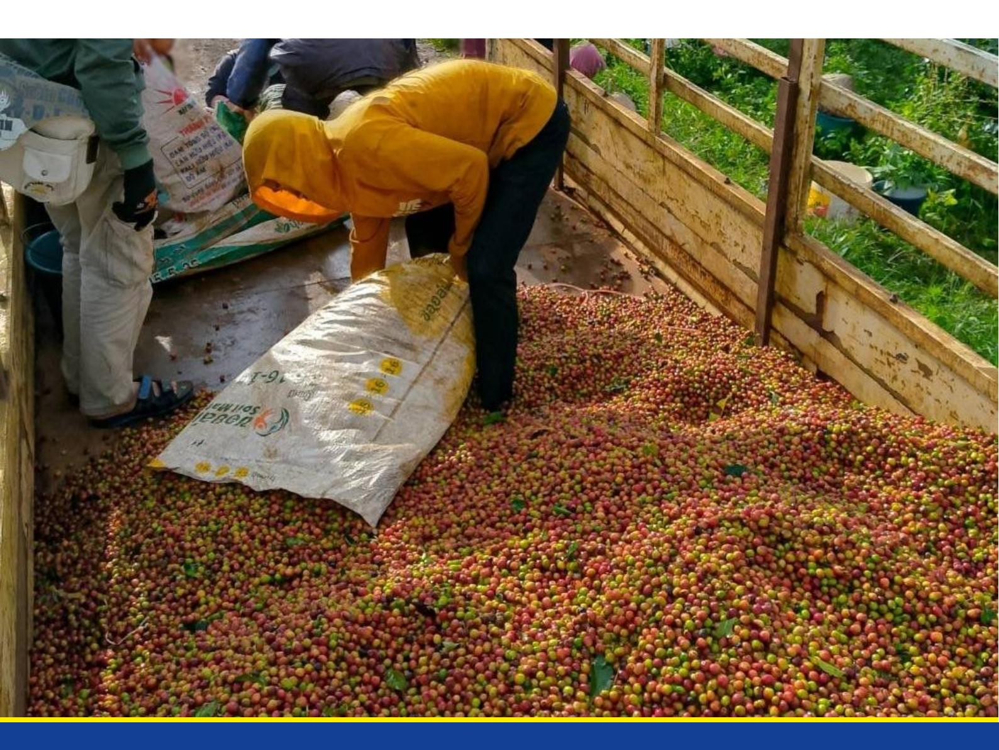

# **Study on available traceability systems and tools in the Lao context**

# **Study on available traceability systems and tools in the Lao context**

*The "EUDR Engagement" project in Southeast Asia is co-funded by the European Union and the Federal Republic of Germany. GIZ has been commissioned to implement it as part of the BMZ funded global program "Sustainability and Value Added in Agricultural Supply Chains", which is part of the special initiative "Transformation of Agricultural and Food Systems" by the German Federal Ministry for Economic Cooperation and Development.*

Disclaimer: This publicaƟon was co-funded by the European Union and BMZ. The content of this publicaƟon is the sole responsibility of the authors and does not necessarily reŇect the views of the EU or the BMZ. The informaƟon in this study, or upon which this study is based, has been obtained from sources the authors believe to be reliable and accurate. While reasonable eīorts have been made to ensure that the contents of this publicaƟon are factually correct, GIZ GmbH does not accept responsibility for the accuracy or completeness of the contents of this publicaƟon. The menƟon of speciĮc companies or products of manufacturers, whether or not these have been patented, does not imply that these have been endorsed or recommended by GIZ GmbH in preference to others of a similar nature that are not menƟoned. The views expressed in this informaƟon product are those of the author(s) and do not necessarily reŇect the views or policies of GIZ GmbH. Unless stated otherwise, all Įgures used in this study were created by GIZ internally.

Special thanks go to the EU DelegaƟon to Laos and the Lao NaƟonal Chamber of Commerce and Industry (LNCCI) for supporƟng the selecƟon and contacƟng of interview partners, as well as the interview partners themselves for sharing their experƟse with the interviewer.

## **Table of Contents**

| Acronyms.....                                              | i   |
|------------------------------------------------------------|-----|
| Executive Summary.....                                     | iii |
| 1. Introduction .....                                      | 1   |
| 2. Methodology .....                                       | 2   |
| 2.1. Desk Review .....                                     | 2   |
| 2.2. Survey .....                                          | 2   |
| 3. Overview on Sectors .....                               | 4   |
| 3.1. Timber Sector .....                                   | 4   |
| 3.2. Coffee Sector.....                                    | 9   |
| 3.3. Rubber Sector .....                                   | 12  |
| 3.4. Cattle Sector .....                                   | 15  |
| 4. Case Studies.....                                       | 17  |
| 4.1. General Information on Interviewees .....             | 17  |
| 4.2. Supply Chains.....                                    | 20  |
| 4.3. Traceability.....                                     | 24  |
| 4.4. Support Needed for Future Improvement .....           | 25  |
| 5. Review of Existing Traceability Schemes and Tools ..... | 27  |
| 5.1. Current Traceability Practices .....                  | 27  |
| 5.2. Readiness for EUDR Traceability Requirements.....     | 35  |
| 5.3. Other Traceability Challenges .....                   | 37  |
| 5.4. Potential Benefits of Traceability Systems .....      | 38  |
| 6. Conclusions.....                                        | 39  |
| 7. Recommendations .....                                   | 40  |
| Annex A: Reference List.....                               | 42  |
| Annex B: Short Profile of Interviewed Stakeholders.....    | 45  |
| Annex C: Onsite Stakeholders Interview Plan.....           | 51  |
| Annex D : Questionnaire .....                              | 52  |
| Annex E: Stakeholder Selection Process .....               | 58  |

## **Acronyms**

BMZ German Federal Ministry of Economic Cooperation and Development

COC Chain of Custody

DAFO District Agriculture and Forestry Office

DIMEX Department of Import and Export

DLF Department of Livestock and Fisheries

DOF Department of Forestry

DOFI Department of Forest Inspection

DOFT Department of Foreign Trade

EUDR European Union Deforestation Regulation

FAO Forest and Agriculture Organisation of the United Nations

FLEGT Forest Law Enforcement, Governance and Trade

FM Forest Management

FSC Forest Stewardship Council

GIZ Deutsche Gesellschaft für Internationale Zusammenarbeit GmbH

GMP Good Manufacturing Practices

GPS Global Positioning System

HS Codes Harmonised System Codes

IMS Information Management System

ITC International Trade Centre

LCA Lao Coffee Association

LNCCI Lao National Chamber of Commerce and Industry

LRA Lao Rubber Association

MAF Ministry of Agriculture and Forestry

MOF Ministry of Finance

MOIC Ministry of Industry and Commerce

MOLSW Ministry of Labour and Social Welfare

MONRE Ministry of Natural Resources and Environment

NSDEP National Socio-Economic Development Plan

NTFPs Non-Timber Forest Products

PAFO Provincial Agriculture and Forestry Office

POFI Provincial Oĸce of Forest InspecƟon

SCR Standard Chinese Rubber

SMEs Small and Medium-sized Enterprises

SVR Standard Vietnamese Rubber

TLAS Timber Legality Assurance System

TLD Timber Legality DeĮniƟon

VPA Voluntary Partnership Agreement

# **ExecuƟve Summary**

The EU DeforestaƟon RegulaƟon (EUDR) entered into force in 2023, aims to combat global deforestaƟon and forest degradaƟon by ensuring that commodiƟes and products placed on the EU market or exported from there are produced legally deforestaƟon-free. It applies to key commodiƟes such as soy, palm oil, coīee, cocoa, rubber, caƩle and wood1 [,](#page-5-1) as well as derived products. A central pillar of the EUDR is the traceability requirement, mandaƟng operators who place relevant products on the market or export from there to provide geolocaƟon data for producƟon areas and ensuring due diligence to assess and miƟgate potenƟal risks. Traceability schemes and tools can be very useful tools for gathering relevant informaƟon, especially for assuring that the respecƟve commodiƟes are deforestaƟon-free and in the case of Ɵmber, also forest degradaƟon-free.

This study was implemented through a desk review for the commodiƟes relevant for Lao PDR (coīee, rubber, caƩle and Ɵmber) and interviews with stakeholders from the coīee, rubber and caƩle sectors, including on-site visits of Lao operators (cooperaƟves, companies), serving as case studies. It provides an overview on the supply chains of the selected sectors in Lao PDR, describes the status quo of traceability within the country, outlines exisƟng traceability schemes and tools and assesses their alignment with the EUDR traceability requirements. Based on this analysis, opportuniƟes, beneĮts and challenges for supply chain actors to ensure deforestaƟon-free commodity producƟon are idenƟĮed and recommendaƟons for improvement of traceability schemes with regards to EUDR readiness are outlined.

Many respondents to the survey reported using some form of traceability system; these systems generally cover only parƟal stages of the supply chain rather than allowing for tracing back of a product to the speciĮc plot of land where the commodity was produced. When compared to the traceability requirements outlined in ArƟcle 9 of the EUDR, most stakeholders were only able to provide limited informaƟon, primarily focusing on selected criteria such as product quanƟƟes or buyer details. Traceability systems in the rubber and caƩle sector are very basic or inexistent. For the coīee industry, they are found to be slightly beƩer established in general and in some cases in an advanced stage, due to the adopƟon of cerƟĮcaƟon schemes and a focus on niche markets for sustainably produced coīee in oversee countries, including EU member states. Yet, in these systems, traceability is limited to the origin of farmers and not the geolocaƟon of plots. However, challenges remain also in the coīee sector due to complex and fragmented supply chain structures, lack of knowledge and capacity as well as limited access to Įnancial and technological resources. Traceability is a key element of the Lao Timber Legality Assurance System (TLAS) which is currently further developed as a naƟonal mandatory traceability system and builds on the achievements of the TLAS developed under the terminated Lao-EU FLEGT-VPA process. The process included an in-depth analysis of the legislaƟon on supply chain management of Ɵmber sources, wood processing and trade, followed by legislaƟve amendments, not yet concluded for all Ɵmber sources and sƟll incomplete for wood processing. Traceability to the plot is legally required for natural Ɵmber from ProducƟon Forest areas, conversion areas and plantaƟons, but not yet aligned with EUDR geolocaƟon requirements regarding size of the area and digital geolocaƟon formats.

The study concludes by providing a set of recommendaƟons to enhance EUDR readiness with regards to traceability in the Lao supply chains covered by the analysis. Drawing on lessons from the VPA process and the TLAS development, key stakeholders, including government, private sector, and civil society, must be acƟvely engaged in developing and implemenƟng traceability systems across sectors. Technical and Įnancial support is essenƟal to develop a digital traceability system that empowers aīected stakeholders along the supply chain to record and track product informaƟon. SoluƟons should be context-appropriate, with cost-eīecƟve systems for remote areas, and support for infrastructure like IT equipment for

1 This study uses the term "timber" instead of "wood" used in the EUDR

smallholders. In addiƟon, a naƟonal legal framework, in line with naƟonal green-growth strategies and socio-economic development and considering EUDR, is beneĮcial for ensuring consistency in traceability. Given the currently limited capaciƟes and access to skills based on development programs of producers as well as requests for support arƟculated during the interviews with the private sector, training for Lao producers, parƟcularly smallholders, on collecƟng traceability data and using digital tools is vital, as is the creaƟon of a manual or app to guide them through the process and enhance EUDR readiness.

# **1. IntroducƟon**

Almost 90% of worldwide deforestaƟon is the result of agricultural expansion. A signiĮcant share of the agricultural commodiƟes driving deforestaƟon are traded internaƟonally. The consumpƟon of the European Union is responsible for about 10% of the worldwide deforestaƟon, parƟcularly resulƟng from commodiƟes such as soya and palm oil (European Parliament, 2022). The EU DeforestaƟon RegulaƟon (EUDR) is a legislaƟve measure in order to minimize the EU's contribuƟon to deforestaƟon and forest degradaƟon worldwide. It requires operators and non-SME traders who place certain commodiƟes on the EU market or export them from there to ensure that their supply chains are legal and deforestaƟonfree. The EUDR is aligned with several internaƟonal declaraƟons and policy goals of the EU, the German Federal Ministry for Economic CooperaƟon and Development (BMZ), and partner countries in the (sub)tropics. The EUDR contributes to the implementaƟon of various important global agreements such as the Sustainable Development Goals (SDGs), the Paris Agreement, the Kunming Montreal Global Biodiversity Framework and the Glasgow Leaders' DeclaraƟon on Forests and Land Use which emphasize the criƟcal need to protect the world's forests. The EUDR entered into force in June 2023 and is planned to enter into applicaƟon from 31 December 2025 onwards.

The EUDR requires operators and non-SM[E](#page-7-1)2 traders placing commodiƟes and products on the EU market or export from EU to exercise due diligence for all relevant products with the objecƟve to ensure that products were produced legally and "deforestaƟon-free". Due diligence for operators entails three elements: informaƟon, risk assessment and risk miƟgaƟon. IdenƟfying the geo-locaƟon of the plot of land where the commodity was produced is one of the core elements of the EUDR's informaƟon requirements. Providing this informaƟon shall ensure strict traceability of the commodity along the value chain to the respecƟve plot of land. Although submiƫng a due diligence statement is only mandatory for operators and traders and not Lao companies, these companies can gain a compeƟƟve advantage if they can supply their buyers with the required informaƟon such as geolocaƟon.

In the Lao context, the most relevant commodiƟes under the scope of EUDR are coīee, caƩle, rubber, and Ɵmber. As an ex-ante assessment on the potenƟal eīects of the EUDR showed (F4 - Forest For the Future Facility, 2023), direct exports to EU markets form a small part of Lao agricultural products and Ɵmber products and only play a certain role for coīee, with about 13% of coīee export to the EU in 2021 (ITC, 2023). A large part of the commodiƟes is exported to regional markets, e.g. to Vietnam, Thailand or China, especially rubber, caƩle and Ɵmber and may be further exported by operators from these countries to the EU market. In this regard the EUDR brings signiĮcant implicaƟons for Lao producers, processors and exporters as well as operators and traders sourcing Lao products.

In response to these emerging requirements, this study examines the exisƟng traceability systems and tools in Laos, parƟcularly providing informaƟon on the state of the art of supply chain traceability systems and the capacity of Lao operators to track commodiƟes and products from the plot of land where the commodiƟes have been produced to the point of sales to an EU operator.

In this regard, this study assesses the current state of exisƟng traceability systems in Lao companies, smallholders, cooperaƟves across the coīee, rubber, caƩle and Ɵmber sectors and how these systems can support Lao supply chain actors to provide such informaƟon to their exisƟng or potenƟal business

According to the EUDR legal text, the term 'operator' means any natural or legal person who, in the course of a commercial activity, places relevant products on the EU market or exports them from there. 'Trader' means any natural or legal person who, in the course of a commercial activity, places relevant products on the EU market or exports them from there.

partners. In detail, the objecƟves of the present study are to: (i) review exisƟng traceability systems and tools available in the Lao context, (ii) review the lessons learned during the FLEGT VPA process and the development of a Timber Legality Assurance System (TLAS) which includes supply chain control (traceability) and apply these lessons to other commodiƟes, (iii) synthesize the Įndings of the study to give recommendaƟons for traceability systems for Lao companies, smallholders, cooperaƟves, and policy makers to provide accurate traceability informaƟon for operators. In addiƟon, this study serves as a case study and provides more detailed informaƟon on traceability based on the general informaƟon provided on traceability by the global study on available traceability system across countries (GIZ, 2024). To gain a beƩer understanding of possible challenges as well as opportuniƟes for aligning private sector pracƟces with the requirement of traceability, this study describes the traceability pracƟces currently used by key sectors in the Lao PDR. This study is aimed at idenƟfying eīecƟve strategies and pracƟcal tools to ensure traceability aligned with the EUDR requirements.

# **2. Methodology**

The methodology employed a combinaƟon of desk view of relevant documentaƟon and a survey with stakeholders from relevant commodiƟes to gather data and informaƟon. The Įndings were analysed and reported, with the preliminary results presented together with another study on the naƟonal legislaƟve framework in Laos during a debrieĮng session with the EU DelegaƟon in Laos and representaƟves from concerned government departments.

### **2.1. Desk Review**

To achieve the objecƟves of this study, a desk review was conducted to provide an overview on sectors and inputs for the survey design, and to collect and analyse exisƟng informaƟon on traceability systems used in Laos. Key sources included the European Union DeforestaƟon RegulaƟon (EUDR), the Global Traceability study (GIZ, 2024), and the ex-ante assessment of the EUDR 2022 (F4 - Forest For the Future Facility, 2023). In addiƟon, complementary documents such as relevant arƟcles, grey literature, government staƟsƟcs, producƟon and trade data, lessons learned from the FLEGT-VPA Lao TLAS framework, and presentaƟons from relevant commodity associaƟons were examined. A full list of documents and references used in this review is available in Annex A.

For the commodity Ɵmber, only a desk review was implemented. The Lao TLAS developed by Lao stakeholders deĮnes the Ɵmber supply chain control of Ɵmber producers and Ɵmber processors to ensure the traceability of Ɵmber to the forest site and procedures require Ɵmber producers to provide the address of the Ɵmber and volumes/weights along the supply chains to be able to validate and reconcile its correctness and authenƟcity (see SecƟon [3.1\)](#page-10-1). . Although the desk review provides a general understanding of the Ɵmber traceability system, it may not capture all the nuances of real-world implementaƟon and challenges faced by stakeholders on the ground.

### **2.2. Survey**

To complement the desk review, a survey was designed and conducted to gather primary data from private sector stakeholders in the following three sectors: coīee, rubber, and caƩle. The survey aimed at a beƩer understanding of the agricultural pracƟces of relevant stakeholders by means of case studies (see Chapte[r 4\)](#page-23-0) and provided on-the-ground insights into the supply chain and traceability systems used in Lao PDR.

### **Survey design**

A structured quesƟonnaire was developed for the interviews of key stakeholders. It is divided into Įve secƟons: (1) General InformaƟon; (2) Supply Chains; (3) Traceability Systems; (4) Support and Future Needs; and (5) AddiƟonal Comments, oīering stakeholders the opportunity to provide open feedback and suggesƟons. The selected interview seƫng is a semi-structured approach, which is channelled by an interview guideline, however, allowing deviaƟon from the suggested structure. Open quesƟons enabled the interviewees to answer in their own words rather than selecƟng from a predeĮned set of answers, while closed quesƟons allowed for consistency and comparability of the gathered data. The Įndings of the preliminary literature research laid the basis for the interview quesƟonnaires (see Annex D for the QuesƟonnaire).

### **Sampling**

The target respondents included companies, smallholders, associaƟons, cooperaƟves from coīee, rubber, and caƩle sectors in the Northern, Central, and Southern regions of Lao PDR and one internaƟonal enƟty, supporƟng a project in the coīee sector. For a detailed descripƟon of the selecƟon process of stakeholders and criteria details see Annex E.

### **Data CollecƟon**

The survey was conducted over three week (23 September 2024 to 14 October 2024) through on-site interviews at companies' premises or oĸces, the GIZ oĸce in VienƟane Capital, telephone calls, and wriƩen quesƟonnaires. Individual interviews have been conducted across the Northern, Central, and Southern regions of Lao PDR.

*Figure 1: Map showing the geographic distribuƟon of interviewees' acƟviƟes*

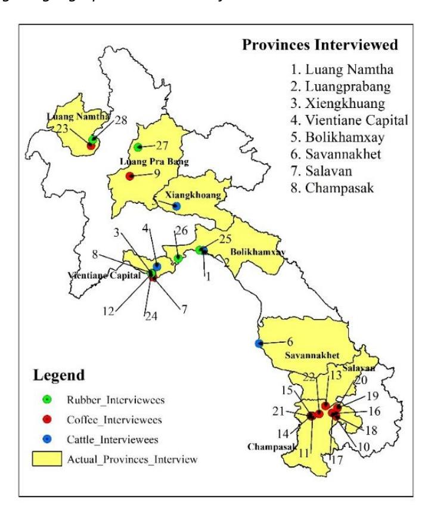

The geographic distribuƟon of the interviewees' acƟviƟes, as shown in [Figure 1](#page-9-0)*,* highlights the regions and provinces covered during the study. Interviewees were contacted via an oĸcial leƩer from Lao NaƟonal Chamber of Commerce and Industry (LNCCI) in order to enhance the trust of private sector stakeholders into the interviewer and to provide the interviewer with oĸcial authority to conduct the interviews. The data collecƟon process ensured anonymity, and conĮdenƟality. Stakeholder proĮles are provided in Annex B, where they are anonymized and numbered. These numbers are used for citaƟon or reference in the report.

### **Data Analysis**

ThemaƟc analysis (Braun, 2012) was used to interpret qualitaƟve data. This method involves comprehensive reading of each completed quesƟonnaire to idenƟfy central themes and key terms that emerge across interviews by categorizing responses based on recurring keywords and paƩerns, the analysis oīers a structured view of stakeholders' pracƟces. AddiƟonally, quanƟtaƟve analysis was also applied, categorizing responses from mulƟple-choice quesƟons to provide numerical overview of traceability adopƟon across stakeholders, and how their traceability is recorded. This dual approach combined qualitaƟve insights with quanƟtaƟve trends to enhance the comparability and detail of the Įndings.

### **LimitaƟons**

The study encountered several limitaƟons that impacted the depth and comprehensiveness of its Įndings. A primary challenge was the limited availability and Ɵme of interviewees. AddiƟonally, the limited cooperaƟon of interviewees due to lack of long-term relaƟonship, resulƟng in no responses, and cancelled interviews. Certain stakeholders have been interviewed but were unwilling to share their records and/or data forms with the interviewer. Furthermore, many interviewees were hesitant to share sensiƟve data or lacked suĸcient insight into the subject maƩer, leading to incomplete or unclear responses.

Moreover, a signiĮcant number of interviewees demonstrated a limited understanding of the EUDR regulaƟons, including its objecƟves and implementaƟon targets. Many stakeholders were unfamiliar with the speciĮc requirements and goals of the EUDR, which aīected the quality of their responses. This lack of awareness about the EUDR's implicaƟons led to diĸculƟes in obtaining precise informaƟon relevant to traceability and compliance expectaƟons.

# **3. Overview on Sectors**

### **3.1. Timber Sector**

- Lao PDR is adapƟng its Timber Legality Assurance System (TLAS) aŌer the terminaƟon of the VPA negoƟaƟons with the EU into a Lao TLAS to ensure Ɵmber legality and traceability.
- Management of the wood processing sector shiŌed to MAF, with DOF leading eīorts on supply chain control, processing standards, and a naƟonal wood processing strategy.
- Key Ɵmber exports go to Vietnam, China, and Thailand, while EU markets are currently not a desƟnaƟon. Yet, operators and traders from main export desƟnaƟons who produce Įnished products which do enter the EU market, would request Lao suppliers to provide informaƟon on legality and deforestaƟon-free origin of products to be passed along the value chain under the EUDR.

- Timber supply chains are monitored at criƟcal control points, with a transiƟon planned from paper-based to cloud-based systems for enhanced traceability. GeolocaƟon of the most important Ɵmber sources is legally required but currently not fully compaƟble with EUDR requirements.

### **Background**

In 2017, Lao PDR started to design a Timber Legality Assurance System (TLAS) in the context of the negoƟaƟons between the Government and the European Commission on a Voluntary Partnership Agreement (VPA) and based on requirements deĮned under the FLEGT iniƟaƟve. The TLAS has been described in the DraŌ Annex II (Lao-EU FLEGT VPA NegoƟaƟons, 2023). The factual terminaƟon of the VPA negoƟaƟons created the opportunity to reĮne the TLAS design and adapt the system into a Lao due diligence system for the forest and Ɵmber industries, by strengthening Lao objecƟves and circumstances. This adapƟon process to a Lao TLAS is currently ongoing under the lead of the Department of Forest InspecƟon (DOFI) and the Department of Forestry (DOF) under the Ministry of Agriculture and Forestry (MAF), based on a mulƟ-stakeholder approach, and supported by the FLEGT-FC (KfW) and ProFEB (GIZ) projects. Legal veriĮcaƟon and traceability of Ɵmber through the supply chain are sƟll shaping the core elements of the Lao TLAS which is endorsed by the Forestry law 64/NA (2019), arƟcle 43 and the implementaƟon is further speciĮed by relevant legislaƟon, partly sƟll missing or to be amended. It is planned that the system will respond to speciĮc requirements of internaƟonal markets (e.g. EU/EUDR), although objecƟves and technical details are sƟll being discussed among stakeholders. At any rate, the implementaƟon of the Lao TLAS will allow operators beƩer access to veriĮable informaƟon that Ɵmber has been produced with the relevant legislaƟon of Lao PDR as part of their due diligence obligaƟon.

The longstanding FLEGT-VPA process and the current Lao TLAS development process make the Ɵmber sector most likely the best assessed of the four sectors included in the study, both in terms of legality and traceability of its products. Moreover, the awareness of sector stakeholders about legality and traceability issues is in general higher and will increase even more with the piloƟng of the Lao TLAS in three provinces (Luang Prabang, VienƟane Province, Savannakhet) which will start in early 2025 with support of FLEGT-FC, and later on the scaling up naƟon-wide.

The ex-ante assessment (F4 - Forest For the Future Facility, 2023) menƟoned that the responsibility to manage, promote and develop the wood processing sector was shiŌed in 2021 from MOIC to MAF. Export of wood products remains under MOIC/Department of Foreign Trade (DOFT) previously DIMEX). DOF has in the meanƟme started to integrate wood processing and trade related legislaƟon in the legal framework under its responsibility and adopted the decisions on wood processing industry standards and on inputoutput monitoring. The newly established Timber and NTFPs Business Management Division under DOF plays a central role and is responsible for the development and disseminaƟon of the legal framework on supply chain management and control for Ɵmber and wood processing and trade.

### **Supply Chains**

Supply chains in the Ɵmber sector of Lao PDR have been intensely analysed by stakeholders in the FLEGT-VPA process, together with the legal requirements for supply chain management of Ɵmber sources and for wood processing and trade. The outcome has been described in the draŌ Annex II of the VPA (Lao-EU FLEGT VPA NegoƟaƟons, 2023). [Figure 2](#page-12-0) shows an overview on Ɵmber Ňows and supply chains for the seven idenƟĮed Ɵmber sources (producƟon forests, conversion areas, village use forests, tree plantaƟons, land of individuals, legal enƟƟes or organizaƟons (ILEO), conĮscated Ɵmber and imports). Natural Ɵmber from producƟon forests or conversion areas is stored at log landing 1 (LL1) close to harvest sites, further moved to LL2 where consolidated logs from diīerent harvesƟng compartments are scaled

and graded, then aucƟoned and eventually transported to the log yards of primary processors (LL3). ConĮscated Ɵmber must also be aucƟoned. Timber from village use forests, tree plantaƟons, land of individuals, legal enƟƟes or organizaƟons or imported logs are traded or sold directly to processors. Logs from plantaƟons can directly be exported. Natural Ɵmber must be processed in-country and can only be exported as Įnished products.

*Figure 2: Overview Ɵmber Ňows and supply chains*

Supply chain control is based on criƟcal control points where materials from unregistered sources could enter or where registered materials could leave the system. The criƟcal control points are deĮned by the forestry related legislaƟon and ensure traceability and transparency of materials moved and this is being veriĮed in the Lao TLAS by the veriĮcaƟon body (DOFI/POFI) who validates data on products at criƟcal control point and checks if data, e.g. volumes, is consistent between stages of the supply chain.

The main characterisƟcs of the seven sources of Ɵmber, respecƟvely how wood products are produced have been summarized in chapter 4.2 of the ex-ante assessment (F4 - Forest For the Future Facility, 2023). An analysis of the forestry and wood processing sector (UNIQUE Forestry and Land Use GmbH, 2021) esƟmated annual Ɵmber supply potenƟal over the next Įve years to range between 1.1 and 1.9 million m³ roundwood and Timber plantaƟons have been idenƟĮed as the main source of roundwood represenƟng about 90% of total domesƟc Ɵmber supply. The study concludes that it remains challenging to compile complete and consistent data on Ɵmber producƟon and wood processing. Even informaƟon about smallholder plantaƟons is incomplete due to a low rate of registraƟo[n](#page-12-1)3 and informaƟon on natural trees on "private" land, owned by individuals, legal enƟƟes and organizaƟons (ILEO), is not yet completely available, although Ɵmber resources on these lands may be substanƟal.

(F4 - Forest For the Future Facility, 2023) assessed trade data from the ITC trade map (ITC, 2023). ITC trade map data has been compiled from UN Comtrade4 unƟl 2021. For the category "Wood and arƟcles of wood, wood charcoal" (HS code 44, which includes fuelwood, wood in the rough and sawn wood, amongst others), the export values in 2010 and 2021 are nearly the same (EUR 30 million), while 2015 peaked to EUR 86 million, due largely to peaks in sawn wood and wood in rough exports. In 2021 the

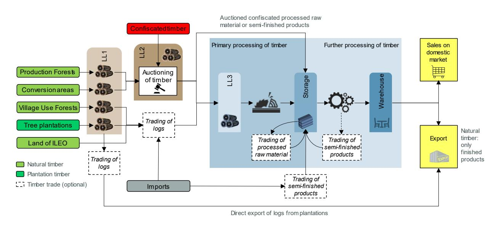

### Source: (Lao-EU FLEGT VPA Negotiations, 2023)

3 FLEGT-FC recently estimated that around 5% of plantations are registered

4 [United Nations Comtrade database a](https://comtradeplus.un.org/)ggregates detailed global annual and monthly trade statistics by product and trading partner

laƩer two categories decreased to < EUR 1 million. It can also be noted that in 2021, Vietnam was the largest importer of these wood products, followed by China, and Thailand far behind (see [Table 1\)](#page-13-0).

*Table 1: Total wood producƟon and exports by Laos and main desƟnaƟons in 2010, 2015 and 2021*

| Total exports             | Volume (kt) | 2010 |       | Volum e (kt) | 2015  |       |      | 2021 |       |
|---------------------------|-------------|------|-------|--------------|-------|-------|------|------|-------|
| (44*)                     | N/A         | 30.8 | 100%  | N/A          | 86.2  | 100%  | N/A  | 30.2 | 100%  |
| Viet Nam                  | N/A         | 6.2  | 20.1% | N/A          | 54.0  | 62.6% | N/A  | 15.8 | 52.3% |
| China                     | N/A         | 2.2  | 7.1%  | N/A          | 11.5  | 13.3% | N/A  | 7.2  | 23.8% |
| Thailand                  | N/A         | 21.9 | 71.1% | N/A          | 16.9  | 19.6% | N/A  | 2.7  | 8.9%  |
| South Korea Total exports | N/A         | 0.2  | 0.6%  | N/A          | 0.8   | 0.9%  | N/A  | 1.7  | 5.6%  |
| (4401**)                  | N/A         | 1.5  | 100%  | N/A          | 0.5   | 100%  | 2.2  | 0.4  | 100%  |
| Thailand                  | N/A         | 0.2  | 13.3% | N/A          | 0.063 | 12.6% | 2.2  | 0.4  | 99.3% |
| Kuwait                    | N/A         | 0    | 0.0%  | N/A          | 0     | 0.0%  | N/A  | 0.0  | 0.70% |
| China                     | N/A         | 1.1  | 73.3% | N/A          | 0.116 | 23.2% | N/A  | 0.0  | 0.0%  |
| Viet Nam Total exports    | N/A         | 0.1  | 6.7%  | N/A          | 0.306 | 61.2% | N/A  | 0.0  | 0.0%  |
| (4403***)                 | N/A         | 1.1  | 100%  | N/A          | 20.2  | 100%  | 16.4 | 1.1  | 100%  |
| Viet Nam                  | N/A         | 0.4  | 39.8% | N/A          | 18.6  | 92.2% | 15.3 | 0.9  | 84.2% |
| China Total exports       | 1.6         | 0.6  | 58.1% | N/A          | 0.8   | 4.1%  | 0.8  | 0.0  | 3.4%  |
| (4407****)                | 35.7        | 15.8 | 100%  | 103.8        | 40.6  | 100%  | 6.5  | 0.9  | 100%  |
| Viet Nam                  | 3.2         | 2.4  | 15.4% | 88.2         | 27.1  | 66.7% | 1.4  | 0.6  | 70.7% |
| Thailand                  | 32.5        | 13.3 | 84.5% | 10.0         | 7.6   | 18.8% | 0.8  | 0.2  | 21.4% |
| China                     | 0.0         | 0.0  | 0.1%  | 4.3          | 5.8   | 14.2% | 0.5  | 0.1  | 6.5%  |

(ITC, 2023)

\* HS code 44 – Wood and articles of wood, wood charcoal

\*\* HS code 4401 – Fuel wood

\*\*\* HS code 4403 – Wood in the rough

\*\*\*\* HS code 4407 – Sawn wood

No data for Lao PDR is available for 2022 and 2023 and it can be assumed that the conclusion drawn in the ex-ante assessment that EU27 is not a desƟnaƟon for the exported wood products is sƟll valid and that operators and traders from main export desƟnaƟons like Vietnam who produce Įnished products which do enter the EU27 market, would request Lao suppliers to provide informaƟon on legality and deforestaƟon-free origin of products to be passed along the value chain under the EUDR. Lao wood processing companies who want to tap into new markets in the EU would also have an interest to provide informaƟon on deforestaƟon-free/forest degradaƟon-free and legal producƟon.

As part of the of the ARISE Plus – Lao PDR project, funded by the EU (ITC, 2021), MOIC in collaboraƟon with MAF and support and guidance provided by the InternaƟonal Trade Centre (ITC) developed a wood processing sector export roadmap. IniƟal discussions are currently held between government, ITC and stakeholders, for the preparaƟon of a new project on trade and private sector developmen[t](#page-13-1)5 and if this roadmap should be updated under the new mandate of MAF. At the same Ɵme, DOF has been tasked by

5 Communicated by ITC representatives during project scoping meeting with ProFEB Forest Policy on 16/10/2024

the Ministry to draŌ a Wood Processing Strategy as under its Forest Strategy (Ministry of Agriculture and Forestry, 2024).

According to (ITC, 2021) and based on MOIC staƟsƟcs, 1,325 wood processing establishments were operaƟng in Lao PDR in 2016, dominated by small and medium-sized enterprises. By 2020, the number of wood processing factories had dropped to 1,030 manufacturing plants (8 sawmills, 383 wood processing factories and 657 furniture manufacturers) and 111 households-scale units. Yet, it is worth noƟng that processing faciliƟes are oŌen a combinaƟon of the aforemenƟoned, e.g. establishments involved in both sawmilling and furniture producƟon. MAF is currently updaƟng the numbers with support from FLEGT-FC.

FSC cerƟĮcaƟon can be a door-opener for EUDR readiness in terms of traceability requirements as the FSC standard deĮnes speciĮc traceability soluƟons. FSC is currently aligning its cerƟĮcaƟon scheme with the EUDR focus on deforestaƟon-free supply chains and introduces a regulatory module that requires a risk assessment and miƟgaƟo[n](#page-14-0)6 . As a cerƟĮcaƟon scheme, FSC will not consƟtute a green line to fulĮl due diligence requirements under the EUDR, but it can help operators and traders with collecƟng informaƟon relevant under the EUDR (GIZ, 2024). Generally speaking, few plantaƟon Ɵmber producers and wood processing companies have been cerƟĮed in the past and only very few are sƟll remaining keeping the door-opening funcƟon of FSC cerƟĮcaƟon quite limited.

Discussions and preliminary work around a naƟonal forest cerƟĮcaƟon system, endorsed by PEFC InternaƟonal, have been launched by DOF and a stakeholder consultaƟon held with support from the UN-REDD Programme in 2020 (Sustainable Forest Trade in the Lower Mekong Region, 2020). Although progress has been slow, it gained again momentum, and a draŌ Lan NaƟonal Forest Standard has been discussed and commented by a technical commiƩee under lead of DOF in early December 2024. Promoters of a naƟonal standard expect advantages compared to internaƟonal voluntary standards, such as naƟonal ownership, adaptaƟon to naƟonal condiƟons or cost eīecƟvity for smallholders, forest managers and the industry with the use of naƟonal auditors and accreditaƟon body (PEFC, 2021). However, the capacity of auditors needs to be developed, and the existence of a naƟonal accreditaƟon body is unclear. Moreover, the link to the Lao TLAS needs further discussion.

### **Traceability**

With the endorsement of the TLAS in the legal framework of Lao PDR and subordinate regulaƟons on supply chain control, Ɵmber products and operators have to comply with legal requirements and supply chain control becomes mandatory for all value chain actors. Yet, the legal requirements are not conclusively deĮned for all Ɵmber sources and important details for supply chain control at the wood processing industry and for trade are sƟll missing (see secƟon [5.1](#page-33-1) for more details). This is the case for conĮscated Ɵmber as one source of Ɵmber in Lao PDR which is not compaƟble with EUDR at all as conĮscated Ɵmber can be traced back to the locaƟon of seizure but will only in excepƟonal cases be traceable back to the forest stand.

Current traceability systems for natural Ɵmber from ProducƟon Forest Areas and conversion areas and for plantaƟon Ɵmber are almost exclusively paper-based. The systems document product speciĮcaƟons like felling and transport dates, dimensions, species, qualiƟes and keep track of sales and as such fulĮl important informaƟon requirements of EUDR as sƟpulated in arƟcle 9. The data structure of the forms in the paper trails along criƟcal control points links the sequence of forms by unique idenƟĮers which allow tracing back Ɵmber to the forest stand:

Vide[o Introducing FSC Aligned for EUDR](https://www.youtube.com/watch?v=b9hLZrEM8Tw&t=1s&ab_channel=FSCInternational)

- During harvesƟng in ProducƟon Forest Areas, logs are marked with paint by a unique code (forest address) aŌer cross-cuƫng and can be traced back to the marked stump in the harvesƟng compartment (system of Reduced Impact Logging with single tree harvesƟng). The objecƟve of this system is to allow locaƟon of harvested trees in the forest stand and check selecƟve logging and not primarily the geolocaƟon;
- For conversion areas, logs receive a unique code as well and can be traced back to harvest blocks (salvage logging system) on the harvest map (see [Figure 3\)](#page-15-1). Main objecƟve is volume control of the operaƟon (pre-harvest inventory data with harvesƟng data);
- Batches of plantaƟon Ɵmber can be traced back to the plot via GPS coordinates recorded with Google Maps on a smart phone for the applicaƟon of the plantaƟon registraƟon cerƟĮcate. This is in accordance with geolocaƟon digital formats accepted by the EUDR. Yet, the area threshold for points and polygons is diīerent. This will be further discussed in secƟon [5.1.](#page-33-1)

Traceability of Ɵmber and Ɵmber products through the supply chain is one of the key objecƟves of the Lao TLAS and currently further developed in the adaptaƟon process aŌer the terminaƟon of the VPA negoƟaƟons. The draŌ Lao TLAS is designed as a cloud-based informaƟon management system (IMS). The IMS is planned as centralized data service (preferably cloud-based) with a modular architecture comprising of data entry with associated mobile apps, data storage, integrated data management between Ɵmber supply, processing, sales and compliance veriĮcaƟon of the legality status of wood throughout the supply chain. Registered enƟƟes from Government, private sector and the general public will have access to the IMS as deĮned by speciĮc user-rights. Timber is traceable to its origin and the mapping procedures and data structure may potenƟally include compaƟbility with EUDR digital geolocaƟon formats, yet adopƟon of the exisƟng procedures is not seen as a priority for the upcoming piloƟng. Timber sourced from producers from all seven sources will be registered and all processors and traders must introduce a supply chain control system. AcƟviƟes, records and data are described for each criƟcal control point in the supply chain and described in the annex to the legality deĮniƟons for Ɵmber sources, wood processing and trade and linked to the TLAS requirements. The piloƟng will start by applying the current paper-based system and registraƟon of its data will be done manually in the IMS cloud and introduce step-by-step electronic systems by introducing handheld devices which will automaƟcally upload the product data to the IMS.

### **3.2. Coīee Sector**

- Coīee producƟon is an important income source for many people in the Lao agricultural sector
- Lao coīee sector is dominated by smallholder producƟon

### *Figure 3: Coding of logs at LL2 in conversion area*

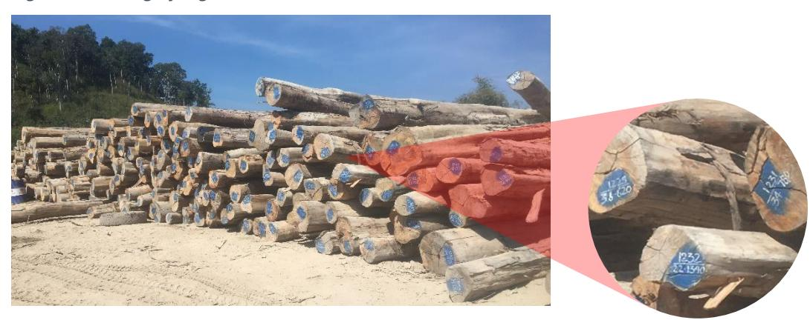

- 13% of all Lao coīee exports are directly exported to the EU, other major markets are Vietnam and Thailand
- ApplicaƟon of comprehensive traceability systems is lacking, though cerƟĮcaƟon schemes are largely used for export to EU

### **Background**

Coīee plantaƟons in Laos have been expanded over the past decades from 17,000 hectares in 1990 to 89,400 hectares in 2022 (FAO, 2022). More than 80% of coīee plantaƟons are located in the southern part of Laos, parƟcularly on the Bolaven Plateau (Champasack, Salavan, and Xekong Provinces), due to this area's mineral-rich soil. However, the Northern provinces of Laos – led by Luang Prabang – are increasingly gaining importance in coīee growing. The Lao coīee sector mainly produces Robusta and Arabica coīee beans, with some producƟon of Liberica and Excelsa (ITC, 2021).

The Lao coīee sector is an important income source for many people in the agricultural sector of Laos, which accounts for 63.2% of the employment in 2018. The Lao Coīee Board esƟmates that the industry support the livelihoods of more than 100,000 people (ITC, 2021). Several studies indicate that coīee plantaƟon can further create job opportuniƟes and boost famers' income, especially for those growing organic coīee and thereby accessing a higher-price market (JICA, 2012) (Seneduangdeth, 2018).

There are several plans and strategies in place to support the development of the Lao coīee sector. The Lao Coīee Sector Development Strategy by 2025, released in June 2014, is one of them and focusses on improving producƟvity and compeƟƟveness (ITC, 2021). These goals shall be reached by increased value-creaƟon within the Lao coīee sector, capacity building for and cooperaƟon between relevant stakeholders. Other plans aiming at a more compeƟƟve and sustainable coīee sector in Laos are the Eighth and Nineth Five-Year NaƟonal Socio-Economic Development Plan (NSDEP) 2016-2020, 2021- 2025, the Agriculture Development Strategy to 2025 and Vision to 2025, and the SME Development Plan 2016–2020 (ibid.).

The Lao coīee sector is supported by the Lao Coīee Board (Conseil NaƟonal du Café Lao, LCNC) and the Lao Coīee AssociaƟon (LCA). The LCNC was oĸcially created by the Lao Prime Minister in June 2010 and aims at the development of a strategic acƟon to develop and promote the Lao coīee sector. Amongst others they also pilot, support and monitor associaƟons, cooperaƟves and producer groups in the implementaƟon of naƟonal policies and related laws (LCNC, 2021). The LCA consists of 67 private sector companies and 75 cooperaƟves, which are organized into six groups. These groups collaborate closely, sharing informaƟon and supporƟng each other around coīee industry operaƟons. The LCA plays a crucial role as a service provider by acƟng as a centre for skills and knowledge enhancement, product distribuƟon channels, and business support. AddiƟonally, the associaƟon serves as an intermediary for government regulaƟons and policies, helping to communicate them to the public and providing soluƟons for issues faced by its members[.](#page-16-0)7

Recognizing the coīee value as contributors to the country's economic growth, the Lao government and development partners have been working together to enhance producƟon, quality and market access for Lao coīee over the past decade (KPL, 2024). For instance, the Green CUP project, launched on March 14, 2024, is one of two Ňagship iniƟaƟves under the "Global Gateway Team Europe Partnership with the Lao PDR" as part of the TICAF program, aimed at enhancing sustainable and inclusive trade, investment, and connecƟvity in the agriculture and forestry sectors. The project focuses on strengthening trade and investment in the green economy, parƟcularly within the coīee and tea industries, by promoƟng agroecological, community-based acƟons, climate-resilient value chains, and improved access to sustainable, high value markets, notably European market (Lapuekou, 2024).

Presentation from Lao Coffee Association 2024

### **Supply Chains**

Coīe[e](#page-17-0)8 contributes to the economic development of the Lao PDR with an export value of 76 Mio EUR and 38,747 tonnes exported per year, making Lao coīee the 36th (value) and 27th world exporter (volume/weight). Vietnam and Thailand are the biggest export markets with an esƟmated export value of EUR 40,750 and 12,542 thousand in 2021. The EU-27 market represented 13% of the export value in 2021 while 54% went to Vietnam (see [Table 2\)](#page-17-1). From Vietnam, more than 45% of the total coīee exports with a value of EUR 828,766 thousand are going to the EU (se[e Table 3\)](#page-17-2). From Thailand, more than 9% of coīee exports are going to the EU (see [Table 4\)](#page-17-3). If all Lao coīee imported by Vietnam or Thailand would be re-exported to the EU, Lao coīee would make up a share of 5% of Vietnamese and all of Thailand's exports.

*Table 2: Lao coīee importers*

|           |      |      |      | thousand] | Value of Lao PDR’s coīee exports, [EUR in |        |
|-----------|------|------|------|-----------|-------------------------------------------|--------|
| Importers | 2019 | 2020 | 2021 | 2019      | 2020                                      | 2021   |
| Vietnam   | 54   | 64.6 | 53.6 | 30,999    | 48,615                                    | 40,750 |
| Thailand  | 15.6 | 8    | 16.5 | 8,954     | 6,010                                     | 12,542 |
| EU-27     | 12   | 14.2 | 13.3 | 6,874     | 10,654                                    | 10,145 |

(ITC, 2023)

\*Note: Data from 2022-2024 is not available

*Table 3. Vietnam's coīee exports to EU.*

|           | Share in value in Vietnam's coffee exports [%] | Value of Vietnams coffee exports [EUR thousand] |      |         |         |         |
|-----------|------------------------------------------------|-------------------------------------------------|------|---------|---------|---------|
| Importers | 2019                                           | 2020                                            | 2021 | 2020    | 2021    |         |
| EU        | 47.4                                           | 47.8                                            | 45.5 | 938,663 | 827,219 | 828,766 |

(ITC, 2023)

*Table 4. Thailand's coīee exports to EU.*

|           | Share in value in Thailand's coffee exports [%] | Value of Thailand's coffee exports [EUR thousand] |      |      |      |      |
|-----------|-------------------------------------------------|---------------------------------------------------|------|------|------|------|
| Importers | 2019                                            | 2020                                              | 2021 | 2019 | 2020 | 2021 |
| EU        | 6.5                                             | 9.6                                               | 9.3  | 236  | 252  | 288  |

(ITC, 2023)

The supply chain in the Lao coīee sector consists of many diīerent stakeholders who each have a disƟnct role in harvesƟng, processing and trading the coīee. The largest share of coīee producƟon derives from 20,000 to 25,000 smallholder farmers who own less than 3.5 ha of land and sell their coīee cherries to local collectors. The collectors then sell the product to other collectors and processors. However, there are also farmer organizaƟons and cooperaƟves who collect the coīee cherries from farmers and aŌerwards process, sort, and grade them (F4 - Forest For the Future Facility, 2023). The Lao coīee cooperaƟve units are parƟcularly involved in supporƟng both smallholder farmers and large-scale company enterprise by facilitaƟng strategies, market access, providing training in sustainable pracƟces, and improving quality control by providing useful informaƟon to meet the producƟon standard. Coīee cooperaƟves play a key role in empowering local farmers in Laos, not only promoƟng community development, gathering the products, exporƟng but also promoƟng Lao coīee into the internaƟonal stage.

About one third of the total harvested coīee area are commercial plantaƟons, who also largely take the role of the primary processor, before selling the produce to a secondary processor and/or exporter.

All numbers mentioned in this section refer to product Code 0901: Coffee, whether or not roasted or decaffeinated; coffee husks and skins; coffee substitutes containing coffee in any proportion

Approximately 10 companies are involved in the secondary processing and export of coīee, with the largest being responsible for about two thirds of total exports of Lao coīee. End market receivers do then take the responsibility for acƟviƟes such as regrading, blending and roasƟng of coīee beans (ITC, 2021).

### **Traceability**

For most coīee producƟon, traceability back to individual producers is not established. Coīee is typically treated as a bulk commodity, with beans from various origins blended and grouped by factors like volume, price, and quality. Establishing traceability for coīee from commercial plantaƟons that only process coīee from their own land is likely to be easier compared to smallholder plantaƟons trading the beans to middlemen, who then mix it with beans from other farmers. For the laƩer case, providing details on the speciĮc growing locaƟon is largely not possible. However, there are excepƟons: CerƟĮed coīees and niche domesƟc markets, such as the Bolaven Plateau Coīee Producers CooperaƟve (CPC), may involve speciĮc programs where a set group of farmers parƟcipates, allowing the coīee to be traced back to the farm. AddiƟonally, organic coīee is kept separate throughout the supply chain, with a certain traceability maintained through detailed records and disƟnct handling, such as using separate bags, transportaƟon, and storage. Details of traceability systems used by the producers are mostly not publicly available. Due to generic trade data which does not disƟnguish between coīee with and without cerƟĮcaƟon, export volumes of cerƟĮed coīee are unknown. However, the assumpƟon is that all coīee exported to the EU is cerƟĮed organic and/or fairtrade. Despite these eīorts, geolocaƟon technology is rarely used (F4 - Forest For the Future Facility, 2023).

Though literature on the challenges and beneĮts for installing a traceability system in the coīee supply chains of Lao producers is very limited, it can be assumed that incenƟves working for and against their instalment are similar to other sectors and regions. Firms decide to take up a traceability system to improve their risk management, have a beƩer liability distribuƟon among agents of the supply chain, and manage safety and quality requirements more eīecƟvely. Though traceability does not necessarily come with improved product quality itself, it oŌen facilitates quality cerƟĮcaƟon processes. Hence, the importance of cerƟĮcaƟon schemes in the Lao coīee sector may work as an incenƟve for improving traceability (Stranieri, Cavaliere, & Banterle, 2016). Nevertheless, the dominance of small-scale coīee producƟon, including mid-traders to transport the coīee from plantaƟon or collecƟon point to the processing factory as well as associated costs with increased traceability challenge this development.

### **3.3. Rubber Sector**

- Area of rubber plantaƟon has been growing rapidly in Laos over the last decades
- 30% of rubber producƟon is managed by smallholders, 70% by foreign companies (concessions, contract farming)
- Vietnam and China are the major export markets for Lao rubber, however rubber might be reexported to the EU
- Complex supply chains, lacking regulatory frameworks and insuĸcient law enforcement are key barriers for establishing traceability

### **Background**

While rubber – Hevea Brasiliensis – was mainly grown in southern Thailand, south-eastern Vietnam and southern Myanmar in the mid of the 20th century, China's success in growing rubber in more "nontradiƟonal" environments led to an increase of rubber plantaƟons in other countries like Laos in the late 1990s (Fox & Castella, 2013). 9 Within 30 years, the total area planted with rubber worldwide grew by 180%, adding up to 14.1 million ha in 2020 (Gitz, et al., 2020). While rubber plantaƟon expansion had its peak between 2000 and 2011 in Laos, this development slowed down due to falling rubber prices and concession moratoria implemented in 2007 and 2012 (Traldi, et al., 2023). Nowadays, there are approximately 320,000 ha of rubber plantaƟons in Laos[10](#page-19-1) , including immature plantaƟons that are not yet ready to be harvested for latex[11](#page-19-2),[12](#page-19-3), as rubber trees take approximately 7 years to begin producing latex, reaching highest producƟvity only at around 20 years (ibid.). 56% of the rubber plantaƟons are located in the north of Laos, the remaining plantaƟons are in the central (19%) and southern (25%) parts.[13](#page-19-4)

Depending on the quality of the latex as well as its processing, latex can be used for diīerent products. Latex of lower quality can be used for vehicle tyres, car parts, food wear, while latex of higher quality is used to produce medical products such as gloves or condoms, food packaging etc (Haustermann & Knoke, 2019). Though natural rubber is compeƟng with syntheƟc rubber made of crude oil, syntheƟc rubber cannot fully replace natural rubber due to its lower resilience, elasƟcity, abrasion and resistance. (Ahrends, et al., 2015).

The legal environment around rubber growing and producƟon in Laos is sƟll underdeveloped. There has been an agreement of MAF on rubber and processing management in October 2023 and MAF is developing a Prime Minister Decree on Natural Rubber Management.[14](#page-19-5) Diīerent from Thailand or Indonesia, there is currently no rubber grade or naƟonal standard used for internaƟonal trade in Laos, which could specify diīerent grades for physical and chemical properƟes as well as cleanliness of the rubber. However, the government, together with partners from China is working on the development of such a standard (Smith, Lu, To, Mienmany, & Soukphaxay, 2020). Stakeholders in the Lao rubber sector, and in parƟcular smallholders are supported by the Lao Rubber AssociaƟon (LRA) which was established in 2019 and is currently in the process of aƩracƟng new members (Smith, Lu, To, Mienmany, & Soukphaxay, 2020).

### **Supply Chains**

Major export markets for Lao rubber[15](#page-19-6) are Vietnam and China, which absorbed 64% and 36% of Lao exports in 2021 [\(Table 5\)](#page-20-0). Considering natural rubber in primary forms, total exports from Laos (236,745 EUR thousand) are relaƟvely small in comparison to Vietnam's exports of EUR 784,056 thousand but exceed China's exports of EUR 28,296 thousand by far. However, it has to be noted that Vietnam's and China's exports of processed rubber in the form of car tyres, tubes etc. exceed Laos' rubber exports of any kind by far. For instance, China exported EUR 2,612,786 thousand in new pneumaƟc tyres to the EU (ITC, 2023).

While Laos does not directly export its rubber to the EU, Vietnam and China export about 15.5% and 45% respecƟvely of their natural rubber to the EU. If Vietnam would have re-exported all Lao rubber imports to the EU, this would have consƟtuted around 96% of the Vietnamese exports of rubber in primary form to the EU in 2021. If China would have re-exported all Lao rubber imports to the EU, this would have consƟtuted all of the Chinese exports of rubber in primary form to the EU in 2021 [\(Table 6,](#page-20-1) [Table 7\)](#page-20-2).

Presentation from Lao Rubber Association 2024

10 The reported data for rubber plantations varies significantly from source to source. For a detailed explanation see (Smith, Lu, To, Mienmany, & Soukphaxay, 2020).

12 Presentation from Lao Rubber Association 2024

13 Presentation from Lao Rubber Association 2024

14 Presentation from Lao Rubber Association 2024

15 All numbers mentioned in this section refer to product code 4001: Natural rubber, balata, gutta-percha, guayule, chicle and similar natural gums, in primary forms or in plates, sheets or strip

However, when looking at all rubber and arƟcles thereof[16](#page-20-3), Lao exports to Vietnam and China would sƟll make up a share of 30% and 2% of total exports to the EU in the respecƟve countries.

*Table 5. Lao rubber importers*

|           |      |      |      | thousand] | Value of Lao PDR’s rubber exports [EUR in |         |
|-----------|------|------|------|-----------|-------------------------------------------|---------|
| Importers | 2019 | 2020 | 2021 | 2019      | 2020                                      | 2021    |
| Vietnam   | 55.1 | 49.4 | 64.4 | 107,086   | 92,788                                    | 152,475 |
| China     | 44.4 | 50.6 | 35.6 | 86,342    | 95,210                                    | 84,270  |
| EU-27     | 0    | 0    | 0    | 0         | 0                                         | 0       |

(ITC, 2023)

\*Note: Data from 2022-2024 is not available

*Table 6. Viet Nam's rubber exports to the EU.*

|           | Share in value in Vietnam's rubber exports [%] | Value of Vietnams rubber exports [EUR thousand] |      |         |         |
|-----------|------------------------------------------------|-------------------------------------------------|------|---------|---------|
| Importers | 2019                                           | 2020                                            | 2021 | 2020    | 2021    |
| EU        | 14.7                                           | 15                                              | 15.5 | 132,052 | 102,932 |

(ITC, 2023)

*Table 7. China's rubber exports to the EU.*

|           |      | Share in value in China's rubber exports [%] | Value of China's rubber exports [EUR thousand] |      |      |        |
|-----------|------|----------------------------------------------|------------------------------------------------|------|------|--------|
| Importers | 2019 | 2020                                         | 2021                                           | 2019 | 2020 | 2021   |
| EU        | 0.3  | 0.2                                          | 45.3                                           | 75   | 23   | 20,211 |

(ITC, 2023)

In Laos, 30% of rubber producƟon are in the hands of smallholders, parƟcularly in Central Laos were 50% of the rubber producƟon is managed by smallholders. 70% of the producƟon is in the hand of foreign companies, working on the basis of concessions and contract farming.[17](#page-20-4) The average size of a smallholder rubber farm is at 1.6 ha in Oudomxay and Luang Prabang province in Northern Laos, while the average size of company managed plantaƟons varies signiĮcantly (Hicks, et al., 2009).In Laos, traders collect the coagulated[18](#page-20-5) latex from the farmers and sell it to further middlemen and processing factories.[19](#page-20-6) Cup lumps and rubber sheets can be further processed to block rubber and other forms of rubber sheets, to be processed into vehicle tyres, car parts, footwear and – if low contaminaƟon took place, medical products and food packaging. Stabilized latex on the other hand can be turned into premium vehicle tyres, food packaging, condoms and other high-value products (Haustermann & Knoke, 2019). In Laos, natural rubber is largely undergoing only primary processing – mostly into rubber blocks – before being exported to its main export markets Vietnam and China (Smith, Lu, To, Mienmany, & Soukphaxay, 2020). The export of raw, *Figure 4: Semi-processed rubber blocks*

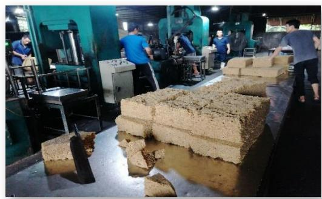

16 Product code 40: Rubber and articles thereof

17 Presentation from Lao Rubber Association 2024

18 "coagulated" refers to the process where the liquid latex transforms into a solid or semi-solid state. This happens when the rubber particles

in the latex are made to clump together (coagulate), typically by adding acids like formic acid or acetic acid.

19 Presentation from Lao Rubber Association 2024

unprocessed latex is illegal in Laos according the MAF agreement on the rubber and processing management of 2023.

### **Traceability**

Currently, there is neither a traceability system in place for rubber, nor is it legally required for export from Laos to Vietnam. In addiƟon, awareness on internaƟonal regulaƟons requiring traceability such as EUDR is sƟll very low among Lao stakeholders. ResulƟngly, companies do not pay special aƩenƟon when it comes to mixing of rubber from diīerent sources, such as smallholders who oŌen supply bigger companies with rubber via middlemen (F4 - Forest For the Future Facility, 2023). SomeƟmes, latex from Laos, oŌen in an unprocessed stadium as cup lumps or sheets, is exported to Vietnam and China and mixed with latex from other sources. The product is then labelled as Vietnamese or Chinese, creaƟng problems for traceability. Furthermore, there are company reports about the theŌ of latex by farmers, who then sell the latex to independent traders (Smith, Lu, To, Mienmany, & Soukphaxay, 2020). Hence, the complexity of the value chain as well as the lack of a comprehensive regulatory framework for trading rubber can be considered key barriers when it comes to traceability.

CerƟĮcaƟon schemes, which could support traceability in the Lao rubber sector, are currently rarely used in the country. The Vietnamese Dak Lak Rubber Company, which also owns plantaƟons in the Champassak Province of Laos, recently received its FSC cerƟĮcaƟon (FSC FM/CoC) for 1,200 ha of rubber plantaƟons in Vietnam and claims compliance of its rubber with the EUDR (FSC, 2024). The company is also a member of the Lao Rubber AssociaƟon and aims at the FSC-FM cerƟĮcaƟon of its rubber plantaƟons in Laos.[20](#page-21-1) Furthermore, the VietLao Rubber Company is cerƟĮed with the PEFC cerƟĮcate.[21](#page-21-2) Similar to the coīee sector, there is liƩle research focussing speciĮcally on traceability in the Lao rubber supply chain and incenƟves for its improvement. However, it can be assumed that drivers for the instalment of a traceability system are similar to those discussed in chapter [3.2.](#page-15-0)

### **3.4. CaƩle Sector**

- Size of caƩle herds is conƟnuously growing
- CaƩle producƟon predominantly relies on smallholders
- Live caƩle are mostly exported to Vietnam, while beef is only exported to China
- Lack of animal registraƟon and undocumented trading are key barriers for traceability

### **Background**

The size of caƩle herds was conƟnuously growing in Laos since 2010 by an average of 5% per year, from 1.52 million in 2010/2011 to 1.88 million in 2016 (Napasirth & Napasirth, 2018) and 2.1 million in 2019 (Xayalath, Mujitaba, Ortega, & Rátky, 2021). The majority – 56% - of caƩle are located in the Central region of Laos, 26% are located in the Northern and 17% in the Southern region. Despite the eīorts of the Lao government to develop commercial-scale farms, 98% of caƩle in Laos is sƟll owned by smallholders, resulƟng in relaƟvely low producƟvity of the sector. The most popular caƩle breed in Laos is the Yellow Asian breed. Local caƩle breeds reach up to 350 kg for male and 250 kg for female caƩle. Since 2010, farmers imported diīerent improved breeds such as the Thai Grey, Red Brahman and Thai Red Sindhi to improve meat producƟon in order to meet domesƟc and internaƟonal demand (Xayalath, Mujitaba, Ortega, & Rátky, 2021).

The Lao government aims at improving the producƟvity of caƩle producƟon as outlined in the "Agriculture Development Strategy to 2025 and vision to the year 2030" of MAF. It is aimed to increase caƩle beef producƟon from 14,000 tons by 2015 to 30,000 tons by 2020 and to 38,000 tons by 2025, by

20 Presentation from DRI during rubber workshop 2024

21 Presentation from Lao Rubber Association 2024

allocaƟng land for caƩle producƟon, changing the producƟon system from tradiƟonal to commercial, develop linkages with processing factories and markets and dedicaƟng land for the producƟon of crops for animal feeds (F4 - Forest For the Future Facility, 2023).

### **Supply Chains**

The caƩle producƟon in Laos predominantly relies on smallholders. Some farmers are also organized in caƩle farmer groups and a few industrial farms have been established by investors (F4 - Forest For the Future Facility, 2023). Most farmers raise their caƩle using tradiƟonal methods, such as free-ranging in fallow land and forests, free-ranging within fenced fallow, rotaƟonal grazing in fenced pasture, as well as the cut-and-carry system, where caƩle are conĮned to pens and fed with harvested grasses or other vegetaƟon (Phouyyavong, Tomita, & Yokoyama, 2019). While a large share of caƩle is slaughtered within the country for domesƟc consumpƟon, scholars have reported an increase of exporƟng live animals to China and Vietnam. AddiƟonally, caƩle are imported from Thailand for domesƟc use and Laos is used as a transit country for caƩle trade from Thailand to Vietnam or China (F4 - Forest For the Future Facility, 2023). Live caƩle trade to Vietnam largely takes place via the border in Xieng Khouang Province, while caƩle is traded via Louang Namtha Province to reach China (Phonivsay, Ouanesamone, & Souvannavong, 2016).

While the export of live caƩle[22](#page-22-0) is shiŌing from China to Vietnam [\(Table 8\)](#page-22-1), the export of beef has already completely shiŌed from Vietnam to China [\(Table 9\)](#page-22-2). There is no direct export from Laos to the EU (F4 - Forest For the Future Facility, 2023).

*Table 8. Lao live bovine animals importers*

|           | animals 23 | Share in value in Lao PDR’s live bovine exports [%] |      | thousand] |         |         |
|-----------|------------|-----------------------------------------------------|------|-----------|---------|---------|
| Importers | 2018       | 2019                                                | 2020 | 2018      | 2019    | 2020    |
| Vietnam   | 88.3       | 96.7                                                | 98.8 | 67,505    | 195,861 | 216,428 |
| China     | 11.7       | 3.2                                                 | 1    | 8,954     | 6,555   | 2,280   |
| EU-27     | 0          | 0                                                   | 0    | 0         | 0       | 0       |

(ITC, 2023)

\*Note: Data from 2022-2024 is not available

*Table 9. Lao beef importers*

|                |    | 2015              |       |    | 2020                    |     |
|----------------|----|-------------------|-------|----|-------------------------|-----|
| Total exports  | 27 | 0.2 100%          | 8,442 | 25 | 0.2 100%                | 913 |
| China          | 0  | 0.0 0%            |       | 25 | 0.2 100%                | 913 |
| Vietnam        | 27 | 0.2 100%          | 8,442 | 0  | 0.0 0%                  |     |
| ProducƟon (in  |    |                   |       |    |                         |     |
| thousand tons) |    | 31.8 (with bones) |       |    | 37.4 (with bones, 2020) |     |

(F4 - Forest For the Future Facility, 2023)

22 All numbers mentioned in this section refer to product Code 0102 Live bovine animals

23 The term bovine animals includes cattle, buffalo and other bovine animals. Buffalo farms are by far less important than cattle farms. However, domestic water buffalos account for about a third of total heads of bovines from smallholders in Lao PDR. Yet, EUDR covers only cattle and not buffalo.

Over the past decade, the caƩle populaƟon in Laos has also steadily increased, driven by an Export Agreement between Laos and China in 2017, which granted Laos a quota to export 500,000 caƩle to China from 2021-2028. However, this Įgure has not been met due to the strict border restricƟons imposed by Chinese authoriƟes since the Covid-19 outbreak of 2020. Other agreements to increase livestock trading from Laos to China could not be implemented in large scale due to the incapability of Lao exporters to meet the Chinese requirements, such as low weight of caƩle or the lack of tesƟng faciliƟes on the Lao side. Although the Lao and Chinese governments have signed mulƟple agreements since 2017 outlining detailed procedures for livestock trading, only two of the three concession companies authorized to construct quaranƟne faciliƟes have received approval from the General AdministraƟon of Customs China (GACC) and the Department of Livestock and Fisheries (DLF) of Laos to quaranƟne and export caƩle to China (F4 - Forest For the Future Facility, 2023). Long delays at border checkpoints have led to increased animal husbandry costs, and live caƩle have lost weight due to longer holding periods. In addiƟon, high cost for slaughtering in China which need to be borne by the Lao exporters complicate live caƩle export. These challenges have prompted traders to shiŌ their focus to the domesƟc market, where transacƟons can be made more eĸciently and without the logisƟcal complicaƟons associated with the export process. As a result, live caƩle trading at border checkpoints has declined, with acƟvity levels signiĮcantly reduced compared to pre-pandemic.

### **Traceability**

Traceability in the Lao caƩle sector is complicated by several reasons, such as the low rate of registraƟon for animals. On average, only 3% of buīalos and 5% of caƩle is registered. This lack of proper documentaƟon hinders the monitoring of trade and compliance with health and hygiene standards needed for export (F4 - Forest For the Future Facility, 2023). Furthermore, a large share of caƩle movement to Vietnam remains undocumented as caƩle is moved to Nong Het district, which border Vietnam, and then traded via unoĸcial border points (Phonivsay, Ouanesamone, & Souvannavong, 2016). If documented, domesƟc and cross-border transacƟons are recorded using paper-based systems and no part of the SPS and traceability system is digiƟzed (F4 - Forest For the Future Facility, 2023).

# **4. Case Studies**

Chapter 4 provides a summary of the interviews and general Įndings from the case studies structured according to the secƟons of the research quesƟonnaire.

### **4.1. General InformaƟon on Interviewees**

In total, 28 interviews were conducted with representaƟves from the coīee, caƩle and rubber sector. The majority of interviewees are part of the coīee sector and were largely located in the Southern part of Laos. 6 interviews in total were held with stakeholders from the caƩle sector, mostly in Central Laos. For the rubber sector, 5 interviews in total – 2 in the Northern and 3 in Central Laos – were conducted [\(Table 10\)](#page-23-2).

*Table 10. Number of interviews per sector and region*

| Commodities | Total | North | Number of interviewees Central | South |
|-------------|-------|-------|--------------------------------|-------|
| Coffee      | 17    | 2     | 4                              | 11    |
| Cattle      | 6     | 1     | 5                              |       |
| Rubber      | 5     | 2     | 3                              |       |
| Total       | 28    | 5     | 12                             | 11    |

### *Table 11. Number of the operaƟon type in main commodiƟes.*

| CommodiƟes | Type of OperaƟon | Number of stakeholders |
|------------|------------------|------------------------|
| Coīee      | AssociaƟon       | 1                      |
|            | Other            | 1                      |
|            | Companies        | 11                     |
|            | CooperaƟves      | 4                      |
|            | Total            | 17                     |
| Rubber     | Companies        | 4                      |
|            | AssociaƟon       | 1                      |
|            | Total            | 5                      |
| CaƩle      | Companies        | 6                      |
|            | Total            | 6                      |
| TOTAL      |                  | 28                     |

The operaƟons in the main products of coīee, rubber and caƩle are distributed among diīerent stakeholder groups. For coīee, there are 17 stakeholders: eleven companies, four cooperaƟves, one internaƟonal enƟty categorised as "other" and one associaƟon. In the rubber sector, there are Įve stakeholders: four [companies and one associaƟon. The caƩle sector has six stakeholders, all of which](#page-24-0)  are companies (see

### [Table](#page-24-0) *11*).

### **Coīee Sector**

Based on Įndings from the stakeholders' interviews (Annex B), the coīee interviewees may be classiĮed into three categories: Level 1 (small-scale stakeholder), Level 2 (medium-scale stakeholder), and Level 3 (large-scale stakeholder). These levels are deĮned by annual producƟon capacity and each level shows similar characterisƟcs, such as years of operaƟons and market orientaƟon (se[e Figure 5\)](#page-25-0).

- **Level 1** stakeholders are large-scale producers with annual producƟon exceeding 2000 tons and have been operaƟng for more than 10 years (5 interviewees). They have great access to Įnance, and resources. Many of them are the key players in the industry, some of them are the founders and cofounder of Lao Coīee AssociaƟon and contribute signiĮcantly to the country's export revenues.[24](#page-24-1) **Level 2** includes the medium coīee producers or processors who have an annual coīee producƟon between 100-2000 tons (5 interviewees). These stakeholders oŌen have more established operaƟons compared to level 1, allowing to serve both domesƟc and internaƟonal market.[25](#page-24-2)
- **Level 3** covers the interviewees who produced or processed less than 100 tons of coīee annually and have generally been operaƟng for less than 10 years (5 interviewees). Their primary business focus is on smallholders, trading, and processing. While most of these stakeholders' supply to the domesƟc market, four interviewees have successfully entered internaƟonal markets.[26](#page-24-3)

24 Interviewed stakeholder 14, 15, 16, 21, 22.

25 Interviewed stakeholder 13, 17, 18, 19, 20. 26 Interviewed stakeholder 7, 8, 9, 10, 23.

*Figure 5: Level of coīee interviewees*

*Source: Author's own illustraƟon based on Įndings from stakeholder interviews.*

### **Rubber Sector**

Five interviewees from the rubber sector were interviewed, including representaƟves from four companies and one associaƟon. Most of these companies operate on land granted through government concessions, while some also purchase raw rubber directly from smallholder farmers. In terms of market orientaƟon, all companies shared a similar approach, they export to neighbouring counƟes. Companies based in Central Laos primarily export their rubber to Vietnam,[27](#page-25-1) while those in northern Laos mostly export to China.[28](#page-25-2) The reason why there is no company exporƟng to the EU was because neither speciĮc legislaƟons nor rubber standards exist in Laos, moreover, they have limited capacity to processed the raw rubber to products, and although their producƟon volume is quite high, all the companies only exporƟng the raw latex. Three respondents reported annual producƟon exceeding 20,000 tons per year, while one company menƟoned that their output is less than 1000 tons per year.

Interviewee 24 highlighted the associaƟon's main acƟviƟes, which include: enforcing associaƟon regulaƟons to ensure compliance within the sector; promoƟng sustainable rubber producƟon pracƟces; supporƟng the operators in Laos in rubber producƟon, processing and export; advocaƟng the rights and interests of the operators and encouraging the small and medium enterprises (SMEs) to grow by providing capacity building and market access opportuniƟes.

### **CaƩle Sector**

As shown i[n Table 10,](#page-23-2) there are six interviewees from the caƩle sector, Įve of the respondents are located in VienƟane Capital, while one is based in Xiengkhouang Province. The sector is primarily dominated by smallholders who rely on tradiƟonal pracƟces. All interviewees stated that their producƟon is distributed within the domesƟc market, as they currently lack the capacity and resources to explore export opportuniƟes. The interviewees highlighted several challenges, including limited knowledge of modern producƟon processes, [29](#page-25-3) insuĸcient access to advanced technology, and a lack of technical training programs, which constraints hinder their ability to enhance the producƟvity and meet higher producƟon

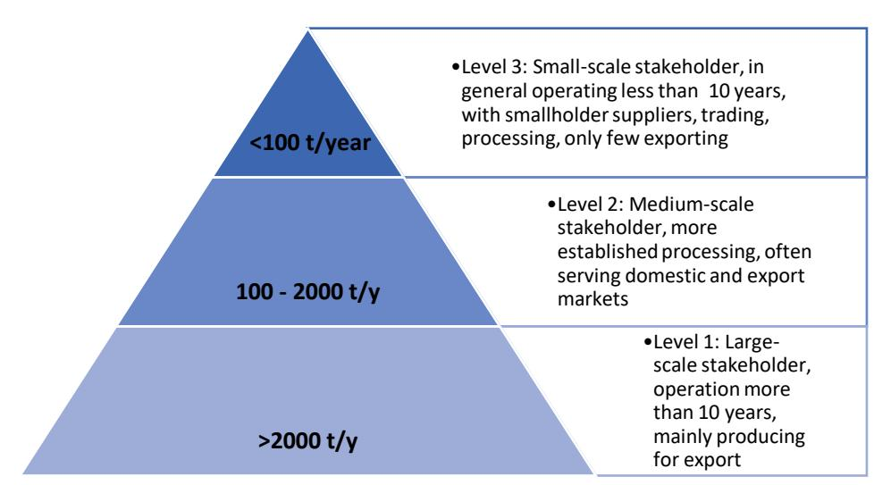

27 Interviewees 25, 26.

28 Interviewees 27, 28.

29 Interviewee 3.

standards[30](#page-26-1). The producƟon scale is relaƟvely small compared to the other countries. Some interviewees reported producing fewer than 20 caƩle per year, in contrast, two interviewees indicated annual producƟon exceeding 100 caƩle[31](#page-26-2). AddiƟonally, the interviewees have been operaƟng in producing caƩle for a period ranging from 2 to 12 years.

### **4.2. Supply Chains**

### **Coīee Sector**

The interviews covered four cooperaƟves in the coīee sector[32](#page-26-3) who are all acƟve in Champasack province. The members of these cooperaƟves are individual farmers who grow coīee on their individually owned plots of land, with one cooperaƟve speciĮcally promoƟng coīee in agroforestry systems[33](#page-26-4) . Interviewee 18 reports that the coīee cherries Įrst undergo the process of wet and dry milling into parchment (white bean) at the village centre, unƟl the cooperaƟve collects the parchment for further processing into green beans. Interviewee 14 explains that the member villages of the cooperaƟve are provided with a repulping machine to remove the outer skin and pulp of the coīee cherry from the centre. The village centre then serves as a collecƟon point for the coīee beans before being sent to the cooperaƟve's processing factory. However, some cooperaƟves[34](#page-26-5) only undertake preliminary processing steps, such as drying the cherries, before selling to larger processors.

Local farmers do not necessarily have a formal contract with the cooperaƟve that processes the coīee. Rather than that, the relaƟonship is based on informal agreements where companies support farmers in sustainable pracƟces, parƟcularly shade-grown coīee under natural canopy cover, which enhances environmental resilience and coīee quality[35](#page-26-6). Farmers also beneĮt from technical assistance provided by larger cooperaƟves, which helps to enhance both yield and quality.[36](#page-26-7)

Twelve processing factories, including one that is managed by a cooperaƟve[37](#page-26-8) , were interviewed. Eleven companies[38](#page-26-9) reported that they largely source their coīee beans from local farmers in addiƟon to the – relaƟvely smaller – harvest from their own plantaƟons. Interviewee 9 reports that their own producƟon amounts to approximately 20 tons per years, while 50-60 tons per year comes from around 800 local families. One company[39](#page-26-10) reported to only use coīee from their own plantaƟons in 2024, despite having bought coīee beans from local farmers in the past, due to the high prices they had to pay for the farmer's coīee beans, resulƟng into lower proĮtability of the company. While some respondents[40](#page-26-11) state to not have a formal contract with their suppliers, many describe how they have built a long-term relaƟonship with farmers through providing Įnancial and technical support[41](#page-26-12), building coīee tree nurseries in the villages[42](#page-26-13) , and oīering trainings on coīee growing and processing[43](#page-26-14) in addiƟon to or as a subsƟtute for formal agreements.

30 Interviewee 4.

31 Interviewee 2, 4.

32 Interviewee 13, 14, 18, 19.

33 Interviewee 19.

34 Interviewee 19.

35 Interview 19.

36 Interview 13, 14. 37 Interviewee 14.

38 Interviewee 7, 8, 9, 10, 14, 15, 17, 20, 21, 22, 23.

39 Interviewee 16 (used farmers in the past but not planned for 2024).

40 Interviewee 10.

41 Interviewee 10.

42 Interviewee 9. 43 Interviewee 23.

Depending on the processing stage of the supplied coīee beans, the processing factories then wet wash and dry mill the coīee to produce parchment coīee. The parchment is then sorted and graded into diīerent qualiƟes before being milled into green beans. Approximately half of the respondents[44](#page-27-0) reported to roast the coīee in their own factories, while one company[45](#page-27-1) reported to further trade the green beans to a domesƟc roaster. The other half of processing factories report to export the beans for roasƟng in – mainly – neighbouring countries such as Vietnam and Thailand[46](#page-27-2) , while one company[47](#page-27-3) exports to the EU for roasƟng.

Both, roasted and green beans are largely exported abroad, while only two producers report to sell their product domesƟcally[48](#page-27-4). Seven producers report to export their coīee to countries within the EU[49](#page-27-5) – some with processing steps in neighbouring countries – and two companies report that they plan to export to the EU market in the future[50](#page-27-6) . Other markets are neighbouring countries such as Thailand, Vietnam, Japan, New Zealand and China as well as the United States[51](#page-27-7). The followin[g Figure 6](#page-27-8) depicts schemaƟcally the supply chains observed at the interviewed stakeholders.

*Figure 6: Supply chains of visited coīee sector stakeholders*

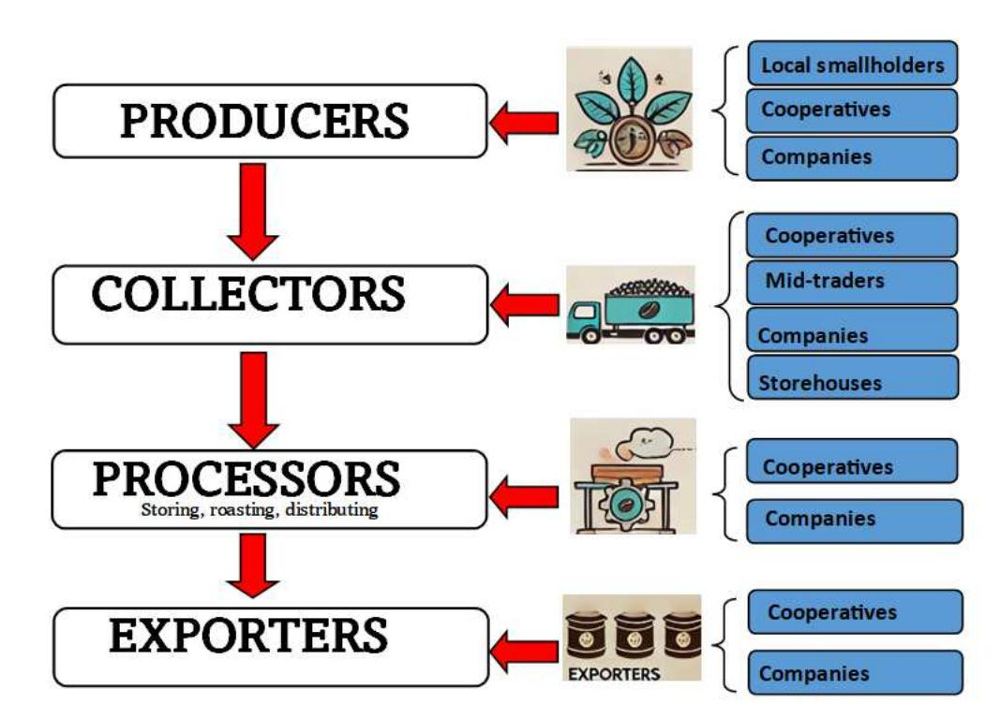

*Source: Author's own illustraƟon.*

### **Rubber Sector**

The interviews covered three companies – two Chinese and one Lao investors –, that grow their own rubber trees on concession land located in Northern and Central Laos[52](#page-27-9) . Out of a total plantaƟon area of

44 Interviewee 7, 8, 9, 10, 16, 18, 21, 22.

45 Interviewee 23.

46 Interviewee 15, 16, 21, 22.

47 Interviewee 17.

48 Interviewee 16, 23.

49 Interviewee 7, 8, 10, 15, 17, 20, 21.

50 Interviewee 9, 23.

51 Interviewee 8, 9, 10, 16, 18, 20, 21, 22.

52 Interviewee 25, 27, 28.

320,000 ha[53](#page-28-0) , the concession area of one interviewee had a size of 14,000 ha.[54](#page-28-1) One company directly sells its rubber collected from self-owned plantaƟons to a Vietnamese semi-processing company located in Bolikhamxay. The other two companies also source rubber from smallholders living in the surrounding areas of the company in addiƟon to producing their own rubber[55](#page-28-2). In addiƟon to the three companies that have their own plantaƟons, one company – a Vietnamese investment – only sources from smallholders and does not have its own plantaƟon[56](#page-28-3) . The smallholders providing the rubber in the form of cup lumps to the buyers oŌen use tradiƟonal pracƟces for growing and tapping the rubber and rarely receive any professional training on sustainable tapping techniques[57](#page-28-4) .

The rubber is purchased by middlemen who buy the rubber at village collecƟon places before transporƟng it to diīerent companies' processing plants (se[e Figure 7\)](#page-28-5). Interviewee 28 states to have a formal contract with the mid-traders who supply the factory with the unprocessed rubber. Company number 26 sources its rubber from three diīerent provinces but does not have a formal contract with suppliers. The rubber is transferred to the producƟon sites for further processing, during which the latex is cleaned, dried and semi-processed into products such as rubber blocks. Company 26 reports to produce rubber blocks in Standard Vietnamese Rubber (SVR) 10 quality, which has higher dirt and ash contaminaƟon levels compared to SVR 3L or SVR5 and is used for low-cost products such as footwear, where purity is not the highest priority.

*Figure 7: Village collecƟon point for rubber cup lumps*

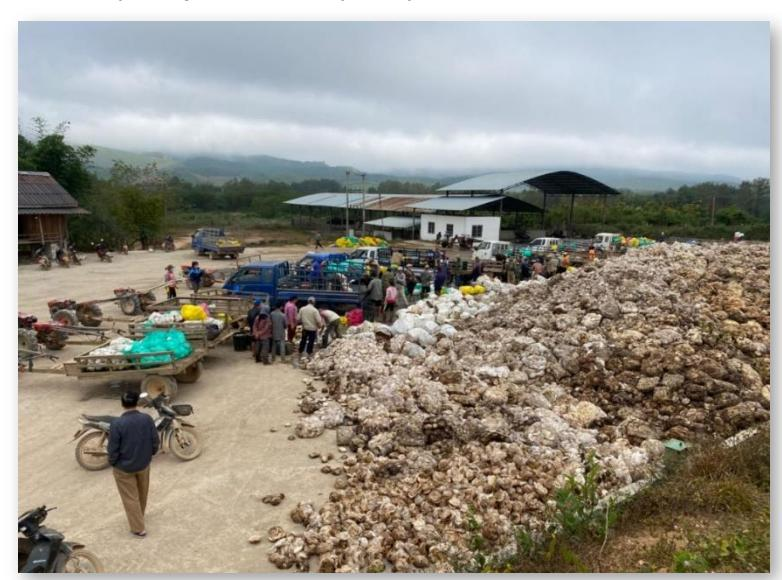

AŌer a Vietnamese buyer has picked up the blocks from company 26 for further processing in Vietnam, the rubber product is sold to Chinese buyers. Similarly, interviewee 28 reports to also export the processed rubber to China. None of the interviewed stakeholders reports to export to the EU or having any knowledge about rubber goods being sold to the EU aŌer processing in neighbouring countries. [Figure 8](#page-29-0) shows a synopsis of the supply chains described by the interviewed stakeholders.

53 Interviewee 24.

54 Information not available from 3rd interviewee.

55 Interviewee 27, 28.

56 Interviewee 26.

57 Information from field visit during the regional workshop on "Promoting Sustainable Natural Rubber Production, Trade and Investment in Mainland and Southeast Asia", 15. November 2024, Vientiane Capital.

*Figure 8: Supply chains of visited rubber sector stakeholders*

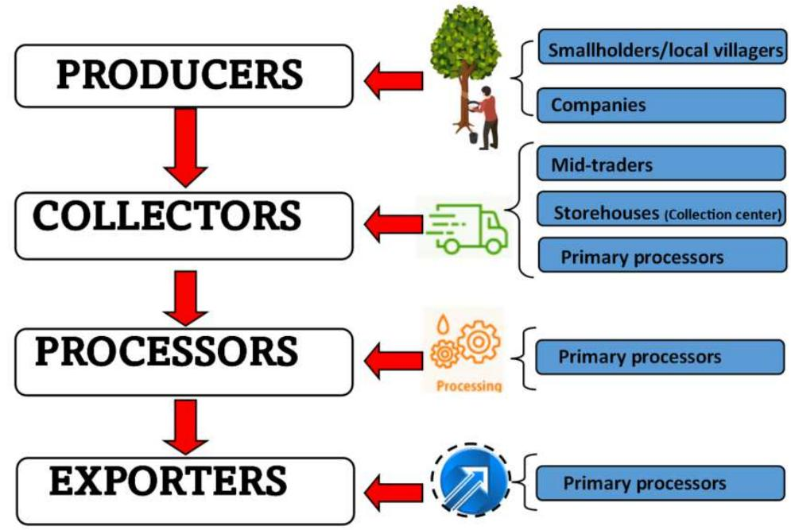

*Source: Author's own illustraƟon.*

### **CaƩle Sector**

The interviews covered six producers who are acƟve in Northern[58](#page-29-1) and Central[59](#page-29-2) Laos. All interviewed stakeholder report to breed their own caƩle at their own farm. ProducƟon is relaƟvely low with three farms reporƟng to produce approximately 10-20 cows annually and only one[60](#page-29-3) reporƟng to produce 100- 150 of beef caƩle on average[61](#page-29-4). The remaining interviewees either considered this informaƟon as sensiƟve and preferred not to report or did not have any knowledge about their annual producƟon capacity. In addiƟon to producing their own caƩle, two interviewees report to buy addiƟonal animals from local farmers[62](#page-29-5). The interviewed producers focus on raising caƩle, providing proper breeding, feeding and overall health management unƟl the caƩle are ready for sale.

AŌer producƟon, primary middlemen act as key intermediaries. These small-scale traders purchase the live caƩle directly from farms and local smallholders, handle transportaƟon logisƟcs and deliver the caƩle to larger market centres or other intermediaries for further aggregaƟon[63](#page-29-6). The process conƟnues with secondary middlemen, who operate within major markets, such as the Xieng Khouang Livestock Trading Centre where people can exchange, buy and sell their products. Markets serve as key trading hubs, connecƟng traders, exporters and buyers. Livestock sold here may remain on domesƟc markets or be transported back to border checkpoints for internaƟonal buyers. Exporters, typically large traders or companies, manage the logisƟcs of cross-border trade, parƟcularly to major markets such as China and Vietnam. Some exporters work directly at border checkpoints, while others rely on central markets for sourcing and documentaƟon. In contrast to the majority of respondents who only sell live caƩle, two

58 Interviewee 5.

59 Interviewee 1, 2, 3, 4, 6.

60 Interviewee 4.

61 Interviewee 1, 5, 6.

62 Interviewee 3, 5.

63 Interviewee 1, 2, 3, 5, 6.

interviewees also report to addiƟonally[64](#page-30-1) or only[65](#page-30-2) sell meat to domesƟc markets such as VienƟane. Interviewee 4 owns its own slaughterhouse which processes about 15 cows per day and is cerƟĮed according to a GMP-ISO standard. It is important to note that all interviewees report to only sell their products domesƟcally and do not have any knowledge about possible exports to neighbouring countries. Supply chains reported by interviewees are visualized in [Figure 9.](#page-30-3)

*Figure 9: Supply chains of visited caƩle sector stakeholders*

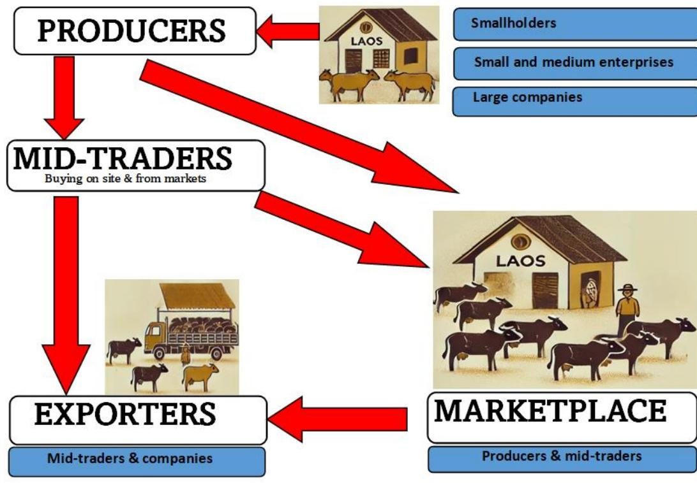

*Source: Author's own illustraƟon.*

### **4.3. Traceability**

The results of the stakeholder interviews revealed several insights into the traceability pracƟces across the three selected commodiƟes in Laos. In the coīee sector, fourteen respondents reported using traceability methods, while one reported not using them. For rubber sector, 4 respondents reported using traceability methods. However, in the caƩle sector, only half of the respondents (3) reported using traceability methods, while the other half indicated the absence of such pracƟces [\(Table 12\)](#page-30-4).

*Table 12. Use of traceability systems among visited stakeholders.*

| Type of Commodities | Yes | No | Not applicable |
|---------------------|-----|----|----------------|
| Coffee              | 14  | 1  | 2              |
| Rubber              | 4   | 0  | 1              |
| Cattle              | 3   | 3  | 0              |
| TOTAL               | 21  | 4  | 3              |

64 Interviewee 3.

65 Interviewee 4.

[Table 13](#page-31-1) provides an overview of the traceability systems used among diīerent commodity groups (coīee, rubber and caƩle) in Laos, highlighƟng the predominance of tradiƟonal paper-based methods. In the coīee sector, seven respondents report using paper-based traceability systems, followed by rubber with four and caƩle with three respondents indicaƟng their use. AddiƟonally, Įve respondents from the coīee sector explain to document their trading data in a mix of paper-based and digital system indicaƟng a gradual transiƟon but highlighƟng limited integraƟon of modern technologies. Solely digital traceability systems are rarely used, with only two respondents from the coīee sector implemenƟng such a system, while no respondent from the rubber or caƩle sector report to have a digital system, indicaƟng a signiĮcant adopƟon gap due to barriers such as limited knowledge and infrastructure. A detailed descripƟon of traceability systems in use can be found in chapter 5.

*Table 13. Type of traceability systems used by interviewees.*

| Commodity | Paper-based | Traceability system type Digital | Paper-based and digital |
|-----------|-------------|----------------------------------|-------------------------|
| Coīee     | 7           | 2                                | 5                       |
| Rubber    | 4           | 0                                | 0                       |
| CaƩle     | 3           | 0                                | 0                       |

Though product cerƟĮcaƟon does not necessarily improve traceability, it was idenƟĮed as a signiĮcant factor for supporƟng traceability eīorts of interviewees. As cerƟĮcaƟon schemes oŌen come with stringent requirements for documentaƟon and transparency throughout the supply chain, producers using cerƟĮcaƟon schemes such as organic or fair trade oŌen had more comprehensive and someƟmes digital systems in place in comparison to producers without cerƟĮcaƟon.[66](#page-31-2) This was parƟcularly the case for producers in the coīee sector. Among the coīee respondents, eight reported holding some kind of cerƟĮcaƟon, with the most common being Fair Trade, Organic, and Rainforest Alliance. A few respondents also held GMP (Good Manufacturing PracƟces) and other cerƟĮcaƟons, which enhance the traceability and facilitate market access to regions with stringent requirements, such as the EU. However, nine coīee respondents indicated that they lacked cerƟĮcaƟon, staƟng that high membership fees signiĮcantly increase the cost of their coīee as the primary barrier.

In the rubber sector, only one out of the Įve respondents held a cerƟĮcaƟon, speciĮcally SCR (Standard China Rubber), which aligns with market demand in the region. In contrast, none of the respondents in the caƩle sector reported holding any cerƟĮcaƟon. Many expressed limited awareness of available cerƟĮcaƟon schemes or cited the lack of pracƟcal incenƟves to pursue them.

### **4.4. Support Needed for Future Improvement**

The survey respondents expressed various needs and required assistance in the Įeld of capacity building, Įnancial support, market expansion, equipment, knowledge on relevant rules and regulaƟons, and infrastructure, that need to be addressed in order to enhance EUDR readiness in the Lao agriculture sector.

StarƟng with the implementaƟon of a traceability system, a majority (59%) of respondents did not prioriƟze the need for support in establishing such a system, while 41% recognized its importance. This suggests that while traceability is important for some, many respondents may not view it as an immediate concern or are not fully aware of its potenƟal beneĮts for their operaƟons. Upstream actors do not see a need for a traceability system as they perceive it unnecessary, with no prior demand from

66 Interviewee 14, 17, 18, 20

buyers or traders. Lacking awareness of its purpose, beneĮts, or implementaƟon, their focus remains solely on producing and selling goods, without understanding traceability's role in market access, quality assurance, or compliance.

Capacity building emerged as a signiĮcant need and focused on improving digital literacy and creaƟng awareness on the beneĮts of traceability systems. Training is needed in data collecƟon and storage, usage of geospaƟal tools and compliance process with 74% of respondents expressing the necessity for training and development. This overwhelming majority signals a strong desire to enhance skills and knowledge within the workforce, indicaƟng that respondents see capacity building as a crucial step for improving producƟvity and operaƟonal eĸciency.

Similarly, investment and Įnancial support is equally prioriƟzed, with 74% of respondents indicaƟng a need for Įnancial assistance for both, collecƟng geolocaƟon and other data as well as establishing and maintaining traceability systems. This reŇects the respondents' recogniƟon that funding is essenƟal for sustaining operaƟons, supporƟng growth, and addressing Įnancial challenges faced in their respecƟve sectors.

Targeted support for market expansion and compliance with internaƟonal law and standards, such as EUDR requirements also saw substanƟal demand, with 78% of respondents emphasizing the need for support in these Įelds. Respondents' demand for support reŇects a growing awareness of these regulaƟons, emphasizing the need for robust systems to meet EUDR criteria and maintain compeƟƟveness in internaƟonal markets. This highlights a clear intenƟon to engage with internaƟonal markets, suggesƟng that respondents recognize the importance of aligning with global expectaƟons to remain compeƟƟve.

On the other hand, technical and operaƟonal equipment needs were more evenly split, with 52% of respondents indicaƟng a need for addiƟonal equipment, while 48% did not. This balance suggests that while some recognize the importance of modernizing equipment to enhance operaƟons by using modern equipment like GPS devices, drones, and digital reporƟng tools to improve data accuracy, geolocaƟon tracking, real-Ɵme monitoring, and eĸcient documentaƟon of supply chain acƟviƟes, others may already be equipped or prioriƟze diīerent areas of development.

The survey also revealed a need for greater EUDR disseminaƟon, with 63% of respondents calling for more awareness and understanding of the EU's due diligence requirements. This need was parƟcularly expressed by stakeholders from the coīee sector, who are already parƟally exporƟng to the EU or plan to do so in the future. This underlines the necessity for clearer communicaƟon regarding regulatory requirements and a conƟnuaƟon of EUDR related outreach to stakeholder groups in Lao commodity sectors to reach a larger number of the interviewed stakeholders

Finally, infrastructure support was requested by 59% of respondents, highlighƟng the need for improved physical and logisƟcal frameworks to beƩer support operaƟons. This could be crucial in addressing challenges related to transportaƟon, communicaƟon, or distribuƟon networks.

In summary, the survey Įndings reveal a clear prioriƟzaƟon of capacity building, Įnancial support, market expansion, and infrastructure improvement. While the need for traceability and technical equipment is less pronounced, the demand for disseminaƟon of informaƟon on the EUDR and Įnancial assistance remains criƟcal. These insights provide a foundaƟon for understanding the key areas where stakeholders may need to focus their eīorts to foster growth and compeƟƟveness in their respecƟve sectors.

The bar chart below [\(Figure 10\)](#page-33-2) visualizes the responses for each of the seven categories, showing the percentage of respondents who indicated a need versus those who did not.

*Figure 10: Support and Future Needs for diīerent categories (responses in %)*

*Source: Author's own illustraƟon based on Įndings from stakeholder interviews.*

# **5. Review of ExisƟng Traceability Schemes and Tools**

### **5.1. Current Traceability PracƟces**

In Laos, traceability systems for sectors like Ɵmber, coīee, rubber, and caƩle from producers to traders, processors and exporters are at varying stages of development inŇuenced by factors such as regulatory frameworks, common pracƟces, regional and internaƟonal market demand and requirements. The study shows that the commodiƟes' traceability is paper-based and in some cases mixed with both paper-based and digital records. The sub-secƟons below brieŇy describe the traceability systems used in each sector with examples of pracƟcal traceability.

### **Timber traceability systems**

The current implementaƟon of traceability systems for Ɵmber and Ɵmber products is weak and stakeholders agree that the implementaƟon of the TLAS will take considerable Ɵme beyond the expected applicaƟon of the EUDR (F4 - Forest For the Future Facility, 2023). As part of the VPA process, veriĮcaƟon procedures for supply chain control have been piloted in two exercises in 2020/21 and in 2022 (Schwab, 2022) at planaƟon companies, in a conversion area and for conĮscated Ɵmber. The piloƟng allowed to draw conclusions on implementaƟon status of traceability systems. Observed systems were paper-based and included pre-harvest inventory data, log lists, sales and export documents with excepƟon of an FSCcerƟĮed plantaƟon company with downstream processing which applied electronic systems for supply chain control. The piloƟng showed that the veriĮcaƟon of paper-based systems is very Ɵme-consuming, and documents may not be readily available. This holds especially true for documents not directly related to product data in the supply chain but demonstraƟng legality of products and operaƟons, like harvest permits, transport permits, environmental impact assessments of factories or documents demonstraƟng the fulĮlment of labour obligaƟons of companies. Supply chain control systems were only partly

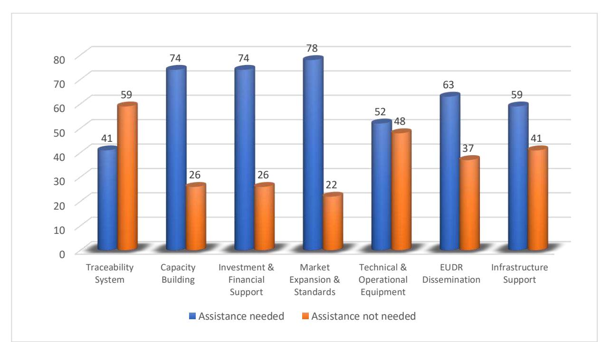

established, and most plantaƟon Ɵmber companies could not trace back Ɵmber from their smallholder suppliers as the plantaƟon registraƟon cerƟĮcate was not available.

The review of the exisƟng traceability system was an inherent part of the VPA process and started with the in-depth analysis of the legal framework by the VPA stakeholders during the establishment of the Timber Legality DeĮniƟons (TLD). The analysis allowed to idenƟfy inconsistencies in the legislaƟon of a sector, or in-between diīerent sectors involved in TLAS implementaƟon, the key ministries being MAF, MOIC, MONRE, MOF and MOLSW. The mulƟstakeholder process also addressed gaps regarding a sound supply chain control. As a result, responsible government enƟƟes started amending exisƟng regulaƟons or addressing exisƟng gaps. With the redesign of the Lao TLAS, a reassessment of legal requirements regarding supply chain control and their compliance with the Lao TLAS requirement has been undertaken recently under the FLEGT-FC[67](#page-34-0)and the annexes to the legality deĮniƟons been revised.

The following challenges regarding traceability and necessary acƟon have been idenƟĮed in the recent reassessment [\(Table 14\)](#page-34-1):

*Table 14: Remaining challenges and necessary acƟon to ensure traceability of Ɵmber in the Lao TLAS*

| Supply Chain Type  | Main Challenges                            | Necessary AcƟon |
|--------------------|--------------------------------------------|-----------------|
| Village use forest | Progress have been made recently with      |                 |
| ILEO               | Supply chain control of Ɵmber from land of |                 |

67 Since September 2024, FLEGT-FC organized 4 internal technical workshops with participation of DOF, DOFI and ProFEB and 2 TWG meetings with stakeholders from line agencies, private sector and CSO were held.

| Supply Chain Type | Main Challenges Necessary AcƟon             |
|-------------------|---------------------------------------------|
| ConĮscated Ɵmber  | Supply chain control of conĮscated Ɵmber is |
| Imported Ɵmber    | Timber is a controlled good and needs an    |
| Timber exports    | Data structure of export documents from     |

As outlined in secƟon 3.1, the traceability to the locaƟon of origin of source is part of the supply chain control in ProducƟon Forest Areas, conversion areas and for plantaƟons but the informaƟon is only parƟally aligned with EUDR requirements with respect to geolocaƟon in the case of plantaƟons (with some caveats).

- PFA: locaƟon of trees is marked on paper-based pre-harvesƟng maps (recorded during the preharvest inventory) with a scale of 1:1000. The basis is a map of the harvesƟng compartment with a scale 1:5,000 as part of logging plan (se[e Figure 11\)](#page-36-0). This map allows to locate a stump aŌer felling (e.g. for mandatory post-harvest monitoring); yet the map is not easily legible and a digiƟzaƟon of the locaƟon of trees during pre-harvest inventory would improve the applicability of the system. This could be easily aligned with EUDR geolocaƟon requirements; yet with the sƟll exisƟng logging moratorium, there is liƩle priority to adapt the system.

*Figure 11: Excerpt from a PFA pre-harvest inventory map and sample map of harvesƟng compartment*

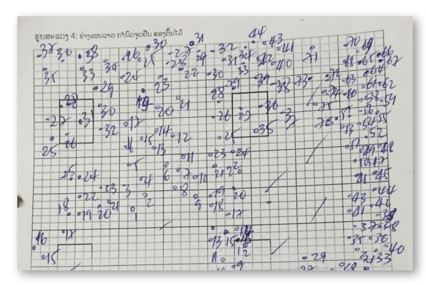

- Conversion areas: a map with the delineaƟon of the area to be converted into harvesƟng blocks is required by Decision 0112/MAF 2008.

Excerpt from the sampled pre-harvest inventory map on a scale of 1:1,000. Zones with high density of inventoried trees are hardly legible (Source: (UNIQUE Forestry and Land Use GmbH, 2016)

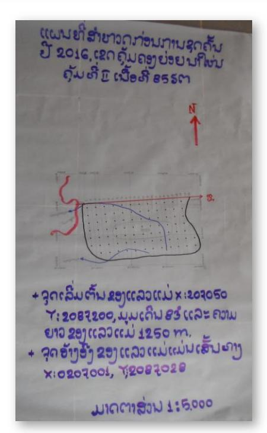

Sample map 1:5,000 of a harvesƟng compartment from a Ɵmber harvesƟng plan for 2016- 2017 (Source: SUFORD-AF, 2016)

- PlantaƟon Ɵmber: InstrucƟon 2492/MAF (2020)) requires the applicant for a plantaƟon registraƟon cerƟĮcate to record GPS coordinates of the plantaƟon. A graph explains the procedure [\(Figure 12\)](#page-37-0). Moreover, the instrucƟon speciĮes whether a single point or polygons have to be recorded depending on the type of plantaƟon owner and size of the plantaƟon [\(Table 15\)](#page-37-1). The instrucƟon deĮnes three types of plantaƟon owners (English translaƟon): a) individuals (mostly smallholders, normally referred to as households in the Lao context); b) organizaƟons[68](#page-37-2) , c) enƟƟes ("legal enƟƟes" in the Lao version). The instrucƟon requires: o Individuals to register a single GPS point, independently from the size of the plantaƟon o OrganizaƟons to register a polygon OR a singly GPS point, independently from the size of the plantaƟon o Legal enƟƟes to register a polygon, independently from the size of the plantaƟon

As the EUDR geolocaƟon threshold for point/polygon recording is 4 ha, independently from the owner type, the instrucƟon does not ensure full alignment with EUDR requirements.

*Figure 12: Procedure for recording GPS coordinates for plantaƟons (source: InstrucƟon 2492/MAF (2020)*

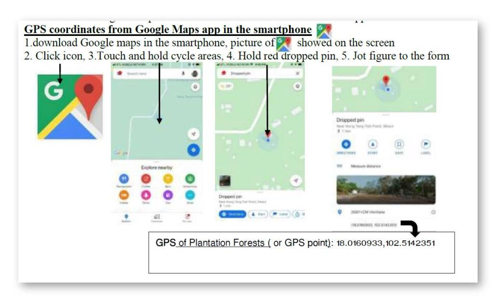

*Table 15: PlantaƟon plot registraƟon according to owner type*

| Owner type   | 1600 m 2             |              |         |
|--------------|----------------------|--------------|---------|
|              | – 5 ha 69            |              | >5 ha   |
|              | Single point Polygon | Single point | Polygon |
| Individuals  | x                    | x            |         |
| OrganizaƟons | (x) (x)              | (x)          | (x)     |
| Legal EnƟƟes | x                    |              | x       |

### **Coīee traceability systems**

According to the interviews, most of the Lao coīee producers such as local smallholder farmers, cooperaƟves and private companies have been using tradiƟonal paper-based recordkeeping systems to record the coīee supply. The Lao companies and cooperaƟves remain the main interested parƟes to

68 The use of the term ອົງການຈັດຕັSງ or (ການຈັດຕັSງ in the instruction) is translated with "organization" and can include any organization not organized as a legal entity (including cooperatives, producer groups, associations, yet even villages, government-related entities, etc.). 69 1,600 m2 is the size of 1 Rai, a unit of land measurement in Thailand

internaƟonal markets and therefore are obliged to have traceability systems, logisƟcal capabiliƟes and Įnancial resources to export their coīee to regional and internaƟonal markets, especially to Asia, Oceania, North America and Europe.

As an example of a paper-based system, one coīee cooperaƟve in the South of Laos[70](#page-38-0) which is working with 450 coīee producers in 19 villages uses paper-based record to collect cherry beans from cooperaƟve members for milling into parchment and processing into green beans (Arabica and robusta) for domesƟc consumpƟon (90%) and export (10%) to Japan, New Zealand, China and Taiwan. This cooperaƟve creates a form to record the annual coīee supply (see [Table 16\)](#page-38-1) and provide a receipt [\(Figure 13\)](#page-38-2) when making payments to the coīee producers. The informaƟon contained in these two records shows a descripƟon of the product without HS Code[71](#page-38-3), quanƟty in kilogramme, unit price and amount but does not provide all informaƟon as required by ArƟcle 9 of EUDR, especially date and Ɵme range of producƟon and geolocaƟon coordinates of plots of land of producƟon which is impossible to track the coīees to each plot of land where they were produced.

### *Table 16. Structure of annual coīee informaƟon from coīee members in 2023-2024.*

| No | Date of supply | Name  | Village cluster | Quantity (Kg) | Price LAK | Total     |
|----|----------------|-------|-----------------|---------------|-----------|-----------|
| 01 | 15/10/2024     | Mr. A | Kapher          | 500           | 50,000    | 2,500,000 |
| 02 |                |       |                 |               |           |           |

In addiƟon, one cooperaƟve[72](#page-38-4) has been using digital traceability systems, such as the Lao program

Sabaishop, Excel as well as Google Dashboard, to collect traceability informaƟon from coīee producers, especially for quality control and veriĮcaƟon of the origin to align their producƟon with consumer demand for sustainably sourced products. However, details could not be shared with the interviewer. The coīee cooperaƟve is located in the South of Laos and produces coīee and buys coīee from members of the cooperaƟve and further processes into green beans. The processing capacity is at the maximum

| Company: Phone number: Payment to: Mr/Mrs No | DescripƟon           | QuanƟty (Kg) | RECEIPT | No……….. Date:……………. Unit price(LAK) Amount(LAK) |
|----------------------------------------------|----------------------|--------------|---------|-------------------------------------------------|
| 1.                                           | White coīee beans    | 500          | 50,000  | 2,500,000                                       |
| Total                                        |                      |              |         | 2,500,000                                       |
|                                              | Signature of cashier |              |         | Signature of customer                           |

| Company: Phone number: Payment to: Mr/Mrs No | DescripƟon           | QuanƟty (Kg) | RECEIPT | No……….. Date:……………. Unit price(LAK) Amount(LAK) |
|----------------------------------------------|----------------------|--------------|---------|-------------------------------------------------|
| 1.                                           | White coīee beans    | 500          | 50,000  | 2,500,000                                       |
| Total                                        |                      |              |         | 2,500,000                                       |
|                                              | Signature of cashier |              |         | Signature of customer                           |

*Figure 13: Receipt.*

70 Interviewee 19

71 Harmonized System (HS) codes are commonly used throughout the import and export process for the classification of goods. The Harmonized System is a standardized numerical method of classifying traded products [\(Harmonized System \(HS\) Codes,](https://www.trade.gov/harmonized-system-hs-codes#:~:text=Among%20classification%20systems%2C%20Harmonized%20System,method%20of%20classifying%20traded%20products.) retrieved 28/11/2024)

72 Interviewee 14

about 8,000 tons/year of cherry beans and 939 tons/year of green beans of which 99% was exported to EU and 1% to Thailand. For traceability, this cooperaƟve has been applying the Fairtrade standard[73](#page-39-0) .

### **Rubber traceability systems**

Traceability for rubber producƟon in Laos is sƟll limited and, if applied, with simple paper-based systems. Many rubber plantaƟons are managed by smallholder farmers who rely on intermediaries for trading with processing companies making traceability system complex and complicated. According to the survey, rubber companies use only simple paper-based forms to record rubber supplies from farmers. A sample is shown i[n Figure 14](#page-39-1) (and the translaƟon of the structure i[n Table 17\)](#page-39-2) created by Interviewee 27 to record the rubber supply from rubber farmers. This form indicates the village name, the name of farmers, items (Latex), Price/Kg, amount of cash and signature including signature of a note taker, cerƟĮed person, the cash receiving person and the cashier. It does not indicate the geolocaƟon coordinates where rubber was produced. Most of the rubber is sold as raw latex and exported directly to China and Vietnam. Therefore, there is a need to support the Lao rubber producers to take into consideraƟon such requirements in their supply chain control systems.

*Table 17: Structure of purchase record for rubber (translated from [Figure 14\)](#page-39-1)*

*Name of village:*

| Name of farmers | Details of rubber in Kg | Price/Kg | Amount of cash | Signature |
|-----------------|-------------------------|----------|----------------|-----------|
|                 |                         |          |                |           |
|                 |                         |          |                |           |

*Figure 14: Record note for rubber purchase*

73 Fairtrade supports producers to protect forests and prevent [Deforestation \(](https://www.fairtrade.net/en/why-fairtrade/why-we-do-it/deforestation.html)retrieved 28/11/2024)

### **CaƩle traceability systems**

The CaƩle sector in Laos faces signiĮcant challenges in implemenƟng eīecƟve traceability systems, with most livestock businesses currently lacking formal mechanisms to track the origin of their products. According to interviews, most livestock operators have only basic traceability systems in place with simple trading records or sales receipts to cerƟfy the origin of their caƩle, but these documents provide limited details and do not meet the traceability requirements required to track the caƩle to their origin

or establishment. [Figure 15](#page-40-0) displays a collected sample form. InformaƟon includes the names of seller and buyer and the product speciĮcaƟon (one cow with a calf) and the form is sealed and signed by the village chief.

CaƩle producƟon in Laos is mostly small-scale and lacks a formal traceability system. Cross-border caƩle trade, especially to neighbouring countries, has increased, but weak record-keeping and animal health monitoring pose challenges for traceability. Without established traceability system, it is diĸcult to verify origin, health status, producƟon and breeding records. Developing a traceability framework for caƩle would require a robust infrastructure, training for farmers, and support from both government and private sector stakeholders.

The lack of standardized traceability systems means that it is generally impossible to verify where or how caƩle products were raised and processed.

*Figure 15. Receipt of sales of animals (and translated structure)*

Receipt of sales of animals

I am the Head of Village: ……………District………… Province

Have issued this receipt to Mr Khamchanh....Age 56 OccupaƟon……… Unit…01… Dongbang

Village……..Saybuly District and Savannakhet Province

Which sold 1 cow with a calf to Mr. Phim

Details of characterisƟcs of the caƩle

Head No 1 ….. One cow with a calf

Dongbang Village Date 16.9.2024

Sealed and signed by Village Chief Head of village Unit No 1

### **5.2. Readiness for EUDR Traceability Requirements**

Overall, traceability in Laos faces signiĮcant hurdles but also opportuniƟes for development, especially as global market demands for sustainable and traceable products conƟnue to grow.

The EUDR traceability requirements are outlined in arƟcle 9 "InformaƟon requirements" of the regulaƟon. In order to demonstrate, that the relevant products fulĮl the condiƟons of (1) being deforestaƟon-free, (2) having been produced in accordance with the relevant legislaƟon of the country of producƟon and (3) being covered by a due diligence statement (arƟcle 3), operators are obliged to collect a range of informaƟon, documents and data for their due diligence. It must be pointed out that Lao suppliers are not subject of these obligaƟons but collecƟng this informaƟon and make it at disposal of EU clients is a prerequisite for most informaƟon requirements, e.g. geolocaƟon data. In addiƟon, as this data can largely only be collected at the Įrst stages of the value chain (e.g. farmer and Įrst producer level), Lao stakeholders who wish to export their products to the EU have an interest in providing the requested informaƟon. However, some informaƟon requirements of Art. 9 are not requested for the whole Lao supply chain but only for the last actor in the Lao supply chain for which the operators must register the supplier contact informaƟon (Art. 9e). Buyer contact documentaƟon (Art. 9f) is an informaƟon requirement for operators or traders for any business, operator or trader to whom the relevant products have been supplied and thus not relevant for the Lao supply chain.

The following secƟon summarizes the Įndings from the interviews and the desk study and categorizes them along the diīerent informaƟon requirements.

### - **Product descripƟon (Art. 9a):**

- The majority of parƟcipants in the survey include only a basic product descripƟon in their records, used commonly in the local context and oŌen not in line with trade names used in the HS classiĮcaƟon system. In the case of relevant products that contain or have been made using wood, the common name of the species and their full scienƟĮc name is required. This is challenging for natural Ɵmber in the Lao context as traceability systems from pre-harvest inventories to processing, oŌen used only local Lao names in the past or are sƟll using them. Yet, the same local names are someƟmes used for diīerent species or a species can have diīerent Lao names. This issue has been addressed already under the VPA process as a FLEGT license would have requested the scienƟĮc name of a product. The NaƟonal Agricultural and Forest Research InsƟtute (NAFRI) has compiled and revised exisƟng species informaƟon and issued a tree species master list where species have been codiĮed. These codes will be used in the data structure of traceability records compliant with the Lao TLAS.
- **Product quanƟty documentaƟon (Art. 9b):** The majority of parƟcipants in the survey indicated to document the quanƟty (kg, volume, net mass) of the products produced and sold. As the price that producers and sellers receive from their buyers is usually based on the weight of the produce, most of the interviewees do some kind of simple – mostly paper based – record keeping. But the records do not contain HS codes of relevant products as listed in Annex I of EUDR. For Ɵmber, the supply chain control of the Lao TLAS requires informaƟon on product quanƟty, scienƟĮc names and HS codes, yet implementaƟon is currently sƟll weak.
- **GeolocaƟon documentaƟon (Art. 9d):** One crucial EUDR requirements is the documentaƟon of geolocaƟon of the plot of land where the commodity is grown. Plots of land with less than 4 ha and stalls for caƩle require a single geolocaƟon point, while plots larger than 4 ha require the provision of polygons providing informaƟon on the shape and size of the plot of land. This informaƟon is used in parƟcular to verify the deforestaƟon-free and forest-degradaƟon free statement of the commodity. However,

the interviews showed that this informaƟon is sƟll largely unavailable in the agricultural sector in Laos with only 2 companies – one in the coīee and one in the rubber sector – conĮrming that they have recordings of their plantaƟons geographical informaƟon (interview no. 10 & 27). One of the respondents further explained that the company only has the geographic informaƟon of its own plantaƟon but is missing informaƟon on smallholders who sell their produce to the company (interview no. 27). None of the interviewees from the caƩle sector was able to provide the geolocaƟon for stalls or grazing land. Supply chain control systems for natural Ɵmber from ProducƟon Forest Areas and from conversion areas are locaƟng the origin of logs on paper-based maps, yet with the objecƟve to verify the locaƟon during Įeld monitoring and no GPS points are recorded. Batches of plantaƟon Ɵmber can be traced back with GPS points and polygons, available on the plantaƟon registraƟon cerƟĮcate and recorded during applicaƟon for registraƟon. Yet, the size threshold for point and polygon informaƟon is diīerent compared to EUDR. DOFI is currently draŌing a decision on the management of conĮscated Ɵmber, including supply chain control. As brieŇy menƟoned in Chapter [0,](#page-14-1) the geolocaƟon of the origin of seized and later oĸcially conĮscated Ɵmber is hardly reproducible and conĮscated Ɵmber thus not qualiĮed to be exported in compliance with EUDR.

### - **DocumentaƟon of date and range of producƟon (Art. 9d):**

Together with the requirement of documenƟng the geolocaƟon of the plot of land where the commodity is grown, data on the date and Ɵme range of producƟon is essenƟal in order to assess if a commodity truly is deforestaƟon- and forest degradaƟon-free in terms of the cut-oī date of 30 December 2020, deĮned in the EUDR. During the interviews only 3 respondents – 2 in the coīee and 1 in the rubber sector – indicated that they would be able to provide this documentaƟon when asked by a buyer. However, these interviewees did not provide any further informaƟon on what form the documentaƟon takes. Supply chain control forms for PFAs and conversion areas are indicaƟng the date of respecƟve operaƟons (harvesƟng, transport, scaling/grading, sales). PlantaƟon owners do not need a harvest permit but have to report the number of trees and species before felling to the District Agriculture and Forestry Oĸce. This informaƟon will also be registered in the IMS, yet needs to be linked to the sales documentaƟon between plantaƟon owners and buyers. FLEGT-FC will address this in the forthcoming piloƟng.

### - **Supplier contact informaƟon (Art. 9e):**

When asked if there is any documentaƟon of supplier contact informaƟon, such as name, postal address and email address, 8 respondents – 7 out of them from the coīee sector – conĮrmed that they would be able to provide informaƟon on their suppliers. Natural Ɵmber is managed by government enƟƟes and sold to sawmills and export of logs is not allowed. Thus, export documents of allowed semi-Įnished or Įnished products according to the list of eligible products for export, regularly updated by MAF will have to provide supplier contact informaƟon. PlantaƟon Ɵmber can be linked to the supplier via the plantaƟon registraƟon cerƟĮcate which needs to be aƩached to the sales documentaƟon. The plantaƟon registraƟon cerƟĮcate does not indicate an email address. As plantaƟon Ɵmber can theoreƟcally be exported as round wood to EU markets, this would be a gap.

### - **Buyer contact documentaƟon (Art. 9f):**

As stated above, this requirement is not relevant for Lao supply chains but only for business-tobusiness between an operator and its client. Nevertheless, the following observaƟons have been made when asked if there is record keeping of the name and address of the buyers of the respecƟve products, some respondents to the survey indicated that they document the name and contact informaƟon of the buyer but no email addresses are recorded. However, some respondents also explained that they do not keep any record of the buyer, who oŌen takes the form of a middlemen rather than a producing enƟty or exporter (interviewee 1). ExisƟng sales document for Ɵmber and Ɵmber products are in line with buyer contact requirements of art. 9f with excepƟon of email addresses.

### - **TransportaƟon records:**

Transport records are not speciĮcally addressed in EUDR, arƟcle 9. Nevertheless, in order to be able to trace the commodiƟes over the whole supply chain, transportaƟon records shall ensure that non-compliant commodiƟes may not be mixed with compliant commodiƟes. . However, only few reported to have these records and if they do, it largely did not cover all steps. Most of the respondents referred to their buyers as the responsible enƟty to provide this informaƟon.

### **5.3. Other Traceability Challenges**

Traceability challenges in the Ɵmber sector have been intensely discussed in the VPA process and addressed through the amendment of key regulaƟons on supply chain control. Yet, gaps or inconsistencies are sƟll exisƟng in the legal framework (see [Table 14\)](#page-34-1) regarding some Ɵmber sources and the key regulaƟon for Ɵmber processing and trade, 1045/MAF (2023) does not yet cover all Lao TLAS requirements. Across the coīee, rubber and caƩle sector in Lao PDR, the stakeholder interviews provided insights into exisƟng traceability pracƟces and gaps. Stakeholders in these agricultural sectors face disƟnct challenges, with varying levels of traceability system implementaƟon. The following points highlight common challenges idenƟĮed as well as sector-speciĮc concerns.

### *Complex Supply Chain Structure*

All studied sectors are shaped by a complex supply chain structure, involving smallholder farmers, SMEs, cooperaƟves and large companies, with each of them having diīerent roles and capabiliƟes. The Lao coīee sector for instance relies on numerous independent smallholders who grow their coīee in small plots of lands before selling it to cooperaƟves and companies. The farmers oŌen rely on middlemen as they are lacking access to direct market channels, and this is adding another layer of complexity to the supply chain (see for example interview 1, 23). This decentralized model presents logisƟcal hurdles for establishing strict traceability along the chain of custody as required by the EUDR as it complicates the process of tracking origin data down to individual farms.

### *1. Undocumented trading pracƟces*

A large share of agricultural products is traded informally across borders without any records. Such volumes of trade generate only relaƟvely small income which is not subject to taxaƟon under customs procedures, e.g. middlemen collect green coīee beans with a simple record form against cash payment only and bring them across the border to sell to Vietnamese traders. PracƟces like these make it nearly impossible to track the coīee beans to their geolocaƟon of producƟon. Another aspect of concern is the export of unprocessed commodiƟes. For instance, the Lao legal framework prohibits the trading of unprocessed rubber, due to a lack of processing industries in Laos, however, unprocessed rubber in many provinces has been sold to neighbouring countries with only simple records.

### *2. Data CollecƟon and Management*

A key issue is the lack of digital traceability tools, with most producers and manufacturers relying on paper-based records that do not align with requirements of internaƟonal regulaƟons, such as the European Union DeforestaƟon RegulaƟon (EUDR). The lack of systemaƟc data management hinders transparent and eīecƟve traceability, posing risks to market entry, parƟcularly in regions with strict regulatory requirements. In the Lao coīee sector, record-keeping mainly includes data on the quanƟty and quality of coīee collected, while geolocaƟon and detailed farming pracƟces are largely undocumented with excepƟon of some companies with niche products for export markets but which are currently focusing on a more coarse indicaƟon of the origin (members, villages) and not the plot of producƟon. Similarly, trade documents in the caƩle sector oŌen provide only basic data such as the owner of the caƩle and the characterisƟcs of the livestock. This gap in informaƟon could pose issues when exporƟng to the EU, especially for smallholders who lack the infrastructure or training for comprehensive data collecƟon.

AddiƟonally, Lao regions that are remote or less connected can face logisƟcal barriers in tracing products eīecƟvely from farm to consumer. This can impact the accuracy and Ɵmeliness of traceability informaƟon.

### *3. Resource and Capacity LimitaƟons*

Many producers in Laos, parƟcularly smallholders, operate with limited Įnancial resources and technical skills and knowledge (interview no. 6, 17). ImplemenƟng the technology and processes required for traceability involves substanƟal upfront costs, placing a strain on resources. Furthermore, a shortage of resources, such as access to mobile apps or traceability soŌware, is hindering the ability of producers to meet traceability requirements. In addiƟon to Įnancial and technological resources, many farmers are lacking the capacity to gather the requested informaƟon and managing the associated paperwork. Training farmers and cooperaƟve members to manage traceability eīecƟvely will require support and investment in capacity-building eīorts.

### *4. CoordinaƟon on traceability within Lao PDR*

An interviewee menƟoned the limited support from local insƟtuƟons or the government in terms of policies or subsidies to help smaller farms adapƟng or establishing a traceability system aligned with internaƟonal requirements such as the EUDR (interview no. 12).

### *5. No request from buyers for documentaƟon*

Many stakeholders report that the main reason for not having a comprehensive traceability is that nor their current buyers nor government insƟtuƟons are asking for it. Hence, they do not see the need to develop and implement such a system which for them is mostly a cost and capacity quesƟon in the Įrst place (interview no. 2, 4, 8, 12, 24, 25).

### **5.4. PotenƟal BeneĮts of Traceability Systems**

The review on current traceability systems is concluded with an outlook on potenƟal beneĮts of traceability systems, aligning with EUDR traceability requirements. The outlook is based on Įndings of the global traceability study (GIZ, 2024) and complemented by observaƟons during the implementaƟon of this study and applies in the Lao context.

### *1. Market Access and CompeƟƟve Advantage*

Aligning with EUDR traceability requirements could posiƟon Lao coīee favourably in the EU market, providing access to high-demand markets with sustainable sourcing requirements. By adopƟng traceability systems, Lao coīee could be marketed as a premium, environmentally conscious product, appealing to sustainability-focused consumers and businesses across Europe.

### *2. Improved Supply Chain Eĸciency*

ImplemenƟng traceability measures can streamline the supply chain, fostering a more organized structure from producƟon to export. For example, tracking producƟon from the cooperaƟve level to Įnal export can improve eĸciency and oversight, reducing waste and enhancing quality control. This level of organizaƟon can beneĮt both large-scale companies and cooperaƟves by improving product consistency and ensuring a reliable supply chain.

### *3. Enhanced Farmer Income and Stability*

Enhanced traceability on deforestaƟon-free producƟon could lead to beƩer income stability for Lao producers especially for local farmers and small households via enhanced traceability along the chain of custody, producers can access markets with higher price points, leading to potenƟal income improvements. This increased revenue stream could also support funding iniƟaƟves for smallholders, further stabilizing the industry. AddiƟonally, it could incenƟvize cooperaƟves and large producers to oīer advanced payment systems and Įnancial support for farmers, creaƟng more reliable income for smallholders.

### *4. Support for Sustainable Agricultural PracƟces*

EUDR traceability requirements align with internaƟonal and naƟonal sustainability objecƟves by encouraging pracƟces that prevent deforestaƟon. AdopƟng these pracƟces not only beneĮts the environment but also improves soil health, yield sustainability, and resilience against climate-related risks. As companies expand into sustainability-focused pracƟces, such as supporƟng nurseries and promoƟng crop diversiĮcaƟon, they can foster long-term environmental and economic beneĮts for the coīee, rubber, caƩle and Ɵmber sector and local ecosystems.

In conclusion, while ensuring traceability from the plot along the supply chain poses challenges for the Lao agricultural sector and at a lower level for the Ɵmber sector, due to logisƟcal complexiƟes, resource limitaƟons, and data management needs, it also oīers signiĮcant advantages, especially in terms of market access, economic stability, and sustainable development. Establishing traceability soluƟons will require collaboraƟon between cooperaƟves, government agencies, and internaƟonal stakeholders, but it presents an opportunity to enhance the sector's global compeƟƟveness and resilience.

# **6. Conclusions**

This study provides an overview and analysis of the current status of traceability systems within the supply chains of the Lao coīee, caƩle, rubber, and Ɵmber sectors,). The Įndings reveal signiĮcant gaps when compared to the EUDR's criteria for traceability for coīee, caƩle and rubber and some remaining gaps for Ɵmber.

While a large number of stakeholders interviewed reported to use some kind of traceability system, most of them only cover single steps of the supply chain rather than allowing for tracing an end-product back to the plot of land where it was sourced from. When comparing the current state-of the art of data collecƟon with the EUDR requirements for traceability as outlined in ArƟcle 9 of the regulaƟon, most of the respondents were only able to provide informaƟon on some selected criteria such as product quanƟty or buyer informaƟon.

The Ɵmber sector can be considered the most advanced sector when it comes to traceability, resulƟng from past achievements such as the (ongoing) TLAS development and related trainings as part of the FLEGT VPA negoƟaƟons. However, challenges remain due to a complex distribuƟon of roles and overlapping responsibiliƟes, a regulatory framework which is sƟll under development. Similarly, the coīee sector appears to be relaƟvely advanced in comparison to other sectors, given the presence of a number of cerƟĮcaƟon schemes in the sector as well as exisƟng export links to markets with high entry requirements such as the EU. The dominance of independent smallholders poses a challenge to traceability to the plot of producƟon; however, the increasing role of cooperaƟves may posiƟvely impact this hurdle. In addiƟon, stakeholders from this sector seemed parƟcularly interested in increasing their EUDR readiness through an adaptaƟon of producƟon pracƟces and capacity building. The Lao rubber sector shows varying levels of traceability maturity, with some established pracƟces but limited alignment with the EUDR's strict traceability requirements, parƟcularly in geolocaƟon data and deforestaƟon-free producƟon. The caƩle sector, however, faces more substanƟal challenges due to lessdeveloped systems, inconsistent or non-existent record-keeping, and a lack of integraƟon across supply chain actors.

These deĮciencies underscore the need for sector-speciĮc intervenƟons to strengthen traceability infrastructure, enhance producer awareness, and establish cross-sector coordinaƟon mechanisms.

The present study sheds light on the current implementaƟon of traceability systems for four relevant commodiƟes and products under the EUDR to assess the readiness of Lao supply chain actors to gather and provide informaƟon. Due to the importance of smallholders for the producƟon of commodiƟes and the existence of middlemen, oŌen acƟng informally, the tracking of data from smallholders to Įrst level producers remains to consƟtute a huge challenge for the so-called "Įrst-mile traceability". The study has not directly assessed opƟons for applicable traceability soluƟons in the Lao context but is linked to a global study (GIZ, 2024) which provides a "step-to-step-guide" on which aspects to keep in mind for establishing inclusive traceability soluƟons aligned with the EUDR. Details can be found in the Įnal report of the global study

# **7. RecommendaƟons**

Lao stakeholders who are exporƟng or wish to export their products from relevant commodiƟes to EU markets need to prepare for and provide reliable traceability informaƟon to operators who must exercise due diligence under the EUDR. To achieve this, we recommended to develop traceability systems for Lao producers in a mulƟ-stakeholder approach and build capacity to demonstrate that their products are deforestaƟon-free and forest degradaƟon-free.

### *1. Engagement of Lao key stakeholders*

- To achieve traceability soluƟons, all actors along the supply chains will need to acƟvely parƟcipate in the further development of traceability soluƟons and understand their responsibiliƟes. Importantly, policy decision makers play criƟcal roles to promote an enabling environment to support the implementaƟon of these soluƟons.
- There are important lessons learned from the VPA process and the development of a TLAS for the other sectors. The legal framework for supply chain management needs to be duly assessed regarding gaps and inconsistencies and reŇected with the current pracƟce. A mulƟ-stakeholder process will help to idenƟfy challenges, develop tailored soluƟons, increase awareness and promote a beƩer and faster uptake of soluƟons by stakeholders. This is best organized sector by sector with the involvement of relevant government agencies, private sector and civil society.
- PotenƟal soluƟons shall include an assessment of the appropriateness of exisƟng opƟons summarized by the global study. For this endeavor, the global study has developed a "Step-tostep guide to select a Įt-for-purpose traceability soluƟon" which is annexed to the report. The guide is targeted at users in countries of producƟon who wish to select or adapt a traceability soluƟon Įt for their purpose. PotenƟal soluƟons shall also embrace broader sustainability goals and favor inclusive traceability soluƟons.

- Traceability and transparency are important elements for implemenƟng EUDR. CoordinaƟon among sectors and development of a naƟonal acƟon plan on concrete next steps for establishing traceability system for relevant commodiƟes and products under EUDR would allow synergies and exchange of lessons learned among sectors.

### *2. Technical and Įnancial support for development of traceability system*

- Once stakeholders agreed on soluƟons, Įnancial support must be provided by development partners to develop and invest in a comprehensive traceability system. The traceability system shall empower all related actors along the supply chain to register and record their producƟon informaƟon and thereby keeping the speciĮc due diligence reference number to prove their products (commodiƟes) are deforestaƟon-free and forest degradaƟon-free. TLAS development should consider taking into account the traceability requirement of EUDR.
- The traceability systems need to be robust by reŇecƟng the local context and capacity. For remote areas, paper-based data recording may be appropriate if IT soluƟons are proving to be too cost-intensive or technically not manageable by smallholders.[74](#page-47-0)
- To ensure eīecƟve and eĸcient implementaƟon of the system, IT infrastructure and technical equipment such as computers, barcode scanners, QR code systems, GPS devices for informaƟon and geolocaƟon collecƟon of plots of land need to be provided to smallholders or local cooperaƟves who lack Įnancial means to buy them.
- Develop a simple manual with step-by-step procedures (App) for Lao producers to eīecƟvely collect traceability informaƟon. The informaƟon to be collected and provided shall include (ArƟcle 9 of EUDR):
  - The trade name and types of relevant products;
  - In the case of relevant products that contain or have been made using wood, the common name of the species and their full scienƟĮc name;
  - QuanƟty in kilograms or quanƟty in net mass, volumes or number of items;
  - Country of producƟon (Laos);
  - GeolocaƟon of all plots of land where the commodiƟes were produced; for plots of land of more than four hectares used for the producƟon of the relevant commodiƟes other than caƩle, this shall be provided using polygons with suĸcient laƟtude and longitude points to describe the perimeter of each plot of land;
  - Date or Ɵme range of producƟon, HS codes, including the name, postal and email address of the supplier to the EU operator.
- Create and establish an expert group which consist of related public sector, private sector and CSOs to provide technical support and services to Lao producers as required.

### *3. Capacity building*

- Provide trainings on informaƟon collecƟon to upstream producers such as Lao smallholder farmers, cooperaƟves and companies to strengthen their capacity to be ready to collect and give accurate informaƟon to their buyers. The trainings would include steps and procedures of data collecƟon, use of digital tools and soŌware to collect traceability informaƟon.
- Conduct awareness raising acƟviƟes on the beneĮts of traceability systems through online trainings and other means to ensure the understanding and learning by related producers.

74 Smallholders are not supposed to bear the cost of traceability systems, but operators may offer cost-sharing, capacity building free of charge or investments as part of their risk mitigation measures.

# **Annex A: Reference List**

Ahrends, A., Hollingsworth, P. M., Ziegler, A. D., Fox, J., Chen, H., Su, Y., & Xu, J. (2015). Current Trends of Rubber PlantaƟon Expansion May Threaten Biodiversity and Livelihoods. *Global Environmental Change, 34*, 48-58. Braun, V. &. (2012). ThemaƟc analysis. In P. M. In H. Cooper, *APA handbook of research methods in psychology, Vol. 2. Research designs: QuanƟtaƟve, qualitaƟve, neuropsychological, and biological* (pp. 57–71). American Psychological AssociaƟon. Retrieved from hƩps://doi.org/10.1037/13620-004 Ernst & Young. (2024). *EU DeforestaƟon RegulaƟon | Insights into proposed changes and latest guidance.* Ernst & Young LLP. Retrieved 12 02, 2024, from hƩps://globaltaxnews.ey.com/news/2024-2170 eu-deforestaƟon-regulaƟon-insights-into-proposed-changes-and-latestguidance#:~:text=The%20recent%20European%20Union%20RegulaƟon,plan%20for%20eīecƟv e%20EUDR%20compliance. European Parliament. (2022, 10 25). *DeforestaƟon: causes and how the EU is tackling it*. Retrieved from hƩps://www.europarl.europa.eu/topics/en/arƟcle/20221019STO44561/deforestaƟon-causesand-how-the-eu-is-tackling-it F4 - Forest For the Future Facility. (2023). *Ex-ante impact assessment of EU RegulaƟon on DeforestaƟon.* unpublished. FAO. (2022). *FAOSTAT*. Retrieved November 13, 2024, from FAO: hƩps://www.fao.org/faostat/en/#data/QCL Fox, J., & Castella, J. C. (2013). Expansion of rubber (Hevea brasiliensis) in Mainland Southeast Asia: What are the prospects for smallholders? *Journal of Peasant Studies, 40*(1), 155-170. doi:hƩp://dx.doi.org/10.1080/03066150.2012.750605 FSC. (2024, 10 28). Vietnam's FSC-CerƟĮed Natural Rubber Sends Its First Latex Shipment to the EU and US. Retrieved from hƩps://asiapaciĮc.fsc.org/newsfeed/vietnams-fsc-cerƟĮed-natural-rubbersends-its-Įrst-latex-shipment-to-the-eu-and-us Gitz, V., Meybeck, A. P., Nair, L., Penot, É., Baral, H., & Jianchu, X. (2020). *Sustainable Development of Rubber PlantaƟons in a Context of Climate Change. Challenges and OpportuniƟes.* InternaƟonal Rubber Study Group. doi:hƩps://doi.org/10.17528/cifor/007860, checked on 3/25/2022 GIZ. (2024). *NavigaƟng traceability and the EUDR.* GIZ. Gouyon, A. (2003). *Eco-CerƟĮcaƟon as an IncenƟve to Conserve Biodiversity in Rubber Smallholder Agroforestry Systems. A Preliminary Study.* World Agroforestry Centre. Retrieved from hƩp://hdl.handle.net/10919/67018 Haustermann, M., & Knoke, I. (2019). *Naturkautschuk in der LieferkeƩe. Wie Unternehmen NachhalƟgkeitsprobleme erkennen und lösen können.* Bonn: Global Nature Fund, Südwind InsƟtut für Ökonomie und Ökumene. Hicks, C., Voladeth, S., Shi, W., Guifeng, Z., Lei, S., Tu, P. Q., & Kalina, M. (2009). *Rubber investments and market linkages in Lao PDR: approaches for sustainability.* The Sustainable Mekong Research Network. ITC. (2021). *Coīee Sector Export Roadmap (2021-2025).*

- ITC. (2021). *Lao PDR Wood Processing Sector Export Roadmap (2021-2025).* The InternaƟonal Trade Centre (ITC). Retrieved 10 18, 2022, from hƩps://intracen.org/our-work/projects/lao-pdr-aseanregional-integraƟon-support-laos-arise-plus ITC. (2023). *ITC Trademap*. Retrieved 11 26, 2024, from hƩps://www.trademap.org/ JICA. (2012). *Lao People's DemocraƟc Republic: Data CollecƟon Survey on SelecƟng the Processed Food to Be Focused and PromoƟng Foreign Direct Investment in Food Business in Laos.* KPL. (2024, March 22). *Behind the cups: bolstering a green and inclusive economy in coīee and tea sector*. Retrieved 11 14, 2024, from Lao News Agency (KPL): hƩps://kpl.gov.la/EN/detail.aspx?id=81448#:~:text=Recognizing%20coīee%20and%20tea%20v alue%20as%20contributors%20to,and%20market%20access%20for%20Lao%20coīee%20and% 20tea. Lao-EU FLEGT VPA NegoƟaƟons. (2023). Annex II DescripƟon of Lao Timber Legality Assurance System (DraŌ 6.0, 28.03.2023). VienƟane: unpublished. Lapuekou, C. (2024, March 18). *EU-ASEAN RelaƟons Reach New Heights with New Development Projects in Laos, the Region*. Retrieved November 14, 2024, from LaoƟan Ɵmes: hƩps://laoƟanƟmes.com/2024/03/18/eu-asean-relaƟons-reach-new-heights-with-newdevelopment-projects-in-laos-the-region/ LCNC. (2021). *Lao Coīee Board*. Retrieved 11 26, 2024, from hƩps://www.laocoīeeboard.org/ Ministry of Agriculture and Forestry. (2024). *Forest Strategy to 2035 and Vision to 2050 of the Lao PDR.* unpublished. Napasirth, P., & Napasirth, V. (2018). Current situaƟon and future prospects for beef producƟon in Lao People's DemocraƟc Republic - A review. *Asian-Australian Journal of Animal Sciences, 31*(7), 961-
- 967. doi:hƩps://doi.org/10.5713/ajas.18.0206 PEFC. (2021). *A Snapshot of PEFC in Lao PDR.* PEFC FOR-TRADE (Forestry & Trade for ASEAN Development Project). Retrieved 12 17, 2024, from hƩps://pefc.org/news/pefc-for-trade-project-partnerswith-un-redd-to-support-sustainable-and-legal-forest-trade-in-the-lower-mekong-region Phonivsay, A., Ouanesamone, P., & Souvannavong, P. (2016). *Assessment of CaƩle Trade Development in Lao PDR: Study on potenƟal impacts of trade liberalizaƟon under AFTA on caƩle trade and its implicaƟon for the caƩle development policy in Lao PDR.* Phouyyavong, K., Tomita, S., & Yokoyama, S. (2019). Impact of forage introducƟon on caƩle grazing pracƟces and crop-livestock systems: a case study in an upland village in northern Laos. *The Rangeland journal, 41*, 323–334. doi:hƩps://doi.org/10.1071/RJ18102 Schwab, P. (2022). *PiloƟng of VeriĮcaƟon Procedures for Selected TLDs and Supply Chain Control.* VienƟane: Deutsche GesellschaŌ für InternaƟonale Zusammenarbeit (GIZ). Retrieved 11 25, 2024, from hƩps://Ňegtlaos.com/wp-content/uploads/formidable/8/20230120\_PiloƟng-TLAS\_v2.1\_4-7.pdf Seneduangdeth, D. e. (2018). Labor employment opportuniƟes in coīee producƟon in southern Lao People's DemocraƟc Republic. *Journal of Asian Rural Studies*, Vol 2 (1), 16-36. Smith, H., Lu, J., To, P. X., Mienmany, S., & Soukphaxay, K. (2020). *Rubber PlantaƟon Value Chains in Laos: OpportuniƟes and Constraints in Policy, Legality and Wood Processing.* Retrieved from hƩps://www.forest-trends.org/wp-content/uploads/2020/07/Rubber-PlantaƟon-Value-Chainsin-Laos.pdf

Stranieri, S., Cavaliere, A., & Banterle, A. (2016). Voluntary traceability standards and the role of economic incenƟves. *BriƟsh Food Journal, 118*(5). Sustainable Forest Trade in the Lower Mekong Region. (2020). *Summary Notes from NaƟonal Project ConsultaƟon Workshop.* UN-REDD Programm. Retrieved 10 11, 2022, from hƩps://www.unredd.org/document-library/lao-pdr-summary-notes-naƟonal-project-consultaƟon-workshop Traldi, R., Silva, J. A., Potapov, P., Tyukavina, A., Epprecht, M., Gore, M. L., & Phompila, C. (2023). CulƟvaƟng inequality? Regional rubber dynamics and implicaƟons for voluntary sustainability programs in Lao PDR. *World Development, 170*(106312). UNIQUE Forestry and Land Use GmbH. (2016). *Assessment of exisƟng Supply Chain Control and Legality Compliance Monitoring.* unpublished. UNIQUE Forestry and Land Use GmbH. (2021). *Analysis of the Forestry and Wood Processing Sector in Laos.* Deutsche GesellschaŌ für InternaƟonale Zusammenarbeit (GIZ) GmbH. Retrieved 10 11, 2022, from hƩps://Ňegtlaos.com/resources/publicaƟons/ Xayalath, S., Mujitaba, M. A., Ortega, A. D., & Rátky, J. (2021). A review on the trend of livestock breeds in Laos. *Acta Agraria Debreceniensis*(1).

# **Annex B: Short ProĮle of Interviewed Stakeholders**

| No | Region  | Commodity | Company Type | Traceability  |                 |                                                   |
|----|---------|-----------|--------------|---------------|-----------------|---------------------------------------------------|
|    |         |           |              |               | Markets         | Stakeholder Description                           |
| 1  | Central | Cattle    | Producer     | Paper-based   | Domestic market | Stakeholder 1 is a live cattle production company |
| 2  | Central | Cattle    | Producer     | Not available | Domestic market | Stakeholder 2 is a live cattle production company |
| 3  | Central | Cattle    | Producer     | Paper-based   | Domestic market | Stakeholder 3 is a live cattle production company |
| 4  | Central | Cattle    | Producer     | Not available | Domestic market | Stakeholder 4 is a production company breeding    |
| 5  | North   | Cattle    | Producer     | Paper-based   | Domestic market | Stakeholder 5 is a production company breeding    |
| 6  | Central | Cattle    | Producer     | Not available | Domestic market | Stakeholder 6 is a production company breeding    |
| 7  | Central | Coffee    | Processor    | Paper-based   | EU,             | domestic                                          |
|    |         |           |              |               |                 | Stakeholder 7 is a coffee processor, mainly       |
|    |         |           |              |               |                 | processing coffee beans collected from local      |
| 8  | Central | Coffee    | Processor    | Paper-based   | Domestic        | market,                                           |
|    |         |           |              |               |                 | cooperatives in Champasak province. The           |

| 9 North Coffee Processor / Producer Paper-based Japan, USA,                                   |            |             |           |               |               |            |
|-----------------------------------------------------------------------------------------------|------------|-------------|-----------|---------------|---------------|------------|
| stakeholder                                                                                   |            | 9 encompass |           | the           | entire        | coffee     |
| production                                                                                    |            | process,    | starting  |               | with          | supporting |
| coffee                                                                                        | tree       | nurseries   | for       | local         | villagers     | to         |
| 10 South Coffee Processor / Producer Digital system Japan, Korea, USA,                        |            |             |           |               |               |            |
| roasted                                                                                       |            | beans per   | year      | on            | average.      | Main       |
| 11 Central Coffee Association Not applicable Not applicable Stakeholder                       |            | 11          | unites    | various       | private       | sector     |
| participants                                                                                  |            | involved    | in        | the           | coffee        | industry,  |
| bringing                                                                                      |            | together    | these     | stakeholders, |               | the        |
| of                                                                                            | production | and         | export,   | creating      |               | a strong   |
| 12 Central Coffee NGO Not applicable Not applicable The NGO's program seeks to enhance income |            |             |           |               |               |            |
| diversification                                                                               |            | for         | producers |               | while         | fostering  |
| chains.                                                                                       | Key        | objectives  |           | include       | strengthening |            |
| developing                                                                                    |            | educational |           | tools         | to            | improve    |

| The                                                                                            | program     | prioritizes | boosting         | coffee      |
|------------------------------------------------------------------------------------------------|-------------|-------------|------------------|-------------|
| serve                                                                                          | as a        | central hub | for these        | activities. |
| 13 South Coffee Producer / Cooperative Paper-based Domestic and                                |             |             |                  |             |
| Stakeholder                                                                                    |             | 13 is a     | coffee producer  | and         |
| the coffee cooperative                                                                         |             | ’s members  | . The production |             |
| operations                                                                                     | of          | stakeholder | 13 encompass     | the         |
| development                                                                                    |             | of coffee   | plant nurseries  | and         |
| coffee                                                                                         | exhibitions | and         | fostering        | market      |
| 14 South Coffee Producer / Cooperative Digital system EU, Thailand Stakeholder                 |             | 14 is a     | coffee producer  | and         |
| 15 South Coffee Processor Paper-based EU, USA Stakeholder 15 is a coffee processor, processing |             |             |                  |             |
| beans                                                                                          | collected   | from        | small and        | medium      |
| 16 South Coffee Processor / Producer Paper-based and                                           |             |             |                  |             |
| Domestic market,                                                                               |             |             |                  |             |

|                                                        | well as their own plantation. The production volume is between 4,000 and 5,000 tons per year on average.                                                                                                                                                                                                                                                                                |
|--------------------------------------------------------|-----------------------------------------------------------------------------------------------------------------------------------------------------------------------------------------------------------------------------------------------------------------------------------------------------------------------------------------------------------------------------------------|
| 17 South Coffee Processor / Producer Paper-based and   |                                                                                                                                                                                                                                                                                                                                                                                         |
| Denmark, digital Thailand                              | Finland, Stakeholder 17 is a coffee processor, processing beans collected mainly from its own plantation as well as local farmers who are also part of cooperatives. The production volume are 300 tons of green bean per year on average. The green beans are sent to Europe for further processing.                                                                                   |
| 18 South Coffee Producer / Cooperative Paper-based and |                                                                                                                                                                                                                                                                                                                                                                                         |
| Japan,                                                 | New                                                                                                                                                                                                                                                                                                                                                                                     |
| Zealand,                                               | China,                                                                                                                                                                                                                                                                                                                                                                                  |
| digital Taiwan                                         | Stakeholder 18 is a coffee producer and cooperative, processing beans collected from their cooperative’s members. The production volume are about 1,500 tons of roasted coffee per year on average. The cooperative consists of 19 village groups with 450 members located in Paksong District. They have an EU-organic certification as well as an (expired) Fair Trade certification. |
| 19 South Coffee Producer                               |                                                                                                                                                                                                                                                                                                                                                                                         |
| Domestic market Paper-based and / Cooperative digital  | Stakeholder 19 is a coffee producer and cooperative, processing beans collected from their                                                                                                                                                                                                                                                                                              |
|                                                        | cooperative’s members who use agroforestry systems and their own plantation. The production volume are about 200 tons per years on average. For further processing, the producer is selling the coffee beans to larger companies.                                                                                                                                                       |
| 20 South Coffee Processor / Producer Paper-based and   |                                                                                                                                                                                                                                                                                                                                                                                         |
| Thailand, Japan, EU digital                            | Stakeholder 20 is a coffee processor, processing coffee from their own plantation, which in part is under an agroforestry system, as well as local farmers. The production volume is about 1,400 tons of green bean per year on average. For further processing, the coffee is sold to international buyers. Stakeholder 20 holds a Rainforest Alliance and Café Practices Certificate. |
| 21 South Coffee Processor Paper-based Domestic         | market, Stakeholder 21 is a coffee processor, largely                                                                                                                                                                                                                                                                                                                                   |
|                                                        | processing coffee from local farmers. The Vietnam, Thailand production volume is about 10,000 tons per year                                                                                                                                                                                                                                                                             |

|    |         |        |                      |                |                          | beans for further processing to international                                             |
|----|---------|--------|----------------------|----------------|--------------------------|-------------------------------------------------------------------------------------------|
|    |         |        |                      |                |                          | buyers while some is roasted in their own processing factory.                             |
| 22 | South   | Coffee | Processor / Producer | Paper-based    | Domestic Thailand, China | market, international buyers for further processing.                                      |
| 23 | North   | Coffee | Processor            | Not available  | Domestic market          | Stakeholder 23 is a coffee processor, processing                                          |
|    |         |        |                      |                |                          | coffee collected from local farmers. The                                                  |
|    |         |        |                      |                |                          | capacity building and financial assistance to                                             |
|    |         |        |                      |                |                          | farmers. The beans are sold to a domestic processor for roasting.                         |
| 24 | Central | Rubber | Association          | Not applicable | Not applicable           | Stakeholder 24 is a rubber association with 30 representation of interest of its members. |
| 25 | Central | Rubber | Producer             | Paper-based    | Domestic market          | Stakeholder 25 is a rubber producer, who has its tons per year on average.                |
| 26 | Central | Rubber | Processor            | Paper-based    | Vietnam                  | Stakeholder 26 is a rubber processor who sources                                          |
|    |         |        |                      |                |                          | the rubber from local farmers only. After average.                                        |

| 27 | North | Rubber | Processor / Producer | Paper-based | China | Stakeholder 27 is a rubber producer who sources  |
|----|-------|--------|----------------------|-------------|-------|--------------------------------------------------|
| 28 | North | Rubber | Processor / Producer | Paper-based | China | Stakeholder 28 is a rubber processor who sources |
|    |       |        |                      |             |       | per year on average. The rubber is further       |

# **Annex C: Onsite Stakeholders Interview Plan**

| Date (MDY)                    | Time of Int    | Region         | Province               |
|-------------------------------|----------------|----------------|------------------------|
| Monday, September 23, 2024    | 08:00-09:00    | Central        | Vientiane Capital      |
| Monday, September 23, 2024    | 11:00-12:00    | Central        | Vientiane Capital      |
| Monday, September 23, 2024    | 1:30:00-14:30  | Central        | Vientiane Capital      |
| Tuesday, September 24, 2024   | 13:00-14:00    | Central        | Borikhamxay            |
| Wednesday, September 25, 2024 | 1:30:00-14:30  | Central        | Borikhamxay            |
| Wednesday, September 25, 2024 | 16:30:00-17:30 | Central        | Borikhamxay            |
| Thursday, September 26, 2024  | 1:00:00-14:00  | Central        | Vientiane Capital      |
| Thursday, September 26, 2024  | 09:00-10:00    | Central        | Vientiane Capital      |
| Friday, September 27, 2024    | 9:00-10:00     | North          | Luang Prabang          |
| Friday, September 27, 2024    | 11:00-12:00    | South          | Champasak              |
| Friday, September 27, 2024    | 13:00-14:00    | Central        | Champasak              |
| Friday, September 27, 2024    | 17:00-18:00    | Central        | Vientiane Capital      |
| Saturday, September 28, 2024  | 08:00-09:00    | Central        | Vientiane Capital      |
| Monday, September 30, 2024    | 11:00-12:00    | North          | Luang Prabang          |
| Wednesday, October 2, 2024    | 09:30-10:30    | North          | Xiengkhuang(Afternoon) |
| Friday, October 4, 2024       | 13:00-14:00    | Central        | Vientiane Capital      |
| Saturday, October 5, 2024     | 11:00-12:00    | South          | Salavan                |
| Sunday, October 6, 2024       | 09:30-11:30    | South          | Champasak              |
| Monday, October 7, 2024       | 09:00-10:00    | South          | Champasak              |
| Monday, October 7, 2024       | 15:30-16:30    | South          | Champasak              |
| Tuesday, October 8, 2024      | 11:00-12:00    | South          | Champasak              |
| Tuesday, October 8, 2024      | 14:00-15:00    | South          | Champasak              |
| Wednesday, October 9, 2024    | 08:30-09:30    | South          | Champasak              |
| Wednesday, October 9, 2024    | 13:00-13:30    | South          | Champasak              |
| Friday, October 11, 2024      | 13:00-14:00    | South          | Champasak              |
| Monday, October 14, 2024      | 09:00-10:00    | South          | Champasak              |
| Monday, October 14, 2024      | 11:00-12:00    | South          | Champasak              |
| Wednesday, October 16, 2024   | S ubmitted     | by             |                        |
|                               |                | North          | Luang NamTha           |
| Monday, October 28, 2024      | S ubmitted     | by             |                        |
|                               |                | Central- North | VTE-LNTH               |

# **Annex D : QuesƟonnaire**

# **Questionnaire for EUDR Lao Traceability Study**

### **INTRODUCTION**

- **Context:** The EU Delegation to Lao PDR has launched this study on traceability to assess the national context of relevant Lao commodities (cattle, coffee, rubber and timber) to adapt to the EU Deforestation-free Regulation's (EUDR) requirements. The study is part of the EUDR Engagement Project with Lao PDR to inform on the EU approach to reducing EU-driven deforestation and forest degradation, the impacts of climate change and biodiversity loss. Under this study, we are particularly interested in information on the structure of relevant supply chains as well as existing national traceability systems.
- **Outlook for the interview:** For this reason, we would like to learn more about how the structure of the Commodities supply chain in Laos is structured and what methods are currently used by farmers, processors, traders and exporters to document the supply chain. We are not only interested in advanced traceability tools but also simple ways of documentation that stakeholders in this supply chain use.
- **Consent for data protection and recording:** You have received the data protection information in advance. I would like to ask you again whether you agree to the recording of the information as well as to the data protection regulations.

# **Section 1: General Information**

*This section collects basic information about the respondent and their business.*

### **1.1. Name of Respondent**:

o Name: \_\_\_\_\_\_\_\_\_\_\_\_\_\_\_\_\_\_\_\_\_\_\_\_\_\_\_\_\_\_\_\_\_\_\_\_\_\_\_\_\_\_\_\_\_\_\_\_\_\_\_\_ o Position: \_\_\_\_\_\_\_\_\_\_\_\_\_\_\_\_\_\_\_\_\_\_\_\_\_\_\_\_\_\_\_\_\_\_\_\_\_\_\_\_\_\_\_\_\_\_\_\_\_\_ o Phone number: \_\_\_\_\_\_\_\_\_\_\_\_\_\_\_\_\_\_\_\_\_\_\_\_\_\_\_\_\_\_\_\_\_\_\_\_\_\_\_\_\_\_\_\_\_ o Email: \_\_\_\_\_\_\_\_\_\_\_\_\_\_\_\_\_\_\_\_\_\_\_\_\_\_\_\_\_\_\_\_\_\_\_\_\_\_\_\_\_\_\_\_\_\_\_\_\_\_\_\_

### **1.2. Company/Organization**:

o Name: \_\_\_\_\_\_\_\_\_\_\_\_\_\_\_\_\_\_\_\_\_\_\_\_\_\_\_\_\_\_\_\_\_\_\_\_\_\_\_\_\_\_\_\_\_\_\_\_\_\_\_\_ o Type of Operation: ☐ Company ☐ Cooperative ☐ Association ☐ International Entity

 ☐ Other: \_\_\_\_\_\_\_\_\_\_\_\_\_\_\_\_\_\_\_\_\_\_\_\_\_\_\_\_ o Office location (Province/District/Village): \_\_\_\_\_\_\_\_\_\_\_\_\_\_\_\_\_\_\_\_\_\_\_\_\_\_\_\_\_\_\_ \_\_\_\_\_\_\_\_\_\_\_\_\_\_\_\_\_\_\_\_\_\_\_\_\_\_\_\_\_\_\_\_\_\_\_\_\_\_\_\_\_\_\_\_\_\_\_\_\_\_\_\_\_\_\_\_\_\_\_\_\_\_\_\_\_\_\_\_\_ o Production location (Province/district/village) : \_\_\_\_\_\_\_\_\_\_\_\_\_\_\_\_\_\_\_\_\_\_\_\_\_\_\_ \_\_\_\_\_\_\_\_\_\_\_\_\_\_\_\_\_\_\_\_\_\_\_\_\_\_\_\_\_\_\_\_\_\_\_\_\_\_\_\_\_\_\_\_\_\_\_\_\_\_\_\_\_\_\_\_\_\_\_\_\_\_\_\_\_\_\_\_\_ o Main Commodity ☐ Coffee ☐ Rubber ☐ Cattle ☐ Timber

### **2. Main activities**

|  | Please briefly describe the main activities of your organization/association. |  |
|---------------|-------------------------------------------------------------------------------|---------------|
|               |                                                                               |               |

o What is the primary focus of your business? ☐ Production (Smallholder) ☐ Production (Concession) ☐ Trading ☐ Processing ☐ Export ☐ Other: \_\_\_\_\_\_\_\_\_\_\_\_\_ o How many years has your business been operating? \_\_\_\_\_\_\_\_\_\_\_\_\_\_\_\_\_\_\_\_\_\_\_\_\_\_\_\_\_\_\_\_\_\_\_\_\_\_\_\_ o How many tons/year (or another unit) is your business producing? \_\_\_\_\_\_\_\_\_\_\_\_\_\_\_\_\_\_\_\_\_\_\_\_\_\_\_\_\_\_\_\_\_\_\_\_\_\_\_\_ o (For Processor & Exporter) Do you export your products? ☐ Yes ☐ No o If yes, what are your export markets (EU, Countries)?: \_\_\_\_\_\_\_\_\_\_\_\_\_\_\_\_\_\_\_ \_\_\_\_\_\_\_\_\_\_\_\_\_\_\_\_\_\_\_\_\_\_\_\_\_\_\_\_\_\_\_\_\_\_\_\_\_\_\_\_\_\_\_\_\_\_\_\_\_\_\_\_\_\_\_\_\_\_\_\_\_\_\_\_\_\_

### 3. Certification

Is your organization participating in a voluntary certification scheme? Please specify

## Section 2: Supply Chains

**2.1 Please give me a brief description of how your commodities supply chain is structured, i.e. where and in what form the commodities is grown and which stations it passes through on its way to the end product.**

- ○ What is the location of cultivation/production?
- ○ In what form are the commodities grown? (Agroforestry, monoculture, mixed culture, ...)
- ○ By whom are the plantations managed? (smallholders, employees, ...)
- ○ Who are your suppliers? (e.g., farmers, smallholders, traders)
- ○ Who are your buyers? (e.g., producers, traders, processors, exporters)?
- ○ Are there contract farming or formal agreements between different actors?
- ○ In what form is the commodities sold?

# **Section 3: Traceability System/Record**

*In this section we would like to gain more insights into if and how you document the different steps of your supply chain. We refer to this documentation as "traceability system". A traceability system can be a very simple form of paper-based or digital documentation but also a more advanced technological solution to track the different stations of a commodity, such as blockchain.*

### **1. Do you have a traceability system to track your commodities?**

☐Yes (fill in question 2, 3 & 4) ☐No (please go directly to question 5)

### **2. If yes, What kind of traceability system do you use?**

 ☐ Paper-based record (manuals) ☐ Digital system (Specify software used): \_\_\_\_\_\_\_\_\_\_\_\_\_\_\_\_\_\_\_\_\_\_\_\_\_\_\_\_\_\_ ☐ Other (Specify):

\_\_\_\_\_\_\_\_\_\_\_\_\_\_\_\_\_\_\_\_\_\_\_\_\_\_\_\_\_\_\_\_\_\_\_\_\_\_\_

### **3. Please describe how you collect and store information about your production.**

o Do you document the quantity (kg, volume, net mass) of the products produced? How do you do that? (*Art. 9b*) o Do you document the name and address of buyers of your products? How do you do that? (*Art. 9c*) o Do you document the geolocation of the plots of land where the commodity was grown? How do you do that? (*Art. 9d*) o Do you document the date or time range of production of a certain product/commodity? How do you do that? (*Art. 9d*) o Do you document the name and address of suppliers (farmers/producers) of raw materials/products? How do you do that? (*Art. 9d*) o Do you document the transportation records of your commodities? How? o For exporter: How do you document the export license? o For cattle: Do you document where the cattle is kept? Do you document where the cattle is grazing? (*Art. 9d*)

The state of the United States is a community of constituents and is constitutionally defined as the state of the United States. The state of the United States is a community of constituents and is constitutionally defined as the state of the United States.

- **4. What are the main challenges for your organization/cooperative/association to collect and document traceability data?** (e.g. cost of implementation, lack of technical knowledge or expertise, resistance from farmers, lack of infrastructure (e.g., internet, electricity), complexity of managing data from multiple farms, …)

- **5. If no documentation is taking place: What are the main reasons/barriers preventing, you from recording traceability data?**

(e.g. not requested by traders, difficult to collect information, limited capacities)

# **Section 4: Support and Future Needs**

This section gathers information about the support that companies need and their future regarding traceability.

### **1. What support do you need to implement/improve traceability system to export your products to EU under the EUDR?**

(e.g. Training on traceability, financial support, access to technology/software, Government or policy support, etc.)

# Section 5: Additional Comments

This section allows respondents to provide any additional feedback or suggestions.

- **1. Do you have any suggestions or recommendations for improving traceability in your sector (Coffee, Rubber, Cattle, Timber)?**

### **Outlook**

We are currently in the phase of conducting interviews with stakeholders from different sectors. After that, we will conduct the analysis and do some more desk study. The study results will be presented during a multi-stakeholder workshop end of November 2024.

### **Final Note**

Thank you for participating in the EUDR Lao Traceability Study. Your feedback is valuable and will contribute to our understanding on where support to enhance traceability in Laos is needed.

# **Annex E: Stakeholder SelecƟon Process**

The selecƟon of stakeholders was made based on a draŌ list provided by the respecƟve sector associaƟons for coīee and rubber. For the caƩle sector, the selecƟon was made based on a list from the Department of Livestock and Fisheries under MAF. During the study it revealed that the Lao Brahman Breeders AssociaƟon (LBBA) – established in 2022 and endorsed by the Lao Government represents the stakeholders within the caƩle sector. However, the associaƟon was not included in the interviews, as its existence was only brought to the research team's aƩenƟon during an EUDR outreach workshop to the caƩle private sector in Vang Vieng aŌer the interview period.

The selecƟon process was guided by two main criteria: (1) geographic representaƟon across three regions, (2) the availability of stakeholders. Respondents were contacted to conĮrm their parƟcipaƟon, and if unavailable, alternaƟves were drawn from the pre-exisƟng lists. Government and development partners were excluded from interviews to maintain a focus on those directly involved in the pracƟcal implementaƟon of the commodity supply chain. As noted in the introducƟon, the legal framework on the traceability is not within the scope of this study. Out of 40 contacted stakeholders, 28 interviewees were interviewed, with a response raƟo from coīee sector being slightly higher (approximately 75% compared to around 60% for other two sectors), indicaƟng the higher interest of the sector to export its products to EU markets. The following on **Error! Reference source not found.** summarizes the selecƟon process of stakeholders selected for the interview.

*Table 18: Number of the Interviewees*

| CommodiƟes Type of OperaƟon CaƩle Companies | Request for interview 10 | ConĮrmed 6 |
|---------------------------------------------|--------------------------|------------|
| Total                                       | 10                       | 6          |
| Coīee AssociaƟon                            | 1                        | 1          |
| InternaƟonal enƟty                          | 1                        | 1          |
| Companies                                   | 16                       | 11         |
| CooperaƟves                                 | 4                        | 4          |
| Total                                       | 22                       | 17         |
| Rubber Companies                            | 7                        | 4          |
| AssociaƟon                                  | 1                        | 1          |
| Total                                       | 8                        | 5          |
| TOTAL                                       | 40                       | 28         |

### **Imprint**

*This publication was produced with the financial support of the European Union and the German Federal Ministry for Economic Cooperation and Development (BMZ). Its contents are the sole responsibility of GIZ and do not necessarily reflect the views of the EU or the BMZ.* 

On behalf of the European Union and the German Federal Ministry for Economic Cooperation and Development (BMZ)

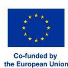

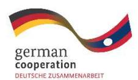

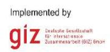

### **Published by the**

Deutsche Gesellschaft für Internationale Zusammenarbeit (GIZ) GmbH

Registered offices

Bonn and Eschborn, Germany

EUDR Engagement project (Engagement with Indonesia, Malaysia, Laos, Thailand and Vietnam to raise awareness on and to promote better understanding of the EU approach to reducing EU-driven deforestation and forest degradation)

Friedrich-Ebert-Allee 36+40

53113 Bonn, Germany

info@giz.de

www.giz.de/en

### **As at**

April 2025

### **Photo credits**

© GIZ/Vorlajuck Khantivong All rights reserved. Licensed to the European Union and the German Federal Ministry for Economic Cooperation and Development under conditions.

### **Authors**

Duangdaophet Keobounphanh, Keu Keomuanvong, Vorlajuck Khantivong, Jana Lemke (all GIZ/ProFEB), Peter Schwab (Consultant, Forestry and People GmbH)