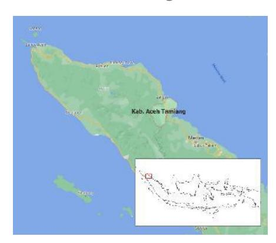
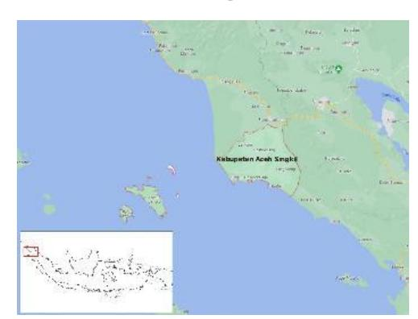
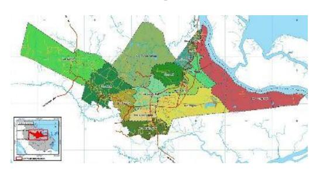
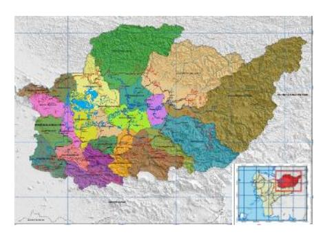
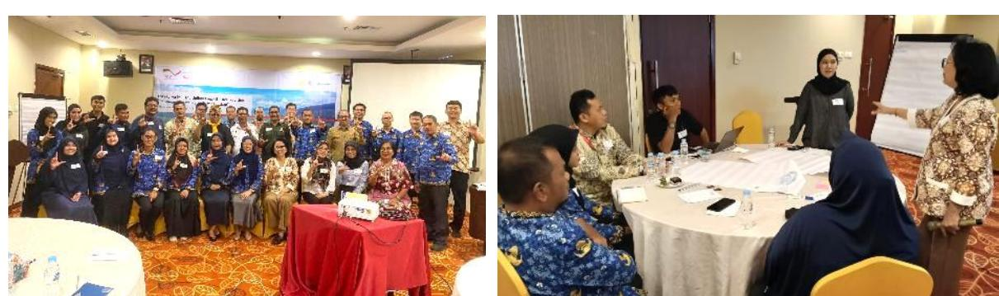
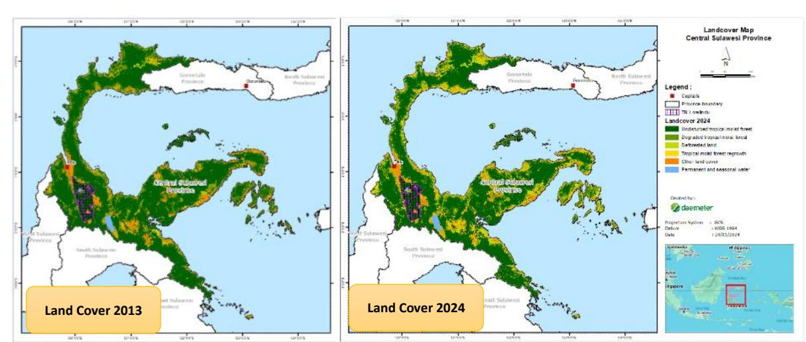
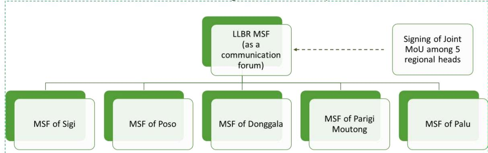
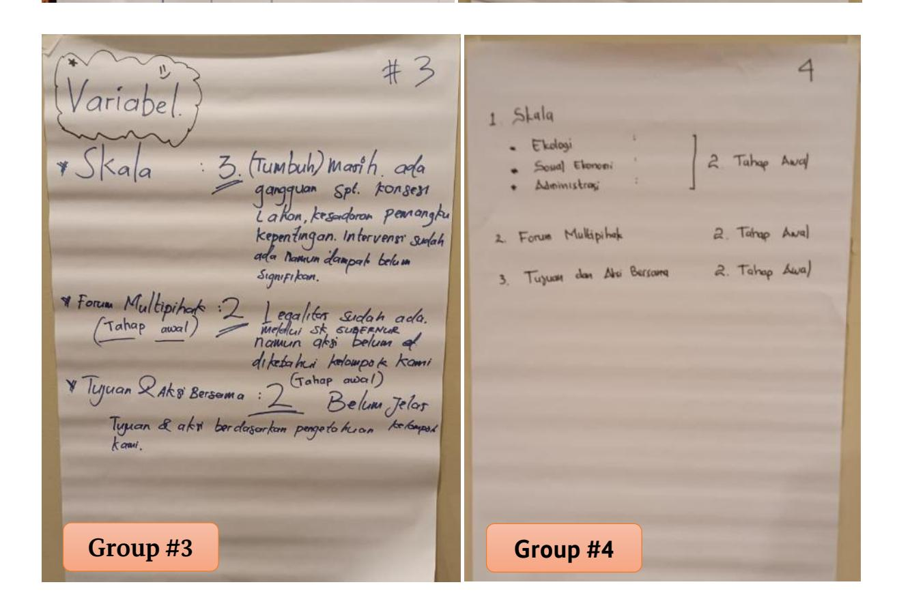
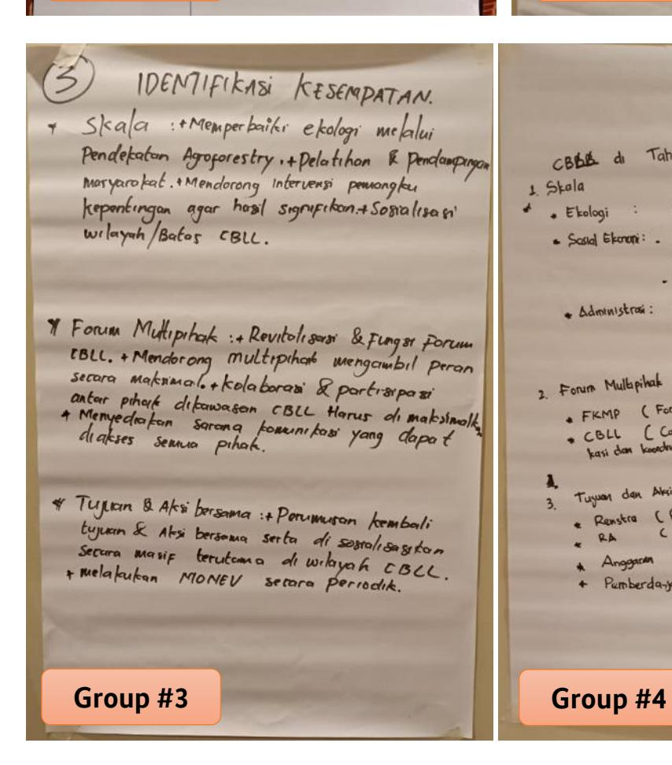

# **ASSESSMENT OF CHALLENGES AND SUCCESS FACTORS FOR LANDSCAPE INITIATIVES IN INDONESIA**

Version: 13th October 2025

### **Table of Contents**

| Acronym List | Executive Summary                                                                | 3 4                                                                              |
|--------------|----------------------------------------------------------------------------------|----------------------------------------------------------------------------------|
| 1.           | Introduction                                                                     | 5                                                                                |
| 1.1.         | Background                                                                       | 5                                                                                |
| 1.2.         | Assessment Objectives                                                            | 7                                                                                |
| 2.           | Methodology and Analytical Framework                                             | 7                                                                                |
| 2.1.         | Indicators of Landscape Maturity                                                 | 7                                                                                |
| 2.2.         | Assessment Criteria and Scoring Approach                                         | 9                                                                                |
| 2.3.         | Data Collection Methods                                                          | 10                                                                               |
| 2.4.         | Detailed Assessment of the Five Landscape Initiatives                            | 10                                                                               |
|              | Aceh Tamiang Landscape                                                           | 10                                                                               |
|              | Aceh Singkil Landscape                                                           | 14                                                                               |
|              | Siak Landscape                                                                   | 18                                                                               |
|              | Kapuas Hulu Landscape                                                            | 22                                                                               |
|              | Kutai Timur Landscape                                                            | 25                                                                               |
| 2.5.         | Cross-Landscape Comparative Analysis                                             | 28                                                                               |
| 3.           | Landscape Maturity Status of Lore Lindu Biosphere Reserve in Central Sulawesi    | 30                                                                               |
| 3.1.         | Pro½le and Background of Sustainability Efforts of the Landscape                 | 30                                                                               |
| 3.2.         | Multistakeholder Workshop of Lore Lindu Biosphere Reserve                        | 31                                                                               |
|              | 3.2.1. Stakeholder Understanding                                                 | 32                                                                               |
|              | 3.2.2. LLBR’s Challenges and Opportunities                                       | 32                                                                               |
|              | 3.2.3. Lessons from Five Landscape Initiatives in Indonesia and Context for LLBR | 33                                                                               |
|              | 3.2.4. Renewing Collective Commitment                                            | 33                                                                               |
| 3.3.         | Landscape Maturity Assessment Results of Lore Lindu Landscape Initiative         | 34                                                                               |
| 3.4.         |                                                                                  | Recommendation for Institutional Arrangements to Sustain the LLBR Sustainability |
|              | Agenda                                                                           | 35                                                                               |
| 4.           | Conclusion                                                                       | 36                                                                               |
| Annexes      |                                                                                  | 38                                                                               |
|              | Annex 1: Data collection tools                                                   | 38                                                                               |
|              | Annex 2: The First LLBR Stakeholder Workshop Documentations                      | 39                                                                               |

### **LIST OF TABLES**

| Table 1.  | Scoring Approach Defining Landscape Maturity Variables .............................................................. 9 |
|-----------|-------------------------------------------------------------------------------------------------------------------------|
| Table 2.  | Landscape Maturity Scoring Result of Aceh Tamiang Landscape Initiative ............................... 12               |
| Table 3.  | Key strengths and challenges of Aceh Tamiang, along with lessons relevant for LLBR .......... 13                        |
| Table 4.  | Landscape Maturity Scoring Result of Aceh Singkil Landscape Initiative ................................... 16           |
| Table 5.  | Key strengths and challenges of Aceh Singkil, along with lessons relevant for LLBR ............. 17                     |
| Table 6.  | Landscape Maturity Scoring Result of Siak Landscape Initiative .................................................. 20    |
| Table 7.  | Key strengths and challenges of Siak, along with lessons relevant for LLBR ............................. 21             |
| Table 8.  | Landscape Maturity Scoring Result of Kapuas Hulu Landscape Initiative .................................. 24             |
| Table 9.  | Key strengths and challenges of Kapuas Hulu, along with lessons relevant for LLBR............. 24                       |
| Table 10. | Landscape Maturity Scoring Result of East Kutai Landscape Initiative ..................................... 27           |
| Table 11. | Key strengths and challenges of East Kutai, along with lessons relevant for LLBR ............... 28                     |
| Table 12. | Success Factors and Common Challenges Across Landscape Initiatives.................................. 29                 |
| Table 13. | Landscape Maturity Scoring Result of LLBR Landscape Initiative .............................................. 34        |
| Table 14. | Success Factors and Challenges of LLBR Initiatives to be A Mature Landscape ..................... 34                    |

### **TABLE OF FIGURES**

*Disclaimer: This study was commissioned by GIZ SASCI+ (Sustainability and Value Added in Agricultural Supply Chains in Indonesia), funded by the BMZ, and conducted by Daemeter. The views and opinions expressed in this publication are those of the author and do not necessarily reflect the official policy or position of GIZ.*

## **Acronym List**

| Bappeda | Regional Planning and Development Agency                                    |
|---------|-----------------------------------------------------------------------------|
| CSL     | Coalition for Sustainable Livelihoods                                       |
| FKL     | Forum Konservasi Leuser or Leuser Conservation Forum                        |
| FORMIKA | Forum Multi Pihak Pembangunan Berkelanjutan or Multi-Stakeholder Forum for  |
| GIZ     | Deutsche Gesellschaft f¸r Internationale Zusammenarbeit                     |
| GFW     | Global Forest Watch                                                         |
| GRASS   | Greening Agricultural Smallholder Supply Chains                             |
| IDH     | The Sustainable Trade Initiative                                            |
| ISEAL   | International Social and Environmental Accreditation and Labelling Alliance |
| JA/ JI  | Jurisdictional Approach/ Jurisdictional Initiative                          |
| LASR    | Leuser Alas Singkil River Basin                                             |
| LA/ LI  | Landscape Approach/ Landscape Initiative                                    |
| LLBR    | Lore Lindu Biosphere Reserve                                                |
| LLNP    | Lore Lindu National Park                                                    |
| LTKL    | Lingkar Temu Kabupaten Lestari or Sustainable District Roundtable           |
| MSF     | Multi Stakeholder Forum                                                     |
| MSP     | Multi Stakeholder Platform                                                  |
| NGO     | Non-Government Organization                                                 |
| OPD     | Organisasi Perangkat Daerah or (Provincial or District) Government Offices  |
| PPI     | Production, Protection, and Inclusion                                       |
| PUPL    | Pusat Unggulan Perkebunan Lestari (PUPL) or Center of Excellence for        |
| RAN     | Rainforest Action Network                                                   |
| RPPLH   | Rencana Perlindungan dan Pengelolaan Lingkungan Hidup or Environmental      |
| SASCI+  | Sustainability and value-added in agricultural supply chains in Indonesia   |
| SPLP    | Siak Pelalawan Landscape Programme                                          |
| RSWR    | Rawa Singkil Wildlife Reserve                                               |
| TPDD    | Tim Pemantau Deforestasi Daerah or District Deforestation Monitoring Team   |
| UNESCO  | United Nations Educational, Scientific, and Cultural Organization           |
| WWF     | World Wildlife Fund                                                         |
| WRI     | World Resource Institute                                                    |

### **Executive Summary**

This assessment, commissioned by GIZ-SASCI+, evaluates the maturity of landscape initiatives in Indonesia, with a particular focus on the Lore Lindu Biosphere Reserve (LLBR) in Central Sulawesi. Its purpose is to understand the current stage of development across five landscapes, identify shared strengths and challenges, and provide practical recommendations to guide the advancement of LLBR and other initiatives toward greater impact.

The assessment applied five maturity indicators adapted from ISEAL and Proforest frameworks. These indicators include scale, multistakeholder forum, collective goals and actions, collective monitoring, and funding and strategy. A five-point scoring method was used to rate the maturity of each landscape. Data were collected through document reviews and interviews conducted in August and October 2025 with government agencies, NGOs, private sector representatives, community actors, and landscape implementers working in Aceh Tamiang, Aceh Singkil, Siak, East Kutai, Kapuas Hulu, and Lore Lindu.

Findings show that all five landscapes have clearly defined jurisdictional boundaries, which provide a strong territorial foundation for landscape approaches. Nonetheless, gaps remain in two critical areas: monitoring systems and sustainable financing. Among the cases assessed, Aceh Tamiang emerges as the most advanced, with strong multistakeholder coordination and the adoption of a Production-Protection-Inclusion Compact. Siak and Aceh Singkil also benefit from supportive policy frameworks and shared visions, although they remain heavily reliant on donor funding. East Kutai demonstrates growing momentum with local government backing but is still consolidating its stakeholder platform. In contrast, Kapuas Hulu remains at an initial stage, with activities driven by individual projects rather than systemic collaboration.

In Central Sulawesi, the Lore Lindu Biosphere Reserve remains at an early stage of maturity, with an overall score of 1.6. Its status as a UNESCO Biosphere Reserve and the issuance of a Governor's Decree to establish a multistakeholder forum provide an important foundation. However, coordination across five districts is challenging, the forum has not yet evolved into an effective multistakeholder collaboration body, and collective goals remain broad and unmeasurable. The absence of a joint monitoring system and heavy reliance on donor funding further limit progress. Without stronger governance and clearer operational mechanisms, LLBR risks remaining symbolic rather than achieving systemic impact.

To accelerate progress, LLBR needs to first define a feasible jurisdictional boundary as a working area. Moreover, it must strengthen governance by enabling its multistakeholder forum to function effectively, agree on measurable collective goals, and establish a shared monitoring framework to track both environmental and social outcomes. As current jurisdictional boundary spans five different districts, LLBR may need to identify priority working areas within strategic districts such as Sigi and Poso. It will also be essential to develop a diversified funding strategy that goes beyond donor contributions by embedding support from local government and the private sector. Drawing lessons from more mature landscapes such as Aceh Tamiang and Siak will be crucial for building resilient structures that balance ecological conservation with community livelihoods and sustainable land use.

## **1. Introduction**

### **1.1. Background**

Indonesia, the world's largest archipelago, is home to the planet's third-largest tropical forest after Brazil and Congo. Spanning more than 16,000 islands and stretching 5,200 kilometres across the Pacific and Indian Oceans, most of Indonesia's forests are concentrated on four major islands: Borneo, Sumatra, Sulawesi, and Papua. The country's economy relies heavily on natural resource extraction and has expanded rapidly, averaging over 5% annual growth since 2000 (Indonesia Investments, 2025)1 [.](#page-5-2)  Key sectors include resource extraction, such as oil, gas, and mining as well as land-based commodities like oil palm, agriculture, and forestry. Alongside this growth, rising population and affluence have driven greater domestic demand for these resources. This reliance on resource-based development presents a critical challenge for Indonesia: how to safeguard its rich ecosystems and natural resources while pursuing ambitious economic and development goals.

In response, many businesses have adopted an array of voluntary sustainability governance systems to help them strengthen their management of social and environmental risks, driven initially by external pressures and increasingly by internal compliance efforts. However, voluntary systems have faced growing criticism for their limited impact, particularly in failing to drive transformative change beyond the directly regulated supply chains. This has spurred a shift from narrow supply chain-focused social responsibility and certification efforts toward broader multi-stakeholder programs and partnerships designed to promote systemic change in sustainable commodity production within specific jurisdictions. This emerging approach is widely recognized as jurisdictional or landscape initiatives.

Landscape initiative (LI) approach or also known as jurisdictional approach (JA) or initiative, is starting to receive many attentions from donors, companies, civil societies and others between 2016-2018. Due to their similarity in the concept and activities, many practitioners will use the abbreviations of L/JI for the short of Landscape/ Jurisdictional Initiative. However, there are number of definitions for LI trying to address the dynamic and complex challenges in a landscape. Although there may be diverse understandings about LIs amongst those working on sustainable land use, in general, a common understanding has begun to emerge among LI practitioners (Seymour et al., 2020[\)](#page-5-3) 2 . Key components of it include:

- A multi-stakeholder process to address the complex drivers of unsustainable land use (and especially deforestation) and other shared objectives, with monitoring of results in order that efforts can be adapted;
- Formation of a locally-led coalition to drive the JA forward, since those actors embedded in the jurisdiction will best be able to understand local needs and how best to balance the environmental, social, and economic objectives;

1 Indonesia Investments. (2025). *Produk domestik bruto Indonesia*. Indonesia-Investments. Available at: https://www.indonesia-investments.com/id/keuangan/angka-ekonomi-makro/produk-domestik-brutoindonesia/item253

Seymour, F., Aurora, L., & Arif, J. (2020). The jurisdictional approach in Indonesia: Incentives, actions, and facilitating connections. **Frontiers in Forests and Global Change, 3**, Article 503326. https://doi.org/10.3389/ffgc.2020.503326

- Leadership by sub-national government, at least in terms of supporting the multi-stakeholder process to agree on long term objectives and then collaborate, and then sustaining the vision over time, and embedding it into local policy;
- An effort to align the planning of production and protection areas with policy improvements, market incentives and climate finance (Pacheco et al. 2018)3 [,](#page-6-0) so that comprehensive action is sufficiently incentivized.

The landscape approach rests on the premise that no single approach, technology, intervention, or policy instrument alone can deliver transformative change. Design documents of many landscapes and jurisdictional initiative (L/JI) programs highlight that interventions are interconnected and that their effectiveness depends on being implemented together. Yet, there has been little systematic analysis of how each pathway within L/JIs is expected to enable, reinforce, or amplify the functioning of the others.

Building on the key components of L/JIs outlined above, similar features are evident in Indonesia's early landscape initiatives initiated around 2015-2016, notably in Aceh Tamiang (Aceh Province) and Musi Banyuasin (South Sumatra Province). Both initiatives emerged from the Verified Sourcing Area (VSA) concept promoted by IDH, a Netherlands-based NGO. The VSA program seeks to expand sustainability impacts beyond individual companies or supply chains, primarily in palm oil and to some extent, rubber. In Musi Banyuasin, the primary environmental challenge addressed was forest fires linked to commodity expansion, while in Aceh Tamiang the focus was on protecting High Conservation Value (HCV) and High Carbon Stock (HCS) areas within the Leuser Ecosystem. Both districts pursued coalition-building and collaborative governance through multi-stakeholder arrangements supported by strong coordination with regional governments. Since then, numerous additional landscape initiatives have been established, including the Siak Pelalawan Landscape Programme (SPLP), the Coalition for Sustainable Livelihoods (CSL), the Leuser Alas-Singkil River Basin (LASR), the Sustainable Landscape Initiative in Kutai Timur (SUSTAIN KUTIM), among others.

Despite their promise, landscape initiatives are often characterized by fragmented interventions, varying levels of government engagement, and uneven progress in coalition building, collaborative governance and resource mobilization. The effectiveness of these initiatives depends not only on the adoption of sustainability practices by companies but also on the strength of regional government leadership, policy alignment, and the ability of stakeholders to work collectively toward shared goals.

In this context, a landscape maturity assessment is needed to provide a structured understanding of where different initiatives stand in their development. Assessing maturity helps identify strengths and gaps in existing governance, coordination, and implementation processes. It also enables benchmarking of progress across different landscapes, allowing lessons from one initiative to inform and accelerate progress in others. Furthermore, maturity assessments clarify pathways for scaling impact by showing how interventions can move beyond isolated activities toward systemic change. They also help guide investment and policy support, ensuring that resources are targeted to areas where they can most effectively address challenges and unlock opportunities.

3 Pacheco, P., Schoneveld, G. C., Dermawan, A., Komarudin, H., & Djama, M. (2018). Governing sustainable palm oil supply: Disconnects, complementarities, and antagonisms between state regulations and private standards. *Regulation & Governance, 14*(3), 568–598. https://doi.org/10.1111/rego.12220

### **1.2. Assessment Objectives**

This report presents a rapid assessment of the maturity of several landscape initiatives in Indonesia, with a particular focus on the Lore Lindu Biosphere Reserve initiative in Central Sulawesi. The assessment aims to (i) determine the current maturity status of five different landscape initiatives as a learning reference for the Lore Lindu initiative, (ii) identify challenges and opportunities for accelerating the maturity of the Lore Lindu initiative, and (iii) provide specific recommendations for action. The overall goal is to assess challenges and success factors influencing landscape initiatives in Indonesia. In August 2025, the team conducted interviews with landscape implementors of GIZ-SASCI+ working in East Kutai, GIZ-GRASS in Kapuas Hulu; Forum Konservasi Leuser in Aceh Tamiang; SwissContact in Aceh Singkil & Subulussalam; and Daemeter's resources working in Siak & Pelalawan. Additionally, the interview was also conducted with diverse stakeholders connected to the Lore Lindu Biosphere Reserve initiative in Central Sulawesi including GIZ-SASCI+ local team, private sector representatives, non-governmental organizations, and government agencies. This assessment was commissioned and funded by the Deutsche Gesellschaft f¸r Internationale Zusammenarbeit (GIZ) GmbH under the project "Sustainability and Value Added in Agricultural Supply Chains in Indonesia" (SASCI+).

## **2. Methodology and Analytical Framework**

### **2.1. Indicators of Landscape Maturity**

In Q4 2024, ISEAL together with its coalition of organizations published a set of Core Criteria for Mature Landscape Initiatives (ISEAL, 2024[\)](#page-7-3)4 to assess the effectiveness and maturity of a landscape initiative. The core criteria consist of four criteria of scale, multi-stakeholder governance process or platform; collective goals and actions; and collective monitoring. At a later stage, Proforest, through its Landscape Blueprint (Proforest, 2024) [5](#page-7-4) , assessed that Funding & Strategy is another essential component for delivering sustained outcomes.

In total, this study refers to a set of five criteria to assess the effectiveness and maturity of the Lore Lindu initiative. Although landscape initiatives may follow different paths to develop these criteria and sub-criteria over time, those that are more mature and have these elements in place are likely to be more resilient, more appealing to investors, and better equipped to achieve lasting sustainability impacts within the landscape. The five criteria signaling the maturity of a landscape initiative are explained as follows:

#### **A. Scale**

A landscape initiative should operate at a scale of defined ecological, socioeconomic, or administrative area that allows it to influence the systemic conditions underlying its sustainability goals. This includes the ability to engage in processes such as land-use planning or policy reform that shape the broader

4 ISEAL Alliance. (2024). Core Criteria for Mature Landscape Initiatives (2024). ISEAL Alliance. Retrieved [Access Date], from https://www.isealalliance.org/get-involved/resources/core-criteria-mature-landscape-initiatives-2024

5 Proforest. (2025, June 19). A Blueprint for Resilient Landscape Initiatives. Retrieved [Access Date], from https://www.proforest.net/news-and-events/news/the-blueprint-for-mature-landscape-initiatives/

context of sustainability within the landscape. Additionally, the initiative's scale supports coherent, area-level management that is guided by a multistakeholder governance process, ensuring that diverse interests are aligned and collaboratively addressed.

#### **B. Multistakeholder Forum**

A landscape initiative should have a governance mechanism through a multi-stakeholder platform that holds decision-making authority over its design, implementation, and monitoring. This platform ensures the active involvement of key stakeholders across the landscape, with a strong focus on including local community representatives. It plays a central role in defining and guiding the initiative's collective goals and actions, while also engaging directly with local governments to align efforts with progressive priorities and policies at local, sub-national, and national levels. The platform operates through clear and transparent procedures that enable effective and inclusive stakeholder participation. It also serves as a coordinating body for actions and monitoring within the landscape. To promote accountability and minimize risks, the platform implements safeguards, including grievance mechanisms, that help prevent adverse human rights and environmental impacts, while enhancing positive outcomes for both people and nature.

#### **C. Collective Goal and Actions**

Stakeholders involved in the landscape initiative should jointly agree on a set of long-term, landscapelevel sustainability impact goals, along with a collective action plan to achieve them. These sustainability goals are rooted in a comprehensive context analysis that examines current landscape conditions and captures stakeholder priorities. They are designed to address social, environmental, and economic dimensions, ensuring a holistic and inclusive approach to sustainability. Each goal is accompanied by measurable indicators, baseline data, and clearly defined short- and medium-term milestones to guide implementation and track progress. To maintain relevance and responsiveness, the goals are regularly reviewed and revised in line with changes in the landscape context.

The collective action plan will serve as a roadmap for reaching these goals through long-term, systemic solutions that can be embedded in local governance frameworks. It reflects the diversity of land-use types and commodities within the landscape, ensuring that strategies are tailored to local realities. Developed through inclusive stakeholder engagement, the plan outlines specific actions and approaches needed to achieve the agreed milestones. It is made publicly available to promote transparency and accountability, and it is updated regularly to reflect progress, new challenges, and shifts in funding.

#### **D. Collective Monitoring**

The landscape initiative develops a collective monitoring and reporting framework that supports the assessment and communication of progress toward its shared sustainability impact goals. This framework includes a locally validated baseline assessment of ecological and socio-economic conditions, establishing a foundation for measuring change over time. It incorporates activity monitoring to track the implementation of actions outlined in the collective action plan, as well as performance monitoring at the landscape level against defined metrics and milestones. All monitoring activities are underpinned by robust, transparent reporting practices that promote accountability, build stakeholder trust, and support informed decision-making.

#### **E. Funding & Strategy**

The landscape initiative includes a structured approach to ensure long-term sustainability, beginning with a comprehensive mapping of local human resource needs. This process identifies the skills, expertise, and institutional capacities required to effectively implement and manage the initiative's activities. It also informs targeted capacity-building programs aimed at empowering local communities, organizations, and government actors to take active roles in sustaining progress over time.

In parallel, a mapping of potential funding sources is conducted to support the achievement of its sustainability goals. This includes identifying opportunities across public and private sectors, such as government funding, donor grants, private sector contributions, and innovative finance mechanisms. By building a diverse and stable financial foundation, the target is to reduce dependency on shortterm external funding and ensure its long-term resources to support the landscape initiatives.

### **2.2. Assessment Criteria and Scoring Approach**

To assess the maturity of landscape initiatives, a five-point scoring method has been applied. This approach is intended to provide a structured yet practical way of gauging the level of development across key elements of landscape initiatives. The scoring scale is defined as follows:

**Table 1.** Scoring Approach Defining Landscape Maturity Variables

| Score | Category      | Explanation or Remark(s)                                                         |
|-------|---------------|----------------------------------------------------------------------------------|
| 1     | Non-existent  | The element under assessment does not exist or there is no evidence of its       |
| 2     | Initial Stage | The element exists but remains in the very early phase of growth, with limited   |
| 3     | Emerging      | The element exists with moderate progress or commitment. Initial actions are     |
| 4     | Established   | The element has been consistently in place for several years. Steady progress is |
| 5     | Mature        | The element is fully developed and functioning independently. Clear systems      |

*Source: Daemeter's Analysis, 2025*

It is important to note that, at present, **no official guidance on scoring methods has been issued by the organizations that established the concept of landscape maturity assessment**. The scoring framework outlined above has therefore been developed by the assessment team specifically to assist the GIZ-SASCI+ team and local stakeholders in Central Sulawesi. Its purpose is to facilitate a better understanding of the maturity status of other landscape initiatives in Indonesia, including the Lore Lindu Biosphere Reserve initiative in Central Sulawesi.

This method should not be interpreted as a standardized benchmark but rather as a facilitative instrument. It is designed to guide discussions, assist shared understanding among stakeholders, and provide a comparative perspective across different landscape initiatives.

### **2.3. Data Collection Methods**

In August and October 2025, the team conducted interviews with landscape stakeholders of district governments and project implementors of GIZ-SASCI+ working in East Kutai, GIZ-GRASS in Kapuas Hulu; Forum Konservasi Leuser, IDH and PUPL in Aceh Tamiang; SwissContact in Aceh Singkil & Subulussalam; and Daemeter's resources working in Siak & Pelalawan, as well as Lingkar Temu Kabupaten Lestari working in paralel in Aceh Tamiang, Siak, Kapuas Hulu, and Sigi. In addition, the team carried out a review of documents relevant to each landscape. These included the delineation of the working area to establish scale, the legal foundation underpinning multistakeholder arrangements, the formulation of the landscape vision and objectives for sustainable development along with the corresponding action plan, the establishment of a monitoring mechanism supported by a baseline study to track progress, and the development of a funding strategy to identify innovative financing options supported by an adequate talent pool.

Specifically, interviews were conducted with a diverse range of stakeholders engaged in the Lore Lindu Biosphere Reserve initiative in Central Sulawesi, including the GIZ-SASCI+ local team, private sector representatives, non-governmental organizations, and government agencies. In parallel, the team reviewed relevant documents to assess the landscape maturity elements present within the Lore Lindu initiative, drawing comparisons and lessons from the experiences of the other five landscape initiatives.

### **2.4. Detailed Assessment of the Five Landscape Initiatives**

The following section presents a detailed assessment of each landscape, beginning with the Aceh Tamiang Landscape Initiative, followed by Aceh Singkil, Siak, the Kapuas Hulu landscape, and East Kutai. The sequence of presentation does not reflect the relative maturity level of the initiatives but is arranged geographically, from the western to the eastern part of Indonesia.

#### **Aceh Tamiang Landscape**

#### **1. Profile and Background of Sustainability Efforts of the Landscape**

Aceh Tamiang (*source of map: Perkim, 2023* [6](#page-10-3) ), spanning approximately 195,000 hectares, lies on the eastern edge of Aceh Province and forms a vital corridor with the Leuser Ecosystem, one of Southeast Asia's last intact rainforests (IDH

6 Perkim. (2023, April 19). Profil PKP Kabupaten Aceh Tamiang. Perkim. [https://perkim.id/profil-pkp/profil](https://perkim.id/profil-pkp/profil-kabupaten-kota/profil-perumahan-dan-kawasan-permukiman-kabupaten-aceh-tamiang/)[kabupaten-kota/profil-perumahan-dan-kawasan-permukiman-kabupaten-aceh-tamiang/](https://perkim.id/profil-pkp/profil-kabupaten-kota/profil-perumahan-dan-kawasan-permukiman-kabupaten-aceh-tamiang/) 

– The Sustainable Trade Initiative, 202[5](#page-11-0)7 ). Much like other parts of Aceh, the district has faced strong economic and political pressures since the 2005 peace agreement ending the Free Aceh Movement. With declining oil and gas reserves and the end of post-tsunami reconstruction, Aceh's leaders faced mounting economic pressures, including the need to expand smallholder livelihoods for excombatants while simultaneously addressing the ongoing degradation of forest ecosystems.

Deforestation pressures intensified during the 2000s and 2010s, as palm-oil supply chains, dominated by local companies, contributed to clearing of high conservation value areas. Advocacy campaigns by organizations such as Greenpeace, Rainforest Action Network, and the Leuser Conservation Forum highlighted illegal deforestation, pushing global buyers like Unilever, PepsiCo, Wilmar, and Musim Mas to suspend sourcing from non-compliant suppliers, including Mopoli Raya, a politically connected local company.

Further momentum developed in 2017 when the pro-environment Governor candidate, Yusuf was reelected governor and revived the policy of Green Aceh. At the same time, Aceh Tamiang elected a new district head with no personal ties to palm oil businesses and a professional background in legalizing smallholder land tenure. These political changes catalysed a series of governance reforms in 2018, including a moratorium on palm oil expansion, a review of existing licenses, membership in the Lingkar Temu Kabupaten Lestari (LTKL) network, and a memorandum of understanding with Earthworm Foundation. The same year, the Coalition for Sustainable Livelihoods was launched, designating Aceh Tamiang as a pilot district for sustainable smallholder commodity production. With support from IDH (the Sustainable Trade Initiative), a broad stakeholder in Aceh Tamiang signed a Production, Protection, and Inclusion Compact that commits to protecting remaining forests in Leuser, securing smallholder livelihoods, and improving supply chain transparency.

#### **2. Landscape Maturity Assessment Results of Aceh Tamiang Landscape Initiative**

The landscape initiative in Aceh Tamiang is managed by a multi-stakeholder forum called the *Pusat Unggulan Perkebunan Lestari* (PUPL) or the Center of Excellence for Sustainable Plantation. The forum was formally established through a Regent Decree in 2019 and later revised in 2022. Among all landscape initiatives, the MSF in Aceh Tamiang stands out as one of the most distinctive. It was formed not only as a coordination platform but also to directly implement projects, supported by a competent team capable of managing field activities and engaging with multiple stakeholders.

However, during its early phase, all PUPL members were from non-governmental elements, which limited effective synergy with the Aceh Tamiang District Government. To address this, in 2022 the PUPL daily management team was restructured to include a combination of two government officials (from OPDs) and three professionals. This combination significantly improved coordination and contributed to the positive progress of the landscape initiative. Unlike other MSFs that mainly serve as coordination platforms, where development partners contribute primarily to meeting logistics, PUPL in Aceh Tamiang has managed its own funding. Although its funding still comes from Unilever through the Leuser Conservation Forum, PUPL operates with a dedicated structure: a five-person management team overseeing both managerial and field teams, totalling around 30 members. The Sustainable Districts Association (LTKL) also supports PUPL by funding two administrative/convener

7 IDH – The Sustainable Trade Initiative. (2025). Aceh Tamiang. SourceUp. Retrieved from <https://sourceup.org/initiatives/aceh-tamiang>

staff positions. In addition to PUPL, Aceh Tamiang also forms a deforestation monitoring team where members of both MSFs are mostly overlapping.

The MSF in Aceh Tamiang benefits from strong private sector engagement, particularly from palm oil producers. Participation by global corporations is largely driven by their NDPE commitments and the need to uphold a positive corporate reputation amid increasing global scrutiny. Companies involved in the Consumer Goods Forum's Forest Positive Coalition (CGF-FPC), such as Unilever and PepsiCo, have set even more ambitious targets related to forest protection and greenhouse gas emission reductions within their supply chains.

To establish a common goal, IDH facilitated the signing of an MOU between the Aceh Tamiang District Government and multiple stakeholders, which was further detailed in a document known as the Production, Protection, and Inclusion (PPI) Compact. The PPI Compact, serving as a shared reference among stakeholders, is well-aligned with Aceh Tamiang's Regional Medium-Term Development Plan (RPJMD) and its Sustainable Palm Oil Action Plan. The MSF has also developed a five-year roadmap outlining its key targets. However, aside from historical data on deforestation rates, there is no other baseline information available to guide the measurement of landscape performance. This gap exists primarily because both the donor and PUPL have been working on a project-based approach, focusing on specific targets without fully considering the broader baseline conditions of the entire Aceh Tamiang landscape. The MSF has applied a monitoring mechanism through periodic meeting to discuss workplan achievement as well as the deforestation monitoring platform developed by WRI.

Another notable advancement in Aceh Tamiang is its preparation for establishing long-term funding sources. PUPL has developed a strategic plan for fundraising aimed at building sustainable financial resources. Some potential options already explored include: charging management fees for facilitating connections between RSPO-certified smallholders and RSPO-certified mills (with companies paying the fees as they benefit from EUDR compliance through the RSPO-IP system); serving as a training center for a cocoa academy; and generating income from the sale of non-timber forest products (NTFPs) such as coffee, cocoa, and aromatic or essential oils. However, these strategies have yet to be implemented due to lacking competent human resources to realize all these plans. At present, the operational costs of PUPL, TPDD, and other related entities remain largely dependent on donor funding. The district government also provides in-kind support, such as free office space, to help sustain operations.

Overall, Aceh Tamiang demonstrates a high level of maturity in terms of institutional arrangements, stakeholder collaboration, and shared vision for sustainable development. The existence of a clear jurisdictional boundary, a well-functioning MSF, and a formalized PPI Compact are notable strengths that place the district among the more advanced landscape initiatives in Indonesia. However, challenges remain, particularly in relation to establishing a comprehensive baseline for monitoring and operationalizing funding strategies. The detailed assessment of the Aceh Tamiang landscape against five key maturity elements is explained as follows:

**Table 2.** Landscape Maturity Scoring Result of Aceh Tamiang Landscape Initiative

| Variable     | Score | Category | Explanation or Remark(s)                                                                                                                                                |
|--------------|-------|----------|-------------------------------------------------------------------------------------------------------------------------------------------------------------------------|
| <b>Scale</b> | 5     | Mature   | The jurisdictional boundary has been clearly defined which aligns exactly with Aceh Tamiang administrative area. Nevertheless, the multistakeholder forum (MSF) in Aceh |

| Variable      | Score | Category      | Explanation or Remark(s)                                    |
|---------------|-------|---------------|-------------------------------------------------------------|
|               | 5     | Mature        | The MSF in Aceh Tamiang has been formally established       |
|               |       |               | through a Regent’s Decree and is officially named the Pusat |
|               |       |               | Unggulan Perkebunan Lestari (PUPL) or Center of             |
|               |       |               | Excellence for Sustainable Plantation. The forum is         |
|               |       |               | supported by a non-and-civil-servant governance             |
|               | 5     | Mature        | A shared vision for the landscape has been articulated      |
|               |       |               | Compact. This document was developed through a              |
|               |       |               | strategic foundation for coordinated action among           |
|               | 3     | Emerging      | The landscape initiative implements a monitoring            |
|               | 2     | Initial Stage | The PUPL has prepared a strategic plan for fundraising to   |
| Average Score | 4     | Established   |                                                             |

In summary, the key strengths and challenges of Aceh Tamiang, along with lessons that are particularly relevant for the Lore Lindu Biosphere Reserve, are outlined in the table below.

**Table 3.** Key strengths and challenges of Aceh Tamiang, along with lessons relevant for LLBR

| Variable Summary | Elaboration                                 |
|------------------|---------------------------------------------|
| Key strengths 1) | Clear jurisdictional boundary               |
| 2)               | A well-functioning MSF                      |
| 3)               | A formalized PPI Compact as collective goal |

| Variable Summary Elaboration                                         |                                                      |
|----------------------------------------------------------------------|------------------------------------------------------|
| Key challenges 1)                                                    | Establishing a comprehensive baseline for monitoring |
| 2)                                                                   | Operationalizing funding strategies                  |
| multistakeholder forum supported by non-and-civil-servant governance | to                                                   |

#### **Aceh Singkil Landscape**

#### **1. Profile and Background of Sustainability Efforts of the Landscape**

Aceh Singkil District (*source of map: Perkim, 2023* [8](#page-14-1) ), covering about 187,000 hectares, is situated on the southwestern coast of Aceh Province and forms part of the broader Leuser Ecosystem. Despite its relatively modest size, the district harbours some of the most ecologically important landscapes in Sumatra, including extensive peat-swamp forests. Satellite monitoring shows that between 2001 and 2024, Aceh Singkil experienced a significant level of deforestation, with about 95% of all tree-cover loss linked to permanent land-use change

rather than temporary disturbance.

At the heart of Aceh Singkil lies the Rawa Singkil Wildlife Reserve (RSWR), spanning around 82,000 hectares of peat-swamp forest. The reserve's peat layers reach depths of more than seven meters and form one of Sumatra's most intact peat ecosystems, storing vast amounts of carbon while supporting hydrological stability. However, recent assessments highlight growing pressures: between 2022 and 2023, new peat-drainage canals were cut through the reserve (about 26 km in 2023, up from 9 km the previous year), enabling palm-oil expansion and accelerating forest clearance (Mongabay, 202[3](#page-14-2)9 ).

This deforestation is particularly alarming because the loss is concentrated in natural forest areas, with about one-third of all recent loss (2021–2024) occurring within intact natural forest. NGOs and academic studies report that illegal palm-oil development, combined with weak enforcement, has driven much of this damage (Global Forest Watch, 2024c [10](#page-14-3); Environmental Investigation Agency,

8 Perkim. (2023, April 19). Profil PKP Kabupaten Aceh Singkil. Perkim. [https://perkim.id/profil-pkp/profil](https://perkim.id/profil-pkp/profil-kabupaten-kota/profil-pkp-kabupaten-aceh-singkil/)[kabupaten-kota/profil-pkp-kabupaten-aceh-singkil/](https://perkim.id/profil-pkp/profil-kabupaten-kota/profil-pkp-kabupaten-aceh-singkil/) 

9 Mongabay. (2023). New peat-drainage canals drive deforestation in Rawa Singkil. Retrieved from [https://news.mongabay.com](https://news.mongabay.com/) 

10 Global Forest Watch. (2024c). Tree cover loss in natural forest, Aceh Singkil. World Resources Institute. Retrieved from [https://www.globalforestwatch.org](https://www.globalforestwatch.org/) 

2024[11](#page-15-0); Rainforest Action Network, 2023[12](#page-15-1)). Aceh Singkil is an important source of palm oil which has around 77,512 hectares of oil palm plantation and 23 palm oil mills.

In 2024, a broad coalition of stakeholders in Aceh Singkil, including the district government, the Forest Management Unit, palm oil companies (Apical and Musim Mas), IDH, the Leuser Conservation Forum, Swisscontact, Earthworm Foundation, Koltiva, and local farmer associations, signed a memorandum of understanding (MoU) outlining a shared landscape vision for sustainable palm oil production from 2024 to 2026. The MoU is built on three key pillars: protecting critical ecosystems within the Rawa Singkil Wildlife Reserve (RSWR) and the Leuser Ecozone, promoting sustainable palm oil production through improved productivity and land tenure, and strengthening social dialogue between companies and workers.

#### **2. Landscape Maturity Assessment Results of Aceh Singkil Landscape Initiative**

The Multi-Stakeholder Forum (MSF) in Aceh Singkil was established through the Regent's Decree in 2024 as a collaborative platform to coordinate and align development efforts across multiple development partners operating in the district. Its creation was driven by the need to synergize program resources, avoid duplication, and prevent disputes or claims among development partners. From its inception, the MSF positioned itself as a bridge between various actors, such as government agencies, NGOs, private sectors, and communities, to support shared ownership of green development goals in the district.

The MSF includes diverse members, comprising development partners, relevant local government agencies (OPDs), private sectors, and universities. The participation of these actors ensures that both technical and policy aspects are addressed within the forum. The involvement of companies also signifies the private sector's growing interest in collaborative landscape management, particularly after realizing that independent operations often faced field-level challenges and negative community perceptions. Operationally, the MSF functions as a coordination and communication hub. It enables continuous dialogue among members through both formal and informal channels, including a WhatsApp group for real-time communication. This has enhanced transparency, trust-building, and information sharing. OPDs, private sectors, and NGOs use the platform to discuss activity alignment and avoid program overlaps, while the private sector benefits from collective problem-solving and reputational support when facing community concerns. MSF in Aceh Singkil benefits from strong private sector engagement, e.g., Apical and Musim Mas. Their engagement extends directly to their supply bases, which play a key role in translating global sustainability commitments into action on the ground.

The landscape agenda being the common vision among stakeholders is well-aligned with Aceh Singkil's Regional Medium-Term Development Plan (RPJMD), particularly its targets on environmental quality and deforestation rate reduction. The forum also refers to the Regional Action Plan for Sustainable Palm Oil (RAD-KSB) and the multi-stakeholder MOU "Landscape Vision 2024", ensuring

11 Environmental Investigation Agency. (2024). Illegal deforestation in Rawa Singkil Wildlife Reserve. Retrieved from [https://eia-international.org](https://eia-international.org/)

12 Rainforest Action Network. (2023). Palm oil and deforestation in Aceh Singkil. Retrieved from [https://www.ran.org](https://www.ran.org/) 

coherence between local development priorities and broader sustainability goals. This alignment strengthens the MSF's legitimacy as a mechanism supporting the district's green development vision.

To monitor the achievement of landscape targets, Aceh Singkil develops a platform so-called the landscape improvement dashboard, which outlines targets and KPIs related to three major thematic areas: palm oil, coastal tourism, and environment/forestry. Current advance development is only for the palm oil theme. The dashboard, developed collaboratively and refined through series of workshops, serves as a tool for performance tracking and evidence-based decision-making. Although still in its early stages, it holds strong potential to become a central repository of landscape data, supporting the district government's reporting to provincial and national authorities. Yet, this program faces challenges on data sharing mechanism and data security. Additionally, some private sector members perceive a potential conflict of interest with Koltiva, the developer and data host, since Koltiva also serves as a client to other companies. The signing of an NDA is unable to resolve this underlying trust issue. In addition to landscape improvement dashboard, in the near future, Aceh Singkil is also developing a deforestation monitoring mechanism, through near-real time monitoring platform along with the deforestation monitoring team.

The district government has demonstrated strong commitment to the MSF by providing office space and covering meeting logistics. Development partners complement this support by funding relevant field activities aligned with their program objectives and often sharing costs for meetings and resource persons. To ensure long-term sustainability, Aceh Singkil government and partners plan to establish a mechanism within the next four years to gradually assume coordination of the forum by a group of professionals. However, they are still unclear how the specific form and process of this transition would look like.

Overall, the landscape initiative in Aceh Singkil has established a solid foundation with clearly defined jurisdictional boundaries and the formalization of a multistakeholder forum (MSF) through a Regent's Decree in 2024. Despite its early stage, the MSF has demonstrated commitment by securing office space from Bappeda and fostering collaboration among stakeholders. A shared vision for sustainable palm oil, known as *Visi Lanskap*, has been developed through an MoU and is aligned with the district's regional development plan and sustainable palm oil action plan. Progress on collective monitoring is underway with the launch of the Landscape Improvement Dashboard, although it remains in an initial phase. However, operational sustainability remains a key challenge, as activities still depend heavily on NGO funding with only in-kind support from the district government. The detailed assessment of the Aceh Singkil landscape against five key maturity elements is explained as follows:

**Table 4.** Landscape Maturity Scoring Result of Aceh Singkil Landscape Initiative

| Variable | Score | Category | Explanation or Remark(s)                                     |
|----------|-------|----------|--------------------------------------------------------------|
| Scale    | 5     | Mature   | The jurisdictional boundary in Aceh Singkil has been clearly |
|          | 3     | Emerging | The MSF in Aceh Singkil was formally established in 2024     |

| Variable      | Score | Category | Explanation or Remark(s)                                        |
|---------------|-------|----------|-----------------------------------------------------------------|
|               |       |          | of building strong multi-stakeholder collaboration and          |
|               | 5     | Mature   | A joint Memorandum of Understanding (MoU) has been signed       |
|               |       |          | Swisscontact, the MSF has developed a comprehensive             |
|               |       |          | regional action plan on sustainable palm oil, thereby           |
|               | 2     | Initial  |                                                                 |
|               | 1     | Non     |                                                                 |
|               |       |          | poses challenges for the long- term sustainability of the MSF’s |
| Overall Score | 3.2   | Emerging |                                                                 |

In summary, the key strengths and challenges of Aceh Singkil, along with lessons that are particularly relevant for the Lore Lindu Biosphere Reserve, are outlined in the table below.

**Table 5.** Key strengths and challenges of Aceh Singkil, along with lessons relevant for LLBR

| Variable Summary  | Elaboration                                                |
|-------------------|------------------------------------------------------------|
| Key strengths 1)  | Clear jurisdictional boundary                              |
| 2)                | A shared vision through a joint MoU                        |
| Key challenges 1) | Operationalizing the newly established monitoring platform |
| 2)                | Reducing reliance on donor funding                         |

#### **Siak Landscape**

#### **1. Profile and Background of Sustainability Efforts of the Landscape**

Siak District (*source of map: Siak Pelalawan Landscape Programme, 2020* [13](#page-18-1) ) spans approximately 858,000 hectares, of which over 57% (about 490,000 hectares) comprises peatland ecosystems, a dominant landscape feature shaping its ecology and land use (Pantau Gambut, n.d.-a)[14](#page-18-2). These peatlands form part of the broader Giam Siak Kecil-Bukit Batu Biosphere Reserve, a UNESCO-

recognized area of roughly 705,000 hectares that includes significant portions of Siak District. It features core areas like the Giam Siak Kecil and Bukit Batu Wildlife Reserves, all under peat-dominated terrain that shelters globally threatened species such as the Sumatran elephant and tiger (BSI LHK, 2023)[15](#page-18-3) .

Deforestation and peat degradation in Siak District have been significant. In the wider region, peat swamp forest coverage in Riau Province plummeted from 80% in 1990 to 24% by 2015, largely due to expansion of oil palm, acacia pulp plantations, and agriculture (Page et al., 2019)[16](#page-18-4). Within Siak District specifically, approximately 383,000 hectares or 80% of its peatlands have been degraded due to illegal logging, fires, and conversion to plantations, particularly in areas like the Zamrud National Park ecosystem and village-managed forest tracts (Pantau Gambut, n.d.-b)[17](#page-18-5) .

Siak government has enacted the "Green Siak" regulation, zoning land for conservation and enforcing restrictions on peatland conversion and palm-planting practices, such as requiring that existing peatland plantations keep peat wet, and involving NGOs through the local "Siak Brotherhood" coalition (note; largely known in its Indonesian term: *Sedagho Siak*). The initiative emerged in response to the catastrophic 2015 forest and land fires that caused widespread haze and ecological damage. Since its adoption, the district government has made significant progress in reducing fire incidents, positioning Siak as a leading example of sustainable peatland and forest management in Indonesia (Tangkasi, 2022)[18](#page-18-6) .

#### **2. Landscape Maturity Assessment Results of Siak Landscape Initiative**

13 Siak Pelalawan Landscape Programme. (2020). Peta Wilayah Kerja SPLP. Retrieved [25 August 2025], from <https://www.siakpelalawan.net/>

14 Pantau Gambut. (n.d.-a). Peta potensi gambut di Kabupaten Siak. Retrieved August 30, 2025, from <https://en.pantaugambut.id/peat-map/potential>

15 BSI LHK. (2023, May 23). The last buffer gate for biodiversity and peat swamp forest ecosystem. ITTO-GSK. [https://bsilhk.menlhk.go.id/itto-gsk/index.php/2023/05/23/the-last-buffer-gate-for-biodiversity-and-peat](https://bsilhk.menlhk.go.id/itto-gsk/index.php/2023/05/23/the-last-buffer-gate-for-biodiversity-and-peat-swamp-forest-ecosystem/)[swamp-forest-ecosystem/](https://bsilhk.menlhk.go.id/itto-gsk/index.php/2023/05/23/the-last-buffer-gate-for-biodiversity-and-peat-swamp-forest-ecosystem/)

16 Page, S. E., Rieley, J. O., & Banks, C. J. (2019). Global and regional importance of the tropical peatland carbon pool. Progress in Earth and Planetary Science, 6(14)[. https://doi.org/10.1186/s40645-019-0288-8](https://doi.org/10.1186/s40645-019-0288-8) 

17 Pantau Gambut. (n.d.-b). Challenges to protect peatlands in the village forest scheme in Rawa Mekar Jaya, Riau. Retrieved August 30, 2025, from [https://en.pantaugambut.id/insights/challenges-to-protect-peatlands](https://en.pantaugambut.id/insights/challenges-to-protect-peatlands-in-the-village-forest-scheme-in-rawa-mekar-jaya-riau)[in-the-village-forest-scheme-in-rawa-mekar-jaya-riau](https://en.pantaugambut.id/insights/challenges-to-protect-peatlands-in-the-village-forest-scheme-in-rawa-mekar-jaya-riau) 

18 Tangkasi. (2022, September 21). Siak Hijau: A collaboration that aims to end the failures of forest fire mitigation. [https://tangkasi.id/siak-hijau-a-collaboration-that-aims-to-end-the-failures-of-forest-fire](https://tangkasi.id/siak-hijau-a-collaboration-that-aims-to-end-the-failures-of-forest-fire-mitigation/)[mitigation/](https://tangkasi.id/siak-hijau-a-collaboration-that-aims-to-end-the-failures-of-forest-fire-mitigation/)

The landscape initiative in Siak was developing around 2016-2018 through the Green Siak initiative. Subsequently, the Siak Multi-Stakeholder Forum (MSF), known as *Sekretariat Siak Kabupaten Hijau*, was established as part of the Green Siak Initiative (*Inisiatif Siak Hijau*). This policy framework was launched after the devastating forest and land fires of 2015 to promote sustainable and inclusive development in Siak District. Formalized through a regent regulation, the initiative demonstrates the government's strong commitment to balancing environmental protection with economic growth. The MSF serves as a collaborative platform that coordinates actions among district government offices (OPDs), development partners, private sector actors, and community representatives.

The Secretariat of the MSF is hosted by the District Development and Planning Agency (Bappeda), with the Head of Bappeda serving as the Head of the Secretariat. This institutional arrangement gives the MSF both legitimacy and access to district-level policy and planning processes, ensuring close alignment with the Regional Medium-Term Development Plan (RPJMD). The main purpose of the MSF is to facilitate coordination and dialogue among different stakeholders while aligning external development programs with the government's priorities. It also functions as a bridge between the district authorities and various external coalitions such as Sedagho Siak, LTKL, SPLP, and the private sector coalition KPSSH (Koalisi Privat Sektor Siak Hijau), all of which contribute technical and financial support. During its early years, the forum was highly active, holding regular meetings and focusing on urgent environmental challenges such as forest fire prevention, peatland restoration, and biodiversity conservation.

Similar to Aceh Tamiang and Aceh Singkil, the MSF in Siak benefits from strong private sector engagement, particularly from palm oil producers and forestry concession companies. Participation by global corporations is largely driven by their NDPE commitments and the need to uphold a positive corporate reputation amid increasing global scrutiny. Companies involved in the Consumer Goods Forum's Forest Positive Coalition (CGF-FPC), such as Unilever and PepsiCo, have set even more ambitious targets related to forest protection and greenhouse gas emission reductions within their supply chains. In many cases, this engagement extends directly to upstream companies such as Sinar Mas, Musim Mas, and Wilmar, which play a key role in translating global sustainability commitments into action on the ground.

In recent years, however, the forum's activity has declined. This decline partly reflects the success of forest and land fire mitigation efforts in Siak, but it also reveals a structural weakness caused by the forum's dependence on project-based interventions. Meetings have become less frequent, and only a few partners, particularly LTKL, SPLP, and local NGOs, remain actively involved. Even so, the Siak MSF continues to play an important role in maintaining collaboration among multiple stakeholders in the district. The forum is now seeking to shift its focus from crisis-oriented interventions toward community livelihood development. This transition represents a critical step, as programs that support local livelihoods tend to receive less donor attention even though they are essential for long-term sustainability.

Siak shares a similarity with Central Sulawesi through the presence of a biosphere reserve. The district is home to the Giam Siak Kecil Bukit Batu (GSKBB) Biosphere Reserve. Through the Green Siak Initiative, the Siak government has taken active steps to prevent the degradation of natural ecosystems around the biosphere reserve that remain under district authority. In addition to district government efforts, various stakeholders have contributed to conservation and community development in the area. These include the Ministry of Forestry, the Belantara Foundation (an organization affiliated with Sinar Mas that manages forestry concessions in the region), and several non-governmental organizations working on community livelihood improvement and forest protection programs. The collaboration between the government, private sector, and civil society organizations has significantly reduced illegal logging activities within the biosphere reserve, helping to safeguard its ecological integrity.

The shared vision of the Siak MSF is guided by the district regulation on Siak Hijau, which is fully aligned with the RPJMD. This regulation later became the foundation for the District Action Plan for Sustainable Palm Oil (RAD-KSB), which promotes sustainable production while protecting forests and other ecosystems. With strong support from the district and provincial governments, as well as law enforcement institutions, Siak has successfully reduced the number of forest fire incidents and the associated deforestation rate as fire was the mode for clearing up forest.

The MSF continues to hold meetings to monitor the progress of its workplan. However, these monitoring activities remain closely linked to project-level implementation by development partners rather than to the overall performance of the landscape. Similar to Aceh Singkil and Aceh Tamiang, Siak has not yet developed a comprehensive landscape baseline beyond data on deforestation rates and remaining forest cover. This lack of baseline information limits the ability to measure long-term impact at the landscape level.

In terms of landscape financing, Siak is similar to Aceh Singkil. Siak government has demonstrated strong commitment to the MSF by providing office space. Development partners complement this support by funding relevant field activities aligned with their program objectives and often sharing costs for meetings and resource persons. Bappeda and the MSF are currently assessing options to ensure long-term sustainability. Series of discussions have been held to identify the feasible legal entity and revenue generation mechanism. Emerging option is to explore the establishment of a Regional Public Service Agency (BLUD) model inspired by the Kehati Foundation's Blue Abadi Fund where donors (in this case, companies in Siak) support the funding. However, there have not been any detailed information on how the specific form and process of this transition would look like.

Overall, the Siak landscape initiative shows strong progress in terms of scale and collective vision, with the District Regulation on Green Siak and related action plans providing a clear framework for sustainable palm oil development. However, the multistakeholder forum, though formally established in 2018, has become less active due to internal challenges, limiting consistent collaboration. A deforestation monitoring system developed with WRI offers promise but is still incomplete without a full landscape baseline. Operationally, activities remain heavily dependent on NGO funding, with government support limited to office space provision. The detailed assessment of the Siak landscape against five key maturity elements are explained as follows:

**Table 6.** Landscape Maturity Scoring Result of Siak Landscape Initiative

| Variable | Score | Category | Explanation or Remark(s)                                    |
|----------|-------|----------|-------------------------------------------------------------|
| Scale    | 5     | Mature   | The jurisdictional boundary has been clearly defined and    |
|          | 3     | Emerging | The MSF in Siak was formally established through a Regent’s |

| Variable      | Score | Category | Explanation or Remark(s)                                        |
|---------------|-------|----------|-----------------------------------------------------------------|
|               | 5     | Mature   | Siak District has adopted the District Regulation on Green Siak |
|               |       |          | full realization of collective action for Green Siak policy.    |
|               | 3     | Emerging | A monitoring platform to track deforestation has been           |
|               |       |          | the system is still incomplete since a baseline for the wider   |
|               | 1     | Non     |                                                                 |
| Overall Score | 3.4   | Emerging |                                                                 |

In summary, the key strengths and challenges of Siak, along with lessons that are particularly relevant for the Lore Lindu Biosphere Reserve, are outlined in the table below.

**Table 7.** Key strengths and challenges of Siak, along with lessons relevant for LLBR

| Variable Summary  | Elaboration                                                             |
|-------------------|-------------------------------------------------------------------------|
| Key strengths 1)  | Clear jurisdictional boundary allows Siak and its MSF to focus on       |
| 2)                | Collective vision strengthened through the District Regulation on Green |
| Key challenges 1) | Consistent collaboration of the multistakeholder forum                  |
| 2)                | Reducing reliance on donor funding                                      |

#### **Kapuas Hulu Landscape**

#### **1. Profile and Background of Sustainability Efforts of the Landscape**

Kapuas Hulu (*source of map: Peta Tematik Indonesia, 2014*[19](#page-22-1)), located in the eastern part of West Kalimantan, covers an area of approximately 2.98 million hectares, making it one of the largest districts in the province (Statistic Agency of Kapuas Hulu, 2023)[20](#page-22-2). The district is recognized for its rich biodiversity and strategic ecological role as part of the Heart of Borneo initiative. Two large protected areas, the Betung Kerihun National Park and the Danau Sentarum National Park, are at the

core of its conservation landscape and have also been designated as part of the Betung Kerihun Danau Sentarum Kapuas Hulu Biosphere Reserve by UNESCO (UNESCO, 2018)[21](#page-22-3) .

Forest cover in Kapuas Hulu remains relatively high compared to other regions in Kalimantan, with more than 70% of its land area still classified as forested. However, deforestation pressures persist due to logging, expansion of oil palm plantations, shifting cultivation, and infrastructure development. Between 2001 and 2022, the district lost more than 130,000 hectares of tree cover, though the annual rate of loss has declined in recent years (Global Forest Watch, 2024)[22](#page-22-4). Fires, particularly in peatland areas, have also contributed to forest degradation and greenhouse gas emissions, with severe regional and global impacts (Harrison, Page, & Limin, 2009)[23](#page-22-5) .

In Kapuas Hulu District, MSF activities are now primarily driven by the GIZ-GRASS project along with several other development partners. However, during interviews, the GIZ-GRASS project team clarified that their approach does not adopt a landscape framework. Instead, it emphasizes supplychain improvements aimed at enhancing the livelihoods of oil palm and rubber smallholders linked to global markets. Consequently, the assessment results indicate that Kapuas Hulu scored the lowest compared to the other four landscape initiatives.

#### **2. Landscape Maturity Assessment Results of Kapuas Hulu Landscape Initiative**

The landscape initiative in Kapuas Hulu is characterized by the presence of the Betung Kerihun–Danau Sentarum Biosphere Reserve, which shares similarities with Central Sulawesi in terms of having a designated biosphere reserve. However, unlike in Central Sulawesi, the biosphere reserve in Kapuas Hulu is fully aligned with the district's administrative boundary, which provides a clearer governance framework for landscape management. Following this alignment, the Multi-Stakeholder Forum (MSF) was established through a Regent's Decree (SK Bupati) to serve as a coordination and communication platform for various partners working within Kapuas Hulu. Previously, multiple forums operated

19 Peta Tematik Indonesia. (2014, January 22). Administrasi Kabupaten Kapuas Hulu. <https://petatematikindo.wordpress.com/2014/01/22/administrasi-kabupaten-kapuas-hulu/>

20 Badan Pusat Statistik Kabupaten Kapuas Hulu. (2023). Kabupaten Kapuas Hulu dalam angka 2023. Putussibau: BPS. Retrieved from [https://kapuashulukab.bps.go.id](https://kapuashulukab.bps.go.id/) 

21 UNESCO. (2018). Betung Kerihun Danau Sentarum Kapuas Hulu Biosphere Reserve, Indonesia. Paris: UNESCO. Retrieved from<https://en.unesco.org/biosphere/aspac/indonesia>

22 Global Forest Watch. (2024). Kapuas Hulu, West Kalimantan, Indonesia – Dashboard. World Resources Institute. Retrieved fro[m https://www.globalforestwatch.org](https://www.globalforestwatch.org/) 

23 Harrison, M. E., Page, S. E., & Limin, S. H. (2009). The global impact of Indonesian forest fires. Biogeosciences, 6(3), 489–504.<https://doi.org/10.5194/bg-6-489-2009>

within the district, often overlapping in function and membership. To streamline coordination, the district government consolidated them into a single forum, allowing for the establishment of multiple working groups (pokja) under its structure. Despite this provision, only one active working group has been formed, focusing specifically on biosphere-related matters.

Numerous NGOs have long been active in Kapuas Hulu, primarily supporting forest protection, ecosystem conservation, and livelihood improvement for local communities. Their activities are often conducted in collaboration with local Forest Management Units (KPH), district government offices (e.g., Bappeda and Plantation Office) and focus on developing alternative livelihood opportunities for communities living in and around forest areas. However, the overlapping work of different NGOs within the same target villages prompted the Kapuas Hulu Development & Planning Agency (Bappeda) to initiate a memorandum of understanding (MoU) with 17 NGOs, signed in October 2023. The MoU serves primarily as a coordination mechanism to align program activities, avoid duplication of resources and competition in target working areas, as well as ensure that NGOs regularly report their activities to Bappeda. Unfortunately, the MoU did not regulate common vision towards a sustainable landscape of Kapuas Hulu.

Between 2023 and 2024, the MSF became more active, particularly in preparing the evaluation report required for submission to UNESCO as part of the biosphere reserve's periodic review. Prior to this, however, there had been little to no regular forum activity. A previous multi-stakeholder meeting facilitated by GIZ-SASCI in 2020–2021 focused on land conflict resolution in and around the national park rather than long-term landscape coordination. Additionally, there was also intervention to support forest communities' products for alternative livelihood. In 2025, GIZ-GRASS (formerly GIZ-SASCI) has discontinued its support for the MSF, and with the district government implementing budget efficiency measures, they are unable to provide any financial support for MSF-related activities.

Currently, Kapuas Hulu lacks a shared vision or common goal among stakeholders regarding landscape sustainability. Government officials' understanding of the MSF's role remains limited to its function as a coordination platform among NGOs, rather than as a collaborative mechanism to advance the district's sustainability agenda. The meetings facilitated by Bappeda are mostly ad hoc, intended to harmonize NGO work plans and prevent overlap or competition in the field. In the absence of a common goal, the MSF also lacks an action plan and measurable key performance indicators (KPIs) to track progress toward sustainability objectives.

Although Kapuas Hulu's landscape initiative has yet to show substantial progress toward maturity, the district's forest and natural ecosystems remain relatively well protected due to the presence of strong regulatory frameworks governing forest management and the strong bond of Dayaknese communities with forest. Nonetheless, there is growing frustration within the local government over the limited economic returns derived from forest conservation. This has driven the Kapuas Hulu government to join the LTKL network, seeking guidance on how to capitalize on forest assets through mechanisms such as carbon trading. However, recent information indicates that the district is also considering investment proposals from oil palm and biomass companies aiming to develop wood pellet production. While forests within state-designated conservation areas remain legally protected, remaining forests in other land-use zones (APL) are more vulnerable and may be converted at any time based on private landowners' decisions.

Overall, in terms of a landscape initiative, the Kapuas Hulu landscape benefits from a clearly defined boundary through the Betung Kerihun Danau Sentarum Biosphere Reserve, but overall readiness for a mature landscape initiative remains low. The multistakeholder forum exists only in form without active coordination, while collective goals are limited to supporting the biosphere designation without measurable targets. No collective monitoring system is in place, and operational funding relies heavily on NGOs, with minimal government support. The detailed assessment of the Kapuas Hulu landscape against five key maturity elements is explained as follows:

**Table 8.** Landscape Maturity Scoring Result of Kapuas Hulu Landscape Initiative

| Variable      | Score | Category      | Explanation or Remark(s)                                      |
|---------------|-------|---------------|---------------------------------------------------------------|
| Scale         | 5     | Mature        | The Betung Kerihun Danau Sentarum Biosphere Reserve           |
|               |       |               | fully overlaps with the Kapuas Hulu administrative            |
|               | 2     | Initial Stage | The district has a Regent’s Decree establishing such a forum. |
|               | 2     | Initial Stage | The current landscape vision is largely an extension of       |
|               | 1     | Non          |                                                               |
|               | 1     | Non          |                                                               |
| Overall Score | 2.2   | Initial Stage |                                                               |

*Source: Daemeter's Analysis, 2025*

In summary, the key strengths and challenges of Kapuas Hulu, along with lessons that are particularly relevant for the Lore Lindu Biosphere Reserve, are outlined in the table below.

**Table 9.** Key strengths and challenges of Kapuas Hulu, along with lessons relevant for LLBR

| Variable Summary  | Elaboration                                       |
|-------------------|---------------------------------------------------|
| Key strengths     | Clear jurisdictional boundary                     |
| Key challenges 1) | Underperforming multistakeholder forum            |
| 2)                | Absence of collective goal and measurable targets |
| 3)                | Absence of collective monitoring                  |
| 4)                | Reducing reliance on donor funding                |

| Variable Summary | Elaboration                                                                                                                                                                                                                                                                                                                                                                                                                                                                                                                                                                                                                                                                                                                                                        |
|------------------|--------------------------------------------------------------------------------------------------------------------------------------------------------------------------------------------------------------------------------------------------------------------------------------------------------------------------------------------------------------------------------------------------------------------------------------------------------------------------------------------------------------------------------------------------------------------------------------------------------------------------------------------------------------------------------------------------------------------------------------------------------------------|
|                  | 
MSF lack proper understanding and capacity of how the MSF should function. They merely view the MSF as workplan coordination platform without being functioned as a collaborative mechanism to advance the district’s sustainability agenda. Relying solely on a Biosphere Reserve designation does not automatically translate into concrete conservation or development outcomes for the entire Kapuas Hulu landscape. While forests within state-designated conservation areas in Kapuas Hulu remain legally protected, remaining forests in other land-use zones (APL) are more vulnerable and may be converted at any time based on private landowners’ decisions, especially with potential land-based investors approaching the district government.
 |

**Kutai Timur Landscape** 

#### **1. Profile and Background of Sustainability Efforts of the Landscape**

![Map of the San Francisco River showing the stream and surrounding regions. The map includes a coordinate system with labels for the San Francisco River, the San Francisco River Reservoir, and the San Francisco River Reservoir Region. A map of the San Francisco River is shown in the center, with a scale bar at the bottom right. A label 'San Francisco River Reservoir Region' is located in the upper right corner. A label 'San Francisco River Reservoir Region Surrounding' is located in the upper left corner. A label 'San Francisco River Reservoir Region Surrounding Section' is located in the lower right corner. A label 'San Francisco River Reservoir Region Surrounding Section Section' is located in the lower center. A label 'San Francisco River Reservoir Region Surrounding Section Section Section Section' is located in the lower left. A label 'San Francisco River Reservoir Region Surrounding Section Section Section Section Section' is located in the upper left.]()

East Kutai District (*source of map: SUSTAIN KUTIM, 2014*[24](#page-25-1)) covers a very large area on Borneo's east coast, roughly 3.57 million hectares, and includes extensive tracts of lowland rainforest, peat and mangrove wetlands, and coastal ecosystems (Statistics Agency of East Kutai, 2023)[25](#page-25-2). Much of the regency remains forested compared with many parts of eastern Indonesia, and the landscape contains important protected areas such as Kutai National Park (which conserves

coastal mangroves, peat-inland forests and lowland dipterocarp forest), as well as significant peatmangrove interface zones that support fishery and coastal protection services (Poedjirahajoe et al.,

2019)[26](#page-25-3) .

Despite large remaining forest areas, East Kutai has experienced persistent forest loss and localized degradation driven by a mix of drivers: selective and illegal logging, expansion of oil-palm and timber/pulp plantations, coal mining and associated infrastructure, and fire during drought periods (Guild et al., 2022[27](#page-25-4); Global Forest Watch, 2024[28](#page-25-5)).

Responding to these pressures, recent years have seen emerging landscape-level sustainability efforts in East Kutai. Stakeholder platforms and supplier-focused programs, such as the regional SUSTAIN KUTIM initiative launched in 2023, seek to mainstream sustainable palm oil, strengthen smallholder support, and improve spatial planning to limit conversion of high-value forest and wetlands (ProForest;

24 Deutsche Gesellschaft f¸r Internationale Zusammenarbeit (GIZ). (2025). SUSTAIN KUTIM project factsheet [Unpublished fact sheet]. GIZ.

25 Badan Pusat Statistik Kabupaten Kutai Timur. (2023). *Kabupaten Kutai Timur dalam angka 2023*. Sangatta: BPS Kutai Timur. Retrieved from [https://kutimkab.bps.go.id](https://kutimkab.bps.go.id/) 

26 Poedjirahajoe, E., Sulityorini, I. S., & Komara, L. L. (2019). Species diversity of mangrove in Kutai National Park, East Kalimantan, Indonesia. Biodiversitas, 20, 3641–3646.

27 Guild, R., et al. (2022). Tracking deforestation, drought, and fire occurrence in Kutai National Park, Indonesia. Remote Sensing, 14(22), 5630[. https://doi.org/10.3390/rs14225630](https://doi.org/10.3390/rs14225630) 

28 Global Forest Watch. (2024). East Kalimantan tree cover loss (dashboard). World Resources Institute. Retrieved from [https://www.globalforestwatch.org](https://www.globalforestwatch.org/)

Sustainable Supply Chains, 2025) [29](#page-26-0) . Ongoing recommendations from conservation groups and researchers emphasize strengthened protected-area management, stricter oversight of plantation and mining permits, peat and mangrove protection, and social-inclusive alternatives.

#### **2. Landscape Maturity Assessment Results of East Kutai Landscape Initiative**

The landscape initiative in East Kutai, represented institutionally by FORMIKA (*Forum Multi Pihak Pembangunan Berkelanjutan*), demonstrates several elements of progress toward a mature landscape governance model. The initiative shows a solid foundation in governance, stakeholder engagement, and strategic alignment, but it still faces key challenges related to institutional independence, financing, and operational sustainability.

From an institutional perspective, FORMIKA benefits from formal legitimacy through a Regent's Decree, which gives it a clear administrative mandate within the district. The forum is coordinated by Bappeda, supported by an executive structure that includes a chairman from a professional (former civil servants), secretariat, and four working groups focusing on environment and conservation, policy, collaboration, and farmer productivity. This structure allows the MSF to play a coordinating role across multiple government agencies and development partners. However, FORMIKA's institutional independence remains limited, as it still relies heavily on Bappeda's leadership and lacks a dedicated budget line within the district government's financial planning system. Although there is ongoing discussion to professionalize the forum and make it independent from Bappeda, this transition is still at a preparatory stage.

In terms of stakeholder engagement, FORMIKA has made considerable progress. The forum brings together a diverse range of actors, including government agencies, NGOs such as YKAN, USAID SEGAR, Eartworm Foundation, Solidaridad, and GIZ, as well as private sector representatives like DSNG and KPC. Collaboration among these actors has been active and generally positive, supported by open communication channels through both formal meetings and informal exchanges. Nongovernment participants, particularly from the private sector, see their involvement in FORMIKA as an opportunity to enhance their corporate reputation while supporting district-level sustainability objectives. From the government's perspective, private sector engagement is also driven by the desire to strengthen corporate image and improve performance scores in annual recognition programs such as the SDGs Award. Nonetheless, most of the momentum in multi-stakeholder coordination still comes from development partners rather than local institutions, indicating a need for stronger local ownership and initiative.

Strategic planning within FORMIKA is progressing, though not yet fully consolidated. The forum has a clear vision centered on environmental and natural resource conservation and has been involved in the preparation of several important policy documents, such as the RPJMD and RPPLH. A roadmap and standard operating procedures are being developed to formalize the forum's operations, while bylaws (AD/ART) are under finalization. The forum aligns itself with the district's long-term planning

29 ProForest / Sustainable Supply Chains. (2025). SUSTAIN KUTIM: Embracing sustainability in East Kutai. ProForest. Retrieved from [https://www.proforest.net/news-and-events/news/east-kutais-commitment-to](https://www.proforest.net/news-and-events/news/east-kutais-commitment-to-sustainability-a-hands-on-approach)[sustainability-a-hands-on-approach](https://www.proforest.net/news-and-events/news/east-kutais-commitment-to-sustainability-a-hands-on-approach) 

and green development agenda, particularly under the "Kutim Hebat" vision that emphasizes economic transformation through sustainable plantation development.

Implementation and monitoring mechanisms are also taking shape. FORMIKA prepares annual work plans and carries out regular monitoring of jurisdictional sustainability indicators. The development of these indicators has been a collaborative effort among stakeholders, covering environmental, social, and economic dimensions. GIZ has played an instrumental role in supporting these processes, including the creation of a monitoring platform and promotion of a "one-data" system to improve data management and performance evaluation. However, most monitoring efforts are still facilitated externally by development partners, and the indicator framework remains informally agreed upon without formal endorsement from all stakeholders.

Financial sustainability represents the weakest aspect of landscape initiative maturity. While development partners have provided substantial support for operations, and some private companies contribute to activities, there is still no clear or consistent funding mechanism from the district government. The absence of a dedicated budget allocation and institutional funding strategy limits the forum's ability to plan beyond donor-supported projects.

Overall, the East Kutai landscape has a strong jurisdictional foundation and shows early momentum with multi-stakeholder involvement, yet it still requires more robust institutionalization, secure funding mechanisms, and stronger multi-party commitments to ensure resilience and continuity. The detailed assessment of the East Kutai landscape against five key maturity elements are explained as follows:

**Table 10.** Landscape Maturity Scoring Result of East Kutai Landscape Initiative

| Variable | Score | Category      | Explanation or Remark(s)                                   |
|----------|-------|---------------|------------------------------------------------------------|
| Scale    | 5     | Mature        | The landscape initiative operates within a clearly defined |
|          | 3     | Emerging      | The multistakeholder forum (MSF) in East Kutai was         |
|          | 4     | Established   | The initiative is guided by the Regent’s vision of “Kutim  |
|          | 2     | Initial Stage | The SUSTAIN Kutim project is currently supporting the      |

| Variable      | Score | Category     | Explanation or Remark(s)                              |
|---------------|-------|--------------|-------------------------------------------------------|
|               | 1     | Non-existent | At present, operational expenses such as meetings and |
| Overall Score | 3     | Emerging     |                                                       |

In summary, the key strengths and challenges of East Kutai, along with lessons that are particularly relevant for the Lore Lindu Biosphere Reserve, are outlined in the table below.

**Table 11.** Key strengths and challenges of East Kutai, along with lessons relevant for LLBR

| Variable Summary Elaboration                                   |                                                            |
|----------------------------------------------------------------|------------------------------------------------------------|
| Key strengths 1)                                               | Clear jurisdictional boundary                              |
| 2)                                                             | Initial political commitment from district head            |
| Key challenges 1)                                              | Establishing stronger multistakeholder forum               |
| 2)                                                             | Operationalizing the newly established monitoring platform |
| 3)                                                             | Reducing reliance on donor funding                         |
| East Kutai’s experience shows LLBR the need to formalize multi | -stakeholder                                               |

*Source: Daemeter's Analysis, 2025*

### **2.5. Cross-Landscape Comparative Analysis**

Indonesia's landscape initiatives demonstrate a strong institutional foundation and growing culture of multi-stakeholder collaboration, underpinned by formal structures and supportive regulations. However, the transition from project-driven coordination to mature, self-sustaining landscape governance remains challenging. The key areas requiring attention include strengthening government ownership and understanding of MSF functions, formalizing collective goals and indicators, developing locally owned monitoring systems, and securing long-term financing mechanisms. Across the five assessed landscapes, several commonalities and differences in details emerge in terms of strengths, challenges, and underlying patterns.

#### **1) Common Strength – Scale**

Nearly all landscape initiatives operate within well-defined jurisdictional boundaries, allowing alignment with existing government planning frameworks such as the RPJMD and spatial plans. This alignment has enabled smoother coordination with local authorities and provided legitimacy for multistakeholder collaboration.

#### **2) Multistakeholder Forum (MSF)**

The presence of formal Multi-Stakeholder Forums (MSFs) established through regent decrees have become institutional entry points for collaboration among government agencies, NGOs, private companies, and communities. Most MSFs were driven by the need to synergize program resources, avoid duplication, and prevent disputes or claims among development partners. Some can evolve into a functional collaborative mechanism towards advancing sustainability agenda in the district. However, there is also MSF that is underperformed, functioning merely as a coordination platform for development projects. The level of ownership among local government agencies remains uneven, as many officials still perceive the forum as an NGO coordination tool rather than an integrated part of local governance. This limited understanding affects how agendas are set and how collaboration is institutionalized within district systems.

#### **3) Collective Goals and Actions**

Another strength across landscapes is the policy and regulatory foundation that supports sustainability agendas. Several districts have integrated sustainability principles into formal instruments, such as green development regulations, sustainable palm oil action plans (RAD-KSB), or memorandums of understanding on landscape vision. These policy anchors provide a common reference for action and increase the potential for mainstreaming sustainability into local development planning.

#### **4) Collective Monitoring**

While some districts have developed sustainability visions or signed joint memorandums of understanding, these commitments often remain broad and lack operational clarity, measurable targets, and defined key performance indicators (KPIs). The absence of landscape-level baseline data further constrains the ability to measure progress toward sustainable landscape outcomes. At present, monitoring and reporting of results are largely confined to individual stakeholder priorities, whether from government agencies, the private sector, or NGOs, rather than reflecting a collective performance framework. This fragmentation is compounded by weak systems for joint monitoring and data management. Most monitoring efforts remain project based, with limited integration into local government information systems. Only a few initiatives have started developing shared dashboards or one data platforms, and even these remain at the pilot or conceptual stage. The developer of the monitoring platform should be an independent party without any potential conflict of interest, particularly from the perspective of private sector stakeholders.

#### **5) Funding and Strategy**

The most critical and universal constraint is financial sustainability. All MSFs rely heavily on donor funding to operate, with minimal or no allocation from district budgets. While development partners continue to play an important role in maintaining activities, their project cycles make long-term institutional stability uncertain. Efforts to establish sustainable financing models, such as service fees, non-timber forest product (NTFP) commercialization, or blended finance schemes, remain exploratory and have not yet reached implementation. Most forums risk stagnation once external support ends.

In summary, the assessment across the five landscape initiatives highlights at least three key success factors and three common challenges. The table below outlines these in more detail, as follows:

**Table 12.** Success Factors and Common Challenges Across Landscape Initiatives

|                                 | Success Factors                                                                  | Common Gaps or Challenges                                                                                  |
|---------------------------------|----------------------------------------------------------------------------------|------------------------------------------------------------------------------------------------------------|
| Clear jurisdictional boundaries | The alignment with administrative boundaries provides strong governance anchors. | <b>Monitoring Systems</b> Weak or nascent across all initiatives, limiting ability to demonstrate results. |

|                                  | Success Factors                                                                                                                                                     | Common Gaps or Challenges           |                                                                                                |
|----------------------------------|---------------------------------------------------------------------------------------------------------------------------------------------------------------------|-------------------------------------|------------------------------------------------------------------------------------------------|
| <b>Government Leadership</b>     | Strong support from district leaders (e.g., Aceh Tamiang, Siak, Aceh Singkil, and East Kutai) contributes significantly to clear goals and structured action plans. | <b>Sustainable Financing</b>        | Heavy reliance on donors threatens long-term viability.                                        |
| <b>Private Sector Engagement</b> | Where companies are willing to collaborate (e.g., in Aceh Tamiang, Siak, and East Kutai), MSFs show stronger potential.                                             | <b>Multi-Stakeholder Commitment</b> | Especially vulnerable to political transitions, as potentially faced by East Kutai and others. |

### **3. Landscape Maturity Status of Lore Lindu Biosphere Reserve in Central Sulawesi**

### **3.1. Profile and Background of Sustainability Efforts of the Landscape**

The Lore Lindu Biosphere Reserve (LLBR), encompassing approximately 1.6 million hectares across Central Sulawesi comprising the primary zone of 215,734 ha, the buffer zone of 503,735 ha and the transition zone of 1,461,263 ha, is a critical ecological and cultural landscape. It consists of primary zone of the Lore Lindu National Park and the buffer as well as the transition zones covering five different jurisdictions of Palu, Sigi, Poso, Parigi Moutong and Donggala. Situated within the Wallacea bioregion, LLBR is recognized for its exceptional biodiversity, harboring numerous endemic species such as the Tonkean macaque (*Macaca tonkeana*), lowland anoa (*Bubalus depressicornis*), and the maleo bird (*Macrocephalon maleo*). The reserve's diverse ecosystems, ranging from lowland tropical forests to sub-alpine zones, play a vital role in regional climate regulation, water cycle maintenance, and carbon sequestration.

Culturally, LLBR is home to over 400 megalithic structures dating back between 3000 BC and 1300 AD, reflecting the area's rich historical tapestry. The reserve also supports various indigenous communities, including the Kaili, Kulawi, and Lore ethnic groups, whose traditional knowledge and practices are integral to the sustainable management of the landscape. These communities rely on the forest for their livelihoods, utilizing resources for agriculture, medicine, and cultural rituals.

Despite its ecological and cultural significance, LLBR faces ongoing deforestation challenges. The primary drivers of this deforestation include illegal logging, agricultural expansion, particularly for cocoa and coffee plantations, and land encroachment by local communities under economic pressure. Additionally, inadequate law enforcement and limited community involvement in conservation efforts have exacerbated forest degradation. The team conducted an analysis of deforestation trends from 2013 to 2024 across the five jurisdictions that encompass the LLBR landscape: Palu, Sigi, Poso, Parigi Moutong, and Donggala. The analysis revealed that over the past decade, at least 213,000 hectares of undisturbed tropical moist forest have been converted to other land cover types. The highest forest loss occurred in Parigi Moutong, with approximately 71,200 hectares converted, followed by Donggala with around 58,900 hectares. The figure below provides a visual overview of the land cover change from 2013 (left) to 2024 (right).

**Figure 1.** Land Cover Change in Five Districts Encompassing Lore Lindu Biosphere Reserve from 2013 to 2024.

### **3.2. Multistakeholder Workshop of Lore Lindu Biosphere Reserve**

As part of a series of activities to strengthen the multi-stakeholder governance of the Lore Lindu Biosphere Reserve (LLBR), the first multi-stakeholder workshop was convened on 17 September 2025 under the theme of "Assessing the Maturity of a Landscape Initiative". The event brings together 26 participants (see Annex 3 for the full list), representing provincial and district governments, academia, the cocoa private sector, and NGOs/CSOs. To ensure consistency, ownership, and inclusive strategic planning, the workshop invitation requested each institution or organization to designate the same representative for this and all subsequent sessions. During the workshop, participants jointly assessed the maturity level of the LLBR initiative. In addition, the first workshop has functioned as a platform for collective reflection among stakeholders and as an initial baseline for understanding the current state of LLBR.

**Figure 2.** Photo Documentation of the 1st LLBR Stakeholder Workshop in Palu *Source: Daemeter's Documentation, 2025*

In general, the objectives of the workshop were to:

- 1) Present an overview of global sustainability challenges and highlight the Indonesian Government's responses through the Sustainable Development Goals (SDGs) and sustainable landscape policies.
- 2) Enhance stakeholders' understanding of the landscape initiative concept and its urgency for LLBR.
- 3) Present lessons learned from five other landscape initiatives in Indonesia.

- 4) Identify challenges and opportunities for LLBR in progressing towards a mature sustainable landscape.
- 5) Renew collective commitment through initial shared vision and understanding towards LLBR strategic values.

#### **3.2.1. Stakeholder Understanding**

The workshop strengthened participants' understanding of the landscape initiative concept and its relevance to LLBR. Through interactive discussions and technical presentations, participants recognized that LLBR is not only a conservation area but also a socio-economic space that requires sustainable management.

Polling results during the workshop showed an increase in participants' understanding from an average of 2.5 at the beginning of the session to 3.7 at the end (on a scale of 1–5), indicating that the workshop contributed to raising awareness.

#### **3.2.2. LLBR's Challenges and Opportunities**

Through group work, participants identified the main challenges faced by LLBR, including:

- **Scale**: The LLBR spans a vast area that extends across multiple jurisdictions. However, government officials from the five districts are not fully aware of the biosphere reserve's exact boundaries within their territories. In Donggala and Parigi Moutong, for example, the LLBR boundaries do not coincide entirely with the administrative borders, making it difficult for the governments to determine which areas fall inside the biosphere reserve and which do not. In contrast, this issue does not occur in Palu, Sigi, and Poso, where the LLBR boundaries align fully with the administrative limits of Sigi and Poso.
- **Multi-stakeholder forum**: Between 2023 and 2024, the MSF of LLBR became more active, particularly in preparing the evaluation report required for submission to UNESCO as part of the biosphere reserve's periodic review. Before this period, however, there had been little to no regular forum activity. Other than catering the development of the evaluation report, the LLBR forum signals a weak coordination across jurisdictions and government institutions. In the same landscape, Sigi, which is part of the LLBR, presents a more dynamic example of a growing landscape initiative. The multistakeholder forum in Sigi was initially established in response to a major natural disaster that made the government realize the district's high vulnerability to such events and the vital role that forests and natural ecosystems play in protecting communities and livelihoods. Similar to Siak, the landscape initiative in Sigi emerged from a crisis that prompted the government and stakeholders to collaborate and create a coordination platform. Following this, Sigi formalized its commitment through the issuance of a district regulation on Green Sigi, mirroring Siak's Green District approach. Over time, the MSF in Sigi has evolved into a stronger and more coordinated platform, with stakeholders holding regular meetings to align programs and priorities. The forum now functions as an effective collaborative mechanism to advance the district's sustainability agenda. Sigi's membership in the LTKL network has further strengthened the forum's performance, as LTKL requires annual issuance or completion of certain assessment or policy, contributing significantly to the district's landscape initiative progress.
- **Collective Goals and Actions:** in terms of LLBR, it is facing the similar challenges like Kapuas Hulu. The forum has not developed a common vision with the five district governments on a sustainable landscape target. In the absence of a common goal, the MSF of LLBR also lacks an

action plan and measurable key performance indicators (KPIs) to track progress toward sustainability objectives. On the other hand, Sigi MSF is guided by the district regulation on Sigi Hijau, which is fully aligned with the RPJMD. The MSF has now in progress of developing the action plan. Key pillars that Sigi Hijau is focusing on, which are aligned with the thematic areas set by LTKL, are green economic development related to green livelihood, forest protection, watershed protection, and waste management.

However, the participants also highlighted significant opportunities, such as support from regional research institutions that already conduct several research related to LLBR, strong potential for multistakeholder collaboration, good experience on sustainable landscape coordination managed by Sigi government, and LLBR's unique socio-cultural values that can serve as strengths.

#### **3.2.3. Lessons from Five Landscape Initiatives in Indonesia and Context for LLBR**

The comparison of five landscape initiatives (Aceh Tamiang, Siak, Aceh Singkil, East Kutai, and Kapuas Hulu) provided valuable insights for the multi stakeholders of LLBR. At the end of the workshop, participants were asked to do another polling to assess key success factors for LLBR moving forward towards a mature landscape initiative. **Political commitment (score 4.00)** was rated as the strongest driver, with provincial and district government support regarded as critical for initiating and ensuring the continuity of policies. **A joint action plan (3.16)** was also highlighted as important, as a collectively agreed multi-stakeholder document provides a guiding framework for program alignment and synergy. The **multi-stakeholder or LLBR secretariat strength (2.90)** was seen as necessary to provide a credible and consistent coordination platform that can sustain collaboration over time. On the other hand, **sustainable financing (1.95)** received a weak point, although it is clear that long-term funding sources beyond donor contributions are urgently required to ensure the initiative's future. Similarly, the **target monitoring system (1.79)** was assessed as the least important, despite being crucial for tracking progress and maintaining accountability. These lessons are highly relevant for LLBR in shaping its own strategies for accelerating maturity.

#### **3.2.4. Renewing Collective Commitment**

One of the most significant outcomes of the workshop was the renewed **collective commitment** among stakeholders to strengthen the governance and management of the Lore Lindu Biosphere Reserve (LLBR). The co-assessment exercise, which involved representatives from government institutions, civil society, academia, and community organizations, provided a shared understanding of LLBR's current maturity status. This exercise not only highlighted areas of strength but also revealed critical gaps that require coordinated attention.

The workshop participants agreed on the need to **re-establish a common vision, mission, and strategic direction** for LLBR. This commitment is anchored in the recognition that the Biosphere Reserve holds ecological, cultural, and economic value, and that its sustainable management is essential for balancing conservation with livelihoods.

## **3.3. Landscape Maturity Assessment Results of Lore Lindu Landscape Initiative**

Overall, the LLBR initiative reflects the challenges of managing a large and complex jurisdiction with weak institutional arrangements, limited funding, and absence of coordinated monitoring. Strengthening governance mechanisms, defining clearer goals, and developing sustainable financing strategies are critical next steps to enhance its landscape maturity. The detailed assessment of the LLBR landscape against five key maturity elements are explained as follows:

**Table 13.** Landscape Maturity Scoring Result of LLBR Landscape Initiative

| Variable      | Score | Category      | Explanation or Remark(s)                                     |
|---------------|-------|---------------|--------------------------------------------------------------|
| Scale         | 2     | Initial Stage | The defined jurisdictional boundary covers five different    |
|               | 2     | Initial Stage | The establishment of an MSF through a Governor’s Decree      |
|               |       |               | indicates formal recognition of collaborative governance.    |
|               | 2     | Initial Stage | The landscape’s vision is primarily framed around supporting |
|               |       |               | Central Sulawesi Provincial Government. There are no         |
|               | 1     | Non          |                                                              |
|               |       |               | absence of such systems hinders accountability, shared       |
|               | 1     | Non          |                                                              |
| Overall Score | 1.6   | Initial Stage |                                                              |

*Source: Daemeter's Analysis, 2025*

In summary, the assessment of the LLBR initiative highlights at least three key success factors and five challenges. The table below outlines these in more detail, as follows:

**Table 14.** Success Factors and Challenges of LLBR Initiatives to be A Mature Landscape

| Success Factors | Common Gaps or Challenges |
|-----------------|---------------------------|
| complexity      | &                         |
| between         | scope                     |
| of LLNP         | and                       |

| Success Factors | Common Gaps or Challenges |
|-----------------|---------------------------|
| Weak            | MSF                       |
| No              | monitoring                |

### **3.4. Recommendation for Institutional Arrangements to Sustain the LLBR Sustainability Agenda**

Drawing from the experience of landscape initiatives across five different districts in Indonesia, most initiatives tend to operate within their respective administrative boundaries. LLBR geographic scope spans five different jurisdictions. Therefore, the assessment team recommends having additional MSFs at district level in addition to the LLBR MSF. The LLBR MSF can be maintained as an overarching communication forum that periodically facilitates cross-jurisdictional discussions on landscape sustainability targets. The subsequent district level MSF has already been implemented by the Sigi district government, and similar initiatives should be replicated in Poso, Donggala, Parigi Moutong, and Palu. The district-level MSFs in Sigi and Poso may require special attention, as these two districts represent the core and buffer zones of the LLBR.

To provide a strong foundation and legitimacy for the establishment and continuity of these forums, it would be strategic to initiate the signing of a joint Memorandum of Understanding (MoU) among the five district heads to support shared sustainability targets. The figure below presents an initial idea of possible institutional arrangements to sustain the LLBR sustainability agenda, which will be

discussed further with LLBR stakeholders during the third workshop in December 2025.

**Figure 3.** Recommendation for Institutional Arrangements to Sustain the LLBR Sustainability Agenda *Source: Daemeter's Analysis, 2025*

### **4. Conclusion**

This assessment highlights both the progress and the ongoing challenges of landscape initiatives in Indonesia, with particular attention to the Lore Lindu Biosphere Reserve (LLBR), which holds unique ecological and socio-cultural significance while facing its own distinct challenges. The landscape maturity assessment is used to understand the stage of development of each initiative and to identify their strengths and weaknesses in governance, coordination, and implementation. Lessons drawn from the five other landscape initiatives are intended to guide and accelerate progress in the Lore Lindu Biosphere Reserve initiative, while also clarifying pathways to scale impact by demonstrating how interventions can evolve from isolated activities toward systemic change.

Nearly all landscape initiatives have benefited from operating within clear jurisdictional boundaries, which has allowed alignment with existing government planning frameworks such as the RPJMD and spatial plans. This alignment has shown to be a critical pathway for scaling impact, enabling landscape sustainability efforts to be embedded in local governance systems instead of remaining as isolated project interventions. Strengthening this integration can help institutionalize landscape collaboration and enable consistent resource allocation through official planning and budgeting processes.

The establishment of formal Multi-Stakeholder Forums (MSFs) through regent decrees has proven to be a crucial entry point for collaboration among government agencies, NGOs, private companies, and communities. To move from coordination platforms toward systemic change, these forums need to evolve into functional governance mechanisms that jointly set priorities, coordinate programs, and monitor progress toward shared sustainability goals. Building the capacity and ownership of local government officials is key to ensuring that MSFs are recognized as legitimate instruments of governance rather than external or donor-driven initiatives.

Policy and regulatory frameworks, such as green development regulations, sustainable palm oil action plans (RAD-KSB), and landscape vision through joint MoUs, have established a strong foundation for coordinated action. However, to translate these policy anchors into measurable impact, districts should operationalize them through clear collective goals, measurable targets, and key performance indicators (KPIs). Developing shared landscape baselines and harmonized monitoring systems, integrated into government information systems, will be essential to track progress effectively. An independent and trusted entity should manage monitoring platforms to maintain credibility and avoid conflicts of interest, particularly in the eyes of private sector stakeholders.

Achieving long-term sustainability requires reducing dependence on short-term donor funding by developing diversified and locally grounded financing mechanisms. Districts can explore blending public and private resources (such as CSR funds), leveraging environmental service payments, or creating local green funds that reinvest in community livelihoods and ecosystem protection. At initial development stage, the availability of funding for MSP operations that enables the orchestration and alignment of stakeholder investments toward shared goals is necessary.

For the Lore Lindu Biosphere Reserve, the analysis reveals that the initiative remains at an early stage of maturity. The Governor's Decree and the Biosphere Reserve designation provide a formal basis for collaboration, but practical implementation is still weak. Governance is fragmented across five districts, the multistakeholder forum has limited functionality, collective goals remain broad and not measurable, monitoring systems are absent, and operations rely almost entirely on donor funding. These factors hinder the initiative from moving beyond symbolic recognition to meaningful systemic change.

Strengthening governance structures and embedding them within local policy, defining measurable collective goals, developing a joint monitoring mechanism, and creating diversified and reliable funding strategies are critical next steps for Lore Lindu. The experiences of more established initiatives such as Aceh Tamiang and Siak provide valuable lessons in building strong multistakeholder platforms and aligning local government leadership with sustainability objectives.

The future success of Lore Lindu and other emerging landscapes will depend on the ability of stakeholders to translate formal commitments into operational mechanisms that foster accountability, secure long-term financing, and embed sustainability within local governance systems. Only through these systemic improvements can landscape initiatives fulfill their potential to balance the production of economically important commodities with the protection of globally significant ecosystems.

### **Annexes**

### **Annex 1: Data collection tools**

The assessment team applied a set of standardized guidelines to conduct interviews with key individuals from each landscape. To complement and validate the information gathered through these discussions, stakeholders from each landscape also provided relevant project documents, which served as an additional source of information for the assessment.

- 1) **About scale**: is there a **definitive jurisdictional area** of your landscape? What is the **legal basis** describing this area? Do relevant **members of your MSF know** this area?
- 2) **About multi-stakeholder forum**: is the forum **formal or informal**? How is the forum operating? Who are its **members**? How regularly do stakeholders **meet**? How is the **decision-making authority**? How often does the forum conduct a meeting? How are the **power dynamics and inclusivity**? Are safe space and trust established between the stakeholders?
- 3) **About collective goals & actions**: are collective goals and actions **established**? Are the goals and actions clearly articulated (i.e., with **clear targets and indicators**)? Do **members** of the forum **understand** the vision and the connections?
- 4) **About collective monitoring**: is **baseline data** of ecological and socio-economic conditions of the landscape available? What is the **monitoring mechanism** to track the implementation of actions outlined in the collective action plan? What is the mechanism to **document and disseminate** impact and learnings? Is the report **publicly available**?
- 5) **About funding & strategy**: is there a gap in **technical capacities, knowledge, experience or skills needed** to support the multistakeholder collaboration? What is the **existing funding** to support multistakeholder collaboration? Are the **resources** (e.g. technology, workspace, etc) **sufficiently available** to support an effective operation the multistakeholder collaboration? What is the **capacity** of the multistakeholder collaboration **to attract financing** to sustain itself on an ongoing basis?

### **Annex 2: The First LLBR Stakeholder Workshop Documentations**

#### **A. LLBR challenges according to landscape maturity variables**

**Group #1 Group #2** 

#### **B. LLBR opportunities towards a mature landscape**

| VARIABEL                   | PENJELASAN                                                                                                                                                                                                                                                                                     |
|----------------------------|------------------------------------------------------------------------------------------------------------------------------------------------------------------------------------------------------------------------------------------------------------------------------------------------|
| 1. SKALA                   | <ul> <li>- CBLL SUDAH MEMPUNYAI OPPORTUNITY UNTUK MENJADI LANSKAP YANG MATANG DENGAN HADIR DAN MULTISTAKEHGOLDER YANG BERPERAN DALAM PENGOLAMAN SUMBER DAYA BERBANG LINKUNGAN</li> <li>- DIPERLUKAN SOSIALISASI KE MASYARAKAT UNTUK PENINGKATAN KETADAPAN TONTANG KONSERVASI / CBLL</li> </ul> |
| 2. PORUM MULTIPIHAK        | <ul> <li>- DIPERLUKAN KOLABORASI DAN PORUMAN LINGAS SEKTOR DAN LINGAS WILAYAH (5 PADUATION/KOTA) TERKAIT PENCANA KETINA YANG BISA DISINERGIKAN</li> </ul>                                                                                                                                      |
| 3. TUJUAN DAN AKSI BERSAMA | <ul> <li>- MEMPERLUAS INISIASI CBLL AGAR DAPAT MELAKSANAKAN LEBIH BANYAK PIHAK UNTUK MELAKSANAKAN AKSI BERSAMA</li> </ul>                                                                                                                                                                      |

In cooperation with:

