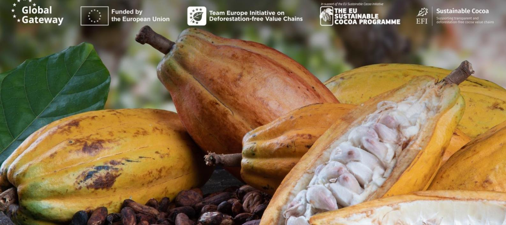

**Navigating legality due diligence in the context of the EUDR: lessons from cocoa legal studies in Cameroon, Côte d'Ivoire and Ghana** 

# Cocoa Insight

#### **1.Introduction**

Under the European Union Deforestation Regulation (EUDR), operators and traders will be obliged to carry out "due diligence" prior to placing cocoa products on the EU market to conclude that the product carries no or negligible risk of non-compliance with the regulation. This includes ensuring that products have been produced in accordance with the relevant legislation of the country of production (article 3). The EUDR adopts a flexible approach, listing several areas of law without specifying particular legal instruments, as these differ from country to country and may be subject to change (article 2.40).

In this context, an important step for EU operators and traders is to identify and understand the **relevant legislative framework** of the country of origin of their products. Such legal requirements are usually disseminated in the constitution, laws, decrees and other legally binding instruments. Building on this understanding of national legal frameworks, EU operators and traders must then be able to demonstrate the absence of, or only negligible, risk of non-compliance with relevant national laws within their supply chains. To do so, they need to **exercise due diligence**, namely collect information and evidence of legality, assess potential illegality risks, and mitigate risks if they identify any (article 8). This process needs to be framed by a due diligence system, reviewed and reported upon annually[1](#page-1-0) (article 12). Building due diligence processes implies understanding how laws are enforced and what enforcement data is available, as well as investigating the local context to identify risk factors.

In contrast with other EUDR requirements, the possibility for legality due diligence to rely on automated checks and technology is limited. It is often considered as a more complex and resource-intensive step. As national laws and law enforcement are prerogatives of producing country authorities, legality due diligence is also a more politically sensitive topic.

To support EUDR legality due diligence for the cocoa sector, the European Forest Institute (EFI), in collaboration with Preferred by Nature and national legal and due diligence experts,[2](#page-1-1) facilitated multistakeholder processes in Cameroon, Côte d'Ivoire and Ghana during 2024–2025. These processes consisted in building consensus around which national legal requirements are relevant to cocoa production and trade, and which due diligence actions can be recommended to verify compliance. This Insight synthesises key lessons drawn from this work, with a view to informing supply chain actors of the opportunities and challenges related to the grasping legality due diligence in the EUDR context.

1 Unless the operator is an SME

TAMI, Talyor Crabbe, Mondon Conseil International and BNA

#### **2.Unpacking EUDR requirements**

Engaging with national public and private stakeholders on EUDR preparation revealed differing levels of awareness and understanding of the Regulation' obligations. Multistakeholder consultations and bilateral engagement with supply chain actors provided the opportunity to clarify concepts and discuss practical implications of due diligence.

#### **2.1 Understand the unique nature of the EUDR legality criterion**

The EUDR requires operators to carry out due diligence in three main areas: geolocation and traceability; zero-deforestation; and legality. While traceability and deforestation criteria are based on uniform, top-down definitions provided by the EU—applying across all producing countries and commodities—the legality criterion is inherently context-specific. It depends on national laws and varies by commodity and origin, and only indicative guidance is provided by the EU to help identify the relevant legal requirements.

Understanding this difference in the nature of the EUDR criteria proved to be a challenge for many stakeholders. Many mistakenly believed that the EUDR introduces new obligations for producing countries or requires them to engage in legal reforms. For instance, because CÙte d'Ivoire, Ghana, and Cameroon do not have binding laws on Free, Prior and Informed Consent (FPIC), some assumed that this absence would automatically constitute noncompliance. However, the EUDR only requires compliance with existing national legislation, not the adoption of new ones.

A second misconception was the confusion between the EUDR's legality and zerodeforestation criteria. Stakeholders sometimes failed to grasp that the two are cumulative but distinct. For example, land deforested prior to 2020 may meet the zero-deforestation criterion, but still require an assessment of whether the deforestation was legal under national law. Conversely, legal deforestation after 2020 would violate the EUDR deforestation criterion. The two checks must be conducted independently.

# **2.2 Clarify the concept—due diligence is not a box-ticking exercise**

One of the most persistent challenges encountered during the multistakeholder consultations was the widespread misunderstanding of what due diligence actually entails. Many national actors—particularly in jurisdictions shaped by prescriptive civil law traditions—viewed it as a compliance checklist or a matter of collecting standard documents. For example, it was often assumed that land titles must be collected systematically from all cocoa producers—even in contexts where the law does not require documented land-use rights to grow crops.

The consultations helped shift this perspective and convey the message that due diligence is fundamentally a risk-based process. It requires identifying legal risks, assessing them, and implementing proportionate mitigation measures.

Another critical point clarified was that the EUDR places legal responsibility exclusively on EU-based operators and traders. While producing country actors are not legally bound by the regulation, their cooperation is essential to ensuring that operators have access to the information required for compliance. This clarification helped reposition national actors not as subjects of new obligations, but as key enablers of responsible trade, with a shared interest in supporting law enforcement.

#### **2.3 Empower stakeholders to build trust and market readiness**

The insights and capacity-building opportunities generated by the studies were made possible thanks to inclusive stakeholder engagement processes involving representatives from government, the private sector, civil society, farmers and cooperatives. The organisation of multiple in-person workshops and consultations in cocoa-producing areas over a nine-month period not only served to build understanding of due diligence and EUDR requirements but also helped foster trust and stakeholder buy-in. These dialogues proved essential in complementing expert analysis, ensuring a comprehensive and contextually grounded identification of relevant legal requirements taking into account the specificities of the cocoa sector. Importantly, they created a space to discuss how to interpret certain laws—an essential step given that legal interpretation can sometimes be inherently subjective.

Moreover, these consultations played a key role in reducing stakeholders' perceived risks around the implementation and implications of the EUDR. They helped demonstrate how greater transparency around the legal framework governing cocoa production and trade can position a country's cocoa more competitively on the international market.

#### **3.Mapping relevant legal frameworks**

In general, cocoa farming in West and Central Africa is largely dominated by smallholder producers, whose activities are embedded in diverse and evolving legal contexts. The process of identifying the legal requirements relevant for cocoa production and trade under the EUDR revealed the need to contend with shifting national legislation, ambiguities in how the EUDR's legality scope is interpreted, and the disconnect between formal legal provisions and smallholder realities.

## **3.1 Manage ambiguity—the EUDR legality scope is still taking shape**

A major challenge in compiling relevant legal requirements was the ambiguity surrounding the scope of the legality criterion under the EUDR, compounded by its evolving interpretation.

According to the regulation, "relevant legislation" for agricultural commodities in producing countries must relate to: (1) the legal status of the area of production, and (2) laws on landuse rights, environmental protection, third parties' rights, labour rights, human rights, the principle of free, prior and informed consent (FPIC), and tax, anti-corruption, and trade/customs. In October 2024, the European Commission (EC) issued a guidance document that interpreted the scope of the legality criterion. The guidance suggests that legal requirements should only be considered relevant if they both directly impact the legal status of the production area, and align with the EUDR's objectives of halting deforestation, forest degradation and biodiversity loss.

This guidance has sparked debates. For example, labour rights and certain human rights might not be considered directly linked to deforestation, raising questions about their inclusion. On the other hand, anti-corruption, trade, customs or tax laws could be deemed relevant even beyond the production area.

It is important to note that the EC guidance is non-binding. Legal enforcement of the EUDR will depend on how each EU Member State interprets compliance, with binding judgments to come from national courts. For businesses, this uncertainty poses significant risks: misinterpreting obligations could lead to penalties, reputational harm, or market exclusion.

Interestingly, producing countries interpreted the regulation differently. Côte d'Ivoire, Ghana, and Cameroon each took their own approach—some favouring narrow definitions to streamline compliance, others seeing the EUDR as a vehicle to strengthen broader national governance.

## **3.2 Do not set it in stone—legal mappings must be living tools**

A second challenge is the fluidity of national legal frameworks, which means that no definitive list of relevant legal requirements can be developed. Legal landscapes shift over time, and due diligence tools must evolve with them.

In Cameroon, a new Forest Law adopted in 2024 still awaits implementing decrees. A decree on hazardous child labour is expected to clarify compliance obligations soon. In CÙte d'Ivoire, the 2019 Forest Code introduced "agroforests" as a new category of protected areas where cocoa cultivation is conditionally permitted. However, due to the incomplete legal framework governing agroforests, the legality mapping exercise excluded cocoa production from these zones.

## **3.3 Beware of legal grey zones—vague provisions undermine clarity**

Legal frameworks often contain broad or generic provisions that are difficult to interpret or enforce in a due diligence context. This is particularly problematic when such laws lack implementing regulations or operational clarity.

Various examples can be mentioned:

- Laws on third-party rights are often too general to be usable, especially in smallholder contexts where producers are part of the community whose rights are being referenced.
- Access-to-information laws are commonly underdeveloped or lack the implementing regulations that outline the procedures that would enable the operationalisation of this right.
- In Ghana, the waste management law does not specify the types of waste covered, leaving implementation unclear.
- In Côte d'Ivoire, ambiguity surrounded whether hunting or fauna protection laws applied to cocoa farming. In contrast, such regulations are included in the framework of Cameroon and Ghana, highlighting a moving interpretation of what should be considered within the scope of due diligence.

In some cases, the legal mapping exercise exposed gaps, contradictions, or interpretive ambiguities that may warrant legal reform—but that remains the prerogative of national governments. Until then, due diligence systems must work within these grey zones, balancing caution with practicality.

#### **3.4 Be cautious of generic legal frameworks that often ignore smallholders' realities**

Cocoa is predominantly produced by smallholder farmers and family-run operations, yet many legal frameworks were not designed with this reality in mind.

Labour and tax laws, in particular, are often built for formal employment or large-scale enterprises. This can lead to unintended burdens when applied to informal or subsistencelevel production. As a result, it is not uncommon for these requirements not to be respected nor enforced in the cocoa sector.

For example, labour laws may not apply when only family labour is involved. However, longterm, paid workers—especially migrant labourers—do exist in the cocoa sector. In such cases, requirements on contracts, working conditions, safety, and social security clearly apply under the law. Furthermore, in some countries, some basic labour rights, such as those related to health and safety, apply to all labourers, whether hired permanently or for a task. Yet, awareness and enforcement of these requirements remain extremely limited in rural cocoa communities.

In Côte d'Ivoire, stakeholders recommended deeper inquiry into the actual legal status of these workers. A widespread belief persists that labour laws do not apply to farming—even when national law says otherwise.

This highlights a critical gap: without adaptation or clarification, some of the existing laws risk being either ignored or misapplied in smallholder contexts. Due diligence efforts must acknowledge these mismatches—and national frameworks should evolve if meaningful compliance is to be achieved at scale.

#### **4.Developing due diligence guidance**

The process of translating legal requirements into practical, risk-based actions that operators can take to demonstrate compliance with the EUDR proved complex. Developing due diligence recommendations required determining how to address identified risks in ways that are proportionate, feasible, and adaptable to different supply chain realities. Multistakeholder consultations surfaced tensions between the desire for standardisation and the need for flexibility, highlighted misconceptions about the nature of risk mitigation, and exposed structural barriers that can undermine compliance efforts.

#### **4.1 Embrace flexibility—one size doesn't fit all in risk assessment and mitigation**

A recurring challenge during the multistakeholder engagement process was the widespread desire among national actors to produce a single, standardised list of due diligence actions—sometimes even envisioning a mandatory list imposed by the producing country's government. This aspiration runs counter to the foundational principle of due diligence itself.

Due diligence is inherently context-specific. It must be tailored to the characteristics of particular supply chains, geographies and actors. Attempting to map out all potential scenarios and prescribing what should be done in each case would be both impractical and counterproductive. It would require a high degree of specificity (e.g., defining precisely what must be verified in each document, or how on-site checks should be carried out), which could burden actors unnecessarily and hamper the very adaptability that makes due diligence effective.

In response, our multistakeholder engagement efforts focused on developing a nonexhaustive, adaptable menu of recommended due diligence actions. It provides operators, who are ultimately liable for ensuring that their actions are sufficient, with options to select and tailor them based on the specific context and findings of their own risk assessments. This approach supports flexibility while promoting a shared understanding of best practices.

Nevertheless, it became clear that it is not easy for producing country institutions to relinquish control over how due diligence is carried out. The instinct to define what supply chain actors "should do" to demonstrate compliance remains strong. Experience therefore showed that the most appropriate role for national authorities is in defining the legal framework—that is, identifying and interpreting relevant legal requirements. More emphasis on consultation of private sector actors thus appeared appropriate in the development of due diligence recommendations.

## **4.2 Prioritise relevance—efforts must target bigger risks**

One of the common misconceptions in due diligence implementation is that it simply involves collecting legally relevant documents, reducing it to an administrative exercise, when in reality, it is meant to be a risk-based process grounded in contextual judgment.

In practice, there are cases where no document can adequately inform or mitigate a specific legal risk, and therefore, other forms of action must be taken—such as on-site verification or stakeholder engagement. Conversely, there are cases where the overall legal framework is well implemented at the national level, reducing the need for individual documentation.

One persistent challenge in developing meaningful risk mitigation actions was what could be called a "reverse logic": instead of identifying legal risks and then determining effective responses, stakeholders would sometimes start by listing what due diligence actions were easiest to implement and then try to match them to perceived relevant legal obligations.

Following this logic often led to reluctance to recognise the real level of illegality risk of some requirements. This occasionally triggered concerns that meaningful due diligence was too complex or costly to implement. But two key clarifications helped shift that perception.

First, the lists of due diligence actions are illustrative, not prescriptive. They present a menu of options rather than a mandatory checklist. A long list does not mean that all actions must be implemented—it simply expands the set of available tools for different contexts.

The process also seeks to optimise efficiency by identifying actions that address multiple risks at once. For example, concerns around pesticide use often intersect with water pollution, third-party rights, soil protection and waste management. A single, well-designed risk mitigation action—such as regular environmental audits or farmer training—can cover several legal areas simultaneously.

This reinforces a critical point: due diligence must be both effective and proportionate. It is not about collecting more paperwork—it is about understanding where the risks are, and taking meaningful steps to address them, with efficiency in mind.

#### **4.3 Recognise that compliance gaps often stem from structural barriers**

Designing appropriate due diligence actions frequently ran into three types of challenges: weak enforcement, legal or institutional barriers to accessing information, and a lack of reliable data to verify compliance.

#### **Weak enforcement, despite strong legal frameworks**

Once relevant legal requirements were identified, stakeholder consultations revealed recurring challenges with enforcement—especially where awareness of the law was low. This was particularly the case for:

- Use of unauthorised pesticides
- Lack of personal protective equipment for workers
- Inadequate waste management, especially for pesticide containers

Child labour emerged as a particularly sensitive issue. Although legal frameworks are in place in all three countries, socioeconomic realities and the informal nature of cocoa farming constrain implementation. This situation contributes to a reluctance among EU operators to include child labour within their legality due diligence scope, despite its importance.

#### **Barriers to sharing or accessing documentation**

In several areas, particularly around labour and fiscal documentation, legal and privacy barriers prevented the collection or transmission of evidence:

- Documents containing personal data (e.g., wage slips, social security registration)
- Tax or trade documentation considered commercially confidential

One solution to overcome the barrier created by personal data protection legislation was to recommend that operators *consult* relevant data contained in employment contracts and other documents held by cooperatives, rather than *collect* such documents. This would enable operators to verify compliance while respecting personal data protection legislation.

Such limitations highlight the importance of distinguishing between legal obligations and what can be reasonably verified, especially when EU operators depend on upstream actors for access to sensitive information.

#### **Transparency and data limitations hinder geospatial verification**

A third set of challenges involved evidence gaps and data quality issues, especially for geospatial verification. For example:

- Verifying that cocoa farms are outside protected areas is hampered by lack of reliable, up-to-date and public protected area boundary maps.
- A public alternative, the World Database on Protected Areas (WDPA) lacks precision and coherence with national sources.
- Undocumented or unavailable data on authorised farming in protected areas. "Enclaves" within protected areas in Côte d'Ivoire, or admitted farms in Ghana pose additional verification challenges due to unclear or unpublished boundary data. In Cameroon, farming in the permanent forest estate is allowed only under strict conditions (e.g., when detailed in forest management plans), but many such plans are lacking. Similarly, areas classified as "zones en défens" are poorly mapped, creating ambiguity for operators conducting risk assessments.

Protected areas boundary data is essential to assess compliance risks with national legal requirements related to land-use rights and the environment. As this data is part of producing countries' legal frameworks, access to this information through official government sources would facilitate operators' EUDR compliance risk assessment.

#### **5.Conclusion**

The legality studies conducted in Côte d'Ivoire, Ghana, and Cameroon have laid a strong foundation for EUDR compliance by fostering stakeholder consensus on relevant legal requirements. These efforts have not only demystified the legality criterion but also empowered national actors to become key enablers of responsible cocoa trade. While developing and implementing due diligence systems remains the responsibility of operators and supply chain actors, the information provided created a level playing field, which can bring greater efficiency of these efforts, as well as reduce the burden for smaller actors. By providing a space for discussion on the realities of smallholder farming and challenges of law enforcement, the studies have opened pathways for greater transparency—turning regulatory challenges into opportunities for governance improvement and sustainable sector transformation.

Cover photo: Photo description. Cut cocoa fruits and raw cocoa beans with defocused cocoa plantation in the background. Credit: Gustavo / Adobe Photo Stock

**Disclaimer.** The Sustainable Cocoa Programme of the European Union (EU), launched in 2020, aims at supporting national partners in achieving economic, environmental, and social sustainability in the cocoa sector.

The European Forest Institute (EFI) supports the implementation of the Programme by enhancing a shared understanding between key public and private stakeholders about defining and measuring progress towards cocoa sustainability, in support of the EU policy dialogue with producing countries. It assists in the national dialogue on the EU Deforestation Regulation (EUDR) and the verification of legality in support of the sector's due diligence efforts.

© European Forest Institute, 2025

