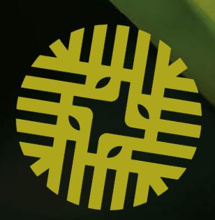
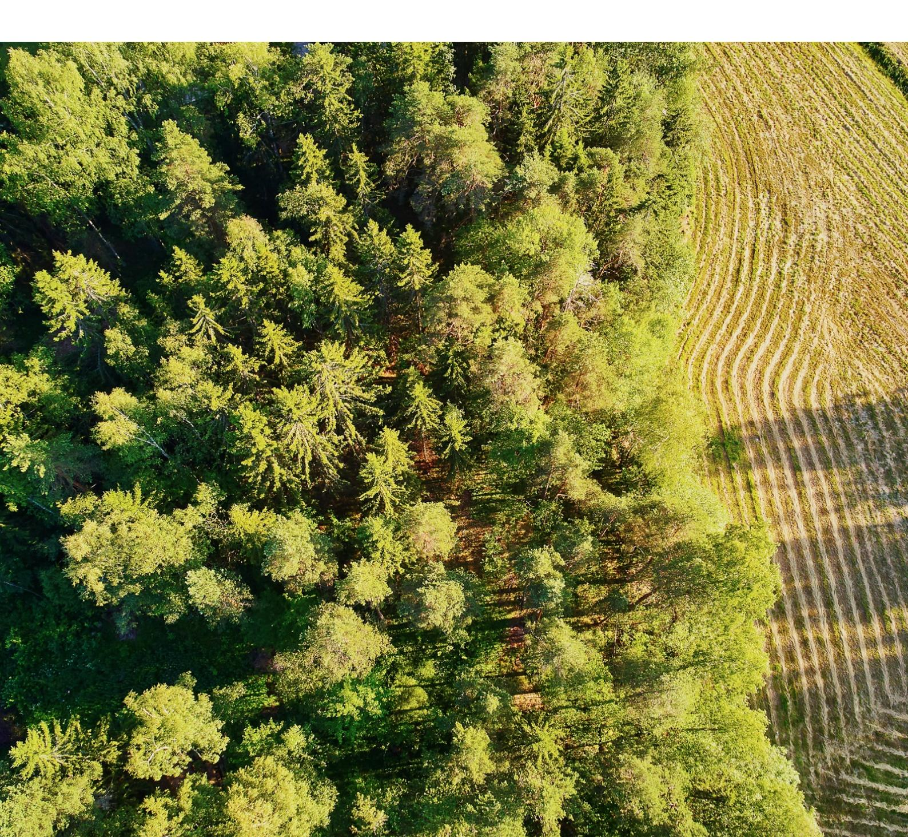
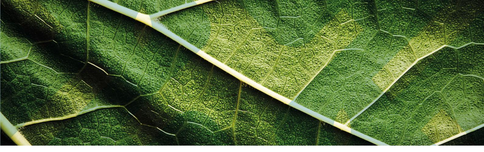
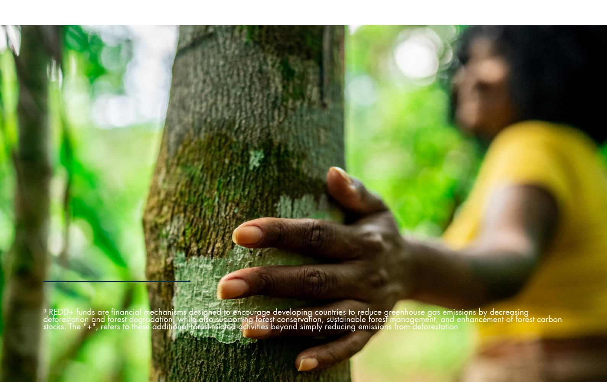
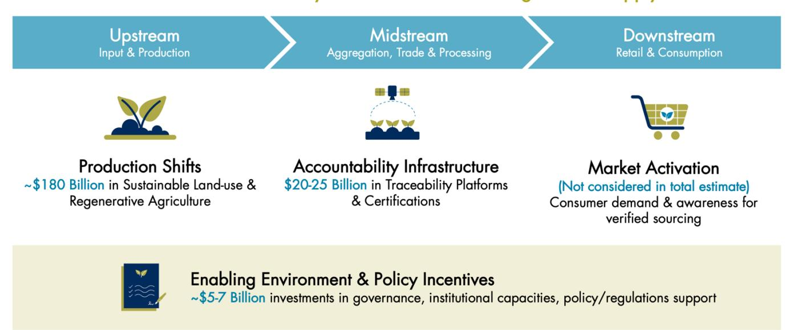
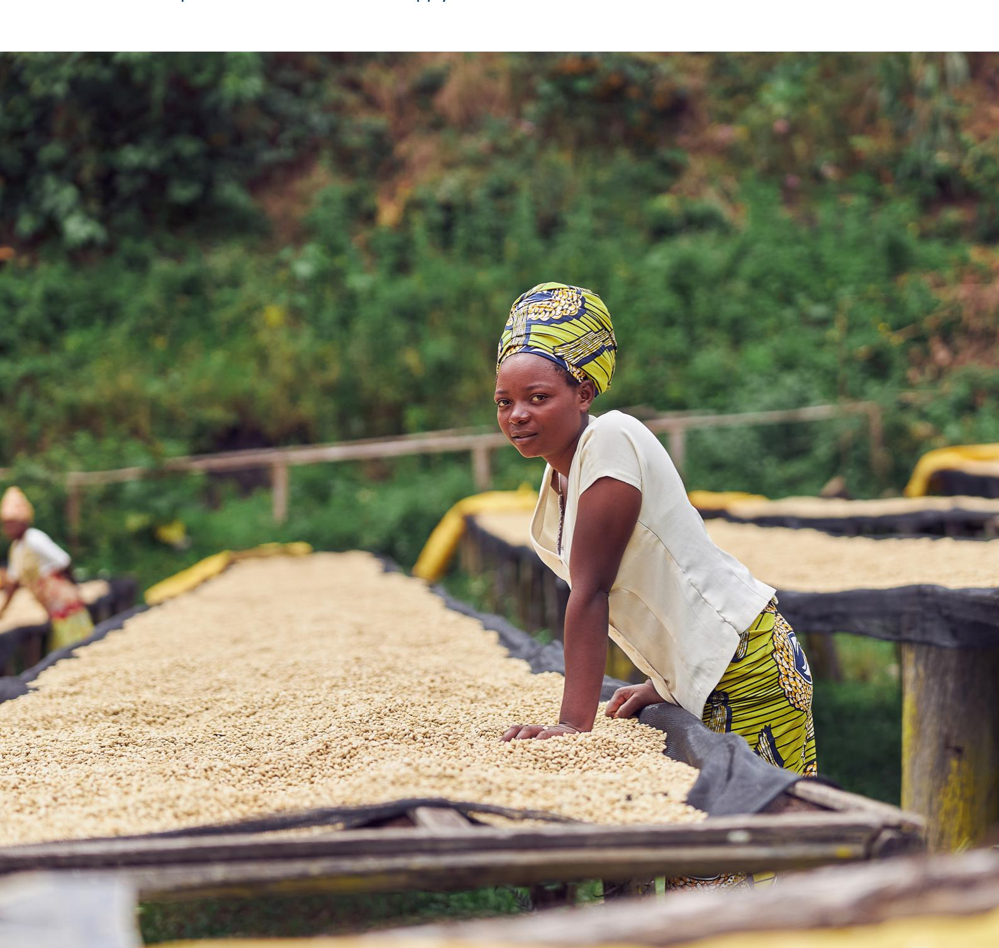
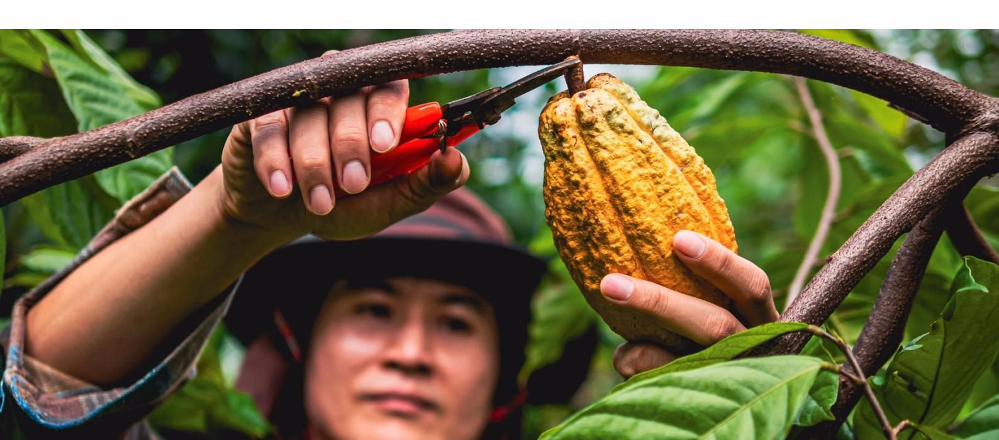
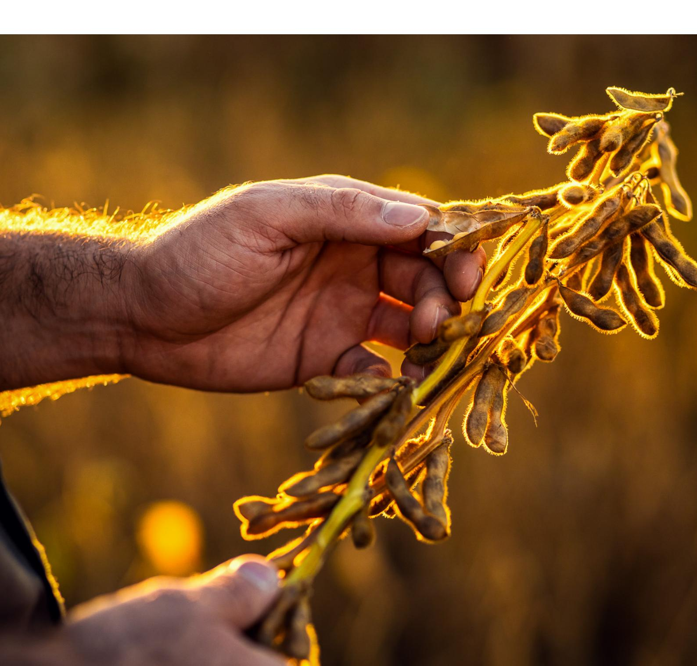
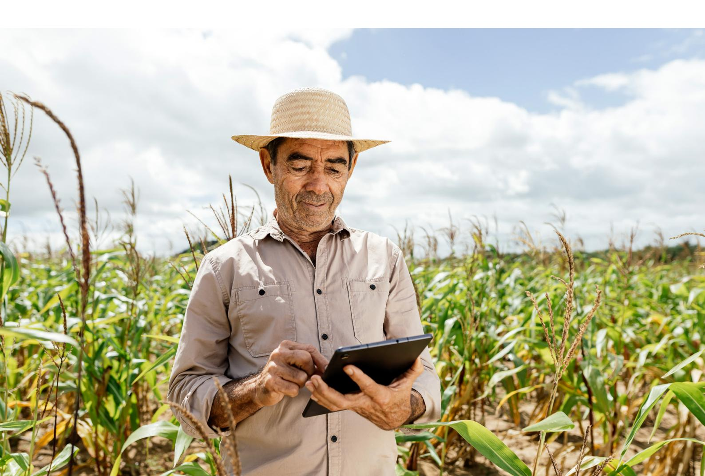

INVESTING IN DEFORESTATION-FREE SUPPLY CHAINS AS A STRATEGIC IMPERATIVE

June 2025

# DEFORESTATION-FREE COMMODITIES

The Mobilising Finance for Forests (MFF) program is managed by FMO and jointly funded by the UK and Dutch government.

Palladium and Systemiq have delivered this work as part of the MFF Learning, Convening and Influencing Platform.

# DEFORESTATION-FREE COMMODITIES: INVESTING IN DEFORESTATION-FREE SUPPLY CHAINS AS A STRATEGIC IMPERATIVE

### ABOUT MFF

Mobilizing Finance for Forests (MFF) program is funded by the UK government and the government of the Kingdom of the Netherlands. MFF was established in 2021 by the UK government and FMO as a blended finance investment program to combat deforestation and other environmentally unsustainable land use practices contributing to global climate change. The Netherlands' Ministry of Foreign Affairs joined MFF as a second funder in 2024.

As part of the MFF Technical Assistance Facility, the Learning, Convening & Influencing Platform (LCIP) seeks to increase the scale, in terms of size and impact, of investments in forests, sustainable land use and nature. The LCIP does this by delivering and disseminating research, briefing papers, guidance and investment blueprints to increase the capacity and motivation of investors to invest in forests and sustainable land use.

### CONTENTS

| ABOUT THIS PAPER                                                              | .................................................................................................................................... 5          |
|-------------------------------------------------------------------------------|-------------------------------------------------------------------------------------------------------------------------------------------------|
| A GUIDE TO TERMINOLOGY                                                        | .................................................................................................................... 6                          |
|                                                                               | IMPERATIVE ......................................................................................................................... 14         |
| CHAPTER 2: INVESTMENT NEEDS TO TRANSITION TO DEFORESTATION-FREE SUPPLY CHAINS | ......... 17                                                                                                                                    |
| CHAPTER 3: BARRIERS TO INVESTMENT IN DEFORESTATION-FREE SUPPLY CHAINS         | ............................ 20                                                                                                                 |
| ANNEXES                                                                       | ............................................................................................................................................ 42 |
| REFERENCES                                                                    | ............................................................................................................................................ 48 |

### ABOUT THIS PAPER

This learning paper was developed by the Mobilising Finance for Forests (MFF) program — a blended finance initiative funded by the UK government and the government of the Netherlands — to explore how capital can be more effectively mobilized to support the transition to deforestation-free agricultural supply chains. Established by the UK and FMO in 2021 and joined by the Dutch Ministry of Foreign Affairs in 2024, MFF aims to catalyze private investment into business models that reduce deforestation across the tropical belt.

This paper was created through MFF's Learning, Convening, and Influencing Platform (LCIP), which facilitates crossstakeholder knowledge exchange and builds on examples of investable, forest-positive solutions. Informed by a wide range of stakeholder interviews — including development finance institutions, commercial investors, NGOs, philanthropic actors, funds, and technical assistance providers — the paper offers practical guidance for aligning capital with deforestation-free outcomes. It is intended primarily for public and private investors, as well as corporates operating in high-deforestation-risk supply chains.

It addresses three core questions:

- Which agriculture supply chain segments face the most urgent capital gaps to prevent deforestation?
- What are the key financial and structural barriers inhibiting investment?
- Which financial instruments or investment structures can help to prevent deforestation at scale?

The analysis focuses on forest-risk commodity supply chains such as cocoa and soybean, and outlines actionable strategies for deploying capital more effectively across upstream, midstream, and enabling environments. The findings will serve as the foundation for a technical convening of public and private sector actors to co-develop solutions and partnerships that accelerate systemic change in forest-risk supply chains.

The lead authors of this paper are Jasmine Dhingra, Johanna Schlueter, Jeroen Huisman, and Dominic Strano, all from Systemiq.

With appreciation for their time, insight and expertise, the authors would like to thank: Fitrian Ardiansyah (ADM Capital); Deniz Harut (Agri3 Fund); Ellen Brookes (British International Investment); Anne-Rieke Oskamp, Anton Timpers, David Griso Montanes, Hans Bogaard, Jenya Shandina, Toby Lewis-Donaldson (FMO); Isha Chauhan (IDH Sustainable Trade Initiative); Gautier Quéru (Mirova); Ida Breckan Claudi (Norad); Isabella Shraiman, Martin Belcher (The Palladium Group); Emma Van de Ven (Rabobank), Aryo Gustomo (Roundtable on Sustainable Palm Oil); Istvan Fritsche (Sail Ventures); Mauricio Moura Costa (SIM Investment Management); Ineke Keers, Mark Koppejan (Smallholder Agroforestry Finance B.V); Deeptanshu Kotru, Elinor Newman-Beckett, Evelyn Holland, Hanny Chrysolite, Katy Brennan, Paul Limpens, Scarlett Benson, and Stephanie Hall (Systemiq).

### A GUIDE TO TERMINOLOGY

- Agroforestry: A land-use system where trees are grown among other crops, leading to better soil quality and more sustainable farming.
- Blended finance: The strategic combined use of public and private capital for SDG-related and other environmental and socially impactful investments – often using de-risking mechanisms like guarantees, insurance, currency hedging, first-loss capital or technical assistance1 . By leveraging public and philanthropic capital alongside private funds, either concurrently or over time, blended finance can de-risk long-term, high-risk projects, making them more appealing to commercial investors.
- Carbon Removal Units (CRUs): A Carbon Removal Unit (CRU) represents a verified amount of carbon dioxide equivalent (t CO2e) removed from the atmosphere. CRUs are a type of carbon credit that is issued after the carbon removal has been measured and verified, and they can be traded in carbon markets.
- Catalytic capital: Capital including debt, equity, grants and credit enhancement mechanisms like guarantees, of which the primary aim is to unlock additional funding from commercial investors by de-risking or proving the viability of innovative or socially impactful projects. Catalytic capital is usually public or philanthropic capital. It is a critical component of blended finance transactions 2 . Catalytic capital can be concessional (see below), but does not always have to be.
- Concessional finance/capital: Funds provided at below-market rates and/or terms to reduce the overall cost-ofcapital for the borrower/investee and/or provide additional downside protection to more senior investors (if in a first-loss position). Concessional capital can be provided through a diversity of financial instruments, including debt, equity, grant funding, and mezzanine capital3 .
- Development Finance Institutions (DFIs): National and international specialized finance institutions established to support private sector development in developing countries4 .
- First-loss capital: A financial arrangement in which one party agrees to absorb the initial losses of an investment or loan before other (senior) investors bear any losses .
- Grants: Financial awards with no expected repayment or compensation over a fixed period6 .
- Green Bonds: Fixed-income financial instruments where the funds raised are used exclusively to finance or refinance projects that have environmental benefits, such as renewable energy, sustainable agriculture, or clean transportation7 .
- Guarantee: A risk-sharing instrument that provides protection to one party in case the other party fails to perform its financial obligations. It is an agreement where a third party (i.e. the guarantor) commits to pay the investor/lender/seller should the investee/borrower/counterparty be unable to do so. Guarantees typically result in a higher credit rating for the lender and better interest rates for the borrower by transferring the risk associated with doing business with high-risk borrowers/sectors/geographies or extending credit during times of financial uncertainty8 .
- Monitoring, Reporting and Verification (MRV): The process to track, record, and validate the data associated with pledged targets and objectives9 . In agricultural supply chains, it is the systematic process of collecting, documenting, and independently validating data related to environmental and social impacts, such as deforestation, greenhouse gas emissions, land use, and sustainability practices, across production, processing, and sourcing stages.
- Regenerative Agriculture: Farming practices that go beyond sustainability to actively regenerate soil health, biodiversity, and ecosystem functions while producing food or other agricultural goods10 .
- Supply Chain Traceability: The ability to track the movement of a product and its components through all stages of the supply chain — from production to processing to distribution — ensuring transparency and verifying claims such as sustainability or ethical sourcing11 .

- Sustainable Land-Use: Managing land resources (like forests, farms, and grasslands) in ways that meet current human needs while preserving the environment, biodiversity, and ecosystem services for future generations12 .
- Technical assistance: Advisory services and training provided to supplement the capacity of investees, or more generally, to lower transaction costs to facilitate greater investment in high-impact projects13 .

### EXECUTIVE SUMMARY

Global efforts to reduce deforestation have yielded mixed results. Global primary forest loss declined by about 11% by the year 2023, from an annual average of 4.2 million hectares during 2010–2020. But 2024 marked a sharp reversal, with forest loss surging to 6.7 million hectares, driven by fires and continued agricultural expansion. While countries like Brazil showed that decisive action can curb deforestation, others, such as Bolivia and regions in West Africa and Southeast Asia, continue to see rising forest loss. Despite corporate pledges and new regulations like the EU Deforestation Regulation (EUDR) raising the bar for supply chain accountability, the pace of progress remains far too slow to meet global climate and biodiversity goals. For businesses operating in global supply chains, these trends present more than an environmental challenge. Deforestation now poses material risks to their operations. These risks are driven by climaterelated yield losses, social disruptions in sourcing regions, and mounting regulatory pressure. However, the underlying pressures driving deforestation remain largely unaddressed.

These pressures are deeply systemic, rooted in economic and financial imbalances. At the global level, forests provide essential ecosystem services, stabilizing agricultural productivity and climate systems. But at the local level, conserving forests often remains less profitable than clearing them. Agricultural expansion, informal land tenure, high compliance costs, and unequal value distribution across supply chains reinforce short-term incentives to deforest. For many landowners, particularly in emerging and developing economies, the rational economic choice today is to convert forested land rather than protect it. Without shifting these underlying incentives, deforestation will remain an embedded feature of global supply chains.

Although the underlying economic disincentives to conserve forests persist, finance plays an important role in shaping a path forward. An estimated \$210 billion per year is needed through 2030 to transition to deforestation-free supply chains. Current flows — around \$35 billion annually, mostly from public sources — fall far short. Private sector investment, particularly into high-risk commodities like cocoa, palm oil, and soybean, remains limited and fragmented. Four persistent barriers continue to inhibit the flow of capital, leaving deforestation risks deeply embedded in global agricultural trade:

- 1. Lack of a viable business case for producers to protect forests, deepened by financial constraints to transition to sustainable farming practices, particularly for smallholders
- 2. Fragmented, opaque midstream systems that weaken traceability and accountability
- 3. Limited enforcement and monitoring infrastructure
- 4. Structural disincentives for downstream actors to invest in upstream transformation

While finance alone cannot solve the structural drivers of deforestation, it remains a powerful lever to reshape incentives. Seven priority investment areas have emerged to accelerate the transition, spanning farmer transition finance, midstream accountability systems, traceability platforms, and ecosystem restoration. Early successes show that scaling private finance will depend on stronger alignment between three forces: financial incentives that reward verified sustainable production, regulatory frameworks that enforce deforestation-free standards, and supply chain systems that enable traceability and accountability.

### This paper defines three critical solution directions, with a role for public & private finance in each of them:

- 1. Establish viable, demonstrable business cases for forest retention and restoration in agriculture supply chains. Build financial incentives and alternative income streams that reward forest protection. This could include premiums for verified deforestation-free commodities, lower compliance costs, early access to carbon market revenues (and other PES markets1 ) and reduced financing cost for sustainable practices.

Priority action: Develop alternative revenue sources for forest-positive producers to make forest protection economically viable. For example, through funding early-stage business models that leverage agroforestry, carbon credits, and eco-certifications. Donors and DFIs to provide concessional and blended finance to fund design, piloting, and early implementation of these models. Corporate buyers to strengthen viability by committing to price premiums or long-term offtake agreements for commodities or credits.

- 2. Streamline and simplify compliance standards to boost market confidence. Invest in the consolidation of digital Monitoring, Reporting, and Verification (MRV) systems and harmonized traceability standards that lower the cost of compliance, improve credibility, and build confidence for investors and buyers alike.

Priority action: Invest in affordable, interoperable monitoring systems to develop a collective MRV infrastructure. Donors and DFIs to co-fund early-stage development and venture capital to help scale commercially viable tools. Corporate buyers to embed standardised MRV into sourcing strategies and ensure uptake.

- 3. Strengthen collaboration across the supply chain and financial system. Convene early, structured partnerships across producers, financiers, and buyers to co-develop scalable investment solutions tailored to high-deforestation contexts. Pooling risk and aligning timelines is critical to unlocking private finance and shifting incentives across the system.

Priority action: Create pre-investment collaboration platforms to co-develop investment-ready, forestpositive pipelines. DFIs and donors to fund convening platforms; corporates and commercial investors to engage early to align on financial structuring, risk-sharing, and project documentation. Corporates and commercial investors to engage early to align on financial structuring, risk-sharing, and project documentation.

Achieving deforestation-free supply chains at scale requires coordinated efforts across all strategic levers. The table below outlines a broader set of financial and strategic actions needed to support implementation across each critical way forward.

1 PES markets, or Payments for Ecosystem Services, are a type of environmental market that creates voluntary transactions between buyers and sellers of ecosystem services (e.g. nature credits or BNG Offsets).

### TABLE 1: Financial and strategic actions to drive deforestation-free transitions

| Way forward Recommendation Key actions and other actors                                                                                                                                                                                                                                                                                                                                                                     | Suggested role of finance Donors and DFIs (with                                                                                                                                                                                                                                                                |
|-----------------------------------------------------------------------------------------------------------------------------------------------------------------------------------------------------------------------------------------------------------------------------------------------------------------------------------------------------------------------------------------------------------------------------|----------------------------------------------------------------------------------------------------------------------------------------------------------------------------------------------------------------------------------------------------------------------------------------------------------------|
| concessional finance) Rebalance value chain economics to reward verified producers Make forest protection economically viable for Create alternative                                                                                                                                                                                                                                                                        | – to provide concessional & blended finance for pilots of alternative revenue models                                                                                                                                                                                                                           |
| Corporate buyers producers through revenue sources for incentives and farmers (agroforestry, diversified revenue eco-certifications, carbon streams credits) Anchor incentives in                                                                                                                                                                                                                                           | – to embed incentives in procurement strategies and sign long-term offtake agreements Project developers /                                                                                                                                                                                                     |
| Aggregators long-term offtake deals models Establish viable, demonstrable business cases for forest retention and restoration in Scale climate-linked agriculture supply insurance to reduce chains farmer risks during land use transition De-risk the transition for farmers through Deploy outcome-based insurance and lending tied to outcome-based finance deforestation-free targets credit Use credit guarantees to | – to identify and implement alternative revenue Insurance providers (climate/agriculture specialized) – to offer climate-linked insurance products, backed by premium subsidies and first-loss capital Local commercial banks & agri-focused MFIs – to deploy outcome-based loans and channel forest-positive |
| Donors and DFIs lower cost of transition loans lending tools                                                                                                                                                                                                                                                                                                                                                                | – to provide credit guarantees and to fund the design of outcome-based Climate-focused Impact funds for outcome-based finance                                                                                                                                                                                  |

Micro Finance Institutions (MFIs)

| Way forward Recommendation Key actions and other actors                                                                                                                | Suggested role of finance Commercial banks and trade                                                                                     |
|------------------------------------------------------------------------------------------------------------------------------------------------------------------------|------------------------------------------------------------------------------------------------------------------------------------------|
| finance institutions loans Develop green trade                                                                                                                         | – to provide sustainability-linked                                                                                                       |
| Corporate buyers finance linked to verified KPIs price premiums Offer price premiums Extend sustainability and better loan terms to                                   | – to back sourcing commitments and Commodity traders and                                                                                 |
| processors linked finance to verified traders midstream actors Back corporate KPIs commitments to certified, deforestation-free sourcing to strengthen market signals  | – to act as borrowers tied to verified DFIs through blended finance - to de-risk sustainability linked loans and trade finance products |
| Donors and DFIs through TA                                                                                                                                             | – to support investees in KPI tracking                                                                                                   |
| Standard-setting bodies chains Convene value chain actors to harmonize                                                                                                 | (e.g. RSPO, Rainforest Alliance) – to align criteria across supply Industry platforms and                                                |
| alliances standards on land-use, cut-off dates, and Streamline and Harmonize value chain traceability stakeholders simplify standards standards Embed financiers early | (e.g. Consumer Goods Forum, Tropical Forest Alliance) – to convene                                                                       |
| DFIs and donors for compliance to in standard-setting to boost market reflect real financing confidence conditions and Assistance thresholds                           | – to fund multi-stakeholder alignment processes and Technical                                                                            |
| Financial institutions                                                                                                                                                 | – to ensure integration of financing needs into compliance design                                                                        |

| Way forward Recommendation Key actions and other actors                                                                                                                   | Suggested role of finance                                                                 |
|---------------------------------------------------------------------------------------------------------------------------------------------------------------------------|-------------------------------------------------------------------------------------------|
| Donors and DFIs adoption Define core                                                                                                                                      | – to co-fund early-stage MRV tools and                                                    |
| Venture capital firms deforestation-free metrics Develop collective, Invest in affordable interoperable MRV and interoperable platforms infrastructure monitoring systems | – to scale commercially viable and interoperable MRV                                      |
| Corporate buyers Anchor adoption through public and industry endorsement ensure uptake                                                                                    | – to embed standardised MRV into sourcing strategies and                                  |
| Industry coalitions                                                                                                                                                       | – to align and endorse metrics National governments and                                   |
| regulatory agencies laws                                                                                                                                                  | – to lead reform and enact aligned                                                        |
| Donors and DFIs Provide technical support to align national                                                                                                               | – to fund technical assistance, impact assessment and pilots Legal and policy think tanks |
| / TA providers regulations with market Align national needs implementation regulation with Convene buyers,                                                                | – to guide the design of regulations and                                                  |
| Corporate buyers simplified frameworks producers, and governments to align national priorities with frameworks international standards                                    | – to co finance TA and advocate for simplified regulatory Cross-government platforms     |
| (E.g. Team Europe Initiative alignment                                                                                                                                    | on Deforestation-free Value Chains (SAFE)) – to convene stakeholders and drive            |

| Way forward Recommendation Key actions and other actors                                                                                      | Suggested role of finance Social enterprises and                              |
|----------------------------------------------------------------------------------------------------------------------------------------------|-------------------------------------------------------------------------------|
| integrators Support bundled farmer service platforms (inputs,                                                                                | – to build and operate bundled platforms Local NGOs and technical             |
| assistance providers training, finance, traceability) Build joint farmer Embed ecological fit into                                           | – to deliver ecological and locally tailored technical support                |
| DFIs – to provide blended support platforms technical support to boost resilience and reduce land pressure capital Target high-deforestation | finance for early-stage development and working                               |
| Producer cooperatives – geographies Strengthen collaboration across the supply chain and financial system                                    | to reach farmers in remote high deforestation areas                          |
| DFIs and donors Create pre-investment collaboration platforms Create collaborative Embed local realities into                                | – to fund convening platforms and pipeline development Project developers and |
| intermediaries finance and sourcing pipeline development mechanisms Bridge the gap between commercial and                                    | – to design investment-ready concepts Technical assistance                    |
| providers development actors                                                                                                                 | – for early-stage support and local alignment                                 |

# CHAPTER 1: WORKING TOWARDS DEFORESTATION-FREE SUPPLY CHAINS IS A STRATEGIC IMPERATIVE

Over the past decade, efforts to curb deforestation have delivered important but uneven progress. Progress was most evident by 2023, when global primary forest loss declined by around 11%, from an annual average of 4.2 million hectares during 2010–202014 to 3.7 million hectares15. However, 2024 marked a sharp reversal. The tropics lost a record 6.7 million hectares of primary rainforest—an 80% increase from the previous year—driven largely by human-set fires for land clearing that spread uncontrollably16. In Bolivia, primary forest loss increased by 27%, reaching its highest year on record for the third year in a row in 202317 due to forest fires set by humans for agricultural purposes. Meanwhile, deforestation persists at alarming rates in regions such as West Africa and Southeast Asia, where cocoa, palm oil, and rubber production continue to drive extensive forest loss18. On the positive side, countries like Brazil have shown that strategic interventions can shift trajectories. National enforcement, corporate pledges, jurisdictional initiatives, and global coalitions have raised the bar for sustainable commodity sourcing. In 2023, Brazil's crackdown on illegal logging led to surges in fines, embargoes, and seizures, with Amazon deforestation dropping nearly 50% and forest degradation falling 33% compared to 202219. But that progress proved short-lived. In 2024, forest loss returned, with fire-related destruction compounded by a 13% rise in non-fire deforestation linked to soybean and cattle expansion.

Deforestation is no longer just an environmental concern for businesses—it poses a material risk to the way they operate, driven by climate-related yield losses, social disruptions in sourcing regions, and reputational pressure. For companies operating in the global economy, these risks are real. Climate shocks reduce yields of critical commodities. For example, rice production in Vietnam and Thailand is projected to fall by 10% and 14% respectively by 202620. Some regions even experienced reductions within the range of 3% to 15%21 due to prolonged droughts. Socially, deforestation deepens rural vulnerability. For example, erratic weather in cocoa-producing regions is exacerbating child labour risks as families struggle with income instability22. Meanwhile, scrutiny from regulators, investors, and consumers is intensifying. New rules, such as the EU Deforestation Regulation (EUDR), are raising compliance costs and legal exposure for companies sourcing forest-risk commodities.

The macro-resilience case for preserving forest ecosystems is clear. Forests and natural ecosystems provide vital services that underpin the stability of agricultural production and global supply chains. They regulate rainfall, moderate temperature extremes, enrich soils, and protect water sources. When forest landscapes are cleared or degraded, these functions break down, leading to volatile growing conditions, lower productivity, and greater exposure to environmental shocks. Forests also play a critical role in climate stability. Deforestation accounts for nearly 10% of global greenhouse gas emissions23. Tropical rainforests, such as the Congo Basin, act as major carbon sinks—sequestering around 600 million metric tonnes more CO2 each year than they emit, which is roughly a third of annual U.S. transport emissions24. When forests are lost, vast amounts of stored carbon are released, accelerating global warming. The IPCC estimates that land-based solutions could deliver up to 30% of the emissions cuts needed by 205025. Preserving forest cover is therefore not just a climate imperative, but a core strategy for ensuring the long-term resilience of supply chains.

However, for landowners, the business case for conserving forests is often weaker than the immediate gains from clearing land for agriculture. Despite the macro benefits, it often remains more profitable for individual farmers and landowners to clear forests than to conserve them. Agricultural expansion continues to offer quicker and more certain returns, while conservation rarely provides a comparable income. Insecure land tenure, limited access to finance, and high compliance costs for sustainable practices further skew incentives toward clearing. Systemic inequities in agricultural supply chains—where value is concentrated downstream while risks are borne upstream—compound the challenge. Without targeted support and financial rewards for conservation, individual actors have little reason to prioritise forest preservation over short-term gains.

Agriculture is widely recognized as a leading driver of global deforestation, accounting for at least 75% of total forest loss 26 . Yet, the picture is more complex. Within agriculture, a handful of globally traded commodities — particularly beef, soybean, palm oil, wood products, and cocoa — are responsible for a significant share of tropical forest clearance. These commodities are deeply embedded in global trade and export markets, as countries seek hard currency revenues and respond to rising population demands. Cocoa, for example, carries the highest embedded deforestation risk linked to EU consumption27. In West Africa, Côte d'Ivoire and Ghana have lost nearly 80% of their forests over the past century, largely due to cocoa farming28. However, agriculture is often a symptom rather than the root cause. In many cases, forests are cleared for longer-term goals such as real estate development, with agriculture serving as an interim land use to generate income while awaiting land value appreciation. This broader issue of land-use management, rather than agriculture alone, underpins much of the ongoing deforestation.

While land-use management challenges stretch beyond agriculture, transforming agricultural supply chains remains the most immediate lever to tackle deforestation at scale. Agriculture continues to drive the largest share of direct forest loss, and unlike other land-use changes, it is tightly linked to global commodity markets, corporate sourcing practices, and financial flows. Action at the agricultural frontier, particularly around commodities like soybean, palm oil, cocoa, and beef, offers a clear entry point for shifting incentives and restoring natural ecosystems. In this context, advancing deforestation-free agriculture is an essential building block toward broader land-use transformation.

Deforestation- and Conversion-Free (DCF) supply chains offer a clear path forward — but delivering them will demand much more than fragmented efforts. DCF means ensuring that products are not sourced from land cleared after a specified cut-off date, across all stages of production and trade. Yet even this definition is uneven. There is no global consensus on cut-off dates: the EU Deforestation Regulation (EUDR), for instance, mandates the year 2020 as the cut-off for priority commodities, but other regulations diverge. Building DCF supply chains requires a systemic shift, not just isolated improvements. Land-use management, agricultural practices, and traceability infrastructure must all be reengineered to work together, not in silos. Companies must be able to trace commodities from farm to shelf, enforce protected zones, and meet rising legal

standards. But above all, the business case for landowners must be fundamentally reshaped so that conserving forests becomes a viable and attractive choice. Here, policy plays a critical role in pushing stakeholders to act, setting clearer standards, and aligning incentives across the value chain.

Recent regulatory efforts such as the EUDR and new commitments from key producer countries represent important steps toward establishing deforestation-free global supply chains. However, significant gaps remain. The EUDR, while well-intentioned, currently excludes 97% of smallholder farmers. This is because smallholder operations are informal, fragmented and poorly digitized. Most do not have digital farm records, GPS mapping, or documentation of land tenure, which are the core requirements of EUDR29. It has also drawn strong opposition from developing countries concerned about its potential impact on rural livelihoods30. Meanwhile, the UK has introduced legislation to ban products tied to illegal deforestation31 , and the US had proposed the FOREST Act but it remains stalled in Congress32. China and Brazil issued a joint statement committing to end illegal deforestation and trade in forest-risk commodities, but its enforceability remains uncertain33. A major hurdle in implementing these frameworks is the cost and complexity. While the burden can be especially acute for smaller companies and producers with limited resources, larger actors are also affected, particularly as they rely on smaller suppliers to deliver on deforestation-free commitments.

## CHAPTER 2: INVESTMENT NEEDS TO TRANSITION TO DEFORESTATION-FREE SUPPLY CHAINS

Approximately \$210 billion 34 per year is required globally through 2030 to finance the transition to deforestation-free agriculture supply chains. This investment spans three critical areas. First, upstream production shifts are required to promote sustainable land-use practices and regenerative agriculture that eliminate deforestation at the source. Second, midstream accountability infrastructure is needed to scale traceability platforms, certification schemes, and verification systems that ensure sourcing complies with deforestation-free requirements. Third, investments in the enabling environment, including policy incentives and ecosystem-level interventions. Examples of these interventions include REDD+ funds3 , which channel financial support to projects that reduce emissions from deforestation and forest degradation. These investments help mobilize capital across all stages of the supply chain and create favorable market conditions for verified deforestation-free commodities. While not reflected in current investment estimates, downstream market activation — such as building consumer demand for verified products (e.g., coffee made from deforestation-free beans) — remains a crucial complementary lever.

#### Exhibit 1: Finance needs for deforestation-free agricultural supply chains

## ~\$ 210 Billion needed annually for Deforestation-free Agriculture Supply Chains

## ~\$ 210 Billion needed annually for Deforestation-free Agriculture Supply Chains

While the \$210 billion estimate covers investments in deforestation-free supply chains, preventing deforestation at the source may also require an additional \$130 billion in direct economic incentives for landowners and farmers. Without viable alternatives, land conversion for agriculture will remain financially attractive. Analysis by the Energy Transitions Commission (ETC) estimates that approximately \$130 billion per year in concessional or grant payments would be needed through 2030 to compensate landowners for the opportunity costs of not clearing forests435, alongside strong regulatory action to make deforestation illegal and curb demand for forest-risk commodities. Although this figure is separate from our \$210 billion estimate, there may be limited overlaps — particularly where investments support regenerative practices or tap into carbon markets to reward forest stewardship. We consider these overlaps to represent a small share of the total, but they underscore the broader financing imperative: making forest protection an economically viable choice for producers at the forest frontier.

Current finance flows remain inadequate, with around \$35 billion financed annually 36 — far below the levels needed to drive systemic change. Much of this investment is concentrated in upstream activities such as sustainable agriculture and forestry initiatives and is primarily driven by public finance37. The bulk of this capital originates from public sources, including Development Finance Institutions (DFIs), state-owned financial institutions, and national governments38. These flows, however, are not always clearly linked to verifiable deforestation-free production outcomes. Private sector contributions to deforestation-free sourcing remain limited, with just \$8.6 billion flowing into sustainable supply chains. Of this \$8.6 billion, less than 1% support certification of key commodities like cocoa, palm oil, soybean, and coffee39. Analysis by Global Canopy suggests that as of 2022, private financial institutions were providing \$6.1 trillion in active financing to companies most at risk of driving tropical deforestation through agricultural commodity production. Of the 150 financial institutions funding these companies, two-thirds do not have a single deforestation policy covering their lending and investments40 .

Some portion of the \$130 billion annual concessional finance need identified by the Energy Transitions Commission (ETC) could potentially be met through carbon market mechanisms, particularly payments for avoided deforestation under voluntary carbon markets (VCMs) and jurisdictional REDD+ programs. However, current carbon market flows are far below the scale required.

The traceability and management solutions market presents a significant opportunity for investment in deforestation-free supply chains, with estimates suggesting it could reach ~\$30 billion by 2030 41 . Yet, actual investment remains far below its potential, with total flows estimated at close to \$2 billion 42 in 2024. Private investment, in particular, needs to scale significantly to meet system-wide needs. Public funding has largely supported early-stage pilots and foundational infrastructure, but remains too limited to drive solutions to scale. As a result, emerging solutions such as blockchain-enabled traceability, geospatial monitoring tools, and independent certification platforms remain in early stages of deployment and often siloed43 .

Smallholder farmers continue to receive a disproportionately small share of climate finance. Despite their central role in commodity production and land stewardship, managing over 84% of farms globally44 , smallholders received less than 0.8% of total climate finance in 2019/2045. This is especially concerning as smallholder value chains are often the greatest drivers of deforestation and bear the highest risk, yet existing financial instruments remain poorly suited to their specific needs and contexts. Micro-loans and credit schemes tend to be fragmented, short-term, or risk-averse, making them inaccessible to informal or unregistered producers. The underfinancing of smallholders highlights one of many systemic barriers limiting the flow of capital into deforestation-free supply chains.

# CHAPTER 3: BARRIERS TO INVESTMENT IN DEFORESTATION-FREE SUPPLY CHAINS

Although corporate commitments to eliminate commodity-driven deforestation have surged since 2014, action on the ground remains limited. In 2024, Forest 500 reported that only 6% of companies with deforestation pledges showed adequate evidence of implementation across all highest-risk commodities46. A critical driver for this is the higher profitability for landowners to remove forests than to conserve them. Without strong financial incentives, clear land rights, and/or access to markets for sustainable products, many farmers and suppliers lack a viable business case for protecting forests. This systemic gap is deepened by persistent barriers across supply chains, including limited access to finance for producers, incomplete data on sourcing, opaque networks of intermediaries, and weak enforcement. Companies often struggle to trace products beyond the first trader or aggregator, making deforestation risks hard to detect. As a result, corporate ambitions frequently fail to translate into effective ground-level action.

Exhibit 2 outlines eight persistent barriers that continue to hinder the transition to deforestation-free agricultural supply chains.

#### Exhibit 2: Eight major barriers to deforestation-free agriculture supply chains

| Upstream                                                                                                                                     | Midstream                                                                                                                            | Downstream |
|----------------------------------------------------------------------------------------------------------------------------------------------|--------------------------------------------------------------------------------------------------------------------------------------|------------|
| 
Farmers/Producers with few income alternatives, little incentive to transition, and/or low-yield challenges clear forest for survival
 | 
Disconnected actors and intermediaries make it difficult to track commodities across sourcing, processing, and export stages
  |            |
| 
Inconsistent traceability tools and unreliable data prevent companies from verifying whether products are deforestation-free
          | 
Inconsistent traceability tools and unreliable data prevent companies from verifying whether products are deforestation-free
  |            |
| 
Weak enforcement and limited accountability allow deforestation-linked commodities to move through the supply chain unchecked
         | 
Weak enforcement and limited accountability allow deforestation-linked commodities to move through the supply chain unchecked
 |            |

Many producers and local actors lack the training or tools needed to adopt sustainable practices or meet compliance standards

Deforestation hotspots receive little long-term investment in ecosystem restoration or local governance

In smallholder supply chains, these barriers raise fears about financial and operational risks, causing transition efforts to stay underfunded. Smallholder-dominated commodities, including cocoa, coffee, and palm oil, receive disproportionately low financing relative to their environmental and socio-economic impact, to a large extent because investors perceive these supply chains as too risky or complex47. When smallholders lack income alternatives, credit history, or collateral, financial institutions see them as high-risk borrowers. Without credible data, it's difficult to measure outcomes, verify compliance, or structure resultsbased finance. Gaps in technical knowledge and training also raise transaction costs for funders. Unlocking capital at scale will depend on addressing these gaps.

To illustrate how these barriers manifest in practice, we conducted a deep-dive into two representative commodities, Cocoa and Soybean. Cocoa and Soybean were selected for this analysis because they illustrate contrasting but complementary challenges in deforestation-linked supply chains. Cocoa is predominantly produced by smallholders operating in fragmented systems and facing financial constraints. Yet it remains highly visible to consumers through products like chocolate, creating reputational pressure for deforestation-free sourcing. Soybean is primarily used in animal feed, making it invisible to end consumers. It is largely produced by medium- and large-scale farmers who are not necessarily capital-constrained but continue to expand into forested areas.

### COMMODITY SUPPLY CHAIN DEEP-DIVE: COCOA

Cocoa has one of the most vulnerable value chains. It faces severe physical climate, human rights and regulatory risks, making it one of the hardest value chains to transition to sustainable practices. The value chain's foundation is built on the efforts of 5-6 million smallholder farmers, who together produce around 90% of the world's cocoa, typically cultivating plots smaller than five hectares48. This fragmentation complicates traceability and efforts to decouple cocoa production from deforestation. Côte d'Ivoire and Ghana alone supply 60% of global cocoa49, with smaller contributions from Ecuador, Cameroon, Nigeria, Brazil, Peru, and Indonesia. Yet, despite cocoa's global significance, the value chain remains tightly controlled just nine companies dominate 75% of global cocoa trade50, with the U.S. and European Union as the largest consumer markets. In four of the top five producing countries51, most cocoa farmers live on less than \$2 a day52. Climate change is already compounding these pressures, with rising heat and shifting rainfall patterns reducing yields and bean quality. Without urgent action, up to 50% of cocoa-growing areas in Ghana and Côte d'Ivoire could become unsuitable by 205053, threatening both rural livelihoods and the long-term viability of the cocoa supply chain itself.

| Upstream                                                                                                                                                                                                           | Midstream                                                                                                              | Downstream                                                                   |                                                                                                                                   |                                                                                                             |                                                                                                 |
|--------------------------------------------------------------------------------------------------------------------------------------------------------------------------------------------------------------------|------------------------------------------------------------------------------------------------------------------------|------------------------------------------------------------------------------|-----------------------------------------------------------------------------------------------------------------------------------|-------------------------------------------------------------------------------------------------------------|-------------------------------------------------------------------------------------------------|
| 
Bean Farming &amp; Primary Processing
 
Cocoa is cultivated, harvested, fermented, and dried at the farm level.
                                                                                        | 
Aggregate
 
Beans are collected from farmers by small traders or cooperatives and sold to licensed buyers.
 | 
Trade
 
Beans are sold domestically or exported internationally.
 | 
Secondary Processing
 
Beans are ground and refined into semi-finished cocoa products (e.g., liquor, butter, powder).
 | 
Manufacturing
 
Cocoa ingredients are used to produce finished goods like chocolate and snacks.
 | 
Retail &amp; Consumption
 
Finished products are distributed and sold to consumers.
 |
| 
<b>Supply Chain Actors</b>
 
Cocoa farmers (mostly smallholders).
 
Small traders, cooperatives, buying centres.
 
Buying centres, cooperatives, exporters, international trading companies.
 |                                                                                                                        |                                                                              |                                                                                                                                   |                                                                                                             |                                                                                                 |

Deforestation in the cocoa supply chain is driven by structural barriers mostly concentrated in upstream and midstream stages, with some persisting into downstream processing and consumption5 , as shown in Exhibit 4.

### Exhibit 4: Barriers to deforestation-free cocoa and where they occur across the supply chain

| Upstream                                                          | Midstream                                    | Downstream                                          |                                                                              |                                 |
|-------------------------------------------------------------------|----------------------------------------------|-----------------------------------------------------|------------------------------------------------------------------------------|---------------------------------|
| 
Bean Farming &amp; Primary Processing
                      | 
Aggregate
                             | 
Trade
                                        | 
Manufacturing
                                                         | 
Retail &amp; Consumption
 |
| 
Financial and production-side constraints for smallholders
 | 
Fragmented &amp; opaque supply chains
 | 
Limited traceability systems &amp; data gaps
 | 
Weak incentives &amp; enforcement for midstream and downstream actors
 |                                 |
| 
Capacity &amp; knowledge gaps
                              |                                              |                                                     |                                                                              |                                 |
| 
Lack of ecosystem-level investment
                         |                                              |                                                     |                                                                              |                                 |
| 
Side-selling by farmers
                                    |                                              |                                                     | 
Constraints for downstream actors to invest upstream
                  |                                 |

5 Disclaimer: The insights presented in this paper are generalized at the value chain level to highlight common barriers, enablers, and investment strategies. We acknowledge that regional and local contexts may vary significantly and are not explored in detail within the scope of this analysis.

- 1. Financial and production constraints of smallholders 54 . Smallholder farmers often face financial pressures, insecure land rights, and low yields. Many farmers work part-time and earn irregular income, making it hard to invest in sustainable practices. Without access to funding for better seedlings, fertilizers, or irrigation, farmers often clear forests to expand rather than boost yields. Insecure tenure also drives them to claim new land by clearing forests. High costs for certifications and sustainable inputs add to their burden.
- 2. Fragmented and opaque supply chains. Many smallholder farmers operate outside formal banking systems, complicating verification of payments and assurance of deforestation-free sourcing. Indirect sourcing, characterized by informal relationships between farmers and local middlemen, complicates the tracking of cocoa beans back to their origin, making it extremely challenging, if not impossible55 .
- 3. Limited traceability 56 systems and data gaps. Effective traceability in the cocoa supply chain is hindered by inconsistent record-keeping and manual tracking methods. Together, these challenges undermine accountability, especially in midstream stages. The lack of digital tools and remote sensing technologies prevents accurate land-use tracking in rural areas, making it difficult to monitor and prevent deforestation activities. Additionally, weak interoperability across traceability platforms leads to data silos among different buyers and suppliers, further complicating efforts to ensure sustainable sourcing57 .
- 4. Capacity and knowledge gaps across supply chain actors. Smallholder farmers often lack training in sustainable practices such as agroforestry and regenerative agriculture, which hinders effective adoption. In addition, traders, logistics companies, and cooperatives frequently lack the operational capacity to support regenerative transitions. Addressing this gap requires multi-tiered technical assistance, not only farmer-focused training but also targeted support for midstream actors who enable the transition.
- 5. Weak incentives and enforcement for midstream and downstream actors. The absence of contractual structures and enforcement fail to penalize deforestation-linked actors in commodity trading. While smallholders are often expected to meet deforestation-free criteria, traders and buyers further along the chain may continue sourcing from high-risk regions without consequences. This disconnect dilutes the effectiveness of sustainability standards and fails to create strong incentives for ethical sourcing and supplier engagement across the value chain.
- 6. Lack of ecosystem-level investment. In major producing regions like Côte d'Ivoire and Ghana, cocoa farms are surrounded by degraded forests or fragmented ecosystems. Yet, investments are primarily focused on yields (e.g., seedling distribution, fertilizers), with very little going into restoring the broader ecological context. Without restoration of forest buffers or support for agroforestry systems, cocoa production continues to push into protected or forested zones.
- 7. Side-selling by farmers. Side-selling occurs when farmers, operating with limited income and little bargaining power, sell cocoa outside of formal or certified supply chain contracts to local buyers, seeking the best available prices and fastest payment terms to meet immediate needs. Side-selling discourages contractual buyers and traders from investing in long-term farmer support e.g. training, input subsidies, etc because they cannot be sure if the cocoa they help produce will be sold to them.
- 8. Constraints for downstream actors to invest upstream. Downstream actors such as manufacturers, retailers, and brands face certain constraints in directly financing or supporting upstream actors. These include reputational risks associated with indebted or non-compliant farmers, implementation risks related to assuming operational responsibilities, and balance sheet risks from locking in capital for long periods without predictable returns. Furthermore, many downstream players lack clear insight into the complexity

and informality of upstream transactions, making it difficult to structure effective and accountable interventions. Downstream actors often lack contractual mechanisms or financial incentives to invest in deforestation-free supply chains, particularly in high-risk geographies.

Like cocoa, other forest-risk agricultural value chains face similar barriers, though dynamics vary by context and composition. For instance, Palm oil has a similar composition of supply chain in terms of smallholder dominance and hence is subject to similar challenges. Similarly for coffee58, around 25 million smallholder farmers worldwide are involved in coffee production, with these farms producing about 80% of the world's coffee supply.

### COMMODITY SUPPLY CHAIN DEEP-DIVE: SOYBEAN

Soybean supply chains, particularly in South America, are more structured and technologically advanced but face some of these common barriers albeit in distinct forms. The global soybean supply chain is predominantly sustained by a relatively small number of large-scale farmers, particularly in the top three producing countries—Brazil, the United States, and Argentina—which collectively account for approximately 80% of global soybean production59. Most medium and large-scale soybean producers have access to finance and routinely apply modern practices like no-tillage and crop rotation60. The producers receive subsidies aimed at boosting yields but these programs rarely reward environmental stewardship. Farmers are typically incentivized to comply only with minimum legal requirements such as maintaining a certain percentage of the forest cover.

Regenerative practices carry long payback periods, further limiting adoption. Soybean production remains closely tied to land conversion, and efforts to decouple growth from deforestation in biomes like Brazil's Cerrado are yet to scale61. Midstream actors are deterred by the high cost of certification, which rarely commands a premium, while traceability remains costly and complex especially at aggregation points62 . Downstream, soybean's invisibility to consumers weakens market pressure for deforestation-free sourcing, making it difficult for brands and retailers to justify upstream investment. Soybean production also faces distinct barriers. Its use as a bulk input in animal feed also means limited price differentiation or traceability incentives for producers. Its strategic role in global trade exposes soy to tariffs and political tensions — for example, in 2018, China imposed a 25% tariff on U.S. soybeans in response to U.S. tariffs on Chinese goods — making investments in sustainable supply chains riskier. A fragmented certification landscape with competing standards adds confusion for buyers and complicates sourcing strategies.

Exhibit 5 and 6 illustrate soybean's supply chain overview and key barriers across different stages of the supply chain. A detailed analysis is provided in Annex 1.

| Upstream                                                                                                    |                                                                                   | Midstream                                                                                                                           |                                                                   | Downstream                                                                                                    |                                                                  |                                                                                                                                                  |  |
|-------------------------------------------------------------------------------------------------------------|-----------------------------------------------------------------------------------|-------------------------------------------------------------------------------------------------------------------------------------|-------------------------------------------------------------------|---------------------------------------------------------------------------------------------------------------|------------------------------------------------------------------|--------------------------------------------------------------------------------------------------------------------------------------------------|--|
|                              |  |                                                                        |  |                                           |  |                                                                                                                                                  |  |
| Input                                                                                                       |                                                                                   | Storage                                                                                                                             |                                                                   | Primary processing & Trading                                                                                  |                                                                  |                                                                                                                                                  |  |
| Inputs like GMO seeds, fertilizers, pesticides, and machinery are provided to farmers to begin cultivation. |                                                                                   | Soybean is cultivated by various types of farms, ranging from smallholder farmers and cooperatives to large-scale commercial farms. |                                                                   | Soybean is moved from storage facilities to processing centres or ports using road, rail, or river transport. |                                                                  | Processed soybean is used in various sectors—mostly as animal feed, but also in the food industry and for industrial applications like biofuels. |  |
| Supply Chain Actors                                                                                         |                                                                                   |                                                                                                                                     |                                                                   |                                                                                                               |                                                                  |                                                                                                                                                  |  |
| GMO seed producers, fertilizer & pesticide suppliers, machinery providers, agri-tech companies.             |                                                                                   | Smallholder farmers, medium/large commercial farms, cooperatives.                                                                   |                                                                   | Farmers, cooperatives, trader-owned or cooperative storage facilities.                                        |                                                                  | Cooperatives, dedicated processors, agribusiness giants (e.g., Cargill, ADM), commodity traders.                                                 |  |
|                                                                                                             |                                                                                   |                                                                                                                                     |                                                                   |                                                                                                               |                                                                  |                                                                                                                                                  |  |

### Exhibit 6: Barriers to deforestation-free soybean and where they occur across the supply chain

| Upstream                                                                                                                                                  |                                                                                                                    | Midstream                                                                                                          |                                                                                                                      | Downstream                                                                                                                                |                                                                                                                      |
|-----------------------------------------------------------------------------------------------------------------------------------------------------------|--------------------------------------------------------------------------------------------------------------------|--------------------------------------------------------------------------------------------------------------------|----------------------------------------------------------------------------------------------------------------------|-------------------------------------------------------------------------------------------------------------------------------------------|----------------------------------------------------------------------------------------------------------------------|
|                                            |  |  |  |  |  |
| 
<b>Input</b>
                                                                                                                                       | 
<b>Farming</b>
                                                                                              | 
<b>Storage</b>
                                                                                              | 
<b>Transport</b>
                                                                                              | 
<b>Primary processing &amp; Trading</b>
                                                                                            | 
<b>End Usage</b>
                                                                                              |
|  | 
<b>Financial constraints and disincentives for producers</b>
                                                |                                                    | 
<b>Traceability challenged by complexities of the supply chain</b>
                                            | 
<b>Staple commodity trap</b>
                                                                                                       |                                                                                                                      |
|        | 
<b>Technical Assistance needed by remote farmers</b>
                                                        | 
<b>Fragmented certification systems</b>
                                                                     |                                                                                                                      | 
<b>Trade &amp; geopolitical volatility</b>
                                                                                         |                                                                                                                      |
|  | 
<b>Constraints for a downstream actors to invest upstream</b>
                                               |                                                                                                                    |                                                                                                                      |                                                                                                                                           |                                                                                                                      |

Both value chains face upstream financial constraints and traceability gaps that hinder a full transition to deforestation-free practices. The cocoa supply chain is structurally fragmented. It is shaped by smallholder farming, informal trade links and limited traceability. Soybean is more consolidated and technically developed but is held back by disincentives in subsidy policies, low consumer visibility, and geopolitical risks. A common consequence across both cocoa and soybean is the conversion of forests to expand production areas. Traceability challenges exist in both. While cocoa suffers from data silos and manual tracking, soybean's complexity stems from indirect sourcing. Moreover, downstream actors in both supply chains face constraints in supporting upstream transformation. These challenges are more pronounced in soybean, which is a staple commodity with little product differentiation and greater resistance to regulations beyond local standards, such as the EUDR. Fragmented certification standards in the soy supply chain further reduce buyer clarity and limit scalable sourcing solutions.

While solutions exist to tackle many of these challenges, they require coordinated investment across all stages of the supply chain—not isolated interventions. Effective implementation depends on tailoring solutions to local realities, with distinct roles for different capital providers, from concessional funders to commercial investors.

# CHAPTER 4: EXISTING APPROACHES AND SOLUTIONS—LESSONS FROM CURRENT EFFORTS

Over the past decade, a combination of public-private collaboration models — including sustainabilitylinked transactions and landscape-level programs – have begun directing capital toward overcoming key barriers in deforestation-free supply chains. Drawing from these emerging models, Exhibit 7 highlights areas across the supply chain where investment activity is already underway, and signals where future capital flows are likely to grow. These examples help surface potential investment entry points that can inform and accelerate financing in deforestation-free supply chains.

Together, Exhibits 7 and 8 highlight the range of investment entry points, the common funding patterns, and the critical enablers required. Further, Exhibit 9 provides an overview of case studies of existing partnership models as examples where finance was successfully mobilized to tackle barriers to deforestation-free supply chains.

### Exhibit 7: Summary of potential investment areas explored by investors to date

| Supply Chain Stage                                                                                                                                                                                                                           | Investment Areas                                                                                                                             | Explanation                                                                                                                                                                                                                  | Barriers Addressed                                                                                                                                                                      |
|----------------------------------------------------------------------------------------------------------------------------------------------------------------------------------------------------------------------------------------------|----------------------------------------------------------------------------------------------------------------------------------------------|------------------------------------------------------------------------------------------------------------------------------------------------------------------------------------------------------------------------------|-----------------------------------------------------------------------------------------------------------------------------------------------------------------------------------------|
| 
Downstream
 
Midstream
 
Upstream
 | 
Production-side Transition Finance &amp; Support
                        | 
Producers need access to affordable credit and support services to invest in the transition to deforestation-free production systems.
                                                                                 | 
Producers need access to affordable credit and support services to invest in the transition to deforestation-free production systems.
                                            |
|                                                                                                                                                                                                                                              | 
Carbon Market Access &amp; Monetisation Tools
                           | 
Tools that connect farmers to carbon markets, including project development, MRV systems, and aggregation models.
                                                                                                     | 
Tools that connect farmers to carbon markets, including project development, MRV systems, and aggregation models.
                                                                |
|                                                                                                                                                                                                                                              | 
Landscape &amp; Ecosystem Elements
                                      | 
Large-scale restoration, conservation and integrated land-use approaches including agroforestry, regenerative agriculture, watershed protection, and ecosystem service programs.
                                      | 
Large-scale restoration, conservation and integrated land-use approaches including agroforestry, regenerative agriculture, watershed protection, and ecosystem service programs.
 |
|                                                                                                                                                                                                                                              | 
Capacity Building &amp; Technical Assistance across Supply chain Actors
 | 
Strengthen the capabilities of all supply chain actors — including producers, traders, and service providers — through training, advisory support, and tools for sustainable practices, compliance, and traceability.
 | 
Strengthen the capabilities of all supply chain actors — including prod
                                                                                                          |

#### Exhibit 8: Investment areas mapped to critical enablers and sources of funding

| Supply Chain Stage | Investment Areas | Critical Enablers                                                              | Sources of Funding                                                                                                                                                                  |                                                                                                                                                                      |
|--------------------|------------------|--------------------------------------------------------------------------------|-------------------------------------------------------------------------------------------------------------------------------------------------------------------------------------|----------------------------------------------------------------------------------------------------------------------------------------------------------------------|
| Downstream         | Upstream         | <b>Production-side Transition Finance &amp; Support</b>                        | <ul> <li>Credit guarantees or risk-sharing tools</li> <li>Anchor buyer offtake agreements</li> <li>Local Technical Assistance delivery infrastructure</li> </ul>                    | <ul> <li>Development Finance Institutions</li> <li>Philanthropic Foundations</li> <li>Commercial Banks</li> </ul>                                                    |
|                    |                  | <b>Carbon Market Access &amp; Monetisation Tools</b>                           | <ul> <li>Clear and accessible MRV standards</li> <li>Trusted carbon demand and price stability</li> <li>Aggregation capacity (FPOs, cooperatives)</li> </ul>                        | <ul> <li>Philanthropic Foundations (for pilot and MRV)</li> <li>Private Investors / Venture Capital (post-verification)</li> <li>Blended Finance Vehicles</li> </ul> |
|                    |                  | <b>Landscape &amp; Ecosystem Elements</b>                                      | <ul> <li>Multi-stakeholder governance at landscape/jurisdiction level</li> <li>Land tenure clarity</li> <li>Integration with national climate/land-use policy</li> </ul>            | <ul> <li>Philanthropic Foundations</li> <li>Donor Governments</li> <li>Blended Finance Vehicles</li> </ul>                                                           |
| Midstream          |                  | <b>Capacity Building &amp; Technical Assistance across Supply chain Actors</b> | <ul> <li>Localized and scalable delivery models (e.g. service hubs)</li> <li>Public-private partnerships</li> <li>Curriculum and tools tailored to actor needs</li> </ul>           | <ul> <li>Donor Governments</li> <li>Philanthropic Foundations</li> <li>Private Sector (Corporate Programs)</li> </ul>                                                |
|                    |                  | <b>Aggregation Models &amp; Infrastructure</b>                                 | <ul> <li>Business incentives for producers to aggregate</li> <li>Transparent governance (e.g. co-ops, FPOs)</li> <li>Proximity to market and logistical coordination</li> </ul>     | <ul> <li>Development Finance Institutions</li> <li>Agribusiness off-takers</li> <li>Donor Governments</li> </ul>                                                     |
|                    |                  | <b>Traceability, Data, &amp; Monitoring Systems</b>                            | <ul> <li>Interoperable data systems</li> <li>Digital farmer identities</li> <li>Incentives for private sector data sharing</li> <li>Institutional support for public veri</li></ul> |                                                                                                                                                                      |

| Upstream             |                                                                                                                                                                                                                | Midstream                                                                                                                                                                      |                                                                                                                                                                                                               |                                                                                                                                                                                                                  |                                                                                                                                                     |
|----------------------|----------------------------------------------------------------------------------------------------------------------------------------------------------------------------------------------------------------|--------------------------------------------------------------------------------------------------------------------------------------------------------------------------------|---------------------------------------------------------------------------------------------------------------------------------------------------------------------------------------------------------------|------------------------------------------------------------------------------------------------------------------------------------------------------------------------------------------------------------------|-----------------------------------------------------------------------------------------------------------------------------------------------------|
|                      |                                                                                                                                                                                                                | Downstream                                                                                                                                                                     |                                                                                                                                                                                                               |                                                                                                                                                                                                                  |                                                                                                                                                     |
|                      | Production-side Transition Finance & Support                                                                                                                                                                   | Carbon Market Access & Monetisation Tools                                                                                                                                      | Landscape & Ecosystem Elements                                                                                                                                                                                | Capacity Building & Technical Assistance across Supply Chain                                                                                                                                                     | Midstream Accountability & Incentive Structures                                                                                                     |
| <b>Case Study</b>    | <b>Responsible Commodities Facility</b>                                                                                                                                                                        | <b>Rabobank's Acorn platform</b>                                                                                                                                               | <b>Rimba Collective</b>                                                                                                                                                                                       | <b>Market Readiness Technical Assistance (MRTA) facility</b>                                                                                                                                                     | <b>SAIL Investments' &amp;Green Fund</b>                                                                                                            |
|                      | Structures low-interest credit lines and mobilises green bond capital to enable farmers in Brazil to adopt deforestation-free soybean production.                                                              | Supports smallholders in developing regions by helping them earn income from voluntary carbon markets, making it easier for them to adopt agroforestry and restore tree cover. | Bridges natural capital and supply chain resilience by channelling long-term corporate finance into large-scale conservation and restoration projects across commodity-sourcing landscapes in Southeast Asia. | Provides tailored support to small and medium-sized businesses in Ghana, Kenya, Rwanda and the DRC, helping them overcome capacity, network and capability gaps that limit access to market and private finance. | Sustainability loan to Marfrig, links financing to forest conservation, supporting Marfrig's shift to deforestation-free beef production in Brazil. |
| <b>Funders</b>       | 
<b>TESCO</b>
 
<b>SIM</b>
 
<b>Sainsbury's</b>
 
<b>Santander</b>
 
<b>Waitrose</b>
                                                                                                 | 
<b>AGRI3 FUND</b>
 
<b>Rabobank</b>
 
<b>Rabobank</b>
                                                                                                         | 
<b>LESTARI CAPITAL</b>
 
<b>And Nestlé, Pepsico, Procter &amp; Gamble, Unilever as founding partners</b>
                                                                                          | 
<b>In partnership with...</b>
 
<b>BEZOS EARTH FUND</b>
 
<b>WRI AFRICA</b>
                                                                                                                     | 
<b>SAIL INVESTMENTS</b>
 
<b>&amp;</b>
 
<b>Green Fund</b>
                                                                         |
| <b>Key Takeaways</b> | <ol> <li>Green bond-like instruments can fund early-stage projects and attract commercial capital to scale</li> <li>Independent third-party monitoring boosts investor trust and ensures compliance</li> </ol> | <ol> <li>Smallholder farmers will require pre-financing to implement agroforestry practices and access carbon market (as well as with securi</li></ol>                         |                                                                                                                                                                                                               |                                                                                                                                                                                                                  |                                                                                                                                                     |

The five case studies show how capital was mobilized across critical investment areas — from strengthening producer incentives, to scaling conservation finance. Drawing from these experiences, the following key lessons set out practical approaches for targeted investments to accelerate the transition to deforestation-free supply chains.

#### 1. Creating strong financial incentives is key to making forest protection and restoration a viable and attractive choice for producers

Successful initiatives demonstrate that shifting producer behaviour toward forest-positive practices requires embedding clear financial incentives into their operating models. They show that unless producers see a competitive economic benefit from forest retention, adoption of deforestation-free practices will remain limited. Programs like the Responsible Commodities Facility make sustainable farming more attractive by offering low-cost loans to farmers who meet strict deforestation-free standards, verified through satellite monitoring. Another example is Rabobank's Acorn platform, which supports smallholders in planting and maintaining new and existing trees in agroforestry systems on their farms. To qualify, participating farmers must demonstrate that no deforestation has occurred on their land in the five years prior63, indirectly addressing deforestation in smallholder supply chains. These efforts are remotely verified for carbon sequestration, allowing farmers to earn carbon credits that are aggregated and sold in voluntary carbon markets. Importantly, 70-80% of the revenue from carbon credit sales flows directly back to the producers, creating a new income stream. See Case Study 1 (The Responsible Commodities Facility) and Case Study 2 (Acorn by Rabobank) for more information.

### Case Study 1 – The Responsible Commodities Facility (RCF)

**TESCO** Waitrose Sainsbury's Rabbank Santander AGRIFUND **SIM**

The Responsible Commodities Facility (RCF) structures low-interest credit lines and mobilizes green bond capital to enable farmers in Brazil to adopt deforestation-free soybean production, foregoing their legal right to clear native vegetation in their farms. RCF incentivizes farmers through revolving low interest credit lines for crop finance, i.e. the acquisition of agricultural inputs (seeds, fertilizers, chemicals) for soybean cultivation64. These loans are capitalized through the issuance of Green CRAs (a green bond-like instrument), which received investments from UK retailers like Tesco, Sainsbury's and Waitrose in its pilot phase. This was followed by investments from Rabobank, Santander and Agri3 fund for the 2023-24 season, taking up the investment amount from \$11M to \$47M and significantly scaling its operations65. Farmers have to meet strict deforestation-free criteria to participate and, throughout the crop season, their farms are regularly monitored for crop development and land use changes by an independent firm, Earth Daily Agro, and final results verified by ERM-NINT. In the 2023-2024 crop cycle, the facility benefitted 122 farms, resulting in the production of 180,000 tons of deforestation-free soybean and the conservation of more than 43,000 hectares of native vegetation66. These impacts are expected to increase in the 2025-2026 crop cycle, with additional capital from new investors. See Annex 2 for more information.

### **C**ase Study 2 – Acorn by Rabobank

Rabobank's Acorn platform supports smallholders in developing regions by helping them earn income from voluntary carbon markets, making it easier for them to adopt agroforestry and restore tree cover. Acorn, in partnership with local organisations, enables smallholders to adopt and maintain agroforestry systems on their farms. To ensure environmental integrity, Acorn only works with farmers who have not deforested their land in the five years prior to joining—discouraging forest clearance for carbon revenues and reinforcing deforestation-free practices67. Acorn lowers the entry threshold by pre-financing agroforestry input and farmer training costs, aggregating farmers through local partners, and enabling and ensuring transparent tracking of carbon removals. Farmers are paid for the carbon they remove through tree planting and restoration, using a remote sensing-based MRV system, with sample-based ground-truthing, that simplifies and automates verification at scale. Farms generate Carbon Removal Units (CRU) for each tonne of sequestered carbon. Acorn then sells the CRUs to corporate buyers that align with its high-integrity demand side criteria. In this arrangement, depending on the local regulations and taxes, 70-80% of the CRU sale price flows back to the farmer, 10-15% goes to local partners, 10-15% is for Acorn68. Carbon revenues, shared directly with farmers, have created a new income stream for thousands of farmers in Asia, Latin America and Africa. So far, more than 477k farmers covering 468k hectares have been supported, with 337k tonnes of carbon removals issued as CRUs69. See Annex 2 for more information.

#### 2. Reducing transition risks such as yield loss and market uncertainty is critical to enable farmer participation in deforestation-free practices

Providing technical assistance and financial buffers can turn cautious farmers and early-stage enterprises into willing adopters of sustainable practices. Through Rabobank's Acorn platform, smallholders were not only supported with upfront financing for agroforestry adoption — covering costs like seedlings and training — but were also shielded from the risks of volatile carbon markets. Acorn handled the sale of carbon credits and secured off-takers in advance, giving farmers reliable future income streams and protecting them from market uncertainty. The Market Readiness Technical Assistance (MRTA) facility operates in Ghana, Kenya, Rwanda, and the DRC, providing tailored advisory and technical support to small and medium-sized businesses whose activities contribute to restoration outcomes. It helps strengthen their business models, improve investment readiness, and prepare them to meet the demands of off-takers and investors. See Case Study 2 (Acorn by Rabobank) and Case Study 3 (Market Readiness Technical Assistance Facility) for more information.

### Case Study 3 – Market Readiness Technical Assistance (MRTA) Facility

In partnership with

The Market Readiness Technical Assistance (MRTA) 70 facility provides tailored support to small and medium-sized businesses in Ghana, Kenya, Rwanda and the DRC, helping them overcome capacity, network and capability gaps that limit access to market and private finance. The MRTA facility supports businesses—whose activities contribute to restoration outcomes—in scaling commercially. It helps them secure off-take agreements with premiums for restoratively-grown produce and attract private capital. Active in Ghana's Cocoa Belt, Kenya's Great Rift Valley, and the Rusizi Basin and Lake Kivu (spanning the DRC, Rwanda and Burundi), the program supports businesses working with cocoa, coffee, fruits, nuts, and gum arabic. It provides tailored advisory and technical support to strengthen business models, improve investment readiness, and prepare businesses to meet the demands of off-takers and investors. In many cases, MRTA's business case development and advisory services have also strengthened the capacity of junior staff within businesses, creating a pathway for knowledge transfer. Its initial support has helped catalyse direct, sustained relationships between businesses and off-takers or investors, with several partnerships now operating independently of MRTA's continued involvement. By supporting local businesses in their commercial engagements and building key documents such as new and improved business plans and financial models, MRTA lowers the entry barrier for capital and facilitates long-term, mission-aligned commercial partnerships. As of April 2025, MRTA has already met ~80% of the program's \$13.3m target, mobilizing ~\$10.5m private finance. See Annex 2 for more information.

### 3. Midstream actors need performance-based financial incentives to be motivated to invest in and comply with deforestation-free supply chain requirements

Midstream actors — such as traders, processors, and manufacturers — play a critical role in enabling deforestation-free supply chains, but often lack direct incentives to change current practices. To motivate these actors to invest in traceability, supplier engagement, and sustainable sourcing, financial incentives must be tied to measurable performance outcomes. Without linking finance to clear deforestation-free benchmarks, midstream actors have little reason to prioritize supply chain transformation over short-term business interests.

The &Green Fund's \$30 million, 10-year sustainability-linked loan to Marfrig, a large Brazilian beef processor, targeted this challenge. It tied loan terms to measurable progress toward full supply chain traceability and verified deforestation-free sourcing. Performance indicators required Marfrig not only to comply internally but also to map, monitor, and engage indirect cattle suppliers — a historically opaque and high-risk segment — using technical assistance and strengthened procurement standards. By embedding supplier engagement into the financing structure, the model aligned financial incentives with broader supply chain accountability. See Case Study 4 SAIL Investments' &Green Fund – Investment in Marfrig) for more information.

SAIL Investments' sustainability loan to Marfrig, via its &Green Fund, links financing to forest conservation, supporting

Marfrig's shift to deforestation-free beef production in Brazil. SAIL Investments provided a \$30 million, 10-year, "sustainability maintenance covenanted loan" to Marfrig — a large beef processor and midstream actor—to support its responsible and inclusive transition to a deforestation-free cattle supply chain in Brazil.71 The loan is tied to sustainability targets, which, if not met, would lead to a breach of covenant.72 This investment aims to achieve full traceability across Mafrig's supply chain, apply environmental and social standards73 that go beyond legal requirements (Brazilian Forest Code) for both direct and indirect suppliers, and support them through technical assistance. Part of Marfrig's commitment is based on creating incentives to bring blocked farmers to be in compliance with its purchasing policy and therefore to rejoin its supplier base. The approach was piloted through technical assistance, implemented by IDH Sustainable Trade74. Another important factor of Marfrig's commitments is focused on the engagement with indirect suppliers to improve traceability and help them sustainably intensify their production, reducing the pressure to deforest further land.75 See Annex 2 for more information.

### 4. Embedding scalable, technology-driven monitoring infrastructure is essential to making deforestationfree compliance accessible for smallholders and fragmented producer networks.

Investing in independent, technology-driven monitoring infrastructure reduces costs, expands smallholder participation in deforestation-free practices, and strengthens the credibility of sustainable sourcing models. The Responsible Commodities Facility demonstrated this by outsourcing compliance verification to specialized third-party firms that used satellite imaging and remote sensing, delivering credible traceability without placing additional reporting burdens on farmers. Similarly, Rabobank's Acorn platform integrated remote sensing technologies and simple mobile applications for groundtruthing, enabling the verification of carbon sequestration across tens of thousands of dispersed farms. See Case Study 1 (The Responsible Commodities Facility) and Case Study 2 (Acorn by Rabobank) for more information.

### 5. Stakeholder collaboration, especially among food and agriculture companies, can unlock systemlevel financing solutions beyond individual projects

Initiatives studied show that collaboration among corporate buyers — rather than isolated efforts can address conservation financing gaps at scale. Many companies source from the same regions, meaning they share exposure to the same landscape-level risks. Pooling long-term corporate commitments ties procurement strategies directly to ecosystem outcomes, creating durable incentives for forest stewardship across communities and landscapes.

SAIL Investments is the fund manager of the &Green fund. SAIL is a global sustainable private credit manager, headquartered in The Netherlands.

The Rimba Collective operationalises this approach by linking palm oil procurement volumes from major companies—Nestlé, PepsiCo, Procter & Gamble, and Unilever—to 30-year financing agreements. These financial contributions support forest protection and ecosystem restoration projects in Indonesia, with expansion in the Philippines, Malaysia, and Papua New Guinea. The funds are directed into a growing portfolio of village forests and ecosystem restoration concessions (ERCs), aligning corporate environmental targets with long-term, landscape-level impacts beyond individual supply chains.

### Case Study 5 – The Rimba Collective

#### Nestlé, Pepsico, Procter & Gamble, Unilever as founding partners

Launched in 2022, the Rimba Collective bridges natural capital and supply chain resilience by channelling longterm corporate finance into large-scale conservation and restoration projects across commodity-sourcing landscapes in Southeast Asia.

The Rimba Collective is an innovative natural capital mechanism developed and managed by Lestari Capital, with the support from Partnerships for Forests (P4F). It brings together major consumer goods companies—Nestlé, PepsiCo, Procter & Gamble, and Unilever—to finance long-term ecosystem restoration and forest protection efforts in palm oil-producing regions across Indonesia76, with expansion projects to Philippines, Malaysia and Papua New Guinea. Member companies that are the major buyers and processors of palm oil commit to a 30-year financial contribution, proportionate to their palm oil procurement volumes, effectively internalizing the environmental cost of production into their sourcing strategy.

The funds are channelled into a growing portfolio of village forests and ecosystem restoration concessions (ERCs), which generate measurable ecosystem service outcomes. These include biodiversity conservation and restoration, improved rural livelihoods, and reduced carbon emissions. In two years, the collective has supported 16 projects, financed more than 245,000 hectares of forest conservation and restoration and delivered \$19.5 million of funding to date77. The initiative counts close to 1 million hectares of pipeline until 2026. See Annex 2 for more information.

### CHAPTER 5: AN ACTION AGENDA FOR THE WAY FORWARD

Without strong alternatives or effective regulation, deforestation often remains economically more attractive than protecting and/or restoring tree cover. Deforestation is thus likely to persist, unless the economics of land use change. Major barriers still stand in the way of fixing the system. A growing number of initiatives have demonstrated pathways to overcome specific barriers — offering important lessons around producer incentives, transition risk management, midstream accountability, traceability infrastructure, and corporate collaboration. But these examples remain the exception, not the norm.

Accelerating system change will require systemic solutions. Collaboration across governments, the private sector, and financial actors is essential to shift the economics of land use at scale. National and international cooperation — through regulation, enforcement, market access, and targeted finance — will be critical to make forest protection economically viable for producers and countries alike. Public and private finance must align to make forest stewardship a competitive, investable business model.

Building on the lessons and barriers identified, this work sets out three critical ways forward:

- 1. Establish viable, demonstrable business cases for forest retention and restoration in agriculture supply chains. Build financial incentives and alternative income streams that reward forest protection. This could include premiums for verified deforestation-free commodities, lower compliance costs, early access to carbon market revenues (and other PES markets7 ) and reduced financing cost for sustainable practices. Priority action: Develop alternative revenue sources for forest-positive producers to make forest protection economically viable. For example, through funding early-stage business models that leverage agroforestry, carbon credits, and eco-certifications. Donors and DFIs to provide concessional and blended finance to fund design, piloting, and early implementation of these models. Corporate buyers to strengthen viability by committing to price premiums or long-term offtake agreements for commodities

or credits.

7 PES markets, or Payments for Ecosystem Services, are a type of environmental market that creates voluntary transactions between buyers and sellers of ecosystem services (e.g. nature credits or BNG Offsets).

- 2. Streamline and simplify compliance standards to boost market confidence. Create and invest in a consistent, low-cost compliance framework that lowers barriers for producers, streamlines market access, and improves investment confidence. Priority action: Invest in affordable, interoperable monitoring systems to develop a collective MRV infrastructure. Donors and DFIs to co-fund early-stage development and venture capital to help scale commercially viable tools. Corporate buyers to embed standardised MRV into sourcing strategies and ensure uptake.
- 3. Strengthen collaboration across the supply chain and financial system. Forge early, structured partnerships across producers, financiers, buyers, and technical partners to co-develop bankable, scalable deforestation-free supply chain solutions. Priority action: Create pre-investment collaboration platforms to co-develop investment-ready, forestpositive pipelines. DFIs and donors to fund convening platforms. Corporates and commercial investors

to engage early to align on financial structuring, risk-sharing, and project documentation.

Achieving deforestation-free supply chains at scale requires coordinated action across these three pathways. The following sections outline each way forward, the strategic actions they demand, and the role of finance in unlocking progress.

### 1. Establish viable, demonstrable business cases for forest retention and restoration in agriculture supply chains

Make forest protection economically viable for producers through material incentives and diversified revenue streams. Creating viable revenue streams for maintaining forests is critical to shifting landowner incentives toward conservation. For landowners, agriculture and real estate offer clear income streams. Forest preservation currently does not. Direct rewards for forest stewardship, lower compliance costs, and alternative income streams can make forest retention a more attractive choice than deforestation.

- Rebalance value chain economics: Identify opportunities to reallocate downstream margins (from buyers, brands, retailers) to reward verified producers through structured incentive payments.
- Create alternative revenue sources: Strengthen farmer income through forest-positive income streams such as agroforestry products, eco-certification premiums, carbon finance, or even complementary sectors like eco-tourism.
- Anchor incentives in long-term market commitments: Particularly in high-deforestation-risk areas, multiyear verified purchases can help producers invest confidently in sustainable production.

De-risk the transition for farmers through insurance and outcome-based finance. Reducing the financial risks of transition is key to helping smallholders adopt sustainable, deforestation-free practices. Financial tools such as climate-linked insurance and outcome-based lending can help farmers manage short-term uncertainties, protect against yield losses, and unlock investments in regenerative agriculture. By lowering the downside risks, these solutions give farmers the confidence to shift production models, build resilience, and participate in forest-positive supply chains.

- Scale climate-linked insurance for farmers. Provide weather-indexed or yield-based insurance to protect farmers during early adoption of agroforestry or land-use shifts.

- Develop financial products where farmers' repayment terms depend on whether they achieve forest conservation targets. Farmers could receive loans for agroforestry with reduced repayments if they maintain verified tree cover.
- Use green guarantees to lower borrowing costs and expand access to transition finance. Guarantees protect banks from default risk, enabling them to offer affordable loans for forest-positive investments.

Extend sustainability-linked finance to midstream actors. Midstream actors—traders, aggregators, and processors—are essential to deforestation-free supply chains, serving as the gateway between producers and global markets. In many supply chains, they also control aggregation, traceability, and early compliance. Yet they operate on thin margins, face growing compliance pressure, and often lack the incentives or capital to invest in upstream traceability or farmer engagement. Hence, deforestation-free sourcing should be incentivised through better access to capital and stronger buyer commitments that reward verified compliance.

- Develop sustainability-linked finance where better loan terms are tied to meeting deforestation-free KPIs. This gives traders a financial reason to invest in traceability and environmental compliance.
- Provide financial incentives for verified traders. Offer trade finance, working capital loans, or price premiums to verified traders who demonstrate deforestation-free sourcing.
- Incentivise corporate buyers to commit to sourcing only certified deforestation-free commodities. These commitments create market pull, strengthen price signals, and reinforce the business case for midstream investment in compliance. For instance, the &Green Fund supports corporate buyers who commit to deforestation-free sourcing by providing patient capital linked to the achievement of clearly defined KPIs, reinforcing accountability.

### 2. Streamline and simplify standards for compliance to boost market confidence

Harmonize value chain standards. Clear, credible, and practical standards for deforestation-free production are critical to unlocking investment opportunities and scaling sustainable supply chains. Aligning key elements such as cut-off dates, land-use definitions, and traceability requirements across major importing and producing regions can lower compliance costs, reduce fragmentation, and strengthen the investmentreadiness of producers and midstream actors. Harmonized standards make deforestation-free production more commercially viable, more attractive for financiers, and more scalable across diverse agricultural value chains.

- Convene structured alignment processes within commodity-specific value chains. Bring together producing countries, buyers, financiers, and experts to harmonize key compliance definitions and verification protocols, with active participation of investors and donors.
- Embed financing perspectives into standard-setting discussions to avoid creating compliance requirements that are economically unviable. This ensures that emerging standards are financially viable, and compliance costs, timelines, and risk-sharing mechanisms align with investable models.

Invest in affordable and interoperable monitoring systems. Affordable, accessible MRV systems are key to making deforestation-free compliance viable for smallholders and midstream actors. However, fragmented approaches and inconsistent methodologies increase costs, create data silos, and limit investment confidence. To unlock scale, the sector must converge around common standards for deforestation-free monitoring, enabling coherent, interoperable systems across value chains.

- Define core deforestation-free metrics. Establish agreed standards on cut-off dates, carbon stock measurements, land-use definitions, verification frequency, and reporting protocols.

- Develop a collective MRV infrastructure. Build and scale a common digital infrastructure that integrates these standards into an accessible, interoperable monitoring system — combining open-source satellite data, mobile verification tools, and standardized reporting templates.
- Anchor the solution through industry and public backing. Secure endorsement and adoption commitments from corporate buyers, financiers, DFIs, and governments. Create industry working groups, with public, private, and financial actors, to agree on technical protocols and recommend harmonized tools.

Align national regulation with simplified frameworks. While voluntary value chain standards are critical for harmonizing deforestation-free expectations across markets, national regulation ultimately sets the legal environment that enables or constrains sustainable production. National frameworks often focus narrowly on domestic priorities, diverging from international deforestation-free standards. Without better alignment, discrepancies between national law and international market requirements could block producers from accessing premium markets and undermine broader investment efforts.

- Provide technical support to align national regulations with market requirements. Work with governments to assess the implications of emerging deforestation-free regulations and design legal frameworks that enable compliance while supporting producer livelihoods and investment flows.
- Align national priorities with international standards. Facilitate multi-stakeholder dialogues in which governments, buyers, investors, and producer groups co-develop regulations that are practical for producers and credible for markets.

### 3. Strengthen collaboration across the supply chain and financial system

Build joint farmer support platforms. Bundled service platforms can make deforestation-free compliance more accessible, affordable, and scalable for producers. By integrating inputs, finance, training, and compliance tools under one roof, these platforms reduce costs, improve delivery efficiency, and strengthen producer capacity to meet market requirements.

- Support bundled service platforms. Expand farmer-facing models like Olam's AtSource78 or One Acre Fund79 that offer input delivery, embedded finance, training, and traceability in a single system.
- Integrate ecological fit into technical support. Ecological fit decisions could be embedded into the technical support and advisory services that farmer platforms or integrators provide. This could help improve resilience, enhance yields, and reduce incentives for land conversion.
- Target high-risk geographies. Prioritize support for integrators working in frontier regions or highdeforestation landscapes where enabling infrastructure is limited and commercial viability is lower.

Create collaborative finance and sourcing mechanisms. Corporates, investors, producers, technical partners, and buyers must engage early to scale forest-positive business models. When these actors collaborate from the outset, they can jointly identify opportunities, align on financial and impact goals, and co-develop delivery models that meet investment criteria. Early collaboration allows them to synchronize timelines, share risks more effectively, and build stronger, investable propositions that can move from concept to scale.

- Create pre-investment collaboration platforms. Set up dedicated forums, workshops, or coalitions where corporates, producers, investors, donors, technical partners, and buyers collaborate before project design is finalized. Align financial structuring, risk metrics, and documentation with due diligence standards. Provide technical assistance to project developers and producer platforms to align project documentation with investment-grade standards.
- Embed local realities into pipeline development. Involve local actors in early-stage design. Engage farmers, aggregators, and grassroots groups to ensure delivery models reflect real constraints and gain credibility.

- Bridge the gap between commercial and development actors. Enable smooth transitions from donor pilots to private capital. Create handoff mechanisms—such as investment memos or co-guarantee frameworks—that prepare projects for scale.

Corporates with high-deforestation-risk supply chains may not control all actions directly, but they remain pivotal to driving the transition to deforestation-free supply chains. By embedding forest-positive incentives into sourcing contracts, supporting convergence around simplified standards and monitoring frameworks, and actively participating in early-stage coordination platforms, corporates can help turn emerging business models into investable and scalable solutions. Premium payments for verified compliance and collaboration with financiers and technical partners are critical tools that corporates can use to de-risk investments, strengthen market signals, and drive systemic change across supply chains.

### THE ROLE OF FINANCE IN THE WAY FORWARD

Finance remains a powerful lever to reshape the incentives facing producers, intermediaries, and buyers across high-risk agricultural supply chains. By de-risking early adoption, aligning compliance costs, and funding critical infrastructure, finance can accelerate action where it is most needed. The table below summarises specific actions for financial institutions across three critical ways forward in the transition to deforestation-free supply chains.

Table 2: Mapping financial interventions across three critical ways forward

| Way Forward | Establish viable, demonstrable Streamline and simplify business cases for forest retention and restoration in agriculture boost market confidence supply chains                                                            | Strengthen collaboration across the supply chain standards for compliance to and financial system                                                                                                                                                                   |    |      |
|-------------|----------------------------------------------------------------------------------------------------------------------------------------------------------------------------------------------------------------------------|---------------------------------------------------------------------------------------------------------------------------------------------------------------------------------------------------------------------------------------------------------------------|----|------|
| DFIs        | Fund and structure early Fund targeted domestic outcome-based lending models using concessional finance to demonstrate commercial feasibility to regulatory systems to standards                                           | Fund conveners, financial sector capacity pipeline developers, building in tropical forest and pre-investment countries. E.g. compliance platforms to align readiness assessments, pilot actors and projects programs, and improvements enforce deforestation-free |    |      |
| Donors      | Reduce early-stage risk of                                                                                                                                                                                                 | Support (through TA) the Provide TA for project                                                                                                                                                                                                                     |    |      |
|             | climate-linked insurance and outcome-based finance by subsidizing insurance premiums and providing first loss capital, expanding access financial alignment for smallholders Support investees in KPI tracking through TA | developers development of harmonized standards, demonstration financial model design, pilots, and advisory services and investor alignment to improve regulatory and                                                                                                | on | MRV, |

| <b>Blended Finance</b>               | <ul> <li>• Fund alternative income streams such as carbon credits or certification premiums</li> <li>• De-risk sustainability-linked loans and trade finance products for midstream actors</li> </ul>                                                                                                                         | <ul> <li>• Fund the development of interoperable MRV systems; phase out duplicative models</li> </ul>                                                                                                               | <ul> <li>• Fund development of farmer-facing platforms and provide working capital for early-stage service delivery in high-risk regions</li> </ul> |
|--------------------------------------|-------------------------------------------------------------------------------------------------------------------------------------------------------------------------------------------------------------------------------------------------------------------------------------------------------------------------------|---------------------------------------------------------------------------------------------------------------------------------------------------------------------------------------------------------------------|-----------------------------------------------------------------------------------------------------------------------------------------------------|
| <b>Private/ Commercial Investors</b> | <ul> <li>• Local commercial banks and agri-focused MFIs to deploy outcome-based loans and extend forest-positive credit</li> <li>• Climate-focused impact funds to finance outcome-based finance models</li> <li>• Banks and trade finance institutions to provide sustainability-linked loans to midstream actors</li> </ul> | <ul> <li>• Ensure integration of financing needs into compliance design</li> <li>• Venture Capital firms to scale commercially viable MRV platforms that follow shared protocols and ensure traceability</li> </ul> |                                                                                                                                                     |
| <b>Corporate Investors</b>           | <ul> <li>• Scale incentive payment models by embedding direct incentives into procurement and reallocating downstream margins toward verified, deforestation-free producers to improve supply chain resilience.</li> </ul>                                                                                                    | <ul> <li>• Embed MRV and standards in sourcing policies; co-finance advisory efforts</li> <li>• Co-finance technical assistance and advocate for simplified regulatory standards</li> </ul>                         |                                                                                                                                                     |

Mobilizing capital for deforestation-free supply chains is no longer a technical hurdle—it is a question of alignment, coordination, and scale. The building blocks exist: viable business models that make forest protection materially beneficial, blended finance tools, traceability systems, and growing corporate commitments. What's needed now is decisive action to connect capital with opportunity.

This means moving from fragmented pilots to system-wide investment platforms. From disconnected incentives to embedded, forest-positive sourcing strategies. And from siloed efforts to joint ventures between producers, financiers, buyers, and governments.

The transition is achievable — but only if key actors step forward with the clarity, collaboration, and capital to make it happen.

### ANNEXES

### ANNEX I: Soybean Supply Chain Analysis

- 1. Financial constraints and disincentives for farmers/producers. In the soybean sector, particularly in Brazil and the U.S., production is shaped by entrenched subsidy structures that prioritize yield expansion over environmental stewardship. These subsidies create a financial lock-in that discourages shifts to more sustainable practices. While large-scale farms often operate with access to finance and technology, they still face unfavorable economics for transitioning, due to long payback periods and limited financial incentives. As soybean is already produced at high efficiency levels, there's limited scope for yield gains via sustainable intensification, which weakens the risk-return profile for transitions.
- 2. Technical assistance needed by remote farmers and capacity gaps of midstream actors. Farmers in remote areas often lack access to agronomic training or customized support tools to adopt new approaches like integrated pest management or cover cropping. Midstream actors such as cooperatives, logistics companies, and local traders also face knowledge and mindset barriers, particularly in regions like Brazil where sustainability is not yet mainstreamed in business culture.
- 3. Traceability cost and complexity. While full traceability in soybean is technically achievable, its implementation remains hindered by high costs and logistical complexity, especially at aggregation points. The prevalence of indirect supply chains—where traders purchase from aggregators who in turn source from multiple producers further complicates efforts to trace soybean back to its plot of origin80 . This layered structure leads to significant information gaps regarding the origin and land-use history of the crop, particularly in deforestation-prone regions like the Cerrado. Further, physical traceability and segregation as mandated by EU Directive could inadvertently increase carbon emissions and supply chain inefficiencies due to the structural barriers81 .
- 4. Constraints for downstream actors to invest upstream. Soybean's role as a global staple commodity, primarily used for animal feed, means that downstream players like meat producers, food companies, or retailers face difficulty investing directly in farm-level interventions. This difficulty is compounded by regulatory and reputational risks. Non-compliance with the upcoming EU Deforestation Regulation (EUDR) could expose companies to significant financial consequences. At the same time, resistance to such regulations is growing: major producer groups have openly called on farmers to reject EUDR contract clauses, highlighting a disconnect between international regulatory frameworks and local producer acceptance82. Together, these factors heighten reputational risks linked to sourcing from highdeforestation-risk areas, and EU financiers could face investment risks8384 .
- 5. Trade & geopolitical tension and volatility. Soybean is a strategic crop in global trade (e.g., U.S.–China, Brazil–EU). Tariff shifts, trade wars, and political agendas affect price stability and investment security.
- 6. Staple commodity trap. As a bulk commodity largely used in animal feed, soybean lacks consumer visibility or demand differentiation, making it hard to justify premium pricing for sustainability.
- 7. Fragmented certification ecosystem. Multiple standards (RTRS, ProTerra, Cefetra Certified Responsible Soy (CRS), etc.)85 exist, but remain siloed and under-adopted, limiting buyer clarity and supply chain scalability.

Case Study 1: The Responsible Commodities Facility (RCF) offers concessional working capital loans, backed by green bonds, to incentivize deforestation-free soybean production in Brazil's Cerrado.

### Context

Soybean expansion in Brazil's Cerrado biome remains a key driver of forest loss, despite growing global pressure for zero-deforestation supply chains. Most production comes from medium- to large-scale commercial farms. While large operators have access to finance and technology, the economics of transition remain challenging—payback periods are long, and financial incentives are weak. Given that Brazilian legislation allows farmers to open up to 80% of their land for agricultural use, financial incentives are needed for farmers to forego their legal right to expand their operations into native vegetation. Meanwhile, buyers face persistent traceability gaps, struggling to link sourcing commitments with on-the-ground practices.

### Complication

Given that farmers are legally allowed to clear up to 80% of their land for agricultural use, there is a need to provide incentives for farmers to expand their activities without clearing native vegetation. The supply chain is fragmented—flowing through multiple cooperatives, aggregators and traders—and opaque, with soybean often blended and traceable only to the first buyer. This obscures farm-level practices, making it difficult to enforce zero-deforestation commitments or hold actors accountable.

### Solution

The Responsible Commodities Facility (RCF) addresses these barriers by linking concessional finance with environmental compliance. It offers revolving low-interest credit lines to support the purchase of inputs (seeds, fertilizers, chemicals) for deforestation-free soybean cultivation. The loans are financed through Green CRAs (Agribusiness Receivables Certificates)—a green bond-like instrument issued in Brazil and registered in the Vienna Stock Exchange. ERM-NINT provided a Second Party Opinion to the RCF86, and classified it as 'dark green bonds' following ICMA's Green Bond Principles. In its pilot year (2022), the facility issued four-year Green CRAs worth \$11 million, with investments from UK retailers such as Tesco, Sainsbury's, and Waitrose. For the 2023/24 season, investment grew to \$47 million with contributions from Rabobank, Santander, and the AGRI3 Fund. The facility applies rigorous deforestation-free eligibility criteria and monitoring throughout the crop cycle. Participating farms must show no deforestation or native vegetation conversion since January 2020. Monitoring is conducted by Brazilian NGO BVRio, and independently verified by ERM. The RCF was designed and is managed by Sustainable Investment Management (SIM), and its key advisory partners include The Nature Conservancy, UNEP Finance, Conservation International, Proforest and IPAM.

### Impact

In the 2023-2024 crop cycle, the facility benefited 122 farms, resulting in the production of 180,000 tons of deforestation-free soybean and the conservation of more than 43,000 hectares of native vegetation. These impacts are expected to increase in the 2025-2026 crop cycle, with additional capital from new investors.

### Case Study 2: Rabobank's Acorn platform supports smallholders in developing regions by helping them earn income from voluntary carbon markets, making it easier for them to adopt agroforestry and restore tree cover

### Context

Smallholders across developing regions face financial and technical barriers to adopting agroforestry, despite its potential to improve soil health, enhance climate change resilience, and restore degraded landscapes. Conventional carbon market mechanisms often exclude smallholders due to complex verification protocols, high upfront costs, and limited access to buyers. As a result, their contribution to global climate mitigation remains largely untapped.

### Complication

Although corporate buyers' interest in nature-based solutions is growing, few platforms effectively channel this demand to smallholder-led restoration. High entry thresholds, fragmented farmer participation, no suitable financing for the interventions, and costly monitoring requirements continue to limit inclusion in voluntary carbon markets.

### Solution

Rabobank's Acorn platform bridges this gap by enabling smallholders to generate income from tree planting and maintenance. Acorn works through local partners to aggregate farmers and pre-finance agroforestry inputs and training. To ensure environmental integrity, Acorn only works with farmers who have not deforested their land in the five years prior to joining, discouraging forest clearance for carbon revenues and reinforcing deforestation-free practices87. It simplifies access to carbon markets using a transparent, remote-sensing-based Monitoring, Reporting, and Verification (MRV) system, supplemented by sample-based ground-truthing. Farmers earn verified Carbon Removal Units (CRUs) for each tonne of carbon sequestered through tree planting and long-term agroforestry maintenance. These CRUs are sold to vetted corporate buyers, with 70-80% of the sale proceeds returned to farmers, 10-15% to local partners, 10-15% to Acorn, and up to 10% to government payments like taxes of levies.

Trees take years to grow, and through ex-post carbon credit generation, there is a financing gap for smallholder farmers, who can't stem the costs of agroforestry implementation themselves. These costs are the initial investments needed to finance the trees, logistics, planting and care of the trees before they start generating CRU income. Rabobank's Smallholder Agroforestry Finance (SAF) solution has mobilised EUR 150m of blended finance to invest in agroforestry tree planting, limiting its recourse to the smallholders' future CRU sales88. SAF has a grace period and works with patient capital, in line with the growth curves of the additionally planted trees.

### Impact

This revenue-sharing model has unlocked a new income stream for thousands of smallholders while promoting landscape restoration. To date, Acorn has supported 477,000 farmers across 468,000 hectares, with 337,000 tonnes of verified carbon removals issued as CRUs. By lowering entry barriers and ensuring credible carbon outcomes, Acorn has made smallholder-led restoration both investable and scalable.

### Case Study 3: Market Readiness Technical Assistance (MRTA) facility deploys tailored support to small and medium-sized businesses in Ghana, Kenya, the DRC and Rwanda, helping them overcome capacity, network and capability gaps that limit access to market and private finance.

### Context

Commercial businesses across Sub-Saharan Africa whose operations contribute to restoration outcomes face systemic barriers that constrain their growth and impact. Agriculture, forestry and land use combined only receive 2.5% of climate finance89. In Sub-Saharan Africa, the share is even smaller.

Beyond underfunding, limited trade agreements, long shipping routes, and sometimes immature value chains reduce the competitiveness and real and perceived quality of African exports. Past supply issues have made buyers cautious, and frequent regulatory changes create further instability. Climate change, pests, and crop diseases compound these risks.

Yet these businesses working with crops like fruits, nuts, coffee, cocoa and gum arabic are essential for restoring degraded land across the continent. Unlocking their potential requires greater access to finance and markets to scale their impact and resilience.

### Complication

Despite growing interest from impact investors and off-takers, many such businesses struggle to access the financing needed to meet buyer demand, scale operations, and fully utilize their production capacity.

This challenge stems from limited internal capacity to identify and engage the right investors or off-takers, and to develop key materials such as financial models, forecasts, pitch decks, and impact reports. As a result, many small and medium-sized businesses remain trapped in the "valley of death"—unable to transition from grant funding to commercial capital, and thereby slowing their growth and impact.

On the off-taker side, these businesses often sell their regeneratively produced goods (e.g., organic agroforestry crops) at conventional prices due to limited market access. This undervaluation further restricts their ability to reinvest, scale, or even sustain restorative practices.

### Solution

The MRTA facility delivers targeted technical assistance to close this gap, supporting small and medium businesses in their journey to being investment-ready and accessing more premium markets. Active in Ghana's Cocoa Belt, Kenya's Great Rift Valley, and the Rusizi Basin and Lake Kivu (spanning the DRC, Rwanda, and Burundi), MRTA supports business strategy development, off-taker and investor matchmaking. By supporting the alignment of business capabilities with commercial requirements, the facility helps secure off-take agreements and attract private capital.

### Impact

As of April 2025, MRTA had mobilised \$10.5 million in private finance—approximately 80% of its \$13.3 million target—while supporting businesses that advance ecological and community outcomes. Additionally, MRTA's business case development and advisory services have strengthened the capacity of junior staff within businesses, creating a pathway for knowledge transfer. Its initial support has helped catalyse direct, sustained relationships between businesses and off-takers or investors, with several partnerships now operating independently of MRTA's continued involvement.

### Case Study 4: SAIL Investment's sustainability loan to Marfrig, via its &Green Fund, links financing to forest conservation, supporting Marfrig's shift to deforestation-free beef production in Brazil.

### Context

In Brazil's beef industry, midstream actors such as processors play a crucial role in shaping supply chain practices. Marfrig, one of the world's largest food processors, sources from a wide and complex network of both direct and indirect suppliers. While processors are well-positioned to influence upstream sustainability, few financial mechanisms have directly incentivized them to take an active role in the transition of their supply chains.

### Complication

Beef supply chains in Brazil have historically lacked robust mechanisms to support midstream actors in addressing deforestation risks. The beef sector lacks the tools or incentives to scale the traceability solutions to the entire supply chain and enforce environmental and social compliance among them. Furthermore, indirect suppliers are particularly difficult to monitor, making it challenging to identify and mitigate deforestation and other risks throughout the supply chain. This results in persistent loopholes in zerodeforestation commitments, especially in regions with weak governance and enforcement.

### Solution

To address these gaps, SAIL Investments, via its &Green Fund, structured a \$30 million, 10-year sustainability-linked loan to Marfrig, tied directly to conservation and restoration commitments. If performance targets are met ahead of schedule, Marfrig benefits from lower loan margins, linking financial savings to sustainability outcomes. Marfrig's approach to achieve a deforestation-free supply chain covers actions with its direct suppliers, and supporting programs to assist indirect suppliers within the Mato Grosso state (Amazon and Cerrado biomes):

- 1. Full Traceability: Expanding traceability solutions to monitor both direct and indirect suppliers
- 2. Direct Supplier Inclusion: Through a Technical Assistance Facility (TAF) implemented by IDH Sustainable Trade, Marfrig piloted a project aimed to support non-compliant suppliers—previously blocked from its supply base — helping them to improve practices and regain eligibility.
- 3. Indirect Supplier Support: Implemented by IDH Sustainable Trade, Marfrig invested in the Sustainable Production of Calves Program, to promote individual traceability and sustainable intensification for farmers in the indirect supply chain.

By establishing an inclusive and sustainable cattle supply chain, Marfrig aims to protect over 2 million hectares of forest and restore natural forest in key areas.

### Case Study 5: The Rimba Collective provides long-term, performance-based funding for forest conservation and restoration projects tied to palm oil production in Indonesia, protecting ecosystems and empowering local communities with improved livelihoods

### Context

Indonesia is one of the world's largest producers of palm oil, a commodity closely linked to tropical deforestation and biodiversity loss. While consumer goods companies increasingly commit to zerodeforestation sourcing, most investments focus on supply chain traceability or certification, with limited attention to protecting or restoring the broader landscapes impacted by palm expansion. As a result, forest ecosystems, particularly those stewarded by local communities, remain chronically underfunded.

### Complication

While companies increasingly commit to deforestation-free goals, few mechanisms link sourcing practices directly to long-term ecological outcomes. This disconnect results in underfunded conservation efforts and limited support for the rural communities and smallholders that manage and depend on these landscapes.

### Solution

The Rimba Collective addresses this gap by offering a scalable, private-sector-led financing model for conservation. Member companies commit to contributing financially over a 30-year period, with their contributions proportionate to their palm oil procurement volumes. These funds are pooled into a centralized financing mechanism that supports a portfolio of village forests and ecosystem restoration concessions (ERCs) across Indonesia. The model ensures that ecosystem service outcomes—such as biodiversity conservation and restoration, improved rural livelihoods, and reduced carbon emissions—are transparently tracked and allocated to companies based on their level of investment. The Collective's ambition is to raise up to \$1 billion, protecting and restoring an initial 500,000 hectares of forests over a 25-year timeframe. As more companies join, the scale and impact of the initiative are expected to grow significantly. The initiative brings together leading consumer goods companies, including Nestlé, PepsiCo, Procter & Gamble, and Unilever, to internalise environmental costs within their palm oil supply chains.

### Impact

As of May 2025, the Rimba Collective has mobilised over \$19.5 million, launched 16 active projects in Indonesia, spanning Sumatra, Kalimantan (Indonesian Borneo) and Papua. It is supporting conservation and restoration across more than 245,000 hectares. It has delivered measurable outcomes such as biodiversity protection (benefiting 89 threatened species), improved rural livelihoods for over 14,700 households, and reduced carbon emissions. The initiative aims to scale up its impact with close to 1 million hectares in projects pipeline by 2026.

### REFERENCES

 FMO. (2024). [Demystifying DFIs](https://www.fmo.nl/l/en/library/download/urn:uuid:7b019dd6-60fc-49e4-9c78-372de6e19e2c/demystifying+dfis+-+designed+version+final+14.11.2024.pdf). Blended Finance Taskforce. (2024). Mobilising domestic capital to drive climate-positive growth. Convergence Blended Finance. (2024). The state of blended finance 2024. FMO. (2024). [Demystifying DFIs](https://www.fmo.nl/l/en/library/download/urn:uuid:7b019dd6-60fc-49e4-9c78-372de6e19e2c/demystifying+dfis+-+designed+version+final+14.11.2024.pdf). FMO. (2024). [Demystifying DFIs](https://www.fmo.nl/l/en/library/download/urn:uuid:7b019dd6-60fc-49e4-9c78-372de6e19e2c/demystifying+dfis+-+designed+version+final+14.11.2024.pdf). FMO. (2024). [Demystifying DFIs](https://www.fmo.nl/l/en/library/download/urn:uuid:7b019dd6-60fc-49e4-9c78-372de6e19e2c/demystifying+dfis+-+designed+version+final+14.11.2024.pdf). ICMA. (2021).[Green Bond Principles Voluntary Process Guidelines for Issuing Green Bonds](https://www.icmagroup.org/assets/documents/Sustainable-finance/2022-updates/Green-Bond-Principles-June-2022-060623.pdf.). FMO. (2024). [Demystifying DFIs](https://www.fmo.nl/l/en/library/download/urn:uuid:7b019dd6-60fc-49e4-9c78-372de6e19e2c/demystifying+dfis+-+designed+version+final+14.11.2024.pdf). European Commission. (2022). Monitoring, Reporting and Verification (MRV) Guidance. Regenerative Organic Alliance. (n.d.). [Regenerative Organic Certified.](https://regenorganic.org/) GS1. (n.d.). [Traceability Standard](https://www.gs1.org/standards/traceability). FAO. (2023). Sustainable Land Management | Land & Water | Food and Agriculture Organization of the United Nations | Land & Water | Food and Agriculture Organization of the United Nations. FMO. (2024) [Demystifying DFIs](https://www.fmo.nl/l/en/library/download/urn:uuid:7b019dd6-60fc-49e4-9c78-372de6e19e2c/demystifying+dfis+-+designed+version+final+14.11.2024.pdf). Final designed version. Global Forest Watch. (n.d.). [Global Forest Watch Dashboard](https://www.globalforestwatch.org/dashboards/global/). World Resources Institute. (2024). [Global Tree Cover Loss Data 2023](https://gfr.wri.org/global-tree-cover-loss-data-2023). Global Forest Review. World Resources Institute. (2024). [Forest Pulse: The Latest on the World's Forests | World Resources Institute Research](https://gfr.wri.org/latest-analysis-deforestation-trends?utm). World Resources Institute. (2024). [Global Tree Cover Loss Data 2023](https://gfr.wri.org/global-tree-cover-loss-data-2023). Global Forest Review. World Resources Institute. (2024). [Deforestation linked to agriculture.](https://gfr.wri.org/latest-analysis-deforestation-trends?utm) Joint Research Centre. (2024). [The Amazon region in 2022 and 2023: Deforestation, forest degradation and the risk of growing soy](https://joint-research-centre.ec.europa.eu/jrc-news-and-updates/amazon-region-2022-and-2023-deforestation-forest-degradation-and-risk-growing-soy-production-2024-02-28_en)  [production. European Commission.](https://joint-research-centre.ec.europa.eu/jrc-news-and-updates/amazon-region-2022-and-2023-deforestation-forest-degradation-and-risk-growing-soy-production-2024-02-28_en) Ritchie, H. and Roser, M. (2024). [Crop yields have increased dramatically in recent decades, but crops like maize would have improved more](https://ourworldindata.org/crop-yields-climate-impact)  [without climate](https://ourworldindata.org/crop-yields-climate-impact) change. Our World in Data. Weiss, G. (2025). [Drought, heat take toll on Brazilian coffee production](https://valorinternational.globo.com/agribusiness/news/2025/01/22/drought-heat-take-toll-on-brazilian-coffee-production.ghtml.). Schrage, E.J. and Ewing, A. (2005). [The Cocoa Industry and Child Labour](https://www.researchgate.net/publication/262971523_The_Cocoa_Industry_and_Child_Labour). ResearchGate. WWF. (n.d.). [Effects of Deforestation](https://www.wwf.org.uk/learn/effects-of/deforestation). WRI. (2021). [Forests Absorb Twice as Much Carbon as They Emit Each Year](https://www.wri.org/insights/forests-absorb-twice-much-carbon-they-emit-each-year). World Resources Institute. CDP and Accountability Framework Initiative. (2022). [A Mutual Vision: Aligning Supply Chain Action on Deforestation with Commitments and](https://accountability-framework.org/fileadmin/uploads/afi/Documents/Resources/CDP_AFI_Forest_Report_2022_2022_05_23.pdf)  [Accountability](https://accountability-framework.org/fileadmin/uploads/afi/Documents/Resources/CDP_AFI_Forest_Report_2022_2022_05_23.pdf). Ritchie, H. and Roser, M. (2024). [Drivers of Deforestation](https://ourworldindata.org/drivers-of-deforestation). Our World in Data. Stockholm Environment Institute. (2024). [EU27 countries in the spotlight for deforestation exposure](https://www.sei.org/features/eu27-countries-in-the-spotlight-for-deforestation-exposure/). Chatham House – International Affairs Think Tank. (2023). [Deforestation in Africa.](https://www.chathamhouse.org/2023/05/deforestation-africa?utm) Farmerline.co. (2025). [Smallholder Inclusion Under the EUDR: Opportunity or Obstacle? – Farmerline](https://farmerline.co/smallholder-inclusion-under-the-eudr-opportunity-or-obstacle/). Chongkittavorn, K. (2024). [Why the EU's Deforestation-Free Regulation Is Not Working in Southeast Asia](https://thediplomat.com/2024/06/why-the-eus-deforestation-free-regulation-is-not-working-in-southeast-asia/). The Diplomat. This refers to the use of forest risk commodities sourced from land where deforestation occurred in violation of local laws—that is, deforestation deemed illegal within the producing country's jurisdiction. Nature4Climate. (n.d.). [Where Is the Money for Forests?](https://nature4climate.org/where-is-the-money-for-forests-2/) Nature4Climate. (n.d.) [Where Is the Money for Forests?](https://nature4climate.org/where-is-the-money-for-forests-2/) Analysis detailed in Technical Annex Energy Transitions Commission. (2023)[. Financing the Transition: Supplementary Report on the Costs of Avoiding Deforestation.](https://www.energy-transitions.org/wp-content/uploads/2023/04/ETC_FinancingtheTransition_DeforestationAnnex_vf.pdf) Analysis detailed in Technical Annex Environment, U.N. (2023). S[tate of Finance for Nature 2023](https://www.unep.org/resources/state-finance-nature-2023). UNEP - UN Environment Programme. Environment, U.N. (2023). S[tate of Finance for Nature 2023](https://www.unep.org/resources/state-finance-nature-2023). UNEP - UN Environment Programme. Environment, U.N. (2023). S[tate of Finance for Nature 2023](https://www.unep.org/resources/state-finance-nature-2023). UNEP - UN Environment Programme. Forest Declaration Platform. (2023). [2023 Theme 3 Report](https://forestdeclaration.org/wp-content/uploads/2023/10/2023Theme3.pdf). Analysis detailed in Technical Annex Analysis undertaken building on insights from AgFunder. (2024). [AgFunder Global AgriFoodTech Investment Report 2024](https://research.agfunder.com/agfunder-global-agrifoodtech-investment-report-2024-1.pdf). Ahmed, W.A.H. and MacCarthy, B.L. (2023). [Blockchain-enabled supply chain traceability – How wide? How deep?](https://doi.org/10.1016/j.ijpe.2023.108963) International Journal of [Production Economics](https://doi.org/10.1016/j.ijpe.2023.108963) FAO. (n.d.) [Smallholders, Investment, Costs and Risks](https://openknowledge.fao.org/server/api/core/bitstreams/8f599970-661d-45f5-a598-2ea46ca1605f/content/src/html/smallhoders-investment-costs-risks.html).

 CPI. 2023. [The climate finance gap for small-scale agrifood systems.](https://www.climatepolicyinitiative.org/wp-content/uploads/2023/11/The-Climate-Finance-Gap-for-SmallScale-Agrifood-Systems.pdf) Forest 500. (2024). [Annual Report 2024](https://forest500.org/wp-content/uploads/2024/02/Forest500_Annual-Report-2024_Final.pdf). Grabs, J., Cammelli, F., Levy, S.A. and Garrett, R.D. (2021). [Designing effective and equitable zero-deforestation supply chain policies](https://doi.org/10.1016/j.gloenvcha.2021.102357). Global Environmental Change, 70, p.102357 World Cocoa Foundation. (n.d.) [Farmer Income](https://worldcocoafoundation.org/focus-areas/farmer-income). Coface. (2024). [Cocoa: a deceptive fall in prices?](https://www.coface.com.cn/en/news-economy-and-insights/cocoa-a-deceptive-fall-in-prices?utm) Fairtrade International. (n.d.). [Risk Map: Cocoa](https://riskmap.fairtrade.net/commodities/cocoa). Fairtrade International. (n.d.). [Risk Map: Cocoa](https://riskmap.fairtrade.net/commodities/cocoa). Eco Media. (2023). [Ghana's Cocoa Prices: Farmers Still Struggle Despite Global Hikes](https://ecomedia.africa/ghana-cocoa-prices). Paul, M. (2025). [Climate impact: West, central Africa may lose 50% of cocoa-suitable area by 2050, finds study](https://www.downtoearth.org.in/africa/climate-impact-west-central-africa-may-lose-50-of-cocoa-suitable-area-by-2050-finds-study). Down To Earth. Climate Focus. (2022). [Eliminating Deforestation from the Cocoa Supply Chain - Climate Focus](https://climatefocus.com/publications/eliminating-deforestation-cocoa-supply-chain/). TraceX Technologies. (n.d.). [Cocoa Deforestation: The Link Between Cocoa and Deforestation](https://tracextech.com/cocoa-deforestation/). Supply chain traceability for deforestation involves tracking products and their inputs from origin to end-use to ensure they are not linked to deforestation or forest degradation, promoting transparency and accountability WRI. (2023). [Supply Chain Transparency: A Critical Step to Address Deforestation](https://www.wri.org/insights/supply-chain-transparency-deforestation). Fairtrade Foundation. (n.d.). [Farmers and Workers: Coffee](https://www.fairtrade.org.uk/farmers-and-workers/coffee). USDA Foreign Agricultural Service. (2025). [Soybeans.](https://www.fas.usda.gov/data/production/commodity/2222000?utm)  Fuentes-Llanillo, R., Telles, T.S., Soares Junior, D., de Melo, T.R., Friedrich, T. and Kassam, A. (2021). [Expansion of no-tillage practice in](https://doi.org/10.1016/j.still.2020.104877)  [conservation agriculture in Brazil.](https://doi.org/10.1016/j.still.2020.104877) Soil and Tillage Research, 208, p.104877. Alexandrapopescu. (2024). [Deforestation from soybean shows no sign of stopping in Cerrado, report says](https://news.mongabay.com/2024/03/deforestation-from-soybean-shows-no-sign-of-stopping-in-cerrado-report-says/?utm_). Mongabay Walter, J. (2022). [Tracking deforestation takes tech – and old-fashioned sleuthing](https://www.weforum.org/stories/2022/11/deforestation-tracing-commodities-sustainable-supply-chain/). World Economic Forum. Rabobank. (n.d.). [Remote sensing – Acorn](https://acorn.rabobank.com/en/remotesensing/?utm). Sustainable Investment Management. (n.d.). [Cerrado Programme 1.](https://sim.finance/cerrado-programme-1/) Sustainable Investment Management. (n.d.). [Cerrado Programme 1.](https://sim.finance/cerrado-programme-1/) Sustainable Investment Management. (2024). Updated figures provided by Sustainable Investment Management. Rabobank. (2025). [Tracing carbon offset projects with tech.](https://acorn.rabobank.com/en/remotesensing/?utm) Acorn. (2025). [Acorn Flyer | PDF to Flipbook](https://heyzine.com/flip-book/7525466905.html#page/2). Rabobank. (n.d.). [Acorn: Carbon removal through agroforestry.](https://acorn.rabobank.com/en/remotesensing/?utm) Regeneration. (2025). [MRTA Facility — Regeneration.](https://www.regeneration.io/mrta-facility) &Green Fund. (n.d.). [Marfrig – Portfolio.](https://annual-report.andgreen.fund/portfolio/marfrig/) &Green Fund. (n.d.). [Marfrig – Portfolio.](https://annual-report.andgreen.fund/portfolio/marfrig/) &Green Fund. (n.d.). [Marfrig Global Foods S.A. \(Marfrig\).](https://www.andgreen.fund/portfolio/marfrig-global-foods-s-a-marfrig)  &Green Annual Report. (2022). [MARFRIG GLOBAL FOODS S.A. - &Green Annual Report.](https://annual-report.andgreen.fund/portfolio/marfrig/) &Green Fund. (n.d.). [Marfrig – Portfolio.](https://annual-report.andgreen.fund/portfolio/marfrig/) Rimba Collective. (n.d.). [About Us](https://rimbacollective.com/about). Rimba Collective. (2025). Nature-based solutions for supply chain resilience. Unpublished internal document, provided by Rimba Collective, June 2025. AtSource. (n.d.). [AtSource Platform](https://www.atsource.io/). One Acre Fund. (n.d.). [What we do](https://oneacrefund.org/what-we-do). Drost, S., Faggin, J. and Kuepper, B. (2022). [EU Deforestation Law: Traceability Viable in Brazilian Cattle and Soybean Supply Chains](https://chainreactionresearch.com/wp-content/uploads/2022/11/EU-Deforestation-Law_Traceability-Viable-in-Brazilian-Beef-and-Soybean-Supply-Chains.pdf). Derived from expert interview insights Aprosoja. (2025). [Aprosoja orienta produtores a não aceitarem requisitos da EUDR em contratos de compra e venda](https://aprosojabrasil.com.br/comunicacao/blog/noticias-novidades/2025/02/14/aprosoja-orienta-produtores-a-nao-aceitar-requisitos-da-eudr-em-contratos-de-compra-e-venda/). Aprosoja. (2025). [Aprosoja orienta produtores a não aceitarem requisitos da EUDR em contratos de compra e venda](https://aprosojabrasil.com.br/comunicacao/blog/noticias-novidades/2025/02/14/aprosoja-orienta-produtores-a-nao-aceitar-requisitos-da-eudr-em-contratos-de-compra-e-venda/). Proforest. (2024). [Global Study Soybean Report 2024: Companies collaborating for sustainable soybean landscapes](https://www.proforest.net/fileadmin/uploads/proforest/Documents/Publications/Global-Study-Soy-Report-2024-final-1.pdf) Boev, P. and Van Gelder, J. (2023). [Setting a New Bar for Deforestation- and Conversion-free Soybean in Europe: Independent Benchmark of](https://www.iucn.nl/app/uploads/2023/12/Profundo_Setting-the-new-Bar-for-Conversion-free-Soy-in-Europe_Dec-2023.pdf)  [Soybean Standards on Essential Sustainability Requirements](https://www.iucn.nl/app/uploads/2023/12/Profundo_Setting-the-new-Bar-for-Conversion-free-Soy-in-Europe_Dec-2023.pdf). Profundo. Sustainable Investment Management. (2024). [SPO RCF-202040514-1](https://sim.finance/wp-content/uploads/2024/05/SPO-RCF-202040514-1.pdf). Rabobank. (n.d.). [Remote Sensing – Acorn.](https://acorn.rabobank.com/en/remotesensing/?utm) USAID. (2024). Brochure on Smallholder Agroforestry Finance ("SAF"). Unpublished internal document, August 2024. Climate Policy Initiative. (2022). [Landscape of Climate Finance for Agriculture, Forestry, Other Land Uses and Fisheries.](https://www.climatepolicyinitiative.org/wp-content/uploads/2022/11/Landscape-of-Climate-Finance-for-Agriculture-Forestry-Other-Land-Uses-and-Fisheries.pdf)