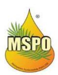
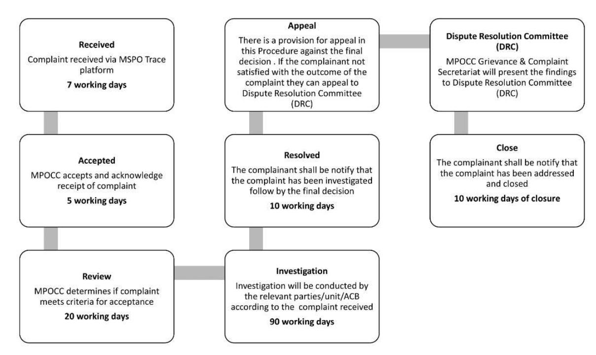
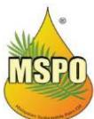

# Joint gap assessment of the EUDR information needs and information availability from the Malaysian Sustainable Palm Oil (MSPO) certification

Malaysian Sustainable Palm Oil (MSPO) and the European Forest Institute (EFI)

# Contents

| <b>SUMMARY .....</b>                                                                                                                     | <b>2</b>  |
|------------------------------------------------------------------------------------------------------------------------------------------|-----------|
| <b>1. INTRODUCTION .....</b>                                                                                                             | <b>5</b>  |
| 1.1 THE EU DEFORESTATION REGULATION.....                                                                                                 | 5         |
| 1.2 THE MALAYSIAN SUSTAINABLE PALM OIL (MSPO) CERTIFICATION.....                                                                         | 5         |
| 1.2.1 MSPO TRACE .....                                                                                                                   | 6         |
| 1.3 THE MALAYSIAN PALM OIL BOARD (MPOB).....                                                                                             | 6         |
| 1.3.1 SAWIT INTELLIGENT MANAGEMENT SYSTEM (SIMS) .....                                                                                   | 7         |
| 1.3.2 GEOPALM PORTAL.....                                                                                                                | 7         |
| 1.3.3 PERFORMANCE OF THE MALAYSIAN PALM OIL INDUSTRY .....                                                                               | 8         |
| <b>2. OBJECTIVES AND SCOPE .....</b>                                                                                                     | <b>8</b>  |
| <b>3. TASKS AND ACTIVITIES .....</b>                                                                                                     | <b>9</b>  |
| <b>4. EUDR INFORMATION NEEDS AND INFORMATION AVAILABLE FROM MSPO CERTIFICATION .....</b>                                                 | <b>9</b>  |
| 4.1 EUDR ARTICLE 9 – INFORMATION REQUIREMENTS .....                                                                                      | 9         |
| 4.1.1 ARTICLE 9 (1)(A)(B)(C)(E) – PRODUCT AND BUYER/SELLER INFORMATION .....                                                             | 10        |
| 4.1.2 ARTICLE 9 (1)(D) – GEOLOCATION .....                                                                                               | 11        |
| 4.1.3 ARTICLE 9(1)(G) – DEFORESTATION-FREE .....                                                                                         | 12        |
| 4.1.4 ARTICLE 9 (1)(H) – LEGALITY .....                                                                                                  | 14        |
| 4.2 TRACEABILITY INFORMATION .....                                                                                                       | 15        |
| 4.3 EUDR ARTICLE 10 – RISK ASSESSMENT.....                                                                                               | 18        |
| 4.3.1 ARTICLE 10(C)(D) AND (E) – INFORMATION REGARDING INDIGENOUS PEOPLES.....                                                           | 20        |
| 4.3.2 ARTICLE 10(I) – COMPLEXITY OF THE SUPPLY CHAIN .....                                                                               | 21        |
| 4.3.3 ARTICLE 10(J) – RISK OF CIRCUMVENTION OR MIXING PRODUCTS OF UNKNOWN ORIGIN OR FROM AREAS WHERE DEFORESTATION HAS OCCURRED ..... | 22        |
| 4.3.4 ARTICLE 10(M) – ANY INFORMATION THAT WOULD POINT TO A RISK THAT THE RELEVANT PRODUCTS ARE NON-COMPLIANT .....                   | 22        |
| 4.3.5 ARTICLE 10(N) AND (G) – INFORMATION AVAILABLE FROM CERTIFICATION SCHEMES .....                                                     | 23        |
| 4.4 MSPO IMPLEMENTATION GAP .....                                                                                                        | 24        |
| 4.4.1 MSPO 2022 TRANSITION PERIOD .....                                                                                                  | 24        |
| <b>5. SOLUTIONS TO CLOSE INFORMATION GAPS .....</b>                                                                                      | <b>24</b> |
| 5.1 GEOLOCATION INFORMATION.....                                                                                                         | 24        |
| 5.2 DEFORESTATION-FREE INFORMATION.....                                                                                                  | 24        |
| 5.3 LEGALITY INFORMATION .....                                                                                                           | 25        |
| 5.4 TRACEABILITY INFORMATION .....                                                                                                       | 25        |
| 5.5 RISK ASSESSMENT INFORMATION .....                                                                                                    | 25        |
| <b>6. OTHER RECOMMENDATIONS .....</b>                                                                                                    | <b>25</b> |
| <b>APPENDIX 1: EUDR DUE DILIGENCE STATEMENT .....</b>                                                                                    | <b>27</b> |

## **Summary**

The EU Deforestation Regulation (EUDR) – Malaysian Sustainable Palm Oil (MSPO) certification gap assessment aims to identify areas where the EUDR information needs align with information available from the MSPO certification scheme, and where information gaps exist. The assessment was conducted collaboratively between the European Forest Institute (EFI) and MSPO. The findings highlight the strength of MSPO as a potential source of information relevant for placing palm oil products on the EU market following entry into application of the EUDR on 30 December 2025, while also providing guidance for adaptation of MSPO certification to help provide EU operators with further information where gaps exist.

While the MSPO certification scheme was not designed to meet the EUDR requirements, the assessment found that through its mandatory 2022 standards (MS 2530:2022) MSPO contains much information that could be relevant for EU operators conducting due diligence checks on palm oil and palm oil products entering the EU market.

For example, the MSPO standards include provisions for collection and dissemination of third-party verified information on palm oil production in relation to a deforestation cut-off date of 31 December 2019, legal requirements regarding land use, environmental protection, labour rights, Free Prior Informed Consent (FPIC) and human rights. MSPO Trace has a traceability module as well as a repository of information on certified entities, including publicly accessible information of potential use for due diligence checks.

Despite these strengths, some key information gaps in relation to EUDR requirements remain:

#### **Key information gaps: EUDR Article 9 – Information requirements**

- **Geolocation information – Article 9 (1)(d).** Polygon information in line with EUDR requirements is not available for plots of land >4 ha. The coordinate and boundary information reported by Accredited Certification Bodies (ACBs) for all plot sizes is currently not in a format that can conveniently be transferred along the supply chain.
- **Deforestation-free information – Article 9 (1)(g).** MSPO and the EUDR use different forest definitions and additional information is therefore needed to ensure that MSPO-certified palm oil is not from areas that in 2021 were forest according to the EUDR/FAO definition.
- **Legality information – Article 9 (1)(h).** Information related to human rights protected under international law (Article 2 (40)(f)) as reflected in Malaysian legislation is not directly mentioned in the MSPO 2022 Standards.

#### **Key information gaps: Traceability**

- Palm oil produced by smallholders and sold through dealers cannot be traced to the plot of land, as collection of relevant information from dealers is not currently mandatory and its implementation will depend on Malaysian government policy after January 2025 when the transition period for the MSPO 2022 standards ends.
- MSPO Mass Balance supply chain model certified palm oil cannot be traced to the plot of land where it was produced due to mixing of certified products with products unverified for legal and deforestation-free production.

- MSPO Trace does not provide full traceability to the plot of land unless MSPO sales announcements are made. Additionally, as mentioned above, geolocation information is not in a format that can conveniently be transferred along the supply chain.

#### **Key information gaps: EUDR Article 10 – Risk assessment**

- Information gathered as part of MSPO certification such as High Conservation Value (HCV) assessments, Environmental Impact Assessments (EIA), Social Impact Assessments (SIA), etc. – is not publicly accessible.
- Relevant information from MSPO complaints and grievances is not publicly accessible.

Potential solutions to better align MSPO certification with the EUDR information requirements are as follows:

#### **Potential solutions: Geolocation information**

- Require Accredited CBs (ACBs) to report EUDR-aligned geolocation for MSPO Part 2 (independent smallholders and organised smallholders) and Part 3 (plantation) certified entities as follows: o Plots <4 ha - at least one latitude and one longitude point and using at least six decimal digits; o Plots >4 ha - polygons with sufficient latitude and longitude points to describe the perimeter of each plot of land;
- Establish a link between MSPO Trace and the Malaysian Palm Oil Board's (MPOB) Geopalm Portal[1](#page-3-0) , which contains EUDR-aligned geolocation information.

#### **Potential solutions: Deforestation-free information**

- Identify and publish information on 'deforestation-free' plantations, i.e. those established on land deforested before 31 Dec 2020 as per the EUDR/FAO definition.
- Align the forest definition in the MSPO 2022 standards with the FAO/EUDR definition so that the deforestation-free status of new plantings can be verified through the HCV mechanism.

#### **Potential solutions: Legality information**

- Include a list of laws applicable in Malaysia concerning the legal status of the area of production in terms of human rights protected under international law to better align with information needs of Article 2 (40)(f).

#### **Potential solutions: Traceability information**

- Make certification mandatory for dealers selling to EU markets.
- Collect EUDR-relevant information for the uncertified component of MSPO Mass Balance certified products.
- Use the MSPO Certified Segregated supply chain model for EU market.

1 An MPOB initiative under the National Agricommodity Policy (DAKN) (2021 – 2030) to develop an open access national palm oil map to further strengthen supply chain transparency. Mapping has started and focus has been on mapping of smallholders, which at the time of publication was 50% completed.

- Adapt MSPO's traceability system so EUDR-relevant information on geolocation, deforestation and legality can be uploaded by supply chain actors and transferred along the supply chain. Upgrades could include: o A traceability reporting module/interface for dealers. o An interface for CBs to upload EUDR-aligned geolocation information for oil palm areas certified under MSPO Part 2 and Part 3. o A link with MPOB's Geopalm Portal to allow access to EUDR-aligned geolocation/polygon information. o An interface for EU operators to access EUDR-relevant supply chain information. o Promote Segregated supply chain model for palm oil products entering the EU.

#### **Potential solutions: Risk assessment information**

- Make information, or a summary of information, gathered as part of MSPO certification e.g. in relation to Environmental Impact Assessments (EIA), Social Impact Assessments (SIA), High Conservation Value (HCV) assessments, records of engagement, maps, and FPIC processes, etc. accessible to supply chain actors and/or EU operators carrying out due diligence.
- Make outcomes of and information from the MSPO complaints and grievances mechanism, or summaries of such information, publicly accessible.

## **1. Introduction**

This section introduces the European Union Deforestation Regulation (EUDR), a law introduced to minimise the risk that commodities responsible for deforestation and forest degradation are placed on the EU market, and the Malaysian Sustainable Palm Oil (MSPO) certification, a national mandatory palm oil certification system. The Malaysian Palm Oil Board (MPOB), which is responsible for the regulation of the palm oil industry in Malaysia, plays a lead role in governance of the sector and ensures that all palm oil producers comply with MSPO certification requirements. In the following section, key elements of the EUDR are described. Subsequent sections outline EUDR-relevant information systems and tools managed by MSPO and MPOB.

## **1.1 The EU Deforestation Regulation**

The European Union Deforestation Regulation (EUDR) aims at minimising the risk that products from supply chains associated with deforestation or forest degradation are placed on the EU market or exported from it, and increasing EU demand for and trade in legal and 'deforestation-free' commodities and products.

The EUDR sets mandatory due diligence rules for operators placing relevant products on the EU market or exporting them from the EU. Operators and traders will have to confirm through a due diligence statement that the relevant products are deforestation free (produced on land that has not been subject to deforestation after 31 December 2020 as per the EUDR/FAO forest definition) and legal, i.e. produced in accordance with the relevant legislation of the country of production[2](#page-5-3) . Operators and traders placing relevant products on the EU market will need to comply with the EUDR rules as of 30 December 2025. EU operators and traders that are small- and medium-enterprises (SMEs) will have six additional months.

Palm oil is one of the seven commodities covered by the EUDR. In Malaysia, palm oil makes a significant contribution to the economy and to rural livelihoods due to the large number of smallholder farmers included in the production base. The EU is a significant market for Malaysian palm oil, ranking third as an export destination after India and China.

The EUDR acknowledges a role for "certification or other third-party verification systems" as a source of information for the risk assessment stage of the due diligence process (Article 10 (2)(n)), provided that the information meets the requirements set out in Article 9. There is no obligation for operators and traders to use any traceability system or scheme in meeting their obligation to collect and submit required information, notably geolocation information.

## **1.2 Malaysian Sustainable Palm Oil (MSPO) certification**

The Malaysian Sustainable Palm Oil (MSPO) certification was introduced in 2013 by the Malaysian government to enhance the sustainability and credibility of the Malaysian palm oil industry. MSPO certification provides a framework encompassing principles, criteria and indicators that address social, environmental and economic aspects of palm oil production.

2 'Relevant legislation of the country of production' means the laws applicable in the country of production concerning the legal status of the area of production in terms of: (a) land use rights; (b) environmental protection; (c) forest-related rules, including forest management and biodiversity conservation, where directly related to wood harvesting; (d) third parties' rights; (e) labour rights; (f) human rights protected under international law; (g) the principle of free, prior and informed consent (FPIC), including as set out in the UN Declaration on the Rights of Indigenous Peoples; (h) tax, anti-corruption, trade and customs regulations.

Initially, the certification was voluntary, aimed at encouraging industry players to adopt sustainable practices. However, recognising the global demand for sustainable palm oil and the importance of environmental and social protection, the Malaysian government made MSPO certification mandatory for all palm oil producers, beginning 2020.

The certification process involves third-party audits conducted by accredited certification bodies (ACBs) to ensure compliance with the standards. MSPO certification covers various actors in the palm oil supply chain, including smallholders, plantations and palm oil processing facilities.

As of April 2024, 87% of Malaysia's oil palm planted area and 87% of palm oil mills had been certified under the MSPO MS2530:2013 standard series. Malaysia has managed to certify 66% of the independent smallholder oil palm planted area with MSPO MS2530:2013. The palm oil sector in Malaysia will continue to be certified under the 2013 standard until 31 December 2024.

The updated MSPO standards (MS 2530:2022) were released in March 2022 to better meet global sustainability requirements. The revised standards include provisions prohibiting conversion of natural forests[3](#page-6-2) , protected areas and High Conservation Value (HCV) areas after the cut-off date of 31 December 2019. Additionally, a dealer standard is included to strengthen supply chain traceability, and indicators have been added on child rights, forced labour and ethical conduct.

### **1.2.1 MSPO Trace**

MSPO Trace was launched in November 2019 by the Malaysia Palm Oil Certification Council (MPOCC - now called MSPO) to monitor certification audits undertaken by Certification Bodies (CBs) and facilitate supply chain traceability. Currently, MSPO Trace shows data for independent smallholders (MSPO Part 2), organised smallholders and oil palm plantations (MSPO Part 3), palm oil mills (MSPO Part 4) and in relation to the MSPO Supply Chain Certification Standard (SCCS) which covers palm oil mills, kernel crushers, refineries, oleochemical and biodiesel plants, etc.

MSPO Trace includes four modules: Certification, Traceability, Logo, and Complaints and Grievances. The system contains information on certified entities including the following publicly accessible information:

- Name of company and parent company/group
- Certification status
- Coordinates of plantations/mills, state, certified area
- Downloadable MSPO certificate and public summaries of audit reports with boundary maps of estates.

## **1.3 The Malaysian Palm Oil Board (MPOB)**

The Malaysian Palm Oil Board (MPOB) is the government agency responsible for the promotion and development of the palm oil industry in Malaysia. The MSPO certification was developed under the auspices of MPOB to ensure sustainable practices in Malaysian palm oil production. However, to ensure credibility and impartiality of MSPO certification, Malaysian Palm Oil Certification Council (MPOCC) was established to take ownership and implementation of the MSPO certification scheme. MPOB plays a crucial role in the

Natural forest is defined as "primary forest, regenerated (second growth) forests, managed natural forests and partially degraded forests".

implementation of policies related to MSPO certification and in ensuring that the palm oil industry complies with the certification requirements.

The primary national law governing the palm oil sector across Peninsular Malaysia, Sabah and Sarawak is the Malaysian Palm Oil Board Act (the MPOB Act). The Act's licensing requirements extend to all estates and smallholders and cover aspects ranging from the production, sale and transport of oil palm planting material to the construction of oil palm mills, to the export or import of oil palm. The MPOB Act also mandates Malaysian Sustainable Palm Oil (MSPO) certification for all producers. Despite the comprehensive nature of the MPOB Act, MPOB, which administers the Act, has no authority over land use or forests – including the establishment of estates/plantations – or over labour or native rights.

MPOB manages several information systems of relevance in relation to EUDR information including the Sawit Intelligent Management System (SIMS), Geopalm Portal, and Performance of the Malaysian Palm Oil Industry[4](#page-7-2) (*Prestasi Industry Sawit Malaysia*), as described in the following sub-sections.

### **1.3.1 Sawit Intelligent Management System (SIMS)**

SIMS was launched by MPOB in November 2023 to trace and monitor oil palm supply chain transactions from the fresh fruit bunches (FFB) supplier to the manufacturer of palm products. Desktop and mobile app functions include:

- Data collection automation of daily records
- Traceability centralisation of relevant data to support supply chain traceability

The system covers 24 license categories across the palm oil value chain including, *inter alia*, Plantations, Trading, Manufacturing, Transportation and Exports. Information submitted by licensees is used to generate insights and guide actions. Regarding traceability, the SIMS platform allows for input and storage of palm oil product transaction details and tracking of palm oil origin, processing and distribution.

#### **1.3.2 Geopalm Portal**

The following policies, which are captured in the 2021 – 2030 National Agricommodity Policy (DAKN), were introduced in 2019 to support palm oil sustainability:

- Cap on total oil palm cultivated area to 6.5 million ha.
- No new planting of oil palm in peatlands.
- No conversion of permanent forest reserves (PFR) for oil palm cultivation.
- Develop an open access national oil palm map to further strengthen supply chain transparency.

The national oil palm mapping work, which is presented through the Geopalm Portal, includes mapping of oil palm cover, identification of oil palm planted in peatlands and PRFs, identification of oil palm areas by cadastral lot, classification of oil palm areas by age, and identification of oil palm planted on slopes and in riparian zones. Polygon information in line with EUDR requirements is being collected for plantations larger than four hectares. Mapping has so far focused on smallholders, with approximately 50% having been completed at the time of publication. Geolocation information is overlayed with maps of PRFs and peatlands and verified on the ground by MPOB staff. On completion of the work,

4 <https://prestasisawit.mpob.gov.my/ms>

the Geopalm Portal and relevant information on each geolocation will be made publicly accessible.

### **1.3.3 Performance of the Malaysian Palm Oil Industry**

The Malaysian Oil Palm Industry Performance (or *Prestasi Industry Sawit Malaysia*) is a web portal hosted by MPOB, which contains national, state and district level data of potential relevance to EU operators carrying out due diligence checks. The data on the web portal is updated monthly and annually, and includes information such as:

- Palm oil planted area by state and district.
- Number of palm oil processing facility by sector and their distribution at the state and district levels.
- Oil Extraction Rate (OER) by mill and OER figures for states and districts.
- Average Fresh Fruit Bunch (FFB) yield of oil palm plantations across states and districts.

## **2. Objectives and scope**

The objectives of this joint assessment are to:

- 1. Identify areas where EUDR and MSPO information requirements and availability are aligned, and where discrepancies or gaps exist.
- 2. Formulate recommendations for actions and activities to be carried out to close the gaps between MSPO and the EUDR.

The scope of this assessment includes the following elements of the EUDR and MSPO certification:

- 1. EUDR: All relevant articles in the EUDR. The FAQ document developed by the European Commission will be referred to when clarification is needed.
- 2. MSPO: MS 2530:2022 which consists of the four main parts and eight (8) separate sections as follows:
  - a. Part 1: General Principles
  - b. Part 2-1: General Principles for Independent Smallholders (<40.46 ha)
  - c. Part 2-2: General Principles for Organised Smallholders (< 40.46 ha)
  - d. Part 3-1: General Principles for Oil Palm Plantations (40.46 ha to 500 ha)
  - e. Part 3-2: General Principles for Oil Palm Plantations (more than 500 ha)
  - f. Part 4-1: General Principles for Palm Oil Mill including Supply Chain Requirements
  - g. Part 4-2: General Principles for Palm Oil Processing Facilities including Supply Chain Requirements
  - h. Part 4-3: General Principles for Dealers including Supply Chain Requirements
- 3. Official MSPO documents such as scheme documents, guidance documents and other relevant documents determined together with MSPO.
- 4. Solutions and alignment of MSPO through consultation with relevant stakeholders.

## **3. Tasks and activities**

The assessment was jointly implemented by MSPO and EFI through implementation of the following tasks and activities:

**Compare information requirements under the EUDR and the MSPO certification scheme.** 

This included identification of information requirements according to articles in the EUDR; identification of information availability from MSPO standards and scheme documents; and identification of additional elements being developed under the MSPO standards.

**Develop a comprehensive action plan to address the identified gaps.** 

This task included identification of actions needed to close gaps identified under point 1 above, including implementation gaps, with MSPO and other relevant palm oil agencies; identification of key entities (MSPO, MPOB, ACBs, TUNAS officers, etc.) responsible for the recommended actions; consideration of ongoing processes or initiatives undertaken by MSPO and other relevant national agencies that could support implementation of the identified actions; and consultation with relevant government agencies and/or industry where needed to ensure that recommendations to fill gaps are feasible.

## **4. EUDR information needs and information available from MSPO certification**

## **4.1 EUDR Article 9 – Information requirements**

Article 9 (1) of the EUDR states that the **operator** shall **collect, organise and keep for five years** from the date of the placing on the market or of the export of the relevant products the following information, accompanied by evidence, relating to each relevant product:

- a. a **description**, including the trade name and type of the relevant products.
- b. the **quantity** of the relevant products; for relevant products entering or leaving the market, the quantity is to be expressed in kilograms of net mass.
- c. the **country of production** and, where relevant, parts thereof.
- d. the **geolocation** of all plots of land where the relevant commodities that the relevant product contains, or has been made using, were produced, as well as the date or time range of production.
- e. the **name, postal address and email address** of any business or person from whom they have been supplied with the relevant products.
- f. the **name, postal address and email address** of any business, operator or trader to whom the relevant products have been supplied.
- g. adequately conclusive and verifiable information that the relevant products are **deforestation free**.
- h. adequately conclusive and verifiable information that the relevant commodities have been **produced in accordance with the relevant legislation of the country of production**, including any arrangement conferring the right to use the respective area for the purposes of the production of the relevant commodity.

**Article 9 (2)** states that "the operator shall make available to the competent authorities upon request the information, documents and data collected under this Article".

Annex II of the EUDR outlines information to be contained in the due diligence statement (See Appendix 1), which includes a subset of Article 9 information on the operator's details, the product description, the "**country of production** and the **geolocation of all plots of land** where the relevant commodities were produced", and confirmation that the products are **legal and deforestation free**. The EUDR FAQ document notes that "no personal information is required from the farmers unless they are direct suppliers of the operators or operators themselves. The geolocation of the land they cultivate is sufficient".

Article 33 notes that "by 30 December 2024, the Commission shall establish and subsequently shall maintain an information system which shall contain the due diligence statements".

The following subsections indicate alignment between EUDR information requirements under Article 9 elements in relation to information collected as part of MSPO certification.

## **4.1.1 Article 9 (1)(a)(b)(c)(e)– Product and buyer/seller information**

These elements cover information on the products bought and sold, and the merchants with whom the operator interacts directly. As harvested oil palm Fresh Fruit Bunches (FFBs) are processed domestically, information relevant in relation to these elements would be derived primarily from supply chain actors certified under MSPO Standard Series Part 4 (Mills, Palm Oil Processing Facilities and Dealers), as outlined in Table 1.

#### **Table 1. Relevant EUDR Article 9 (1)(a)(b)(c)(e) information from MSPO certification**

| EUDR requirement MSPO Certification |                                            |
|-------------------------------------|--------------------------------------------|
| Part 4-1: General Principles for    | Palm Oil Mills                             |
| Part 4-2: General Principles for    | Palm Oil Processing                        |
| Facilities                          | including Supply Chain Requirements        |
| Part 4-3: General Principles for    | Dealers including                          |
| o 4.2 Principle 2: Transparency     |                                            |
| ▪                                   | 4.2.2 Criterion 2: Traceability            |
| Article 9(1)(a) – a description ,   |                                            |
|                                     | a) The name and address of the seller/     |
|                                     | b) Product(s) identification including the |
|                                     | c) The quantity of the products delivered; |
| Article 9(1)(b) - the quantity of   |                                            |
| Article 9(1)(c) - the country of    |                                            |

| Article 9(1)(e) - supplier name, |                                           |
|----------------------------------|-------------------------------------------|
| d)                               | The loading or delivery date;             |
| e)                               | Related transportation documentation with |
| f)                               | MSPO certificate number; and              |
| g)                               | MSPO certificate validity.                |

Additionally, all entities certified under Part 4 of the MSPO Standard Series are required to register in MSPO Trace and provide supply chain information in the Traceability Module as outlined in Table 2.

#### **Table 2. Relevant EUDR Article 9 (1) information from the MSPO Trace traceability module**

| MSPO Standard series                                          | EUDR-relevant information                                                                                                                                                                                                                                                                                                                                                      |
|---------------------------------------------------------------|--------------------------------------------------------------------------------------------------------------------------------------------------------------------------------------------------------------------------------------------------------------------------------------------------------------------------------------------------------------------------------|
| Part 4-1 Palm Oil Mills                                       | <ul> <li>List of all suppliers and buyers of MSPO certified and uncertified FFB and palm oil products</li> <li>Monthly reporting of cumulative total of MSPO certified Crude Palm Oil (CPO) and Palm Kernel Oil (PKO) production volume every month.</li> <li>Monthly reporting of total weight of MSPO certified and non-certified FFB received from each supplier</li> </ul> |
| Part 4-2 Palm Oil Processing Facilities, and Part 4-3 dealers | <ul> <li>List of all suppliers and buyers of MSPO certified palm oil products and/or materials in the system</li> </ul>                                                                                                                                                                                                                                                        |

## **4.1.2 Article 9 (1)(d) – Geolocation**

Article 9 (1)(d) refers to "the geolocation of all plots of land where the relevant commodities that the relevant product contains, or has been made using, were produced, as well as the date or time range of production".

#### **Box 1. MSPO information gaps: Article 9 (1)(a)(b)(c)(e) – Product and buyer/seller information**

- 1. Records of sales, delivery or transportation reported by Palm Oil Mills, Palm Oil Processing and Dealers (Part 4) does not specify **email address** of the buyer and seller.

#### **Definition - EUDR Article 2 (28)**

**"Geolocation"** means the geographical location of a plot of land described by means of latitude and longitude coordinates corresponding to at least one latitude and one longitude point and using at least six decimal digits; for plots of land of more than four hectares used for the production of the relevant commodities other than cattle, this shall be provided using polygons with sufficient latitude and longitude points to describe the perimeter of each plot of land

As per the above, EU operators need to collect geolocation information (polygons for plots >4ha) for all plots of land used for the production of relevant commodities. In most cases, this information will need to be transferred up the supply chain from the producer. Regarding MSPO certification, auditors from Accredited Certification Bodies (ACBs) are responsible for collection and reporting coordinate information for MSPO Part 2 organisations (smallholders) and boundary information for MSPO Part 3 organisations (plantations).

Requirements for geolocation information can be found in the MSPO Certification Scheme Document (General Requirements for Accredited Certification Bodies – Section 3) as follows:

- 1. The MSPO Certification Audit Public Summary Report shall include a map of appropriate scale showing the location and external boundary of the certified area.
- 2. MSPO certificates issued by the ACBs shall contain GPS coordinates of management units.

Reporting of coordinate and boundary information in MSPO Trace is mandatory for ACBs. Coordinates for all certified plantations can be viewed on the platform and MSPO certificates, and the boundary maps can be viewed in the public summary of the audit report.

For traceability purposes, MSPO Trace captures information from palm oil mills on both their certified and non-certified suppliers. Submitted information includes MPOB licence details as proof of legality. Mills also have the option of reporting the GPS coordinates of non-certified suppliers.

## **4.1.3 Article 9(1)(g) – Deforestation-free**

EUDR Article 9 (1)(g) requires "adequately conclusive and verifiable information that the relevant products are deforestation-free".

### **Box 2. MSPO gaps: Article 9 (1)(d) – Geolocation information**

- 1. Polygon information in line with EUDR requirement is not available for plots of land >4ha.
- 2. The coordinate and boundary information in MSPO Trace is not in electronic format and cannot therefore be conveniently transferred along the supply chain.

### **Definition – EUDR Article 2(3)**:

**"Deforestation"** means the conversion of forest to agricultural use, whether humaninduced or not.

### **Definition – EUDR Article 2(4)**:

**"Forest"** means land spanning more than 0,5 hectares with trees higher than 5 metres and a canopy cover of more than 10%, or trees able to reach those thresholds in situ, excluding land that is predominantly under agricultural or urban land use.

In relation to deforestation-free information, MSPO Criterion 4.1.2 on new planting is most relevant. According to Indicator 4.1.2.1, new planting shall be carried out with the consideration of the following:

- a. **No conversion of natural forest, protected areas, and High Conservation Value areas after 31 December 2019**.
- b. Updated information on soil types and topography, and
- c. New planting on the following shall be prohibited unless permitted by the state authorities that have jurisdiction over land matters:
  - a. steep terrain exceeding areas located 300 m above sea level;
  - b. fragile and marginal soils;
  - c. peat land;
  - d. riparian zones.

#### **Definition - EUDR Article 2 (13)**:

"**Deforestation free"** means that the relevant products contain, have been fed with or have been made using, relevant commodities that were produced on land that has not been subject to deforestation after 31 December 2020.

**Definition – MSPO Standard Series Part 1: General principles (Section 3)**: **"Deforestation"** is defined as the loss of natural forest as a result of:

- conversion to agriculture or other non-forest land use;
- conversion to a tree plantation; or
- severe and sustained degradation

**Definition**: **Definition – MSPO Standard Series Part 1: General principles (Section 3)**:

**"Natural Forest** is defined as "primary forest, regenerated (second growth) forests, managed natural forests and partially degraded forests".

Regarding **delineation between 'natural forest' and 'tree plantation'** the MSPO standards refer to the Operational Guidance on Applying the Definitions Related to Deforestation, Conversion, and Protection of Ecosystems which is an Accountability Framework Initiative (AFI) guidance document. The AFI defines forest according to the FAO definition which is the definition adopted in the EUDR.

#### **Box 3. MSPO gaps: Article 9 (1)(g)** *–* **Deforestation-free information**

- 1. MSPO does not follow the EUDR/FAO forest and deforestation definitions.

## **4.1.4 Article 9 (1)(h) – Legality**

Article 9 (1)(h) of the EUDR refers to "adequately conclusive and verifiable information that the relevant commodities have been **produced in accordance with the relevant legislation of the country of production**, including any arrangement conferring the right to use the respective area for the purposes of the production of the relevant commodity".

MSPO sources of information related to areas of Malaysian legislation that is relevant to the EUDR are shown in Table 3. Requirements are captured in the MSPO standards and compliance is checked and reported by ACBs in the audit report.

**Table 3. MSPO information related to areas of Malaysian legislation relevant to the EUDR**

| EUDR relevant area of legislation | MSPO Criteria                      |
|-----------------------------------|------------------------------------|
| a) land use rights                | 4.3.2 Rights to use land           |
| b) environmental protection       | 4.5.1 Environmental management     |
| c) forest-related rules           | Not Applicable                     |
| d) third parties’ rights;         | 4.3.3 Native customary rights      |
| e) labour rights;                 | 4.4.2 Employee's safety and health |

#### **Definition - Article 2 (40)**:

- The EUDR defines '**relevant legislation of the country of production'** as the laws applicable in the country of production concerning the legal status of the area of production' in terms of:
- a) land use rights;
- b) environmental protection;
- c) forest-related rules, including forest management and biodiversity conservation, where directly related to wood harvesting;
- d) third parties' rights;
- e) labour rights;
- f) human rights protected under international law;
- g) the principle of free, prior and informed consent (FPIC), including as set out in the UN Declaration on the Rights of Indigenous Peoples;
- h) tax, anti-corruption, trade and customs regulations.

Appendix 4 of the MSPO Guidance Documents includes a list of laws relevant to the Malaysian oil palm industry. Certified entities are required to prepare and maintain a Legal Register (LORR) covering all the necessary regulatory requirements. The LORR is reviewed and updated periodically, and its implementation is verified by ACBs during the annual audits.

The legality requirements of MSPO are re-enforced through the MPOB licencing system. Activities from the cultivation of palm oil to the export are registered and licensed in accordance with the Malaysian Palm Oil Board Act 1998 (Act 582) and Malaysian Palm Oil Board (Licensing) Regulations 2005 and Malaysian Palm Oil Board (Licensing) (Amendment) Regulations 2011, where MSPO Certification is mandatory for all plantations since 1 Jan 2020. To sell FFB and move oil palm fruit, oil palm growers must apply for and be granted a trading licence from MPOB which is valid for five years and renewable.

## **4.2 Traceability information**

Traceability to the plot of land is necessary in facilitating assessment of legal and deforestation-free production in the geolocation in which commodities were produced. According to the EUDR FAQ, *"for products traded in bulk, such as soy or palm oil, the operator needs to ensure that all plots of land involved in a shipment are identified and that the commodities are not mixed at any step of the process with commodities of unknown origin or from areas deforested or degraded after the cut-off date of 31 December 2020"*.

Information on traceability is collected in relation to MSPO Standard Principle 4.2: Transparency, Criterion 4.2.2: Traceability, where there are seven indicators relevant to traceability, traceability models and accounting systems.

Traceability data is managed through the MSPO Trace traceability module and begins with information from the plantation. Information on traceability models begins at the mill/collection centre. Traceability requirements captured under MSPO Standard Series Part 4-1, 4-2 and 4-3[5](#page-15-1) , Principle 4.2: Transparency are as follows:

Criterion 4.2.2: Traceability - A system or procedure(s) for traceability along the supply chain shall be established and documented whereby traceability starts at the plantation and/or smallholding.

- **Indicator 4.2.2.1**: The organisation shall establish, implement and maintain a standard operating procedure to comply with the requirements for traceability of the relevant product(s).

#### **Box 4. MSPO gaps: Article 9 (1)(h) – Legality**

- 1. Information regarding legal requirements specified in Article 2 (40)(f) relevant Malaysian legislation concerning the legal status of the area of production in terms of human rights protected under international law is not directly mentioned in the MSPO 2022 Standards.

5 Part 4-1: General Principles for Palm Oil Mills including Supply Chain Requirements; Part 4-2: General Principles for Palm Oil Processing Facilities including Supply Chain Requirements; Part 4-3: General Principles for Dealers including Supply Chain Requirements.

- **Indicator 4.2.2.2**: The organisation and smallholders shall keep records of sales, MPOB license, planted area, fresh fruit bunch (FFB) tonnage and delivery of FFB.
- **Indicator 4.2.2.3**: The organisation shall appoint a management representative(s) who have overall responsibility and authority for the organisation's traceability.
- **Indicator 4.2.2.4**: The organisation shall establish and maintain accurate and up-todate records to provide evidence of conformity in the implementation of the traceability system. The records shall be maintained for a minimum of 24 months.
- **Indicator 4.2.2.5**: The organisation shall have documented procedures for handling non-conforming palm oil products and/or documents.
- **Indicator 4.2.2.6**: Traceability models:
- Two supply chain models can be applied under the MSPO standards: the Segregated and Mass Balance models. The traceability models start at the mill/collection centre. o **The Segregated (SG)** model strives for 100% separation where the approach requires that the MSPO-certified palm oil products shall be kept separated from non-MSPO SG products at every stage of processing throughout the supply chain. This model only allows mixing of MSPO SG certified palm oil products from certified sources. o **The Mass Balance (MB)** model allows for the mixing of MSPO certified and non-MSPO certified palm oil products at any stage in the supply chain, provided that overall quantities are controlled. There are no requirements for separate storage, transportation or controls in the production process and the uncertified components are not verified for origin, or for deforestation-free or legal production.

All MSPO Standard Series Part 4 certified organisations are required to register with the MSPO Trace Traceability Module after receiving their MSPO certificate. Information required from relevant organisations can be found in the *MSPO Certification Scheme Document on Rules for Use of MSPO Trace* and this is outlined in Table 4.

**Table 4. MSPO Trace traceability module information requirements**

| MSPO Part 4 organisation/s | Requirements                                                                                                                                                                                                                                                                                                                                                                                                                                                                                                                                                                                                                                                                                                                                                                     |
|----------------------------|----------------------------------------------------------------------------------------------------------------------------------------------------------------------------------------------------------------------------------------------------------------------------------------------------------------------------------------------------------------------------------------------------------------------------------------------------------------------------------------------------------------------------------------------------------------------------------------------------------------------------------------------------------------------------------------------------------------------------------------------------------------------------------|
| Palm Oil Mills             | 
<b>Registration of suppliers and buyers</b>
 <ul> <li>All suppliers (input) of MSPO certified and uncertified FFB shall be registered in the MSPO Traceability module.</li> <li>All buyers (output) for MSPO certified FFB and palm oil products shall be registered in the MSPO Trace.</li> <li>Millers shall register FFB dealers as a supplier.</li> <li>In the case of FFB diversion from one mill (A) to another mill (B), the receiving mill (B) shall be registered as a buyer of the sending mill (A).</li> </ul> 
<b>Upload monthly MSPO certified and non-certified FFB receiving list</b>
 <ul> <li>The mills shall record and upload the weight of total FFB received by supplier, following the FFB Supplier Template provided in the system.</li> </ul> |

|                                                                                                  | <ul> <li>Based on the input, the system will determine if the supplier is producing MSPO certified FFB or uncertified FFB.</li> </ul>                                                                                                                                                                                                                                                                                                                                                   |
|--------------------------------------------------------------------------------------------------|-----------------------------------------------------------------------------------------------------------------------------------------------------------------------------------------------------------------------------------------------------------------------------------------------------------------------------------------------------------------------------------------------------------------------------------------------------------------------------------------|
|                                                                                                  | <b>Sales Announcements</b> <ul> <li>All sales of MSPO certified palm oil products shall be announced in MSPO Trace.</li> <li>Sales announcement shall be on a contract basis.</li> <li>Sellers shall make MSPO sales announcements within 30 days after the completion of contract.</li> </ul>                                                                                                                                                                                          |
| <b>Refineries, Palm Kernel Crushers, Oleochemical Plants, Biodiesel Plants, Palm Oil Product</b> | <b>Registration of suppliers and buyers</b> <ul> <li>All suppliers (input) and buyers (output) for MSPO certified palm oil products and/or materials shall be registered in the system.</li> </ul>                                                                                                                                                                                                                                                                                      |
|                                                                                                  | <b>Sales announcement</b> <ul> <li>All sales of MSPO certified palm oil products and/or materials shall be announced in MSPO Trace.</li> <li>Sales announcement shall be by contract basis.</li> <li>Sellers shall make MSPO sales announcements within 30 days after the completion of contract.</li> </ul>                                                                                                                                                                            |
|                                                                                                  | <b>Registration of suppliers and buyers</b> <ul> <li>All suppliers (input) of MSPO certified and uncertified FFB shall be registered in the MSPO Traceability module.</li> <li>All buyers (output) for MSPO certified and uncertified FFB shall be registered in the MSPO Trace Traceability module.</li> <li>In the case of an FFB dealer (A) selling to another FFB dealer (B), the receiving FFB dealer (B) shall be registered as a buyer of the sending FFB dealer (A).</li> </ul> |
| <b>FFB Dealers</b>                                                                               | <b>Upload monthly MSPO certified and non-certified FFB receiving list</b> <ul> <li>The FFB dealer shall record and upload the total weight of FFB received by the supplier, following the FFB supplier template provided in the system.</li> <li>Based on the input, the system will automatically determine if the supplier is producing MSPO certified FFB or uncertified FFB.</li> </ul>                                                                                             |
|                                                                                                  | <b>Sales announcement</b> <ul> <li>All sales of MSPO certified palm oil products shall be announced in MSPO Trace.</li> <li>Sales announcement shall be by contract basis.</li> <li>Sellers shall make MSPO sales announcements within 30 days after the completion of contract.</li> </ul>                                                                                                                                                                                             |

## **4.3 EUDR Article 10 – Risk assessment**

Article 10 (1) of the EUDR requires operators to verify and analyse the information collected under Article 9 and any other relevant information, to establish whether there is a risk that the relevant products intended to be placed on the market or exported are non-compliant. Operators shall not place the relevant products on the market or export them, except where the risk assessment reveals no or only a negligible risk that the relevant products are noncompliant.

Article 10 (2) requires that the risk assessment take into account a set of 14 criteria covering, *inter alia*, forests, indigenous people, traceability and substantiated concerns (Table 5). Four of the criteria apply at the level of the country of production or parts thereof, which is generally outside the scope of product-based certification schemes. However, MSPO certification could provide information relevant to criteria where information regarding the area of production and supply chain is relevant.

#### **Box 5. MSPO gaps: Traceability information**

- 1. Palm oil produced by smallholders and sold via dealers cannot be traced back to the plot of land until dealers are certified.
- 2. MSPO Mass Balance certified products cannot be traced back to the plot of land and cannot be verified for legal and deforestation-free production because of mixing of palm oil from certified and uncertified sources.
- 3. Gaps regarding the MSPO Trace traceability platform:
  - a. MSPO Trace cannot trace palm oil products back to the plot unless sales announcements are made.
  - b. MSPO Trace does not record transactions in real time. MSPO sales announcements are made within 30 days of completion of a contract, and dealers and mills submit total weight of FFB received by their supplier to MSPO Trace monthly.
  - c. MSPO Trace does not store geolocation information (including polygon information for plots larger than 4ha) in a format that can be conveniently transferred along the supply chain.
  - d. MSPO Trace cannot trace palm oil products back to the plot of land for smallholders selling via dealers, as dealers are not yet certified and the relevant MSPO Trace dealer interface is still under development.

**Definition - EUDR Article 2 (25)** 

"**Non-compliant products**" means relevant products that do not comply with Article 3.

**Table 5. EUDR risk assessment criteria and information available from MSPO certification** 

|    | Article 10 (2) risk assessment criteria Information available   |
|----|-----------------------------------------------------------------|
| b) | the presence of forests in the country of production or parts   |
| c) | the presence of indigenous peoples in the country of            |
| d) | the consultation and cooperation in good faith with             |
| e) | the existence of duly reasoned claims by indigenous peoples     |
| f) | prevalence of deforestation or forest degradation in the        |
| g) | the source, reliability, validity, and links to other available |
| h) | concerns in relation to the country of production and origin or |
| i) | the complexity of the relevant supply chain and the stage of    |
| j) | the risk of circumvention of this Regulation or of mixing with  |
| k) | conclusions of the meetings of the Commission expert            |
| l) | substantiated concerns submitted under Article 31, and          |

| n) complementary information on compliance with this Regulation, which may include information supplied by certification or other third-party verified schemes, including voluntary schemes recognised by the Commission under Article 30(5) of Directive (EU) 2018/2001 of the European Parliament and of the Council (21), provided that the information meets the requirements set out in Article 9 of this Regulation | MSPO Third-Party Audit Reports |
|---------------------------------------------------------------------------------------------------------------------------------------------------------------------------------------------------------------------------------------------------------------------------------------------------------------------------------------------------------------------------------------------------------------------------|--------------------------------|
|---------------------------------------------------------------------------------------------------------------------------------------------------------------------------------------------------------------------------------------------------------------------------------------------------------------------------------------------------------------------------------------------------------------------------|--------------------------------|

#### **4.3.1 Article 10(c)(d) and (e) – Information regarding Indigenous Peoples**

Information relevant to Indigenous Peoples can be found in the MSPO Standard Series Parts 2 and 3 under Principle 4.1: Management commitment and responsibility, and Principle 4.3: Compliance with legal and other requirements. To demonstrate compliance, certified organisations need to maintain records of mapping, consultations, free, prior and informed consent (FPIC), and how grievances are addressed. This information is of potential use in risk assessments at the level of the area of production and a summary is reported by Accredited Certification Bodies (ACBs) in public summaries of audit reports.

**Table 3: EUDR articles relevant to Indigenous Peoples and information available from MSPO certification**

| Article 10 (2) risk assessment criteria requirements                                                                   | MSPO Standard Series Parts 2 and 3 Principle 4.3: Compliance with legal and other                                                                             |
|------------------------------------------------------------------------------------------------------------------------|---------------------------------------------------------------------------------------------------------------------------------------------------------------|
| Article 10(c) the presence of                                                                                          | Criterion 4.3.2: Rights to use land                                                                                                                           |
| Indicator 4.3.2.4: indigenous peoples in the country of production or parts thereof                                    | All operations by any organisation should also be a map showing the legal area and location of the boundary markers. Criterion 4.3.3: Native customary rights |
| Indicator 4.3.3.2: stakeholders                                                                                        | Customary rights areas should be involving affected parties (including neighbouring should maintain records of engagement including                           |
| Article 10(d) the consultation                                                                                         | Criterion 4.3.2: Rights to use land                                                                                                                           |
| Indicator 4.3.2.2: and cooperation in good faith with indigenous peoples in the country of production or parts thereof | Where customary or legally owned lands have been taken over, there should be payment or provision of agreed compensation.                                     |
| Indicator 4.3.2.3: channel.                                                                                            | FPIC have to be obtained prior to upon. Hence, these documents should be used as mechanism should be used or dealt through legal                              |

|                                                                                                                                                                                         | 4.4.1 Criterion 1: Social Impact Assessment (SIA) the participation of stakeholders. be conducted with the participation of relevant by the scheme owner to mitigate security and child rights shall be incorporated as aspects to be assessed, if applicable. 4.2.1.1 Indicator 1: Communication and |
|-----------------------------------------------------------------------------------------------------------------------------------------------------------------------------------------|-------------------------------------------------------------------------------------------------------------------------------------------------------------------------------------------------------------------------------------------------------------------------------------------------------|
| consultation identified.                                                                                                                                                                | procedures shall be established and communicated to relevant stakeholders. 4.2.1.2 Indicator 2: Stakeholders shall be A list of stakeholders and records of all response to input from stakeholders, shall be maintained.                                                                             |
| Article 10(e) the existence of duly reasoned claims by handling                                                                                                                         | Criterion 4.1.8: Complaints and grievances                                                                                                                                                                                                                                                            |
| Indicator 4.1.8.1: indigenous peoples based on objective and verifiable information regarding the use or ownership of the area used for the purpose of producing the relevant commodity | The organisation should ensure that grievance procedure is easily accessible and user ensure anonymity when required                                                                                                                                                                                 |

## **4.3.2 Article 10(i) – Complexity of the supply chain**

Article 10 (2)(i) specifies a requirement for risk assessment in relation to the complexity of the relevant supply chain and the stage of processing of the relevant products, in particular difficulties in connecting relevant products to the plot of land where the relevant commodities were produced.

Complexity in palm oil supply chains is frequently present between the plantation and mill, especially in relation to fresh fruit bunches (FFB) sourced from independent smallholders. According to MPOB, there are approximately 215,000 independent smallholders in Malaysia cultivating approximately 822,073 ha of land – these smallholders represent 28% of the palm oil production in Malaysia.

Independent smallholders depend on intermediaries (dealers/traders) to buy and transport their FFBs to the mill. But as dealers are not certified and as they are not required to pass relevant information on the area of FFB production to the mill, tracing palm oil back to the plot of land on where FFBs were cultivated is not possible. Additionally, the smallholders and mills that dealers transact with can change frequently, further complicating the situation.

To address the gap in independent smallholder traceability, MSPO developed a new dealer standard. Dealers can be certified against MS2530:2022 Part 4-3 from January 2025, but its mandatory implementation will depend on Malaysian government policy.

Mills sourcing solely from their own plantations or from plantations owned by the same group or parent company have less complex supply chains, while independent mills often have the most complex supply chains due to the diversity of sources from which they derive FFB,

including independent smallholders. Segregated MSPO certified palm oil is likely to be derived from lower-complexity supply chains and further information could potentially be available in audit reports.

#### **4.3.3 Article 10(j) – Risk of circumvention or mixing products of unknown origin or from areas where deforestation has occurred**

Article 10(j) refers to "the risk of circumvention of this Regulation or of mixing with relevant products of unknown origin or produced in areas where deforestation or forest degradation has occurred or is occurring".

However, unless EUDR-relevant information is available to operators for both certified and uncertified portions, the risk of mixing with unknown or deforestation related products would be difficult to assess and likely non-negligible.

Even though MSPO is a mandatory certification, a Mass Balance supply chain model is needed to:

- 1. Ensure inclusion of smallholders who are not yet certified.
- 2. Allow continued production while certified entities correct non-conformities requested by ACBs, during which time certification might be suspended.

The risk of mixing with palm oil products of unknown origin or produced in areas where deforestation has taken place is present for products certified under the Mass Balance supply chain model.

#### **4.3.4 Article 10(m) – Any information that would point to a risk that the relevant products are non-compliant**

Complaints or appeals regarding MSPO can be made through the MSPO Trace 'Complaints & Grievances' section. The same section can also be used check the status of lodged complaints or grievances.

Special audits are usually conducted to verify complaints, grievances, issues or news articles against the applicable entity. Procedures for handling complaints and grievances are outlined in Figure 2.

**Figure 2. MSPO Complaints and Appeals procedures**

#### **4.3.5 Article 10(n) and (g) – information available from certification schemes**

Article 10 (2n) refers to "complementary information on compliance with this Regulation, which may include information supplied by certification or other third-party verified schemes, including voluntary schemes recognised by the Commission under Article 30(5) of Directive (EU) 2018/2001 of the European Parliament and of the Council (21), provided that the information meets the requirements set out in Article 9 of this Regulation".

Article 10 (2g) refers to "the source, reliability, validity, and links to other available documentation of the information referred to in Article 9(1)".

Third-party audit reports developed by Accredited Certification Bodies (ACBs) as part of MSPO certification provide information linked to Article 9(1) which could be used for risk assessment under Article 10(2n) and 10(2g).

MSPO audit reports go through a peer review process by two independent experts to ensure that the report has the necessary content to act for the award of a certificate.

A summary of the ACB's audit report, including a summary of findings on the auditee's assessment of conformity against the certification standard, is required to be uploaded to MSPO Trace within seven working days of the date of issuance of certificate by the ACB. The summary is required to include a map of appropriate scale showing the location and external boundary of the certified area.

### **4.4 MSPO implementation gap**

## **4.4.1 MSPO 2022 transition period**

The revised MSPO Standards Series (MS2530:2022) and Scheme Documents are in a 17 month transition period (1 August 2023 - 31 Dec 2024), meaning that MSPO-certified entities will not necessarily be certified under the new standards until early 2025. This is particularly relevant in relation to the deforestation cut-off date.

Implications of the MSPO transition period include:

- 1. Verification of no deforestation after the 31 December 2019 cut-off date will only begin in January 2025.
- 2. Palm oil produced by independent smallholders and sold via dealers will not be traceable back to the plot of land until January 2025.
- 3. No third-party verification until the revised MS2530:2022 standard series comes into full implementation in January 2025.

## **5. Solutions to close information gaps**

## **5.1 Geolocation information**

- 1. Include geolocation reporting in line with EUDR as a requirement by Accredited Certification Bodies (ACBs) for plantations as follows:
  - a. Plots <4ha at least one latitude and one longitude point and using at least six decimal digits;
  - b. Plots >4ha polygons with sufficient latitude and longitude points to describe the perimeter of each plot of land.
- 2. For smallholders, MSPO is exploring options for interoperability between MSPO Trace and MPOB's Geopalm Portal.

## **5.2 Deforestation-free information**

- 1. Explore alignment of the MSPO forest definition with the FAO/EUDR forest definition.
- 2. Align the forest definition in the MSPO Standards with the FAO/EUDR definition and use the HCV mechanism to provide information regarding the status of new plantings.

#### **Box 6. MSPO Gaps: Article 10 – Risk assessment information**

- 1. Information gathered as part of MSPO certification e.g. in relation to Environmental Impact Assessments (EIA), Social Impact Assessments (SIA), and High Conservation Value (HCV) assessments, records of engagement, maps and FPIC processes is kept/maintained by the certified organisation and checked by ACBs is not accessible to supply chain actors or EU operators carrying out due diligence.
- 2. Outcomes of, and information from, the MSPO complaints and grievances mechanism is not publicly accessible.

## **5.3 Legality information**

- 1. MSPO to produce a list of international human rights conventions that are implemented through Malaysian legislation to provide EU operators with a source of information aligned with Article 2 (40)(f). This could be included as part of the MSPO guidance documents.

## **5.4 Traceability information**

- 1. Adapt MSPO's traceability system so that EUDR-relevant information on geolocation, and legal and deforestation-free production can be uploaded by growers/mills for transfer along the supply chain. Upgrades could include, *inter alia*:
  - a. A traceability reporting module/interface for dealers.
  - b. An interface for ACBs to report geolocation information for Part 2 and Part 3 certified entities (palm oil producers) in line with EUDR requirements.
  - c. Interoperability between MSPO's traceability system and the MPOB Geopalm Portal.
  - d. An interface for EU operators to register and access EUDR-relevant information for their due diligence statements such as geolocation and immediate supplier information, with limited access rights.
- 2. Promote MSPO Sales Announcements as a means by which supply chain actors selling to the EU could facilitate tracing of palm oil products back to the area of production.
- 3. Explore options for an 'EUDR information system' for the non-MSPO certified portions of MSPO Mass Balance palm oil supply chains to provide relevant information on geolocation, deforestation-free and legality so that the MB supply chain model can be used for the EU market.

## **5.5 Risk assessment information**

- 1. Make information gathered as part of MSPO certification and checked by ACBs accessible to supply chain actors and/or EU operators carrying out due diligence, e.g. information related to Environmental Impact Assessments (EIA), Social Impact Assessments (SIA), High Conservation Value (HCV) assessments, records of engagement, maps, FPIC processes, etc. Where there are data-sharing concerns, public summaries could be provided instead of full reports.
- 2. Make outcomes of and information from the MSPO complaints and grievances mechanism, or summaries of such information, publicly accessible.

## **6. Other recommendations**

- Develop a voluntary EUDR add-on Guidance Document covering EUDR requirements not covered by the MSPO MS2530:2022. Compliance could be verified through MSPO third-party audits and could include checks that EUDR-relevant geolocation information and information on legal and deforestation-free production has been uploaded to MSPO's traceability system.

- Create an EUDR tab in MSPO Trace to make background information on the EUDR available to MSPO-certified entities and ACBs including: o General EUDR information. o EUDR/FAO definition forest cover map for 2020. o Information on oil palm plantations established on land cleared prior to 31 Dec 2020. o A list of international human rights conventions transferred into law in Malaysia. o A list of relevant Malaysian laws related to the eight areas of 'relevant legislation of the country of production' listed in EUDR Article 2(4).
- Develop guidance to address issues regarding palm oil produced on land deforested after 30 December 2020 and mechanisms to ensure products are not mixed with other MSPO certified products destined for the EU market.
- Explore options to link MSPO and MPOB information systems to reduce the burden on supply chain actors and facilitate provision of information aligned with relevant global market requirements.
- Accelerate certification of dealers to ensure full traceability to independent smallholders and inclusivity of MSPO-certified palm oil.

# Appendix 1: EUDR due diligence statement

9.6.2023

EN

Official Journal of the European Union

L 150/247

## ANNEX II

### Due diligence statement

Information to be contained in the due diligence statement in accordance with Article 4(2):

1. 1. Operator's name, address and, in the event of relevant commodities and relevant products entering or leaving the market, the Economic Operators Registration and Identification (EORI) number in accordance with Article 9 of Regulation (EU) No 952/2013.
2. 2. Harmonised System code, free-text description, including the trade name as well as, where applicable, the full scientific name, and quantity of the relevant product that the operator intends to place on the market or export. For relevant products entering or leaving the market, the quantity is to be expressed in kilograms of net mass and, where applicable, in the supplementary unit set out in Annex I to Regulation (EEC) No 2658/87 against the indicated Harmonised System code or, in all other cases, expressed in net mass specifying a percentage estimate or deviation or, where applicable, volume or number of items. A supplementary unit is applicable where it is defined consistently for all possible subheadings under the Harmonised System code referred to in the due diligence statement.
3. 3. Country of production and the geolocation of all plots of land where the relevant commodities were produced. For relevant products that contain or have been made using cattle, and for such relevant products that have been fed with relevant products, the geolocation shall refer to all the establishments where the cattle were kept. Where the relevant product contains or has been made using commodities produced in different plots of land, the geolocation of all plots of land shall be included in accordance with Article 9(1), point (d).
4. 4. For operators referring to an existing due diligence statement pursuant to Article 4(8) and (9), the reference number of such due diligence statement.
5. 5. The text: 'By submitting this due diligence statement the operator confirms that due diligence in accordance with Regulation (EU) 2023/1115 was carried out and that no or only a negligible risk was found that the relevant products do not comply with Article 3, point (a) or (b), of that Regulation.'.
6. 6. Signature in the following format:

'Signed for and on behalf of:

Date:

Name and function: Signature:'.

---

**Disclaimer.** This publication has been produced with the financial support of the European Union. The views expressed herein can in no way be taken to reflect the official opinion of the European Union.

© KAMI, 2024

