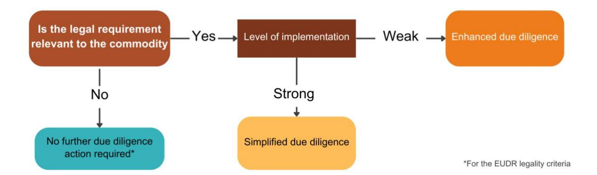
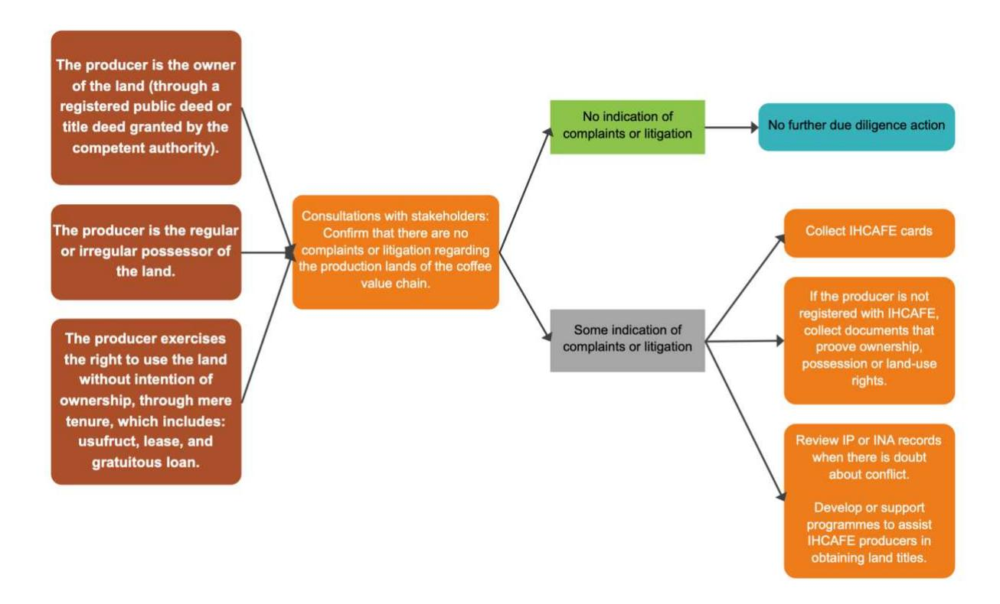
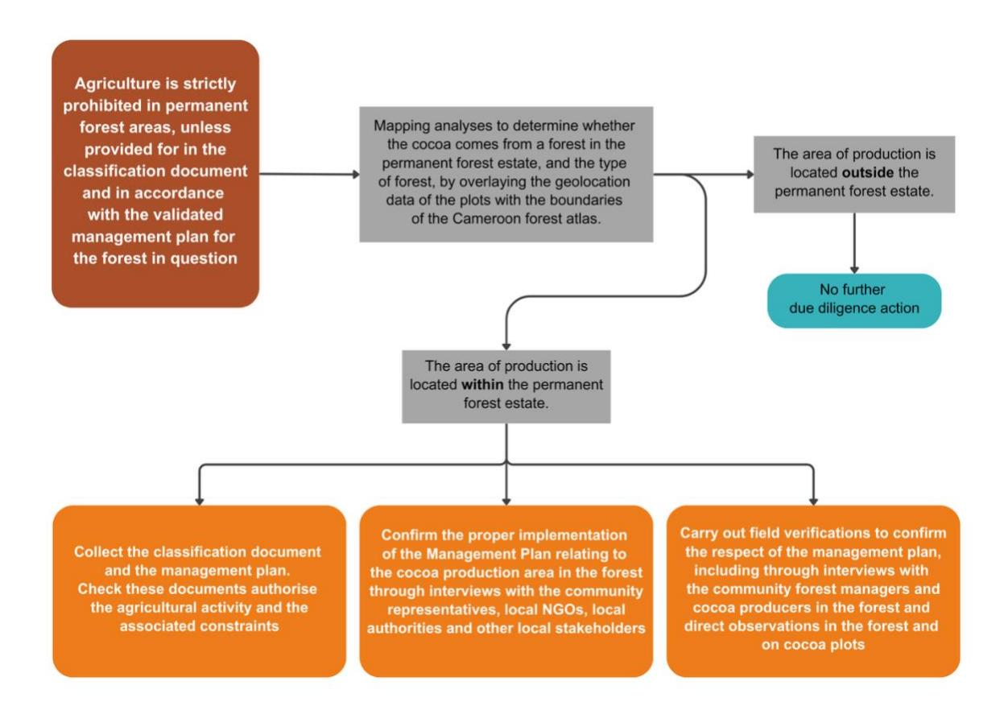
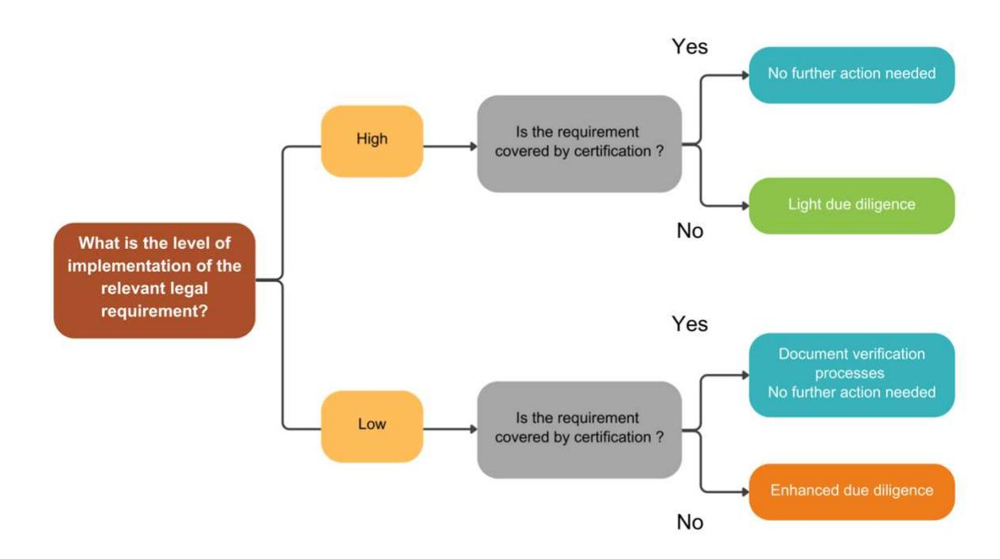

# **Methodological note: developing a legality due diligence tool for EUDR compliance**

September 2025

This methodological note defines the approach followed by the European Forest Institute (EFI) to develop a tool for legality due diligence in the context of the EU Deforestation Regulation (EUDR). This methodology was developed and tested in the context of work carried out in the cocoa supply chains in Côte d'Ivoire, Ghana and Cameroon, and the cocoa, coffee and palm oil supply chains in Colombia and Honduras in the course of 2024-2025, with support from the European Union.

#### **Table of content**

- 1. [Introduction and objectives...............................................................................................................2](#page-1-0)
- 2. [Methodological steps........................................................................................................................3](#page-2-0) 2.1 Step 1: Mapping relevant legal requirements [..............................................................................3](#page-2-1) [Legal requirements relevant in the context of the EUDR Article 2.40 .......................................... 4](#page-3-0) [Unpacking the areas of law listed in the EUDR ........................................................................... 7](#page-6-0) [2.2 Step 2: Assessing "relevance" to refine the list of applicable laws and regulations](#page-7-0) .......................8
- 3. [Developing legality due diligence recommendations](#page-9-0) .......................................................................10 [3.1 Assessing implementation and verification of compliance..........................................................10](#page-9-1) [3.2 Developing proportionated due diligence recommendations.....................................................11](#page-10-0) [3.3 The role of certification in supporting due diligence...................................................................15](#page-14-0) [3.4 Stakeholder engagement...........................................................................................................16](#page-15-0) 3.5 Use of the results and next steps [...............................................................................................17](#page-16-0) [3.6 Testing and updating due diligence recommendations...............................................................19](#page-18-0)

| 1. 2. |                                                                                                                                         |
|-------|-----------------------------------------------------------------------------------------------------------------------------------------|
|       | 2.1 Step 1: Mapping relevant legal requirements ..............................................................................3         |
|       | 2.2 Step 2: Assessing “relevance” to refine the list of applicable laws and regulations .......................8                        |
| 3.    | Developing legality due diligence recommendations .......................................................................10             |
|       | 3.5 Use of the results and next steps ...............................................................................................17 |

# **1.Introduction and objectives**

The EUDR requires products in scope to be legal according to the laws applicable in the country of production. The EUDR takes a flexible approach by listing several areas of law without specifying particular legal instruments, as these differ from country to country and may be subject to amendments. These areas are: land-use rights; environmental protection; forest-related rules[1](#page-1-1) ; third parties' rights; labour rights; human rights protected under international law; the principle of free, prior and informed consent (FPIC); tax, anticorruption, trade and customs.

In this context, understanding the legislative framework of the country of origin, identifying the legal requirements relevant to the commodity concerned, and determining the means of verifying compliance with these requirements are challenges not only for the operators responsible for due diligence, but also for the competent authorities in the European Union responsible for controls, as well as for the various other stakeholders involved.

The tool described here aims to support the due diligence of operators and traders in their efforts to comply with the EUDR legality criteria. It does so by clarifying which relevant laws and regulations would fall under the scope of the EUDR, how compliance could be evidenced and verified, and how operators might assess and manage risks.

To that end, the tool consists in two modules:

- **Module 1** is a list of national legal requirements relevant to the production of the commodity in the EUDR scope
- **Module 2** are recommendations for conducting legality due diligence in relation to those legal requirements deemed relevant

The approach consists in engaging with all relevant supply chain stakeholders at national level to build consensus around the relevance of the legal requirements and the recommendations for legality due diligence, so that these can be used as a common baseline by operators, EU competent authorities, regulators and other stakeholders. Indeed, providing a common reference framework for all stakeholders in the sector can facilitate due diligence and product compliance, mitigate perceived risks and provide a competitive edge to the given origin.

1 According to Art 2.40 of the EUDR, compliance with forest-related rules is only relevant to Ɵmber and does not apply to the producƟon of agricultural commodiƟes. Since the legality due diligence tool is aimed at agricultural commodiƟes only, it does not address this area of law.

# **2.Methodological steps**

The methodology for the development of the tool consists in two main steps:

- 1. Mapping the relevant legal requirements to the production and trade of the commodity
- 2. Assessing the implementation of these requirements in practice and providing recommendations for due diligence, including on the role that certification schemes might play in mitigating risks

### **2.1 Step 1: Mapping relevant legal requirements**

The development of the tool begins with a detailed mapping of national and international legal requirements governing the production and trade of one of the agricultural commodities in scope. The objective is to identify those requirements which both 1) fall in scope of the EUDR and 2) are relevant to the production and trade of a given commodity of a specific origin.

#### **Preliminary listing of applicable laws and regulations in scope of the EUDR**

This will entail a comprehensive analysis of the following legal instruments in the areas of law identified in Article 2.40 of the EUDR (see box below):

- International treaties ratified by the country. One should note the legal mapping exercise must determine whether the country of production is monist or dualist[2](#page-2-2) , as this will indicate which international treaty provisions apply to the commodity in scope
- Laws, regulations and other implementing instruments
- Jurisprudence, in common-law countries
- Non-legally binding documents (policies, guidance, etc.) if needed to interpret relevant laws and regulations

2 Monist States integrate internaƟonal law automaƟcally, while dualist States require formal legislaƟve acƟons to incorporate internaƟonal treaƟes into domesƟc law.

#### **Legal requirements relevant in the context of the EUDR Article 2.40**

The EUDR defines the relevant legislation of the country of production according to two criteria:

- Requirements must concern the legal status of the area of production
- Requirements concern seven areas of law [for agricultural products]: 1) land-use rights; 2) environmental protection; 3) third parties' rights; 4) labour rights; 5) human rights protected under international law; 6) the principle of free, prior and informed consent, including as set out in the UN Declaration on the Rights of Indigenous Peoples and 7) tax, anti-corruption, trade and customs regulations.

On 2 October 2024, the European Commission (EC) published a guidance document on the implementation of the EUDR, which interprets the provisions of the regulation on the legality criteria.1 This document proposes to address the relevance of legal requirements through the following criteria:

- Requirements must specifically impact or influence the legal status of the area of production, because relevance of laws according to Article 3(b) of the EUDR is not determined by the fact that they may apply generally during the production process of commodities or apply to the supply chains of relevant products and relevant commodities but by the fact that these laws specifically impact or influence the legal status of the area in which the commodities were produced.
- Requirements must be linked to the objectives of the EUDR, i.e., halting deforestation and forest degradation in the context of the EU's commitment to address climate change and biodiversity loss.

Since all labour requirements, as well as certain human rights and third parties' rights, are not directly linked to the objectives of the EUDR, there is debate as to whether they would fall within the scope of the EUDR. On the other hand, the EC guidance would extend the scope of tax and anti-corruption legislation to downstream steps of value chains if these regulations contribute to combating deforestation and biodiversity loss. Similarly, trade and customs regulations would be relevant where they apply to in scope products, beyond the area of production.

It should be noted that the Commission's guidance is not legally binding. As stated in the document itself, it does not replace, add to, or modify the provisions of the EUDR, which sets out the legal obligations. Each EU Member State will adopt its own approach to control operators' compliance with the EUDR. Ultimately, only judges in each EU Member States have the power to interpret the regulation in a binding

It is important to note that legality must be measured based on the existing national legal framework. If a law does not exist in one area, then there is no legal requirement to be complied with.

#### **Sources of data**

The mapping exercise can be supported by various sources of information:

- National databases of legal texts. Legal texts might be scattered in different platforms, such as sectoral ministries' websites
- National official journals
- Repositories managed by external organisations, such as the [FAOLEX](https://www.fao.org/faolex/en/) database of the Food and Agriculture Organization of the United Nations (FAO). FAOLEX is an online repository of national laws, regulations and policies on food, agriculture and natural resources management. The FAO repository [TIMBERLEX](https://timberlex.apps.fao.org/) may also be useful, as it compiles legal information on forest management, including the legal aspects of forest conversion, local communities' consultation and
- Repositories and reports produced by specialised organisations from civil society, such as [ClientEarth,](https://www.clientearth.org/latest/documents/) or certification bodies

manner and determine the scope of the legality criterion. Nonetheless, the Commission's guidance is also aimed at facilitating the harmonised implementation of the regulation and the coordination between competent authorities (Article 15 of the EUDR).

In this context, the tool adopts **a precautionary approach**. It not only considers all the areas of law listed in article 2.40 that are linked to the environmental objectives of the EUDR, including taxation, trade and customs, but it also covers requirements relating to human and labour rights.

A useful approach is to segregate requirements which are and are not directly linked to the objectives of the EUDR. This exhaustive approach will enable end-users to choose the scope of their work according to their reading of the EUDR and the guidance provided. Under the EUDR, it is the operator who is responsible for carrying out due diligence to ensure that the products it places on the market present a negligible risk of illegality. It is therefore up to the operator to decide which legal requirements it wishes to include in its due diligence system.

#### **How to carry out the legal mapping**

Ideally, the mapping should be carried out by lawyers qualified in the country of production. To facilitate data collection and management, EFI and Preferred by Nature have developed a template table (available separately). The table is structured around the legal areas listed in the EUDR. Based on these areas, general categories and subcategories were developed by referring to existing evaluation frameworks and standards, such as EU-Voluntary Partnership Agreements and certification schemes. The categories and subcategories are both comprehensive and adaptable, designed to be tailored into more specific legal requirements that fit the national context.

#### **Unpacking the areas of law listed in the EUDR**

Below is an indicative and non-exhaustive list of issues that could be covered by the national laws and implementing regulations in each of the areas outlined in Article 2.40 of the EUDR.

- Land use: This entails navigating through diverse forms of land tenure and land use, such as customary, private, or public tenure and land use rights, alongside addressing considerations related to protected areas and land-use planning. A key question will be to determine whether documentary evidence of land-use rights is required to produce the relevant crop on the land. In many countries, customary land ownership prevails, and farmers are not required to hold a title deed or a landuse certificate to legally farm their land. Nonetheless, documentary evidence of land ownership or land-use rights will typically be required for collective ownership of the land and for large concessions.
- Environment: Delving into matters concerning biodiversity conservation, implementing effective waste management strategies, conducting environmental impact assessments, promoting sustainable soil management practices, regulating water use, and overseeing the responsible application of pesticides and fertilisers.
- Third parties' rights: Ensuring the procedural rights of local communities to access environmental information and participate in consultations, particularly within the scope of environmental impact assessments, to foster transparent decision-making processes. This area of law may also include substantive rights, such as the local communities' right to a healthy environment, and the protection of the sites, resources, and habitats of cultural, archaeological, historical, or religious significance to these communities.
- Labour rights: Upholding fundamental principles such as equal treatment, nondiscrimination, regulation of work hours, provision of weekly rest periods and paid leave, ensuring workplace health and safety standards, setting minimum wage requirements, and combating forced labour.
- FPIC (Free, Prior, and Informed Consent): Recognising and respecting Indigenous Peoples' rights by guaranteeing their participation in decision-making processes affecting their land, including their right to relevant information and meaningful consultation, as well as their right to withhold or retract consent.
- Human rights: Addressing various facets such as eradicating child labour, promoting gender equality and women's rights, combating forced labour in all its forms, preventing discrimination based on race, gender, or any other characteristic, and eliminating instances of violence and harassment at the farm level.
- Tax, trade, customs and anti-corruption: Identifying and complying with tax obligations, adhering to trade obligations and tariffs, ensuring customs compliance for the export of the products in scope, and implementing robust anti-corruption measures to promote ethical business conduct and transparency.

# **2.2 Step 2: Assessing "relevance" to refine the list of applicable laws and regulations**

The initial mapping might be exhaustive and contain a long list of legal provisions potentially applicable. It is key to then refine this list, adapting it to the needs of EUDR due diligence and to the reality of the commodity's production and trade. This exercise should be conducted, if possible, in consultation with supply chain actors and national authorities, to ensure a common understanding of legal requirements and their scope.

To determine which legal requirements are relevant and set aside those that are not, the tool proposes to exclude non-relevant requirements on the basis of three criteria. Requirements are deemed not relevant if they are:

- **Not applicable to the area of production**, because they cover activities at other stages of the supply chain. For example, legal requirements regulating processing activities or transport. This criterion does not apply to requirements related to trade, tax and customs, which can be considered relevant even if they apply beyond the area of production.
- **Not suited to the characteristics of the production of the commodity**. For example, if the production of the commodity in question is dominated by small-scale family farming, some requirements that only apply to large-scale agricultural activities might be deemed not relevant.
- In civil law countries, general principles of law or broad rights that **lack specific implementing regulations** and thus cannot be effectively enforced nor monitored for compliance. For example, a general right to information that is not operationalised through regulations that detail the scope of information covered, the authorities responsible for providing it, clear timelines for responses and formats for disclosure, etc,. In both common law and civil law countries, general rights or prohibitions are also deemed not relevant if they are covered by more detailed in other legal requirements. This is to avoid repetitions in the legality matrix and ensure coherence.

Through this "skimming" exercise, a streamlined table of relevant legal requirements for the targeted commodity should be produced and could be used as a benchmark by relevant stakeholders in the context of EUDR implementation.

#### **Example**

The following table is an extract of the tool produced for the cocoa sector in Ghana providing explanation on the relevance assessment performed by lawyers in consultation of stakeholders.

|             | Legal requirement Legal text Relevance                       |
|-------------|--------------------------------------------------------------|
| Pesticides  | Only registered and approved                                 |
| Fertilisers | A person shall not import,                                   |
|             | Not relevant : The legal                                     |
| Water       | Damming, diverting,                                          |
|             | Not relevant : Stakeholder                                   |
| Waste       | A person shall not manage or                                 |
|             | Section 56 Public Health Act Not relevant : This requirement |

# **3.Developing legality due diligence recommendations**

Once the list of all relevant legal requirements in the context of EUDR due diligence is known, a further step to support EUDR implementation is to assess how they are implemented in practice and identify potential means of verification.

Unlike the list of relevant legal requirements which can provide a comprehensive picture of the relevant legal framework in a given country and for a given commodity, due diligence recommendations can only be indicative and non-exhaustive, as these actions will require a proportionate and tailored approach, subject to change on a shipment-by-shipment basis.

## **3.1 Assessing implementation and verification of compliance**

Exercising due diligence implies adopting a risk-based approach. The effort put in risk assessment and mitigation should reflect the level of non-compliance risk at stake. This tool's aim is to provide guidance that is proportionate to the existing risks and limits the potential burden on supply chain actors responsible for collecting data.

#### **Assessing the level of implementation of legal requirements**

This first step will be useful to further guide the choice of due diligence actions. For each relevant legal requirement, experts will inform of the level of compliance on the ground. This assessment can be drawn from multiple sources:

- Official reports and national information systems
- Legal cases and complaints mechanisms
- Independent reports, such as from NGOs or the academia, media sources
- Insights from certification and certification audits
- Consultations with supply chain actors and farmers
- Multi-stakeholder discussions

The approach taken is to categorise implementation as follows:

- **High**: The requirement is generally well respected, and instances of non-compliance are sporadic, localised, and effectively addressed by public authorities
- **Low**: The legal requirement's compliance level is weak as there are regular, widespread, and persistent illegalities that are not addressed effectively by public authorities

If the level of compliance is uncertain, by default a low level will be retained, as a precautionary approach.

#### **Identifying existing means of verification**

The second step consists in identifying existing means of verification for each relevant legal requirement. The availability and reliability of this information should also be analysed.

Means of verification can be of different nature:

- Documentary evidence requested by law, e.g. licences, employment contracts, pay slips, tax receipts, authorisations, etc….
- Secondary documentary evidence that can constitute proof of compliance: reports, audits, receipts, fines, procedures, etc…
- Databases and information systems: plot registries, protected area maps, phytosanitary information system, complaints mechanisms, etc…
- Consultations and field visits to interview stakeholders and observe practices

It is important to note that absence of documentary evidence of compliance does not mean illegality or non-compliance. Consultations with a large range of stakeholders are particularly useful to identify means of verification, contrast theoretical requirements with field reality, and learn from practices on the ground, such as certification schemes. The table developed for the mapping exercise will be complemented with the information gathered from these consultations.

# **3.2 Developing proportionated due diligence recommendations**

This information will form the basis for the development of recommended due diligence actions for operators. The recommendations will be based on the classification of the requirements depending on whether their implementation is high or low (see above).

If the requirement's implementation is low, operators should systematically collect the documentary evidence if is required by law, and/or find alternative means of verifying compliance (**enhanced due diligence**).

If the requirement's implementation is high and if documentary evidence exists, it might be sufficient to collect some samples of the required documents (**light due diligence**). The operator might not need to systematically collect all the available evidence. If no documentary evidence is required by law, the operator should demonstrate a low risk of illegality by collecting secondary information (NGO reports, etc.).

The recommendations detail the information, data and documents needed to conduct due diligence, which are compiled through the available template. Yet, recommendations should not convey the impression that due diligence is a mere box-ticking exercise. They are envisaged as a menu of options, from which operators might draw based on their risk appetite, resources and the specific circumstances of their sourcing. In addition, it will be important to clarify that possession of documents and data alone does not fulfil due diligence requirements. Operators must still verify the authenticity and reliability of these materials.

Specific decision trees can be developed to further guide operators on the choice of procedures and measures for mitigating the risks of non-compliance with the legality criteria.

#### **Example**

Below is the due diligence decision tree for verifying land-use rights for coffee production in Honduras. The legal requirements covered were deemed to present a low risk of illegality by stakeholders. Thus, light due diligence is recommended.

#### **Example**

Below is the due diligence decision tree for verifying the legality of cocoa production in Cameroon in the permanent forest estate. The legal requirement covered was deemed to present a high risk of illegality by stakeholders. Thus, enhanced due diligence is recommended.

### **3.3 The role of certification in supporting due diligence**

According to the EUDR, for the purposes of risk assessment, operators can take into account "information from certification schemes or other third-party verified schemes." The Commission also specifies that certification systems should not replace the operator's responsibility for due diligence.

As part of the due diligence recommendations, it can thus be useful to assess the role of certification. As part of the development of the tool, an assessment of the extent to which national or voluntary schemes can support legality due diligence could be conducted. This implies comparing relevant national requirements with requirements covered by the certification system. When a requirement is covered by certification, the operator might want to rely on the verification processes already in place in this context.

Nevertheless, additional considerations should be taken into account by the operator, namely:

- The robustness of the certification system: in particular the scope of the certification (applicable to which actors in the value chain? to which products?), the governance (management of internal procedures and updates, for example), the accreditation processes of the control bodies; the qualification of auditors and the frequency of audits; the management of non-compliance, impartiality and the management of conflicts of interest, etc. This information should be regularly re-evaluated by the operator, particularly with regard to the requirements of the EUDR.
- Traceability and the absence of mixing with non-certified products

### **3.4 Stakeholder engagement**

Stakeholder engagement is at the heart of methodology to develop the legality due diligence tool. Indeed, fostering alignment and consensus on the interpretation of legal requirements applicable in the context of EUDR between all concerned actors requires providing the space and neutral facilitation necessary to ensure sound debate and the integration of practitioners' experiences. In addition, since legality is inherently a State prerogative, the approach developed puts specific emphasis on alignment and buy-in of authorities. This approach represents an important value add to other legal studies, which are essentially desk-based.

#### **Main principles**

More specifically, EFI's methodology is entirely underpinned by an engagement strategy focused on the following principles:

- Ensure that the work is initiated at the request or in agreement with the relevant authorities of the producing government, and that the proposed process involves their active participation
- Clarify with relevant authorities the nature of the outputs, in particular whether the State wishes to endorse any of them
- Ensure the participation of a wide range of different stakeholder groups of the supply chain: public administration, small producers' association, private sector, auditors of private certification schemes, and national and international NGOs, technical partners, EU representatives and competent authorities
- Various consultation approaches might be needed, such as capacity-building sessions for specific stakeholder groups, multi-stakeholder workshops to spark contradictory debates, bilateral consultations to deepen topics and sensitive issues, field surveys and audits to observe reality on the ground
- The involvement of all stakeholder groups is essential at all milestones. Such multistakeholder engagement is what ensures that the tool is comprehensive, because all views have been heard. It also makes the tool robust, because the level of compliance for each of the legal requirements has been discussed and validated by all stakeholders.
- Multi-stakeholder engagement, in particular the participation of civil society, reduces the risk of weaking the legal framework or attempts to mask possible risks. Transparency in the development of the tool gives confidence to possible users. It also help reduce perceived risks and increase the competitiveness of the products in question.

#### **Implementation modalities**

It is recommended that such work be coordinated and facilitated by a neutral technical institution that benefits from the trust of all main stakeholders involved. Expertise needed lies in national law across various domains, as well due diligence and verification systems. It is recommended to work with support from lawyers of the relevant producing country.

Oversight should be organised through some form of Advisory Committee at national level which will guide the study to ensure national ownership and oversight of its outputs. This committee's composition will vary depending on the national context. At a minimum, it will include representatives of the public regulatory body responsible for the relevant commodity production and trade in the country (e.g., Cocoa or coffee boards). The Advisory Committee will facilitate access to necessary documentation and promote collaboration among all stakeholders involved in the country's supply chain. This may include assisting in identifying interviewees and facilitating communication with them.

A minimum of six months is needed to conduct such work, but that timeframe can be longer based on specific national circumstances and challenges encountered.

# **3.5 Use of the results and next steps**

#### **The nature of the outputs**

The list of relevant laws is intended to provide a baseline for all concerned stakeholders and reflect national interpretation and consensus over the legal framework. The precautionary approach recommended by this methodology when it comes to choosing the scope of legality under the EUDR means operators and concerned actors might still decide on which requirements they wish to consider within their due diligence system.

The due diligence recommendations mainly consist of a series of suggested actions to demonstrate compliance with each requirement. These actions can consist in stakeholder consultations, the collection of documents and data, the setting up of procedures, or field verifications. It is the responsibility of operators to identify the relevant legal requirements under Article 2(40) of the EUDR and to tailor their due diligence to the risks identified for targeted products. They can therefore pick from the various due diligence actions suggested, choosing which are the most appropriate for the situation, risks and the supply chain. Moreover, **the suggested due diligence actions are not legally binding and do not constitute legal advice**.

National authorities might choose to formally endorse results of this work, such as was done by the National Cocoa Committee of Cameroon. Such endorsement might provide additional guarantee to the users of the tool that its content is well aligned with national frameworks. In other cases, national authorities might actively engage in the process but view the tool as

a support to private operators and therefore wish it to remain independent. In all cases, all tools developed are meant to be publicly available and widely disseminated to all interested parties. Capacity building on the use of the tool and the development of due diligence systems, especially for small-scale operators, can also greatly facilitate its use.

#### **Benefits of the tool for different actors**

The recommendations can be used in different ways and at different times depending on the actors involved.

**Operators and traders** can rely on these recommendations to set up and document their due diligence system, ensuring that the commodity they trade complies with the EUDR requirements on legality. They can use them to identify the documents and information to be collected or other actions to be carried out with their suppliers in the country they source from, and to assess the risks associated with their supply chain.

The **competent authorities of the EU** can use these recommendations as a standard for assessing the compliance of products placed on the market with the EUDR. They can also rely on these recommendations to harmonise their controls and interpret documents from specific origins.

**Actors in the supply chain** in origin countries can use these recommendations to understand the implications of the EUDR requirements for their country and the expectations of European operators and traders subject to it. The recommendations can be used to structure and document the information to be provided. They can also help them anticipate the risks of non-compliance and adapt their agricultural and commercial practices.

**National public entities** can use these recommendations to strengthen compliance checks of producers and exporters with national legislation, in order to guarantee that the commodities traded complies with the national laws in force. They can also use them to support small producers in achieving compliance by providing them with better access to information on current regulations and buyer requirements. They can rely on these recommendations to make data more transparent and accessible, in particular by facilitating access to administrative documents, in order to help operators demonstrate legality.

**Civil society** can use these recommendations to monitor the application of national legal requirements by companies and the authorities. It can use them to conduct analyses and produce reports on the risks of non-compliance of specific commodities. It can also use them to raise awareness among producers, companies and consumers of the issues surrounding the legality in specific supply chains.

## **3.6 Testing and updating due diligence recommendations**

Module 2 of the tool, which contains the due diligence recommendations, is meant to be a living document. Once finalised and disseminated among stakeholders, the recommendations can be tested by operators and competent authorities. Based on these tests, elements of the recommendations may be adjusted to ensure they are practical, feasible and close to realities on the ground.

Moreover, the recommendations may have to be updated further to, among others, legal developments in country, feedback received, or further guidance from the European Commission.

**Disclaimer.** This is an internal document. Its content does not reflect the official opinion of funding organisations Responsibility for the information therein lies entirely with the authors. Reproduction is not authorised unless agreed with EFI.

© European Forest Institute, 2025