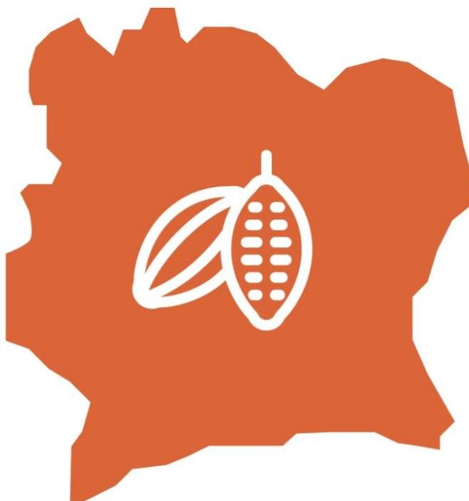

Support tool for due diligence on the legality of cocoa within the framework of the EUDR

# Module 1: Legal requirements relevant to cocoa in Côte d'Ivoire

July 2025

**Disclaimer.** This tool was developed with the financial assistance of the European Union. The views expressed herein can in no way be taken to reflect the official opinion of the European Union. This tool is intended to support the efforts of the cocoa industry to comply with the requirements of the European market. Its content is indicative, not legally binding and does not constitute legal advice. No guarantee is given as to the accuracy, completeness or timeliness of the content. The authors of this module accept no liability for any damage or loss arising from its use. The authors welcome all comments and suggestions for improvement. © European Forest Institute, 2025

# **Table of contents**

| 1. Supporting due diligence                                         | The European Union regulation on deforestation ..............................................................4 ..........................................5 |
|---------------------------------------------------------------------|------------------------------------------------------------------------------------------------------------------------------------------------------------|
| 2. Objectives and methodology                                       | ..............................................................................................6                                                            |
| General approach                                                    | ...............................................................................................................6                                           |
| Methodology for identifying relevant national requirements (Step 1) | ................................7                                                                                                                          |
| 3. List of legal requirements relevant to cocoa in Côte d’Ivoire    | .............................................9                                                                                                             |
| Category 1: Land-use rights                                         | .............................................................................................10                                                            |
| Category 3: Third parties’ rights                                   | .......................................................................................19                                                                  |
| Category 4: Free, informed and prior consent (FIPC)                 | .....................................................22                                                                                                    |
| Category 7: Human rights*                                           | ...............................................................................................34                                                          |
| Annex 1 – The case of cocoa produced in agroforestry                | ..................................................38                                                                                                       |
| Annex 2 - Consultations carried out                                 | ........................................................................................40                                                                 |

# **1. Background**

### **The European Union regulation on deforestation**

On 31 May 2023, the European Union (EU) adopted Regulation 2023/1115 on the placing on the EU market and export from the EU of certain commodities and products associated with deforestation and forest-risk commodity (EUDR). This regulation requires operators and traders importing forest-risk commodities into the EU to demonstrate that these products are traceable, deforestation-free and legal. The scope of application covers seven commodities: coffee, cocoa, rubber, palm oil, soy, cattle and wood, as well as derived products such as chocolate and cocoa paste. Entry into application is scheduled for 31 December 2025 (and 30 June 2026 for micro and small undertakings established as such before 31 December 2020).

Companies affected by the regulation (operators and traders) will be required to carry out "due diligence" prior to exporting or placing their products on the market, in order to gather sufficient information to ensure that the product carries no or a negligible risk of non-compliance. Consequently, operators placing cocoa or derived products on the EU market will have to ensure that these have been produced in accordance with the relevant legislation of the country of production (article 3), which is defined as concerning the legal status of the area of production. The EUDR takes a flexible approach, listing several areas of law without specifying particular legal instruments, as these differ from country to country and may be subject to change. These areas are [for agricultural commodities]:

- (a) land-use rights;
- (b) environmental protection;
- (d) third parties' rights;
- e) labour rights;
- (f) human rights protected by international law;
- g) the principle of free, prior and informed consent, including as set out in the United Nations Declaration on the Rights of Indigenous Peoples;
- h) Tax, anti-corruption, trade and customs regulations. (Article 2.40).

In this context, understanding the legislative framework of the country of origin, identifying the legal requirements relevant to the commodity concerned, and determining the means of verifying compliance with them are a challenge for operators responsible for due diligence, but also for the competent authorities of the European Union responsible for controls, as well as for the various stakeholders involved.

## **Collaboration between Côte d'Ivoire and the European Union**

In 2021, Côte d'Ivoire and the European Union launched a political dialogue aimed at supporting national objectives in terms of the economic, environmental and social sustainability of cocoa and facilitating its access to the European market. This collaboration is being implemented through a series of technical partners, including the European Forest Institute (EFI), which is supporting Côte d'Ivoire in developing an enabling framework to facilitate access to the European market for its agricultural products and promote transparency in supply chains.

### **Supporting due diligence of cocoa operators**

In the context of the partnership between Côte d'Ivoire and the European Union on sustainable cocoa, EFI led the development of a support tool, starting in June 2024, with the aim of supporting due diligence by operators wishing to place Ivorian cocoa or its derived products on the European market. Pending potential guidance from the Ivorian government, the approach aims to identify, through a multi-stakeholder and consensual process, the relevant legality requirements under the EUDR in order to facilitate the work of the various actors in the sector, ensure equitable access to information, reduce perceived risks and give Côte d'Ivoire a competitive advantage.

ARS-1000 is a sustainable cocoa certification scheme, but also a legal requirement in CÙte d'Ivoire. It was made mandatory by Decree 2022-393 of 8 June 2022. The study therefore dealt separately with the role of ARS-1000 in operators' due diligence.

This tool was developed with the technical support of a consortium of experts in law and due diligence, composed of Preferred by Nature, Mondon Conseil International, Bureau Norme Audit (BNA) and Mr Yannick Troupah (independent expert). It is carried out through consultation and involvement of all actors in the sector, in particular the Coffee and Cocoa Council (CCC) (see Annex 2).

# **2. Objectives and methodology**

The objectives of the tool are:

- 1. To identify all Ivorian legal requirements covered by the EUDR and relevant to cocoa production in Côte d'Ivoire.
- 2. To provide recommendations for cocoa compliance verification and risk management, including through ARS-1000 certification, in order to support operators' due diligence.

The tool was developed in two steps:

- Phase 1: Identification of relevant national legal requirements within the framework of the EUDR and cocoa production in Côte d'Ivoire.
- Phase 2: Development of due diligence recommendations for operators, based on an analysis of the level of implementation of relevant legal requirements and existing verification means, including the role of ARS-1000 certification.

This module presents the results of step 1 (Module 1).

## **General approach**

The objective of this tool is to support the formulation of a national and consensual vision of the legal requirements applicable to Ivorian cocoa, in order to: i) support the harmonisation of operators' due diligence approaches; ii) encourage the simplification of procedures for actors upstream in the supply chain who may need to provide data to their customers; and iii) facilitate a better understanding of national contexts by the competent authorities responsible for controls. **It is important to note that the results provided are in no way legally binding, do not commit any of the actors concerned and do not constitute legal advice. These results are in no way intended to replace any guidance that may be provided by the State of CÙte d'Ivoire on this matter.** It is the responsibility of operators placing cocoa or its derived products on the European market to identify the relevant legal requirements within the meaning of Article 2(40) of the EUDR and to adapt their due diligence in line with the risks identified. The results of this work provide guidance that can support operators and other actors in the sector in this direction.

Furthermore, these results are likely to evolve over time and be updated due to numerous factors: potential legal reforms in the country or guidance from the Ivorian regulator; additional guidance provided by the European Commission or EU Competent Authorities; the integration of best practices and technological advances; etc.

This work is based on the work of national and international experts in law and due diligence and on technical consultations with all relevant national and international actors in the cocoa sector: administration and ministries, exporters, traders and chocolate makers, producer

cooperatives and associations, certification bodies, civil society organisations and European Union importing countries.

### **Methodology for identifying relevant national requirements (Phase 1)**

The first stage of the work consists of identifying the relevant national legal requirements under the EUDR for cocoa production in Côte d'Ivoire.

### **Relevant legal requirements under the EUDR**

The EUDR defines the legality of products de base according to two criteria:

- National legal requirements must relate solely to the legal status of the area of production.
- Seven areas of law [for agricultural products] are concerned: 1) land-use rights; 2) environmental protection; 3) third parties' rights; 4) labour rights; 5) human rights protected by international law; 6) the principle of free, prior and informed consent, including as set out in the United Nations Declaration on the Rights of Indigenous Peoples; and 7) regulations in the areas of tax, anti-corruption, trade and customs regulations.

On 2 October 2024, the European Commission published a guidance document for the implementation of the EUDR, which interprets the provisions of the Regulation on the legality criteria.[1](#page-6-1) This document proposes to address the relevance of legal requirements through the following criteria:

- The requirements have a specific impact on the legal status of the area of production of the products [with the exception of trade and customs rules];
- The requirements must be linked to the objectives of the EUDR, i.e. halting deforestation and forest degradation in line with the EU's commitment to combat climate change and biodiversity loss.

Given that not all labour requirements, as well as certain human rights and third parties' rights, are directly linked to the objectives of the EUDR, the question of whether they fall within the scope of application of the EUDR is under discussion.

Furthermore, the guidance document would extend the scope of application of tax and anticorruption regulations to stages of the value chain beyond the area of production, if these

1 [https://eur-lex.europa.eu/legal-content/FR/TXT/PDF/?uri=OJ:C\\_202406789.](https://eur-lex.europa.eu/legal-content/FR/TXT/PDF/?uri=OJ:C_202406789) This guidance is regularly updated.

regulations contribute to combating deforestation. Similarly, trade and customs regulations would be relevant where they apply to the product in question.

It should be noted that the Commission's guidance document is not legally binding. As stated in the guidance document itself, it does not replace, add to or amend the provisions of the EUDR, which lays down the legal obligations. Each EU Member State will adopt its own approach to monitoring operators' compliance with the EUDR. Ultimately, only the courts in each EU country have the power to interpret the EU Regulation in a binding manner and determine the scope of the legality criteria.

In this context, **this tool adopts a precautionary approach**. It considers all areas of law listed in Article 2.40 and includes all requirements deemed relevant in these seven areas. In addition, it also covers requirements related to tax, anti-corruption, trade and customs regulations beyond the area of production.

This tool marks with an asterisk those requirements that are not directly related to the objectives of the EUDR. This comprehensive approach will enable end users to choose the scope of application of their work based on their reading of the EUDR and the guidance provided. Under the EUDR, it is the operator who is responsible for carrying out due diligence to ensure that the products they place on the market present a negligible risk of illegality.

### **Relevant legal requirements in the national context of cocoa production**

In Côte d'Ivoire, cocoa can be produced in rural areas or on private state forest estates, under certain conditions (agroforest regime). All the provisions identified by this tool in the various legal categories (environmental protection, third parties' rights, labour rights, human rights, the principle of free, prior and informed consent, and tax, trade and customs regulations) will, in principle, apply in the same way to cocoa produced in agroforests. The regime governing landuse rights in agroforests is still under development. Consequently, this tool does not address the issue of the legality of land-use rights for cocoa produced in agroforests. However, information is provided in Annex 1 and this module will be updated when the legal framework for agroforests is completed.

All existing legal texts and requirements in Côte d'Ivoire falling within the scope of the seven areas of law specified above have been identified. Cocoa stakeholders, through various consultation workshops (see section [1\)](#page-36-0), then assessed their relevance to the specific case of small-scale cocoa production in the rural domain.

All legal requirements identified were considered relevant a priori, unless it could be clearly identified that:

- the legal requirement does not relate to the cocoa plot or to the workers or third parties concerned by the plot [with the exception of trade, tax and customs rules];

- the legal requirement is not relevant in the context of small-scale, predominantly familybased cocoa production;
- the legal requirement is of a general nature, is not subject to implementing regulations allowing for its operationalisation and monitoring, and/or is already covered by other more specific requirements.

# **3. List of legal requirements relevant to cocoa in Côte d'Ivoire**

The tables below list the requirements considered relevant and irrelevant, and the justifications provided by the stakeholders consulted, for cocoa produced in Côte d'Ivoire in the rural domain with regard to land-use rights, and cocoa produced in the rural domain or in agroforests with regard to other categories of rights.

Requirements marked with an asterisk are not directly related to the objectives of the EUDR, as per the guidance of the European Commission.

### **Category 1: Land-use rights**

Cocoa plantations are largely located on rural domain land, governed by Law No. 98-750, which has been amended several times. The legal framework for land ownership and access to the rural domain distinguishes between:

- Formal recognition of land **ownership**, which (1) is established by the issuance of a land title following a land registration procedure and (2) is only accessible to the State, local authorities and Ivorian natural persons (except for property rights acquired before the 1998 law).
- The holding of **customary land-use rights** on customary land. Customary rights are recognised by a land certificate, which may be individual or collective. However, the law does not require local communities to register their customary land rights. Nevertheless, this situation can create legal uncertainty and, in the long term, lead to the allocation of property rights to the State, as land without masters, after a period defined by the regulator (but regularly extended) and a specific procedure.
- • Access to land **as a tenant or free-of-charge beneficiary**, in other words the transfer of only part of the land-use rights of the customary owner or holder to a third party, based on the principle of informed consent of the parties. Several systems are possible: lease agreement, sharecropping agreement, sharecropping agreement with production sharing, sharecropping agreement with land sharing, collateral agreement for a plot of land and loan agreement. Although oral contracts are valid, they can be legally precarious. To mitigate this risk, the Rural Land Agency (AFOR) offers model contracts to secure use rights, but these are rarely used due to a lack of legal obligation and awareness.

**It should be noted that the law does not require farmers to hold land titles, or written contracts as tenants or beneficiaries of free use rights to land in order to grow cocoa.** 

Finally, the Ivorian legislation prohibits cocoa production in protected areas and classified forests. However, in practice, plantations exist in these areas. On the other hand, cocoa production is authorised by law in agroforests, which are areas located within the State's private forest estate where agricultural plantations and forest trees can coexist (see Annex 1 for details).

|                 | Legal requirements                   | Legal basis | Relevance                                   |
|-----------------|--------------------------------------|-------------|---------------------------------------------|
| Land ownership  | The State and public authorities may |             |                                             |
|                 |                                      |             | Not relevant : Absence of cocoa cultivation |
|                 |                                      |             | Not relevant: There is no obligation for    |
| Land use rights | Where the owner has not transferred  |             |                                             |
|                 |                                      |             | Not relevant : No requirement — owners      |

| Legal subcategories    | Legal requirements                                                                                                                                                                                                              | Legal basis                                                                                                                                                                                                                                                                                                                                                                                                                                                                                                                                                                                                                                  | Relevance                                                                                                                   |
|------------------------|---------------------------------------------------------------------------------------------------------------------------------------------------------------------------------------------------------------------------------|----------------------------------------------------------------------------------------------------------------------------------------------------------------------------------------------------------------------------------------------------------------------------------------------------------------------------------------------------------------------------------------------------------------------------------------------------------------------------------------------------------------------------------------------------------------------------------------------------------------------------------------------|-----------------------------------------------------------------------------------------------------------------------------|
|                        | Any cocoa farmer may access a plot of land under a lease concluded for a fixed period, either with the owner of the plot, the holder of the land certificate for the plot or the holder of customary land rights over the plot. | <ul> <li>Law No. 98-750 of 23 December 1998 on rural domains, as amended by Laws No. 2004-412 of 14 August 2004, No. 2013-655 of 13 September 2013 and No. 2019-868 of 14 October 2019 (Art. 4; Art. 17 bis)</li> <li>Decree No. 2019-266 of 27 March 2019 laying down the implementing provisions of Law No. 98-750 of 23 December 1998 (Art. 19; Art. 23)</li> </ul>                                                                                                                                                                                                                                                                       | <i>Relevant</i>                                                                                                             |
| Cases of expropriation | Any action by a public entity (State, local authorities) aimed at extinguishing land rights and/or rural land-use rights must be carried out within the framework of expropriation for public purposes.                         | <ul> <li>Law No. 2016-886 of 8 November 2016 on the Constitution of the Republic of Côte d'Ivoire (Art. 11)</li> <li>Decree of 25 November 1930, amended and supplemented by the decrees of 8 February 1949 and 24 August 1993 regulating expropriation for public use and temporary occupation in French West Africa, promulgated by decree 2980 AP of 19 December 1930 (Annex 15)</li> <li>Decree No. 95-817 of 29 September 1995 establishing rules for compensation for the destruction of crops</li> <li>Interministerial Decree No. 28 MINAGRA/MEF of 12 March 1996 establishing the compensation scale for destroyed crops</li> </ul> | <i>Not relevant:</i> The State is not involved in expropriation operations for the purpose of developing cocoa plantations. |

|                 | Legal requirements                     | Legal basis | Relevance                                     |
|-----------------|----------------------------------------|-------------|-----------------------------------------------|
|                 |                                        |             | Not relevant : If use rights are established, |
| Protected areas | Agriculture is prohibited in protected |             |                                               |

### **Category 2: Environmental protection**

With regard to legal requirements relating to environmental protection for cocoa cultivation, the main elements to note are as follows:

- **Pesticides and fertilisers** are commonly used in cocoa plantations. The use of pesticides in particular is a major issue and can pose contamination risks for local communities and the environment, especially when unregistered products are used. The use of pesticides is closely linked to other environmental protection issues such as soil protection, water protection and waste management.
- There is also an issue surrounding **the conversion of forest land** in rural areas, which is subject by law to the provisions of a forest management plan or specific authorisation. However, this legal provision is rarely enforced, as it is largely unknown to local communities. It should be noted that this tool sets out the legal framework applicable to land clearing and deforestation, but does not prejudge compliance with the EUDR's deforestation-free criteria, which will have to be assessed separately.
- • There are few other relevant requirements for cocoa production in terms of environmental protection. This is because cocoa plantations are on average less than 4 hectares in size. They are therefore exempt from the requirement to carry out an environmental and social impact assessment, which only applies to projects larger than 10 hectares.

| Legal subcategories                                                            | Legal requirements                                                                                  | Legal basis                                                                                                                                                                                                                                                                                                                                                                                                                                                                                             | Relevance              |
|--------------------------------------------------------------------------------|-----------------------------------------------------------------------------------------------------|---------------------------------------------------------------------------------------------------------------------------------------------------------------------------------------------------------------------------------------------------------------------------------------------------------------------------------------------------------------------------------------------------------------------------------------------------------------------------------------------------------|------------------------|
| <i><b>Environmental requirements applicable to agricultural activities</b></i> |                                                                                                     |                                                                                                                                                                                                                                                                                                                                                                                                                                                                                                         |                        |
| Use of pesticides                                                              | All pesticides must be approved/authorised/registered prior to being placed on the market and used. | <ul> <li>• Regulation c/reg 3.5.2008 on the harmonisation of rules governing the approval of pesticides in the ECOWAS region (Art. 10; Art. 11).</li> <li>• Law No. 2023-899 of 23 November 2023 on the Code of Hygiene and Health (Art. 49; Art. 62)</li> <li>• Law No. 2015-537 of 20 July 2015 on agricultural policy in Côte d'Ivoire (Art. 72).</li> <li>• Decree No. 89-02 of 4 January 1989 on the approval of the manufacture, sale and use of pesticides in Côte d'Ivoire (Art. 1).</li> </ul> | <i><b>Relevant</b></i> |

| Legal requirements Legal basis Relevance                   |                          |
|------------------------------------------------------------|--------------------------|
| Use of fertilisers All fertilisers must be approved before |                          |
| Not relevant:                                              | Cocoa cultivation is not |
| irrigated in Côte d’Ivoire                                 | and does not             |

| Legal requirements Legal basis Relevance                 |                            |
|----------------------------------------------------------|----------------------------|
| Not relevant:                                            | The law does not impose    |
| Soil protection Soils are protected against all forms of |                            |
| Not relevant                                             | : The law lays down the    |
| Air protection Rolling stock used in farming must        |                            |
| Not relevant                                             | : Motorised vehicles (i.e. |

| Legal subcategories                                        | Legal requirements                                                                                                                                                                                                                                                                                | Legal basis                                                                                                                                                                                                                                                     | Relevance                                                                                                                                                                                       |
|------------------------------------------------------------|---------------------------------------------------------------------------------------------------------------------------------------------------------------------------------------------------------------------------------------------------------------------------------------------------|-----------------------------------------------------------------------------------------------------------------------------------------------------------------------------------------------------------------------------------------------------------------|-------------------------------------------------------------------------------------------------------------------------------------------------------------------------------------------------|
| <b><i>Protection of forest ecosystems and wildlife</i></b> |                                                                                                                                                                                                                                                                                                   |                                                                                                                                                                                                                                                                 |                                                                                                                                                                                                 |
| Conversion of forests                                      | Any deforestation or land clearing must be provided for in the forest management plan or be subject to authorisation. It is conditional on the maintenance of at least 30% of the area concerned.                                                                                                 | <ul> <li>Decree No. 2020-423 of 29 April 2020 laying down the conditions for deforestation and land clearing in the national forest estate (all articles)</li> </ul>                                                                                            | <b><i>Relevant</i></b> <i>N.B. In the case of land clearing or deforestation, the EUDR deforestation criterion is an additional criterion that must be verified separately by operators.</i> |
| Environmental and social impact assessments                | Any land clearing in the agricultural sector covering an area of between 10 and 50 hectares or more than 50 hectares is subject to authorisation either on the basis of a simplified environmental and social impact assessment or on the basis of an in-depth environmental study.               | <ul> <li>Law No. 2023-900 of 23 November on the Environment Code (Art. 68)</li> <li>Decree No. 2024-595 of 26 June 2024 determining the rules and procedures applicable to environmental and social assessments (Art. 28; Art. 29; Art. 30; Annex 1)</li> </ul> | <b><i>Not relevant</i></b> : Cocoa farms occupy areas smaller than those for which an environmental and social impact assessment or impact report is required.                                  |
|                                                            | Any project located in or near areas at risk or ecologically sensitive (in particular wetlands, areas of scientific, cultural or tourist interest, ecologically sensitive areas and water point protection zones) is subject to authorisation on the basis of an environmental impact assessment. | <ul> <li>Law No. 2023-900 of 23 November on the Environment Code (Art. 68)</li> <li>Decree No. 2024-595 of 26 June 2024 determining the rules and procedures applicable to environmental and social assessments (Art. 28; Art. 29; Art. 30; Annex 1)</li> </ul> | <b><i>Relevant</i></b>                                                                                                                                                                          |
| Biodiversity conservation and protection of endangered     | Protected tree species are respected in cocoa plantations.                                                                                                                                                                                                                                        | <ul> <li>Law No. 2019-675 of 23 July 2019 on the Forest Code (Art. 49; Art. 81; Art. 91)</li> <li>Decree No. 66-122 of</li></ul>                                                                                                                                |                                                                                                                                                                                                 |

|                      | Legal requirements                                                                                                                | Legal basis                                                                                                                                      | Relevance                                                                                                                |
|----------------------|-----------------------------------------------------------------------------------------------------------------------------------|--------------------------------------------------------------------------------------------------------------------------------------------------|--------------------------------------------------------------------------------------------------------------------------|
| subcategories        |                                                                                                                                   |                                                                                                                                                  |                                                                                                                          |
| or protected species | Traditional hunting is prohibited during the closed season. Hunting of protected species is prohibited without a specific permit. | <ul><li>Law No. 2024-362 of 24 June 2024 on wildlife management</li> <li>Law No. 2019-675 of 23 July 2019 on the Forest Code (Art. 39)</li></ul> | <i>Not relevant:</i> The legal framework relating to hunting is not directly related to cocoa cultivation and marketing. |

## **Category 3: Third parties' rights**

As cocoa plantations are mainly family-run, their operation is not likely to infringe on third parties' rights. Furthermore, the Ivorian legal framework recognises the fundamental rights of local communities, but these requirements often take the form of very general provisions that are not operationalised by implementing texts and are therefore not relevant from a due diligence perspective. Some requirements, particularly for environmental and social impact assessments, are only relevant above a certain size, which does not apply to the cocoa sector.

Some requirements relevant to community rights are also addressed in category 1, in relation to land access rights, and in category 2, in relation to protection against forms of pollution.

The main relevant requirements relating to the protection of third parties' rights concern **the prohibition of cocoa production on sacred sites and other archaeological and historical sites**.

| Legal subcategories                                                  | Legal requirements                                                                                                         | Legal basis                                                                                                                                                                                                     | Relevance              |
|----------------------------------------------------------------------|----------------------------------------------------------------------------------------------------------------------------|-----------------------------------------------------------------------------------------------------------------------------------------------------------------------------------------------------------------|------------------------|
| <b><i>Substantive rights</i></b>                                     |                                                                                                                            |                                                                                                                                                                                                                 |                        |
| Protection of sites, resources and habitats important to communities | Cocoa production is not permitted on sacred sites.                                                                         | <ul> <li>Law No. 2019-675 of 23 July 2019 on the Forest Code (Art. 26)</li> <li>Decree No. 2020-424 of 29 April defining the conditions and modalities for the protection of sacred forests (Art. 8)</li> </ul> | <i><b>Relevant</b></i> |
|                                                                      | Cocoa production is prohibited on archaeological and historical sites that are registered, classified or under protection. | <ul> <li>Law No. 87-806 of 28 July 1987 on the protection of cultural heritage (Art. 5)</li> </ul>                                                                                                              | <i><b>Relevant</b></i> |

| Legal requirements Legal basis Relevance |                                |
|------------------------------------------|--------------------------------|
| Not relevant:                            | General legal requirement that |
| Not relevant:                            | General legal requirement that |
| Not relevant:                            | This requirement protects      |

|                                                                      | Legal requirements                                                                                                                                                                    | Legal basis                                                                                                                                                                                                                                                                                                                                                                                                                                                                                                                                                                                                                                                                                             | Relevance                                                                                                                                                  |
|----------------------------------------------------------------------|---------------------------------------------------------------------------------------------------------------------------------------------------------------------------------------|---------------------------------------------------------------------------------------------------------------------------------------------------------------------------------------------------------------------------------------------------------------------------------------------------------------------------------------------------------------------------------------------------------------------------------------------------------------------------------------------------------------------------------------------------------------------------------------------------------------------------------------------------------------------------------------------------------|------------------------------------------------------------------------------------------------------------------------------------------------------------|
| subcategories                                                        |                                                                                                                                                                                       |                                                                                                                                                                                                                                                                                                                                                                                                                                                                                                                                                                                                                                                                                                         |                                                                                                                                                            |
| Information on environmental and social impact assessments conducted | Local communities are informed through a public inquiry of projects subject to an environmental and social impact assessment and may submit comments and proposals on these projects. | <ul><li>Law No. 2016-886 of 8 November 2016 on the Constitution of the Republic of Côte d'Ivoire (Art. 18)</li> <li>Law 2023-900 of 23 November on the Environment Code (Art. 3.5; Art. 12; Art. 13)</li> <li>Decree No. 2024-595 of 26 June 2024 determining the rules and procedures applicable to environmental and social assessments (Art. 28; Art. 29; Art. 30; Annex 1)</li> <li>Decree No. 2019-828 establishing agroforests (Art. 2; Art. 3)</li> <li>Decree No. 2021-590 of 6 October 2021 establishing the procedures for informing, consulting and involving local communities in the management of forests belonging to the State and local authorities (Art. 3; Art. 4; Art. 5)</li></ul> | <i>Not relevant:</i> Does not apply to cocoa farms occupying areas smaller than those for which an environmental and social impact assessment is required. |

### **Category 4: Free, informed and prior consent (FIPC)**

Côte d'Ivoire **does not have a binding legal framework** for free, prior and informed consent (FPIC). Some initiatives exist, particularly within the framework of REDD+, but these are only non-binding guidelines.

| <b>Legal subcategories</b> | <b>Legal requirements</b> | <b>Legal basis</b> | <b>Relevance</b>                                                                                                                                                                                                                                                                           |
|----------------------------|---------------------------|--------------------|--------------------------------------------------------------------------------------------------------------------------------------------------------------------------------------------------------------------------------------------------------------------------------------------|
| <b>FPIC</b>                |                           |                    |                                                                                                                                                                                                                                                                                            |
| FPIC                       | No legal requirements.    | <i>N/A</i>         | <i>Not relevant:</i> Côte d'Ivoire does not have a binding legal framework governing FPIC. Initiatives exist on this issue, particularly in the area of REDD+, but these are only guidelines and not legally binding standards. Community rights are addressed more broadly in category 3. |

### **Category 5: Tax, anti-corruption, trade and customs regulations**

*N.B. This is the only EUDR category that potentially concerns all entities along the supply chain of the producing country, and not just those at the cocoa production plot level.* 

In Côte d'Ivoire, the main tax requirements differ depending on the tax system of each actor concerned. In particular, smaller actors such as producers and some cooperatives are not subject to tax provisions due to their tax system and the size of their plots. A withholding tax system applies to informal local traders and suppliers. Most other provisions, particularly corporate taxes, apply to larger actors in the chain, such as traders, processors and exporters.

In addition, a series of specific requirements apply to customs duties, the obtaining of mandatory approvals for actors in the sector and compliance with mandatory quality standards.

Finally, the 2013 ordinance against corruption also contains obligations for actors in the sector. It should be noted that the digitisation of fund collection procedures by financial authorities has significantly improved the transparency of transactions in the cocoa trade in Côte d'Ivoire. Digital tools such as "SIVAT-C2" for the auctioning of cocoa for export, e-taxes for tax collection, and "SYDAM-World" for customs formalities significantly reduce the risk of corruption.

| Legal requirements Legal basis Relevance             |                              |
|------------------------------------------------------|------------------------------|
| Taxes Property tax: Cocoa farms owned or operated by |                              |
| Not relevant                                         | : Applicable to plots larger |
| Not relevant:                                        | Applicable to companies      |
| Relevant                                             | for companies liable to      |
| General Tax Code (Art. 60; Art. 60 bis) Relevant     |                              |

| Legal subcategories       | Legal requirements                                                                                                                                                                                                                                                                                                                                                                         | Legal basis                                                                                                                                                                                                                                                                      | Relevance       |
|---------------------------|--------------------------------------------------------------------------------------------------------------------------------------------------------------------------------------------------------------------------------------------------------------------------------------------------------------------------------------------------------------------------------------------|----------------------------------------------------------------------------------------------------------------------------------------------------------------------------------------------------------------------------------------------------------------------------------|-----------------|
|                           | Cocoa exporters must ensure that the licence fee is paid to the Coffee and Cocoa Board.                                                                                                                                                                                                                                                                                                    | <ul> <li>Ordinance No. 2001-47 of 31 January 2001 on professional licence fees for coffee and cocoa (or General Tax Code - various tax texts - Text 25) (Art. 1 et seq.)</li> </ul>                                                                                              | <b>Relevant</b> |
| <b>Customs and trade</b>  |                                                                                                                                                                                                                                                                                                                                                                                            |                                                                                                                                                                                                                                                                                  |                 |
| Customs duties and quotas | Cocoa exporters (legal entities or individuals) are required to pay the single export duty (Droit unique de sortie, DUS) on exports of cocoa beans or semi-finished cocoa products (export tax). The rate varies between 9.6% and 14.6% of the sale price (value "Cost, Insurance, Freight "or "CAF").                                                                                     | <ul> <li>Ordinance No. 2016-1012 of 30 November 2016 on the DUS rate applicable to coffee cherries, cocoa beans and coffee and cocoa derived products (Art. 1; Art. 2)</li> </ul>                                                                                                | <b>Relevant</b> |
|                           | Payment of a registration fee on export sales confirmation documents for cocoa: international cocoa exporting operators must pay a proportional duty of 5% of the value of export sales confirmation documents for cocoa (value "Cost, Insurance, Freight" or "CAF") (registration fee). This rate is 2.835% for domestic operators with a proven volume of cocoa activities of their own. | <ul> <li>Law No. 2016-1116 of 8 December 2016 (tax annex, Art. 27-1)</li> <li>General Tax Code (Art. 729)</li> </ul>                                                                                                                                                             | <b>Relevant</b> |
| Trade restrictions        | Cocoa is purchased from producers at a minimum price set at the beginning of the cocoa season.                                                                                                                                                                                                                                                                                             | <ul> <li>Ordinance No. 2011-481 of 28 December 2011 establishing rules on the marketing of coffee and cocoa and the regulation of the coffee and cocoa sector (Art. 5)</li> <li>Decree No. 2012-1008 of 17 October 2012 establishing the terms and conditions for the</li> </ul> | <b>Relevant</b> |

| Legal subcategories | Legal requirements                                                                                                                                                                                                                            | Legal basis                                                                                                                                                                                                                                                                                                                                                                                                                                 | Relevance       |
|---------------------|-----------------------------------------------------------------------------------------------------------------------------------------------------------------------------------------------------------------------------------------------|---------------------------------------------------------------------------------------------------------------------------------------------------------------------------------------------------------------------------------------------------------------------------------------------------------------------------------------------------------------------------------------------------------------------------------------------|-----------------|
|                     |                                                                                                                                                                                                                                               | marketing of coffee and cocoa (Art. 4; Art. 6; Art. 17)                                                                                                                                                                                                                                                                                                                                                                                     |                 |
|                     | Informal local traders acting as intermediaries between buyers and farmers must be officially registered and their activities are strictly controlled through the issuance of a trader's card.                                                | <ul> <li>Decree No. 2012-1008 of 17 October 2012 laying down the terms and conditions for the marketing of coffee and cocoa (Art. 3)</li> </ul>                                                                                                                                                                                                                                                                                             | <b>Relevant</b> |
|                     | Operators purchasing cocoa must hold a licence issued by the regulator, which is the Coffee and Cocoa Board.                                                                                                                                  | <ul> <li>Ordinance No. 2011-481 of 28 December 2011 laying down rules on the production, marketing of coffee and cocoa and the regulation of the coffee and cocoa sector.</li> <li>Decree No. 2012-1008 of 17 October 2012 laying down the terms and conditions for the marketing of coffee and cocoa. (Art. 3)</li> </ul>                                                                                                                  | <b>Relevant</b> |
|                     | All cocoa intended for export is subject to quality control. Exporting companies must comply with the quality, weight, packaging and phytosanitary treatment standards developed by the Côte d'Ivoire Standardisation Association (CODINORM). | <ul> <li>Ordinance No. 2011-481 of 28 December 2011 laying down rules on the marketing of coffee and cocoa and the regulation of the coffee and cocoa sector. (Art. 11)</li> <li>Law No. 2013-866 of 23 December 2013 on standardisation and quality promotion. (Art. 10)</li> <li>Decree No. 2014-460 of 6 August 2014 on the allocation, organisation and functioning of the national standardisation body. (Art. 13; Art. 16)</li> </ul> | <b>Relevant</b> |

| <b>Legal subcategories</b> | <b>Legal requirements</b>                                                                                                                         | <b>Legal basis</b>                                                                                                                                                                                                                                                                          | <b>Relevance</b>                                                                                                                              |
|----------------------------|---------------------------------------------------------------------------------------------------------------------------------------------------|---------------------------------------------------------------------------------------------------------------------------------------------------------------------------------------------------------------------------------------------------------------------------------------------|-----------------------------------------------------------------------------------------------------------------------------------------------|
|                            |                                                                                                                                                   | <ul> <li>Agreement on standards and management of the national mark of conformity with standards signed on 6 July 2016 by CODINORM.</li> </ul>                                                                                                                                              |                                                                                                                                               |
|                            | The export marketing of cocoa is carried out by operators holding a licence issued by the Coffee and Cocoa Board and a code as cocoa exporter.    | <ul> <li>Decree No. 2012-1008 of 17 October 2012 establishing the terms and conditions for the marketing of coffee and cocoa (Art. 7)</li> <li>Decree 2012-1010 of 17 October 2012 regulating the profession of cocoa exporter. (Art. 10)</li> </ul>                                        | <b>Relevant</b>                                                                                                                               |
|                            | Export rights are allocated following auctions by the Coffee and Cocoa Board, based on a minimum reference price derived from market information. | <ul> <li>(Decree No. 2012-1008 of 17 October 2012 establishing the terms and conditions for the marketing of coffee and cocoa. () (art.) (10; art. 11 and art. 12))</li> </ul>                                                                                                              | <b>Relevant</b>                                                                                                                               |
|                            | <b>Corruption</b>                                                                                                                                 |                                                                                                                                                                                                                                                                                             |                                                                                                                                               |
|                            | Absence of corrupt practices                                                                                                                      | 
Private companies are required to establish adequate and dissuasive mechanisms to prevent acts of corruption and related offences. This may include the establishment of audits, cooperation with relevant law enforcement agencies and the development of standards and procedures.
 | <ul> <li>Ordinance No. 2013-660 of 20 September 2013 on the prevention and combating of corruption and related offences. (Art. 19)</li> </ul> |
|                            | Private companies are required to comply with applicable accounting standards and principles in order to prevent corruption and related offences. | <ul> <li>Ordinance No. 2013-660 of 20 September 2013 on the prevention and combating of corruption and related offences</li> </ul>                                                                                                                                                          | <b>Relevant</b>                                                                                                                               |

### **Category 6: Labour rights\***

*N.B. This category is specifically listed in Article 2 of the EUDR, but is not directly related to the objectives of the Regulation.* 

The cocoa sector in Côte d'Ivoire, which is essential to the national economy, relies heavily on **small family farms**, often less than 4 hectares in size, as well as a network of informal local traders and small and medium-sized cooperatives responsible for the initial stages of supply, sorting, drying and sale of cocoa to traders and exporters.

Work on cocoa plantations is largely **carried out by family and village networks**, organised either by the owner or holders of customary land rights over the plot, or by the tenant farmer or beneficiary who uses the land free of charge (e.g. under a sharecropping agreement: see category 1). These farming methods, which in most cases do not involve any relationship of subordination between owners, farmers and field workers, therefore fall outside the scope of application of social law (and thus most of the requirements listed below).

However, in some cases, particularly where one or a few workers are employed on the plantation for a fixed period (usually several months or a year) and in return for a wage, plot owners act as de facto employers. They must then comply with Law No. 2015-532 of 20 July 2015 on the Labour Code, which covers all workers, including those in the agricultural sector, by ensuring decent working conditions. This code regulates working hours, freedom of association, health and safety, and imposes a guaranteed minimum agricultural wage (SMAG) to protect workers.

In practice, the application of these rules remains difficult due to the informal nature of labour relations, which are often undocumented, making it difficult to recognise the relationship of subordination. Local labour inspectors are continuing their efforts to raise awareness among farmers of their legal obligations to improve the implementation of workers' rights in the cocoa sector[.](#page-27-1)2

2 Assin H.A., Côte d'Ivoire-AIP/The Nawa Labour Inspector raises awareness among coffee and cocoa producers in Liadji[,https://www.aip.ci/117962/cote-divoire-aip-linspecteur-de-travail-de-la-nawa-sensibilise-les-producteurs-cafe-cacao-de-liadji/](https://www.aip.ci/117962/cote-divoire-aip-linspecteur-de-travail-de-la-nawa-sensibilise-les-producteurs-cafe-cacao-de-liadji/) 

|                  | Legal requirements | Legal basis                  | Relevance                                |
|------------------|--------------------|------------------------------|------------------------------------------|
| Workers ' rights |                    |                              |                                          |
|                  |                    | (Art. 6 )                    |                                          |
|                  |                    |                              | Not relevant: Requirement not adapted to |
|                  |                    | Labour Code (Art. 4; Art. 8) | Relevant                                 |

| Legal requirements | Legal basis          | Relevance                                 |
|--------------------|----------------------|-------------------------------------------|
|                    | Labour Code (Art. 7) | Not relevant: Requirement not adapted to  |
|                    |                      | Not relevant: These cases do not exist in |

|                 | Legal requirements                                 | Legal basis                            | Relevance |
|-----------------|----------------------------------------------------|----------------------------------------|-----------|
| Social security | Employers are required to register their employees |                                        |           |
|                 |                                                    | Labour Code Act (Art. 23.6)            | Relevant  |
| Remuneration    | The employee's remuneration shall not be less than |                                        |           |
|                 |                                                    | Labour Code Act (Art. 31.1; Art. 31.8) | Relevant  |
|                 |                                                    | Labour Code Act (Art. 31.7)            | Relevant  |

| Legal requirements | Legal basis                        | Relevance                                   |
|--------------------|------------------------------------|---------------------------------------------|
|                    | Labour Code Act (Art. 41.2)        | Relevant                                    |
|                    | Labour Code (Art. 41.3; Art. 43.3) | Relevant                                    |
|                    |                                    | Not relevant: This situation does not apply |
|                    |                                    | Not relevant: Requirement not               |

|                     | Legal requirements                                                                                                                               | Legal basis                                                                                                 | Relevance              |
|---------------------|--------------------------------------------------------------------------------------------------------------------------------------------------|-------------------------------------------------------------------------------------------------------------|------------------------|
| subcategories       | 
The employer must organise up-to-date health and safety training for newly hired employees and those changing jobs or working techniques.
 | <ul><li>Labour Code Act (Section 41.3)</li></ul>                                                            | <b><i>Relevant</i></b> |
| access to training* | 
The employer must organise permanent monitoring of compliance with health and safety rules.
                                               | <ul><li>Labour Code (Art. 41.7)</li></ul>                                                                   |                        |
|                     | 
Employers must distribute masks and appropriate protective equipment to workers where necessary.
                                          | <ul><li>Decree No. 98-38 of 28 January 1998 on general hygiene measures in the workplace (Art. 4)</li></ul> |                        |

### **Category 7: Human rights\***

*N.B. This category is specifically listed in Article 2 of the EUDR, but is not directly related to the objectives of the Regulation.* 

Human rights requirements in the cocoa sector mainly concern child labour and the absence of forced labour.

**Child labour** on cocoa plantations in Côte d'Ivoire is a significant problem, although it is sometimes perceived and defined as a socialising activity. According to the International Labour Organisation (ILO), child labour is defined as any activity that deprives children of their childhood and potential, harming their physical and mental development (references: ILO Conventions 138 and 182).

The Ivorian legal framework distinguishes between light tasks, which are acceptable for children when they are safe, carried out under adult supervision and do not interfere with their schooling, and unacceptable forms of work. Dangerous tasks that affect health or education are classified as child labour and are strictly prohibited.

It should be noted that a national Action Plan to combat trafficking and child labour has been put in place, monitored by the National Supervisory Council (CNS), which is responsible for coordinating and evaluating actions on the ground. The CNS organises follow-up meetings, conducts field visits, produces annual reports and ensures compliance with national laws. It also manages the Child Labour Monitoring and Observation System (SOSTECI), a monitoring mechanism that identifies children in child labour, assesses the risks and ensures appropriate care.

|              | Legal requirements                              | Legal basis | Relevance                                    |
|--------------|-------------------------------------------------|-------------|----------------------------------------------|
| Human rights | Human rights, civil liberties and human dignity |             |                                              |
|              |                                                 |             | Not relevant : The provisions of the Ivorian |

|             | Legal requirements                                | Legal basis | Relevance |
|-------------|---------------------------------------------------|-------------|-----------|
| Legal age*  | It is prohibited to employ children under the age |             |           |
| Night work* | Night work is prohibited for children. In the     |             |           |

|                | Legal requirements                       | Legal basis                                   | Relevance |
|----------------|------------------------------------------|-----------------------------------------------|-----------|
| Working hours* | Employment and apprenticeships: children |                                               |           |
|                |                                          | Labour Code Act (Art. 32.5)                   | Relevant  |
|                |                                          | Labour Code (Art. 15.8; Art. 18.3; Art. 18.4) | Relevant  |

|                 | Legal requirements                  | Legal basis                     | Relevance                                     |
|-----------------|-------------------------------------|---------------------------------|-----------------------------------------------|
| Women 's rights |                                     |                                 |                                               |
| Gender issues*  | Sexual harassment is prohibited and |                                 |                                               |
|                 |                                     | Law on the Labour Code (Art. 4) | Relevant                                      |
|                 |                                     |                                 | Not relevant: This principle is relevant with |

## **Annex 1 – The case of cocoa produced in agroforests**

### **Context**

The Ivorian legislation prohibits cocoa production in protected areas and classified forests. However, as analyses of forest loss in Côte d'Ivoire since the 1990s show, cocoa cultivation has spread into protected areas and classified forests in violation of the legal framework in force. To address this issue, the 2019 revision of the Forest Code introduced a new category of forest: agroforests. Agroforests are part of the State's private forest estate. The aim is to allow agricultural production under certain conditions and by establishing mechanisms and incentives for restoring forest cover and ecosystem services.

This new regime introduced in 2019 is still being rolled out. A series of decrees and orders were issued in 2019, followed by two decrees in 2024 amending and repealing certain initial provisions. A list of eligible forests has been drawn up and three agroforests have been formally created by decree (Scio, Haute-Dodo and Rapide Grah). The State has already signed a few memoranda of understanding with private operators interested in this concession scheme. However, the details of the terms and conditions for access to and operation of agroforests shall still be further clarified and developed. At the time of writing, an interministerial working group on agroforestry is working on an appropriate regulatory framework.

According to the information made available during the work, it appears that all legal provisions applicable to rural areas would apply to agroforestry. It is to note that for the three agroforests of Sio, Haute Dodo and Rapide Grah already created, it is mandatory for farmers to have been registered during the ongoing censuses in these forests.

### **Main applicable legal texts**

*N.B. Certain provisions of the 2019 texts have been repealed by the decrees of 2024 (contrary provisions*)

- Decree No. 2019-828 of 9 October 2019 on the terms and conditions for the creation of agroforests
- Decree No. 2019-977 of 27 November 2019 on procedures for classifying forests and agroforests
- Decree No. 2019-979 of 27 November 2019 on the terms and conditions for the management of agroforests, the exploitation of agricultural plantations and the marketing of agricultural products in agroforests
- Decree No. 861/MINEF/CAB of 13 December 2019 on the terms and conditions for the development and implementation of forest and agroforestry management plans
- Decree No. 2021-437 of 8 September 2021 establishing the general framework for the management of classified forests in the State's private forest estate eligible for the concession regime
- Decree No. 2023-728 of 13 September 2023 establishing the Sio agroforest in the Cavally and GuÈmon regions
- Decree No. 2023-729 of 13 September 2023 establishing the Haute Dodo agroforest
- Decree No. 2023-730 of 13 September 2023 establishing the Rapides-Grah agroforest in the San Pedro and Nawa regions
- Interministerial Decree No. 0376/MINEF/MEMINADERPV/MFB/MEDDTE of 17 May 2024 establishing a working group on initiatives to combat deforestation and promote sustainable cocoa farming in agroforests
- Decree No. 2024-800 of 5 September 2024 establishing agroforests in the State's private forest estate and marketing of agricultural products from agroforests
- Decree No. 2024-832 of 18 September 2024 determining incentives for private sector operators participating in the sustainable development of agroforests and the terms and conditions of such participation

### **Annex 2 - Consultations carried out**

The results presented in this tool were the subject of extensive consultation with stakeholders, in particular during a two-day workshop held in Abidjan on 18 and 19 September 2024, which brought together 121 people[3](#page-39-1) . The workshop provided an opportunity to present the initial results of the identification of the requirements of the Ivorian regulatory framework in the context of the EUDR; to discuss with stakeholders these preidentified requirements and their relevance to cocoa production; and to start a discussion on the due diligence process of European operators in terms of risk analysis and verification, including the role that the ARS could play in supporting due diligence.

The list of legal requirements and perspectives gathered during the multi-stakeholder workshop were also consolidated through bilateral consultations conducted by the consortium between June and December 2024, in particular with:

- The **Coffee and Cocoa Board** (CCC) (three in-person meetings)
- The working group on initiatives to combat deforestation and promote sustainable cocoa farming in agroforestry (two in-person meetings)
- Representatives of **the labour inspectorate** (one meeting)
- **Customs** services (one meeting)
- A **non-certified cocoa cooperative** (one meeting with a cooperative based in Alepe
  - 13 people present, including the Director, Vice-President, Treasurer and producers from the cooperative, who were questioned on all legal categories and the cooperative's practices in relation to the identified requirements)
- **ClientEarth** and its representatives in Côte d'Ivoire, conducting another study on the legal framework applicable to the cocoa sector (one face-to-face meeting, three online meetings)
- The **World Cocoa Foundation** (WCF) (three online meetings)
- **The European Cocoa Association** (ECA) (one online meeting)

3 Including 38 from the public sector, 29 from the private sector, 21 from civil society and 22 from technical and financial partners