Support tool for due diligence on the legality of cocoa within the framework of the EUDR

# Module 2: Recommendations on due diligence regarding the legality of cocoa produced in Côte d'Ivoire

July 2025

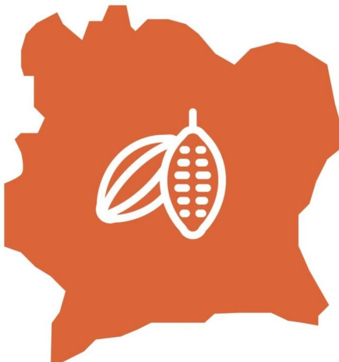

---

**Disclaimer.** This tool was developed with the financial assistance of the European Union. The opinions expressed herein may not be considered as reflecting the official opinion of the European Union. This tool aims to support the cocoa sector in its efforts to comply with European market requirements. Its content is indicative, not legally binding and does not constitute legal advice. No guarantee is given as to the accuracy, completeness or timeliness of the content. The authors of this module accept no responsibility for any damage or loss arising from its use. The authors welcome any comments and suggestions for improvement.

© European Forest Institute, 2025

# **Table of contents**

| 1. Background                                                   | 5                                                                                     |
|-----------------------------------------------------------------|---------------------------------------------------------------------------------------|
| The European Deforestation Regulation                           | 5                                                                                     |
| Collaboration between Côte d’Ivoire and the European Union      | 6                                                                                     |
| Supporting due diligence                                        | 6                                                                                     |
| 2. Objectives and methodology                                   | 7                                                                                     |
| Objectives of the tool                                          | 7                                                                                     |
| General approach                                                | 7                                                                                     |
| How should these due diligence recommendations be used?         | 8                                                                                     |
| Scope of the recommendations                                    | 9                                                                                     |
| Role of ARS-1000 certification in due diligence                 | 10                                                                                    |
| 3.                                                              | Due diligence recommendations relating to legal requirements relevant to conventional |
| cocoa production in Côte d’Ivoire                               | 12                                                                                    |
| Category 1: Land-use rights                                     | 12                                                                                    |
| 1.1 Requirements not requiring additional due diligence         | 13                                                                                    |
| 1.2. Requirements for enhanced due diligence                    | 14                                                                                    |
| Category 2: Environmental protection                            | 15                                                                                    |
| 2.1. Requirements not requiring additional due diligence        | 16                                                                                    |
| 2.2. Requirements calling for enhanced due diligence            | 17                                                                                    |
| Category 3: Third parties’ rights                               | 22                                                                                    |
| 3.1 Requirements not requiring additional due diligence         | 22                                                                                    |
| 3.2 Requirements for enhanced due diligence                     | 22                                                                                    |
| Category 5: Tax, anti-corruption, trade and customs regulations | 23                                                                                    |
| 5.1. Requirements not requiring additional due diligence        | 24                                                                                    |
| 5.2. Requirements for enhanced due diligence                    | 27                                                                                    |
| Category 6: Labour rights*                                      | 28                                                                                    |
| 6.1. Requirements not requiring additional due diligence        | 29                                                                                    |
| 6.2. Requirements for enhanced due diligence                    | 30                                                                                    |
| Category 7: Human rights*                                       | 41                                                                                    |
| 7.1. Requirements not requiring additional due diligence        | 42                                                                                    |
| 7.2. Requirements for enhanced due diligence                    | 43                                                                                    |

| 4.                                                              | Due diligence recommendations relating to the legal requirements relevant to ARS-1000 |
|-----------------------------------------------------------------|---------------------------------------------------------------------------------------|
| certified cocoa production in Côte d’Ivoire                     | 49                                                                                    |
| Category 1: Land-use rights                                     | 51                                                                                    |
| Category 2: Environmental protection                            | 53                                                                                    |
| Category 3: Third parties’ rights                               | 55                                                                                    |
| Category 5: Tax, anti-corruption, trade and customs regulations | 56                                                                                    |
| Category 6: Labour rights*                                      | 59                                                                                    |
| Category 7: Human rights*                                       | 63                                                                                    |
| Annex 1 — Detailed methodology                                  | 66                                                                                    |
| Appendix 2 — Details of the ARS-1000 certification scheme       | 68                                                                                    |
| Annex 3 - Consultations carried out                             | 73                                                                                    |

# **1. Background**

# **The European Deforestation Regulation**

On 31 May 2023, the European Union (EU) adopted Regulation 2023/1115 on the placing on the EU market and export from the EU of certain forest-risk commodities (EUDR). This regulation requires operators and traders importing commodities at risk of deforestation into the EU to demonstrate that the products are traceable, deforestation-free and legal. The scope of application of the regulation covers seven commodities: coffee, cocoa, rubber, palm oil, soy, beef and timber, as well as their derived products such as chocolate and cocoa paste. The entry into application of the regulation is scheduled for 31 December 2025 (six months later for micro and small enterprises).

Companies affected by the regulation (operators and traders) will be required to carry out "due diligence" prior to exporting or placing their product on the market in order to provide sufficient information to ensure that the product has no or negligible risk of non-compliance. Consequently, operators placing cocoa or derived products on the EU market will have to ensure that they have been produced in accordance with the relevant legislation of the country of production regarding the legal status of the area of production (Articles 3 and 2.40). The EUDR takes a flexible approach by listing several areas of law without specifying particular legal instruments, as these differ from country to country and may be subject to change. These areas are [for agricultural products] (Article 2.40):

- a) land-use rights;
- b) environmental protection; […]
- d) third parties' rights;
- e) labour rights;
- f) human rights protected by international law;
- g) the principle of free, prior and informed consent, including as set out in the United Nations Declaration on the Rights of Indigenous Peoples;
- h) taxation, anti-corruption, trade and customs regulations.

In this context, understanding the legislative framework of the country of origin, identifying the relevant legal requirements for the products de base concerned and how compliance with these requirements can be verified is a challenge for operators responsible for due diligence, but also for the competent authorities of the European Union responsible for controls, as well as for the various stakeholders concerned.

# **Collaboration between Côte d'Ivoire and the European Union**

In 2021, Côte d'Ivoire and the European Union launched a political dialogue aimed at supporting national objectives in terms of the economic, environmental and social sustainability of cocoa and facilitating its access to the European market. This collaboration is being implemented through a series of technical partners, including the European Forest Institute (EFI), which is supporting Côte d'Ivoire in developing an enabling framework to facilitate access to the European market for its agricultural products and promote transparency in supply chains.

# **Supporting due diligence**

A study led by EFI, as part of the partnership between Côte d'Ivoire and the European Union on sustainable cocoa farming, began in June 2024 with the aim of supporting due diligence by operators wishing to place Ivorian cocoa or its derived products on the European market. Pending the establishment of standards by the Government, the approach aims to identify, through a multi-stakeholder and consensual process, the relevant legality requirements under the EUDR in order to facilitate the work of the various actors in the sector, ensure equitable access to information, reduce perceived risks and give Côte d'Ivoire a competitive advantage.

This work is being carried out with the technical support of a consortium of experts in law and due diligence, comprising Preferred by Nature, Mondon Conseil International, Bureau Norme Audit (BNA) and Mr Yannick Troupah (independent expert). It is being carried out through consultation and involvement of actors in the sector, in particular the Coffee and Cocoa Board (CCC) (see Annex 3).

# **2. Objectives and methodology**

# **Objectives of the tool**

The objectives of the tool are:

- 1. To identify all Ivorian legal requirements covered by the EUDR and relevant to cocoa production in Côte d'Ivoire.
- 2. To provide recommendations for cocoa compliance verification and risk management, including through ARS-1000 certification, in order to support operators' due diligence.

The tool was developed in two steps:

- Step 1: Identification of relevant national legal requirements within the framework of the EUDR and cocoa production in Côte d'Ivoire.
- Step 2: Development of due diligence recommendations for operators, based on an analysis of the level of implementation of relevant legal requirements and existing verification means, including the role of ARS-1000 certification.

This module presents the results of Phase 2 (Module 2). It complements module 1 *Support tool for due diligence on the legality of cocoa within the framework of the EUDR — Module 1: Relevant legal requirements for cocoa in Côte d'Ivoire*, which presents Phase 1.

# **General approach**

The objective of this tool is to support the formulation of a national, participatory and consensual vision of the legal requirements applicable to Ivorian cocoa, in order to: i) support the harmonisation of operators' due diligence approaches; ii) encourage the simplification of procedures for actors upstream actors who may be required to provide data to their customers; and iii) facilitate a better understanding of national contexts by the EU competent authorities responsible for controls. **It is important to note that the results provided are in no way legally binding, do not commit any of the actors concerned and do not constitute legal advice. The results of this work are in no way intended to replace any official guidance that might be produced by national authorities.** Finally, it is the responsibility of operators placing cocoa or its derived products on the European market to identify the relevant legal requirements within the meaning of Article 2(40) of the EUDR and to adapt their due diligence to the risks identified. The results of this work only provide recommendations that may support these operators and other actors in the sector in this direction.

Furthermore, these results are likely to evolve over time and be updated due to numerous factors: potential legal reforms in the country or new guidance from the Ivorian regulator, additional guidance provided by the European Commission or EU competent authorities, integration of best practices and technological advances, etc.

The tool is based on the work of national and international experts in law and due diligence and on technical consultation with all relevant national and international actors in the cocoa sector: administration and ministries, exporters, traders and chocolate makers, producer cooperatives and associations, certification bodies, civil society organisations and European Union importing countries.

# **How should these due diligence recommendations be used?**

### **Who are these recommendations intended for?**

These recommendations are intended for various actors concerned with the compliance of cocoa and its derived products with the EUDR. They may be useful to:

- **Operators** within the definition of the EUDR: any natural or legal person who, in the course of a commercial activity, places cocoa or derived products on the EU market or exports them.
- **Traders** within the definition of the EUDR: any natural or legal person in the supply chain, other than the operator, who makes the products concerned available on the EU market.
- **EU competent authorities**: authorities designated by Member States to ensure compliance with the obligations of the EUDR.
- **Supply chain actors** in Côte d'Ivoire: producers, cooperatives, traders, exporters and other stakeholders involved in cocoa production and marketing, who must provide operators with the information, data and documents necessary for the implementation of due diligence.
- **Ivorian public entities**: government administrations and agencies responsible for regulating the cocoa sector, land use, the environment and sustainable development.
- **Civil society**: non-governmental organisations, associations and other actors playing a role in monitoring, supporting producers and advocating for the compliance of cocoa and its derived products with Ivorian legislation and international commitments.

#### **What is the purpose of these recommendations?**

These recommendations can be used in different ways and at different times depending on the actors involved.

**Operators and traders** could use these recommendations to implement and document their due diligence system, ensuring that the cocoa they trade complies with the legality requirements of the EUDR. They could use them to identify the documents and information to be collected or other actions to be taken with their suppliers in Côte d'Ivoire, and to assess the risks associated with their supply chain.

**EU competent authorities** could use these recommendations as a standard for assessing the compliance of products placed on the market with the EUDR. They could also use these recommendations to harmonise their controls and interpret documents from Côte d'Ivoire.

**Actors in the supply chain in Côte d'Ivoire** could use these recommendations to understand the implications of the EUDR for Ivorian cocoa requirements and the expectations of European operators and traders subject to them. These recommendations could help them to structure and document the information to be provided. They could also help them to anticipate risks of non-compliance and adapt their agricultural and commercial practices.

**Ivorian public entities** could use these recommendations to promote data transparency, in particular by facilitating access to administrative documents, in order to help operators demonstrate the legality of cocoa. They could also use them to support smallholders in achieving compliance by providing them with better access to information on current regulations and buyer requirements.

**Civil society** could use these recommendations to conduct analyses, produce reports or submit substantiated concerns as defined in the EUDR on the risks of non-compliance of Ivorian cocoa. It could also use them to raise awareness among producers, companies and consumers about the issues surrounding the legality of Ivorian cocoa.

# **Scope of the recommendations**

#### **Identification of legal requirements relevant to the cocoa sector in Côte d'Ivoire (rural domain)**

The recommendations set out in this module 2 aim to address all the relevant legal requirements for cocoa production in the rural domain identified by stakeholders during the first part of this work (see *Module 1: Legal requirements relevant to cocoa in Côte d'Ivoire*).

These cover all the legal areas listed by the EUDR (Article 2.40), in accordance with the precautionary approach adopted by the study (see Annex 1). However, a distinction is made between requirements directly related to the objectives of the EUDR and others, which are marked with an asterisk. This flexible approach allows users of the recommendations to adapt due diligence actions according to their interpretation of the scope of application of the EUDR.

On the other hand, legal requirements, and therefore the recommended due diligence actions, apply to cocoa produced in the rural domain. Indeed, as the legal modalities for cocoa production in agroforests are still being developed, these specific sources of supply are not included in the scope of the study. That said, many of the legal requirements and associated due diligence recommendations will apply to both the rural domain and agroforests. Interested readers are invited to consult Annex 1 of the *Module 1: Legal requirements relevant to cocoa in Côte d'Ivoire.*

### **Simplified or enhanced due diligence**

This tool adopts a pragmatic approach, which aims to identify risk-proportionate due diligence actions in order to limit the burden on actors in the sector. For each legal requirement deemed relevant to cocoa production and trade in Côte d'Ivoire, its level of implementation has been

assessed. The level of implementation retained by the study is based on: relevant literature, experts' knowledge of the sector, field surveys carried out as part of the study, and bilateral and multi-stakeholder consultations organised as part of this work. Where the level of implementation assessed for a requirement is high, the risk of non-compliance is considered negligible. Consequently, no additional due diligence is recommended, other than to confirm this finding.

However, when the level of implementation for a requirement is low, the risk of non-compliance is considered significant. Therefore, enhanced due diligence is recommended. It should be noted that many of the recommended due diligence actions were discussed at a multistakeholder workshop in December 2024. In addition, more detailed due diligence actions are mentioned in this module. They are indicated by the phrase: "operators may consider the following actions, among others".

However, this analysis is only indicative and has only been carried out at country level. **It is the responsibility of operators to carry out a risk analysis of non-compliance of their products for each shipment.** In this context, these recommendations provide a range of options for due diligence actions. **These actions are not prescriptive or presented in any order of priority. It is up to the operator to choose from these options based on the context, their knowledge of their supply chain and the risks identified for cocoa and its derived products.**

# **Role of ARS-1000 certification in due diligence**

This tool distinguishes between "conventional" cocoa and cocoa ARS-1000 certified.

The African Standard for Sustainable Cocoa (ARS), published in June 2021 by the African Organisation for Standardisation, aims to promote the production of sustainable cocoa beans. The standard is based on the principle of continuous improvement. It provides for **three different levels of certification** (bronze, silver and gold) and addresses the social, economic and environmental aspects of sustainable cocoa.

The ARS comprises three parts:

- **ARS 1000-1:** Requirements for Management Systems for Cocoa Producers as Producer Entities/Groups/Cooperatives and Performance
- **ARS 1000-2**: Requirements for Cocoa Quality and Traceability
- **ARS 1000-3**: Requirements for Cocoa Certification Schemes

ARS-1000 is a sustainable cocoa certification scheme, but also a legal requirement in Côte d'Ivoire. **It was made mandatory by Decree 2022-393 of 8 June 2022**. An operational guide for Côte d'Ivoire was produced in 2023 and the standard is currently being rolled out.

Further details on the ARS-1000 standard are available in Annex 2. Section 4 provides due diligence recommendations specific to ARS-1000 certified cocoa.

### **The EUDR and certification**

According to the EUDR, for the purposes of risk assessment, operators shall take into account "… information from certification schemes or other third-party verified schemes …". However, the European Commission's guidelines of 2 October 2024 indicate that "self-declaration schemes" that are not based on third-party verification procedures fall outside the scope of application and are, by definition, less robust due to their lack of independence and impartiality[.](#page-10-0) 1

The Commission also specifies that certification schemes should not replace the operator's responsibility for due diligence. In other words, certification can be a tool to help European operators carry out their due diligence to meet the criteria of legality, deforestation and traceability.

Operators must be able to justify why and how certification schemes meet the requirements of the EUDR. To do so, three elements should be taken into account when relying on data from a certification scheme:

- The coverage of the legal requirements relevant to the EUDR by the standard (addressed by this tool)
- The robustness of the certification scheme (not covered by the tool: in particular the scope of certification (applicable to which actors in the value chain? to which product?), its governance (management of internal procedures and updates, for example), the accreditation processes of control bodies, the qualification of auditors and the frequency of audits, management of non-compliance, impartiality and management of conflicts of interest, etc. This information should be regularly assessed by the operator, particularly with regard to the requirements of the EUDR.
- Traceability and absence of mixing with non-certified products (not covered by this tool)

It should also be noted that the deforestation-free requirement is not covered by the tool. The tool focuses only on legal requirements.

1 Guidance document on Regulation (EU) 2023/1115 on deforestation-free products (C/2024/6789) p. 18; [https://eur](https://eur-lex.europa.eu/legal-content/EN/TXT/PDF/?uri=OJ:C_202406789)[lex.europa.eu/legal-content/EN/TXT/PDF/?uri=OJ:C\\_202406789](https://eur-lex.europa.eu/legal-content/EN/TXT/PDF/?uri=OJ:C_202406789)

### 3. Due diligence recommendations relating to legal requirements relevant to conventional cocoa production in Côte d'Ivoire

This section details the due diligence recommendations for ARS-1000 non-certified cocoa.

#### Category 1: Land-use rights

Cocoa plantations are largely located on rural domain land, governed by Law No. 98-750, which has been amended several times. The legal framework for ownership of and access to the rural domain distinguishes between:

- • Formal recognition of land **ownership**, which (1) is established by the issuance of a land title following a land registration procedure and (2) is accessible only to the State, local authorities and Ivorian natural persons (except for property rights acquired before the 1998 law).
- • The holding of **customary land rights** on customary land. Customary rights are recognised by a land certificate, which may be individual or collective. However, the law does not require local communities to register their customary land rights. Nevertheless, the absence of formal registration can create legal uncertainty and, in the long term, lead to the transfer of these rights to the State's land assets, as part of the land registration procedure for land without masters, at the end of a period defined by the regulator (but regularly extended).
- • Access to land **as a tenant or beneficiary** free of charge, in other words the transfer of the use of land rights from the customary owner or holder to a third party, based on the principle of informed consent of the parties. Several systems are possible: lease agreements, sharecropping agreements, sharecropping agreements with production sharing, sharecropping agreements with land sharing, collateral agreements for a plot of land and loan agreements. Although oral contracts are valid, they can be legally precarious. To mitigate this risk, the Rural Land Agency (AFOR) offers model contracts to secure use rights, but these are rarely used because there is no legal obligation to do so.

**It should be noted that the law does not require farmers to hold land titles or written contracts as tenants or beneficiaries of free use rights to land in order to grow cocoa.**

Finally, Ivorian legislation prohibits cocoa production in protected areas and classified forests. However, in practice, plantations exist in these areas. On the other hand, cocoa production is authorised by law in agroforests, which are areas located within the State's private forest estate where agricultural plantations and forest trees can coexist[.](#page-12-1)2

### **1.1 Requirements not requiring additional due diligence**

| Legal requirements |                                                                                                                                        | Context and levels of implementation and risk                                                                                                                                                                                                                                                                         |                                                                                                                                                                                                                                                                                                                                                                                                                                                                                                                                                                                                                                                                                                                                                                                                                                                                                                   |
|--------------------|----------------------------------------------------------------------------------------------------------------------------------------|-----------------------------------------------------------------------------------------------------------------------------------------------------------------------------------------------------------------------------------------------------------------------------------------------------------------------|---------------------------------------------------------------------------------------------------------------------------------------------------------------------------------------------------------------------------------------------------------------------------------------------------------------------------------------------------------------------------------------------------------------------------------------------------------------------------------------------------------------------------------------------------------------------------------------------------------------------------------------------------------------------------------------------------------------------------------------------------------------------------------------------------------------------------------------------------------------------------------------------------|
| Land use rights    | 
 SI 
 | 
Where the owner of the plot, or the holder of the land certificate for the plot, or the holder of customary land rights over the plot, leases or transfers all or part of their use rights, the lease or transfer of use rights must be made with the informed consent of the parties, for a specified period.
 | 
Contracts for the lease of use rights between plot owners and cocoa farmers exist. These contracts are usually concluded orally. Although valid, these contracts may be subject to legal uncertainty.
 
The level of enforcement of this requirement is considered to be high, as there are numerous mechanisms in place to ensure the proper application of land law.
 
The state agency AFOR supports the formalisation of contractual relationships in the sector by providing model contracts and capacity building for stakeholders. The Coffee and Cocoa Board also verifies farmers' use rights during the farmer registration process and when issuing producer cards.
 
Possession of a producer card is a strong indicator of legal ownership of land use rights. Finally, there are numerous village committees for resolving land disputes between individuals.
 |

See Annex 1 of Module 1 *Legal requirements relevant to cocoa in Côte d'Ivoire*

#### **1.2. Requirements for enhanced due diligence**

| Legal requirements |                                                   | Context and levels of implementation and risk                                                                                                                  | Recommended due diligence actions                                                                                                                                                                                                                                                                                                                                                                                                                                       |                                                                                                                                                                                                                                                                                                                                                                                                                                                                                                               |
|--------------------|---------------------------------------------------|----------------------------------------------------------------------------------------------------------------------------------------------------------------|-------------------------------------------------------------------------------------------------------------------------------------------------------------------------------------------------------------------------------------------------------------------------------------------------------------------------------------------------------------------------------------------------------------------------------------------------------------------------|---------------------------------------------------------------------------------------------------------------------------------------------------------------------------------------------------------------------------------------------------------------------------------------------------------------------------------------------------------------------------------------------------------------------------------------------------------------------------------------------------------------|
| Protected areas    |  | 
Agriculture is prohibited in protected areas and classified forests. The use rights granted to local communities do not include agricultural practices.
 | 
Classified forests (excluding forests recently reclassified as agroforests) are affected by encroachment for agricultural production, particularly cocoa production.
 
Protected areas (national parks and nature reserves) are less affected by illegal agricultural practices, but this may nevertheless be the case, particularly in the Marahoué National Park and the Mabi-Yaya, Bossématié and Cavally nature reserves (formerly classified forests).
 | 
<b>Mapping analyses</b>
 
Collect geolocation data on protected areas and classified forests, prioritising the most recent and official data (preferably data from the State — boundaries mentioned in classification documents, Côte d'Ivoire 2020 BNEDT/CIGN land use map — and data layers provided by OIPR and SODEFOR managers), and possibly other relevant sources.
 
Overlay the geolocation data for production plots and the boundaries of protected areas and classified forests.
 |
|                    |                                                   |                                                                                                                                                                |                                                                                                                                                                                                                                                                                                                                                                                                                                                                         | 
<b><u>If the mapping analysis is inconclusive:</u></b>
 
<b>Consult stakeholders</b>
 
Confirm that there are no cocoa plantations within the boundaries of protected areas and classified forests based on interviews with protected area and classified forest managers, the CCC, chiefdoms, NGOs, sub-prefectures, village committees and the AFOR.
                                                                                                                                       |
|                    |                                                   |                                                                                                                                                                | 
<b>Field verifications</b>
 
Conduct field visits to confirm that producers' plots do not encroach on the boundaries of protected areas or classified forests.
                                                                                                                                                                                                                                                                                              |                                                                                                                                                                                                                                                                                                                                                                                                                                                                                                               |

## Category 2: Environmental protection

In terms of legal requirements relating to environmental protection for cocoa cultivation, the main points to note are as follows:

- • **Pesticides and fertilisers** are commonly used on cocoa plantations. The use of pesticides in particular is a major issue and can pose contamination risks for local communities and the environment, especially when unregistered products are used. The use of pesticides is closely linked to other environmental protection issues such as soil protection, watercourse protection and waste management.
- • There is also an issue surrounding **the conversion of forest land** in rural areas, which is subject by law to the provisions of a forest management plan or specific authorisation. However, this legal provision is rarely enforced, as it is largely unknown to local communities. It should be noted that the table of legal requirements sets out the legal framework applicable to land clearing and deforestation, but does not prejudge compliance with the EUDR's deforestation-free criteria, which will have to be assessed separately.
- • There are few other relevant requirements for cocoa production in terms of environmental protection. This is because cocoa plantations are on average less than 4 hectares in size. They are therefore exempt from the requirement to carry out an environmental and social impact assessment, which only applies to projects larger than 10 hectares.

#### **2.1. Requirements not requiring additional due diligence**

| Legal requirements                                                                                                                                               |                                                                                                                                                                | Context, implementation and risk levels                                                                                                                                                                                                                                                                                                                                                                                                                                                                                                                                                                                                                                                                                                                                                                                                                                                                                  |
|------------------------------------------------------------------------------------------------------------------------------------------------------------------|----------------------------------------------------------------------------------------------------------------------------------------------------------------|--------------------------------------------------------------------------------------------------------------------------------------------------------------------------------------------------------------------------------------------------------------------------------------------------------------------------------------------------------------------------------------------------------------------------------------------------------------------------------------------------------------------------------------------------------------------------------------------------------------------------------------------------------------------------------------------------------------------------------------------------------------------------------------------------------------------------------------------------------------------------------------------------------------------------|
|  Use of fertilisers                                         |  All fertilisers must be approved before they can be marketed, sold and used. | 
The National Fertiliser Control Committee, within the Ministry of Agriculture, is the institutional mechanism responsible for controlling fertiliser use. Officials carry out quality controls on fertilisers at all levels and at all stages of manufacture, unloading, storage, marketing and use.
 
The strong involvement of agricultural cooperatives and the Coffee and Cocoa Board (CCC) in the distribution of fertilisers also helps to ensure compliance with legal requirements.
 
There are few unregistered fertilisers in circulation on local markets.
 
<i>N.B. The December 2024 consultation workshop highlighted the need to further justify this high level of implementation with data from the Ministry of Agriculture.</i>
                                                                                                                                                  |
|  Biodiversity and endangered species |  Protected tree species are respected in cocoa plantations.                   | 
<b>Protection of tree species</b>
 
There are regulations on forestry that ensure the protection of tree species. These regulations are drawn from the following texts (Law No. 2019-675 of 23 July 2019 on the Forest Code (Art. 49; Art. 81; Art. 91); — Decree No. 2019-980 of 27 November 2019 on logging in the national forest estate (Art. 4; Art. 5; Art. 6); — Decree No. 0512/MINEF/DGFF/DPIF of 19 May 2023 approving technical standards for timber harvesting (Art. 1; Annex 2 of the decree on the list of protected tree species). These texts require authorisation for any tree felling (see 2.2.1), whether outside the forest, registered or located in an area with a management plan. Felling is carried out on the basis of standards that allow the preservation of protected tree species, the list of which is determined by decree.
 
<b>The link between cocoa productio</b>
 |

#### **2.2. Requirements calling for enhanced due diligence**

| Legal requirements |                                                                 | Context, implementation and risk levels                                                             | Recommended due diligence actions                                                                                                                                                                                                                                                                                                                                                                                                                                                                                                                                                                                                                                                                                                                                                                               |                                                                                                                                                                                                                                                                                                                                                                                                                                                                                                                                                                                                                                                                                                                                                                                                                                                                                  |
|--------------------|-----------------------------------------------------------------|-----------------------------------------------------------------------------------------------------|-----------------------------------------------------------------------------------------------------------------------------------------------------------------------------------------------------------------------------------------------------------------------------------------------------------------------------------------------------------------------------------------------------------------------------------------------------------------------------------------------------------------------------------------------------------------------------------------------------------------------------------------------------------------------------------------------------------------------------------------------------------------------------------------------------------------|----------------------------------------------------------------------------------------------------------------------------------------------------------------------------------------------------------------------------------------------------------------------------------------------------------------------------------------------------------------------------------------------------------------------------------------------------------------------------------------------------------------------------------------------------------------------------------------------------------------------------------------------------------------------------------------------------------------------------------------------------------------------------------------------------------------------------------------------------------------------------------|
| Use of pesticides  |  | All pesticides must be approved/authorised/registered prior to being placed on the market and used. | <ul> <li>The list of pesticides approved and authorised for use in cocoa cultivation is public and available.</li> <li>The risk of using unregistered pesticides is higher when producers do not purchase from approved distributors and suppliers or cooperatives and/or do not use approved applicators.</li> <li>Good knowledge of regulations and good practices for application (e.g. pesticide non-application zones) and packaging treatment is uneven among cocoa farmers, some of whom are not aware of or trained in this issue.</li> <li>A large proportion of pesticide packaging is returned to suppliers via cooperatives. However, cases of pesticide packaging being abandoned on plantations or reused in the home are also common and do not comply with the regulations in force.</li> </ul> |  
<b>Collection of relevant data</b>
 
Check whether the farmer is a member of a cooperative (the incidence of non-compliant pesticide use is lower among farmers affiliated to a cooperative, as the latter can provide guidance and raise awareness on the proper use of pesticides).
 
Operators may also consider collecting the following data:
 <ul> <li><a href="#">Details on producer training (training organisations, date, participants, content, etc.)</a></li> <li><a href="#">Aggregated data on pesticide application methods and types of pesticides.</a></li> <li><a href="#">Data on the proximity of watercourses (even minor ones) to plots, for example through questionnaires to producers (no additional action to be taken for water protection in negative cases).</a></li> </ul> |
|                    |                                                                 |                                     | 
Activities that could adversely affect water quality are carried out in accordance with special provisions on integrated water resource management. Spills and waste dumping of any kind into water resources are prohibited.
                                                                                                                                                                                                                                                                                                                                                                                                                                                                                                                                                                            |                                                                                                                                                                                                                                                                                                                                                                                                                                                                                                                                                                                                                                                                                                                                                                                                                                                                                  |
| Waste management   |                                                                 |                                                                                                     |                                                                                                                                                                                                                                                                                                                                                                                                                                                                                                                                                                                                                                                                                                                                                                                                                 |                                                                                                                                                                                                                                                                                                                                                                                                                                                                                                                                                                                                                                                                                                                                                                                                                                                                                  |

| Legal requirements | Context, implementation and risk levels | Recommended due diligence actions                                                                                                                                                                                                                                                                                                                                                                                                                                                                                                                                                                                                                                                                                                                                                                                                                                                                                                                            |
|--------------------|-----------------------------------------|--------------------------------------------------------------------------------------------------------------------------------------------------------------------------------------------------------------------------------------------------------------------------------------------------------------------------------------------------------------------------------------------------------------------------------------------------------------------------------------------------------------------------------------------------------------------------------------------------------------------------------------------------------------------------------------------------------------------------------------------------------------------------------------------------------------------------------------------------------------------------------------------------------------------------------------------------------------|
|                    |                                         | 
<b>Implementation of procedures/processes</b>
 
Provide training and awareness-raising for producers on the use of approved pesticides and their proper application, as well as on pesticide waste management.
 
Operators may also consider implementing the following processes:
 <ul> <li>• Systematically collect information from producers on (1) how pesticides are applied (directly or by subcontractors) and (2) the type of pesticides used. For example, by regularly filling in a pesticide application monitoring form or by regularly completing a questionnaire.</li> <li>• Provision to producers by intermediaries of an up-to-date list of pesticides authorised/not authorised at the cooperative level, as well as a list of approved applicators.</li> <li>• Provision to producers of tools for monitoring pesticide application, such as pesticide monitoring sheets for collecting relevant information.</li> </ul> |
|                    |                                         | 
<b>Consultation with stakeholders</b>
 
Operators may also consider confirming the absence of water pollution in the supply area through interviews with cooperatives, NGOs, authorities and other local actors.
                                                                                                                                                                                                                                                                                                                                                                                                                                                                                                                                                                                                                                                                                                                                 |
|                    |                                         | 
<b>Field verifications</b>
 
Operators may also consider conducting field verifications of the correct application of approved pesticides.
                                                                                                                                                                                                                                                                                                                                                                                                                                                                                                                                                                                                                                                                                                                                                                                                       |

# **Summary of due diligence on pesticide use:**

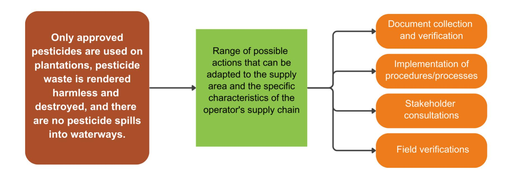

| Legal requirements | Context and levels of implementation and risk                                                                                                                                                                  | Recommended due diligence actions                                                                                                                                                                                                                                                                                                                                                                                                                                                                                                                                                                                                                                                                                                                                                                                                                                                                                                                                                                                             |                                                                                                                                                                                                                                                                                                                                                                                                                                                                                                                                                                                                                                                                                                                                                                  |
|--------------------|----------------------------------------------------------------------------------------------------------------------------------------------------------------------------------------------------------------|-------------------------------------------------------------------------------------------------------------------------------------------------------------------------------------------------------------------------------------------------------------------------------------------------------------------------------------------------------------------------------------------------------------------------------------------------------------------------------------------------------------------------------------------------------------------------------------------------------------------------------------------------------------------------------------------------------------------------------------------------------------------------------------------------------------------------------------------------------------------------------------------------------------------------------------------------------------------------------------------------------------------------------|------------------------------------------------------------------------------------------------------------------------------------------------------------------------------------------------------------------------------------------------------------------------------------------------------------------------------------------------------------------------------------------------------------------------------------------------------------------------------------------------------------------------------------------------------------------------------------------------------------------------------------------------------------------------------------------------------------------------------------------------------------------|
| Forest conversion  | 
Any deforestation or land clearing must be provided for in the forest management plan or be subject to prior authorisation. It is conditional on the maintenance of at least 30% of the area concerned.
 | 
In the absence of a Forest Management Plan that explicitly provides for it, authorisation for deforestation or land clearing is required for any forest area. The procedures for issuing such authorisations are set out in Article 3 of Decree No. 2020-423 of 29 April 2020.
 
This requirement was provided for in the 1965 forestry legislation, confirmed in the 2014 legislation and maintained in the current legislation.
 
However, in practice, virtually no authorisations have been issued prior to land clearing or deforestation for agricultural purposes.
 
This situation is due to low awareness among planters and the lack of a robust institutional mechanism to enforce it (issuing and monitoring permits).
 
The risk of non-compliance with this legal requirement is therefore significant.
 
<i>N.B. In the case of land clearing or deforestation, the EUDR deforestation criterion is an additional criterion that must be verified separately by operators.</i>
 | 
Given that very few management plans exist in the rural domain and that authorisations are not issued in practice, stakeholders made the following recommendation in September 2024 in order to be able to meet the EUDR requirements pending the operationalisation of the process:
 
<b><u>Recommendation to the State</u></b>
 
<b>Introduce a moratorium on the requirement for a development plan or authorisation for land clearing in rural areas, pending the operationalisation of the process.</b>
 
Operators may also consider the following actions:
 
<b>First determine</b> whether deforestation or land clearing has actually taken place in the area of production (if not, no further due diligence is necessary):
 |
|                    |                                                                                                                                                                                                                | 
<b>Mapping analysis</b>
                                                                                                                                                                                                                                                                                                                                                                                                                                                                                                                                                                                                                                                                                                                                                                                                                                                                                                                                                                                                |                                                                                                                                                                                                                                                                                                                                                                                                                                                                                                                                                                                                                                                                                                                                                                  |

| Legal requirements                                                                                                 | Context and levels of implementation and risk                                                                                                                                                                                                                                                                                                    | Recommended due diligence actions                                                                                                                                                                                                                                                                                                                                                                                                                                                                                                                                                                                                                                                                                                                                                                                      |                                                                                                                                                                                                                                                                                                                                                                                                                                                                                                                                                                                                                          |
|--------------------------------------------------------------------------------------------------------------------|--------------------------------------------------------------------------------------------------------------------------------------------------------------------------------------------------------------------------------------------------------------------------------------------------------------------------------------------------|------------------------------------------------------------------------------------------------------------------------------------------------------------------------------------------------------------------------------------------------------------------------------------------------------------------------------------------------------------------------------------------------------------------------------------------------------------------------------------------------------------------------------------------------------------------------------------------------------------------------------------------------------------------------------------------------------------------------------------------------------------------------------------------------------------------------|--------------------------------------------------------------------------------------------------------------------------------------------------------------------------------------------------------------------------------------------------------------------------------------------------------------------------------------------------------------------------------------------------------------------------------------------------------------------------------------------------------------------------------------------------------------------------------------------------------------------------|
|                                                                                                                    |                                                                                                                                                                                                                                                                                                                                                  |  
Verify through analysis and mapping data that deforestation or land clearing has not affected more than 30% of the area concerned.
                                                                                                                                                                                                                                                                                                                                                                                                                                                                                                                                                                                                                         |                                                                                                                                                                                                                                                                                                                                                                                                                                                                                                                                                                                                                          |
|  
Environmental and social impact assessments
 |  
Any project located in or near areas at risk or ecologically sensitive (including wetlands, areas of scientific, cultural or tourist interest, ecologically sensitive areas and water point protection zones) is subject to authorisation based on an environmental impact assessment.
 | 
The regulatory framework is very extensive in terms of the list of areas requiring an environmental impact assessment (EIA).
 
The identification of these areas is not always formalised. The boundaries of these areas are not always clearly marked or known to local communities.
 
The risk to wetlands (areas where water is the main factor determining plant and animal life, with a water table at or near the surface of the ground) is low, as cocoa cultivation is unsuitable there. However, it is difficult to conclude on a general risk level at national level for areas of scientific, cultural or tourist interest and ecologically sensitive areas, as these are not sufficiently known. As a precautionary approach, the risk is considered to exist and requires due diligence.
 | 
<b>Mapping analysis</b>
 
Conduct mapping analyses.
 
Operators may consider the following actions in particular:
 <ul> <li>Collect geolocation data on areas at risk or ecologically sensitive, giving priority to the most recent and official data (preferably data from the government).</li> <li>Superimpose geolocation data for production plots and the boundaries of areas at risk or ecologically sensitive.</li> </ul> 
<b>Consultations with stakeholders</b>
 
Operators may also consider confirming that there are no cocoa plantations in risk or ecologically sensitive area
 |

# **Category 3: Third parties' rights**

As cocoa plantations are mainly family-run, their operation is not likely to infringe on third parties' rights. Furthermore, the legal framework recognises the fundamental rights of local communities, but these requirements often take the form of very general provisions that are not operationalised by implementing texts and are therefore not relevant from a due diligence perspective. Some requirements, particularly for environmental and social impact assessments, are only relevant above a certain surface area, which does not apply to the cocoa sector.

Some requirements relevant to community rights are also addressed in category 1, in relation to land access rights, and in category 2, in relation to protection against forms of pollution.

The main relevant requirements relating to the protection of third parties' rights concern **the prohibition of cocoa production on sacred sites and other archaeological and historical sites**.

### **3.1 Requirements not requiring additional due diligence**

| Legal requirements                                                          |                                                                                                                                                           | Context and levels of implementation and risk                                                                                                                                                                                                                                                                                                                                                                                                                              |
|-----------------------------------------------------------------------------|-----------------------------------------------------------------------------------------------------------------------------------------------------------|----------------------------------------------------------------------------------------------------------------------------------------------------------------------------------------------------------------------------------------------------------------------------------------------------------------------------------------------------------------------------------------------------------------------------------------------------------------------------|
| 
Protection of sites, resources and habitats important to communities
 | 
<b>SI</b>
 
Cocoa production is not permitted on sacred sites.
                                                                                | 
Archaeological and historical sites that are classified or under protection are mostly registered and mapped by the State. Although sacred forests are not yet systematically registered and mapped by the State, local communities and farmers are well informed of this requirement and are familiar with the boundaries of sacred and cultural sites. There are no known cases of cocoa cultivation illegally encroaching on sites of importance to communities.
 |
|                                                                             | 
<b>SI</b>
 
Cocoa production cannot take place on archaeological and historical sites that are listed, classified or under protection orders.
 |                                                                                                                                                                                                                                                                                                                                                                                                                                                                            |

#### **3.2 Requirements for enhanced due diligence**

There are no requirements for enhanced due diligence in this category.

# **Category 5: Tax, anti-corruption, trade and customs regulations3**

*N.B. This is the only category in the EUDR that could potentially affect entities throug[ho](#page-22-1)ut the supply chain of the producing country, and not just at the level of the cocoa production plot*.

In Côte d'Ivoire, the main tax requirements differ depending on the tax system of each actor concerned. In particular, smaller actors such as producers and some cooperatives are subject to few tax provisions due to their tax regime and the size of their plots. A withholding tax system applies to informal local traders and suppliers. Most other provisions, in particular corporate taxes, apply to the larger actors in the chain, such as traders, processors and exporters.

In addition, a series of specific requirements apply to customs duties, the obtaining of mandatory approvals for actors in the sector and compliance with mandatory quality standards.

Finally, the 2013 ordinance against corruption also contains obligations for actors in the sector. It should be noted that the digitisation of fund collection procedures by financial authorities has significantly improved the transparency of transactions in the cocoa trade in Côte d'Ivoire. Digital tools such as "SIVAT-C2" for the auctioning of cocoa for export, e-taxes for tax collection, and "SYDAM-World" for customs formalities significantly reduce the risk of corruption.

NB. This module does not contain any information on Category 4 of the standard used (Free, Prior and Informed Consent — FPIC). This is because Côte d'Ivoire does not have a binding legal framework governing FPIC. See *"Module 1 - Relevant legal requirements for cocoa in Côte d'Ivoire*".

#### **5.1. Requirements not requiring additional due diligence**

| Legal requirements |                                                                | Context, implementation and risk levels                                                                                                                                                                                                     |                                                                                                                                                                                                                                                                                                                                          |
|--------------------|----------------------------------------------------------------|---------------------------------------------------------------------------------------------------------------------------------------------------------------------------------------------------------------------------------------------|------------------------------------------------------------------------------------------------------------------------------------------------------------------------------------------------------------------------------------------------------------------------------------------------------------------------------------------|
| Taxes              |  | Individual entrepreneurs and companies in the agricultural sector are subject to corporate tax if they are subject to a real tax system.                                                                                                    | In the cocoa sector, corporate tax mainly applies to players with an annual turnover of more than 200 million, in particular: <ul> <li>individual entrepreneurs in the cocoa farming sector;</li> <li>agricultural cooperatives (with the exception of agricultural production companies), processors and</li> <li>exporters.</li> </ul> |
|                    |                                                                | The tax rate is 25% of taxable income in the event of a profit (tax on industrial and commercial profits or BIC).                                                                                                                           | Production cooperatives (cooperative companies whose activity consists of grouping the production of their members) are exempt from corporate tax.                                                                                                                                                                                       |
|                    |                                                                | In the event of a deficit, a minimum flat-rate tax (IMF) applies as corporate tax. The rate is 0.5% or 2% of turnover including all taxes.                                                                                                  | The licence issued by the regulator, the Coffee and Cocoa Board (CCC), to operators at the start of the season is subject to the operator producing certificates of tax and customs compliance.                                                                                                                                          |
|                    |                                                                |                                                                                                                                                                                                                                             | The authorisation to export Ivorian cocoa (F01) issued by the CCC to the operator allows the requirements relating to the payment of licence fees and professional taxes to be considered as having been met.                                                                                                                            |
|                    |                                                                |                                                                                                                                                                                                                                             | These documents are issued subject to the operator's tax and customs compliance.                                                                                                                                                                                                                                                         |
|                    |                                                                |                                                                                                                                                                                                                                             | As CCC operator approvals and payment of the DUS for exports are well respected, the risk is considered negligible.                                                                                                                                                                                                                      |
|                    |                                                                | Furthermore, the list of operators approved by the CCC is published and failure to pay licence fees to the regulator results in the suspension of access to the marketing platform and the withdrawal of the offending operator's approval. |                                                                                                                                                                                                                                                                                                                                          |
|                    |  | Corporate tax: Remuneration paid to suppliers involved in the cocoa purchasing process is subject to a withholding tax (2.5 francs per kilogram of cocoa delivered).                                                                        | The risk is negligible because: 
(i) transactio
                                                                                                                                                                                                                                                                                    |

| Legal requirements |                                                                                                                                                                                                                                                                                                                                                                                                                                                              | Context, implementation and risk levels                                                                                                                                                                                                                                                                                                   |
|--------------------|--------------------------------------------------------------------------------------------------------------------------------------------------------------------------------------------------------------------------------------------------------------------------------------------------------------------------------------------------------------------------------------------------------------------------------------------------------------|-------------------------------------------------------------------------------------------------------------------------------------------------------------------------------------------------------------------------------------------------------------------------------------------------------------------------------------------|
|                    |  Payment of a registration fee on export sales confirmation documents for cocoa: international cocoa export operators must pay a proportional fee of 5% of the value of export sales confirmation documents for cocoa (value "Cost, Insurance, Freight or "CAF") (registration fee). This rate is 2.835% for domestic operators with a proven volume of cocoa activities on their own account. | 
The national traceability system currently being rolled out by the Coffee Cocoa Board should make it possible to identify all informal local traders acting as intermediaries.
 
Quality standards are strictly enforced and monitored.
 
The export rights allocation system is tightly regulated and well implemented.
 |
| Trade restrictions |  Informal local traders acting as intermediaries between buyers and farmers must be officially registered and their activities are strictly controlled through the issuance of a trader's card.                                                                                                                                                                                               |                                                                                                                                                                                                                                                                                                                                           |
|                    |  Operators who purchase cocoa must hold a licence issued by the regulator, the Coffee and Cocoa Board.                                                                                                                                                                                                                                                                                        |                                                                                                                                                                                                                                                                                                                                           |
|                    |  All cocoa intended for export is subject to quality control. Exporting companies must comply with the quality, weight, packaging and phytosanitary treatment standards developed by the Côte d'Ivoire Standardisation Association (CODINORM).                                                                                                                                                |                                                                                                                                                                                                                                                                                                                                           |
|                    |  Cocoa is marketed for export by operators who hold a licence issued by the Cocoa Council and a code identifying them as cocoa exporters.                                                                                                                                                                                                                                                     |                                                                                                                                                                                                                                                                                                                                           |
|                    |  Export rights are allocated following auction by the Coffee and Cocoa Board on the basis of a minimum reference price derived from market information.                                                                                                                                                                                                                                       |                                                                                                                                                                                                                                                                                                                                           |

| Legal requirements           |                                                                                                                                                                                                                                                                                                                                                  | Context, implementation and risk levels                                                                                                                                                                                                                                                   |
|------------------------------|--------------------------------------------------------------------------------------------------------------------------------------------------------------------------------------------------------------------------------------------------------------------------------------------------------------------------------------------------|-------------------------------------------------------------------------------------------------------------------------------------------------------------------------------------------------------------------------------------------------------------------------------------------|
| Absence of corrupt practices |  
Private companies are required to establish adequate and dissuasive mechanisms to prevent acts of corruption and related offences.
 
This may include the establishment of audits, cooperation with relevant law enforcement agencies and the development of standards and procedures.
 | 
The risk of fraud was considered negligible in view of the existing state mechanisms for the dematerialisation of tax, customs and cocoa sales reporting and payment procedures. Furthermore, there is consensus that money laundering does not fall within the scope of the EUDR.
 |
|                              |  
Private companies are required to comply with applicable accounting standards and principles in order to prevent corruption and related offences.
                                                                                                                                           |                                                                                                                                                                                                                                                                                           |

#### **5.2. Requirements for enhanced due diligence**

| Legal requirements                                                                   |                                                                                                                                                     | Context and levels of implementation and risk                                                                                                                                                                                                                                                                                                                                                                                                                                                             | Recommended due diligence measures                                                                                                                                                                                                                                                                                                                      |
|--------------------------------------------------------------------------------------|-----------------------------------------------------------------------------------------------------------------------------------------------------|-----------------------------------------------------------------------------------------------------------------------------------------------------------------------------------------------------------------------------------------------------------------------------------------------------------------------------------------------------------------------------------------------------------------------------------------------------------------------------------------------------------|---------------------------------------------------------------------------------------------------------------------------------------------------------------------------------------------------------------------------------------------------------------------------------------------------------------------------------------------------------|
|  Trade restrictions |  Cocoa is purchased from producers at a minimum price set at the beginning of the cocoa season. | 
The Coffee and Cocoa Board has developed a national traceability system with the objective among others, to ensure that the minimum price is paid to farmers and provide financial traceability. It was considered that this risk will be considered negligible once the national traceability system is fully operational.
 
Transitional phase of deployment of the national traceability system: pending full deployment, the risk has been considered significant for conventional cocoa.
 |  Implementation of procedures/processes <ul> <li>• Use of the national traceability system for farmers who have received their producer cards; and/or</li> <li>• Use of the private traceability system when it includes a feature to ensure compliance with the minimum price.</li> </ul> |
|                                                                                      |                                                                                                                                                     |                                                                                                                                                                                                                                                                                                                                                                                                                                                                                                           |  Document collection and verification <ul> <li>Verification of purchase receipts</li> </ul>                                                                                                                                                                                           |

# **Category 6: Labour rights\***

*N.B. This category is specifically listed in Article 2 of the EUDR, but is not directly related to the objectives of the Regulation.* 

The cocoa sector in Côte d'Ivoire, which is essential to the national economy, relies heavily on small family farms, often less than 4 hectares in size, as well as a network of informal local traders and small and medium-sized cooperatives responsible for the initial stages of sourcing, sorting, drying and selling cocoa to traders and exporters.

Work on cocoa plantations is largely carried out by family and village networks, organised either by the owner or holders of customary land rights over the plot, or by the tenant farmer or beneficiary free of charge (e.g. under a sharecropping agreement: see category 1). These farming methods, which in most cases do not involve any relationship of subordination between owners, farmers and field workers, therefore fall outside the scope of application of social legislation (and thus most of the requirements listed below).

However, in some cases, particularly where one or a few workers are employed on the plantation for a fixed period (usually several months or a year) and in return for a wage, the plot owners act as de facto employers. They must then comply with Law No. 2015- 532 of 20 July 2015 on the Labour Code, which covers all workers, including those in the agricultural sector, by ensuring decent working conditions. This code regulates working hours, freedom of association, health and safety, and imposes the Guaranteed Minimum Agricultural Wage (SMAG) to protect workers.

In practice, the application of these rules remains difficult due to the informal nature of labour relations, which are often undocumented, making it difficult to recognise the relationship of subordination. Local labour inspectorates are continuing their efforts to raise awareness among farmers of their legal obligations to improve the implementation of workers' rights in the cocoa sector.

In order not to burden due diligence with verifications in cases where salaried work is unlikely, and without exempting an employer from its legal obligations, which is more likely in the case of larger farms, it is proposed to adopt a minimum farm size criterion below which salaried work is considered highly unlikely. This threshold below which salaried work on the plantation is highly unlikely has been set by stakeholders at 4 ha.

#### **6.1. Requirements not requiring additional due diligence**

| Legal requirements |                                                                                                                                                                                                                                                                                                                                                                        | Context and levels of implementation and risk                                                                                                                                                                                                                                                                                                        |
|--------------------|------------------------------------------------------------------------------------------------------------------------------------------------------------------------------------------------------------------------------------------------------------------------------------------------------------------------------------------------------------------------|------------------------------------------------------------------------------------------------------------------------------------------------------------------------------------------------------------------------------------------------------------------------------------------------------------------------------------------------------|
| Workers' rights    | 
In agricultural establishments, the employer must set working hours at 48 hours per week, not exceeding 2,400 hours per year.
                                                                                                                                                                                                                                   | 
In general, agricultural activities are de facto limited by daylight hours, as work cannot be carried out at night. Normal working hours are around 8 a.m. to 4 p.m., with a lunch break. Religious days (Friday or Sunday) are generally important for all communities involved in cocoa farming and are therefore well known and respected.
 |
|                    | 
For agricultural establishments, overtime may be worked in the event of an extraordinary increase in workload. The employer must ensure that overtime is paid at a higher rate.
                                                                                                                                                                                 |                                                                                                                                                                                                                                                                                                                                                      |
|                    | 
The employer must guarantee a minimum mandatory weekly rest period of 24 consecutive hours.
                                                                                                                                                                                                                                                                     |                                                                                                                                                                                                                                                                                                                                                      |
|                    | 
The employer may not take into consideration gender, age, national origin, race, religion, political or religious opinion, social origin, membership or non-membership of a trade union and trade union activity, proven or presumed HIV or AIDS status, or disability of workers in making decisions concerning, in particular, hiring and working conditions.
 |                                                                                                                                                                                                                                                                                                                                                      |
|                    | 
The employer must not impose any restrictions on workers' freedom of association, right to organise and right to collective bargaining. This obligation is reflected in the right of workers to belong to trade unions and to appoint staff representatives.
                                                                                                    | 
Due to the largely informal nature of the sector, there is very little awareness of labour rights among producers and employees. On the subject of freedom of association, there are no systemic cases identified of restrictions on this right for workers.
                                                                                  |
| Remuneration on    | 
Employees' remuneration is not lower than the guaranteed minimum agricultural wage and th
                                                                                                                                                                                                                                                                       |                                                                                                                                                                                                                                                                                                                                                      |

#### **6.2. Requirements for enhanced due diligence**

The legal requirements below apply only to **paid work**. They are not applicable in many cases in the cocoa production sector, which is dominated by family plantations.

In order not to burden due diligence with checks in cases where salaried work is unlikely, and without exempting an employer from their legal obligations, which is more likely in the case of larger farms, stakeholders proposed to **adopt a minimum farm size criterion** below which salaried work is considered highly unlikely. This threshold below which salaried work on the plantation is highly unlikely has been set by stakeholders at 4 **ha.**

➔ **Thus, for farms smaller than 4 ha, no additional due diligence is recommended, apart from documenting the negligible level of risk of noncompliance.**  ➔ **For farms larger than 4 ha, however, the following requirements apply, and enhanced due diligence is recommended.**

A useful first step is therefore to analyse the size of the plots:

#### **Mapping analysis**

Using geolocation data for production plots, determine their size.

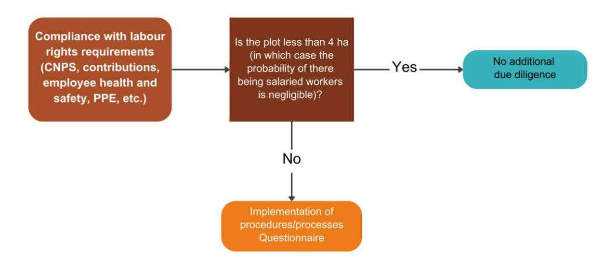

|                                                                                                                                                                                                                                                                                                                                                                                                                                                                                                                                                                                                                                                                                                                                                                                                                                                                                                                                                                                                                                                                     | Recommended due diligence actions                                                                                                                                                                                                                                                                                                                                                                                                                                                                                                                                                                                                                                                                                                                                                                                                                                                                                                                                                                                                                    |
|---------------------------------------------------------------------------------------------------------------------------------------------------------------------------------------------------------------------------------------------------------------------------------------------------------------------------------------------------------------------------------------------------------------------------------------------------------------------------------------------------------------------------------------------------------------------------------------------------------------------------------------------------------------------------------------------------------------------------------------------------------------------------------------------------------------------------------------------------------------------------------------------------------------------------------------------------------------------------------------------------------------------------------------------------------------------|------------------------------------------------------------------------------------------------------------------------------------------------------------------------------------------------------------------------------------------------------------------------------------------------------------------------------------------------------------------------------------------------------------------------------------------------------------------------------------------------------------------------------------------------------------------------------------------------------------------------------------------------------------------------------------------------------------------------------------------------------------------------------------------------------------------------------------------------------------------------------------------------------------------------------------------------------------------------------------------------------------------------------------------------------|
| Legal requirements Context, implementation levels and risk                                                                                                                                                                                                                                                                                                                                                                                                                                                                                                                                                                                                                                                                                                                                                                                                                                                                                                                                                                                                          |                                                                                                                                                                                                                                                                                                                                                                                                                                                                                                                                                                                                                                                                                                                                                                                                                                                                                                                                                                                                                                                      |
|                                                                                                                                                                                                                                                                                                                                                                                                                                                                                                                                                                                                                                                                                                                                                                                                                                                                                                                                                                                                                                                                     | ➔ For plots larger than 4 ha                                                                                                                                                                                                                                                                                                                                                                                                                                                                                                                                                                                                                                                                                                                                                                                                                                                                                                                                                                                                                         |
| At the plot level, the first step is to determine the type of plantation workers Employers are required to register Due to the largely informal nature of the sector, there is their employees with the National very little awareness of labour rights among producers, Social Security Fund (CNPS). even where employer/employee relationships exist within a Workers' hierarchical structure. Furthermore, the institutional rights mechanisms enabling employers to meet these requirements are ill-suited to agricultural producers. In practice, very few checks are carried out by the CNPS and the labour inspectorate on agricultural producers in the cocoa sector. The employer is required to pay social security contributions. The employer is required to report any workplace accidents (CNPS) or occupational illnesses that occur in the company. Pregnant women are entitled to fourteen weeks' maternity leave, including six weeks before the birth and eight weeks after. Male employees are entitled to two working days of paternity leave. | : Collection of relevant data Collect data on the type of employment of plantation workers for all producers, using a questionnaire specifying the conditions under which the work performed could be classified as salaried work. This questionnaire could be completed during systematic surveys or when collecting geolocation data on plots. Intermediaries can support this collection of data on producers and their employees. This questionnaire will also raise awareness among farmers on the issue of salaried work. If employees work on the plantation, operators may also consider: Field verifications On a sample basis, carry out regular field checks with producers. Ensure that employers have their employer registration certificates and employee registration certificates. Ensure that employers have their CNPS update certificates. Ensure that any workplace accidents that occurred during the past year have been reported to the CNPS. Ensure that employees are granted maternity/paternity leave, where applicable. |

### **Summary of due diligence relating to social security**

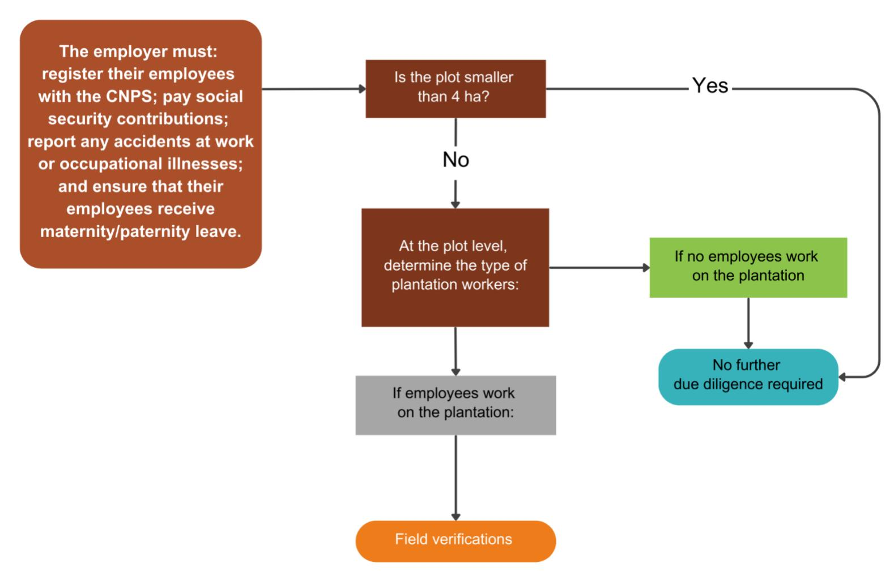

|                                                                                                                                                                                                                                                                                                                                                                                                                                                                                                                                                                                                                                                                                                                                                                                                                                                                                                                                                                                            | Recommended due diligence actions                                                                                                                                                                                                                                                                                                                                                                                                                                                                                                                                                                                                         |
|--------------------------------------------------------------------------------------------------------------------------------------------------------------------------------------------------------------------------------------------------------------------------------------------------------------------------------------------------------------------------------------------------------------------------------------------------------------------------------------------------------------------------------------------------------------------------------------------------------------------------------------------------------------------------------------------------------------------------------------------------------------------------------------------------------------------------------------------------------------------------------------------------------------------------------------------------------------------------------------------|-------------------------------------------------------------------------------------------------------------------------------------------------------------------------------------------------------------------------------------------------------------------------------------------------------------------------------------------------------------------------------------------------------------------------------------------------------------------------------------------------------------------------------------------------------------------------------------------------------------------------------------------|
| Legal requirements Context and levels of implementation and risk                                                                                                                                                                                                                                                                                                                                                                                                                                                                                                                                                                                                                                                                                                                                                                                                                                                                                                                           |                                                                                                                                                                                                                                                                                                                                                                                                                                                                                                                                                                                                                                           |
|                                                                                                                                                                                                                                                                                                                                                                                                                                                                                                                                                                                                                                                                                                                                                                                                                                                                                                                                                                                            | ➔ For plots larger than 4 ha                                                                                                                                                                                                                                                                                                                                                                                                                                                                                                                                                                                                              |
| At the plot level, first determine the type of plantation workers The employer is required to Due to the largely informal nature of the sector, there is very provide adequate housing for little awareness of labour rights among producers, even where workers and their families if they employer/employee relationships exist within a relationship of Workers' are not from the place of subordination. Furthermore, the institutional mechanisms rights employment, do not have their enabling employers to meet these requirements are ill-suited to usual place of residence there and agricultural producers. In practice, there are cases where cannot obtain it by their own accommodation for workers who do not live on the plot is not means. The employer must also provided by the employer, or is inadequate or unsanitary. provide or assist in the provision of food when the worker cannot, by his own means, obtain regular food supplies for himself and his family. | : Collection of relevant data Collect data on the type of employment of plantation workers for all producers, using a questionnaire specifying the conditions under which the work carried out could be classified as salaried work. This questionnaire can be completed during systematic surveys or when collecting geolocation data for plots. Intermediaries can support this collection of data on producers and their employees. This questionnaire will also raise awareness among planters on the issue of wage labour. Field verifications Ensure that employees who are not from the place of employment have adequate housing. |

### **Summary of due diligence relating to worker housing**

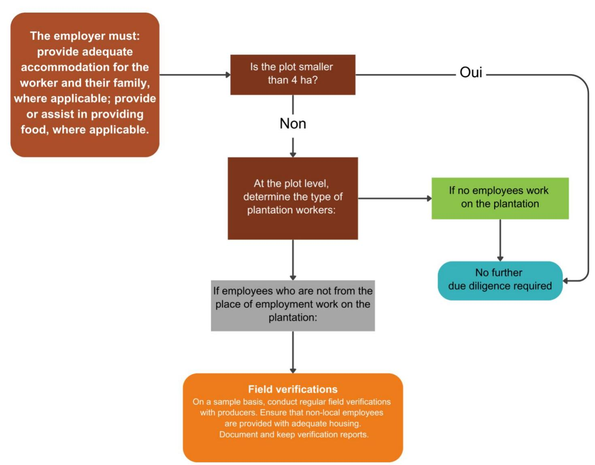

| Legal requirements                      |                                                        | Context and levels of implementation and risk                                                                                                                                                                                                                                                     | Recommended due diligence actions  → For plots larger than 4 ha                                                                                                                                                                                                                                                                                                                                                                                                                                 |                                                                                                                                                                                                                                                                                                                                                                                                                                                                                                                                                                                                                                                                                                                                                                                                                                                                                                                                                                                                                                                                                                                                     |
|-----------------------------------------|--------------------------------------------------------|---------------------------------------------------------------------------------------------------------------------------------------------------------------------------------------------------------------------------------------------------------------------------------------------------|-------------------------------------------------------------------------------------------------------------------------------------------------------------------------------------------------------------------------------------------------------------------------------------------------------------------------------------------------------------------------------------------------------------------------------------------------------------------------------------------------------|-------------------------------------------------------------------------------------------------------------------------------------------------------------------------------------------------------------------------------------------------------------------------------------------------------------------------------------------------------------------------------------------------------------------------------------------------------------------------------------------------------------------------------------------------------------------------------------------------------------------------------------------------------------------------------------------------------------------------------------------------------------------------------------------------------------------------------------------------------------------------------------------------------------------------------------------------------------------------------------------------------------------------------------------------------------------------------------------------------------------------------------|
| Operations/ activities are secure |  | The employer is required to take all necessary measures appropriate to the operating conditions of the business to protect the life and health of employees. They must arrange facilities and regulate work in such a way as to protect employees as much as possible from accidents and illness. | Due to the largely informal nature of the sector, there is very little awareness of the health and safety framework among producers, even where there are employer/employee relationships involving a relationship of subordination. Furthermore, the institutional mechanisms enabling employers to meet these requirements are ill-suited to agricultural producers. In practice, very few inspections are carried out by the labour inspectorate among agricultural producers in the cocoa sector. | <u>At the plot level, first determine the type of plantation workers</u>   <b>Collect relevant data</b> Collect data on the type of employment of plantation workers for all producers, using a questionnaire specifying the conditions under which the work carried out could be classified as salaried work. This questionnaire can be completed during systematic surveys or when collecting geolocation data for plots. Intermediaries can support this data collection on producers and their employees. This questionnaire will also raise awareness among farmers on the issue of salaried work.  <i><a href="#">If employees work on the plantation, operators may also consider:</a></i>  <b>Field verifications</b> On a sample basis, carry out regular field checks with producers. <ul style="list-style-type: none;"> <li>• Ensure that safety conditions at work are guaranteed.</li> <li>• Ensure that a health service is available for workers (first aid kit, contact details for the local doctor, etc.).</li> </ul> |
|                                         |                                                        |                                                                                                                                                                                                                                                                                                   |  The employer must provide a health and safety service                                                                                                                                                                                                                                                                                                                                                                                          |                                                                                                                                                                                                                                                                                                                                                                                                                                                                                                                                                                                                                                                                                                                                                                                                                                                                                                                                                                                                                                                                                                                                     |

#### **Summary of due diligence relating to occupational health and safety**

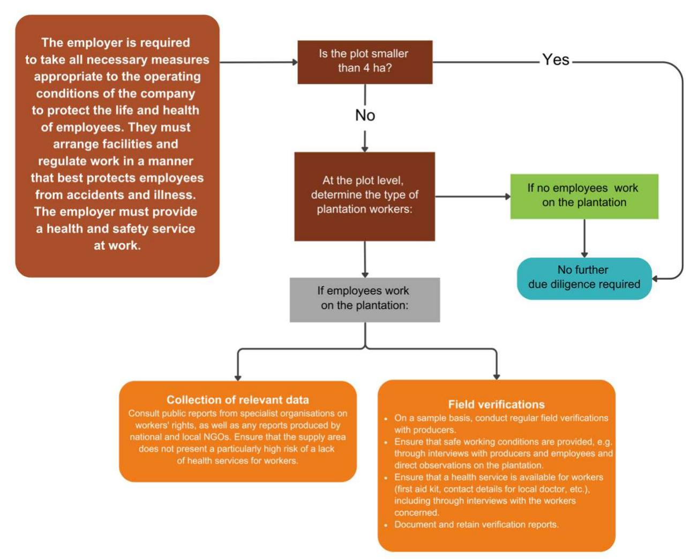

|                                                                                                                                                                                                                                                                                                                                                                                                                                                                                                                                                                                                                                                                                                                                                                                                                                                                                                                                                                                                                                                                                             | Recommended due diligence actions                                                                                                                                                                                                                                                                                                                                                                                                                                                                                                                                                                                                                                                                                                                                                                                                                                                                                                    |
|---------------------------------------------------------------------------------------------------------------------------------------------------------------------------------------------------------------------------------------------------------------------------------------------------------------------------------------------------------------------------------------------------------------------------------------------------------------------------------------------------------------------------------------------------------------------------------------------------------------------------------------------------------------------------------------------------------------------------------------------------------------------------------------------------------------------------------------------------------------------------------------------------------------------------------------------------------------------------------------------------------------------------------------------------------------------------------------------|--------------------------------------------------------------------------------------------------------------------------------------------------------------------------------------------------------------------------------------------------------------------------------------------------------------------------------------------------------------------------------------------------------------------------------------------------------------------------------------------------------------------------------------------------------------------------------------------------------------------------------------------------------------------------------------------------------------------------------------------------------------------------------------------------------------------------------------------------------------------------------------------------------------------------------------|
| Legal requirements Context and levels of implementation and risk                                                                                                                                                                                                                                                                                                                                                                                                                                                                                                                                                                                                                                                                                                                                                                                                                                                                                                                                                                                                                            |                                                                                                                                                                                                                                                                                                                                                                                                                                                                                                                                                                                                                                                                                                                                                                                                                                                                                                                                      |
|                                                                                                                                                                                                                                                                                                                                                                                                                                                                                                                                                                                                                                                                                                                                                                                                                                                                                                                                                                                                                                                                                             | ➔ For plots larger than 4 ha                                                                                                                                                                                                                                                                                                                                                                                                                                                                                                                                                                                                                                                                                                                                                                                                                                                                                                         |
| At the plot level, first determine the type of plantation workers Due to the largely informal nature of the sector, there is very little awareness of the health and safety framework among producers, even where there are employer/employee relationships involving a Operations/ The employer must organise up-to relationship of subordination. Furthermore, the institutional activities date health and safety training for mechanisms enabling employers to meet these requirements are ill are safe newly hired employees and those suited to agricultural producers. In practice, very few inspections are changing jobs or working techniques. carried out by the labour inspectorate among agricultural producers in the cocoa sector. There are cases where agricultural workers are not adequately trained in health and safety measures, particularly with regard to the application of pesticides, and cases where agricultural workers do not have adequate PPE on plantations. The employer must organise ongoing monitoring of compliance with health and safety rules. | : Collection of relevant data Collect data on the type of employment of plantation workers for all producers, using a questionnaire specifying the conditions under which the work carried out could be classified as salaried work. This questionnaire can be completed during systematic surveys or when collecting geolocation data for plots. Intermediaries can support this data collection on producers and their employees. This questionnaire will also raise awareness among farmers on the issue of salaried work. If employees work on the plantation, operators may consider: Field verifications On a sample basis, carry out regular field checks with producers. Ensure that workers have received health and safety training. Ensure that workers have access to appropriate protective equipment. Collection of relevant data Collect the dates of health and safety training for new employees for all producers. |

#### **Summary of due diligence relating to worker health and safety requirements**

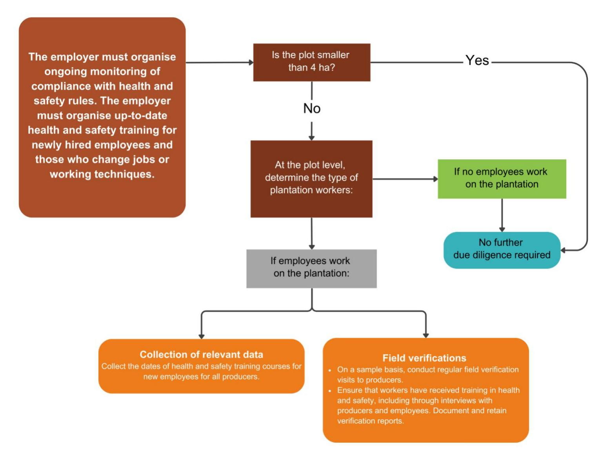

|                                                                                                                                                                                                                                                                                                                                                                                                                                                                                                                                                                                                                                                                                                                                                                                                                                                                                                                                                          | Recommended due diligence actions                                                                                                                                                                                                                                                                                                                                                                                                                                                                                                                                                                                                                                                                                                                                                                                                                                                                                                                                                                                                                                                                                                                                                                                                                                                 |
|----------------------------------------------------------------------------------------------------------------------------------------------------------------------------------------------------------------------------------------------------------------------------------------------------------------------------------------------------------------------------------------------------------------------------------------------------------------------------------------------------------------------------------------------------------------------------------------------------------------------------------------------------------------------------------------------------------------------------------------------------------------------------------------------------------------------------------------------------------------------------------------------------------------------------------------------------------|-----------------------------------------------------------------------------------------------------------------------------------------------------------------------------------------------------------------------------------------------------------------------------------------------------------------------------------------------------------------------------------------------------------------------------------------------------------------------------------------------------------------------------------------------------------------------------------------------------------------------------------------------------------------------------------------------------------------------------------------------------------------------------------------------------------------------------------------------------------------------------------------------------------------------------------------------------------------------------------------------------------------------------------------------------------------------------------------------------------------------------------------------------------------------------------------------------------------------------------------------------------------------------------|
| Legal requirements Context and levels of implementation and risk                                                                                                                                                                                                                                                                                                                                                                                                                                                                                                                                                                                                                                                                                                                                                                                                                                                                                         |                                                                                                                                                                                                                                                                                                                                                                                                                                                                                                                                                                                                                                                                                                                                                                                                                                                                                                                                                                                                                                                                                                                                                                                                                                                                                   |
|                                                                                                                                                                                                                                                                                                                                                                                                                                                                                                                                                                                                                                                                                                                                                                                                                                                                                                                                                          | ➔ For plots larger than 4 ha                                                                                                                                                                                                                                                                                                                                                                                                                                                                                                                                                                                                                                                                                                                                                                                                                                                                                                                                                                                                                                                                                                                                                                                                                                                      |
| At the plot level, first determine the type of plantation workers The employer must distribute Due to the largely informal nature of the sector, there is very appropriate protective equipment little awareness of the health and safety framework among to workers when necessary. producers, even where there are employer/employee Operations/ relationships involving a relationship of subordination. activities Furthermore, the institutional mechanisms enabling employers are secure to meet these requirements are very poorly suited to agricultural producers. In practice, very few inspections are carried out by the labour inspectorate among agricultural producers in the cocoa sector. There are cases where agricultural workers are not adequately trained in health and safety measures, particularly with regard to the application of pesticides, and cases where agricultural workers do not have adequate PPE on plantations. | : Collection of relevant data Collect data on the type of employment of plantation workers for all producers, using a questionnaire specifying the conditions under which the work carried out could be classified as salaried work. This questionnaire can be completed during systematic surveys or when collecting geolocation data for plots. Intermediaries can support this data collection on producers and their employees. This questionnaire will also raise awareness among farmers on the issue of salaried work. At the supply area level, operators may also consider: Collecting relevant data Consult public reports from specialist organisations on workers' rights, as well as any reports produced by national and local NGOs. Ensure that the supply zone does not present a particularly high risk of harm to the health of plantation workers linked to employers' obligations (work arrangements, health and safety services, training, monitoring and provision of PPE) Consultation with stakeholders Consult local human rights organisations to obtain information on the risk of harm to the health of plantation workers related to employer obligations (work arrangements, health and safety services, training, monitoring and provision of PPE) |

#### **Summary of due diligence on the requirement for appropriate protective equipment for workers**

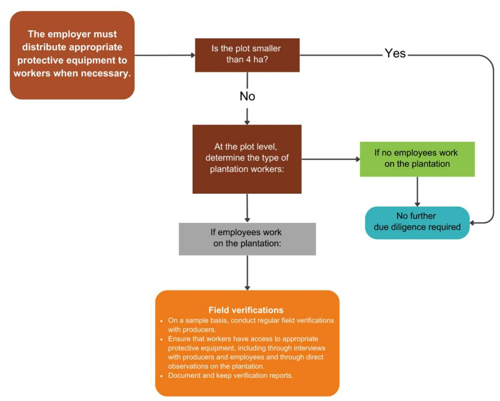

# **Category 7: Human rights\***

*N.B. This category is specifically listed in Article 2 of the EUDR, but is not directly related to the objectives of the Regulation.* 

Human rights requirements in the cocoa sector mainly concern child labour and the absence of forced labour.

Child labour on cocoa plantations in Côte d'Ivoire is a significant problem, although it is sometimes perceived and defined as a socialising activity. According to the International Labour Organisation (ILO), child labour is defined as any activity that deprives children of their childhood and potential, harming their physical and mental development (references: ILO Conventions 138 and 182).

The Ivorian legal framework distinguishes between light tasks, which are acceptable for children when they are safe, carried out under adult supervision and do not interfere with their schooling, and unacceptable forms of work. Dangerous tasks that affect health or education are classified as child labour and are strictly prohibited.

It should be noted that a national action plan to combat trafficking and child labour has been put in place, monitored by the National Supervisory Council (CNS), which is responsible for coordinating and evaluating actions on the ground. The CNS organises follow-up meetings, conducts field visits, produces annual reports and ensures compliance with national laws. It also manages the Child Labour Monitoring and Observation System (SOSTECI), a monitoring mechanism that identifies children in child labour, assesses the risks and ensures appropriate care.

#### **7.1. Requirements not requiring additional due diligence**

| Legal requirements        |                                                                                                                                                                                                                            | Context and levels of implementation and risk                                                                                                                                                                                                                                                                                                                                                                                                                                                                                                                                                                                                                                                                                                                                                                                                                                                                                                                                                                                                                                                               |
|---------------------------|----------------------------------------------------------------------------------------------------------------------------------------------------------------------------------------------------------------------------|-------------------------------------------------------------------------------------------------------------------------------------------------------------------------------------------------------------------------------------------------------------------------------------------------------------------------------------------------------------------------------------------------------------------------------------------------------------------------------------------------------------------------------------------------------------------------------------------------------------------------------------------------------------------------------------------------------------------------------------------------------------------------------------------------------------------------------------------------------------------------------------------------------------------------------------------------------------------------------------------------------------------------------------------------------------------------------------------------------------|
| Child labour              |  Night work is prohibited for children. In the context of social activities, children may only work between 7 a.m. and 7 p.m. | 
In general, agricultural activities are de facto limited by daylight hours, as work cannot be carried out at night. The usual working hours are generally from 8 a.m. to 4 p.m., with a lunch break. These usual working hours do not give rise to a risk of exceeding this limit for the child workers concerned.
                                                                                                                                                                                                                                                                                                                                                                                                                                                                                                                                                                                                                                                                                                                                                                                   |
|                           |  Employment and apprenticeships: children (aged 14 to 18) are not allowed to work more than 40 hours per week.                |                                                                                                                                                                                                                                                                                                                                                                                                                                                                                                                                                                                                                                                                                                                                                                                                                                                                                                                                                                                                                                                                                                             |
| Absence of modern slavery |  No employer may in any way restrict the freedom of workers to dispose of their wages as they see fit.                          | 
Stakeholders have highlighted the difficulty of detecting forced labour. In Côte d'Ivoire, there are cases of forced labour and debt bondage in the cocoa sector, particularly against migrant workers (mainly from Burkina Faso or Mali, or internal Ivorian migrants). Observers have reported cases where recruiters mislead workers about working conditions, including wages, hours and duration. These recruiters charge recruitment fees paid by the workers, including transport costs. Some employers pay the fees and then exploit the workers in debt bondage, which can cover up to several times the initial transport cost.
 
However, the areas where these cases are identified do not concern the rural domain, but mainly cocoa plantations in isolated forest areas where cocoa is illegally produced (classified forests, protected areas).
 
Compliance with the requirement mentioned in category 1 section 1.2 (no farming in protected areas not dedicated to production) mitigates the risk of forced labour, which is considered negligible in the rural domain.
 |
|                           |                                                                                                                                                                                                                            |                                                                                                                                                                                                                                                                                                                                                                                                                                                                                                                                                                                                                                                                                                                                                                                                                                                                                                                                                                                                                                                                                                             |

#### **7.2. Requirements for enhanced due diligence**

| Legal requirements                                                                                                                                                                                                                                                                                                                                                                                                                                                                                                                                                                                                                                                                                                                                                          |                                                                                                                                                                                                                                      | Background and levels of implementation and risk                                                                                                                                                                                                                                                                                                                                                                                                                                                                                                                                                                                                                                                                                                                                           | Recommended due diligence actions                                                                                                                                                                                                                                                                                                                                                                                               |
|-----------------------------------------------------------------------------------------------------------------------------------------------------------------------------------------------------------------------------------------------------------------------------------------------------------------------------------------------------------------------------------------------------------------------------------------------------------------------------------------------------------------------------------------------------------------------------------------------------------------------------------------------------------------------------------------------------------------------------------------------------------------------------|--------------------------------------------------------------------------------------------------------------------------------------------------------------------------------------------------------------------------------------|--------------------------------------------------------------------------------------------------------------------------------------------------------------------------------------------------------------------------------------------------------------------------------------------------------------------------------------------------------------------------------------------------------------------------------------------------------------------------------------------------------------------------------------------------------------------------------------------------------------------------------------------------------------------------------------------------------------------------------------------------------------------------------------------|---------------------------------------------------------------------------------------------------------------------------------------------------------------------------------------------------------------------------------------------------------------------------------------------------------------------------------------------------------------------------------------------------------------------------------|
| 
 
                       Face icon                 
 
                       Hazardous work is prohibited for children under the age of 16, except in the context of apprenticeships (age threshold set at 14).                 
 
                       Socialising activity: children (aged 13 to 16) may not work more than 10 hours per week during school weeks and 14 hours per week during non-school weeks.                 
 
 | 
It is prohibited to employ children under the age of 16, except in the context of apprenticeships (age threshold set at 14).
 
Children between the ages of 13 and 16 are permitted to engage in socialising activities.
 | 
Child labour is a complex issue. As cocoa is grown on small family farms, children are very often involved in field work, in a socio-cultural context that encourages children to participate in economic and social activities, contributing to the transmission of values and education. Several factors related to the rural context (rural poverty, food insecurity, limited access to education, shortage of adult labour, seasonal work, etc.) also increase the risks and incidence of child labour.
 
The various risks associated with child labour on plantations are mainly related to the health and development of the child (use of dangerous tools, carrying heavy loads and exposure to chemicals such as pesticides), as well as lack of access to education.
 | 
 
                       Refer to the monitoring and remediation system established by the government (SOSTECI) or by private companies (SSRTE).                 
 
 
Operators and priv

 |

| Legal requirements | Background and levels of implementation and risk                                                                                                                                                                                                                                                                                                                                                                                                                                                                                                                                                                                                                                                                                                                                                                                                                                                                                                                                                                                                                                                                                                                                                                                                                                                                                                                                                                                                                                                                                                                                           | Recommended due diligence actions                                                                                                                                                                                                                                                                                                                                                                                                                                                        |
|--------------------|--------------------------------------------------------------------------------------------------------------------------------------------------------------------------------------------------------------------------------------------------------------------------------------------------------------------------------------------------------------------------------------------------------------------------------------------------------------------------------------------------------------------------------------------------------------------------------------------------------------------------------------------------------------------------------------------------------------------------------------------------------------------------------------------------------------------------------------------------------------------------------------------------------------------------------------------------------------------------------------------------------------------------------------------------------------------------------------------------------------------------------------------------------------------------------------------------------------------------------------------------------------------------------------------------------------------------------------------------------------------------------------------------------------------------------------------------------------------------------------------------------------------------------------------------------------------------------------------|------------------------------------------------------------------------------------------------------------------------------------------------------------------------------------------------------------------------------------------------------------------------------------------------------------------------------------------------------------------------------------------------------------------------------------------------------------------------------------------|
|                    | 
committees, a database and seven data collection forms. In 2023, nearly 10,000 workplace inspections (area of production) were carried out by labour inspectors on behalf of SOSTECI, and the authorities conducted approximately 1,200 investigations into suspected cases of the worst forms of child labour, prosecuted approximately 1,000 cases and convicted approximately 600 perpetrators.
 
In addition to government initiatives, companies operating in the cocoa sector have set up child labour monitoring and remediation systems (CLRTS) to eliminate the worst forms of child labour. These systems also aim to identify, monitor and mitigate child labour in areas at risk. They are based on the identification of high-risk areas in their supply chain, followed by monitoring mechanisms involving field visits, data collection and the involvement of local communities. When cases of child labour are identified, remediation programmes are deployed to help the children concerned. These programmes provide access to education, economic support for families and initiatives to improve living and working conditions. In parallel, training and awareness-raising campaigns are organised for farmers and communities on the dangers of child labour and the alternatives available.
 
Stakeholders agree that the risk of child labour remains significant, and that both government and private initiatives must continue to ensure that only children working in compliance with the legal framework are present on cocoa plantations.
 | 
<a href="#">At the plot level, determine the profile of workers on the plantation:</a>
 
<b>Collect relevant data</b>
 
Collect a list of all plantation workers and their ages for all producers.
 
Check that there are no children under the age of 13.
 
For children under 16, list the nature of the work (apprenticeship or socialising activity), the tasks performed and the weekly duration of socialising activities. This can be done, for exampl
 |

#### **Summary of due diligence regarding child labour:**

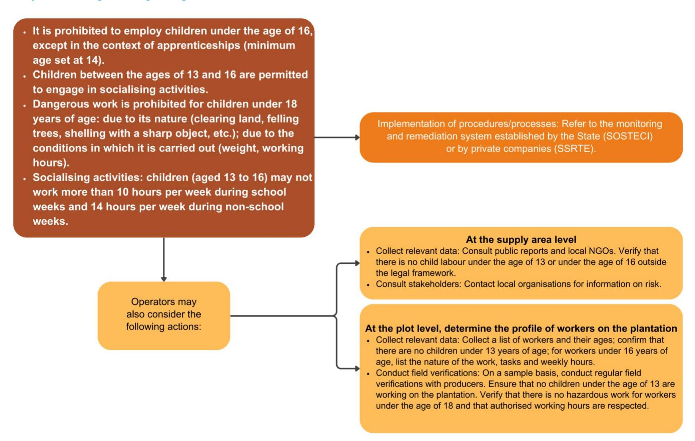

| Legal requirements |                                                                                                                                                                                                            | Background and levels of implementation and risk                                                                                                                                                                                                                                                                                                                                                                                                                                                                                                                                                                                                                                                                                                                                                                                                         | Recommended due diligence actions                                                                                                                                                                                                                                                                                                                                                                                                                                                                                                                                                                                                                                                                                                                                                                                                                                                                                          |
|--------------------|------------------------------------------------------------------------------------------------------------------------------------------------------------------------------------------------------------|----------------------------------------------------------------------------------------------------------------------------------------------------------------------------------------------------------------------------------------------------------------------------------------------------------------------------------------------------------------------------------------------------------------------------------------------------------------------------------------------------------------------------------------------------------------------------------------------------------------------------------------------------------------------------------------------------------------------------------------------------------------------------------------------------------------------------------------------------------|----------------------------------------------------------------------------------------------------------------------------------------------------------------------------------------------------------------------------------------------------------------------------------------------------------------------------------------------------------------------------------------------------------------------------------------------------------------------------------------------------------------------------------------------------------------------------------------------------------------------------------------------------------------------------------------------------------------------------------------------------------------------------------------------------------------------------------------------------------------------------------------------------------------------------|
| Gender issues      |  The employer may not take into account the gender of the employee when making decisions regarding, among other things, hiring and working conditions. | This requirement applies in the agricultural sector where an employer/employee relationship exists (subordination) in relation to planting and harvesting activities. In order not to burden due diligence with verifications in cases where salaried work is unlikely, and without exempting an employer from its legal obligations, which is more likely in the case of larger farms, it has been agreed to adopt a minimum farm size criterion below which salaried work is considered highly unlikely and the risk of non-compliance is therefore considered negligible. This threshold below which salaried work on the plantation is highly unlikely has been set by the stakeholders at 4 ha. For these cases, the parties agree that the risk is not negligible, particularly given the very low percentage of women employed on plantations. | <b>Mapping analysis</b> Determine the size of production plots using geolocation data.  <b>For plots larger than 4 ha:</b>  <b>Collect relevant data</b> Conduct a questionnaire recalling the criteria used to characterise the situation of salaried work, including, where applicable, questions relating to the non-employment of women on the basis of their gender.  <a href="#">Private operators and systems may consider the following actions in particular:</a>  <a href="#">At the supply area level:</a>  <b>Document collection and verification</b> Consult public reports from specialist organisations on workers' rights and human rights, as well as any reports produced by national and local NGOs. Ensure that the supply zone does not present a particularly high risk of gender-based discrimination.  <b>Consultations with stakeholders</b>  |

| Legal requirements |  | Background and levels of implementation and risk | Recommended due diligence actions                                                                                                                                                                                                                                                                                                                                                                                                                                                                                                                                                                                                                       |
|--------------------|--|--------------------------------------------------|---------------------------------------------------------------------------------------------------------------------------------------------------------------------------------------------------------------------------------------------------------------------------------------------------------------------------------------------------------------------------------------------------------------------------------------------------------------------------------------------------------------------------------------------------------------------------------------------------------------------------------------------------------|
|                    |  |                                                  | 
<u><a href="#">At the plot level, if employees work on the plantation:</a></u>
 
<b>Document collection and verification</b>
 
Collect documents relating to the handling of cases of gender discrimination on a sample basis (policies/procedures for hiring and handling cases of discrimination, complaint mechanisms or procedures, evidence of awareness-raising or training on the subject).
 
<b>Field verifiers</b>
 
On a sample basis, carry out regular field verifications with producers. Ensure that there are no cases of gender discrimination, in particular through interviews with producers and workers.
 |

#### **Summary of due diligence on gender discrimination in hiring and working conditions**

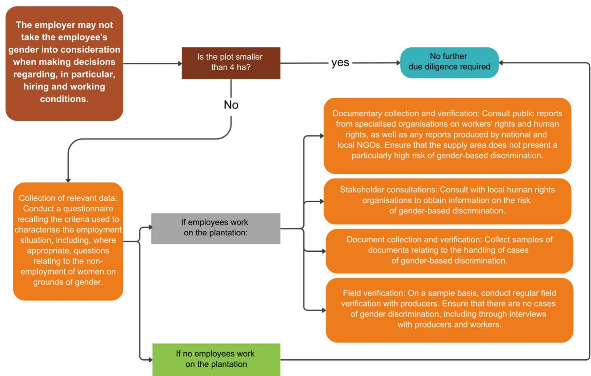

# **4. Due diligence recommendations relating to the legal requirements relevant to ARS-1000 certified cocoa production in CÙte d'Ivoire**

This section applies to ARS-1000 certified cocoa (for more details, see *Annex 2 Details on ARS-1000* explaining the use of this certification in EUDR due diligence).

**For all requirements covered, the due diligence to be performed is as follows:** 

- Collect evidence of certification from cooperatives and details (certificate number, date, bronze/silver/gold level, etc.).
- Verify the certified status of the cocoa on traceability documents (e.g., invoices).

*N.B. In addition, document the functioning of the system on the traceability of certified materials and the robustness of the audit and certification system (see Annex 2).*

### **For requirements not covered:**

Rely on the **due diligence** actions **proposed for conventional cocoa (***section 3 above***)**.

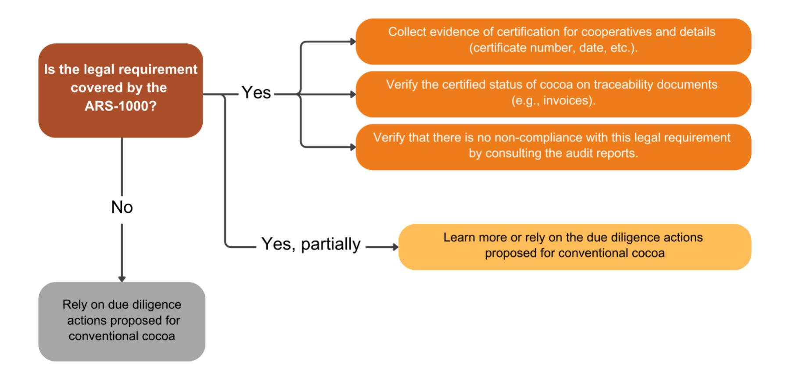

# **Category 1: Land-use rights**

Cocoa plantations are largely located on rural domain land, governed by Law No. 98-750, which has been amended several times. The legal framework for ownership of and access to the rural domain distinguishes between:

- Formal recognition of **land ownership**, which (1) is established by the issuance of a land title following registration in the Land Registry and (2) is accessible only to the State, local authorities and Ivorian natural persons (except for property rights acquired before the 1998 law).
- The holding of **customary land rights** on customary land. Customary rights are recognised by a land certificate, which may be individual or collective. However, the law does not require local communities to register their customary land rights. Nevertheless, this lack of formal registration can create legal uncertainty and, in the long term, lead to the transfer of these rights to the State's land assets, as part of the procedure for registering land without masters, at the end of a period defined by the regulator (but regularly postponed).
- - Access to land **as a tenant or beneficiary** free of charge, in other words the transfer of land use rights from the customary owner or holder to a third party, based on the principle of informed consent of the parties. Several systems are possible: lease agreement, sharecropping agreement, sharecropping agreement with production sharing, sharecropping agreement with land sharing, collateral agreement for a plot and loan agreement. Although oral contracts are valid, they can be legally precarious. To mitigate this risk, the Rural Land Agency (AFOR) offers model contracts to secure use rights, but these are rarely used because there is no legal obligation to do so.

#### **It should be noted that the law does not require farmers to hold land titles or written contracts as tenants or beneficiaries of free use rights to land in order to grow cocoa.**

Finally, Ivorian legislation prohibits cocoa production in protected areas and classified forests. However, in practice, plantations exist in these areas. On the other hand, cocoa production is authorised by law in agroforests, which are areas located within the State's private forest estate where agricultural plantations and forest trees can coexist[.](#page-50-1)4

4 See Annex 1 of Module 1 *Exigences légales pertinentes pour le cacao de Côte d'Ivoire.*

| Legal requirements | Coverage of requirements by ARS-1000 |            |                            |
|--------------------|--------------------------------------|------------|----------------------------|
| Bronze level       | Silver level                         | Gold level | References                 |
| Covered            | Covered                              | Covered    | Clause 8.2.1 ARS-1000-1    |
| Covered            | Covered                              | Covered    | Clause 13.4 (c) ARS-1000-1 |

# **Category 2: Environmental protection**

In terms of legal requirements related to environmental protection for cocoa cultivation, the main elements to note are:

- **Pesticides and fertilisers** are commonly used in cocoa plantations. The use of pesticides in particular is a major issue and can pose contamination risks for local communities and the environment, especially when unregistered products are used. The use of pesticides is closely linked to other environmental protection issues such as soil protection, watercourse protection and waste management.
- There is also an issue surrounding **the conversion of forest land** in the rural domain, which is subject by law to the provisions of a forest management plan or specific authorisation. However, this legal provision is rarely enforced, as it is largely unknown to local communities. It should be noted that the table of legal requirements sets out the legal framework applicable to land clearing and deforestation, but does not prejudge compliance with the EUDR's deforestation-free criteria, which will have to be assessed separately.
- - There are few other relevant requirements for cocoa production in terms of environmental protection. This is because cocoa plantations are on average less than 4 hectares in size. They are therefore exempt from the requirement to carry out an environmental and social impact assessment, which only applies to projects larger than 10 hectares.

| Legal requirements | Coverage of requirements by ARS-1000 |            |                                 |
|--------------------|--------------------------------------|------------|---------------------------------|
| Bronze level       | Silver level                         | Gold level | References                      |
| Covered            | Covered                              | Covered    | Clause 13.3 (b) ARS-1000-1      |
| Covered            | Covered                              | Covered    | Clause 11.3.3 (b) ARS-1000-1    |
| Not covered        | Covered                              | Covered    | Clause 13.2 a) c) d) ARS-1000-1 |
| Not covered        | Covered                              | Covered    | Clause 13.5 c) d) e) ARS-1000-1 |

| Legal requirements                                                 | Coverage of requirements by ARS-1000 |            |                                 |
|--------------------------------------------------------------------|--------------------------------------|------------|---------------------------------|
| Bronze level                                                       | Silver level                         | Gold level | References                      |
| Covered                                                            | Covered                              | Covered    | Clause 13.4 e) g) ARS-1000-1    |
| Covered                                                            | Covered                              | Covered    | Clause 8.2 ARS-1000-1           |
| Protected tree species are respected in cocoa plantations. Covered | Covered                              | Covered    | Clause 13.4 f) h) k) ARS-1000-1 |

# **Category 3: Third parties' rights**

As cocoa plantations are mainly family-run, their operation is not likely to infringe on third parties' rights. Furthermore, the legal framework recognises the fundamental rights of local communities, but these requirements often take the form of very general provisions that are not operationalised by implementing texts and are therefore not relevant from a due diligence perspective. Some requirements, particularly for environmental and social impact assessments, are only relevant above a certain surface area, which does not apply to the cocoa sector.

Some requirements relevant to community rights are also addressed in category 1, in relation to land access rights, and in category 2, in relation to protection against forms of pollution.

The main relevant requirements relating to the protection of third parties' rights concern **the prohibition of cocoa production on sacred sites and other archaeological and historical sites**.

| Legal requirements | Coverage of requirements by ARS-1000 |            |                           |
|--------------------|--------------------------------------|------------|---------------------------|
| Bronze level       | Silver level                         | Gold Level | References                |
| Covered            | Covered                              | Covered    | Clause 13.4 c) ARS-1000-1 |
| Covered            | Covered                              | Covered    | Clause 13.4 c) ARS-1000-1 |

# **Category 5: Tax, anti-corruption, trade and customs regulations5**

*N.B. This category is the only category in the EUDR that potentially concerns entities t[hro](#page-55-1)ughout the supply chain of the producing country, and not just at the level of the cocoa production plot*.

In Côte d'Ivoire, the main tax requirements differ depending on the tax system of each actor concerned. In particular, smaller actors such as producers and some cooperatives are not subject to tax provisions due to their tax system and the size of their plots. A withholding tax system applies to informal local traders and suppliers. Most other provisions, particularly corporate taxes, apply to larger actors in the chain, such as traders, processors and exporters.

In addition, a series of specific requirements apply to customs duties, the obtaining of mandatory approvals for actors in the sector and compliance with mandatory quality standards.

Finally, the 2013 ordinance against corruption also contains obligations for actors in the sector. It should be noted that the digitisation of fund collection procedures by financial authorities has significantly improved the transparency of transactions in the cocoa trade in Côte d'Ivoire. Digital tools such as "SIVAT-C2" for the auctioning of cocoa for export, e-taxes for tax collection, and "SYDAM-World" for customs formalities significantly reduce the risk of corruption.

NB. This Module does not contain any information on Category 4 of the standard used (Free, Informed and Prior Consent — FIPC). Côte d'Ivoire does not have a binding legal framework governing FIPC. See Module 1 *Support tool to support due diligence under the EUDR — Legal requirements relevant to cocoa in Côte d'Ivoire.*

| Legal requirements | Coverage of requirements by ARS-1000 |             |                     |
|--------------------|--------------------------------------|-------------|---------------------|
| Bronze level       | Silver level                         | Gold level  | References          |
| Not covered        | Not covered                          | Not covered | N/A                 |
| Covered            | Covered                              | Covered     | Clause 4 ARS-1000-2 |
| Covered            | Covered                              | Covered     | Clause 4 ARS-1000-2 |

| Legal requirements | Coverage of requirements by ARS-1000 |            |                        |
|--------------------|--------------------------------------|------------|------------------------|
| Bronze level       | Silver level                         | Gold level | References             |
| Covered            | Covered                              | Covered    | Clause 11.3.1, 11.3.2, |
| Covered            | Covered                              | Covered    | Clause 4 ARS-1000-2    |

# **Category 6: Labour rights\***

*N.B. This category is specifically listed in Article 2 of the EUDR, but is not directly related to the objectives of the Regulation.* 

The cocoa sector in Côte d'Ivoire, which is essential to the national economy, relies largely on small family farms, often less than 4 hectares in size, and on a network of informal local traders and small and medium-sized cooperatives responsible for the initial stages of supply, sorting, drying and sale of cocoa to traders and exporters.

Work on cocoa plantations is largely carried out by family and village networks, organised either by the owner or holders of customary land rights over the plot, or by the tenant farmer or beneficiary who uses the land free of charge (e.g. under a sharecropping agreement: see category 1). These farming methods, which in most cases do not involve any relationship of subordination between owners, farmers and field workers, therefore fall outside the scope of application of social legislation (and thus most of the requirements listed below).

However, in some cases, particularly where one or a few workers are employed on the plantation for a fixed period (usually several months or a year) and in return for a wage, the plot owners act as de facto employers. They must then comply with Law No. 2015- 532 of 20 July 2015 on the Labour Code, which covers all workers, including those in the agricultural sector, by ensuring decent working conditions. This code regulates working hours, freedom of association, health and safety, and imposes the Guaranteed Minimum Agricultural Wage (SMAG) to protect workers.

In practice, the application of these rules remains difficult due to the informal nature of labour relations, which are often undocumented, making it difficult to recognise the relationship of subordination. Local labour inspectors are continuing their efforts to raise awareness among farmers of their legal obligations to improve the implementation of workers' rights in the cocoa sector.

| Legal requirements | Coverage of requirements by ARS-1000 |            |                                  |
|--------------------|--------------------------------------|------------|----------------------------------|
| Bronze level       | Silver level                         | Gold level | References                       |
| Covered            | Covered                              | Covered    | Clause 12.7 e) ARS-1000-1        |
| Covered            | Covered                              | Covered    | Clause 12.7 e) ARS-1000-1        |
|                    |                                      |            | 5.7, page 37)                    |
| Covered            | Covered                              | Covered    | Clause 12.7(e) ARS-1000-1        |
|                    |                                      |            | 5.7, page 37)                    |
| Covered            | Covered                              | Covered    | Clause 12.3 c) ARS-1000          |
| Covered            | Covered                              | Covered    | Clause 12.10 a) and c) ARS-1000  |
| Not covered        | Not covered                          | Covered    | Clause 12.9 a) and b) ARS-1000-1 |

| Legal requirements                                                         | Coverage of requirements by ARS-1000 |            |                                  |
|----------------------------------------------------------------------------|--------------------------------------|------------|----------------------------------|
| Bronze level                                                               | Silver level                         | Gold level | References                       |
| The employer is required to pay social security contributions. Not covered | Not covered                          | Covered    | Clause 12.9 a) and b) ARS-1000-1 |
| Not covered                                                                | Not covered                          | Covered    | Clause 12.9 a) and b) ARS-1000-1 |
|                                                                            |                                      |            | GdO (Module A, Section V, point  |
| Covered                                                                    | Covered                              | Covered    | Clause 12.7(d) ARS-1000GdO       |
| Not covered                                                                | Not covered                          | Covered    | Clause 12.9 ARS-1000-1           |
| The worker is entitled to two working days of paternity leave. Not covered | Not covered                          | Covered    | Clause 12.9 ARS-1000-1           |

| Legal requirements | Coverage of requirements by ARS-1000 |             |                                    |
|--------------------|--------------------------------------|-------------|------------------------------------|
| Bronze level       | Silver level                         | Gold level  | References                         |
| Not covered        | Not covered                          | Not covered | N/A                                |
| Not covered        | Not covered                          | Covered     | Clause 12.8 a) to f) ARS-1000-1    |
| Not covered        | Not covered                          | Covered     | Clause 12.8 a), b), c) and f) ARS |
| Not covered        | Not covered                          | Covered     | Clause 12.8 e) and f) ARS-1000-1   |
| Not covered        | Not covered                          | Covered     | Clause 12.8 a) to f) ARS-1000-1    |
| Not covered        | Not covered                          | Covered     | Clause 12.8(d) ARS-1000-1          |

# **Category 7: Human rights\***

*N.B. This category is specifically listed in Article 2 of the EUDR, but is not directly related to the objectives of the Regulation.* 

Human rights requirements in the cocoa sector mainly concern child labour and the absence of forced labour.

Child labour on cocoa plantations in Côte d'Ivoire is a significant problem, although it is sometimes perceived and defined as a socialising activity. According to the International Labour Organisation (ILO), child labour is defined as any activity that deprives children of their childhood and potential, harming their physical and mental development (references: ILO Conventions 138 and 182).

The Ivorian legal framework distinguishes between light tasks, which are acceptable for children when they are safe, carried out under adult supervision and do not interfere with their schooling, and unacceptable forms of work. Dangerous tasks that affect health or education are classified as child labour and are strictly prohibited.

It should be noted that a national action plan to combat trafficking and child labour has been put in place, monitored by the National Supervisory Council (CNS), which is responsible for coordinating and evaluating actions on the ground. The CNS organises follow-up meetings, conducts field visits, produces annual reports and ensures compliance with national laws. It also manages the Child Labour Monitoring and Observation System (SOSTECI), a monitoring mechanism that identifies children in child labour, assesses the risks and ensures appropriate care.

| Legal requirements                                                   | Coverage of requirements by ARS-1000 |            |                                   |
|----------------------------------------------------------------------|--------------------------------------|------------|-----------------------------------|
| Bronze Level                                                         | Silver Level                         | Gold Level | References                        |
| Covered                                                              | Covered                              | Covered    | Clause 12.5; 12.6 ARS-1000-1      |
| Covered                                                              | Covered                              | Covered    | Clause 12.6 b) ARS-1000-1         |
| Covered                                                              | Covered                              | Covered    | Clause 12.5 a); d); e); 12.6 d)   |
| Covered                                                              | Covered                              | Covered    | Clause 12.5 a); d); e); 12.6 d)   |
| Covered                                                              | Covered                              | Covered    | Clause 12.5 a); d); e); 12.6 d)   |
| Covered                                                              | Covered                              | Covered    | Clause 12.7(b), (c), (d) ARS     |
| Covered                                                              | Covered                              | Covered    | Clause 12.7 b), c), d), e), f)    |
| Slavery, human trafficking and forced labour are prohibited. Covered | Covered                              | Covered    | Clause 5.3.4 d); 12.7 b), c), d), |

| Legal requirements | Coverage of requirements by ARS-1000 |            |                                    |
|--------------------|--------------------------------------|------------|------------------------------------|
| Bronze Level       | Silver Level                         | Gold Level | References                         |
| Covered            | Covered                              | Covered    | Clause 12.3 a); b), c), d) ARS    |
| Covered            | Covered                              | Covered    | Clause 12.3 b); 12.4 a), b), c) f) |

# **Annex 1 — Detailed methodology**

# **Precautionary approach adopted for the tool**

On 2 October 2024, the European Commission published guidance on the implementation of the EUDR, which interprets the provisions of the regulation on legality criteria.6 This tool proposes to address the relevance of legal requirements through the following criteria:

- The requirements have a specific impact on the legal status of the area of production of the commodities [with the exception of trade and customs rules];
- The requirements must be linked to the objectives of the EUDR, i.e. halting deforestation and forest degradation in line with the Union's commitment to combat climate change and biodiversity loss.

Given that not all labour requirements, as well as certain human rights and third parties' rights, are directly linked to the objectives of the EUDR, the question of whether they fall within the scope of application of the EUDR is under discussion.

On the other hand, the guidance document would extend the scope of application of tax and anti-corruption regulations to stages of the value chain beyond the area of production, if these regulations contribute to combating deforestation. Similarly, trade and customs regulations would be relevant where they apply to the product in question.

However, the Commission's guidance document is non-binding. It does not amend, add to or replace the provisions of the EUDR. Each EU Member State will adopt its own approach to verifying compliance with the EUDR. Furthermore, only national courts will be able to interpret the EUDR and therefore its scope of application in a binding manner.

The tool therefore adopts a precautionary approach and covers all legal areas listed in Article 2.40 of the EUDR. It also includes requirements on tax, anti-corruption, trade and customs regulations, including beyond the area of production. However, a distinction is made between requirements directly related to the objectives of the EUDR and others, which are marked with an asterisk. This flexible approach allows users of the study's findings to adapt their due diligence actions according to their interpretation of the scope of application of the EUDR.

6 Guidance document on Regulation (EU) 2023/1115 on deforestation-free products (C/2024/6789); [https://eur](https://eur-lex.europa.eu/legal-content/FR/TXT/PDF/?uri=OJ:C_202406789)[lex.europa.eu/legal-content/FR/TXT/PDF/?uri=OJ:C\\_202406789](https://eur-lex.europa.eu/legal-content/FR/TXT/PDF/?uri=OJ:C_202406789) 

# **Definition of due diligence**

Due diligence is a continuous and dynamic process aimed at identifying, assessing and mitigating risks associated with supply chain activities (Art. 8). It is **not a fixed tool (checklist), but a dynamic mechanism** that evolves in response to new information or changes in risks, such as substantiated concerns (Article 10 of the EUDR) and changes in the supply chain. Furthermore, due diligence is not simply a compilation of documents. When collecting documents, operators must ensure that they are authentic and that their content is reliable and accurate.

Due diligence is also contextual, as it varies according to the specific characteristics of each operator, the nature of the product (beans, butter, etc.), its suppliers, the number of intermediaries, the supply area, etc.

In addition, it must be carried out by the operator for **each shipment** under the EUDR.

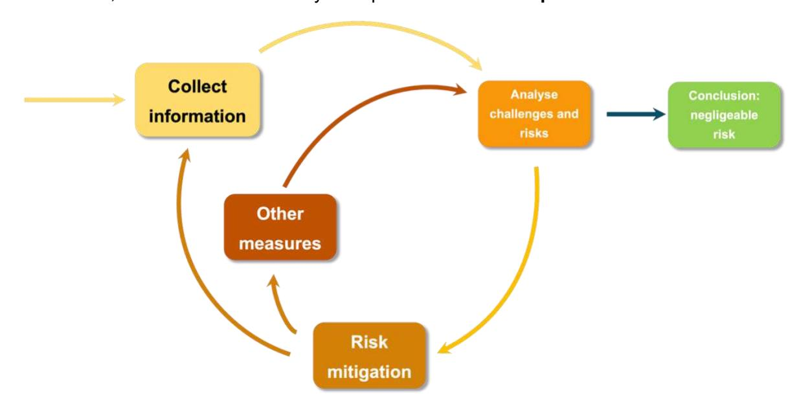

*Figure 1: the stages of due diligence*

With regard to the **role of the various actors in due diligence**, it should be noted that the operator bears all the risks associated with non-compliance with the EUDR of products imported into the European Union. It is the operator who is required to carry out due diligence (Article 4.3), who is liable and who may be penalised in the event of non-compliance (Article 25).

Nevertheless, the European Union has recognised that producer countries can facilitate the work of operators and competent authorities, in particular by providing information that allows for a better understanding of the applicable national laws.

# **Appendix 2 — Details of the ARS-1000 certification scheme**

The African Standard for Sustainable Cocoa Series 1000 (ARS-1000) was published in 2021 by the African Organisation for Standardisation. It was developed jointly by all cocoa-producing countries in Africa. In Côte d'Ivoire, it has been analysed and validated by all stakeholders involved in the cocoa value chain. Its aim is to promote the production of sustainable cocoa beans in Africa, and more specifically to support producers, ensure cocoa quality, address the issue of cocoa traceability and respond to the challenges of the worst forms of child labour and deforestation.

The standard is based on the principle of continuous improvement and addresses the social, economic and environmental aspects of sustainable cocoa. It comprises three parts:

- **ARS 1000-1:** Requirements for cocoa producer management systems
- **ARS 1000-2**: Requirements for cocoa quality and traceability
- **ARS 1000-3**: Requirements for the cocoa certification scheme

# **Implementation of the standard in producing countries**

ARS-1000 is a regional standard for Africa, intended to be adopted and implemented by cocoaproducing countries. The standard was developed with the aim of making regulators in producing countries responsible for its implementation through a government agency or dedicated national structure.

On the one hand, a handful of requirements of the ARS 1000-3 standard apply to the regulators of the producing countries themselves (requirement of independence from certification decisions, impartiality policy, Supervisory Board, competent staff).

On the other hand, several other requirements of the regional standard define the actions incumbent on the regulator in order to build a national certification scheme that will enable the standard to be applied and verified. In particular, the regulator must:

- Define the requirements and criteria applicable to certification bodies that will be responsible for auditing the requirements applicable to cocoa production among actors in the sector;
- Define what constitutes major non-compliance and the corrective actions to be taken in the event of non-compliance with the requirements;
- Establish and maintain a traceability system;
- Periodically evaluate the proper functioning of the national certification scheme;

- Develop an implementation guide detailing the functioning of the certification scheme for stakeholders (producers, cooperatives, certification bodies).

# **Deployment in Côte d'Ivoire**

The ARS-1000 standard is currently being rolled out in Côte d'Ivoire. The standard was made mandatory by Decree 2022-393 of 8 June 2022 (Art. 6), which also designates the Coffee and Cocoa Board as the legal entity responsible for its implementation.

As part of this rollout, Côte d'Ivoire has developed and published its [National Operational Guide,](https://ars1000.conseilcafecacao.ci/) which takes into account all the expectations listed above. The operational guide provides more details on the requirements of the standard with regard to Ivorian legality and taking into account the specificities of the sector in the country. It follows the same themes as the standard and provides numerous templates and model documents useful for implementation by actors in the sector. [Other supporting documents,](https://ars1000.conseilcafecacao.ci/) such as technical data sheets for technicians and producers and a training guide for producers, have also been made available.

Several provisions have been adopted and implemented to ensure the credibility of the scheme and guarantee the impartiality of the certification system. These include:

- Developing procedures for the management of certification;
- Developing procedures for the national monitoring and peer review system;
- Developing impartiality procedures applicable at the regulatory level;
- Establishing a system for the accreditation of certification bodies in accordance with international standards ISO 17065 and ISO 17021 through the regional accreditation body recognised by the International Accreditation Forum (IAF).

The pilot phase of the awareness-raising and training system for cooperatives at national level was conducted in February 2024. The first certification audits took place in February 2025. The lessons learned from this first pilot phase will be used to refine the operationalisation system.

# **Recognised Entities holding certificates**

The Recognised Entity is the actor that must comply with most of the requirements of the standard and is the certificate holder. The system provides that the vast majority of Recognised Entities will be legal entities grouping together several producers, in particular cooperatives and producer groups. It is possible for an individual producer or individual producer group to be registered as a Recognised Entity, but this is likely to be very rare.

As a result, much of the standard focuses on quality management and producer support elements. Recognised Entities must, in particular:

- Define a management policy;
- Develop Cacao Farming Development Plans for registered producers;
- Assess their own performance regularly;
- On economic aspects, support producers in their management and accounting capacities, their access to financial products and their agronomic performance.

With regard to social and environmental requirements related to production practices on plantations, the Cacao Development Plans established for each production plot must take these into account. Social requirements are taken into account at both the individual producer and recognised entity levels. The Recognised Entity ensures that all requirements are implemented by all registered producers and within its own organisation. It must support and train producers and carry out internal audits of the system. The Recognised Entity is itself audited on its ability to ensure the efficient implementation of the requirements. However, audits carried out by certification bodies always include visits and interviews with a sample of registered producers and with the Recognised Entity itself.

# **Bronze, silver and gold levels**

As the ARS-1000 standard is based on the principle of continuous improvement, it provides for three different levels of certification, with the aim of ensuring that Recognised Entities, in particular cooperatives, gradually comply with all requirements.

- Bronze level: 12 months after registering with the ARS-1000 certification scheme with the regulator, the recognised entity must pass its initial certification audit. 19 requirements of the ARS-1000-1 standard (i.e. 54%) and 16 specific requirements of the ARS-1000-2 standard (i.e. 100%) must be met in order to obtain the bronze level certificate.
- Silver Level: This intermediate level corresponds to compliance with 34 requirements of the ARS-1000-1 standard (97%) and 16 requirements of the ARS 1000-2 standard (100%). Cooperatives are expected to meet these requirements during their first recertification audit (i.e. five years after obtaining the initial certificate).
- Gold Level: this higher level corresponds to the Recognised Entity's compliance with all the requirements of standards ARS-1000-1 (35 requirements) and ARS 1000-2 (16 requirements). Cooperatives are expected to meet these requirements during their next recertification audit (i.e. 10 years after the initial audit and 5 years after passing the Silver level) and for all subsequent audits.

In principle, cooperatives should not/cannot remain at the same level for several cycles, nor be downgraded from a higher level to a lower level. They will have an obligation to continuously improve in order to achieve and maintain the Gold level. Failure to progress should therefore result in the withdrawal of the certificate. The precise procedures for suspending and withdrawing certificates are still being developed.

# **Main requirements related to the certification scheme**

Part of the ARS-1000-3 standard concerns the requirements for bodies conducting audits for the certification of producers and producer groups. These relate in particular to audit cycles, the obligation to define appropriate audit procedures, recommended audit methods, the time frame for obtaining certificates and the competence of auditors.

Deadlines for the completion of audits by certification bodies are set out in ARS-1000-3 (Annex D) and the National Operational Guide. After an initial certification audit, Recognised Entities will be subject to alternating surveillance and recertification audits every 2.5 years (after two and a half years, a risk-based surveillance audit is carried out, then two and a half years later a recertification audit, then another surveillance audit, etc.). Unannounced audits are also planned at the recognised entity according to a sampling procedure of certificates issued by the certification body each year. Unannounced audits are also carried out according to a risk-based approach. Depending on the case, the results of unannounced audits may lead to the suspension or withdrawal of the certificate.

If non-compliance is identified during an audit, the Recognised Entities have three months (initial or recertification audit) or six months (surveillance audits) to implement corrective measures and demonstrate this. If they fail to do so, the certification body must withdraw the certificate.

In the following cases, non-compliance prevents the certification or recertification of the Recognised Entity:

- Major non-compliance;
- A high number of minor non-compliances (10% of the applicable requirements);
- Recurring minor non-compliance from one audit to another.

The National Operational Guide also defines major non-compliance with the requirements of standards ARS 1000-1 and 1000-2 for Côte d'Ivoire:

- Non-compliance found in at least a quarter of the producer sample, regardless of the requirement;
- Non-compliance with requirements relating to traceability, premium management, presence in protected areas, use of expired certificates, mixing of certified and noncertified cocoa, fraud, corruption;
- Failure to achieve the planned level of implementation of the cocoa farm development plan in relation to the year of certification.

In addition to defining all the procedures applicable to certification bodies for conducting audits, the National Operational Guide also specifies all the procedures required for the approval of training firms and the competence requirements for all actors involved in the national system. Finally, the National Operational Guide also specifies the minimum time allocation for audits and the sampling procedure for the different types of audit. All types of audits must include a physical visit and interviews with a certain number of producers from the Recognised Entity.

# **Annex 3 - Consultations carried out**

The results presented in this tool were the subject of in-depth multi-stakeholder consultations with stakeholders in Abidjan, notably during the following workshops:

- Workshop on 18 and 19 September 2024, which brought together 121 peopl[e](#page-72-1)7 , providing an opportunity to discuss with stakeholders the pre-identified legal requirements and their relevance to cocoa production
- Workshop on 3 December 2024, which brought together 44 expert[s](#page-72-2)8 to discuss due diligence actions in detail and propose recommendations

The list of legal requirements and due diligence recommendations was also consolidated through bilateral consultations conducted by the study consortium between June 2024 and February 2025, in particular with:

- The **Coffee and Cocoa Board** (CCC) (three in-person meetings)
- The **working group on initiatives to combat deforestation and promote sustainable cocoa farming in agroforests** (two in-person meetings)
- Representatives of **the labour inspectorate** (one interview)
- **Customs** services (one interview)
- A **non-certified cocoa cooperative** (one meeting with a cooperative based in Alepe 13 people present, including the Director, Vice-President, Treasurer and producers from the cooperative, who were questioned on all legal categories and the cooperative's practices in relation to the identified requirements)
- **ClientEarth** and its representatives in Côte d'Ivoire, conducting another study on the legal framework applicable to the cocoa sector (one face-to-face meeting, three online meetings)
- The **World Cocoa Foundation** (WCF) (three online meetings)
- **The European Cocoa Association** (ECA) (one online meeting)

7 Including 38 from the public sector, 29 from the private sector, 21 from civil society and 22 from technical and financial partners.

Including 44 people from the public sector, 19 from the private sector, 6 from civil society, and 8 from technical and financial partners.