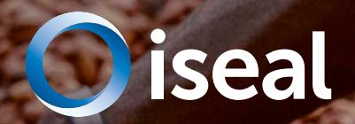

If not carefully implemented, such legislaƟon may increase administraƟve burdens without driving meaningful change on the ground and may disproporƟonately aīect producers, further entrenching exisƟng supply chain inequaliƟes. There is a risk that a strong focus on compliance may cause businesses to focus solely on their own sourcing footprint, rather than encouraging broader, more holisƟc industrywide progress.

Credible voluntary sustainability standards (VSS) have been laying the groundwork for companies to implement responsible pracƟces for years, oīering tools, frameworks, and collaboraƟve approaches that help businesses navigate this evolving regulatory landscape.

With decades of on-the-ground experience, credible VSS are uniquely posiƟoned to address deforestaƟon and land conversion. They provide the strongest available [evidence](https://www.evidensia.eco/online-library/?facets%5Bapproaches%5D%5B%5D=7&facets%5Bapproaches%5D%5B%5D=1&sort=recent&order=desc&type=all)1 of impact and eīecƟveness, making them strong partners for businesses aiming to meet new deforestaƟon- and

conversion-free (DCF) requirements while building more resilient and responsible supply chains.

Crucially, these systems go beyond compliance. They help businesses proacƟvely tackle broader environmental and social issues, creaƟng long-term value and preparing them for future regulaƟons.

This case study is part of a series that looks at how credible VSS are responding to one of the most important legislaƟve developments: the EU DeforestaƟon RegulaƟon (EUDR), which aims to prevent products associated with deforestaƟon from being sold on the EU market.

By leveraging proven standards, facilitaƟng reliable data exchange, and managing risk across complex supply chains, credible VSS are criƟcal in helping businesses meet DCF requirements. These case studies show how credible VSS drive not only compliance but also meaningful transformaƟon across sectors and supply chains.

### Why sustainability legislaƟon maƩers

# **NavigaƟng EUDR: compliance and beyond**

**SupporƟng businesses with regulatory compliance and advancing sustainability** 

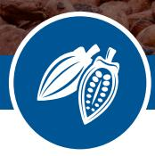

**CASE STUDY: COCOA**

© Zeal CreaƟve Studios / Pexels

**Sustainability legislaƟon has expanded rapidly in recent years. Increasingly, addressing issues such as deforestaƟon and human rights risks within supply chains is no longer a voluntary choice by responsible businesses but a legal obligaƟon for all. New regulaƟons have the potenƟal to accelerate the transiƟon to sustainable business pracƟces and deliver posiƟve impacts for people and planet at scale. But they also bring challenges.** 

1. Evidensia is the largest repository of evidence of the impacts and eīecƟveness of market-based approaches, including VSS. [Learn more about the](https://www.evidensia.eco/why-evidensia/)  [plaƞorm](https://www.evidensia.eco/why-evidensia/) or [explore the evidence on VSS](https://www.evidensia.eco/online-library/?facets%5Bapproaches%5D%5B%5D=7&facets%5Bapproaches%5D%5B%5D=1&sort=recent&order=desc&type=all).

#### The cocoa supply chain

Cocoa is produced from the seed of the tropical *Theobroma cacao* tree and is the key ingredient in chocolate products enjoyed by millions of consumers across the globe. Cocoa producƟon is concentrated in West Africa, parƟcularly Côte d'Ivoire and Ghana and mostly grown by smallholder farmers. It is a primary livelihood source for approximately [six million](https://www.fairtrade.net/en/products/Fairtrade_products/cocoa.html) farmers around the world.

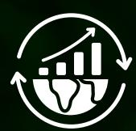

The cocoa sector faces several signiĮcant challenges. Rising global demand for the raw commodity and economic pressures on farmers have resulted in rapid expansion of cocoa producƟon in key tropical forest zones of the world. Intense cocoa producƟon and the need to replace aging trees has led to expansion of producƟon into forested zones. Cocoa farmers' livelihoods are increasingly at risk due to deforestaƟon driven by economic pressure, and climate change, which is causing declining producƟvity and proĮtability.

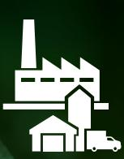

### Key players and credible VSS

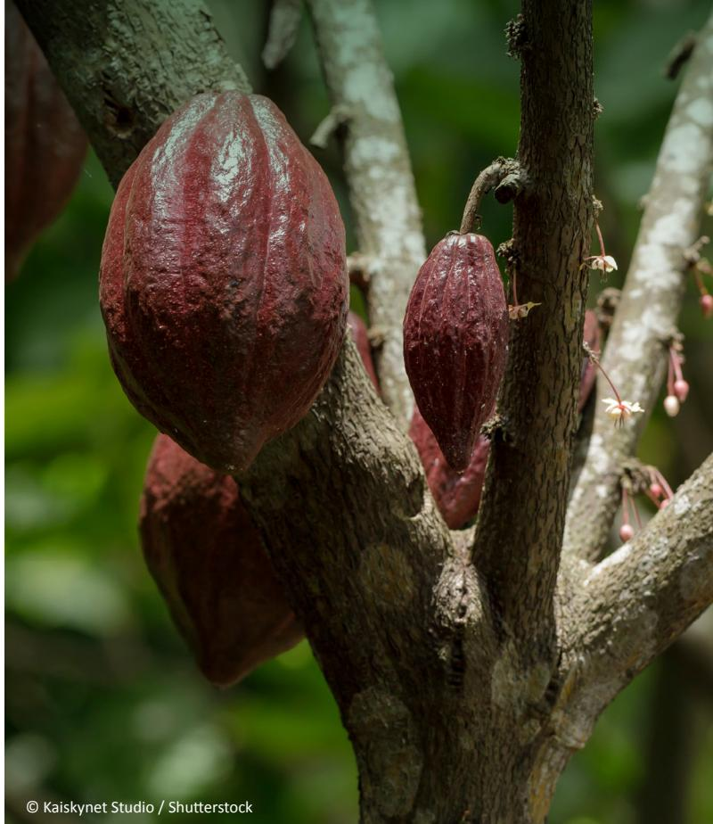

Various sustainability standards, cerƟĮcaƟon systems and collaboraƟve iniƟaƟves aim to improve the livelihoods and incomes of cocoa farmers while enhancing producƟon pracƟces. Two prominent internaƟonal VSS acƟve in the sector are the Rainforest Alliance and Fairtrade InternaƟonal.

Other standards include [ISO 34101](https://www.iso.org/news/ref2387.html) – the Įrst sustainability standard for an agricultural product adopted by the InternaƟonal OrganizaƟon for StandardizaƟon (ISO) – and the emergent [African](https://www.kakaoforum.de/wp-content/uploads/2024/05/ARS_Studie_EN.pdf)  [Standard for Sustainable Cocoa \(ARS-1000\).](https://www.kakaoforum.de/wp-content/uploads/2024/05/ARS_Studie_EN.pdf) Governments in both Côte d'Ivoire and Ghana have [made ARS-1000 mandatory](https://worldcocoafoundation.org/news-and-resources/article/africa-s-sustainable-cocoa-standard-3-things-to-know-about-ars-1000).

Beyond these standards, several groups and alliances are working to improve sustainability and transparency across cocoa supply chains. For example, the World Cocoa FoundaƟon plays a central role as the primary mulƟ-stakeholder body focused on sectorwide governance and sustainability. Other iniƟaƟves include the [Cocoa & Forests IniƟaƟve](https://www.idhsustainabletrade.com/initiative/cocoa-and-forests/), and companyled eīorts like [Cocoa Life](https://www.cocoalife.org) (Mondelēz InternaƟonal) and [Nestle's Income Accelerator Program,](https://www.nestlecocoaplan.com/our-approach/income-accelerator-program) developed in partnership with the Rainforest Alliance, among others. © Kaiskynet Studio / ShuƩerstock

**Global demand Rising global demand has resulted in rapid expansion of cocoa producƟon**

**6 million farmers Cocoa is a primary livelihood source for approximately [six](https://www.fairtrade.net/en/products/Fairtrade_products/cocoa.html)  [million](https://www.fairtrade.net/en/products/Fairtrade_products/cocoa.html) farmers globally**

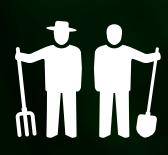

### **Cocoa producƟon**

**Intense cocoa producƟon and the need to replace trees has led to producƟon in forested zones**

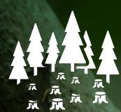

### **DeforestaƟon**

**Cocoa farmers' livelihoods are at risk due to deforestaƟon driven by economic pressure**

Currently, the EUDR applies to a wide range of cocoa-related products. This includes raw cocoa materials such as beans, shells, husks, and other waste, as well as processed products like cocoa paste, cocoa buƩer, and cocoa powder. Importantly, certain Įnished goods – including chocolate and other manufactured cocoa-based products – are also within scope. Unlike cocoa, some other commodiƟes (e.g. palm oil) are limited to raw materials under the regulaƟon. You can access the full list of cocoa-related products covered in [annex 1 of the EUDR](https://eur-lex.europa.eu/legal-content/EN/TXT/PDF/?uri=CELEX:32023R1115).

#### **What products are in scope of EUDR?**

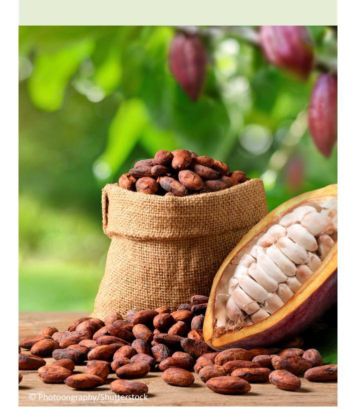

### **Traceability:**

The EUDR requires the precise geolocaƟon of a producƟon area, which can be a signiĮcant challenge to ascertain in the context of smallholder producƟon. The sourcing of cocoa is currently [split 50:50 between](https://www.czapp.com/analyst-insights/what-eudr-means-for-cocoa/)  [direct and indirect supply chains](https://www.czapp.com/analyst-insights/what-eudr-means-for-cocoa/). In the laƩer case, cocoa is purchased via local intermediaries with raw material from various producƟon plots potenƟally being mixed, complicaƟng the tracing of cocoa beans back to plot. The diĸculty with providing 100% traceability is most challenging for smallholder farmers who risk losing market access to the EU if their condiƟons of producƟon and trade do not meet traceability requirements. This will directly aīect the livelihoods and income of millions of farmers who may not have the Įnancial means to set up their traceability and compliance systems at source.

## **Data burden:**

The process of collecƟng and validaƟng quality geolocaƟon data is labour intensive. This burden oŌen falls on the farmer organisaƟons and their members, potenƟally diverƟng resources from other essenƟal farming acƟviƟes. Fairtrade InternaƟonal's producer networks esƟmate that [each producer organisaƟon](https://www.fairtrade.net/us-en/why-fairtrade/why-we-do-it/deforestation.html)  [requires between €5,000 and €15,000 to fund](https://www.fairtrade.net/us-en/why-fairtrade/why-we-do-it/deforestation.html)  [geolocaƟon data collecƟon](https://www.fairtrade.net/us-en/why-fairtrade/why-we-do-it/deforestation.html), depending on the region and size of the groups. This could put further Įnancial pressure on cocoa producers already struggling with low incomes, climate change and economic insecurity.

#### **Legal producƟon:**

The EUDR's legal producƟon requirement means that, as well as being deforestaƟon-free, products in scope must have been produced in compliance with the laws of the country of producƟon. Proving legality can be diĸcult – parƟcularly when it comes to land rights.

In major cocoa-producing countries like Ghana and Côte d'Ivoire, [most land is held under customary](https://efi.int/sites/default/files/files/flegtredd/Sustainable-cocoa-programme/Cocoa%20insights/EFI%20Cocoa%20Insight%202%20-%20Ensuring%20cocoa%20legality%20EN.pdf)  [tenure rather than formal Ɵtles:](https://efi.int/sites/default/files/files/flegtredd/Sustainable-cocoa-programme/Cocoa%20insights/EFI%20Cocoa%20Insight%202%20-%20Ensuring%20cocoa%20legality%20EN.pdf) around 80% of land in Ghana is under customary ownership and largely undocumented, and in Côte d'Ivoire, only about 4% of rural land is covered by a cerƟĮcate or Ɵtle. While farming on such land is oŌen legal, most smallholders lack documentaƟon to prove their land-use rights – making it harder to demonstrate compliance.

#### Understanding the EUDR: challenges and requirements for cocoa

The EUDR applies to seven commodiƟes, including cocoa. It requires businesses selling these products in the EU to conduct due diligence to ensure they are legally produced and not linked to deforestaƟon or forest degradaƟon aŌer 31 December 2020. While aimed at driving sustainability, compliance presents some speciĮc challenges for the cocoa sector.

#### How credible VSS can support businesses with regulatory compliance

Credible VSS oīer a range of system capabiliƟes and strategies to support company due diligence and, in turn, regulatory compliance. However, they are not a subsƟtute for companies' own responsibility to demonstrate compliance with the EUDR.

For cocoa, both the Rainforest Alliance and Fairtrade InternaƟonal's systems can support with EUDR, ensuring cerƟĮed producers and partners are well equipped to meet its requirements. Below, we summarise some key points; a more detailed overview of how each organisaƟon supports EUDR compliance can be found on their websites:

- [Rainforest Alliance](https://www.rainforest-alliance.org/business/certification/how-the-rainforest-alliance-supports-eudr-compliance-from-farm-to-retailer/)
- [Fairtrade InternaƟonal](https://www.fairtrade.net/en/why-fairtrade/why-we-do-it/deforestation.html)

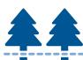

### **DeforestaƟon-free:**

The Fairtrade cocoa standard requires cerƟĮed producer organisaƟons to strengthen their deforestaƟon prevenƟon, monitoring and miƟgaƟon. While Fairtrade's deforestaƟon cut-oī date for cocoa is 2018 – earlier than the EUDR's 2020 cut-oī – the system is being adapted to further support businesses with the regulaƟon. In line with the EUDR, farms larger than four hectares or located in high-risk areas must use polygon mapping, while smaller farms may use single geolocaƟon points.

To support deforestaƟon monitoring, Fairtrade InternaƟonal has [partnered with Satelligence to provide free satellite](https://www.fairtrade.net/uk-en/get-involved/resources/media-centre.html)  [data](https://www.fairtrade.net/uk-en/get-involved/resources/media-centre.html) to all cerƟĮed cocoa producer organisaƟons. This helps cooperaƟves understand deforestaƟon risks in their supply base and share relevant informaƟon with trade partners. Fairtrade also oīers essenƟal guidance on the

data and formats required by the EUDR, along with detailed mulƟlingual support materials to ensure producers can access and use this informaƟon eīecƟvely. Fairtrade support materials provided to cooperaƟves are combined with access to direct support from Fairtrade's producer networks who are based in the countries of producƟon. This cooperaƟve support includes assistance from data analysts to help cooperaƟves who may encounter challenges with geolocaƟon data quality.

The Rainforest Alliance's Sustainable Agriculture Standard does not allow the cerƟĮcaƟon of farms where natural ecosystems were destroyed or converted aŌer 1 January 2014, also going beyond the EUDR's cut-oī date. They've developed automated deforestaƟon risk assessment maps and require all cerƟĮed farms to be GPS mapped with satellite veriĮcaƟon. DeforestaƟon risk is assessed using forest baseline data that covers farms and risks beyond cerƟĮed crops. These results are shared with farm cerƟĮcate holders and the cerƟĮcaƟon bodies that audit them. All cocoa farm cerƟĮcate holders are also audited against addiƟonal EUDR-aligned requirements.

#### **Legal producƟon:**

Credible VSS can play a key role in verifying informaƟon required to comply with the EUDR's legal producƟon requirements. The Rainforest Alliance's Sustainable Agriculture Standard requires legal and legiƟmate land use rights, which auditors verify through oĸcial documents or the absence of land disputes. All farm cerƟĮcate holders must comply with applicable laws and collecƟve bargaining agreements. CerƟĮcaƟon bodies undertake an applicable law assessment for each country to ensure auditors can verify legal compliance. Fairtrade InternaƟonal's Standards require producers and hired labour operaƟons to comply with naƟonal laws on land tenure, labour rights, and environmental protecƟon, with audits conducted by FLO-CERT, Fairtrade's independent cerƟĮcaƟon body, to verify compliance.

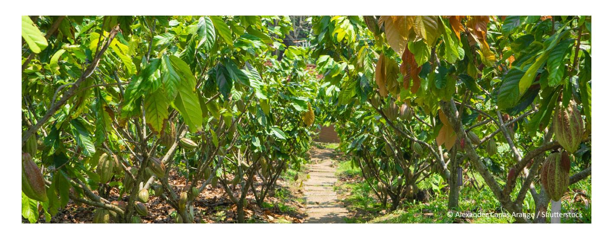

### **Traceability requirements:**

Fairtrade InternaƟonal recognises that data and informaƟon are key to tracing products back to their origin. It provides support to producer organisaƟons through its regional producer networks, oīering guidance on EUDR data requirements and facilitaƟng the collecƟon of geolocaƟon data. Producer organisaƟons submit data via FairInsight, a plaƞorm which enables producers to report and share informaƟon with their trade partners. Crucially, Fairtrade's approach places producer ownership of this data at its core.

Fairtrade oīers various chain of custody (CoC) models, depending on the product:

- **IdenƟty preserved (IP):** traceable to the producer organisaƟon.
- **Segregated:** cerƟĮed and non-cerƟĮed products are kept separate.
- **Mass balance:** cerƟĮed and non-cerƟĮed products may be mixed, with strict volume tracking.

The Fairtrade Cocoa Standard requires segregaƟon of fairtrade cocoa from non-cerƟĮed cocoa, from the producer organisaƟon level up to Įrst buyer. AddiƟonally, geolocaƟon and plot-level traceability data may be transferred with cerƟĮed cocoa to support EUDR compliance. Traders within the Fairtrade system may use IP and segregated CoC models to support their EUDR compliance. The mass balance CoC model remains a permiƩed and recognised model for cocoa.

Rainforest Alliance also oīers mulƟple CoC models for cocoa:

- **IdenƟty preserved:** traceable to an individual cerƟĮed farm or farm group.
- **Mixed IP:** material from mulƟple cerƟĮed farms or farm groups is mixed but remains traceable to one or more known groups of producers.
- **Segregated:** cerƟĮed and non-cerƟĮed products are kept separate.
- **Mass balance:** cerƟĮed and non-cerƟĮed material may be mixed, with strict volume tracking.

For supply chains choosing IP or mixed IP models, cerƟĮed supply chain actors can use the Rainforest Alliance CerƟĮcaƟon Plaƞorm and digital dashboard to idenƟfy farm cerƟĮcate holders who are EUDR-aligned. These farms and farm groups have provided and agreed to share geolocaƟon data for all relevant cocoa plots, with polygon mapping required for larger plots. The Rainforest Alliance supports data collecƟon at farm level with tools and training and makes EUDR relevant data available to supply chain cerƟĮcate holders in downloadable Įles and in a format compaƟble with the EU System.

Since cocoa sourced via segregated or mass balance supply chains is not traceable back to farm level, EUDR-alignment needs to be ensured outside of the Rainforest Alliance cerƟĮcaƟon and traceability system. However, a list of EUDR-aligned farm cerƟĮcate holders is publicly available on the Rainforest Alliance website.

Traceability is central to EUDR compliance, and credible VSS like Fairtrade and Rainforest Alliance help ensure it is implemented fairly through strong engagement across the supply chain. They clarify roles and responsibiliƟes not only for traders and importers, but also for brands and producers, support data transfer through digital plaƞorms, and help share compliance responsibiliƟes, reducing the risk that smallholders are excluded. This turns traceability from a box-Ɵcking exercise into a foundaƟon for more inclusive and resilient supply chains.

#### Beyond compliance

There is a risk that the EUDR and similar regulaƟons could encourage businesses to reduce their sourcing exposure to smallholders and favour large players in an eīort to reduce the cost of due diligence and miƟgate risk. This could weaken businesses' supply chain resilience and reduce incenƟves for smallholders to avoid land-use change and deforestaƟon. Sustainability systems oīer an eīecƟve and inclusive way to strengthen supply chains, meet corporate sustainability goals, and prepare producers, manufacturers and sourcing companies for evolving regulaƟons.

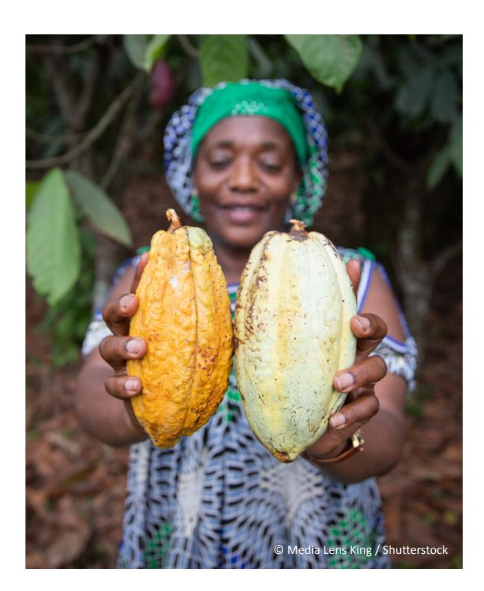

#### Tools and resources

+44 (0)20 3246 0066 info@isealalliance.org twiƩer.com/isealalliance **www.isealalliance.org Registered Charity number: 1199607**

#### **ISEAL**

The Green House 244-254 Cambridge Heath Road London E2 9DA United Kingdom

[Fairtrade Standard for Cocoa](https://www.fairtrade.net/en/why-fairtrade/how-we-do-it/fairtrade-standards/who-we-have-standards-for/standards-for-small-scale-producer-organisations/cocoa.html) [Fairtrade Risk Map – Cocoa](https://riskmap.fairtrade.net/commodities/cocoa) [Fairtrade Impact Plaƞorm](https://impact.fairtrade.net) [The eīect of Fairtrade on forest protecƟon](https://www.fairtrade.net/en/get-involved/library/the-effect-of-fairtrade-on-forest-protection-and-deforestation-p.html)  [and deforestaƟon prevenƟon](https://www.fairtrade.net/en/get-involved/library/the-effect-of-fairtrade-on-forest-protection-and-deforestation-p.html) [Rainforest Alliance list of EUDR-aligned farm](https://www.rainforest-alliance.org/business/certification/list-of-eudr-aligned-certificate-holders/)  [cerƟĮcate holders](https://www.rainforest-alliance.org/business/certification/list-of-eudr-aligned-certificate-holders/) [Rainforest Alliance Learning Network](https://learn.ra.org/course/view.php?id=3470)  [E-course on EUDR](https://learn.ra.org/course/view.php?id=3470) [How the Rainforest Alliance Supports EUDR](https://www.rainforest-alliance.org/business/certification/how-the-rainforest-alliance-supports-eudr-compliance-from-farm-to-retailer/)  [Compliance from Farm to Retailer](https://www.rainforest-alliance.org/business/certification/how-the-rainforest-alliance-supports-eudr-compliance-from-farm-to-retailer/) [Rainforest Alliance Tools for DeforestaƟon](https://www.rainforest-alliance.org/business/certification/rainforest-alliance-tools-to-promote-deforestation-free-supply-chains/)[free Supply Chains](https://www.rainforest-alliance.org/business/certification/rainforest-alliance-tools-to-promote-deforestation-free-supply-chains/) [ASI's Independent Assessment of Rainforest](https://knowledge.rainforest-alliance.org/docs/external-report-asis-independent-assessment-of-rainforest-alliances-ra-alignment-with-the-eu-deforestation-regulation-eudr-guidance-document)  [Alliance's Alignment with EUDR Guidance](https://knowledge.rainforest-alliance.org/docs/external-report-asis-independent-assessment-of-rainforest-alliances-ra-alignment-with-the-eu-deforestation-regulation-eudr-guidance-document)  [Document](https://knowledge.rainforest-alliance.org/docs/external-report-asis-independent-assessment-of-rainforest-alliances-ra-alignment-with-the-eu-deforestation-regulation-eudr-guidance-document) Soon to be launched: EUDR e-course for SMEs

# **Tackling root causes:**

Both schemes go beyond regulatory requirements by addressing the underlying drivers of deforestaƟon, parƟcularly poverty and insecure livelihoods. Fairtrade promotes fair pricing, supports income improvements through Fairtrade prices, and empowers producer organisaƟons to invest the Fairtrade Premium in forest protecƟon. A [Fairtrade InternaƟonal project funded by the](https://isealalliance.org/innovations-fund/explore-projects/piloting-data-ownership-cocoa-cooperatives-ghana)  [ISEAL InnovaƟons Fund](https://isealalliance.org/innovations-fund/explore-projects/piloting-data-ownership-cocoa-cooperatives-ghana) is working to strengthen smallholder control over their data and inŇuence in the supply chain. The Fairtrade approach is also one which goes beyond mere regulatory compliance, aligning with an ecosystem approach to data ownership and a commitment to protecƟng forests that predates the EUDR. Further, Fairtrade views the relaƟonship between achieving economic gains and protecƟng forests as mutually reinforcing; By addressing root causes of deforestaƟon such as poverty through income-relevant intervenƟons, producers are beƩer posiƟoned to adopt climate-resilient pracƟces, including adaptaƟon and miƟgaƟon plans and good agroecological pracƟces that help combat deforestaƟon. Likewise, sustainable agricultural pracƟces have the potenƟal to posiƟvely impact producers' economic gains.

As well as supporƟng livelihoods, the Rainforest Alliance stresses the crucial role of landscape-level approaches, invesƟng in sustainable land management, biodiversity conservaƟon, restoring degraded lands and climate-smart, regeneraƟve agriculture. By taking a broader ecosystemlevel approach, it encourages companies to support geodata collecƟon and invest in producer livelihoods as part of longterm forest conservaƟon. This direct economic focus on improving livelihoods to combat deforestaƟon is an important holisƟc approach to tackling issues like deforestaƟon, going well beyond a regulatory approach that bans the entry of products linked to deforestaƟon in the EU market.

#### **Producer support for data collecƟon and compliance:**

Both organisaƟons play a vital role in enabling smallholder producers to meet complex data and risk monitoring requirements. Rather than placing the burden solely on producers, Fairtrade and the Rainforest Alliance provide guidance, training, and in-Įeld support to facilitate the collecƟon and use of geolocaƟon and deforestaƟon-risk data.

Fairtrade oīers pracƟcal resources and access to satellitebased deforestaƟon data, while the Rainforest Alliance has developed automated risk assessment tools and customised satellite-based risk maps that support farm groups and cerƟĮcaƟon bodies with proacƟve risk monitoring.

By embedding these services within their sustainability frameworks, both systems reduce the administraƟve burden on producers and ensure that the producers themselves retain data ownership. This approach goes beyond compliance by strengthening long-term producer capacity, improving decision-making, and ensuring that smallholders can acƟvely parƟcipate in and beneĮt from global supply chains.

Credible VSS, including Fairtrade and Rainforest Alliance, provide reliable guidance, tools, and support to help businesses meet their EUDR requirements while fostering more resilient, inclusive, and sustainable cocoa supply chains.

