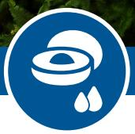
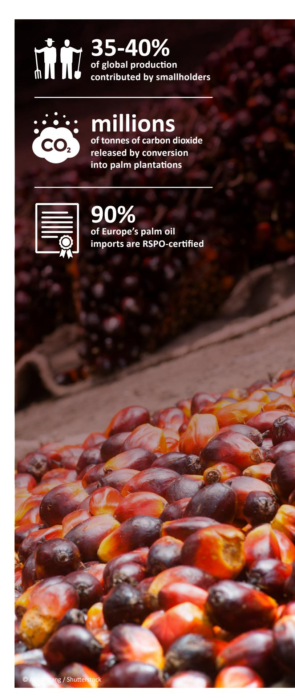
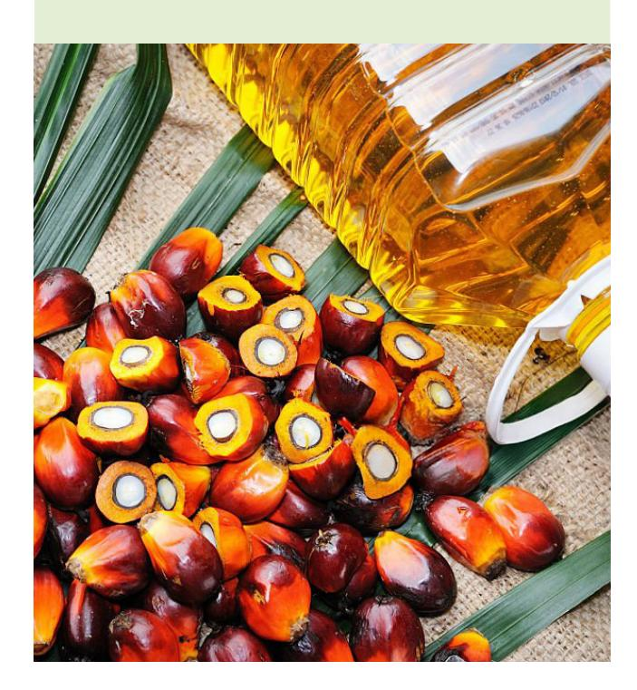
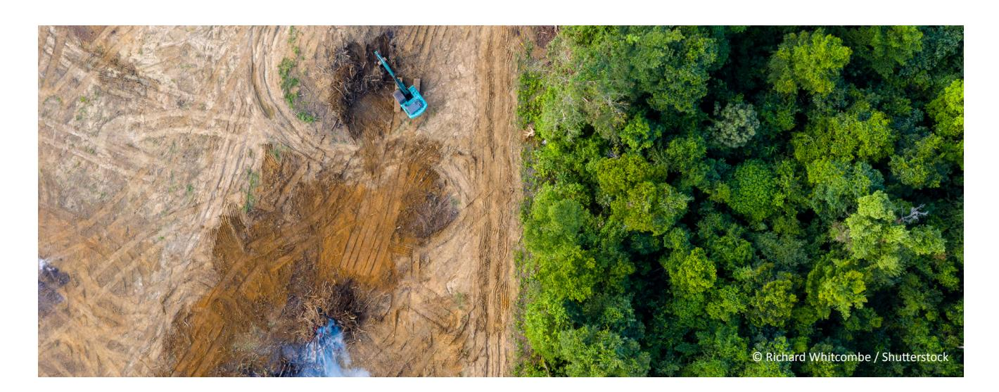

If not carefully implemented, such legislaƟon may increase administraƟve burdens without driving meaningful change on the ground. There is a risk that a strong focus on compliance may cause businesses to focus solely on their own sourcing footprint, rather than encouraging broader, more holisƟc industry-wide progress.

Credible voluntary sustainability standards (VSS) have been laying the groundwork for companies to implement responsible pracƟces for years, oīering tools, frameworks, and collaboraƟve approaches that help businesses navigate this evolving regulatory landscape.

With decades of on-the-ground experience, credible VSS are uniquely posiƟoned to address deforestaƟon and land conversion. They provide the strongest available [evidence](https://www.evidensia.eco/online-library/?facets%5Bapproaches%5D%5B%5D=7&facets%5Bapproaches%5D%5B%5D=1&sort=recent&order=desc&type=all)1 of impact and eīecƟveness, making them strong partners for businesses aiming to meet new deforestaƟon and conversion free (DCF) requirements while building more resilient and responsible supply chains.

Crucially, these systems go beyond compliance. They help businesses proacƟvely tackle broader environmental and social issues, creaƟng long-term value and preparing them for future regulaƟons.

This series of case studies looks at how credible VSS are responding to one of the most important legislaƟve developments: the EU DeforestaƟon RegulaƟon (EUDR), which aims to prevent products associated with deforestaƟon from being sold on the EU market.

By leveraging proven standards, facilitaƟng reliable data exchange, and managing risk across complex supply chains, credible VSS are criƟcal in helping businesses meet DCF requirements. These case studies show how credible VSS drive not only compliance but also meaningful transformaƟon across sectors and supply chains.

## Why sustainability legislaƟon maƩers

# **NavigaƟng EUDR: compliance and beyond**

**SupporƟng businesses with regulatory compliance and advancing sustainability** 

**CASE STUDY: PALM OIL**

© Ihsan Adityawarman / Pexels

**Sustainability legislaƟon has expanded rapidly in recent years. Increasingly, addressing issues such as deforestaƟon and human rights risks within supply chains is no longer a voluntary choice by responsible businesses but a legal obligaƟon for all. New regulaƟons have the potenƟal to accelerate the transiƟon to sustainable business pracƟces and deliver posiƟve impacts for people and planet at scale. But they also bring challenges.**

1. Evidensia is the largest repository of impacts and eīecƟveness evidence for market-based approaches, of which VSS is one. Learn more about the plaƞorm here: [Why Evidensia - Evidensia](https://www.evidensia.eco/why-evidensia/) or explore the evidence on VSS here: [Evidence Library - Evidensia](https://www.evidensia.eco/online-library/?facets%5Bapproaches%5D%5B%5D=7&facets%5Bapproaches%5D%5B%5D=1&sort=recent&order=desc&type=all).

#### The palm oil supply chain

Palm oil is used in a wide range of industries, including food, personal care, pharmaceuƟcals, plasƟcs and biofuels. It is derived from the fruit of oil palms grown in tropical regions, especially in Malaysia and Indonesia. The supply chain is complex and fragmented, spanning mulƟple countries and involving diverse processes and stakeholders, with smallholders contribuƟng 35-40% of global producƟon.

Its widespread use is largely due to it being the most landeĸcient vegetable oil crop, yielding signiĮcantly more oil per hectare than alternaƟves like soy, sunŇower or rapeseed. This also makes palm oil cheaper than other edible oils.

But this eĸciency comes at a high cost. Palm oil has been one of the major drivers of deforestaƟon in recent decades, fuelling climate change and biodiversity loss. ConverƟng carbon-rich peat soils into oil palm plantaƟons has released millions of tonnes of carbon dioxide into the atmosphere and caused catastrophic forest Įres. Other issues include conŇicts between palm oil companies and local communiƟes, poor working condiƟons, and a lack of support for smallholders to improve farming pracƟces and increase yields.

## Key players and credible VSS

Various sustainability standard and cerƟĮcaƟon schemes and collaboraƟve iniƟaƟves aim to address these issues and improve environmental and social pracƟces in palm oil producƟon.

The [Roundtable on Sustainable Palm Oil \(RSPO\)](https://rspo.org/why-sustainable-palm-oil/legislation/), founded in 2004, is the largest internaƟonal sustainability standard in the sector. Around 90% of Europe's palm oil imports are RSPO-cerƟĮed. The [InternaƟonal Sustainability and Carbon](https://www.iscc-system.org/)  [CerƟĮcaƟon \(ISCC\)](https://www.iscc-system.org/) is another key cerƟĮcaƟon system for palm oil. While ISCC primarily focuses on cerƟfying biofuels and waste-based feedstocks, it also includes palm oil and other agricultural raw materials used in food, feed, and industrial applicaƟons.

In addiƟon to RSPO, Indonesia and Malaysia have developed their own cerƟĮcaƟon systems in line with naƟonal regulaƟons: Indonesian Sustainable Palm Oil (ISPO) and Malaysian Sustainable Palm Oil (MSPO). Both have become mandatory within the supply chain.

Beyond these standards, a number of groups and alliances on the demand side are working to improve sustainability and transparency across palm oil supply chains. These include the [Palm Oil Transparency CoaliƟon](https://www.palmoiltransparency.org/), [Palm Oil](https://palmoilcollaborationgroup.net/)  [CollaboraƟon Group](https://palmoilcollaborationgroup.net/) and the [Consumer Goods Forum](https://www.theconsumergoodsforum.com).

#### Understanding the EUDR: challenges and requirements for palm oil

The EU DeforestaƟon RegulaƟon (EUDR) applies to seven commodiƟes, including palm oil. It requires businesses selling these products in the EU to conduct due diligence to ensure they are legally produced and not linked to deforestaƟon or forest degradaƟon aŌer 31 December 2020. Although the RegulaƟon sets the bar high to tackle deforestaƟon in key commodity sectors, compliance with the EUDR presents some speciĮc challenges for the palm oil sector. Two examples of this are the EUDR's traceability and legality requirements.

# **Traceability:**

The EUDR requires the precise geolocaƟon of a producƟon area, which can be a signiĮcant challenge for smallholder producers. AddiƟonally, smallholders typically sell their fresh fruit bunches informally through a network of intermediaries and have liƩle knowledge of or control over where their produce goes once sold. DocumentaƟon for these transacƟons is rarely available, making it even more diĸcult to demonstrate traceability to the exact area of producƟon, as required by the EUDR. There is a risk that this burden to demonstrate full traceability and compliance will push companies to source from large palm oil plantaƟons instead, crowding out smallholders.

#### **Legal producƟon:**

The EUDR's legal producƟon requirement means that, as well as being deforestaƟon-free, products in scope must have been produced in compliance with the laws of the country of producƟon. NavigaƟng this requirement can be complex, parƟcularly when it comes to land rights: in Indonesia, for example, Indigenous communiƟes oŌen lack formal land Ɵtles, leading to potenƟal conŇicts and contested land rights with plantaƟons. More informal types of land tenure, like customary tenure, complicate formal land ownership veriĮcaƟon, leaving many farmers unable to obtain the necessary documentaƟon and posing obstacles for companies seeking to meet EUDR requirements.

#### How credible VSS can support businesses with regulatory compliance

Credible VSS oīer a range of system capabiliƟes and strategies to support company due diligence and, in turn, regulatory compliance. However, credible VSS are not a subsƟtute for companies' own responsibility to demonstrate compliance with the EUDR.

For palm, with RSPO CerƟĮcaƟon, RSPO Members are well-prepared to meet the EUDR criteria, as they already have relevant processes in place. In most cases, cerƟĮed sustainable palm oil (CSPO) goes beyond the EUDR's requirements, but there are diīerences to be aware of. This secƟon outlines how the RSPO's Principles and Criteria (P&C), system capabiliƟes and tools can support compliance with the EUDR's requirements, also noƟng diīerences between the two where relevant.2

Currently, the EUDR covers raw materials like palm oil and palm kernels but not manufactured products such as soap or shampoo containing palm oil, though this may change in the future. Other commodiƟes, like cocoa, include Įnished products within the scope of the regulaƟon. You can access the full list of palm oil products within scope in annex 1 of the EUDR.

### **What products are in scope of EUDR?**

2. RSPO commissioned a [gap analysis](https://rspo.org/wp-content/uploads/Gap-Analysis-RSPO-vs-EUDR.pdf) of the diīerences between the EUDR requirements and its own Principles and Criteria (P&C) and chain of custody requirements.

# **'DeforestaƟon-free' deĮniƟon:**

While zero-deforestaƟon is a key part of the RSPO Standards, there are diīerences in the deĮniƟon of forest. The EUDR uses the FAO (Food and Agricultural OrganisaƟon) deĮniƟon of forest, which applies to any area of more than 0.5 hectares with vegetaƟon higher than Įve metres and more than 10% foliage cover, whereas the RSPO uses a more qualitaƟve approach that includes biodiversity, ecosystem services, carbon storage, cultural relevance and more. RSPO CerƟĮed palm oil cannot be grown on land cleared without a High ConservaƟon Value (HCV) assessment aŌer November 2005, which largely applies to primary forests, or without a High ConservaƟon Value–High Carbon Stock Approach (HCV-HCSA) assessment aŌer November 2018, which extended protecƟons to secondary forests. However, the cut-oī date for the EUDR is 31 December 2020. This means there may be cases where an area qualiĮes as forest under the EUDR although the RSPO P&C allows development. Conversely, an area may be designated for protecƟon under the RSPO P&C but not considered high-value by the EUDR. Overall, RSPO's deĮniƟon of deforestaƟon-free generally goes beyond EUDR requirements, but the diīerences in criteria require careful aƩenƟon from companies.

#### **Legal producƟon:**

The RSPO Standards align closely with the EUDR's legal producƟon requirements, with new plantaƟons required to comply with naƟonal laws. While the EUDR states that a land Ɵtle is not necessary if not mandated by naƟonal law, the RSPO goes further by already requiring such documents. RSPO's independent smallholder (ISH) standard helps smallholders meet the EUDR's legal producƟon requirements by ensuring demonstraƟon of

legal land rights and adherence to labour laws, including those against child and forced labour. The RSPO also requires growers to follow the principle of Free, Prior, and Informed Consent (FPIC) when engaging with Indigenous peoples and forest communiƟes. In addiƟon, RSPO carries out naƟonal interpretaƟon of its standards that helps ensure that its P&C are aligned with the legal and regulatory frameworks of producing countries. By involving stakeholders through public consultaƟon, the process provides clear guidance for implemenƟng the P&C while addressing sustainability and legal requirements speciĮc to each country.

# **Traceability requirements:**

The EUDR requires precise geolocaƟon informaƟon on where commodiƟes were originally produced, giving laƟtude and longitude coordinates to at least six digits. The 2024 RSPO P&C now requires such geolocaƟon data collecƟon for both cerƟĮed and non-cerƟĮed Fresh Fruit Bunches (FFBs). This informaƟon can be captured by the RSPO traceability plaƞorm *prisma* and help members to provide relevant geolocaƟon data to assess compliance with the EUDR.

Companies sourcing segregated or idenƟty preserved cerƟĮed sustainable palm oil should be able to easily collect the informaƟon they need to demonstrate compliance. Companies using a mass balance approach (mixing cerƟĮed and non-cerƟĮed palm oil) will need to be able to demonstrate that the non-cerƟĮed part is also deforestaƟon-free and legally produced. While companies that buy credits to support sustainable palm oil producƟon and smallholders can conƟnue to do so, they'll need to ensure their physical supplies are EUDR compliant. This [RSPO factsheet](https://rspo.org/as-an-organisation/certification/supply-chains/) explains its various supply chain models.

Tools and resources

+44 (0)20 3246 0066 info@isealalliance.org twiƩer.com/isealalliance **www.isealalliance.org Registered Charity number: 1199607**

#### **ISEAL**

The Green House 244-254 Cambridge Heath Road London E2 9DA United Kingdom

[RSPO and LegislaƟon](https://rspo.org/why-sustainable-palm-oil/legislation/) [prisma by RSPO](https://www.prismabyrspo.org) [ISCC EUDR add-on](https://www.iscc-system.org/markets/eudr/)

### SupporƟng smallholder inclusion

There is a risk that the EUDR and similar regulaƟons could encourage businesses to reduce their sourcing exposure to smallholders and favour large players in an eīort to reduce the cost of due diligence and risk miƟgaƟon. This could lead to a range of negaƟve consequences for smallholders, including reduced market access, loss of livelihoods, and weakened incenƟves to adopt more sustainable producƟon pracƟces. Ensuring that all smallholders can engage with and beneĮt from these systems remains a criƟcal challenge for the sector. Credible VSS provide an eĸcient and inclusive pathway to strengthen supply chains, meet corporate sustainability goals, implement and scale DCF commitments, and prepare producers, manufacturers and sourcing companies for evolving regulaƟons. Ensuring smallholder farmers and other vulnerable groups are included in sustainable supply chains is at the core of credible VSS like RSPO. As well as enabling them to access premium markets like the EU, [research shows that](https://www.evidensia.eco/resources/3037/global-market-report-palm-oil-prices-and-sustainability/)  [parƟcipaƟng in credible VSS's beneĮts smallholders](https://www.evidensia.eco/resources/3037/global-market-report-palm-oil-prices-and-sustainability/) through improved producƟon pracƟces that help maintain soil health, improve understanding of ferƟliser use and storage, and ulƟmately increase yields. These pracƟces not only contribute to the sustainability of palm oil producƟon but also enhance smallholders' long-term producƟvity and incomes; independent cerƟĮed smallholders, for example, earn [89%](https://iiste.org/Journals/index.php/JEDS/article/view/33228/34126) more than their non-cerƟĮed counterparts.

Most RSPO cerƟĮed palm oil imported into the EU is kept separate from non-cerƟĮed product throughout the supply chain, but where full segregaƟon may not be feasible or accessible for smallholders, RSPO oīers alternaƟve models that can support smallholder parƟcipaƟon in sustainable supply chains. Mass balance allows cerƟĮed and non-cerƟĮed palm oil to be mixed, while manufacturers and retailers can also buy RSPO Credits to support cerƟĮed producƟon, including from independent smallholders. These models can provide Ňexibility and Įnancial incenƟves to enable smallholders to access markets that demand sustainability and adopt more sustainable farming pracƟces while progressing toward full cerƟĮcaƟon.

At the same Ɵme, RSPO is working to create pathways for smallholders to meet regulatory requirements and improve supply chain traceability. prisma by RSPO, the new traceability plaƞorm, helps smallholders and other supply chain actors demonstrate traceability and compliance with deforestaƟon-free requirements.

As discussed above, smallholders oŌen sell to intermediaries – this is the point at which traceability is most oŌen lost. A key priority for RSPO is to bring these intermediaries into the system to strengthen traceability and enable smallholders to comply with new mandatory corporate due diligence requirements, such as the EUDR. An [RSPO](https://isealalliance.org/innovations-fund/explore-projects/supporting-smallholder-inclusion-sustainable-palm-oil-supply)  [project funded by the ISEAL InnovaƟons Fund](https://isealalliance.org/innovations-fund/explore-projects/supporting-smallholder-inclusion-sustainable-palm-oil-supply) aims to address factors interrupƟng traceability from smallholders to downstream buyers. RSPO is developing guidance and recommendaƟons for diīerent actors in the supply chain to eliminate boƩlenecks and strengthen relaƟonships, which is essenƟal for any eīecƟve due diligence process. Such eīorts are criƟcal in ensuring that policies promoƟng sustainability and traceability do not prevent smallholders from accessing global markets while helping companies eĸciently implement and scale their DCF commitments.

**RSPO's new online traceability system, prisma ("Palm Resource InformaƟon and Sustainability Management"), has been designed to support increasing demand for traceability in regulatory frameworks.** 

The system collects important data such as supply locaƟons, land-use change analysis and audit results, making it easy to idenƟfy when land was converted and to monitor potenƟal deforestaƟon. OpƟmisaƟon of the system is ongoing, with the aim of ensuring that informaƟon is accurately and transparently maintained as cerƟĮed sustainable palm oil moves from plantaƟons through mills to the end consumer. Members will be able upload, trace and extract informaƟon relevant for EUDR compliance throughout the supply chain. This will support companies in fulĮlling their due diligence obligaƟons.