## Practical Guide

# e-STDB Registration for Community-Managed Commodity Crops in Social Forestry Areas under the KHDPK Scheme

Disclaimer: This study was commissioned by the GIZ project Sustainability and Value Added in Agricultural Supply Chains in Indonesia (SASCI+), funded by the BMZ, and conducted by Koltiva. The views and opinions expressed in this publication are those of the author and do not necessarily reflect the official policy or position of GIZ.

# Purpose of the Practical Guide

1.

To provide comprehensive, step-by-step instructions for smallholder farmers to register for STDB.

To offer guidance on how to register specific commodity cultivation activities within the Social Forestry scheme in forest zones designated as KHDPK (Special Purpose Forest Areas).

2.

3.

To outline the roles and responsibilities of relevant stakeholders in supporting the STDB registration process.

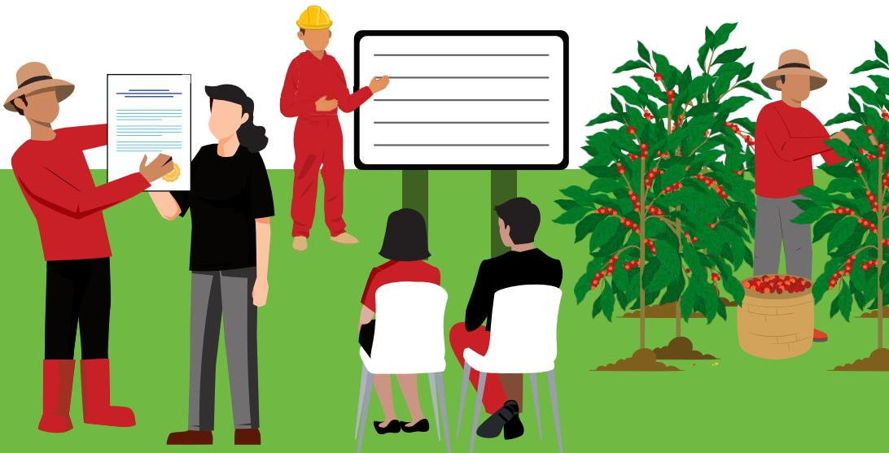

# Understanding e-STDB

**STDB (*Surat Tanda Daftar Budidaya*)** is a cultivation registration certificate issued to smallholder farmers by the Regent (Bupati) and/or Mayor (Walikota).

**"e-STDB is the electronic system for managing STDB registrations."**

## Definition of e-STDB

e-STDB is an integrated electronic system that serves as a national database of independent smallholder farmers across Indonesia.

This system helps the government and relevant stakeholders monitor farmers who are officially registered in plantation cultivation activities.

e-STDB is governed under Director General of Estate Crops Decree No. 37/Kpts/PI.400/03/2024 on the Guidelines for Issuing Plantation Business Registration Letters for Cultivation (STD-B) and Director General of Estate Crops Decree No. 123/Kpts/PI.400/12/2024, which amends the previous regulation (No. 37/Kpts/PI.400/03/2024).

The issuance of STD-B is not categorized as a business license.

Access the e-STDB system at:  
<https://stdb.ditjenbun.pertanian.go.id/>

# Example of an Issued STDB

## SURAT TANDA DAFTAR USAHA BUDIDAYA TANAMAN PERKEBUNAN (STD-B) KABUPATEN BANDUNG KECAMATAN BANJARAN

### A. Keterangan Pemilik

1. 1. Nama
2. 2. Tempat/Tanggal Lahir
3. 3. Nomor KTP
4. 4. Alamat

Nomor: [www.std-b.gov.bd](https://www.std-b.gov.bd)

[www.std-b.gov.bd](https://www.std-b.gov.bd)  
[www.std-b.gov.bd](https://www.std-b.gov.bd)  
[www.std-b.gov.bd](https://www.std-b.gov.bd)  
[www.std-b.gov.bd](https://www.std-b.gov.bd)

### B. Data Kebun

#### I. Kebun 1

- - Lokasi/Titik Koordinat Kebun:

- - Desa/Kecamatan
- - Status Kepemilikan Lahan
- - Nomor
- - Luas areal tertanam
- - Luas berdasar dokumen
- - Jenis Tanaman
- - Produksi per ha per tahun
- - Asal Benih/Bibit
- - Jumlah Pohon
- - Pola Tanam
- - Jenis Pupuk
- - Mitra Pengolahan
- - Jenis Tanah
- - Tahun Tanam

[www.std-b.gov.bd](https://www.std-b.gov.bd)  
[www.std-b.gov.bd](https://www.std-b.gov.bd)  
[www.std-b.gov.bd](https://www.std-b.gov.bd)  
[www.std-b.gov.bd](https://www.std-b.gov.bd)  
[www.std-b.gov.bd](https://www.std-b.gov.bd)  
[www.std-b.gov.bd](https://www.std-b.gov.bd)  
[www.std-b.gov.bd](https://www.std-b.gov.bd)  
[www.std-b.gov.bd](https://www.std-b.gov.bd)  
[www.std-b.gov.bd](https://www.std-b.gov.bd)  
[www.std-b.gov.bd](https://www.std-b.gov.bd)  
[www.std-b.gov.bd](https://www.std-b.gov.bd)  
[www.std-b.gov.bd](https://www.std-b.gov.bd)  
[www.std-b.gov.bd](https://www.std-b.gov.bd)

STD-B ini tidak berlaku apabila terjadi perubahan terhadap informasi tersebut di atas.

31 Desember 2024

NIP:

Dokumen ini telah ditandatangani secara elektronik yang diterbitkan oleh Balai Sertifikasi Elektronik (BSrE), BSSN

# Example of an Issued STDB

SURAT TANDA DAFTAR USAHA PERKEBUNAN UNTUK BUDIDAYA (STD-B)  
LAMPIRAN PETA KEBUN 1

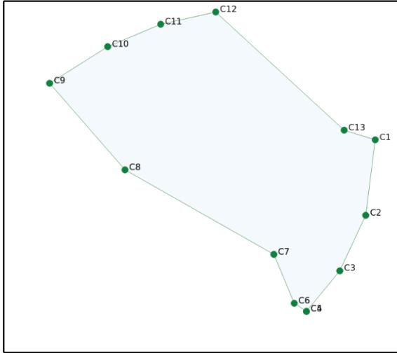

\* STD-B ini bukan untuk perizinan usaha budidaya atau pengakuan atas penguasaan lahan

\* STD-B ini tidak dapat dipindahtangankan atau diperjualbelikan

SURAT TANDA DAFTAR USAHA PERKEBUNAN UNTUK BUDIDAYA (STD-B)  
LAMPIRAN PETA KEBUN 1

**PEMILIK:**

NOMOR: [REDATED]

DESA: [REDATED]

KECAMATAN: [REDATED]

KABUPATEN: [REDATED]

LUAS: [REDATED]

KELILING: [REDATED]

**TITIK KOORDINAT:**

| C1:  | 7°62.77°S |
|------|-----------|
| C2:  | 7°62.22°S |
| C3:  | 7°62.54°S |
| C4:  | 7°62.78°S |
| C5:  | 7°62.74°S |
| C6:  | 7°62.45°S |
| C7:  | 7°62.95°S |
| C8:  | 7°62.44°S |
| C9:  | 7°62.22°S |
| C10: | 7°62.09°S |
| C11: | 7°62.02°S |
| C12: | 7°62.72°S |

undefined C13-C1: 5.87 m

**PANJANG SISI:**

| C1-C2:   | 13.85 m |
|----------|---------|
| C2-C3:   | 11.14 m |
| C3-C4:   | 9.53 m  |
| C4-C5:   | 0.00 m  |
| C5-C6:   | 2.66 m  |
| C6-C7:   | 9.63 m  |
| C7-C8:   | 30.94 m |
| C8-C9:   | 20.82 m |
| C9-C10:  | 12.43 m |
| C10-C11: | 10.39 m |
| C11-C12: | 10.18 m |
| C12-C13: | 31.61 m |

# Benefits of STDB

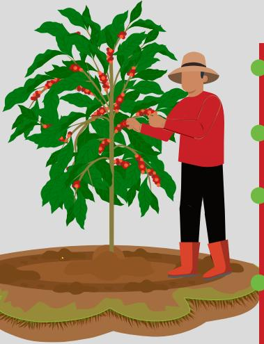

## For Farmers

● Recording farmers in the national farmer database along with their types of cultivation.

● Increases farmers' opportunities to participate in commodity supply chains.

● Enhances farmers' credibility and bargaining power within the agricultural value chain.

● Establishes eligibility to receive financial and technical support from both government and private sectors.

## For Buyers

● The e-STDB system enables due diligence and traceability to verify the legality and sustainability of commodities at the producer level.

# Benefits of STDB

## For Government

Farmer data is fully consolidated in an accurate, consistent, and harmonized manner.

A unified source of information so that empowerment programs and others initiated by the central government can be well-coordinated with local governments based on factual data.

## For Non-Governmental Organizations (NGOs)

Assisting the government in supporting the STDB registration process.

Helping the government raise farmers' awareness and understanding of STDB.

Acting as a liaison between stakeholders.

# Requirements for Registering a Plantation under STDB

## Farmer Eligibility Criteria

Farmers must own land less than 25 hectares.

## Eligible Commodities

Plantation crops such as coffee, rubber, cocoa, and other similar commodities.

## Registration Operators

Agencies responsible for or implementing plantation affairs at the district/city level\*, village apparatus, agricultural extension officers, cooperative/farmer group leaders, supported by institutions or development partner organizations, NGOs, and the private sector.

\*) referred to as Agriculture Office

## Required Documents and Information

### Farm Information

- ● Land ownership status and certificate/legal document number.
- ● Type of commodity being registered.
- ● Name as listed on the Social Forestry permit issued by the Ministry of Environment and Forestry/(Ministry of Forestry).
- ● Land area as stated in the land access document.
- ● Total annual production (in kilograms).
- ● Land type (mineral/wetlands – tidal, peat).
- ● Planting pattern (monoculture/polyculture).
- ● Year of planting.
- ● Number of trees.
- ● Seed origin.
- ● Type of fertilizer used.
- ● Processing partners.
- ● Village code where the plantation is located.

### Farmer Information

- ● Full name (as on National ID/KTP).
- ● Place and date of birth.
- ● National Identification Number (NIK).
- ● Residential address.
- ● Gender.
- ● Village code of the farmer's domicile (can be checked on the e-STDB portal).
- ● Highest education level.

### Plot Map

Developed using GPS-based mapping or participatory mapping methods.

# How to Register a Plantation through the e-STDB System

- ● A verification team is established and appointed by the Head of the District/Municipal Agriculture Office, as regulated under Kepdirjen No. 37 and 123 of 2024.
- ● Data Collection and Mapping can be carried out by a team formed by third parties (NGOs/Consultants/Companies) and must be acknowledged by the District/City and Provincial Agriculture Offices.
- ● Technical training is provided to the designated verification and data mapping teams.

- ● Socialization of e-STDB is conducted with agricultural extension officers, plantation facilitators, sub-district heads, village heads, hamlet heads, leaders of farmer groups and, associations, military territorial officers (babinsa), representatives from nucleus estates (plasma-supported plantations).
- ● Socialization can be conducted through workshops, meetings, FGDs (Focus Group Discussions), leaflets, or banners.

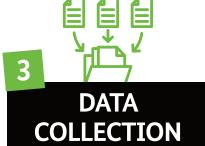

- ● The district/municipal data collection team gathers farmer and plantation information through direct farmer census or by collecting existing data from farmer groups, Forest Management Units (KPH), or BPSKL prior to the census.
- ● The team uploads all collected farmer and farm data into the e-STDB system.

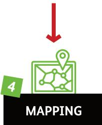

- ● The district/municipal mapping team maps the plantations and clearly identifies land boundaries using GPS or other mapping tools.
- ● The team ensures alignment of farm plots with spatial planning regulations and forest boundaries.
- ● All mapped farm plots are uploaded into the National e-STDB website.

# How to Register a Plantation through the e-STDB System

- ● The verification team, established by the District/ Municipal Government, checks the uploaded farmer, plantation, and plot data on the e-STDB system.
- ● Verification is conducted by overlaying farm maps with official forest area maps or land title maps (HGU).
- ● For plantations located in forest areas, the team also checks the legal access documents granting land use rights to farmers.
- ● If necessary, the verification team may conduct on-site visits to the farmer and plantation to validate the data and maps (On-Site Method).
- ● Alternatively, verification may be conducted through the e-STDB platform, which integrates forest area maps and land title (HGU) maps (On-Desk Method).

- ● Farmer and plot data that are considered Clean and Clear (CnC) will be processed for STDB issuance.
- ● The e-STDB is electronically signed by the Regent/ Mayor.

# Validity Period and Expiration of STDB

## VALIDITY PERIOD

The STDB is considered valid as long as:

The farmer remains actively involved in plantation activities on the registered land.

The farmer complies with existing regulations regarding land ownership, crop management, and environmental protection.

The mapped plot remains consistent with the current land use.

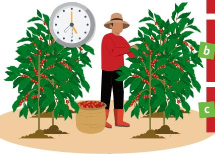

a

b

c

## EXPIRATION

The STDB may expire under the following conditions:

a Change in ownership;

b Change in crop type;

c Change in land area;

d Land destruction;

e Land is no longer used according to its designated purpose

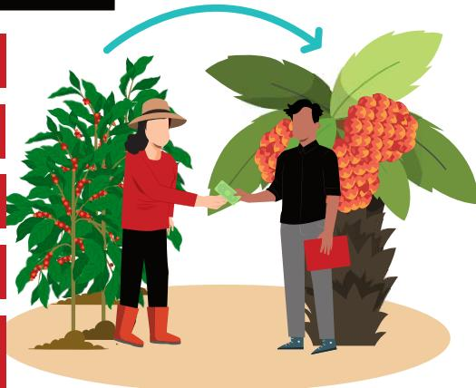

If the STDB expires, the farmer must re-register for a new STDB.

# Roles of Stakeholders

# Roles of Stakeholders

# Community Land Access

## Legally Recognized Farmers in Forest Areas

Farmers who are legally recognized in forest areas are community groups that hold forest management permits, such as Village Forests (HD), Community Forests (HKm), and other Social Forestry schemes aligned with the KHDPK framework.

## Types of Forest Areas Accessible to Farmers

| Forest Area Type       | Can Be Managed by Farmers? | Applicable Legal Schemes                                                   |
|------------------------|----------------------------|----------------------------------------------------------------------------|
| Production Forest      | Yes                        | Social Forestry (HKm, Partnerships, HTR), KHDPK, KKPP                      |
| Protection Forest      | Yes                        | Social Forestry (HKm, Partnerships, HTR), KHDPK, KKPP                      |
| Conservation Forest    | Limited (strict permits)   | Social Forestry (Partnership)                                              |
| KHDPK (Java only)      | Yes                        | Social Forestry (Forest Farmer Groups/ Village Forest Farmer Institutions) |
| Perhutani-managed area | Yes (limited) Partnership) | KKPP (Productive Farmers' Forestry)                                        |

## What is KHDPK?

KHDPK (*Kawasan Hutan dengan Pengelolaan Khusus*/Specially Managed Forest Area).

A forest area designated by the Ministry of Environment and Forestry for special management, often used by local communities through social forestry schemes or partnerships for agroforestry and sustainable utilization.

# STDB Registration Procedure for Farmers in Social Forestry Areas (KHDPK)

## Supporting Prerequisite

1. 1. Formation and official registration of a farmer group or cooperative as a legally recognized administrative unit to facilitate the registration process.

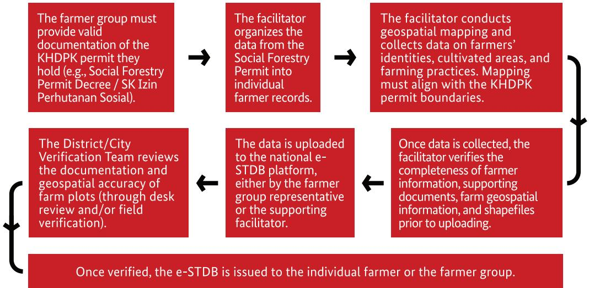

### After issuance, farmers are expected to:

1. Report the issued e-STDB to the local Agriculture Office and BPSKL
2. Notify the farmer group/cooperative management of any changes to farm or farmer information that may affect the validity of the STDB.

# Case Study: STDB Registration by Farmers in Forest Areas

## Case 1

### Data Duplication Due to Lack of Coordination Among Stakeholders

#### Issue

Stakeholders (development partners) input farmer data into the e-STDB system without coordination, resulting in frequent duplication of ID numbers (NIK). These duplications are only discovered after the data entry process is completed.

#### Solutions

- ● Before third parties (NGOs/private sector) begin collecting STDB data, they must check with the local Agriculture Office to determine whether the data is already available or registered in the intended area and identify any existing data gaps.
- ● There should be an official point of contact (PIC) or spokesperson at the district level (specifically from the Plantation Department) who serves as the central coordinator for all data inputs.
- ● Operators can directly check whether a farmer is already registered in the e-STDB platform by entering the farmer's ID number (NIK) before collecting full data.
- ● All stakeholders are required to confirm with the local PIC before inputting new data.

## Case 2

### Unclear Partnership Documents Between Farmers and Perhutani

#### Issue

Farmers or data entry operators upload farmer data located in Perhutani-managed areas without verifying the legality of the partnership (MoU or Cooperation Agreement), which may lead to data rejection due to unverified land management status.

#### Solutions

- ● Before uploading, any party registering a farmer in the STDB must verify the existence of a valid MoU or Cooperation Agreement (PKS) with Perhutani.
- ● Verifiers at the Agriculture Office must cross-check the alignment between the farm polygon and Perhutani's working area and validate the partnership status.

# Case Study: STDB Registration by Farmers in Forest Areas

## Case 3

### Inconsistencies Between Farm Polygons and Forest Area Status

#### Issue

The land polygons uploaded by farmers or mapping teams do not match the official forest area map (e.g., they may overlap with conservation areas or lie outside designated KHDPK zones).

#### Solutions

- ● The technical team at the district level must conduct manual spatial reviews for ambiguous cases.
- ● Local farmers or mapping teams should receive training in basic GPS and mapping tools from the Directorate General of Estate Crops (Ditjenbun) or development partners.
- ● As a note, the STDB cannot be issued for farmers located in protected forest areas or in forests outside the KHDPK.

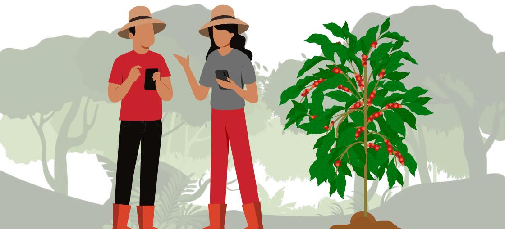

# Best Practice Recommendations

## For Farmers

- ● Ensure land legality status: Only register if already part of a legal partnership scheme (KHDPK, KKPP, or Social Forestry).
- ● Keep and prepare essential documents such as ID card (KTP), group membership proof, and MoU or partnership decree.
- ● Be active in farmer groups or partnership groups to facilitate collective registration and assistance processes.

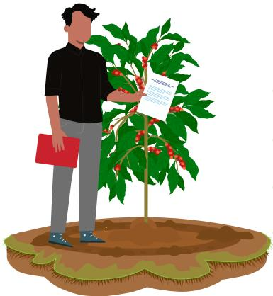

## For Buyers/Private Sector

- ● Verify farmer legality by requesting the e-STDB and proof of forest area partnership.
- ● Integrate internal traceability systems with e-STDB data.
- ● Provide support and guidance to affiliated farmers.
- ● Assist in data collection for STDB registration.

## For Agriculture Offices

- ● Provide technical training and SOPs to data collectors from development partners and farmer groups.
- ● Establish e-STDB help desks or assign dedicated PICs in areas with extensive forest zones to coordinate stakeholders.
- ● Support farmer data collection in assigned areas for STDB registration.

# Best Practice Recommendations

## For BPSKL (Forestry Authority)

- ● Synchronize data between e-STDB and KLHK systems (SIPAPS, GoKUPS, Social Forestry dashboard) to avoid overlaps.
- ● Conduct regular reviews of farmer data in forest areas and provide policy support to technical agencies.

## For Perhutani

- ● Support coordination with the Directorate General of Social Forestry in the submission of STDB applications for KHDPK land that was formerly under PHBM/Forest Partnership schemes.
- ● Facilitate communication and joint training with stakeholders (Agriculture Offices, NGOs, development partners) to minimize data conflicts.

## For NGOs and Development Partners

- ● May be involved alongside the government in providing direct assistance to farmers, including technical training on filling out and verifying the e-STDB.
- ● Mandatory coordination with the designated contact person (PIC) at the district/city level and Perhutani before conducting mass data input or collection.
- ● Assist the government in systematically archiving legal partnership documents and spatial maps to ensure that each e-STDB record has valid supporting evidence.

Q What is STDB?

STDB stands for *Surat Tanda Daftar Usaha Perkebunan untuk Budidaya* (STDB), which is a registration certificate for plantation cultivation businesses issued to independent smallholder farmers. This certificate serves as official recognition of their farming activities and plantation areas.

A

Q What is e-STDB?

e-STDB is the electronic version of the STDB, serving as an integrated platform that stores the national database of independent smallholder farmers across Indonesia.

A

Q Why is the STDB important for farmers?

The STDB provides official recognition for smallholder plantations, which is increasingly important for designing empowerment programs, accessing markets, obtaining sustainability certifications, complying with global regulations such as the EU Deforestation Regulation (EUDR), and qualifying for government support, subsidies, or agricultural financing. It also enhances traceability and transparency in the plantation sector.

A

Q Is the STDB considered a license?

No, the STDB is not a license, permit, or certification. It is a registration document that provides formal acknowledgment of plantation activities by independent farmers. While it does not legalize land ownership, it serves as an important administrative document for monitoring and policy implementation.

A

Q Which regulations mention the STDB?

The STDB is referenced in the Minister of Agriculture Regulation No. 98 of 2013 on Guidelines for Plantation Business Licensing. The registration process is further detailed in Director General of Estate Crops Decree No. 37 of 2024, updated by Decree No. 123 of 2024, which governs the issuance of STD-B through the e-STDB platform.

A

Q Who has the authority to issue the STDB?

The issuance of the STDB falls under the authority of the Regent/Mayor, and this authority may be delegated to the Head of the District/City Agriculture Office.

**Q** Who is authorized to electronically sign the STDB?

The electronic STDB may be signed by the Regent/Mayor or the Head of the District/City Agriculture Office, provided all system requirements are fulfilled.

**A**

**Q** What are the stages involved in issuing the STDB?

The process consists of the following steps: Socialization, Data Collection, Mapping, Verification, and Issuance. A detailed explanation can be found in Regulation of the Director General of Estate Crops No. 37 of 2024, available here: <https://bit.ly/SKDirjenbun37STDB>. The latest updates to this regulation are outlined in Dirjenbun Decree No. 123 of 2024.

**A**

**Q** Is it mandatory to issue STDB through the e-STDB system?

Yes. In accordance with Dirjenbun Decree No. 37 of 2024, the entire process—from data collection to issuance—must be conducted through the e-STDB information system developed by the Directorate General of Estate Crops, accessible at [stdb.ditjenbun.pertanian.go.id](https://stdb.ditjenbun.pertanian.go.id). Provisions regarding e-STDB are governed under Dirjenbun Decree No. 37 of 2024, as amended by Dirjenbun Decree No. 123 of 2024.

**A**

**Q** What data is required for the STDB?

Required data includes: farmer identity, plantation details (crop type, land area), farmer group or organization data, and plantation polygon maps. Data collection forms can be downloaded here: <https://bit.ly/SKDirjenbun37STDB>.

**A**

**Q** What are the mapping requirements for STDB?

Geospatial maps must have a minimum base scale of 1:50,000, be represented in area/polygon format, and the geospatial data must be in digital SHP file format that can be uploaded to the e-STDB system.

**A**

**Q** What are the criteria for a plantation to pass verification?

STD-B for Social Forestry Areas is considered verified if: (a) land use complies with the applicable Spatial Planning (RTRW), and (b) the farmer holds official Social Forestry management documents issued by the Ministry of Environment and Forestry.

**Q** Do district/city agricultural offices need to prepare STDB numbering?

No, STD-B numbers issued through the e-STDB platform use a national numbering system that is automatically generated by the system.

**A**

**Q** Is an electronic signature mandatory for STDB?

Yes, an Electronic Signature (e-Sign) is mandatory. If the Regent/Mayor or authorized Head of Agriculture Office does not yet have an electronic signature, a manual signature may be used as a substitute.

**A**

**Q** Can STDB expire?

Yes, STD-B can be revoked, expired, or deemed invalid under the following conditions: (a) change of land ownership, (b) change in crop type, (c) change in land area, or (d) the land is destroyed or no longer used according to its intended purpose.

**A**

**Q** How is STDB issuance funded?

STDB issuance can be funded through: (a) State Budget (APBN), (b) Regional Budget (APBD), (c) Public Service Agency (BLU) managing plantation funds, or (d) other legitimate sources in accordance with applicable regulations.

**A**

**Q** What user accounts are required on the e-STDB platform?

For district/city governments: admin account, data entry account, mapping account, verification account, and issuance account (Agriculture Office and Head of Office). For provincial governments: provincial admin account.

**A**

**Q** Who is eligible to hold an e-STDB account?

e-STDB accounts can be held by technical officers or staff of the District/City/Provincial Agriculture Offices.

**A**

**Q** Is there a user guide for e-STDB?

Yes. The user guide can be downloaded from the Downloads menu on the e-STDB website. A video tutorial is available at this link: <https://bit.ly/VideoTutorialeSTDB>.

## Q Who is eligible to register for e-STDB?

Smallholders engaged in cultivating plantation crops (such as rubber, coffee, cocoa, etc.) can register for e-STDB. Registration can be done individually or through farmer groups/cooperatives. Farmers must have control over the land (either legally or de facto) and meet the basic data and mapping requirements.

A

## Q How long does the registration process take?

The duration varies depending on the completeness of documentation and the capacity of the local government, but typically, the process from data collection to issuance takes about 2–6 weeks. Delays may occur if additional verification is needed or if mapping data is unclear.

A

## Q What happens if my application is rejected?

If the application is rejected, the reason will be provided through the e-STDB system or by local authorities. Common reasons for rejection include:

- ● The plantation is located within a forest area or outside of an authorized land-use zone.
- ● Incomplete or inconsistent data.
- ● Overlapping land claims (e.g., overlapping with an HGU or other legal tenure).

A

Farmers may correct the data and resubmit the application after addressing the issue.

## Q Can I update my e-STDB details after registration?

Yes, farmers or their representatives can request updates through the local agriculture office. Updates may include: (a) change of crop type, (b) change in plantation area size, (c) corrections to farmer identity or mapping errors. All updates must be re-verified by the local government before being uploaded into the e-STDB system. Farmers are encouraged to always update their STDB data if there are changes in ownership or land boundaries.

A

## Q How can buyers verify if a farmer holds a valid e-STDB?

Buyers can verify STD-B status by:

- ● Requesting the STD-B certificate number from the farmer and checking it with the local agriculture office.
- ● Using the verification feature available on the e-STDB platform, if access is provided by the system administrator.
- ● In the future, integration with land tenure systems is expected to streamline the verification process.

Q

What support is available for farmers facing difficulties with registration?

Several forms of support are available:

- ● Technical assistance from local agricultural extension officers or staff from the District Agriculture Office.
- ● Capacity-building programs from NGOs or donor-supported initiatives.
- ● Support from cooperatives or farmer groups, which often facilitate collective registration.
- ● User guides and video tutorials available on the e-STDB website.
- ● In some regions, mapping costs are partially or fully covered by local governments or private sector actors.

A

Q

What is the key difference between the e-STDB registration process for land in KHDPK and general land?

KHDPK (Special Management Forest Area) refers to forest land designated for social forestry under government management, often involving multi-stakeholder processes. Plantation activities in KHDPK areas must be coordinated with the Ministry of Environment and Forestry (MoEF) and typically require a social forestry permit before the STDB can be issued.

A

The main difference lies in the initial documentation required a Social Forestry Permit is mandatory under the KHDPK scheme.

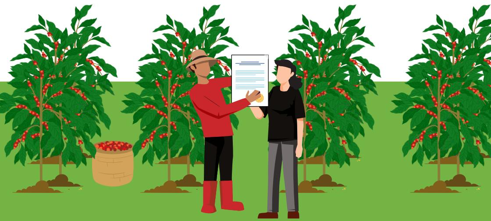

# STDB Application Form

## SURAT TANDA DAFTAR BUDIDAYA (STDB)

Nomor Urut Responden

Nama Petugas Pendataan

| A. IDENTITAS PEKEBUN                                                      |                                                                                                                                      |                                                                           |                                                          |
|---------------------------------------------------------------------------|--------------------------------------------------------------------------------------------------------------------------------------|---------------------------------------------------------------------------|----------------------------------------------------------|
| Nama                                                                      | Provinsi                                                                                                                             | Kabupaten/Kota                                                            |                                                          |
| No. KTP                                                                   |                                                                                                                                      |                                                                           |                                                          |
| Tempat tanggal lahir (dd/mm/yyyy)                                      | Kecamatan                                                                                                                            | Desa/Kelurahan                                                            |                                                          |
| Jenis kelamin (lingkari yang sesuai)                                      | Alamat Pekebun                                                                                                                       |                                                                           |                                                          |
| 1. Laki-laki 2. Perempuan                                              |                                                                                                                                      |                                                                           |                                                          |
| Pendidikan (lingkari yang sesuai)                                      | 1. Tidak Ada 2. SD/sederajat 3. SMP/sederajat                                                                                  | 4. SMA/sederajat 5. Diploma/Sarjana muda 6. D4/S1                   | 7. S2/S3                                                 |
| B. KETERANGAN KEBUN (Dapat mengisi Lebih dari 1 Kebun)                 |                                                                                                                                      |                                                                           |                                                          |
| Kebun Ke-..... (1,2,3,dst.... (jika lebih dari 1 kebun/persili))          |                                                                                                                                      |                                                                           |                                                          |
| Status lahan yang diusahakan (lingkari yang sesuai)                       |                                                                                                                                      |                                                                           |                                                          |
| 1. SHM 2. Girik/SKT/SKGR/Hak Pengelolaan 3. Tanah ulaya/adat        | 4. Pengusahaan Legal Lainnya (Sebutkan) ..... 5. Lahan Kawasan Hutan Produksi/Sosial 6. Lahan Kawasan Hutan Lindung/Konservasi |                                                                           |                                                          |
| Nomor/dokumen lahan yang diusahakan                                       | Luas lahan berdasarkan Dokumen (m2)                                                                                                  |                                                                           |                                                          |
| Pola tanam (lingkari yang sesuai)                                         | 1. Monokultur                                                                                                                        | 2. Polikultur                                                             |                                                          |
| (dilisi lebih dari 1 apabila pola tanam polikultur)                       | Komoditas Utama                                                                                                                      | Komoditas Lainnya (Jika Ada)                                           | Komoditas Lainnya (Jika Ada)                          |
| Komoditas                                                                 |                                                                                                                                      |                                                                           |                                                          |
| Luas areal tertanam (m2)                                                  |                                                                                                                                      |                                                                           |                                                          |
| Tahun tanam                                                               |                                                                                                                                      |                                                                           |                                                          |
| Tahun tanam sebelum peremajaan (jika ada peremajaan)                   |                                                                                                                                      |                                                                           |                                                          |
| Jumlah tegakan pohon                                                      |                                                                                                                                      |                                                                           |                                                          |
| Produksi per tahun (ton)                                                  |                                                                                                                                      |                                                                           |                                                          |
| Produktivitas (Ton/Ha)                                                    |                                                                                                                                      |                                                                           |                                                          |
| <b>Asal benih</b> (dilisi lebih dari 1 apabila pola tanam polikultur)  | 1. Benih bersertifikat 2. Benih tidak bersertifikat 3. Tidak Tahu                                                              | <b>Jenis lahan</b> (dilisi lebih dari 1 apabila pola tanam polikultur) | 1. Lahan Mineral 2. Lahan Basa (Pasang Surut, Gambut) |
| Jenis Pupuk                                                               | 1. Organik                                                                                                                           | 2. Non Organik                                                            | 3. Campuran                                              |
| Mitra penjualan                                                           | 1. Koperasi                                                                                                                          | 2. Perusahaan Pengolahan                                                  | 3. Lainnya, .....                                        |
| C. KETERANGAN KELEMBAGAAN TANI (Apabila tergabung dalam Kelembagaan)   |                                                                                                                                      |                                                                           |                                                          |
| Nama kelembagaan tani (dapat dilisi lebih dari 1)                         | Nomor kelompok dalam SIMLUHTAN                                                                                                       |                                                                           |                                                          |
| Komoditas kelembagaan tani (dapat dilisi lebih dari 1)                    | Alamat kelembagaan tani                                                                                                              |                                                                           |                                                          |
| D. LOKASI KEBUN (Minimal 4 (empat) titik koordinat, membentuk poliyon) |                                                                                                                                      |                                                                           |                                                          |
| Titik Koordinat                                                           | 1. (Long) ..... 2. (Long) ..... 3. (Long) ..... 4. (Long) .....                                                             | (Lat) ..... (Lat) ..... (Lat) ..... (Lat) .....                  |                                                          |

# Glossary of Terms

## e-STDB (Electronic Cultivation Registration Certificate)

A digital system developed by the Directorate General of Estate Crops (Ditjen Perkebunan) for the registration and verification of smallholder plantation activities. This system serves as an official record of land use for plantation purposes and is required for legality, traceability, and compliance.

## KHDPK (Special Management Forest Area)

A forest area designated by the Ministry of Environment and Forestry for special management, typically utilized by local communities through social forestry schemes or other partnerships for agroforestry and sustainable use.

## Agroforestry (*Wanatani*)

A land-use management system where trees or shrubs are grown around or among crops and pastureland. Agroforestry integrates agricultural and forestry technologies to create more diverse, productive, and sustainable land-use systems, especially beneficial for smallholders near forest areas.

## Forest Area (*Kawasan Hutan*)

A specific region designated and/or established by the government to be maintained permanently as forest land.

# Glossary of Terms

## RTRW (Regional Spatial Plan)

A spatial planning regulation that defines permitted land uses in a given region (e.g., residential, industrial, agricultural, conservation). Land use must align with the local RTRW to be eligible for STD-B registration.

## Social Forestry (*Perhutanan Sosial*)

A sustainable forest management system implemented within state forests or customary forests, carried out by local communities or customary law communities to improve their welfare. It includes schemes such as Village Forests, Community Forests, People's Plantation Forests, Private Forests, Customary Forests, and Forestry Partnerships.

## Farm Polygon (*Poligon Kebun*)

A digital map in shapefile format that outlines the boundaries of a farmer's cultivation area. It is required for verification in the e-STDB system to ensure that the land does not overlap with protected areas or other concessions.

# Contact List of Agencies Related to e-STDB

## Reference

- • <https://stdb.ditjenbun.pertanian.go.id>
- • Minister of Agriculture Regulation No. 98/Permentan/OT.140/9/2013 on Guidelines for Plantation Business Licensing
- • Director General of Estate Crops Decree No. 37 of 2024 on Guidelines for the Issuance of Cultivation Registration Letters (STDB)
- • Director General of Estate Crops Decree No. 123 of 2024 on Amendments to DGEC Decree No. 37 of 2024 on Guidelines for the Issuance of Cultivation Registration Letters (STDB)

All photos in this guidebook are sourced from Koltiva's documentation. Illustrations and icons were developed by Koltiva using licensed assets.