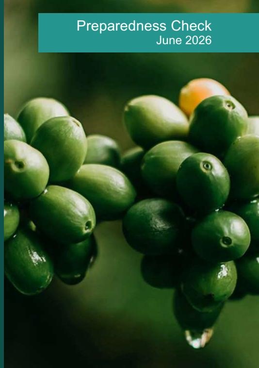

## Introduction

The EU Deforestation Regulation (EUDR) entered into force on 29 June 2023. It prohibits operators and traders from placing on the EU market, or exporting from the EU, certain commodities and derived products, including coffee, unless they are **deforestation-free**, **produced in accordance with the relevant legislation of the country of production**, and covered by a **due diligence statement** supported by traceability information (European Union, 2023). Following the amendment adopted in December 2025, the main obligations apply from **30 December 2026**, with an extended timeline for certain micro and small actors (European Union, 2025).

Coffee has strong economic and social relevance in Lao PDR, particularly in upland rural areas where it provides cash income and employment. In **2021**, coffee exports were valued at approximately **USD 89.9 million**, equivalent to about **1.5% of total national exports**, and coffee is described as the **second most important permanent crop after rubber** (Green CUP Feasibility Study, 2023). Production is predominantly smallholder-based and supports livelihoods for **nearly 100,000 people**, with the national coffee area reported to have increased from around **20,000 hectares (1990)** to **83,320 hectares (2021)** (Green CUP Feasibility Study, 2023).

Although the EU is not Lao PDR's largest destination for coffee by volume, it remains strategically important due to price premiums and demand for organic, Fairtrade, and specialty coffee. Direct exports to the EU represent around **13%** of Lao coffee exports, while **Vietnam (≈53%)** and **Thailand (≈17%)** dominate export flows, creating substantial **indirect EUDR exposure** if coffee is processed and re-exported to the EU through regional value chains (European Forest Institute [EFI], 2025a). This exposure is operationally significant because EUDR compliance obligations sit with EU operators, but

Technical facility on deforestation-free value chains

# Preparedness Check of Lao Coffee for the EU Deforestation Regulation

the practical feasibility of compliance depends heavily on the quality and accessibility of information from producing countries and first-mile supply chains (European Commission, 2025; EFI, 2025a).

This preparedness check summarises existing tools, policies, and data that can facilitate operators' due diligence in the Lao coffee sector. It focuses on **traceability**, **deforestation-free criteria**, **legality**, and **smallholder inclusion**, and proposes priority actions that are proportionate to the Lao context and current institutional capacities (European Commission, 2025; EFI, 2025a).

### 1. Traceability requirements

The EUDR requires operators to collect and retain, with supporting evidence, core information elements including:

- geolocation coordinates of all plots of land where coffee was produced (polygons for plots >4 hectares),
- date or time range of production, and
- information on the last supplier in the supply chain (European Union, 2023; European Commission, 2025).

#### **1.1 State of play**

Traceability in the Lao coffee sector remains **uneven and fragmented**, reflecting a supply chain in which a large share of coffee passes through collectors, small traders, and aggregation points before reaching processors and exporters. Traceability is generally most advanced in certified organic and Fairtrade value chains supplying premium markets, where cooperatives and exporters maintain farmer lists, internal control systems, and documentation required by certification and buyers (EFI, 2024).

Existing assessments indicate that:

- **Fewer than 10% of coffee farms** are geo-referenced;
- **Less than 5% of coffee plots** have verified geolocation data compatible with EUDR precision requirements; and
- Certified coffee represents **less than 25%** of total exports (EFI, 2024).

In many current systems, traceability links coffee to **farmer groups, villages, or cooperative structures** rather than to individual plots. This is partly driven by operational realities: coffee is often bulked at collector and cooperative levels, and first-mile recordkeeping is not standardised across provinces or value chains (EFI, 2024). Where traceability systems exist, they are frequently projectbased or exporter-specific, which reduces interoperability and makes verification more costly for operators and auditors.

Several development partner-supported initiatives, particularly those implemented by the *Agence Française de Développement (AFD)*, are piloting digital traceability approaches. For example, the Green CUP project, under the Team Europe Initiative on Sustainable Agri-Food Value Chains, is positioned to support farmer registries, QR-based approaches, and sustainability monitoring in selected provinces. However, coverage remains limited relative to the national coffee footprint and remains weakly connected to national export or customs systems (Green CUP Feasibility Study, 2023).

Indirect exports via Vietnam pose a particular challenge: once coffee crosses the border, Lao origin may be obscured through blending for both domestic consumption and re-export, increasing uncertainty and due diligence burdens for EU operators sourcing through regional supply chains (EFI, 2025a).

#### **1.2 Remaining challenges**

#### **Remaining challenges**

- Limited plot-level geolocation constrains the ability of operators to meet EUDR information requirements, especially where coffee is bulked and where farmer registries are incomplete.
- Data are dispersed across projects, exporters, cooperatives, and service providers, with little harmonisation and limited mechanisms for reconciliation or version control.
- Data governance remains unclear: responsibilities for validation, correction, and long-term maintenance are not consistently defined, which risks degradation of dataset quality over time.

#### **Priority recommendations**

- Publish a national "**EUDR-ready dataset specification**" for coffee, defining minimum fields, coordinate formats, acceptable precision thresholds, and update frequency, aligned with EUDR guidance on evidence quality.
- Establish a mechanism to **aggregate and harmonise existing geolocation datasets**, clarify data ownership, and focus new mapping on priority unmapped areas.
- Pilot a pragmatic approach for bulking contexts that links shipments to the **set of plots supplying a defined aggregation unit** for a defined time range, supported by periodic verification and documented controls.
- Explore a national coffee **dashboard** to increase transparency and reduce transaction costs for operators, while applying safeguards for data protection and commercial confidentiality.

### 2. Deforestation-free criteria

The EUDR requires operators to collect adequately conclusive and verifiable information that coffee is deforestation-free. Coffee produced on land converted from forest after 31 December 2020 is not compliant. The EUDR forest definition follows an FAO-aligned approach (European Union, 2023; European Commission, 2025).

#### **2.1 State of play**

Lao PDR has a technically robust **National Forest Monitoring System (NFMS)** developed primarily for REDD+ measurement, reporting, and verification and for national land-use planning. National forest maps are available for **2019 and 2022**, and forest change is monitored using remote sensing complemented by field-based approaches (Department of Forestry, field note from 2025 mission). These national systems provide valuable context for national policy dialogue and emissions reporting, and they can support a broader understanding of land-use trends in coffee landscapes.

However, the NFMS is not designed for **parcel-level compliance verification** and cannot substitute EU reference datasets used by operators for EUDR due diligence. A core constraint is the inability to produce a legally equivalent baseline for **31 December 2020**, because existing national map products are not intended for plot-level compliance use and are produced at different dates and for different objectives.

A key structural risk arises from differences in forest definitions. Lao classification applies a **20% canopy cover threshold** and includes plantations and some agroforestry systems as forest, while the EUDR applies a **10% canopy threshold** and excludes agricultural tree crops, including coffee (EFI, 2025b). This misalignment matters in coffee landscapes where shaded coffee and agroforestry are common, and where new plantings in some upland areas after 2020 may be flagged by global datasets depending on classification outcomes (EFI, 2025b).

#### **2.2 Remaining challenges**

#### **Remaining challenges**

- Operators can face uncertainty when reconciling national forest information with EU reference datasets and when determining what additional verification steps are necessary in agroforestry contexts (European Commission, 2025).
- Agroforestry and shaded coffee systems may be misclassified under global datasets if plot-level evidence and contextual verification are missing.
- Forest and land-use information is not always packaged in a way that is easily interpretable and usable for operators' due diligence workflows.

#### **Priority recommendations**

- Establish a standard **plot-level deforestation screening protocol** for coffee, using EU reference datasets as the baseline and national data for contextual understanding and targeted verification planning (European Commission, 2025).
- Document assumptions, metadata, validation steps, and update cycles to ensure auditability and repeatability.
- Maintain structured technical dialogue with EU services to clarify interpretive issues related to agroforestry and shaded coffee systems and to reduce unnecessary compliance friction.
- Where feasible, improve controlled access to forest and land-use information (including explanatory metadata) to support due diligence and checks by competent authorities (European Commission, 2025).

### 3. Legality criteria

The EUDR requires operators to demonstrate that coffee was produced in accordance with the **relevant legislation of the country of production**, including land-use rights, environmental protection, labour rights, and other applicable laws (European Union, 2023; European Commission, 2025).

#### **3.1 State of play**

Land tenure is one of the most important legality bottlenecks for Lao coffee. National estimates indicate that **less than 10%** of agricultural land is formally titled, and **under 5%** of coffee plots have land documentation with geolocation compatible with EUDR requirements (EFI, 2025a). While multiple **legal instruments exist (titles and certificates)**, older documents often lack geospatial coordinates and remain paper-based, complicating evidence provision for operators (EFI, 2025b).

Resurveying plots to add geolocation is technically feasible and can be processed within about a week in principle, but costs remain a constraint for smallholders. Indicative costs are cited at **USD 40–50 per hectare** (Nguon, 2025). Unlike the timber sector, the coffee sector does not yet have a consolidated legality assurance framework or widely used legality matrix that operators can draw upon, which increases private sector due diligence costs and uncertainty.

To align with Article 2(40) of the Regulation, legality considerations are summarised below by key domains.

#### **Land-use rights**

Land is constitutionally owned by the State, while individuals and legal entities may hold legally recognised **land-use rights**. Coffee production occurs across a mix of titled agricultural land, agricultural land without formal title, and in some cases forestland allocated for temporary agricultural use (EFI, 2025b). Relevant documentation includes land titles, agricultural land-use certificates, temporary use certificates in forestland, and compliance certificates confirming non-overlap with protected or restricted areas (EFI, 2025b). The main issue is that documentation is often incomplete or not geo-referenced, creating higher transaction costs and raising the risk of exclusion of smallholders from EU-facing chains.

#### **Forest conversion**

Forest conversion is regulated under the Forestry Law and related decrees, and formal approval and land reclassification are required for conversion of forestland to agriculture. Coffee expansion has occurred both on legally converted agricultural land and on land that remains classified as forest under national definitions, especially in agroforestry contexts (EFI, 2025b). Because the EUDR adds a strict cut-off date and a different forest definition, legal conversion under Lao law does not automatically imply EUDR compliance. Plot-level verification and consistent screening processes therefore become central to legality-risk management (European Union, 2023; EFI, 2025b).

#### **Environmental protection**

Environmental protection relevant to coffee is governed by the Environmental Protection Law, Forestry Law, and sector regulations. Smallholder coffee production often falls below thresholds that trigger formal EIA processes, meaning compliance is typically evidenced through local land-use rules and good agricultural practices rather than plot-level permits (EFI, 2025b). Limited inspection capacity and diffuse legal requirements can make it difficult to document compliance, reinforcing the importance of structured evidence collection through traceability systems and supplier declarations (EFI, 2025b).

#### **Third-party rights**

Third-party rights risks relate to customary land-use practices, overlapping claims, and community access rights, especially in upland and forest-adjacent areas. Dispute resolution mechanisms exist but documentation is often informal and not systematically recorded, which can complicate due diligence in areas where tenure is unclear or contested (EFI, 2025b). Even where conflict levels are low, the absence of documented checks can represent a residual legality risk for operators.

#### **Labour rights**

Coffee production is predominantly family-based, with limited hired labour outside peak harvest periods. The Labour Law prohibits forced labour and child labour and establishes minimum standards, but enforcement capacity is limited in remote areas. For EUDR due diligence, labour compliance will often rely on contextual risk assessment, supplier declarations, and cooperative controls rather than formal farm-level records (EFI, 2025b).

#### **Human rights**

Human rights protections relevant to coffee production are embedded in constitutional and sector laws. The legality assessment does not report systematic human rights violations specific to coffee production but notes broader challenges in documentation and local grievance mechanisms. Operators may therefore need to incorporate proportionate human rights risk considerations into due diligence, particularly where land tenure is unclear (EFI, 2025b).

#### **Free Prior and Informed Consent**

Free Prior and Informed Consent (FPIC) is primarily formalised in the context of large-scale investments and concessions. Smallholder coffee production typically does not trigger formal FPIC procedures, although village-level consultation may occur for land allocation decisions. Documentation is inconsistent, meaning risks are generally low but evidence is often indirect (EFI, 2025b).

#### **Tax, anti-corruption trade and customs**

Coffee exports are subject to trade, customs, and tax rules. Informal cross-border trade, particularly via Vietnam, can bypass formal channels and weaken legality assurance and traceability. For operators, informal flows represent a material risk because they can obscure origin, legality evidence, and chain-of-custody documentation (EFI, 2025b).

#### **3.1 Remaining challenges**

#### **Remaining challenges**

- Fragmented land documentation systems and limited georeferenced records.
- High transaction costs for smallholders to update documentation and add geolocation.
- Lack of clear coffee-specific guidance on acceptable legality evidence for due diligence.

#### **Priority recommendations**

- Develop a coffee-specific legality matrix aligned with EUDR Article 2(40), identifying relevant laws and acceptable evidence types for each legality domain (European Union, 2023).
- Pilot subsidised re-surveying and digitisation of coffee plots in EU-facing supply chains, linked to traceability systems.
- Integrate legality documentation into extension services, cooperative support, and donor programmes to avoid shifting burdens onto farmers at the point of sale.
- Promote multi-stakeholder dialogue to improve clarity and usability of legality guidance for the private sector.

## 4. Smallholder inclusion

Smallholders dominate coffee production in Lao PDR and are central to both value chain performance and EUDR risk management.

#### **4.1 State of play**

Most coffee is produced by smallholders cultivating plots typically ranging from **0.5 to 3.5 hectares**. Cooperatives and farmer groups play an important role in linking producers to markets, especially for certified coffee, but coverage remains limited relative to the total producer base (EFI, 2025a). Smallholders face constraints related to limited access to land documentation, limited capacity to collect and manage geolocation data, and limited familiarity with EUDR requirements among farmers and first-mile actors (EFI, 2024; EFI, 2025a). These constraints are more pronounced in emerging northern coffee areas, where institutional support and cooperative services tend to be weaker.

#### **4.2 Remaining challenges and recommendations**

#### **Remaining challenges**

- Risk of exclusion from EU-facing chains if compliance costs are not socialised or supported.
- Uneven cooperative capacity and governance for recordkeeping and compliance checks.
- Limited extension services in remote areas.

#### **Priority recommendations**

- Define a low-cost group-based compliance pathway, using cooperatives and first-mile actors as aggregation points for geolocation, legality evidence, and periodic verification.
- Prioritise support to collectors, cooperatives, and processors where traceability failures commonly occur.
- Scale awareness-raising and training on EUDR requirements, integrated with good agricultural practices and legality documentation (European Commission, 2025).
- Track inclusion outcomes (including participation of remote communities) alongside technical compliance indicators, consistent with inclusive value chain objectives (Green CUP Feasibility Study, 2023).

### 5. Conclusion

This preparedness check provides an overview of the state of play of the Lao coffee value chain regarding traceability, deforestation-free production, legality, and smallholder inclusion. While significant challenges remain, Lao PDR has ongoing initiatives and a strategic opportunity to use EUDR preparedness as a lever to improve data quality, supply chain transparency, and sustainability. In practical terms, the most effective pathway is likely to be commodity-specific and implementationfocused: scaling plot geolocation, operationalising deforestation screening protocols, strengthening legality evidence for land-use rights, and reducing compliance burdens for smallholders through groupbased approaches and targeted support (European Commission, 2025).

## Annex 1: Summary of priority actions for Lao coffee sector for EUDR preparedness

Opportunities to improve the enabling environment for EUDR compliance in Lao coffee sector are rooted in four areas: (1) limited plot geolocation and fragmented traceability data, (2) definitional and technical misalignment between Lao forest monitoring systems and EUDR requirements, (3) landtenure documentation gaps and unclear legality pathways for production in forestland categories, and (4) risks of smallholder exclusion if compliance is not organised through first-mile actors and cooperative systems.

The following table focuses on actions that would directly reduce operators' due diligence burden while keeping pathways open for smallholders in the Lao coffee sector.

#### **Annex 1. Summary of priority actions for Lao coffee sector for EUDR preparedness**

|                               | Opportunity                                                                                                                                                                                                                                                                                                                                                                                                                  |
|-------------------------------|------------------------------------------------------------------------------------------------------------------------------------------------------------------------------------------------------------------------------------------------------------------------------------------------------------------------------------------------------------------------------------------------------------------------------|
| N. Recommended actions        | Timing                                                                                                                                                                                                                                                                                                                                                                                                                       |
|                               | Lead Objective Rationale linked to findings pathway                                                                                                                                                                                                                                                                                                                                                                          |
| Adopt and publish a exporters | national “EUDR Traceability remains uneven; fewer ready coffee dataset specification” (minimum fields, formats, QA rules) for Short Bridging data MAE (with To enable geolocation and supplier registries, term gaps MoIC) coordinates suited to EUDR usable by projects, cooperatives, and expectations; certified chains are                                                                                              |
| Establish a                   | coordination mechanism Lao Coffee Responsibilities are fragmented (technical working group) to Board across agencies; coordination is Short Bridging data harmonise and reconcile existing (convening), To enable repeatedly identified as necessary                                                                                                                                                                         |
| geolocation datasets          | (projects, term gaps for practical alignment and reduced exporters, cooperatives), and refocus MAE/ DLAM duplication. new mapping on unmapped areas Scale practical plot mapping by using                                                                                                                                                                                                                                    |
| first-mile actors             | (collectors, MAE Local intermediaries remain cooperative agents) as the backbone: provincial essential but informal; if equipped, Short Smallholder equip with simple digital tools, services plus To engage they can transmit supply chain data term inclusion training, and incentives, and integrate cooperatives/ and link farm-level information to their role into traceability design exporters export documentation. |
| Expand and align ongoing      | digital Short Harnessing Exporters/ Existing trials cover ~8,000 ha in To enable                                                                                                                                                                                                                                                                                                                                             |
| traceability trials           | (buyer and donor co term existing data cooperatives Champasak and Xekong through EU                                                                                                                                                                                                                                                                                                                                         |

|              | funded) so outputs meet the national with MAE buyer collaboration; several firms dataset specification and can be support are already aligning business interoperable across value chains models to traceability requirements.                                                                                         |
|--------------|------------------------------------------------------------------------------------------------------------------------------------------------------------------------------------------------------------------------------------------------------------------------------------------------------------------------|
| Develop a    | standard plot-level Lao forest monitoring is technically deforestation screening protocol for robust for MRV, but not designed                                                                                                                                                                                         |
| coffee       | that explicitly uses EU reference Short Building for parcel-level EUDR checks;                                                                                                                                                                                                                                         |
|              | DoF (MAE) To inform datasets for the 31 Dec 2020 cut-off, national maps (2019/2022) cannot term credibility while documenting how NFMS outputs be interpolated into an EU can be used for context (not equivalent 2020 baseline. compliance substitution) Improve operator usability by Misalignment is operationally |
| publishing   | clear guidance notes on forest-definition mismatch (canopy Short Building threshold and includes plantations;                                                                                                                                                                                                          |
|              | MAE/DoF To inform thresholds, plantation/ agroforestry term credibility treatment) and implications for shaded threshold and excludes agricultural coffee systems tree crops/plantations.                                                                                                                              |
| Accelerate   | agricultural land registered/titled; legality study                                                                                                                                                                                                                                                                    |
| registration | and prioritise coffee Medium Legality and recommends accelerating                                                                                                                                                                                                                                                      |
|              | DLAM/ MAE To enable supply areas linked to EU markets; pair term fragmentation registration (noting PMO 20/2024) with a practical digitisation pathway and focusing on EU-exporting for legacy documents producers first.                                                                                              |

| Create an                           | inter-ministerial working       |
|-------------------------------------|---------------------------------|
| committee                           | to clarify legality and         |
| areas                               | inside state forestland         |
| categories                          | , including mapping,            |
| Produce a                           | coffee-specific legality        |
| matrix                              | aligned with EUDR Article 2(40) |
| Develop a proportionate             | group-based                     |
| compliance pathway for smallholders | :                               |
| Run a                               | trial “due diligence package”   |
| exercise                            | on a small number of EU        |

| 12 | Reduce traceability and legality risks from informal flows by strengthening <b>formal export documentation pathways</b> for coffee that may be re-exported via neighbours | Medium term | Building credibility | MoIC, Customs and private sector | To enable | Vietnam and Thailand (recently China) take large shares of Lao exports; re-export can mask Lao provenance, increasing downstream EUDR exposure and due diligence complexity. |
|----|---------------------------------------------------------------------------------------------------------------------------------------------------------------------------|-------------|----------------------|----------------------------------|-----------|------------------------------------------------------------------------------------------------------------------------------------------------------------------------------|
|----|---------------------------------------------------------------------------------------------------------------------------------------------------------------------------|-------------|----------------------|----------------------------------|-----------|------------------------------------------------------------------------------------------------------------------------------------------------------------------------------|

### References

European Commission. (2025). Guidance document for Regulation (EU) 2023/1115 on deforestationfree products (Commission Notice C/2025/4524). Official Journal of the European Union.

European Forest Institute. (2024). Study on available traceability systems and tools in the Lao context.

European Forest Institute. (2025a). Assessing EUDR readiness and impacts in the Lao coffee sector.

European Forest Institute. (2025b). EUDR legality study in Lao PDR.

Green CUP Feasibility Study. (2023). GreenCup feasibility study final report (avec logos AFD et MAF).

Nguon, P. (2025). Back to Office Report: Lao PDR, 09 to 17 December 2025.

European Union. (2023). Regulation (EU) 2023/1115 of the European Parliament and of the Council of 31 May 2023 on deforestation-free products. Official Journal of the European Union.

European Union. (2025). Regulation (EU) 2025/2650 of the European Parliament and of the Council of 19 December 2025 amending Regulation (EU) 2023/1115. Official Journal of the European Union.

**Disclaimer.** This briefing has been produced by the European Forest Institute. Its content does not reflect the official opinion of funding organisations. Responsibility for the information therein lies entirely with the authors.