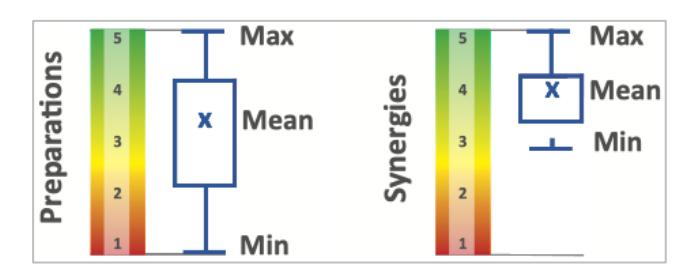

**Contact**  1Th¸nen Institute of Forestry **[richard.fischer@thuenen.de](mailto:richard.fischer@thuenen.de)**

**Run time**  01.2025-12.2027 **Project-ID**  2831

[The s](https://www.thuenen.de/en/institutes/forestry/projects-1/eudr-effects)urvey has been carried out in the context of the [EUDR Effects Project.](https://www.thuenen.de/en/institutes/forestry/projects-1/eudr-effects) The survey data and more results are available on the project web page.

# **Strengthening national policy instruments: early effects of EUDR preparation in the Global South?**

**Richard Fischer1 , Caroline Salom"o1 , Sven G¸nter1**

- **Stakeholders report that platforms which are now created to support EUDR due diligence statements are in synergy with national policy instruments and support their further development.**
- **Unintended leakage may occur on one side, but increasing sustainability requirements of other countries are expected as well.**

#### **Background**

From 2026 onwards, companies will have to ensure that under the Deforestation-Free Products Regulation (EUDR), commodities such as soy, beef, rubber, palm oil, coffee, cocoa, and timber and products derived from these raw materials, are not linked to deforestation, if they are to be placed on the EUmarket. But amendments or even a postponement of the new regulation are under debate, as are possible effects on global markets and other countries. On the sidelines of the World Climate Conference in Brazil (COP30) in November 2025, Governments, NGOs and producers from 16 Global South countries and the EU gathered at the Altamira Summit, a global learning event under the Team Europe Initiative on Deforestation-Free Value Chains. They took stock of progress towards deforestation-free production and EUDR compliance. 52 participants replied to a related inquiry.

### **Results**

Preparations for EUDR vary largely in the surveyed countries. Some countries, producing considerable volume of relevant commodities for the EU-market, report to have necessary preparations advanced or even complete, others are certainly not yet prepared (Fig. 1, left). In addition to geolocation and traceability systems, EUDR requirements include production in accordance with the relevant legislation. Many countries are now creating new platforms and infrastructure that support operators to submit the necessary due diligence statements. In many cases these build on existing national policy instruments and information systems. Synergies with these systems (Fig. 1, right) can support their development and further implementation of national policy instruments as a basis for sustainable land use.

Given the fact that the regulation is not yet in application, direct effects on deforestation or degradation cannot be determined, but inquiries are a basis to estimate expectations. Half of the participants in the study group expect positive effects on reduced deforestation in their countries; a quarter was not decided and a quarter expects none. Inclusion of smallholders is expected to remain a challenge. In addition, clear risk that exports will be shifted to countries with lower environmental standards are expected. Yet, there are indications that these countries will to certain extents follow the example of the EU by increasing their standards as well.

#### **Conclusions**

Direct effects of the EUDR are still under partly controversial debate and will probably continue to be as long as the regulation is not applied and no real trade-offs can be experienced. Yet, the preparations in the producing countries of the Global South make use of national policy instruments which strengthens their relevance and importance. These are also delicate but positive signals for enabling conditions for sustainable development and green growth beyond EUDR.

**Figure 1:** Preparations to cope with EUDR requirements (left) and synergies of due diligence support systems with existing national policy instruments (right) on a scale from 1 (not existing) to 5 (high). Preparations for EUDR vary largely in the surveyed countries. Most participants report synergies with existing policy instruments (Source: own analyses based on responses from 16 Global South countries).