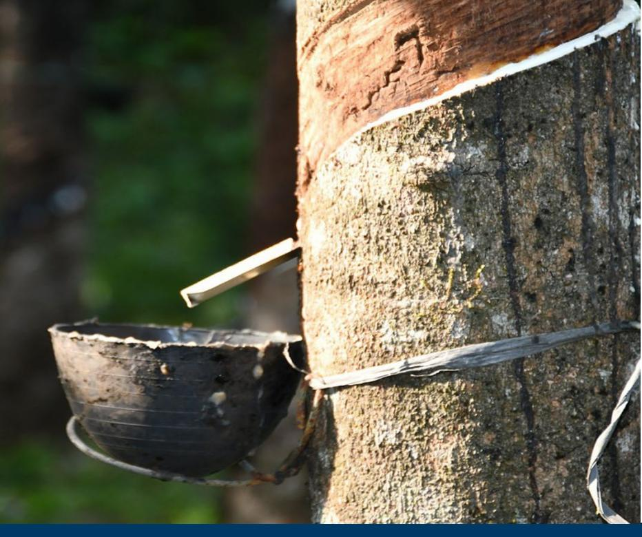
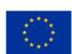

## Deforestation-free value chains

# **Preparedness check of Sri Lanka for the EU Deforestation Regulation**

The European Union's (EU) regulation requiring deforestation-free and legal production (EUDR) of cattle, cocoa, coffee, palm oil, rubber, soya, wood, and 'relevant products' came into force on 29 June 2023. It requires operators to exercise due diligence to demonstrate that relevant commodities have been produced without causing deforestation or forest degradation, and in accordance with the relevant legislation in the area of production, before they can be placed on, or exported from, the EU market.

Under the current arrangements, large companies that import relevant commodities and products into the EU will be obliged to comply with the EUDR's requirements from 30 December 2025 onwards, while micro- small- and medium-sized enterprises will be obliged to do so by June 30 2026[1](#page-0-0) .

The purpose of the EUDR is to contribute to the global fight against deforestation and forest degradation. However, as the EU acknowledges, the approach under the EUDR is not without risks and has the potential to adversely affect some of the more vulnerable

# *Preparedness Check*

*1 It should be noted that at the time of publication, there were ongoing discussions about possible delays and amendments to the EUDR with the European Commission, Parliament, and Council.*

stakeholders involved in the production of the relevant commodities and products, notably smallholders.

In 2024, Sri Lanka exported EUR 312 million of natural rubber (NR) and manufactured rubber goods (MRGs) to the EU, representing approximately 35% of its rubber-related exports that year. And from 2014 to 2023, the EU annually absorbed 31-36% of Sri Lankan NR and MRG exports, making it an important end market. The EUDR could therefore have a significant adverse impact on the rubber industry in Sri Lanka, if the necessary information needed to conduct due diligence is not accessible to operators.

According to large manufacturers of MRGs, Regional Plantation Companies (RPCs), and feedback provided by the rubber sector to the Sri Lankan Export Development Board, approximately 90% of all MRGs and NR bound for the EU has the necessary documentation to demonstrate deforestation-free and legal production. However, this does not mean that the same proportion of Sri Lankan rubber production is covered.

This is because as well as buying from domestic producers, large manufacturers and traders import large quantities of rubber. In 2023, they imported more than 37,000 tonnes, or approximately 57% of Sri Lankan domestic rubber production – a relatively low amount, historically. One of the key concerns is that large manufacturers and traders will try to rely on imports, rubber produced by RPCs – nearly all of which can be shown to be deforestation-free and legal – and a small number of smallholders directly tied to their value chains.

Without support, the majority of smallholder rubber producers will have to fend for themselves, which could lead to them being locked out of the EU market and the opportunities it provides. The Rubber Research Institute of Sri Lanka (RRISL) estimates that smallholders manage nearly 50,000 hectares of rubber plantations, with holdings ranging from 0.5 to <4 hectares, which means the negative impact on smallholder households could be significant.

**This preparedness check provides an overview of existing policies, tools, and data in Sri Lanka that could support operators' EUDR due diligence efforts; and identifies the outstanding challenges to providing the information needed to confirm deforestation-free and legal production**. It should be noted that while only operators have a legal obligation to comply with the EUDR, national authorities have an opportunity to facilitate the conduct of due diligence by making relevant information available.

### **1. Traceability requirements**

The EUDR requires that operators collect the following information, accompanied by evidence: the geolocation coordinates of all plots of land where commodities and products were produced (Art. 9(1.d)) – for plots > 4 hectares, GPS polygons are required (Art. 2(28)); the date or time range of production (Art. 9 (1.d)); and last supplier information (Art. 9 (1.e)).

### **1.1 State of play**

As an arm of the Ministry of Plantations and Community Infrastructure (MPCI), the Rubber Development Department (RDD) oversees the rubber sector in Sri Lanka. Under the Replanting Act No. 36 of 1953 (as amended) and the Rubber Control Act No. 11 of 1956 (as amended), the RDD has authority over the registration of rubber lands and their owners through regional offices, and the issuance of licences for growing, dealing, manufacturing, and exporting rubber. The RDD also maintains the Rubber Information Management System (RIMS), which contains individuals' information covering registration, land ownership, license issuance, and the provision of planting materials, fertilisers, and subsidies. RIMS also contains information on the extent of land under cultivation, production volumes, local consumption, and export figures.

### **Geolocation**

There is currently no fully operational system that captures the geolocation coordinates of all plots of land on which rubber is being produced. However, at the end of August 2025 the Cabinet of Ministers approved a proposal presented by the Minister of MPCI to implement a project for the creation of a digital system for mapping and registering rubber lands[2](#page-2-0) . The RDD and Survey Department of Sri Lanka (SDSL) are now developing a system which will capture the geolocation (polygons) of rubber-producing lands held by smallholders. The SDSL is prioritising smallholder producers who have clear legal titles, based upon cadastral information. Individual plots are being identified and drawn on the digital map contained in the Integrated Land Administration System (ILAS), maintained by the SDSL. Both SDSL and RDD staff are involved in identifying plots of land used to produce rubber, through a hybrid process involving community consultations and, where necessary, ground truthing (manual collection of coordinates).

Support in the field is being provided by Rubber Development Officers, who are effectively RDD extension service providers. The intention is for individual plots of land to be linked to producers using the producers' RDD registration number. Producers will be issued with QR

*2* The Island. (2025, August 12). Cabinet approves the creation of a digital system for mapping/registering rubber lands. <https://island.lk/cabinet-approves-the-creation-of-a-digital-system-for-mapping-registering-rubber-lands/>

codes, linked to their RDD registration numbers, which they will be able to use when selling their rubber to dealers. SDSL state that producers' plot information will also be available through a publicly accessible dashboard, where operators will be able to download polygons of the plots of land in GeoJSON format.

RPCs – the large commercial plantations that lease state lands – claim to already have the necessary geolocation information, as they are required to collect this for the development of their legally mandated management plans.

#### **Traceability**

As part of its licensing authority, RDD oversees a statutorily required record-keeping system. Once licensed by RDD, rubber dealers are required to collect information about the identity of the producers they buy from, as well as the quantity and type of rubber purchased. Dealers are also required to record the same information regarding to whom they sell, including to other dealers. This means that it should always be possible to trace the rubber back, step by step, to the rubber producer – assuming records are accurately maintained. Dealers are supposed to forward their monthly records to RDD, so that production volumes and trends can be monitored. This system is currently paper-based, but it clearly provides a strong foundation for traceability, since it is well-established and understood by all actors in the Sri Lankan rubber value chain. Additionally, exporters of NR and MRGs must obtain relevant export licenses from RDD and must report the quantity of natural rubber contained in the MRGs they export on a monthly basis.

### **1.2 Remaining challenges**

- **RDD's paper-based system record-keeping system needs to be upgraded.** RDD's one-step-back traceability system is simple, well-established, and all the actors in the value chain know how it works and what they are expected to do. However, because it is paper-based, it relies on manual verification and recording of information. For the first dealer in the chain, this may not be a problem, if they only buy from a relatively small number of producers. But as larger dealers buy from smaller dealers and aggregate, a paper-based system becomes inefficient and open to error, and possibly abuse. Consider, under the EUDR, a manufacturer will need to declare all plots of land used to produce rubber used in the manufacture of a container full of tyres destined for the EU, which will likely amount to thousands of plots. Relying on a manual, paper-based system to facilitate this transfer of information is not feasible.

- **Although RDD has a clear vision to give producers their own geolocation information through a QR code and has expressed its intention to develop a digital traceability system, there is no clear vision regarding how the system will function.** RDD needs to elucidate how producers will receive their QR code and what information it will contain (e.g. producer ID, geolocation of plot of land); and how dealers will be able to receive this information and what they must do with it, as well as what they must transfer to manufacturers. The current paper-based system establishes a strong conceptual foundation on which to build such a system, as it requires dealers to record producers' RDD registration numbers and the volumes of rubber purchased from them. In addition to considering how the system will function, RDD will need to think about the hardware and software that producers and dealers will need to use, and associated costs.
- **Relatedly, the geolocation and traceability system envisioned by RDD does not consider the need to verify deforestation-free and legal production of rubber before it can be introduced into the value chain.** RDD intends to develop a simple and effective traceability system. However, it seems to assume that all rubber is, or will be, deforestation free and legal. It is true that rubber will largely be de facto deforestation free in Sri Lanka, given that most rubber plantations were established well before the EUDR cut-off date of 31 December 2020. But if this cannot be demonstrated and the relevant information transferred, operators will not be able to accept the rubber for EU supply chains. The system therefore needs to consider how deforestation-free and legal production will be established before producers sell their rubber to dealers. Additionally, the system will need to account for the possibility that some producers will not be able to demonstrate that their rubber is deforestation free and legal, which means that dealers will need to be able identify these producers and segregate their rubber. If such a mechanism is not in place, the risk of mixing deforestation-free and legal rubber with rubber from unknown or unverified sources will be high. And it should be remembered that including rubber from a single problematic plot will cause an entire shipment to be considered noncompliant under the EUDR.

## **2. Deforestation-free criteria**

The EUDR requires that operators collect adequately conclusive and verifiable information that relevant products are deforestation free (Art. 2(13) and 9 (1.g)). Rubber produced on lands converted from forests after 31 December 2020 will not be considered deforestation free and will not comply with EU requirements. 'Forests' are defined according to the United Nations Food and Agriculture Organization (FAO) definition (Art. 2(4))3.

### **2.1 State of play**

#### **Definition of 'forest'**

In Sri Lanka, the legal definition and classification of 'forest' are governed by the Forest Conservation Ordinance, originally enacted as Ordinance No. 16 of 1907 and subsequently amended, most notably by Act No. 65 of 2009. This Ordinance is the principal legal instrument for forest governance in the country. 'Forest' is defined functionally and administratively through the classification of land and the powers of the forest authorities. The key classifications include reserved forest, conservation forests, village forests and other forests, if they do not fit into the preceding three.

However, for international reporting, Sri Lanka uses the United Nations Food and Agriculture Organization (FAO) definition of forest: land spanning more than 0.5 hectares, with trees higher than 5 meters, a canopy cover of more than 10%, or trees able to reach these thresholds in situ, excluding land predominantly under agricultural or urban use. This was used in Sri Lanka's 2017 Forst Reference Level (FRL) submission to the United Nations Framework Convention on Climate Change (UNFCCC) and its Forest Resources Assessment (FRA) 2020 country report to the FAO.

### **Definition of 'deforestation'**

Sri Lanka does not currently have a specific legal definition of 'deforestation' codified in its primary forest legislation, such as the Forest Conservation Ordinance (No. 16 of 1907, as amended). Instead, deforestation is addressed implicitly through the regulation of prohibited activities in various forest categories and through environmental law enforcement mechanisms. In international reporting (e.g. to the UNFCCC or FRA), Sri Lanka has adopted the IPCC definition of deforestation: "The conversion of forest to other land use or the long-term reduction of tree canopy cover below the minimum threshold (typically 10%)."

### **Deforestation data**

According to the 2020 FRA, at the time of reporting Sri Lanka had 2.113 million hectares of forest – approximately 30% of land cover – under the FAO definition[3](#page-5-0) . According to the FRA, the area of naturally regenerating forest declined by 0.18% between 2010 and 2020, while the area of planted forest, which includes rubber plantations, increased by 1.96% during the same period. This could indicate that planted forests are displacing natural forests, though

*3 Food and Agriculture Organization of the United Nations (2020). Global Forest Resources Assessment 2020: Main report. FAO. [https://www.fao.org/forest-resources-assessment/past-assessments/fra-](https://www.fao.org/forest-resources-assessment/past-assessments/fra-2020)*

the FRA does not make this connection, as more information and analysis would be required.

In contrast, Global Forest Watch (GFW) estimates that Sri Lanka had 3.28 million hectares of natural forest in 2020, extending over 50% of its land area – or 4.19 million hectares of tree cover, including all tree cover types, over 63.6% of its land[4](#page-6-0) . According to GFW, from 2021 to 2024 Sri Lanka lost approximately45,000 hectares of tree cover, equivalent to 1.1% of the 2000 tree cover area. Of that, 97% (approximately 44,000 hectares) of tree cover loss occurred within natural forest, while 2.4% (approximately 1,000 hectares) occurred within humid primary forest. The main causes of tree cover loss and deforestation in this period were fires, infrastructure, expansion of agriculture – especially for subsistence farming and commercial crops like tea, rubber and coconut – and illegal logging.

In the past, rubber production contributed significantly to tree cover loss and deforestation in Sri Lanka, particularly through the expansion of plantations into forested areas. Between 2006 and 2016, approximately 196 km² of forest – including parts of protected areas – were converted into rubber plantations, especially in southeastern Sri Lanka[5](#page-6-1) .

Looking at more recent data, between January 2021 and December 2024, rubber production appears to have contributed to tree cover loss in Sri Lanka primarily through the expansion of plantations into forested and marginal lands, especially in districts like Monaragala and Ampara. While GFW does not isolate rubber as a dominant driver in its dashboard, some studies show that small- and medium-scale rubber farmers have increasingly cultivated rubber in non-traditional dry zone areas, which often replaces natural vegetation[6](#page-6-2) .

However, these findings need to be considered in the context of the overall decline in rubber production and the lack of incentives for rubber farmers to maintain or re-establish their plantations. Based on recent production data and the socio-economic dynamics at play in the rubber sector, rubber-related deforestation in Sri Lanka is likely minimal. This is also the view of the Sri Lankan Forest Department, which sees other agricultural commodities, especially tea, as more significant drivers of deforestation.

*4 Global Forest Watch. (n.d.). Sri Lanka country dashboard. World Resources Institute.* 

*<https://www.globalforestwatch.org/dashboards/country/LKA> 5 Cho, K., Goldstein, B., Gounaridis, D., & Newell, J. P (2022). Hidden risks of deforestation in global value chains: A study of natural rubber flows from Sri Lanka to the United States. Journal of Cleaner Production, 349, 131275.<https://doi.org/10.1016/j.jclepro.2022.131275>*

*6 Siriwardena, B. P., Samarasinghe, W. M. D. M., Vidanapathirana, N. P., & Ketipearachchi, K. G. (2023). The impact on sustainability of rubber production by small and medium-sized rubber farmers in Sri Lanka: A case study in Monaragala District, Uva Province. Sri Lankan Journal of Agricultural Economics, 24(1), 51–68.<https://www.academia.edu/120815241/>*

#### **Forest cover map**

The Forest Department of Sri Lanka (FDSL) has a forest cover map for 2015 and is currently developing one for 2020. The 2020 map is supposed to be completed by the end of 2025 and will use FAO definitions, though it will distinguish rubber plantations from forest. An initial assessment indicates that in 2020, Sri Lanka's forest cover was 29% while rubber plantation cover was 2%. Hard and soft (pdf) copies of the map will be available for purchase, though in these formats the map will not be able to be used to conduct meaningful checks to determine whether a plot of land was forested or not at the EUDR cutoff date. The map will also be directly accessible at the offices of the FDSL for a fee, which will allow payers to access the map and use the FDSL's software for set periods. There are currently no options for interested parties to remotely access the FDSL map.

### **2.2 Remaining challenges**

**The 2020 forest cover map being developed by the FDSL could potentially be used to perform deforestation checks on plots of land used to produce rubber.** However, the technical specifications of the map would first have to be checked to determine that what it identifies as 'forest' aligns with the definition in the EUDR, i.e. the FAO definition. If this is the case, two options could be explored, assuming there are no insurmountable obstacles relating to data privacy.

- **Option 1 FDSL makes the 2020 forest cover map remotely available to operators and other commercial actors wishing to conduct deforestation-free checks on plots of land with rubber plantations.** This would allow operators to use a forest cover map that has been produced and validated by the relevant Sri Lankan authority to conduct deforestation-free due diligence. Since the map has been produced by the FDSL, it is likely to be more accurate regarding the identification of rubber plantations than maps produced outside of the country. Operators that conduct their own due diligence would have access to a valuable resource to ensure that the rubber they buy can be verified as deforestation free.
- **Option 2 FDSL and RDD could work together to ensure that plots of land with rubber plantations are checked against the 2020 forest cover map, to confirm deforestation-free production.** This is assuming that the RDD wants, and is able, to take responsibility for developing a more comprehensive traceability and due diligence system. Arrangements would need to be made for all registered farmers who have had their lands geolocated to be checked against the 2020 forest cover map. If a plot of land was forested at the end of 2020, any rubber coming from it would not meet the deforestation-free criteria.

### **3. Legality criteria**

The EUDR requires that operators collect adequately conclusive and verifiable information that the relevant commodities were produced in accordance with the "relevant legislation of the country of production" (Art. 9 (1.h) and Art 2(40)). 'Relevant legislation of the country of production' is defined as the laws applicable in the country of production concerning the legal status of the area of production in terms of: land use rights; environmental protection; forest-related rules, including forest management and biodiversity conservation, where directly related to wood harvesting[7](#page-8-0) ; third parties' rights; labour rights; human rights protected under international law; the principle of free, prior and informed consent (FPIC), including as set out in the UN Declaration on the Rights of Indigenous Peoples; and tax, anticorruption, trade and customs regulations' (Art. 2 (40)).

### **3.1 State of play**

#### **Land-use rights**

Sri Lankan natural rubber producers are subject to several national legal requirements regarding land-use rights, primarily governed by the Rubber Control Act, the Land Development Ordinance (LDO), and the State Lands Ordinance. These laws regulate how land can be accessed, used and transferred, especially when the land is State-owned, which comprises over 80% of Sri Lanka's territory.

The Rubber Control Act (No. 11 of 1956, as amended) establishes a requirement for producers to register their rubber plantations and land ownership with the RDD. Permits must be secured for planting or replanting of rubber on any land, and RDD has the authority to determine whether land qualifies as a rubber estate (> 4 hectares) or smallholding (≤4 hectares). Producers must submit returns and updates on land use and rubber production.

The Land Development Ordinance (LDO) (No. 19 of 1935) establishes that rubber cultivation on State land requires an LDO permit. This permit is personal to the holder and not transferable (unless approved), and requires compliance with certain conditions, such as land development and occupation. It is subject to annual renewal or conversion into a land grant.

The State Lands Ordinance (No. 8 of 1947) governs the alienation and occupation of State land, with permits and grants issued under strict conditions. Unauthorised occupation or transfer is prohibited, and no prescriptive rights can be claimed over State land.

*7 Since this report focuses on the production of natural rubber, this legal category is not considered.* 

According to the RDD, as part of the legally required registration process, individual rubber producers with smallholdings must submit documentation indicating a legal use right over the plot of land on which they grow rubber. This is also made clear in the application forms, which suggests that RDD registration could be a proxy to verify a producer's legal use right over a plot of land. However, many stakeholders mentioned issues related to legal land ownership and land use, in some cases because inheritors of land had not yet had land titles officially transferred. More information is needed about this.

For RPCs that produce rubber, there appear to be few concerns about legal land use rights, as they must lease land directly from the government. If they are operating, it can generally be assumed that that they have a legal land-use right (lease) issued by the government. Given that there are only 12 RPCs which produce rubber, the authorities are unlikely to overlook their operations.

Agricultural production, which covers rubber, is legally prohibited in forest reserves and conservation areas in Sri Lanka under the Forest Conservation Ordinance (as consolidated in 2024).

### **Environmental protection**

Sri Lankan producers of natural rubber are subject to several national legal and technical requirements regarding environmental protection, particularly in the use of fertilisers, pesticides, and effluent treatment and release. These requirements are guided by a combination of regulatory acts.

The Regulation of Fertilizer Act (No. 68 of 1988) establishes that non-licensed individuals cannot possess fertiliser in excess of their agricultural needs, while the Control of Pesticides Act (No. 33 of 1980) regulates every aspect of pesticide management, from importation to application, ensuring environmental safety and public health. Producers may only use approved pesticides, and only as directed and in accordance with approved guidelines. Pesticides must be stored and transported in approved containers that meet safety standards. The National Environmental Act (No. 47 of 1980) requires Environmental Impact Assessments (EIAs) for large-scale rubber plantations that may affect water bodies. It also prohibits pollution of water sources through runoff, agrochemicals or improper waste disposal.

Due to the volumes and types of rubber they produce, smallholders are generally not subject to the above-mentioned requirements. This is because they generally do not use large amounts of pesticides or fertilisers – or often any – given that these can be expensive. Estates, including RPCs, likely need to comply with storage and use requirements for chemicals and fertilisers, given that they are better resourced and can often afford such inputs. They may also be subject to water-use regulations, such as requirements for extraction permits or water use during periods of drought.

#### **Third-party rights**

In Sri Lanka, the legal rights of individuals and communities to be consulted about or challenge decisions affecting their use of land and natural resources are shaped by a combination of constitutional provisions, land laws and environmental regulations.

The National Environmental Act (No. 56 of 1988) requires EIAs for development projects of a certain size that may affect land, forests or water resources. The EIA process includes public consultation, allowing affected communities to raise objections or concerns before project approval. The 13th Amendment to the Constitution devolves powers over land use, tenure and settlement to Provincial Councils, which are expected to engage with local communities on land-related decisions.

Given that there is limited land available for agricultural expansion, the establishment of new large plantations or RPCs – the only types of activities that would trigger an EIA – is unlikely. Smallholder plantations would not be significant enough to require an EIA. Existing estates and RPCs are also likely to be compliant with these requirements, given that the RDD had to verify legal land use before they issued a license for production.

#### **Labour rights**

Under the Labour Code of Sri Lanka, producers of natural rubber are subject to a comprehensive set of labour law requirements that ensure the fair treatment, safety and welfare of workers. These laws apply to all sectors, including agriculture and plantations, and are enforced by the Department of Labour.

These include requirements for a minimum wage (LKR 17,500 per month); restrictions on working hours and overtime; leave entitlements, including annual, maternity, paternity and sick leave; payment by employers of social security contributions; employment contracts; rules for termination of employment; and restrictions on child labour and youth employment.

Most smallholders rely on household labour for rubber production, therefore would not be subject to requirements under the Labour Code. However, privately owned medium-sized estates and RPCs would very likely be subject to legal requirements under the Labour Code, given that they need to maintain a permanent work force. RPCs assert that they can provide all necessary documentation indicating compliance with the above-mentioned requirements.

Regarding child labour in the rubber sector, Sri Lankan stakeholders are generally of the opinion that it is not an issue. This is partially borne out by some independent reports, such as the 2023 *Findings on the Worst Forms of Child Labor: Sri Lanka*, published by the U.S. Department of Labor's Bureau of International Labor Affairs. The report estimates that 0.8% of children aged 5-14 (approximately 28,515 individuals) are working in the country, with 42% of this number (approximately 11, 976 individuals) working in the agricultural sector. Concerns are apparently greatest in tea production and the fishing industry, but there remain some questions about the adequacy of oversight of larger rubber plantations.

#### **Human rights**

Sri Lanka is generally considered to be a dualist state for the purposes of international law. International treaties do not automatically become part of domestic law upon ratification, but must be incorporated through enabling legislation passed by Parliament to have legal effect within Sri Lanka. Courts have historically upheld the transformation doctrine, requiring international law to be domesticated before it can be applied in national courts. Sri Lanka has ratified numerous international human rights agreements and, in some cases, has incorporated their provisions into domestic law, to varying extents.

- International Covenant on Civil and Political Rights Ratified on 11 June 1980 and partially transformed via ICCPR Act No. 56 of 2007.
- International Covenant on Economic, Social and Cultural Rights Ratified on 11 June 1980 but no enabling legislation has been enacted to incorporate ICESCR rights into domestic law.
- International Convention on the Elimination of All Forms of Racial Discrimination Ratified in 1982 but Sri Lanka has not transformed ICERD in its entirety. While some provisions of ICERD are reflected in existing laws, there is no comprehensive antidiscrimination law that aligns fully with the Convention's standards
- Convention on the Elimination of All Forms of Discrimination Against Women Ratified on 05 October 1981. Not fully transformed, though some provisions reflected in domestic law. Most recently, some protections have been established in the Women Empowerment Act, No. 37 of 2024.
- Convention on the Rights of the Child Ratified on 12 July 1991. Partially transformed via Children's Charter and other laws.
- International Convention on the Protection of the Rights of All Migrant Workers and Members of Their Families - Ratified on 11 March 1996 but not transformed into national law.
- Convention on the Rights of Persons with Disabilities Ratified on 8 February 2016. Partially reflected in disability-related legislation.

#### **FPIC**

Sri Lanka has not ratified ILO Convention 169, and free, prior and informed consent is not explicitly mandated by domestic legislation.

#### **Tax, anti-corruption trade and customs**

There are numerous requirements for tax, trade and customs relating to natural rubber, covered by the Rubber Control Act (No. 11 of 1956, as amended). These include an export duty on rubber, with proceeds paid into the Rubber Control Fund, calculated per 100 kg exported; and a cess under the Rubber Replanting Subsidy (Amendment) Act No. 20 of 2006, regulated by Cess Regulation No. 01 of 2007, which applies to importers / exporters and manufacturers of rubber-based products. There are also requirements for the payment of income tax, though certain exemptions apply.

Large traders and manufacturers that export rubber goods as corporate entities are subject to corporate income tax, which they are generally unable to avoid. Before they can export their rubber goods, they must also pay the necessary export duties and cess, which means they are generally considered to comply with these requirements. Additionally, for listing on the Sri Lankan stock market, companies must demonstrate compliance with tax law.

Most smallholder rubber producers earn below the annual taxable income threshold of LKR 1,800,000, especially those operating on <2 hectares of land. Moreover, income from agriculture, including rubber cultivation without processing, is exempt from income tax under the Inland Revenue Act. This exemption applies to individuals who sell latex and RSS, without engaging in manufacturing or value addition.

Regarding anti-corruption, Sri Lanka has a specific and comprehensive legal framework, primarily governed by the Anti-Corruption Act No. 9 of 2023. The Act defines and penalises bribery and corruption; failure to declare assets; obstruction of investigations; interference with the work of the Commission to Investigate Allegations of Bribery or Corruption (CIABOC); and procedural violations in public procurement and administration.

### **3.2 Remaining challenges**

- **Stakeholders do not generally raise concerns about smallholder illegality in the rubber sector, but they are also unable to clearly elucidate what the legal requirements are governing rubber production.** Other than requirements for RDD registration, very few stakeholders can say whether or not – or the extent to which – environmental requirements apply to smallholder producers, most importantly regarding pesticide and fertiliser use. As a consequence, it is difficult to fully assess risks of non-compliance in this area.

### **4. Conclusion**

The RDD understands the implications of the EUDR for the rubber sector in Sri Lanka and is taking steps to support smallholders, with a near-term focus on providing them with geolocation information and digitising the record-keeping system. This is an important first step, as operators will need to upload the geolocation information for the plots of land used to produce the rubber in a shipment being imported into the EU. Geolocation is also the starting point for the conduct of due diligence to confirm deforestation-free and legal production, so ensuring that smallholders have the geolocation for their plots of land is essential.

However, geolocation is only part of the solution, as it is of little use for a dealer to be able to provide the geolocation information for all the plots of land in a shipment of aggregated rubber if due diligence has not first been conducted. Operators cannot conduct due diligence after aggregation, as the risk of mixing with rubber from unverified plots, or plots that do not meet the EUDR criteria, is too high. The question then is, who will conduct deforestation-free and legality checks and coordinate smallholder producers and dealers to ensure segregation and information management?

Operators such as Michelin, as well as large manufacturers and exporters, have already established systems for due diligence, which identify the smallholders in their value chains who produce deforestation-free and legal rubber. This rubber can be segregated and used to produce MRGs for the EU. Given that they can already do this, such operators and value chain actors do not have much need of support. Rather, it is the smallholders who remain outside these value chains, as well as the small- and medium-sized enterprises who do not have the resources to conduct due diligence, who need help.

Certain resources could be useful for anyone wanting to conduct due diligence, such as the 2020 forest cover map and certain relevant data contained in RDD's Rubber Information Management System. Operators, manufacturers and exporters with their own systems could use these resources to improve their due diligence, as the data and information they contain is authoritative. However, these resources could also be used as part of a comprehensive system overseen by RDD to collect geolocation, confirm deforestation-free and legal production, and ensure segregation and traceability. The components of such a system either already exist or are in the process of being developed.

As made clear at the outset of this report, operators will always remain legally liable for the conduct of due diligence, and the EUDR establishes no obligation on national authorities to provide any kind of support. However, national authorities do have an opportunity to support smallholders by ensuring that they can provide all relevant information required under the EUDR. Operators will always need to check the information and methodologies

used, but if authorities can demonstrate that they maintain rigorous and transparent systems, these can be used to support both smallholder and operators to ensure that Sri Lankan rubber can be sold on the EU market.

Cover photo: **Tapping a rubber tree to collect latex**.

**Disclaimer.** This publication has been produced with the financial assistance of the European Union. The views expressed herein can in no way be taken to reflect the official opinion of the European Union.