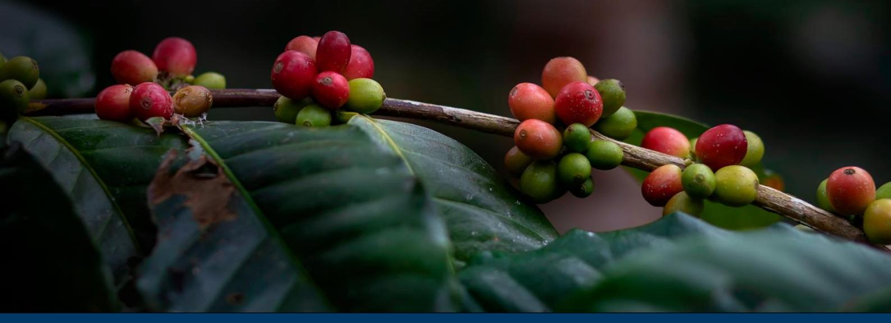

# **Preparedness check of Tanzania for the EU Deforestation Regulation**

Deforestation and forest degradation driven by agricultural expansion are growing at an alarming rate in tropical forest countries. As a major consumer of forest-risk commodities, the European Union (EU) has decided to take action to reduce the impact of its consumption of some of these commodities and products. The EU Deforestation Regulation (EUDR) came into force on 29 June 2023. Under the current legal arrangements, the EUDR's main obligations will apply to all large companies from 30 December 2025, and to micro, small and medium-sized enterprises from 30 June 2026.

The Regulation prohibits operators and traders from placing on the EU market, or exporting from the EU, certain commodities (cattle, cocoa, coffee, palm oil, rubber, soya and wood) and derived products, unless they are "deforestation-free", have been produced in accordance with the relevant legislation of the country of production, and are covered by a due diligence statement including traceability information.

Most of Tanzania's coffee is exported to Europe and Japan. In 2023 the EU made up the largest market share of Tanzania's coffee, accounting for approximately 58%, while Japan was the second largest, accounting for 16[%](#page-0-0)1 . This means that trade disruption with the EU would have significant adverse effects on the coffee sector.

# Coffee insight

1 This is according to statistics provided by the 2024 United States Department of Agriculture, GAIN Annual Coffee report.

**This preparedness check aims at providing an overview of existing policies, tools and data in Tanzania that could support coffee operators' EUDR due diligence efforts**, as well as identifying outstanding challenges faced by those in the Tanzanian coffee supply chain related to information requirements under the EUDR. While the responsibility for compliance lies solely with coffee operators, national supply chain policies and tools can play an essential role in facilitating due diligence. This paper provides an overview of the 'state of play' – to be regularly updated – of the supply chain regarding chain of custody traceability, deforestation, legality and standards.

## **1. Traceability requirements**

The EUDR requires that operators collect the following information, accompanied by evidence: the geolocation coordinates of all plots of land where commodities and products were produced (Art. 9 (1.d)) – for plots >4 hectares, GPS polygons are required (Art. 2(28)); the date or time range of production (Art. 9 (1.d)); and last supplier information (Art. 9 (1.e)).

## **1.1 State of play**

Through the Coffee Industry Act (CoIA) of 2001, amended in 2009 by the Crop Laws Act and its regulation in 2013, the authority to oversee the coffee sector was granted to the Tanzanian Coffee Board (TCB) by the Ministry of Agriculture (MOA). Together with the Coffee Industry Regulation (2012) and its Supplement (No.39 of 2013), Tanzania has a comprehensive regulatory framework for the coffee sector, granting authority to the TCB over production and marketing, quality control, sale and auctioning, the issuance of licenses to dealers, and export.

#### **Geolocation**

According to Section 7 of the CoIA, all coffee producers and value chain actors – smallholders, cooperatives and estates – must be registered with the TCB. Currently, the **farmer registry** contains only basic farmer information, but **no geolocation data**. The regulatory framework governing the Tanzanian coffee sector establishes Agricultural Marketing and Cooperative Societies (AMCOS) as the interlocutors between farmers and the TCB, but the extent to which the information management system is integrated – and relevant information collected by AMCOS and transferred to the TCB – is not entirely clear. AMCOS generally use physical documents, which can in many cases pose a barrier to full digitisation. The TCB has recognised the need to update its farmer registration database, and intends to eventually collect and link EUDR-relevant digital information and information sources, including geolocation (polygons) and coffee production data. As individuals will be linked to their plot or plots, together with input and production data, the TCB will be better able to target its support.

To upgrade its database, the **TCB is currently conducting a pilot campaign to collect this information, engaging university students and local officials and leveraging software used by other authorities**. The results of the pilot campaign will be used to inform the upgrade of the current farmer registration system, and to mobilise funding for the expanded registration and collection of

geolocation information. The final system will contain all geolocation information for farmer plots, and link AMCOS with sales information.

In the absence of reliable public information, and for internal purposes, some companies managing estate coffee plantations, as well as large exporting companies, have taken the initiative to collect geolocation of coffee plots in their immediate supply chains. Without a national process to define protocols or technical guidelines, it is unclear if they applied the same definition of plot of land and if the information collected is homogeneous enough to be incorporated in a future single database managed by TCB. However, a comparative analysis on a data sample could help generate trust in data quality between sources or identify potential flaws that could be corrected in time.

### **Traceability from AMCOS to port**

The current coffee trade system in Tanzania offers three options: farm gate sale, direct export or auction. For Arabica coffee, for the three trade options farmers must sell their coffee through their local AMCOS, of which there are currently 588 in the country. After processing, all coffee must be sent for curing and grading to a licensed miller, who shares information about the consignment with the AMCOS or estate, and the TCB. In recent years, the TCB instituted a 'one licence' rule, which means that legal entities can only hold a single license, i.e. coffee producers (AMCOS or estates), millers and exporters must have their operations legally separated from one another, even if in practice they are owned by a single parent company. This provides for clear critical control points along the value chain in the form of administrative requirements for each legal entity, requiring sorting by grade, segregation of estates' and AMCOS's consignments, and documentation of all transactions. The TCB aims to ensure effective oversight by placing itself at the centre of commercial activity – it is effectively the clearing house for all coffee-related transactions during sale – and overseeing coffee exports. **This system creates a robust basis for traceability from AMCOS to exporters**. Exporters and the TCB know the exact volume of coffee, per grade, per AMCOS bought at one specific date. It is underpinned by a clear paper trail which is logical, transparent and uses simple and easy to understand forms and documents. The system is widely accepted and is supported by stakeholders in the sector. Through this process exporters have access to the date of coffee sale at AMCOS level, which provides for a reasonably accurate estimation of the date or time range of production, as required under Art. 9 of EUDR.

The value chain for coffee estates is procedurally much the same as for smallholders, except that there can be more vertical integration, depending on how the estate is linked to export markets. Estates produce, harvest and wash their own coffee. Estates usually always sell directly to a private buyer, or effectively export their own coffee, i.e. the owners of the estate establish and maintain a separate company for the purpose of exporting. In some cases, estates also purchase coffee from smallholder farmers.

## **1.2 Remaining challenges**

- **The TCB is currently conducting a pilot campaign to collect geolocation information, engaging university students and local officials and leveraging software used by other authorities.** The final system will contain all geolocation information for farmer plots, and

link AMCOS with sales information. Private estates are already collecting this data, and some exporting companies are promoting support to particular AMCOS (with whom they have direct sale arrangements) for the collection of geolocation data. In this regard – at least in the short term – direct sale might be the preferred option for companies exporting coffee to the EU. Considering that many of the large private actors are advanced in their preparations for the EUDR, and given their reliance on and confidence in the TCB, there may be opportunities for **public-private collaboration to complete the collection of geolocation information and upgrade the TCB's farmer registration system**.

- The coffee supply chain is governed by a well-established and strong system, overseen by the TCB, providing a basis for robust traceability and potentially ensuring that each batch of coffee can be traced all the way back to the producing estate or AMCOS. But **the system does not yet provide information on the 'first mile', from plot to AMCOS**, as farmers' coffee is collected and aggregated by AMCOS. However, farmers should be permanently linked to their local AMCOS, so a buyer can be sure that any coffee purchased from an AMCOS will be produced by a known number of smallholders and plots of land. Even if polygons were available, the trade system would only allow an operator to link the purchased coffee to a fixed list of farmers and their plots (corresponding to one AMCOS), which would still result in a 'declaration in excess['](#page-3-0) 2 . However, considering that most AMCOS represent a relatively small area of land, risk assessment for the exercise of due diligence would be feasible. Also, AMCOS could be trained and equipped with better registry systems to be able to indicate the list of farmers, and the date of production, with each batch of coffee – this would represent improve the first-mile traceability. AMCOS might have the capacity to segregate coffee in their collecting centre, but this would require pre-identifying non-compliant plots within their sourcing area. Involving AMCOS in the plot data collection campaign could help strengthen their role in a future improved traceability system.
- **For the specific case of Robusta coffee** produced in the northwest (Kagera and Kigoma regions), close to the border with Burundi, Uganda and Rwanda, **companies are unable to trace the coffee back to the farmers or AMCOS because they generally buy from middlemen**. Traceability is then lost between AMCOS and middlemen, as the middlemen are usually unwilling to share commercially sensitive information with the buyer. Informed stakeholders estimate that up to 85% of Tanzania's Robusta crop is usually exported to the EU. However, the same stakeholders said that by September 2024 only one-tenth of the usual amount of the Robusta crop has been purchased for export to the EU, due to concerns about being able to demonstrate deforestation-free and legal production and tracing the coffee to the plots of land on which it was produced (before EU officially postponed the application of EUDR). This is leading some companies to shift some of their sourcing of Robusta to other countries, which may lead to price deflation and in turn negatively impact the livelihoods of smallholder producers; Robusta prices in the auction system have already apparently been dropping.

2 For official clarification on this concept, please refer to the official FAQ of October 2024, question 1.18, p.14

# **2. Deforestation-free criteria**

The EUDR requires that operators collect adequately conclusive and verifiable information that relevant products are deforestation free (Art. 2(13) and 9 (1.g)). Coffee produced on lands converted from forests after 31 December 2020 will not be considered deforestation free and will not comply with EU requirements. 'Forests' are defined according to the United Nations Food and Agriculture Organization (FAO) definition (Art. 2(4))3.

In this context, useful data and tools for due diligence might include:

- Forest cover at the EUDR cut-off date (31 December 2020)
- Permanent national forest monitoring system
- Deforestation alerts

## **2.1 State of play**

## **Definition of 'forest'**

The definition of 'forest' in the National Forest Act of 2002 is the following: 'forest' means an area of land with at least 10% tree crown cover, naturally grown or planted and or 50% or more shrub and tree regeneration cover and includes all forest reserves of whatever kind declared or gazetted under this Act and all plantations.

However, according to the definition of forest in Tanzania's 2017 Forest Reference Emission Level (FREL), which was endorsed by the government and submitted to the United Nations Framework Convention on Climate Change (UNFCCC), "'Forest' means an area of land with at least 0.5 ha, with a minimum tree crown cover of 10% or with existing tree species planted or natural having the potential of attaining more than 10% crown cover, and with trees which have the potential or have reached a minimum height of 3m at maturity in situ". The minimum height of 3m differs from the definition in the EUDR (5m). As in the FAO definition, under the FREL, agroforestry systems are considered 'cultivated land' and are not considered forest land. However, the 'Forest land' class under the 2017 FREL national land cover description "includes montane, lowland, mangrove and *plantation forests*, woodlands, thickets, *cultivated land mixed crops and cultivated land with wooded crops*". More clarity should be provided on where coffee agroforestry systems sit. In any case, considering the dense tree cover existing in coffee farms, it is very likely that they would be monitored as forest.

## **Definition of 'deforestation'**

According to the 2017 FREL, deforestation is defined as a change of forest cover to non-forest cover, whether it is induced or not by human activity, aligning with the EUDR definition.

#### **Deforestation data**

To complete the REDD+ Readiness phase, Tanzania established an MRV system and developed a FREL. The National Carbon Monitoring Centre (NCMC) was created in 2014 through a Memorandum of Understanding between the Vice President's Office (VPO) and the Sokoine University of Agriculture (SUA), which currently hosts the NCMC. In 2017 Tanzania submitted its first **FREL**, declaring an **annual deforestation rate of 469.420 ha/year between 2002 and 2013**. Most of this deforestation happened in open wooded land that corresponds, in terms of ecosystems, to miombo and acacia savanna. NCMC is currently developing the FREL 2013 – 2021 and the data it contains could potentially be extracted to develop a national forest cover map for 2020. However, the publication of the FREL 2013 – 2021 is delayed and it is unknown when the data will be available. Also, there are yet no plans to develop a national forest cover map for 2020, which could be used to provide support for the exercise of due diligence.

According to Global Forest Watch, of the 237.000 ha of tree cover that was lost in 2023, 6.000 ha was from forestry, 217.000 ha was from shifting cultivation (a term that includes small scale commercial farming as well as subsistence farming), while only 2.420 ha was from commodity-driven deforestation – which is less than the 2.870 ha caused by wildfires. A study by Doggart et al. (2020) revealed that small-scale agriculture took place in 89% of deforested areas (based on ground surveys of more than 100 randomly selected plots). According to a Forest Trends publication, **between 2005 and 2018 only 1% of deforestation was linked to coffee production**. Exported commodities not listed in Annex 1 of the EUDR – especially tobacco, sesame, and cashew – are considered important drivers of deforestation in Tanzania.

Though no information or data are publicly available, and following the signature of an MoU between TCB and Enveritas (a non-profit organisation with the mission to end global poverty in the coffee sector by 2030) in 2024, a study to monitor deforestation associated with coffee cultivation by Enveritas was conducted. Only one deforestation event associated with coffee was detected, and as it was only one year old, the trees involved would not yet produce coffee beans in 2024. **In that regard, for the 2024 harvest the TCB declared that the coffee supply chain in Tanzania is deforestation free**.

### **Land cover map 2020**

The Tanzania Ministry of Natural Resources and Tourism (MNRT), through the Tanzania Forest Services (TFS), received technical support from FAO to undertake the development of national land cover maps for 2015 and 2020. The samples were trained with cloud-based geospatial processing and modelling tools available from System for Earth Observation Data Access, Processing, and Analysis for Land Monitoring (SEPAL). 2015 and 2020 Landsat 8 imageries were classified through the 2010 -2013 National Forest Monitoring and Assessment (NAFORMA) field survey. The map is not publicly available.

## **2.2 Remaining challenges**

- Nationally produced data, such as a national land cover and land use map or a forest/nonforest map, can serve as a primary source of information and facilitate the due diligence of

- operator to demonstrate compliance with the EUDR. National maps often provide greater accuracy than alternative versions produced by external, private service providers, and can be made easily accessible through national systems. NCMC has been focused on generating national data for the development of FREL, but that does not cover the year 2020. **Nationally endorsed reference data for EUDR due diligence is unavailable in Tanzania**. Stakeholders do not have access to forest cover maps for 2020 in downloadable formats (e.g. raster files) that could be used to conduct risk assessments as part of the due diligence process.
- Tanzania has an operational forest monitoring system but does not have a visualisation platform where data can be downloaded. A lack of funding prevents putting such a national system platform in place. A national forest monitoring system could provide official reference information on forests to facilitate EUDR due diligence, inform country benchmarking, and monitor risks of future deforestation and raise alerts, thereby supporting efforts to improve coffee sustainability and reduce deforestation.

# **3. Legality criteria**

The EUDR requires that operators collect adequately conclusive and verifiable information that the relevant commodities were produced in accordance with the "relevant legislation of the country of production" (Art. 9 (1.h) and Art 2(40)).

'Relevant legislation of the country of production' is defined as the laws applicable in the country of production concerning the **legal status of the area of production** in terms of: land use rights; environmental protection; forest-related rules, including forest management and biodiversity conservation, where directly related to wood harvesting; third parties' rights; labour rights; human rights protected under international law; the principle of free, prior and informed consent (FPIC), including as set out in the UN Declaration on the Rights of Indigenous Peoples; and tax, anticorruption, trade and customs regulations' (Art. 2 (40)).

Consequently, operators who place coffee or coffee products on the EU market must ensure that they have been produced in accordance with the relevant Tanzanian applicable legislation concerning the legal status of the area of production. Stakeholders have an opportunity to identify which national requirements concerning the relevant areas of law are applicable, and to discuss the relevance of information, documents and data required to assess the risk of illegality – in this sense they have an opportunity to frame how risk associated with legality could be considered. The section below tries to provide a first analysis of the relevant legal framework, though it is far from exhaustive. A broader multistakeholder process may be needed to comprehensively and effectively identify all the relevant legal requirements and compliance issues.

## **Land-use rights**

Land in Tanzania is held in trust by the State for the benefit of the people. Villages and individual villagers can seek a formal land-use right, though the process can be long, complicated and

expensive. In practice, most villages and villagers' land rights are still held customarily, which is entirely legal. Companies with investments in agriculture usually have long-term leases for land under the category of general land, though they can lease land from villages. According to officials from the Land Use Commission, there are currently 12,319 villages in Tanzania, but only around 4,000 have developed any kind of land-use plan.

Coffee may be grown on village land or general land. When grown by a smallholder, the land is usually village land. Larger growers, including estates, maintain plantations on general land and sometimes on village land, if they lease the land from smallholders or village authorities. The overwhelming majority of estates are well established and have been operating for many years, without significant concerns about legality on land-use rights.

From the available literature and stakeholder interviews, there appear to be few concerns about coffee and other agricultural production on reserved lands, which covers protected areas such as forest reserves and game parks. However, since reserved land constitutes approximately 28% of all land in Tanzania, there are likely cases where agricultural production is officially 'illegal'. More research in this area needs to be conducted, and clarity could be provided through the development of a land cover and land-use map.

#### **Environmental protection**

Under the authority of the Environmental Management Act (2004), the National Environment Management Council (NEMC) promulgated Guidelines for Agriculture (2012), which require an Environmental Impact Assessment (EIA) and enhancement / advanced mitigation measures for Large and Medium Scale Crop Farming Projects. Smallholders are not subject to EIAs.

Such a project is "an extensive commercial system which is characterized by cultivation of a single crop under rain fed or irrigated system that covers more than 50 ha. The system involves application of farm machinery and intensive use of agrochemicals. Large scale farming also should have permanent employees; the number depends on the scale and type of farming. The production activities should be continuous and large part of produce should be for commercial purposes. Agricultural crops include tea, coffee, tobacco, cotton, sugar, sisal, cashew nuts, and pyrethrum".

EIA requirements appear to apply at project start-up, which likely means that established estates do not have to conduct an EIA. However, established estates may be subject to ongoing obligations under an EIA, for example if the EIA required ongoing monitoring or mitigation measures related to coffee production.

The Fertilizers Act of 2009 governs the production, import and export of fertilizers, but appears to say little about fertilizer use by producers. Larger estates may be subject to storage requirements, but smallholders rarely have resources to invest in fertilizers and usually rely on the authorities to provide inputs.

The Plant Health Act of 2020, although primarily concerned with pesticide importers and traders, prohibits the use of pesticides "in a manner or for purposes other than for which it was registered or for purposes not stated in the pesticides information leaflet" Article 20(1). Article 20(2) also states that "A person shall not use, store, discharge, release, place or cause to be placed any pesticides in a manner likely to cause adverse effect to the environment". It is not entirely clear how extensively pesticides are used, as although they are often needed, they can be expensive and beyond the means of many smallholder producers.

The Water Resources Management Act of 2009 establishes a general duty for all Tanzanians to "safeguard and protect" (Article 7) water resources, with more specific requirements for landowners to adopt "reasonable measures to prevent…pollution from occurring" (Article 39). There are also specific requirements for discharge permits for effluents from "commercial, industrial or agricultural source[s]", directly and indirectly, into surface or underground water (Article 63). The Act also governs the diversion, damming, storage and abstraction or uses of water from surface or underground water sources through a permitting system, which covers wells and boreholes.

The Wildlife Conservation Act of 2022 establishes that human activities, settlements or other developments that will adversely affect wildlife shall not be permitted within 500 meters from the wildlife protected area borderline without the permission of the Director (Article 74). Animals that enter producers' lands should not be harmed, unless it is in self-defence or the defence of livestock. Under the Act, producers may be able to claim compensation for damage caused to their property, including crops, caused by wild animals.

#### **Third-party rights**

Tanzania has various laws which require the involvement of third parties before a final decision can be made, relating to land rights and natural resource management. In the context of coffee, the most relevant are:

Land Act (1999) and Village Land Act (1999) – These recognise customary land rights and provide for community involvement in decisions related to land use. The Village Land Act gives Village Councils significant authority in managing village lands, which implies a need for community consent in matters of land allocation and use.

Environmental Management Act (2004): This mandates EIAs for certain projects, which include public consultations. These are a form of seeking community input and consent for development projects.

## **Labour right[s](#page-8-0)3**

3 The Guidance recently published by the European Commission on Legality indicates that the relevance of the laws in the country of production is determined "by the fact that [they] specifically *impact or influence the legal status of the area in which the commodities were produced*" and "if [the laws'] contents can be linked to halting deforestation and forest degradation in the context of the Union's commitment to address climate change and biodiversity loss" (see Section 6 of the *[Guidance Document for Regulation \(EU\) 2023/1115 on Deforestation-Free](https://green-business.ec.europa.eu/document/download/162138c8-7c22-4bb5-98ce-fd31c81d6936_en?filename=C_2024_7027_1_EN_Guidance%20on%20EU%20Deforestation%20Regulation%20.pdf)  [Products](https://green-business.ec.europa.eu/document/download/162138c8-7c22-4bb5-98ce-fd31c81d6936_en?filename=C_2024_7027_1_EN_Guidance%20on%20EU%20Deforestation%20Regulation%20.pdf)*). It is not yet clear how the Commission intends this guidance to be applied, but it could potentially mean that most labour issues, such as remuneration, contractual relations, leave, etc. will not be 'relevant' under the EUDR. It could also mean that child labour and other related human rights issues are also not relevant. However, at this stage it will be the competent authorities in EU member states who determine how the wording in the EUDR will be interpreted and applied, at least until cases are brought before national courts or the European Court of Justice. For this reason, it may be sensible for operators to adopt a more expansive approach and assume that labour and human rights law, which may not strictly apply to the 'legal status of the area of production', will be considered by competent authorities.

Tanzania has a well-established governance framework for labour rights between employees and employers, beginning with the Employment and Labor Relations Act (ELRA) of 2004, but also including the Crops Laws Act of 2009 which governs contract farming.

The labour concern most highlighted in reports from NGOs and the International Labour Organization (ILO) is child labour.

The ELRA prohibits the employment of children younger than 14 years of age, as does the Child Act of 2009. Both establish that a child is anyone under the age of 18 and explicitly prohibit hazardous and night work.

However, this does not seem to apply to family-based agriculture, which makes up the overwhelming majority of cases in the coffee sector. In 2018 the ILO found that around one in four children aged 5–13 years (almost 2.8 million in absolute terms) were engaged in some kind of work, with 95% engaged in family-based agricultur[e](#page-9-0)4 .

In the past, some children were employed on estates, often because their parents were also working there5 [.](#page-9-1) However, according to interviewees in the ILO study this no longer takes place, due to past efforts and the potential negative reputational impact.

### **Human rights[6](#page-9-2)**

Tanzania takes a dualist approach to international agreements, which means requirements must be implemented through domestic legislation. The lack of direct applicability can lead to situations in which Tanzania ratifies a treaty but does little to implement it. Without domestic implementation, the treaty has little authority. Nonetheless, courts in Tanzania may still occasionally consider ratified but unimplemented treaties in their decisions.

Tanzania has signed and ratified the following international human rights agreements: International Convention on the Elimination of All Forms of Racial Discrimination; International Covenant on Civil and Political Rights; International Covenant on Economic, Social and Cultural Rights; Convention on the Elimination of All Forms of Discrimination against Women; Optional Protocol to the Convention on the Elimination of All Forms of Discrimination against Women; Convention on the Rights of the Child; Optional Protocol to the Convention on the Rights of the Child on the involvement of children in armed conflict; Optional Protocol to the Convention on the Rights of the Child on the sale of children, child prostitution and child pornography; Convention on the Rights of Persons with Disabilities; Optional Protocol to the Convention on the Rights of Persons with Disabilities.

In most cases, it appears that relevant provisions on human rights in the ratified international treaties are covered in subject specific legal instruments, such as the Child Act of 2009, etc. Tanzania has also developed a National Strategy on Elimination of Child Labor (2023–2027), which aims to coordinate actions to prevent and respond to the most severe forms of child labour at the

4 See the ILO report, *[Child Labour and the Youth Decent Work Deficit in Tanzania](https://www.ilo.org/sites/default/files/wcmsp5/groups/public/@ed_norm/@ipec/documents/publication/wcms_651779.pdf)* (2018)

5 This is according to the ILO report, *[Children Working in Commercial Agriculture](https://webapps.ilo.org/ipecinfo/product/download.do?type=document&id=2599) – Coffee: A Rapid Assessment* (2002).

6 See footnote #3 related to Guidance on Legality.

national level. The government adopted and began implementing the strategy in 2023 and was expected to formally launch the policy in June 2024.

#### **FPIC**

Although existing laws and policies incorporate elements of community consultation and participation, there is no explicit legal requirement for FPIC in Tanzania. The concept of FPIC, as recognised in international human rights law, particularly in relation to Indigenous Peoples, is not fully integrated into Tanzanian law. Tanzania has not ratified the International Labour Organization's Indigenous and Tribal Peoples Convention, 1989 (No. 169). However, Tanzania is a signatory to the United Nations Declaration on the Rights of Indigenous Peoples (UNDRIP), which endorses FPIC as a standard, though it is non-binding.

### **Tax, anti-corruption, trade and customs**

Tanzania has a variety of anti-corruption laws including the Prevention and Combating of Corruption Act (2007); the Public Leadership Code of Ethics Act (1995); the Anti-Money Laundering Act (2006); and the Economic and Organised Crime Control Act (1984). However, these have minimal relevance to the context of coffee production and export, and at the level of the area of production.

This is because producers are prohibited from also being exporters, and the TCB oversees all commercial arrangements between producers and buyers. The TCB also issues export permits, which means there are strong and effective controls over the collection of fees and taxes.

The TCB also reviews commercial contracts between producers and buyers, to ensure that buyers are not exploited. Smallholder producers are not subject to income tax, however large estates should demonstrate their compliance.

## **3.2 Remaining challenges**

According to this very general initial analysis, it seems to be a relatively low level of risk that coffee is being produced in contravention of Tanzanian laws and regulations. This is largely because most of the coffee is produced by smallholders, and smallholders are subject to a limited number of legal requirements. Except in protected areas or in areas where agriculture is prohibited, smallholders seem to have appropriate land use rights as the State holds ownership on trust for the people and customary land use is legal and common. If a smallholder has planted long-term crops such as coffee trees, it is highly likely that they and their neighbours consider tenure to be legitimate and secure. Estates, on the other hand, are few, large and well established, usually with sophisticated operations. They will need to provide clear evidence that they comply with national laws. As they can be scrutinised by the authorities, they might have the resources to comply with relevant laws and regulations, such as those related to labour and environment.

However, it is unclear what laws apply to small-scale agriculture and to estate plantations, given the current **lack of clarity regarding how the legal status of the area of production should be interpreted and applied in the context of Tanzania**. In consequence, information, documents and data useful for due diligence are difficult to identify and thus access for operators.

# **4. Conclusion**

This preparedness check offers an overview of the landscape of current policies, tools and data in Tanzania related to traceability, deforestation and legality that can support coffee sector actors in navigating the complexity associated with exercising due diligence and demonstrating compliance with EUDR requirements.

The establishment of AMCOS and the coffee trade system in Tanzania provide a strong basis for traceability up to the level of AMCOS. To upgrade the system, geolocation data for coffee plots could be collected through AMCOS and integrated or linked to the TCB database, which could then be shared with exporters and eventually with operators, so they can exercise due diligence. In case of need for mitigation actions, AMCOS could serve as interlocutors for improving farmer practices and reducing risks of future deforestation by their members.

Challenges related to land cover and land-use data availability and the development of a robust and fit-for-purpose forest monitoring system could also be addressed, building on current platforms and leveraging existing relationships. Lastly, achieving clarity on the scope of legality under the EUDR and the information, documents or data that could be used as evidence of compliance or as input for risk assessment for due diligence, is necessary.

**Disclaimer.** This publication has been produced with the financial assistance of the European Union. The views expressed herein can in no way be taken to reflect the official opinion of the European Union.

© European Forest Institute, 2025

