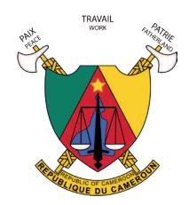

Mise en œuvre par

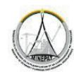

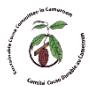

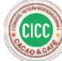

**REPUBLIQUE DU CAMEROUN** Paix-Travail-Patrie

**REPUBLIC OF CAMEROUN** Peace-Work-Fatherland

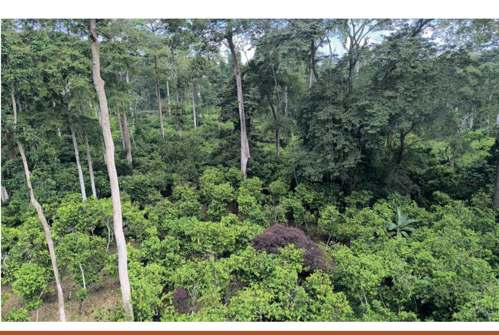

# **Towards a reference framework for agroforestry cocoa in Cameroon** *Development process and definition criteria*

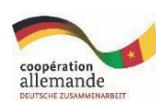

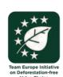

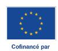

## **1. Context and justification**

Cameroon mainly produces its cocoa using complex agroforestry systems (AFS) that provides numerous environmental benefits and contributes to the socio-economic resilience of rural households.

Faced with new requirements of international markets, notably the European Union Regulation on deforestation and forest degradation (EUDR), which considers cocoa farming in agroforestry to be an agricultural practice, promoting the specificities of cocoa farming in Central Africa become strategic. Cameroon, with its strong heritage of complex agroforestry systems, has therefore opted to establish a national reference framework for its agroforestry cocoa, permitting:

 To objectively qualify cocoa-based agroforestry systems, To support a regulatory and as well a commercial recognition of cocoa produced under broad shade, To maintain biodiversity, forest cover and ecosystem services in these complex agroforestry systems To contribute to the resilience of these production systems and rural households.

### **2. Objectives and approach to co-constructing the reference framework**

Develop a consensual technical framework for characterizing and promoting cocoa-based agroforestry systems in Cameroon, tapping from:

 a solid scientific basis ; a multi-stakeholder participatory approach over a period of two years; a political will for positive diႇerentiation.

### **2.1 Scientific reference study**

From April to December 2023, a study on the characterization of cocoa-based AFS was jointly conducted by the Centre for International Cooperation in Agricultural Research for Development (CIRAD) and the Interprofessional Cocoa and Coႇee Council (CICC), with the support of the European Union's Sustainable Cocoa Programme, implemented by GIZ. The characterization was carried out by measuring 17 structural, ecological and economic criteria in 223 cocoa plantations in five regions and three agroecological zones.

The results revealed three types of AFS, namely: (i) the **«highly diversified»**system consisting of cocoa plantations having the highest densities and diversity of associated forest trees; (ii)

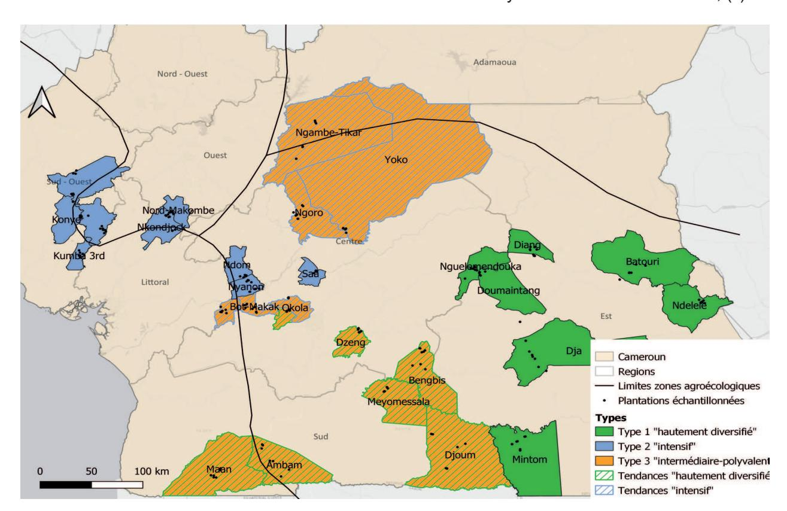

|    | Criteria                                        | Minimum   | «DiversiĮed» (25%) Median | Average | Minimum | «Intensive» (35%) Median | Average | Minimum | «MulƟpurpose» (40%) Median | Average |
|----|-------------------------------------------------|-----------|---------------------------|---------|---------|--------------------------|---------|---------|----------------------------|---------|
| 1  | Age of cocoa farm (years)                       | 5         | 12                        | 15      | 13.5    | 38                       | 40      | 6       | 13                         | 19      |
| 2  | Yield/year (kg) Phytosanitary cost (CFA francs/ | 123       | 180                       | 234     | 571     | 774                      | 700     | 226     | 434                        | 443     |
|    | ha/yr)                                          | 5 000     | 7 917                     | 6 242   | 40 000  | 60 000                   | 78 575  | 8 500   | 31 667                     | 34 996  |
| 4  | Number of intervenƟons                          | 2         | 5                         | 5       | 7       | 8                        | 10      | 5       | 9                          | 9       |
| 5  | Number of uses of forest species                | 6         | 8                         | 9       | 7       | 9                        | 9       | 8       | 15                         | 14      |
| 6  | Number of cocoa trees/ha                        | 588       | 750                       | 759     | 675     | 913                      | 944     | 675     | 900                        | 963     |
| 7  | Number of fruit trees/ha                        | 2         | 23                        | 19      | 2       | 13                       | 16      | 6       | 21                         | 23      |
| 8  | Number of forest trees/ha                       | 79        | 117                       | 116     | 33      | 38                       | 41      | 29      | 71                         | 66      |
| 9  | Number of associated trees/ha                   | 127       | 138                       | 149     | 50      | 54                       | 59      | 66      | 87                         | 89      |
| 10 | Number of associated species                    |           |                           |         |         |                          |         |         |                            |         |
|    | per 1/4 ha                                      | 30        | 33                        | 36      | 12      | 13                       | 14      | 16      | 21                         | 21      |
| 11 | Basal cover of cocoa trees (m                   | 2         |                           |         |         |                          |         |         |                            |         |
|    | ha)                                             | 1.44      | 5.12                      | 5.11    | 8.86    | 16.76                    | 15.09   | 2.79    | 6.83                       | 8.76    |
| 12 | Basal cover of fruit trees (m                   | 2         |                           |         |         |                          |         |         |                            |         |
|    | ha)                                             | 0.01      | 0.63                      | 0.77    | 0.2     | 0.38                     | 0.64    | 0.09    | 0.93                       | 1.26    |
| 13 | Basal cover of cocoa trees (m                   | 2         |                           |         |         |                          |         |         |                            |         |
|    | ha)                                             | 9.23      | 22.45                     | 20.03   | 3.39    | 9.7                      | 11.53   | 5.89    | 11.36                      | 13.59   |
| 14 | Basal cover of associated trees                 |           |                           |         |         |                          |         |         |                            |         |
|    | (m 2                                            |           |                           |         |         |                          |         |         |                            |         |
|    | /ha)                                            | 20.51     | 24.36                     | 24.47   | 3.76    | 10.42                    | 11.53   | 6.84    | 12.25                      | 13.92   |
| 15 | Total basal cover (m                            | 2         |                           |         |         |                          |         |         |                            |         |
|    |                                                 | /ha) 27.4 | 29.57                     | 30.41   | 16.56   | 35.24                    | 29.38   | 10.67   | 20.77                      | 22.17   |
| 16 | Shannon index                                   | 2.45      | 2.59                      | 2.59    | 1.87    | 1.92                     | 1.99    | 1.95    | 2.29                       | 2.24    |

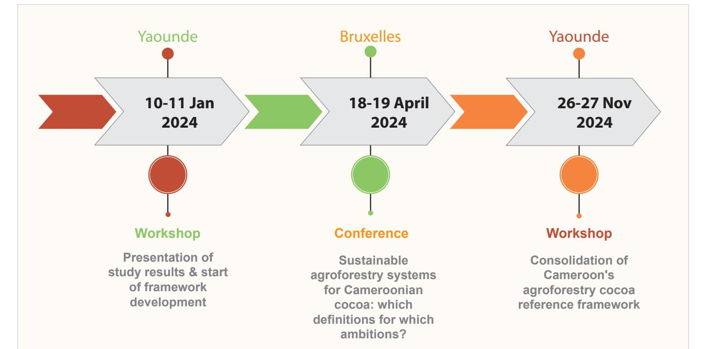

the **'intensive'** system, consisting of cocoa plantations having the highest values in terms of age, yield and basal area of cocoa trees as well as the highest levels of intensification in terms of labour and inputs; and finally (iii) the **«multipurpose»** system consisting of cocoa plantations with a large number of fruit trees per hectare and uses of associated forest species.

### **2.2 Multi-stakeholder co-construction process**

Based on the results of this study, a multistakeholder co-construction process was carried out during 2024 with the aim of defining a reference framework of the complex cocoa-based agroforestry system that will be operational and easy to promote in Cameroon and on international markets.

In addition to consultations, interviews and discussions with key stakeholders, the process was significantly marked by the holding of three workshops in which diႇerent categories of stakeholders took part: public administrations, the private sector, researchers, NGOs, producer organisations, technical and financial partners, and foreign delegations (from other cocoaproducing countries).

A comparison of the study's results with other sustainable cocoa standards, particularly those in West Africa, highlighted the need to define a complex agroforestry cocoa standard, at least for Cameroon. Indeed, while in West Africa the objective is to reintroduce (simple) agroforestry into quasi-monocultural production systems that have been built at the expense of forests, in Cameroon, and in Central Africa more generally, the stake is to maintain – or even expand – the traditional complex agroforestry systems that have developed while preserving most of the ecological attributes of a degraded forest and ensuring ecological and socio-economic resilience.

There is therefore an interest in promoting existing complex agroforestry systems in Cameroon, rather than being tempted by the trajectories observed in West Africa.

### **3. Criteria and thresholds selected for the Cameroon agroforestry cocoa reference framework**

The January 2024 workshop permitted to identify four variables that could be used to classify Cameroonian agroforestry cocoa, namely: (i) the maximum number of cocoa trees per hectare; (ii) the minimum number of associated trees per hectare; (iii) the minimum basal area of trees associated with cocoa trees; (iv) three plant strata. Numerous arguments were presented and discussed during this workshop, but no compromise was reached by the stakeholders, partly due to the technical nature of the debate, but mainly because of its political, economic and social implications.

It was during the workshop to consolidate the reference framework in November 2024 that a consensus was reached on the variables and thresholds to be used to define the reference framework. The debate focused not only on figures, but also on the philosophy of the agroforestry model to be preserved. Four main principles guided the final choices:

**Avoid minimising agroforestry systems**: researchers insisted that thresholds should not become simplification targets. Setting a minimum value that was too low risked transforming a complex agroforestry system into an impoverished system that would nevertheless be "compliant" on paper. Hence the preference for intervals (e.g. cocoa tree density) and the introduction of structural criteria (strata, basal area, canopy cover) rather than just tree counts.

**Maintaining the ecological identity of Cameroonian cocoa AFS**: the aim was to preserve the ecological functions of AFS, namely: biodiversity (number of associated and native species), forest structure (number of strata), biomass and carbon storage (basal area), microclimate and water regulation (forest cover) and the maintaining of a forest character (number of forest trees).

**Reconciling ecology and profitability**: A density of 850–1,100 cocoa trees per hectare is recognised as optimal for yield, but this has been classified as a non-binding recommendation. This choice recognises that cocoa is an economic activity, but some high-performing agroforestry systems have lower densities. This was in order not to exclude traditional systems that are ecologically rich but less intensive. All this is to ensure that the reference framework is not seen as a model for intensification, but as a framework for structural sustainability.

**Designing a simple reference framework**, both in terms of the number of criteria and how they are monitored in the field

This reasoning led to a consensus on seven binding criteria for this reference framework.

| Criterion              | Minimum |
|------------------------|---------|
| ha                     | ≥ 70    |
| cm DBH)/ha             | ≥ 45    |
| species/ha             | ≥ 12    |
| species/ha             | ≥ 10    |
| trees (m²/ha)          | ≥ 11    |
| Forest cover           | ≥ 40%   |
| Number of plant strata | 3       |

An additional but non-binding indicator has also been recommended, namely to project for a number between 850 and 1,100 cocoa trees per hectare.

### **4. Scope of the reference framework**

The joint development of this framework can have several scopes, which can also be reconciled:

 Incorporate the agroforestry cocoa reference framework into the reference manual for the production and marketing of sustainable cocoa in Cameroon, or at the regional level; Be recognised by an international sustainability standard (Rainforest Alliance, Fairtrade, etc.); Contribute to the revision of the EUDR, particularly with regard to the definitions of agroforestry and forest degradation; Convince the private sector to promote this agroforestry cocoa, for example by voluntarily adopting this reference framework

# **5. Outlook**

| Action                                 | Responsible parties    | Target deadline |
|----------------------------------------|------------------------|-----------------|
| ence manual                            | EFI, ONCC              | 2026-2027       |
| Dissemination (manual, training)       | GIZ, CICC, researchers | 2026-2027       |
| reference framework for Central Africa | CIRAD, CICC, GIZ-SCP   | March 2026      |
|                                        | COMIFAC,               | ECCAS,          |
|                                        | CAISTAB, INERA         | June 2026       |
| Scientific publication                 | CIRAD, CICC            | 2026            |

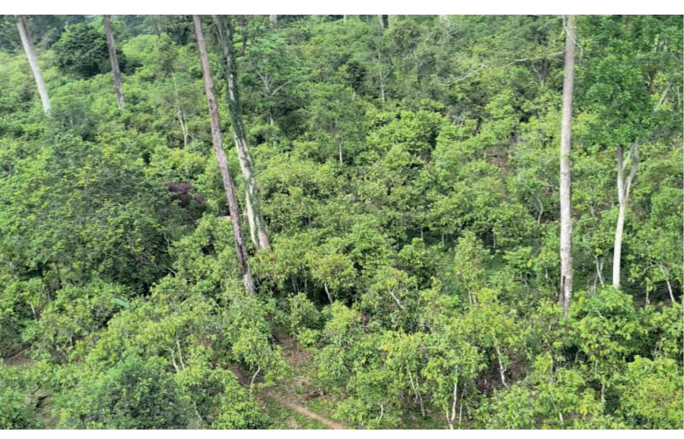

# **Bibliography**

Lescuyer G., Gentils L., 2024. Quelle norme pour un «cacao agroforestier» originaire du Cameroun ? Compte-rendu de l'atelier proposé par le CICC et le CIRAD, Yaoundé, 10-11 janvier 2024. Montpellier : CIRAD, 152 p.

Lescuyer G., Gentils L., Mouyakan Moumbock E., Malédy O., Bassanaga S., Harmand J.M., Sonwa D.J., Ndoumbè Keng M., Oyono M., Tankam C., Essono S.P., 2024. Définir et promouvoir un cacao agroforestier pour le Cameroun et l'Afrique centrale. OFAC Brief 4, Yaoundé, Cameroun, 6p.

| 
<b>Published by :</b> Cameroon Sustainable Cocoa Committee (CCDC)
                                                                   | 
This publication was produced by the Cameroon Sustainable Cocoa Committee (CCDC) in cooperation with the European Union Sustainable Cocoa Program (SCP) and the Sustainable Agriculture for Forest Ecosystems (SAFE) project implemented by Deutsche Gesellschaft für Internationale Zusammenarbeit (GlZ) GmbH, with financial support from the European Union, the German Federal Ministry for Economic Cooperation and Development (BMZ), and the Dutch Ministry of Foreign Affairs.
 |
|--------------------------------------------------------------------------------------------------------------------------------------------|-----------------------------------------------------------------------------------------------------------------------------------------------------------------------------------------------------------------------------------------------------------------------------------------------------------------------------------------------------------------------------------------------------------------------------------------------------------------------------------------------|
| 
<b>Updated :</b> Janvier 2026
                                                                                                       |                                                                                                                                                                                                                                                                                                                                                                                                                                                                                               |
| 
<b>Authors:</b> Guillaume Lescuyer (CIRAD), Marius Oyono (GlZ)
                                                                      |                                                                                                                                                                                                                                                                                                                                                                                                                                                                                               |
| 
Reviewed, validated, and approved by the Cameroon Sustainable Cocoa Committee (CCDC), which now owns and officially distributes it,
 |                                                                                                                                                                                                                                                                                                                                                                                                                                                                                               |
| 
<b>Photo credits :</b> Daniel Essobo
                                                                                                | 
Its contents are the sole responsibility of the authors and do not necessarily reflect the views of the European Union, the German Federal Ministry for Economic Cooperation and Development (BMZ) and the Dutch Ministry of Foreign Affairs.
                                                                                                                                                                                                                                          |
| 
<b>Layout :</b> Hervé Momo
                                                                                                          |                                                                                                                                                                                                                                                                                                                                                                                                                                                                                               |