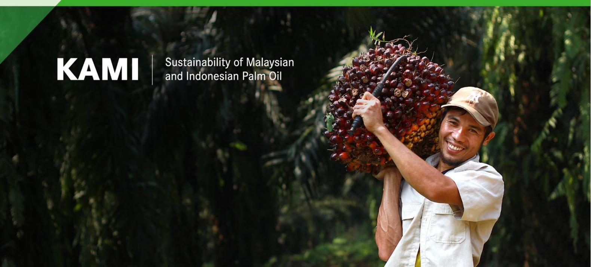

# **The feasibility of establishing district-level registries of palm oil producers in Indonesia**

# **Key points**

- District registries can provide market visibility to palm oil producers, mills and supply chain actors who are able to demonstrate legality and sustainability.
- Registries do not necessarily represent an additional reporting obligation as data can often be compiled from existing sources, including but not only from government databases, certification schemes and from reporting from accredited certification bodies.
- The district registries proposed in this brief would provide a layer of transparency to complement information included in a national traceability system being developed by PT Surveyor Indonesia.
- The registries would provide non-confidential information on the legality and sustainability status of medium and large-scale producers and supply-chain actors (not smallholders) in a given district.
- Access to this information would help supply chain actors to conduct due diligence risk assessments to meet requirements in the EU and other global markets and could thereby help reinforce supply chains for legal, deforestation-free and sustainable palm oil.

# **1. Introduction**

Making reliable information available on the performance of palm oil supply chain actors can allow districts to demonstrate progress towards sustainability, and the associated market visibility can function as a factor for change. Until sufficient progress is made in registering smallholders and certifying smallholders and companies, collation and dissemination of

legality and sustainability related information could significantly simplify market actors' due diligence processes. The establishment of district registries containing key information on company legal and sustainability would allow users to quickly assess the performance of individual producers in a district, and the district overall. Currently, districts lack capacity to effectively implement such registries and provide market visibility to responsible actors.

Linking the proposed registries to the national traceability system being developed by PT Surveyor Indonesia, an Indonesian State-Owned Enterprise, would support transfer of due diligence information to Indonesian exporters for trade with international markets. Exporters would then be able to demonstrate traceability to area of production and provide information on alignment with global market requirements - such as under the EUDR.

This brief proposes a pragmatic approach to information collection and due diligence wherein tracking efforts are focussed on responsible operators. It involves developing district lists identifying companies that already have the information to show that they are performing according to relevant environmental and social standards and have no ambiguous or pending legal issues.

# **2. Proposed design of district registries**

The registries are proposed to include a defined set of information on oil palm plantations and palm oil mills in districts across Indonesia, as set out in the subsections below. The information would cover identity and location, certification and legality status, and could include indicative information that plantations have not been established in areas deforested after 2020 as aligned with the EUDR/FAO definition of 'forest'. The registries would also allow information to be validated and would be interoperable with other relevant Indonesian systems.

The Indonesian Sustainable Palm Oil (ISPO) and other palm oil sustainability certifications provide a ready basis for assessing company performance in relation to legality and national sustainability principles. An additional regulatory basis for rating the legal compliance of plantation companies also exists in Indonesia (*Pedoman Penilaian Usaha Perkebunan – PUP*) and allows the agricultural service or plantation service to conduct annual assessments.

By including these elements, authorities can create a comprehensive and transparent system that addresses both regulatory requirements and sustainability goals. The information could enable better decision-making, monitoring and enforcement, fostering sustainable practices and safeguarding the landscape within the district. As the proposed district registries incorporate information relevant in relation to global market requirements, they could also help facilitate access to legal and traceable supply chains.

### **Plantation and mill list**

Information in the district registries is proposed to include a comprehensive list of all medium to large-scale plantations (not individual smallholders) and mills operating within a district. This inventory provides for a holistic understanding of the scope and scale of the palm oil sector activities in a district. Additionally, inclusion of the planted area and age of the oil palm trees in each plantation would facilitate volume checks, enabling better monitoring and verification of supply chain information and assessment of productivity. The information regarding plantations and mills profile are:

- 1. Company name, including their Group/Parent Company Name
- 2. Plantation Area (ha)Year of planting/replanting
- 3. Productivity of plantations (t/ha)
- 4. Mill capacity (t/yr)

### **Certification status**

To demonstrate responsible practices, information on the certification status of the plantations and mills would form a central pillar of the registries. Certifications such as ISPO (Indonesian Sustainable Palm Oil), RSPO (Roundtable on Sustainable Palm Oil) and ISCC (International Sustainability and Carbon Certification) indicate adherence to specific sustainability criteria. This information helps stakeholders evaluate the legality and sustainability performance of the registered entities.

## **Plantation Business Assessment**

PUP (*Penilaian Usaha Perkebunan*/Plantation Business Assessment) provides an additional regulatory basi[s](#page-2-0)1 for assessing performance of plantation companies for legal compliance. A PUP rating indicates legal performance regarding business permits, land rights and forest clearance, and a range of aspects related to financial and operational management, labour rights and environmental performance. By including this rating, the district registries could enhance transparency and accountability by providing information mandated by the Ministry of Agriculture to complement certification status information.

Plantation Business Assessment is conducted in relation to various subsystems including production facilities, production processes, processing and marketing of products, and other supporting services. The assessment is carried out with details as follows:

1 Minister of Agriculture Regulation (PERMENTAN) No. 7 of 2009 concerning Guidelines for Plantation Business Assessment; PERMENTAN No. 36 of 2009 concerning Requirements for Plantation Business Assessment; Directorate General of Plantation Regulation No. 174/Kpts/OT.140/07/2009 concerning the Plantation Business Assessment Questionnaire and Data Processing for Plantation Business Assessment in the Development and Operational Phases.

|    | Development stage                    |    | Operational stage                      |
|----|--------------------------------------|----|----------------------------------------|
| 1. | Legality                             |    |                                        |
| 2. | Management                           |    |                                        |
| 3. | Land rights settlement               |    |                                        |
| 4. | Implementation of Plantation and/or  |    |                                        |
| 5. | Ownership of infrastructure and fire |    |                                        |
| 6. | Implementation of Environmental      |    |                                        |
| 7. | Local community development and      |    |                                        |
| 8. | Reporting                            |    |                                        |
|    |                                      | 1. | Legality                               |
|    |                                      | 2. | Plantation management                  |
|    |                                      | 3. | Processing of plantation products      |
|    |                                      | 4. | District’s social and economic aspects |
|    |                                      | 5. | Environment                            |
|    |                                      | 6. | Reporting                              |

### **Geolocation information**

Precise polygon information specifying the geolocation of plantations, is critical for effective monitoring, and identification of any non-compliance with legal or deforestation-free requirements or sustainability commitments. Information could be obtained from relevant databases or directly uploaded into the proposed district registry, which would also interface with the national traceability system to facilitate collation of polygon information. If necessary, this information could be presented in a 'view-only' mode to general users.

The national traceability system will incorporate processes to ensure the accuracy and validity of plantation polygon files submitted to the registries. Only file formats compatible with the system will be accepted and where issues are identified, relevant actors would be informed to enable remedial action.

## **Legal and deforestation-free information**

The information in the district registries on the legal status of plantations will be verified by the national traceability system which is designed to conduct automatic overlays of polygons with maps detailing the administrative status of land in Indonesia. The indicative deforestation-free status of polygons could also be assessed using 2020 forest cover map/s following the FAO (Food and Agriculture Organization) forest definition, as adopted under the EUDR. This information would be connected to the proposed district registries.

# **3. Links with existing systems in Indonesia**

Given that multiple sources of information exist on plantations and mills in Indonesia, the proposed district registries would be designed to be interoperable with relevant certification databases, databases maintained by companies and CSOs, and Ministry of Agriculture information systems such as SIPERIBUN, which contains information on plantations and mills across Indonesia including[:](#page-4-0)2

- 1. Planting Year
- 2. Land Area
- 3. Fresh Fruit Bunches (FFB) Production Quantity
- 4. Processing Partners
- 5. Legal Entity Information of The Company
  - a. Company Deed Data
  - b. Shareholder Information
  - c. Board of Directors and Board of Commissioners Information
  - d. Owner Information
  - e. Company Documents
- 6. Plantation Business Licensing Data (incl. Coordinate Points/Spatial data)
  - a. Spatial Plantation Business Permit (*Izin Usaha Perkebunan/IUP*)
  - b. Location Permit
  - c. Business Use Rights (*Hak Guna Usaha/HGU*)
  - d. Permit Operation Reporting
  - e. Licensing Supervision and Oversight
- 7. Certification Status (ISPO, RSPO, ISCC, etc)
- 8. Plantation Business Development Report (per semester)

SIPERIBUN utilises a self-reporting mechanism for business actors and represents an effort to integrate all national plantation business licensing data as an instrument for controlling plantation business permits. It also facilitates coordination among ministries/agencies and local governments.

Aside from SIPERIBUN, the types of information listed in the above sections are also already in great part covered by the proposed national traceability system. Through this system, palm oil supply chain actors will be able to register and submit information to facilitate tracking of their products. Through the proposed registries, actors who have not submitted information to the traceability system will also have visibility. The registries will also show which plantations and mills have sustainability certifications, a PUP rating and geolocation information. Actors using the traceability system will not have to submit the information twice but only give permission that the above information is shared publicly in district registries.

2 SIPERIBUN:<https://sip.ditjenbun.pertanian.go.id/>

# **4. Case study: Kotawaringin Timur and Katingan districts**

Covering an area of approximately 23,000 km2 , Kotawaringin Timur in Central Kalimantan includes 18 sub-districts and 397 villages and urban areas that are home to around 400,000 people. The primary plantation commodity in Kotawaringin Timur is palm oil. Palm oil serves as a crucial source of income for local farmers and large plantation companies alike. Kotawaringin Timur's palm oil production contributes significantly to Indonesia's exports and the district is one of the top ten in Indonesia regarding exports to the EU. In 2022, production reached 38,107 tonnes, making it the largest plantation product, followed by rubber with a production of 21,452 tonnes.

Covering an area of 20,383 km2 , Katingan, also in Central Kalimantan, comprises 13 subdistricts with 161 villages/urban areas, hosting around 163,000 inhabitants. Oil palm is the largest plantation crop in Katingan Regency, with a production of 16,081 tonnes in 2022. As shown in the table below, Katingan has significantly higher forest area than Kotawaringin Timur and a less expansive palm oil sector activities.

**Table 1. Profiles of Katingan and Kotawaringin Timur districts** 

| Districts                                   | Katingan        | Kotawaringin Timur |
|---------------------------------------------|-----------------|--------------------|
| Total area, Ha                              | 2,039,300       | 1,679,600          |
| Forest area, Ha 1                           | 1,350,000 (66%) | 489,000 (30%)      |
| Total palm oil planted area, Ha 2           | 20,995          | 73,255             |
| (2022) 2                                    |                 |                    |
| Production, fresh fruit bunches (tonnes)    | 16,081          | 38,107             |
| Productivity, fresh fruit bunches (kg/ha) 3 | 2,484           | 4,786              |
| No. smallholder farmers 3                   | 8,674           | 37,665             |
| No. mills                                   | 11              | 50                 |
| No. company plantations                     | 26              | 106                |

1. Global Forest Watch (2021)

2. Statistik Daerah Kabupaten Katingan 2023; Kabupaten Kotawaringin Timur dalam Angka 2023 3. Statistik Perkebunan Unggulan Nasional (2020)

To gather further insights regarding data availability, visits were conducted to the local government offices (Department of Plantation of Central Kalimantan Province, Food Security and Agriculture Agency of Katingan Regency and Agriculture Department of Kotawaringin Timur Regency). There were several findings concerning data collection and availability, and human resource limitations:

- The districts face challenges in data collection and inventory, including in relation to data from plantations and mills, leading to insufficient information on plantation businesses.
- PUP in the two districts is implemented through field visits every two years and checks are only conducted in relation to Spatial Plantation Business Permits (IUP). Therefore, it appears that PUP may provide only limited information on plantation business performance.
- SIPERIBUN uses a self-reporting mechanism, whereby business actors input information on the profile and status of their mills and plantations. However, local authorities have limited access to and awareness of the functioning of SIPERIBUN and limited access to plantation data in general, including on certification status.
- Due to the limited access to SIPERIBUN, data collection is often carried out by local Plantation Offices, which raises the potential for discrepancies.
- The local government could encounter obstacles if a new platform were introduced with content mirroring that in SIPERIBUN and a new platform could also increase local government workload.
- The need for collaboration and integration between the proposed platform and established systems could be an effective way to mitigate duplication of efforts and alleviate potential burden on the local government.
- Coordination with relevant stakeholders is essential to navigate these challenges and ensure the successful adoption of the proposed platform within the existing administrative landscape.

**Table 2. Summary of Katingan and Kotawaringin Timur plantation and mill data** 

| Plantation Companies                     | Katingan  | Kotawaringin Timur |
|------------------------------------------|-----------|--------------------|
| No. companies                            | 26        | 18                 |
| Total area of plantations (ha)           | 234,285 † | 968,531            |
| ISPO certified                           | 4         | 8                  |
| RSPO certified                           | 0         | 5                  |
| ISCC certified                           | 0         | 0                  |
| Unknown/uncertified                      | 22        | 10                 |
| Spatial Plantation Business Permit (IUP) | 26        | 7                  |
| Business Use Rights (HGU)                | 7         | 5                  |

| Mills                                    |    |    |
|------------------------------------------|----|----|
| Total Number of Mills                    | 11 | 16 |
| ISPO certified                           | 4  | 5  |
| RSPO certified                           | 0  | 5  |
| ISCC certified                           | 0  | 0  |
| Uncertified                              | 8  | 6  |
| Spatial Plantation Business Permit (IUP) | 0  | 7  |
| Business Use Rights (HGU)                | 0  | 6  |

† 264,584 hectares are covered by location permit letters

# **5. Upscaling district registries across Indonesia**

Establishing district-level registries of palm oil producers in Indonesia presents an opportunity for improving transparency of supply chains. Upscaling these registries for districts across the country requires careful consideration and a well-planned approach. The process of establishing registries for palm oil producers faces several challenges including in relation to data collection and availability, and human resource limitations, as highlighted in the case study above. Challenges regarding information sharing and data validity also need to be considered, as follows:

## **Information sharing and platform interoperability**

One significant challenge relates to public information sharing and the balance between transparency, privacy and commercial sensitivity. While transparency is crucial for accountability, protection of sensitive business information must also be considered.

## **Self-declaration risks**

Another challenge lies in addressing risks related to self-declaration. This poses a significant concern as it may lead to inaccuracies and facilitate land grabbing and/or illegal acquisition of land or encroachment into protected areas. To mitigate this risk, measures to verify and validate the information provided are crucial.

Establishing clear guidelines and protocols for information sharing would be necessary to help mitigate such risks. Collaborating with government agencies, non-governmental organisations and industry stakeholders is also vital in creating a comprehensive and credible system that safeguards against land grabbing and promotes responsible practices.

## **6. Recommendations**

Based on the analysis and case study, several recommendations are identified regarding the district registries initiative:

#### **Consult further with relevant stakeholders**

Consultations with relevant stakeholders, including government bodies, industry representatives, CSOs and local communities, are vital. These consultations can help determine the scope, objectives, and potential challenges associated with establishing district-level registries. Additionally, collaboration with organisations such as RSPO, ISPO and ISCC can allow assessment of the availability of accurate and up-to-date information. Ministries and CSOs can also provide valuable data, contributing to the comprehensive nature of the registries.

Discussion and engagement with Ministry of Agriculture is important not only regarding SIPERIBUN data collection progress but also data sharing and interoperability with the proposed registries. If information in existing systems proves unavailable, districts could contribute data directly to the proposed registries, but resource needs would have to be considered.

#### **Strengthen existing data platforms**

Given the potential overlap of data with existing platforms like SIPERIBUN, it is recommended to strengthen and increase the utilisation of existing platforms. This would entail investing in enhancements, updates and increased functionality to cater to intended purposes. Strengthening relevant platforms will not only capitalise on existing infrastructure but will contribute to a more cohesive and efficient palm oil data management systems in Indonesia.

Currently no information on the SIPERIBUN platform is publicly accessible. Each actor (company) is required to sign in to access their company data, including planting year, land area, quantity of Fresh Fruit Bunch (FFB) production, processing partners, legal entity information, plantation business licensing data, certification status and plantation business development reports.

In the national traceability platform, which is proposed to be integrated with SIPERIBUN, only selected information enabling companies to verify key traceability information would be made available to the public. The types of information, which could include business entity information, business address, Business Location Permit and legal entity form would be determined through consultations with pertinent data custodians.

#### **Facilitate interoperability with existing data platforms**

Given similarities between the data proposed to be available in the district registries and that in SIPERIBUN, communication is needed on effective mechanisms for data sharing to prevent redundancy and to establish a more streamlined approach to information management and utilisation.

Interoperability could also streamline proposed checks in support of providing due diligence information to EU operators to assist compliance with the EU Deforestation Regulation (EUDR). Hence, the ongoing development of the national traceability platform can help leverage available geolocation data from SIPERIBUN for deforestation and legality assessment. This could also help to strengthen and validate data in SIPERIBUN.

### **Provide for a grievance and recourse mechanism for supply chain actors**

To reduce burden on companies, the proposed district registries are not reliant on data submitted by them directly. However, companies need to be able to assess the accuracy of information concerning them, as it may be incomplete of there may be errors. To accommodate these eventualities, strengthen the credibility of the system and improve buyin from companies, the registries should include a recourse mechanism permitting revision of information where necessary.

## **7. Conclusions**

The development of district-level registries for palm oil companies and mills in Indonesia requires a comprehensive approach that includes consultations, data collection and collaboration with relevant organisations. Challenges related to information collection and sharing, and risk regarding self-declaration and data validity must be addressed effectively. By navigating these considerations, the establishment of district-level registries can significantly contribute to enhance transparency and traceability of palm oil supply chains across Indonesia and facilitate due diligence risk assessments by operators such as those complying with the EU Deforestation Regulation.

Cover photo: Dede Sudiana, Shutterstock.

**Disclaimer.** This report has been produced with the financial assistance of the European Union. The views expressed herein can in no way be taken to reflect the official opinion of the European Union.