# Instruments in MERCOSUR countries to support EUDR compliance in Beef Supply Chains

*Assessing Instruments in Argentina, Brazil, Paraguay and Uruguay*

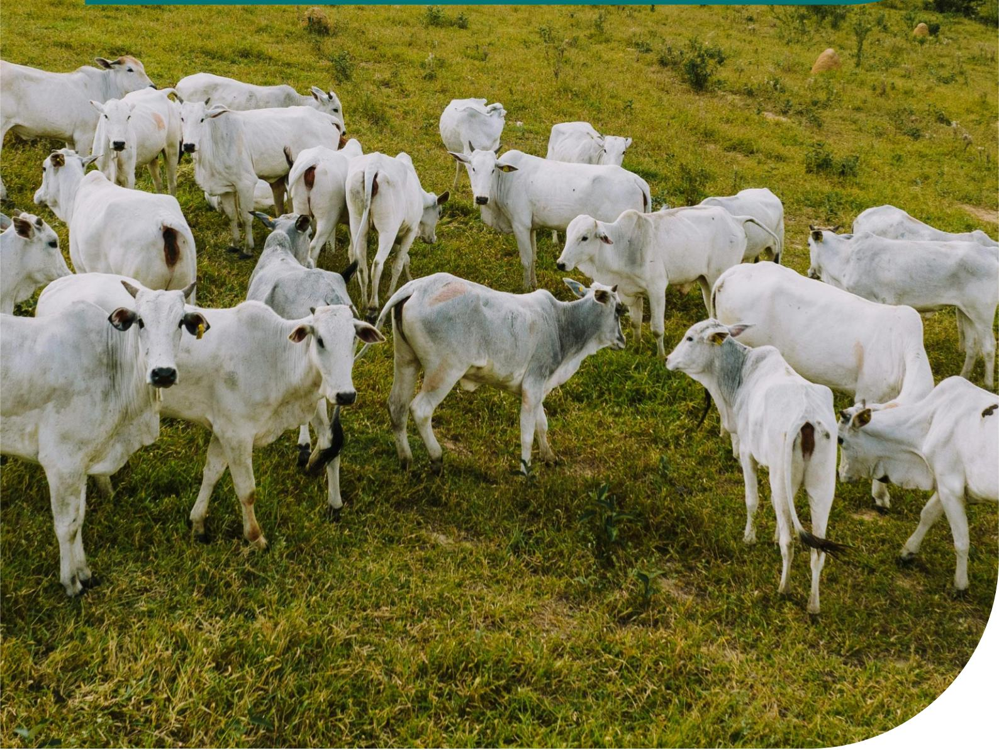

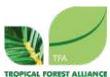

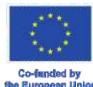

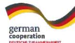

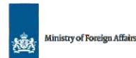

# Instruments in **MERCOSUR** countries to **support** **EUDR** compliance in Beef Supply Chains

*Assessing Instruments in Argentina, Brazil, Paraguay and Uruguay*

# EXECUTIVE SUMMARY

This publicaƟon provides an overview of the main exisƟng instruments in four MERCOSUR countries, which contribute to compliance soluƟons with the new European anƟ-deforestaƟon regulaƟon (EUDR) focusing speciĮcally on the beef sector in ArgenƟna, Brazil, Paraguay and Uruguay.

By assessing the available public informaƟon, in addiƟon to discussions in sector-speciĮc forums, this publicaƟon illustrates the common challenges, the status of available instruments as of February 2025 and the stakeholders involved, seeking to present an integrated and regional view of the progress and needs on EUDR requirements by beef supply chain actors in four countries of the economic bloc.

There were 15 instruments assessed with potenƟal contribuƟons towards compliance with EUDR requirements. Predominantly, these instruments are characterised by being public, with government leadership or originaƟng from a set of partnerships between public and private insƟtuƟons, focusing on the provision of tools at the naƟonal level. In some cases, we also evaluated private tools, such as guides, protocols, and sectoral guidelines, with the potenƟal to contribute signiĮcantly to the EUDR compliance process, whether in traceability, legal compliance, or monitoring suppliers.

Among all the instruments analysed, the most advanced iniƟaƟves stand out due to the level of interacƟon between the public and private sectors, the current stage of implementaƟon, eīorts to integrate technological databases, and the potenƟal for scalability within the country.

Through the creaƟon of technological plaƞorms that seek to integrate traceability databases, informaƟon from producers and geospaƟal systems for monitoring deforestaƟon, MERCOSUR countries are organising themselves to meet requirements of the EUDR according to their local contexts.

The launching of systems such as [VISEC](https://www.visec.com.ar/en/home/) (Sectoral Vision of the Gran Chaco) in ArgenƟna, [AgroBrasil+Sustentável](https://agrobrasil.agricultura.gov.br/abs/home) [Plaƞorm](https://agrobrasil.agricultura.gov.br/abs/home) in Brazil, [RETSA](https://www.mic.gov.py/plataforma-de-trazabilidad-debe-servir-al-exportador-sin-burocracia-ni-sobrecostos/) (Registry of Establishments with Socio-Environmental Traceability) in Paraguay and an [Integrated Digital Plaƞorm](https://www.inac.uy/innovaportal/file/27008/1/uruguay-beef---eudr.pdf) in Uruguay with other geomonitoring databases, present the best scenario to support EUDR compliance at present and reinforce the public commitments of these naƟons and their producƟve sectors towards responsible, transparent and sustainable supply chains.

Photo: Rafael Alvez/Flickr

# SUMMARY

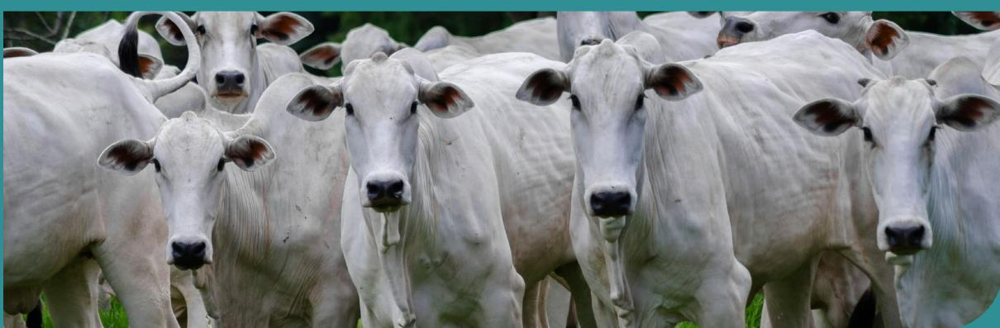

| EXECUTIVE SUMMARY                    | 3  |
|--------------------------------------|----|
| INTRODUCTION                         | 5  |
| SUPPORT EUDR COMPLIANCE              | 7  |
| Cross-Assessment                     | 8  |
| SpeciĮc Country Assessment           | 10 |
| A rgenƟna                            | 10 |
| B rasil                              | 12 |
| P araguay                            | 16 |
| U ruguay                             | 19 |
| NEXT STEPS TO ADDRESS THE CHALLENGES | 22 |
| CONCLUSION                           | 24 |
| REFERENCES                           | 25 |
| GLOSSARY                             | 28 |

# INTRODUCTION

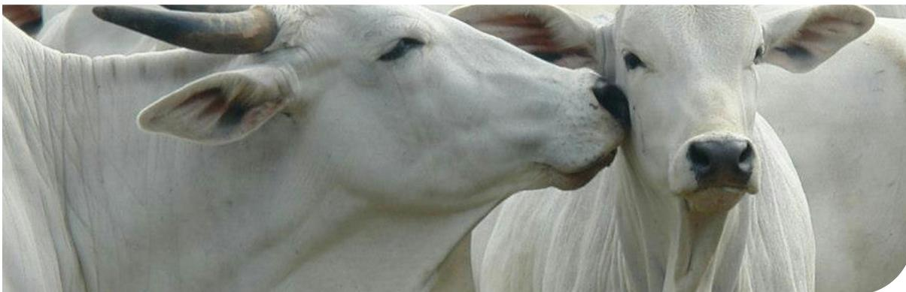

Photo: Herney/Pexels

The EUDR is the European Union Deforestation Regulation that will be mandatory and will require transparency, traceability and monitoring of beef supply chains, as well as their derived products, ensuring that the products to be exported to the EU economic bloc are guaranteed not to be linked to deforestation1.

In the last few years, several countries, both commodity producers and consumers, have outlined reactions about the EUDR and its implementation deadlines, as well as raising doubts and questions about the maturity of the markets to adapt to European legislation, as well as criticism related to the violation of the sovereignty of countries in the international trading system1-2.

Many producing countries reacted to the EUDR by requesting an extension of the implementation deadline, as was the case with a letter signed by 17 (seventeen) developing countries in September 20232, as well as reactions from the US in June 20243 and from Brazil and Argentina in September 20244. On the other hand, in consumer countries in the EU itself, Germany, the bloc's main economy, also questioned the feasibility of implementation for January 20255. The discussions also raised technical and specific questions about the requirements and scope of the new regulation, mainly about the need and challenges of considering additional social and environmental aspects related to the supply chains. Items raised were the inclusion of new raw materials and additional products in scope, and the inclusion of other wooded land and non-forest ecosystems, such as the Cerrado in Brazil and the Pampa in Brazil, Argentina and Uruguay, as well as new obligations for financial institutions6.

This pressure from state actors is likely to have been one of the key factors considered for the deadline postponement for implementation of the EUDR by the trialogue of European institutions, the European

Parliament (EP), the Council of the European Union (CEU) and the European Commission (EC). With the extension approved in December 2024, the EUDR will now enter into force on December 30th, 2025, for large companies and on June 30th, 2026, for small companies7.

Initial impact of EUDR for the four MERCOSUR countries in the beef sector specifically might be minimal; in 2023 only 5.8% of total beef exports from the countries combined went to the EU8-9. The remaining beef exports are primarily directed to countries such as China, the USA, Russia, Egypt, Israel, and Chile, amongst others9.

This scenario may become more urgent, especially if other countries decide to implement similar regulations in the coming years. In this context, governmental and multisectoral initiatives in MERCOSUR countries are being identified to address the growing demand from international markets to comply with socio-environmental criteria.

## Methodology

This is a study that collected data from primary and secondary sources, both public and available on the internet, related to news, decrees and government reports. This includes updates from official government agencies, civil society and sectoral reports related to the EUDR and its interrelation with traceability, monitoring and transparency instruments and solutions in Argentina, Brazil, Paraguay and Uruguay. The data analysis was carried out with the aim of examining the content of the data collected and identifying patterns and common points, as well as the most relevant updates, aiming at specific and cross-assessments of the four MERCOSUR countries in scope.

## BOX 1 - MERCOSUR-EU Agreement and the Beef Sector

In a broader international context, the MERCOSUR-EU Agreement has been negotiated since 1999 and reached its final stage in June 2019, with ambitious and challenging intentions for both economic blocs. In December 2024, leaders of the economic blocs signed a free trade agreement, moving forward to the next step: ratification under national parliaments10.

South American countries reiterate concerns that the EUDR will result in restrictive trade measures and potential unilateral changes to agreements between MERCOSUR and the EU. In this context, it has been pointed out in bilateral negotiations that the EUDR should not be used as a tool for unilateral withdrawal of concessions negotiated throughout the agreement process in recent decades11.

The result achieved by the two economic blocs may be transformative, as the Agreement will bring two of the largest economic blocs in the world closer together. MERCOSUR and the EU represent about 718 million people and a Gross Domestic Product (GDP) of approximately US\$ 22 trillion. In terms of trade volume between the two blocs, this is the largest trade agreement ever negotiated by MERCOSUR and one of the largest agreements signed by the European

Union with trading partners. Furthermore, the agreement also aims for more than a negotiation on volumes, but an integration of legal rules on international trade between blocs10.

In the case of beef, specifically, the agreement establishes quotas of 99 thousand tons with tariffs reduced to 7.5% and for volumes of up to 10 thousand tons, the currently existing Hilton Quota of 20% will be completely zeroed out when the agreement comes into force12. These conditions represent a significant advance to increase the competitiveness of MERCOSUR products in the European market, despite this quota representing only 2% of beef consumption in the EU, a very small share of the market, since about 95% of beef trade in the EU is intra-bloc12.

Critics argue that the MERCOSUR-EU agreement consolidates the expansion of monoculture in South America, historically linked to deforestation and a substantial increase in raw material exports, benefiting the industrialised bloc of Europe with low-cost commodities11. This imbalance favours Europe, while European farmers, especially in France, struggle to compete with South American producers, citing concerns over trade liberalisation and differing socio-environmental standards13.

Photo: IA/FreePik

# THE AVAILABLE INSTRUMENTS IN MERCOSUR COUNTRIES TO SUPPORT EUDR COMPLIANCE

Photo: Tima Miroshnichenko/Pexels

Based on publicly available information, a study of 15 instruments was conducted in four countries to find similarities in existing solutions that support demonstration of compliance with the EUDR. An aggregated cross-country assessment was developed on the main instruments identified in the four Mercosur countries – Argentina, Brazil, Paraguay and Uruguay.

This assessment presents the latest information on the progress in implementation, challenges and lessons learned from these initiatives. Country-specific assessments then provide more detailed and case-specific analyses and observations on the relevant solutions.

In the 4 countries within the scope of this study, the instruments evaluated were:

## Argentina

1. 1. VISEC – Sectoral Vision of the Gran Chaco
2. 2. SIGSA - Integrated Animal Health Management System

## Paraguay

1. 1. RETSA - Registry of Establishments with Socio-Environmental Traceability
2. 2. SITRAP – Voluntary Paraguay Traceability System
3. 3. SIAP - Animal Identification System of Paraguay
4. 4. SIGOR - Regional Office Management Information System

## Brazil

1. 1. AgroBrasil+Sustentável Platform
2. 2. SISBOV - Cattle and Buffalo Individual Identification System
3. 3. Green Seal of Pará and Green Seal of Minas Gerais
4. 4. Subnational Systems - (including Official Bovine Traceability System of Pará - SRBIPA and others)

## Uruguay

1. 1. Integrated Digital Platform
2. 2. SNIG - National Geographic Information System
3. 3. SIRA - Individual Animal Registration System
4. 4. PCNCU – Certified Natural Meat Programme of Uruguay
5. 5. LSQA and FMS - Certificación deforestation-free LSQA

# CROSS-ASSESSMENT

The instruments assessed are primarily public, led by government entities or developed through partnerships between public and private institutions. In addition, we briefly mention private tools, protocols, and sector-specific guidelines, which, despite not having public sector endorsement, have the potential to significantly support the EUDR compliance process.

This analysis aimed to determine the geographic scope of each instrument, whether national, regional, sub-national, or biome-specific, and included an evaluation by instrument type, distinguishing between traceability, monitoring, and transparency systems. It also identified the main stakeholders involved, categorising the instruments as governmental, private, subnational, or multistakeholder.

Among all the instruments analysed, the most advanced initiatives stand out due to the level of interaction between the public and private sectors, the current stage of implementation, efforts to integrate technological databases, and the potential for scalability within the country.

## Instruments Implementation Status

The four countries were still in the implementation phase by the beginning of 2025, having completed the design stage but not yet being fully ready. The expectation is that they will be ready for use in 2025, aligned with the deadline set by the European Union to bring the EUDR into force in December 2025.

## Instruments Ownership

In Argentina, there is a sectoral initiative involving the Consortium of Meat Exporters Argentina ABC as a key stakeholder, working in close dialogue with government agencies, the Secretariat of Agriculture, Cattle and Fisheries (SAGyP) and National Agrifood Health and Quality Service (SENASA), precisely for the integration of technological databases and documentation from government institutions.

In Brazil, Paraguay and Uruguay, leading solutions are mainly governmental, with sectoral support from relevant private agroindustry players, and involving public institutions, ministries and government companies, such as Brazilian Federal Data Processing Service (SERPRO), Brazilian Agricultural Research Corporation (EMBRAPA) and Ministry of Agriculture, Livestock and Food Supply (MAPA) in Brazil, the Ministry of Industry and Trade of Paraguay (MIC), and the Ministry of Livestock, Agriculture and Fisheries of Uruguay (MGAP).

## Technological Integration of Databases

Technological integration among traceability systems, geospatial monitoring and other public databases has been a common challenge in four MERCOSUR countries analysed. It requires technical capacity to integrate systems needed to ensure the analysis and documentation for EUDR compliance, and the proper release of such information to the market and to producers.

In the case of Argentina, VISEC is moving towards automating integrations with SENASA. In Brazil, similar integration efforts are underway by MAPA, who are facing challenges to create a data lake to integrate databases from various public institutions in the AgroBrasil+Sustentável Platform. In the case of Paraguay, RETSA's proposal is to create a system adapted to the needs of the Paraguayan producer, in an agile way, without bureaucracy or costs, and ensuring that capacity building is properly provided for the sector.

Uruguay is the only country to have a national public individual cattle traceability system for more than ten years. Brazil, Argentina and Paraguay have the common structural challenge of increasing transparency in indirect cattle traceability14-15. In Uruguay, as the country already has a mandatory individual traceability system, the challenge is to establish government protocols and integration with a deforestation monitoring database. The government has created an Integrated Digital Platform to meet EUDR requirements. This solution leverages existing information systems, such as SNIG, and incorporates advanced technologies such as satellite imagery, geospatial mapping, and Integrated Digital Platforms to ensure precise monitoring and

effective data management. The Uruguayan private sector, taking advantage of the opportunity to use the country's individual cattle traceability capabilities to leverage EUDR compliance processes, has also been mobilised through export pilots and has developed a private certification scheme led by LSQA in partnership with Farm & Forestry Management (FMS), which is now available.

## Role of Government

National and subnational governments have also demonstrated an essential leadership role in coordinating efforts to create public platforms, dialogue in multi-stakeholder and multilateral spaces to discuss gaps, challenges and progress to support the implementation of EUDR in beef supply chains. In Brazil, Pará State is leading the subnational implementation with the "Pará Cattle Integrity and Development Programme" and **SRBIPA**, defining individual traceability mandatory until December 2026.

In Argentina, the process is advanced, and the government already recognises the VISEC initiative, but also leaves the door open for any other initiative that wants to compete locally. In this sense, in Brazil, Paraguay and Uruguay, the role of national governments and public institutions is also essential for finalising the national systems and making them available to the wide range of users in time to meet the December 2025 deadline.

## Producers' Adherence

In all four countries, one of the challenges is to ensure that producers use the platforms. There is misinformation about the EUDR among producers, and the processes and requirements are still at an early stage of understanding. Furthermore, the European market does not represent the majority of MERCOSUR beef exports and there is little willingness among producers to bear the costs of the due diligence process, which further reinforces the importance of governmental and multisectoral coordination in these efforts.

## Documentation

In the four countries within the scope, there is a high complexity and variety of documents related to beef production. Generally, some documents are considered strategic for any monitoring, verification, and transparency processes in beef supply chains,

linking to national administrations through Ministries or Secretariats. Rural property registries and animal transit documents are common points in the bloc.

In Argentina, there is RENSPA16, the National Sanitary Registry of Agricultural Producers which encompasses all agricultural, livestock, and forestry activities in the rural property and DTe17, an electronic transit document that allows identifying animals by batch, issued through **SIGSA**18 and linked to SENASA19.

In Brazil, the Rural Environmental Registry (CAR)20 is a mandatory national public electronic registry for all rural properties. It integrates environmental information and supports control over rural properties. CAR does not certify land use rights; this is done by INCRA through its Land Management System (SIGEF)21 and through the National Rural Registration System (SNCR) to issue the Rural Property Registration Certificate (CCIR)22. CAR is accepted in beef supply chain monitoring protocols. The Animal Transit Guide (GTA)23, issued by MAPA, is mandatory for animal transport. It includes essential information like origin, destination, purpose, species, and sanitary conditions. Producers buying cattle from fattening or birthing farms are not required to share previous GTA information, and some subnational states issue GTAs on paper, not digitally.

In Paraguay, there is the Establishment Registry (REG)24, where beef producers must have documentation within SENACSA. In terms of traceability, the Official Animal Transit Certificate (COTA)25 sets guidelines for herd movement in the country. Additionally, there are Identification Devices (D.I.)26, where data from the beef establishment and the animals themselves are cross-referenced through **SIGOR**27 and **SITRAP**28.

In Uruguay, the Annual Affidavit (DJA)29-30 and DICOSE31 are crucial tools for managing rural properties, both linked to the Ministry of Livestock, Agriculture, and Fisheries (MGAP). The DJA is a mandatory annual declaration for all rural producers, including information on livestock numbers, land use, and other agricultural activities. DICOSE is a registration system that assigns a unique number to each rural producer, used to identify and control livestock movement and other agricultural activities. In terms of traceability, the Property and Transit Guide (GPT)32 is an official document used in Uruguay to register and authorise the movement of cattle, linked to **SNIG**33 and **SIRA**34, ensuring animal traceability with detailed information about the origin, destination, and sanitary conditions of the transported cattle.

## **SPECIFIC COUNTRY ASSESSMENT**

The agricultural sector in ArgenƟna has taken the lead in implemenƟng the EUDR and has developed its own plaƞorm, [VISEC](https://www.visec.com.ar/en/home/), formerly known as the Sectorial Vision of the Gran Chaco. The plaƞorm uses public informaƟon through legal documents and has signed agreements with the SAGyP, SENASA and Customs CollecƟon and Control Agency (ARCA) to connect informaƟon from producers and obtain the [necessary](https://www.visec.com.ar/en/meat-system/) [assessments and documentaƟon](https://www.visec.com.ar/en/meat-system/)37 .

[VISEC](https://www.visec.com.ar/en/home/) connects with public databases from SENASA to collect Animal Transit documentaƟon, such as the DTe (Electronic Animal Transit Document) and the CUIG (Unique CaƩle IdenƟĮcaƟon Key).

## ARGENTINA

For ArgenƟna, beef exports to Europe represent less than 10% of total beef exports, represenƟng an esƟmate of \$500 million annually to the ArgenƟnian economy35. Although the EU market is not the largest importer in terms of volumes, it sƟll represents a signiĮcant consumer-base for ArgenƟnian beef, falling only behind China in terms of absolute sales35 .

ArgenƟna has a public herd traceability system, [SIGSA](https://www.google.com/url?sa=t&rct=j&q=&esrc=s&source=web&cd=&cad=rja&uact=8&ved=2ahUKEwifgdPtvvWLAxX7GbkGHUfQKykQFnoECFQQAQ&url=https%3A%2F%2Fwww.argentina.gob.ar%2Fsenasa%2Fmesa-de-ayuda-sistema-integrado-de-gestion-de-sanidad-animal-sigsa&usg=AOvVaw03ihb_D7C8MjqcbBrqS_rv&opi=89978449) (ArgenƟna Integrated Animal Health Management System)36, focused on the sanitary control of livestock. It was not originally built to integrate with the monitoring of socio-environmental requirements of the EUDR, but it can contribute to the process.

|           | VISEC (Vision Sectorial del Gran Chaco)                                                                             |
|-----------|---------------------------------------------------------------------------------------------------------------------|
| Scope     | Regional (Gran Chaco biome)                                                                                         |
| Type      | Traceability, Monitoring, and Transparency System                                                                   |
| Ownership | Private & MulƟstakeholder                                                                                           |
|           | The development of VISEC is co-Įnanced by Land InnovaƟon Fund (LIF) and AL-Invest Verde                             |
|           | program 37                                                                                                          |
|           | VISEC (Visión Sectorial Gran Chaco) is an ArgenƟne private iniƟaƟve to ensure the traceability and                  |
| VISEC     | has already conducted pilot tests, exporƟng veriĮed deforestaƟon-free beef to EU 37 . These tests are part of ongo |

|                                                                                                                            | SIGSA (ArgenƟna Integrated Animal Health Management System)                                       |
|----------------------------------------------------------------------------------------------------------------------------|---------------------------------------------------------------------------------------------------|
| Scope                                                                                                                      | NaƟonal                                                                                           |
| Type                                                                                                                       | Traceability System                                                                               |
| Ownership                                                                                                                  | Government                                                                                        |
| Stakeholders                                                                                                               | Ministry of Economy of ArgenƟna and SENASA (NaƟonal Agrifood Health and Quality Service)          |
| Brief DescripƟon                                                                                                           | SIGSA is a public tool for the control of animal health, which allows access to the origin of all |
|                                                                                                                            | bovine products that are moved or traded at naƟonal level 36                                      |
| While SIGSA provides a solid basis for herd traceability and sanitary control, it needs to be integrated with deforestaƟon |                                                                                                   |
| monitoring tools, such as                                                                                                  | VISEC , to support demonstraƟng EUDR compliance. Combining these systems can support              |
| No speciĮc news items were found that directly menƟon                                                                      | SIGSA in relaƟon to the EUDR.                                                                     |

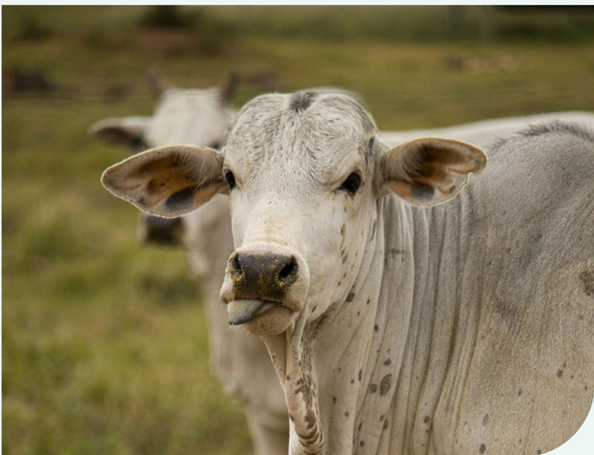

Photo: Laura MonƟcelli/Pexels

In Brazil, it was possible to identify a set of instruments with the potential to contribute to compliance with the EUDR requirements. The [AgroBrasil+Sustentável Platform](#), led by the public sector, is being developed with the primary objective of integrating existing public databases and systems, forming a large data lake so that Brazilian export products meet the highest level of socio-environmental criteria in international markets, including EUDR.

Producer adherence is a key challenge of the main individual cattle traceability system in Brazil, the Cattle and Buffalo Individual Identification System (SISBOV). This is a national-level instrument that can individually monitor cattle through eartags, an important existing system that will be connected with the [AgroBrasil+Sustentável Platform](#), but currently voluntary in nature.

An important step was taken in Brazil in 2024 when MAPA launched the [National Plan for Individual Identification of Cattle and Buffaloes \(PNIB\)](#), a Strategic Plan 2025-2032, which establishes the mandatory traceability by 2032. A Working Group was formed to support its implementation, which establishes mandatory traceability by 2032. A Working Group was formed to support its implementation38.

At the subnational level, the Pará Livestock Chain Integrity Programme (SRBIPA), stands out with the objective of meeting the most demanding requirements of international markets, aiming to establish 100% individual traceability of cattle by 2026 in the Pará State. In this regard, there are other subnational programmes and systems, such as the Mato Grosso, São Paulo and Santa Catarina ([Green Passport Strategy](#)39, [SIRBOV-SP40](#) and [SRBOV-SC41](#), respectively), but it is important to note that state systems do not always fully meet EUDR criteria, as they often have a sanitary traceability premise. However, when integrated with socioenvironmental monitoring, they could support legal compliance parameters.

In the state of Pará, the inclusion of the [CAR in GTAs](#) has proven to be a promising solution and a model to be replicated by other states. Decree No. 1.052/2014 of the state of Pará establishes that the Rural Environmental Registry (CAR) is mandatory for the issuance of the Animal Transport Guide (GTA). The decree was published in the State Official Gazette on May 16, 2014.

This model served as inspiration for another proposal, supported by stakeholders such as the Brazil Coalition of Climate, Forests and Agriculture, the GTFI (Indirect Suppliers Working Group) and Brazilian Association of Meat Exporting Industries (ABIEC). In this case, the CAR information is included in the GTA. An option considered by the industry is to include the historical information of previous GTAs, that supplied the animals from previous farms (indirect suppliers), in the GTA42.

In addition, pre-existing systems, such as the [Green Seal of Pará](#) and the [Green Seal of Minas Gerais](#), also cross-reference a series of databases that contribute to EUDR compliance analysis. In this case, it is worth highlighting the latest update of the [Green Seal of Minas Gerais](#) in 2025, which integrated 1.1 million livestock producers into its system, including traceability of direct and indirect suppliers and possible integration with the [AgroBrasil+Sustentável Platform](#)43.

It is important to mention [VISIPEC](#), a private cattle traceability system for the Amazon and Cerrado biomes44, based on GTA and CAR information, which is voluntary and available to meatpackers. [VISIPEC](#) connects direct and indirect suppliers, enhancing visibility in a meatpacker's supply chain and including indirect suppliers in existing monitoring systems. The tool has the potential to contribute to EUDR compliance processes but was not specifically developed for this purpose.

Sectoral protocols have also been developed in Brazil, such as [Beef on Track](#) and the [Cerrado Protocol](#). The [Beef on Track](#) initiative focuses on the beef production chain in the Legal Amazon region, aiming to implement commitments for a supply chain free from socio-environmental irregularities, in partnership with the Federal Public Prosecutor (MPF). The Beef on Track programme has 12 monitoring criteria. Of these, 11 criteria are used to comply with the Terms of Adjustment of Conduct (TACs), and an additional 12th criterion is applied for zero deforestation geomonitoring from October, 2009, in accordance with the Public Livestock Commitment45-46-47. The [Voluntary Monitoring Protocol for Cattle Suppliers in the Cerrado \(Cerrado Protocol\)](#) is coordinated by Proforest, Imaflora and NWF, including a deliberative council composed of Civil Society organisations, Meatpackers and Purchasing Companies. It sets responsible sourcing criteria and parameters that companies can follow to ensure their

supply chains are not linked with socio-environmental issues. The Cerrado Protocol includes 11 criteria and aims to align the best socio-environmental monitoring pracƟces for caƩle purchases in the Cerrado Biome. All monitoring criteria use publicly available data, and the deĮniƟon of these criteria formed part of an extensive consultaƟon process involving key stakeholders48 .

[Beef on Track](https://www.beefontrack.org/) and the [Cerrado Protocol](https://www.cerradoprotocol.net/) were not developed with the aim of complying with the EUDR, but they are important documents for harmonising sectoral rules for monitoring of suppliers and are widely adopted, even if they do not meet all EUDR parameters, such as monitoring using a 0.5 ha deforestaƟon polygon (the protocols deĮne 6.25 ha)48 .

The general analysis of instruments in Brazil indicates that there are relevant systems for the eīecƟve operaƟonalisaƟon of and compliance with EUDR requirements, but the soluƟons need the technological integraƟon of public databases, as well as overcoming the challenge of individual traceability.

|                                                                                                | AgroBrasil + Sustentável Plaƞorm                                                                                                                    |
|------------------------------------------------------------------------------------------------|-----------------------------------------------------------------------------------------------------------------------------------------------------|
| Scope                                                                                          | NaƟonal                                                                                                                                             |
| Type                                                                                           | Traceability, Monitoring, and Transparency System                                                                                                   |
| Ownership                                                                                      | Government                                                                                                                                          |
| Stakeholders                                                                                   | MAPA, SERPRO and EMBRAPA                                                                                                                            |
| Brief DescripƟon                                                                               | The AgroBrasil + Sustentável Plaƞorm is a digital system, governmental, voluntary and free,                                                         |
|                                                                                                | aims to guarantee the traceability and sustainability of the country’s agricultural producƟon 49 Instrument ContribuƟons to Support EUDR Compliance |
| AgroBrasil+Sustentável Plaƞorm                                                                 | was created to promote compliance of agricultural producƟon with naƟonal legislaƟon and verifying the applicaƟon of good agricultural pracƟces.     |
| The AgroBrasil+Sustentável Plaƞorm                                                             | aims to integrate the necessary public databases in a data lake that will provide                                                                   |
| from sustainability cerƟĮcaƟons and increase their chances of compeƟng in internaƟonal markets | 50 . It is important                                                                                                                                |
| characterisƟcs for supporƟng demonstraƟon of compliance Latest InformaƟon                      | 51                                                                                                                                                  |
| AgroBrasil+Sustentável Plaƞorm Expected ImplementaƟon                                          | was launched in Dec/2024. modules of the plaƞorm are sƟll under development and tests. Launched in December 2024.                                   |

|                                                                                         | Individual Bovine Traceability System of Pará (SRBIPA )                                   |
|-----------------------------------------------------------------------------------------|-------------------------------------------------------------------------------------------|
| Scope                                                                                   | Sub-naƟonal government (Pará state - PA)                                                  |
| Type                                                                                    | Traceability System                                                                       |
| Ownership                                                                               | Sub-naƟonal government                                                                    |
|                                                                                         | (Adepará). The SRBIPA is part of the Livestock Integrity and Development Programme of the |
|                                                                                         | of individually tracking the enƟre caƩle herd in the state by 2026 52                     |
| rural producers and non-governmental organisaƟons                                       | 54 . Adepará established the Animal Control and Traceability Unit                         |
| AddiƟonally, the agency will develop ear tag managers for individual animal idenƟĮcaƟon | 55                                                                                        |

|                                                                                                                            | SISBOV - CaƩle and Buīalo Individual IdenƟĮcaƟon System                                               |
|----------------------------------------------------------------------------------------------------------------------------|-------------------------------------------------------------------------------------------------------|
| Scope                                                                                                                      | NaƟonal                                                                                               |
| Type                                                                                                                       | Traceability System                                                                                   |
| Ownership                                                                                                                  | Government                                                                                            |
| Stakeholders                                                                                                               | MAPA (Ministry of Agriculture and Livestock and Supply)                                               |
| Brief DescripƟon                                                                                                           | SISBOV is an oĸcial system for voluntary individual animal idenƟĮcaƟon of the Ministry of             |
|                                                                                                                            | Agriculture, Livestock and Supply (MAPA) of Brazil 56                                                 |
| SISBOV provides individual traceability focused on animal health and quality. The tool is considered a basis for the caƩle |                                                                                                       |
| traceability in the                                                                                                        | AgroBrasil+Sustentável Plaƞorm. The animals in this system are individually idenƟĮed through ear tags |
| containing a bar code. According to                                                                                        | SISBOV regulaƟons, all traceable animals must remain on the property for at least 90                  |
| The modernisaƟon of                                                                                                        | SISBOV is part of the NaƟonal Policy for Mandatory Individual Traceability and aims to integrate      |
| traceability protocols. This includes updaƟng and uƟlising PGA and/or                                                      | SISBOV systems within MAPA, linking GTA to                                                            |
| individually idenƟĮed animals in                                                                                           | SISBOV 38-57                                                                                          |

|                                                                                                                        | Green Seal of Pará and Green Seal of Minas Gerais                                   |
|------------------------------------------------------------------------------------------------------------------------|-------------------------------------------------------------------------------------|
| Scope                                                                                                                  | Sub-naƟonal government (Pará and Minas Gerais states)                               |
| Type                                                                                                                   | Traceability, Monitoring and Risk Assessment System                                 |
| Ownership                                                                                                              | CIT (Territorial Intelligence Centre) and Federal University of Minas Gerais (UFMG) |
| There are two models of the ‘Green Seal’ tool in Brazil, one covering the state of Pará                                | 58 and the other the state of Minas                                                 |
| Gerais 59 . At this moment, both instruments aim to operate within the caƩle supply chain, oīering a report containing |                                                                                     |
| European Union with the aim of demonstraƟng how the tool can contribute to EUDR compliance processes                   | 60                                                                                  |
| registraƟon of caƩle-producing properƟes                                                                               | 43                                                                                  |

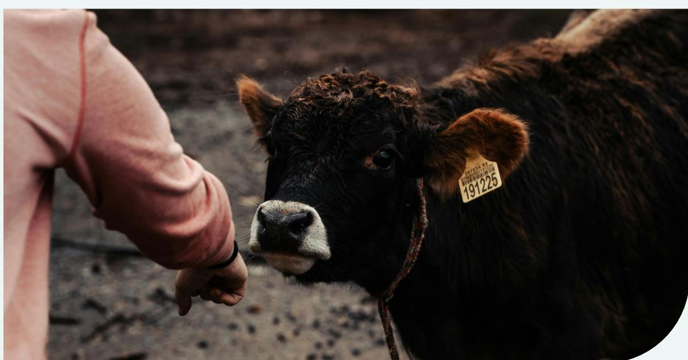

The Grupo Impulsor62 was created in 2021, under the leadership of the Ministry of Industry and Commerce aiming for the implementaƟon and evaluaƟon of socioenvironmental traceability systems that ensure the compeƟƟveness and full access of Paraguayan goods and products in internaƟonal markets63 - 64 .

The Grupo Impulsor is developing the Registry of Establishments with Socio-Environmental Traceability ([RETSA\)](https://www.mic.gov.py/plataforma-de-trazabilidad-debe-servir-al-exportador-sin-burocracia-ni-sobrecostos/), a public system for individual traceability to increase adherence to the Voluntary Traceability System of Paraguay [\(SITRAP](https://www.sitrap.org.py/)). [SITRAP](https://www.sitrap.org.py/) is a voluntary scheme for producers seeking to meet internaƟonal market requirements65. Because it is voluntary, only about 10% of Paraguayan caƩle are registered in the system, which may limit its overall eīecƟveness. Currently, fewer than 200 rural properƟes are enrolled in [SITRAP](https://www.sitrap.org.py/), and parƟcipaƟon has been declining over the years66. This decrease is primarily due to the high compliance burden, extensive procedural and documentaƟon requirements, and the low prices received by producers.

In passing Law No. 7221 of December 21, 2023, with the aim of idenƟfying and registering animals of various species within the country, starƟng with the bovine and buīalo species, Paraguay developed the Animal IdenƟĮcaƟon System ([SIAP\)](https://senacsa.gov.py/servicios/sanidad-animal-identidad-y-trazabilidad/sistema-de-idenfificacion-animal-del-paraguay/). This is a new mandatory beef idenƟĮcaƟon system, managed and supervised by SENACSA (NaƟonal Animal Health and Quality Service) to centralise other documentaƟon required for submission to European authoriƟes, as well as monitoring systems.

The country also has a system for batch traceability, the Paraguay Regional Oĸce Management InformaƟon System of Paraguay [\(SIGOR\)](https://www.sigor.gov.py/web/), that provides real-Ɵme informaƟon on all batch livestock movements and each movement is authorised by SENACSA with a COTA sanitary cerƟĮcate which is not enough for, but can support, EUDR compliance.

|           | RETSA (Registry of Establishments with Socio-Environmental Traceability)                                    |
|-----------|-------------------------------------------------------------------------------------------------------------|
| Scope     | NaƟonal                                                                                                     |
| Type      | Traceability, Monitoring, and Transparency System                                                           |
| Ownership | Government                                                                                                  |
|           | RETSA is a system that facilitates the exporter’s eīorts to comply with the requirements of                 |
|           | internaƟonal markets, including EUDR 67                                                                     |
| RETSA     | , in combinaƟon with SENACSA documentaƟon and the use of exisƟng SITRAP , SIGOR and SIAP tools, is a system |
| RETSA     | was announced in June 2024 and is in the implementaƟon phase during 2025. The workplan sets weekly meeƟngs  |

|              | SIGOR (Paraguay Regional Oĸce Management InformaƟon System)                                                          |
|--------------|----------------------------------------------------------------------------------------------------------------------|
| Scope        | NaƟonal                                                                                                              |
| Type         | Traceability System                                                                                                  |
| Ownership    | Government                                                                                                           |
| Stakeholders | NaƟonal Animal Health and Quality Service (SENACSA)                                                                  |
|              | SIGOR is an essenƟal tool for managing animal health and the traceability of animal products                         |
|              | in the country. SIGOR is designed to control traceability, which is done by batch rather than                        |
|              | registered in SENACSA and in SIGOR 27                                                                                |
| SIGOR        | provides batch traceability and sanitary control, however not individual traceability to enable full compliance with |
| the SIGOR    | system.                                                                                                              |

|           | SITRAP (Voluntary Traceability System of Paraguay)                                                                      |
|-----------|-------------------------------------------------------------------------------------------------------------------------|
| Scope     | NaƟonal                                                                                                                 |
| Type      | Traceability System                                                                                                     |
| Ownership | Government                                                                                                              |
|           | SITRAP is a voluntary, auditable informaƟon system that allows individual idenƟĮcaƟon and                               |
|           | provide individual traceability 28                                                                                      |
| SITRAP    | supports beef exported to the EU to comply with the EUDR with individual traceability. However, it does not             |
|           | registraƟon of caƩle within SITRAP for producers to manage their data in real Ɵme and to generate data at country level |
|           | to access premium markets: the Comprehensive CaƩle Management and RegistraƟon System 69                                 |
| SITRAP    | is implemented and the Comprehensive CaƩle Management and RegistraƟon System is under negoƟaƟon.                        |

|                        | SIAP (Paraguayan Animal IdenƟĮcaƟon System)                                                               |
|------------------------|-----------------------------------------------------------------------------------------------------------|
| Scope                  | NaƟonal                                                                                                   |
| Type                   | Traceability System                                                                                       |
| Ownership              | Government                                                                                                |
| Stakeholders           | SENACSA and Animal Health Services FoundaƟon Fundassa                                                     |
|                        | bovine and buīalo species. SIAP is a mandatory idenƟĮcaƟon system, that involves                          |
| SIAP                   | provides some level of traceability for caƩle movements and sanitary status, but it is not explicitly de |
|                        | signed for EUDR compliance. SIAP could contribute to EUDR compliance if integrated with geolocaƟon data   |
| uted through Fundassa. | SIAP is also integrated with the 2025 vaccinaƟon campaign to streamline processes                         |
|                        | populaƟon of Paraguay will be reached within 10 years 70                                                  |
| The SIAP               | IA/CA mobile app was updated in February 2025 to improve usability. These measures aim to strengthen beef |

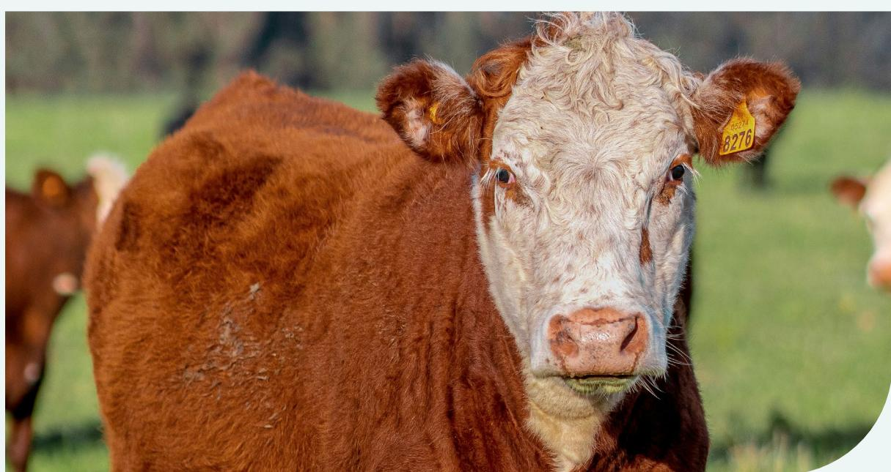

Uruguay is the only country in MERCOSUR with a mandatory national public individual traceability system that reaches 100% of the herd and has been operational for over ten years, the National Cattle Information System (SNIG)33 and the Uruguay Animal Identification and Registration System (SIRA)34.

The SNIG and SIRA are complementary systems in Uruguay, both aimed at traceability and information management of beef production. The SNIG's objective is to manage information about beef, including identification data, movement, and sanitary events. The SIRA was developed to implement mandatory individual traceability of animals by using electronic identifiers. This ensures precise tracking of each animal's movements and sanitary events, enhancing the overall traceability and management of beef33-34. Therefore, SNIG and SIRA can be integrated into a new platform to allow assessments of legal compliance and deforestation monitoring, with a final certificate to prove compliance.

The newly created Integrated Digital Platform led by the National Meat Institute (INAC) will consolidate data from multiple public systems, facilitating comprehensive tracking of cattle movements. This platform will also generate the required documentation to ensure adherence to EUDR, certifying that the beef originates from deforestation-free farms, accompanied by the GEOJSON file. This documentation is then transmitted to the Uruguayan exporting company, which subsequently forwards it to the EU operator71.

In Uruguay there is a specific EUDR compliance private certification for beef, developed by LSQA and FMS72-73,74,75. There is also another public certification, created by INAC is the PCNCU76, to meet the growing demand of international markets for high-quality meat, but with rigorous focus on animal health, packaging and labelling guarantees.

| Integrated Digital Platform                                                                                                                                                                                                                                                                                                                                                                                                                                                                                                                                                                                                                                                                                                                                                                                                                                                                                                                                                                                                                                                                               |                                                                                                                                                                                                                                                                                                                                                                                       |
|-----------------------------------------------------------------------------------------------------------------------------------------------------------------------------------------------------------------------------------------------------------------------------------------------------------------------------------------------------------------------------------------------------------------------------------------------------------------------------------------------------------------------------------------------------------------------------------------------------------------------------------------------------------------------------------------------------------------------------------------------------------------------------------------------------------------------------------------------------------------------------------------------------------------------------------------------------------------------------------------------------------------------------------------------------------------------------------------------------------|---------------------------------------------------------------------------------------------------------------------------------------------------------------------------------------------------------------------------------------------------------------------------------------------------------------------------------------------------------------------------------------|
| Scope                                                                                                                                                                                                                                                                                                                                                                                                                                                                                                                                                                                                                                                                                                                                                                                                                                                                                                                                                                                                                                                                                                     | National                                                                                                                                                                                                                                                                                                                                                                              |
| Type                                                                                                                                                                                                                                                                                                                                                                                                                                                                                                                                                                                                                                                                                                                                                                                                                                                                                                                                                                                                                                                                                                      | Traceability, Monitoring, and Transparency System                                                                                                                                                                                                                                                                                                                                     |
| Ownership                                                                                                                                                                                                                                                                                                                                                                                                                                                                                                                                                                                                                                                                                                                                                                                                                                                                                                                                                                                                                                                                                                 | Government                                                                                                                                                                                                                                                                                                                                                                            |
| Stakeholders                                                                                                                                                                                                                                                                                                                                                                                                                                                                                                                                                                                                                                                                                                                                                                                                                                                                                                                                                                                                                                                                                              | National Meat Institute (INAC)                                                                                                                                                                                                                                                                                                                                                        |
| Brief Description                                                                                                                                                                                                                                                                                                                                                                                                                                                                                                                                                                                                                                                                                                                                                                                                                                                                                                                                                                                                                                                                                         | An Integrated Digital Platform based on pre-existing information systems and uses advanced technology, including satellite imagery, geospatial mapping, and Integrated Digital Platform to ensure accurate monitoring and data management. This platform will gather and integrate information from various public system, enabling Uruguay to track cattle movements 71 . |
| Instrument Contributions to Support EUDR Compliance                                                                                                                                                                                                                                                                                                                                                                                                                                                                                                                                                                                                                                                                                                                                                                                                                                                                                                                                                                                                                                                       |                                                                                                                                                                                                                                                                                                                                                                                       |
| The Integrated Digital Platform can contribute to supporting Uruguay's compliance process with the EUDR, as it aims to integrate existing mandatory traceability systems with geospatial monitoring databases and information from rural producers in the country. This system will produce the necessary documents to confirm that production adheres to the required standards. These documents will include georeferencing of the plots where the relevant products were produced, a statement of compliance, and a list of laws and decrees pertinent to establishing conformity with general and sector-specific regulations and standards, covering areas such as labour rights, human rights, and land use, among others 71 .  To comply with the EUDR provisions, the individual electronic traceability system will be used to enforce segregation for beef, which will be implemented at the slaughterhouse level by the Animal Industry Division (DIA) of Ministry of Livestock, Agriculture and Fisheries (MGAP) to ensure compliance for all shipments destined for the EU. |                                                                                                                                                                                                                                                                                                                                                                                       |
| Latest Information                                                                                                                                                                                                                                                                                                                                                                                                                                                                                                                                                                                                                                                                                                                                                                                                                                                                                                                                                                                                                                                                                        |                                                                                                                                                                                                                                                                                                                                                                                       |
| In October 2024 INAC published the plan to create the Integrated Digital Platform. Initially, introduced for beef and a mixed system will be set up for wood, soybeans, and their derivatives, as well as bovine hides.                                                                                                                                                                                                                                                                                                                                                                                                                                                                                                                                                                                                                                                                                                                                                                                                                                                                                   |                                                                                                                                                                                                                                                                                                                                                                                       |
| Expected Implementation                                                                                                                                                                                                                                                                                                                                                                                                                                                                                                                                                                                                                                                                                                                                                                                                                                                                                                                                                                                                                                                                                   |                                                                                                                                                                                                                                                                                                                                                                                       |
| Expected to be fully implemented in 2025.                                                                                                                                                                                                                                                                                                                                                                                                                                                                                                                                                                                                                                                                                                                                                                                                                                                                                                                                                                                                                                                                 |                                                                                                                                                                                                                                                                                                                                                                                       |

|                                                                                                         | SIRA (Uruguay Animal IdenƟĮcaƟon and RegistraƟon System)                                  |
|---------------------------------------------------------------------------------------------------------|-------------------------------------------------------------------------------------------|
| Scope                                                                                                   | NaƟonal                                                                                   |
| Type                                                                                                    | Traceability System                                                                       |
| Ownership                                                                                               | Government                                                                                |
| Stakeholders                                                                                            | Ministry of Livestock, Agriculture and Fisheries                                          |
|                                                                                                         | SIRA is a tool for traceability and animal health management. It promotes the idenƟĮcaƟon |
|                                                                                                         | individual registraƟon of movements, with or without change of ownership 77               |
| No speciĮc news items were found that directly menƟon Uruguay Animal IdenƟĮcaƟon and RegistraƟon System | (SIRA) in                                                                                 |

|                                                                                                   | SNIG (NaƟonal Livestock InformaƟon System)                                                        |
|---------------------------------------------------------------------------------------------------|---------------------------------------------------------------------------------------------------|
| Scope                                                                                             | NaƟonal                                                                                           |
| Type                                                                                              | Traceability System                                                                               |
| Ownership                                                                                         | Government                                                                                        |
| Stakeholders                                                                                      | Ministry of Livestock, Agriculture and Fisheries                                                  |
|                                                                                                   | SNIG is an informaƟon system that has as its main objecƟve to ensure the traceability             |
|                                                                                                   | Agriculture and Fisheries regulaƟons 33                                                           |
| In August 2024,                                                                                   | SNIG started implemenƟng improvements to the caravan delivery process and registraƟon of animals, |
| producers, by simplifying online registraƟon and acceleraƟng the delivery of electronic idenƟĮers | 78                                                                                                |

|              | CerƟĮcaƟon LSQA y Farm Management System (FMS) - LSQA and FMS                                       |
|--------------|-----------------------------------------------------------------------------------------------------|
| Scope        | NaƟonal                                                                                             |
| Type         | CerƟĮcaƟon Scheme/Quality Assurance Program                                                         |
| Ownership    | Private                                                                                             |
| Stakeholders | LSQA, FMS (Farm & Forestry Management), Uruguay Technology Laboratory, Quality Austria.             |
|              | quality, food safety, environmental sustainability and social responsibility 72                     |
| LSQA and FMS | CerƟĮcaƟon with individual traceability and complementary deforestaƟon monitoring process meets the |
| Dorado 73    |                                                                                                     |

|                                                        | PCNCU (CerƟĮed Natural Meat Program of Uruguay)                                         |
|--------------------------------------------------------|-----------------------------------------------------------------------------------------|
| Scope                                                  | NaƟonal                                                                                 |
| Type                                                   | CerƟĮcaƟon Scheme/Quality Assurance Program                                             |
| Ownership                                              | Government                                                                              |
| Stakeholders                                           | NaƟonal Meat InsƟtute (INAC)                                                            |
|                                                        | PCNCU is an iniƟaƟve created by the INAC to meet the demand of internaƟonal markets for |
|                                                        | producƟon process, from the Įeld to packaging and labelling 76                          |
| Despite containing individual traceability informaƟon, | PCNCU lacks the deforestaƟon and legal compliance monitoring                            |
| No speciĮc news were found that directly menƟon        | PCNCU in relaƟon to EUDR.                                                               |

Challenges persist with the potenƟal impact of the EUDR within the MERCOSUR and on the EU countries. In the Regional Dialogues Project, in partnership with Solidaridad and TFA, funded by GIZ under the SAFE Program, Proforest held a workshop Ɵtled '*Traceability and Transparency in Mercosur: EUDR-readiness in the beef supply chain'* in Punta Del Este, Uruguay,

## NEXT STEPS TO ADDRESS THE CHALLENGES

in October 2024. During this workshop, Proforest presented a parƟal version of this study on Instruments in MERCOSUR to support EUDR compliance and also used the Įnal report from the Iguazu Summit, held in March 2024 in Puerto Iguazu, ArgenƟna, to support discussions on challenges and next steps with the parƟcipants.

**The topics below summarize the key outputs to be further developed with key stakeholders in each country:**

**Challenge 1: Unclear EU procedures and criteria on how to comply with the regulaƟon.**

▶ While the EUDR criteria are clear, the procedures remain vague. For instance, demonstraƟng legality and land use rights must consider the speciĮc realiƟes of each producing country. ▶ European authoriƟes, importers and traders must decide what type of documentaƟon is suĸcient and how producing countries can validate their procedures. ▶ Pilots should be carried out to test the suĸcient documentaƟon to demonstrate human rights, labour, deforestaƟon and other requirements in each country. ▶ More spaces for naƟonal and regional dialogues integrated with the EU representants and new rounds of guidance are needed.

**Challenge 2: Ensure that conĮdenƟal informaƟon remains anonymous throughout the supply chain.**

▶ There is a concern about how supply chain data will be used and shared, as it contains conĮdenƟal informaƟon, such as personal and commercially sensiƟve data. It is important to guarantee transparency of the process in the supply chain by having clear data protecƟon, privacy and security procedures. It is suggested to demonstrate to farmers how their data is transferred and made available throughout the supply chain, including in the EU database. This could be a demonstraƟon pilot or webinar. ▶ It is not clear whether producers will have access to the systems and also their own informaƟon.  

Photo: Kevin Ku/Pexels

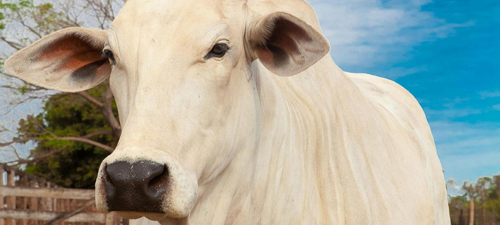

**Challenge 3: Divergences between diīerent monitoring systems or databases, as well as poor quality maps, consƟtute a risk of arbitrary detecƟon of non-compliance.**

▶ Countries already have their naƟonal soluƟons and deĮniƟons of forests and forest degradaƟon, that could lead to concept conŇicts.  ▶ There is a need for established criteria for idenƟfying forest degradaƟon and for dealing with margins of error and who will be responsible for clearing false posiƟves. ▶ Holding technical workshops to discuss common parameters between diīerent concepts and denominaƟons, seeking to integrate rules based on exisƟng commercial agreements.

## **Challenge 4: Gaining the trust of producers to ensure their parƟcipaƟon in traceability soluƟons.**

▶ EUDR requirements can change over Ɵme, increasing unpredictability. ▶ In case of non-compliance, how do producers become compliant again? ▶ There is no assurance of a market incenƟve, and producers do not see a secure return over investment and raise concerns over costs. ▶ There is a lot of bureaucracy for the producer to become cerƟĮed in the systems to demonstrate compliance with the EUDR. ▶ Clearly communicate with the producer about what and how to comply with the EUDR.

## **Challenge 5: Downstream companies (importers)**

▶ CerƟĮcaƟons may not meet all EUDR requirements nor have the same level of supervision and control, in addiƟon to increasing cerƟĮcaƟon costs due to segregaƟon of the supply chain. The Įne for non-compliant is high, so companies are not likely to take risks. ▶ Companies should maintain ongoing eīorts to implement and enhance their EUDR compliance strategies, policies and procedures, to work on the implementaƟon of global DeforestaƟon and Conversion Free (DCF) commitments to eīecƟvely address deforestaƟon and conversion across the enƟre supply base (irrespecƟve of speciĮc requirements under the EUDR). This includes collecƟve acƟon within and beyond individual company supply chains. ▶ Assess and engage suppliers in meeƟng compliance with Traceability and legal supply chain focus. ▶ Work on plans to address unintended consequences of EUDR (inclusion of small-scale producers in highrisk areas). 

Photo: Fredox Carvalho/Pexels

The key stakeholders of ArgenƟna, Brazil, Paraguay and Uruguay are aware of the requirements of the EUDR and are mobilizing governments, private sector and civil society to support compliance with the regulaƟon. In this sense, the role of governments and the private sector in each country has been decisive for the development and technical coordinaƟon between public and private insƟtuƟons for the creaƟon of technological plaƞorms with speciĮc criteria, relying on traceability from birth to slaughter, monitoring legal compliance, deforestaƟon aŌer the EUDR cut-oī date and in the provision of the documentaƟon required by the European authoriƟes.

It is evident, however, that the lack of clarity on procedures is sƟll a challenge to be overcome in spaces for dialogue, both naƟonally and in MERCOSUR, addressing possible misinformaƟon and gaps that have already been idenƟĮed. The integraƟon of databases between the diīerent plaƞorms and systems is one of these main challenges, which further reinforces the need for the government's role as a centralizer of processes, public funds and resources, directly supporƟng companies and rural producers to meet socioenvironmental requirements and ensuring access to the European market and other markets following similar trends.

It is necessary to create an environment of trust, in which producers feel safe in sharing data. This could be accomplished through more dialogues, clear incenƟves and through webinars with the intenƟon of capacity building and transparency.

It is expected, therefore, that in 2025, the most advanced and available instruments, such as [VISEC](https://www.visec.com.ar/en/home/) in ArgenƟna, the [AgroBrasil+Sustentável Plaƞorm](https://agrobrasil.agricultura.gov.br/abs/home) in Brazil, [RETSA](https://www.mic.gov.py/plataforma-de-trazabilidad-debe-servir-al-exportador-sin-burocracia-ni-sobrecostos/) in Paraguay and the [Integrated Digital](https://www.inac.uy/innovaportal/file/27008/1/uruguay-beef---eudr.pdf) [Plaƞorm](https://www.inac.uy/innovaportal/file/27008/1/uruguay-beef---eudr.pdf) in Uruguay, will progress even further in the ĮnalizaƟon of the processes and that they will be able to make them accessible to beef producƟon supply chains in order to support EUDR compliance in Ɵme for the extended date of December 2025.

## CONCLUSION

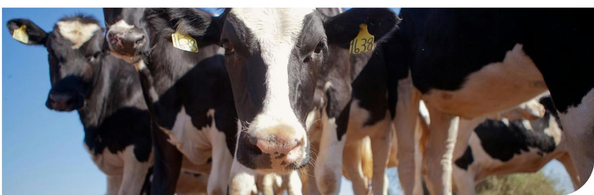

Photo: Fredox Carvalho/Pexels

## REFERENCES

- **1.** APDBrasil. (2024). "**OpportuniƟes for deforestaƟon-free supply chains through producer-consumer country partnerships**". *Agricultural Policies in Debate*. [OpportuniƟes for deforestaƟon-free](https://de.apdbrasil.de/opportunities-for-deforestation-free-supply-chains-through-producer-consumer-country-partnerships/)  [supply chains through producer-consumer country partnerships](https://de.apdbrasil.de/opportunities-for-deforestation-free-supply-chains-through-producer-consumer-country-partnerships/) 
  - [APDBrasil](https://de.apdbrasil.de/opportunities-for-deforestation-free-supply-chains-through-producer-consumer-country-partnerships/)
- **2.** ArgenƟna, Bolivia, Brazil, Colombia, Côte d'Ivoire, Dominican Republic, Ecuador, Ghana, Guatemala, Honduras, Indonesia, Malaysia, Mexico, Nigeria, Paraguay, Peru, and Thailand (2023) "**Joint LeƩer to EU InsƟtuƟons on the EUDR**" [hƩps://thecollab](https://thecollaborativesoyinitiative.info/storage/files/joint-letter-eudr-7-september-2023-2.pdf)[oraƟvesoyiniƟaƟve.info/storage/Įles/joint-leƩer-eudr-7-septem](https://thecollaborativesoyinitiative.info/storage/files/joint-letter-eudr-7-september-2023-2.pdf)[ber-2023-2.pdf](https://thecollaborativesoyinitiative.info/storage/files/joint-letter-eudr-7-september-2023-2.pdf)
- **3.** Argus Market (2024) "**US urges EU to delay deforestaƟon regulaƟons**". *Argus Market: Agriculture, Biomass, FerƟlizers*. [US](https://www.argusmedia.com/en/news-and-insights/latest-market-news/2580301-us-urges-eu-to-delay-deforestation-regulation)  [urges EU to delay deforestaƟon regulaƟon | Latest Market News](https://www.argusmedia.com/en/news-and-insights/latest-market-news/2580301-us-urges-eu-to-delay-deforestation-regulation)
- **4.** *Green European Journal*. (2024). "**EU DeforestaƟon RegulaƟon: Balancing Climate AcƟon and Global Trade Challenges**". [EU](https://www.greeneuropeanjournal.eu/eu-deforestation-regulation-balancing-climate-action-and-global-trade-challenges/)  [DeforestaƟon RegulaƟon: Balancing Climate AcƟon and Global](https://www.greeneuropeanjournal.eu/eu-deforestation-regulation-balancing-climate-action-and-global-trade-challenges/)  [Trade Challenges](https://www.greeneuropeanjournal.eu/eu-deforestation-regulation-balancing-climate-action-and-global-trade-challenges/)
- **5.** CLECAT (2024). "**German Chancellor calls for delay implementaƟon EUDR**". [CLECAT | GERMAN CHANCELLOR CALLS FOR DE-](https://www.clecat.org/en/news/newsletters/german-chancellor-calls-for-delay-implementation-e)[LAY IMPLEMENTATION EUDR](https://www.clecat.org/en/news/newsletters/german-chancellor-calls-for-delay-implementation-e)
- **6.** Deutsche Umwelthlife, Ecologistas en Acción, Forests of the World, Madre Brava, Mighty Earth, Rainforest FoundaƟon Norway (2023). **Why the new EU DeforestaƟon RegulaƟon should include 'Other wooded land'**. [hƩps://www.poliƟco.eu/wp-content/up](https://www.politico.eu/wp-content/uploads/2023/09/21/NGOs-paper_EUDR-definitions_Sept-2023.pdf)[loads/2023/09/21/NGOs-paper\\_EUDR-deĮniƟons\\_Sept-2023.pdf](https://www.politico.eu/wp-content/uploads/2023/09/21/NGOs-paper_EUDR-definitions_Sept-2023.pdf)
- **7.** Consilium (2024). **EU deforestaƟon law: Council agrees to extend applicaƟon Ɵmeline**. [EU deforestaƟon law: Council](https://www.consilium.europa.eu/en/press/press-releases/2024/10/16/eu-deforestation-law-council-agrees-to-extend-application-timeline/)  [agrees to extend applicaƟon Ɵmeline - Consilium](https://www.consilium.europa.eu/en/press/press-releases/2024/10/16/eu-deforestation-law-council-agrees-to-extend-application-timeline/)
- **8.** European Commission (2023). "**Agri-food trade staƟsƟcal factsheet – Mercosur 4**". [agri-food trade staƟsƟcal factsheet - Mer](https://agriculture.ec.europa.eu/system/files/2023-05/agrifood-mercosur-4_en.pdf)[cosur 4](https://agriculture.ec.europa.eu/system/files/2023-05/agrifood-mercosur-4_en.pdf)
- **9.** FAOStats (2025). Food and Agricultura OrganizaƟon of the United NaƟons. **Food and agricultura data.** [hƩps://www.fao.](https://www.fao.org/faostat/en/) [org/faostat/en/#home](https://www.fao.org/faostat/en/)
- **10.** Governo do Brasil (2024). "**Relações Exteriores: Acordo de Parceria Mercosul-União Europeia**". [Noơcias - FACTSHEET -](https://www.gov.br/planalto/pt-br/acompanhe-o-planalto/noticias/2024/12/factsheet-acordo-de-parceria-mercosul-uniao-europeia)  [Acordo de Parceria Mercosul-União Europeia](https://www.gov.br/planalto/pt-br/acompanhe-o-planalto/noticias/2024/12/factsheet-acordo-de-parceria-mercosul-uniao-europeia)
- **11.** Bueno, Guilherme (2024**). Acordo UE-Mercosul: Oportunidade ou DesaĮos Intransponíveis?** Revista de Relações Exteriores. Acordo UE-Mercosul: Oportunidade ou DesaĮos Intransponíveis? » Relações Internacionais
- **12.** Meat & Livestock Australia (2024). "**EU Market Snapshot 2023**" [mla.com.au/contentassets/a8396b0b1b064e6380ed5db](https://www.mla.com.au/contentassets/a8396b0b1b064e6380ed5dbcf1008355/eu_2023-mla-mi-market-snapshot_290124.pdf/)[cf1008355/eu\\_2023-mla-mi-market-snapshot\\_290124.pdf/](https://www.mla.com.au/contentassets/a8396b0b1b064e6380ed5dbcf1008355/eu_2023-mla-mi-market-snapshot_290124.pdf/)
- **13.** Euronews (2024). "**French farmers conƟnue protests against EU-Mercosur free trade agreement**". *My Europe*. [French farm](https://www.euronews.com/my-europe/2024/11/21/french-farmers-continue-protests-against-eu-mercosur-free-trade-agreement)[ers conƟnue protests against EU-Mercosur free trade agree](https://www.euronews.com/my-europe/2024/11/21/french-farmers-continue-protests-against-eu-mercosur-free-trade-agreement)[ment | Euronews](https://www.euronews.com/my-europe/2024/11/21/french-farmers-continue-protests-against-eu-mercosur-free-trade-agreement)
- **14.** Rebufello, P., Piperno, P., Drets, G. (n.d.). "**Uruguay streamlines livestock traceability**". *ESRI*. [Uruguay Streamlines Livestock](https://www.esri.com/news/arcnews/winter1112articles/uruguay-streamlines-livestock-traceability.html)  [Traceability | ArcNews](https://www.esri.com/news/arcnews/winter1112articles/uruguay-streamlines-livestock-traceability.html)
- **15.** Ministerio de Ganadería, Agricultura y Pesca de Uruguay (n.d.). "**Sistema Nacional de Información Agropecuaria**". [Sistema Na](https://www.gub.uy/ministerio-ganaderia-agricultura-pesca/tramites-y-servicios/servicios/sistema-nacional-informacion-agropecuaria)[cional de Información Agropecuaria | MGAP](https://www.gub.uy/ministerio-ganaderia-agricultura-pesca/tramites-y-servicios/servicios/sistema-nacional-informacion-agropecuaria)
- **16.** RENSPA (n.d.). **Registro Nacional Sanitario de Productores Agropecuarios**. [RENSPA | ArgenƟna.gob.ar Registro Nacional](https://www.argentina.gob.ar/senasa/micrositios/renspa)  [Sanitario de Productores Agropecuarios renspa](https://www.argentina.gob.ar/senasa/micrositios/renspa)
- **17.** DTe (n.d.). **Documento de Trânsito Electórnico**. [hƩps://iden](https://identag.com.ar/dt-e-documento-de-transito-electronico-sistema-de-autogestion-ganadera/)[tag.com.ar/dt-e-documento-de-transito-electronico-sistema-](https://identag.com.ar/dt-e-documento-de-transito-electronico-sistema-de-autogestion-ganadera/) [-de-autogesƟon-ganadera/](https://identag.com.ar/dt-e-documento-de-transito-electronico-sistema-de-autogestion-ganadera/)
- **18.** SIGSA (n.d.) Sistema Integrado de GesƟón de Sanidad Animal de ArgenƟna. [hƩps://sigsa-sa.com.ar/](https://sigsa-sa.com.ar/).
- **19.** SENASA (n.d.). **Servicio Nacional de Sanidad y Calidad Agroalimentaria**. [hƩps://identag.com.ar/dt-e-documento-](https://identag.com.ar/dt-e-documento-de-transito-electronico-sistema-de-autogestion-ganadera/) [-de-transito-electronico-sistema-de-autogesƟon-ganadera/](https://identag.com.ar/dt-e-documento-de-transito-electronico-sistema-de-autogestion-ganadera/)
- **20.** CAR (n.d.). **Cadastro Ambiental Rural.** SICAR (Sistema Nacional de Cadastro Ambiental Rural). hƩps://www.car.gov.br/#/ sobre
- **21.** INCRA. InsƟtuto Nacional de Colonização e Reforma Agrária. **Sistema de Gestão Fundiária (SIGEF).** [SIGEF - Sistema de Ges](https://sigef.incra.gov.br/)[tão Fundiária](https://sigef.incra.gov.br/)
- **22.** CCIR (n.d.) **CerƟĮcado de Cadastro de Imóvel Rural**. [CerƟĮca](https://www.gov.br/incra/pt-br/assuntos/governanca-fundiaria/cadastro-imovel-rural)[do de Cadastro de Imóvel Rural - CCIR — Incra](https://www.gov.br/incra/pt-br/assuntos/governanca-fundiaria/cadastro-imovel-rural)
- **23.** GTA (n.d.). **Guia de Trânsito Animal.** [hƩps://www.gov.br/](https://www.gov.br/agricultura/pt-br/assuntos/sanidade-animal-e-vegetal/saude-animal/cgtqa/t_nacional/gta) [agricultura/pt-br/assuntos/sanidade-animal-e-vegetal/sau](https://www.gov.br/agricultura/pt-br/assuntos/sanidade-animal-e-vegetal/saude-animal/cgtqa/t_nacional/gta)[de-animal/cgtqa/t\\_nacional/gta](https://www.gov.br/agricultura/pt-br/assuntos/sanidade-animal-e-vegetal/saude-animal/cgtqa/t_nacional/gta)
- **24.** SENACSA (n.d.). Servicio Nacional de Calidad y Salud Animal. **Registro de Empresas**. [hƩps://www.gov.br/agricultura/pt-](https://www.gov.br/agricultura/pt-br/assuntos/sanidade-animal-e-vegetal/saude-animal/cgtqa/t_nacional/gta) [-br/assuntos/sanidade-animal-e-vegetal/saude-animal/cgt](https://www.gov.br/agricultura/pt-br/assuntos/sanidade-animal-e-vegetal/saude-animal/cgtqa/t_nacional/gta)[qa/t\\_nacional/gta](https://www.gov.br/agricultura/pt-br/assuntos/sanidade-animal-e-vegetal/saude-animal/cgtqa/t_nacional/gta)
- **25.** COTA. **CerƟĮcado OĮcial de Transito de Animales**. [Portal Pa](https://www.paraguay.gov.py/oee/senacsa/694)[raguay | Informaciones y servicios orientados al ciudadano](https://www.paraguay.gov.py/oee/senacsa/694)
- **26.** SENACSA (n.d.). **Resolución N 103 SITRAP Sistema de Trazablidad del Paraguay – version 6. D.I. DisposiƟvo de IdenƟ-Įcación**. [RES 1303.pdf](https://sitrap.org.py/formularios/RES_1303_ReglamentoSITRAP6.pdf)
- **27.** SENACSA (Servicio Nacional de Calidad y Salud Animal). **SI-GOR (Sistema InformáƟco de GesƟón de OĮcinas Regionales).** (n.d.) [hƩps://senacsa.gov.py/servicios/servicios-tecni](https://senacsa.gov.py/servicios/servicios-tecnicos/sigor/)[cos/sigor/.](https://senacsa.gov.py/servicios/servicios-tecnicos/sigor/)
- **28.** SITRAP. (n.d.) **Paraguay Traceability System Frequently asked quesƟons about SITRA.** [hƩps://www.sitrap.org.py/](https://www.sitrap.org.py/preguntas_frecuentes.php) [preguntas\\_frecuentes.php](https://www.sitrap.org.py/preguntas_frecuentes.php)
- **29.** DJA (n.d.). **Declaración Jurada Annual.** [hƩps://www.gub.uy/](https://www.gub.uy/tramites/presentacion-declaracion-jurada-anual-dicose) [tramites/presentacion-declaracion-jurada-anual-dicose](https://www.gub.uy/tramites/presentacion-declaracion-jurada-anual-dicose)
- **30.** SNIG (n.d.) **Informacion sobre declaracion jurada.** [hƩps://](https://www.snig.gub.uy/principal/snig-tramites-y-servicios-informacion-sobre-declaracion-jurada) [www.snig.gub.uy/principal/snig-tramites-y-servicios-infor](https://www.snig.gub.uy/principal/snig-tramites-y-servicios-informacion-sobre-declaracion-jurada)[macion-sobre-declaracion-jurada](https://www.snig.gub.uy/principal/snig-tramites-y-servicios-informacion-sobre-declaracion-jurada)
- **31.** DICOSE (n.d.). **¿Cuándo y cómo debe presentar su declaración jurada de Dicose?** [hƩps://acg.com.uy/cuando-y-](https://acg.com.uy/cuando-y-como-debe-presentar-su-declaracion-jurada-de-dicose/) [-como-debe-presentar-su-declaracion-jurada-de-dicose/](https://acg.com.uy/cuando-y-como-debe-presentar-su-declaracion-jurada-de-dicose/)
- **32.** GPT (n.d.). **Guía de Propiedad y Tránsito**. [hƩps://www.gub.](https://www.gub.uy/ministerio-ganaderia-agricultura-pesca/comunicacion/publicaciones/confeccion-guia-propiedad-transito) [uy/ministerio-ganaderia-agricultura-pesca/comunicacion/](https://www.gub.uy/ministerio-ganaderia-agricultura-pesca/comunicacion/publicaciones/confeccion-guia-propiedad-transito) [publicaciones/confeccion-guia-propiedad-transito](https://www.gub.uy/ministerio-ganaderia-agricultura-pesca/comunicacion/publicaciones/confeccion-guia-propiedad-transito)
- **33.** SNIG. (n.d.). Sistema Nacional de Información Ganadera (n.d.). "**ObjeƟvos del Snig**". [SNIG - Sistema Nacional de Infor](https://capacitacion.snig.gub.uy/principal/snig-sistema-nacional-de-informacion-ganadera-objetivos)[mación Ganadera - ObjeƟvos](https://capacitacion.snig.gub.uy/principal/snig-sistema-nacional-de-informacion-ganadera-objetivos)
- **34.** SIRA. **Sistema de IdenƟĮcación y Registro Animal**. [hƩps://](https://www.gub.uy/ministerio-ganaderia-agricultura-pesca/sites/ministerio-ganaderia-agricultura-pesca/files/2020-07/DGSG_N%C2%BA%2064_2009_Instructivo1_a_4.pdf) [www.gub.uy/ministerio-ganaderia-agricultura-pesca/sites/](https://www.gub.uy/ministerio-ganaderia-agricultura-pesca/sites/ministerio-ganaderia-agricultura-pesca/files/2020-07/DGSG_N%C2%BA%2064_2009_Instructivo1_a_4.pdf) [ministerio-ganaderia-agricultura-pesca/Įles/2020-07/DGS-](https://www.gub.uy/ministerio-ganaderia-agricultura-pesca/sites/ministerio-ganaderia-agricultura-pesca/files/2020-07/DGSG_N%C2%BA%2064_2009_Instructivo1_a_4.pdf)[G\\_N%C2%BA%2064\\_2009\\_InstrucƟvo1\\_a\\_4.pdf](https://www.gub.uy/ministerio-ganaderia-agricultura-pesca/sites/ministerio-ganaderia-agricultura-pesca/files/2020-07/DGSG_N%C2%BA%2064_2009_Instructivo1_a_4.pdf)
- **35.** *Tri-State Livestock News* (2024). "**ArgenƟna: 'Deforesta-Ɵon-free' cerƟĮed beef exports to EU**". [ArgenƟna: 'Defores](https://www.tsln.com/news/argentina-deforestation-free-certified-beef-exports-to-eu/)[taƟon-free' cerƟĮed beef exports to EU | TSLN.com](https://www.tsln.com/news/argentina-deforestation-free-certified-beef-exports-to-eu/)
- **36.** SIGSA (n.d.). "**Mesa de Ayuda Sistema Integrado de GesƟón de Sanidad Animal (SIGSA)**". [Mesa de Ayuda – Sistema Integra](https://www.argentina.gob.ar/senasa/mesa-de-ayuda-sistema-integrado-de-gestion-de-sanidad-animal-sigsa)[do de GesƟón de Sanidad Animal \(SIGSA\) | ArgenƟna.gob.ar](https://www.argentina.gob.ar/senasa/mesa-de-ayuda-sistema-integrado-de-gestion-de-sanidad-animal-sigsa)

- **37.** VISEC. (n.d.). Vision Sectorial del Gran Chaco. [hƩps://www.](https://www.visec.com.ar/en/home/) [visec.com.ar/en/home/](https://www.visec.com.ar/en/home/)
- **38.** PNIB. Ministério da Agricultura e Pecuária (2024). "**PLANO NACIONAL DE IDENTIFICAÇÃO INDIVIDUAL DE BOVINOS E BÚFALOS – PNIB** - **Plano Estratégico 2025 – 2032**". [PNIBVerso-](https://www.gov.br/agricultura/pt-br/assuntos/sanidade-animal-e-vegetal/saude-animal/rastreabilidade-animal/PNIBVersofinalsemassinaturas.pdf)[Įnalsemassinaturas.pdf](https://www.gov.br/agricultura/pt-br/assuntos/sanidade-animal-e-vegetal/saude-animal/rastreabilidade-animal/PNIBVersofinalsemassinaturas.pdf)
- **39.** InsƟtuto Mato Grossense da Carne IMAC (2024). "**Estratégia do Passaporte Verde é desmatamento ilegal zero e respeito à produção de MT.** [Estratégia do Passaporte Verde é desmata](https://imac.agr.br/estrategia-do-passaporte-verde-e-desmatamento-ilegal-zero-e-respeito-a-producao-de-mt/)[mento ilegal zero e respeito à produção de MT - Imac](https://imac.agr.br/estrategia-do-passaporte-verde-e-desmatamento-ilegal-zero-e-respeito-a-producao-de-mt/)
- **40.** Defesa Agropecuária do Estado de São Paulo (2018). " **SISBOV** 
  - **Sistema Brasileiro de IdenƟĮcação Individual de Bovinos e Búfalos.** [hƩps://www.defesa.agricultura.sp.gov.br/www/pro](https://www.defesa.agricultura.sp.gov.br/www/programas/?/sanidade-animal/sisbov-sistema-brasileiro-de-identificacao-individual-de-bovinos-e-bufalos/&cod=65)[gramas/?/sanidade-animal/sisbov-sistema-brasileiro-de-iden-](https://www.defesa.agricultura.sp.gov.br/www/programas/?/sanidade-animal/sisbov-sistema-brasileiro-de-identificacao-individual-de-bovinos-e-bufalos/&cod=65)[ƟĮcacao-individual-de-bovinos-e-bufalos/&cod=65](https://www.defesa.agricultura.sp.gov.br/www/programas/?/sanidade-animal/sisbov-sistema-brasileiro-de-identificacao-individual-de-bovinos-e-bufalos/&cod=65)
- **41.** Companhia Integrada de Desenvolvimento Agrícola 2024 CI-DASC. **Sistema idenƟĮcação individual e de rastreabilidade de bovinos e bubalinos completa 16 anos em Santa Catarina**. [Sis](https://estado.sc.gov.br/noticias/sistema-de-identificacao-e-rastreabilidade-de-bovinos-e-bubalinos-completa-16-anos-em-santa-catarina/)[tema idenƟĮcação individual e de rastreabilidade de bovinos](https://estado.sc.gov.br/noticias/sistema-de-identificacao-e-rastreabilidade-de-bovinos-e-bubalinos-completa-16-anos-em-santa-catarina/)  [e bubalinos completa 16 anos em Santa Catarina - Agência de](https://estado.sc.gov.br/noticias/sistema-de-identificacao-e-rastreabilidade-de-bovinos-e-bubalinos-completa-16-anos-em-santa-catarina/)  [Noơcias SECOM](https://estado.sc.gov.br/noticias/sistema-de-identificacao-e-rastreabilidade-de-bovinos-e-bubalinos-completa-16-anos-em-santa-catarina/)
- **42.** Brazilian CoaliƟon of Climate, Forest and Agriculture, 2020. **Traceability of the Beef Chain in Brazil: Challenges and OpportuniƟes.** Final Report and RecommendaƟons. [https://www.coalizaobr.com.br/boletins/pdf/A-rastreabili](https://www.coalizaobr.com.br/boletins/pdf/A-rastreabilidade-da-cadeia-da-carne-bovina-no-Brasil-desafios-e-oportunidades_relatorio-final-e-recomendacoes.pdf)[dade-da-cadeia-da-carne-bovina-no-Brasil-desafios-e-opor](https://www.coalizaobr.com.br/boletins/pdf/A-rastreabilidade-da-cadeia-da-carne-bovina-no-Brasil-desafios-e-oportunidades_relatorio-final-e-recomendacoes.pdf)[tunidades\\_relatorio-Įnal-e-recomendacoes.pdf](https://www.coalizaobr.com.br/boletins/pdf/A-rastreabilidade-da-cadeia-da-carne-bovina-no-Brasil-desafios-e-oportunidades_relatorio-final-e-recomendacoes.pdf)
- **43.** Canal Rural, 2024. "**Plataforma Selo Verde agora inclui bovinocultura e fortalece rastreabilidade ambiental**". [hƩps://giro](https://girodoboi.canalrural.com.br/pecuaria/certificacoes-e-qualidade/plataforma-selo-verde-agora-inclui-bovinocultura-e-fortalece-rastreabilidade-ambiental/)[doboi.canalrural.com.br/pecuaria/cerƟĮcacoes-e-qualidade/](https://girodoboi.canalrural.com.br/pecuaria/certificacoes-e-qualidade/plataforma-selo-verde-agora-inclui-bovinocultura-e-fortalece-rastreabilidade-ambiental/) [plataforma-selo-verde-agora-inclui-bovinocultura-e-fortalece-](https://girodoboi.canalrural.com.br/pecuaria/certificacoes-e-qualidade/plataforma-selo-verde-agora-inclui-bovinocultura-e-fortalece-rastreabilidade-ambiental/) [-rastreabilidade-ambiental/](https://girodoboi.canalrural.com.br/pecuaria/certificacoes-e-qualidade/plataforma-selo-verde-agora-inclui-bovinocultura-e-fortalece-rastreabilidade-ambiental/)
- **44.** VISIPEC. (n.d.). **Visualizando as cadeias de fornecimento da pecuária brasileira para melhorar a rastreabilidade e fortalecer o monitoramento do desmatamento**. [VISIPEC – This web](https://www.visipec.com/pt/home/)[site provides informaƟon on Visipec, a new tool to enhance](https://www.visipec.com/pt/home/)  [traceability and strengthen deforestaƟon monitoring in the](https://www.visipec.com/pt/home/)  [Brazilian caƩle sector.](https://www.visipec.com/pt/home/)
- **45.** Beef on Track, 2022. **AMAZON CATTLE SUPPLIERS MONITOR-ING PROTOCOL - Guidelines for the implementaƟon of the TACs for the Amazon and the Public Commitment to Livestock**. [Fluxograma-Protocolo-de-Monitoramento.pdf](https://www.boinalinha.org/wp-content/uploads/2022/08/Fluxograma-Protocolo-de-Monitoramento.pdf)
- **46.** Beef on Track (2024). "**Cinco anos de Boi na Linha Grandes avanços e muitos desaĮos**". [Cinco anos de Boi na Linha – gran](https://www.boinalinha.org/cinco-anos-de-boi-na-linha-grandes-avancos-e-muitos-desafios/)[des avanços e muitos desaĮos – BOI NA LINHA](https://www.boinalinha.org/cinco-anos-de-boi-na-linha-grandes-avancos-e-muitos-desafios/)
- **47.** Globo Rural Mato Grosso (2024). "**Programa Boi na Linha visa fortalecer o compromisso socioambiental, diz coordenadora**". *Mato Grosso Rural*. [Programa Boi na Linha visa fortalecer o](https://matogrosso.canalrural.com.br/entretenimento/estudio-rural/programa-boi-na-linha-visa-fortalecer-o-compromisso-socioambiental-diz-coordenadora/)  [compromisso socioambiental, diz coordenadora](https://matogrosso.canalrural.com.br/entretenimento/estudio-rural/programa-boi-na-linha-visa-fortalecer-o-compromisso-socioambiental-diz-coordenadora/)
- **48.** Cerrado Protocol, 2025. **Voluntary Monitoring Protocol for CaƩle Suppliers in the Cerrado**. [hƩps://www.cerradoprotocol.](https://www.cerradoprotocol.net/the-cerrado-protocol) [net/the-cerrado-protocol](https://www.cerradoprotocol.net/the-cerrado-protocol)
- **49.** Ministério do Desenvolvimento, Indústria, Comércio e Serviços. (2024). **Plataforma AgroBrasil+Sustentável**. [Agro Brasil](https://agrobrasil.agricultura.gov.br/abs/home)  [+Sustentável](https://agrobrasil.agricultura.gov.br/abs/home)
- **50.** Ministério do Desenvolvimento, Indústria, Comércio e Serviços. (2024). " **Relatório emiƟdo pela Plataforma AgroBrasil + Sustentável vai possibilitar agregação de valor à produção agropecuária**." [hƩps://www.gov.br/agricultura/pt-br/assun](https://www.gov.br/agricultura/pt-br/assuntos/noticias/relatorio-emitido-pela-plataforma-agrobrasil-sustentavel-vai-possibilitar-agregacao-de-valor-a-producao-agropecuaria)[tos/noƟcias/relatorio-emiƟdo-pela-plataforma-agrobrasil-sus](https://www.gov.br/agricultura/pt-br/assuntos/noticias/relatorio-emitido-pela-plataforma-agrobrasil-sustentavel-vai-possibilitar-agregacao-de-valor-a-producao-agropecuaria)[tentavel-vai-possibilitar-agregacao-de-valor-a-producao-agro](https://www.gov.br/agricultura/pt-br/assuntos/noticias/relatorio-emitido-pela-plataforma-agrobrasil-sustentavel-vai-possibilitar-agregacao-de-valor-a-producao-agropecuaria)[pecuaria](https://www.gov.br/agricultura/pt-br/assuntos/noticias/relatorio-emitido-pela-plataforma-agrobrasil-sustentavel-vai-possibilitar-agregacao-de-valor-a-producao-agropecuaria)
- **51.** Ministério da Agricultura e (MAPA) Pecuária. (2024.) **Plataforma Agro Brasil+Sustentável é apresentada à comissão da União Europeia** [Plataforma Agro Brasil+Sustentável é apresen](https://www.gov.br/agricultura/pt-br/assuntos/noticias/plataforma-brasil-sustentavel-e-apresentada-a-comissao-da-uniao-europeia)[tada à comissão da União Europeia — Ministério da Agricultu](https://www.gov.br/agricultura/pt-br/assuntos/noticias/plataforma-brasil-sustentavel-e-apresentada-a-comissao-da-uniao-europeia)[ra e Pecuária](https://www.gov.br/agricultura/pt-br/assuntos/noticias/plataforma-brasil-sustentavel-e-apresentada-a-comissao-da-uniao-europeia)
- **52.** Pará State Secretariat of Environment and Sustainability (SEMAS-PA), 2023. **Livestock Integrity and Development Program of the Pará state. DECREE No. 3,533, OF NOVEM-BER 27, 2023**. [hƩps://www.semas.pa.gov.br/legislacao/Įles/](https://www.semas.pa.gov.br/legislacao/files/pdf/406042.pdf) [pdf/406042.pdf](https://www.semas.pa.gov.br/legislacao/files/pdf/406042.pdf)
- **53.** Noơcias Agrícolas. (2023). "**Governo do Pará lança rastreamento obrigatório de gado para combater desmatamento**". [Governo do Pará lança rastreamento obrigatório de gado para](https://www.noticiasagricolas.com.br/noticias/boi/365134-governo-do-para-lanca-rastreamento-obrigatorio-de-gado-para-combater-desmatamento.html) [combater... - Noơcias Agrícolas](https://www.noticiasagricolas.com.br/noticias/boi/365134-governo-do-para-lanca-rastreamento-obrigatorio-de-gado-para-combater-desmatamento.html)
- **54.** ImaŇora (2024). "**Primeiro boi com rastreio socioambiental inaugura nova era para a pecuária brasileira**". [Noơcias - Pri](https://www.imaflora.org/noticia/primeiro-boi-com-rastreio-socioambiental-inaugura-nova-era-para-a-pecuaria-brasileira)[meiro boi com rastreio socioambiental inaugura nova era para](https://www.imaflora.org/noticia/primeiro-boi-com-rastreio-socioambiental-inaugura-nova-era-para-a-pecuaria-brasileira) [a pecuária brasileira - ImaŇora](https://www.imaflora.org/noticia/primeiro-boi-com-rastreio-socioambiental-inaugura-nova-era-para-a-pecuaria-brasileira)
- **55.** SIGEAGRO (n.d.). **Agência de Defesa Agropecuária do Pará SIGEAGRO**. [Sigeagro](https://sigeagro.adepara.pa.gov.br/)
- **56.** Ministério da Agricultura e Pecuária (2024). "**Sistema Brasileiro de IdenƟĮcação e CerƟĮcação de Origem Bovina e Bubalina** - **SISBOV**". [SISBOV — Ministério da Agricultura e Pecuária](https://www.gov.br/agricultura/pt-br/assuntos/sanidade-animal-e-vegetal/saude-animal/cgtqa/dpc/sisbov)
- **57.** Mesa Brasileira da Pecuária Sustentável, Coalização Brasil, Clima, Florestas e Agricultura, Grupo de Trabalho (GT) de Rastreabilidade (2024), "**Proposta de PolíƟca Nacional de Rastreabilidade Individual Obrigatória**". [240319\\_Proposta-de-Po](https://coalizaobr.com.br/wp-content/uploads/2024/04/240319_Proposta-de-Politica-Publica-de-Rastreabilidade.pdf)[liƟca-Publica-de-Rastreabilidade.pdf.](https://coalizaobr.com.br/wp-content/uploads/2024/04/240319_Proposta-de-Politica-Publica-de-Rastreabilidade.pdf)
- **58.** Selo Verde Pará. **Plataforma Selo Verde no estado do Pará- -PA**. [Selo Verde](https://www.semas.pa.gov.br/seloverde/)
- **59.** Selo Verde Minas Gerais. **Plataforma Selo Verde no estado de Minas Gerais-MG**. [SeloVerde MG.](https://seloverde.meioambiente.mg.gov.br/en/home-english/)
- **60.** Pará, State Government. Secretariat of Environment and Sustainability (2021). **Pará presents SeloVerde plaƞorm for European Union ambassadors**. **[SEMAS - Pará apresenta platafor](https://www.semas.pa.gov.br/2021/08/06/para-apresenta-plataforma-seloverde-para-embaixadores-da-uniao-europeia/)[ma SeloVerde para embaixadores da União Europeia](https://www.semas.pa.gov.br/2021/08/06/para-apresenta-plataforma-seloverde-para-embaixadores-da-uniao-europeia/)**
- **61.** G1 Um Só Planeta (2024) "**COP28: Pará lança programa de rastreabilidade de gado em esforço contra desmatamento e mais transparência na cadeia**". *Um Só Planeta*. [COP28: Pará](https://umsoplaneta.globo.com/clima/cop/noticia/2023/12/01/cop28-para-lanca-programa-de-rastreabilidade-de-gado-em-esforco-contra-desmatamento-e-mais-transparencia-na-cadeia.ghtml) [lança programa de rastreabilidade de gado em esforço contra](https://umsoplaneta.globo.com/clima/cop/noticia/2023/12/01/cop28-para-lanca-programa-de-rastreabilidade-de-gado-em-esforco-contra-desmatamento-e-mais-transparencia-na-cadeia.ghtml) [desmatamento e mais transparência na cadeia | COP | Um só](https://umsoplaneta.globo.com/clima/cop/noticia/2023/12/01/cop28-para-lanca-programa-de-rastreabilidade-de-gado-em-esforco-contra-desmatamento-e-mais-transparencia-na-cadeia.ghtml) [Planeta](https://umsoplaneta.globo.com/clima/cop/noticia/2023/12/01/cop28-para-lanca-programa-de-rastreabilidade-de-gado-em-esforco-contra-desmatamento-e-mais-transparencia-na-cadeia.ghtml)
- **62.** Ministério de Industria y Comercio del Paraguay, 2024. **Resolución N.º 368 – Grupo Impulsor**. [hƩps://www.mic.gov.py/](https://www.mic.gov.py/wp-content/uploads/2024/05/F_Resolucion-368.2024-conformacion-grupo-impulsor-y-se-abrogan-la-344-y-363.pdf) [wp-content/uploads/2024/05/F\\_Resolucion-368.2024-confor](https://www.mic.gov.py/wp-content/uploads/2024/05/F_Resolucion-368.2024-conformacion-grupo-impulsor-y-se-abrogan-la-344-y-363.pdf)[macion-grupo-impulsor-y-se-abrogan-la-344-y-363.pdf](https://www.mic.gov.py/wp-content/uploads/2024/05/F_Resolucion-368.2024-conformacion-grupo-impulsor-y-se-abrogan-la-344-y-363.pdf)
- **63.** Ministerio de Industria y Comercio de Paraguay (2024). "**Reunión de trabajo sobre el Registro de Establecimientos con Trazabilidad Socioambiental (RETSA) de la carne paraguaya**". [Reunión de trabajo sobre el Registro de Establecimientos con](https://www.mic.gov.py/reunion-de-trabajo-sobre-el-registro-de-establecimientos-con-trazabilidad-socioambiental-retsa-de-la-carne-paraguaya/) [Trazabilidad Socioambiental \(RETSA\) de la carne paraguaya –](https://www.mic.gov.py/reunion-de-trabajo-sobre-el-registro-de-establecimientos-con-trazabilidad-socioambiental-retsa-de-la-carne-paraguaya/) [.::MIC::.](https://www.mic.gov.py/reunion-de-trabajo-sobre-el-registro-de-establecimientos-con-trazabilidad-socioambiental-retsa-de-la-carne-paraguaya/)
- **64.** MarketData (2024). "**Avanza la puesta em marcha del sistema digital de gesƟón ganadera, que facilitará el acceso a mercados premium**". [Avanza la puesta en marcha del sistema digital](https://marketdata.com.py/noticias/avanza-la-puesta-en-marcha-del-sistema-digital-de-gestion-ganadera-que-facilitara-el-acceso-a-mercados-premium-137303/) [de gesƟón ganadera, que facilitará el acceso a mercados pre](https://marketdata.com.py/noticias/avanza-la-puesta-en-marcha-del-sistema-digital-de-gestion-ganadera-que-facilitara-el-acceso-a-mercados-premium-137303/)[mium - MarketData](https://marketdata.com.py/noticias/avanza-la-puesta-en-marcha-del-sistema-digital-de-gestion-ganadera-que-facilitara-el-acceso-a-mercados-premium-137303/)
- **65.** SITRAP. (n.d.) **Paraguay Traceability System.** [hƩps://www.si](https://www.sitrap.org.py/)[trap.org.py/.](https://www.sitrap.org.py/)
- **66.** SITRAP. (n.d.) **Paraguay Traceability System Listado de Establecimientos Ganaderos SITRAP.**[sitrap SENACSA \(9\)\\_9kdjp4uq.pdf](https://sitrap.org.py/admin/listados/sitrap%20%20SENACSA%20(9)_9kdjp4uq.pdf)

- **67.** Agencia de Información Paraguaya (2024). **Paraguay presents Registry of Establishments with Socio-environmental Traceability at Sial Paris 2024.** [hƩps://www.ip.gov.py/ip/2024/10/22/](https://www.ip.gov.py/ip/2024/10/22/paraguay-presents-registry-of-establishments-with-socio-environmental-traceability-at-sial-paris-2024/) [paraguay-presents-registry-of-establishments-with-socio-envi](https://www.ip.gov.py/ip/2024/10/22/paraguay-presents-registry-of-establishments-with-socio-environmental-traceability-at-sial-paris-2024/)[ronmental-traceability-at-sial-paris-2024/.](https://www.ip.gov.py/ip/2024/10/22/paraguay-presents-registry-of-establishments-with-socio-environmental-traceability-at-sial-paris-2024/)
- **68.** Agencia de Información Paraguaya (2024). "**Plataforma de trazabilidad permiƟrá al Paraguay exportar sin burocracia ni sobrecostos**". [Plataforma de trazabilidad permiƟrá al Para](https://www.ip.gov.py/ip/2024/06/25/plataforma-de-trazabilidad-permitira-al-paraguay-exportar-sin-burocracia-ni-sobrecostos-afirma-ministro/)[guay exportar sin burocracia ni sobrecostos, aĮrma ministro](https://www.ip.gov.py/ip/2024/06/25/plataforma-de-trazabilidad-permitira-al-paraguay-exportar-sin-burocracia-ni-sobrecostos-afirma-ministro/) 
  - [.::Agencia IP::.](https://www.ip.gov.py/ip/2024/06/25/plataforma-de-trazabilidad-permitira-al-paraguay-exportar-sin-burocracia-ni-sobrecostos-afirma-ministro/)
- **69.** Asociación Rural del Paraguay (ARP) (2024). **ARP y MITIC avanzan en la implementación de un innovador sistema digital ganadero**. [ARP y MITIC avanzan en la implementación de un innovador siste](https://www.arp.org.py/index.php?option=com_content&view=article&id=4111:arp-y-mitic-avanzan-en-la-implementacion-de-un-innovador-sistema-digital-ganadero&catid=16&Itemid=116)[ma digital ganadero - Asociación Rural del Paraguay](https://www.arp.org.py/index.php?option=com_content&view=article&id=4111:arp-y-mitic-avanzan-en-la-implementacion-de-un-innovador-sistema-digital-ganadero&catid=16&Itemid=116)
- **70.** ABC Color (2025). "**SENACSA estableció reglamentación del SIAP: ¿Cual será el alcande em este primer período?**". [Senac](https://www.abc.com.py/economia/2024/12/26/senacsa-establecio-reglamentacion-del-siap-cual-sera-el-alcance-en-este-primer-periodo/)[sa estableció reglamentación del SIAP: ¿cuál será el alcance en](https://www.abc.com.py/economia/2024/12/26/senacsa-establecio-reglamentacion-del-siap-cual-sera-el-alcance-en-este-primer-periodo/)  [este primer periodo? - Economía - ABC Color](https://www.abc.com.py/economia/2024/12/26/senacsa-establecio-reglamentacion-del-siap-cual-sera-el-alcance-en-este-primer-periodo/)
- **71.** InsƟtuto Nacional de Carnes Uruguay (INAC). n.d. " **URUGUAY BEEF: COMPLIANCE WITH EUDR**." [hƩps://www.inac.uy/in](https://www.inac.uy/innovaportal/file/27008/1/uruguay-beef---eudr.pdf)[novaportal/Įle/27008/1/uruguay-beef---eudr.pdf](https://www.inac.uy/innovaportal/file/27008/1/uruguay-beef---eudr.pdf)
- **72.** LSQA. (n.d.) " [hƩps://lsqa.com.uy/](https://lsqa.com.uy/)
- **73.** Todo el Campo (2024). "**Primera exportación de carne cerƟ-Įcada libre de deforestación de Uruguay a Europa**". [Primera](https://todoelcampo.com.uy/2024/06/primera-exportacion-de-carne-certificada-libre-de-deforestacion-de-uruguay-a-europa/)  [exportación de carne cerƟĮcada libre de deforestación de Uru](https://todoelcampo.com.uy/2024/06/primera-exportacion-de-carne-certificada-libre-de-deforestacion-de-uruguay-a-europa/)[guay a Europa - Todo El Campo](https://todoelcampo.com.uy/2024/06/primera-exportacion-de-carne-certificada-libre-de-deforestacion-de-uruguay-a-europa/)
- **74.** Alori & Cía (2024). "**Uruguay concreta su primera exportación de carne con cerƟĮcación libre de deforestación a Europa**". [Escritorio Alori & Cía - Negocios Rurales - Uruguay concreta su](https://www.aloriycia.com/noticia/1019767) [primera exportación de carne con cerƟĮcación libre de defor](https://www.aloriycia.com/noticia/1019767)[estación a Europa](https://www.aloriycia.com/noticia/1019767)
- **75.** Beefpoint (2024). "**Uruguay sends Įrst batch of meat cerƟĮed as deforestaƟon-free to the EU**". *Tridge*. [Uruguay sends Įrst](https://www.tridge.com/news/uruguay-sends-first-batch-of-meat-certified--ijkuuz) [batch of meat cerƟĮed as deforestaƟon-free to the EU](https://www.tridge.com/news/uruguay-sends-first-batch-of-meat-certified--ijkuuz)
- **76.** InsƟtuto Nacional de Carnes Uruguay (INAC). n.d. "**Programa de Carne Natural CerƟĮcada del Uruguay - PCNCU**." [hƩps://](https://www.inac.uy/innovaportal/v/9894/14/innova.front/programa-de-carne-natural-certificada-del-uruguay---pcncu) [www.inac.uy/innovaportal/v/9894/14/innova.front/progra](https://www.inac.uy/innovaportal/v/9894/14/innova.front/programa-de-carne-natural-certificada-del-uruguay---pcncu)[ma-de-carne-natural-cerƟĮcada-del-uruguay---pcncu](https://www.inac.uy/innovaportal/v/9894/14/innova.front/programa-de-carne-natural-certificada-del-uruguay---pcncu)
- **77.** Comité Veterinario Permanente del Cono Sur (n.d.). "**Sistema de IdenƟĮcaci[on y Registro Animal (SIRA) en el Uruguay**". [Sistema de IdenƟĮcación y Registro Animal \(SIRA\) en el Uru](https://www.cvpconosur.org/noticias-portada/sistema-de-identificacion-y-registro-animal-sira-en-el-uruguay/)[guay | CVP - Conosur](https://www.cvpconosur.org/noticias-portada/sistema-de-identificacion-y-registro-animal-sira-en-el-uruguay/)
- **78.** El Telegrafo, 2024. **SNIG anuncia mejoras en proceso de entrega de caravanas y registro en línea de animales**. [SNIG anuncia](https://www.eltelegrafo.com/2024/08/snig-anuncia-mejoras-en-proceso-de-entrega-de-caravanas-y-registro-en-linea-de-animales/) [mejoras en proceso de entrega de caravanas y registro en línea](https://www.eltelegrafo.com/2024/08/snig-anuncia-mejoras-en-proceso-de-entrega-de-caravanas-y-registro-en-linea-de-animales/) [de animales – Diario El Telégrafo](https://www.eltelegrafo.com/2024/08/snig-anuncia-mejoras-en-proceso-de-entrega-de-caravanas-y-registro-en-linea-de-animales/)

| Acronym | DescripƟon                                                                   |
|---------|------------------------------------------------------------------------------|
| ABC     | ConsorƟum of Meat Exporters ArgenƟna                                         |
| ABIEC   | Brazilian AssociaƟon of Meat ExporƟng Industries                             |
| AFIP    | Federal AdministraƟon of Public Revenues of ArgenƟna                         |
| ARCA    | Customs CollecƟon and Control Agency of ArgenƟna                             |
| CAR     | Rural Environmental Registry                                                 |
| CCIR    | Rural Property RegistraƟon CerƟĮcate                                         |
| CEU     | Council of the European Union                                                |
| CIT     | Territorial Intelligence Center                                              |
| CLECAT  | European AssociaƟon for Forwarding, Transport, LogisƟcs and Customs Services |
| CPC     | Paraguayan Chamber of Beef                                                   |
| COTA    | Oĸcial Animal Transit CerƟĮcate                                              |
| CUIG    | Unique CaƩle IdenƟĮcaƟon Key                                                 |
| DCF     | DeforestaƟon and Conversion Free                                             |
| DIA     | Animal Industry Division                                                     |
| DICOSE  | Livestock InformaƟon and Control Division                                    |
| DJA     | Annual Aĸdavit                                                               |
| DTe     | Electronic Animal Transit Document                                           |
| EC      | European Commission                                                          |
| EMBRAPA | Brazilian Agricultural Research CorporaƟon                                   |
| EP      | European Parliament                                                          |
| EU      | European Union                                                               |
| FAO     | Food and Agriculture OrganizaƟon                                             |
| FMS     | Farm & Forestry Management                                                   |
| GIZ     | German Agency for InternaƟonal CooperaƟon                                    |
| GTA     | Animal Transit Guide                                                         |
| GTFI    | Indirect Suppliers Working Group                                             |
| IEF     | State Forestry InsƟtute                                                      |
| INAC    | NaƟonal Meat InsƟtute of Uruguay                                             |
| INCRA   | NaƟonal InsƟtute of ColonizaƟon and Agrarian Reform                          |
| IT      | Indigenous Territories                                                       |
| MAPA    | Ministry of Agriculture, Livestock and Food Supply                           |
| MBPS    | Brazilian Sustainable Livestock Board                                        |

# GLOSSARY

| Acronym  | DescripƟon                                                       |
|----------|------------------------------------------------------------------|
| MGAP     | Ministry of Livestock, Agriculture and Fisheries                 |
| MIC      | Ministry of Industry and Commerce                                |
| MPF      | Federal Public Prosecutor                                        |
| NICFI    | Norway’s InternaƟonal Climate and Forest IniƟaƟve                |
| NWF      | NaƟonal Wildlife FederaƟon                                       |
| PA       | Pará State                                                       |
| PCNCU    | CerƟĮed Natural Meat Program of Uruguay                          |
| PGA      | Agricultural Management Plaƞorm                                  |
| PNIB     | NaƟonal Plan for Individual IdenƟĮcaƟon of CaƩle and Buīaloes    |
| REG      | Establishment Registry                                           |
| RENSPA   | NaƟonal Sanitary Registry of Agricultural Producers              |
| RETSA    | Registry of Establishments with Socio-Environmental Traceability |
| SAGyP    | Secretariat of Agriculture, CaƩle and Fisheries                  |
| SEMAS-PA | Pará State Secretariat of Environment and Sustainability         |
| SENACSA  | NaƟonal Animal Health and Quality Service                        |
| SENASA   | NaƟonal Agrifood Health and Quality Service                      |
| SERPRO   | Federal Data Processing Service                                  |
| SIGEF    | Land Management System                                           |
| SIGOR    | Regional Oĸce Management InformaƟon System                       |
| SIGSA    | Integrated Animal Health Management System                       |
| SIRA     | Animal IdenƟĮcaƟon and RegistraƟon System                        |
| SISBOV   | CaƩle and Buīalo Individual IdenƟĮcaƟon System                   |
| SITRAP   | Paraguay Traceability System                                     |
| SNCR     | NaƟonal Rural RegistraƟon System                                 |
| SNIG     | NaƟonal Livestock InformaƟon System                              |
| SRBIPA   | Individual Bovine Traceability System of Pará                    |
| TFA      | Tropical Forest Alliance                                         |
| TQ       | Quilombolas Territories                                          |
| UNA      | NaƟonal University of Asuncion                                   |
| Ucra     | Animal Control and Traceability Unit                             |
| UK       | United Kingdom                                                   |
| UK Pact  | United Kingdom Partnering for Accelerated Climate TransiƟons     |
| VISEC    | Sectoral Vision of the Gran Chaco                                |

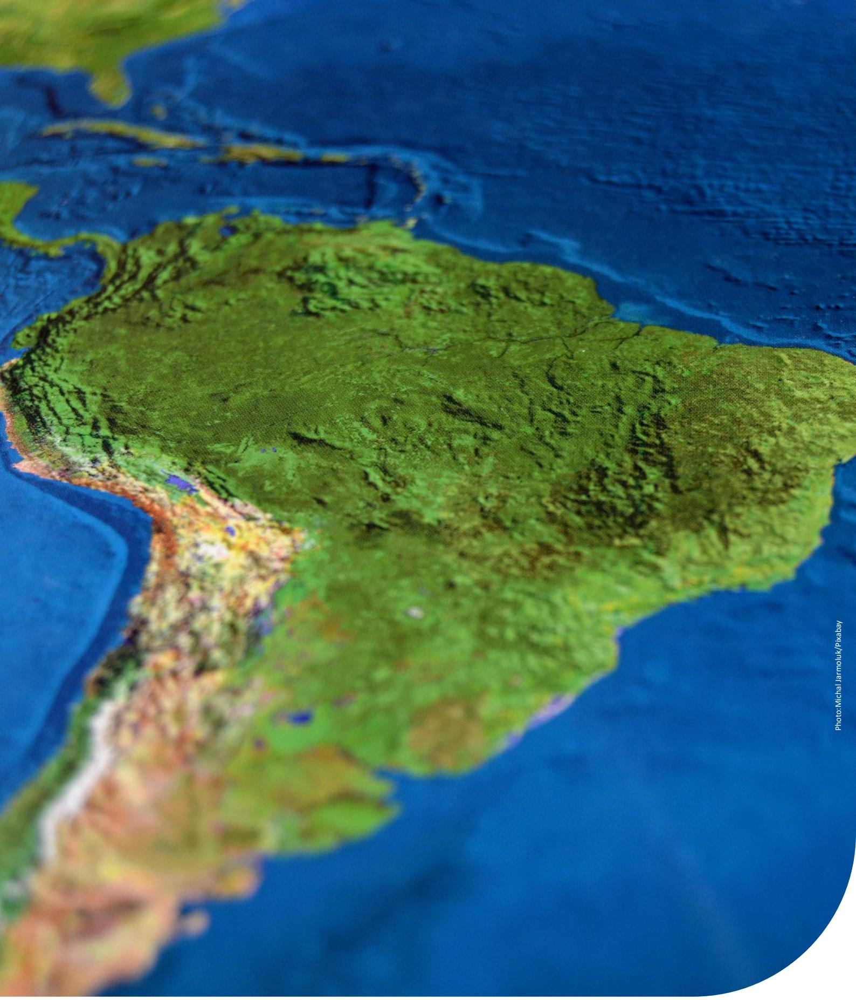

Photo:Michal Jarmoluk/Prakabay

Organization

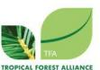

Project

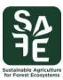

Support

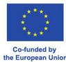

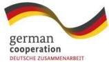

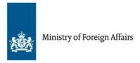

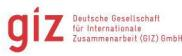