# **ALTAMIRA SUMMIT**

Technical Report

3 - 7/11/2025

ALTAMIRA, PARÁ, BRAZIL

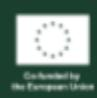

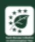

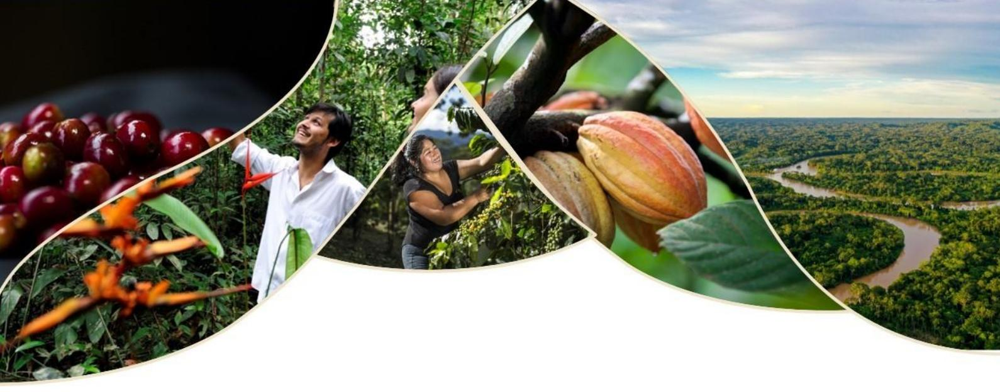

# INDEX

| ORGANISATION TEAM.............................................................................................................................................................................                              | 3  |
|-----------------------------------------------------------------------------------------------------------------------------------------------------------------------------------------------------------------------------|----|
| EXECUTIVE SUMMARY...........................................................................................................................................................................                                | 6  |
| DAY 1...................................................................................................................................................................................................................... | 9  |
| EUDR readiness and dry-runs.................................................................................................................................................                                                | 22 |
| Legality and due diligence........................................................................................................................................................                                          | 27 |
| P4C Network   Anchoring deforestation-free value chains in international processes...............                                                                                                                           | 32 |
| DAY 3...................................................................................................................................................................................................................    | 34 |
| Smallholder needs, gender equity and social inclusion....................................................................................                                                                                   | 50 |
| Future vision.........................................................................................................................................................................................                      | 69 |
| CONCLUSIONS............................................................................................................................................................................................                     | 71 |

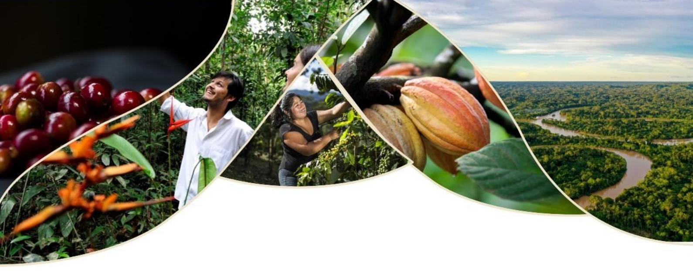

The Altamira Summit was an **outreach event under the framework of the Team Europe Initiative on Deforestation Free Value Chains**, held between November 3rd and 7th, 2025, in Altamira, Pará, Brazil. It brought together 120 participants from public, private, civil society and academic sectors from 25 countries for a week of global learning on sustainable, deforestation-free value chains.

This technical report is the **documentation product of the Altamira Summit**. The document presents all the technical input presented during the sessions, main aspects discussed in working groups and panel discussions, the objectives and key highlights of each session.

### ORGANISATION TEAM

**Maria-Olatz Cases** GIZ SAFE Brazil Head of Project

**Jorge Espinoza** GIZ SAFE Head of Programme

**Katrin Toepfer**  TEI Zero Deforestation Hub Global Coordinator

**Lisa Kielbassa** TEI Zero Deforestation Hub Communications Specialist

**Felipe Moura**  GIZ SAFE Brazil Junior Advisor

**Marina Palhares de Almeida**  MIRÁ Consultant and Facilitator

**Luiza Padoa**  MIRÁ Consultant and Facilitator

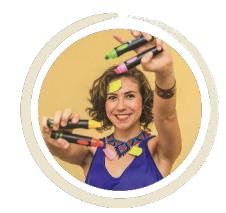

**Louise Vendramini**  MIRÁ Graphic Facilitator

# THE EVENT

The **Altamira Summit was a global outreach event under the framework of the Team Europe Initiative on Deforestation-Free Value Chains**, held between November 3rd and 7th, 2025, in Altamira, Pará, Brazil. It **brought together 120 participants from public, private, civil society and academic sectors from 25 countries** for a week of global learning on sustainable, deforestation-free value chains.

Among the 25 countries represented at the event were: Argentina, Belgium, Bolivia, Brazil, Cameroon, Colombia, Côte d'Ivoire, Ecuador, Germany, Ghana, Indonesia, Italy, Kenya, Malaysia, Netherlands, Paraguay, Peru, Democratic Republic of Congo, Spain, Uganda, Uruguay, Vietnam, and Zambia.

It was planned and organized by the Zero Deforestation Hub - the secretariat of the Team Europe Initiative (TEI) on Deforestation-Free Value Chains - and the Sustainable Agriculture for Forest Ecosystems (SAFE) project - flagship of the TEI -, with support from the Brazilian Ministry of Agriculture (MAPA) and the Municipality of Altamira. The official Pre-COP30 event took place a week prior to the global climate negotiations in Belém, and was a **strategic forum for dialogue, knowledge exchange, and cross-regional collaboration** to advance sustainable agriculture and efforts to decoupling deforestation from agricultural commodities.

Furthermore, the Summit formed part of the 2025 Partners for Change (P4C) event series, which links global agendas with on-the-ground transformation efforts. These thematic activities will culminate in a 2026 network meeting in Berlin, contributing to a P4C 2030 Position Paper that sets shared priorities for food security and sustainable agri-food systems in the post-SDG context.

The event combined **plenary sessions, field-based learning, and participatory group work to promote inclusive dialogue and effective knowledge exchange among a multilingual and culturally diverse group of participants**. English was the official working language, with simultaneous interpretation provided in Portuguese, Spanish, and French.

**40**

Event hours

**120**

Participants involved

**25**

Countries represented

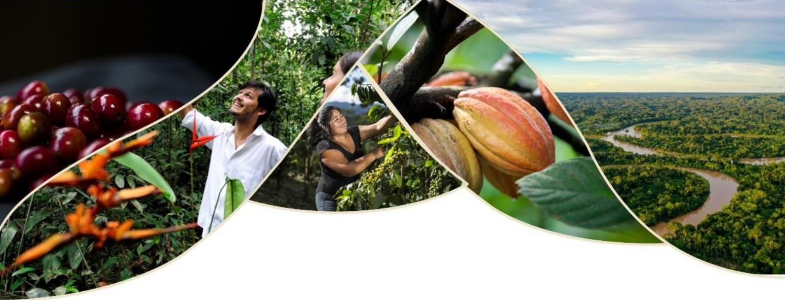

## Context

### **Global deforestation driven by land conversion for agricultural production remains high.**

The European Union has developed a milestone in international forest conservation policies by **introducing the European Regulation on Deforestation-Free Products (EUDR)**, to address the responsibility and share of EU consumption on products linked to deforestation. The EUDR came into force in June 2022 and is planned to enter into application in 2026. Article 30 under the EU regulation establishes the responsibility of EU and Member States to support partner countries in their preparation to meet the new EU market requirements on deforestation-free and legal production of key commodities and derived products. **The Team Europe Initiative (TEI) on Deforestation-Free Value Chains aligns global support measures**, implemented by TEI flagship projects. The Sustainable Agriculture for Forest Ecosystems (SAFE) project, implemented by the Deutsche Gesellschaft für Internationale Zusammenarbeit (GIZ), is hosting the secretariat of the TEI and connects TEI flagships and partners with European Authorities via coordination, outreach and knowledge management. The Altamira Summit is part of the TEI outreach activities to facilitate global learning and building partnerships.

**The flagship projects of the Team Europe Initiative** on Deforestation-free Value Chains (TEI DFVC) and **partners from Latin America, Africa, Asia, and Europe gathered in Altamira** to facilitate dialogue, knowledge sharing, and networking across regions, sectors, and initiatives. The event aimed **to promote mutual learning, build on synergies, and advance concrete collaborations** for deforestation-free value chains, with a strong focus on technical exchange. Based on two years since the establishment of the TEI, their partners have dedicated their focus to preserving forests by promoting sustainable agri-food systems. Governments, companies and civil society focus on empowering smallholders and strengthening local capacities for sustainable land use and agriculture.

In Brazil, the SAFE project is implemented by GIZ in partnership with the federal government through the Ministry of Agriculture and Livestock of Brazil (MAPA). **Altamira, in the state of Pará, is at the heart of Brazil's SAFE project pilot region.** In this area, SAFE promotes the sustainability of cocoa and cattle value chains, while ensuring compliance with legal production standards, improving market access, operationalising traceability systems, and facilitating access to finance. Altamira is a living example of how integrated efforts toward sustainability and deforestation-free supply chains can be effectively implemented and it is an emblematic town in the Amazon, located on the banks of the Xingu River, a major tributary of the Amazon.

# EXECUTIVE SUMMARY

## From dialogue to action: advancing deforestation-free value chains

The Altamira Summit demonstrated that meaningful progress toward deforestation-free and legally compliant value chains is already underway across regions, sectors, and commodities. Country experiences, combined with practical insights from the technical sessions, confirmed that the **EU Regulation on Deforestation-Free Products (EUDR) can function as a catalyst for transformation** — provided it is implemented pragmatically, inclusively, and in close cooperation with producer countries.

## Country progress: diverse pathways, shared direction

Country examples highlighted that while starting points differ, a **common direction toward traceability, legality, and sustainability is emerging**. Brazil showcased advanced institutional readiness through integrated public platforms such as AgroBrasil+Sustentável, new deforestation reduction targets in the Amazon and Cerrado, and sectoral preparedness in soy, beef, cocoa, and livestock. Brazil's experience illustrated how national digital infrastructure, market engagement, and policy continuity can reinforce each other.

Peru demonstrated rapid progress through the creation of a multisectoral EUDR working group, a national strategy, and the mapping of more than 115,000 producers using simple digital tools. Ecuador advanced participatory geolocation approaches for smallholders, aligning public and private initiatives such as "Mi finca, mi huella".

Indonesia highlighted both commitment and remaining challenges, particularly regarding geolocation of smallholders, while calling for recognition of existing sustainability systems such as RSPO. Vietnam strengthened national traceability systems for coffee and rubber, while Zambia advanced sustainability in the timber sector. Ghana, Côte d'Ivoire, Cameroon, Uganda, and the DRC **demonstrated how national forest monitoring, cocoa traceability, and pilot geolocation systems can reduce risks of exclusion and improve data quality**.

Across regions, countries emphasized that capacity building, proportionality, and access to finance are critical to ensure that smallholders and SMEs can comply with EUDR requirements without being pushed out of formal markets.

## Key learnings from technical sessions

**The EUDR Readiness session confirmed that compliance depends on the existence of robust Due Diligence Systems.** Several Dry-Runs conducted in many countries revealed that companies often focus heavily on deforestation risk while underestimating legality risks. Participants agreed that legality cannot be assessed through aggregated national statistics alone; instead, cross-referencing multiple data sources and maps is essential to demonstrate negligible risk, as required under the EUDR. Sector-specific realities—such as palm oil bulk shipments or agroforestry cocoa systems—require tailored approaches to avoid false positives and unnecessary segregation.

**The Legality session highlighted the complexity of fragmented legal frameworks.** Experiences from Colombia and Malaysia illustrated both the challenge and the opportunity: legality risk assessment is not a box-ticking exercise, but a strategic investment to harmonize sectoral approaches and strengthen governance. Tools such as the Legality Due Diligence Navigator support operators and authorities in applying a risk-based approach, while national platforms integrating multiple databases, as in Brazil, increase transparency and confidence.

**The Digital Public Infrastructure (DPI) session demonstrated that interoperable, open-source systems are key enablers of scale and trust.** Country cases showed that national land-cover maps and traceability systems—such as those in Côte d'Ivoire, Ghana, Cameroon, Uganda, and Brazil—often provide more accurate, EUDR-aligned data than global datasets. Strong DPI reduces transaction costs, supports competent authorities, and creates a shared factual basis for risk assessment.

## Private sector engagement and smallholder inclusion

Discussions on private sector engagement emphasized that companies play a central role in operationalizing deforestation-free value chains. In countries such as Brazil, Peru, Malaysia, and Colombia, **private actors are leading experimental shipments, investing in traceability systems, and coordinating across supply chains.** At the same time, participants warned that overly rigid data requirements may push producers into informality or shift compliance costs unfairly onto smallholders. Economic viability and market incentives remain essential.

Smallholder inclusion, gender equity, and social inclusion emerged as non-negotiable elements of sustainable value chains. Experiences from Ecuador, Bolivia, Brazil, and Southeast Asia showed that **participatory approaches to geolocation, strengthened land rights for women, and institutional gender policies improve data quality, trust, and long-term sustainability.**

## Insights from the field trips

The field trips to cattle and cocoa producers in the Xingu region highlighted the central role of families, associations, and cooperatives in advancing sustainable and deforestation-free production systems. Direct exchanges with producers showed the importance of **starting with simple, practical steps and avoiding overburdening farmers with EUDR complexity**, while prioritizing capacity building and organizational support. Integrated approaches that address livelihoods, access to finance, and natural resource management are essential, as **producers face significant economic constraints and unequal market access**, particularly between conventional and organic systems. Participants observed that organic and agroforestry production systems deliver strong environmental and productivity benefits and should be rewarded with premium prices. The visits also underscored the leadership role of women and the lesson that preserving forests enhances long-term productivity, resilience, and farmer entrepreneurship.

## Roles of key sectors

The Summit clarified complementary roles across sectors:

- ● Governments are responsible for providing coherent and participatory policy frameworks, harmonizing regulations, investing in public data and digital infrastructure, and aligning international support measures.
- ● The private sector drives innovation, traceability, and market access, invests in training and technology, and helps scale deforestation-free production beyond individual supply chains.
- ● Civil society supports capacity building, acts as a watchdog, fosters inclusion, and advocates for smallholders and environmental integrity.
- ● Academia and research institutions translate complex regulatory requirements into practical guidance, generate evidence, and facilitate multi-actor dialogue.

## Final outlook

The Altamira Summit concluded with a shared understanding that **many technical solutions already exist, but their impact depends on coordination, trust, and inclusive implementation**. If aligned across countries and sectors, the EUDR can enable scalable, competitive, and socially inclusive deforestation-free value chains, contributing not only to forest protection but also to resilient livelihoods and sustainable development.

# DAY 1

# Opening

## Session objective

The official opening session of the event included the welcoming from **important representatives from the local government of Altamira, the Brazilian Government of the Ministry of Agriculture (MAPA)**, government representatives from Germany, the Netherlands, the European Commission, the German international development cooperation (GIZ) and the P4C Network, contextualizing the importance of the deforestation-free agenda and sustainability transition in international agriculture and forest policies.

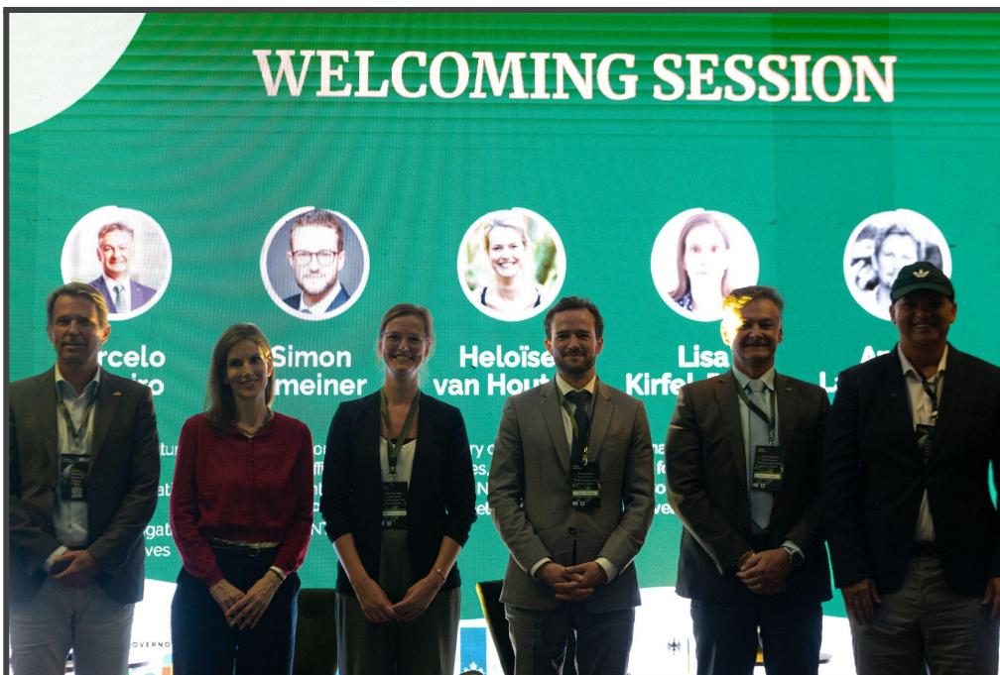

## Host

### Maria-Olatz Cases

GIZ, Sustainable Agriculture for Forest Ecosystems (SAFE)  
Head of Project SAFE Brazil

"When COP30 was announced to take place in Belém, in the heart of the Amazon, we embraced the Team Europe Initiative with renewed determination. This event brought together 100 participants from 25 countries in Altamira, and we appreciate the long journeys many undertook to be here. Our purpose is to issue a **call to action and promote global learning:** sustainable, **deforestation-free production is possible**, and solutions already exist both in your countries and here in Altamira. We are gathered to listen, learn from one another, share best practices, and exchange solutions."

## Speakers

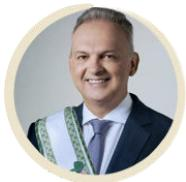

### Loredan de Andrade Mello

Altamira City Hall  
Mayor of Altamira

**"Altamira has 90 percent of its territory preserved,** and the remaining 10 percent is being restored through cocoa cultivation, with Medicilândia recognized as Brazil's cocoa capital thanks to strong international cooperation that supports local income generation. Despite regulatory bottlenecks that slow many initiatives. **The *Restaurar-Preservar* Project is helping enforce environmental legislation while promoting conservation.** As Pará prepares to host COP30, we acknowledge the governor's leadership in securing the event and championing family farming, as well as the First Lady's engagement with Xingu communities. Three major projects will be showcased in the COP30 Blue Zone, including the climate-oriented Green Corridor, alongside initiatives in açaí, essential oils, and local chocolate production."

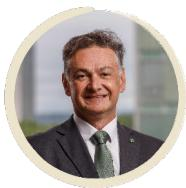

**Marcelo Fiadeiro**

Ministry of Agriculture Brazil (MAPA)

Secretary of Innovation, Sustainable Development, Irrigation and Cooperation

"It is a great pleasure to be in Altamira at the request of the Minister of MAPA, reaffirming our commitment to strong partnerships with international cooperation, the EU, and the Team Europe Initiative. We are honored to co-host this event on behalf of the Federal Government. Innovations have led to the **CAP project, and the updated ABC+ Plan** guides climate adaptation efforts through 2030. Through **initiatives such as the AgroBrasil+Sustentável** platform, we aim to restore degraded lands, strengthen agroforestry systems, and implement programs that demonstrate the full production chain. Our purpose is to **promote sustainable food systems, advance deforestation-free value chains, and deepen international collaboration on sustainable production in forest regions.**"

**Simon Gmeiner**

European Commission, DG INTPA

Policy Officer

"On behalf of the European Commission's DG INTPA, we welcome you and highlight the importance of advancing the climate agenda and protecting the world's forests. We value the participants' efforts in sharing their experiences. Since its launch two years ago in Dubai, the Team Europe Initiative on Deforestation- free Value Chains has expanded with numerous flagship programmes, creating opportunities for partners to exchange best practices, identify remaining gaps, and **strengthen South-South cooperation**, with many countries able to learn from Brazil's experience. The TEI is central to the strategic framework of Article 30 of the EUDR, a key step toward promoting global deforestation-free value chains and enabling compliance. A recently balanced proposal foresees simplified rules and a six-month transition period, with implementation expected by the end of 2025. Over the past two years, **significant work has advanced on traceability, forest monitoring, legality, and smallholder inclusion**, issues that go far beyond compliance and respond to rising global demand for deforestation-free products. Promising platforms such as CAP, +Sustentável, and the TFFF launched for COP30 support these goals. This event is an opportunity for mutual learning and for strengthening our joint approach."

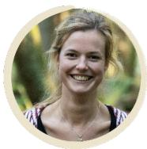

**Heloise Van Houten**  
Ministry of Agriculture of The Netherlands

"Agricultural value chains are essential not only for protecting our environmental base but also for supporting the economy, especially in countries that both import and re-export agricultural products. **The Netherlands works to bring together diverse stakeholders, strengthen partnerships, and build more sustainable supply chains**, with a strong focus on supporting smallholders—an approach that aligns closely with the core mission of the Team Europe Initiative. International collaboration is crucial to ensure small-scale farmers are not left behind. The Dutch-supported NISCOPS project, implemented in Ghana, Colombia, Nigeria, Malaysia, and Indonesia, promotes sustainable palm oil production through full value-chain engagement and traceability systems. Brazil's government, by recognizing and co-hosting this event, reinforces its commitment to protecting tropical forests."

**Lisa Kirfel-Rühle**  
Federal Ministry of Economic Cooperation and Development - BMZ  
Deputy Head of Unit

"The international team working on deforestation-free value chains is meeting on the margins of COP, highlighting Germany's strong commitment to this cooperation. Joint efforts in the heart of the Amazon reinforce the partnership, even as recent forest assessments and Brazil's zero-expansion policy underline the urgency of action. Germany, as the UNCCD focal point, welcomes Brazil's new land-degradation initiative announced by President Lula, which links environmental progress with social protection and support for small farmers. **Germany fully supports the EUDR and works with like-minded partners to advance Article 30 through initiatives such as SAFE, NISCOPS, and other TEI projects.** The visit to the SAFE region in Altamira will allow closer engagement with sustainable cocoa and beef supply chains. Through the P4C network and broader BMZ partnerships, **Germany aims to promote the transformation of agri-food systems and contribute to shaping the post-SDG agenda.**"

## P4C Ambassadors

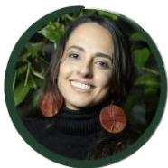

**Carolle Alarcon**

Brazilian Coalition on Climate, Forests and Agriculture  
Executive Manager

“The COP Coalition agenda brings together partners from the SAFE and Agrichains GIZ projects, building on 15 years of work in Altamira, including CIFOR initiatives and promising experiences with chocolate-based agroforestry systems. This collaboration creates a space for diverse actors to build trust, promote cross-border dialogue, and develop shared local solutions. For civil society, key priorities include closing the gap between local markets and new frameworks that reduce deforestation and strengthen private-sector compliance. **Through the coalition with Proforest and platforms like AgroBrasil+Sustentável, market influence is helping improve legal frameworks and policies, placing legal certainty and deforestation-free supply chains at the center of sustainable solutions for the economy, people, and the climate.**”

**Insan Syafaat**  
PISAgro Indonesia

“After 36 hours of travel from Indonesia, we look forward to a full week of exchange. **Indonesia's agricultural sector, through PISAgro, is committed to transforming farming and improving farmers' welfare**, recognizing that they remain key actors who still lack access to markets, technology, and other essential resources. Collaboration is the central message: when stakeholders work together, supply chains become more traceable, scalable, and capable of creating shared value. Our priorities are to promote climate-smart practices and private-sector investment, strengthen traceability and inclusion, and expand blended-finance solutions that reduce risks for small farmers—advancing resilient, accountable value chains beyond the SDGs.”

**Nelson Yepez**

Ministry of Agriculture Ecuador  
 Undersecretary of Information and Promotion

"We must prioritize clear and timely deforestation-free policies while helping farmers understand future requirements. **Smallholders face significant challenges, so capacity building is essential to help them comply with regulations and benefit from this transition.** This space should guide all actors in the value chain, ensuring policies are accessible and understandable. While large companies already have greater awareness and capacity, it is crucial that all farmers receive equal opportunities to meet these standards"

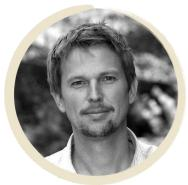

**André Lammerding-Berdau**

GIZ Brazil  
 Cluster Coordinator Biosphere

"We thank the municipality, MAPA, and TEI partners for their leadership in advancing the transition to deforestation-free supply chains. It is a pleasure to showcase local implementation efforts and highlight activities that reflect the pillars of German cooperation in Brazil. The Agricultural Ministry recently announced **new deforestation reduction targets in the Cerrado and Amazon, marking a significant step toward the joint goal of zero deforestation by 2030.** Protecting forests is essential for ecosystem services, including rainfall, which in the Cerrado has dropped by over 30% due to deforestation. Instruments like the Amazon Fund support these efforts, and participants are encouraged to use their time in Altamira to network across this diverse, international community."

### Highlights

| Theme               | Key Message                                       |
|---------------------|---------------------------------------------------|
| Welcome to Altamira | The Mayor and First Lady warmly received the      |
|                     | enjoy local fish, chocolate, and the agricultural |
|                     | cooperation, highlighting contributions from      |

# **The TEI and its partners |** Taking stock of progress towards deforestation-free value chains

### Session objective

The session provided an overview on the TEI on Deforestation-free Value Chains and its flagships, partner countries, activities to date, and the latest developments regarding EUDR. Furthermore, the session was a showcase to take stock of to-date support measures and developments in the countries, and discussed how governments and sectors are preparing for market regulations, including policy and technical approaches for deforestation-free value chains and EUDR compliance.

### Host

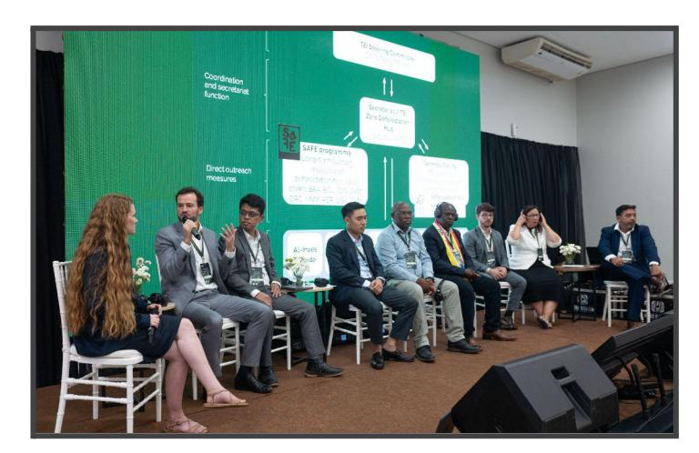

**Katrin Toepfer**  TEI Zero Deforestation Hub Global Coordinator

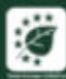

## Speakers

**Simon Gmeiner**

European Commission

Policy Officer at Department General International Partnerships  
(DG INTPA) - Unit F3

**"The TEI was launched to support the SDG agenda and respond to Article 30 of the EUDR**, which calls for cooperation with producing countries in their transition toward market compliance. Its Secretariat, the Zero Deforestation Hub, is hosted by the GIZ SAFE Programme and coordinates technical and political steering. The Hub is complemented by a flexible, demand-driven Technical Facility implemented by EFI. Alongside these, additional global and bilateral projects funded by various member states contribute as broader implementation measures to the shared goal of promoting deforestation-free value chains and supporting EUDR compliance. **The TEI Hub focuses on coordination, outreach, and knowledge management.** Outreach activities include for example the format of the Eurotrips that bring delegations from Latin America, Africa, and soon Asia to Brussels to exchange with European multistakeholders and officials. Altogether, there are currently nine TEI flagships: the AL-INVEST Verde programme, implemented by iila and fiap; NISCOPS, implemented by IDH and Solidaridad Network; the EU Sustainable Cocoa Initiative, implemented by GIZ, EFI, FAO, JRC and GFA; ITC's Deforestation-Free Trade Gateway and Markupll, Agrichains and FitforFair, EUDR Engagement and the SAFE programme, implemented by GIZ. Some focusing on a specific region, some on specific commodities, some on a specific technical aspect, many cross-linked. **Together with regional and global activities, the TEI is now active in 37 countries, supporting partners in their transition towards deforestation-free production and preparing for EUDR requirements."**

**Rismawan Farid Lufianto**  
 Bureau of International Cooperation  
 MoA Indonesia

"Indonesia is a major producer of palm oil and natural rubber, but one of the **main challenges for achieving EUDR compliance is obtaining accurate geolocation data for smallholders**; while companies are generally well positioned to comply and access certification, smallholders face greater difficulties in meeting these requirements. The main idea is that Indonesia's Ministry of Planning (BAPPENAS) is leading the development of traceability systems to ensure sustainable production across value chains, including geolocation and certification, and is **proposing that the EU recognize systems like the RSPO on sustainable palm oil**, to support trade and secure market access for smallholders despite the Indonesia geographic challenges."

**Nguyen Hung Thinh**  
 Ministry of Agriculture and Environment of Vietnam  
 Viet Nam Forestry Administration (VNForest)

"Vietnam has developed **partnerships to strengthen its coffee and natural rubber value chains**, applying technical approaches such as traceability systems, several of which are supported by international cooperation. Key challenges in Vietnam include geolocation data gaps, limited EU guidance on EUDR, and the long-term need for sustained inter-agency and producer coordination. To address these, the **government is strengthening its national traceability system**, building capacities, maintaining dialogue with the EU, and mobilizing international funding for programs like SAFE to provide technical and financial support."

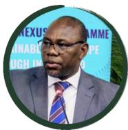

**Freddie Sayi Siangulube**  
 Ministry of Green Economy and Environment Zambia  
 Forestry Director

"In Zambia, precious wood export such as Jacaranda to the EU, is highly important, and efforts are underway to **improve the timber value chain in its sustainability**, making it the most advanced in preparing for EUDR compliance. The country values its partnership within the TEI and is interested in expanding work on traceability, with strong interest from the private sector to collaborate."

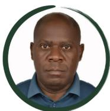

**Gilbert Makelele Kadihira**  
 Réseau des Coopératives des Producteurs de Café Cacao de la Democratic Republic of Congo  
 Président du Conseil d'Administration

"The DR Congo, despite being partly affected by conflict, had **initial concerns that the EUDR would block its coffee and cocoa exports to Europe**. However, with support from the SAFE project, the country has been preparing for compliance, helping secure continued market access for these key products. The central government has a committee coordinating work nationwide and guiding regional authorities. With support from the SAFE project, they have run **pilots providing geolocation for cacao and coffee producers**, improving access to the EU market and enhancing their understanding of the EUDR."

**Pedro Garcia**  
 Brazilian Association of Vegetable Oil Industry (ABIOVE)  
 Sustainability and Land Use Coordinator

"In **Brazil's soy value chain, extensive preparation for EUDR compliance is underway** through multiple workstreams, involving not only companies but also multi-stakeholder efforts with civil society and government, including initiatives like AgroBrasil+Sustentável at the federal level and **Selo Verde at the state level**. The recent focus has been on aligning EUDR compliance"

with local Brazilian legislation, considering varying state regulations, engaging authorities to understand how compliance is assessed in EU member states, and monitoring potential risks from differing interpretations across Europe."

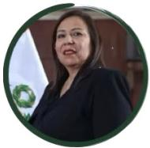

**Nelly Paredes del Castillo**

Ministry of Agricultural Development and Irrigation (MIDAGRI)  
Peru

**"Peru secured funding to prepare for EUDR** and recognised that the challenge extended beyond the Ministry of Agriculture, leading to the **creation of a multisectoral working group** involving ministries of Trade, Labour, Justice, Environment, the drug control authority, and others. Under MIDAGRI's leadership, they **developed a national strategy** covering all aspects of EUDR, with strong support for smallholders—especially for **geolocation assessment using simple digital tools**, through which **115,000 producers have already been mapped** in collaboration with the private sector. Legality and due diligence have also been key focus areas, with work underway on guidelines, and support from SAFE has been crucial to their progress. Also, the main idea is to integrate all producers into the **national "Padron de Productores Rurales" system**, which serves as a central platform for EUDR and other markets, with strong cooperation from the private sector, EU partners, cooperatives, and **access to tools like Global Forest Watch Pro, WHISP and INATrace for deforestation monitoring and traceability**"

**Nelson Yepez**

Ministry of Agriculture Ecuador

Undersecretary of Information and Promotion of Agricultural Commercialization

"In 2024, an interinstitutional committee was established bringing together all relevant bodies to work on every aspect of the EUDR, including organic production, and to develop guidance and support measures. With backing from the SAFE project, Ecuador has created a successful training-of-trainers program and advanced the **geolocation of small farmers in the "mi finca, mi huella" program**. Collaborating with the Ministry of Foreign Affairs to coordinate donor-supported activities and engage the private sector, reaffirms that, while inter-agency coordination is already challenging, **aligning efforts with the private sector is equally essential.**"

## Q&A

During the discussion, **Fernando Sampaio**, **ABIEC Brazil**, asked about **opportunities in the European Union for the Triple-F mechanism** on the recovery of degraded areas, which Brazil is proposing in the context of COP30 in Belém. In response, **Simon Gmeiner**, **European Commission DG INTPA**, explained that the flagship initiatives under the Team Europe Initiative (TEI) could offer relevant opportunities. He noted that potential interest from EU Member States would need to be further analyzed and explored, adding that he was open to continuing the discussion, particularly in relation to the beef sector.

**Samuel Owusu-Acheaw**, **COCOBOD Ghana**, raised a question regarding whether investments made to support compliance with the EU Deforestation Regulation (EUDR) would be monitored. **Simon Gmeiner** replied that the TEI is supporting **alignment among competent authorities across Member States**. He also referred to the current proposal to amend the EUDR, which includes a six-month transition period aimed at facilitating coordinated action among national authorities.

**Paula Pinto**, **Climate & Company**, asked how **financial institutions are being involved in country-level dialogues**, especially with regard to financing the investments required for the transition. **Nelson Yepez**, **Ministry of Agriculture of Ecuador**, responded that discussions with banks had already taken place and, surprisingly, some institutions already had protocols in place for financing sustainable production. He emphasized, however, that financing solutions are highly value-chain specific and must reflect the particular conditions and dynamics of each sector. Complementing this perspective, **Nelly Paredes**, **MIDAGRI Peru**, explained that Peru has also engaged in dialogue with the financial sector, highlighting that the main challenge lies in **ensuring smallholders' access to tailored financial instruments**. **Gilbert Makelele**, **Democratic Republic of the Congo**, added that the financial sector is critical for sustaining and expanding access to markets for coffee and cocoa, stressing the role of partnerships with European companies and the importance of development banks as providers of key financial instruments.

Finally, **Pak Rizal Algomar**, **Tropical Forest Alliance Southeast Asia**, shared insights from a workshop with banks in Indonesia, noting that none had a clear strategy for financing deforestation-free value chains. He stressed that smallholders urgently need financial support and that EU understanding of this issue is crucial for achieving real change, asking whether the TEI could offer support. **Simon Gmeiner** responded that **blended finance approaches are already in place** and that the EU is exploring additional ways to reduce risks associated with financial instruments. He added that once the EUDR reaches a more routine implementation phase, there will be greater scope to explore further solutions. **Remi D'Annunzio**, **FAO**, complemented this by noting that FAO, through the SAFE project, is developing tools related to Digital Public Infrastructure that are available to both public and private actors.

# EUDR readiness and dry-runs

### Session objective

**Edwin Gaarder**, the session host opened by introducing key lessons from European Forest Institute (EFI) simulation exercises, which were conducted in several countries to pilot EUDR conditions. These **Dry Runs serve to understand how the EUDR will work in practice,** recognizing that many questions will only be answered once the regulation is fully implemented. Helpful results of the Dry Run exercises are used by institutions, companies, and authorities to jointly learn on open gaps and adjusting conditions. Notably there are still uncertainties around future audits and about how the process will unfold.

### Host

### **Edwin Gaarder**

European Forest Institute (EFI) Trade and Traceability Expert

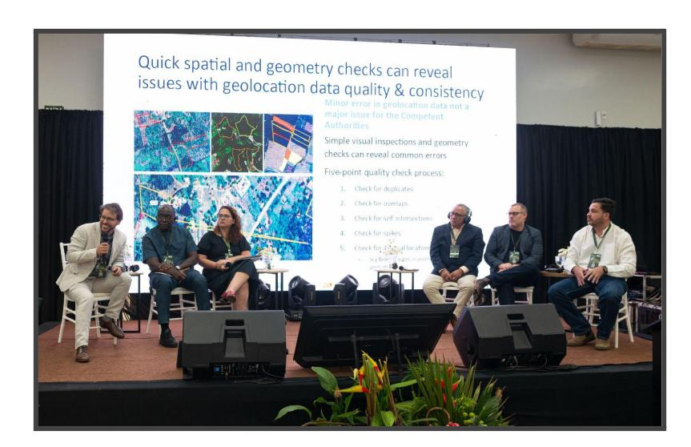

## Report of main moments and discussions

EFI identified two key insights based on the conducted pilots:

1. 1. **Companies need a robust Due Diligence System**, and many still do not fully understand how to build one.
2. 2. **Companies are focusing heavily on Deforestation Risk but not on Legality**, even though both aspects must carry equal weight.

EFI stressed that **demonstrating a robust Due Diligence System is essential for meeting Competent Authorities' expectations**. Effective compliance relies on well-designed and credible Due Diligence procedures that go beyond simple data collection, incorporating thorough risk assessment and mitigation. While platforms, certifications, and third-party assessments can support the process, they do not replace the operator's own Due Diligence responsibilities.

**Legality risks cannot be reliably assessed using broad global or national statistics;** they must be linked to the operator's specific sourcing regions and shipments. National or public databases on land rights, human rights, and environmental issues can serve as valuable sources when available. Although the European Union will not formally recognise any sustainability platforms, they can still be useful if they provide credible and well-structured data. In Brussels, authorities emphasised that assessing deforestation risk both inside and outside farm boundaries is essential, focusing on how risks of deforestation-linked products entering the supply chain are evaluated. **Cross-referencing multiple maps increases confidence in risk assessments**, and non-spatial evidence can be crucial in complex landscapes. Competent authorities prefer the convergence of different mapping sources rather than relying on a single dataset, and one key insight from our experience is the need to consider verification methods beyond satellite imagery alone."

### Speakers

**Samuel Owusu-Acheaw**  Ghana Cocoa Board

"Working with the Cocoa Council, we found that the experience in Ghana is similar in some ways, though the **domestic and export cocoa markets differ from the EFI context methodology.** In Ghana, land is held by chiefs and families, under a traditional system in which **many legitimate landowners lack formal title documents.**"

**Cecilia Korber Gonçalves**  Proforest Brazil Director of Programmes

"In Brazil, we worked with two commercial partners in a GIZ-funded experience focused on the beef sector, where abundant national data was available. **Companies had already prepared for earlier deadlines** and advanced their documentation, resulting in diverse information flows between operators and exporters and different internal protocols for managing and providing data. The Brazilian government is also developing **AgroBrasil+Sustentável, a platform that integrates data to support decision-making**, which companies can use alongside their own compliance and traceability systems. Our work involved analysing data for this platform, ensuring all stakeholders could connect and contribute information, while recognising that some level of product or data segregation within companies is likely to be required."

### **Fernando Sampaio**

Brazilian Association of Beef Exporting Industries (ABIEC) Sustainability Director

"The simulation provided significant learning for us, particularly on how to integrate each phase, compile documentation, make it verifiable, and deliver the information effectively. Our main takeaway initially was to understand how to manage and present all the data in a way that

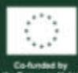

builds confidence in compliance processes. Our industry has been verifying deforestation and legality since 2007, so the **key for the private sector is having assurance that our actions are correct and effective**. Insecurity remains a significant challenge, importers may avoid sourcing from us if they feel uncertain. This highlights the importance of thoroughly understanding the process to build confidence. While traceability is simpler for products like soy, tracking cattle is much more complex due to mixed supply chains and challenges in identifying the origin farms. **Segregation is necessary only if compliance can be assured**, making it a critical consideration for effective monitoring."

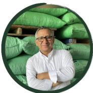

**Freddy Cabello**

Union of Peasant Cocoa Growers Organizations (UNOCACE)  
General Manager

"In Ecuador, land ownership is tied to those who actively cultivate the land, even without formal documentation, often inherited through tradition. Our goal was to determine how to internally assess this situation and present it to exporters, enabling clearer risk control and a better understanding of our position in the compliance process. **Geolocating farms proved challenging, especially for cocoa grown in agroforestry systems, where we encountered a false positive for deforestation.** In larger landscape areas, improving methods to reduce such risks becomes even more critical."

**Frank Bertelmann**

GIZ SAFE Peru  
Component Leader

"In Peru, the experience is different and remains a work in progress. Information must be verified and accessible without being overly burdensome with excessive documentation. Similar to other traditional supply chains, exercises were conducted with the Ministry of Agriculture and EFI to understand how to **provide accurate information to competent authorities.** This year, the main focus has been on improving traceability processes and learning to use different software tools to support our cooperatives better."

## Q&A

**Samuel Noble Quaque, GIZ Ghana** concerns that we see many systems being developed, but that simple, practical solutions for legal compliance are still missing. **In palm oil, exports are shipped by vessel rather than container, and the same company often acts as both exporter and importer. Hence a single shipment generates thousands of data points rather than one**, making it essential to clarify with authorities which data truly matters. In Ghana's cocoa sector, after five years of work, traceability remains difficult because exported volumes frequently do not match the recorded data , raising major concerns for exporters and highlighting the need for a clear mechanism to resolve these discrepancies.

**Edwin Gaarder, EFI**, agreed that this situation poses a potential risk. He explained that the **EFI methodology applies best-practice benchmarks for production per kilogram and keeps a dashboard for each farm based on its land area. When a farm appears to exceed the permitted size, inspectors are sent to verify and monitor the case.** He added that, as EFI, they do not enter political debates about whether the EUDR is "good" or not. Instead, they focus on understanding the EU's intent to clearly define what companies must do, what information is required and which actions are necessary, while also recognising that producing countries can develop their own data systems and platforms to support compliance.

**Carolle Alarcon, Brazilian Coalition on Climate, Forests and Agriculture** raised two key reflections: first, she questioned **how stakeholders can move beyond basic risk assessment to avoid excluding producers while balancing sustainability, production, and land-use regulation**, suggesting that this may be an opportunity for Brazil to build its next data-sharing system. She noted that INPE's current validation capacity is limited, highlighting the need to revise compliance processes for both the EUDR and the TFFF. Second, she emphasised that a major goal is restoring degraded areas, aligning with Brazil's COP30 target to restore 35 percent of such lands. She asked whether, if **countries succeed in rehabilitating well-known agroforestry systems in degraded areas, products deriving from these units, deforested before 2020, would be compliant with the EUDR requirements?** To which the answer is yes, when deforestation verifiably took place before the cut-off date of 2020.

# Legality and due diligence

## Session objective

Addressing Legality and Due Diligence was outlined as a technical exchange on digital approaches for EUDR compliance, focusing on geolocation, traceability, and deforestation-risk analysis, while showcasing solutions tailored to different target groups and contexts, and identifying remaining gaps where further effort and development are needed.

## Hosts

**Christophe Van Orshoven**  
European Forest Institute  
(EFI)  
Value Chains Leader

**Roser Cabré-Verdiell Surribas**  
European Forest Institute (EFI)  
Communications Expert

## Record of the main moments and discussions

The Legality session followed up on the Dry Run-session by delving deeper into the EUDR's legal requirements and exploring how producer countries can support market compliance. It addressed the widespread confusion among EU operators, partner countries, and value-chain actors by examining examples from West African cocoa producers (Côte d'Ivoire, Cameroon, Ghana) to stakeholders involved through the Technical Facility in Colombia and Peru. When the EUDR was adopted in 2023, the legality topic initially received limited attention, with interest growing gradually as stakeholders sought to **understand deforestation-risk assessment and what "legal production" entails.**

The discussion clarified that **responsibility lies with the EU operators**, who must ensure that commodities are both deforestation-free and legally produced. Legality, in that regard meaning, that goods need to be produced in accordance with national laws, e.g. covering land-use rights, environmental protection, and labour or tax aspects. Participants examined how these legal frameworks are enforced, where data is available, and which are options for mitigating risk. The session also noted **existing guidance from the EU Commission**, while emphasising ongoing uncertainty among operators, producer-country actors, and national competent authorities about how these requirements should be incorporated into Due Diligence Systems.

Information has been gathered organically and is now integrated into **the Legality Due Diligence Navigator** ([www.legalitynavigator.efi.int](http://www.legalitynavigator.efi.int)), a publicly available tool whose methodology can be used by any stakeholder group to support legal clarification. Legal mapping has already been completed for Cameroon, Côte d'Ivoire, and Ghana, with strong interest expressed by Paraguay and Tanzania, and ongoing work in Peru, Colombia, and Honduras. This responds to growing demand, and ITC has endorsed the approach to scale up to 30 origins worldwide, allowing due diligence guidance to reach many more countries. As partnerships expand, both operators and NCAs can benefit from the tool, and the material was also accessible at the Altamira Marketplace.

Key learnings show that a stakeholder-driven process greatly improves collective understanding of **due diligence as a risk-based approach rather than a box-ticking exercise**, helping actors identify the actions needed for different levels of risk. It also clarified that legal obligations resting with EU operators do not create new regulations for producers, while value-chain actors in producing countries play a supporting role.

The main challenges include **unclear or fragmented legal frameworks**, differing interpretations of laws, gaps in implementation, and difficulties in determining which provisions are truly relevant, especially since many labour or sector-specific requirements do not apply to smallholders.

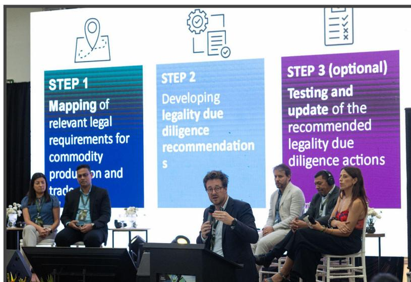

## Speakers

**Ximena Serrano**

ProColombia

Subdirector for Quality and Sustainability

"Colombias is developing its legality matrix, beginning with a diagnostic under AL-Invest Verde to identify gaps between Colombian supply and EU requirements. In 2024, Colombia adapted Cameroon's methodology, coordinating a broad process with federations from the most affected sectors (coffee, cocoa, and palm oil) and institutions such as MinComercio and ProColombia. There were significant challenges, including the **complexity of analysing more than 200 laws**, lengthy discussions on land tenure, environmental protection rules (over 90 laws), water-use permits, and rural labour regulations that are difficult to apply to seasonal, smallholder-dominated production systems. Despite limited institutional capacity, the process **produced a legality matrix for the three sectors**, offering valuable guidance for due diligence, exposing normative gaps, and strengthening coordination between public and private actors. The EUDR has driven significant learning and offers an opportunity to build more transparent, risk-based, and sustainable value chains, serving as a foundation for future regulations such as CSDDD and CSRD."

**Hannelore Beerlandt**

International Coffee Organisation

Head of Operations

(video contribution)

"Scaling up legality efforts across the coffee sector requires improving efficiency and reducing the costs that burden coffee value chains, while ensuring that all origins are included. The EFI-facilitated international multistakeholder process, extending beyond the private sector, helps ensure that regulatory requirements are relevant, aligned with growing sustainability expectations, and translated into practical recommendations for companies. This approach enhances credibility, supports risk mitigation, lowers compliance costs, and promotes greater inclusion. Although the process is lengthy, **ICO member associations view the legality risk assessment as a strategic investment to harmonise efforts and strengthen sector-wide alignment.**"

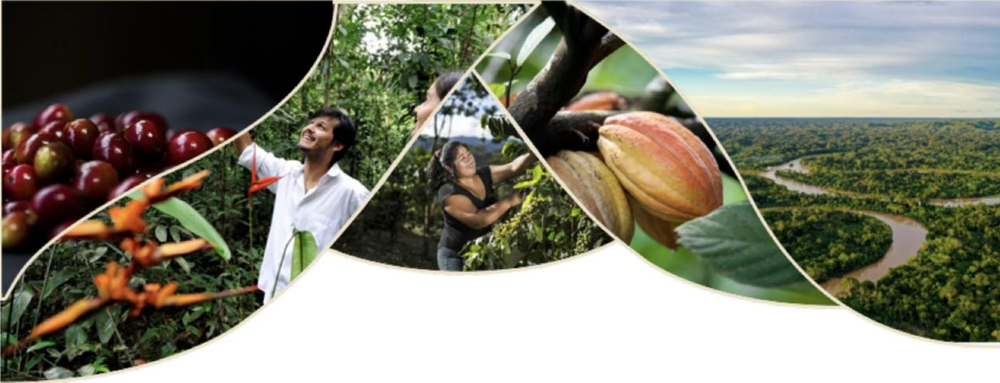

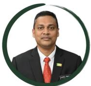

**Hairul Jamaluddin**  
 Malaysian Rubber Board  
 Director of Economics

**"Malaysia's rubber sector builds on a long-standing sustainability framework**, built on MSNR (since 1998) and RRIM (since 1925), which operates as a regulatory system rather than a certification scheme. Through the MSNR Act, licensing rules, and standard operating procedures, **all upstream, midstream, and downstream actors are registered and assessed against five criteria: (1) no deforestation; (2) compliance with land-title and labour regulations; (3) environmental safeguards; (4) social compliance with no child labor and (5) full supply-chain traceability.** Data from plantations and smallholders, including geolocation, feed into integrated due diligence reporting, supported by inspections, interviews, and raw material segregation checks. Key challenges include cross-border traceability amid rising production costs, limited technical guidance on EUDR requirements, and the need for buyers to pay fair premiums to ensure both environmental integrity and the long-term livelihoods of smallholders."

**Clecivaldo Ribeiro**  
 Brazil's Ministry of Agriculture and Livestock  
 (MAPA)

**"Brazil has been strengthening agricultural risk management since 2015 by consolidating data from 19 official databases, covering labour, environmental compliance, land-use restrictions, and more into integrated, voluntary platforms like AgroBrasil+Sustentável.** Brazil views the **EUDR as part of a broader global shift toward sustainable production**, noting that environmental protection, reduced deforestation, and long-term resource security are essential to the country's agricultural power. **The government is investing in transparent, interoperable digital tools, including QR-code traceability for beef, to support producers, facilitate international compliance, and build partnerships grounded in research, field verification, and collaboration with agencies like EMBRAPA to ensure sustainable, future-oriented agriculture.**"

## Q&A

When **Fernando Sampaio**, **ABIEC** asked how farmer self-declarations fit into the due diligence process, **Edwin Gaarder**, **EFI**, explained that, from the perspective of National Competent Authorities (NCAs), **self-declared information can support demonstrations of compliance but must be assessed in terms of reliability as part of the overall risk analysis**. He noted that in standard-risk countries only around 3% of operators will be audited and that authorities are expected to adopt a learning-oriented approach, whereby operators initially receive warnings and the opportunity to improve their due diligence systems when shortcomings are identified.

**Caroline Salomão**, **Thünen Institute**, then raised the question of how **Brazil and Colombia could strengthen cooperation on data generation, particularly geospatial data, without abandoning existing digital tools**. She highlighted that public institutions and sector associations already operate multiple systems developed for other purposes, such as deforestation monitoring under the Paris Agreement, which do not fully align with EUDR definitions. She pointed to Colombia's Coffee Federation's traceability platform as an example, explaining that current efforts focus on improving existing tools and clarifying the respective roles of institutions and operators, given that each value chain has distinct characteristics and information needs.

Contributing to this discussion, **Lucimar Souza**, **Amazon Environmental Research Institute (IPAM)** presented the CONSERVE Project, which aims to protect forest assets in Brazil by improving information on environmental conditions and land tenure, integrating federal and state-level data, and supporting the cattle traceability system in Pará to help ranchers meet compliance requirements. Finally, **Malina Bischoff**, **GIZ SAFE Brazil**, asked when companies should deepen data collection, given that available data often reveals non-compliance, and how grievance and compliance mechanisms should be considered. In response, **Edwin Gaarder**, **EFI**, clarified that **under the EUDR operators are required to demonstrate negligible risk rather than full compliance**, and that more detailed analysis is expected as risk levels increase, with the ultimate objective of showing NCAs that sufficient efforts have been made to avoid penalties. **Ximena Serrano**, **ProColombia**, added that robust risk assessments are essential to guide future actions across the value chain.

# **P4C Network |** Anchoring deforestation-free value chains in international processes

### Host

**Jil Schuetze**

GIZ

Partners for Change (P4C) Network

### Session objective

The Partners for Change Network session sought to collect experiences from different sectors that can contribute to the development and evolution of the P4C Network. The session took place in a World Cafe format and included the participation of the project's three ambassadors, representing the government sector, private sector and civil society sector.

Participants had the opportunity to contribute in two groups across two rounds of discussion. The first round, called "Presence and Effectiveness" focused on the current situation and effectiveness of the P4C Network in each sector. The second round, called "Design the Future," aimed to examine the sustainability and adaptability of the project in the future, in relation to the respective sectors.

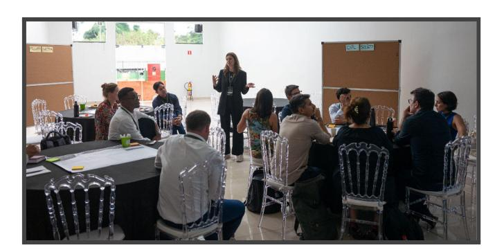

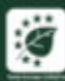

### Group Presentations

After the two discussion participants highlighted the main points raised during the discussions, with particular emphasis on selected responses to the guiding questions. Below are the three key aspects that each group chose to highlight in the final presentation of the activity.

| Group A Government Sector Key dimension                                  | Group B Private Sector |                                             | Group C Civil Society Sector                 |               |
|--------------------------------------------------------------------------|------------------------|---------------------------------------------|----------------------------------------------|---------------|
| Policy &                                                                 |                        |                                             |                                              |               |
| Integrate AFOLU,                                                         |                        | Engage beyond core                          | Strengthen                                   |               |
| agroforestry, and Strategic                                              |                        | business to support                         | cross-sector                                 |               |
| national plans (e.g.                                                     |                        |                                             |                                              |               |
|                                                                          | (e.g.                  | EUDR) through                               |                                              |               |
| climate adaptation into Alignment NDCs, Paris Agreement implementation). | incentives.            | sustainable standards enabling policies and | alignment influence and shape public policy. | to better     |
| Create monitoring                                                        |                        |                                             |                                              |               |
| frameworks to track                                                      |                        |                                             |                                              |               |
| policy reforms,                                                          |                        |                                             |                                              |               |
| focusing on                                                              |                        |                                             |                                              |               |
| enforcement and                                                          |                        |                                             |                                              |               |
|                                                                          | Leverage               | incentives,                                 |                                              |               |
|                                                                          | innovative             | green                                       |                                              |               |
|                                                                          | financing              | to scale                                    |                                              |               |
| Implementation & Accountability                                          |                        | blended finance, and                        | Drive implementation                         | on-the-ground |
|                                                                          |                        |                                             | through                                      | pilots,       |
|                                                                          |                        |                                             | innovation,                                  | and           |
| measurable outcomes.                                                     | sustainable practices. |                                             | inclusive models.                            | business      |
| Foster inclusive                                                         |                        |                                             |                                              |               |
| policy into practice                                                     |                        |                                             |                                              |               |
| through structured                                                       |                        |                                             |                                              |               |
|                                                                          | with                   | government                                  |                                              |               |
| Collaboration &                                                          |                        | Adopt landscape and                         | Champion                                     | locally       |
| multistakeholder Scale                                                   | jurisdictional         |                                             | driven and                                   | Global        |
| platforms to translate                                                   | approaches,            |                                             | South–led                                    | solutions,    |
| pilots.                                                                  | leadership.            | collaborating at scale                      | facilitating and exchange across contexts.   | learning      |

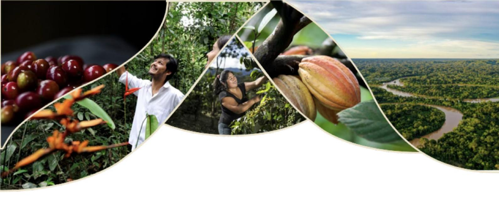

# Field trips

The routes cross rural areas shaped by the construction of the Transamazon Highway and by the establishment of federal agrarian reform settlement projects aimed at promoting agricultural development and integrating the Amazon region into the rest of the country. Initiated in the 1970s under Brazil's military government, the highway was conceived as a major infrastructure project to facilitate occupation, production, and connectivity across remote regions. In parallel, federal settlements were created as part of the country's agrarian reform policy, offering land to landless and smallholder families to reduce inequality and expand agricultural frontiers. Over the decades, these areas evolved from state-led initiatives into consolidated rural territories where families, associations, and cooperatives play a significant role in advancing sustainable production systems.

### Route 1 | Assurini

**Rogério Lima**  GIZ SAFE Brazil

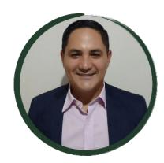

The visits included the properties of the following smallholder farmers: (1) **Claudio Aquino:** Cocoa in an agroforestry system & artisanal chocolate; (2) **Francineide Gomes:** Women's association & local fair and (3) **Alcion da Silva**: Cocoa in agroforestry system & cattle SAFE project activities.

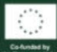

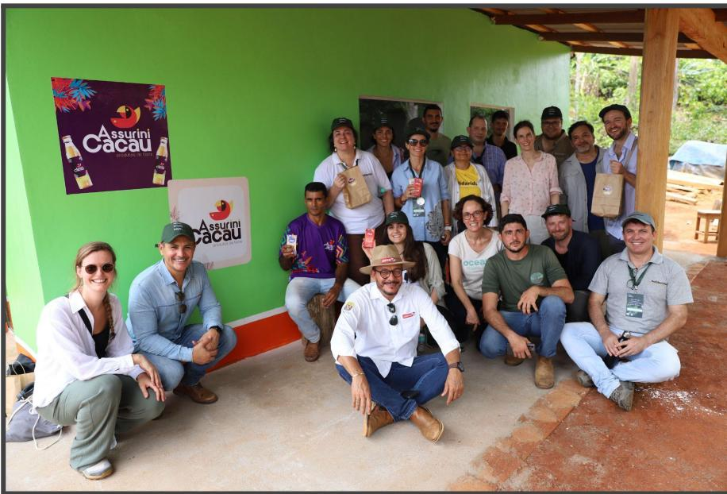

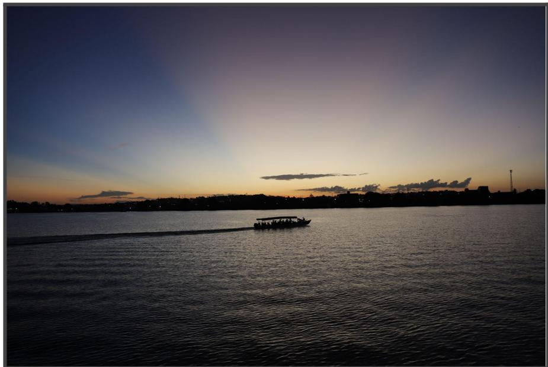

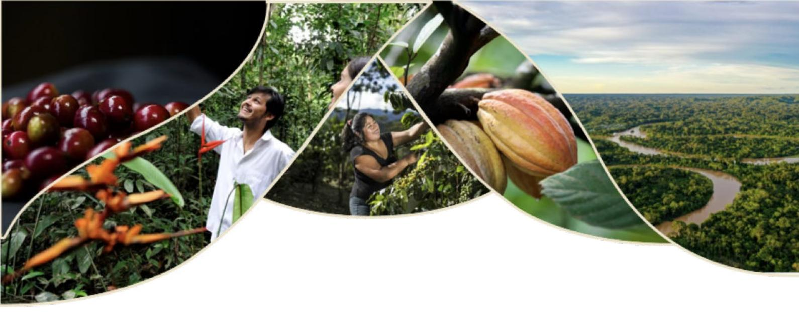

### Route 2 | Brasil Novo A

**Malina Bischoff** GIZ SAFE Brazil

The visits included the projects of the following smallholder farmers: (1) **João Meira**: Cattle & ICLFS unit and (2) **Veronica Preuss:** Fine cocoa in agroforestry system & award-winning chocolate.

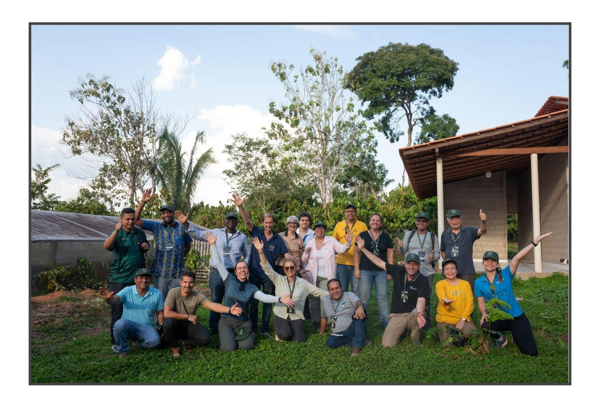

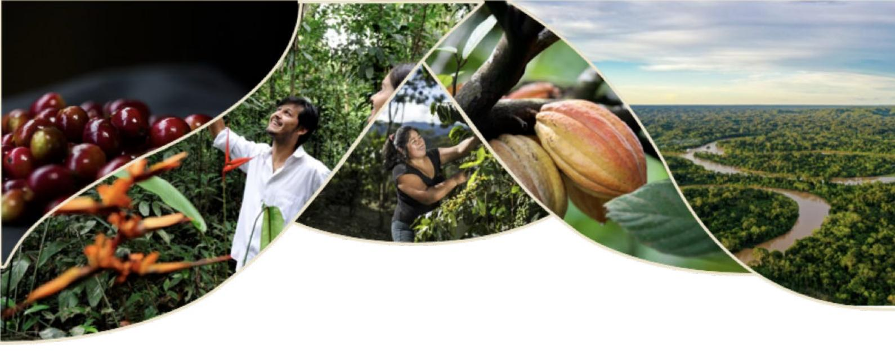

### Route 3 | Brasil Novo B

**Luciana Rocha**  GIZ SAFE Brazil

The visits included the projects of the following smallholder farmers: (1) **Jussara and Robson Brogni: Ascurra** brand chocolate, cocoa in an agroforestry system and (2) **Jiovana Lunelli**: **Cacau Xingu,** organic cocoa in an agroforestry system & social leader.

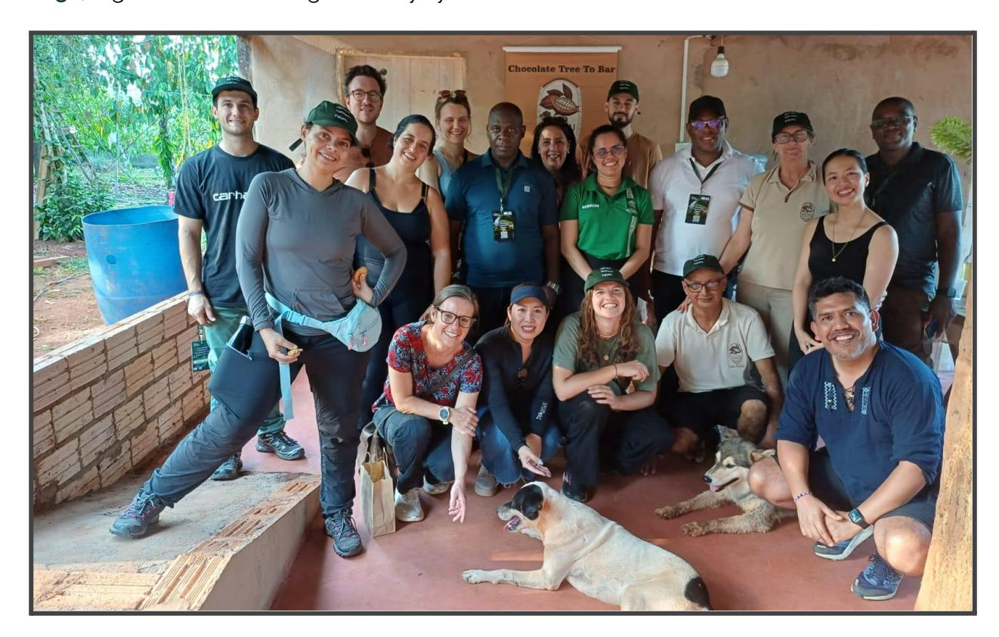

### Route 4 | Medicilândia

**Felipe Moura**  GIZ SAFE Brazil

The visits included the projects of the following smallholder farmers: (1) **Elido Trevisan**: Cocoa in an agroforestry system, cocoa honey & jelly (2) **Mirian Federicci:** Cocoa in an agroforestry system, world's best cocoa bean award and (3) **Cacauway**: Cocoa in an agroforestry system, first family chocolate factory in Pará.

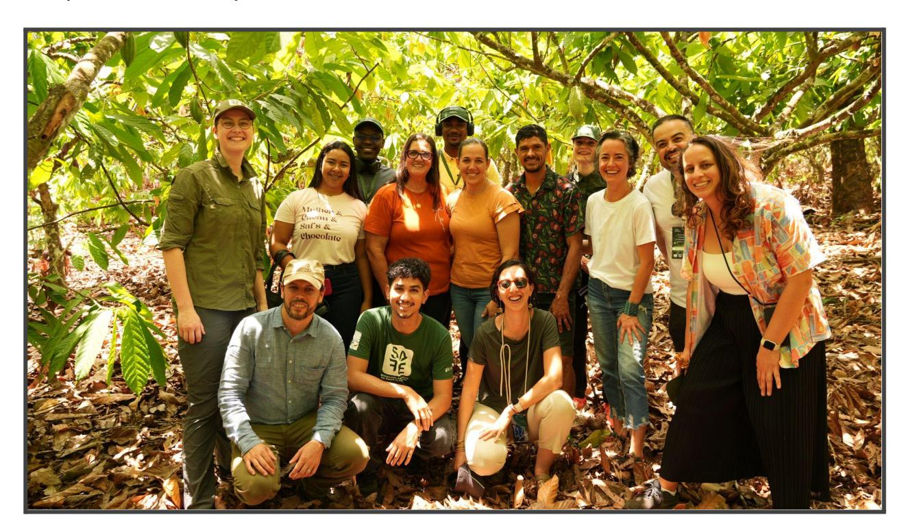

### Route 5 | Vitória do Xingu

**Socorro Oliveira**  GIZ SAFE Brazil

The visits included the projects of the following smallholder farmers: (1) **Jussara & Paulo Nascimento: Bela Amazônia**, award winning cocoa in an agroforestry system and (2) **Katyana Xipaya**: **Sidjä Wahiü** indigenous cocoa forest & dehydrated fruit.

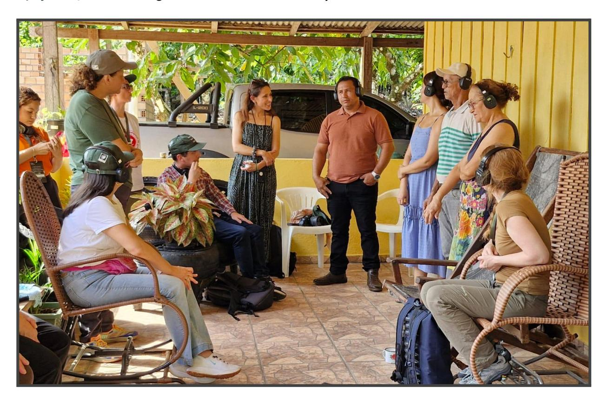

# Insights and reflections on field trips

### Session objective

Collecting insights and reflections on the field trips created a space for dialogue about the learnings, insights, and perceptions from the field trips conducted the previous day.

### Main learnings

After the discussions, the participants pasted their notes onto the collective visual board.

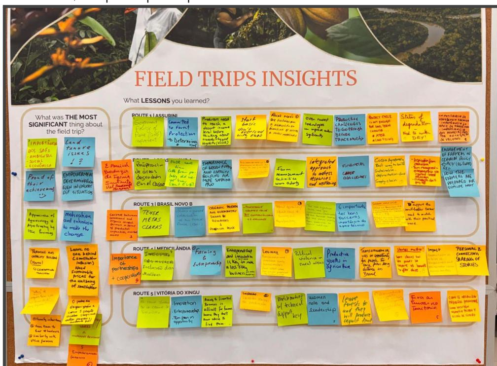

## Route 1 – Assurini

The visits along Route 1 Assurini underscored the critical role of enabling public policies, particularly in the cattle sector, alongside producers' clear commitment to forest conservation. However, achieving income security remains a prerequisite for smallholders before compliance with traceability and legality requirements can be expected. Policy implementation should therefore follow a phased approach, starting with basic requirements and avoiding excessive initial regulatory burdens, including those related to the EUDR.

Targeted support for family farming is essential to facilitate access to new markets. While relatively simple technologies can substantially improve productivity, structural production constraints must be addressed before introducing advanced traceability systems. Land degradation and increasing climatic stress highlight the need for sustained technical assistance, multi-stakeholder partnerships, and strong producer organisations. Short-term project cycles are insufficient to deliver long-term, systemic change.

## Route 2 – Brasil Novo A

The visits along Route 2 Brasil Novo A demonstrated that sustainable production systems are viable across both livestock and cocoa sectors, including integrated crop–livestock–forestry systems and fine-flavour cocoa agroforestry. Despite generally sound farm management practices, financial constraints remain a significant barrier to further sustainability investments.

Awareness of emerging regulatory frameworks, such as the EUDR, is limited, particularly among cattle producers, underscoring the need for targeted information, capacity-building, and transitional periods. Access to green finance, combined with technical training, is a key enabler of sustainable intensification. Cocoa agroforestry presents a strategic pathway toward deforestation-free supply chains. However, limited economic incentives—particularly for EU export markets—affect farmer engagement. Levels of preparedness for external market and policy requirements remain uneven.

## Route 3 – Brasil Novo B

The visits along Route 3, Brasil Novo B, revealed significant disparities between conventional and organic cocoa producers in terms of production capacity, organisational development, and market access. Producers with clear strategic objectives and leadership—especially in organic and agroforestry systems—demonstrated stronger integration across the value chain, including processing and value addition.

While local processing enhances value capture, commercialisation remains a key bottleneck. Diverse farming models reflect both historical land-use trajectories linked to Amazon colonisation since the 1960s and evolving sustainability transitions. Organic production and agroforestry systems require stronger market recognition and policy incentives. Effective partnerships and demand-driven technical assistance are essential to ensure that support mechanisms align with the operational realities of smallholder farmers.

## Route 4 – Medicilândia

The visits along Route 4 Medicilândia highlighted the role of cooperatives and partnerships in enabling the transition from primary production to entrepreneurial and value-added cocoa business models. Cooperativism emerged as a central mechanism for reducing risk, scaling innovation, and enhancing competitiveness within sustainable cocoa value chains, including family-based processing initiatives.

Women's participation, youth engagement, and intergenerational family enterprises were identified as essential drivers of rural development. At the same time, the operating context is affected by structural challenges, including political violence in rural areas. The Transamazônica corridor has played a historical role in shaping settlement and production systems. Narrative-based knowledge sharing and peer learning proved effective in communicating impact and strengthening collective action.

## Route 5 – Vitória do Xingu

The visits along Route 5 Vitória do Xingu emphasised the social and cultural dimensions of agricultural value chains, highlighting how different production systems influence livelihoods and territorial resilience. Innovation and entrepreneurship were key to transforming historical challenges into viable economic opportunities.

Limited access to financial resources remains a structural constraint, often driven by information gaps rather than a lack of demand, reinforcing the importance of advisory services and technical support. Women's leadership plays a critical role in organisational development and innovation. Indigenous and agroforestry-based production systems demonstrate that forest conservation and high-quality production can be mutually reinforcing, supporting long-term territorial stability. A smallholder organisation is shaped by collective memory and forward-looking development visions.

# Digital Public Infrastructure

### Session objectives

The activity fostered technical exchange on digital approaches to EUDR compliance, with a particular focus on geolocation, traceability, deforestation risk analysis, and forest monitoring. It also sought to showcase solutions and practical experiences relevant to different target groups and contexts, identify existing gaps where additional efforts are needed, and explore partnerships that could support and drive continued progress.

Following the World Cafe methodology, seven expert presenters shared case studies on public digital infrastructure across different socio-cultural contexts from various countries. Below are described the summaries of each of the case studies that were presented.

### Host

**Jorge Espinoza** GIZ SAFE Project Lead

## Speakers

# Case 1 | Accelerating Innovative Monitoring for Forests and Commodities

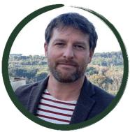

**Rémi D'Annunzio**  
Food and Agriculture Organisation  
(FAO)  
Forestry Officer

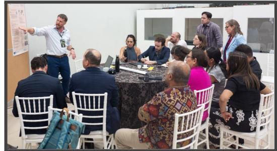

### Project Description

**AIM4Commodities** is a global initiative focused on strengthening **forest monitoring** and promoting transparent, sustainable, and deforestation-free commodity value chains by developing open, inclusive, and scalable solutions that support producers, companies, and regulators in improving environmental accountability and responsible production.

### Main Goals

1. 1. to expand access to reliable land cover, land use, and geolocation data;
2. 2. to promote a convergence-of-evidence approach that enhances interoperability with national forest monitoring and commodity-tracking systems; and
3. 3. to strengthen both physical and digital traceability across key supply chains by optimizing geolocation-sharing standards, supporting large-scale field data collection for smallholders, and fostering broad engagement with governments and commodity platforms.

### Challenges

Highly unstructured supply chains that hinder consistent data collection, regulatory uncertainties that complicate compliance, limited stakeholder awareness regarding digital data requirements, and a general lack of trust in open data and digital public infrastructure.

### Lessons Learned

Ensuring **interoperability across systems** so that due diligence processes maintain integrity and can be reliably supported through **open data and transparent workflows**. Achieving this requires a **strong digital public infrastructure (DPI)** built on components that are transparent, reproducible, and accessible to all stakeholders.

## Case 2 | Digitising the cocoa sector: a public-private collaboration in Cameroon

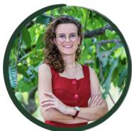

**Tabea Riemensperger**  
GIZ SAFE Cameroon  
Advisor

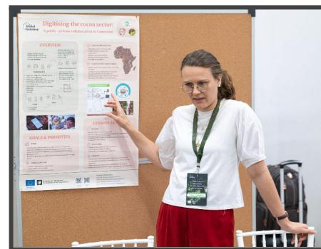

### Project Description

The project supports the **digitalisation of cocoa trade tracking in Cameroon** by registering market calendars, producer organisations, and individual producers, on the ONCC digital platform. It enables buyer registration, cooperative warehouse documentation, packing lists, and sales slips for both producers and cooperatives, while **integrating geolocation of farmers via QR codes**. By bringing together public-sector efforts from the NCCB and private-sector data from the CICC onto a **single platform (GEOSHARE)**, the initiative streamlines and modernises the monitoring of commercial cocoa transactions across Cameroon.

### Main Goals

The project aims to create an interoperable traceability system in which all exported cocoa is linked to plot-level geolocation data from the CICC and traded through fully registered transactions with the NCCB, enabling **100% traceability from farm to export** in alignment with the EU Deforestation-Free Products Regulation (EUDR). At the same time, it seeks to empower producers and cooperatives, strengthening their role and autonomy within the supply chain.

### Challenges

A fragmented data architecture that existed before the mutualization of information, limited access for producers to geolocation data, and connectivity and equipment gaps in rural areas that hinder the effective use of digital traceability tools.

1. 1) decentralization is effective when paired with strong institutional coordination
2. 2) interoperability and data sharing depend on trust, clear governance, and supportive legal frameworks;
3. 3) public-private collaboration is essential for inclusivity and readiness for the EUDR
4. 4) active producer involvement, along with ownership of their data, significantly enhances system adoption and transparency.

## Case 3 | Ghana Cocoa Traceability System

**Samuel Owusu-Acheaw**  
 COCOBOD, Ghana  
 Deputy Information Systems Manager

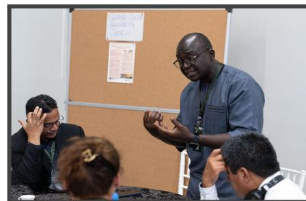

### Project Description

The **Cocoa Management System (CMS)**, launched by the Ghana Cocoa Board (COCOBOD) in 2019, was designed to enhance support services, efficiency, and transparency in Ghana's cocoa sector by digitally capturing detailed information on farmers, their farms, and production activities. By 2023, the CMS had registered and **mapped over a million cocoa farms nationwide**, laying the foundation for the Ghana Cocoa Traceability System (GCTS), which **tracks cocoa beans from farm to export.**

### Main Goals

The project aims to digitise farmer information to improve planning, payments, and service delivery; promote sustainable cocoa sourcing by preventing deforestation and protecting sensitive areas; and empower farmers through digital inclusion, providing access to inputs, credit, training, and compliance with international regulations such as the EU.

### Challenges

The project faced several challenges, including slow data collection in remote farming areas due to poor internet connectivity and limited access to technology, as well as delays in farmer verification and updates caused by discrepancies in farm records and overlapping boundaries. Additionally, extensive training and capacity building were required to ensure that field staff and farmers fully understood the new digital systems. Also, organising the initial nationwide data collection for all farmers proved to be a massive and time-intensive task.

1. 1) strong collaboration, accurate data, and continuous training are essential for a successful traceability system
2. 2) Ghana's implementation of the CMS and GCTS has established the country as a benchmark for low-deforestation risk and a leader in sustainable cocoa production

## Case 4 | Côte d'Ivoire 2020 land-cover map

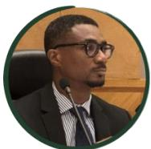

**Fernand Bale**  
 Côte d'Ivoire National Office for  
 Technical Studies and  
 Development  
 Governing Board Member

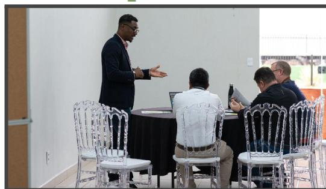

### Project Description

The map was developed for the year 2020 to provide **high-quality baseline data** in the context of EUDR due diligence and support market access of Côte d'Ivoire's export products, in particular, cocoa.

### Main Goals

The project, led by Côte d'Ivoire's national GIS agency with guidance from an inter-institutional committee, technical support from JRC and EFI, and funding from the EU Sustainable Cocoa Programme, aimed to develop a robust land cover map to support sustainable cocoa production and EUDR risk assessment. Using a **23-class land cover classification** aligned with the national forest definition and convertible to the FAO standard, the project followed international best practices and technologies.

### Challenges

The main challenge is that financial means and technical assistance are needed to sustain and increase national capacity to provide robust land cover and forest monitoring data.

1. 1) Côte d'Ivoire set a precedent by making national baseline forest data freely and transparently available to support EUDR due diligence and zero-deforestation efforts;
2. 2) the collaborative process with other government agencies built trust and enabled the sharing of sensitive data, such as forest inventories and cocoa plot polygons;
3. 3) the **national land cover map, externally validated by the EU Joint Research Centre with 91% accuracy, provides more precise, EUDR-aligned data than global maps** and has become a widely recognized and valuable tool for agricultural sector operators sourcing from the country.

## Case 5 | Platform AgroBrasil+Sustentável

**Clecivaldo de Sousa Ribeiro**  
Ministry of Agriculture, Brazil  
Director Department Supply  
Chain Development

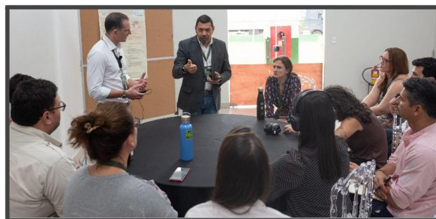

### Project Description

A **digital government platform in Brazil integrates official databases** to provide reliable information on agricultural production, organising data on the socio-environmental conditions of rural producers and properties for various supply chain stakeholders.

### Main Goals

The project aims to qualify Brazilian agricultural products by integrating official databases on a voluntary, universal, and cost-free basis, promoting sustainable agriculture and supporting public policies for adaptation and technological transition. It seeks to enhance market access and responsible exports through greater transparency, expand opportunities for the bioeconomy and green products, improve data availability to support agricultural development, and foster inclusive policies that increase value for all actors across the supply chain.

### Challenges

The project faces several challenges, including the availability and compatibility of databases, engaging producers who may lack confidence in the system, and ensuring that the platform accurately reflects the specific characteristics of different land types, producers, and value chains.

1. 1) the importance of multi-stakeholder governance to address the interests, needs, and specificities of different value chains and their actors;
2. 2) the relevance of public databases and
3. 3) and the value of having mechanisms to assess the sustainability and information risk of agricultural production.

## Case 6 | Building Uganda's Digital Public Infrastructure for Agriculture

**Nabil Janmohamed**  
PULA Data Services  
Vice President

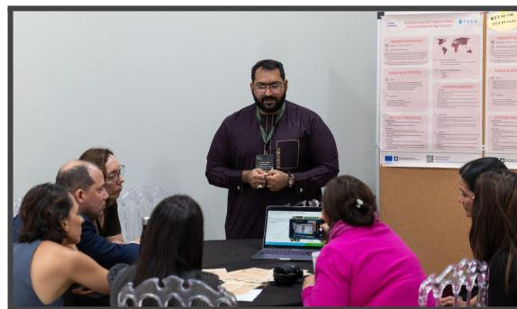

### Project Description

Pula supported the Ugandan government, through MAAIF and the Agriculture Business Initiative (ABi), in developing a **national digital public infrastructure (DPI) for agricultural traceability** to meet the EU Deforestation Regulation (EUDR).

### Main Goals

The project aimed to **unify fragmented coffee-farmer data into a single, interoperable system** that serves both compliance and commercial needs. Leveraging field operations and data technology, **Pula successfully mapped 1.75 million coffee farms in seven months**, ensuring high data quality, farmer consent, and spatial accuracy.

### Challenges

The project faced several challenges, including conflicting stakeholder interests, as exporters, cooperatives, and traders had competing concerns over data ownership; inconsistent legacy data, with poor-quality datasets complicating integration into the national system; farmer fatigue, as repeated previous data collections led to distrust and resistance; and data ownership challenges, requiring careful negotiation to transition from private to shared infrastructure.

1. 1) Centralised data collection with independent verification enhances accountability and data quality, while clear governance, ownership, and consent are essential for building trust.
2. 2) Efforts to comply with the EUDR accelerated digital transformation in agriculture, and shared, unified systems improved efficiency by reducing duplication and enhancing coordination.
3. 3) Demonstrating precision and transparency early on was crucial for gaining national credibility and support.

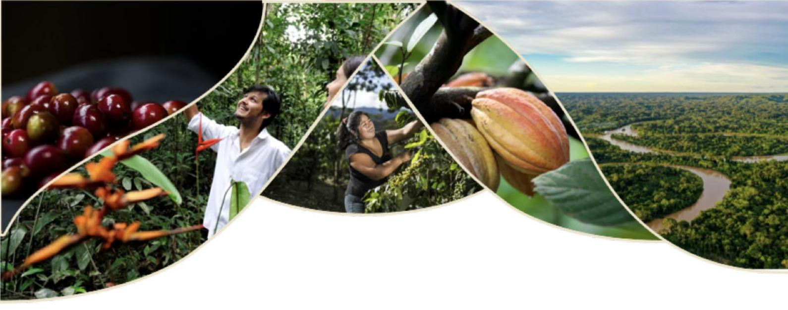

## Smallholder needs, gender equity and social inclusion

### Host

**Katrin Toepfer**  GIZ - TEI Zero Deforestation Hub

Global Coordinator

### Session objective

During the session participants had the opportunity to learn about different initiatives related to the inclusion of smallholders in the processes of adapting to market regulations. This includes insights and outcomes from the SAFE GESI Sprints, shared experiences related to gender, youth, and other marginalized groups in agricultural businesses, trade, and production, and to strengthen smallholders and cooperatives in their transition toward deforestation-free value chains and sustainable agricultural practices.

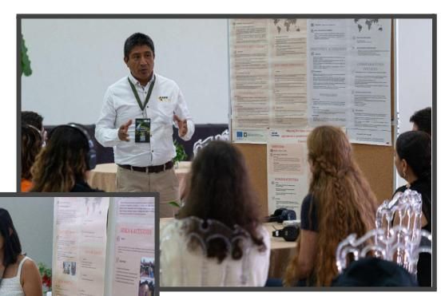

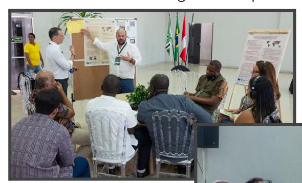

# Speakers

## Case 1 | Strengthening women's land rights in Zambia

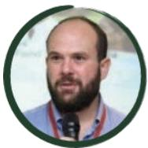

**Gerrit Qualitz**  
GIZ SAFE Zambia  
Component Lead

### Project Description

This project is part of the global **SAFE GESI Sprint**, which accelerates solutions for gender equity and social inclusion while supporting the implementation of the EU Deforestation Regulation (EUDR). In Zambia's soy sector, **women face major barriers to land access and ownership**, limiting their ability to benefit from training and market opportunities. Strengthening women's land tenure security is key to improving livelihoods, equity, and sustainable participation in global markets.

### Main Goals

The project aims to empower communities in Zambia by strengthening land tenure security for women, promoting sustainable development and social equity. It focuses on delivering innovative land documentation solutions, such as ParcelCert, to support secure land ownership. Ultimately, the project seeks to create lasting impact by reaching more than 1,200 community members and securing formal land rights for at least 50 women.

### Challenges

The project faces significant challenges, including limited awareness of land rights within communities, especially among women, and deeply rooted gender disparities in land ownership and decision-making processes. Traditional beliefs often restrict women's control over land, reinforcing patriarchal structures and beyond that, women in the soy value chain, emphasized that access to land is essential for their livelihoods and that structural barriers continue to limit their security.

1. 1) shifting long-established social norms is a gradual process requiring long-term community leadership
2. 2) achieving gender equity and social inclusion depends on involving men from the start
3. 3) despite initial challenges, men participating in the trainings expressed openness to individual or shared land ownership and to including women on customary land titles.

## Case 2 | Regional technical dialogue towards an inclusive transition of deforestation-free and EUDR-compliant commodity production in Indonesia and Malaysia (and further countries in SEA)

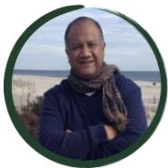

**Rizal Algamar**  
Tropical Forest Alliance (TFA)  
Regional Director Southeast Asia

### Project Description

The **Regional Technical Dialogue on the EU Deforestation Regulation (EUDR) in South East Asia** is designed to strengthen stakeholders' understanding and preparedness ahead of the regulation's implementation. The initiative provides a platform for governments, producer associations, and smallholder representatives to exchange knowledge, discuss technical requirements, and jointly develop inclusive solutions for sustainable, deforestation-free supply chains.

### Main Goals

The project's main objectives are to build a shared understanding of EUDR compliance by exploring key challenges, approaches, and solutions; to demonstrate how supply chains can transition inclusively toward meeting EUDR requirements; and to strengthen smallholder integration through focused discussions that identify priorities and barriers. These efforts are supported by business-focused dialogues addressing technical implementation challenges and regional multi-stakeholder exchanges that **delve into the regulation's technical context.**

### Challenges

The main challenges include the limited inclusion of smallholders, who face land-tenure insecurity, low productivity, and restricted access to technical support and incentive mechanisms. Certification processes also pose difficulties due to the complexity of requirements and the need for reliable data and documentation. Additionally, financial constraints and the high cost of compliance create significant barriers, **especially for undocumented smallholders.**

### Lessons Learned

1. 1) stronger stakeholder collaboration is essential to address land-tenure challenges affecting independent smallholders and to harmonize policies that improve traceability, transparency, and system integration across supply chains
2. 2) consistent technical support and monitoring are crucial to ensure the inclusion of small and vulnerable producers, enabling them to participate in deforestation-free value chains
3. 3) regional multi-stakeholder dialogues, proved highly effective in aligning approaches, sharing knowledge, and fostering a common understanding of EUDR requirements

## Case 3 | Traceability for empowerment of smallholder organizations in Ecuador

**Gabriela Espinosa**  
GIZ SAFE Ecuador  
Advisor

### Project Description

Strengthening capacity of cocoa and coffee smallholder organisations by developing best practices for managing information on their products, processes, and suppliers, and by providing digital and data management tools to support efficient traceability systems. This matters because it **enables smallholder organisations to manage their operations more effectively**, meet international legality and transparency requirements, make better decisions based on accurate data, and build stronger, more **trusted relationships with both suppliers and customers**.

### Main Goals

The project aims to implement legal and deforestation-free traceability systems for coffee and cocoa through participatory work with producer organisations, combining tailored digital tools with capacity building based on each organisation's maturity level, from establishing initial manual systems to consolidating fully digital operations. Key activities include assessing organisational readiness for traceability, developing a step-by-step implementation guide, strengthening the use of a digital accountability system with QR-based product flow tracking for cocoa, digitising field registration and deploying a traceability module for coffee, and

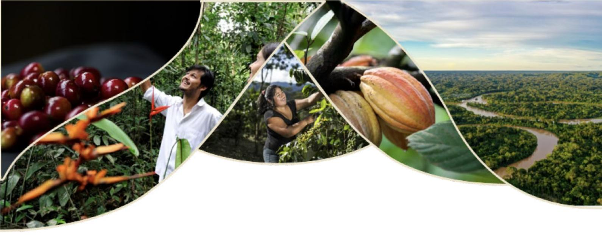

**implementing INATRACE** within UNOCACE by mapping process flows and testing data from 19 grassroots organizations.

### **Challenges**

- 1) clarifying the full costs of implementing and maintaining a traceability system
- 2) adapting solutions to organizations with very different levels of maturity
- 3) ensuring that systems enable quick and reliable access to information while maintaining data that is consistent, complete, and continuously updated.

### **Lessons Learned**

- **1) the inclusion of 1,674 smallholder farmers in digital traceability systems resulted in another 1,452 registered for integration by 2025**
- 2) the engagement of ten producer organizations (five already using a digital traceability system and five structuring a manual one)
- 3) the **establishment of trained focal points** and clearly mapped internal processes, which together strengthened the organizations' capacity to implement, operate, and monitor both manual and automated traceability systems effectively

### Case 4 | Geolocalización y verificación de la legalidad del cacao silvestre amazónico en Bolivia

**José Luis Osinaga Eguez** 

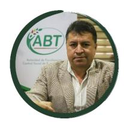

Autoridad de Fiscalización y Control Social de Bosques y Tierra Bolivia.

### **Project Description**

The project was created to establish a **public–private dialogue** and coordination space aimed at defining and **testing regulatory procedures** that enable the harmonization and standardization of the geolocation of wild cacao and the certification of legality in its extraction process.

### **Main Goals**

- 1) define the most effective methodology for geolocating scattered wild cacao stands in forests

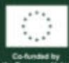

1. 2) identify and prioritize legal mechanisms that ensure the legality of wild cacao harvesting
2. 3) facilitate verification of geolocation and land use in compliance with EUDR requirements while strengthening public policies for the sustainable management and use of non-timber forest products.

### Challenges

The project faces several challenges, including the replacement of native cacao genotypes with improved foreign clones, forest fires, disease outbreaks, and territorial conflicts. These issues contribute to the loss of genetic diversity in wild cacao due to the proximity of cultivated areas with non-native clones, as well as deforestation of the forests where wild cacao naturally grows.

### Lessons Learned

1. 1) recognizing deforestation as the main cause of wild cacao loss, driven by conversion to pasture or agricultural land
2. 2) having updated information on the extent and distribution of wild cacao areas and raising awareness of its economic, social, and environmental value.
3. 3) need to strengthen conservation, protection, and sustainable use of wild cacao and the ecosystems where it naturally develops.

## Case 5 | Towards an inclusive and equitable cocoa value chain - APPCACAO's Gender Equity Institutional Policy 2025–2028

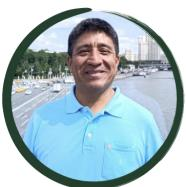

**Luis Mendoza**

Peruvian Association of Cacao Producers (APPCACAO)  
Manager

### Project Description

The **Gender Equity Institutional Policy** is the result of a participatory process led by APPCACAO's Women's Development Unit, with the collaboration of members from the National Network of Women Cacao Producers, associated cooperatives, regional leaders, technical teams, and partners. Its implementation aims to **mainstream a gender perspective** across

institutional management, services, cooperative governance, and commercial relations, promoting an inclusive, fair, and non-discriminatory cacao value chain.

### Main Goals

The project aims to **transform the cacao sector to ensure full equity and inclusion across gender, culture, and age** by strengthening capacities, participation, and fair access to resources. Its objectives include building sustainable management and leadership skills in producer organizations and families with an inclusive approach, ensuring equitable participation of women, youth, and indigenous peoples in organizational decision-making.

### Challenges

1. 1) harmonizing the varying levels of understanding about gender approaches within cooperatives
2. 2) allocating sufficient time and resources for territorial dialogue and validation processes
3. 3) overcoming initial resistance to gender-focused initiatives while strengthening the technical capacities of regional teams to integrate gender perspectives into cooperative management.

1. 1) recognizing that building an institutional policy with a gender equity focus requires strong political leadership, grassroots participation, and sustained commitment from leadership.
2. 2) Involving women producers from the diagnostic stage through validation strengthens ownership and ensures the policy reflects local realities
3. 3) **gender equity is not a peripheral issue but a strategic pillar essential for sustainability, governance, and the competitiveness of the sector.**

## Case 6 | Solidaridad's inclusive regional dialogues on the EUDR

**Milagros Menna**  
Solidaridad Network  
Argentina/Uruguay

**Mario Salas**  
Solidaridad Network Paraguay

### Project Description

The project aims to **create a collaborative environment that fosters understanding**, dialogue, and knowledge exchange among key actors in the soy and livestock value chains, promoting collaboration and capacity building to support a fair and inclusive transition under the EUDR.

### Main Goals

The project has successfully conducted multi-stakeholder national dialogues in Paraguay, Uruguay, Argentina, and Brazil, focusing on soy and beef supply chains. It organized regional events in Punta del Este, Buenos Aires, and Filadelfia, along with webinars sharing EUDR pilot experiences across the Mercosur region. Additionally, the project produced analytical reports, stakeholder materials, and communication pieces to disseminate lessons learned and best practices throughout the region.

### Challenges

1. 1) need to monitor producers' adaptation processes and their use of available tools effectively. Many producers still lack clear information about the EUDR, its implications, and how to demonstrate compliance
2. 2) need for greater clarity on how small and medium producers can participate in deforestation-free supply chains without incurring disproportionate costs or administrative burdens.

1. 1) Access to information, technical assistance, and financial incentives are essential for producers to successfully transition to EUDR compliance
2. 2) Collaboration with other initiatives supporting EUDR implementation in the region amplifies impact and ensures consistent messaging to stakeholders.

## Case 7 | Project for consolidation of family production and containment of deforestation

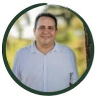

**João Batista**  
FVPP Brazil  
Director

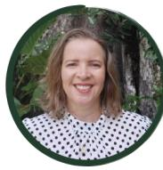

**Lucimar de Souza**  
IPAM Brazil  
Director of Territorial  
Development

### Project Description

**Rural Vocational School (Casa Familiar Rural – CFR)** is an association of families and institutions that work together to promote sustainable and solidarity-based rural development by training adolescents, youth, and their families, **using Alternating Pedagogy as a transformative tool**. The model began in 1935 in France, was introduced in Brazil in 1965, and reached the Transamazon region in 1995. It emerged from a discussion among smallholder associations questioning the contribution of traditional education to their region.

### Main Goals

The main objectives of the project are to **promote sustainable and solidarity-based rural development**, provide training for adolescents, youth, and their families, and use Alternating Pedagogy as a transformative educational tool.

### Challenges

The main challenges of the project include expanding quality services to new Rural Vocational Schools (CFRs) while ensuring the full operation of existing ones, strengthening the FERCAFAR-PA and FVPP networks to enable CFRs to operate with a territorial perspective, and providing students with access to public policies both during their studies and after graduation.

### Lessons Learned

Key learnings from the project highlight the effectiveness of Alternating Pedagogy, which emphasizes participatory research on local realities, critical analysis of the community context, and the generation of new questions and research. Teaching is grounded in the lived experiences of students and their families, ensuring education is relevant, transformative, and closely connected to the social and economic environment of the countryside.

## Case 8 | Leadership that transforms cocoa and livestock

**Luciana Rocha**  
GIZ SAFE Brazil  
Advisor

### Project Description

The project addresses **gender inequalities in the cocoa and livestock supply chains**, which limit women's participation and autonomy while negatively impacting the economic potential of both sectors. In the Transamazon and Xingu region, it seeks to foster a collective effort to create a more equitable and inclusive environment, **enabling women's empowerment in both the labor market and personal life**. The initiative implements gender-transformative activities that aim to change cultural norms and power relations, addressing gender differences and inequalities from the outset with a focus on equity.

### Main Goals

To strengthen transformative gender leadership, contributing significantly to the reduction of gender inequalities in the cocoa and livestock supply chains in the Transamazon and Xingu - Pará region.

### Challenges

The main challenge of the project is ensuring active participation in the online mentoring process.

1. 1) The importance of creating spaces for exchange among women, youth, and supportive men, fostering collective dialogue and learning. There is a recognized need for targeted training to promote the empowerment of women, young people, and vulnerable groups in the region.
2. 2) Continuous dialogue is essential to address the four quadrants of change: individual, relational, structural, and cultural.
3. 3) The stories of struggle and achievement from local communities continue to inspire and motivate women and youth to pursue greater participation and leadership

# Cooperation with the private sector

### Host

**Jorge Espinoza** GIZ SAFE Project Lead

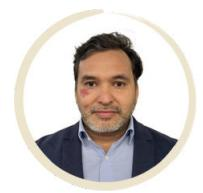

### Session objective

The session highlighted the private sector's central role in ensuring sustainable supply chains, explored how collaboration with businesses can accelerate the shift toward deforestation-free value chains, and discussed how companies and policymakers can work together to ensure that smallholders, Indigenous communities, and other marginalised groups are fully included in this transition.

The session was conducted using a "fishbowl." method, where guests sat in chairs arranged around the centre of the room, to allow an interactive discussion between the speakers following guiding questions posed by the host. At the end of the session, participants had the opportunity to react and pose additional questions to the speakers.

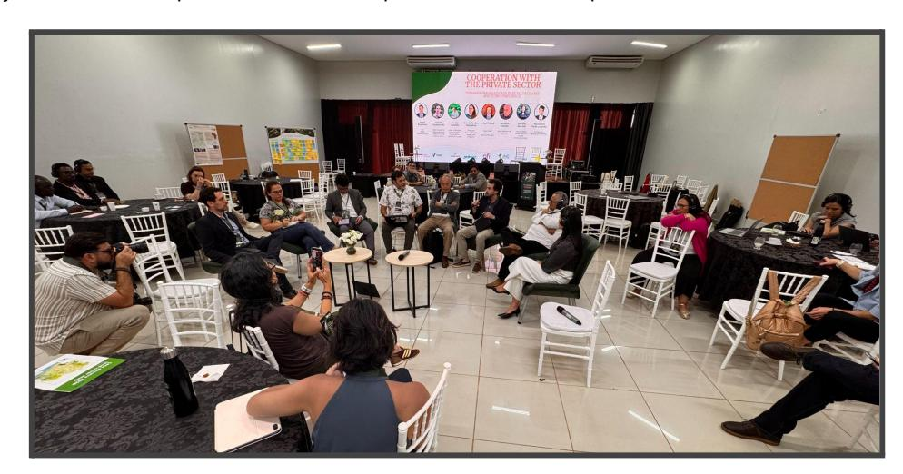

### Speakers

**Daniel Kazimierski**  VISEC Argentina Responsible of Institutional and External Affairs

**Vitor França**  Olam Food Ingredients General Manager

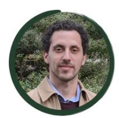

**Freddy Cabello**  Union of Peasant Cocoa Growers´ Organizations-UNOCACE Ecuador

**Lorenzo Castillo**  Junta Nacional de Café Peru

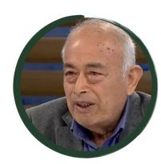

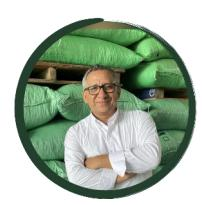

**Cecilia Korber Gonçalves** Proforest Deputy Director Project and Programs

**Ximena Serrano**  ProColombia Subdirector for Quality and Sustainability

**Rismawan Farid Lufianto**  Ministry of Agriculture Indonesia

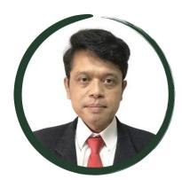

### Record of the main moments and discussions

**Cooperation between the public and private sectors is essential,** as seen across Peru, Ecuador, Indonesia, and Brazil. In Peru, **aligning with European standards can become an opportunity,** supported by green funds that cascade through supply chains and enable the market-oriented reconversion of coffee farming under climate change. **In Ecuador,** cooperation fosters synergies among actors, combining external perspectives with local knowledge, promoting energy savings, ensuring visibility of human efforts, and bringing public and private actors to the same table so that **individual private initiatives can be reflected in public policy**. **In Indonesia,** the private sector is encouraged to collaborate despite geographic dispersion

and traceability challenges, while the public sector works to **create enabling conditions. In Brazil's** civil society experience with soy and cattle, companies are preparing, supporting, and contributing to the **development of public platforms** through sectoral participation, shared results, dry runs, and joint work built on mutual respect.

Across the countries, the main challenges centre on data demands, economic viability, governance, and alignment among diverse actors. Colombia highlights that **strict data requirements can push producers toward informality**, raise unresolved questions about **who bears compliance costs**, and **generate false positives** from imperfect technological platforms. **Brazil's** perspective underscores the **need for economic viability**, better access to technology and logistics, and recognition of ecosystem-service benefits. **Argentina** points to the difficulty of getting all actors on board and **ensuring data transparency without exposing weaker intermediaries**, while also improving public sector systems for geospatial detection and **public-private integration**. Peru stresses the need to strengthen value chains, build trust, and turn productivity and sustainability challenges into long-term opportunities. Ecuador emphasises aligning individual interests with shared goals to maintain access to the EU market. **Paraguay** notes that the EUDR affects each country differently, complicating dialogue, and calls for participatory systems, **validated tools, and a deeper understanding of domestic markets** to keep producers motivated.

Cooperation is viewed as a joint effort in which public and private actors share responsibilities, information, and risks to strengthen value chains and meet new regulatory demands. Indonesia emphasises **capacity building through dry runs and public-private partnerships**; Brazil's perspective highlights **farmer-centric collaboration**, cooperativism, and data transparency to build trust; other stakeholders stress coordinated systems where **a single entity registers farmers, integrates traceability, and centralises information in data warehouses**. Work across the entire value chain, both upstream and downstream, relies on sectoral organisations to connect with producers and disseminate requirements. Cooperation also involves collectively identifying obstacles and mapping needs, while the public sector provides the regulatory framework and foundational data so that private actors can deliver operational solutions.

Looking ahead, the **private sector's role centers on three core functions**:

- ● **Driving Data-Based Innovation:**

Private actors are expected to lead in developing agile, privacy-sensitive data systems, such as georeferenced databases, traceability tools, and virtual training platforms. These efforts will build on public information while requiring sustained investment in technology, standardisation, and technical assistance.

experimental shipments, expanding market access, and promoting long-term productive reconversion to more sustainable models.

- • **Shaping Collaborative Governance:**

Private actors will play an increasingly strategic role in policy co-creation and multisector partnerships, contributing leadership, collaborative structures, and capacity-building efforts to better align value-chain practices with public policy objectives.

Participants from all countries broadly **expect the EUDR to provide a clear, functional system that supports competitiveness, transparency, and fair market recognition**. They anticipate that the regulation will clarify responsibilities and processes, **enable scalable replicable models across commodities and regions**, and help harmonise sustainability goals while rewarding differentiated products. They also expect **practical guidance on implementation:** how products will be assessed, **how customs controls will operate**, whether systems are ready, and how criteria will be analyzed. Overall, they view the EUDR as a positive step that builds on substantial progress already made, while recognising the need to begin implementation in order to resolve remaining challenges.

The three **main challenges** reported by the countries are:

1. 1. **Building robust and interoperable traceability systems** across highly fragmented, dispersed, or technically limited supply chains, while addressing data-sharing sensitivities and ensuring accurate geolocation and verification of false positives.
2. 2. **Strengthening cooperation** and trust among producers, suppliers, exporters, government agencies, and civil society through multi-stakeholder platforms that can align interests, share information, and coordinate public–private actions.
3. 3. **Ensuring capacity, resources, and economic viability for producers, especially smallholders**, who face technical gaps, poverty-related constraints, and the need for support (training, technology, national systems, dry runs) to meet EUDR requirements and maintain access to key markets.

## Q&A

At the close of this session, several contributions and questions from participants provided additional detail on each country's needs and perceptions regarding the EUDR. Some important points from these final remarks are highlighted below:

**Andres Gines, Ministry of Trade Paraguay**, highlights the **need for a clear legal framework** that defines which institutions lead EUDR implementation and stresses that compliance challenges vary widely across countries and commodities. The country notes the importance of

participatory processes involving authorities, companies, certifiers, and producers, especially given high domestic consumption in sectors such as cattle, which reduces producer's motivation to meet external requirements. Paraguay also points out the **contrast between highly formalised sectors like soy**, where state presence is strong, **and more variable sectors like cattle**, emphasising the desire of soy, beef, and timber actors for a participatory, multi-stakeholder system supported through cooperation with the EU.

**Lorenzo Castillo, Junta Nacional de Café Peru** reports varied levels of preparedness across the coffee sector, with some buyers and cooperatives engaging in deeper dialogue than others. The focus is on sharing experiences of collaboration and forming partnerships that strengthen relationships within the value chain.

Malaysia showcases **strong public–private–civil society cooperation through EU buyer partnerships with local producers**, highlighting successful training initiatives, such as those on organic pepper, as an example of effective PPP-driven capacity building.

**Carolle Alarcon** reinforced the continuity of Brazil's multi-actor engagement through the **Coalizão Brasil** and joint work with GIZ's Agrichains and SAFE projects, focusing on identifying sector challenges, shaping the coalition's advocacy agenda, and designing an integrated soy traceability system supported by public–private data sharing via the AgroBrasil +Sustentável platform.

**Daniel Kazimierski, ViSEC Argentina**, stressed that the **EUDR has driven improvements in Argentina's public registries and opened new opportunities for cooperation between government and the private sector through VISEC**. He noted that buyer–exporter relations remain a private-sector responsibility, but solid and clear government information is essential, and that VISEC's traceability system, combined with third-party certification, helps ensure the credibility of all traceability data.

Regarding future vision, as emphasised by **Colombia's experience with large cocoa companies**, **the private sector will play a central role in driving traceability**, ensuring compliance, and fostering collaboration across entire supply chains. **Companies are expected to leverage their capacity and agility to coordinate efforts that benefit all actors, from producers to exporters.**

**In Peru and Malaysia, private actors are leading experimental shipments**, developing agroforestry systems, and creating aligned protocols and data exchanges to build trust and harmonize information along the chain. **Key responsibilities include investing in training, innovation, and traceability tools, establishing collaborative structures and aligned standards**, integrating suppliers and promoting transparency while protecting sensitive data.

Participants also stressed the **private sector's role in supporting market positioning for deforestation-free products, reducing deforestation across landscapes rather than only "cleaning-up" supply chains**, and preparing for future regulatory scrutiny by building robust systems to meet EUDR requirements. Overall, private actors are seen as both implementers and innovators, bridging gaps between public regulations, producer realities, and market expectations.

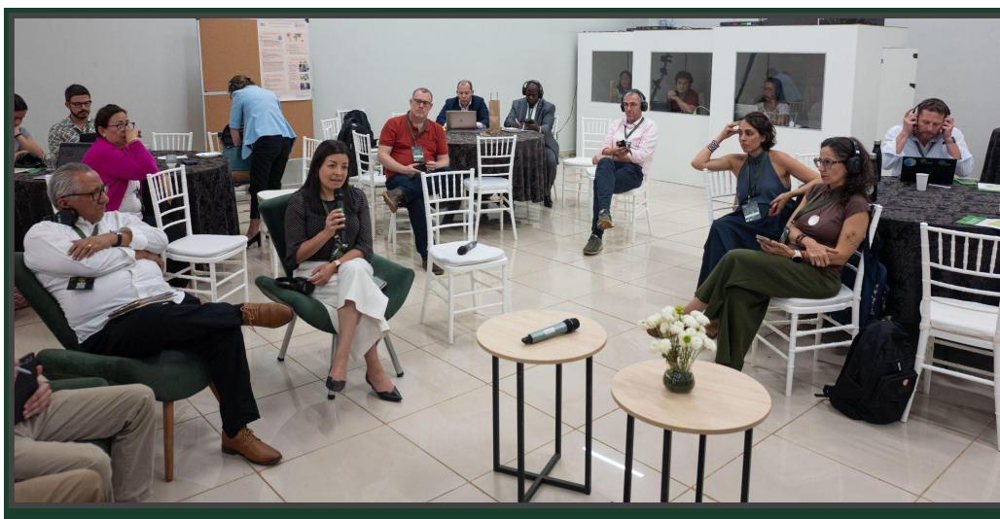

## DAY 5

# Sharing learnings

## Session objective

This session created an opportunity for participants to exchange insights and perceptions gained during the week-long workshop, and to spend time with their colleagues, highlighting key insights and perceptions from the sessions they experienced. Participants were divided into groups according to their regions of work: Brazil, Europe, Africa, Latin America, and South Asia. Participants were invited to record their learnings, opinions, and key observations on a collective visual board. At the end of the group discussions, each group highlighted the three main learnings it wished to share. The main findings from each working group are recorded below.

## Record of the main take aways of each group

### Group 1 | Brazil

- • Strengthening knowledge management and seeking greater synergies. Importance of collaborative work and increased cooperation.
- • The transformation process to create sustainable supply chains is long, but sustainable production is possible.

### Group 2 | Brazil

- • Humanizing the process is not about increasing commodities and volumes; it is about valuing local experiences and global learning.
- • The importance of strengthening cooperation to achieve objectives.

### Group 3 | Europe

- • Improved communication around narratives for the EUDR. Strengthening smallholder capacities, access to finance, and marketing.
- • South-South exchange for sharing solutions.

- **Group 4 | Europe**  High level of engagement among partner countries.Need to collect and communicate positive messages and impacts of TEI flagships.
  - Fostering exchanges to maintain momentum in 2026.

- **Group 5 | Africa** Need for policies that promote value addition; consumption should be encouraged among local populations.
  - A key EUDR gap is the lack of clear alignment with competent authorities and clarity on their expectations.Farmers can act as entrepreneurs through innovation.

### **Group 6 | Latin America**

- Indirect benefits of the EUDR, such as increased transparency and improved governance.Family farming and agro-industrial development.
- Data documentation.

### **Group 7 | Latin America**

- Due diligence as a risk assessment activity.Assertive and timely communication to ensure effective implementation of the EUDR.
- Need to strengthen small producers and technical cooperation, including access to financing, inclusion, training, and good practices.

### **Group 8 | South East Asia**

- Start with the basics and avoid overwhelming farmers.
- Balance the protection of global forests with farmers' livelihoods.
- Many EUDR solutions and tools, such as traceability and data systems, are already available.

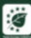

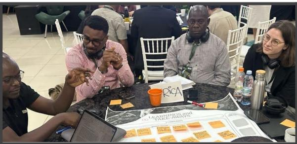

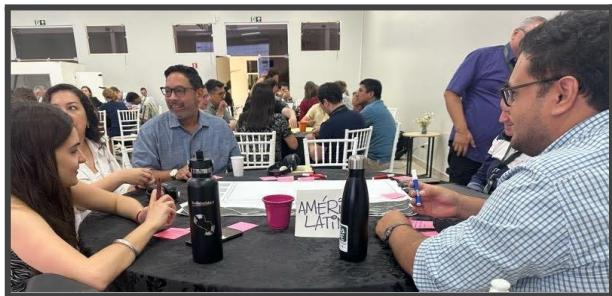

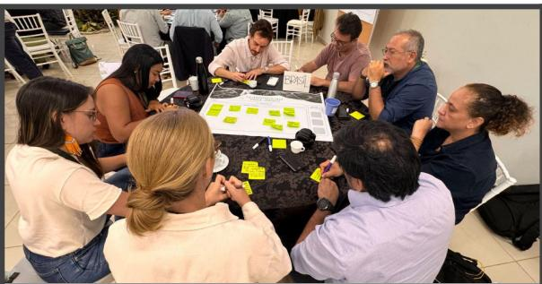

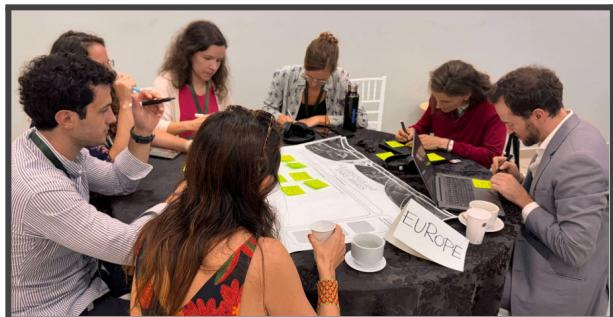

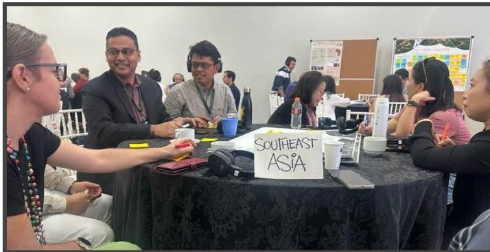

# Future vision

## Session objective

To plan a desirable future, in this final session, participants collectively thought and dreamed about what future scenario they envision for their countries or regions to achieve sustainable, deforestation-free supply chains.

## Record of the main moments and discussions

### A | Government

Governments can contribute by **implementing public policies that are favourable, coherent, and participatory, supporting family farmers**, fostering an environment conducive to investment, and aligning regulations to facilitate compliance. By improving communication across government levels, they can ignite **developing traceability systems**, foster scientific and qualified information, and engage in training, awareness building, and partnerships to support producers and exporters. The government's role is crucial in advancing deforestation-free value chains and effectively implementing the EUDR, and mobilizing sustainable finance in partnership with the private sector.

- • **Give policy direction**, enable environment, incentivize for deforestation-free value chains, walk the talk
- • **Adapt favourable and coherent public policies** to support family farmers, which are connected to the private sector
- • Seek consensus to generate assertive public policies
- • **Harmonize regulations** to facilitate compliance with the rules
- • Enable the incorporation of small producers into the market
- • Promote a favourable environment for investment and **leverage private finance** for sustainability

### B | Private Sector

The private sector can contribute by **investing in technology, innovation, and sustainable supply chains**, by promoting transparency, fair data-sharing systems, and access to green finance. They can support farmers and small producers, **strengthen inclusive businesses**, to favor expanding market access, and reducing intermediaries. By providing technical assistance

they can **foster local added value**, disseminating information, and promoting ongoing dialogue to guide results-based decision-making.

- • **Invest in technology**, promote transparency, and foster technical assistance
- • Invest in supply chains, sustainability and local added value
- • **Facilitate market access**, innovation, investments and green finance
- • Develop a fair system for **sharing data with stakeholders**
- • Foster inclusion toward small producers in the production chain and promote inclusive businesses
- • **Initiate dialogue, exchange and discussion** about results with other producers and sectors and disseminate information
- • **Activate better communication** between the government (state, municipal, federal) to ensure compliance with the law
- • **Engage in participatory dialogue** for oriented policies
- • **Qualify information, support science** (scenarios and data to support evidence-based decision-making)
- • **Guide on practical and full implementation of the EUDR**
- • Assess gaps in impact analysis and voice them to the political level
- • Develop a traceability system
- • **Build awareness** and training measures

## C | Civil Society

Civil Society can contribute by **providing technical assistance, fundraising, fostering political and public engagement**, and ensuring social oversight while holding governments and companies accountable. NGO's role in coordinating diverse actors, facilitating dialogue, and mobilizing technical and financial resources can support the adoption of sustainable practices, generate data-driven solutions, advocate for policy improvements, and help ensure compliance with sustainability initiatives.

- • Provide technical assistance, fundraising, political and public engagement
- • **Act as social control entity and watchdog** and **hold governments and companies accountable**
- • Facilitate and **coordinate the activities of different actors**, mobilize technical and financial resources and **build bridges to maintain progress**
- • **Create data solutions**
- • **Advocate for smallholder and/or nature interests** and engage in discussions
- • Promote and **provide trainings** on good agricultural practices to avoid environmental damage

## D | Academy

Academy can contribute by **translating concepts and practices into simple language**, creating spaces of trust and exchange between civil society and the private sector, and promoting a sustainable land-use narrative that encourages engagement. They can provide clear technical guidelines and **conduct studies and investigations** aligned with the real needs of the productive sector.

- • **Provide technical practices and guidelines** on the implementation of the EUDR and transition to sustainable agricultural practices
- • Translate concepts and practices into simple language
- • Create spaces of trust and exchange between civil society and the private sector and **lead multi-actor dialogues and roundtables**
- • Conduce studies and investigations in accordance with the needs of the productive sector

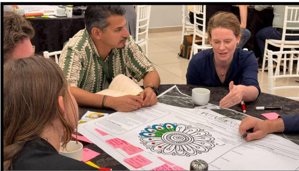

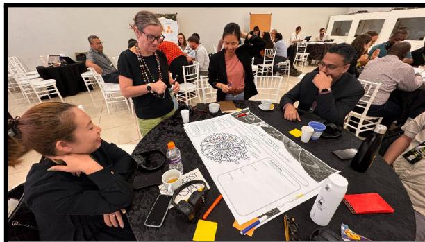

## CONCLUSIONS

The Altamira Summit highlighted the importance of collaboration, knowledge sharing, and inclusive engagement of smallholders to advance deforestation-free supply chains. Key priorities included improved communication and transparency around the EUDR, capacity building, access to finance, training, and strong governance and traceability systems to balance forest protection with livelihoods.

Looking ahead, **private sector actors** are encouraged to invest in innovation, transparency, and sustainable finance; **governments** to develop coherent, participatory policies and traceability systems; **academia** to provide practical research and clear guidance; and **civil society** to support implementation through coordination, technical assistance, and monitoring.

# ABOUT THIS PUBLICATION

## Published by:

Deutsche Gesellschaft für Internationale Zusammenarbeit (GIZ) GmbH

## Registered offices:

Bonn and Eschborn, Germany  
Address  
Friedrich-Ebert-Allee 32 + 36  
53113 Bonn, Germany  
+49 61 96 79-0  
info@GIZ.de

## Programme:

Sustainable Agriculture for Forest Ecosystems (SAFE)  
Secretariat of the Team Europe Initiative on Deforestation-Free Value Chains (TEI)  
[www.deforestationhub.eu](http://www.deforestationhub.eu)

## Responsible:

Dr. Elke Sümnick-Matthaei  
[elke.matthaei@giz.de](mailto:elke.matthaei@giz.de)

## Concept:

MIRÁ Design de Organizações

## Design/Layout:

MIRÁ Design de Organizações

## Photo credits:

GIZ

## On behalf of:

European Union, the German Federal Ministry for Economic Cooperation and Development - BMZ, and the Dutch Ministry of Foreign Affairs -MINBUZA

## Year:

November 2025

*This publication was produced with the financial support of the European Union, the German Federal Ministry for Economic Cooperation and Development (BMZ), and the Dutch Ministry of Foreign Affairs (MINBUZA). Its content is a documentation of the spoken and written statements from participants at the TEI outreach event Altamira Summit. All interpretation of the content is the sole responsibility of GIZ and does not necessarily reflect the views of the EU, the German or the Dutch Government.*