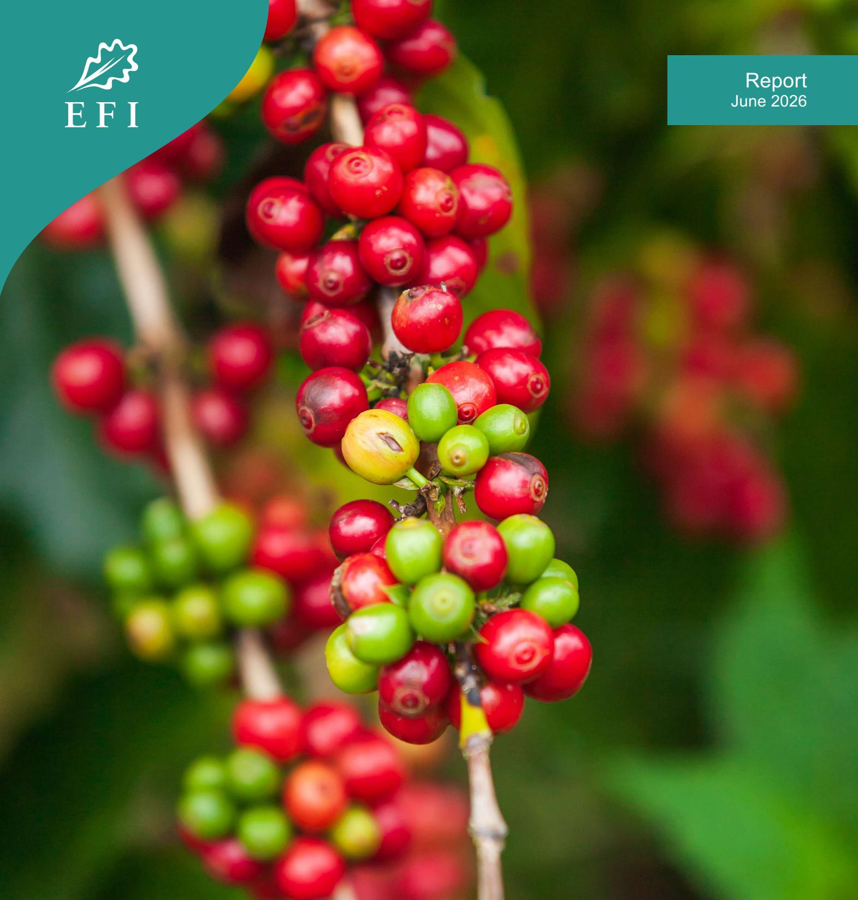

Technical facility on deforestation-free value chains

# Forest and Land-Use Monitoring in Lao PDR and the EU Deforestation Regulation

## Table of Contents

| 1. | Introduction and Policy Context ............................................................................................. 7  |
|----|----------------------------------------------------------------------------------------------------------------------------------|
| 2. | Methodological Approach ...................................................................................................... 9 |
| 3. | Lao PDR Forest and Land-Use Monitoring Systems ............................................................... 11                |
| 4. | EUDR Global Forest Cover Map 2020 .................................................................................... 17        |
| 5. | Analysis of the Lao PDR Forest, Land-Use Monitoring Systems and the EU Global Forest Cover                                       |
| 6. | Implications for EUDR Preparedness .................................................................................... 26       |
| 7. | Recommendations and Programming Implications ............................................................... 30                  |

## Executive Summary

This report examines the forest and land-use monitoring systems in the Lao People's Democratic Republic (Lao PDR) and the requirements established under the European Union Deforestation Regulation (EUDR). Prepared in response to a joint request from the Government of Lao PDR and the European Union Delegation, it is intended to support a structured EU–Lao dialogue and guide future cooperation on deforestation-free value chains by clarifying what national systems can, and cannot, be expected to support EUDR purposes.

The analysis combines a targeted desk review, technical assessment, and stakeholder consultation, including **31 interviews** conducted during the December 2025 mission by the European Forest Institute (EFI). It draws on official Lao documentation underpinning the National Forest Monitoring System (NFMS), Forest Type Maps, National Forest Inventory outputs, forest and land-use classification guidance, and REDD+ reference level submissions. These national sources are assessed alongside the EUDR and supporting EU technical materials, including Joint Research Centre documentation on the Global Forest Cover 2020 (GFC2020) dataset and its accuracy assessment and intended use as a riskscreening tool.

The report confirms that **Lao PDR's forest and land-use monitoring systems are technically robust and internationally credible**, and that they function effectively for national objectives, including landuse planning, forest governance, REDD+ Measurement, Reporting and Verification, and greenhouse gas accounting. The systems demonstrate strong methodological coherence, national ownership, and sustained institutional investment.

At the same time, the analysis shows that **these systems are structurally misaligned with EUDR requirements. Key divergences** arise from differences in forest definitions and classification logic, the treatment of plantations and agroforestry systems, the scale at which information is produced (national and provincial versus plot-level), and the EUDR's fixed legal cut-off date of 31 December 2020. These differences **are not technical gaps that can be resolved through incremental adjustment. They reflect distinct policy purposes and legal designs**: Lao PDR's systems are designed to serve domestic governance and climate reporting needs, while the EUDR is a regulation to minimise legal ambiguity for operators and competent authorities through conservative definitions and enforceable thresholds.

A central finding is that **national forest maps in Lao PDR cannot be repurposed as EUDR compliance or deforestation risk assessment instruments without creating significant legal and operational risks for operators and producers**. This conclusion is consistent with the EU's position that GFC 2020 is explicitly non-mandatory, non-exclusive, and non-legally binding, and are intended only to support screening and prioritisation. Responsibility for conducting due diligence remains with operators placing products on the EU market. In this context, developing a national "EUDR-compatible" forest map is not a proportionate preparedness strategy, given the high resource needs and the limited legal certainty it could provide at plot level, particularly those that are EU facing in terms of export.

Instead, the report identifies **targeted, commodity-specific interventions as the most credible pathway for EUDR preparedness in Lao PDR**. Priority areas include improved identification and spatial delineation of plantations and perennial crops, strengthened documentation of land-use rights and legality in agricultural production areas, and systematic capture of plot-level geolocation data for EUfacing supply chains. The report highlights **coffee** as a practical entry point for pilots and learning-bydoing, given its smallholder-dominated production structure, existing cooperative arrangements, and direct and indirect exposure to EU markets. It also explicitly recognises rubber as an increasingly important commodity for future preparedness work. **Rubber** is the largest permanent crop by area in Lao PDR and, while much of its production enters EU markets indirectly through regional processing and reexport, due diligence expectations are progressively extending upstream. The plantation-based nature of rubber production, combined with its historical links to forest conversion, makes it a priority candidate for subsequent, scaled preparedness efforts building on lessons learned from coffee.

Overall, the report provides a technical foundation for EU–Lao dialogue in early 2026 by grounding expectations in a clear understanding of national system design boundaries and the operator-centric logic of the EUDR. It frames preparedness as proportionate risk reduction at value-chain and plot level, rather than national map harmonisation, and emphasises pathways for cooperation that protect smallholder inclusion while supporting credible deforestation-free supply chains for both coffee and rubber.

#### **Summary of Findings**

| Analytical Dimension           | Findings                                                                                                                                                                             | Implications for EUDR Preparedness                                                                                                                        |
|--------------------------------|--------------------------------------------------------------------------------------------------------------------------------------------------------------------------------------|-----------------------------------------------------------------------------------------------------------------------------------------------------------|
| Overall system capacity        | Lao PDR possesses technically robust, internationally recognised forest and land-use monitoring systems with strong methodological coherence and national ownership.                 | Existing systems provide a solid contextual foundation but are not designed as compliance tools for market regulation.                                    |
| Policy purpose and legal logic | National systems are designed for domestic forest governance, land-use planning, and REDD+ MRV, whereas the EUDR is a market regulation focused on legal certainty for EU operators. | Misalignment reflects different objectives, not technical gaps or capacity constraints.                                                                   |
| Forest definitions             | Lao PDR applies a higher canopy threshold and includes regenerating vegetation, bamboo, plantations, and "potential forest" within the forest estate.                                | National forest extent cannot be directly translated into the EUDR forest definition without legal ambiguity.                                             |
| Tree-crops Plantations         | Tree-crops plantations are included as forest under national systems when structural thresholds are met.                                                                             | Under the EUDR, tree-crops plantations are agricultural land and require plot-level documentation and traceability, except when it is forest plantations. |
| Agroforestry systems           | Shaded perennial crops and mixed tree-crop systems are widespread and often integrated into forest or mixed land-use categories nationally.                                          | Agroforestry is classified as agricultural land under the EUDR, increasing deforestation-risk screening complexity in coffee and similar landscapes.      |
| Spatial scale and resolution   | National maps are designed for landscape, provincial, and national-scale inference with statistical robustness over time.                                                            | EUDR requires plot-level geolocation and parcel-specific risk assessment that national maps cannot provide.                                               |
| Temporal alignment             | National monitoring cycles operate on multi-year intervals aligned with REDD+ and planning needs.                                                                                    | National datasets cannot provide legally equivalent evidence for the EUDR cut-off date of 31 December 2020.                                               |

| Use of EU GFC 2020 maps         | EU GFC 2020maps are non-mandatory, non-exclusive, and non-legally binding screening tools.                   | National maps cannot be elevated to compliance instruments without contradicting the EUDR's legal design.                            |
|---------------------------------|--------------------------------------------------------------------------------------------------------------|--------------------------------------------------------------------------------------------------------------------------------------|
| Role of national maps           | National forest maps are valuable for understanding long-term forest trends and governance context.          | They should be used as contextual evidence, not as compliance or certification tools.                                                |
| Operator responsibility         | The EUDR assigns responsibility for due diligence and compliance to EU operators.                            | Producer country governments are not required to certify EUDR compliance.                                                            |
| Risk of national remapping      | Developing a national "EUDR-compatible" forest map would require high investment with limited legal benefit. | Resources are better directed toward plot-level data, traceability, and legality documentation for commodities under the EUDR scope. |
| Preparedness pathway            | Targeted, commodity-specific interventions directly addressing operator risk.                                | Focus on geolocation, land legality, and traceability rather than system-wide harmonisation.                                         |
| Coffee as entry-point commodity | Coffee is smallholder-dominated, ecologically heterogeneous, and directly exposed to EU markets.             | Suitable for pilots and learning-by-doing on geolocation and traceability.                                                           |
| Rubber as emerging priority     | Rubber is the largest permanent crop by area and increasingly exposed to EUDR through indirect exports.      | Logical next commodity for preparedness work after coffee, particularly for plantation-based approaches.                             |
| Inclusiveness and smallholders  | Smallholders face disproportionate compliance burdens without targeted support.                              | Group-based and cooperative approaches are essential to avoid exclusion.                                                             |
| Implication for cooperation     | EUDR preparedness should complement, not replace, national systems.                                          | EU–Lao cooperation should prioritise proportionate, operator-relevant risk reduction aligned with national development priorities.   |

## 1. Introduction and Policy Context

This report aims to support a structured and evidence-based EU–Lao technical dialogue by clarifying where expectations regarding forest mapping, land-use classification, and deforestation risk assessment may diverge from operational realities. It seeks to inform future cooperation by identifying realistic pathways through which Lao PDR's existing systems can support, but not substitute for, EUDR operator due diligence obligations.

The report is analytical in nature. It does not constitute a compliance assessment, a certification mechanism, or a legal interpretation of Regulation (EU) 2023/1115. Interpretation and enforcement of the EUDR remain the responsibility of EU competent authorities and the European Court of Justice. The report should be read as a technical contribution intended to inform dialogue, policy coordination, and programming decisions (European Commission, 2023; EFI, 2025a).

Regulation (EU) 2023/1115 on deforestation-free products (EUDR) was adopted as part of the European Union's broader response to global deforestation, forest degradation, biodiversity loss, and associated greenhouse gas emissions. The regulation targets commodities and derived products that have been identified as major drivers of deforestation linked to EU consumption, including cattle, cocoa, coffee, oil palm, rubber, soy, and wood (European Commission, 2023).

Under the EUDR, operators and non-SME traders placing relevant products on the EU market, or exporting them from the EU, are required to exercise due diligence. This due diligence comprises **three steps**: information collection, risk assessment, and risk mitigation. A central element of the information requirement is the provision of geolocation data identifying the plot of land where the commodity was produced. Operators must demonstrate that products are deforestation-free and legally produced in accordance with the laws of the country of production.

For deforestation risk assessment, the EUDR applies a harmonised forest definition aligned with the FAO Forest Resources Assessment, combined with a legally binding cut-off date of 31 December 2020. Any conversion of forest to agricultural use after this date renders products non-compliant, irrespective of national land-use classifications or permitting decisions (European Commission, 2023).

To support EU operators in conducting their due diligence to demonstrate compliance with the EUDR, the European Commission, through its Joint Research Centre, has developed datasets, including the Global Forest Cover 2020 (GFC2020) map. These datasets are explicitly described as non-mandatory, non-exclusive, and non-legally binding, and serve solely as risk screening tools. Responsibility for compliance remains fully with EU operators and traders (Bourgoin et al., 2024).

#### **1.1 Scope and Limitation**

The scope of this report is limited to forest and land-use monitoring systems insofar as they relate to deforestation risk assessment under the EUDR. It does not assess enforcement capacity, completeness of the Lao legal frameworks, nor value chain governance except where these intersect with spatial data, land-use classification, and geolocation requirements. The analysis is conducted at national level, with selective reference to priority commodities such as coffee where this illustrates broader structural issues. Subnational or project-level mapping initiatives are not assessed exhaustively, as the report focuses on systemic alignment rather than isolated best practices. These limitations are intentional and reflect the report's objective of informing strategic dialogue rather than cataloguing technical tools.

## 2. Methodological Approach

#### **2.1 Analytical Framework**

The analytical framework applied in this report is designed to assess *functional alignment* rather than nominal or cartographic similarity between forest and land-use monitoring systems in Lao PDR and the requirements of the EUDR. This distinction is critical. Previous technical exchanges between producer countries and EU institutions have demonstrated that attempts to compare forest maps pixel by pixel or to harmonise definitions retroactively often obscure the underlying policy logic and legal intent of the respective systems (FAO, 2018; Bourgoin et al., 2024). Accordingly, this report **does not evaluate whether Lao PDR's national forest maps are accurate in an absolute sense**. Instead, it examines whether these systems can *realistically* support the deforestation risk assessment and due diligence obligations placed on EU operators under Regulation (EU) 2023/1115. The framework therefore focuses on **usability and legal fitness for purpose** rather than technical performance metrics alone.

Five analytical dimensions structure the assessment. First, forest definitions and classification systems are examined. This includes canopy cover thresholds, minimum area requirements, tree height criteria, and the treatment of land use versus land cover. Attention is given to whether national definitions can be translated into the EUDR forest definition without creating legal ambiguity for operators, especially in landscapes characterised by mosaic land uses (European Commission, 2023; FAO, 2020).

Second, the treatment of tree plantations and agroforestry systems is analysed. In Lao PDR, perennial crops, shaded coffee systems, and mixed tree–crop arrangements are widespread and play an important role in rural livelihoods and land-use policy. These systems are assessed against the EUDR's exclusion of agricultural tree crops and agroforestry from its forest definition, regardless of biophysical similarity to natural forest (Bourgoin et al., 2024). Third, spatial resolution and scale are assessed. National monitoring systems in Lao PDR prioritise statistical representativeness and national consistency, whereas the EUDR requires plot-level geolocation and parcel-scale assessment. This dimension examines the implications of moving from landscape-level inference to individual plot attribution and the risks of misapplying national-scale data for parcel-level legal decisions (FAO, 2018).

Fourth, temporal baselines and cut-off dates are analysed. The EUDR's legally binding **cut-off date of 31 December 2020** is compared with national monitoring cycles, inventory periods, and map update frequencies. The analysis assesses whether interpolation or retrospective alignment can provide legally equivalent outcomes or merely contextual information (European Commission, 2023). Fifth, intended policy and operational use is assessed. National systems are evaluated considering their original design purposes, including land-use planning, REDD+ MRV, and greenhouse gas accounting, and contrasted with the EUDR's function as a market regulation focused on legal risk management for operators. Together, these dimensions allow the report to identify structural misalignments rooted in policy intent and legal design rather than in technical capacity or data availability.

#### **2.2 Information Sources and Stakeholder Consultations**

The analysis draws on three complementary sources of evidence, which are triangulated throughout the report to ensure robustness and to distinguish perceived gaps from real constraints. First, an extensive **desk review** of national documentation from Lao PDR was conducted. This included the

National Forest Monitoring System Roadmap (Department of Forestry, 2021), forest and land-use classification guidelines (Department of Forestry, 2017), National Forest Inventory reports (Department of Forestry, 2018), Forest Reference Emission Level and Forest Reference Level submissions to the UNFCCC, and policy documents governing land administration and land-use planning. These sources provide insight into the objectives, methodologies, and institutional mandates underpinning national monitoring systems in Lao PDR.

Second, EU documents were reviewed, including Regulation (EU) 2023/1115, associated guidance documents and frequently asked questions, and technical reports produced by the JRC. Emphasis was placed on methodological and validation documentation for the GFC 2020 dataset, as these materials clarify how the EU operationalises forest definitions, uncertainty, and risk screening under the EUDR (Bourgoin et al., 2024; Colditz et al., 2025).

Third, primary qualitative evidence was gathered through **structured and semi-structured consultations** conducted by EFI during the December 2025 mission to Lao PDR. A total of **31 stakeholders were consulted**, representing central government institutions, provincial authorities, EU institutions, development partners, research organisations, and technical agencies. Consultations focused on expectations regarding EUDR compliance, perceived roles of national authorities, data availability, and risks associated with map-based compliance assumptions. These consultations were complemented by follow-up exchanges during the debriefing meeting conducted on 16 December 2025 for the Department of Forestry and the EU Delegation to Lao PDR and a technical dialogue held on **25 March 2026**.

Triangulation of these sources enables the report to ground its conclusions in both documentary evidence and operational experience, reducing the risk of drawing conclusions based solely on formal system descriptions.

#### **2.3 Analytical Assumptions**

Two core assumptions underpin the analysis. The first assumption is that **national accuracy does not equate to legal certainty**. A forest map may be statistically robust and suitable for national monitoring and reporting purposes yet remain unsuitable for parcel-level legal determinations if it was not designed to support such purpose. This distinction is well established in the literature on national forest monitoring and MRV systems (FAO, 2018; UNFCCC, 2014). The second assumption is that **EUDR compliance is operator-centric**. Regulation (EU) 2023/1115 assigns responsibility for deforestation risk assessment and mitigation to EU operators and traders. Producer country governments are not required, nor legally empowered, to certify EUDR compliance. National systems are therefore assessed in terms of how they can support operator due diligence, not replace it (European Commission, 2023).

The analysis is subject to **three limitations**. First, it does not attempt to quantify deforestation risk for specific commodities or regions, as this is the responsibility of operators. Second, it does not assess enforcement capacity or sanctioning mechanisms, which fall outside the scope of forest and land-use monitoring. Third, while stakeholder consultations provide valuable insights, they are not statistically representative and are used primarily to contextualise rather than generalise findings in this report.

These assumptions and limitations are made explicit to ensure transparency and to avoid overextension of the report's conclusions.

## 3. Lao PDR Forest and Land-Use Monitoring Systems

Forest monitoring in Lao PDR has evolved over more than two decades, driven by domestic forest management objectives and increasing international reporting requirements under climate change and forest governance frameworks. Since engagement with REDD+ under the United Nations Framework Convention on Climate Change (UNFCCC), the Government of Lao PDR (GoL) has progressively consolidated its monitoring functions into an integrated NFMS. The NFMS has been developed incrementally over the past decade to provide consistent, transparent, and scientifically credible information on forest cover, forest cover change, and associated greenhouse gas emissions and removals (Department of Forestry, 2021). The NFMS is structured around three main components: activity data derived from forest cover change mapping, emission factors derived from the National Forest Inventory (NFI), and data management systems that support reporting and verification. Together, these components enable Lao PDR to meet its UNFCCC obligations for REDD+ and to participate in results-based payment mechanisms (UNFCCC, 2014).

The NFMS is designed to ensure national representativeness and temporal consistency rather than spatial precision at the parcel level. Forest cover maps are produced at regular intervals using remote sensing time series, supported by ground-based inventory data. Changes are assessed statistically across forest strata and administrative units, allowing for robust national-level inference even where local uncertainty remains. This design choice reflects internationally recognised best practice for national forest monitoring. FAO guidance explicitly cautions against conflating the objectives of national monitoring systems with those of project-level certification or regulatory compliance tools, noting that different policy questions require different spatial and methodological approaches (FAO, 2018).

#### **3.1 Institutional Landscape**

Forest and land-use monitoring in the Lao PDR is embedded within a **multi-institutional governance framework** designed to serve domestic policy objectives, international reporting obligations, and longterm land-use planning priorities. Core responsibilities are distributed across ministries and departments with distinct mandates, reflecting a deliberate separation between forest resource management, land administration, and spatial planning functions. The Ministry of Agriculture and Environment (MAE), through the **Department of Forestry** (DoF), holds the **primary mandate for forest policy, forest resource assessment, and forest monitoring**. Within this mandate, the Forestry Inventory and Planning Division of DoF is responsible for the NFMS, NFI, forest cover mapping, and reporting under international climate frameworks, including REDD+ MRV and the Forest Resources Assessment of the Food and Agriculture Organization of the United Nations (FAO FRA) (Department of Forestry, 2021; FAO, 2018).

The NFMS is formally embedded in national policy instruments, including the National Forest Strategy and the National REDD+ Strategy. The NFMS Roadmap provides a phased development plan, defining institutional roles, reporting calendars, and technical priorities (Department of Forestry, 2020). This roadmap approach reflects international good practice by allowing stepwise system enhancement while maintaining continuity for reporting and results-based payment eligibility.

**Land administration, land registration, and land-use rights are governed under separate legislative frameworks and institutional arrangements**, with responsibilities shared among land management authorities at central, provincial, and district levels. These systems focus primarily on tenure security, land allocation, concession management, and the issuance of land titles or land-use certificates. Spatial data generated through land administration processes are therefore oriented toward cadastral precision and legal documentation rather than ecological classification or forest dynamics.

This institutional separation is functionally appropriate for national governance. It allows forest monitoring systems to prioritise ecological integrity, long-term trends, and carbon accounting, while land administration systems focus on legal certainty and tenure rights. However, the separation has important implications in the context of the EUDR, where deforestation risk assessment and legality verification converge at the level of individual production plots. No single national system in Lao PDR was designed to integrate these functions into a unified compliance tool for external market regulations.

#### **3.2 Forest definition**

The forest definition applied in Lao PDR is a legally and technically codified definition that underpins all national forest monitoring, inventory, and carbon accounting activities. It is established through national forestry legislation and operationalised by DoF for use in the NFMS, NFI, Forest Type Maps (FTM), and REDD+ MRV. Under the national framework, forest is defined through a combination of structural, spatial, and functional criteria rather than land-use designation alone. The definition distinguishes between **two forest categories:** Current Forest and Potential Forest, both of which are considered part of the national forest estate for monitoring and carbon accounting purposes.

**Current Forest** is defined as land that simultaneously meets the following criteria:

- Minimum tree diameter at breast height (DBH) of **10 centimetres,**
- Minimum crown cover of **20 percent,**
- Minimum contiguous area of **0.5 hectares.**

This definition is applied uniformly across natural forest types, including evergreen forest, mixed deciduous forest, dry dipterocarp forest, coniferous forest, mixed coniferous–broadleaved forest, and forest plantations (Department of Forestry, 2018).

The use of a DBH threshold rather than a tree height threshold represents a deliberate methodological choice. National authorities determined that DBH correlates more reliably with crown cover under Lao ecological conditions and reduces the risk of misclassifying agricultural landscapes with scattered trees, such as rice paddies, as forest in remote sensing analyses (Department of Forestry, 2018).

It is important to note that the Lao national forest definition differs from definitions applied in some international forest datasets and regulatory frameworks. In particular, **the national canopy cover threshold of 20 percent is higher than the 10 percent threshold commonly used in FAO-based global forest definitions**. These differences are intentional and reflect national ecological conditions, land-use patterns, and forest governance objectives.

**Potential Forest** is defined as land that:

- Was previously forested,
- Does not currently meet the structural thresholds of Current Forest due to disturbance,
- Is expected to regenerate to forest condition if left undisturbed, and
- Is not permanently allocated to non-forest land uses such as settlements or permanent agriculture.

In practice, Potential Forest consists primarily of *Regenerating Vegetation* and *Bamboo* classes. These areas are included within the national forest category because they represent transitional stages within shifting cultivation and natural regeneration cycles, which are widespread in Lao PDR (Department of Forestry, 2020).

This two-tier forest definition is consistent with the **Intergovernmental Panel on Climate Change** concept of forest land, which allows inclusion of temporarily unstocked land that is expected to return to forest condition (IPCC, 2006). As such, both Current Forest and Potential Forest are treated as "Forest Land" in national greenhouse gas inventories and REDD+ accounting.

#### **3.3 Forest Types in Lao PDR and Their Technical Specifications**

Lao PDR recognises **five natural forest types** under the Current Forest category. These types are ecologically distinct and are treated as separate strata for biomass estimation and carbon accounting. These types are visualised in the NFMS' maps.

- **i. Evergreen Forest** is characterised by closed-canopy formations dominated by broadleaved evergreen species. These forests typically occur in areas with higher rainfall and lower seasonal moisture stress. Structurally, evergreen forests exhibit high basal area, large average tree diameters, and multi-layered canopies. They represent the highest biomass and carbon stock densities among Lao forest types and therefore contribute disproportionately to national emission and removal estimates (Department of Forestry, 2017).
- **ii. Mixed Deciduous Forest** consists of a combination of deciduous and semi-evergreen species, often forming more open canopies than evergreen forests. These forests are widespread across lowland and upland areas and are closely associated with shifting cultivation landscapes. From a technical perspective, mixed deciduous forests display moderate biomass densities and high spatial variability, which has implications for sampling intensity and uncertainty management in the National Forest Inventory.
- **iii. Dry Dipterocarp Forest** occurs primarily in areas with pronounced dry seasons and nutrient-poor soils. Canopy cover is generally lower than in evergreen and mixed deciduous forests, but still meets the national forest threshold of 20 percent crown cover. These forests are dominated by dipterocarp species adapted to fire and drought. Biomass density is comparatively low, and disturbance signals are more difficult to distinguish from natural variability in remote sensing analyses, requiring careful interpretation protocols (Department of Forestry, 2018).

- **iv. Coniferous Forest** are limited in spatial extent and occur mainly in upland and montane areas. They are dominated by pine and other conifer species, often forming relatively uniform stand structures. Although these forests have lower species diversity, they are treated as a separate stratum due to distinct allometric relationships and biomass characteristics used in emission factor estimation.
- **v. Mixed Coniferous–Broadleaved Forest** represents transitional formations where coniferous and broadleaved species co-dominate. Structurally and ecologically, mixed coniferous–broadleaved forests exhibit intermediate characteristics between pure coniferous and evergreen or mixed deciduous forests. They are mapped and inventoried separately to improve the accuracy of biomass estimation and carbon stock calculations.

**Forest plantations are classified as Current Forest** when they meet the national structural thresholds for canopy cover, DBH, and minimum area. Plantations are typically composed of fastgrowing species established for timber or restoration purposes. While included in Forest Type Maps, plantations were excluded from the second National Forest Inventory due to their limited national extent and the availability of default emission factors under IPCC guidance. For MRV purposes, plantations are tracked spatially but contribute minimally to national emission estimates (Department of Forestry, 2017).

**Potential Forest** represents land that is temporarily unstocked but expected to regenerate into forest if left undisturbed. Two classes are formally recognised:

- **i. Regenerating Vegetation** consists of secondary growth following disturbance, including fallow stages of shifting cultivation. Although often visually similar to young forest, these areas may not yet meet the DBH or crown cover thresholds for Current Forest. RV is included within forest land for carbon accounting and is treated as a sink when it transitions toward higher-stock forest classes.
- **ii. Bamboo Forest is** classified as Potential Forest due to their ecological role in forest succession. Bamboo areas are widespread and can regenerate into mixed deciduous or evergreen forest over time. However, due to distinct biomass characteristics and regeneration dynamics, bamboo forests are excluded from National Forest Inventory biomass sampling and are instead tracked through land-cover transitions.

#### **Relationship to Shifting Cultivation and Regenerating Landscapes**

A defining technical characteristic of the Lao forest definition is its **explicit accommodation of shifting cultivation systems**. In upland areas, agricultural plots often rotate between cropping phases and forest fallow stages over extended cycles. Under the national system:

- Upland Crop areas are classified as cropland during active cultivation phases,
- Once cropping ceases and natural regeneration begins, the land transitions into Regenerating Vegetation and is reclassified as Potential Forest,
- Upon meeting the DBH and crown cover thresholds, the land is reclassified as Current Forest.

This approach results in the classification of certain land cover transitions as forest cover change events, even where long-term land use remains unchanged. The Government of Lao PDR has explicitly accepted this methodological consequence because it aligns with national policy objectives to stabilise shifting cultivation systems and increase forest cover over time (Department of Forestry, 2020).

#### **3.4 Forest cover Mapping and Change Detection**

Forest cover monitoring in the Lao PDR is implemented through a national system of **wall-to-wall Forest Type Maps (FTMs)**, which serve as the authoritative source of activity data for forest area estimation and change detection under the NFMS. These maps are produced and validated under the responsibility of DoF, following nationally standardised methodologies defined in the NFMS Roadmap and associated Standard Operating Procedures (Department of Forestry, 2020).

#### **Spatial resolution and sensor inputs**

FTMs are derived primarily from **medium-resolution optical satellite imagery**, with a standard working resolution of **30 metres**. The core data sources include Landsat archives, supplemented where necessary by additional optical imagery to address cloud cover and data gaps. This resolution was selected as a balance between national-scale consistency, historical data availability, and the ability to detect policy-relevant forest cover changes (Department of Forestry, 2018). High-resolution imagery is used selectively for **visual verification, training, and validation**, but not as the primary data source for national mapping. This ensures temporal consistency across mapping cycles and compatibility with historical baselines used in REDD+ accounting.

#### **Temporal coverage and reference years**

FTMs have been produced for multiple national reference years, forming the basis for both historical baselines and monitoring periods. The Forest Reference Emission Level and Forest Reference Level (FREL/FRL) use maps for **2005, 2010, and 2015** as core reference points, while subsequent monitoring cycles have generated updated maps for **2019 and later years (2022 and 2025)** to support REDD+ MRV (Department of Forestry, 2018; UNFCCC, 2019).

Change detection is conducted between discrete reference years rather than on an annual basis. This multi-year interval approach reflects national priorities to reduce classification noise associated with seasonal variation and short-term disturbances, particularly in landscapes affected by shifting cultivation.

Forest cover change is identified through **class-to-class transitions** between forest and non-forest categories, as well as between forest strata. This design ensures that detected changes correspond to ecologically and policy-relevant processes, including deforestation, forest degradation, and forest regeneration, rather than transient spectral fluctuations (Department of Forestry, 2020).

#### **Minimum mapping unit and change thresholds**

The national mapping system applies a **minimum mapping unit of approximately 0.5 hectares**, aligned with the minimum forest area threshold in the national forest definition. Changes smaller than this threshold is not mapped as discrete polygons but are addressed through statistical treatment during accuracy assessment and uncertainty analysis.

#### **Accuracy assessment and uncertainty treatment**

A mandatory accuracy assessment is conducted for each FTM update using statistically sound sampling designs. Validation samples are independently interpreted and compared against mapped classes to estimate overall accuracy, user's and producer's accuracy, and class-specific error rates. Accuracy results are explicitly incorporated into uncertainty analysis for MRV reporting. Classification uncertainty is propagated together with emission factor uncertainty to produce conservative emission and removal estimates, consistent with good practice guidance from the IPCC (IPCC, 2006).

#### **3.5 Implications for EUDR**

From the perspective of the EUDR, the principal strengths of Lao PDR's forest and land-use monitoring systems lie in their **technical credibility, transparency, and national ownership**. The NFMS provide a coherent and well-documented picture of forest dynamics over time, grounded in nationally defined forest concepts and internationally assessed methodologies. As such, these systems constitute a reliable source of **contextual and risk-relevant information** on forest cover trends, land-use trajectories, and governance arrangements in Lao PDR. At the same time, the analysis to date confirms that the **limitations of these systems in an EUDR context are structural rather than technical**. The Lao forest monitoring architecture was designed to support national forest governance, REDD+ MRV, and greenhouse gas accounting. These objectives require wall-to-wall consistency, ecological relevance, and temporal comparability, but they were not intended to deliver, **legal determinations of deforestation-free status for individual production units**.

In this sense, Lao PDR's forest monitoring systems should be understood as an enabling foundation rather than a compliance mechanism. They can inform risk assessment, support dialogue on definitional and methodological differences, and provide authoritative national reference data. Expecting them to function as EUDR compliance tools would be technically and legally inappropriate. A clear articulation of the NFMS roles and limitations is therefore critical for building a cooperative, credible, and development-sensitive approach to EUDR implementation in the Lao context.

## 4. EUDR Global Forest Cover Map 2020

This section sets out the core components of the EUDR as they relate to forest mapping and deforestation risk assessment. It explains how the EUDR operationalises the concept of forest through a legally conservative definition, a fixed cut-off date, and the use of datasets to support the operators in risk screening and prioritisation. Particular emphasis is placed on the technical design and intended use of the Global Forest Cover 2020 (GFC2020) map, as well as on the implications of this framework for countries with established national forest monitoring systems such as Lao PDR (European Union, 2023; Bourgoin et al., 2024).

#### **4.1 Forest Definition under the EUDR**

Under the EUDR, forest is defined through a combination of biophysical thresholds and a determinative land-use exclusion. The biophysical parameters follow those used in the FAO FRA and require a **minimum area of 0.5 hectares, a minimum canopy cover of 10 percent, and trees capable of reaching at least 5 metres in height in situ** (FAO, 2018; European Union, 2023). These thresholds are cumulative and must all be met for land to qualify as forest under the regulation.

The decisive technical feature of the EUDR definition, however, is the explicit **exclusion of land predominantly under agricultural or urban use, regardless of whether the biophysical thresholds are met**. The JRC's documentation clarifies that this exclusion is applied systematically in operational datasets developed to support the regulation, including the Global Forest Cover 2020 map, where agricultural land use acts as an overriding mask on tree-covered areas (Bourgoin et al., 2024).

As a result, **agroforestry systems, shaded perennial crops, and tree-based agricultural systems are categorised as non-forest under the EUDR**, even where they exhibit continuous tree cover and forest-like structure. The JRC accuracy assessment protocol explicitly classifies agricultural tree plantations such as coffee, cocoa, rubber, oil palm, and fruit orchards as non-forest, on the basis that their dominant land use is agricultural production rather than forest management (Colditz et al., 2025). This treatment applies equally to shaded systems where crops are grown under tree canopies, which are common in tropical landscapes.

### **4.2 Cut-Off Date and Legal Certainty**

**A central feature of the EUDR is the fixed and legally binding cut-off date of 31 December 2020**. Commodities and derived products may only be placed on the EU market if they are not associated with deforestation or forest degradation, as defined by the regulation, occurring after this date (European Union, 2023). From a legal perspective, the cut-off date functions as a **uniform temporal anchor** that enables consistent compliance assessments by the operators.

From a technical standpoint, this requirement introduces challenges in countries such as Lao PDR. National forest maps are typically produced at multi-year intervals and are designed to support national planning or international reporting obligations rather than to reconstruct land-use status at a specific calendar date and at production plot level. As documented in JRC guidance, no global or national map can reliably guarantee plot-level accuracy at a single historical cut-off date without locally tailored verification (Colditz et al., 2025).

The EUDR framework does not attempt to reconcile this mismatch. Instead, it places responsibility on operators to conduct due diligence, using all relevant information available to them. This includes geolocation of sourcing plots, supporting documentation, and supplementary evidence where necessary (European Union, 2023).

#### **4.3 EU Datasets and Their Intended Use**

To support implementation of the EUDR, the European Commission, through the JRC, has developed a suite of global datasets to assist operators with deforestation risk screening. The Global Forest Cover 2020 map constitutes the central spatial reference for approximating forest land use under the EUDR definition at the legally binding cut-off date of 31 December 2020 (Bourgoin et al., 2024).

#### **Core technical specifications**

GFC2020 is produced at **10-metre spatial resolution**, aligned with contemporary medium-resolution global Earth observation products. While the native resolution is 10 m, a **minimum mapping unit of 0.5 hectares** is applied during post-processing to reflect the minimum forest area specified in the EUDR legal definition (Bourgoin et al., 2024). This step is critical in translating pixel-based remote sensing outputs into a land-use–oriented product consistent with regulatory thresholds.

The dataset uses a **binary forest / non-forest classification**, reflecting forest land use rather than forest cover. Its production follows a rule-based "convergence of evidence" approach, integrating multiple global inputs, including:

- optical land-cover and land-use datasets,
- tree cover density layers,
- global tree height estimates,
- global forest loss products to remove recent disturbances,
- agricultural land-use and commodity crop masks to enforce land-use–based exclusions (Bourgoin et al., 2024).

A defining technical feature is the **explicit masking of agricultural land use**, which overrides biophysical indicators of tree presence. This ensures that some agricultural tree plantations and shaded perennial systems are excluded from forest classification, even where canopy cover and tree height thresholds are met. The approach is intentionally conservative and designed to reduce ambiguity in compliance screening across jurisdictions with diverse land-use systems (Colditz et al., 2025).

#### **Accuracy assessment and known limitations**

A dedicated, statistically robust accuracy assessment was conducted to evaluate the performance of GFC2020 at global scale. The assessment reports an overall accuracy of approximately **91 percent**, with higher commission than omission error, indicating a tendency to overestimate forest rather than miss it (Colditz et al., 2025). This bias is consistent with the dataset's intended use as a screening tool, where false negatives would pose greater regulatory risk than false positives.

The accuracy assessment also documents systematic spatial patterns of uncertainty. Lower accuracy is observed in dry and open forest formations, heterogeneous mosaic landscapes, and areas with mixed or rotational land use. Common sources of confusion include other wooded land, small forest patches below the minimum mapping unit, and complex tree-based agricultural systems (Colditz et al., 2025). These conditions are prevalent in parts of Lao PDR, reinforcing the need for cautious interpretation of global screening results in national contexts.

#### **Dataset evolution and version updates**

The Global Forest Cover 2020 (GFC2020) map has been developed as an **iterative and evolving dataset**, with successive versions released to address documented technical limitations, incorporate new input data, and respond to structured feedback from users and competent authorities. This versioned approach reflects the JRC's recognition that a global screening dataset supporting a legally binding regulation must be continuously refined while maintaining transparency and methodological traceability (Bourgoin et al., 2025).

The **first public version (Version 1)** of GFC2020 was released in **December 2023** as an initial operational baseline aligned with the EUDR forest definition for the 31 December 2020 cut-off date. An **enhanced Version 2**, released in **December 2024**, introduced refinements to several input layers and classification rules, including improved agricultural land-use masking and adjustments aimed at reducing documented commission errors, particularly in heterogeneous and mosaic landscapes (Bourgoin et al., 2025).

The **current Version 3**, released in November 2025, builds on these earlier iterations and represents a further consolidation of methodological improvements. Key enhancements include more robust separation between forest land use and agricultural tree systems, refined handling of shaded perennial crops such as coffee and cocoa, and targeted improvements in regions where Version 1 and Version 2 assessments identified systematic misclassification risks. While some refinements were prioritised in regions with high relevance for EUDR-regulated commodities, the methodological changes are applicable more broadly across tropical and subtropical landscapes characterised by mixed land-use systems (Bourgoin et al., 2025).

Across all versions, the JRC has maintained **transparent documentation of methodological changes**, enabling users to understand how and why spatial outputs may differ between releases. This versioned release structure supports traceability and informed interpretation over time, while avoiding retrospective reinterpretation of earlier results. Importantly, version updates do not alter the temporal reference year, the legal cut-off date, or the fundamental classification logic underpinning the dataset.

Crucially, despite ongoing technical refinement through Version 3, the **regulatory positioning of GFC2020 remains unchanged**. All versions of the dataset are explicitly designated as **nonmandatory, non-exclusive, and non-legally binding**. Their role is to support **screening, prioritisation, and deforestation risk assessment** under the EUDR, not to replace national forest determinations, override national land-use classifications, or substitute for operator due diligence obligations (European Union, 2023).

#### **User Guidance and Operational Application**

To facilitate consistent and appropriate use of GFC2020, the JRC has produced user-oriented guidance explaining how the dataset can be accessed, visualised, and applied through the EU Observatory on Deforestation and Forest Degradation and related platforms. This guidance focuses on practical workflows for intersecting plot-level geolocation data with GFC2020 and complementary spatial layers in support of risk assessment (Simonetti et al., 2025). This is further supported by dedicated tools, including the EUDR interface within the IMPACT Toolbox, which enables client-side analysis without data sharing, and the FAO WHISP tool, which operationalises a convergence-ofevidence approach by combining multiple spatial datasets for more robust assessments.

Importantly, the separation between **methodological documentation** and **user guidance** is maintained throughout the EUDR implementation architecture. Methodology reports describe how the map is produced, while user guidance addresses how it may be applied operationally, without modifying the underlying classification logic. This separation reinforces transparency and prevents the conflation of screening tools with compliance determinations.

# 5. Analysis of the Lao PDR Forest, Land-Use Monitoring Systems and the EU Global Forest Cover Map 2020

#### **5.1 Forest Definitions and Classification Logic**

A comparison between Lao PDR's national forest definition and the forest definition applied under the EUDR highlights a **divergence in policy purpose and legal logic**. Lao PDR's forest definition is embedded within a land-use governance and climate policy framework, designed to support forest conservation, restoration objectives, and greenhouse gas accounting under REDD+ and national development strategies. It integrates biophysical thresholds with a forward-looking land-use perspective, including the classification of "potential forest" to capture forest regeneration dynamics and shifting cultivation landscapes (Department of Forestry, 2017; Department of Forestry, 2018).

By contrast, the EUDR adopts a legally conservative interpretation of forest based on the FAO FRA thresholds, operationalised through a strict land-use exclusion logic. Land that is predominantly under agricultural use is excluded from the forest category, irrespective of canopy cover or ecological continuity. This approach is not intended to guide land management or conservation policy, but to establish a clear, enforceable boundary for market surveillance and due diligence by EU operators (European Commission, 2023).

These **definitional differences** generate systematically different forest extent outcomes when mapped. They should not be interpreted as inconsistencies or inaccuracies in national data, but as the result of distinct regulatory objectives. Lao PDR's forest maps are designed to reflect national land-use dynamics and carbon accounting needs, whereas EUDR reference mapping is designed to minimise legal ambiguity in trade compliance contexts.

### **5.2 Tree plantations and Agroforestry Systems**

The treatment of tree plantations and agroforestry systems constitutes one of the most important divergences between Lao PDR systems and the EUDR framework. In Lao PDR, tree plantations and certain tree-based agroforestry systems are included within the forest estate. This reflects national policy priorities related to forest landscape restoration, timber supply, and climate mitigation, and is consistent with REDD+ accounting approaches that recognise tree cover dynamics beyond primary natural forests (Department of Forestry, 2017; Department of Forestry, 2021).

Under the EUDR, these same land uses are categorised as agricultural land when they are established or managed primarily for commodity production. As a result, conversion of forest to plantations prior to the cut-off date may be treated differently under national reporting and EUDR risk assessment frameworks. This divergence is particularly relevant in perennial crop landscapes, including coffee-producing areas on the Bolaven Plateau, where shaded systems and mixed land uses are common and difficult to classify using binary forest–non-forest categories (Bourgoin et al., 2024).

For EUDR purposes, the implication is that plantation and agroforestry areas require plot-level documentation and traceability rather than reliance on national forest classification maps. From a policy perspective, this reinforces the need to treat plantations and priority commodities as a distinct analytical layer, rather than attempting to reconcile them through national forest definitions.

#### **5.3 Spatial Resolution and Scale**

Lao PDR's national forest and land-use monitoring systems are designed to generate statistically robust and policy-relevant information at landscape, provincial, and national scales. FTMs, NFI data, and MRV outputs prioritise consistency over time and methodological transparency for reporting under international climate frameworks (Department of Forestry, 2020; Department of Forestry, 2021). The EUDR, by contrast, operates at the level of individual production plots. Compliance requires precise geolocation of production areas and parcel-specific risk assessment against a fixed baseline date. This creates an inherent scale mismatch. National maps, even when technically robust, cannot be repurposed as legal evidence for EUDR compliance without introducing significant technical uncertainty and legal risk.

Attempts to bridge this gap through reinterpretation or downscaling of national maps risk undermining both systems. National systems lose their statistical integrity, while EUDR compliance remains legally vulnerable. The analysis therefore confirms that **EUDR preparedness** cannot be achieved through map harmonisation alone, but **requires complementary, commodity-specific geolocation and traceability systems.**

#### **5.4 Temporal Alignment and Monitoring Cycles**

Temporal alignment represents another structural divergence. Lao PDR's forest monitoring cycles are determined by resource availability, methodological requirements, and reporting schedules under REDD+ and national planning processes. These cycles are not anchored to a single legal cut-off date, but are designed to detect trends over multi-year periods to claim results-based payment under REDD+ (Department of Forestry, 2018; 2020).

The EUDR establishes a fixed cut-off date of 31 December 2020 for deforestation and forest degradation. National datasets produced before or after this date cannot be retrofitted to serve as legal proof of compliance. While interpolation between map years may provide contextual or indicative information, it does not meet the evidentiary standard required under the EUDR due diligence framework. This temporal misalignment reinforces the conclusion that EUDR compliance must rely on production-date documentation and plot-level evidence, rather than retrospective reinterpretation of national monitoring outputs.

#### **5.5 Summary**

The comparative analysis demonstrates that the differences between Lao PDR's forest and land-use monitoring systems and the EUDR framework is structural. It reflects differences in policy objectives, legal mandates, spatial scale, and temporal logic.

National systems in Lao PDR are fit for purpose for land-use planning, forest governance, and climate reporting. The EUDR introduces a regulatory logic that requires additional, targeted tools focused on traceability, geolocation, and legal documentation for specific commodities. Recognising and respecting this distinction provides a more constructive basis for EU–Lao technical dialogue and for

designing EUDR preparedness strategies that complement, rather than attempt to replace, existing national systems.

The following table (Table 1) summarises findings based on section 3, 4 and 5.

**Table 1. Comparative Overview of Lao PDR Forest and Land-Use Monitoring Systems and the EUDR Framework**

| Dimension    | Lao PDR                                         | EU                                   | Implications for EUDR                  |
|--------------|-------------------------------------------------|--------------------------------------|----------------------------------------|
|              | instrument for REDD+                            | Trade and market regulation          |                                        |
|              |                                                 | conservatively for legal enforcement |                                        |
| Canopy cover | Higher national threshold (20 percent) to avoid |                                      |                                        |
| Agroforestry | Often integrated within forest or mixed land   |                                      |                                        |
| precedence   | Forward-looking land-use planning perspective   | Exclusion of land predominantly      |                                        |
|              |                                                 |                                      | Differences not resolvable through map |

|                                                |                                                                                                 | National time series cannot be retrofitted as                                                                                                                                                                 |
|------------------------------------------------|-------------------------------------------------------------------------------------------------|---------------------------------------------------------------------------------------------------------------------------------------------------------------------------------------------------------------|
| Temporal logic                                 | Periodic monitoring cycles aligned with REDD+ and national planning                             | Fixed legal cut-off date of 31 legal proof of compliance December 2020 Interpolated maps are indicative only, not                                                                                             |
| interpolation Use of                           | Acceptable for trend analysis and reporting                                                     | Not acceptable as evidence of legally conclusive compliance Limited unless supported by Compliance relies on production-date                                                                                  |
| Legal value                                    | High for national policy, planning, and international climate reporting                         | production plot-level, date-specific documentation, not national maps evidence National systems are complementary, not                                                                                        |
| compliance Role in EUDR Key compliance pathway | Contextual and supporting information Strengthening national monitoring for domestic objectives | Primary legal reference for EU substitutive operator due diligence Commodity-specific traceability, Targeted interventions offer highest return geolocation, and legality for EUDR preparedness documentation |

## 6. Implications for EUDR Preparedness

#### **6.1 Using National Maps for EUDR Compliance**

This report confirms that the differences between Lao PDR's national forest and land-use monitoring systems and the requirements of the EUDR cannot be resolved through system-wide harmonisation or national-scale remapping. National forest maps are technically robust and fit for domestic policy, landuse planning, and climate reporting, but they were not designed to support parcel-level legal determinations of deforestation or forest degradation against a fixed cut-off date, which is central to the EUDR.

Applying national maps retrospectively to assess post–31 December 2020 land-use change would require interpolation between monitoring cycles or assumptions about land-use stability. While such approaches may be acceptable for analytical or planning purposes, they do not meet the requirement for adequately conclusive and verifiable information underpinning operator due diligence, as clarified by the European Commission.

Misapplication of national maps also introduces asymmetric risks across supply chains. For EU operators, reliance on datasets not designed for parcel-level legal assessment increases exposure to mischaracterisation of deforestation risk and potential non-compliance. For Lao producers, particularly smallholders and cooperatives operating in heterogeneous landscapes, misinterpretation of maps may result in unjustified exclusion from EU-oriented supply chains despite compliance with national laws and sustainable practices.

These constraints underscore a key implication: EUDR preparedness cannot be achieved through national forest mapping solutions alone and should not be framed as a responsibility of producer country governments. The operator-centric design of the Regulation must remain the organising principle for all preparedness efforts, as consistently emphasised in technical dialogue facilitated by EFI in several producing countries.

Despite these limitations, Lao PDR's national systems retain important value when used appropriately within EUDR due diligence processes. National forest monitoring outputs can provide contextual information on long-term forest trends, land-use history, and governance arrangements. Such context can assist operators in understanding baseline conditions and identifying areas where enhanced due diligence may be required, consistent with good practice guidance from the FAO.

Land administration systems are particularly relevant for legality assessments. Land titles, land-use certificates, concession agreements, and permits can serve as documentary evidence of legal production when combined with plot-level geolocation and supply chain traceability. Used in this way, national records strengthen the evidentiary basis of operator due diligence without being framed as certifications of EUDR compliance. Maintaining this distinction is critical. National systems can support, contextualise, and corroborate operator assessments, but they cannot substitute for the operator's responsibility to demonstrate compliance at the level of individual production plots.

#### **6.2 Rationale for a Targeted, Commodity-Specific Approach**

Given these constraints, the most effective pathway for EUDR preparedness in Lao PDR is a targeted, commodity-specific approach. This approach recognises that EUDR obligations apply at the level of individual supply chains and production plots rather than at national scale, and that alignment is best understood as a process of reducing deforestation and legality risk for EU operators while remaining consistent with national policy objectives and institutional mandates.

Focusing on priority commodities allows technical and financial resources to be utilised where EUDR exposure is highest and where interventions can have immediate impact on market access. In the Lao PDR context, this logic is particularly relevant for **coffee**, which has direct and indirect exposure to EU markets and is characterised by smallholder-dominated production in ecologically heterogeneous landscapes.

In parallel, there is increasing interest in **rubber** as a priority commodity for future EUDR preparedness efforts. Rubber represents the largest permanent crop by area and export value in Lao PDR and is primarily produced in plantation systems with clearer spatial boundaries than coffee. While direct exports of Lao rubber to the EU remain limited, rubber enters EU supply chains indirectly through regional processing and re-export, notably via neighbouring countries. As a result, EUDR-related risk exposure for rubber is expected to increase over time. At the same time, rubber expansion in Lao PDR has historically intersected with forest conversion dynamics, making deforestation risk assessment particularly salient under the EUDR. These characteristics position rubber as a logical next focus for preparedness work once approaches are tested and refined in more complex, smallholder-dominated sectors such as coffee.

By sequencing preparedness efforts in this way, Lao PDR and its partners can build progressively from high-complexity, smallholder-based commodities toward plantation-dominated systems, while applying lessons learned on geolocation, documentation workflows, and coordination between public authorities and private actors. This staged approach supports efficient resource allocation, adaptive learning, and coherence with the operator-centric logic of Regulation (EU) 2023/1115.

#### **6.3 Priority Intervention Areas and Operational Sequencing**

Four priority intervention areas emerge for strengthening **deforestation risk assessment under the EUDR**. **First, improving the registration and spatial delineation of tree-crop plantations and perennial crop areas** is key to reduce ambiguity in deforestation risk screening and to better distinguish agricultural land from forest under the EUDR definition. Clearer land-use attribution directly improves the reliability of spatial risk assessments without requiring changes to national forest classifications.

**Second, the systematic collection of plot-level geolocation data for EU-facing supply chains** is indispensable, as risk assessment under the EUDR depends on the ability to spatially verify production areas against forest cover in 2020. Efforts should prioritise smallholders and cooperatives, ensuring that data collection methods remain proportionate and do not create barriers to market access.

**Third, strengthening the availability and accessibility of land legality and land-use documentation** enhances the credibility of risk assessment outcomes. While legality and deforestation are separate requirements, incomplete or inaccessible documentation increases uncertainty and complicates operators' ability to assess and mitigate risk. Better coordination between land and agricultural authorities can therefore improve both the efficiency and robustness of due diligence processes. **Fourth, enhancing interoperability between traceability systems, land records, and geospatial platforms enables more integrated and evidence-based risk assessment**. Rather than building new systems, the focus should be on improving data exchange and compatibility so that multiple evidence layers can be combined effectively. Sequencing remains important, with early efforts prioritising core risk assessment inputs such as geolocation and legality data, before advancing toward more complex system integration.

#### **6.4 Role of Pilots, Preparedness Checks, and Iterative Learning**

Pilot initiatives are essential for translating analytical conclusions into operational practice. They provide a controlled environment in which stakeholders can test geolocation methodologies, legality documentation workflows, and data-sharing arrangements under real-world conditions, while identifying institutional bottlenecks, cost drivers, and potential unintended impacts.

In Lao PDR, coffee remains the most suitable entry-point commodity for piloting EUDR preparedness interventions, given its direct exposure to EU markets, smallholder-dominated production structure, and existing cooperative and certification experience. Coffee pilots are particularly valuable for stresstesting approaches in heterogeneous landscapes where national maps offer limited utility and plot-level data collection poses practical challenges.

At the same time, there is a strong rationale for extending pilot-based learning to rubber as a subsequent focus. Rubber production systems differ structurally from coffee, being predominantly plantation-based with clearer spatial boundaries, longer production cycles, and more centralised management structures. These characteristics create different opportunities and constraints for EUDR preparedness, particularly with respect to geolocation accuracy, aggregation of plot-level data, and verification of land-use change over time. Rubber is also increasingly relevant from a risk perspective. Although much of Lao rubber enters EU markets indirectly through regional processing and re-export, EU operators are progressively extending due diligence requirements upstream. Testing EUDRrelevant workflows in the rubber sector allows stakeholders to anticipate future compliance pressures and to assess how plantation-based systems intersect with historical forest conversion dynamics.

Importantly, rubber-focused pilots can build directly on lessons learned from coffee. Approaches refined through coffee pilots, including low-cost geolocation methods, cooperative or company-level data aggregation, and coordination between land administration and supply chain actors, can be adapted to rubber with reduced transaction costs. This sequential piloting supports learning-by-doing while avoiding premature scaling. As with coffee, pilot initiatives in rubber should be framed explicitly as learning and preparedness exercises rather than compliance certification schemes. This framing preserves the operator-centric responsibility structure of the EUDR and avoids creating unrealistic expectations among producers and public authorities.

Linking these pilots to sector-specific Preparedness Checks further strengthens iterative learning. Insights from pilot implementation can inform refinements to analytical assumptions, cooperation priorities, and technical guidance, while updated analyses can, in turn, guide the design of subsequent pilots. This feedback loop is particularly important given the evolving nature of EUDR implementation, including future guidance, risk benchmarking, and enforcement practices at EU level.

# 7. Recommendations and Programming Implications

The analysis shows that EUDR preparedness in Lao PDR is not a single technical adjustment but a sequenced process that must balance regulatory urgency, institutional feasibility, and inclusiveness. Recommendations are therefore structured across short-, medium-, and long-term horizons to reflect both the immediacy of EUDR obligations and the need for sustainable integration with national systems.

For the EU and development partners, this sequencing underscores the importance of aligning support with national priorities and institutional capacities. Early investments should focus on reducing immediate operator risk, while medium- and long-term support should aim to strengthen underlying systems and governance arrangements. Coordination among development partners remains essential to avoid duplication, manage transaction costs for producers and authorities, and maximise the longterm impact of EUDR-related assistance, consistent with good practice guidance from the FAO.

#### **Short-term priorities (12–24 months): enabling core EUDR information requirements**

In the near term, the most critical constraint for EUDR compliance is the availability of production plotlevel information required for operator due diligence. Immediate efforts should therefore focus on enabling the minimum information set required under the Regulation, particularly geolocation and basic legality documentation, while avoiding interventions that create new institutional burdens or unrealistic expectations of national authorities.

#### **Priority actions include:**

- Systematic capture of plot-level geolocation data for EU-facing supply chains, prioritising smallholder-inclusive approaches that leverage cooperatives, producer groups, and first-mile aggregators to reduce transaction costs. This should build on a clear understanding of existing systems for deforestation risk assessment, traceability, and geolocation, while incorporating lessons learned from private sector initiatives that have already tested scalable and cost-effective models.
- Development and dissemination of technical guidance clarifying how national forest and landuse monitoring outputs may be used as contextual evidence in EUDR due diligence, without implying certification or compliance guarantees by national authorities. This should reflect current system capacities and clearly position national data within a broader risk-based, multi-source assessment approach.
- Implementation of pilot initiatives in priority commodities, particularly coffee, to test geolocation methods, deforestation risk screening, and legality documentation workflows under real-world conditions. These pilots should be grounded in existing traceability and risk assessment systems, integrate private sector experience, and be explicitly framed as learning and preparedness exercises rather than compliance certification schemes.

#### **Medium-term priorities (24–48 months): strengthening systems and interoperability**

Once core information requirements are operational, preparedness efforts should shift toward strengthening the systems that support data reliability, accessibility, and transmission along supply chains. Medium-term interventions should focus on improving the usability and interoperability of existing systems rather than creating parallel structures.

#### **Priority actions include:**

- Strengthening land administration processes in agricultural areas linked to EU markets, including digitisation and georeferencing of legacy land-use documentation, in coordination with relevant sectoral authorities.
- Enhancing interoperability between traceability systems, land administration records, and spatial data platforms to enable efficient exchange of EUDR-relevant information in formats usable by supply chain actors and EU operators.
- Expanding preparedness work to additional commodities with growing EU exposure, notably rubber, applying lessons learned from coffee pilots and adapting approaches to plantation-based production systems with clearer spatial boundaries.

#### **Long-term priorities (beyond 48 months): embedding EUDR preparedness within national development pathways**

Over the longer term, EUDR preparedness should be embedded within broader national development objectives rather than treated as a stand-alone compliance agenda. This approach increases sustainability, reduces dependency on project-based support, and ensures that investments deliver benefits beyond EUDR compliance alone.

#### **Priority actions include:**

- Integrating plot-level geolocation, traceability, and land-use documentation practices into national digital governance, land tenure security, and sustainable agriculture programmes.
- Institutionalising coordination mechanisms among land administration, agriculture, forestry, and trade authorities to ensure coherent data governance and long-term system maintenance.
- Using experience gained from commodity-specific preparedness work to inform future engagement with evolving EU regulatory requirements and other market-based sustainability initiatives, ensuring that Lao PDR remains adaptable to changing trade and compliance landscapes.

## References

Bourgoin, C., Verhegghen, A., Ameztoy Aramendi, I., Carboni, S., Achard, F., Colditz, R., & colleagues. *(GFT2020) (Latest ed.)*. Publications Office of the European Union. Publications Office of the EU Colditz, R. (2025). *Forest Cover Map 2020 accuracy assessment protocol*. European Commission, Joint Research Centre. JRC Publications Department of Forestry. (2017). *Forest land classification in Lao PDR*. Ministry of Agriculture and Forestry, Lao PDR. Department of Forestry. (2017). *Second national forest inventory of Lao PDR (Main report)*. Ministry of Agriculture and Forestry, Lao PDR. Department of Forestry. (2018). *Forest reference emission level and forest reference level for REDD+ results payment under the UNFCCC* (Modified from January 2018 version). Ministry of Agriculture and Forestry, Lao PDR. Department of Forestry. (2020). *National forest monitoring system roadmap of Lao PDR*. Ministry of Agriculture and Forestry, Lao PDR. REDD+ - UNFCCC Department of Forestry. (2020). *Standard operating procedure: Forest type management*. Ministry of Agriculture and Forestry, Lao PDR. European Commission. (n.d.). *Global forest cover 2020: Data access (GFC2020)*. Joint Research Centre, Forest Observations portal. forobs.jrc.ec.europa.eu European Commission. (n.d.). *Regulation on deforestation-free products*. Directorate-General for Environment. Environment European Forest Institute. (2025). *Back-to-office report: Laos mission (9–17 December 2025)* (Internal report). European Forest Institute. (2025). *Debriefing meeting on EU technical assistance on EUDR in Lao PDR (16 December 2025)* (Internal meeting note). European Forest Institute. (2025). *Mission notes: Technical Facility mission to Laos* (Internal mission note). European Forest Institute. (2025). *Stakeholder and data mapping note* (Internal working note). European Union. (2023). *Regulation (EU) 2023/1115 of the European Parliament and of the Council of 31 May 2023 on the making available on the Union market and the export from the Union of certain commodities and products associated with deforestation and forest degradation and repealing Regulation (EU) No 995/2010*. *Official Journal of the European Union*, L 150, 206–247. EUR-Lex Food and Agriculture Organization of the United Nations. (2018). *Voluntary guidelines on national forest monitoring*. FAO. Open Knowledge FAO Intergovernmental Panel on Climate Change. (2006). *2006 IPCC guidelines for national greenhouse* 

(2025). *Global forest maps for the year 2020 to support the EU regulation on deforestation-free supply chains: Improved map of global forest cover (GFC2020) and preliminary map of global forest types* 

*gas inventories*. IPCC.

Simonetti, D. (n.d.). *Geospatial analysis tools supporting the risk assessment of the Regulation on deforestation-free supply chains: A guide to visualize and interact with GFC2020 using the JRC IMPACT toolbox and other applications*. European Commission, Joint Research Centre. JRC

#### Publications

United Nations Framework Convention on Climate Change. (2014). *Decisions and methodological guidance on REDD+ (Warsaw Framework for REDD+ and related decisions)*. UNFCCC.

United Nations Framework Convention on Climate Change. (2019). *Report of the technical assessment of the proposed forest reference emission level/forest reference level of the Lao People's Democratic Republic submitted in 2018*. UNFCCC.

**Disclaimer.** This report has been produced by the European Forest Institute. Its content does not reflect the official opinion of funding organisations. Responsibility for the information therein lies entirely with the authors.