⊲ The European Union Deforestation Regulation (EUDR) is a gender- and equity-neutral instrument, placing the responsibility for human rights protections within the legal frameworks of producing countries or international commitments to ensure equitable outcomes in the transition to deforestation-free agriculture. ⊲ This information brief presents the results of a desk study validated across three countries and applied in a Training of Trainers (ToT) on the gendered and social dimensions of EUDR and relevant national legislation, risks to women and other marginalized actors in the supply chains, as well as opportunities for leveraging the EUDR for more equitable inclusion and benefit sharing. ⊲ Women, youth, Indigenous Peoples and local communities (IPLCs), and other socialidentity groups are active in all the priority value chains (cocoa, coee, natural rubber, oil palm, soy, cattle and wood products), yet their roles are often invisible, informal, and precarious, limiting their capacities to participate in transitioning markets. Harnessing opportunities through the due diligence processes can help mitigate this risk. ⊲ We identify four strategic pathways for enhancing gender equity and intersectional inclusion in EUDR: Stakeholder engagement along with legal, data and market empowerment.

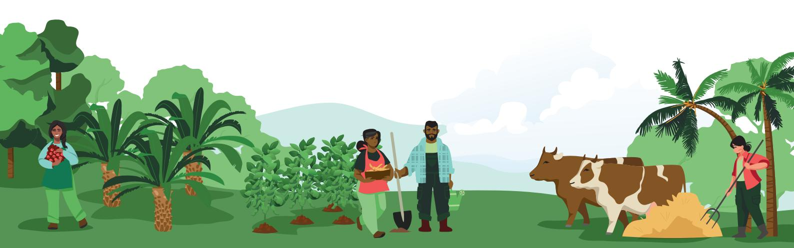

## **Key messages**

### **PROJECT BRIEF**

## **Aligning opportunities toward deforestation-free and socially responsible products**

**GENDER AND INTERSECTIONAL EQUITY**

## **Introduction**

The EUDR marks an inflection point in EU policy to transform global markets by regulating EU consumption and trade of deforestation-risk products while at the same time promoting sustainable agriculture through strategic stakeholder engagement in producer countries. The success of this market transformation for promoting environmental, social, and economic sustainabilities for producer countries, however, requires a nuanced assessment of the risks and opportunities for dierent types of producers to ensure a just transition to deforestation-free agriculture. A just transition is one that aims to reduce forest degradation and emissions without marginalizing the livelihoods, rights, or market access of the most vulnerable actors in the supply chains such as smallholder farmers, women or IPLCs.

Article 30 of the EUDR specifies that the European Commission and member states shall engage with producer countries to address

the root causes of deforestation and forest degradation while at the same time promoting and respecting human rights. In November 2023, the European Commission published a first factsheet on the implications and potential benefits of the EUDR for smallholders, including opportunities for stakeholder engagement, value chain transparency, technical support and capacity building, and fairer markets (EC 2023). However, the regulation is a gender and equityneutral instrument. The EUDR lacks the internal mechanisms to safeguard rights and resources, or the tools to foster social inclusion, equity or benefit sharing for smallholder producers with heterogenous access, skills, and vulnerabilities. The regulation instead defers this authority to relevant national legislation, international laws and binding agreements. While the EUDR may catalyse agricultural transformation, Article 30 recognizes that a just transition will demand a proactive approach in each country that engages stakeholders to contextualize multiple

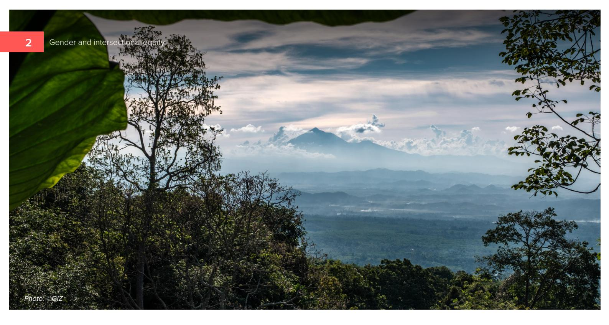

The EUDR came into force in June 2023 and will enter application from December 30, 2026.1 It aims to reduce deforestation, forest degradation, and CO2 emissions from products placed on EU markets through regulation of seven key commodities: cocoa, coee, natural rubber, oil palm, soy, cattle and wood products, including processed and derived products specified under the regulation (EU 2023).

*1. The EUDR has been amended to delay its application and simplify due diligence procedures (Regulation 2025/2650), with new enforcement dates of 30 December 2026 for large and medium operators and 30 June 2027 for micro and small operators. Information current as of March 2026 (time of publication).*

and intersecting identities such as gender, age, citizenship, ethnicity, ability, landlessness, and other social dimensions that might mediate their success or failure to transition to deforestationfree supply chains.

Women, Indigenous Peoples, and diverse smallholder communities are essential, yet often invisibilized, participants in the agriculture and forestry supply chains regulated by the EUDR. This visibility gap creates structural risks that, if unaddressed, translate into direct barriers to technical compliance and market access (Linden et al. 2025).

This brief aims to bridge this visibility gap by drawing on the grounded experiences of three countries implementing multistakeholder approaches that are both gender and equityresponsive, including the outcomes of pilot trainings on Gender Equity, Social Inclusion and Intersectionality (GESI+) in Brazil, Ecuador and Indonesia. We identify the specific risks and intersectional vulnerabilities for diverse smallholders in each context, and proposed approaches to mitigate adverse impacts while also identifying opportunities for social inclusion and transformation.

## **Toward Intersectional Equity in EUDR**

The EUDR poses both risks and opportunities for sustainable development in producer countries. In response, the Deutsche Gesellschaft für Internationale Zusammenarbeit (GIZ) is implementing the Sustainable Agriculture for Forest Ecosystems (SAFE) project, co-funded by the EU, the German Federal Ministry for Economic Cooperation and Development (BMZ), and the Dutch Ministry of Foreign Aairs (BZ), to strengthen the capacity of smallholders and other value chain actors in the transition to deforestation-free agriculture.2

In 2025, the SAFE project collaborated with CIFOR-ICRAF to develop a set of knowledge and training materials on the implications of EUDR for smallholders, and to address visibility gaps in the EUDR framework in practice from a specifically intersectional perspective. CIFOR-ICRAF codesigned and piloted a ToT in selected SAFE countries to train intermediaries working closest with the farmers (local government, agricultural and forestry extension sta, development workers, and farmer representatives) across government, civil society, and private sector to prepare smallholders for the rollout of EUDR. These boundary actors were selected for training as the bridge between the operators and traders subject to EUDR due diligence requirements and the smallholders in their sourcing areas. To complement ongoing EUDR trainings by other partners, this ToT was designed around gender- and equity-responsive approaches to assess the potential risks and opportunities for

women, IPLCs, and other intersectional value chain actors in the agricultural transition to deforestationfree supply chains. The ToT was iteratively piloted in Brazil (Altamira, Pará), Ecuador (Coca, Orellana Province) and Indonesia (Palu, Central Sulawesi Province).

The ToTs support an action learning approach to knowledge co-creation specific to each value chain and landscape as a starting point for discussing GESI+. Learning modules included mini-lessons and interactive activities to socialize basic GESI+ concepts; intersectional value chain mapping and analysis of barriers, constraints and equitable solutions; legal literacy clinics about the EUDR and relevant national legislation to deforestation-free agriculture; participatory risk assessments and mitigation strategies; opportunity mapping; and how to facilitate GESI+ action planning. In the final session of ToTs, the trainers select the most relevant learning modules and activities for their training contexts and build learning plans to action after the workshop.

In this InfoBrief, we share the early outcomes of the ToT co-creation and pilots and identify opportunities for advancing gender equity and intersectional inclusion. Pivoting from vulnerabilities towards opportunities and agency, the ToTs identified actionable steps to safeguard smallholders and to leverage the transition to deforestation-free supply chains for legal empowerment, technical transformation, and market inclusion.

*2. Visit the SAFE project website for a complete list of countries: [https://zerodeforestationhub.eu/projects/safe/](https://zerodeforestationhub.eu/projects/safe/ )* 

## **Background on EUDR**

The EUDR applies to operators and traders who sell, import, or export products on EU markets that contain, have been fed with, or have been made using specific deforestation-risk commodities: cocoa, coee, oil palm, natural rubber, soy, cattle and wood products. Deforestation-free in the context of EUDR is defined as not being produced on land that was subject to deforestation or forest degradation after December 31, 2020. This must be validated by tracking and traceability across operator supply chains, including farm-level geolocation data and producer information.

Smallholders who sell to upstream operators and traders are not directly liable but may be obligated by their business partners to provide information such as geolocation, land use and production practices.

Companies directly placing commodities or derived products on the EU market must prepare due diligence statements, demonstrating negligible deforestation risk and compliance with the relevant national legislation of the producing countries where they operate.

Relevant commodities/products must fulfill three conditions under Article 3 of the EUDR:

they are covered by a due diligence statement

they are deforestation-free

they have been produced in accordance with the relevant legislation of the country of production

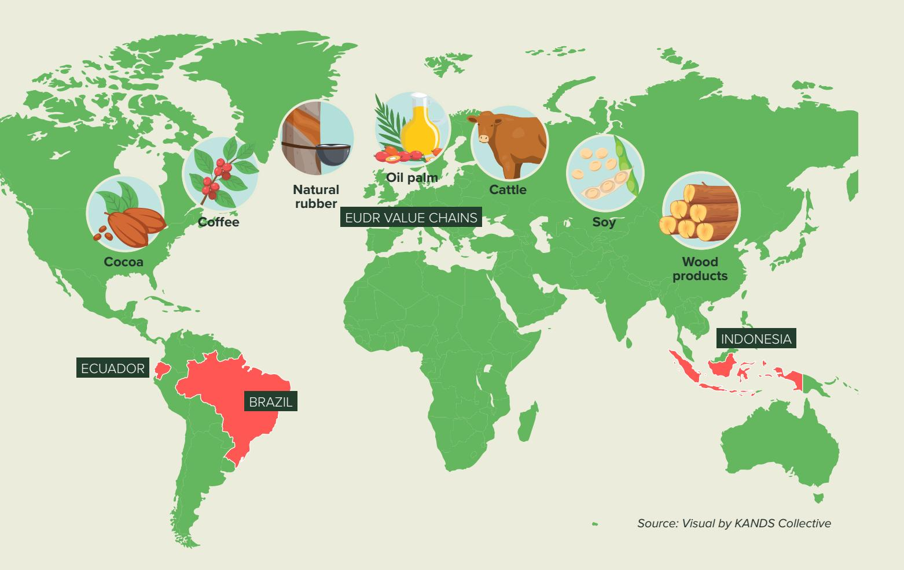

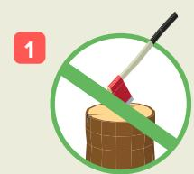

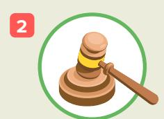

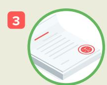

#### **Risk assessment** Article 10

Article 10 requires a risk assessment for products, considering various parameters. These include the country of production's risk level for deforestation and forest degradation, the presence and consultation of Indigenous Peoples, and the reliability of information. The assessment also considers concerns such as corruption, human rights violations, armed conflict, and sanctions in the country of production.

Additionally, it evaluates supply chain transparency, the risk of production in areas with deforestation or unknown origin, and the history of noncompliance by operators or traders. The goal is to determine the overall risk of non-compliance with the rules and to demonstrate how this risk was assessed.

#### **Collection of information** Article 9 **1 2 3**

Article 9 requires the collection of detailed information for exported products. This includes the geolocation of farms, production dates and times, product information (scientific and trade names, and production details), quantity or volume for export, and supplier and buyer information (names, addresses, and email addresses).

Additionally, it requires conclusive and verifiable information that the products are deforestation-free and comply with the producer country's relevant legislation, including proof of legal rights to use the land for production.

#### **Risk mitigation** Article 11

Involves a concerted eort to address the risk (except for issues that present zero or negligible risk). Risk mitigation procedures may include collecting additional information, data or documents, conducting an internal audit, or conducting capacity building and investments with smallholders. Operators must demonstrate policies, controls, and procedures to mitigate and manage eectively the risks of non-compliance. Risk mitigation procedures must be documented and reviewed annually and must be made available by the relevant authorities upon request.

Under Article 3c of the EUDR, products must be covered by a **due diligence statement (DDS)** prepared by the operator or trader placing the product in the EU market.

The DDS describes three main exercises:

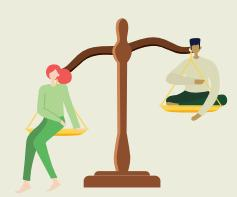

#### **DUE DILIGENCE**

#### **Example risks to women producers**

Excluding women who manage family plots under informal arrangements or whose names

### are omitted from formal titles. **Example risks to IPLCs**

Transactional or rushed FPIC consultations which overlook intersectional vulnerabilities, leaving the specific threats to women and youth unaddressed in risk management and reinforcing their marginalization.

#### **Example risks to youth**

Reinforcing generational exclusion in risk management deliberations, resulting in mitigation strategies that favour established elites while overlooking youth-specific needs.

Under Article 2, the EUDR specifically requires compliance with legislation relevant to land use rights, environmental protections, forest and biodiversity rules, third-party rights, labour rights, human rights protected under international laws including rights of IPLCs and the principle of free, prior and informed consent (FPIC), and tax and trade laws.

Many countries have strong gender policies and laws in alignment with international human rights commitments, but implementation gaps persist due to a range of cultural and structural barriers. There is a legitimate risk that the application of EUDR could reinforce existing inequalities or entrench barriers to market entry for smallholders and informal workers at the intersection of gender, indigeneity, and other identity-based systems of marginalization. However, by locating the responsibility for social safeguarding within producer countries, the regulation places the locus for action closer to producers, workers, and their local institutions.

## **Review of national laws**

The legal scope of the EUDR is focused on due diligence around deforestation-free supply chains and EU markets, deferring authority to the national policies, legislative and regulatory frameworks, and institutions of each producer country to govern their own enabling environments for sustainable and inclusive deforestation-free transitions.

#### **Registry of due diligence statements**

[Online](https://eudr.webcloud.ec.europa.eu/tracesnt/login) information system to collect and store due diligence statements, including all data collected.

### **Geolocation data required**

Geolocation data is required for every plot of land, including:

⊲ Latitude and longitude points (at least 6 decimal digits) for plots under 4 hectares ⊲ Polygon data for plots over 4 hectares (except cattle) ⊲ Cattle geolocation refers to where they are kept ⊲ Supplier/buyer information and crop type ⊲ Data must be stored for at least 5 years

#### **TRACKING AND TRACEABILITY**

#### **Example risks to women producers**

⊲ Women disproportionally work in informal sectors (FAO 2023), making traceability a challenge as informal markets do not follow national regulations around business, taxation, or other frameworks, in part from tenure insecurity. To minimize traceability risks, operators may favour large enterprises over informal or customary tenure systems perceived as high-risk and too costly to map (Bager et al. 2021). ⊲ Smallholder producers, especially women who experience additional barriers to accessing technology, should be equipped with knowledge of their rights and capacity to collect and exercise ownership over their production data.

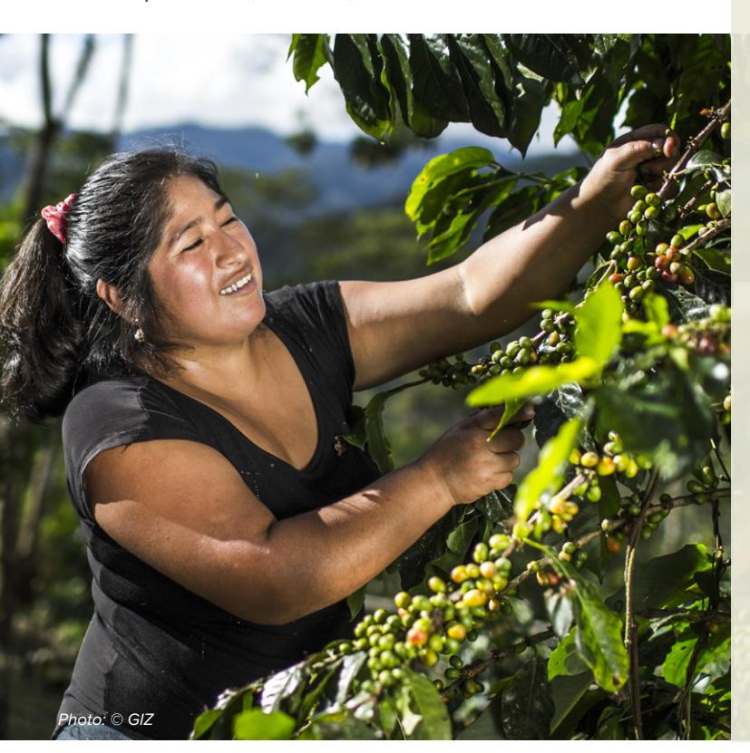

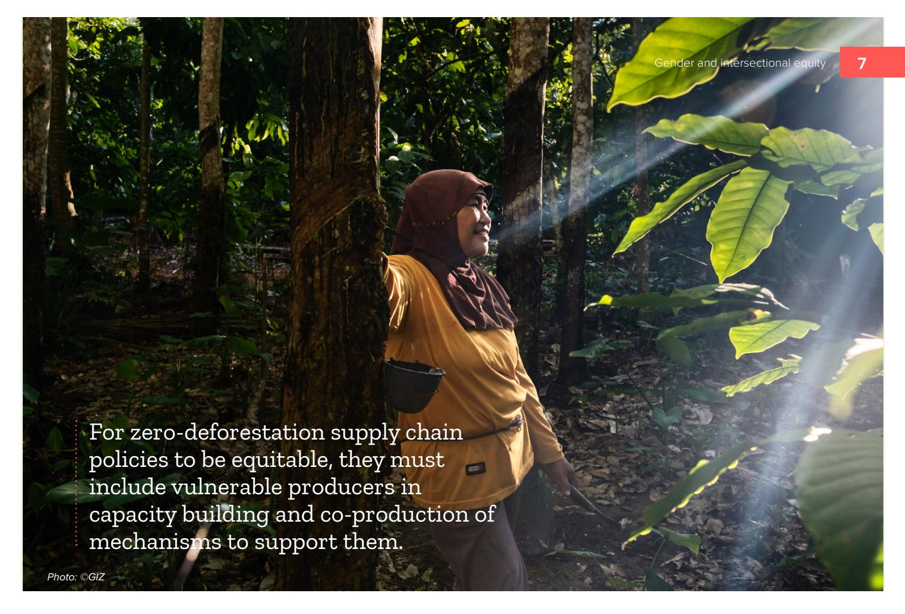

Global commitments like the Sustainable Development Goals (SDGs) and gender clauses to the Rio Conventions establish a clear mandate for gender and social equity in forest and climate policy (Linden et al. 2025). Voluntary frameworks have further reinforced and extended these goals by setting specific equity and inclusion standards which of course are only as eective as the national laws or markets that support them.

National policies and globally agreed principles are critical for safeguarding the rights and resources of women, IPLCs, persons with disabilities (PWDs) youth, migrants, landless and informal labourers, and other intersectional groups who are actively engaged in global supply chains. Elias et al. (2024) have noted that stubborn knowledge gaps about which policies truly work to enhance gender equality in forestry and agrifood sectors persist precisely because they ignore gender. What is clear is that agency and resource control are fundamental.

Policies can also incentivize or disincentivize adoption of new practices. Eective policies which promote widespread adoption of sustainable agriculture and agroforestry are those which enhance secure access to land and create direct economic incentives and market opportunities,

although the intersectional dimensions of these land use transitions are not well understood beyond resource and tenure security (Ajayi and Place 2012).

For deforestation-free transitions to be just and equitable, therefore, they must include an intersection of smallholder producers, workers, and other value chain actors in co-creating a supportive enabling environment. Article 30 of the EUDR provides the framework for inclusive stakeholder engagement, capacity strengthening, and cooperation mechanisms necessary to create the enabling conditions for inclusive forest governance which responds to the domestic factors contributing to deforestation.

The ToTs piloted in Brazil, Ecuador and Indonesia validated rapid desk reviews of relevant national policies. The ToTs emphasized not just legal literacy but also legal empowerment to identify those laws which provide social protections and safeguarding to women, IPLCs and other value chain actors at risk of marginalization as well as those which open opportunities for access, inclusion, and equitable benefit sharing in agriculture and forestry value chains.

The following table exemplifies this in the context of land rights.

| POLICY ENVIRONMENT CHALLENGES     | OPPORTUNITIES                   |
|-----------------------------------|---------------------------------|
| ⊲ Widespread informal land        |                                 |
| ⊲ Less than 15% of land is        |                                 |
| ⊲ The combined eects of          |                                 |
|                                   | ⊲ Strengthening                 |
|                                   | frameworks to reinforce         |
|                                   | ⊲ Promoting gender-responsive   |
|                                   | approaches in traceability      |
|                                   | ⊲ Clear land rights definition: |
| ⊲ Women in Indonesia often lack   |                                 |
| ⊲ Indonesia has multiple laws and |                                 |
|                                   | ⊲ Strengthening land            |
|                                   | ⊲ Social forestry and community |
|                                   | engagement: Support the         |

# **EUDR value chain dynamics**

Men dominate high-value, high-volume export chains, while women may have relative control and decision-making power over small local and retail markets, subsistence agriculture, or low value, low yield products (FAO 2023). These dynamics separate formalized commodity chains from decentralized and informal nodes of production where much of the agricultural labour and post-harvest processing are concentrated.

Some of the reasons for women's exclusion from high-value, export-oriented value chains include social discrimination and disparities in resources, knowledge and networks. Beyond gender, there are deep structural constraints for other intersectional groups. IPLCs, for example, steward forest-positive landscapes through customary systems that are not universally

recognized; landless youth and migrant workers provide essential yet insecure labour; PWDs and other historically marginalized groups face discrimination and economic exclusion; and countless intermediaries form invisible links in supply chains uncoupled from systems that track commodities' movements towards global markets.

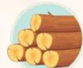

### **Global trends in wood value chains**

Timber and wood product value chains are highly gendered globally (FAO 2023), as men conventionally dominate timber harvesting and processing at higher-income nodes and markets through their access to land, resources, and technologies (de Groot 2021; Purnomo et al. 2011). However, women do exercise significant economic agency through the informal economy, non-timber forest products (NTFPs) and bioenergy (Nyangassa 2021). While ocial figures are incomplete, women are strongly represented in the informal timber workforce in places like Côte d'Ivoire where they drive local markets and energy security (Bottaro 2021). Intersectional groups, including Indigenous women and landless laborers, also serve as primary stewards of communal resources. A successful transition must recognize these informal actors as vital stakeholders by recognizing communal rights and prioritizing social safeguarding to build equitable, resilient wood value chains.

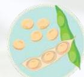

## **Global trends in soy value chains**

Women play a significant role in the soybean value chain globally, but they are less likely to own the producing farms (Bernal et al. 2022) and often earn lower incomes than men. Soy is also an important crop for cattle feed. In Brazil, women make up a small portion of the labour force, earn less than men, and own less land (Dreoni et al. 2021), reinforcing the gendered value chain and market dynamics in the cattle sector.

*Photo: ©GIZ*

## **Coffee in Ecuador3**

Ecuador's coee sector is primarily driven by smallholders and informal intermediaries, with less a quarter of producers belonging to agricultural associations. This high dependence on intermediaries and free fairs limits value capture for an indigenous majority who rely on coee to complement other livelihood activities. Men typically manage purchasing, pruning, harvesting, and transport. Women participate in nurseries, sowing, drying, and selection, yet lack access to land and credit while their labour remains largely invisible in decisionmaking and high-value stages (Bernal et al. 2022). The coastal Montubio people and Afro-Ecuadorians face similar land access constraints as well as language barriers and poor training access. Youth frequently provide temporary, unpaid family labour yet exercise limited influence. To safeguard informal actors in the coee supply chain, ToT participants recommended 'social and cultural traceability' while also providing tailored technical assistance and bridging structural gaps in land tenure and credit.

## **Cocoa in Ecuador4**

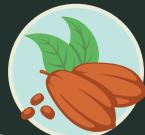

Cocoa is a labour-intensive crop with gender-specific roles and responsibilities. Women in Ecuador contribute significantly to post-harvest processing and value addition but face systemic barriers to access land, credit, technical assistance, and training (Gumucio et al. 2016; Pontón Cevallos 2005). Men typically prepare the land, manage cultivation, and control marketing, income, and the organizational spheres where women are poorly represented in person and documentation. Beyond gender, there is high participation of youth and IPLCs at the production nodes. Afro-Ecuadorian and Montubio communities struggle with similar barriers as in coee, while marginalized groups such as children and landless laborers remain persistently hidden and at risk of exploitation. These visibility gaps limit access to land and labour regularization as well as bargaining power to advocate for intersectional market inclusion, diminishing the voices of women and IPLCs who place strong value on cocoa agroforestry systems and their co-benefits (Ramos et al. 2019).

ECUADOR

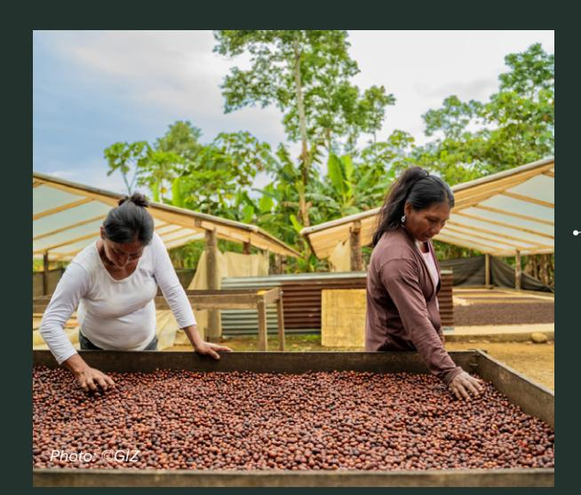

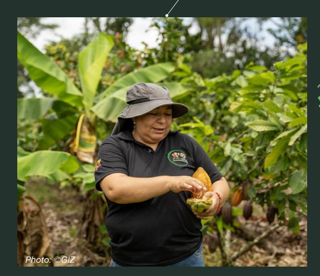

*3. Chapalbay R, Vallejo E, Gallagher E. 2026. 4. Ibid.*

INDONESIA

BRAZIL

## **Cattle in Brazil5**

The cattle value chain in Transamazon region of Brazil is characterized by the 'ranching' of family farming, where beef production has evolved from a complementary activity into a primary income source. The sector is highly dependent on intermediaries, with multiple and invisible links that introduce challenges for traceability. It is also highly masculinized with women comprising only 1.5% of participants in less visible roles (Hodel 2023). Men dominate cattle management, negotiations, and investment decisions, and women typically manage milking and calf care. Participants in the ToT workshops identified additional barriers for IPLCs and Quilombola communities in exercising their land rights, as well as discrimination against queer ranchers or other groups with whom traders refused to work. These common structural barriers risk excluding smallholders, intermediaries, and marginalized groups from international markets without further innovation to develop inclusive governance and traceability systems.

## **Cocoa in Brazil6**

In Altamira, Brazil, the cocoa value chain reveals complex intersectional dynamics. While men dominate 'outside' tasks like heavy labour and marketing, women are the backbone of 'inside' production, managing nurseries, fermentation, and drying. Women and youth however remain structurally invisible, often lacking land titles and financial autonomy. IPLCs contribute significantly through agroforestry but face exclusion risks due to land tenure irregularities that present a legality risk for buyers. Compared to the cattle sector, cocoa oers greater opportunities for women, yet they remain marginalized from high-level decision-making. ToT participants in Brazil also recommended a form of 'social and cultural traceability' to recognize informal value chain actors. Strengthening local organizations and providing gendersensitive technical assistance can bridge formality gaps in land rights and ensure that sustainable Amazonian cocoa livelihoods are preserved for all intersectional groups.

*5. Mello D. Unpublished.* 

*6. Ibid.*

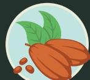

*Photo: ©CIFOR-ICRAF*

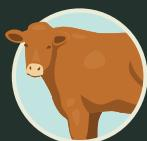

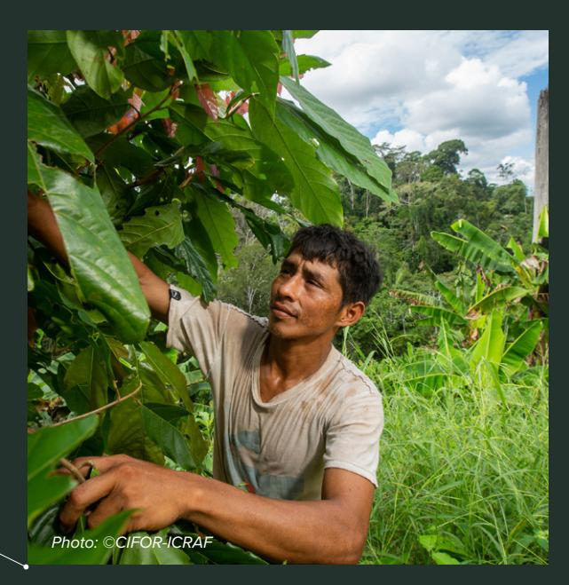

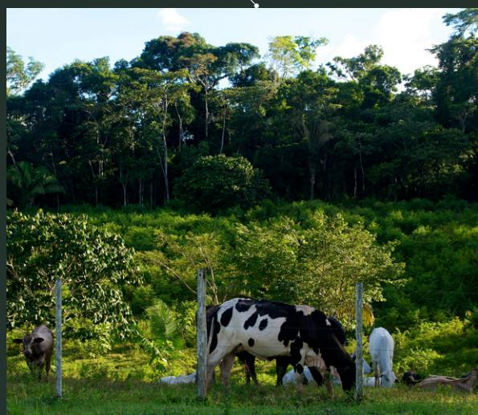

*Photo: ©GIZ* Indonesia's cocoa sector is primarily driven by smallholders on family farms of less than two hectares (>95%). Labour is traditionally gendered with men leading the land clearing, pruning, and transport, while women manage nurseries and post-harvest fermentation, drying, and farm finances. However, intersectional analysis shows these roles are more fluid, especially for women heads of household (e.g., widows and single mothers) who perform conventionally male activities or hire labour as needed. Systemic barriers persist as certain ethnic groups dominate land and finance sectors. Intermediaries and aggregators also hold significant bargaining power within the value chain, consolidating supply but often mixing beans upstream and presenting one of the biggest challenges for farm-level traceability. Preparing for the EUDR will also require scaling the Surat Tanda Daftar Budidaya (STDB) registration more widely to facilitate tracing, as well as strengthening cooperatives to improve value capture and ensure that a diversity of smallholders are not alienated from global markets.

## **Cocoa in Indonesia7**

## **Global trends in oil palm value chains**

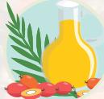

Global oil palm value chains reflect a tension between industrial expansion and an informal, intersectional workforce. While women comprise a majority of the production workforce in some regions, they are often relegated to precarious and casual labour roles with lower economic returns (Li 2015; Proforest 2022). Intersectional groups face distinct structural exclusions: in Ecuador, Afro-Descendant and Indigenous communities endure land grabbing and hiring discrimination (Verite 2016; GRAIN 2024), while in Indonesia, Dayak women's customary tenure is eroded by land titling which favours male household heads (Elmhirst 2017). Vulnerability is further compounded for migrants and refugees who lack legal protections (Boudewijn et al. 2024). Conversely, in West Africa, women exercise significant economic agency through a competitive artisanal sector serving largely domestic and regional markets (Silva 2022). Oil palm is a crop that will require a much more variegated approach across contexts to capture the diversity of production systems, tenure regimes and labour arrangements in a deforestation-free transition.

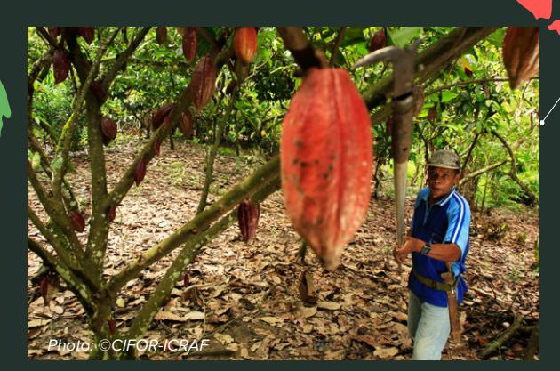

### **Natural rubber in Indonesia**

Indonesia is the World's second largest rubber producer, and gender roles in rubber value chains vary by community and geography. In Sumatra's Jambi community, women in the lowland areas are more involved in rubber tapping than those in uplands (Villamor et al. 2015). Women contribute to tasks like tapping, weeding, fertilizer application, planting, and harvesting (Heriberta et al. 2021), while men often handle physically demanding activities and marketing (White and White 2012). Children also participate in rubber cultivation, often at the expense of further education (Heriberta et al. 2021), reflecting the economic pressures on family-based production.

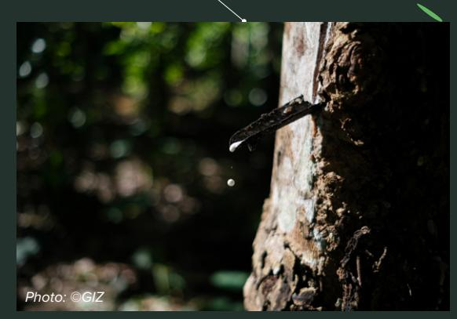

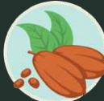

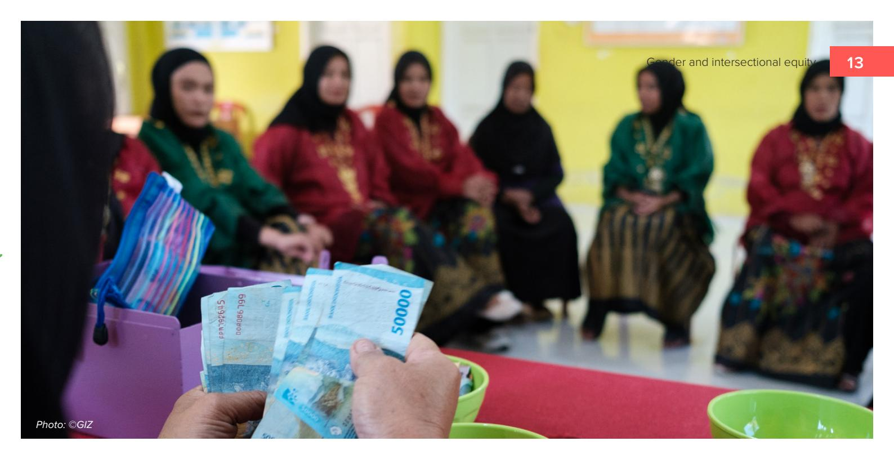

**Tenure insecurity:** Legality gaps in enabling environments for customary and informal rights create mutual risks. Where joint titling is absent or IPLC land rights are contested, digitizing land data risks a consolidation of rights that disenfranchises untitled rights holders. Operators may exclude these 'high-risk' producers from their verifiable sourcing pools to avoid liability. Locally there is a secondary risk that commodity expansion will grab or displace women's household gardens and farms, or untitled customary and collective lands where non-forested land is scarce.

**Invisible erasure in formal registries:** Women, youth, migrants or other marginalized groups are often omitted from producer registries or underrepresented in farmer and labour associations, rendering their contributions to the value chain invisible for due diligence. Traceability frameworks risk institutionalizing this visibility gap, reinforcing the unpaid 'helper' trope without legal claims to income. The gap is especially profound at post-harvest processing and aggregation nodes where risk-averse operators may avoid undocumented suppliers due to diculties verifying labour rights or land use, turning established informal links into hard barriers for continued market participation.

## **Risks and opportunities for social inclusion in EUDR**

Findings from desk reviews and participatory ToT workshops point to some common risks for an intersection of smallholders and other value chain actors in the EUDR-mediated transition to deforestation-free agriculture. While the legal burden for due diligence rests with operators and traders, the primary threat to a just transition may be business derisking strategies that could transform technical rules into hard barriers. This shift would most impact women, landless youth and other resource-poor farmers, and customary rights holders like IPLCs, or other marginalized groups whose contributions are often invisibilized within formal supply chains.

**Technological marginalization** stems from the requirement for farm-level geolocation in landscapes where the digital divide means poor access to smartphones and internet. While operators carry the legal burden, two competing risks emerge. For producers with limited digital literacy, including many women and traditional farmers, information asymmetries arise when operators own the geodata required for market participation. These producers risk economic autonomy by becoming dependent on buyers to manage their digital footprints. Alternatively, if companies shift the technical burden to producers to pre-verify plots, technical consolidation risks favouring digitally literate farmers and intermediaries. Both scenarios transform capacity gaps into dependency traps.

**Displacing intermediaries.** The dominance of intermediaries in many value chains complicates direct farm-level traceability due to mixing products from dierent sources.

Local collectors, including 'market mamas' in some countries, hold significant social capital and economic power as o-takers and informal lenders. For smallholders with weak bargaining power, especially women, migrants, and resourcepoor farmers, intermediaries provide a vital, if often exploitative safety net. Removing these intermediaries risks destabilizing supply chains unless they are integrated into formal traceability frameworks and producers are provided with alternative credit mechanisms.

**Shifting compliance costs:** There is a risk that the financial burdens for verification and administrative management will be passed down the value chain, as service fees or lower farmgate prices. For resource-poor producers, these costs reduce already limited income and the capacity to reinvest in sustainable practices. Women, who often have weaker negotiating power and less direct control over commercialization, face a specific risk of reduced income autonomy. Market formalization risks favouring groups with existing capital to meet the financial requirements of traceable trade.

The ToT workshops surfaced these systemic risks through participatory mapping, identifying them as concrete leverage points for change. This process allowed participants to pivot from assessing structural barriers toward co-creating actionable strategies for stakeholder engagement, legal empowerment, technical agency, and inclusive market participation.

**Crowding out:** Operators and traders may choose to rationalize their supply chains and simplify due diligence obligations by favoring 'safe suppliers' who can provide basic verification of zero deforestation and compliance with national legislation.

Organized cooperatives and larger plantations may crowd out unorganized smallholder producers or, alternatively, absorb them into contract models with visibility gaps in registration that overwrite customary rights. Alternatively, market bifurcation could present new risks or opportunities for women, IPLCs and other social identity groups, diverting to domestic or non-European markets.

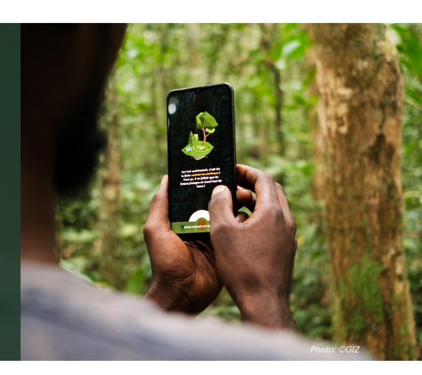

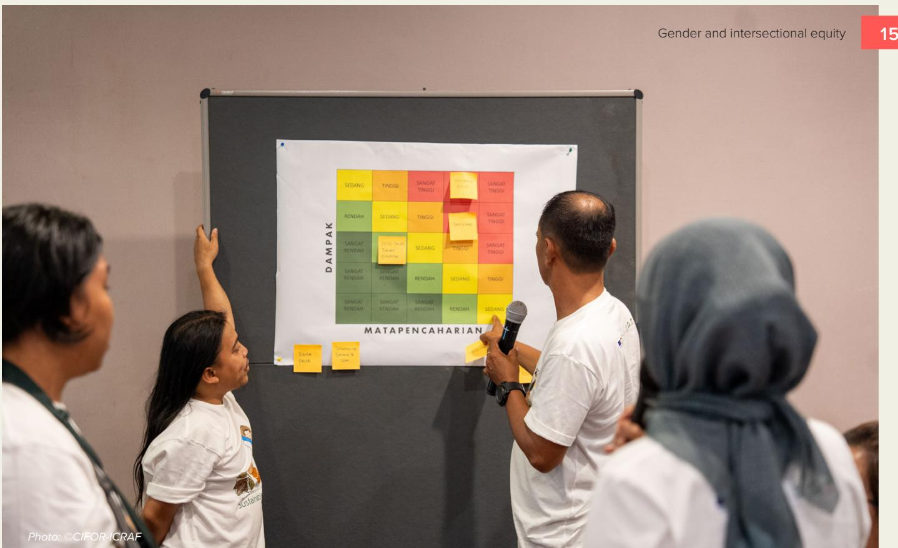

**1 Risk assessment Collection of information**  Article 9

Article 10 **2 3**

Article 10 requires a risk assessment for products, considering various parameters. These include the country of production's risk level for deforestation and forest degradation, the presence and consultation of indigenous peoples, and the reliability of information. The assessment also considers concerns such as corruption, human rights violations, armed conflict, and sanctions in the country of production.

Additionally, it evaluates the supply chain's transparency, the risk of products being produced in areas with deforestation or unknown origin, and the history of non-compliance by operators or traders. The goal is to determine the risk of non-compliance with the rules and demonstrate how the risk was assessed.

#### **Risk mitigation** Article 11

Involves a concerted eort to address the risk (except for issues that are no or negligible risk). Risk mitigation procedures may include collecting additional information, data or documents, conducting an internal audit, or conducting capacity building and investments with smallholders.

Operators must demonstrate policies, controls and procedures to mitigate and manage eectively the risks of non-compliance. Risk mitigation procedures must be documented and reviewed annually and must be made available by the relevant authorities upon request.

Under Article 3c of the EUDR, products must be covered by a **due diligence statement** which is prepared by the operator placing the product in the European Market. This statement must describe three main exercises:

### **DUE DILIGENCE**

Article 9 requires the collection of detailed information for exported products. This includes the geolocation of farms, production dates and times, product information (scientific and trade names, and production details), quantity or volume for export, and supplier and buyer information (names, addresses, and email addresses).

Additionally, it requires conclusive and verifiable information that the products are deforestation-free and comply with the country's production laws, including proof of legal rights to use the land for production.

## **Brazil**

Leveraging existing initiatives such as the Soy Moratorium and the Roundtable on Responsible Soy can support the operationalisation of the EUDR in Brazil. ToT participants emphasized that a just transition depends on addressing deeply masculinized leadership within cooperatives in the Amazon. Opportunities identified during the workshop focused bridging the gender gap by recognizing women's informal labour as a primary basis for joint land and resource rights. By decentralizing technical assistance to reach women producers and womenled households, the transition can move beyond technical compliance to actively transform governance, ensuring that those providing the primary labour are recognized as legitimate stakeholders and rightsholders in sustainable supply chains.

## **Opportunities for social inclusion in EUDR**

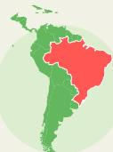

## **Indonesia**

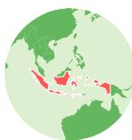

Workshop participants emphasized the importance of capacity building for farmers, infrastructure development, support for certification and compliance with regulations, and support for climate-smart farming practices and agroforestry. Participants identified the STDB (cultivation registration) process as a strategic leverage point for a just transition, allowing smallholders to secure management rights and formalize their role in the value chain. By aligning EUDR implementation with national gender-mainstreaming mandates, opportunities emerge for market empowerment through collective bargaining. By reducing dependence on intermediaries and leveraging verified traceability, fragmented producers can transition from informal laborers into organized actors who capture more value and secure fair market access. Moreover, empowering women and vulnerable groups is crucial to ensure that their rights and interests are recognized and respected.

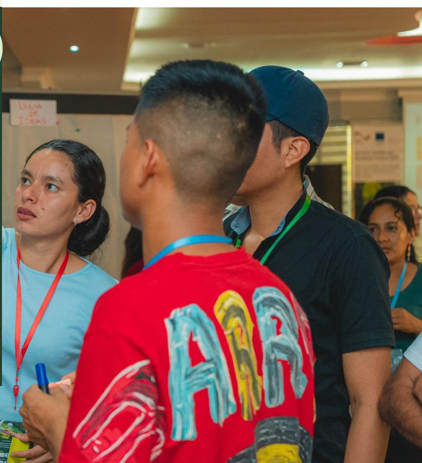

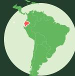

## **Ecuador**

Workshop participants underscored the need to meet the diverse needs of women and Indigenous producers, especially through recognition of gender, racial and intercultural dierences in land tenure, compliance with environmental standards, labour rights, human rights, and local regulations. By expanding the traceability system to include 'social and cultural traceability', incorporating intersectional data about producers such as gender, IPs, Afro-Ecuadorians and Montubios, the system can become an instrument that recognizes their contributions, strengthens their position within value chains, and supports their access to benefits and incentives.

The table below maps four key pathways for cantering intersectional equity within the EUDR framework, highlighting the opportunities to translate international cooperation and national legislation into tangible empowerment for all value chain actors.

| PATHWAY                              | OPPORTUNITIES                                                                                                                                                                                                                                                                                                                                                                                                                                                                                                                                                                                                                                                                                              |
|--------------------------------------|------------------------------------------------------------------------------------------------------------------------------------------------------------------------------------------------------------------------------------------------------------------------------------------------------------------------------------------------------------------------------------------------------------------------------------------------------------------------------------------------------------------------------------------------------------------------------------------------------------------------------------------------------------------------------------------------------------|
| 
<b>Stakeholder Engagement</b>
 | 
Article 30 provides a legal framework for international cooperation, enabling countries to leverage EU commitments for regional and national dialogues on supply chain governance and capacity strengthening. This framework can facilitate targeted technical training and GESI sensitisation to support sustainable agriculture transitions. The ToT model builds on these platforms to train boundary actors, bridging the gap between operators and smallholders to ensure a just transition through localized, intersectional support.
                                                                                                                                                         |
| 
<b>Legal Empowerment</b>
      | 
EUDR recognition of human rights frameworks like CEDAW and UNDRIP strengthens protections for women and indigenous communities. Prioritising national legislation shifts the locus of change to producing countries, enabling stakeholders to influence context-appropriate interpretations of legality (for example, shaping registration systems that might recognise legitimate joint and customary land rights claims or traceability systems that capture informal actors). By bridging legality and visibility gaps, due diligence can be leveraged as a tool for enhancing resource rights and inclusive value chain governance.
                                                             |
| 
<b>Data Empowerment</b>
       | 
Integrating fragmented databases into unified national platforms creates opportunities for transparent and inclusive monitoring. Geolocation requirements offer a way to engage youth as digital managers for family enterprises and producer organizations or lead the transition to digital trade platforms. By providing targeted training in digital literacy and affordable traceability tools, the digital divide can be bridged, transforming technical compliance into a pathway for data empowerment. Digitally verifiable production data under EUDR requirements can further promote economic inclusion by establishing documentation needed to access to credit and financial services.
 |
| 
<b>Market Empowerment</b>
     | 
Verified traceability can enable stable
                                                                                                                                                                                                                                                                                                                                                                                                                                                                                                                                                                                                                                                             |

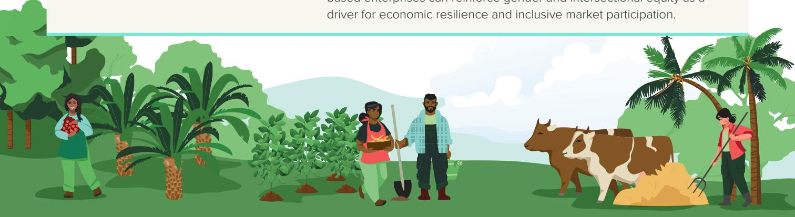

- Ajayi OC, Place F. 2012. Policy support for large-scale adoption of agroforestry practices: experience from Africa and Asia. In Agroforestry-The future of global land use. Dordrecht: Springer Netherlands. 175-201. [https://doi.org/10.1007/978-94-007-4676-3\\_12](https://doi.org/10.1007/978-94-007-4676-3_12) Bager SL, Persson UM, dos Reis TNP. 2021. Eighty-six EU policy options for reducing imported deforestation. One Earth. 4(2): 289–306. <https://doi.org/10.1016/j.oneear.2021.01.011> Bernal M, Vijayakumar C, Lovera S, Wol I. 2022. A Gendered Perspective of the Proposed EU Regulation on Deforestation-Free Products. Global Forest Coalition. [https://www.fern.org/fileadmin/](https://www.fern.org/fileadmin/uploads/fern/Documents/2022/EN_A_Gendered_Perspective_on_Deforestation_Regulation.pdf) [uploads/fern/Documents/2022/EN\\_A\\_Gendered\\_Perspective\\_on\\_](https://www.fern.org/fileadmin/uploads/fern/Documents/2022/EN_A_Gendered_Perspective_on_Deforestation_Regulation.pdf) [Deforestation\\_Regulation.pdf](https://www.fern.org/fileadmin/uploads/fern/Documents/2022/EN_A_Gendered_Perspective_on_Deforestation_Regulation.pdf) Bottaro M. 2021. Women's participation in wood-based value chains in voluntary partnership agreement countries – MALEBI: Women at the forefront of sustainable charcoal production in Côte d'Ivoire
- The experience of the FAO-EU FLEGT Programme. Rome: FAO. <https://doi.org/10.4060/cb7203en> Boudewijn IA, Bone JC, Jenkins K, Zaragocin S. 2024. Afro-Ecuadorian Women, Territory and Natural Resource Extraction in Esmeraldas, Ecuador. Progress in Development Studies. 24(4) <https://doi.org/10.1177/14649934241242863> Chapalbay R, Vallejo E, Gallagher E. 2026. Gender Equity, Social Inclusion and Intersectionality (GESI+) in Sustainable and Deforestation-free Agriculture: Lessons from Coca, Orellana, Ecuador. Edited by KANDS Collective. Nairobi: CIFOR-ICRAF. Dreoni I., Schaafsma M. Matthews Z. 2021. The Social Impacts of Soy Production: A Systematic Review. UKRI GCRF TRADE Hub. [https://](https://static1.squarespace.com/static/5b48c2572487fdd7f1f29d1c/t/5cb0af939b747a28939007f2/155508315) [static1.squarespace.com/static/5b48c2572487fdd7f1f29d1c/t/5cb0a](https://static1.squarespace.com/static/5b48c2572487fdd7f1f29d1c/t/5cb0af939b747a28939007f2/155508315) [f939b747a28939007f2/155508315](https://static1.squarespace.com/static/5b48c2572487fdd7f1f29d1c/t/5cb0af939b747a28939007f2/155508315) Elias M, Zaremba H, Tavenner K, Ragasa C, Paez-Valencia AM, Choudhury A, de Haan N. 2024. Towards gender equality in forestry, livestock, fisheries and aquaculture. Global Food Security. 41(June 2024, 100761).<https://doi.org/10.1016/j.gfs.2024.100761> Elmhirst R, Siscawati M, Basnett BS, Ekowati D. 2017. Gender and generation in engagements with oil palm in East Kalimantan, Indonesia: insights from feminist political ecology. The Journal of Peasant Studies. 44(6): 1135-1157 [https://doi.org/10.1080/03066150.](https://doi.org/10.1080/03066150.2017.1337002) [2017.1337002](https://doi.org/10.1080/03066150.2017.1337002) European Commission, Directorate-General for Environment. 2023. EU Deforestation Regulation: an opportunity for smallholders. Publications Oce of the European Union. [https://data.europa.eu/](https://data.europa.eu/doi/10.2779/9252) [doi/10.2779/9252](https://data.europa.eu/doi/10.2779/9252) EU. 2023. REGULATION (EU) 2023/1115 OF THE EUROPEAN PARLIAMENT AND OF THE COUNCIL of 31 May 2023 on the making available on the Union market and the export from the Union of certain commodities and products associated with deforestation and forest degradation and repealing Regulation (EU) No 995/2010. Ocial Journal of the European Union. L 150/206. [https://eur-lex.europa.eu/legal-content/EN/](https://eur-lex.europa.eu/legal-content/EN/TXT/?uri=CELEX%3A32023R1115&qid=1687867231461#d1e32-247-1) [TXT/?uri=CELEX%3A32023R1115&qid=1687867231461#d1e32-247-1](https://eur-lex.europa.eu/legal-content/EN/TXT/?uri=CELEX%3A32023R1115&qid=1687867231461#d1e32-247-1). FAO. 2023. The status of women in agrifood systems. Rome: FAO. <https://doi.org/10.4060/cc5343en> GRAIN. 2024. Oil palm in Latin America: monoculture and violence. [Blog]. Accessed 26 November 2024. [https://grain.org/en/](https://grain.org/en/article/7123-oil-palm-in-latin-america-monoculture-and-violence) [article/7123-oil-palm-in-latin-america-monoculture-and-violence](https://grain.org/en/article/7123-oil-palm-in-latin-america-monoculture-and-violence). de Groot J. 2021. FSC Green Paper for Gender Equality: Benchmarking the Global State of Gender and Forests. Forest Stewardship Council. [https://fsc.org/sites/default/files/2022-03/Final%20Green%20](https://fsc.org/sites/default/files/2022-03/Final%20Green%20paper%20on%20gender%20issues%20in%20forests%20PDF.pdf) [paper%20on%20gender%20issues%20in%20forests%20PDF.pdf](https://fsc.org/sites/default/files/2022-03/Final%20Green%20paper%20on%20gender%20issues%20in%20forests%20PDF.pdf) Gumucio T, Yore H, Mello D, Loucel C. 2016. Coee and cocoa value chains: Gender dynamics in Peru and Nicaragua. Working Paper. Cali, Colombia: CIAT.<https://hdl.handle.net/10568/78760> Heriberta H, Wahyunni S, Guspianto G. 2021. Women and Children Workers Involved in Rubber and Palm Oil Plantations: Motivations and Impact on Family Income in Jambi Province. Proceedings of

## **References**

## **Conclusion**

Through desk study and workshops with boundary actors in Brazil, Ecuador, and Indonesia, this brief analysed intersectional risks and opportunities within the EUDR. While the regulation is gender- and equity-neutral, its implementation can strengthen the structural agency of an intersection of smallholders and value chain actors.

Workshop participants identified four strategic opportunity pathways to shift legal and technical requirements into instruments for equity and inclusion. This approach, grounded in policy analysis and action learning, provides a strong foundation for local actors to navigate the market transition toward deforestation-free and socially responsible products.

ICGCS 2021, 30-31 Padang, Indonesia, August 2021. [https://](https://repository.unja.ac.id/id/eprint/46479) [repository.unja.ac.id/id/eprint/46479](https://repository.unja.ac.id/id/eprint/46479)

Hodel L. 2023. Cattle, Culture, and Feminist Ecologies in the Brazilian Amazon Advances in Theoretical and AI-Driven Land System Science. [PhD Thesis]. Zurich: ETH Zurich. [https://www.research-collection.ethz.ch/bitstreams/5def8ad1-](https://www.research-collection.ethz.ch/bitstreams/5def8ad1-3066-4af8-9933-85e733b4e3a1/download) [3066-4af8-9933-85e733b4e3a1/download](https://www.research-collection.ethz.ch/bitstreams/5def8ad1-3066-4af8-9933-85e733b4e3a1/download) Li TM. 2015. Social impacts of oil palm in Indonesia: A gendered perspective from West Kalimantan. Occasional Paper 124. Bogor, Indonesia: CIFOR. <https://doi.org/10.17528/cifor/005579> Linden H, Gallagher E, Lasheras de la Riva T, Liswanti N. and Mello D. 2025. Women and equity in the EUDR: Beyond due diligence and risk mitigation. In Rogelja T, Kroese L. eds. Women as stewards of forests. Tropical Forest Issues 63. Ede, the Netherlands: Tropenbos International. 184–190. [https://](https://www.cifor-icraf.org/knowledge/publication/44580/) [www.cifor-icraf.org/knowledge/publication/44580/](https://www.cifor-icraf.org/knowledge/publication/44580/) Liswanti N, Gallagher EJ, Ramadhan H. 2026. Gender Equity, Social Inclusion and Intersectionality (GESI+) in Sustainable and Deforestation-free Agriculture: Lessons from Palu, Central Sulawesi, Indonesia. Edited by KANDS Collective. Bogor, Indonesia: CIFOR-ICRAF. Mello D. Unpublished. Gender Equity, Social Inclusion and Intersectionality (GESI+) in Sustainable and Deforestation-free Agriculture: Lessons from Altamira, Para, Brazil. Edited by KANDS Collective. Nairobi: CIFOR-ICRAF. Nyangassa HA. 2021. Gender and Forest Products Value Chain Development from Village Land Forest Reserves of Songea and Namtumbo Districts, Tanzania. [MSc Thesis]. Tanzania: Sokoine University of Agriculture. [https://www.suaire.sua.](https://www.suaire.sua.ac.tz/server/api/core/bitstreams/67a63e0c-0202-46da-af5a-ff3cd32b7389/content) [ac.tz/server/api/core/bitstreams/67a63e0c-0202-46da-af5a-](https://www.suaire.sua.ac.tz/server/api/core/bitstreams/67a63e0c-0202-46da-af5a-ff3cd32b7389/content) [3cd32b7389/content](https://www.suaire.sua.ac.tz/server/api/core/bitstreams/67a63e0c-0202-46da-af5a-ff3cd32b7389/content) Proforest. 2022. Gender Equality in Palm Oil Production and Sourcing. Palm Oil Toolkit Discussion Paper 01. [https://](https://palmoiltoolkit.net/gender) [palmoiltoolkit.net/gender](https://palmoiltoolkit.net/gender). Ciencias Sociales (FLASCO).<http://hdl.handle.net/10469/920> Purnomo H, Irawati RH, Fauzan AU, Melati. 2011. Value chain governance and gender in the furniture industry. 13th IASC International Conference, Sustaining Commons, Sustaining our future, Hyderabad, India, 10-14 January 2011. [https://www.](https://www.cifor-icraf.org/knowledge/publication/4831/) [cifor-icraf.org/knowledge/publication/4831/](https://www.cifor-icraf.org/knowledge/publication/4831/) Ramos C, Paez-Valencia AM, Blare T. 2019. Gender Perspectives on Cocoa Production in Ecuador and Peru: Insights for Inclusive and Sustainable Intensification. Policy Document. [https://gender.cgiar.org/publications/gender-perspectives](https://gender.cgiar.org/publications/gender-perspectives-cocoa-production-ecuador-and-peru-insights-inclusive-and)[cocoa-production-ecuador-and-peru-insights-inclusive-and.](https://gender.cgiar.org/publications/gender-perspectives-cocoa-production-ecuador-and-peru-insights-inclusive-and) Silva D. 2022. Gender dynamics in Ghana's oil palm processing sector. Forest News. [https://forestsnews.cifor.](https://forestsnews.cifor.org/75813/gender-dynamics-in-ghanas-oil-palm-processing-sector?fnl=en#) [org/75813/gender-dynamics-in-ghanas-oil-palm-processing](https://forestsnews.cifor.org/75813/gender-dynamics-in-ghanas-oil-palm-processing-sector?fnl=en#)[sector?fnl=en#:](https://forestsnews.cifor.org/75813/gender-dynamics-in-ghanas-oil-palm-processing-sector?fnl=en#)~:text=Known%20throughout%20the%20 industry%20as,Ghana's%20informal%20oil%20palm%20sector Verite. 2016. Labor and Human Rights Risk Analysis of Ecuador's Palm Oil Sector. Report. [https://verite.org/wp-content/](https://verite.org/wp-content/uploads/2016/11/Risk-Analysis-of-Ecuador-Palm-Oil-Sector-Final.pdf) [uploads/2016/11/Risk-Analysis-of-Ecuador-Palm-Oil-Sector-](https://verite.org/wp-content/uploads/2016/11/Risk-Analysis-of-Ecuador-Palm-Oil-Sector-Final.pdf)[Final.pdf.](https://verite.org/wp-content/uploads/2016/11/Risk-Analysis-of-Ecuador-Palm-Oil-Sector-Final.pdf) Villamor GB, Akiefnawati R, van Noordwijk M, Desrianti F, Pradhan U. 2015. Land use change and shifts in gender roles in central Sumatra, Indonesia. International Forestry Review. 17(1). <https://doi.org/10.1505/146554815816002211> White J, White B. 2012. Gendered experiences of dispossession: oil palm expansion in a Dayak Hibun community in West Kalimantan. The Journal of Peasant Studies. 39(3-4): 995-1016 <https://doi.org/10.1080/03066150.2012.676544>

Pontón Cevallos J. 2005. Relaciones de Género en el Ciclo Productivo de Cacao: ¿Hacia un Desarrollo Sostenible? Master's Thesis. Quito, Ecuador: Facultad Latinoamericana de

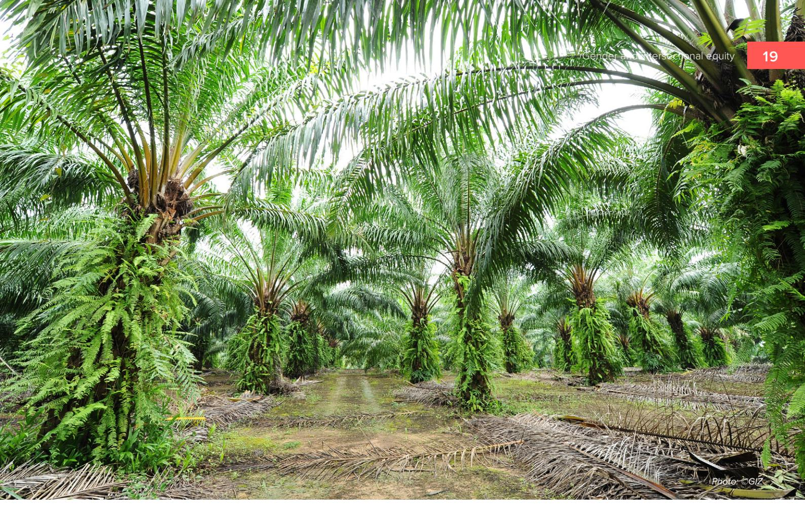

© 2026 Center for International Forestry Research and World Agroforestry (CIFOR-ICRAF), Deutsche Gesellschaft für Internationale Zusammenarbeit (GIZ)

### **Citation:**

Linden H, Gallagher EJ, Liswanti N, Mello D, Vallejo E. 2026. *Gender and intersectional equity: aligning opportunities toward deforestationfree and socially responsible products.* KANDS Collective, Editor. Bogor, Indonesia: CIFOR; Nairobi, Kenya: ICRAF; Bonn, Germany: GIZ.

This product is a partnership between the CIFOR-ICRAF and the SAFE project, financed by the European Union (EU), the German Federal Ministry for Economic Cooperation and Development (BMZ) and the Dutch Ministry of Foreign Aairs (BZ). SAFE is part of the Fund for the Promotion of Innovation in Agriculture (i4Ag) and implemented by Deutsche Gesellschaft für Internationale Zusammenarbeit (GIZ). Its contents are the sole responsibility of CIFOR-ICRAF and do not necessarily reflect the views of the EU, BMZ, and the BZ.

#### **Produced by:**

KANDS Collective | [hello@kandscollective.com](mailto:hello@kandscollective.com)

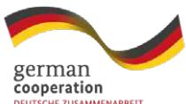

#### **Acknowledgements**

This research is based on collaboration between CIFOR-ICRAF and the Sustainable Agriculture for the Environment (SAFE) project of the Deutsche Gesellschaft für Internationale Zusammenarbeit (GIZ) GmbH, funded by the European Union (EU) and the German Federal Ministry for Economic Cooperation and Development (BMZ). The authors extend their appreciation to the reviewers for their valuable comments and critical feedback which have strengthened this Project Brief.

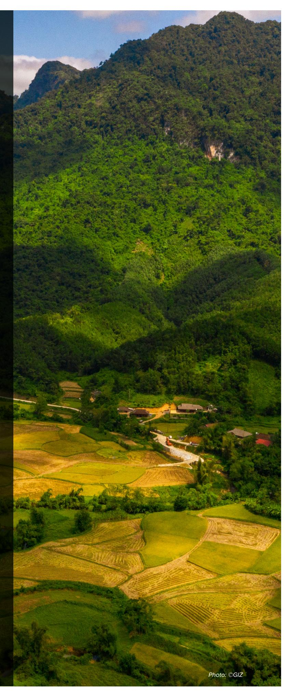