# **Gender Equity, Social Inclusion and Intersectionality (GESI+) in Sustainable and Deforestation-free Agriculture**

Lessons from Coca, Orellana, Ecuador

## **Key messages**

⊲ **The European Union Regulation on Deforestation-free Products (EUDR) creates a dual scenario for Amazonian cocoa and coee:** it can strengthen traceability, legality and territorial sustainability; but it may also deepen gender, territorial and economic inequalities if its requirements are not adapted to Amazonian contexts. ⊲ **Structural gaps**—land tenure, technological and institutional capacities, and women's care and labour burdens—**are the main factors** 

**shaping inclusive or exclusionary compliance outcomes.** Women, youth, Indigenous Peoples, Afro-Ecuadorian and Montubio communities face dierentiated risks.

⊲ **There are key opportunities to transform these value chains into more equitable models**, including social and cultural traceability, the strengthening of local organizations, valuing community knowledge and strengthening institutional coordination to ensure that no one is left behind during the transition.

#### **COUNTRY CASE STUDIES**

# **Introduction**

### **Sucumbíos and Orellana commodity landscapes**

**In the northern Ecuadorian Amazon, cocoa and coee value chains play a significant socioeconomic and cultural role.** Cocoa is one of the country's most important agricultural products and a key source of income for thousands of rural families, particularly in the Amazon. Ecuador is the world's fifth-largest cocoa producer, with an output of 420,000 tons in 2023-24, representing 9.6% of regional production. According to export data, Ecuador recorded a 6.78% increase in export volume and a 155.7% increase in export revenues in 2024 compared to the previous year, reaching USD 3.62 billion (ANECACAO, 2024). This exceptional growth, driven by international demand and price increases surpassing USD 11,300/ton in 2024 due to global supply chain disruptions, highlights the importance of ensuring traceable, legal and EUDR-aligned cocoa exports to temper crop expansion (ICCO, 2024; ANECACAO, 2024).

In the northern Amazon, Sucumbíos and Orellana stand out as two major producing territories. Sucumbíos reaches 12,781 tons of cocoa per annum, combining biodiversity with diverse agroforestry systems where cocoa is integrated with yucca, plantain and palm crops, sustaining local economies and territorial strengthening. Amazonian cocoa is mostly produced under conventional systems, with low levels of processing and limited added value. Nationally, the cocoa system consists predominantly of conventional cocoa (82%), high-yield CCN‑51 (98.7% of production), and fine-flavour native cocoa—around 9.62%—found mainly in intermediary and specialty centres (MAG-SIPA,

Ecuador plays a strategic role in the production of cocoa and coee in Latin America, particularly in the Northern Amazon, where fragile ecosystems converge with Indigenous and campesino (small-scale farmer) communities dedicated to family agriculture. Cocoa and coee value chains are not only a key source of income, but also an axis of territorial identity and social cohesion.

The operationalization of the EUDR establishes new requirements for agricultural value chains aiming to access the European market by demanding traceability, legality and the absence of deforestation. For the Ecuadorian Amazon, this regulatory framework represents both a challenge and an opportunity, especially in territories with high biodiversity, the presence of Indigenous Peoples with collective rights, and predominantly family-based production systems.

2024). The national average yield is 0.80 t/ha, with farm sizes ranging between 2 and 3 hectares.

Coee, though less important economically than cocoa, remains essential for family economies in Sucumbíos and Orellana, where it integrates into agroforestry systems and serves as complementary income for Amazonian Indigenous Peoples, Montubio communities and campesino families experiencing economic vulnerability. Coee is a priority value chain in the National Strategy for Sustainable Rural Development and in productive strengthening programmes in Amazonian territories.

**Both chains face structural challenges**: Low levels of processing, limited digital connectivity, diculties accessing markets, restricted presence in certification programmes and high compliance costs. These gaps have direct implications for how the EUDR may be operationalized.

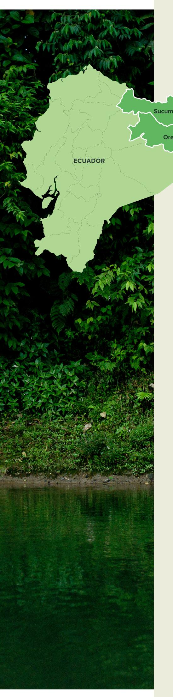

### **Training of Trainers SAFE project on GESI+**

CIFOR-ICRAF conducted a desk review to map potential opportunities and risks of the EUDR from a social inclusion perspective, along with a pilot Training of Trainers (ToT) workshop on GESI+ and EUDR. Intersectionality is a framework for assessing how gender intersects with other aspects of social identify such as age, ability, ethnicity, religion, class or others, conferring either privilege or marginalization in the context of commodity production and supply chains. The workshop took place in El Coca, Orellana province, from August 5-7, 2025, with the participation of 22 people from public institutions, producer organizations, cooperatives, NGOs and community representatives from Sucumbíos and Orellana. During the workshop, didactic tools were tested and valuable inputs were collected regarding risks, opportunities and inclusion mechanisms in cocoa and coee value chains.

### **Sustainable Agriculture for Forest Ecosystems (SAFE) project**

The SAFE project is an initiative coordinated by the German Agency for International Cooperation (GIZ), and the Team Europe Initiative (TEI) on Deforestation-free Value Chains that seeks to strengthen the transition toward more responsible and resilient agricultural production and deforestation-free supply chains for cocoa, coee, palm oil, rubber, cattle, soy and timber, especially in territories with high ecological value. Its approach focuses on improving traceability systems, strengthening technical capacities, and promoting reliable partnerships that ensure the sustainability of cocoa and coee value chains (GIZ, 2024).

SAFE operates under a clear principle that no actor should be left behind. This requires providing tools and support to those on the upstream end of value chains—small producers, rural women and local organizations—so they can produce without deforesting, increase their incomes and meet the criteria of the EUDR. In addition, the project promotes joint solutions so that productivity gains do not compromise forest conservation or natural resources, fostering a just and equitable transition (GIZ, 2024).

One of the pillars of the programme is the expansion of traceability systems, incorporating digital tools that allow producers to geolocate their plots, map supply chains and comply with the EUDR. This eort is complemented by intensive training processes for small producers, associations and local technicians, aimed at strengthening capacities in due diligence, forest monitoring, data management and sustainable land use.

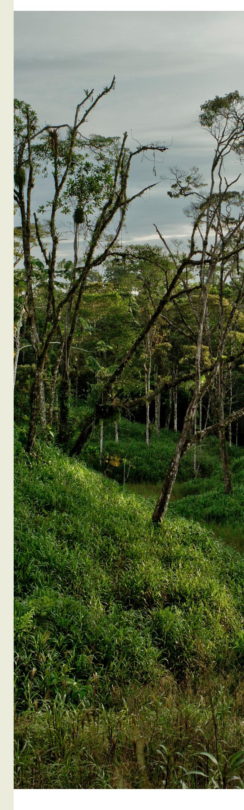

## **Stakeholder landscape**

The Amazonian institutional ecosystem includes a wide variety of actors, with diverse capacities and dierentiated roles, who define the potential for complying with the EUDR, or how they may be impacted by it:

⊲ **Producer organizations**, which play essential roles in traceability, legality, certification, commercialization and territorial governance. However, some face internal inequalities that exclude women and youth from decisionmaking spaces. ⊲ **Popular and Solidarity Economy (EPS) organizations**, characterized by strong women's leadership and relevance for sustainable and solidarity-based commercialization models. ⊲ **Women's organizations**, essential for mitigating risks linked to the EUDR but operating in contexts marked by existing inequalities. ⊲ **Intermediaries and aggregators**, key actors that influence traceability and market access but may also generate exclusion by centralizing power. ⊲ **Local governments, ministries and technical entities** (e.g., MAG, Ministry of Environment, Water & Ecological Transition) responsible for technical assistance, land cadastre (ocial land registry), verification and formalization processes. ⊲ **Indigenous Peoples and local communities**  (IPLCs), whose collective land tenure systems and governance structures may not always align with georeferencing requirements. ⊲ **NGOs and international cooperation** which contribute with technical assistance, monitoring, certification, capacity-building and inclusive governance processes.

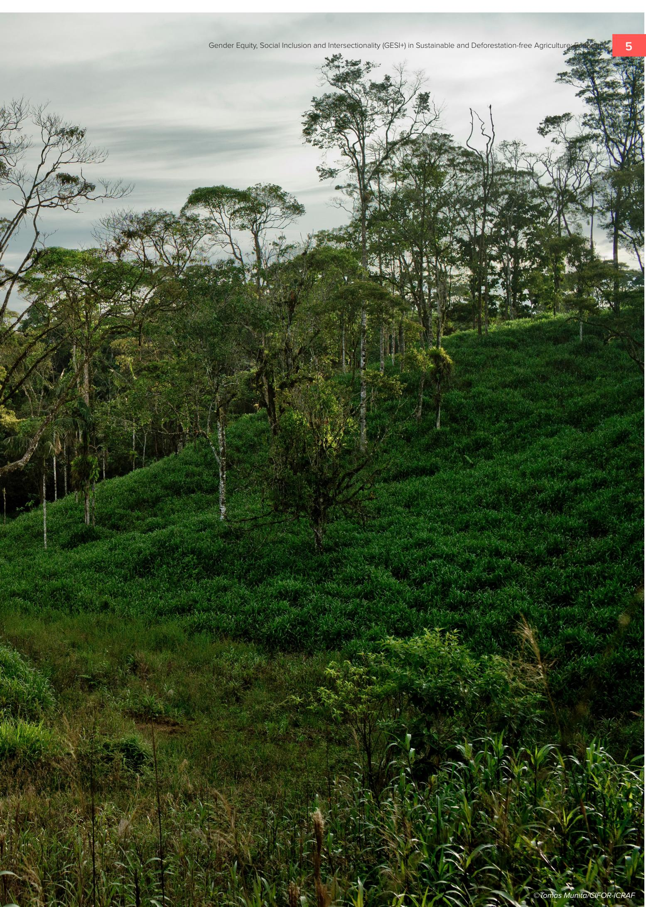

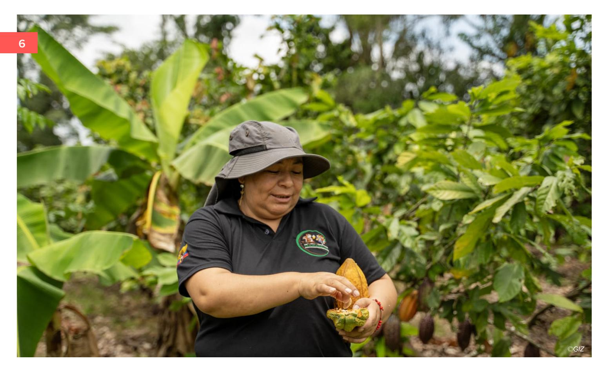

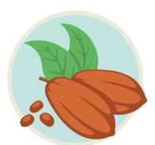

## **Cocoa value chain dynamics**

Cocoa is a key source of income for thousands of rural families in the Ecuadorian Amazon. Provinces such as Sucumbíos and Orellana concentrate extensive areas of diverse and sustainable agroforestry systems, where cocoa is combined with crops such as yucca, plantain and palm, supporting complementary incomes and territorial strengthening. Cocoa production is predominantly carried out by smallholders, with a predominance of CCN-51 cocoa and, to a lesser extent, fine-flavour national cocoa (MAG-SIPA, 2024).

The value chain faces challenges related to low levels of processing, limited services, restricted access to formal markets and low participation in certification programmes, which influence compliance with the EUDR. Socio-demographic profiles also reveal deep structural inequalities (MAG, 2023), with men representing the majority of producers and women having less access to credit and resources.

A study by TRIAS in Orellana found that in nurseries, women represent around 10% of participants in the sector. This limits their early access to planting materials, technology, innovation and technical networks. According to the same study, women's participation in organizational spaces is only 12%, compared to 88% men. Their limited leadership and influence in collective decision-making processes further constrain their access to productive assets and information.

In administrative processes, the presence of women is uneven (34% women, 66% men), and one operation showed no female participation at all. In Orellana, women's participation in the value chain is minimal due to greater time burdens from domestic and organizational labour (MAG, 2024). In relation to artisanal processing and chocolate-making, this is one of the spaces where women have greater presence. Artisanal processing combines technical skills, added value and creativity, becoming a strategic space for women's economic autonomy and visibility (TRIAS, 2023).

In production, men predominate in productive decisions (52.38%), although 33.33% report shared decision-making. Women engage more in agro-processing activities, given the heavier burden of domestic and organizational work (MAG, 2023). Lower access to technology and training heightens the barriers to complying with the traceability required by the EUDR. These gaps limit women's access to technologies, information and key productive improvements needed to adapt to regulated markets.

In summary, the Amazonian cocoa value chain shows clear gaps in access to land, technology, credit, organizational participation and decision-making. While there are spaces where women advance (such as artisanal transformation), inequalities persist.

#### **The participatory workshop carried out in Ecuador enabled a deeper and complementary examination of the cocoa value chain.**

Participants identified the stages in which women, youth, IPLCs and Montubio producers are located, as well as the specific barriers they face. The figure below synthesizes these findings and illustrates how women's participation is concentrated in nursery activities, care, fermentation and drying, while men dominate heavy tasks, fruit cutting and transport. Crosscutting inequalities—especially aecting youth, Indigenous women and producers—were also identified in relation to access to land, credit, mobility and the recognition of unpaid labour. This information complements the documentary analysis and provides a more grounded understanding of how roles and opportunities are distributed in the cocoa value chain, based on participants' insights.

*Input distribution of agricultural supplies*

*Cocoa cultivation*

*Harvesting and processing ( fermentation and drying)*

*Transport and commercialization*

**Gender roles:** mostly men; women participate in minor

purchases.

**Gender roles:** men in heavy tasks, fruit cutting; women in nurseries and care.

**Gender roles:** men cut fruit; women ferment and dry (household-

level).

**Gender roles:**

transport dominated by men; women trade in

local fairs.

**Intersectional groups:**  youth with limited access to credit; Indigenous and Montubio communities face cultural barriers.

**Intersectional groups:**  youth without access to land; Indigenous People in collective

tenure.

**Intersectional groups:**  youth work as unpaid labour; Indigenous youth with double burdens.

**Intersectional groups:** small producers depend on intermediaries; women have little bargaining

power.

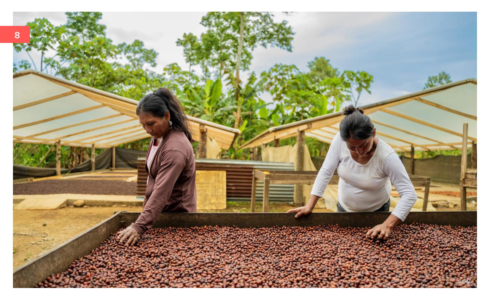

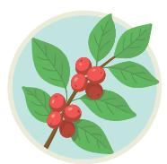

## **Coffee value chain dynamics**

In the Amazonian coee value chain, actors operate in a dispersed way and with limited territorial coordination. Production is in the hands of small producers—mostly unorganized while aggregation and commercialization are concentrated among informal intermediaries with limited technical oversight. At the institutional level, the Ministry of Agriculture and Livestock (MAG) and local governments play a key role in providing technical assistance and support for regularization, although their capacities are limited. Cooperation organizations, research centres and emerging associations are beginning to strengthen productive dierentiation processes for Amazonian coee, particularly for robusta coee grown under shade. Women's participation is high in productive tasks, but often invisible in decisionmaking and in stages with higher added value.

**Women and other vulnerable groups face dierentiated conditions within the coee value chain due to internal dynamics in several productive segments.** Producer associations, although they support collective production, aggregation and commercialization, sometimes exclude or underrepresent women and youth, limiting their access to benefits derived from EUDR compliance and demonstrating the need for institutional strengthening with an equity approach. In contrast, Organizations of the Popular and Solidarity Economy (EPS) are characterized by strong female presence and their potential to implement solidarity mechanisms and inclusive and sustainable practices, making them strategic spaces to reduce gaps and facilitate women's participation in markets and productive processes.

**Women's organizations play a fundamental role in ensuring that EUDR operationalization does not deepen inequalities.** These groups require technical, financial and institutional strengthening to improve their participation and visibility in public policies and productive results, and to ensure recognition of rural women's rights. For individual producers, women face greater barriers to accessing land, credit and markets, which

reduces their capacity to meet EUDR traceability and verification requirements. Lack of information, resources and time particularly aect young producers and those in Indigenous communities, who face more restrictive conditions.

#### **In the private sector linked to coee,**

**inequalities also appear in dierentiated ways.** In processing centres (key nodes for traceability), women producers may face access barriers if inclusive protocols are not in place. Among local traders, lack of equitable treatment in prices, volumes and purchasing conditions can create exclusions, particularly aecting women producers. Intermediaries, who often concentrate pricing power and transparency barriers, may exclude women producers from the most profitable commercial circuits.

The workshop provided new information not always identified in documentary sources. **Based on participants' lived experience as producers, dierentiated roles were identified in purchasing inputs, seedling production, harvesting, drying and commercialization, showing patterns similar to those observed in cocoa.** The table below summarizes these contributions—for example, the presence of women in nurseries, sowing, drying and selection; male dominance in pruning, harvesting and transport; and linguistic barriers, land access limitations and short-term participation faced by youth and Indigenous community members.

Figure 2. Coee value chain – ToT Ecuador, August 2025 (designed by KANDS Collective)

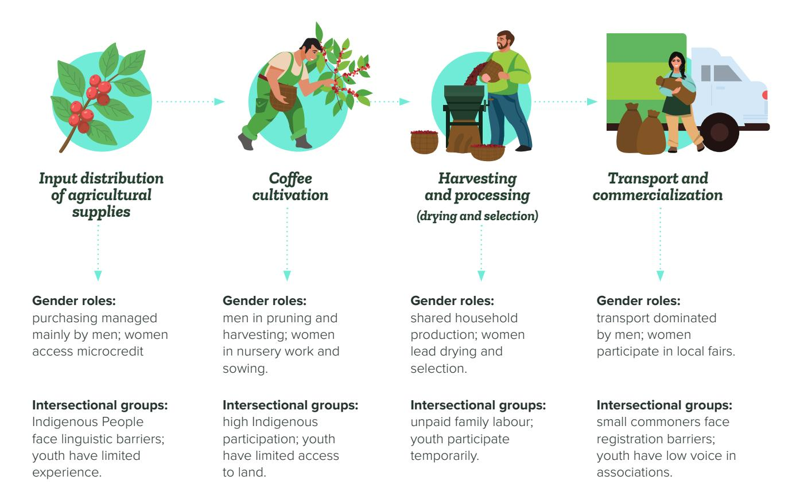

## **Relevant national legislation for deforestation-free agriculture**

EUDR treats national legislation as integral to its concept of "legal production." It requires that products entering the EU comply with the laws of their country of origin with regards to environmental and social safeguards as a foundation for the deforestation-free and duediligence requirements.

Ecuador has a comprehensive environmental and forest law framework, most notably the constitutional recognition of "Rights of Nature" (2008 Constitution) and a national "deforestationfree" certification scheme. The law recognizes forest-use rights for IPLCs and Afro-Ecuadorian communities (especially for non-timber products)

under certain conditions, though commercial use of forest products such as timber remains tightly regulated. In practice, there exist operationalization and enforcement gaps, and sociocultural and gender norms alienate women and other tenure-insecure groups.

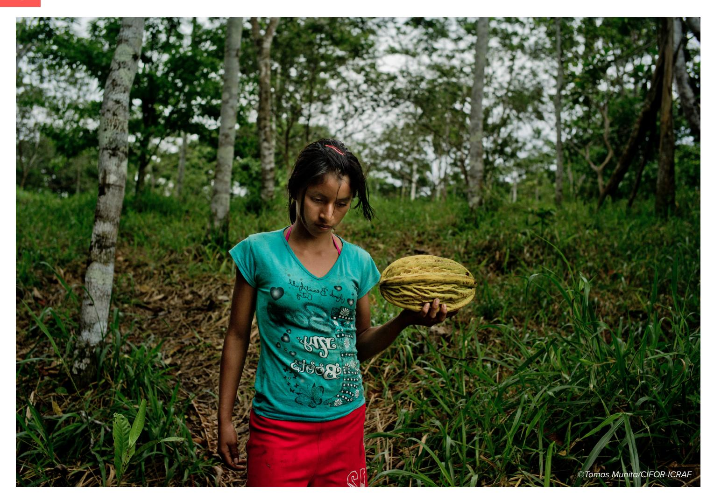

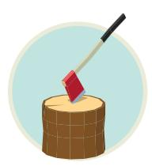

Table 1. Relevant national legislation to regulate and incentivize sustainable agriculture in forest ecosystems in Ecuador

| Subsection           | Key details                                                                        |
|----------------------|------------------------------------------------------------------------------------|
| Land use rights ⊲    | Diverse legal framework, but without an explicit gender focus                      |
| ⊲                    | Legal access to land is key to traceability in cocoa and oil palm                  |
| ⊲                    | Rural and Indigenous women face barriers to ownership and participation            |
| ⊲                    | Advanced regulations that recognize the rights of nature                           |
| ⊲                    | Regulate traceability, use of inputs, and conservation for EUDR compliance         |
| ⊲                    | Dierentiated impact on women not always considered by law                         |
| ⊲                    | Standards aim for sustainability, but lack a gender perspective                    |
| ⊲                    | Women participate in agroforestry systems without being recognized                 |
| ⊲                    | Incentives and certifications do not include armative action measures             |
| Third party rights ⊲ | Guarantees the collective rights of Indigenous and Afro-descendant peoples         |
| ⊲                    | EUDR requires respect for Free, Prior and Informed Consent (FPIC) and eective     |
| ⊲                    | Autonomous territorial management is a condition for access to the European        |
| Labour rights ⊲      | A solid legal framework for decent working conditions                              |
| ⊲                    | EUDR requires compliance with national labour legislation                          |
| ⊲                    | Women face exclusion, unequal pay, and workplace violence.                         |
| ⊲                    | Ecuador has ratified key treaties such as the Convention on the Elimination of All |
| ⊲                    | EUDR mandates respect for these rights in production chains; its gender           |
| FPIC regulation ⊲    | A key collective right for Indigenous and Montubio peoples                         |
| ⊲                    | Legal gaps and the lack of an organic law limit implementation                     |
| ⊲                    | Women’s participation in these processes remains weak                              |
| ⊲                    | Formal laws exist, but enforcement is weak among small producers                   |
| ⊲                    | Informality and low implementation of Good Agricultural Practices (GAP) hinder     |
| ⊲                    | EUDR can be an opportunity to formalize and include women                          |
| ⊲                    | Includes CEDAW, ILO C169, the Regional Agreement on Access to Information,         |
| ⊲                    | Underpin EUDR requirements regarding equality, participation, and traceability     |

## **Risks under EUDR**

The operationalization of the EUDR creates opportunities for Ecuador's cocoa and coee value chains, but it also presents technical, regulatory, and sociocultural risks that aect small-scale producers, women, youth, and Indigenous, Afro-descendant, and Montubio peoples in dierent ways. Documentary analysis highlights structural gaps that may hinder inclusive compliance with the regulation (MAG-SIPA, 2024; ProAmazonía, 2020; GIZ & CI, 2024; SAFE, 2024).

#### **Land tenure, formalization, and administrative burdens** 1 2

Inequality in land ownership is one of the most critical risks. Many rural women are not registered as formal landholders despite actively working the plots, which limits their access to technical assistance, financing, and georeferencing, verification, and due diligence processes required under the EUDR (MAG-SIPA, 2024). In Indigenous territories, collective tenure systems, although constitutionally recognized, do not always have updated documentation or maps, generating incompatibilities with the geolocation requirements of the regulation (ProAmazonía, 2020). These challenges are compounded by a legal framework perceived as complex and inaccessible, where notarial and administrative costs become prohibitive for low-formalization coee and cocoa associations (ProAmazonía, 2020). Without rights clarification processes and strengthened organizational structures, exclusion risks increase for both women and Indigenous and Montubio communities whose territorial practices do not align with state land-use categories (MAG-SIPA, 2024; ProAmazonía, 2020).

#### **Work overload, gender inequalities, and unsafe working environments**

Amazonian women combine agricultural work with caregiving and community responsibilities, limiting their participation in trainings, assemblies, certifications, and organizational processes essential for meeting traceability requirements (MAG-SIPA, 2024). The absence of childcare services, flexible schedules, and inclusive methodologies turns this workload into a structural exclusion risk. Additional challenges arise from dierent forms of violence (harassment, coercive control, assault, or domestic violence) that directly aect women's participation in governance spaces and training processes required by the EUDR. Nationally, 64.9% of rural women have experienced violence at some point in their lives (ENVIGMU, 2019), restricting their mobility, their participation in due diligence, and their access to safe working environments, thereby undermining compliance with the social standards required for European markets.

Discriminatory practices also persist in Amazonian territories toward women, youth, Indigenous Peoples, Afro-descendants, and Montubios, expressed in reduced access to services, leadership, and decision-making spaces (ENVIGMU, 2019; MDT, 2022; Defensoría del Pueblo, 2023). When these inequalities overlap, for example, in the case of Indigenous women cocoa producers, their access to certification, training, or governance processes declines sharply. Because the EUDR requires representative governance mechanisms, the absence of women and ethnic groups would result in inequitable compliance.

#### **Technological gaps, institutional capacities, and communication barriers** 3

Limited digital connectivity, insucient technological infrastructure, and weak institutional capacity hinder compliance with requirements such as georeferencing, record-keeping, and digital traceability (MAG-SIPA, 2024; ProAmazonía, 2020; GIZ & CI, 2024). These issues disproportionately aect women, youth, and producers with low educational levels or limited access to digital devices, creating technological dependency and restricting autonomous operationalization of the EUDR. In addition, highly technical terminology such as "due diligence," "georeferenced traceability," or "residual risks" creates barriers for producers with diverse levels of literacy. These barriers intensify for women and IPLCs when communication materials are not adapted to local languages, community platforms, or visual methodologies. Without culturally appropriate and accessible communication strategies, the EUDR risks being perceived as an external and exclusionary imposition.

#### **Economic exclusion, commercial risks, and limited access to financial services** 4

Cocoa and coee in Ecuador are produced mainly by small family farms with low levels of technological development and limited participation in formal markets. Documentary verification, certification, and traceability requirements may reinforce exclusion if dierentiated support measures are not provided (MAG-SIPA, 2024).

Women producers are especially vulnerable due to their limited land ownership, lower access to credit, reduced participation in cooperatives, and lower visibility in land registries, all of which increase the likelihood of being excluded from traceable supply chains (MAG-SIPA, 2024; ProAmazonía, 2020).

Dependence on international markets also introduces additional risks: if smallholders are unable to meet EUDR standards, they may be pushed into secondary markets with lower prices and reduced recognition (SAFE, 2024).

Women-led businesses in artisanal cocoa or coee (e.g., fine-aroma cocoa or specialty coees) often struggle to reach premium markets because they lack the capital, certifications, and commercial networks required to access those dierentiated value chains (SAFE, 2024). Access to credit, agricultural insurance, and technical assistance remains limited, especially for women and youth. Existing financial instruments are not designed to cover key EUDR processes such as georeferencing, certification, or updating records, and the absence of culturally appropriate methodologies can exacerbate existing gaps (ProAmazonía, 2020).

#### **Weak institutional coordination and governance gaps**

Coordination among agencies responsible for environment, agriculture, land-use planning, and the EPS is limited, leading to duplication of eorts or gaps in implementing traceability, verification, and technical assistance (GIZ & CI, 2024). This lack of coordination particularly aects women, youth, and isolated producers who depend on public institutions for formalization or financing processes. Without institutional arrangements that consider the specific needs of these groups, exclusion risks increase.

Beyond the documentary analysis, the workshop made it possible to identify how EUDR-related risks manifest across the dierent stages of the coee and cocoa value chains from the perspective of producers and territorial actors.

Participants noted that distinguishing risks specific to women and vulnerable groups was challenging since general risks tended to apply across all actors, but the exercise helped reveal dierentiated situations aecting women, youth, landless community members, and Indigenous Peoples.

In the **coee value chain**, participants highlighted that:

⊲ financial exclusion and lack of clear information persist in the distribution of agricultural inputs ⊲ cultivation risks are associated with communal land tenure, women's work overload, and limited technical assistance

⊲ harvest and processing stages present risks of invisibilization of women's labour and economic exploitation by intermediaries ⊲ transport and commercialization involve risks of exclusion from traceability processes, limited participation in FPIC, and exploitative economic practices For the **cocoa value chain**, the workshop ⊲ In the harvest and processing stages, participants cited risks related to the invisibilization of women's labour, low prices that lead to economic exploitation, and exclusion from traceability systems ⊲ Finally, in transport and commercialization, they identified risks associated with lack of price transparency, the exclusion of women, and the displacement of small producers

revealed similar risks but with nuances specific to the production context:

⊲ In the distribution of inputs, participants described risks linked to exclusion due to lack of credit, economic exploitation, and limited transparency in costs ⊲ During cultivation, risks were associated with the limited participation of women in decisionmaking, the exclusion of landless community members, and women's work overload

Overall, the information generated through the workshop complements previous documentary analysis and provides a more context-speciƂc understanding of how the EUDR may deepen existing inequalities if territorial, organizational, and gender dynamics are not adequately considered in the Amazonian coƈee and cocoa value chains.

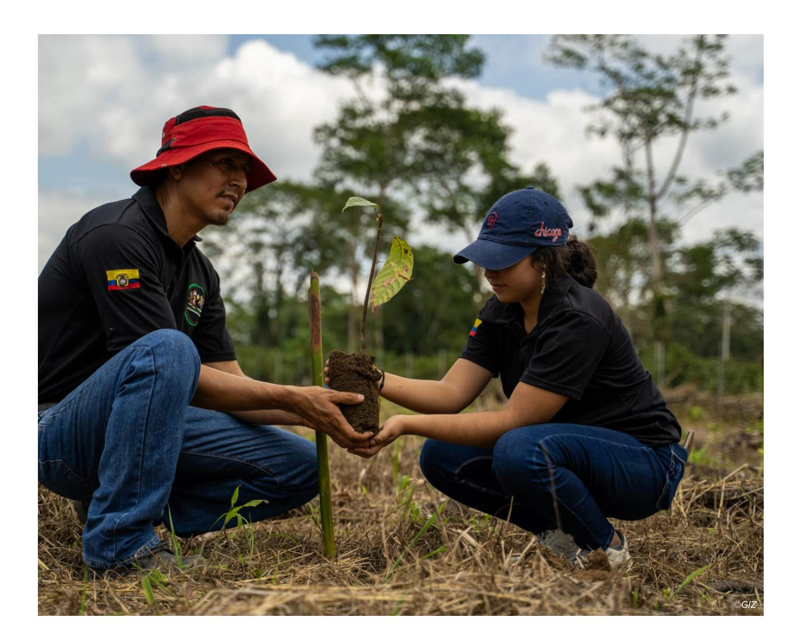

## **Opportunities for social inclusion and equity under EUDR**

The EUDR opens a set of opportunities to strengthen governance, social inclusion, and sustainability in the cocoa and coee value chains. Seizing these opportunities requires a strategic perspective that aligns regulatory frameworks, local capacities, and the diversity of actors present in the territories. This section summarizes potential opportunities identified through documentary evidence and insights from the workshop held in Ecuador.

The operationalization of the EUDR, by requiring georeferenced traceability, legality, and the absence of deforestation, creates an opening to strengthen the eective and inclusive participation of women, youth, Indigenous Peoples, Afro-Ecuadorian and Montubio communities in the cocoa and coee value chains of the Ecuadorian Amazon. The regulation can become a lever to close equity gaps, as long as its operationalization is deliberately oriented toward social justice and inclusion.

**Stakeholder engagement** 

**opportunities**

The SAFE project and similar TEI flagship projects support stakeholder engagement, emphasizing broad and inclusive participation of diverse actors to deliberate and prepare producers for deforestation-free transitions in the governance of supply chains. The ToT aimed to train trainers to facilitate such workshops where traditionally excluded voices can influence decisions on traceability, compliance, and sustainability. With respect to stakeholder engagement and social inclusion, the ToT participants identified a number of opportunities for strengthening collective agency.

A first opportunity lies in advancing toward "social and cultural traceability," which goes beyond recording coordinates or documents and instead makes visible who produces, under what conditions, and under which organizational arrangements. Integrating information on women, Indigenous Peoples, Afro-Ecuadorians, and Montubios into registry systems can strengthen their position in the chain, recognize their contributions, and expand their access to

benefits and incentives. This requires designing traceability tools that incorporate gender and intersectional variables, not only technical or environmental components.

The EUDR can also strengthen existing inclusive associative structures, such as producer organizations, EPS organizations, women's networks, consultative councils, and territorial governance platforms. These spaces enable small producers—especially women, youth, and Indigenous nationalities—to collectively undertake processes related to traceability, legality, and market access, share costs, and negotiate better conditions with intermediaries and exporters.

Integrating GESI+ criteria into the composition and leadership of these organizations can encourage more representative participation in decisionmaking, shifting from a predominantly productive role to also a political and strategic one. Likewise, the EUDR reinforces the importance of FPIC for Indigenous Peoples, grounded in the Constitution (Art. 57), ILO Convention 169 (Arts. 6 and 15), the UN Declaration on the Rights of Indigenous Peoples (Arts. 10, 19, 32), and other relevant national frameworks. When these processes include a gender lens, conditions are created for decisions regarding land use, deforestation, and commercialization to explicitly recognize the voices of Indigenous women in territorial defense and traditional production systems.

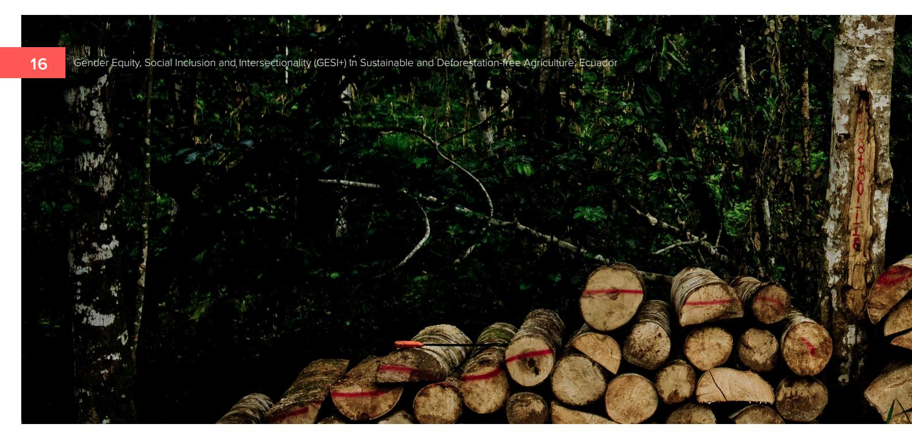

#### **Legal opportunities and alignment with international commitments**

Ecuador's legal framework, including the Constitution, the Civil Code, the Organic Law on Rural Lands and Ancestral Territories (LOTRUTA), the Organic Environmental Code (CODA), its Regulation (RCODA), and the Unified Secondary Environmental Legislation of the Ministry of Environment (TULSMA), provides a solid foundation for the EUDR to drive strategic legal formalization processes, with direct benefits for rural women, IPLCs, and historically excluded actors. The requirement to prove the legality of product origin may accelerate land adjudication, promote co-titling, and recognize community-based and intercultural tenure models, strengthening women's participation in territorial planning.

Additionally, EUDR compliance enables the alignment of environmental, labour, and human rights standards, and the incorporation of third-party rights such as FPIC into responsible production processes. When these processes are designed with gender and intercultural approaches, they can reduce structural inequalities in access to rights, improve labour conditions, strengthen protection mechanisms against violence and discrimination, and reinforce legal security for producers and communities. Furthermore, the alignment of the EUDR with international commitments ratified by Ecuador broadens the range of opportunities. The Escazú

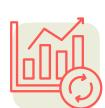

Agreement strengthens the right to information, public participation, and the protection of human rights and environmental defenders, creating conditions for rural and Indigenous women to access information about the regulation and participate in decisions related to production and environmental governance. Likewise, the Leticia Pact for the Amazon and the Kunming–Montreal Global Biodiversity Framework reinforce goals related to conservation, women's and Indigenous Peoples' participation, territorial governance, and sustainable value chains.

### **Technical opportunities**

The EUDR creates opportunities to strengthen technical capacities and improve the positioning of Amazonian products in dierentiated markets. Technically, georeferenced traceability and legal documentation can serve as a foundation for community certifications, participatory mapping, digital information systems, and genderresponsive digital literacy processes. When accompanied by tailored capacity development for women, youth, and Indigenous Peoples, this transition can enhance their inclusion in value chains and improve their ability to meet European standards.

### **Market opportunities**

At the organizational and commercial levels, the EUDR can encourage collective structures to jointly undertake certification, monitoring,

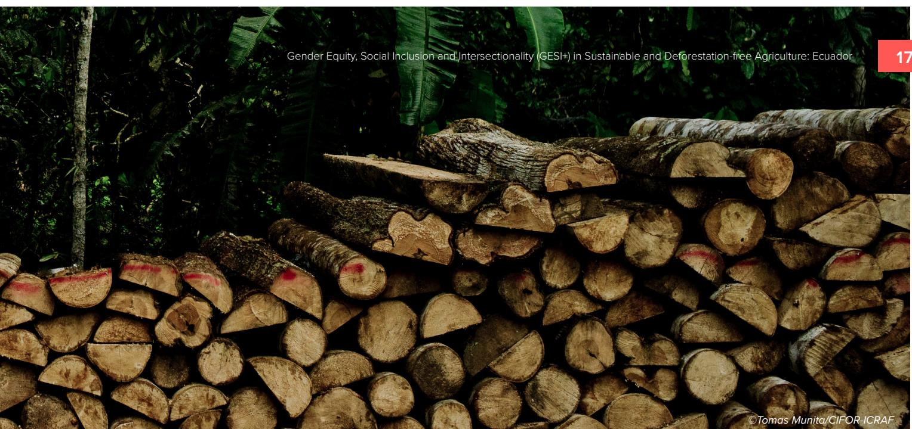

digitalization, and verification processes. This reduces individual costs, prevents the double exclusion of small producers, and supports fairer commercialization models. Additionally, the emphasis on legal and deforestation-free products opens opportunities for value chains built on territorial identity and social sustainability. Amazonian cocoa and coee can be positioned in conscious markets when integrating attributes such as agroecological practices, forest conservation, women's and Indigenous Peoples' participation, robust traceability, and territorial narratives that highlight community contributions. This can translate into higher local value added, stronger women-led enterprises, and reduced dependence on lowprice secondary markets.

The transition toward systems that integrate social, environmental, and economic sustainability, including traditional knowledge and ancestral production, can also improve competitiveness and support product dierentiation, particularly when paired with enhanced capacities in processing, access to technical and financial services, and the promotion of Amazon-origin product identity. The workshop held in Ecuador further deepened local perceptions of the opportunities generated by the EUDR. Participants noted that digital and georeferenced traceability could boost transparency, strengthen trust among actors, and facilitate the participation of women, youth, and Indigenous Peoples. The use of digital tools was seen as a way to optimize time, reduce errors, and decrease dependence on intermediaries, with direct benefits for market access and informed decision-making.

From a market perspective, participants highlighted that the EUDR opens access to dierentiated niches that value traceability, sustainability, and certified quality. This could translate into better prices, greater competitiveness, and improved livelihoods for producer families. They also emphasized that transitioning toward agroecological practices and systems grounded in social, environmental, and economic sustainability could become a strategic advantage, strengthening the territorial and cultural identity of Amazonian cocoa and coee.

Finally, the workshop identified legal and organizational opportunities to advance land formalization, strengthen associations and collective platforms, and promote coordination among public institutions, the private sector, community organizations, academia, and international cooperation.

Participants underscored that the EUDR implies not only obligations but also an important opportunity to stimulate innovation, strengthen local capacities, and orient compliance toward sustainability and equity.

Leveraging these frameworks in a coordinated manner can align national and territorial agendas, reinforce the protection of environmental and human rights defenders, and build operationalization pathways consistent with human rights, biodiversity conservation, and gender equity.

# **Recommendations**

The operationalization of the EUDR in Ecuador presents both opportunities and risks. It can support needed improvements in formalization, traceability, sustainability and territorial governance. At the same time, it may increase gender, territorial and economic inequalities if European requirements are not adapted to Amazonian contexts. Findings from the documentary analysis and the workshop demonstrate that technological gaps, complex regulations, low land-titling rates, women's work overload, the historical exclusion of smallholders, and sociocultural barriers remain critical challenges for inclusive compliance.

There are, however, concrete opportunities to transform the cocoa and coee value chains toward more equitable models. Advancing digital tools, integrating social and cultural traceability, expanding participatory mechanisms, valuing community knowledge and supporting producer associations can help ensure that the transition to sustainable and deforestation-free systems benefits all actors. Moving in this direction requires practical investments in local capacities, improved coordination among institutions, and a clear commitment to GESI+ and intercultural approaches in EUDR alignment eorts.

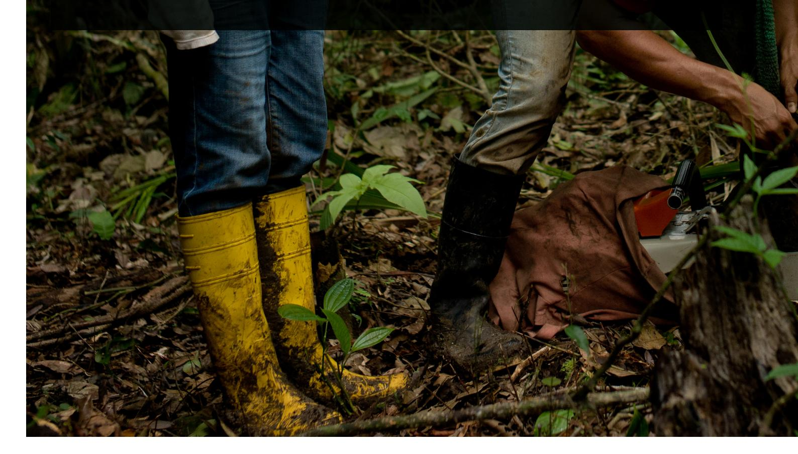

Asociación Nacional de Exportadores de Cacao (ANECACAO). 2024. Panorama de la cadena de valor del cacao en Ecuador. Guayaquil (EC): ANECACAO. Defensoría del Pueblo. 2023. Informe nacional sobre acoso y violencia en el trabajo. Quito (EC): Defensoría del Pueblo. Available from: https://www.dpe.gob.ec Encuesta Nacional sobre Relaciones Familiares y Violencia de Género contra las Mujeres (ENVIGMU). 2019. Quito (EC): Instituto Nacional de Estadística y Censos (INEC). Available from: https://www.ecuadorencifras.gob.ec/violencia-degenero/ Deutsche Gesellschaft für Internationale Zusammenarbeit (GIZ). 2024. Brazil – rapid assessment: EUDR implementation challenges and opportunities. Producto 1 – informe técnico. Internal document. GIZ, Conservation International (CI). 2024. Diagnóstico rápido participativo de la situación actual del cultivo de palma en la Amazonía norte del Ecuador en el marco del diseño del modelo de gestión de la Mesa de Palma Sostenible y Libre de Deforestación. Quito (EC): Deutsche Gesellschaft für Internationale Zusammenarbeit (GIZ); Conservation International (CI). International Cocoa Organization (ICCO). 2024. Quarterly bulletin of cocoa statistics. Vol. 50, No. 4, cocoa year 2023/24. London (UK): International Cocoa Organization. Ministerio de Agricultura y Ganadería (MAG). 2023. Caracterización social y productiva de productores de cacao CCN51 y Nacional en la provincia de Sucumbíos. Sistema de Información Pública Agropecuaria (SIPA). Quito (EC): Ministerio de Agricultura y Ganadería. MAG. 2024. Boletín técnico de caracterización productiva y socioeconómica del cultivo de café en las provincias de Orellana y Sucumbíos. Sistema de Información Pública Agropecuaria (SIPA). Quito (EC): Ministerio de Agricultura y Ganadería. MAG-SIPA. 2024. Sistema de Información Pública Agropecuaria (SIPA): estadísticas de producción y caracterización de productores de cacao y café en Ecuador. Quito (EC): Ministerio de Agricultura y Ganadería. Ministerio del Trabajo (MDT). 2022. Boletín estadístico laboral. Quito (EC): Ministerio del Trabajo. Available from: https:// www.trabajo.gob.ec ProAmazonía. 2020. Diagnóstico y plan de acción para el enfoque de género en la cadena de valor de palma aceitera en la Amazonía del Ecuador. Quito (EC): MAATE & MAG. Sustainable Agriculture for Forest Ecosystems (SAFE). 2024. Diálogos del cacao sostenible: desafíos y oportunidades para la implementación de cadenas de valor libres de deforestación en Ecuador. Quito (EC): Deutsche Gesellschaft für Internationale Zusammenarbeit (GIZ). TRIAS. 2023. Caracterización socioeconómica de productores de cacao en la provincia de Orellana. Programa Cacao Sostenible. Quito (EC): Fundación TRIAS Ecuador.

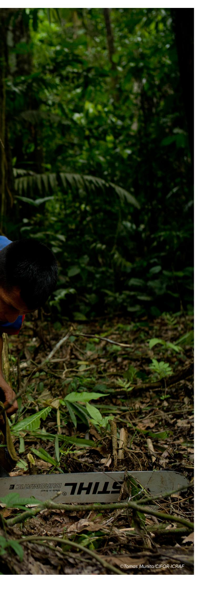

#### **Acknowledgements**

This research is based on collaboration between CIFOR-ICRAF and the SAFE project of the Deutsche Gesellschaft für Internationale Zusammenarbeit (GIZ) GmbH, funded by the European Union (EU) and the German Federal Ministry for Economic Cooperation and Development (BMZ). We would like to thank the GIZ Ecuador Country Oce, the SAFE Project team in Ecuador, CIFOR-ICRAF colleagues, and all local partners, producer organizations, and community representatives who contributed to the preparation of this brief.

© 2026 Centre for International Forestry Research and World Agroforestry (CIFOR-ICRAF), Deutsche Gesellschaft für Internationale Zusammenarbeit (GIZ)

#### **Citation:**

Chapalbay R, Vallejo E, Gallagher E. 2026. Gender Equity, Social Inclusion and Intersectionality (GESI+) in Sustainable and Deforestation-free Agriculture: Lessons from Coca, Orellana, Ecuador. KANDS Collective, Editor. CIFOR: Bogor, Indonesia; ICRAF: Nairobi, Kenya; and GIZ: Bonn, Germany.

This product is a partnership between the CIFOR-ICRAF and the SAFE project, financed by the European Union (EU), the German Federal Ministry for Economic Cooperation and Development (BMZ) and the Dutch Ministry of Foreign Aairs (BZ). SAFE is part of the Fund for the Promotion of Innovation in Agriculture (i4Ag) and implemented by Deutsche Gesellschaft für Internationale Zusammenarbeit (GIZ). Its contents are the sole responsibility of CIFOR-ICRAF and do not necessarily reflect the views of the EU, BMZ, and the BZ.

#### **Produced by:**

KANDS Collective | hello@kandscollective.com

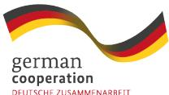

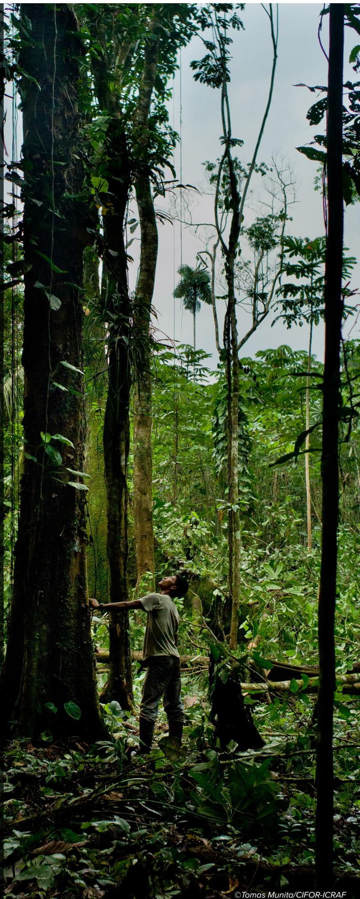